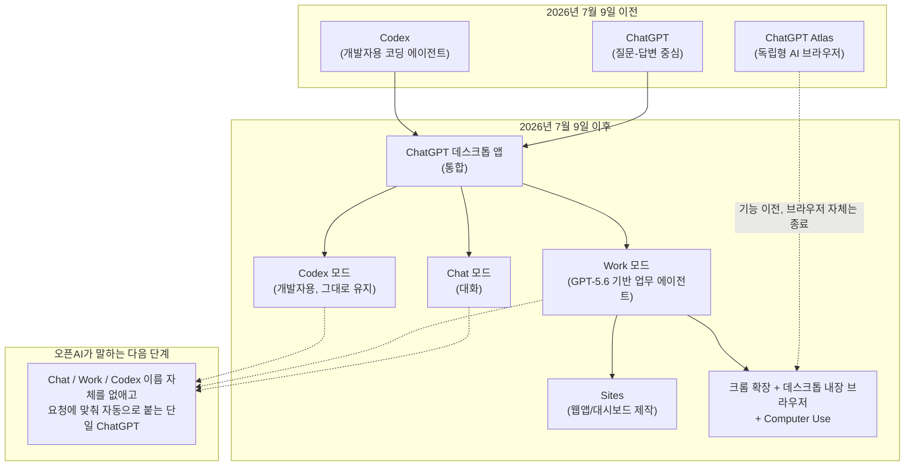
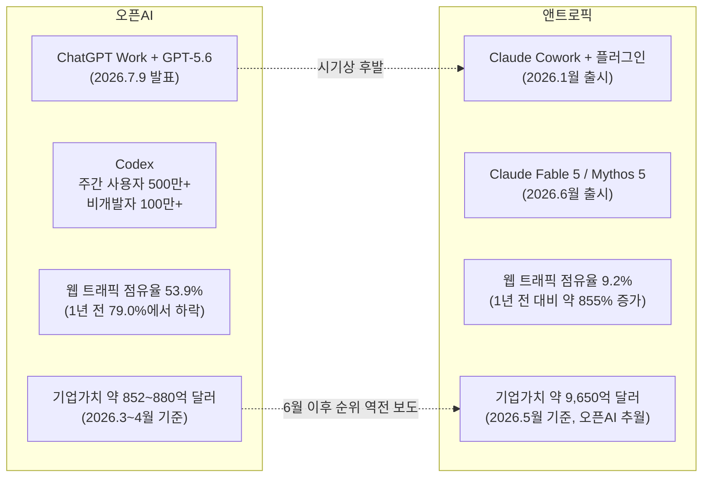
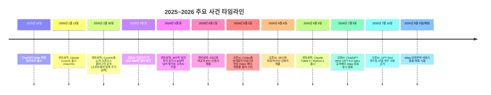

- **작성 기준일: 2026년 7월 22일** 
- **발표일: 2026년 7월 9일(현지시간)**

> 
> https://www.threads.com/@choi.openai/post/DalmXiGmM94
> 
> 🚨 모든 직장인들은 이제 챗GPT 앱으로 일해야합니다.
> 
> 오픈AI가 챗GPT에서 '답변'과 '작업'을 분리했습니다.
> 
> 코딩 에이전트 Codex를 업무에 쓰던 비개발자 100만 명이 만든 제품, ChatGPT Work가 GPT-5.6과 함께 나왔습니다.
> 
> 발표 내용과 그 아래 구조를 정리했습니다 🧵
> 
> **1/ 오픈AI가 7월 9일(현지시간) ChatGPT Work를 공개했습니다.**
> 
> 질문에 답을 돌려주던 챗GPT가, 앱과 파일을 가로질러 직접 행동하고 몇 시간짜리 프로젝트를 잘게 쪼개 끝까지 완주하는 에이전트를 갖게 된 겁니다.
내부에는 코딩 에이전트 Codex 기술이 들어갔고, 같은 날 공개된 GPT-5.6이 구동합니다.
웹과 모바일은 Pro, Enterprise, Edu 요금제부터 시작해 며칠에 걸쳐 Plus와 Business로 확대되고, 데스크톱 앱에서는 무료 요금제를 포함한 모든 사용자가 Chat, Work, Codex를 쓸 수 있습니다.
> 
> **2/ 오픈AI에 따르면 Codex 주간 사용자는 500만 명이 넘는데, 그중 100만 명 이상이 소프트웨어 개발 밖의 일에 씁니다. 비개발자 증가 속도가 개발자의 3배라는 보도도 있습니다.**
> 
> 마케팅, 재무, 영업 담당자들이 코딩 도구를 업무 에이전트로 전용해 쓰기 시작했고, 회사는 그 사용 패턴을 관찰한 뒤 비개발자용 제품으로 승격시킨 겁니다.
발표문에는 오픈AI 내부의 거의 모든 팀이 Work와 Codex를 쓴다는 문장도 있습니다. 제품보다 사용자가 먼저 움직인 사례입니다.
> 
>> 오픈AI 내부에서 업무용 ChatGPT는 사실상 멈췄습니다.
>> 직원들이 Codex와 ChatGPT를 통틀어 뽑아내는 결과물 토큰의 99.8%가 이제 Codex에서 나옵니다.
>> 코드 한 줄 안 짜던 법무·재무·리크루팅 부서까지 코딩 도구를 주력 AI로 쓰고 있고, 이건 도구를 갈아탄 이야기가 아니라 AI를 쓰는 '단위'가 질문에서 위임으로 넘어간 첫 대규모 증거입니다.
> 
> **3/ 모델 쪽을 보면 GPT-5.6은 Sol, Terra, Luna 세 티어로 나옵니다.**
> 
> 숫자는 세대를, 이름은 세대와 무관하게 이어지는 능력 등급을 가리키는 새 명명 체계입니다. API 가격은 100만 토큰 기준 Sol이 입력 5달러에 출력 30달러, Luna는 입력 1달러에 출력 6달러입니다.
> 훈련의 방점은 업무 산출물에 있습니다. 슬라이드 마스터에 박힌 규칙까지 읽어서 회사 템플릿 그대로 새 자료를 만들어내는 능력을 전작보다 크게 끌어올렸다고 밝혔는데요.
> 55개 직군의 장기 업무 수행을 재는 Agents' Last Exam에서 최고 기록을 세웠다는 주장까지, 벤치마크 선택 자체가 시험 문제가 아니라 직업 노동을 겨냥하고 있습니다.
> 
> **4/ Artificial Analysis 인텔리전스 인덱스는 Claude Fable 5가 59.9로 Sol의 58.9보다 위고, SWE-Bench Pro는 Claude Mythos 5가 80.3%로 Sol의 64.6%를 크게 웃돕니다.**
> 
> 오픈AI 주장의 축은 절대 점수보다 '비슷한 결과를 61% 짧은 시간에, 절반 안팎의 비용으로'입니다.
> 자랑하는 지표가 지능에서 토큰당 완료된 일로 옮겨갔다는 것 자체가, 프런티어 경쟁의 단위가 바뀌고 있다는 신호라고 봅니다.
> 
> **5/ 그 효율을 만드는 메커니즘도 두 개 공개됐습니다.**
> 
> 하나는 Programmatic Tool Calling입니다. 도구 호출 결과를 매번 모델로 되돌리는 대신, 모델이 짧은 프로그램을 짜서 도구들을 조율하고 중간 결과를 걸러 필요한 것만 남기는 방식입니다. 법률 소프트웨어 회사 Clio는 이 방식으로 문서 분석 프롬프트 토큰이 38% 줄었다고 밝혔습니다.
> 다른 하나는 ultra 설정인데, 기본 4개의 에이전트를 병렬로 돌려 비용을 더 쓰는 대신 어려운 작업의 품질과 속도를 올립니다.
> 토큰을 아끼는 길과 토큰을 쏟아붓는 길을 다이얼 하나로 고르게 만든 셈입니다.
> 
> **6/ 제품 구성의 주제는 통합입니다.**
> 
> Codex 앱이 새 ChatGPT 데스크톱 앱으로 흡수되고, 기존 데스크톱 앱은 ChatGPT Classic으로 이름이 바뀝니다. 흩어져 있던 앱 연동은 플러그인이라는 단일 디렉토리로 묶였습니다.
> 과금이 특히 눈에 띄는데요. Work는 일반 채팅과 달리 Codex와 같은 사용량 기반 구조를 따릅니다. 기업 관리자는 콘솔에서 팀별, 개인별 지출 한도를 정하고 추가 크레딧 요청을 승인합니다.
> 에이전트 노동이 좌석 수가 아니라 사용량으로 계량되고, 그걸 예산처럼 관리하는 도구까지 갖춰서 나온 겁니다.
> 
> **7/ 제가 가장 눈여겨본 대목은 브라우저입니다.**
> 
> 오픈AI는 작년에 내놓은 독립 브라우저 Atlas를 단계적으로 종료한다고 밝혔습니다. 거기서 배운 것을 데스크톱 앱 내장 브라우저와 크롬 사이드바 확장으로 옮깁니다.
데스크톱에서는 Computer Use로 로컬 앱을 직접 클릭하고 타이핑하는 작업까지 지원합니다.
> 사람이 머무는 목적지로서의 브라우저를 접고, 에이전트가 웹 작업을 수행할 때 쓰는 내부 도구로 재배치한 결정입니다. AI 기업들이 앞다퉈 뛰어들던 브라우저 경쟁의 방향 수정이 시작됐다고 봅니다.
> 
> **8/ Sites는 공개 베타로 풀렸습니다.**
> 
> 업무 자료나 아이디어에서 인터랙티브 웹앱과 대시보드를 만들어 URL로 공유하고, 원본 정보가 바뀌면 갱신까지 맡기는 기능입니다. 만든 사이트는 챗GPT 안에서 바로 테스트할 수 있고, 호스팅은 오픈AI가 처리합니다.
> 오픈AI 측 설명으로는 내부 재무팀이 이미 슬라이드 대신 실시간 매출 대시보드로 회의를 한다고 합니다.
> 발표 자료라는 매체를 정적인 문서에서 스스로 갱신되는 소프트웨어로 바꾸겠다는 방향인데, 문서 협업 도구들이 지켜온 자리와 정면으로 겹칩니다.
> 
> **9/ 경쟁 구도에서 보면 이번 발표는 후발 대응이기도 합니다.**
> 
> Anthropic은 몇 달 앞서 에이전트 제품 Claude Cowork를 내놓고 법무, 영업, 데이터 분석용 플러그인을 확장해 왔습니다. 7월 초에는 앤트로픽 기업가치가 오픈AI를 넘어섰다는 보도와 양사가 나란히 IPO를 비공개 신청했다는 보도까지 나왔습니다.
> 반면 웹 트래픽 점유율은 챗GPT가 53.9%로 Claude의 9.2%를 크게 앞선다는 집계가 있습니다.
> 'Codex에 이미 있던 기능 아니냐'는 커뮤니티 반응은 사실에 가깝습니다. 이번 발표의 무게는 새 기능보다 유통에 있습니다. 이미 있던 능력을 수억 명의 기본 화면 위에 올려놓는 작업이죠.
> 
> **10/ 오픈AI는 Chat, Work, Codex라는 이름을 결국 없애고, 모델이 요청을 보고 알아서 맞는 에이전트를 붙이는 단일 챗GPT로 가겠다고 말합니다.**
> 
> 남는 변수는 두 가지라고 봅니다. 하나는 신뢰입니다. 연결된 도구에서 민감 정보가 새어 나가는 것을 막는 auto-review가 레드팀 공격을 100% 차단했다고 하지만, 자사 테스트 기준의 수치입니다.
> 다른 하나는 사용량 경제입니다. 에이전트가 일을 대신할수록 청구서도 사용량을 따라 늘어납니다.
> 질문에 답하는 AI의 승자는 정해진 듯 보였습니다. 일을 대신하는 AI의 기본 작업 화면을 누가 쥐게 될지는, 이번 주부터가 시작입니다.
> 

---

## 이 문서를 읽기 전에

2026년 7월 9일, 오픈AI는 하나의 라이브스트림에서 여러 발표를 한꺼번에 쏟아냈습니다. 새 에이전트 제품 ChatGPT Work, 새 모델군 GPT-5.6(Sol·Terra·Luna), 통합된 데스크톱 앱, 웹사이트 제작 기능 Sites, 그리고 독립 브라우저 Atlas의 단계적 종료까지, 모두 같은 날 하나의 발표문 안에 담겨 있었습니다.

이 문서는 그 발표의 내용을 원문 발표 자료와 여러 언론사의 보도, 그리고 제3의 평가 기관인 Artificial Analysis의 벤치마크 자료를 대조해 정리한 것입니다. 추측성 서술은 배제했고, 수치나 주장이 나온 곳이 오픈AI 자신인지, 독립적인 평가 기관인지, 아니면 아직 검증되지 않은 추정치인지를 구분해서 표기했습니다. 마지막 장의 "팩트체크 부록"에서 이 구분을 다시 한 번 표로 정리해 두었으니, 특정 수치의 출처가 궁금하면 그 부분을 참고하시기 바랍니다.

---

## 1. 무엇이 발표되었나 — 큰 그림 먼저

오픈AI의 이번 발표는 하나의 새 모델을 내놓은 것이 아니라, 챗GPT라는 제품 자체의 구조를 다시 짠 사건에 가깝습니다. 지금까지 챗GPT는 "질문을 하면 답이 돌아오는" 도구였습니다. 이번 발표로 챗GPT 안에는 "목표를 던지면 몇 시간에 걸쳐 알아서 끝까지 해내는" 에이전트가 정식으로 자리를 잡았습니다.

핵심 발표 항목을 하나씩 나열하면 다음과 같습니다.

- **ChatGPT Work**: 앱과 파일을 가로질러 정보를 모으고, 시트·슬라이드·문서·웹앱 같은 완성된 결과물을 만들어내며, 복잡한 프로젝트를 잘게 쪼개 몇 시간 동안 스스로 진행하는 에이전트입니다.
- **GPT-5.6**: Sol(플래그십)·Terra(균형형)·Luna(경량형) 세 가지 등급으로 나온 새 모델군으로, ChatGPT Work의 두뇌 역할을 합니다.
- **새 데스크톱 앱**: 기존 Codex 앱이 확장되어 새로운 통합 ChatGPT 데스크톱 앱이 되었고, 예전 데스크톱 앱은 "ChatGPT Classic"이라는 이름으로 남습니다.
- **Sites**: 업무 자료나 아이디어를 대화형 웹사이트나 가벼운 웹앱으로 바꿔 URL로 공유하는 기능으로, 공개 베타로 출시되었습니다.
- **Atlas 브라우저 단계적 종료**: 2025년 10월에 나온 독립형 AI 브라우저 Atlas를 접고, 그 기능을 크롬 확장 프로그램과 데스크톱 앱 안의 브라우저로 옮깁니다.
- **Computer Use**: 데스크톱 앱 안에서 로컬 앱을 직접 클릭하고 입력하는 등 사용자의 컴퓨터를 대신 조작하는 기능입니다.

아래는 이번 발표로 챗GPT의 제품 구조가 어떻게 재편되었는지를 정리한 흐름도입니다.

오픈AI는 궁극적으로 Chat, Work, Codex라는 이름 구분 자체를 없애고, 모델이 요청 내용을 보고 알맞은 방식으로 알아서 응답하는 단일 챗GPT로 가겠다는 방향을 밝혔습니다. 지금은 과도기이기 때문에 세 가지 이름이 나란히 존재하는 상태입니다.

---

## 2. ChatGPT Work란 무엇인가

### 2.1 정의와 작동 방식

ChatGPT Work는 오픈AI의 공식 발표문에서 "챗GPT 안에서 더 야심찬 작업을 맡아주는 에이전트"로 소개되었습니다. 구체적으로는 다음과 같은 일을 합니다.

- 연결된 앱과 워크플로우를 가로질러 정보를 수집합니다.
- 시트, 슬라이드, 문서, 웹앱 같은 완성된 결과물을 만들어냅니다.
- 복잡한 프로젝트를 작은 단계로 쪼갠 뒤, 몇 시간에 걸쳐 사람의 개입 없이 스스로 진행합니다.

ChatGPT Work는 원래 개발자를 위한 코딩 에이전트였던 Codex의 기술을 기반으로 만들어졌습니다. 오픈AI에 따르면 Codex의 주간 사용자는 500만 명을 넘어섰고, 그중 100만 명 이상이 소프트웨어 개발이 아닌 다른 업무에 이 도구를 쓰고 있습니다. 비개발자 사용자는 개발자보다 세 배 빠른 속도로 늘어나는 것으로 나타났습니다. 다시 말해, 오픈AI가 먼저 "비개발자용 업무 에이전트"라는 아이디어를 낸 것이 아니라, 마케팅·재무·영업 담당자들이 코딩 도구를 자기 업무에 전용해서 쓰기 시작한 실사용 패턴을 관찰한 뒤, 그 쓰임새를 정식 제품으로 승격시킨 셈입니다.

실제로 오픈AI가 나중에 공개한 별도 보고서에 따르면, 오픈AI 사내에서도 법무팀의 6월 토큰 사용량이 지난해 11월 대비 13배로 늘어나는 등, 회사 내부의 거의 모든 부서가 Work와 Codex를 주요 업무 도구로 쓰고 있다고 밝혔습니다. 다만 이 수치는 오픈AI가 스스로 집계해 공개한 것이라는 점은 짚어둘 필요가 있습니다.

### 2.2 실제 활용 예시

오픈AI가 공개한 활용 사례들을 보면 ChatGPT Work의 성격이 더 분명해집니다. 예를 들어 계정 관리 회의를 20분 앞둔 상황에서, 담당자가 "우리 데이터룸과 관련 슬랙 채널을 검토해서 계정 이력과 최신 피드백을 파악한 뒤, 기존 발표 자료 템플릿을 그대로 써서 예측 매출 차트와 핵심 고객 메모 요약이 담긴 경영진용 슬라이드 한 장을 새로 만들어 달라"고 요청하면, ChatGPT Work는 실제로 데이터룸과 슬랙 대화를 검토한 뒤 기존 발표 자료의 8번째 슬라이드로 새 페이지를 끼워 넣는 식으로 작업을 완료합니다.

또 다른 예시로는, 특정 거래처와의 모든 소통 이력(활성 프로젝트, 메모, 기타 정보 등)을 정리해 기존에 쓰던 것과 똑같은 형식·색상·상태 표시 방식을 그대로 따르는 새 구글시트를 만들어 달라고 요청하면, ChatGPT Work가 관련 슬랙 채널의 내용을 모두 훑어 프로그램·행동 항목·일정·이해관계자 명단까지 포함한 종합 관리 시트를 만들어내는 사례도 소개되었습니다. 이 시트는 이후 대화형으로 계속 조정할 수 있는데, "이 작업을 기능 파이프라인이 끝나는 다음 월요일로 옮기고 기간은 유지한 채 일정표를 갱신해줘" 같은 자연어 지시로 세부 조정이 가능합니다.

이런 예시들이 공통적으로 보여주는 것은, ChatGPT Work가 한 번의 질문-답변으로 끝나는 게 아니라 여러 데이터 소스(문서, 대화 기록, 클라우드 문서 등)를 스스로 넘나들며 앞뒤 맥락을 파악하고, 기존 양식·스타일을 그대로 유지한 결과물을 내놓는다는 점입니다.

### 2.3 예약 작업(Scheduled Tasks)

ChatGPT Work에는 반복 업무를 자동으로 처리하는 예약 기능도 포함되어 있습니다. 사용자가 한 번만 실행할 작업을 요청할 수도 있고, 특정 주기(매주 금요일, 매주 월요일 등)나 이벤트가 발생할 때마다 반복하도록 설정할 수도 있습니다.

공개된 예시로는 다음과 같은 것들이 있습니다.

- **매주 업무 검토**: 매주 금요일마다 KPI 대시보드와 보고서를 새로 고치고, 무엇이 달라졌는지 설명하며, 다음 주에 경영진이 내려야 할 결정을 추천하는 작업.
- **고객 미팅 준비**: 고객과의 미팅이 있을 때마다 CRM, 최근 통화 기록, 이메일, 미해결 이슈를 검토해 목표와 대화 요점, 위험 요소, 다음 단계를 준비하는 작업.
- **캠페인 최적화**: 매주 월요일마다 캠페인 성과를 검토하고, 성과가 바뀌는 지점을 찾아내 지출·소재·타겟팅 변경을 추천하는 작업.

이런 예약 작업은 사람이 매번 새로 요청하지 않아도, 정해진 시점마다 알아서 점검하고 결과를 보고하도록 설계되어 있습니다.

### 2.4 이용 가능 범위와 요금제

ChatGPT Work는 2026년 7월 9일부터 웹과 모바일에서 Pro, Enterprise, Edu 요금제 사용자에게 먼저 제공되기 시작했고, 며칠에 걸쳐 Plus와 Business 요금제로 확대되었습니다. 데스크톱 앱에서는 무료 요금제 사용자를 포함한 모든 사용자가 Chat, Work, Codex 세 가지 모드를 이용할 수 있습니다.

---

## 3. GPT-5.6: Sol·Terra·Luna 삼중 모델 체계

### 3.1 새로운 이름 체계의 의미

GPT-5.6부터 오픈AI는 모델 이름을 짓는 방식을 바꿨습니다. 오픈AI의 설명에 따르면, 숫자(5.6)는 모델의 "세대"를 나타내고, Sol·Terra·Luna라는 이름은 세대와 무관하게 이어지는 "능력 등급"을 가리킵니다. 즉 다음 세대인 GPT-5.7이 나오더라도 Sol·Terra·Luna라는 등급 구분 자체는 유지될 가능성이 높다는 뜻입니다. 오픈AI는 이 체계를 통해 사람들과 개발자들에게 지능·속도·비용에 걸친 더 명확한 선택지를 주고자 한다고 밝혔습니다.

세 모델의 성격을 요약하면 다음과 같습니다.

| 모델 | 성격 | API 가격(100만 토큰당, 입력/출력) | 캐시 입력 가격 |
|---|---|---|---|
| **Sol** | 가장 야심찬 에이전트 작업을 위한 플래그십 모델 | $5.00 / $30.00 | $0.50 |
| **Terra** | 효율적인 일상 업무를 위한 균형형 모델 | $2.50 / $15.00 | $0.25 |
| **Luna** | 대량 처리를 위한 빠르고 저렴한 모델 | $1.00 / $6.00 | $0.10 |

ChatGPT 안에서는 무료·Go 요금제 사용자는 Terra를 이용하고, Plus·Pro·Business·Enterprise 사용자는 Sol·Terra·Luna 중에서 고를 수 있으며 각각에 대해 추론 노력 수준(effort level)도 설정할 수 있습니다. 더 오래 생각하게 만드는 `max` 설정은 Work와 Codex에서 GPT-5.6에 접근 가능한 모든 사용자가 켤 수 있고, 네 개의 에이전트를 기본으로 병렬 실행하는 `ultra` 설정은 ChatGPT Work에서는 Pro와 Enterprise 사용자에게, Codex에서는 Plus 이상 요금제 사용자에게 제공됩니다.

### 3.2 "토큰당 완료된 일"이라는 새로운 기준

이번 발표에서 눈에 띄는 대목은, 오픈AI가 절대적인 지능 점수보다 "비용 대비 성과"를 강조했다는 점입니다. 오픈AI는 GPT-5.6을 훈련하면서 "토큰 하나하나에서 더 쓸모 있는 결과를 뽑아내는 것"을 목표로 삼았다고 설명했습니다. 그 결과로 같은 비용으로 더 많은 성공적인 작업을 하거나, 비슷한 결과를 더 낮은 총비용으로 얻을 수 있게 되었다는 것이 오픈AI 측 주장입니다.

독립 평가 기관인 Artificial Analysis도 이 관점을 일부 뒷받침하는 결과를 내놓았습니다. Artificial Analysis의 자체 평가에 따르면, 최대 추론 설정의 Sol은 Artificial Analysis Intelligence Index에서 58.9~59점을 기록해 앤트로픽의 Claude Fable 5(59.9~60점)에 근소하게 못 미치는 수준이었지만, 작업당 비용은 Claude Fable 5의 약 3분의 1 수준이었습니다. 다만 이 "3분의 1" 비교는 절대적인 토큰 단가 차이보다는, Sol이 같은 작업을 처리할 때 실제로 더 적은 출력 토큰을 쓰는 경향이 반영된 결과라는 점도 함께 밝혀졌습니다.

### 3.3 Sol과 Claude Fable 5 / Mythos 5의 벤치마크 비교

이번 발표에서 오픈AI 스스로 언급한 비교 대상은 앤트로픽의 최신 모델인 Claude Fable 5와 Claude Mythos 5였습니다. (참고로 Fable 5와 Mythos 5는 앤트로픽에 따르면 근본적으로 같은 모델을 공유하며, Fable 5 쪽에 생물학·사이버보안·LLM 연구개발 관련 추가 안전장치가 적용되어 있는 관계입니다.)

benchmark별로 우열이 엇갈리는 결과가 나왔기 때문에, 아래 표에 항목별로 정리했습니다.

| 벤치마크 | GPT-5.6 Sol | Claude Fable 5 / Mythos 5 | 우위 | 비고 |
|---|---|---|---|---|
| Artificial Analysis Intelligence Index (max) | 58.9~59점 | 59.9~60점 (Fable 5) | Fable 5가 근소 우위 | 사실상 통계적 동률에 가까움 |
| Artificial Analysis Coding Agent Index | 80점 | 77점 (Fable 5) | Sol 우위 | 코딩 에이전트 실행 능력 중심 지표 |
| SWE-bench Pro (실제 깃허브 이슈 해결) | 64.6% | 80.0~80.3% (Mythos 5 / Fable 5) | Claude 쪽이 15포인트 이상 앞섬 | 저장소 단위 실전 소프트웨어 엔지니어링 평가 |
| Terminal-Bench 2.1 | 88.8%(단일 에이전트)/91.9%(ultra, 4개 병렬) | 약 86.0% | Sol 우위 | 터미널 자율 조작 평가 |
| Agents' Last Exam (55개 직군 장기 업무) | 52.7~53.6% | 40.5%(Fable 5, adaptive reasoning) | Sol이 약 13.1포인트 앞섬 | 장기 전문직 워크플로우 평가, 오픈AI 자체 집계 |

이 표에서 알 수 있듯, "누가 더 뛰어난 모델인가"라는 단순한 질문에는 답하기 어렵습니다. 저장소 단위의 실전 소프트웨어 엔지니어링(SWE-bench Pro)에서는 Claude 쪽이 뚜렷하게 앞서고, 터미널 기반 에이전트 작업과 코딩 에이전트 인덱스에서는 Sol이 앞섭니다. 종합 지능 지표에서는 사실상 동률입니다. 여러 비교 매체들은 이를 "한쪽이 싹쓸이하는 구도가 아니라, 벤치마크 종류에 따라 우열이 갈리는 구도"라고 정리하고 있습니다.

한 가지 주의할 점은, 오픈AI가 발표에서 강조한 "Agents' Last Exam 13.1포인트 우위"는 오픈AI가 직접 집계하고 공개한 수치라는 점입니다. 반면 SWE-bench Pro나 Artificial Analysis Intelligence Index는 제3자 평가 기관이 독립적으로 측정한 결과입니다. 이 구분은 아래 팩트체크 부록에서 다시 한 번 짚겠습니다.

### 3.4 안전성과 접근 제한

GPT-5.6은 사이버보안 능력이 강화된 모델로도 소개되었습니다. 실시간 점검, 모니터링, 위험도와 신뢰도에 따라 차등화된 접근 제한 등 여러 겹의 안전장치가 적용되어 있으며, 코드 리뷰나 위협 모델링 같은 작업에 특히 적합한 것으로 설명되었습니다. 실제로 GPT-5.6은 한 사이버보안 공격 대응 능력 평가(ExploitBench)에서 73.5%를 기록해, 직전 모델인 GPT-5.5의 47.9%보다 크게 상승한 수치를 보였습니다.

---

## 4. 효율을 만드는 두 가지 메커니즘

오픈AI는 GPT-5.6이 어떻게 더 적은 토큰으로 더 많은 일을 해내는지를 설명하면서, 두 가지 구체적인 기술적 장치를 공개했습니다.

### 4.1 Programmatic Tool Calling (프로그램형 도구 호출)

기존의 "도구 호출(tool calling)" 방식은 이런 식으로 작동했습니다. 모델이 도구 하나를 호출하고, 애플리케이션이 그 도구를 실행하고, 결과를 다시 모델에게 돌려주고, 모델이 다음 도구를 호출하는 과정을 반복합니다. 도구가 네 개면 네 번, 마흔 개면 마흔 번의 왕복이 필요한 구조입니다. 이런 왕복 하나하나가 지연 시간과 다시 청구되는 컨텍스트 비용을 더합니다.

Programmatic Tool Calling은 이 구조를 바꿉니다. 모델이 도구 호출을 하나씩 요청하는 대신, 여러 도구 호출을 스스로 조율하는 짧은 프로그램(자바스크립트)을 작성해서 실행합니다. 이 코드는 네트워크 접근이 차단된 격리된 실행 환경(V8 런타임)에서 돌아가며, 외부 세계와 연결되는 유일한 통로는 미리 정의된 도구뿐이므로 보안 경계 자체는 바뀌지 않습니다. 이 방식은 반복문과 조건문을 써서 도구를 병렬로 호출하고, 방대한 중간 결과 중 필요한 부분만 걸러내고, 진행 상황을 스스로 점검하며 다음 행동을 정할 수 있습니다.

오픈AI가 공개한 실제 고객 사례에 따르면, 법률 소프트웨어 회사 Clio는 여러 단계로 이뤄진 문서 분석 작업에 이 방식을 도입한 뒤 품질 저하 없이 프롬프트 토큰 사용량을 38% 줄였습니다. 다만 이런 절감 효과는 단순히 모델 이름만 바꾼다고 저절로 생기는 것이 아니라, Programmatic Tool Calling에 맞춰 워크플로우 자체를 다시 설계했을 때 나온 결과라는 점도 함께 밝혀졌습니다.

### 4.2 ultra 설정 — 다중 에이전트 병렬 처리

`ultra`는 기본적으로 네 개의 에이전트를 병렬로 실행해 비용을 더 쓰는 대신, 어려운 작업의 품질과 속도를 끌어올리는 설정입니다. 예를 들어 Terminal-Bench 2.1에서 단일 에이전트로는 88.8%였던 점수가, ultra로 네 개 에이전트를 병렬 실행했을 때는 91.9%까지 올라갔습니다. 이는 같은 모델이라도 얼마나 많은 연산 자원을 투입하느냐에 따라 결과물의 질이 달라질 수 있다는 것을 보여주는 예시입니다.

정리하면, Programmatic Tool Calling은 "토큰을 아끼는 길"이고 ultra는 "토큰을 더 쓰는 대신 품질을 높이는 길"입니다. 사용자는 작업의 성격에 따라 이 두 방향 중 하나를 다이얼처럼 선택할 수 있게 된 셈입니다.

---

## 5. 브라우저 전략의 방향 전환: Atlas의 단계적 종료

### 5.1 무슨 일이 있었나

오픈AI는 2025년 10월, "브라우저와 채팅할 수 있다면 어떨까"라는 질문을 내걸고 독립형 AI 브라우저 Atlas를 출시했습니다. 그런데 이번 발표에서 오픈AI는 이 독립 브라우저를 단계적으로 종료하겠다고 밝혔습니다. 여러 매체의 취재에 따르면 목표 종료 시점은 2026년 8월 9일로, 발표 시점 기준 약 한 달의 전환 기간이 주어졌습니다. 다만 오픈AI가 이 정확한 날짜를 공식 발표문에 명시했는지는 매체마다 조금씩 다르게 보도되었고, 일부 매체는 오픈AI 내부 관계자의 발언을 인용해 이 날짜를 전했습니다.

Atlas가 배웠던 것들, 즉 AI가 웹페이지를 보고 이해하고 대신 조작하는 기능은 사라지는 것이 아니라 다음 세 곳으로 흩어져 재배치됩니다.

1. **크롬 확장 프로그램**: 챗GPT를 크롬의 사이드바에서 바로 쓸 수 있게 하는 확장 프로그램으로, 지금 보고 있는 페이지의 맥락을 읽어 질문에 답하거나 요약하거나 더 긴 작업을 시작할 수 있습니다. 구글의 Gemini 사이드 패널과 직접 경쟁하는 성격의 기능입니다.
2. **데스크톱 앱 내장 브라우저**: 데스크톱 앱 안에서 웹사이트를 열고, 계정에 로그인하고, 파일을 내려받고, 페이지와 상호작용하는 등 챗GPT를 벗어나지 않고도 웹 작업을 처리할 수 있게 하는 기능입니다.
3. **클라우드 브라우저 + Computer Use**: 오픈AI의 서버에서 원격으로 실행되는 별도의 브라우저 환경으로, 에이전트가 사용자를 대신해 웹 기반 작업을 완료할 자리를 제공합니다. Computer Use는 여기서 한 걸음 더 나아가, 데스크톱의 로컬 앱까지 직접 클릭하고 입력하며 파일을 옮기는 작업을 지원합니다. 한 번만 실행하는 작업뿐 아니라 반복 작업으로도 설정할 수 있습니다.

### 5.2 왜 이런 결정을 내렸나

여러 매체는 이번 결정의 배경으로 오픈AI의 애플리케이션 부문 최고경영자였던 피지 시모(Fidji Simo)가 팀에게 "곁가지 프로젝트(side quests)"를 줄이라고 지시했다는 점을 공통적으로 언급했습니다. 이 지시는 앞서 오픈AI가 영상 생성 도구 소라(Sora)를 정리한 결정으로 이어진 바 있고, 이번 Atlas 종료도 같은 맥락에서 나온 것으로 보도되었습니다.

지난 한 해 동안 AI 업계에서는 크롬의 자리를 빼앗기 위한 "브라우저 전쟁"이 치열했습니다. 퍼플렉시티는 Comet을, 브라우저 컴퍼니는 Dia를 내놓았고, 구글과 마이크로소프트도 각각 크롬과 엣지에 AI 기능을 강화해왔습니다. 오픈AI는 몇 달간의 실험 끝에 "브라우저는 목적지가 아니라 하나의 기능"이라는 결론에 다다른 것으로 보입니다. 즉, 사람들에게 북마크·비밀번호·방문 기록·확장 프로그램·업무 계정·일상적인 습관까지 통째로 새 브라우저로 옮겨오라고 설득하는 일이, 생각보다 훨씬 어려운 과제였다는 뜻입니다.

이 결정을 두고 TechCrunch 등 일부 매체는 "독립 브라우저라는 제품은 사라지지만, AI가 브라우저를 보고 조작해야 한다는 아이디어 자체는 후퇴한 것이 아니라 오픈AI의 더 넓은 애플리케이션 계층 안으로 흡수되고 있다"고 짚었습니다.

---

## 6. Sites: 발표 자료가 살아있는 소프트웨어가 되다

### 6.1 무엇을 할 수 있나

Sites는 업무 자료나 아이디어를 바탕으로 대화형 웹사이트나 가벼운 웹앱을 만들어, URL로 팀 내부나 외부에 공유하는 기능입니다. 2026년 7월 9일 공개 베타로 출시되었으며, ChatGPT Work 웹 버전이나 데스크톱 앱의 Work 또는 Codex 모드에서 사용할 수 있습니다.

만들 수 있는 대상으로 오픈AI가 예시로 든 것은 실시간 대시보드, 프로젝트 트래커, 발행 일정표(launch calendar), 프로토타입, 내부 포털, 대화형 보고서 등입니다. 사용자가 원하는 내용을 대화로 설명하고 파일·데이터·링크·제약 조건을 추가하면, 챗GPT가 코드를 생성해 미리보기를 보여주고, 사용자가 다듬은 뒤 게시하면 실제로 접속 가능한 URL이 만들어지는 방식입니다.

특히 주목할 점은, 이렇게 만들어진 사이트가 원본 정보가 바뀌면 자동으로 갱신될 수 있다는 것입니다. 오픈AI 측 설명으로는 사내 재무팀이 이미 정적인 슬라이드 대신 실시간 매출 대시보드를 놓고 회의를 진행하고 있다고 합니다. 이는 발표 자료라는 매체 자체를, 한 번 만들면 끝나는 정적인 문서에서 계속 스스로 갱신되는 소프트웨어로 바꾸겠다는 방향성을 보여줍니다.

### 6.2 이용 범위와 제한 사항

Sites는 Pro, Pro Lite, Enterprise, Edu 요금제에 먼저 제공되었고, Plus와 Business 요금제로 순차 확대되었습니다. 무료와 Go 요금제에서는 이용할 수 없습니다. 유럽경제지역(EEA), 스위스, 영국에서는 출시 시점 기준으로 제공되지 않습니다.

Enterprise 워크스페이스에서는 공개 게시 기능이 기본적으로 꺼져 있으며, 관리자가 워크스페이스 설정에서 직접 켜야 합니다. Business 워크스페이스에서는 기본적으로 켜져 있습니다. 결제 카드 정보 처리나 금융 거래를 가능하게 하는 용도로는 Sites를 쓸 수 없다는 것이 오픈AI의 이용 약관에 명시되어 있습니다.

Sites로 만든 결과물은 서버나 데이터베이스 없이 브라우저에서 완결되는 방식으로 작동하기 때문에, API 키가 필요한 비공개 외부 API를 안전하게 호출할 수는 없고, 복잡한 상태 관리가 필요한 다중 페이지 애플리케이션에는 한계가 있습니다. 이런 점에서 Sites는 완전한 자체 개발 플랫폼이라기보다는, 팀 내부에서 이미 챗GPT 요금제를 쓰고 있는 상황에서 별도 설정 없이 곧바로 쓸 수 있는 경량 도구 및 프로토타입 제작 용도로 자리매김하고 있습니다.

---

## 7. 통합 방향의 또 다른 축: 플러그인과 과금 구조

### 7.1 플러그인 디렉터리로의 통합

이전까지 흩어져 있던 앱 연동 기능들은 이번 발표를 계기로 "플러그인"이라는 단일 디렉터리로 통합되었습니다. Google Drive, Outlook Email, Gmail, Teams, Slack, SharePoint, Salesforce, Adobe, Zoom, LinkedIn, Google Calendar, GitHub, Canva, Dropbox 등 다양한 업무 도구가 이 플러그인 디렉터리 안에 나열되어, 사용자가 필요에 따라 연결해 쓸 수 있는 구조입니다.

여기에 더해, 영업(Sales)·데이터 분석(Data Analytics)·제품 디자인(Product Design)·크리에이티브 제작(Creative Production)·투자은행(Investment Banking)·주식 투자(Public Equity Investing) 등 역할별로 특화된 플러그인도 함께 제공되어, 각 직군에 맞는 스킬·통합·시작 프롬프트·워크플로우 안내를 한 번에 묶어 제공합니다. 이와 별도로 Databricks, Salesforce, Hex, Clay 등을 포함한 66개의 단일 앱 플러그인도 함께 추가되었습니다.

### 7.2 좌석 수가 아니라 사용량으로 과금하는 구조

ChatGPT Work의 과금 방식에서 가장 눈에 띄는 특징은, 이 기능이 일반 챗GPT 채팅과 달리 Codex와 같은 "사용량 기반" 구조를 따른다는 점입니다. 정리하면 다음과 같습니다.

- Business 요금제는 월 사용자당 20달러(연간 결제 기준) 또는 25달러(월 결제 기준)이며, 최소 2개 좌석부터 시작합니다. 이 요금제 안에 ChatGPT Work를 포함한 일정량의 "포함 사용량(included usage)"이 들어 있습니다.
- 포함된 사용량을 넘어서면, 추가 사용량은 워크스페이스가 공유하거나 구매한 크레딧에서 차감됩니다. 이 크레딧은 ChatGPT Work, ChatGPT Workspace Agents, ChatGPT for Excel, ChatGPT for PowerPoint 등이 같은 사용량 풀을 공유하는 구조입니다.
- 기업 관리자는 관리자 콘솔에서 팀별·개인별 지출 한도(spend controls)를 설정하고, 한도를 넘는 추가 크레딧 요청을 승인하거나 거부할 수 있습니다. 2026년 6월 발표된 전사 관리자 콘솔(Global Admin Console)은 ChatGPT와 Codex의 크레딧 사용량을 하나의 화면에서 볼 수 있게 해줍니다.

이는 에이전트가 사람을 대신해 일을 하면 할수록, 청구서도 그 사용량을 따라 함께 늘어나는 구조라는 뜻입니다. 이전까지 소프트웨어 요금이 "몇 명이 쓰느냐(좌석 수)"로 매겨졌다면, 이제는 "에이전트가 얼마나 일을 했느냐(사용량)"로 매겨지는 방향으로 바뀌고 있는 셈입니다. 이 변화는 기업 입장에서 예산을 짜는 방식 자체를 바꿔야 한다는 뜻이기도 합니다.

---

## 8. 경쟁 구도: 앤트로픽과의 대치선

### 8.1 시기적 배경 — 후발 대응이라는 시각

여러 분석은 이번 오픈AI의 발표를, 앤트로픽이 몇 달 앞서 내놓은 흐름에 대한 대응으로 해석합니다. 앤트로픽은 2026년 1월 12일 "일반 업무를 위한 Claude Code"라는 콘셉트로 에이전트 제품 Claude Cowork를 macOS용으로 출시했고, 같은 달 30일에는 영업·재무·마케팅·법무·데이터 분석 등 업무 영역별로 특화된 11개의 오픈소스 플러그인을 추가로 공개했습니다. 이 플러그인 발표는 법률 정보 서비스 회사들(톰슨로이터, RELX, 볼터스클루버 등)의 주가가 하루 만에 최대 18%까지 떨어지는 등 소프트웨어 업계 전반에 상당한 파장을 일으켰습니다.

이런 관점에서 보면, ChatGPT Work와 GPT-5.6의 발표는 완전히 새로운 개념을 처음 선보인 것이라기보다는, Codex에 이미 존재하던 능력을 수억 명이 쓰는 챗GPT의 기본 화면 위에 얹어 놓은 "유통 전략"에 가깝다는 평가도 있습니다. 실제로 일부 커뮤니티에서는 "Codex에 이미 있던 기능 아니냐"는 반응이 나오기도 했는데, 이는 어느 정도 사실에 부합하는 지적입니다.

### 8.2 기업가치와 IPO 경쟁

2026년 상반기 동안 두 회사의 기업가치와 상장 준비 상황도 급박하게 움직였습니다. 확인된 사실관계를 시간 순으로 정리하면 다음과 같습니다.

- 2026년 3월 말 기준 오픈AI의 사후 가치는 약 852억~880억 달러 수준으로 평가되었습니다.
- 2026년 5월 말, 앤트로픽은 650억 달러 규모의 신규 투자를 유치하며 사후 가치 약 9,650억 달러를 기록했습니다. 이는 앤트로픽의 평가 가치가 처음으로 오픈AI를 넘어선 순간이었습니다.
- 2026년 6월 1일, 앤트로픽은 나스닥 상장을 목표로 미국 증권거래위원회(SEC)에 비공개로 상장 신청서(S-1)를 제출했다고 발표했습니다.
- 2026년 6월 8일, 오픈AI도 비공개로 상장 신청서를 제출했다고 발표했습니다. 이는 앤트로픽의 신청 발표로부터 약 일주일 뒤였습니다.
- 이후 일부 매체는 리테일 대상 비상장 주식 거래 플랫폼(Forge Global)에서 앤트로픽의 시가총액이 한때 1조 달러를 넘어섰다고 보도했으며, 블룸버그는 앤트로픽이 이르면 10월경 골드만삭스·JP모건·모건스탠리 등과 함께 투자자 대상 로드쇼를 준비하고 있다고 전했습니다.

다만 확인해야 할 점은, 이 두 회사 모두 아직 실제 상장 시점이나 공모가를 공식 확정하지 않았다는 것입니다. 비공개 신청은 상장 준비 절차의 일부일 뿐, 실제 상장을 보장하지 않습니다. "곧 상장한다"는 식의 보도는 대부분 "고려 중", "이르면 10월"과 같은 조건부 표현을 쓰고 있으므로, 확정된 사실과 시장의 관측을 구분해서 볼 필요가 있습니다.

### 8.3 웹 트래픽 점유율

기업가치나 매출과는 별개로, 실제 웹사이트 방문 트래픽을 기준으로 보면 챗GPT가 여전히 압도적인 우위를 지키고 있습니다. 시장 조사 업체 Similarweb의 자료(모멘틱 정리 기준, 2026년 5월 집계)에 따르면, 전 세계 7개 주요 AI 챗봇의 웹 방문 점유율은 챗GPT 53.9%, 구글 Gemini 27.9%, 앤트로픽 Claude 9.2%, 딥시크 4.1%, xAI의 Grok 2.4% 순이었습니다.

다만 방향성을 보면 이야기가 조금 달라집니다. 챗GPT의 점유율은 2025년 5월 79.0%에서 1년 사이 53.9%로, 무려 25.1포인트가 떨어졌습니다. 반면 같은 기간 Claude는 웹 방문 건수 기준으로 약 855% 증가했고, Gemini는 약 450% 증가했습니다. 즉 챗GPT가 여전히 1위이긴 하지만, 그 우위의 폭은 지난 1년 사이 상당히 좁혀졌다는 뜻입니다. 여러 분석가들은 이 웹 방문 점유율이라는 지표 자체가 API·앱·내장형 사용을 반영하지 못한다는 한계가 있어, 전체 사용량을 과소평가할 수 있다는 점도 함께 지적하고 있습니다.

아래는 이 대치 구도를 정리한 다이어그램입니다.

---

## 9. 신뢰와 보안: Auto-review와 GPT-Red

### 9.1 Auto-review — 위험한 행동을 미리 걸러내는 검토 장치

에이전트가 사용자의 앱과 파일을 넘나들며 스스로 행동하게 되면, 가장 먼저 떠오르는 우려는 "민감한 정보가 엉뚱한 곳으로 새어 나가지 않을까"라는 것입니다. 오픈AI는 이 문제에 대응하기 위해 Auto-review라는 검토 계층을 두고 있다고 밝혔습니다.

Auto-review는 에이전트가 샌드박스 경계를 넘어서는 행동(예: 외부 네트워크 요청, 연결된 앱이나 MCP 도구에 대한 부작용이 있는 호출 등)을 하려 할 때, 그 행동을 미리 점검하는 별도의 심사 에이전트입니다. 이 심사 에이전트는 개인정보나 비밀번호·인증 정보를 신뢰할 수 없는 곳으로 보내는 행위, 인증 정보나 세션 정보를 캐내려는 시도 등을 차단하도록 설계되어 있습니다. 오픈AI는 적대적인 레드팀 테스트 과정에서, 심사 모델이 훈련 중에 본 적 없는 공격까지 포함해 보호된 데이터를 빼내려는 시도를 100% 차단했다고 밝혔습니다. 다만 이는 오픈AI가 자체적으로 수행한 테스트 결과라는 점에 유의해야 합니다.

### 9.2 GPT-Red — 모델을 공격해서 취약점을 찾는 또 다른 모델

이와는 별개로, 오픈AI는 2026년 7월 중순 GPT-Red라는 내부 전용 자동 레드팀 모델의 세부 내용을 공개했습니다. GPT-Red는 오픈AI 자신의 모델을 공격해 프롬프트 인젝션(악성 지시를 몰래 심는 공격) 취약점을 찾아내는 역할을 합니다. 사람이 하는 레드팀 작업은 시간이 오래 걸리고 규모를 키우기 어렵기 때문에, 이를 자동화하려는 시도입니다.

공개된 평가 결과에 따르면, 프롬프트 인젝션에 대한 벤치마크에서 GPT-Red는 84%의 성공률을 기록한 반면, 사람이 독립적으로 수행한 레드팀 작업은 13%의 성공률에 그쳤습니다. 실제 사례 시험에서는 GPT-Red가 앤든랩스(Andon Labs)가 만든 AI 자판기 에이전트를 공격해, 고가 상품의 가격을 허용된 최저가인 0.50달러로 낮추고, 100달러가 넘는 새 상품을 같은 가격에 주문하고, 다른 고객의 주문을 취소하는 데 성공했습니다. 오픈AI는 이 취약점을 책임감 있게 공개(responsible disclosure)했고, 새로운 안전장치를 시험하고 있다고 밝혔습니다.

또한 GPT-Red는 "가짜 사고 과정(Fake Chain-of-Thought)"이라는 새로운 유형의 직접 프롬프트 인젝션 공격을 발견했는데, 이 공격은 GPT-5.1을 상대로는 95% 이상의 성공률을 보였지만 GPT-5.6 Sol을 상대로는 성공률이 10% 미만으로 떨어졌습니다. 이는 최신 모델이 이전 세대보다 이런 유형의 공격에 훨씬 강해졌다는 것을 보여주는 근거입니다.

이 두 가지(Auto-review와 GPT-Red)는 서로 다른 층위의 안전장치입니다. Auto-review는 실제 서비스에서 에이전트의 위험한 행동을 실시간으로 걸러내는 "운영 단계"의 방어막이고, GPT-Red는 모델 자체의 취약점을 미리 찾아내 고치는 "훈련·검증 단계"의 공격 시뮬레이션입니다.

---

## 10. 앞으로의 변수

오픈AI는 궁극적으로 Chat, Work, Codex라는 이름 구분 자체를 없애고, 사용자의 요청 내용을 보고 모델이 알아서 알맞은 방식으로 응답을 붙여주는 단일 챗GPT로 가겠다고 밝혔습니다. 이 방향이 실현된다면, 사용자는 지금처럼 모드를 직접 선택할 필요 없이 그냥 원하는 것을 말하기만 하면 되는 구조가 될 것으로 보입니다.

이 변화가 자리 잡는 과정에서 지켜볼 만한 변수는 크게 두 가지로 요약할 수 있습니다.

1. **신뢰의 문제**: 에이전트가 여러 앱과 파일에 접근해 스스로 행동하는 범위가 넓어질수록, 민감한 정보가 새어 나가거나 의도치 않은 행동을 할 위험도 함께 커집니다. Auto-review가 자체 테스트에서 100%의 방어율을 기록했다고는 하지만, 이는 오픈AI 내부 기준의 수치이며, 앞서 살펴본 것처럼 실제 프롬프트 인젝션 공격 기법은 계속 진화하고 있습니다.
2. **사용량 기반 경제의 문제**: 에이전트가 사람의 일을 대신할수록 청구서도 사용량을 따라 늘어나는 구조이기 때문에, 기업들은 "AI 도입 비용"을 예전의 좌석당 구독료처럼 예측하기 어려워집니다. 이는 앞으로 기업들이 AI 도입 예산을 어떻게 설계하고 관리할지에 관한 새로운 숙제를 던집니다.

"질문에 답하는 AI"의 경쟁 구도는 상당 부분 자리를 잡은 것으로 보이지만, "일을 대신하는 AI"의 기본 작업 화면을 누가 차지할 것인가는 이번 발표를 기점으로 이제 막 본격적인 경쟁이 시작된 단계라고 볼 수 있습니다.

---

## 11. 한눈에 보는 타임라인

---

## 12. 용어 정리 (한글 용어집)

| 영문 용어 | 한글 설명 |
|---|---|
| ChatGPT Work | GPT-5.6 기반으로 앱·파일을 넘나들며 문서·시트·슬라이드·웹앱 등 완성된 결과물을 만들어내는 챗GPT 내 에이전트 모드 |
| Codex | 원래 개발자를 위한 코딩 에이전트로 시작했으나, 최근에는 비개발자 업무에도 널리 쓰이고 있는 오픈AI의 에이전트 도구 |
| Sol / Terra / Luna | GPT-5.6 모델군의 세 가지 능력 등급. Sol은 최상위 플래그십, Terra는 균형형, Luna는 저비용 고속형 |
| ultra | 기본적으로 네 개의 에이전트를 병렬로 실행해 비용을 더 쓰는 대신 어려운 작업의 품질과 속도를 높이는 설정 |
| max | 모델에게 더 많은 시간을 주어 추론·탐색·검증·수정 과정을 더 깊이 진행하게 하는 추론 노력 설정 |
| Programmatic Tool Calling (프로그램형 도구 호출) | 모델이 여러 도구 호출을 조율하는 짧은 프로그램을 직접 작성·실행해, 매번 결과를 모델에 되돌리지 않고도 작업을 처리하는 방식 |
| Sites | 업무 자료나 아이디어를 대화형 웹사이트나 경량 웹앱으로 바꿔 URL로 공유하는 챗GPT 내 기능 |
| Computer Use | 데스크톱 앱에서 로컬 애플리케이션을 직접 클릭·입력하며 사용자의 컴퓨터를 대신 조작하는 기능 |
| Atlas | 2025년 10월 출시되었다가 2026년 단계적으로 종료된 오픈AI의 독립형 AI 브라우저 |
| Auto-review (자동 검토) | 에이전트가 위험한 행동(외부 전송, 인증 정보 접근 등)을 하기 전에 별도의 심사 에이전트가 먼저 점검하는 안전장치 |
| GPT-Red | 오픈AI가 자사 모델의 프롬프트 인젝션 취약점을 찾기 위해 만든 내부 전용 공격형(레드팀) 모델 |
| 프롬프트 인젝션 (Prompt Injection) | 문서·웹페이지·도구 결과물 등에 악성 지시문을 몰래 심어 AI가 의도치 않은 행동을 하도록 유도하는 공격 기법 |
| Claude Cowork | 앤트로픽이 2026년 1월 출시한, 비개발자를 위한 일반 업무용 에이전트 플랫폼 |
| Claude Fable 5 / Mythos 5 | 앤트로픽이 2026년 6월 출시한 최신 모델군으로, 동일한 기반 모델을 공유하되 Fable 5에는 생물학·사이버보안·LLM 연구개발 관련 추가 안전장치가 적용되어 있음 |
| SWE-bench Pro | 실제 깃허브 이슈를 바탕으로 저장소 단위의 소프트웨어 엔지니어링 문제 해결 능력을 평가하는 벤치마크 |
| Artificial Analysis Intelligence Index | 독립 평가 기관 Artificial Analysis가 여러 평가를 종합해 산출하는 모델별 종합 지능 지표 |
| 사용량 기반 과금 (Usage-based billing) | 사용자 수(좌석)가 아니라 실제로 소비한 토큰·크레딧 양에 따라 요금이 매겨지는 방식 |

---

## 13. 팩트체크 부록 — 출처별 신뢰도 구분

아래는 이 문서에서 다룬 핵심 주장들을 출처의 성격에 따라 세 단계로 나눈 표입니다.

### 13.1 공식 발표 자료로 확인된 사실 (오픈AI/앤트로픽 공식 출처)

- ChatGPT Work의 정의, 기능, 요금제별 이용 가능 시점 (오픈AI 공식 발표문)
- GPT-5.6 Sol·Terra·Luna의 명칭 체계, API 가격, 추론 노력 설정(max·ultra)의 정의 (오픈AI 공식 발표문 및 개발자 문서)
- Codex 주간 사용자 500만 명 이상, 비개발자 100만 명 이상이라는 수치 (오픈AI 공식 발표문 — 오픈AI 자체 집계)
- Programmatic Tool Calling의 작동 방식과 Clio 사의 프롬프트 토큰 38% 절감 사례 (오픈AI 공식 GA 발표)
- Sites의 기능, 이용 가능 요금제, 지역 제한 사항 (오픈AI 고객센터 공식 문서)
- Auto-review의 작동 방식과 레드팀 테스트에서의 100% 차단 주장 (오픈AI 자체 발표 — 오픈AI 자체 테스트 결과임을 명시)
- GPT-Red의 84% 대 13% 성공률 비교, 앤든랩스 자판기 공격 사례 (오픈AI 자체 공개 자료)
- 앤트로픽 Claude Cowork 출시일(2026년 1월 12일)과 11개 플러그인 공개일(1월 30일) (앤트로픽 공식 블로그)
- 앤트로픽·오픈AI 각각의 IPO 비공개 신청 발표일 (양사 공식 발표)

### 13.2 복수 언론·독립 평가 기관이 교차 확인한 사실

- Atlas 브라우저의 단계적 종료, 크롬 확장 프로그램과 데스크톱 브라우저·클라우드 브라우저로의 기능 이전 (MacRumors, TechCrunch, Tom's Guide, The Decoder 등 다수 매체가 공통적으로 보도)
- Atlas 종료 목표 시점이 2026년 8월 9일이라는 점 (일부 매체가 오픈AI 내부 관계자 발언을 인용해 보도 — 오픈AI의 공식 발표문 자체에 날짜가 명시되었는지는 매체마다 표현이 다름)
- Artificial Analysis Intelligence Index에서 Claude Fable 5(59.9~60점)가 GPT-5.6 Sol(58.9~59점)을 근소하게 앞섰다는 수치 (Artificial Analysis 자체 평가 및 이를 인용한 여러 매체)
- SWE-bench Pro에서 Claude Fable 5/Mythos 5(80.0~80.3%)가 Sol(64.6%, 추정치로 보도하는 매체도 있음)을 15포인트 이상 앞섰다는 수치
- 웹 트래픽 점유율(챗GPT 53.9%, Gemini 27.9%, Claude 9.2%, 2026년 5월 기준) (Similarweb 데이터를 인용한 Momentic 등 복수 매체가 동일한 수치 보도)
- 앤트로픽 기업가치가 2026년 5월 오픈AI를 처음으로 넘어섰다는 사실과 그 배경이 된 650억 달러 투자, 9,650억 달러 평가 (Fortune, CNBC, Reuters 계열 보도 등 다수 매체가 일치된 수치 보도)
- Codex 비개발자 사용자가 전체의 약 20%를 차지하며 개발자보다 3배 빠르게 성장하고 있다는 수치 (오픈AI 자체 발표를 다수 매체가 인용 — 오픈AI 자체 집계임을 밝힘)

### 13.3 해석·평가가 섞인 분석적 서술 (사실과 구분해서 읽어야 할 부분)

- "이번 발표는 앤트로픽에 대한 후발 대응"이라는 평가 — 시기적 사실관계(앤트로픽이 몇 달 앞서 유사한 제품을 냈다는 것)는 확인되지만, "대응"이라는 인과관계 자체는 각 매체와 논평자의 해석입니다.
- "Codex에 이미 있던 기능 아니냐"는 커뮤니티 반응에 대한 평가 — 실제 사용자·커뮤니티 반응을 일부 매체가 소개한 것으로, 정량적으로 검증된 여론조사 결과는 아닙니다.
- "오픈AI가 궁극적으로 Chat·Work·Codex 이름을 없애고 단일 챗GPT로 간다"는 방향성 — 오픈AI가 이러한 방향성을 언급한 것은 맞지만, 구체적인 시점이나 실행 계획까지 확정되었다는 의미는 아닙니다. 향후 계획이 바뀔 가능성은 열려 있습니다.
- 벤치마크 비교에 대한 "누가 이겼다"는 식의 총평 — 벤치마크 종류에 따라 결과가 엇갈리기 때문에, 특정 매체의 "종합 승자" 판정은 그 매체가 어떤 벤치마크에 가중치를 두었는지에 따라 달라질 수 있는 해석입니다. 이 문서에서는 벤치마크별 수치를 그대로 병기하고 총평은 최대한 자제했습니다.

---

## 14. 참고 자료 (전체 출처 목록)

1. Thurrott.com, "OpenAI Announces ChatGPT Work and GPT-5.6" — https://www.thurrott.com/a-i/openai-a-i/338707/openai-announces-chatgpt-work-and-gpt-5-6
2. 9to5Mac, "OpenAI unveils ChatGPT Work agent, GPT-5.6 models now available" — https://9to5mac.com/2026/07/09/openai-announcing-the-next-chapter-for-chatgpt-today-watch-here/
3. MacRumors, "OpenAI Debuts ChatGPT Work Agent and New GPT-5.6 Models" — https://www.macrumors.com/2026/07/09/openai-chatgpt-work/
4. InfoWorld, "OpenAI launches ChatGPT Work as it broadens GPT-5.6 rollout" — https://www.infoworld.com/article/4195478/openai-launches-chatgpt-work-as-it-broadens-gpt-5-6-rollout.html
5. The Neuron, "GPT-5.6 and ChatGPT Work: Everything OpenAI Announced" — https://www.theneuron.ai/explainer-articles/gpt-5-6-and-chatgpt-work-everything-openai-announced/
6. Axios, "OpenAI releases GPT-5.6 and ChatGPT Work tool" — https://www.axios.com/2026/07/09/ai-openai-gpt-release
7. OpenAI 공식, "GPT-5.6: Frontier intelligence that scales with your ambition" — https://openai.com/index/gpt-5-6/
8. OpenAI 공식, "ChatGPT is now a partner for your most ambitious work" — https://openai.com/index/chatgpt-for-your-most-ambitious-work/
9. Apidog, "GPT-5.6 programmatic tool calling" — https://apidog.com/blog/gpt-5-6-programmatic-tool-calling/
10. MarkTechPost, "OpenAI Releases GPT-5.6 (Sol, Terra, Luna)" — https://www.marktechpost.com/2026/07/09/openai-releases-gpt-5-6-a-three-tier-model-family-with-programmatic-tool-calling/
11. Digital Applied, "GPT-5.6 Goes Public: GA Pricing, Ultra Mode and Access" — https://www.digitalapplied.com/blog/gpt-5-6-sol-terra-luna-public-ga
12. OpenAI 개발자 문서, "Model guidance" — https://developers.openai.com/api/docs/guides/latest-model
13. SQ Magazine, "OpenAI Plans to Shuts Down Standalone Atlas Browser" — https://sqmagazine.co.uk/openai-shutting-down-atlas-browser/
14. Digit.in, "OpenAI shuts down Atlas browser, shifts AI browsing tools to ChatGPT and Chrome" — https://www.digit.in/news/general/openai-shuts-down-atlas-browser-shifts-ai-browsing-tools-to-chatgpt-and-chrome.html
15. Windows Forum, "ChatGPT Atlas Shuts Down August 9, 2026: Migration Guide" — https://windowsforum.com/threads/chatgpt-atlas-shuts-down-august-9-2026-migration-guide.437530/
16. TechCrunch, "OpenAI is shutting down Atlas, but its AI browser ambitions are still growing" — https://techcrunch.com/2026/07/09/openai-is-shutting-down-atlas-but-its-ai-browser-ambitions-are-still-growing/
17. Tom's Guide, "OpenAI is shutting down its AI browser" — https://www.tomsguide.com/ai/openai-is-shutting-down-its-ai-browser-but-chatgpt-users-are-getting-something-better
18. The Decoder, "OpenAI kills its Atlas browser after just eight months" — https://the-decoder.com/openai-kills-its-atlas-browser-after-just-eight-months-and-folds-everything-into-chatgpt/
19. KuCoin, "OpenAI Launches Public Beta of ChatGPT Sites" — https://www.kucoin.com/news/flash/openai-launches-chatgpt-sites-public-beta-for-ai-powered-website-building
20. OpenAI 고객센터, "Creating and managing ChatGPT Sites" — https://help.openai.com/en/articles/20001339-creating-and-managing-chatgpt-sites
21. Playcode Blog, "ChatGPT Sites Explained: Features and Limits" — https://playcode.io/blog/chatgpt-sites-explained
22. OpenAI 고객센터, "ChatGPT Business - Release Notes" — https://help.openai.com/en/articles/11391654-chatgpt-business-release-notes
23. FourWeekMBA, "Anthropic Is Planning an IPO That Would Put It Ahead of OpenAI" — https://fourweekmba.com/ai-anthropic-ipo-openai-valuation-safety-moat/
24. TechCrunch, "OpenAI files confidentially for IPO, following Anthropic" — https://techcrunch.com/2026/06/08/following-anthropic-openai-files-confidentially-for-ipo/
25. Fortune, "Anthropic confidentially files for IPO after raising $65 billion" — https://fortune.com/2026/06/01/anthropic-confidentially-files-ipo-965-billion-valuation/
26. CNBC, "Anthropic confidentially files IPO prospectus with SEC" — https://www.cnbc.com/2026/06/01/anthropic-ipo-s1-prospectus.html
27. Gulf Business, "Anthropic edges ahead of OpenAI with confidential IPO filing" — https://gulfbusiness.com/en/2026/artificial-intelligence/anthropic-edges-ahead-of-openai-with-confidential-ipo-filing/
28. Momentic, "July 2026 Top Generative AI Chatbots & LLMs by Market Share" — https://momenticmarketing.com/blog/top-ai-chatbots
29. Command Linux, "ChatGPT vs Gemini vs Claude Usage Market Share: 2026 Statistics" — https://commandlinux.com/statistics/chatgpt-vs-gemini-vs-claude-usage-market-share
30. Medium (Noel Furtado), "Anthropic Claude Cowork causes Sales Analyst AI Reckoning" — https://medium.com/@noeljf.in/anthropic-claude-cowork-causes-sales-analyst-ai-reckoning-d03da805a7e3
31. Artificial Lawyer, "Anthropic Moves Into Legal Tech" — https://www.artificiallawyer.com/2026/02/02/anthropic-moves-into-legal-tech/
32. Legal.io, "Anthropic's Claude Legal Plugin: One Month On" — https://www.legal.io/blog/5798487/Anthropic-s-Claude-Legal-Plugin-One-Month-On-the-Market-Fallout-and-What-It-Means-for-Legal-Teams
33. Claude 고객센터, "Use plugins in Claude" — https://support.claude.com/en/articles/13837440-use-plugins-in-claude
34. Anthropic 공식 블로그, "Customize Cowork with plugins" — https://claude.com/blog/cowork-plugins
35. StartupHub.ai, "OpenAI Extends Codex Beyond Developers" — https://www.startuphub.ai/ai-news/artificial-intelligence/2026/openai-extends-codex-beyond-developers
36. BigGo Finance, "OpenAI transforms Codex into enterprise work platform" — https://finance.biggo.com/news/202606022152_OpenAI-Codex-enterprise-platform-non-developers-growing-3x
37. The Next Web, "OpenAI says 98% of its employees now use Codex agents" — https://thenextweb.com/news/openai-codex-agents-shift-employees-non-developers
38. FourWeekMBA, "OpenAI: Non-Developer Codex Adoption Surged 18,800%" — https://fourweekmba.com/openai-codex-non-developer-adoption-18800-percent/
39. Artificial Analysis, "GPT-5.6 benchmarks across Intelligence, Speed and Cost" — https://artificialanalysis.ai/articles/gpt-5-6-has-landed
40. BenchLM.ai, "Artificial Analysis Intelligence Index Leaderboard (July 2026)" — https://benchlm.ai/benchmarks/artificialAnalysis
41. Emergent.sh, "GPT 5.6 Sol vs Claude Fable 5: Benchmarks, Pricing & Which to Use" — https://emergent.sh/learn/gpt-5-6-sol-vs-claude-fable-5
42. CodingFleet Blog, "GPT-5.6 Sol vs Claude Fable 5: Benchmarks & Pricing" — https://codingfleet.com/blog/gpt-5-6-sol-vs-claude-fable-5/
43. Drawpie, "GPT-5.6 Sol vs Claude Fable 5: Cost, Benchmarks and What the Tests Actually Show" — https://drawpie.com/blog/chatgpt-5-6-sol-vs-fable-5-benchmark-cost/
44. MarkTechPost, "OpenAI Details GPT-Red" — https://www.marktechpost.com/2026/07/16/openai-details-gpt-red-an-internal-automated-red-teaming-model-that-beat-human-red-teamers-84-to-13-on-prompt-injection/
45. The Hacker News, "OpenAI's GPT-Red Automates Prompt Injection Testing" — https://thehackernews.com/2026/07/openais-gpt-red-automates-prompt.html
46. CyberSecurityNews, "GPT-Red - A Red Teamer to Find Prompt Injection Vulnerabilities" — https://cybersecuritynews.com/gpt-red/
47. The Next Web, "OpenAI launches ChatGPT Work, an agent built to finish the job" — https://thenextweb.com/news/openai-chatgpt-work-agent-launch
48. Fritz.ai, "ChatGPT Pricing in 2026" — https://fritz.ai/chatgpt-pricing/
49. OpenAI 고객센터, "ChatGPT Rate Card (Business, Enterprise/Edu)" — https://help.openai.com/en/articles/11481834-chatgpt-rate-card
50. The AI Career Lab, "ChatGPT Enterprise Usage and Spend Controls Guide" — https://theaicareerlab.com/blog/chatgpt-enterprise-usage-spend-controls-guide
51. OpenAI 고객센터, "Auto-review" — https://learn.chatgpt.com/docs/sandboxing/auto-review
52. OpenAI 고객센터, "Agent approvals & security" — https://learn.chatgpt.com/docs/agent-approvals-security
53. 원문 스레드 (choi.openai, Threads) — https://www.threads.com/@choi.openai/post/DalmXiGmM94

---

*이 문서는 위 참고 자료들을 대조·정리한 것으로, 2026년 7월 22일 기준으로 확인 가능한 정보를 담고 있습니다. 오픈AI와 앤트로픽의 제품·가격·정책은 빠르게 바뀔 수 있으므로, 실제 도입을 검토할 때는 각 회사의 최신 공식 문서를 다시 확인하시기 바랍니다.*
