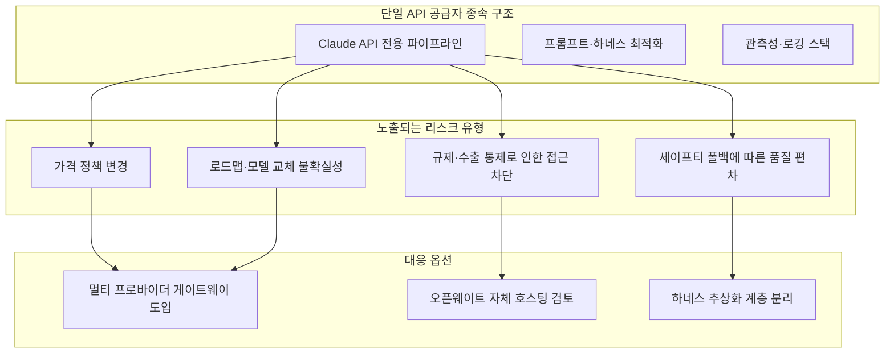
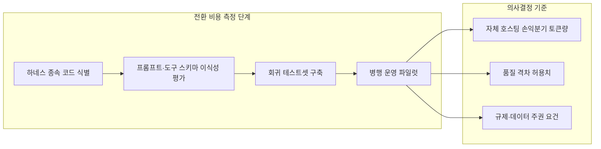

작성일자: 2026-07-22

---

## 목차

1. 들어가며 — 원문과 검증 범위에 대한 안내
2. Kimi K3: 세계 최초 오픈 3T급 모델의 실체
3. Qwen 3.8: 프리뷰 단계의 2.4T 도전자
4. 두 모델의 벤치마크 비교 — 검증된 것과 아직 아닌 것
5. "Anthropic 내부 불안정 신호"는 구체적으로 무엇을 가리키는가
6. 단일 공급자 종속 구조가 만드는 리스크 지형
7. 전환 비용을 실제로 측정한다는 것의 의미
8. 자체 호스팅 vs API 구독 — 손익분기점을 둘러싼 오해와 실제 수치
9. 팀이 지금 점검할 수 있는 체크리스트
10. 결론
11. 참고자료

---

## 1. 들어가며 — 원문과 검증 범위에 대한 안내

> 
> https://www.threads.com/@grit_lounge/post/DbChX5VmpDD
> 
> Kimi K3와 Qwen 3.8이 동시에 공개됐다. 거기에 Anthropic의 내부 불안정 신호까지 겹쳤다.
> 
> Claude API에 스택을 묶어둔 팀이라면 이 조합이 순서대로 불편하게 읽힌다. Qwen 3.8은 로컬 실행 가능한 크기에서 실무 수준 성능을 꺼냈고, Kimi K3는 추론 벤치마크 상위권에 진입했다. 단일 공급자에 파이프라인을 통째로 맡기는 구조는, 부품 공급선 하나에 생산 전체를 걸어둔 공장과 다르지 않다.
> 
> 그런데 Anthropic에서 나온 신호가 구체적으로 어떤 종류냐에 따라 팀의 대응 우선순위가 달라지는데,
> 
> Anthropic 관련 신호 중 가장 실질적인 부분은 API 가격·속도·안정성보다 로드맵 불확실성이다. Qwen 3.8을 로컬·자체 호스팅으로 붙이는 비용이 외부 API 월 구독보다 낮아지는 구간이 온다면, 스택 전환 결정의 타이밍은 생각보다 빠를 수 있다.
> 
> 지금 팀이 LLM 공급자를 바꾸는 데 드는 전환 비용을 실제로 측정하고 있나, 아직 측정조차 안 했나.
> 
> 개발자 커뮤니티 무료 입장, 프로필에서 바로 가능하다.
> 

공유해주신 Threads 게시물(@grit_lounge, DbChX5VmpDD)은 Threads 사이트의 접근 제한 정책 때문에 본문을 직접 가져올 수 없었습니다. 따라서 이 문서는 게시물에 인용된 텍스트를 근거로 삼아, 그 안에 언급된 세 가지 사건 — Kimi K3 공개, Qwen 3.8 공개, Anthropic 관련 불안정 신호 — 을 각각 웹 검색으로 독립적으로 검증한 뒤 재구성한 것입니다. 원문 게시물 자체의 주장을 그대로 옮기는 대신, 검증 가능한 1차 자료(Moonshot·Alibaba 공식 발표, Artificial Analysis 벤치마크, Anthropic 공식 고객센터 문서, GitHub 이슈, 로이터·CNBC·알자지라 등 언론 보도)를 기준으로 사실관계를 다시 세웠습니다.

문서 전반에서 세 가지 층위를 명확히 구분합니다.

- **확인된 사실**: 회사 공식 발표, 독립 벤치마크 기관(Artificial Analysis)의 측정치, 공식 문서에 명시된 내용
- **업체 자체 주장**: 벤치마크표 없이 회사가 스스로 내세운 포지셔닝 (예: "Fable 5 다음으로 강력하다")
- **미확인 루머**: 당사자 확인 없이 커뮤니티에서 도는 추측

---

## 2. Kimi K3: 세계 최초 오픈 3T급 모델의 실체

중국 문샷 AI(Moonshot AI)는 2026년 7월 17일, 상하이에서 열린 세계인공지능대회(WAIC) 개막에 맞춰 최신 모델 Kimi K3를 공개했습니다. 공개 직후 홍콩 증시에 상장된 중국 AI 관련주가 급락하고 모건스탠리 등 글로벌 투자은행들이 잇따라 분석 리포트를 낼 만큼 파장이 컸습니다.

핵심 스펙은 다음과 같습니다.

- **파라미터 규모**: 총 2.8조 개(2.8T). Moonshot은 이를 "세계 최초의 오픈 3T급 모델"이라고 표현했습니다.
- **아키텍처**: 새로 설계한 Kimi Delta Attention(KDA)과 Attention Residuals(AttnRes) 위에 구축되었고, 896개 전문가 중 16개만 활성화하는 극단적 희소 MoE(Mixture-of-Experts) 구조를 채택해 전작 K2 대비 스케일링 효율을 약 2.5배 끌어올렸다고 밝혔습니다.
- **컨텍스트·모달리티**: 100만(1M) 토큰 컨텍스트 윈도우와 네이티브 비전 기능을 갖췄습니다. 텍스트와 이미지를 별도 모듈 없이 같은 모델이 처리합니다.
- **긴 컨텍스트 디코딩 속도**: KDA 덕분에 100만 토큰급 긴 맥락에서 디코딩 속도가 최대 6.3배 빨라졌다고 Moonshot은 설명합니다.
- **가중치 공개 일정**: 전체 가중치는 2026년 7월 27일까지 공개될 예정이며, 실제로 풀리면 지금까지 나온 오픈 웨이트 모델 중 가장 큰 규모가 됩니다. 다만 이 문서 작성 시점에는 아직 API·자체 앱(kimi.com, Kimi 모바일 앱, Kimi Work, Kimi Code)과 OpenRouter를 통한 접근만 가능하고, 자체 호스팅이 가능한 가중치 파일 자체는 아직 배포되지 않았습니다.
- **하드웨어 요구량**: 2.8T 파라미터 모델은 8장짜리 H200 클러스터에도 담기지 않는 규모로 알려져 있어, 자체 호스팅을 고려한다면 NVIDIA DGX B200급(8x Blackwell, 1,440GB HBM3e) 이상의 인프라가 사실상 전제 조건입니다.
- **공식 API 가격**: 입력 100만 토큰당 3달러, 출력 100만 토큰당 15달러입니다. Artificial Analysis 기준으로는 평균적인 유사 모델보다 다소 비싼 편이며, 응답 속도도 느리고 토큰 소비량(verbosity)도 평균보다 훨씬 많다는 평가입니다.

흥미로운 점은 Moonshot이 발표문에서 스스로 한계를 인정했다는 것입니다. K3는 Claude Fable 5나 GPT-5.6 Sol 같은 최상위 독점 모델에는 아직 미치지 못한다고 명시했습니다. 과장 대신 정직한 포지셔닝을 택한 셈입니다.

---

## 3. Qwen 3.8: 프리뷰 단계의 2.4T 도전자

알리바바 Qwen 팀은 2026년 7월 19일, 역시 상하이 WAIC 현장에서 Qwen 3.8(공개 엔드포인트명 `qwen3.8-max-preview`)을 발표했습니다. Kimi K3 발표로부터 불과 이틀 뒤였고, 업계에서는 Qwen의 이번 발표가 K3의 상승세를 견제하려는 의도로 해석하는 시각이 많습니다.

확인된 사실은 다음과 같습니다.

- **파라미터 규모**: 총 2.4조 개(2.4T)의 희소 MoE 아키텍처. Qwen 시리즈에서 1조 파라미터를 넘은 첫 번째 멀티모달 모델로, 텍스트·이미지·영상·문서를 함께 입력받습니다.
- **접근 방식**: 정식 출시가 아니라 프리뷰입니다. Alibaba의 Token Plan, Qoder, QoderWork를 통해 `qwen3.8-max-preview` 엔드포인트로만 접근 가능하며, 이 엔드포인트는 폐기되거나 대체되기 전까지 계속 바뀔 수 있다고 Alibaba 스스로 명시하고 있습니다.
- **컨텍스트 윈도우**: 통합 메타데이터 기준 약 983,616 토큰, 최대 출력 131,072 토큰으로 확인됩니다.
- **가격**: 표준 종량제 가격은 아직 공개되지 않았고, 현재는 한시적 할인가(정가의 약 10% 수준)로 Token Plan을 통해 제공됩니다. 또한 Token Plan 약관은 자동화 스크립트나 백엔드 애플리케이션, 비대화형 배치 처리를 금지하고 있어, 예약 실행되는 프로덕션 에이전트에는 현재 조건 자체가 맞지 않습니다.

그리고 여기서부터는 **업체 자체 주장**으로 분류해야 할 부분입니다. Qwen 팀은 X(舊 트위터) 공식 계정을 통해 이 모델이 "오늘날 이용 가능한 가장 강력한 모델 중 하나이며, Fable 5 다음으로 뛰어나다"고 밝혔습니다. 그러나 이 주장을 뒷받침하는 벤치마크표, 모델 카드, 최종 라이선스, 표준 API 가격은 이 문서 작성 시점까지 전혀 공개되지 않았습니다. Artificial Analysis를 비롯한 독립 평가 기관에도 아직 등재되지 않은 상태입니다.

이 비대칭성이 두 모델을 비교할 때 가장 중요하게 짚어야 할 지점입니다. Kimi K3는 독립적으로 검증된 벤치마크 점수와 공식 API 가격, 확정된 오픈 웨이트 공개일을 갖춘 반면, Qwen 3.8은 아직 회사 주장과 프리뷰 엔드포인트, 초기 체험기 수준의 근거만 존재합니다.

---

## 4. 두 모델의 벤치마크 비교 — 검증된 것과 아직 아닌 것

Artificial Analysis Intelligence Index v4.1(GDPval-AA v2, τ³-Banking, Terminal-Bench v2.1, SciCode, Humanity's Last Exam, GPQA Diamond, CritPt, AA-Omniscience, AA-LCR 총 9개 평가로 구성)를 기준으로 확인된 수치는 다음과 같습니다.

| 항목 | Kimi K3 | Qwen 3.8 Max (Preview) | Claude Fable 5 | Claude Opus 4.8 |
|---|---|---|---|---|
| Artificial Analysis Intelligence Index | 57 (전체 3위) | 미등재 (업체 주장만 존재) | 약 60 | 약 56 |
| 개발사 | Moonshot AI | Alibaba | Anthropic | Anthropic |
| 공개 상태 | 정식 공개, 가중치는 7/27 예정 | 프리뷰 (`qwen3.8-max-preview`) | 정식 GA | 정식 GA |
| 파라미터 | 2.8T (활성 파라미터는 896개 전문가 중 16개) | 2.4T | 비공개 | 비공개 |
| 컨텍스트 윈도우 | 100만 토큰 | 약 98만 토큰 | 비공개(대형) | 비공개(대형) |
| API 가격(입력/출력, 100만 토큰당) | $3 / $15 | 미공개(할인 프리뷰만 존재) | 비공개 요금제 | 5/25달러 수준으로 보도됨 |
| GDPval-AA v2 Elo(에이전트형 작업) | 1668 | 데이터 없음 | 1760 | 1600 |

이 표에서 특히 눈여겨볼 부분은, Kimi K3가 Terminal-Bench 2.1에서 88.3%, FrontierSWE에서 81.2%, DeepSWE에서 67.5%를 기록했고 LMArena의 Frontend Code Arena(블라인드 개발자 투표)에서 1위를 차지했다는 점, 그리고 HLE-Full(Humanity's Last Exam)에서는 43.5점으로 Fable 5의 53.3점에 크게 못 미친다는 점입니다. 즉 실무형 코딩·에이전트 작업에서는 최상위권에 근접했지만, 가장 어려운 추론 벤치마크에서는 여전히 격차가 있습니다.

Qwen 3.8과 Kimi K3를 직접 맞대결시킨 몇 안 되는 독립 테스트(Trilogy AI, 단일 과제 기준)에서는 Kimi K3가 83점, Qwen 3.8이 80점으로 근소하게 앞섰습니다. 다만 Qwen 쪽이 저장소 인용 횟수(354회 대 274회)가 더 많고 게이트웨이 요청 수는 더 적었으며(22회 대 53회) 도구 호출 실패가 0건(Kimi는 2건)이었다는 세부 지표도 함께 보고되었습니다. 이는 단일 과제 결과일 뿐, 전체 벤치마크 스위트로 일반화할 수는 없다는 점을 원 출처도 명시하고 있습니다.

---

## 5. "Anthropic 내부 불안정 신호"는 구체적으로 무엇을 가리키는가

원문 게시물이 정확히 어떤 신호를 지칭했는지는 게시물 본문을 확보하지 못해 단정할 수 없습니다. 다만 Kimi K3·Qwen 3.8 발표와 시기적으로 겹치는, 실제로 검증 가능한 Anthropic 관련 사건은 다음 네 가지입니다. 성격이 서로 다르므로 각각 구분해서 봐야 합니다.

### 5.1 수출 통제로 인한 19일간의 서비스 전면 중단 (확인된 사실)

2026년 6월 12일, 미국 상무부는 Fable 5와 Mythos 5에 대해 외국인(Anthropic 자체 외국인 직원 포함)의 접근을 금지하는 수출 통제 명령을 내렸습니다. 워싱턴포스트 보도에 따르면 직접적인 도화선은 Amazon 내부 연구자들이 발견한 취약점으로, 특정 프롬프트가 Fable 5의 안전장치를 우회해 사이버 공격에 활용될 수 있는 정보(익스플로잇 코드)를 출력하게 만들 수 있었다는 점이었습니다. Anthropic은 모든 사용자의 국적을 실시간으로 검증할 방법이 없었기 때문에, 명령이 발효된 즉시 전체 사용자에 대해 두 모델의 서비스를 중단했습니다. Anthropic은 당시 성명에서 좁은 범위의 잠재적 탈옥(jailbreak) 사례 하나만으로 이미 수억 명에게 배포된 상용 모델을 회수하는 것에는 동의하지 않는다는 입장을 밝히기도 했습니다.

이 조치는 6월 30일 상무부가 통제를 해제하면서 끝났습니다. 하워드 러트닉 상무장관은 Anthropic이 향후 안전 위험을 선제적으로 감지·대응하고 정부와 협력하기로 약속함에 따라 통제를 풀었다고 밝혔습니다. Mythos 5는 6월 26일 우선 약 100개의 승인된 미국 기업·연방기관에 먼저 복원되었고, Fable 5는 7월 1~2일부터 Claude.ai, Claude Platform, Claude Code 등 전 사용자 대상으로 순차 복원되었습니다. 총 19일간의 중단이었습니다.

이 사건이 남긴 실질적 함의는 가격이나 속도 문제가 아니라, **미국 정부의 국가안보 판단 하나로 특정 모델 전체가 하루아침에 전 세계에서 접근 불가능해질 수 있다**는 선례가 만들어졌다는 점입니다. 이는 단일 API 공급자에게 파이프라인을 전적으로 의존하는 팀에게는 순수한 상업적 리스크(가격 인상, 서비스 품질 저하)와는 질적으로 다른 종류의 리스크입니다.

### 5.2 Fable 5 → Opus 4.8 조용한 세이프티 폴백 (확인된 사실)

> Releasing a model this capable comes with risks. Without safeguards, Fable 5’s capabilities in areas like cybersecurity could be misused to cause serious damage. We’ve therefore launched the model with safeguards that mean queries on some topics will instead receive a response from our next-most-capable model, Claude Opus 4.8. To release the model both safely and quickly, we’ve tuned these safeguards conservatively—they’ll sometimes catch harmless requests, though they trigger, on average, in less than 5% of sessions. With more capable models arriving in the coming months, we’re working to improve our safeguards and reduce false positives as quickly as we can. - ["Claude Fable 5 and Claude Mythos 5"](https://www.anthropic.com/news/claude-fable-5-mythos-5)

Anthropic 공식 고객센터 문서는 Fable 5가 모든 사용자 요청에 대해 자동화된 안전 검사를 수행하며, 공격적 사이버보안 기법(익스플로잇·멀웨어·공격 도구 제작) 등 네 가지 영역에서 검사에 걸리면 자동으로 Opus 4.8로 "폴백"한다고 명시하고 있습니다. 이 자동 전환은 Claude, Claude Cowork, Claude Code, Claude Design, Claude용 Microsoft 365에서 기본적으로 켜져 있으며, Fable 5를 처음 선택하는 순간부터 활성화됩니다.

문제는 이 전환이 실무에서 상당한 마찰을 일으켰다는 점입니다. GitHub의 `anthropics/claude-code` 저장소에는 2026년 6월 한 달 동안 이와 관련된 이슈가 다수 등록되었습니다.

- 세션 도중 아무 사전 고지 없이 모델이 Fable 5에서 Opus 4.8로 바뀌었는데도 UI가 여전히 Fable 5로 표시되는 사례
- `/model` 명령으로 되돌리려 해도 캐시가 깨지면서 전체 대화를 다시 보내야 하는 문제
- 정상적인 방어적 보안 작업(자신의 비밀번호 관리자 취약점을 고치는 등)까지 "사이버보안" 주제로 분류되어 의도와 무관하게 폴백이 걸리는 문제
- 사용자가 명시적으로 `/model Fable 5`를 선택했음에도 분류기가 이를 무시하고 강제로 전환하는 문제

Anthropic 공식 문서는 이 폴백이 오탐(false positive)을 포함할 수 있음을 인정하며, 정당한 방어적 보안 목적의 작업이 반복적으로 영향을 받는 경우 Opus 4.8용 Cyber Verification Program(CVP)에 신청할 수 있다고 안내하고 있습니다. 즉 이는 "버그"라기보다 설계된 안전장치이지만, 장시간 실행되는 에이전트 워크플로우나 재현성이 중요한 작업에는 예측하기 어려운 품질 변동 요인으로 작용합니다.

### 5.3 로비 지출 급증 (확인된 사실, 해석은 별개)

최근 보도에 따르면 Anthropic은 2026년 2분기에 연방정부 로비에 197만 달러를 지출했습니다. 이는 1분기 대비 26% 증가한 수치이며, 보도는 이를 앞서 언급한 수출 통제로 인한 모델 중단 사태 이후 정부와의 관계 관리 필요성이 커진 것과 연결지어 설명하고 있습니다. 이 자체는 위법이나 실패의 신호라기보다는, 6월 사태 이후 규제 리스크에 대응하는 회사의 정상적인 행보로 해석하는 것이 타당합니다.

### 5.4 Physical Intelligence 인수설 (미확인 루머 — 사실로 다루면 안 됨)

2026년 7월 20~21일 주말 사이, 로보틱스 스타트업 Physical Intelligence를 Anthropic이 인수할 수 있다는 추측이 AI 트위터에서 확산되었습니다. TechCrunch를 비롯한 매체들이 이를 보도했지만, 두 회사 모두 공식 확인이나 부인을 하지 않은 **미확인 루머** 단계입니다. Anthropic과 OpenAI가 2026년 내내 공격적인 인수 행보를 보여온 배경 때문에 그럴듯하게 들리는 추측일 뿐, 사실관계로 취급해서는 안 됩니다.

### 요약: 신호의 성격 구분

| 신호 | 성격 | 실무 영향 |
|---|---|---|
| 수출 통제로 인한 19일 중단 | 확인된 사실, 이미 해소됨 | 규제 리스크 선례 확립 — 재발 가능성은 남아 있음 |
| Fable 5 → Opus 4.8 조용한 폴백 | 확인된 사실, 현재도 진행형 | 장기 실행 에이전트의 재현성·일관성 저하 |
| 로비 지출 급증 | 확인된 사실 | 간접적 신호, 그 자체로는 리스크가 아님 |
| Physical Intelligence 인수설 | 미확인 루머 | 판단 근거로 삼기에는 이름 |

---

## 6. 단일 공급자 종속 구조가 만드는 리스크 지형

이 그림에서 강조하고 싶은 부분은, 네 가지 리스크 유형이 서로 다른 대응책을 요구한다는 점입니다. 가격 정책 변경이나 로드맵 불확실성은 멀티 프로바이더 게이트웨이(LiteLLM류)로 상당 부분 흡수할 수 있지만, 규제·수출 통제로 인한 접근 차단은 게이트웨이만으로는 해결되지 않고 오픈웨이트 모델의 자체 호스팅 옵션을 실제로 검증해 두어야 대응이 가능합니다. 세이프티 폴백으로 인한 품질 편차는 공급자 문제라기보다 하네스 설계 문제에 가까워서, 모델 계층과 하네스 계층을 분리해 두면 특정 모델의 폴백 동작이 하네스 전체를 흔들지 않도록 격리할 수 있습니다.

---

## 7. 전환 비용을 실제로 측정한다는 것의 의미

원문 게시물의 마지막 질문 — "지금 팀이 LLM 공급자를 바꾸는 데 드는 전환 비용을 실제로 측정하고 있나, 아직 측정조차 안 했나" — 은 실무적으로 꽤 날카로운 질문입니다. 많은 팀이 "전환 가능성"은 막연히 이야기하면서도, 실제 전환 비용을 숫자로 가지고 있지 않은 경우가 많습니다. 측정 가능한 항목으로 분해하면 다음과 같습니다.

**1단계, 하네스 종속 코드 식별**은 시스템 프롬프트, 도구 스키마, 캐싱 전략, 스트리밍 파싱 로직 중 특정 공급자의 API 스펙에 직접 결합된 부분을 찾아내는 작업입니다. Anthropic API의 tool_use 블록 구조나 프롬프트 캐싱 방식에 맞춰진 코드가 많을수록 전환 비용은 커집니다.

**2단계, 프롬프트·도구 스키마 이식성 평가**는 동일한 시스템 프롬프트와 도구 정의를 다른 모델(Qwen, Kimi, GPT 계열)에 그대로 넣었을 때 얼마나 성능이 유지되는지를 확인하는 작업입니다. 앞서 언급했듯 Qwen 3.7 계열은 Anthropic API 호환 방식을 지원해 Claude Code에 하네스 변경 없이 드롭인 대체가 가능하다고 알려져 있어, 이런 호환성 여부 자체가 전환 비용의 큰 변수가 됩니다.

**3단계, 회귀 테스트셋 구축**은 실제 프로덕션에서 반복적으로 발생하는 과제 유형을 모아 모델을 바꿔도 결과 품질을 정량적으로 비교할 수 있는 기준선을 만드는 작업입니다.

**4단계, 병행 운영 파일럿**은 실제 트래픽 일부를 대체 모델로 흘려보내며 실패율, 재시도율, 지연시간, 실제 완료 비용(모델 비용 + 재시도 + 소요 시간 + 사람의 검토 + 실패 수습 비용)을 측정하는 단계입니다. 이 마지막 항목이 특히 중요한데, 단순 토큰당 가격 비교만으로는 실제 운영 비용을 알 수 없기 때문입니다.

---

## 8. 자체 호스팅 vs API 구독 — 손익분기점을 둘러싼 오해와 실제 수치

원문 게시물은 "Qwen 3.8을 로컬·자체 호스팅으로 붙이는 비용이 외부 API 월 구독보다 낮아지는 구간이 온다면"이라는 조건문을 제시합니다. 이 조건문 자체는 합리적이지만, 현재 시점에서 이를 뒷받침할 구체적 수치는 제한적입니다. 몇 가지 확인 가능한 사실과 함께 짚어보겠습니다.

첫째, Qwen 3.8은 아직 오픈 웨이트로 풀리지 않았습니다. 현재는 Alibaba의 크레딧 기반 Token Plan을 통한 프리뷰 접근만 가능하고, 표준 API 가격도, 라이선스도, 자체 호스팅에 필요한 모델 카드도 공개되지 않았습니다. 따라서 "자체 호스팅 비용"을 오늘 시점에서 정확히 계산할 수 있는 대상이 아직 아닙니다.

둘째, Kimi K3는 가중치 공개(7월 27일 예정) 이후에나 자체 호스팅이 가능해지는데, 2.8조 파라미터 규모는 8장짜리 H200 클러스터에도 담기지 않아 DGX B200급 이상의 인프라가 사실상 전제 조건이라는 점이 이미 보도되었습니다. 즉 "로컬에서 돌린다"는 표현이 노트북이나 단일 서버 수준을 뜻하는 것이 아니라, 상당한 규모의 GPU 클러스터 투자를 전제로 한다는 점을 분명히 해야 합니다.

셋째, 다만 유사 규모의 오픈 웨이트 모델을 서드파티 호스팅(OpenRouter, DeepInfra 등)으로 이용할 경우, Anthropic API 정가 대비 상당한 가격 차이가 보고된 사례는 있습니다. 한 커뮤니티 분석(GeekNews 인용)에 따르면, Opus 4.6의 API 정가(입력 100만 토큰당 5달러, 출력 100만 토큰당 25달러) 대비, OpenRouter의 Qwen 3.5 397B나 DeepInfra의 Kimi K2.5 같은 유사 규모 오픈 웨이트 모델은 입력·출력 모두 대략 10분의 1 수준의 가격으로 제공되고 있었습니다. 다만 이는 특정 시점, 특정 모델 조합에 대한 비교이며 Kimi K3나 Qwen 3.8처럼 훨씬 더 큰 최신 모델에 그대로 적용되는 수치는 아닙니다.

정리하면, "자체 호스팅이 API 구독보다 저렴해지는 구간이 온다"는 방향성 자체는 오픈 웨이트 생태계의 가격 경쟁 흐름과 부합하지만, Kimi K3·Qwen 3.8이라는 구체적인 두 모델에 대해 "언제, 얼마의 물량에서 손익분기점을 넘는지"를 오늘 시점에서 확정적으로 말할 수 있는 근거는 아직 부족합니다. 특히 Qwen 3.8은 표준 가격조차 없는 프리뷰 단계이므로, 이 판단은 최소한 두 가지가 공개된 이후에 다시 해야 합니다 — Qwen 3.8의 정식 라이선스·가격표, 그리고 Kimi K3 가중치 공개 이후 실제 자체 호스팅 인프라 비용 사례.

---

## 9. 팀이 지금 점검할 수 있는 체크리스트

- [ ] 현재 프로덕션 하네스에서 Anthropic API 고유 스펙(tool_use 블록, 프롬프트 캐싱, 스트리밍 파싱)에 직접 결합된 코드 비중을 파악했는가
- [ ] Fable 5를 사용 중이라면, 세이프티 폴백(Opus 4.8 전환) 발생 빈도와 그로 인한 출력 포맷·품질 변동을 실제로 로깅하고 있는가
- [ ] 동일한 프롬프트·도구 스키마를 Qwen이나 Kimi 계열 모델에 넣었을 때의 회귀 테스트 결과를 최소 한 번이라도 확보했는가
- [ ] "완료된 작업당 실제 비용"(모델 비용 + 재시도 + 지연 + 사람 검토 + 실패 수습)을 토큰 단가가 아닌 완료 작업 단위로 계산해 본 적이 있는가
- [ ] 규제·수출 통제로 인한 접근 차단 시나리오에 대해, 대체 모델로 전환하는 데 걸리는 실제 소요 시간을 시뮬레이션해 본 적이 있는가
- [ ] Qwen 3.8, Kimi K3 관련 공식 발표(가중치 공개, 정식 가격표, 모델 카드)를 추적할 정기적인 모니터링 루틴이 있는가

---

## 10. 결론

Kimi K3와 Qwen 3.8의 동시 등장은 오픈 웨이트 진영이 최상위 폐쇄형 모델과의 격차를 실질적으로 좁히고 있다는 확인된 흐름입니다. 다만 두 모델의 신뢰도는 동일하지 않습니다. Kimi K3는 독립 검증된 벤치마크와 확정된 가중치 공개 일정을 갖춘 반면, Qwen 3.8은 아직 회사 주장과 프리뷰 엔드포인트 수준에 머물러 있습니다.

Anthropic 쪽에서 같은 시기에 겹친 사건들 역시 성격이 제각각입니다. 19일간의 수출 통제 중단은 이미 종료된 확인된 사실이지만 규제 리스크의 선례를 남겼고, Fable 5의 조용한 세이프티 폴백은 현재도 진행 중인 확인된 사실로서 장기 실행 에이전트의 재현성에 실질적 영향을 미칩니다. 반면 Physical Intelligence 인수설은 아직 미확인 루머에 불과합니다.

이 모든 것을 종합했을 때, 원문 게시물의 마지막 질문 — 전환 비용을 실제로 측정하고 있는가 — 은 방향을 정확히 짚고 있습니다. 다만 "자체 호스팅이 곧 API 구독보다 싸질 것"이라는 결론을 지금 단정하기에는, 적어도 Qwen 3.8의 정식 가격표와 Kimi K3의 실제 자체 호스팅 사례가 나오기 전까지는 근거가 충분하지 않습니다. 지금 시점에서 팀이 취할 수 있는 가장 실질적인 행동은, 두 모델의 정식 공개를 기다리는 동안 자신의 하네스가 얼마나 특정 공급자에 결합되어 있는지를 먼저 정량적으로 파악해 두는 것입니다.

---

## 11. 참고자료

- Moonshot AI, Kimi K3 Tech Blog: Open Frontier Intelligence (2026.7)
- PyTorchKR, "Kimi K3, Moonshot AI가 공개한 세계 첫 3T급 오픈 웨이트 모델" — https://discuss.pytorch.kr/t/kimi-k3-moonshot-ai-3t-7-27/11301
- 박재홍의 실리콘밸리, "Kimi K3, 세계 최초 오픈 3조급 모델이 프런티어에 도전하다" — https://wikidocs.net/blog/@jaehong/24447/
- 박재홍의 실리콘밸리, "2.8조 파라미터 오픈 모델 Kimi K3, 열려 있으나 값싸지 않다" — https://wikidocs.net/blog/@jaehong/24535/
- deep gadget by ManyCoreSoft, "H200 8장에 안 들어간다: 2.8조 파라미터 오픈 모델 Kimi K3" — https://www.deepgadget.com/blog/kimi-k3-specs-self-hosting/
- Artificial Analysis, "Kimi K3 achieves #3 in the Artificial Analysis Intelligence Index" — https://artificialanalysis.ai/articles/kimi-k3-achieves-3-in-the-artificial-analysis-intelligence-index-comparable-to-opus-4-8-and-gpt-5-5
- Artificial Analysis, Kimi K3 모델 페이지 — https://artificialanalysis.ai/models/kimi-k3
- Artificial Analysis, Kimi K3 vs Qwen3.7 Max 비교 — https://artificialanalysis.ai/models/comparisons/kimi-k3-vs-qwen3-7-max
- Alibaba Qwen 공식 X 발표 (2026.7.19) — https://x.com/Alibaba_Qwen/status/2078759124914098291
- Coursiv Blog, "Qwen 3.8: Specs, Pricing, Access & Benchmarks" — https://coursiv.io/blog/qwen-3-8
- felloai.com, "Qwen 3.8: Alibaba's 2.4T 'Second Only to Fable 5' Model" — https://felloai.com/qwen-3-8/
- emergent.sh, "Qwen 3.8 Max vs Kimi K3: What We Can Compare Today and What's Still Missing" — https://emergent.sh/learn/qwen-3-8-max-vs-kimi-k3
- OrcaRouter Blog, "Qwen 3.8 vs Kimi K3: The Two Chinese Open-Weight Giants, Head to Head" — https://www.orcarouter.ai/blog/qwen-3-8-vs-kimi-k3
- the-decoder, "Alibaba's Qwen takes on Kimi K3 with open-weight Qwen 3.8" — https://the-decoder.com/alibabas-qwen-takes-on-kimi-k3-with-open-weight-qwen-3-8-says-model-is-second-only-to-fable-5/
- TradingKey, "Anthropic Fable 5 공식 출시 예정: 18일간의 수출 통제 종료" — https://www.tradingkey.com/kr/analysis/stocks/us-stocks/262002992-anthropic-fable5-claude-opanai-ipo-tradingkey
- 나무위키, "Claude Fable 5 · Mythos 5 서비스 중단 사건" — https://namu.wiki/w/Claude%20Fable%205%20%C2%B7%20Mythos%205%20%EC%84%9C%EB%B9%84%EC%8A%A4%20%EC%A4%91%EB%8B%A8%20%EC%82%AC%EA%B1%B4
- Al Jazeera, "US lifts restrictions on Anthropic's powerful AI models Fable and Mythos" — https://www.aljazeera.com/economy/2026/7/1/us-lifts-restrictions-on-powerful-ai-models-fable-mythos-anthropic-says
- MarketScale, "U.S. lifts export controls on Anthropic's Claude Fable 5 and Mythos 5, ending 19-day shutdown" — https://www.marketscale.com/industries/software-and-technology/us-lifts-export-controls-on-anthropics-claude-fable-5-and-mythos-5-ending-19-day-shutdown
- 인공지능신문, "앤트로픽, 최강 모델 '클로드 페이블 5·미토스 5' 서비스 복원" — https://www.aitimes.kr/news/articleView.html?idxno=40771
- Anthropic 공식 고객센터, "Why Claude switched models in your conversation with Fable 5" — https://support.claude.com/en/articles/15363606-why-claude-switched-models-in-your-conversation-with-fable-5
- GitHub anthropics/claude-code, Issue #67469, #66973, #66670, #67818, #67246, #66873 (Fable 5 → Opus 4.8 관련 버그 리포트)
- Cryptopolitan, "Anthropic's lobbying spend jumps after Commerce Department pulled its flagship models offline" — https://www.cryptopolitan.com/anthropics-lobbying-spend-jumps-after-mythos/
- TechCrunch, "The Anthropic-Physical Intelligence rumor roiling AI Twitter" (미확인 루머, 2026.7.21) — https://techcrunch.com/2026/07/21/the-anthropic-physical-intelligence-rumor-roiling-ai-twitter/
- GeekNews(news.hada.io), "Claude Code Max 요금제 실제 컴퓨트 비용 검증" 스레드 — https://news.hada.io/topic?id=27380

---

*본 문서는 2026년 7월 22일 기준 검색 가능한 공개 자료를 근거로 작성되었으며, Qwen 3.8과 Kimi K3의 가중치·가격·라이선스 관련 세부사항은 향후 정식 공개 시 변경될 수 있습니다.*
