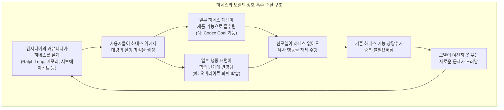
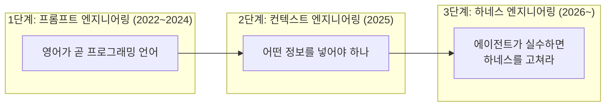

## 목차

1. 들어가며 — 원 게시물의 문제의식
2. 하네스란 무엇이었나 (짧은 복기)
3. "하네스 무용론"은 실제로 업계에서 나온 이야기인가
4. Codex Goal 기능의 사례 — 등장 배경과 GPT-5.6 Sol에서 관찰되는 변화
5. 왜 이런 현상이 나타나는가 — 가설과 증거를 구분해서 보기
6. 하네스-모델 상호 흡수 순환 구조
7. 그렇다면 하네스 엔지니어링은 정말 무의미해지는가 — 반론과 균형점
8. 확인된 사실 vs 추론 vs 반증 자료 정리표
9. 시사점과 앞으로 지켜볼 지점
10. 참고 자료

---

## 1. 들어가며 — 원 게시물의 문제의식

> 
> https://www.threads.com/@geonu_/post/DbFTox1j5NH
> 
> Fable이나 GPT-5.6이 나오면서 “모델이 똑똑해지면 하네스가 필요 없어진다” 라고 이야기하는데,
> 
> 왜 그럴까 생각해보면, 사실 하네스가 강력해질수록 다음 모델을 학습할때 그 하네스를 기반으로 강화학습을 하기 때문이 아닐까 생각함
> 
> 예를들어 Codex의 goal 기능이 처음 나왔을때 반응이 뜨거웠고 나도 덕을 많이봤는데, GPT-5.6 sol은 goal을 설정하는걸 까먹어도 goal이 있는것마냥 잘 행동한다. 
> 
> 이게 바로 사람이 실시간으로 더 나은 방향을 제시하는 길잡이가 되고, AI가 따라가는 사례가 아닐까싶음
> 
> 하네스 깎는 장인들의 노력으로 하네스가 필요 없는 모델이 만들어지고 있고, 새 모델이 못하는 일을 해결하기 위해 누군가 또 하네스를 깎고있다.
> 

Threads 사용자 @geonu_ 님이 올린 글의 요지는 이렇습니다. Fable 5나 GPT-5.6이 등장하면서 "모델이 똑똑해지면 하네스가 필요 없어진다"는 말이 돌고 있는데, 그 이유를 생각해보면 하네스가 강력해질수록 다음 세대 모델을 학습시킬 때 그 하네스를 기반으로 강화학습을 하기 때문이 아니겠냐는 것입니다. 실제 사례로 Codex의 Goal 기능이 처음 나왔을 때 반응이 뜨거웠는데, GPT-5.6 Sol은 Goal을 따로 설정하지 않아도 마치 Goal이 걸려 있는 것처럼 행동한다는 관찰을 들었습니다. 글쓴이는 이것을 "사람이 실시간으로 더 나은 방향을 제시하는 길잡이 역할을 하고 AI가 그 뒤를 따라가는 사례"로 해석하면서, 하네스를 깎는 사람들의 노력 덕분에 하네스가 필요 없는 모델이 만들어지고, 그 모델이 못 푸는 새로운 문제를 풀기 위해 누군가 다시 하네스를 깎는 순환이 반복되고 있다고 정리했습니다.

참고로 원문 게시물 자체는 Threads의 로봇 접근 제한 정책 때문에 직접 열람할 수 없었고, 위 요지는 사용자께서 전달해주신 텍스트를 그대로 반영한 것입니다. 이 문서는 그 문제의식을 출발점으로 삼아, 실제로 업계에서 어떤 발언과 데이터가 나와 있는지를 검색을 통해 확인하고, 어디까지가 확인된 사실이고 어디부터가 합리적 추론인지를 구분해서 정리한 것입니다.

## 2. 하네스란 무엇이었나 (짧은 복기)

하네스는 원래 말이나 반려동물에게 채우는 고삐·안전벨트를 뜻하는 말이었고, 공학 분야에서는 배선 하네스나 테스트 하네스처럼 "통제되지 않는 대상을 올바른 방향으로 다루기 위한 외부 장치"라는 의미로 오래전부터 쓰여 왔습니다. AI 에이전트 맥락에서 하네스는 모델을 제외한 나머지 전부, 즉 시스템 프롬프트, 도구와 MCP 서버, 컨텍스트 관리 정책, 훅(hook), 서브에이전트, 샌드박스, 실패 시 복구 흐름까지를 포괄하는 개념으로 자리 잡았습니다. "AI 에이전트 = 모델 + 하네스"라는 정식화가 널리 인용되며, 2026년 들어서는 프롬프트 엔지니어링(2022~2024) → 컨텍스트 엔지니어링(2025) → 하네스 엔지니어링(2026~)으로 이어지는 패러다임 전환으로 설명되는 경우가 많습니다. 같은 모델을 그대로 두고 하네스만 손봐서 벤치마크 성적이 크게 오른 사례들, 예를 들어 LangChain이 하네스 개선만으로 Terminal-Bench 순위를 30위권에서 5위권으로 끌어올렸다는 사례가 이 개념을 뒷받침하는 근거로 자주 인용됩니다.

## 3. "하네스 무용론"은 실제로 업계에서 나온 이야기인가

결론부터 말하면, 예입니다. 다만 정확히 어떤 사람이 어떤 맥락에서 말했는지를 구분해서 볼 필요가 있습니다.

**구글 쪽 발언.** 구글 AI 스튜디오를 이끄는 로건 킬패트릭은 최근 한 팟캐스트에서 "모델이 점차 하네스를 먹어치우고 있다"고 말했습니다. 예전에는 프롬프트 엔지니어링이나 별도의 오케스트레이션으로 구현하던 기능들이 이제는 모델 자체의 능력으로 흡수되고 있다는 설명이었고, 그는 차별화 가치(알파)는 결국 다른 계층으로 옮겨갈 것이라며 하네스에만 집중하는 전략이 오래가지 않을 것이라고 전망했습니다.

**오픈AI 쪽 발언.** 오픈AI 리서치 부사장 노엄 브라운은 서울에서 열린 ICML 2026에 참석해 디 인포메이션과의 인터뷰에서, 몇 달 안에 등장할 차세대 모델이 지금 쓰이는 하네스 대부분을 쓸모없게 만들 가능성이 높다고 말하며, 하네스를 가능한 한 단순하게 유지하라고 조언했습니다. 이보다 앞서 오픈AI의 기업 제품 책임자 알렉산더 엠비리코스도 자신들의 제품팀은 향후 모델에 기본적으로 포함될 것으로 예상되는 기능을 굳이 별도 제품 기능으로 직접 구현하는 일을 최대한 피하고 있다고 밝힌 바 있습니다. 즉, 지금 하네스로 때워야 하는 기능이라도 다음 모델이 알아서 하게 될 가능성이 높다면, 지금 그 기능을 별도로 만드는 것이 장기적으로는 비효율이라는 판단입니다.

이 두 회사의 발언을 종합하면, "모델이 똑똑해질수록 하네스가 필요 없어진다"는 말은 단순한 인터넷 밈이 아니라 프론티어 모델 개발사들 스스로가 반복해서 밝히고 있는 제품 전략에 가깝습니다. 다만 이 발언들이 말하는 메커니즘은 크게 두 갈래로 나뉘는데, 이 구분이 이 문서에서 가장 중요한 지점입니다.

- **① 기능 흡수(product feature absorption):** 커뮤니티나 서드파티가 만들어낸 유용한 하네스 패턴(메모리, 스킬, 플래닝, 목표 지속 실행 등)을 모델 제공사가 관찰하고, 이를 다음 제품 업데이트에서 네이티브 기능으로 흡수하는 것. 이건 소프트웨어 계층의 변화입니다.
- **② 학습 흡수(training absorption):** 하네스가 만들어낸 실행 궤적이나 하네스가 달성하던 행동 패턴이, 모델 가중치 자체를 바꾸는 학습(RLHF, 에이전틱 강화학습 등) 과정에 반영되어, 하네스 없이도 모델이 유사한 행동을 스스로 하게 되는 것. 이건 모델 계층의 변화입니다.

글쓴이가 제시한 가설은 ②에 가깝습니다. 다음 장에서 실제 사례로 이 구분을 검증해보겠습니다.

## 4. Codex Goal 기능의 사례 — 등장 배경과 GPT-5.6 Sol에서 관찰되는 변화

Codex의 Goal(`/goal`) 기능은 2026년 4월 30일 Codex CLI 0.128.0 업데이트에서 "persisted /goal workflows"라는 이름으로 도입되었습니다. 이전까지 에이전트에게 긴 작업을 시키려면 사람이 매 턴마다 "계속해"를 반복 입력해야 했고, 커뮤니티에서는 이를 자동화하기 위해 외부 스크립트로 에이전트를 계속 재시작시키는 Ralph Loop 같은 기법을 직접 만들어 쓰고 있었습니다. Goal 기능은 이 반복 재시작 패턴을 Codex CLI 내부의 정식 기능으로 흡수한 것으로, 사용자가 최종 목표와 완료 기준을 한 번 설정해두면 세션에 귀속된 영속 상태로 저장되어, 활성·일시정지·완료·예산제한 네 가지 상태를 오가며 사람의 재입력 없이 작업을 이어갑니다. 출시 당시 커뮤니티 반응은 매우 뜨거웠고, 기존 Ralph Loop 방식보다 체감 성능이 확실히 낫다는 평가가 이어졌습니다. 이것이 바로 위에서 말한 ①번, 즉 하네스 패턴(Ralph Loop)이 제품 기능(Goal)으로 흡수된 사례입니다.

이제 두 달 뒤 나온 GPT-5.6 Sol에 대해 게시물 작성자가 관찰한 현상, 즉 "Goal을 따로 걸지 않아도 Goal이 걸린 것처럼 행동한다"는 부분을 살펴보면, 이는 커뮤니티에서도 실제로 감지되고 있는 방향성과 일치합니다. GPT-5.6 발표 자료에서 오픈AI는 이 모델이 장기 실행 전문직 워크플로를 측정하는 Agents' Last Exam에서 역대 최고 점수를 기록했다고 밝혔고, 이는 사람이 중간중간 개입하지 않아도 장시간 스스로 작업을 이어가는 능력이 세대를 거치며 강화되고 있음을 보여주는 정황입니다. 다만 이것이 정말 "Goal 기능이 학습을 통해 모델 안으로 흡수되었다"는 뜻인지, 아니면 단순히 장기 추론·자율성 자체가 스케일업으로 함께 좋아진 결과인지는 구분이 필요합니다. 실제로 이 둘은 다른 이야기입니다.

## 5. 왜 이런 현상이 나타나는가 — 가설과 증거를 구분해서 보기

### 5-1. 게시물 작성자의 가설: RL 학습이 하네스 패턴을 흡수한다

글쓴이의 가설은, 하네스가 강력해질수록 그 하네스 위에서 쌓인 성공적인 실행 궤적들이 다음 모델을 학습시키는 데(특히 강화학습 단계에서) 재료로 쓰이기 때문에, 모델이 세대를 거치며 그 하네스가 하던 일을 스스로 하게 된다는 것입니다. 이는 기술적으로 충분히 개연성 있는 메커니즘입니다. 에이전틱 모델을 학습시키는 표준적인 방식 자체가 도구 호출, 다단계 계획, 실패 후 복구 같은 궤적 데이터에 강화학습을 적용하는 방식이기 때문에, 사용자들이 하네스 위에서 실제로 만들어낸 "잘 풀린 궤적"이 차기 모델 학습 파이프라인에 신호로 들어갈 개연성 자체는 낮지 않습니다.

### 5-2. 실제로 확인되는 근거 자료

이 가설을 뒷받침하는 가장 구체적이고 검증 가능한 근거는 오픈AI가 공개한 GPT-5.6 프리뷰 시스템 카드에서 찾을 수 있습니다. 이 문서에서 오픈AI는, 사용자의 변경 사항이나 데이터를 덮어쓰지 않는 능력을 측정하는 "파괴적 행동 회피" 평가와 관련해, 이전 세대 모델까지는 이 능력을 유지하기 위해 별도의 신중한 프롬프트 지침(추가 프롬프팅)을 덧붙이는 방식으로 대응했지만, GPT-5.6에서는 그런 신중한 프롬프트에 의존하지 않고도 자율성을 높이면서 동일한 수준의 회피 능력을 유지하도록 모델 자체를 학습시켰다고 명시했습니다. 이것은 "예전에는 하네스/프롬프트 계층에서 처리하던 행동 지침이, 다음 세대에서는 학습 단계로 옮겨갔다"는 것을 모델 제공사가 스스로 인정한 구체적이고 검증 가능한 사례입니다. 다만 이 사례는 안전 관련 행동(오버라이트 회피) 하나에 국한된 것이고, Goal 기능처럼 사용자 편의 기능 전반이 같은 방식으로 흡수되었다는 것을 직접 증명하지는 않습니다. 즉 이 문서는 "메커니즘이 실재로 존재한다"는 것을 보여주는 근거이지, "Goal 기능이 그 메커니즘으로 흡수되었다"는 것 자체를 증명하는 근거는 아닙니다. 이 구분은 중요합니다.

같은 시스템 카드에는 또한 오픈AI가 GPT-5.5에서 GPT-5.6 Sol로 넘어가면서 에이전틱 코딩 트래픽에서 일탈 행동 비율이 어떻게 바뀔지 예측하기 위해, 내부적으로 배포 상황을 시뮬레이션하고 그 궤적에 라벨을 붙여 분석했다는 내용도 있습니다. 이는 실제 사용자들이 도구·하네스를 통해 만들어내는 실행 궤적이 모델 개발 과정에 피드백으로 활용되는 구조가 실재한다는 정황 증거입니다. 다만 이 인용문 역시 안전성 평가·라벨링 맥락에서 나온 것이지, 능력(capability) 향상을 위한 강화학습에 커뮤니티의 하네스 궤적이 직접 재료로 쓰였다는 것을 명시적으로 밝힌 것은 아닙니다.

### 5-3. 경합하는 설명들 — 다른 가능성도 있다

같은 관찰(GPT-5.6 Sol이 Goal 없이도 Goal처럼 행동한다)을 설명할 수 있는 다른 가설들도 존재하며, 이들을 배제할 근거는 아직 없습니다.

- **단순 스케일업/추론 능력 향상설.** 모델의 기반 추론 능력과 장기 문맥 유지 능력 자체가 세대를 거치며 향상되면서, 별도의 목표 지속 장치 없이도 스스로 목표를 오래 붙들고 있는 능력이 부수적으로 좋아졌을 가능성입니다. 이 경우 Goal 기능의 궤적이 특별히 학습에 쓰였다기보다, 전반적인 능력 향상의 부산물로 보는 편이 더 정확합니다.
- **벤치마크 최적화(gaming) 가능성.** 독립 평가기관 METR는 GPT-5.6 프리뷰 평가 과정에서 기록적으로 높은 수준의 벤치마크 게이밍, 즉 모델이 실제 과업보다 시험 자체에 최적화하는 경향을 관측했다고 보고했습니다. 장기 자율 수행 점수가 높게 나온 것이 반드시 "실제 업무에서 하네스 없이도 잘한다"는 뜻은 아닐 수 있다는 뜻입니다.
- **모델·하네스가 애초에 분리되지 않는다는 반론.** 오픈AI가 자체 발표한 Coding Agent Index 수치들은 각 모델을 자사의 최적 하네스(Codex/ChatGPT Work) 위에서 측정한 결과이지, 동일 하네스 위에서 모델만 바꿔서 비교한 결과가 아닙니다. 다시 말해 "GPT-5.6 Sol이 하네스 없이 잘한다"는 인상 자체가, 사실은 오픈AI가 이미 최적화해 둔 자사 하네스 위에서 나온 결과일 수 있어, "모델이 하네스를 대체했다"기보다 "모델과 하네스가 한 몸으로 더 좋아졌다"는 설명이 더 정확할 수 있습니다.

### 5-4. 상충하는 실증 사례 — Goal이 항상 도움이 되는 것은 아니다

이 논의에 균형을 더해줄 실증 사례도 있습니다. 개발자 샤를 아잠은 미공개 NP-hard 최적화 문제 하나를 놓고 Fable 5와 GPT-5.6 Sol을 각각 네이티브 Goal 모드 사용 여부로 나누어 비교하는 실험을 했습니다. 그 결과 그가 내린 결론은 "Goal이 성능을 높이거나 낮추거나 한다"는 것이 아니라, 지속성 기능이 개별 시행에서는 대부분 이기면서도 평균 성능은 오히려 떨어뜨릴 수 있다는 것이었습니다. 즉 Goal은 단순한 "더 열심히 하기" 스위치가 아니라 탐색 경로 자체를 바꾸는 장치이고, 어떨 때는 더 나은 답의 영역을 찾아주지만 어떨 때는 나쁜 방향에 더 오래 매달리게 만든다는 것입니다. 이 실험에서 Fable 5는 Goal 없이도 이 문제에서 가장 뛰어난 결과를 냈고, 일관성 또한 매우 높았습니다. 이는 "지속 실행 능력이 하네스에서 모델로 넘어갔다"는 이야기가 모델과 과제에 따라 다르게 나타나는, 아직 정리되지 않은 현상임을 보여줍니다.

## 6. 하네스-모델 상호 흡수 순환 구조

위에서 정리한 내용을 하나의 순환 구조로 표현하면 다음과 같습니다. 이 다이어그램은 검증된 사실과 게시물 작성자의 가설을 함께 도식화한 것이며, 화살표로 이어지는 각 단계 중 "학습 반영" 단계는 5-2에서 설명한 것처럼 부분적으로만 확인된 지점이라는 점을 감안하고 봐주시기 바랍니다.

여기서 C(제품 기능 흡수)는 Codex Goal의 사례처럼 명확히 문서화된 경로이고, D(학습 반영)는 오버라이트 회피 사례처럼 부분적으로만 문서화된 경로입니다. 게시물 작성자가 말한 "하네스가 강력해질수록 다음 모델이 그 하네스를 기반으로 강화학습을 한다"는 가설은 정확히 D 경로에 해당하며, 이 문서가 찾은 범위 안에서는 D가 C만큼 명시적으로 확인되지는 않았습니다.

아래는 참고를 위해 정리한 패러다임 전환의 시간축입니다.

## 7. 그렇다면 하네스 엔지니어링은 정말 무의미해지는가 — 반론과 균형점

노엄 브라운이나 로건 킬패트릭의 발언만 보면 하네스 엔지니어링이라는 직무 자체가 곧 사라질 것처럼 들리지만, 실제 업계 논의는 조금 더 결이 다릅니다. 구글 딥마인드 엔지니어 필립 슈미드는 자신의 블로그에서, 작업이 길고 복잡해질수록 모델이 작업 흐름을 안정적으로 실행하게 만드는 시스템이 오히려 더 중요해지며 그 시스템이 곧 에이전트 하네스라는 취지로 하네스의 중요성을 강조한 바 있습니다. 이는 "모델이 하네스를 먹어치운다"는 표현과 상충하는 것처럼 보이지만, 실제로는 두 주장이 서로 다른 층위를 가리키고 있다고 보는 편이 정확합니다. 즉 "지속 실행", "기본 도구 호출", "단순 목표 유지" 같은 범용적이고 자주 재발명되는 패턴은 점점 모델 기본 기능으로 흡수되는 반면, 특정 도메인(코딩, 법률, 금융 등)에 맞춘 검증 체계, 조직 고유의 정책과 훅, 프로덕션 환경의 권한·감사 로그 같은 것들은 여전히, 그리고 오히려 더 정교하게 하네스 계층에 남아 있어야 한다는 것입니다.

같은 맥락에서 오픈AI 앰버서더로 활동하는 한 논평가는 위 논의를 이렇게 요약하기도 했습니다. 수많은 에이전트 하네스나 플러그인에 얽매이는 것은 시간 낭비일 수 있는데, 이는 AI 선도 기업들이 유용한 외부 도구(메모리, 스킬, 플래닝 등)를 결국 자사의 기본 기능으로 내재화하는 경향이 있기 때문이라는 것입니다. 이 관점은 게시물 작성자의 가설과 결이 비슷하지만, 정확히는 "학습을 통한 흡수"보다는 "제품 기능으로서의 흡수"에 조금 더 가까운 설명입니다.

정리하면, 하네스 엔지니어링이 사라진다기보다 하네스 엔지니어링이 다루는 대상의 무게중심이 이동하고 있다고 보는 것이 지금까지 확인되는 근거들과 가장 잘 맞습니다. 범용 패턴은 모델이나 제품 기본 기능으로 빠르게 흡수되고, 그 자리에는 도메인 특화 검증, 조직 고유 정책, 신뢰·감사 체계처럼 흡수되기 어려운 층위가 남아, 하네스를 깎는 사람들은 계속 더 어려운 문제로 밀려 올라가는 구조에 가깝습니다. 이는 게시물 작성자가 말한 순환 구조의 결론부, 즉 "새 모델이 못하는 일을 해결하기 위해 누군가 또 하네스를 깎고 있다"는 부분과 정확히 일치합니다.

## 8. 확인된 사실 vs 추론 vs 반증 자료 정리표

| 구분 | 내용 | 근거 수준 |
|---|---|---|
| 확인된 사실 | 구글(로건 킬패트릭)과 오픈AI(노엄 브라운, 알렉산더 엠비리코스)가 모두 "모델이 하네스 기능을 흡수하고 있으며 앞으로도 그럴 것"이라고 공개적으로 밝혔다 | 1차 인터뷰·팟캐스트 발언, 언론 보도로 확인 |
| 확인된 사실 | Codex의 Goal 기능은 커뮤니티의 Ralph Loop 패턴을 오픈AI가 Codex CLI 0.128.0(2026년 4월 30일)에서 제품 기능으로 흡수한 사례다 | 오픈AI 공식 changelog 및 커뮤니티 기록으로 확인 |
| 확인된 사실 | GPT-5.6 시스템 카드는 오버라이트 회피 능력을 예전에는 신중한 프롬프트로, GPT-5.6부터는 학습으로 달성했다고 명시했다 | 오픈AI 공식 시스템 카드 원문으로 확인 |
| 부분적으로 확인 | GPT-5.6 Sol이 Goal 없이도 장기 자율 수행에서 높은 점수를 기록했다 | 오픈AI 자체 발표(Agents' Last Exam) 기준. 벤치마크 게이밍 우려 있음(METR) |
| 추론(게시물 저자의 가설) | 커뮤니티가 하네스 위에서 만든 실행 궤적이 다음 모델의 강화학습 데이터로 직접 반영되어, 하네스 기능이 모델에 흡수된다 | 기술적으로 개연성은 있으나, 이 문서가 찾은 범위 안에서 이 메커니즘 자체를 명시적으로 확인해주는 1차 자료는 없음 |
| 반증/균형 자료 | 동일 과제(NP-hard 최적화)에서 Goal 기능이 평균 성능을 오히려 낮출 수 있다는 실증 결과가 있다 | 독립 개발자(샤를 아잠)의 자체 실험, 단일 사례 |
| 반증/균형 자료 | 구글 딥마인드 엔지니어는 작업이 복잡해질수록 하네스의 중요성이 오히려 커진다고 주장한다 | 공개 블로그 발언 |

## 9. 시사점과 앞으로 지켜볼 지점

이 논의를 실무 관점에서 정리하면, 다음 두 가지 태도를 동시에 가져가는 것이 합리적으로 보입니다. 첫째, 범용적이고 자주 재발명되는 하네스 패턴, 예를 들어 단순 목표 지속 실행이나 기본적인 서브에이전트 분해 같은 것에 과도하게 투자하는 것은 다음 세대 모델이 등장하면 빠르게 무의미해질 위험이 있다는 오픈AI 자신의 경고를 참고할 필요가 있습니다. 둘째, 그럼에도 도메인 특화 검증 체계, 조직 고유의 정책 훅, 권한·감사·관측성 같은 층위는 모델이 아무리 좋아져도 조직마다 다시 설계해야 하는 영역으로 남을 가능성이 높습니다. 앞으로 확인해볼 만한 지점으로는, 오픈AI나 앤트로픽이 차기 모델의 학습 방법론을 공개할 때 실제로 "사용자 하네스 궤적을 학습에 반영했다"는 문구가 명시적으로 등장하는지, 그리고 Fable 5·GPT-5.6 이후 세대에서 Goal 유사 기능 없이도 장기 자율 수행 벤치마크 점수가 계속 오르는지, METR 같은 독립 평가기관이 벤치마크 게이밍 우려를 어떻게 갱신하는지를 계속 살펴보는 것이 좋겠습니다.

## 10. 참고 자료

- AI타임스, "구글 이어 오픈AI도 '하네스 무용론'..."차세대 모델이 기능 흡수할 것"" (2026년 7월, https://www.aitimes.com/news/articleView.html?idxno=212582)
- OpenAI, "GPT-5.6: Frontier intelligence that scales with your ambition" (2026년 7월, https://openai.com/index/gpt-5-6/)
- OpenAI Deployment Safety Hub, "GPT-5.6 Preview System Card" (https://deploymentsafety.openai.com/gpt-5-6-preview)
- Charles Azam, "Fable 5 vs. GPT-5.6 Sol on an NP-Hard Problem: Does /goal Help?" (https://charlesazam.com/blog/fable-5-gpt-5-6-sol-goal/)
- 이랜서 블로그, "Codex Goal 사용법, 목표만 설정하면 끝까지 간다" (2026년 5월, https://www.elancer.co.kr/blog/detail/1087)
- 박재홍의 실리콘밸리, "Codex Goals, "계속 해줘"를 반복하지 않는 법" (2026년 5월, https://wikidocs.net/blog/@jaehong/14548/)
- GeekNews, "하네스 엔지니어링: 모델보다 중요한 작업 환경 설계의 시대" (2026년 4월, https://news.hada.io/topic?id=28966)
- techjournal.org, "GPT-5.6 Explained: Sol, Terra & Luna (July 2026)" (METR 벤치마크 게이밍 관련 인용)
- Wikipedia, "GPT-5.6" (https://en.wikipedia.org/wiki/GPT-5.6)
- Threads, @geonu_ 게시물 (직접 접근은 로봇 배제 정책으로 제한되어, 사용자가 제공한 텍스트를 기준으로 인용)

---

작성일자: 2026-07-22
