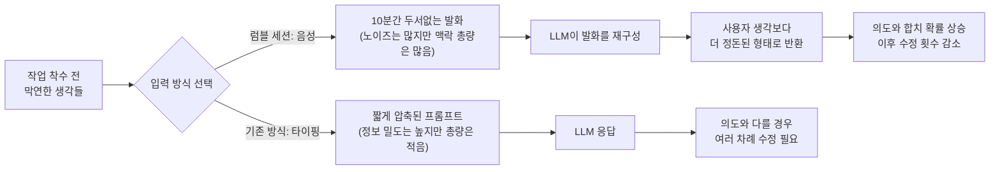
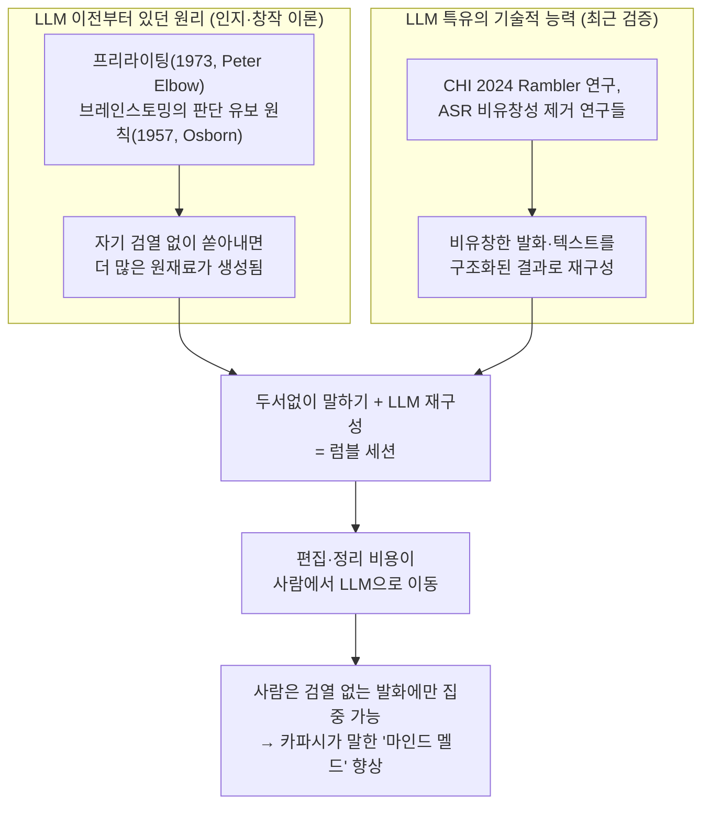

> One pattern I find useful for working with LLMs is a nice long ramble session. Sometimes the LLM needs more bits to understand what you're trying to achieve, but you're too lazy to type them. In these cases I like to lean back, switch to /voice and just ramble for like 10 minutes, total mess, anything goes, full stream of consciousness. Sometimes I declare it up top, something like "switching to speech recognition sorry for any typos...". Sometimes I turn it into a small interview of a few turns. But I find that the LLMs are somehow very good at reconstructing long incoherent rambles and often their echo of your own tangle of thoughts comes out quite a bit cleaner than what you started with. The result is that you improve the mind meld and have to correct things less from that point on. [https://x.com/karpathy/status/2079610838143623371](https://x.com/karpathy/status/2079610838143623371)

> 
> 안드레이 카파시가 "자기가 AI 쓰는 방식" 하나 공개
> 
> 요약하면 '프롬프트를 정성껏 안쓰고, 그냥 10분 동안 말로 떠들어라'입니다.
> 
> 카파시는 뭔가 시킬 때 등을 뒤로 젖히고 음성 입력으로 전환한 다음, 10분 정도 의식의 흐름대로 막 말한다고 합니다. 정리 안 된 채로요.
> 
> AI가 내 의도를 제대로 이해하려면 '정보 조각'이 더 많이 필요한데, 그걸 일일이 타이핑하기가 귀찮다는 거예요. 말로 하면 그 귀찮음이 사라집니다. 손으로 칠 땐 세 줄로 줄이던 걸, 말로는 3분씩 풀어놓게 되거든요. (컨텍스트가 풍부해짐)
> 
> 카파시는 이 떠들기를 짧은 인터뷰(정말 좋음. 이거 안하는 사람은 없겠죠)처럼 몇 번 주고받는 형태로 바꾸기도 한다고 합니다. 내가 일방적으로 쏟아내는 대신, AI가 '그건 왜요?' '이건 어떻게 하고 싶어요?' 하고 질문하게 두는 거예요.
> 
> 혼자 말하다 보면 정작 중요한 걸 빼먹기 쉬운데, 질문을 받으면 미처 생각 못 한 부분까지 끌려 나옵니다.
> 
> 나와 AI 사이의 '생각의 싱크'가 맞아갑니다. 서로 코드가 맞으니까, 그다음부터는 결과를 고쳐 쓰는 일이 확 줄어들고요.
> 
> https://www.threads.com/@aicoffeechat/post/DbExZXbk-2p
> 

## 1. 무슨 일이 있었나

2026년 7월 21일 오전 9시 53분(미국 태평양시간 기준, 한국 시간으로는 7월 22일 새벽 1시 53분), 오픈AI 창립 멤버이자 테슬라 AI 총괄을 지냈고 현재는 AI 교육 스타트업 유레카 랩스(Eureka Labs)를 이끌고 있는 안드레이 카파시가 X(옛 트위터)에 짧은 글 하나를 올렸습니다. 이 게시물은 이후 하루 만에 1.2M회 이상의 조회수를 기록하며 AI 업계 커뮤니티에서 빠르게 퍼져나갔고, 여러 팔로워 계정들이 각자의 경험을 덧붙이며 리트윗과 인용을 이어갔습니다.

내용은 한 줄로 요약하면 이렇습니다. **"AI에게 뭔가를 시킬 때, 정성 들여 프롬프트를 다듬지 말고 그냥 10분 동안 음성으로 두서없이 떠들어라."**

카파시가 설명한 방식은 대략 이렇습니다. 그는 LLM에게 복잡하거나 맥락이 많이 필요한 작업을 시킬 때, 등을 뒤로 기대고 음성 입력 모드로 전환한 뒤 약 10분 정도 정리되지 않은 상태로 생각나는 대로 말합니다. 완전히 뒤죽박죽이어도 상관없고, 의식의 흐름 그대로 흘러가도 괜찮다는 것이 핵심입니다. 때로는 시작할 때 "지금부터 음성 인식으로 전환하니 오타가 있어도 양해해 달라"고 미리 알리기도 하고, 어떤 때는 이 과정을 AI와 몇 차례 주고받는 짧은 인터뷰 형식으로 바꾸기도 합니다. 그런데 그가 발견한 것은, LLM이 이렇게 길고 앞뒤가 안 맞는 말들을 놀라울 정도로 잘 재구성해낸다는 점입니다. 오히려 사용자 자신이 처음 말했을 때보다 훨씬 깔끔하게 정리된 형태로 되돌려주는 경우가 많다고 합니다. 그 결과로 AI와 사용자 사이의 "생각의 싱크"가 더 잘 맞아떨어지고, 이후 결과물을 수정해야 하는 일이 줄어든다는 것이 카파시의 경험적 주장입니다.

## 2. 왜 이 방법이 통하는가 — 구조적으로 뜯어보기

이 패턴이 흥미로운 이유는 단순히 "말하는 게 타이핑보다 편하다"는 차원을 넘어서기 때문입니다. 핵심은 정보량의 차이에 있습니다. 사람이 키보드로 프롬프트를 작성할 때는 무의식적으로 문장을 압축합니다. 세 줄이면 충분하다고 느끼고 멈추는 경우가 대부분입니다. 반면 음성으로 말할 때는 같은 내용을 훨씬 풀어서 설명하게 됩니다. 배경 설명, 예외 상황, 왜 이렇게 하고 싶은지에 대한 이유, 심지어 스스로도 확신하지 못하는 부분까지 입 밖으로 나오게 됩니다.

LLM 입장에서는 이 여분의 "말"이 전부 맥락(context)입니다. 짧고 정제된 프롬프트는 정보 밀도는 높지만 정보량 자체는 적습니다. 반대로 두서없는 10분짜리 독백은 노이즈가 많지만, 모델이 사용자의 실제 의도를 추론하는 데 필요한 단서를 훨씬 더 많이 담고 있습니다. 카파시 본인이 과거에 "프롬프트 엔지니어링"보다 "컨텍스트 엔지니어링"이라는 표현을 선호한다고 밝힌 적이 있는데, 이번 럼블 세션 아이디어는 그 연장선에 있다고 볼 수 있습니다. 즉 짧고 명확한 지시문을 잘 쓰는 기술이 아니라, 모델이 작업을 그럴듯하게 풀어낼 수 있도록 맥락을 최대한 채워 넣는 기술이 중요하다는 관점입니다.

다만 이 인과관계 설명은 카파시가 트윗에서 직접 명시한 내용이 아니라, 그의 과거 발언들과 이번 게시물을 종합했을 때 도출되는 분석적 해석이라는 점은 분명히 해둘 필요가 있습니다.

## 3. 두 가지 실행 방식 — 독백형과 인터뷰형

카파시는 이 럼블 세션을 두 가지 형태로 활용한다고 밝혔습니다.

**독백형**은 말 그대로 사용자가 일방적으로 10분 정도 쏟아내는 방식입니다. 이 경우 시작 시점에 "지금부터 음성 인식으로 전환한다"고 미리 알려서, AI가 오타나 인식 오류를 감안하고 받아들이도록 유도하기도 합니다.

**인터뷰형**은 AI가 몇 차례에 걸쳐 질문을 던지고 사용자가 답하는 형태로 바뀝니다. 이 방식의 장점은 분명합니다. 혼자 떠들다 보면 정작 핵심적인 정보를 빠뜨리기 쉬운데, AI가 "그건 왜 그렇게 하고 싶으신가요?", "이 부분은 구체적으로 어떻게 처리하면 될까요?" 같은 질문을 던지면 사용자가 미처 언어화하지 못했던 부분까지 끌어낼 수 있습니다. 이는 사용자가 게시물에 첨부한 국문 해설(Threads의 aicoffeechat 계정)에서도 강조된 지점으로, 해당 게시자는 이 인터뷰형 방식을 특히 실용적이라고 평가했습니다. 다만 이 평가는 원작자인 카파시가 아니라 이를 소개한 2차 해설자의 개인적 견해라는 점을 구분해서 이해할 필요가 있습니다.

## 4. "/voice"의 정체 — 어느 제품의 기능인가

트윗에서 카파시가 언급한 "/voice로 전환한다"는 표현이 정확히 어떤 제품의 기능을 가리키는지는 트윗 본문만으로는 특정되지 않습니다. 다만 참고할 만한 사실이 있습니다. 앤트로픽의 공식 문서에 따르면, 터미널 기반 코딩 에이전트인 클로드 코드(Claude Code)에는 실제로 `/voice [hold|tap|off]`라는 내장 명령어가 존재하며, 이는 음성 받아쓰기(voice dictation) 기능을 켜고 끄거나 특정 모드로 전환하는 역할을 합니다. 이 기능을 쓰려면 Claude.ai 계정이 필요하다고 문서는 밝히고 있습니다.

즉 "/voice"라는 슬래시 명령어 표기 자체는 실존하는 기능의 명칭과 정확히 일치합니다. 다만 카파시가 이번 트윗에서 구체적으로 클로드 코드의 해당 기능을 지칭한 것인지, 아니면 다른 도구(예: ChatGPT의 음성 모드, OS 자체의 받아쓰기 기능 등)를 가리키며 관용적으로 "/voice"라는 표현을 쓴 것인지는 트윗만으로 단정할 수 없습니다. 이 부분은 명확히 확인되지 않은 지점으로 남겨두는 것이 정확합니다.

일반적으로 음성을 텍스트로 바꿔 LLM에 넣는 경로는 크게 두 가지로 나뉩니다. 하나는 음성을 먼저 텍스트로 변환(STT)한 뒤 그 텍스트를 프롬프트로 제출하는 방식이고, 다른 하나는 오디오 토큰을 모델이 직접 받아들이는 네이티브 음성 대화 방식입니다. 카파시가 묘사한 "10분간 떠들고 LLM이 재구성한다"는 워크플로우는 전자, 즉 받아쓰기 후 텍스트 처리 경로에 가깝습니다.

## 5. 커뮤니티 반응 — 대체로 공감, 일부는 신중론

| 입장 | 주요 반응 요지 | 출처 |
|---|---|---|
| 공감 | 음성 모드로 떠들듯 말했을 때 결과가 눈에 띄게 좋아졌다는 개인 경험 공유 | Austin Lignell (X) |
| 공감 | 자신도 비슷하게, AI가 먼저 인터뷰하듯 질문하고 자신은 음성으로 답하는 워크플로우를 쓴다고 언급 | X 반응 (Digg 집계) |
| 확장 | 음성뿐 아니라 여러 언어를 섞어 쓰거나, 특정 개념은 특정 언어로 표현하는 게 더 쉽다는 점을 덧붙임 | Xiao Ma (X) |
| 확장 | 음성이 훌륭한 방식이라는 데 동의하면서, 음성 외에 다른 모달리티(이미지 등)를 함께 섞는 "멀티모달 프롬프팅"으로 확장할 수 있다고 제안 | elvis/Omar Sanseviero (X) |
| 신중론 | 이 방식을 예전에 즐겨 썼지만, 계속 이렇게 하다 보니 스스로 글쓰기 능력이 점점 무뎌지는 느낌을 받았다고 언급. AI 출력을 읽은 뒤 자신의 이해를 직접 요약된 불릿포인트로 다시 타이핑하는 습관이 도움이 되었다고 덧붙임 | Jerry Liu, LlamaIndex 공동창업자(X) |

이 표에서 특히 눈여겨볼 대목은 마지막 줄, 제리 리우(LlamaIndex 공동창업자)의 반응입니다. 그는 이 방식에 반대하지는 않지만, 생각을 전부 음성으로 쏟아내고 AI에게 정리를 맡기는 습관이 길어지면 "스스로 사고를 벼리는" 능력이 둔화될 수 있다는 우려를 제기했습니다. 그의 해법은 AI의 출력을 그대로 받아들이지 않고, 그것을 읽은 후 자기 나름의 이해를 다시 손으로 요약하는 과정을 추가하는 것이었습니다.

이 지점은 실행(execution)을 AI에 맡기는 것과 판단(judgment)까지 AI에 위임하는 것 사이의 경계선과 맞닿아 있는 논의입니다. 럼블 세션 자체는 "설명을 잘 하기 위한 방법"이라는 점에서 실행 레이어에 가깝지만, 그 결과로 나온 정리된 사고 체계를 검증 없이 그대로 받아들이기 시작하면 판단의 영역까지 아웃소싱하게 될 위험이 있다는 것이 제리 리우가 지적한 지점이라고 볼 수 있습니다.

## 6. 실전에서 어떻게 적용할 것인가

이 방법을 실제로 써보고 싶다면 다음과 같은 순서를 고려해볼 수 있습니다.

1. **작업의 성격을 먼저 판단합니다.** 단순하고 명확한 지시(예: "이 함수의 버그를 고쳐줘")라면 굳이 럼블 세션이 필요 없습니다. 이 방법이 빛을 발하는 경우는 배경 설명이 많이 필요하거나, 여러 제약 조건이 얽혀 있거나, 스스로도 아직 완전히 정리되지 않은 아이디어를 다룰 때입니다.

2. **음성 입력 경로를 확보합니다.** 사용 중인 도구에 내장 음성 기능이 있는지 먼저 확인하고(예: 클로드 코드의 `/voice` 명령), 없다면 OS 차원의 받아쓰기 기능이나 별도의 음성 인식 도구를 활용합니다.

3. **완벽하게 말하려 하지 않습니다.** 이 방법의 요점은 정제된 문장을 말하는 것이 아니라, 두서없이 떠오르는 대로 맥락을 쏟아내는 것입니다. 오타나 문법 오류, 말이 꼬이는 것을 신경 쓸 필요가 없습니다.

4. **필요하다면 인터뷰 형식으로 전환합니다.** 혼자 말하는 것이 막막하다면, AI에게 먼저 질문을 던지도록 요청하고 그에 답하는 식으로 대화를 이어가는 것도 방법입니다.

5. **결과물을 그대로 수용하지 않고 검증합니다.** 제리 리우의 지적처럼, LLM이 재구성해준 결과가 실제로 자신의 의도와 일치하는지 스스로 다시 읽고 판단하는 단계를 생략하지 않는 것이 중요합니다. 이 단계를 건너뛰면 사고의 주도권이 서서히 AI 쪽으로 넘어갈 수 있습니다.

## 7. 사실관계 확인 (Fact-Check)

문서 작성 과정에서 확인한 출처와 확인 수준을 구분해 정리합니다.

- **1차 확인**: 카파시의 X 게시물 원문 내용은 이 트윗을 실시간으로 수집·인용한 뉴스 애그리게이터(Digg)의 게시물을 통해 원문 그대로 대조 확인했습니다. 게시 시각(태평양시간 오전 9시 53분, 2026년 7월 21일)과 캡처 화면상의 한국시간(7월 22일 새벽 1시 53분) 사이에 정확히 16시간의 시차가 존재해, 두 기록이 동일한 게시물을 가리키고 있음을 교차 확인했습니다.
- **1차 확인**: 클로드 코드의 `/voice` 명령어는 앤트로픽 공식 문서(code.claude.com/docs/en/commands)에서 직접 확인했습니다. 다만 카파시의 트윗이 이 특정 기능을 지칭한 것인지는 확인되지 않았습니다.
- **2차 확인(제3자 인용)**: 트윗에 달린 여러 반응들(Austin Lignell, Xiao Ma, elvis/Omar Sanseviero, Jerry Liu 등)은 Digg의 실시간 반응 수집 페이지를 통해 확인했으며, 각 반응은 해당 X 게시물 링크와 함께 제공되었습니다.
- **분석적 해석**: "왜 이 방법이 통하는가"에서 제시한 정보량·맥락 밀도 설명, 그리고 "실행 레이어 대 판단 레이어" 프레이밍은 카파시가 트윗에서 직접 언급한 내용이 아니라, 그의 과거 발언(컨텍스트 엔지니어링 관련 언급)과 이번 게시물, 그리고 제리 리우의 반응을 종합해 도출한 분석입니다.
- **미확인**: 사용자가 참고한 Threads 게시물(@aicoffeechat)의 한국어 해설 원문은 해당 플랫폼이 자동화된 접근을 차단하고 있어 직접 재확인하지 못했습니다. 다만 게시물에 포함된 카파시 트윗 원문 인용은 위 1차 확인을 통해 정확함을 별도로 검증했습니다.

## 8. 용어 정리

| 한국어 표현 | 원어 | 의미 |
|---|---|---|
| 럼블 세션 | Ramble Session | 정리되지 않은 상태로 길게 말을 쏟아내며 AI에게 맥락을 전달하는 방식 |
| 컨텍스트 엔지니어링 | Context Engineering | 짧은 지시문 작성이 아니라, 작업을 풀어낼 수 있도록 맥락 전체를 채워 넣는 기술 |
| 음성 받아쓰기 | Voice Dictation | 음성을 텍스트로 변환해 프롬프트로 제출하는 입력 방식 |
| 스트림 오브 컨셔스니스 | Stream of Consciousness | 논리적 순서 없이 떠오르는 생각을 그대로 나열하는 서술 방식 |
| 마인드 멜드 | Mind Meld | 카파시가 사용한 표현으로, 사용자와 AI 사이 의도 이해가 합치되는 상태를 비유 |
| 판단 레이어 / 실행 레이어 | Judgment Layer / Execution Layer | 사고와 결정을 담당하는 영역과, 이를 수행·처리하는 영역을 구분하는 분석 틀 |

## 부록. "앞뒤가 안 맞는 말을 LLM이 잘 정리해준다"는 것은 LLM만의 특성인가, 원래 그런 방법론이 유효했던 것인가

본문 2절에서 다룬 핵심 현상, 즉 "두서없이 쏟아낸 말을 LLM이 사용자 본인보다 더 깔끔하게 재구성해준다"는 대목을 조금 더 파고들 필요가 있습니다. 이 현상을 제대로 이해하려면 질문을 둘로 쪼개야 합니다. 첫째, 앞뒤가 안 맞는 상태로 말을 쏟아내는 것 자체가 사고 생산에 원래부터 도움이 되는 방법인가. 둘째, 그렇게 쏟아낸 원재료를 다시 깔끔하게 정리해주는 능력이 LLM 특유의 것인가. 조사해보면 이 둘은 서로 다른 층위의 이야기이고, 둘 다 사실입니다. 다만 각각의 근거와 성격이 다르므로 나누어 설명합니다.

### 부록-1. 인간 인지 차원 — "앞뒤 안 맞게 쏟아내기"는 LLM 이전부터 검증된 방법론

두서없이 말하거나 쓰는 행위 자체가 창작과 문제해결에 도움이 된다는 발상은 LLM이 등장하기 훨씬 전부터 문헌으로 정립되어 있었습니다.

가장 대표적인 사례가 **프리라이팅(Freewriting)** 입니다. 1973년 작문 이론가 피터 엘보(Peter Elbow)가 체계화한 이 기법은, 손을 멈추지 않고 문법이나 논리를 신경 쓰지 않은 채 떠오르는 대로 계속 써 내려가는 방식입니다. 이 기법의 핵심 근거는 "스스로 검열하는 과정에서 좋은 아이디어를 놓치게 될 확률을 줄인다"는 데 있습니다. 즉 사람은 뭔가를 말하거나 쓸 때 동시에 "이게 말이 되나?", "이렇게 표현해도 되나?"라고 자기 검열을 하게 되는데, 이 검열 과정 자체가 정보의 유실을 일으킨다는 것입니다. 프리라이팅은 이 검열 스위치를 강제로 꺼버림으로써 더 많은 원재료를 확보하는 전략입니다.

**브레인스토밍**의 창시자로 알려진 알렉스 오스본(Alex Osborn)이 1957년 제시한 원칙 중 하나도 정확히 같은 지점을 겨냥합니다. "판단을 유보하라(defer judgment)"는 원칙, 즉 아이디어를 내는 단계에서는 평가와 비판을 미뤄야 한다는 원칙입니다. 이 역시 검열과 생성을 분리해야 더 많은 아이디어가 나온다는 발상에 기반합니다.

이 두 사례에서 알 수 있는 것은, 카파시가 말한 "총체적 난장판(total mess), 뭐든 괜찮음(anything goes)"이라는 표현이 결국 프리라이팅과 브레인스토밍이 반세기 전부터 강조해온 원칙과 본질적으로 같은 논리를 따르고 있다는 점입니다. 다시 말해 **"정리되지 않은 상태로 쏟아내는 것 자체가 더 많은 정보와 아이디어를 만들어낸다"는 원리는 LLM과 무관하게 이미 검증되어 있던 인간 인지·창작 이론**입니다.

### 부록-2. LLM 차원 — "쏟아낸 것을 재구성하는 능력"은 실제로 기술적 근거가 있는 특성

그렇다면 카파시가 말한 "LLM이 유독 이걸 잘한다"는 부분은 어떨까요. 이 부분은 실제로 학계 연구에서 별도로 다뤄진 주제입니다.

가장 직접적으로 관련된 연구는 2024년 CHI(인간-컴퓨터 상호작용 분야 최고 권위 학회) 논문 **"Rambler: Supporting Writing With Speech via LLM-Assisted Gist Manipulation"** 입니다. 이 논문은 정확히 카파시가 트윗에서 묘사한 문제 상황, 즉 "말로 받아쓰기를 하면 말은 빠르지만 결과물이 장황하고 앞뒤가 안 맞아서(disfluent, wordy, incoherent) 다듬는 데 손이 많이 간다"는 문제를 다룹니다. 연구진은 이 문제를 해결하기 위해 LLM이 자동으로 받아쓰기 원문의 군더더기와 어색한 표현을 정리하고, 끊긴 문장을 자연스럽게 이어붙이는 기능을 만들었고, 12명을 대상으로 한 비교 실험에서 이 방식이 일반적인 음성 받아쓰기 편집기보다 더 나은 결과를 냈다고 보고했습니다. 이는 카파시 개인의 경험적 주장이 실제로 HCI 학계에서 별도로 검증된 현상과 일치한다는 것을 보여줍니다.

또한 음성인식(ASR) 및 자연어처리 분야에서는 최근 LLM을 활용해 발화 중 더듬거림, 반복, 끊긴 문장 같은 비유창성(disfluency)을 탐지하고 제거하는 연구가 다수 진행되고 있습니다. 예를 들어 GPT-4o 계열 모델을 이용해 토론 발화 녹취록에서 비유창성 요소를 식별하고 제거하는 연구, 그리고 오디오와 텍스트 단서를 함께 활용해 비유창성이 섞인 발화를 매끄럽게 다듬는 "Smooth-LLaMa" 계열 연구 등이 이에 해당합니다. 이런 연구들은 대체로 최신 LLM이 이 작업에서 상당히 높은 수준의 성능을 보인다고 보고합니다.

다만 이 능력이 무한하거나 완벽한 것은 아닙니다. 2025년 발표된 한 연구(대화체 발화의 구조적 견고성을 다룬 "DRES" 관련 논문)는 LLM이 대화체의 심하게 비유창한 발화를 처리할 때 구조적인 이해 실패를 보이는 경우가 있다고 지적합니다. 즉 비유창성의 정도가 특정 수준을 넘어서면 LLM도 재구성에 실패하거나 원래 의도를 왜곡할 수 있다는 것입니다. 따라서 "LLM은 아무리 두서없어도 항상 완벽하게 정리해준다"는 식의 절대적 진술은 과장이며, 실제로는 "상당히 잘 처리하되, 한계도 존재하는" 정도로 이해하는 것이 정확합니다.

### 부록-3. 종합 — 두 가설은 대립하지 않고 결합되어 있다

정리하면, 사용자가 던진 질문 — "이게 LLM 특성인가, 아니면 원래 이런 두서없는 브레인스토밍이 더 좋은 방법이었던 건가" — 에 대한 답은 **"둘 다"** 입니다. 다만 그 관계를 정확히 표현하면 이렇습니다.

- **원리 자체(왜 두서없이 쏟아내는 것이 더 나은 원재료를 만드는가)는 LLM 이전부터 존재했던 인지·창작 이론**입니다. 자기 검열을 유보하면 더 많고 다양한 정보가 표면에 떠오른다는 것은 프리라이팅과 브레인스토밍 이론이 반세기 넘게 주장해온 바입니다.
- **그 원재료를 실용적인 결과물로 되돌려주는 "편집자" 역할을 LLM이 새롭게, 그리고 상당히 효과적으로 수행할 수 있게 되었다는 점은 LLM 고유의, 비교적 최근에 확인된 기술적 능력**입니다. 이는 CHI 2024 논문 등에서 별도로 검증되었습니다.

즉 LLM이 등장하기 전에도 "두서없이 쏟아내는 것"은 좋은 방법이었지만, 그렇게 쏟아낸 뒤 그것을 다시 읽을 수 있는 형태로 정리하는 작업은 결국 사람이 직접 손으로 해야 하는 노동이었습니다. 프리라이팅 이론에서도 "쏟아낸 다음에는 나중에 판단하라(you can judge later)"고 안내하지만, 그 "나중에 판단하고 정리하는" 단계는 여전히 품이 많이 드는 일이었습니다. LLM이 실질적으로 바꾼 것은 이 뒷단, 즉 편집·정리 비용을 거의 0에 가깝게 낮췄다는 점입니다. 카파시가 말한 "마인드 멜드가 좋아진다"는 표현은 결국 이 편집 비용이 사라지면서, 사람은 검열 없이 쏟아내는 데만 집중하고 정리는 LLM에 맡길 수 있게 된 상황을 가리킨다고 해석할 수 있습니다.

### 부록-4. 사실관계 확인 (이 부록 한정)

- **학술적으로 확인됨**: 프리라이팅(Peter Elbow, 1973)과 브레인스토밍의 판단 유보 원칙(Alex Osborn, 1957)은 작문 이론 및 창의성 연구 문헌에서 널리 인정된 개념입니다.
- **학술적으로 확인됨**: LLM을 이용해 받아쓰기 과정의 비유창성을 정리하는 접근은 2024년 CHI 논문("Rambler")에서 실증적으로 검증되었으며, 별도의 ASR·비유창성 제거 관련 연구들에서도 다뤄지고 있습니다.
- **학술적으로 확인됨(한계 지적)**: 대화체의 심한 비유창성 앞에서는 LLM의 구조적 이해가 실패할 수 있다는 점이 2025년 관련 연구에서 지적되었습니다. 이는 럼블 세션 방식이 모든 상황에서 만능은 아니라는 균형 잡힌 근거로 볼 수 있습니다.
- **분석적 해석**: "편집 비용이 사람에서 LLM으로 이동했다"는 종합 설명과 이를 나타낸 다이어그램은 카파시의 트윗이나 위 학술 자료가 직접 명시한 내용이 아니라, 위 근거들을 종합해 도출한 해석입니다.

## 9. 참고 자료

- 안드레이 카파시 원문 게시물: https://x.com/karpathy/status/2079610838143623371
- 실시간 반응 수집 및 원문 대조: https://digg.com/tech/h5xv3kka
- 클로드 코드 공식 명령어 문서(`/voice` 포함): https://code.claude.com/docs/en/commands
- 사용자가 최초 접한 2차 해설: https://www.threads.com/@aicoffeechat/post/DbExZXbk-2p (자동화 접근 제한으로 직접 재확인은 불가하였음)
- CHI 2024 논문, "Rambler: Supporting Writing With Speech via LLM-Assisted Gist Manipulation": https://dl.acm.org/doi/10.1145/3613904.3642217
- 프리라이팅 기법 개요(MIT Writing Process): https://writingprocess.mit.edu/process/step-1-generate-ideas/instructions/freewriting/
- 비유창성 제거 관련 LLM 연구("Smooth-LLaMa" 계열): https://arxiv.org/html/2506.18510
- 대화체 비유창성 처리의 구조적 한계를 다룬 연구("DRES" 관련): https://arxiv.org/pdf/2509.20321
