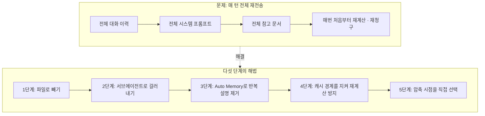
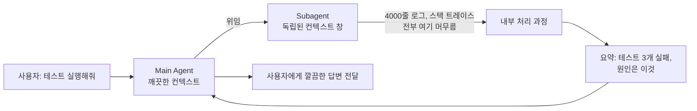
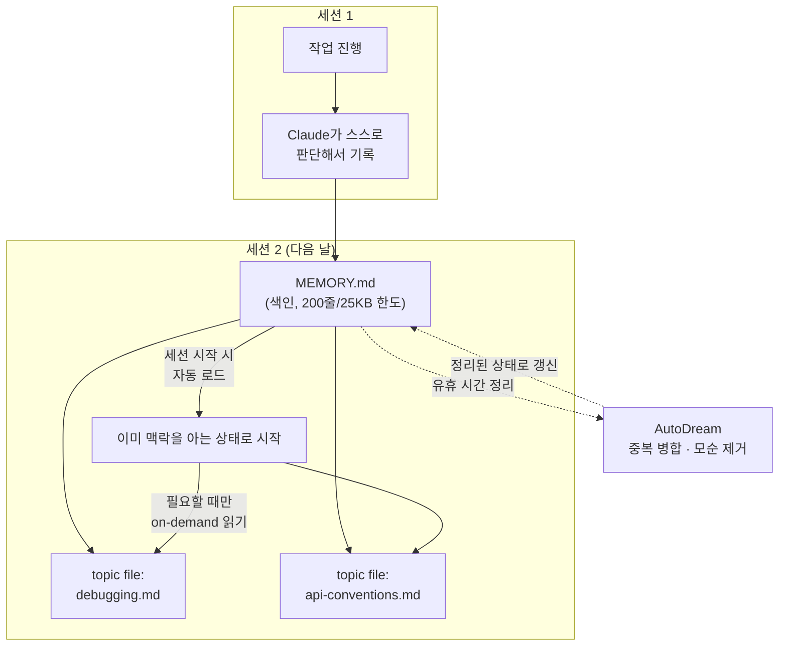
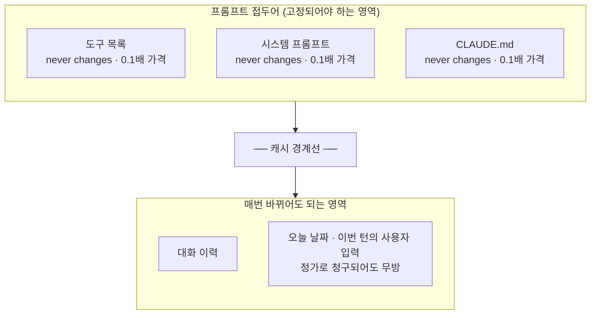
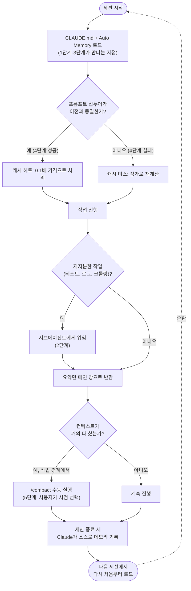

## 목차

1. 이 문서가 다루는 두 개의 원문
2. 문제의 출발점: 왜 에이전트는 매번 돈을 더 내면서도 방금 한 말을 잊어버리는가
3. 1단계 — 컨텍스트를 창 밖으로 꺼내기
4. 2단계 — 지저분한 작업을 서브에이전트에게 넘기기
5. 3단계 — 스스로 관리되는 메모리: Auto Memory와 AutoDream
6. 4단계 — 캐시를 깨뜨리지 않기: 프롬프트 캐싱의 경제학
7. 5단계 — 컨텍스트를 손으로 관리하기: /context와 /compact
8. 다섯 단계를 하나의 시스템으로 묶으면
9. 곁가지 원문: Kimi(문샷 AI) CEO 인터뷰와 "Claude가 이긴 이유"라는 주장
10. 사실 확인 결과 총정리 — 무엇이 검증되었고 무엇이 검증되지 않았는가
11. 참고자료

---

## 1. 이 문서가 다루는 두 개의 원문

[**Build self-managed agent system that uses 90% fewer tokens in 5 steps : subagents, memory, context**](https://x.com/0xcodila/status/2077780537016488197)

업로드된 자료는 서로 다른 두 개의 소셜미디어 게시물 묶음으로 이루어져 있습니다. 하나는 X(옛 트위터)의 @0xCodila라는 계정이 7월 17일에 올린 스레드로, Claude Code를 비롯한 에이전트형 코딩 도구를 사용할 때 토큰 사용량을 최대 90%까지 줄일 수 있다고 주장하며 다섯 가지 실천 단계를 설명하는 내용입니다. 이 스레드는 다섯 장의 다이어그램 이미지를 함께 첨부하고 있으며, 각 이미지는 "컨텍스트를 창 밖으로 꺼내기", "서브에이전트에게 소음 떠넘기기", "스스로 청소하는 메모리", "캐시 깨지 않기", "컨텍스트를 손으로 관리하기"라는 다섯 단계에 각각 대응합니다.

```
https://x.com/sumika45379/status/2079531837559558455

【保存推奨】
Kimi CEOの「Claudeはなぜ勝ったか」解説、視点がレベチだった😳
しかも90分のガチ講義。
x.com/0xCodila/statu…

この講義の何がヤバいかというと、、、
・Claudeの勝因は推論力じゃなく「agentsへの全賭け」という分析
・どんな賢いagentも、設定を1個間違えるだけで普通に失敗するという現場の話
・「次のモデルを作るのはagent skills」という開発のリアル

ライバル会社のトップが、Claudeの強さを一番正確に言語化してるの面白すぎる。

つまりこれ、モデル比較じゃなくて「エージェント設計の勝ち筋」の話なんだよね✨

エージェント設計の基礎はこの記事で押さえるのが早い。
この下の記事を読むと理解が一気に深まる。マジでおすすめ👇😻

```

다른 하나는 일본어 계정 @sumika45379가 공유한 게시물로, Kimi(문샷 AI, Moonshot AI)의 CEO가 출연한 90분 분량의 인터뷰 영상을 소개하며 "라이벌 회사의 대표가 Claude의 강점을 가장 정확하게 언어화했다"는 평가를 담고 있습니다. 이 게시물은 원본 인터뷰가 아니라 그것을 요약·해설한 2차 게시물이며, 원문의 구체적 발언을 그대로 옮긴 것이라기보다 게시자 본인의 해석이 상당 부분 섞여 있다는 점을 먼저 밝혀둘 필요가 있습니다.

이 문서는 두 원문의 주장 하나하나를 있는 그대로 받아 적는 대신, 2026년 7월 22일 현재 시점에서 실제로 확인 가능한 공식 문서와 독립적인 보도를 대조하여, 어디까지가 사실로 확인되고 어디부터가 원문 작성자의 주장 또는 해석인지를 구분해서 설명합니다.

---

## 2. 문제의 출발점: 왜 에이전트는 매번 돈을 더 내면서도 방금 한 말을 잊어버리는가

원문 스레드가 지적하는 현상은 실제로 대형 언어 모델 기반 에이전트를 다뤄본 사람이라면 누구나 겪는 구조적인 문제입니다. 대화형 API는 기본적으로 상태를 저장하지 않는 방식으로 동작합니다. 매 턴마다 그동안 나눈 대화 전체, 시스템 프롬프트, 도구 목록, 참고 문서를 처음부터 다시 모델에 통째로 보내야 하고, 모델은 그것을 매번 처음 보는 것처럼 다시 처리합니다. 세션이 끝나면 그 안에서 쌓인 맥락은 사라지고, 다음 세션은 다시 빈 상태에서 시작됩니다. 결과적으로 사용자는 같은 내용을 반복해서 설명해야 하고, 그 반복되는 설명 전체에 대해 매번 요금을 지불하게 됩니다.

이 문제를 완화하는 방법은 크게 두 갈래로 나뉩니다. 하나는 애초에 컨텍스트 창에 들어가는 내용의 양 자체를 줄이는 것이고, 다른 하나는 반복되는 부분을 캐싱해서 다시 계산하지 않도록 만드는 것입니다. 원문 스레드의 다섯 단계는 정확히 이 두 갈래를 각각 다른 각도에서 공략합니다. 1단계와 2단계는 애초에 창에 들어가는 내용의 양을 줄이는 접근이고, 3단계는 반복 설명 자체를 없애는 접근이며, 4단계는 캐싱의 효과를 극대화하는 접근이고, 5단계는 컨텍스트가 다 찼을 때 발생하는 자동 압축의 타이밍을 사용자가 직접 통제하는 접근입니다.



---

## 3. 1단계 — 컨텍스트를 창 밖으로 꺼내기


원문의 첫 번째 다이어그램은 "이전(Before)"과 "이후(After)"를 대비시킵니다. 이전 방식에서는 10만 8천 토큰짜리 책 전체를 매 질문마다 프롬프트에 통째로 밀어 넣었고, 이후 방식에서는 그 책을 디스크의 파일로 남겨두고 모델이 필요할 때 검색어로 찾아 필요한 부분만 읽도록 했다는 것이 핵심 비유입니다. 이 숫자 자체는 원문 작성자가 예시로 든 것이므로 정확한 수치라기보다 "전체를 다 넣는 것"과 "필요한 조각만 읽는 것" 사이의 차이가 얼마나 극적일 수 있는지 보여주기 위한 예시로 이해하는 편이 안전합니다.

이 원리는 실제로 Claude Code의 설계 철학과 정확히 일치합니다. Claude Code는 세션을 시작할 때 프로젝트 전체를 컨텍스트에 밀어 넣지 않고, 대신 CLAUDE.md라는 지침 파일과 Auto Memory라는 자동 메모리 디렉터리를 세션 시작 시점에 로드한 뒤, 나머지는 파일 읽기·검색 도구를 통해 필요한 순간에만 끌어오는 방식으로 동작하도록 설계되어 있습니다<sup>[1]</sup>. 공식 문서에 따르면 CLAUDE.md 파일은 200줄을 넘지 않는 것이 권장되며, 파일이 길어질수록 컨텍스트를 더 많이 소비할 뿐 아니라 지침 준수율 자체가 떨어진다는 점이 명시되어 있습니다<sup>[1]</sup>. 큰 프로젝트일수록 지침을 하나의 거대한 파일에 몰아넣지 말고, 주제별로 나눈 파일들을 `.claude/rules/` 디렉터리에 배치하여 특정 파일 형식이나 경로를 다룰 때만 해당 규칙이 로드되도록 구성하라는 것이 공식 권고 사항입니다<sup>[1]</sup>.

정리하면, 이 단계의 핵심 발상은 "모델이 알아야 할 모든 것을 프롬프트 앞머리에 미리 다 적어 두는" 습관에서 벗어나, "필요한 자료는 파일 시스템에 두고 도구 호출로 그때그때 읽어 오게 하는" 방향으로 전환하는 것입니다. 이렇게 하면 정적인 참고 자료의 크기가 아니라 실제로 그 순간에 필요한 조각의 크기만큼만 비용을 지불하게 됩니다.

---

## 4. 2단계 — 지저분한 작업을 서브에이전트에게 넘기기


두 번째 다이어그램은 메인 에이전트와 서브에이전트를 나누어 그립니다. 테스트를 실행하라고 지시하면, 4천 줄에 달하는 로그와 스택 트레이스 같은 지저분한 출력물은 서브에이전트의 별도 창 안에서만 발생하고, 메인 에이전트에게는 "테스트 세 개가 실패했고 이유는 이렇다"는 요약문 하나만 돌아온다는 것이 이 단계의 비유입니다.

이 설명은 Anthropic의 공식 문서가 서브에이전트를 소개하는 방식과 정확히 일치합니다. 서브에이전트는 메인 에이전트가 파생시키는 독립적인 에이전트 인스턴스로, 컨텍스트를 격리하고 여러 분석을 병렬로 수행하며 메인 에이전트의 프롬프트를 늘리지 않으면서 특화된 지침을 적용하는 데 사용하도록 설계되어 있습니다<sup>[5]</sup>. 서브에이전트가 파일을 수십 개 열어보거나 도구를 수백 번 호출하더라도, 그 중간 과정의 도구 호출과 결과는 서브에이전트 내부에만 남고 메인 대화창에는 서브에이전트의 최종 메시지 하나만 반환됩니다<sup>[5]</sup>. 실제로 리서치 성격의 서브에이전트를 예로 들면, 수십 개 파일을 탐색하더라도 그 파일 내용이 메인 대화창에 누적되지 않는다는 점이 명시적으로 설명되어 있습니다<sup>[5]</sup>.

한 가지 짚어둘 부분은, 서브에이전트가 시작될 때 메인 대화의 Auto Memory(3단계에서 다룰 자동 메모리)는 함께 로드되지 않는다는 점입니다. 예외적으로 "포크(fork)" 방식으로 생성된 서브에이전트만 부모 대화와 시스템 프롬프트를 그대로 물려받으며, 일반적인 서브에이전트는 자신만의 독립적인 메모리 디렉터리를 가질 수 있도록 별도로 설정해야 합니다<sup>[1]</sup>. 이는 서브에이전트를 설계할 때 "메인 세션이 알고 있는 모든 맥락을 서브에이전트도 당연히 알고 있을 것"이라고 가정하면 안 된다는 뜻이기도 합니다.



---

## 5. 3단계 — 스스로 관리되는 메모리: Auto Memory와 AutoDream


원문 스레드는 이 단계를 "미친 부분(the crazy part)"이라고 표현하며 가장 강조합니다. 주장의 핵심은, Claude Code가 세션이 끝날 때마다 스스로 노트를 작성해 다음 세션이 시작될 때 그 노트를 다시 불러온다는 것이며, 사용자는 아무것도 따로 작성할 필요가 없고 무엇을 남길지는 Claude가 알아서 판단한다는 것입니다.

이 부분은 확인 결과 실제로 존재하는 기능이며, 원문의 설명이 대체로 정확합니다. Anthropic 공식 문서에 따르면 Auto Memory는 기본값으로 켜져 있는 기능으로, Claude가 작업하면서 빌드 명령어, 디버깅 통찰, 아키텍처 관련 메모, 코드 스타일 선호, 작업 습관 같은 것들을 스스로 저장합니다<sup>[1]</sup>. Claude는 매 세션마다 무언가를 저장하는 것이 아니라, 그 정보가 미래의 대화에서 쓸모가 있을지를 스스로 판단해서 저장 여부를 결정합니다<sup>[1]</sup>. 이 기능은 2026년 2월 말에서 3월 초 사이에 공개되었고, 별도의 대대적인 발표 없이 조용히 배포되었다는 점이 여러 독립적인 리뷰 글에서 공통적으로 언급됩니다<sup>[2][3]</sup>.

메모리가 저장되는 위치는 각 프로젝트마다 별도로 존재하는 디렉터리(`~/.claude/projects/<project>/memory/`)이며, 그 안에는 `MEMORY.md`라는 색인 파일과 필요에 따라 만들어지는 주제별 파일들(`debugging.md`, `api-conventions.md` 등)이 함께 들어갑니다<sup>[1]</sup>. 여기서 원문 스레드가 제안한 실천 방법, 즉 "`/memory` 명령으로 이미 기록된 내용을 확인하고, CLAUDE.md에서 중복되는 부분을 지우고, MEMORY.md는 목차 역할만 하도록 만들라"는 조언은 공식 문서의 설계 의도와 정확히 일치합니다. 실제로 `MEMORY.md`는 매 세션 시작 시 처음 200줄 또는 25킬로바이트 중 먼저 도달하는 한도까지만 로드되며, 그 이상의 내용은 세션 시작 시점에 불러와지지 않습니다<sup>[1]</sup>. 따라서 `MEMORY.md`를 목차처럼 짧게 유지하고 세부 내용은 별도 주제 파일로 분리해서, Claude가 필요할 때만 그 주제 파일을 읽어 들이도록 하는 것이 실제로 권장되는 사용법입니다<sup>[1]</sup>.

한 가지 원문에는 없지만 짚고 넘어갈 만한 사실은, Auto Memory가 세션을 거듭할수록 중복되거나 상충하는 기록으로 지저분해질 수 있다는 점입니다. 이를 해결하기 위해 Anthropic은 "AutoDream"이라는 별도의 메모리 정리 기능도 운영하고 있으며, 이는 생물학적 기억이 렘수면 동안 정리되는 과정에 비유되어 이름 붙여진 백그라운드 서브에이전트로, 중복된 기록을 병합하고 상충하는 사실을 제거하며 상대적 날짜 표현을 절대 날짜로 바꾸는 등의 정리 작업을 유휴 시간에 수행합니다<sup>[4]</sup>. 원문 스레드가 인용한 출처 표기 중 "Anthropic - Agent memory & dreaming"이라는 문구는 바로 이 AutoDream 기능을 가리키는 것으로 보이며, 이 부분에서만큼은 원문의 근거 표기가 실제로 존재하는 기능과 부합합니다.



---

## 6. 4단계 — 캐시를 깨뜨리지 않기: 프롬프트 캐싱의 경제학


네 번째 단계는 원문 작성자가 "가장 좋아하는 단계"라고 명시적으로 밝힌 부분입니다. 핵심 주장은 이렇습니다. 프롬프트 맨 앞부분에 오는 안정적인 내용(도구 목록, 시스템 프롬프트, CLAUDE.md)은 첫 턴 이후 캐싱되어 캐시된 토큰은 새 토큰 가격의 10분의 1밖에 되지 않는다는 것, 그리고 이 캐시는 정확히 일치하는 접두어(prefix)에 대해서만 작동하기 때문에 캐시 지점 이전의 내용이 한 글자라도 바뀌면 그 이후 전체가 아무 경고 없이 조용히 정가로 재계산된다는 것입니다.

이 설명은 Anthropic의 프롬프트 캐싱 메커니즘을 정확하게 묘사하고 있습니다. 여러 독립적인 기술 문서를 종합하면, 캐시로 읽은 토큰은 표준 입력 가격의 약 10퍼센트 수준으로 청구되고, 캐시를 새로 쓰는(생성하는) 토큰은 오히려 표준 입력가보다 약간 더 비싸게 청구되며, 이 추가 비용은 이후 여러 번의 캐시 히트를 통해 상쇄되는 구조입니다<sup>[7]</sup>. 캐시는 요청의 접두어와 정확히 일치하는 바이트 시퀀스를 기준으로 작동하기 때문에, 시스템 프롬프트에 매번 바뀌는 타임스탬프를 박아 넣거나, 세션 중간에 모델을 바꾸거나(각 모델은 자신만의 캐시를 유지하므로 모델 전환은 캐시를 처음부터 다시 쓰게 만듭니다), 도구 목록의 순서가 바뀌거나 MCP 도구가 중간에 추가되는 등의 사소한 변화만으로도 그 지점 이후의 캐시가 통째로 무효화된다는 점 역시 실제로 확인되는 사실입니다<sup>[7]</sup>.

원문이 언급한 "GitHub는 94퍼센트를 유지하고 70퍼센트로 떨어지면 버그로 취급한다"는 주장에 대해서는, 정확한 수치까지 확인하지는 못했지만 매우 근접한 근거를 찾을 수 있었습니다. 2026년 4월 말에서 5월 초 사이의 보도에 따르면, GitHub Copilot은 VS Code 1.118 업데이트를 통해 반복되는 컨텍스트에 대해 93퍼센트 이상의 캐시 히트율을 달성하도록 시스템 프롬프트와 도구 정의를 턴 사이에서 안정적으로 유지하는 방식을 채택했다고 밝혔습니다<sup>[9]</sup>. 또한 GitHub Copilot의 "자동 모델 선택" 기능은 세션 중간에 모델을 바꾸는 대신, 새 세션이 시작되는 시점이나 `/compact`가 실행된 직후처럼 캐시가 어차피 새로 시작되는 자연스러운 경계에서만 모델을 전환하도록 설계되어 있는데, 이는 세션 중간의 모델 전환이 캐시를 깨뜨려 오히려 손해가 될 수 있다는 판단에 근거한 것이라고 GitHub 공식 블로그가 직접 설명하고 있습니다<sup>[8]</sup>. 다만 원문에서 인용한 "GitHub 최고제품책임자가 이를 고빈도매매(High-Frequency Trading)에 비유하며 1퍼센트의 효율이 수백만 달러의 가치를 가진다고 말했다"는 구체적인 발언에 대해서는, 이번 조사 과정에서 그 출처를 독립적으로 확인하지 못했습니다. 이는 실제로 있었던 발언일 수도 있지만, 현재로서는 원문 작성자의 주장으로만 남겨두고 사실로 단정하지 않는 것이 안전합니다.

캐시 히트율을 스스로 점검하는 방법에 대한 원문의 조언, 즉 "캐시 읽기 토큰 수를 전체 입력 토큰 수로 나눈 값이 0.7 미만이면 접두어의 어딘가가 매번 바뀌고 있다는 뜻이니 그 원인을 찾아야 한다"는 내용 역시 독립적인 기술 문서에서 실무 점검 기준으로 그대로 등장하는 방법입니다<sup>[7]</sup>.



---

## 7. 5단계 — 컨텍스트를 손으로 관리하기: /context와 /compact


마지막 단계는 Claude Code가 컨텍스트 창이 가득 찼을 때 자동으로 수행하는 "압축(compaction)"을, 사용자가 원하는 시점에 직접 실행하도록 통제권을 가져오라는 제안입니다. 원문은 자동 압축이 예상치 못한 순간에, 이를테면 한창 작업 중일 때 실행되면서 남은 토큰의 상당 부분을 잡아먹을 수 있다고 지적하고, `/context` 명령으로 현재 무엇이 컨텍스트를 많이 차지하고 있는지 확인하고, `/compact` 명령으로 작업 단위가 끝나는 깔끔한 지점에서 스스로 압축을 실행하라고 권합니다.

이 설명 역시 실제 동작과 부합합니다. Claude Code는 컨텍스트 사용량이 모델의 자동 압축 토큰 한도를 넘어서면 자동으로 압축을 실행하며, 이는 오래된 메시지들을 더 짧은 요약으로 대체하는 방식으로 이루어집니다<sup>[10][11]</sup>. 문제는 이 자동 압축이 사용자가 선택한 시점이 아니라 시스템이 판단한 시점에 실행된다는 점이며, 여러 실무자들의 경험담에 따르면 이 자동 압축이 작업 도중 실행될 경우 아키텍처 관련 결정 같은 중요한 맥락이 유실되고 정작 중요하지 않은 내용이 남는 경우가 있어, 작업이 자연스럽게 끊기는 지점(하나의 작업을 마치고 다음 작업을 시작하기 전)에서 수동으로 `/compact`를 실행하는 편이 더 낫다는 실무 조언이 반복적으로 등장합니다<sup>[11]</sup>. 참고로 프로젝트 루트에 있는 CLAUDE.md는 압축이 일어나도 디스크에서 다시 읽혀 세션에 재주입되지만, 하위 디렉터리에 있는 CLAUDE.md 파일은 자동으로 재주입되지 않고 Claude가 그 디렉터리의 파일을 다시 읽을 때 비로소 다시 로드된다는 점도 공식 문서에 명시되어 있습니다<sup>[1]</sup>. 즉 압축 이후에 특정 지침이 사라진 것처럼 보인다면, 그 지침이 대화 중에만 구두로 전달되었거나 아직 다시 로드되지 않은 하위 디렉터리의 CLAUDE.md에 있을 가능성을 먼저 점검해야 합니다.

---

## 8. 다섯 단계를 하나의 시스템으로 묶으면

원문 스레드가 "여섯 번째 부분"에서 솔직하게 짚은 지점은 매우 타당합니다. 이 다섯 가지 조치는 한 번 설정해두고 잊어버릴 수 있는 것이 아니라, 캐시 히트율이나 `cache_read_input_tokens` 같은 지표를 주기적으로 들여다보지 않으면 조용히 원상복구되어 버리는 성격의 것들입니다. 시스템 프롬프트 어딘가에 실수로 들어간 타임스탬프 하나가 몇 주치 절감 효과를 소리 없이 되돌려 놓을 수 있다는 지적은, 앞서 4단계에서 확인한 캐시의 "정확한 접두어 일치" 특성을 생각하면 과장이 아닙니다.

원문이 마지막으로 언급한 앤드류 응(Andrew Ng)과의 연결 지점도 실제로 근거가 있습니다. 2026년 3월, 앤드류 응이 이끄는 DeepLearning.AI는 오라클(Oracle)과 함께 "Agent Memory: Building Memory-Aware Agents"라는 무료 강좌를 출시했는데, 앤드류 응은 이 강좌를 소개하며 "메모리는 상태를 갖지 않는(stateless) LLM을 시간이 지날수록 학습하는 에이전트로 바꿔준다"고 언급했습니다<sup>[12]</sup>. 이 강좌의 핵심 메시지, 즉 에이전트의 기억을 컨텍스트 창 밖으로 옮겨야 한다는 방향성은 원문이 말한 1단계의 발상과 실제로 일치합니다. 다만 Anthropic의 Auto Memory처럼 "에이전트가 스스로 무엇을 저장할지 판단하고 백그라운드에서 스스로 정리까지 하는" 방식은, 앤드류 응의 강좌가 가르치는 사용자 주도형 메모리 설계보다 한 단계 더 나아간, 원문의 표현을 빌리면 "반대편에서 같은 결론에 도달한" 접근이라고 볼 수 있습니다.

아래는 다섯 단계가 실제로 어떻게 서로 맞물리는지를 정리한 종합도입니다.



---

## 9. 곁가지 원문: Kimi(문샷 AI) CEO 인터뷰와 "Claude가 이긴 이유"라는 주장

업로드된 자료에는 앞서 설명한 토큰 절감 스레드와는 별개로, 일본어로 작성된 또 다른 게시물이 포함되어 있습니다. 이 게시물은 "Kimi: The Model and the Peak"라는 제목의 영상을 소개하며, 그 안에서 다회전(multi-round) 상호작용에 대해 이야기하는 한 인물의 모습을 캡처해 보여줍니다. 게시자는 이 인물을 라이벌 회사의 최고경영자로 소개하며, 그가 Claude의 강점을 "모델 비교가 아니라 에이전트 설계의 승부"라는 관점에서 가장 정확하게 짚어냈다고 평가하고 있습니다.

이번 조사에서 확인할 수 있었던 사실관계는 다음과 같습니다. 문샷 AI(Moonshot AI)의 공동창업자이자 CEO는 양즈린(杨植麟, Yang Zhilin)이며, 1992년 중국 광둥성 산터우에서 태어나 칭화대학교를 거쳐 카네기멜론대학교에서 박사학위를 받은 인물로, XLNet과 Transformer-XL 논문의 공동저자로도 알려져 있습니다<sup>[15]</sup>. 그가 이끄는 문샷 AI는 2026년 7월 17일, 상하이 세계인공지능대회(WAIC) 개막에 맞춰 신모델 Kimi K3를 공개했으며, 이 모델은 2.8조 개의 매개변수와 100만 토큰 컨텍스트 창을 갖춘 오픈웨이트 모델로 소개되었습니다<sup>[13][14]</sup>. Fortune을 비롯한 여러 매체는 이 공개 이후 양즈린이 여러 매체와 인터뷰를 진행했다고 보도했으며, 실제로 중국의 유명 테크 저널리스트 장샤오쥔(张小珺)이 그와 진행한 인터뷰가 이 시기를 전후해 공개된 것으로 확인됩니다.

다만 이 문서가 명확히 짚어야 할 한계가 있습니다. 업로드된 이미지 속 영상 제목("Kimi: The Model and the Peak")이나 그 안에서 나온 발언 중 "Claude의 승리 요인은 추론 능력이 아니라 에이전트에 대한 전면적 베팅이었다"거나 "다음 모델을 만드는 것은 에이전트 스킬(agent skills)이다"라는 식의 구체적인 문장은, 이번 조사 과정에서 원본 인터뷰 영상이나 그 스크립트를 통해 독립적으로 확인하지 못했습니다. 이 발언들은 어디까지나 게시자 본인이 인터뷰를 보고 요약·해석한 내용이며, 인터뷰 대상이 양즈린 본인이라는 점, 그리고 그가 Kimi K3 공개 시점을 전후해 여러 매체와 심층 인터뷰를 진행했다는 점까지는 정황상 신빙성이 있지만, 인터뷰에서 실제로 그런 표현을 그대로 사용했는지는 별개의 문제입니다. 따라서 이 부분은 "누군가의 요약을 통해 전해진 2차 정보"로 취급하는 것이 맞으며, 원문에 적힌 문장을 그대로 사실로 인용하는 것은 신중해야 합니다.

한 가지 덧붙이자면, 같은 시기 다른 독립 보도들은 Kimi K3가 프론트엔드 코딩 벤치마크 등 특정 평가 영역에서 Anthropic의 최신 모델군과 경쟁하거나 이를 앞서는 결과를 냈다고 전하면서도, 종합적인 능력 지표에서는 여전히 최상위 폐쇄형 모델에 다소 못 미친다는 평가도 함께 전하고 있습니다<sup>[13]</sup>. 즉 이 시기의 논의는 "Kimi가 Claude를 능가했다"는 단순한 이야기가 아니라, 오픈웨이트 모델과 폐쇄형 모델 사이의 격차가 특정 영역에서는 상당히 좁혀졌지만 전 영역에 걸쳐 역전된 것은 아니라는, 좀 더 복합적인 그림에 가깝습니다.

---

## 10. 사실 확인 결과 총정리 — 무엇이 검증되었고 무엇이 검증되지 않았는가

아래는 두 원문에 등장한 주요 주장들을 각각 검증 상태별로 나눠 정리한 것입니다.

**공식 문서와 독립 보도로 확인된 사실**: Claude Code에는 실제로 사용자가 작성하는 CLAUDE.md와 별개로, Claude가 스스로 판단해서 작성하는 Auto Memory 시스템이 존재하며 기본값으로 켜져 있습니다. 서브에이전트는 실제로 독립된 컨텍스트 창에서 실행되며 메인 대화창에는 최종 요약만 반환됩니다. Anthropic의 프롬프트 캐싱은 실제로 캐시 읽기 토큰을 표준가의 약 10퍼센트로 청구하며, 접두어가 정확히 일치해야만 캐시가 적용되고, 접두어의 사소한 변경(타임스탬프, 모델 전환, 도구 목록 순서 변경)이 캐시를 깨뜨린다는 점도 사실입니다. `/context`와 `/compact` 명령이 실제로 존재하며, 자동 압축과 수동 압축의 차이 및 압축 후 CLAUDE.md 재로딩 방식도 공식 문서와 일치합니다. GitHub Copilot이 90퍼센트대 초반의 캐시 히트율을 목표로 시스템을 설계했다는 점, 모델 전환을 캐시 경계에서만 허용한다는 점도 확인되었습니다. 앤드류 응과 오라클이 2026년 3월 "Agent Memory" 강좌를 출시했다는 점, 문샷 AI의 CEO가 양즈린이라는 점, Kimi K3가 2026년 7월 17일 WAIC에서 공개되었다는 점도 모두 확인되었습니다.

**정황은 있으나 원문 그대로는 확인되지 않은 부분**: "10만 8천 토큰 대 11토큰"이라는 구체적 숫자는 원문 작성자의 예시일 뿐 검증 가능한 벤치마크 수치가 아닙니다. "GitHub가 94퍼센트를 유지하고 70퍼센트를 버그로 취급한다"는 서술은 실제 보도된 "93퍼센트 이상"이라는 수치와 매우 근접하지만 정확히 일치하는 출처를 찾지는 못했습니다. "GitHub 최고제품책임자가 고빈도매매에 비유해 발언했다"는 인용문은 출처를 확인하지 못했습니다. Kimi CEO의 인터뷰에서 "Claude의 승리 요인은 에이전트 전면 베팅"이라거나 "다음 모델을 만드는 것은 에이전트 스킬"이라는 식의 구체적 발언은 게시자의 요약을 통해서만 전해졌으며, 원본 인터뷰를 통해 독립적으로 재확인하지는 못했습니다.

이러한 구분을 두는 이유는 단순합니다. 소셜미디어에 올라온 요약과 다이어그램은 실제 제품 동작 원리를 매우 정확하게 압축해서 전달하는 경우가 많지만, 그 안에 섞여 들어간 구체적인 인용문이나 통계 수치는 종종 과장되거나 출처가 흐려진 채로 유통되기 때문입니다. 이 문서를 참고 자료로 활용할 때는 "구조와 원리"에 해당하는 부분은 신뢰하되, "특정인의 발언"이나 "정확한 숫자"에 해당하는 부분은 별도로 원출처를 재확인하는 것이 안전합니다.

---

## 11. 참고자료

[1] Anthropic, "How Claude remembers your project", Claude Code 공식 문서, https://code.claude.com/docs/en/memory

[2] Joe Njenga, "Anthropic Just Added Auto-Memory to Claude Code — MEMORY.md (I Tested It)", Medium, 2026년 2월 27일

[3] "What Is Claude Code Auto Memory? A Complete Guide to the Auto Memory Feature", Is Ray, Not Array, 2026년 3월 30일

[4] Zen van Riel, "Claude Code AutoDream: Memory Consolidation for AI Agents"

[5] Anthropic, "Subagents in the SDK", Claude Code / Claude API 공식 문서, https://code.claude.com/docs/en/agent-sdk/subagents

[6] hidekazu-konishi.com, "Claude Code Subagents and Multi-Agent Orchestration Guide", 2026년 6월

[7] 여러 독립 기술 문서 종합: DEV Community, Agentbrisk, Start Debugging 등의 프롬프트 캐싱 실무 가이드 (2026년 4월)

[8] GitHub Blog, "Getting more from each token: How Copilot improves context handling and model routing", 2026년 6월 18일

[9] Big Hat Group, "Copilot Weekly: Token Efficiency Prep Ships as Usage Billing Nears", 2026년 5월 5일

[10] CometAPI, "What Is Auto Compact in Claude Code", 2026년 5월 31일

[11] okhlopkov.com, "Claude Code /compact: What It Does, What Survives"

[12] Oracle / DeepLearning.AI, "Oracle and DeepLearning.AI Launch New Agent Memory Course for AI Developers", 2026년 3월 18일

[13] TechRepublic, "The AI Model That Beat Claude: Kimi K3 Tops Frontend Coding Test"

[14] Fortune, "A Chinese Pink Floyd fan is giving Claude and Chat their own DeepSeek moment", 2026년 7월 18일

[15] Wikipedia, "Yang Zhilin"

[16] X(트위터) 게시물, @0xCodila, 2026년 7월 17일 (원문 스레드)

[17] X(트위터) 게시물, @sumika45379 (Kimi CEO 인터뷰 관련 2차 게시물)
