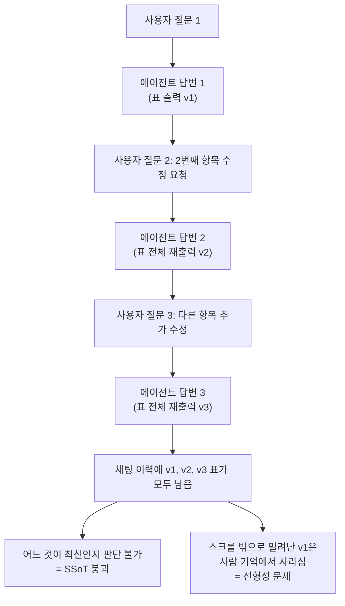
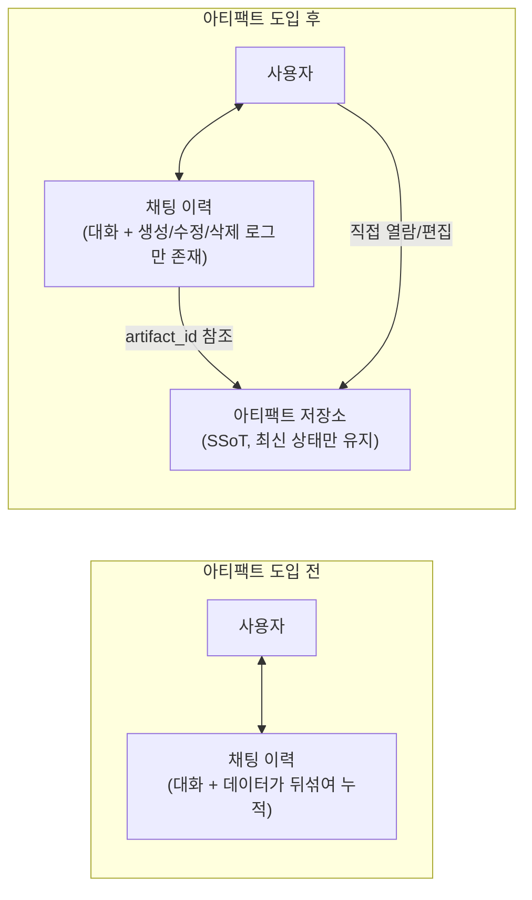
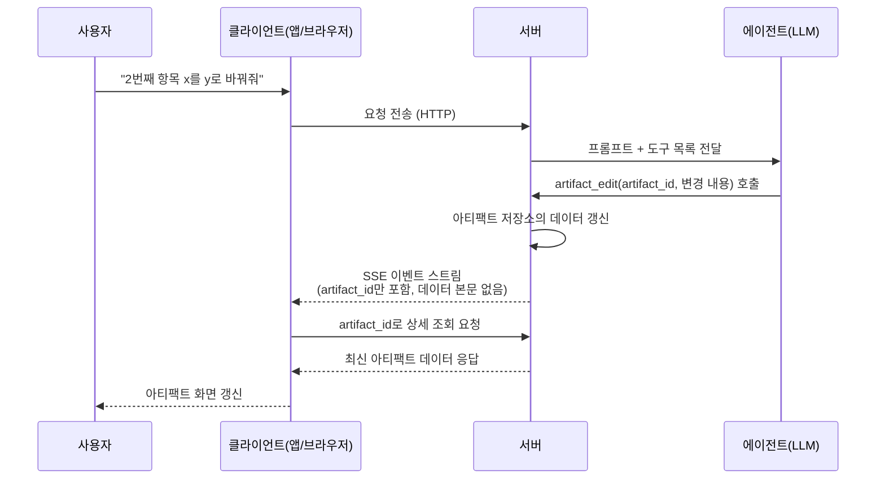

## 문서 소개

> 
> https://www.threads.com/@dev_sla/post/DbEvYAsE5ZV
> 
> AX 개발하며 배운것 - 아티팩트
> 
> 에이전트를 둘러싼 컨텍스트, 하네스, 루프 엔지니어링이란 용어들은 자주 들어서 익숙하다. 하지만 이건 AI로 무언가 만드는 사람을 위한 용어다.
> 
> 하지만 실제 우리 제품을 사줄 엔드유저에게도 저런 내용이 중요할까?
> 
> AI를 서비스하는 last one mile에 대해 얘기해보고자 한다.
> 
> 그 중 채팅형 에이전트라면 반드시 맞닥뜨리는 문제와 아티팩트(artifact)에 대해 말해보고 싶다.
> 

이 문서는 Threads 사용자 @dev_sla가 게시한 글 "AX 개발하며 배운것 - 아티팩트"를 원문 그대로 바탕으로 삼아, 그 안에 담긴 개념과 기술적 배경을 상세히 풀어 설명한다. 참고로 Threads는 자동화된 접근을 차단하고 있어 게시글에 직접 접속해 원문을 다시 확인할 수는 없었고, 아래 내용은 사용자가 제공한 원문 텍스트를 기준으로 작성되었다. 원문 링크는 문서 하단에 별도로 표기한다.

글의 핵심 주제는 하나다. "에이전트를 만드는 사람"이 아니라 "에이전트가 만든 결과물을 실제로 받아 쓰는 엔드유저"의 관점에서, 채팅이라는 인터페이스가 왜 근본적으로 불편한지, 그리고 그 불편함을 어떻게 아티팩트(artifact)라는 장치로 해결하는지를 설명한다.

---

## 1. 왜 하네스가 아니라 아티팩트인가

컨텍스트 엔지니어링, 하네스 엔지니어링, 루프 엔지니어링 같은 용어는 최근 국내 AI 실무자 커뮤니티에서도 빈번하게 등장한다. 실제로 LG CNS와 SK AX 등 국내 IT서비스 기업들이 하네스 엔지니어링을 엔터프라이즈 AI 경쟁력의 핵심 영역으로 보고 방법론과 아키텍처 표준으로 체계화하고 있다는 보도도 나온 바 있다(서울경제TV, 2026년 4월). 하지만 이런 용어들은 어디까지나 에이전트를 "만드는" 사람들의 언어다. 정작 그 에이전트를 채팅창 너머에서 쓰는 사람에게는 하네스가 어떻게 구성되어 있는지, 루프가 몇 번 도는지는 전혀 중요하지 않다. 이 글이 주목하는 지점이 바로 그 간극, 즉 제품이 실제 사용자에게 닿는 마지막 구간(last one mile)이다. 그리고 채팅형 에이전트라면 반드시 마주치는 문제로 아티팩트를 꼽는다.

---

## 2. 문제의 본질: 채팅 인터페이스가 가진 두 가지 구조적 결함

### 2.1 채팅은 선형이고, 사람은 스크롤 밖을 잊는다

채팅은 기본적으로 시간 순서대로 위에서 아래로 쌓이는 선형 구조다. 이 구조 자체는 LLM에게는 큰 문제가 아니다. 모델은 "아까 그거"라는 지시어가 나와도 전체 대화 이력을 참조해 맥락을 되짚을 수 있다. 문제는 사람 쪽에 있다. 대화가 길어지고 화면을 아래로 계속 내리다 보면, 사람은 스크롤 밖으로 사라진 내용을 자연스럽게 잊어버린다. 회의로 치면 안건이 계속 나오는데 아무도 화이트보드나 회의 자료 없이 말로만 진행하는 상황과 같다.

### 2.2 데이터가 갱신되는 순간, 이전에 출력된 데이터는 오염된다

두 번째 문제는 더 실무적이다. 예를 들어 에이전트가 표(테이블) 형태의 결과를 채팅창에 출력했다고 하자. 이후 사용자가 "그중 두 번째 항목의 x를 y로 바꿔줘"라고 요청하면, 에이전트는 통상 수정된 표 전체를 다시 채팅창에 출력한다. 그 결과 채팅 이력에는 같은 데이터를 담은 표가 여러 벌 쌓이게 된다. 이렇게 동일한 데이터가 여러 번 중복해서 존재한다는 것은, 어느 것이 진짜 최신 데이터인지 알려주는 단일 진실 공급원(Single Source of Truth, SSoT)이 무너졌다는 뜻이다. 사용자는 스크롤을 올려가며 "이게 최신 버전이 맞나?"를 매번 확인해야 하는 처지에 놓인다.

이 두 가지 문제를 그림으로 정리하면 다음과 같다.

---

## 3. 해법: SSoT를 지켜주는 장치, 아티팩트

이 문제에 대한 답으로 등장하는 용어가 SSoT, 아티팩트(Artifact), 파일(File)이다. 아티팩트가 무엇인지는 굳이 기술 용어로 설명하지 않아도, "클로드나 챗GPT를 쓸 때 채팅창 오른쪽에 따로 뜨는 그 화면"이라고 하면 대부분 바로 이해한다. 실제로 사용해 본 사람이라면 누구나 직관적으로 아는 패턴이라는 뜻이다.

아티팩트를 도입하면 앞서 언급한 두 가지 문제가 동시에 해결된다.

첫째, 채팅을 계속 이어가도 데이터 자체는 과거로 밀려나지 않는다. 회의실에 자료 하나 없이 말로만 대화하면 맥락이 꼬이고 "아까 그거 뭐였지?"를 반복하게 되지만, 다 같이 볼 수 있는 화이트보드 하나만 있어도 회의는 훨씬 빨라지고 정리도 쉬워진다. 게다가 회의가 끝난 뒤 그 화이트보드 내용을 그대로 가져갈 수도 있다. 아티팩트는 이 화이트보드 역할을 한다.

둘째, 아티팩트는 채팅 이력 안에 갇혀 있지 않다. 이 지점이 실질적으로 더 중요하다. 채팅 이력은 아티팩트를 만들고, 고치고, 지운 "이력"만 남길 뿐, 데이터 자체를 소유하지 않는다. 즉 아티팩트는 대화 맥락(컨텍스트)을 직접 소비하지 않는 별도의 저장소로 존재한다. 이렇게 채팅과 아티팩트가 분리되면 아래 그림처럼 구조가 단순해진다.

---

## 4. 기술적으로는 어떻게 만들어지는가

원문에서 흥미로운 부분은 이 개념의 구현이 생각보다 단순하다고 설명하는 대목이다. 아티팩트는 결국 하네스 안에서 다루는 파일 하나에 지나지 않는다는 것이다.

### 4.1 백엔드 관점: 도구 네 개면 충분하다

LLM에게 `artifact_read`, `artifact_write`, `artifact_edit`, `artifact_list`라는 네 가지 도구만 쥐어주면 아티팩트 기능의 뼈대가 완성된다. 이는 코딩 에이전트가 이미 익숙하게 다루는 "기존 파일 읽기/쓰기/수정/목록 조회"와 정확히 같은 패턴이다. 여기까지는 사람이 직접 결과를 보지 않는, 순수하게 백그라운드에서 도는 에이전트의 이야기라고 원문은 구분한다.

### 4.2 엔드유저 관점: HTTP와 SSE, 그리고 참조자(ID) 방식

문제는 이 결과를 실제 사용자 화면까지 전달하는 구간이다. 채팅형 제품에서는 보통 HTTP 연결 위에 SSE(Server-Sent Events)라는 방식으로 이벤트를 실시간으로 흘려보낸다. SSE는 서버가 클라이언트에게 한 방향으로 계속 데이터를 밀어 보낼 수 있게 해주는 표준 기술로, 채팅 UI에서 글자가 한 자씩 타이핑되듯 나타나는 것도 이 방식 덕분이다.

이 이벤트 스트림을 들여다보면 도구 호출과 관련된 여러 이벤트가 흘러가는데, 아티팩트가 읽히거나(read), 새로 만들어지거나(write), 수정될(edit) 때 그 이벤트의 파라미터 안에는 `artifact_id`처럼 참조용 식별자만 담긴다는 점이 핵심이다. 스트림 안에 아티팩트의 실제 데이터 본문을 통째로 흘려보내지 않는다는 원칙이다. 클라이언트(브라우저나 앱)는 이 식별자를 받아 든 다음, 서버에 별도로 "방금 언급한 그 아티팩트를 보여줘"라고 다시 요청해서 실제 내용을 가져온다. 이 흐름을 정리하면 다음과 같다.

이 방식의 장점은 명확하다. 실시간 스트림에는 가벼운 참조 정보만 흘려보내고, 실제 데이터 본문은 필요한 시점에 한 번만 정확하게 가져오기 때문에 채팅 이력에 데이터가 중복으로 쌓이는 일이 구조적으로 발생하지 않는다.

---

## 5. 실제 제품에서는 어떻게 구현되어 있나: 클로드와 챗GPT

원문은 이 패턴을 가장 잘 구현한 사례로 클로드를 꼽는다. 핵심 이유는 채팅 영역과 아티팩트 영역이 철저하게 분리되어 있다는 점이다. 사용자와 실시간으로 주고받는 부분은 채팅이고, 사용자에게 보여주기 위한 읽기 전용(Read-Only) 콘텐츠는 아티팩트로 취급한다. html이나 마크다운 같은 콘텐츠가 여기에 해당하며, 이 영역은 절대로 채팅 쪽으로 침범하지 않는다. 아티팩트 화면 안에서 버튼을 누르거나 다른 조작을 하더라도, 그 반응은 아티팩트 뷰어 영역 안에서만 일어난다는 것이 원문의 설명이다.

실제로 Claude 고객센터 문서에 따르면, 아티팩트가 생성되면 채팅 옆에 별도의 창이 뜨고 그 안에서 콘텐츠가 표시되며, 아티팩트로 만들어질 조건은 대체로 내용이 15줄을 넘는 독립적인 결과물이거나, 사용자가 나중에 다시 참조하거나 수정·재사용할 가능성이 높은 콘텐츠, 혹은 대화 맥락 없이도 그 자체로 완결된 콘텐츠일 때라고 안내하고 있다(Claude Help Center 기준). 최근에는 여기서 한 걸음 더 나아가 아티팩트 내부에서 클로드의 API를 직접 호출하거나, 지속적인 상태를 저장하거나, MCP 서버를 연결해 구글 캘린더나 Gmail, Slack 같은 외부 서비스와 직접 연동하는 기능까지 확장되어, 단순한 미리보기 창을 넘어서는 소규모 애플리케이션 개발 환경으로 진화하고 있다는 점도 확인된다. 2026년 6월에는 Claude Code에서도 코딩 세션의 진행 상황을 실시간으로 갱신되는 공유 웹페이지 형태의 아티팩트로 내보낼 수 있는 베타 기능이 공개되었고, Claude Cowork에서도 연결된 외부 서비스의 데이터를 반영해 계속 갱신되는 대시보드 형태의 "라이브 아티팩트"를 만들 수 있게 됐다. 이 모두가 "채팅과 결과물을 분리한다"는 같은 철학의 연장선에 있다.

반면 원문은 클로드에서 채팅 안에 직접 만들어지는 html 시각화 요소, 즉 클릭했을 때 그 내용이 다시 채팅 프롬프트 입력창으로 들어가는 형태의 구성 요소는 이와 다른 사례로 구분한다. 이런 경우는 html이 채팅 영역에 직접 개입하는 셈이 된다는 것이다. 채팅창 아래에서 선택지가 올라오는 바텀시트(bottom sheet) 형태의 구성 요소도 같은 맥락으로 언급한다. 즉 같은 제품 안에서도 "완전히 분리된 읽기 전용 아티팩트"와 "채팅에 개입하는 인터랙션 요소"가 용도에 따라 나뉘어 쓰인다는 것이 원문의 관찰이다.

챗GPT 쪽에서는 캔버스(Canvas)라는 이름으로 유사한 개념을 제공한다. 캔버스는 2024년 10월 처음 공개되었고, 당시부터 이미 클로드의 아티팩트와 유사하게 별도의 창을 열어 글쓰기나 코딩 작업의 결과를 확인하고 편집하는 방식으로 설계되었다. 채팅 프롬프트에 "캔버스로 나타내줘" 같은 표현을 넣으면 결과물이 별도 창으로 표시되고, 반대로 굳이 캔버스가 필요 없는 작업이라면 "대신 채팅에서 답합니다"를 눌러 다시 채팅으로 가져올 수도 있다.

두 제품의 개념을 표로 정리하면 다음과 같다.

| 구분 | 클로드(Claude) | 챗GPT(ChatGPT) |
|---|---|---|
| 명칭 | 아티팩트(Artifacts) | 캔버스(Canvas) |
| 최초 공개 시점 | 2024년 6월경 | 2024년 10월 |
| 표시 위치 | 채팅 옆 별도 창 | 채팅 옆 별도 창 |
| 채팅과의 관계 | 읽기 전용 영역으로 철저히 분리, 채팅에 개입하지 않음 | 별도 작업 공간이지만 선택 영역 기반으로 채팅과 상호작용 |
| 최근 확장 방향 | API 직접 호출, 지속 상태 저장, MCP 연동, Claude Code·Cowork로 영역 확장 | 코드 리뷰, 인라인 제안, 버전 되돌리기 등 편집 보조 기능 강화 |

---

## 6. 결론: 좋은 UX는 의도가 보이지 않는다

원문은 마지막으로 UX에 대한 일반론으로 글을 맺는다. 만든 사람의 의도가 사용자 눈에 드러나는 순간 그 UX는 실패에 가깝다는 것이다. 사용자는 SSoT나 하네스, artifact_id 같은 용어를 몰라도, 별도의 설명서를 읽지 않아도 그냥 편하게 쓰기만 하면 된다는 것이 가장 잘 만들어진 UX라는 주장이다.

이 이야기가 나오는 배경에는 최근 기업들 사이에서 확산되고 있는 AX(AI Transformation, AI 전환)라는 흐름이 있다. AX는 단순히 업무에 AI 도구 하나를 얹는 수준을 넘어, 조직의 운영과 의사결정 구조 자체를 AI 중심으로 재편하는 과정을 가리키는 말로 통용된다(이글루코퍼레이션 보안 인사이트, 2026년 1월). 디지털 전환(DX)이 아날로그 업무를 디지털 도구로 옮기는 데 초점을 맞췄다면, AX는 데이터와 모델, 자동화가 조직의 판단과 실행 전반에 직접 관여하도록 만드는 확장된 개념으로 설명된다. 원문은 모두가 AX를 외치고 바이브코딩을 하는 지금 같은 시기에, 아티팩트라는 용어 하나만 제대로 이해해도 제품이 사용자에게 닿는 마지막 구간, 즉 last one mile을 last 0.9 mile 정도로는 줄일 수 있지 않겠냐는 물음으로 글을 마무리한다.

---

## 7. 핵심 내용 한눈에 정리

| 항목 | 내용 |
|---|---|
| 문제 1 | 채팅은 선형 구조이며, 스크롤 밖으로 나간 내용을 사람은 쉽게 잊는다 |
| 문제 2 | 데이터가 갱신될 때마다 이전 출력이 채팅 이력에 중복으로 쌓여 SSoT가 무너진다 |
| 해법 개념 | SSoT, 아티팩트(Artifact), 파일(File) |
| 도입 효과 1 | 채팅을 계속해도 데이터 자체는 과거로 밀려나지 않는다 |
| 도입 효과 2 | 아티팩트는 대화 맥락을 직접 소비하지 않는 별도 저장소로 존재한다 |
| 백엔드 구현 | artifact_read / write / edit / list, 네 가지 도구로 구성 |
| 프론트엔드 전달 방식 | HTTP + SSE, 스트림에는 데이터 본문 대신 artifact_id 같은 참조자만 전달 |
| 대표 사례 | 클로드의 아티팩트(채팅과 완전 분리), 챗GPT의 캔버스(별도 창 + 선택 영역 기반 상호작용) |
| 결론 | 사용자가 개념을 몰라도 자연스럽게 쓸 수 있는 것이 좋은 UX이며, 이를 이해하면 AI 제품의 last one mile을 줄일 수 있다 |

---

## 참고 및 출처

- 원문: Threads, @dev_sla, "AX 개발하며 배운것 - 아티팩트" (https://www.threads.com/@dev_sla/post/DbEvYAsE5ZV) — 자동화 접근 제한으로 재접속 확인은 불가했으며, 사용자가 제공한 원문 텍스트를 기준으로 해설을 작성함
- 서울경제TV, "LG·SK, AI 에이전트 성능 가르는 '하네스 엔지니어링' 공략", 2026년 4월
- Claude Help Center, "What are artifacts and how do I use them?"
- Claude by Anthropic 공식 블로그, "Claude Code now supports artifacts", 2026년 6월
- Claude Help Center, "Use live artifacts in Claude Cowork"
- TILNOTE, "Chatgpt 새로운 Canvas 기능 공개", 2024년 10월
- 이글루코퍼레이션 Security & Intelligence, "AI 전환(AX)의 시대, 우리가 마주한 현실과 질문들", 2026년 1월

---

작성일자: 2026년 7월 22일
