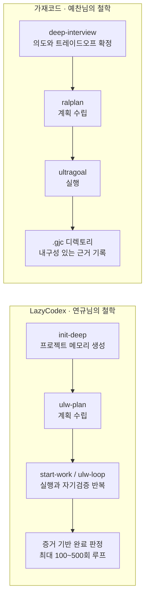

## 이 글을 정리하는 이유

```
https://www.threads.com/@neehoot/post/DbDtXeeEvcU

에이전트 깎다가 오랜만에 왔는데
오픈소스 하네스를 까는 글이 많네요

제 개인적인 생각입니다만
lazycodex나 gajae code를 까는것은
에이전트를 안만들어봐서 그런게 아닐까 싶습니다.

잘만든 에이전트는
제작자의 철학과 성향을 따라가는 것 같은데요

예를들면 lazycodex의 연규님의 철학은
"정해진 Task를 한번에 끝까지"이고,

gajae code의 예찬님의 철학은
"입력 컨텍스트를 정교하게 받아서 의도대로" 인 것 같고
정확하게 에이전트는 그 의도대로 동작을 하는것 같습니다.
(그게 맞다면 정말 대단하다고 생각합니다.)

결국 사용자의 용도에 따라 다르겠지만
하네스의 목적은 끝까지 일을 처리하는게 아니라

정확하게 주어진 범위에서
사용자의 의도대로 수행하는 것
그리고 의도를 벗어나지 않으면서
멈출때 멈춰주는 것
그게 하네스의 본질이 아닐까 생각됩니다.

에이전트를 만드는 입장에서
저 두 오픈소스는 상당히 좋은 교보재이고
수많은 의도를 생각하고 고려해서
최선의 하네스를 만들었다고 생각됩니다.

개인적으로 지금의 codex는 약간 과한 것 같아요
제 하네스가 잘못되었을지는 모르지만
gpt5.6 terra midium에
의도된 범위까지만 돌게 하네스 입힌게 최적인 것 같은데

근데 개인적인 생각이지만
omo native가 등장한 배경에는
codex의 과적합(?)을 느껴서 그러시는게 아닐까
조심스럽게 추측해봅니다 ㅎㅎ
아마 lazycodex를 깎아도 안되는
그 한계선이 느껴지셨지 않을까 싶네요

```

Threads 계정 neehoot가 올린 게시글은 최근 한국 AI 개발자 커뮤니티에서 오픈소스 에이전트 하네스, 특히 LazyCodex와 가재코드(Gajae-Code)를 비판하는 글이 늘어난 상황에 대한 반박성 글이다. 글쓴이는 에이전트를 오랜만에 다시 만들어보러 돌아왔다가 두 오픈소스 도구를 깎아내리는 글들을 접했다고 밝히면서, 이런 비판이 나오는 이유가 정작 비판하는 사람들이 에이전트를 직접 만들어본 경험이 부족하기 때문일 수 있다는 개인적인 추측을 제시한다. 이어서 두 도구 제작자의 철학을 자신의 방식으로 요약하고, 하네스라는 개념 자체가 무엇을 위해 존재하는지에 대한 나름의 정의를 내놓는다. 아래에서는 이 글이 다루는 내용을 하나씩 짚어보면서, 실제로 검증 가능한 사실과 글쓴이 개인의 해석이나 추측을 구분해서 설명한다.

## 하네스라는 용어부터 정리하면

에이전트 하네스란 Codex나 Claude Code 같은 AI 코딩 도구를 감싸는 시스템 전체를 가리키는 말이다. 모델 자체는 그대로 두고, 그 위에 규칙 파일, 계획 수립 절차, 실행 루프, 검증 단계, 메모리 관리, 도구 연동 방식을 얹어서 모델이 더 오래, 더 일관되게, 더 사용자가 원하는 방향으로 작업하도록 만드는 껍데기 계층이라고 보면 된다. 2026년 상반기 한국 개발자 커뮤니티에서 하네스 엔지니어링이라는 표현이 자주 오르내린 것도 이런 배경 때문인데, 모델 성능 자체보다 이 하네스 계층의 설계가 실제 작업 결과물의 품질을 좌우한다는 인식이 널리 퍼졌기 때문이다.

## LazyCodex — "정해진 일을 한 번에 끝까지" 밀어붙이는 철학

LazyCodex는 개발자 김영규(code-yeongyu)가 만든 오픈소스 프로젝트로, oh-my-openagent(OmO)라는 더 큰 하네스 프레임워크를 OpenAI Codex 환경에서 쉽게 쓸 수 있도록 패키징한 배포판이다. 설치는 npx lazycodex-ai install 한 줄로 끝나며, 설치 후에는 프로젝트 메모리를 만드는 init-deep, 계획을 세우는 ulw-plan, 실행과 검증을 이어가는 start-work와 ulw-loop 같은 명령어들이 Codex 안에 새로운 스킬로 추가된다. 특히 ulw-loop는 자체적으로 완료 여부를 검증하는 반복 루프인데, 일반 모드에서는 최대 100회, 이른바 울트라워크 모드에서는 최대 500회까지 스스로 작업과 검증을 반복하도록 설계되어 있다.

이 도구의 운영 철학은 겉으로 드러난 완료 선언을 믿지 않고 실제 증거로 완료를 입증해야 한다는 원칙에 가깝다. 에이전트가 스스로 끝났다고 말해도 그 주장을 곧이곧대로 받아들이지 않고, 실행 로그나 테스트 결과 같은 근거가 남아야만 진짜 완료로 인정하는 구조다. neehoot는 이런 특징을 "정해진 Task를 한번에 끝까지"라는 한 문장으로 요약했는데, 실제로 LazyCodex 저장소의 설명과 커뮤니티에서 정리된 사용 후기들을 보면 이 표현이 크게 과장된 것은 아니라고 볼 수 있다. 최근 저장소에서는 순수 로직과 어댑터 계층을 분리해 Codex뿐 아니라 다른 하네스 환경에서도 같은 코어를 재사용할 수 있게 만드는 리팩터링 작업이 진행 중이라는 언급도 있다.

## 가재코드 (Gajae-Code) — "의도를 정교하게 읽어서 그대로 수행한다"는 철학

[가재코드](https://github.com/Yeachan-Heo/gajae-code)는 예찬(Yeachan-Heo)이 만든 프로젝트로, 같은 개발자가 만든 OMX, OMC 하네스와 계보를 같이한다. 이름의 유래는 갑각류인 가재이며, bun install -g gajae-code로 설치하는 외장형 코딩 에이전트 하네스다. 공식 저장소 설명에 따르면 아직 실험적인 베타 단계의 프로젝트로, 특정 모델에 종속되지 않고 Claude, Codex, GPT 계열, Gemini, OpenCode 등 다양한 백엔드를 바꿔가며 쓸 수 있다는 점이 특징으로 꼽힌다.

가재코드의 작업 흐름은 deep-interview, ralplan, ultragoal 세 단계로 이어지며, 필요하면 tmux 기반의 병렬 작업자를 동원하는 팀 실행 모드도 선택할 수 있다. 이 가운데 deep-interview 단계가 특히 자주 언급되는데, 무엇을 만들 것인지뿐 아니라 무엇을 만들지 않을 것인지, 어떤 트레이드오프를 감수할 것인지까지 소크라테스식 질문을 주고받으며 확정하는 절차다. 이 과정에서 뽑아낸 사용자의 의도가 이후 계획 수립과 실행의 기준점이 되는 구조로, 먼저 명확히 확인하고 나서 계획하고 실행하며 그 결과를 증거로 남긴다는 설계 원칙이 이 단계에 가장 잘 녹아 있다고 소개되어 있다. neehoot가 "입력 컨텍스트를 정교하게 받아서 의도대로"라고 요약한 부분은 이 deep-interview 구조와 상당히 맞아떨어진다. 모든 목표와 수정 사항, 검증 결과는 .gjc 디렉토리에 내구성 있는 기록으로 남으며, 최근에는 텔레그램 연동을 통해 세션 진행 상황이나 승인 요청을 모바일에서 받아볼 수 있는 기능도 추가되었다.



## neehoot가 던지는 핵심 주장: 하네스의 본질은 "끝까지"가 아니다

여기까지 두 도구의 철학을 정리한 뒤, neehoot는 자신의 결론을 제시한다. 요지는 이렇다. 사용자의 용도에 따라 적합한 도구는 달라지겠지만, 하네스라는 것의 본질적인 목적은 일을 무조건 끝까지 밀어붙이는 데 있는 것이 아니라, 정확하게 주어진 범위 안에서 사용자의 의도대로 작업을 수행하고, 그 의도를 벗어나지 않는 선에서 멈춰야 할 때 제대로 멈춰주는 데 있다는 것이다. 그러면서 LazyCodex와 가재코드 두 프로젝트 모두 수많은 사용자 의도를 고려해서 만들어진, 에이전트를 직접 만들어보려는 사람들에게 매우 좋은 학습 교재라는 평가를 덧붙인다.

이 부분은 명백히 neehoot 개인의 의견이자 하네스 설계에 대한 하나의 관점이며, 업계 전체가 합의한 정의는 아니라는 점을 짚어둘 필요가 있다. 실제로 하네스 생태계 안에서도 "완료까지 밀어붙이는 지속성"을 최우선 가치로 두는 설계(LazyCodex의 접근에 가까움)와 "의도의 정확한 해석과 범위 준수"를 최우선 가치로 두는 설계(가재코드의 접근에 가까움) 사이에 실제로 방향성 차이가 존재하고, 이는 최근 커뮤니티 게시물들에서도 반복적으로 언급되는 구도다.

## Codex 자체 하네스와의 비교, 그리고 GPT-5.6 Terra 이야기

글 후반부에서 neehoot는 개인적으로 요즘 Codex 자체의 기본 하네스가 다소 과하다고 느낀다고 밝히면서, 자신의 하네스 설정이 잘못되었을 가능성은 있지만 GPT-5.6 Terra 모델에 medium 추론 강도를 적용하고 의도된 범위까지만 동작하도록 하네스를 씌우는 조합이 자신에게는 최적으로 느껴진다는 개인적인 사용 경험을 공유한다.

여기서 언급된 GPT-5.6 Terra는 실존하는 모델로, OpenAI가 2026년 7월 9일 정식 출시한 GPT-5.6 계열의 세 개 등급(Sol, Terra, Luna) 가운데 중간 등급에 해당한다. Sol이 최상위 플래그십, Terra가 성능과 비용의 균형을 맞춘 일상 업무용, Luna가 속도와 비용 효율을 우선한 등급으로 구분되며, API 기준 Terra의 가격은 100만 토큰당 입력 2.5달러, 출력 15달러로, GPT-5.5와 비슷한 성능을 절반 가격에 제공한다고 OpenAI 측이 설명한 바 있다. 세 등급 모두 1M 토큰이 넘는 컨텍스트 창을 공유하며, 추론 강도를 none부터 max, 그리고 여러 서브에이전트를 병렬로 돌리는 ultra 모드까지 선택할 수 있는 구조로 되어 있다. neehoot가 언급한 "terra midium"은 이 가운데 Terra 등급에 medium 수준의 추론 강도를 적용한 설정을 가리키는 것으로 보인다.

이어서 neehoot는 최근 등장이 예고된 OMO Native라는 것이, LazyCodex와 OmO를 만든 김연규가 Codex의 이런 과적합 성향을 느꼈기 때문에 나온 결과물이 아닐까 조심스럽게 추측한다고 적었다. 이 부분은 글쓴이 스스로도 "추측"이라고 명시한 부분이라는 점이 중요하다. 실제로 확인 가능한 사실은, 2026년 7월 초 한 AI 팟캐스트 방송에서 김연규가 직접 출연해 LazyCodex와 하네스·루프 엔지니어링 전반을 설명하면서 "OMO Native"와 "잡돌이"라는 이름의 향후 계획을 공개했다는 예고성 언급이 있었다는 정도이며, 이 시점까지 OMO Native의 구체적인 아키텍처나 출시 일정이 별도로 상세히 문서화되어 공개된 자료는 확인되지 않는다. 따라서 OMO Native가 Codex 하네스의 과적합에 대한 대응이라는 해석은 어디까지나 neehoot 개인의 짐작이며, 검증된 사실로 다루어서는 안 된다.

## 댓글에서 오간 이야기

이 게시글 아래에는 몇 개의 반응이 이어졌다. 한 댓글은, 무언가를 실제로 만들어내려면 시간과 돈, 건강까지 갈아 넣어야 하는데 정작 아무런 노력도 들이지 않고 공짜로 가져다 쓰기만 하는 사람들이 과도하게 깎아내리면 만든 사람 입장에서는 화가 날 수밖에 없다는 취지의 의견을 남겼다. 이에 대해 neehoot는, 상황에 맞지 않는 용도로 쓰다 보니 필요 없다고 느끼는 경우는 있을 수 있다고 인정하면서도, 오픈소스 하네스를 만드는 사람들이 꾸준히 의욕을 갖고 활동을 이어갔으면 좋겠다는 바람을 밝혔다. 또한 자신이 에이전트를 만드는 과정에서 이런 오픈소스 프로젝트들의 커밋 이력이 모델을 실제 서비스에 녹여 넣는 데 실질적으로 큰 도움이 되었다고 언급했으며, 이 도구들이 확산되는 과정에서 쓰인 바이럴 방식이나 대응 전부에 동의하는 것은 아니지만, 에이전트를 만들고 퍼뜨리는 과정에서 제작자들의 철학과 관점 자체는 많은 도움이 되어왔다고 덧붙였다.

## 정리하며

이 게시글을 관통하는 흐름을 한 문장으로 정리하면, 오픈소스 하네스에 대한 비판이 늘어난 시점에 실제 제작 경험이 있는 사용자로서 두 도구의 설계 철학을 재조명하고, 하네스라는 개념 자체의 본질을 "완료를 향한 끈기"가 아니라 "의도한 범위 안에서의 정확한 수행과 절제된 멈춤"으로 재정의하려는 시도라고 볼 수 있다. LazyCodex와 가재코드는 실제로 지향점이 다른 프로젝트이며, 전자는 검증된 완료까지 반복해서 밀어붙이는 지속성에, 후자는 사용자의 의도를 정교하게 캐묻고 그 범위를 지키는 데 각각 더 무게를 싣고 있다는 점이 여러 독립적인 자료에서도 일관되게 확인된다. 다만 어느 쪽이 더 우월한 설계인지는 사용자의 작업 성격과 취향에 따라 달라질 문제이며, 이 글 자체도 그 점을 전제로 깔고 있다.

## 사실관계 확인 표

| 구분 | 내용 | 확인 결과 |
|---|---|---|
| LazyCodex 제작자 및 저장소 | code-yeongyu(김영규), github.com/code-yeongyu/lazycodex, oh-my-openagent 기반 | 검증된 사실 |
| 가재코드 제작자 및 저장소 | Yeachan-Heo(예찬), github.com/Yeachan-Heo/gajae-code, OMX·OMC와 동일 계보 | 검증된 사실 |
| LazyCodex의 완료 검증 루프 반복 횟수(일반 100회, 울트라워크 500회) | 공식 저장소 설명 기준 | 검증된 사실 |
| 가재코드의 deep-interview → ralplan → ultragoal 흐름 | 공식 저장소 및 정리 자료 기준 | 검증된 사실 |
| GPT-5.6 Sol/Terra/Luna 3단계 등급 체계와 Terra 가격 | OpenAI 공식 발표(2026년 7월) 기준 | 검증된 사실 |
| "코덱스 자체 하네스가 과하다"는 평가 | neehoot 개인의 사용 경험과 의견 | 개인 의견, 일반화된 사실 아님 |
| "OMO Native가 코덱스의 과적합에 대한 대응일 것"이라는 해석 | neehoot 본인이 "추측"이라고 명시 | 검증되지 않은 추측 |
| "비판하는 사람들이 에이전트를 안 만들어봐서 그런 것"이라는 진단 | neehoot 개인의 추측성 의견 | 검증되지 않은 개인 견해 |

---

작성일: 2026년 7월 22일
