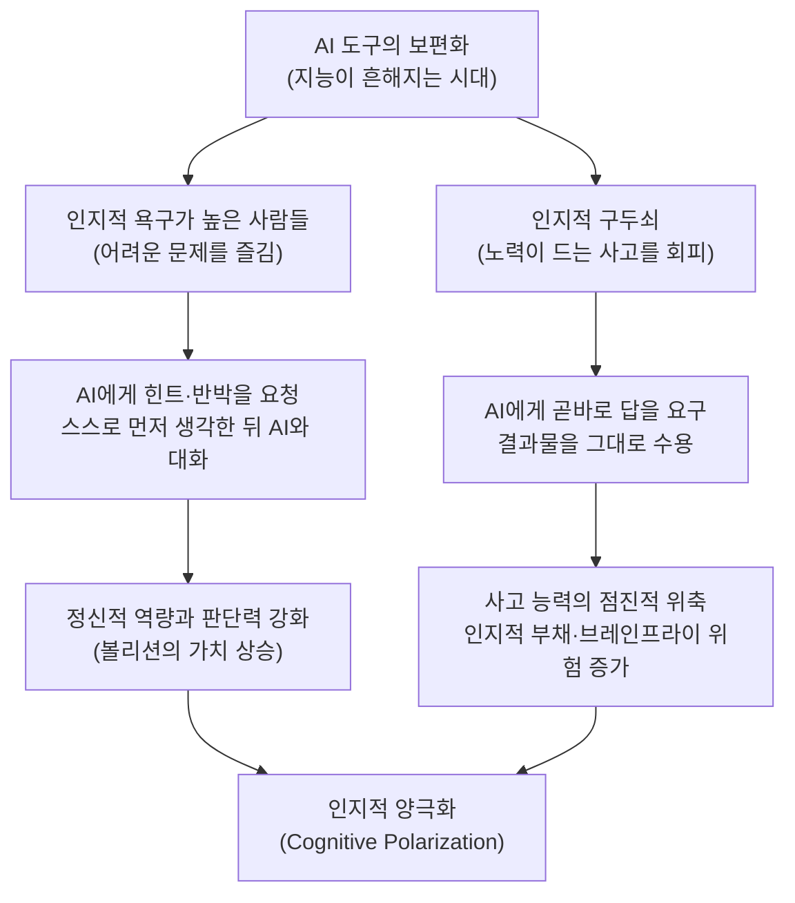
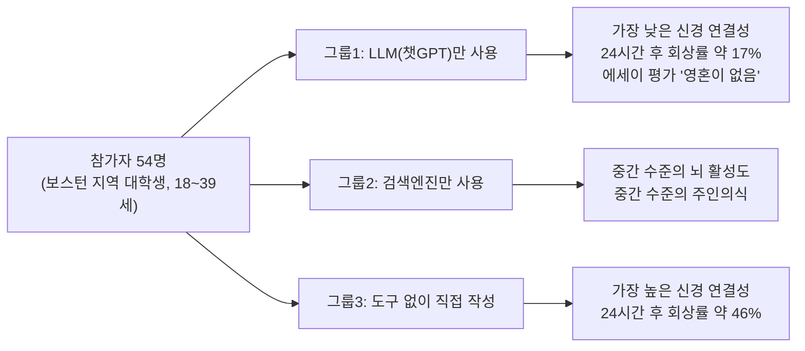

- 원문 검토 대상: Threads(@somewon_co) 게시물 「AI 시대에 진짜 앞서나갈 사람들의 특징」
- 원 출처: 데이비드 브룩스(David Brooks), 「The People Who Will Thrive in the AI Age」, The Atlantic (2026)
- 이 문서는 위 Threads 게시물의 내용을 그대로 옮기지 않고, 실제 원문과 관련 연구를 웹 검색으로 재확인한 뒤, 검증된 사실·출처가 명확한 인용·게시자 자신의 해석을 구분하여 재구성한 해설 자료입니다.

https://www.threads.com/@somewon_co/post/DbHnKr6kyLV

<AI 시대에 진짜 앞서나갈 사람들의 특징>

1. AI 시대엔 똑똑함보다는 ‘정신적 노력을 맺는 관계’와 ‘학습할 의욕이 있느냐’가 더 중요해질 겁니다.

2. 의욕과 열정이 있는 사람들은 AI를 활용해 계속해서 새로운 무언가를 만들고 또 배우겠지만, 아무리 똑똑하고 지능이 뛰어나도 의욕과 열정이 없으면 쉽게 무기력해질 것이기 때문이죠.

3. 특히 인지적 욕구, 더 배우려는 의지, 스스로를 성찰하고자 하는 욕망이 없는 사람은 AI로 인해 사고 능력을 잃기 쉽습니다. 반면, AI 시대에도 지적 겸손함을 가지고 더 배우려는 의지가 충만한 사람들은 자신의 지적 역량을 계속 강화하는 도구로, 자신의 한계를 돌파하는 도구로 AI를 활용할 것이고요.

4. 그래서 많은 사람들이 질문이라는 형태를 빌려서 AI에게 답을 요구하고 있지만, 그전에 자신의 생각부터 글로 써보는 것이 중요합니다. 그런 점에서 AI는 답을 찾기보다는, 힌트나 몰랐던 부분을 채워주는 용도로 쓰는 게 더 현명합니다.

5. 특히 ‘AI를 활용하는 작업’과 ‘AI를 활용해서는 안 되는 작업’을 명확하게 구분하는 게 좋습니다. 예를 들어, 자기 생각은 AI 활용 없이 써내고, 그 아이디어를 디벨롭하는 과정은 AI와 함께 한다는지 말이죠. 아니면 초안은 인간이, 편집은 AI와 함께하든지 말이죠.

6. AI의 진짜 무서움은 지능형 서비스의 등장으로 생각을 덜 하는 사람들이 많아질 가능성이 높아졌다는 점이고, 이로 인해 인지적 양극화가 발생할 수 있다는 점입니다.

7. 실제로 많은 직장인들은 AI를 통해 일의 효율성이 높아졌지만, 그로 인해 업무량은 더 늘었다고 말합니다. AI로 높아진 생산성을 어디에 창의적으로 쓸 것인지에 대한 고민이나 생각을 하기보다는, 그저 더 많은 일을 쳐내는 것에 급급한 것이죠.

8. 그래서 AI로 인해 더 많은 일을 하게 된 사람들 사이에는 피로도와 산만함이 커지는 ‘AI brain fry’라는 신종 번아웃 현상도 생겨나고 있습니다. 일을 위해 여러 AI와 대화를 하다 보면 뇌가 불타는 듯한 느낌을 받는 직장인들이 늘어나고 있는 셈이죠.

9. 그런 의미에서 AI 시대 정말 중요한 자산은 ‘풍부한 인지 능력’입니다. AI에게 자신의 사고를 맡기는 것이 아니라, 스스로 생각하는 힘을 기르는 것이 중요하다는 얘깁니다. 생각하는 힘이 유일한 무기가 되는 시대가 바로 AI 시대입니다.

10. 그렇다면 인지 능력을 기르려면 어떻게 해야 할까요? 방법은 단순합니다. 어려운 문제를 푸는 연습을 많이 하는 겁니다. 아니, 좀 더 정확하게 말하면 어려운 문제를 푸는 과정을 즐기는 연습을 해야 합니다.

11. 벽돌책이나 어려운 책을 읽고, 생각이 다른 사람들과 토론하고, 복잡한 문제를 스스로 혹은 다른 사람과 함께 풀어보는 연습을 하는 것 말이죠. 실제로 인지 능력이 높은 사람들은 어려운 책이나 복잡한 문제를 푸는 과정을 즐깁니다.

12. 반면, 이런 연습이 안 되어 있는 사람은 이 과정을 불쾌하게 여기고 피해 갈 구멍부터 찾습니다. 그래서 정답, 꿀팁을 선망하고요. 이런 사람들은 어려움이 닥치면 스스로 생각하기보다는 AI에게 답을 내놓으라고 요구합니다.

13. 또한, 타고난 지능이 높아도 인지적 욕망이 없으면 사람들은 쉽게 게을러집니다. 특히 이런 사람들은 회사 내에서 무임 승차자가 되기 쉽습니다. 머리는 똑똑한데 어려운 문제를 자신이 풀기는 싫고, 책임도 지기 싫으니 그렇지 않은 방법들만 영리하게 찾아다니는 것이죠.

14. 그런 사람들에게 AI는 놀라운 핑곗거리가 됩니다. 그리고 이는 대형 사고로 이어질 수 있는데요. “AI가 그랬어요”라며 책임을 회피하는 순간, 지적 게으름과 무책임함이 조직 내에 계속 축적되기 때문이죠.

15. 실제로 MIT Media Lab에서 진행한 한 실험에 따르면, 글쓰기 과정을 AI에게 맡긴 사람들은 어느 순간부터는 AI가 생성한 결과물을 그저 복사-붙여넣기만 했다고 합니다. 자신이 무엇을 써서 제출했는지조차 모르는 경우도 발생했고요.

16. 더 큰 문제는 AI에 의존할수록 인내심마저 바닥이 난다는 점입니다. 틀린 답이라도 AI로 간편하게 얻는 것에 익숙해진 사람들은 현실에서 겪어야 하는 지루하고 따분한 과정을 견디지 못합니다.

17. AI로 문제를 푸는 게 스스로 고민하는 것보다 더 쉽고, 더 재미있고, 더 즐겁게 느껴지는 것이죠. 이 과정에 익숙해지면 AI의 답을 맹신하게 되는 인지적 항복 상태에 빠져들게 됩니다. 어렵고 힘들게 고민할 바엔 그냥 AI에게 물어보자고요.

18. 따라서 AI 시대에 정말 중요한 것은 인프라 투자나 AI 활용법 따위를 배우는 게 아닙니다. 인지적 역량과 배우려는 의지를 키우는 일입니다. 특히 어린 학생들에게 진짜 가르쳐야 하는 건 AI 활용법이 아니라, 인간으로서 욕망하고 꿈꾸는 법입니다.

19. AI 시대에 인간의 고유성은, AI가 할 수 없는 것에서부터 나옵니다. 그리고 다행히 아직 AI는 스스로 무언가를 갈망하거나 꿈꾸지 못합니다. 즉, 앞으로 AI는 갈망하고 꿈꾸는 인간과 만났을 때 더 큰 임팩트를 만들어낼 겁니다.

++데이비드 브룩스의 <The People Who Will Thrive in the AI Age> 글을 참고했습니다 ;)

https://www.theatlantic.com/ideas/2026/06/ai-open-ai-anthropic/687689/

---

## 목차

1. 들어가며 — 이 문서를 왜, 어떻게 검증했는가
2. 데이비드 브룩스는 누구이며, 이 글은 어떤 맥락에서 나왔는가
3. 핵심 주장 — "지능이 아니라 정신적 노력과의 관계"
4. 심리학적 배경 — 인지적 욕구(Need for Cognition)란 무엇인가
5. 브룩스가 말하는 "인지적 양극화"라는 새로운 균열선
6. 브룩스가 제시하는 실천적 지침 — AI를 "사서"처럼 쓰는 법
7. 실증적 근거 ① — MIT 미디어랩의 "당신의 뇌, 챗GPT 위에서" 연구
8. 실증적 근거 ② — "AI 브레인프라이"와 BCG·하버드비즈니스리뷰 조사
9. 원 Threads 게시물, 항목별 사실 검증
10. 종합 정리 및 시사점
11. 참고문헌

---

## 1. 들어가며 — 이 문서를 왜, 어떻게 검증했는가

원본 Threads 게시물은 19개 항목에 걸쳐 "AI 시대에 앞서 나갈 사람"과 "뒤처질 사람"을 가르는 기준이 지능이 아니라 정신적 노력에 대한 태도라는 주장을 펼치고 있습니다. 게시물 말미에는 이 내용이 데이비드 브룩스의 애틀랜틱 칼럼 「The People Who Will Thrive in the AI Age」를 참고했다고 명시되어 있습니다.

다만 Threads 게시물 자체는 원문을 발췌·번역·재구성한 2차 창작물이고, 그 안에는 원문의 핵심 논지, 원문에서 파생되었지만 표현이 다소 변형된 부분, 그리고 게시자 본인의 해석이나 추가 설명이 섞여 있습니다. 또한 게시물은 MIT 미디어랩의 실험을 언급하는데, 이것이 실제로 존재하는 연구인지, 내용이 정확히 인용되었는지도 별도로 확인이 필요했습니다.

이 문서는 다음 세 가지 원 출처를 웹 검색을 통해 직접 재확인한 뒤 작성되었습니다.

첫째, 데이비드 브룩스의 애틀랜틱 칼럼 원문의 논지와 표현. 둘째, 게시물이 언급한 MIT 미디어랩의 AI 글쓰기 실험 논문. 셋째, 게시물에는 직접 언급되지 않았지만 같은 맥락에서 함께 다뤄질 필요가 있는, 2026년 초 하버드비즈니스리뷰(HBR)와 보스턴컨설팅그룹(BCG)이 발표한 "AI 브레인프라이(AI Brain Fry)" 연구입니다. 이 세 자료는 서로 다른 시점에 발표되었지만, 하나로 묶어 보면 "AI가 인간의 사고 능력에 미치는 영향"이라는 하나의 흐름을 이룹니다.

각 장의 내용 중 원문에서 직접 확인된 사실은 그대로 서술하고, 확인이 어렵거나 게시자의 자체 해석으로 보이는 부분은 별도로 표시했습니다.

---

## 2. 데이비드 브룩스는 누구이며, 이 글은 어떤 맥락에서 나왔는가

데이비드 브룩스는 1961년 캐나다 토론토에서 태어난 미국의 칼럼니스트이자 정치·문화 평론가입니다. 월스트리트저널 기자와 논평 에디터를 거쳐 2003년부터 뉴욕타임스 칼럼니스트로 활동해 왔고, PBS 뉴스아워에도 오랫동안 고정 출연해 왔습니다. 그는 2026년부터 애틀랜틱의 칼럼니스트로 자리를 옮겼으며, 「The People Who Will Thrive in the AI Age」는 이 시기에 애틀랜틱에 게재된 글입니다. 게재 시점은 매체마다 약간의 차이가 있지만, 대체로 2026년 6월 말로 확인됩니다.

이 칼럼의 부제는 "지능이 얼마나 뛰어난가가 아니라, 정신적 노력과 어떤 관계를 맺고 있는가가 사람들을 가를 것이다"라는 문장으로, 글 전체의 논지를 한 문장으로 압축해서 보여줍니다. 브룩스는 이 글에서 AI 자체의 성능이나 발전 속도보다, AI를 대하는 인간의 태도와 습관이 만들어낼 사회적 결과에 초점을 맞추고 있습니다.

---

## 3. 핵심 주장 — "지능이 아니라 정신적 노력과의 관계"

브룩스가 이 칼럼에서 제시하는 원칙은 다음과 같이 요약할 수 있습니다. 지능이 흔하고 풍부해지는 시대일수록, 오히려 스스로 무언가를 하려는 의지, 즉 "볼리션(volition)"이 희소하고 귀중한 자원이 된다는 것입니다. 그는 AI 시대에 실제로 성과를 내는 사람은 AI를 이용해 일을 덜 하고 편해지려는 사람이 아니라, AI와 씨름하면서 자신의 정신적 역량을 능동적으로 발전시키고 더 많은 것을 이뤄내려는 사람이라고 말합니다.

이 주장은 원 Threads 게시물의 1번과 2번, 3번 항목("똑똑함보다 정신적 노력을 맺는 관계와 학습 의욕이 중요하다", "의욕이 없으면 지능이 뛰어나도 무기력해진다")과 정확히 일치하는 핵심 논지입니다. 다만 게시물의 표현은 원문을 한국어로 자유롭게 풀어쓴 것이며, "정신적 노력을 맺는 관계"라는 표현은 원문의 "relationship to mental effort"를 다소 의역한 결과로 보입니다. 원문의 논지 자체는 정확하게 반영되어 있습니다.

---

## 4. 심리학적 배경 — 인지적 욕구(Need for Cognition)란 무엇인가

브룩스는 이 논지를 뒷받침하기 위해 심리학에서 오래전부터 쓰여 온 개념인 "인지적 욕구(need for cognition)"를 끌어옵니다. 이 개념은 1982년 심리학자 존 카시오포(John Cacioppo)와 리처드 페티(Richard Petty)가 정식화한 것으로, 사람마다 노력이 필요한 사고 활동에 얼마나 자발적으로 참여하고 그 과정 자체를 즐기는지에서 차이가 있다는 점을 설명하는 개인차 이론입니다. 인지적 욕구가 높은 사람은 어려운 게임이나 복잡한 퍼즐, 밀도 높은 책을 즐기고, 정보를 접했을 때 체계적이고 꼼꼼하게 따져보는 경향이 있습니다. 반대로 인지적 욕구가 낮은 사람은 노력이 드는 사고를 불쾌하게 느끼고, 가능하면 이를 피하려 하며 단순한 단서나 정형화된 판단, 다른 사람의 의견에 의존해 세상을 이해하려는 경향을 보입니다. 이 개념은 지능 자체와는 약한 상관관계만 가지는 것으로 알려져 있어, "머리가 좋은 것"과 "생각하기를 좋아하는 것"은 별개의 특성이라는 점이 이 이론의 중요한 전제입니다.

브룩스는 이 스펙트럼의 양쪽 끝에 있는 사람들을 각각 인지적 욕구가 높은 사람과 "인지적 구두쇠(cognitive misers)", 즉 생각하는 노력 자체를 아끼려는 사람으로 나누어 설명하고, 대부분의 사람은 이 두 극단 사이 어딘가에 위치한다고 말합니다.

원 게시물의 3번, 12번, 13번 항목("인지적 욕구, 배우려는 의지가 없는 사람은 AI로 인해 사고 능력을 잃기 쉽다", "이런 연습이 안 된 사람은 정답과 꿀팁을 선망한다", "지능이 높아도 인지적 욕망이 없으면 게을러진다")은 바로 이 인지적 욕구 이론을 배경으로 하고 있으며, 원문의 논지를 비교적 충실하게 옮긴 부분입니다.

---

## 5. 브룩스가 말하는 "인지적 양극화"라는 새로운 균열선

브룩스가 이 칼럼에서 던지는 경고의 핵심은, AI가 사람들 사이의 격차를 단순히 경제적 생산성 차원에서만 벌리는 것이 아니라는 점입니다. 그는 AI를 이용해 더 많이 생각하게 되는 사람들과, AI를 이용해 오히려 덜 생각하게 되는 사람들 사이에 더 깊은 균열이 생길 수 있다고 봅니다. 이 균열은 순수한 지능 차이가 아니라, 노력과 어려움, 지속적인 주의 집중에 대한 사람들의 취향 차이에서 비롯된다는 것이 그의 진단입니다. 그는 이런 사회적 조건을 "극단적인 인지적 양극화(extreme cognitive polarization)"라는 표현으로 요약합니다.

이 부분은 원 게시물의 6번, 9번 항목("AI의 진짜 무서움은 생각을 덜 하는 사람들이 많아질 가능성이 높아졌다는 점", "인지적 양극화가 발생할 수 있다")과 직접 연결되는 대목으로, 게시물이 원문의 핵심 개념을 정확한 용어("cognitive polarization")까지 포함해 잘 전달하고 있는 부분입니다.

다만 브룩스는 이 양극화를 다소 희망적인 방향으로도 풀어냅니다. 그는 인지적 욕구가 완전히 고정된 타고난 기질이 아니라, 의지력처럼 맥락에 매우 민감하게 반응하는 특성이라고 지적합니다. 즉 환경과 훈련에 따라 인지적 욕구 자체를 어느 정도 길러낼 수 있다는 것입니다. 그래서 그는 앞으로 중요한 과제는 사람들이 인지적으로 복잡한 것을 스스로 찾아 나서고 싶어지도록 그 욕구 자체를 길러주는 일이라고 말하며, 그렇게 되면 AI는 계산을 담당하고 인간은 무엇이 중요한지를 정의하는 역할을 맡는 방식으로 역할이 나뉠 수 있다고 전망합니다.

또한 브룩스는 AI가 계산, 종합, 요약, 생성을 극도로 빠르게 해낼 수 있게 되면서, 오히려 인간만이 할 수 있는 것이 무엇인지가 더 선명하게 드러날 것이라고 말합니다. 그는 그 답을 욕망, 사랑, 목적, 판단력, 그리고 무엇이 중요한지를 스스로 선택하는 능력에서 찾습니다. 이 대목은 원 게시물의 마지막 19번 항목("AI 시대에 인간의 고유성은 AI가 할 수 없는 것에서부터 나온다", "AI는 스스로 무언가를 갈망하거나 꿈꾸지 못한다")과 상당히 유사한 결론으로, 게시물이 원문의 최종 메시지를 비교적 정확하게 옮긴 부분이라고 볼 수 있습니다.

아래는 브룩스의 논지를 하나의 흐름으로 도식화한 것입니다.

---

## 6. 브룩스가 제시하는 실천적 지침 — AI를 "사서"처럼 쓰는 법

브룩스는 이 칼럼에서 추상적인 경고에 머무르지 않고, AI를 사고력 훼손 없이 활용하기 위한 구체적인 방법도 제안합니다. 그는 AI를 모든 것을 대신 알려주는 신탁(oracle)이 아니라, 필요한 자료를 찾아주는 뛰어난 사서(librarian)처럼 대하는 편이 훨씬 낫다고 말합니다.

그가 제시하는 방법을 정리하면 다음과 같습니다. 먼저 AI에게 곧바로 답을 요구하는 사람들은 동기와 능력 모두에서 뚜렷한 저하를 겪지만, 배경 지식이나 개념을 명료하게 이해하는 데 필요한 힌트를 요청하는 사람들은 그런 저하를 겪지 않는다는 것입니다. 또한 AI를 찾기 전에 먼저 빈 종이에 자신의 생각과 결론을 스스로 써 본 뒤, 그다음에 AI에게 자신의 생각을 반박하거나 도전해 보라고 요청하는 방식을 권합니다. AI가 결론을 대신 만들어주게 해서는 안 된다는 것입니다.

이 밖에도 그는 AI와 함께 하는 작업 다음에는 반드시 AI 없이 하는 작업을 배치해 창의적 노력의 근육을 계속 살아있게 하라고 조언하며, 반복적이고 정형화된 업무와 창의적인 업무를 명확히 구분해, 이메일 같은 실무적인 글은 AI에게 맡기더라도 에세이나 중요한 메모는 스스로 써야 한다고 강조합니다. 그는 또한 AI에게 문제 자체를 대신 사고하게 하기보다는, 그 문제를 이미 다뤘던 사상가들의 관점을 요약하거나 서로 다른 사상가들 사이의 가상 토론을 구성해 달라고 요청하는 방식을 자신이 즐겨 쓰는 방법으로 소개합니다. 마지막으로 그는 일반적인 챗봇 사용은 학습에 오히려 해가 될 수 있지만, 구조화된 학습 여정으로 이끄는 AI 튜터는 학습과 동기 모두를 향상시킨다는 다른 논자의 지적을 인용하며, 챗봇을 백과사전처럼 답만 알려주는 도구가 아니라 정신적 근력을 길러주는 개인 트레이너처럼 재설계할 필요가 있다고 제안합니다.

이 대목은 원 게시물의 4번, 5번 항목("AI는 답을 찾기보다 힌트를 채워주는 용도로 쓰는 것이 현명하다", "AI를 활용하는 작업과 활용해서는 안 되는 작업을 구분해야 한다")과 취지가 정확히 일치합니다. 다만 게시물은 이 부분을 매우 압축적으로 요약했을 뿐, 브룩스가 실제로 제시한 다섯 가지 이상의 구체적인 방법론까지는 옮기지 않았습니다.

---

## 7. 실증적 근거 ① — MIT 미디어랩의 "당신의 뇌, 챗GPT 위에서" 연구

원 게시물 15번 항목은 "MIT 미디어랩에서 진행한 한 실험"을 언급하며, AI에게 글쓰기를 맡긴 사람들이 결국 결과물을 그대로 복사-붙여넣기만 하게 되었고, 자신이 무엇을 써서 제출했는지조차 모르는 경우도 있었다고 서술합니다. 이는 실제로 존재하는 연구를 가리키는 것으로 확인되었습니다.

이 연구는 MIT 미디어랩의 나탈리야 코스미나(Nataliya Kosmyna) 연구원과 공동 저자들이 발표한 「Your Brain on ChatGPT: Accumulation of Cognitive Debt when Using an AI Assistant for Essay Writing Task」라는 논문으로, 2025년 아카이브(arXiv)에 프리프린트 형태로 공개되었습니다. 다만 이 논문은 정식 학술지에서 동료 심사를 거친 것이 아니라 아직 프리프린트 단계이며, 표본 규모도 크지 않다는 점을 밝혀둘 필요가 있습니다.

연구진은 보스턴 지역 5개 대학에서 모집한 18세에서 39세 사이 참가자 54명을 세 그룹으로 나누었습니다. 한 그룹은 챗GPT 같은 대형언어모델만 사용해 에세이를 작성했고, 다른 그룹은 검색엔진만 사용했으며, 나머지 그룹은 아무 도구도 사용하지 않고 자신의 머리로만 글을 썼습니다. 참가자들은 네 달에 걸쳐 여러 차례 세션에 참여했으며, 연구진은 뇌파(EEG) 측정 장비로 32개 뇌 영역의 활동과 신경 연결성을 기록하고, 작성된 에세이는 언어학적 분석과 인간 교사, AI 채점을 통해 함께 평가했습니다.

그 결과 챗GPT를 사용한 그룹은 세 그룹 중 신경 연결성이 가장 낮았고, 신경·언어·행동의 모든 층위에서 가장 저조한 성과를 보였습니다. 시간이 지날수록 이 그룹의 참가자들은 점점 더 게을러져서, 나중에는 연구 프롬프트를 그대로 챗GPT에 입력하고 그 결과물을 거의 그대로 제출하는 경우가 많았습니다. 실제로 이 그룹의 에세이를 평가한 두 명의 영어 교사는 결과물이 "영혼이 없다(soulless)"고 평했으며, 참가자들이 표현이나 아이디어에서 서로 매우 비슷한 패턴을 보였다는 점도 확인되었습니다. 또한 이들은 자신이 방금 쓴 에세이의 내용을 인용해 보라는 요청을 받았을 때, 다른 그룹에 비해 훨씬 낮은 성공률을 보였습니다. 한 분석에 따르면 챗GPT 그룹은 24시간 뒤 자신이 쓴 글의 내용을 약 17%밖에 기억하지 못한 반면, 도구 없이 직접 쓴 그룹은 약 46%를 기억했습니다.

다만 연구를 이끈 코스미나 본인은 이 연구가 "뇌가 썩는다"는 식의 과장된 해석으로 소비되는 것을 경계했습니다. 그는 이 연구에서 지능지수(IQ)를 측정한 적이 없으며, "브레인 롯(brain rot)"이라 부를 만한 현상을 발견한 것도 아니라고 직접 밝힌 바 있습니다. 연구진이 실제로 확인한 것은 인지적 노력을 AI에 위임했을 때 신경 연결성과 기억 정착, 그리고 자신이 쓴 글에 대한 주인의식이 약해진다는 것이며, 이런 변화는 AI 사용을 멈춘 뒤에도 일정 기간 지속되는 것으로 나타났습니다.

원 게시물의 서술은 이 연구의 핵심 발견, 즉 복사-붙여넣기 경향과 자신이 쓴 글을 기억하지 못하는 현상을 대체로 정확하게 반영하고 있습니다. 다만 게시물은 이 연구가 아직 동료 심사를 거치지 않은 프리프린트라는 점, 표본이 54명으로 크지 않다는 점, 그리고 연구자 본인이 "뇌 손상"류의 과장된 해석에 선을 그었다는 점까지는 언급하지 않았습니다.

---

## 8. 실증적 근거 ② — "AI 브레인프라이"와 BCG·하버드비즈니스리뷰 조사

원 게시물의 7번, 8번 항목은 "AI로 높아진 생산성을 어디에 쓸지 고민하기보다 더 많은 일을 쳐내는 데 급급하다"는 점과, 이로 인해 "AI brain fry"라는 신종 번아웃 현상이 생겨나고 있다고 언급합니다. 이 부분은 브룩스의 칼럼에는 직접 등장하지 않는 내용이지만, 실제로 2026년 초에 발표된 별도의 연구에서 확인되는 현상입니다.

이 연구는 보스턴컨설팅그룹(BCG)의 줄리 베다드(Julie Bedard) 등 여섯 명의 저자가 미국 전일제 노동자 약 1,500명을 대상으로 진행한 조사로, 2026년 3월 하버드비즈니스리뷰에 발표되었습니다. 연구진은 이 현상을 "자신의 인지적 역량을 넘어서는 수준으로 AI 도구를 과도하게 사용하거나, 그것과 상호작용하거나, 감독함으로써 발생하는 정신적 피로"라고 정의하고 이를 "AI 브레인프라이"라고 이름 붙였습니다.

조사에 응한 노동자 중 약 14%, 즉 일곱 명 중 한 명꼴로 이런 증상을 경험했다고 답했습니다. 이들은 정신적 안개가 낀 듯한 느낌, 머릿속이 웅웅거리는 듯한 감각, 명료하게 생각하기 어려운 상태, 두통, 느려진 의사결정, 집중력 저하 등을 호소했습니다. 특히 여러 AI 도구와 여러 에이전트를 동시에 오가며 감독해야 하는 업무 방식을 가진 사람일수록 의사결정 피로와 실수가 늘어났으며, 마케팅과 인사(HR) 직군에서 이런 증상이 가장 높게 보고되었습니다.

이 연구에서 흥미로운 지점은, 브레인프라이가 전통적인 번아웃과는 다른 성격을 가진다는 것입니다. 번아웃은 수개월에서 수년에 걸쳐 만성적인 업무 스트레스가 누적되면서 나타나는 정서적 소진과 냉소, 이탈감을 특징으로 하는 반면, 브레인프라이는 주의력과 작업 기억, 실행 기능을 표적으로 하는 급성 인지 과부하에 가깝습니다. 실제로 반복적인 업무를 AI로 자동화한 노동자들은 오히려 번아웃 점수가 낮아지는 경향을 보였지만, 그럼에도 브레인프라이는 별도로 경험할 수 있는 것으로 나타났습니다. 다시 말해 AI는 만성적 번아웃은 줄이면서 동시에 급성 인지 피로는 새롭게 만들어낼 수 있다는, 다소 역설적인 결과가 확인된 셈입니다.

이 연구는 브레인프라이가 조직에 실질적인 비용을 발생시킨다는 점도 함께 보여줍니다. 브레인프라이를 경험한 노동자는 그렇지 않은 노동자에 비해 의사결정 피로를 약 33% 더 많이 겪었고, 실제로 이직 의도를 갖게 될 가능성도 약 40% 더 높은 것으로 나타났습니다. 연구진은 이런 인지적 피로와 의사결정 오류가 누적될 경우 대기업 기준으로 연간 수백만 달러 규모의 비용으로 이어질 수 있다고 추산했습니다.

원 게시물의 서술, 즉 "AI로 효율성은 높아졌지만 업무량은 늘었다"는 점과 "피로도와 산만함이 커지는 신종 번아웃 현상"이라는 표현은 이 연구의 취지와 상당 부분 부합합니다. 다만 게시물은 이 현상을 "번아웃의 한 종류"처럼 서술하고 있는데, 실제 연구에서는 브레인프라이가 번아웃과는 발생 메커니즘이 다른 별개의 현상으로 구분되고 있다는 점에서 약간의 차이가 있습니다.

---

## 9. 원 Threads 게시물, 항목별 사실 검증

지금까지 확인한 원 출처들을 바탕으로, 원 게시물의 19개 항목을 세 가지 범주로 나누어 정리하면 다음과 같습니다.

첫 번째 범주는 브룩스의 칼럼 원문에서 그 논지가 명확하게 확인되는 항목들입니다. 여기에는 지능보다 정신적 노력과의 관계가 중요하다는 1번, 의욕이 없으면 무기력해진다는 2번, 인지적 욕구가 낮은 사람이 사고 능력을 잃기 쉽다는 3번, AI를 힌트 용도로 쓰라는 4번과 5번, 인지적 양극화를 언급하는 6번과 9번, 인지적 욕구가 낮은 사람이 정답과 꿀팁을 선망한다는 12번, 지능이 높아도 인지적 욕망이 없으면 게을러진다는 13번, 그리고 인간의 고유성이 AI가 할 수 없는 것에서 나온다는 18번과 19번이 포함됩니다. 이 항목들은 표현은 한국어로 자유롭게 의역되었지만, 브룩스의 실제 주장과 어긋나지 않습니다.

두 번째 범주는 별도의 실증 연구를 통해 사실관계가 확인되지만, 게시물의 서술이 연구의 정확한 성격(프리프린트 여부, 표본 규모, 번아웃과의 구분 등)까지는 담지 못한 항목들입니다. 여기에는 MIT 미디어랩 실험을 언급한 15번과, AI로 인한 신종 번아웃 현상을 언급한 7번, 8번이 해당합니다. 이 항목들은 핵심 사실 자체는 실재하지만, 문서 7장과 8장에서 설명한 세부 맥락과 함께 읽어야 정확한 그림이 됩니다.

세 번째 범주는 게시물 작성자 자신의 해석이나 확장으로 보이는 부분입니다. 예를 들어 10번, 11번, 14번, 16번, 17번 항목에서 언급되는 "어려운 문제를 푸는 과정을 즐기는 연습", "AI가 놀라운 핑곗거리가 된다", "인내심이 바닥난다", "인지적 항복 상태" 같은 표현은 브룩스의 인지적 욕구 개념에서 파생될 수 있는 자연스러운 함의이기는 하지만, 브룩스의 원문이나 앞서 확인한 두 연구에서 그대로 확인되는 문구는 아닙니다. 이 부분은 게시물 작성자가 원문의 논지를 자신의 언어로 확장하고 해석을 덧붙인 대목으로 보는 것이 타당합니다. 사실관계가 틀렸다는 뜻이 아니라, 출처가 명확히 검증되지는 않는 게시자 개인의 통찰이라는 뜻입니다.

---

## 10. 종합 정리 및 시사점

세 자료를 겹쳐서 보면 하나의 일관된 그림이 드러납니다. 브룩스의 칼럼은 왜 이런 격차가 생기는지에 대한 심리학적, 철학적 설명을 제공하고, MIT 미디어랩의 연구는 AI에게 사고를 위임했을 때 실제로 뇌와 기억, 글쓰기의 질에 어떤 변화가 일어나는지를 실험적으로 보여주며, BCG와 하버드비즈니스리뷰의 조사는 이런 인지적 부담이 실제 직장에서 어떻게 피로와 실수, 이직 의도로 이어지는지를 대규모 설문으로 확인해 줍니다.

세 자료 모두에서 공통으로 확인되는 메시지는, AI의 위험이 "AI가 틀린 답을 준다"는 데 있는 것이 아니라 "AI가 너무 쉽게, 너무 그럴듯한 답을 준다"는 데 있다는 점입니다. 그 결과 사람들은 스스로 생각하는 지루하고 힘든 과정을 건너뛰려는 유혹을 받게 되고, 이 유혹에 넘어가는지 아닌지가 결국 개인과 조직의 역량 차이로 굳어질 수 있다는 것입니다.

다만 세 자료 모두 이것이 되돌릴 수 없는 운명이라고 말하지는 않습니다. 브룩스는 인지적 욕구가 훈련으로 길러질 수 있는 특성이라고 보았고, BCG 연구진 역시 반복 업무를 AI에 맡기는 방식 자체는 오히려 번아웃을 줄인다는 점을 확인했습니다. 문제는 AI를 쓰느냐 마느냐가 아니라, 어떤 방식으로, 어떤 작업에 쓰느냐에 있다는 것이 세 자료가 공통으로 가리키는 결론입니다.

---

## 11. 참고문헌

[1] David Brooks, "The People Who Will Thrive in the AI Age," *The Atlantic*, 2026년 6월. (원문 유료 구독 필요)

[2] RealClearInvestigations, "The People Who Will Thrive in the AI Age" 소개 페이지, 2026년 6월 30일.

[3] Political Wire, "The People Who Will Thrive in the AI Age" 발췌 소개, 2026년 6월.

[4] Matt Cardin, "AI and the Desire to Think: The coming cognitive divide," *The Living Dark* (Substack), 2026년 7월 7일.

[5] Nataliya Kosmyna, Eugene Hauptmann, Ye Tong Yuan, Jessica Situ, Xian-Hao Liao, Ashly Vivian Beresnitzky, Iris Braunstein, Pattie Maes, "Your Brain on ChatGPT: Accumulation of Cognitive Debt when Using an AI Assistant for Essay Writing Task," arXiv:2506.08872, 2025 (프리프린트, 동료 심사 미완료).

[6] MIT Media Lab, "Media Lab Brain Study on ChatGPT Sparks Global Media Coverage," media.mit.edu.

[7] Andrew R. Chow, "ChatGPT's Impact On Our Brains According to an MIT Study," *TIME*, 2025년 11월.

[8] Tech & Learning, "Your Brain On ChatGPT: Everything Educators Need To Know About MIT's AI Study," 2025년 7월.

[9] Julie Bedard, Matthew Kropp, Megan Hsu, Olivia T. Karaman, Jason Hawes, Gabriella Rosen Kellerman, "When Using AI Leads to 'Brain Fry'," *Harvard Business Review*, 2026년 3월.

[10] CBS News, "Is AI productivity prompting burnout? Study finds new pattern of 'AI brain fry'," 2026년 3월 8일.

[11] CNN Business, "AI is exhausting workers so much, researchers have dubbed the condition 'AI brain fry'," 2026년 3월 13일.

[12] CNBC, "Using AI can add extra labor and cause 'brain fry' for workers, experts say," 2026년 4월 6일.

[13] John T. Cacioppo, Richard E. Petty, "The Need for Cognition," *Journal of Personality and Social Psychology*, 42(1), 1982, pp. 116–131.

---

*이 문서는 2026년 7월 23일 기준으로 검색 가능한 공개 자료를 근거로 작성되었습니다. 원문이 유료 구독 벽 뒤에 있는 애틀랜틱 칼럼의 경우, 2차 소개 기사와 인용을 교차 확인하는 방식으로 검증했습니다.*
