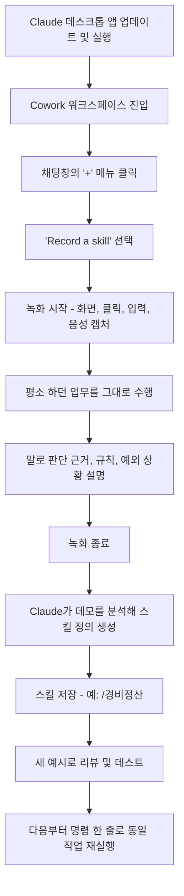
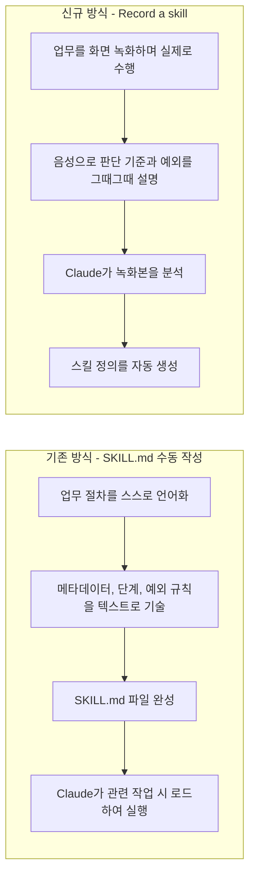

## 개요

2026년 7월 21일, Anthropic은 Claude Cowork에 "Record a skill"이라는 신기능을 추가했다. 사용자가 화면을 녹화하면서 평소 하던 업무를 그대로 수행하고 동시에 음성으로 판단 근거를 설명하면, Claude가 그 녹화 내용을 분석해 재사용 가능한 스킬(Skill)로 자동 변환해주는 기능이다. 지금까지 커스텀 스킬을 만들려면 SKILL.md라는 구조화된 지침 파일을 사람이 직접 작성해야 했는데, 이 절차를 "보여주기만 하면 되는" 방식으로 대체한 것이 핵심이다.

이 문서는 공유된 게시물(2026년 7월 21일, Anthropic 공식 X 계정 @claudeai 게시)의 내용과 그에 첨부된 실행 예시 자료, 그리고 이후 다수의 언론·커뮤니티 보도를 교차 검증하여 정리한 것이다. 원문 게시글에서 제기된 주장들 중 공식적으로 확인 가능한 부분과 아직 Anthropic이 명문화하지 않은 부분을 명확히 구분해서 서술한다.

---

## 1. 확인된 사실관계

Anthropic 공식 X 계정은 2026년 7월 21일(화) "Claude Cowork에 새 기능이 추가됐다. 화면을 녹화하며 작업을 수행하고 말로 설명하면, Claude가 그것을 다시 실행 가능한 스킬로 바꿔준다"는 내용의 게시물을 올렸고, The Decoder, AlphaSignal, CyberSecurity News, Android Authority, Android Headlines 등 다수의 매체가 같은 날 이를 보도하며 세부 사항을 확인했다. 종합하면 다음과 같다.

- **출시일**: 2026년 7월 21일(화)
- **위치**: Claude 데스크톱 앱의 Cowork 워크스페이스 내 "+" 메뉴 → "Record a skill"
- **이용 가능 요금제**: Pro, Max, Team 플랜 (무료 플랜에는 Cowork 자체가 포함되지 않아 이 기능도 이용 불가)
- **플랫폼**: 데스크톱 앱 전용이며, 이 글 작성 시점에서 웹이나 모바일 버전의 Claude Cowork에서는 제공되지 않는다. 참고로 Cowork 자체는 2026년 1월 Max 플랜 대상 데스크톱 전용 리서치 프리뷰로 시작해, 2026년 7월 7일부터 웹·모바일로 순차 확장되고 있는 제품이다.
- **캡처 대상**: 화면 활동, 마우스 클릭, 키보드 입력, 음성 설명
- **출력물**: 사용자의 스킬 라이브러리에 저장되는 재사용 가능한 스킬이며, 이후에는 슬래시 명령이나 짧은 지시만으로 동일 작업을 다시 실행할 수 있다.
- **추가 비용**: 별도의 추가 과금에 대한 언급은 어느 보도에도 없으며, 기존 Pro/Max/Team 요금제 안에 포함되어 제공된다.

한 가지 짚어둘 점은, 이 기능에 대한 Anthropic의 1차 발표가 anthropic.com/news에 게시된 정식 블로그 글이 아니라 공식 X 계정의 짧은 게시물이라는 것이다. 확인 결과 이 시점까지 별도의 전용 안내 문서나 개인정보·보존 정책 페이지는 공개되지 않았다. 따라서 아래에서 다루는 세부 동작 방식 중 일부는 게시물과 초기 사용자 보고에 근거한 것이며, Anthropic의 공식 기술 문서로 확정된 내용이 아님을 밝혀둔다.

---

## 2. 작동 방식: 녹화에서 실행까지

여러 매체가 공통적으로 정리한 사용 절차는 다음과 같다.

이 절차에서 실무적으로 가장 중요한 두 단계는 H(분석·변환)와 K(리뷰·테스트)다. Anthropic 소속 엔지니어 Lydia Hallie는 이 기능을 두고, 예전부터 자동화하고 싶었지만 마땅한 연동(connector)이 없어 미뤄뒀던 업무들에 요긴하게 쓰고 있다고 언급한 것으로 보도됐다. 다만 이는 개인 사용 후기 수준의 언급이며, Anthropic이 공식적으로 발표한 성능 지표나 벤치마크 결과는 아니다.

Claude가 녹화본에서 무엇을 추출하는지에 대해 여러 해설 기사가 공통적으로 짚는 부분은, 단순히 클릭 좌표의 나열이 아니라 "고정된 단계", "실행마다 달라지는 입력값", "성공 판정 기준"을 함께 추론해 스킬로 구성한다는 점이다. 이는 기존 스킬의 정의, 즉 Claude가 관련 작업을 만났을 때 불러와 적용하는 재사용 가능한 지침 패키지라는 개념과 맞닿아 있다.

---

## 3. 기존 스킬 제작 방식과 무엇이 달라졌나

Record a skill 이전에도 Claude Cowork에서 커스텀 스킬을 만드는 경로는 이미 여러 가지가 있었다. 문서로 확인되는 기존 경로는 다음 네 가지다.

1. SKILL.md 파일을 사람이 직접 작성
2. 글로 업무를 설명하면 Claude가 그 설명을 바탕으로 스킬을 생성
3. Cowork에서 어떤 작업을 성공적으로 마친 뒤, 그 과정을 스킬로 패키징해달라고 요청
4. 미리 준비된 스킬 패키지를 업로드

Record a skill은 이 네 가지에 다섯 번째 경로를 추가한 것이지, 기존 경로를 대체하는 것은 아니다. 다만 실무적으로 의미가 큰 이유는, 사람이 자기 업무를 글로 정리할 때 무의식적으로 누락하는 정보—예외 처리 규칙, 화면상의 시각적 단서, 명명 규칙, 사소한 품질 확인 습관 같은 것—가 실제로 작업을 수행하는 순간에는 자연스럽게 드러난다는 점이다. "말로 설명하기 어려운 암묵지"를 문서화가 아니라 시연으로 옮기는 접근이다.

두 경로의 근본적인 차이는 "언어화 부담을 누가 지느냐"에 있다. 기존 방식은 업무 수행자가 자신의 업무를 추상화해서 문서로 옮겨야 했고, 이 번역 과정에서 비개발자에게는 진입장벽이 됐다. 새 방식은 그 번역을 Claude 쪽으로 넘긴다. 다만 이는 동시에 "Claude가 무엇을 스킬로 잘못 일반화할 수 있는가"라는 새로운 위험을 만든다는 점을 4장과 6장에서 다시 짚는다.

---

## 4. 공유된 게시물의 예시 자료가 보여주는 것

공유해주신 자료는 Claude Cowork 데스크톱 화면에서 "+" 메뉴가 펼쳐진 상태를 보여준다. 메뉴 항목은 "Add files or photos", "Record a skill", "Skills", "Connectors", "Plugins" 순으로 구성되어 있고, "Record a skill"을 선택하면 "화면, 클릭, 입력, 음성이 녹화되어 Claude에 전송된 뒤 재사용 가능한 스킬로 변환된다"는 설명과 함께 녹화 시작 버튼이 뜬다. 이어서 "Recorded demonstration · 23.4s"라는 표시와 "Saved as /file-expenses"라는 결과가 나타난다.

이 구성은 여러 매체가 별도로 확인한 메뉴 구조("+" 메뉴 안에 파일 추가, Record a skill, Skills, Connectors, Plugins가 함께 있다는 설명), 그리고 Anthropic이 자체적으로 예시로 든 "경비 처리(경비 정산) 자동화" 사용 사례와 정확히 일치한다. 다만 "23.4초"라는 구체적인 녹화 시간은 해당 게시물의 예시에서 관찰되는 수치일 뿐, Anthropic이 "데모는 몇 초 만에 완성된다"는 식으로 공식 발표한 기준값은 아니다. 아주 짧은 데모로도 스킬 생성이 가능하다는 것을 보여주는 사례로 이해하는 것이 정확하다.

원문 게시글에서 제기된 다른 주장들을 소스별로 대조하면 다음과 같다.

| 게시글의 주장 | 검증 결과 | 근거 수준 |
|---|---|---|
| 7월 21일 Claude Cowork에 추가됨 | 확인됨 | Anthropic 공식 X 게시물 + 다수 매체 |
| "+" 메뉴에서 녹화 시작, 화면·입력·음성 분석 후 스킬로 자동 변환 | 확인됨 | Anthropic 공식 게시물 + 다수 매체 |
| "/경비정산"처럼 명령어로 저장, 이후 한마디로 재실행 | 확인됨 | Anthropic 예시(경비 처리) + 첨부 자료의 "/file-expenses" 표시 |
| 기존에는 SKILL.md를 사람이 직접 작성해야 했음 | 확인됨 | Claude Skills 공식 개념 및 여러 해설 기사 |
| 좌표 기반 매크로/RPA와 달리 업무의 목적과 판단을 이해해 화면 레이아웃 변화에도 어느 정도 대응 시도 | 부분적으로만 확인됨 | Claude 자체에 대한 Anthropic의 명시적 기술 설명은 아직 없음. 동일 개념을 6월에 먼저 발표한 OpenAI Codex의 "Record & Replay"에 대해서는 "좌표가 아닌 자연어 기반 SKILL.md를 생성해 화면 상태를 재해석한다"는 설명이 공식 문서에 있음. Claude도 유사한 스킬 표준을 따르는 것으로 보이나, 세부 동작에 대한 Anthropic의 별도 확인은 없음 |
| 추가 요금 없이 Pro/Max/Team 데스크톱 앱에서 이용 가능 | 확인됨 | 다수 매체가 동일하게 보도 |
| 녹화된 화면과 음성은 Claude 쪽으로 전송됨 | 확인됨(구조상 당연히 필요한 처리이며 다수 매체가 명시) | Anthropic 게시물 및 Cowork 일반 보안 안내 |
| 1회 데모는 정상 흐름만 담기므로, 생성된 스킬은 초안 취급 후 테스트 필요 | Anthropic의 절차 설명과 일치, 다수 커뮤니티 해설이 강하게 권고 | 공식 절차(리뷰·테스트 단계) + 커뮤니티 컨센서스 |
| 송금, 계약 승인처럼 되돌릴 수 없는 업무에는 부적합 | Anthropic이 이 기능에 한정해 명시한 문구는 아니며, Cowork 전반의 안전 가이드(원격 세션 작업이 서버에서 처리되고 화면상의 개인정보·기밀정보 노출 위험을 경고하는 내용)에서 유추 가능한 일반 원칙 | 합리적 추론이며, Record a skill 전용 공식 경고문은 아직 없음 |
| 경비 정산, 주간 보고, 데이터 정리 같은 반복 정형 업무에 적합 | 확인됨 | Anthropic 자체 예시(경비 처리) + 다수 해설 기사의 반복적 권고(주간 보고 서식화, 반복 데이터 입력 등) |

---

## 5. OpenAI Codex "Record & Replay"와의 비교

원문 게시글에서 언급한 대로, 동일한 개념의 기능을 OpenAI가 Codex에 먼저 도입한 것은 사실로 확인된다. OpenAI는 2026년 6월 18일 Codex macOS 앱(앱 버전 26.616, CLI 0.141.0)에 "Record & Replay"를 출시했다. 사용자가 Mac에서 반복 업무를 한 번 시연하면 Codex가 이를 점검·수정 가능한 스킬로 만들어주는 기능으로, Computer Use 플러그인과 화면 녹화·손쉬운 사용 권한이 필요하다. 다만 출시 시점 기준 macOS 전용이며 유럽경제지역(EEA), 영국, 스위스에서는 제공되지 않는다는 지역 제한이 있다.

두 기능을 정리하면 다음과 같다.

| 구분 | Claude Cowork - Record a skill | OpenAI Codex - Record & Replay |
|---|---|---|
| 출시일 | 2026년 7월 21일 | 2026년 6월 18일 |
| 지원 플랫폼 | Claude 데스크톱 앱(Windows/Mac 등, 데스크톱 전용) | macOS 전용 |
| 지역 제한 | 보도된 바 명시적 지역 제한 없음 | EEA, 영국, 스위스 제외 |
| 요금제 조건 | Pro, Max, Team | ChatGPT Business 등 일부 유료 플랜(Computer Use 활성화 필요) |
| 산출물 형식 | 스킬 라이브러리에 저장되는 재사용 스킬 | 검토·수정 가능한 SKILL.md 기반 스킬(Agent Skills 표준 준수) |
| 실행 범위 | Cowork 내 재실행 | Codex, Computer Use, 브라우저 액션, 플러그인 등에서 공통 재실행 가능 |
| 특징적 설명 | 아직 전용 privacy/보존 정책 미공개 | 자연어 기반 SKILL.md를 생성해 좌표가 아닌 화면 상태 해석 방식으로 재실행한다고 명시 |

두 회사 모두 "SKILL.md" 형태의 개방형 스킬 표준을 공유하고 있다는 점도 흥미롭다. Codex 쪽 해설 문서는 이 표준이 Codex CLI, Claude Code, Gemini CLI, Cursor 등에서 공통으로 이해되는 형식이라고 설명한다. 즉 "시연으로 스킬을 만든다"는 흐름은 특정 회사의 실험이 아니라, 에이전트형 코딩·업무 도구 업계 전반에서 동시에 나타나고 있는 방향성으로 보는 것이 정확하다.

---

## 6. 실무 적용 시 고려해야 할 리스크

### 6.1 개인정보·기밀정보 노출

녹화는 정의상 화면에 보이는 모든 것을 캡처한다. 경비 처리나 이메일 회신처럼 단순해 보이는 작업이라도 계좌번호, 사내 시스템 화면, 동료 이름, 고객 정보 등이 의도치 않게 함께 녹화될 수 있다. 앞서 언급했듯 Anthropic은 이 기능 전용의 보존 기간이나 학습 활용 정책을 아직 공개하지 않았다. 따라서 현재로서는 화면 공유 시의 일반 원칙—민감 정보가 화면에 노출되지 않도록 사전에 정리하고, 테스트 데이터나 익명화된 예시로 시연하는 방식—을 그대로 적용하는 것이 안전하다.

### 6.2 데모는 정상 흐름만 담는다

한 번의 시연은 그 순간에 일어난 "정상 케이스" 하나만을 담는다. 오류 상황, 예외 데이터, 두 번째 승인자가 필요한 경우 같은 변수는 녹화에 잡히지 않을 가능성이 높다. Anthropic이 안내하는 절차에도 "리뷰하고 새로운 예시로 테스트한 뒤 신뢰할 것"이라는 단계가 명시적으로 포함돼 있다. 이 단계를 생략하고 곧바로 실무에 투입하는 것은 권장되지 않는다.

### 6.3 되돌릴 수 없는 업무는 신중하게

송금, 계약 승인, 삭제처럼 실행 결과를 되돌리기 어려운 업무에 곧바로 자동 실행 권한을 주는 것은 위험하다. 이는 Record a skill에 한정된 경고는 아니지만, Cowork가 원격 세션에서 파일을 읽고, 웹을 탐색하고, 연동된 앱을 조작할 수 있다는 일반적인 안전 안내와 같은 맥락에서 이해할 수 있다.

### 6.4 적합한 업무 유형

여러 해설 기사가 공통적으로 꼽는 적합 사례는 경비 정산, 주간 보고서 서식화, 반복적인 데이터 입력, 정해진 규칙에 따른 이메일 분류처럼 "매번 절차가 거의 동일하고, 성공 조건이 명확한" 업무다. 반대로 실행마다 절차가 크게 달라지거나 복잡한 판단이 필요한 업무는 당분간 대화형으로 처리하면서 스킬이 실제로 어떤 권한과 데이터에 접근하는지 충분히 파악한 뒤 자동화 여부를 결정하는 편이 낫다.

---

## 7. 하네스 엔지니어링 관점에서 본 함의

이 기능을 조금 더 구조적으로 보면, "하네스(harness)를 누가 설계하느냐"의 무게중심이 이동하는 사례로 읽을 수 있다. 기존에는 SKILL.md라는 명시적 지침을 사람이 작성해야 했고, 이는 검증 게이트나 상태 유지 로직을 사람이 의도적으로 설계할 기회이기도 했다. Record a skill은 이 설계 과정 자체를 모델의 추론으로 넘긴다는 점에서, 스킬의 신뢰도가 "시연자가 얼마나 대표성 있는 사례를 보여줬는가"와 "Claude가 그 시연에서 올바른 일반화를 끌어냈는가"라는 두 요인에 전적으로 의존하게 된다.

이는 코딩 에이전트 논의에서 흔히 지적되는 조기 완료(premature completion) 실패 모드와 구조가 비슷하다. 한 번의 정상 시연만으로 스킬이 "완성됐다"고 간주하고 곧바로 프로덕션에 투입하면, 검증되지 않은 자기 확신 위에 자동화가 세워지는 셈이다. Anthropic이 절차상 "새 예시로 테스트한 뒤 신뢰하라"는 단계를 넣어둔 것은, 이 위험을 부분적으로 인지하고 있다는 신호로 볼 수 있다. 다만 이 검증 단계를 실제로 얼마나 엄격하게 수행하느냐는 결국 사용자의 몫으로 남는다.

또한 이 기능은 국내 SM/SI 환경에서 자주 거론되는 AX 시어터(demo-to-production chasm) 위험과도 맞닿아 있다. 짧은 시연 영상 하나로 만들어진 스킬은 데모 단계에서는 인상적으로 작동하지만, 실제 업무 환경의 예외 케이스, 조직별 승인 규칙, 시스템 버전 차이 앞에서는 다르게 작동할 수 있다. 화면 녹화 기반 자동화를 도입할 때는 "몇 초짜리 시연으로 무엇을 자동화할 수 있는가"뿐 아니라 "그 스킬이 운영 환경의 예외를 얼마나 견디는가"를 별도로 검증하는 절차를 조직 차원에서 마련하는 것이 바람직하다.

---

## 8. 요약: 사실 · 벤더 주장 · 미확인 영역 구분

| 구분 | 내용 |
|---|---|
| **확인된 사실** | 2026년 7월 21일 출시, Pro/Max/Team 데스크톱 앱 "+" 메뉴에서 이용, 화면·클릭·입력·음성을 녹화해 스킬로 변환, 경비 처리 등 반복 정형 업무를 예시로 제시, OpenAI Codex가 6월 18일 유사 기능(Record & Replay)을 macOS 한정으로 먼저 출시 |
| **Anthropic이 예시로 든 활용 사례(공식 발표 범위)** | 경비 정산 자동화 |
| **아직 공식 문서로 확정되지 않은 부분** | 녹화 데이터의 구체적 보존 기간, 모델 학습 활용 여부, 화면 레이아웃 변화에 대한 기술적 대응 방식(좌표 기반이 아니라는 설명은 Codex 쪽에서만 명시적으로 확인됨) |
| **커뮤니티·업계 해설(합리적 추론이지만 Anthropic의 공식 문구는 아님)** | 되돌릴 수 없는 업무에는 부적합, RPA 대비 유지보수 부담이 낮을 것이라는 기대, "AI 신입사원에게 일을 가르치듯" 업무를 넘길 수 있다는 비유적 평가 |

---

## 9. 참고자료

- Anthropic 공식 X(Twitter) 계정(@claudeai) 게시물, 2026년 7월 21일
- The Decoder, "Claude Cowork learns new skills through screen recordings and voice-over explanations", 2026년 7월 21일, https://the-decoder.com/claude-cowork-learns-new-skills-through-screen-recordings-and-voice-over-explanations/
- AlphaSignal, "Anthropic's Claude Cowork Lets You Teach AI by Recording Your Screen", 2026년 7월 21일, https://alphasignal.ai/news/anthropic-s-claude-cowork-lets-you-teach-ai-by-recording-your-screen
- CyberSecurity News, "Now You Can teach a Skill to Claude by Just Recording your Screen", 2026년 7월 21일, https://cybersecuritynews.com/teach-skill-claude/
- Android Headlines, "Show, Don't Tell: Claude Cowork Now Learns Skills from Your Screen Recordings", 2026년 7월 21일, https://www.androidheadlines.com/2026/07/claude-cowork-record-a-skill-screen-recording-feature.html
- Android Authority, "Forget prompts: Claude can now learn your workflow by watching your screen", https://www.androidauthority.com/claude-cowork-record-skills-feature-3689919/
- Search Engine Journal, "Anthropic's Claude Can Now Watch A Video And Learn Your Job", https://www.searchenginejournal.com/anthropics-claude-can-now-watch-a-video-and-learn-your-job/583053/
- explainx.ai, "Claude Cowork Record a Skill — July 2026", https://www.explainx.ai/blog/claude-cowork-record-a-skill-screen-recording-july-2026
- Coursiv Blog, "Claude Cowork Record a Skill: How It Works & Who Gets It", https://coursiv.io/blog/claude-cowork-record-a-skill
- The AI Career Lab, "Claude Cowork Can Now Learn Your Workflow by Watching Once", https://theaicareerlab.com/blog/claude-cowork-record-a-skill-2026
- Stan Ventures, "Claude Cowork Can Now Learn Your Workflow From a Screen Recording", https://www.stanventures.com/news/claude-cowork-can-now-learn-your-workflow-from-a-screen-recording-7559/
- eesel AI, "OpenAI Codex record and replay, explained (2026)", https://www.eesel.ai/blog/codex-record-and-replay-explained
- OpenAI Developers, "Record & Replay – Codex" 공식 문서, 2026년 6월, https://developers.openai.com/codex/record-and-replay
- TechTimes, "OpenAI Codex Automation Gains Record and Replay", 2026년 6월 20일, https://www.techtimes.com/articles/318759/20260620/openai-codex-automation-gains-record-replay-show-it-once-skip-script.htm
- 9to5Mac, "Anthropic expanding Claude Cowork to mobile and web, details here", 2026년 7월 13일, https://9to5mac.com/2026/07/13/anthropic-expanding-claude-cowork-to-mobile-and-web-details-here/
- TechCrunch, "Claude Cowork expands to mobile and web", 2026년 7월 7일, https://techcrunch.com/2026/07/07/the-coding-agent-wars-are-spilling-into-the-rest-of-the-office-claude-cowork/

---

작성일자: 2026-07-23
