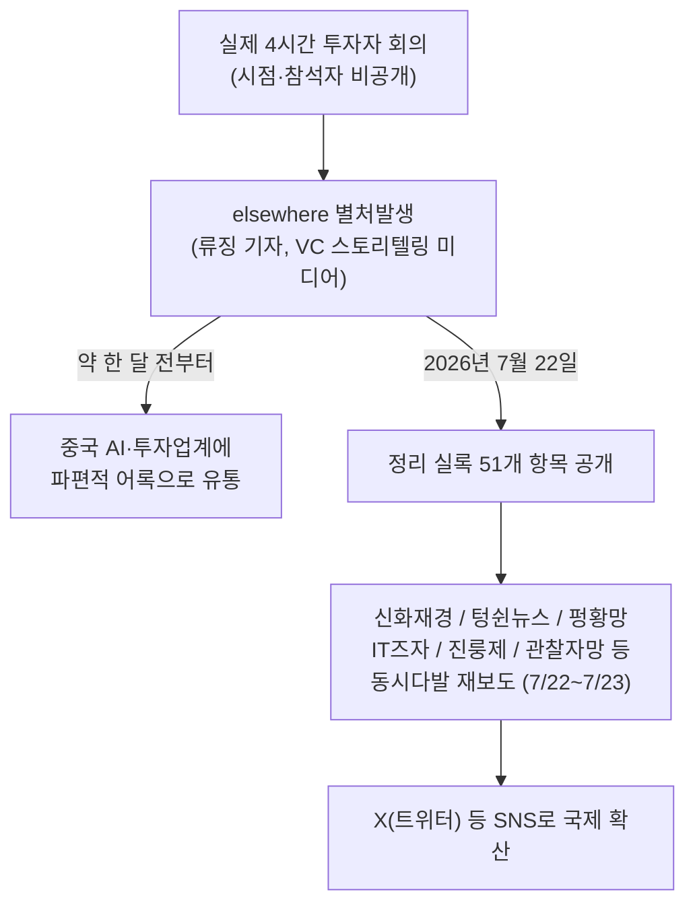
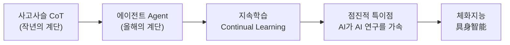

- 작성 기준일: 2026년 7월 23일
- 원문 소스: X(트위터) 게시물([@maxforai](https://x.com/maxforai/status/2080035349536154073)) + 중국어 원문 발언 정리본, 그리고 이를 교차 검증하기 위한 최신 웹 검색 결과

## 관련문서

[**딥시크 창업자 량원펑, 4시간 투자자 간담회 발언록을 둘러싼 모든 것**](https://k82022603.github.io/posts/%EB%94%A5%EC%8B%9C%ED%81%AC-%EC%B0%BD%EC%97%85%EC%9E%90-%EB%9F%89%EC%9B%90%ED%8E%91,-4%EC%8B%9C%EA%B0%84-%ED%88%AC%EC%9E%90%EC%9E%90-%EA%B0%84%EB%8B%B4%ED%9A%8C-%EB%B0%9C%EC%96%B8%EB%A1%9D%EC%9D%84-%EB%91%98%EB%9F%AC%EC%8B%BC-%EB%AA%A8%EB%93%A0-%EA%B2%83/)

---

## 1. 이 문서는 무엇을 다루는가

지난 며칠 사이 중국 AI 업계와 투자자 커뮤니티에서 가장 뜨겁게 회자된 이야기는, DeepSeek의 창업자 량원펑(梁文锋)이 어느 투자자 대상 비공개 회의에서 무려 네 시간 동안 발언했다는 내용이 정리되어 세상에 나온 사건입니다. 이 회의 자체는 이미 한 달 전부터 업계에 "전설처럼" 떠돌던 이야기였고, 파편적인 문장들만 여기저기서 인용되고 있었습니다. 그러다 2026년 7월 22일, 중국의 벤처캐피털 스토리텔링 미디어 "elsewhere(별처발생, 別處發生)"가 이 회의의 정리 실록을 공개하면서 신화재경(新浪财经), 텅쉰뉴스(腾讯新闻), 펑황망(凤凰网), IT즈자(IT之家), 진룽제(金融界) 등 중국의 주요 경제·테크 매체들이 일제히 이를 받아 보도했습니다.

이 문서는 그 발언록에 어떤 내용이 담겨 있는지를 최대한 이해하기 쉽게, 그러나 동시에 "이것이 얼마나 신뢰할 수 있는 정보인지"를 분명히 짚어가며 정리한 것입니다. 량원펑이라는 인물은 평소 언론 노출을 극도로 자제하는 것으로 유명하기 때문에, 이런 대규모 발언록이 나온 것 자체가 이례적인 사건이고, 그만큼 내용의 출처와 신뢰도를 꼼꼼히 따져볼 필요가 있습니다.

---

## 2. 먼저 짚어야 할 것: 이 내용의 출처와 신뢰도

가장 먼저 분명히 해두어야 할 사실이 있습니다. **이 발언록은 DeepSeek이나 량원펑 본인이 공식적으로 발표하거나 확인해준 자료가 아닙니다.** 여러 매체들의 표현을 그대로 옮기면, 이 회의는 "데이터에 따르면(据称)" 열렸다고 하는 것이며, 보도들은 하나같이 "~라고 전해진다", "~라고 알려졌다"는 유보적인 어투를 쓰고 있습니다.

정보의 흐름을 정리하면 이렇습니다.



여기서 중요한 점은, 지금 유통되고 있는 거의 모든 중국어 보도가 **하나의 동일한 1차 출처, 즉 "elsewhere"가 정리한 실록을 인용**하고 있다는 것입니다. 즉 여러 매체가 이 이야기를 다뤘다고 해서 "여러 개의 독립적인 소식통이 각각 확인한 것"은 아니며, "하나의 정리본이 여러 매체를 통해 동시에 확산된 것"에 더 가깝습니다. 이것은 신뢰도를 완전히 부정하는 것은 아니지만, 정보를 받아들일 때 반드시 감안해야 할 구조적 특징입니다.

정리하면 신뢰도는 다음과 같이 나눌 수 있습니다.

| 신뢰도 단계 | 해당 여부 | 설명 |
|---|---|---|
| 1단계 — 공식 확인 | 해당 없음 | DeepSeek 또는 량원펑 본인의 공식 발표·인터뷰·확인은 발견되지 않음 |
| 2단계 — 다수 매체 교차 보도 | 부분적으로 해당 | 여러 대형 매체가 동시에 보도했으나, 모두 동일한 1차 출처(elsewhere)를 인용하는 구조 |
| 3단계 — 미확인/단일 출처 | 실질적으로 이 단계에 가까움 | 원 발언의 녹취나 회의 자체의 존재는 제3자가 독립적으로 검증한 바 없음 |

따라서 이 문서에서 다루는 모든 내용은 **"량원펑이 실제로 이렇게 말했다고 널리 보도되고 있는 내용"** 으로 읽어야 하며, "DeepSeek의 공식 입장"으로 오해해서는 안 됩니다.

---

## 3. 왜 하필 지금 이런 회의가 있었을까 — 배경 맥락

이 발언록이 왜 "투자자 회의"라는 형식으로 나왔는지를 이해하려면 DeepSeek의 최근 자금 조달 흐름을 알아둘 필요가 있습니다. DeepSeek은 2023년 설립 이후 줄곧 모회사 격인 퀀트 헤지펀드 환팡량화(幻方量化)의 자체 자금만으로 연구개발을 해왔고, 외부 투자를 받지 않겠다는 원칙을 지켜온 것으로 알려져 있었습니다. 그런데 여러 매체 보도에 따르면 2026년 4월 무렵 DeepSeek이 창사 이래 최초로 외부 투자 유치를 시작했고, 협상이 진행되면서 거론되는 기업가치가 4월 초 약 100억 달러 수준에서 시작해 이후 몇 달에 걸쳐 계속 상향 조정되었다고 보도되었습니다. 이 과정에서 텐센트, 알리바바 등 대형 기업과 국가 반도체 산업 투자 펀드가 투자 논의에 참여했다는 보도도 나왔습니다. 다만 이 구체적인 기업가치 수치들은 보도마다 조금씩 다르고 공식적으로 확정된 숫자로 보기는 어렵습니다.

이런 흐름 속에서, "투자자 대상 4시간 회의"가 열렸다는 것은 자연스럽게 이 투자 유치 과정의 일환, 즉 잠재 투자자들에게 회사의 방향성을 설명하는 자리였을 가능성이 높다고 추정할 수 있습니다. 다만 이 회의의 정확한 시점, 참석자, 장소 등은 보도에서 특정되지 않았습니다.

---

## 4. 발언록의 핵심 내용

이제 실제로 알려진 발언 내용을 주제별로 풀어보겠습니다. 아래 내용은 모두 "보도에 따르면 량원펑이 이렇게 말했다"는 전제 위에 있다는 점을 다시 한번 유념해주세요.

### 4.1 "안 한다"의 철학 — 절제라는 전략

이 발언록 전체를 관통하는 단어는 "불(不)", 즉 "~하지 않는다"입니다. 량원펑은 회의 내내 자신들이 무엇을 하지 않을 것인지를 반복해서 강조했다고 합니다. 천재 신화를 만들지 않겠다는 것, 이익을 극대화하지 않겠다는 것, 폐쇄형 모델로 전환하지 않겠다는 것, 사용자 수 경쟁에 뛰어들지 않겠다는 것, 그리고 영상 생성이나 3D, 월드모델, 혹은 또 다른 "슈퍼 앱"을 만들지 않겠다는 것입니다.

그가 이런 태도를 설명하는 논리는 비교적 단순합니다. 절제란 무언가를 포기함으로써 다른 무언가를 얻는 전략이라는 것입니다. 그는 회사를 처음 만들었을 때를 회고하며, 자신들은 돈도, 컴퓨팅 자원도, 지명도도 없는 "아주 평범한 사람들의 모임"이었다고 말했다고 합니다. 그가 좋아하는 서사는 "천재들이 비범한 일을 해냈다"는 이야기가 아니라 "평범한 사람들이 비범한 일을 해냈다"는 이야기라는 대목도 이번 실록에 포함되어 있습니다. 즉 그의 절제는 단순한 겸손의 표현이 아니라, 회사가 처한 현실적 제약(자원의 한계) 속에서 최대의 확률로 AGI에 도달하기 위한 의도적인 선택으로 설명되고 있습니다.

### 4.2 AGI로 가는 계단 — 사고사슬에서 체화지능까지

량원펑이 그린 AGI 로드맵은 계단을 오르는 이미지로 설명됩니다. 작년의 계단이 사고사슬(Chain-of-Thought, 단계적으로 생각을 풀어나가는 추론 능력)이었다면, 올해의 계단은 에이전트(스스로 계획을 세우고 도구를 사용해 작업을 수행하는 능력)라는 것입니다. 그리고 에이전트 다음에 넘어야 할 산이 바로 지속학습(持续学习)이라고 그는 말합니다. 지속학습을 이뤄내고 나면 "점진적인 특이점(渐进的奇点)"이라 부를 만한 국면에 들어서는데, 이는 모델이 인간이 할 수 있는 거의 모든 일을 해낼 수 있게 되고, 심지어 스스로 더 발전된 AI 시스템을 개발하는 데까지 나아가는 단계를 뜻합니다. 그리고 이 모든 과정의 마지막에야 비로소 체화지능(具身智能, 로봇 등 물리적 실체를 가진 지능)이 온다고 설명합니다.

이 로드맵을 그림으로 정리하면 다음과 같습니다.



그는 지능의 종착점이 결국 체화, 즉 물리적 실체를 가진 형태일 수밖에 없다고도 말합니다. 논리는 이렇습니다. 보통의 사람이 진짜로 필요로 하는 것은 "또 하나의 컴퓨터 화면"이 아니라 "노동력"이라는 것입니다. 이는 AI가 궁극적으로는 화면 속 대화 상대를 넘어 실제 물리적 작업을 대신할 존재로 발전해야 한다는 그의 관점을 보여줍니다.

### 4.3 왜 지속학습이 다음 관문인가

량원펑은 현재의 AI가 아직 인간 노동력을 진정한 의미에서 대체하지 못하는 이유를 지속학습 능력의 부재로 설명합니다. 사람은 일을 하면서 경험을 쌓고 그 경험을 다음 업무에 자연스럽게 활용하지만, 지금의 AI는 새로운 작업을 시작할 때마다 인간이 관련된 맥락을 처음부터 다시 입력해줘야 한다는 것입니다. 그는 이것이 "거의 불가능한 일"이라고 표현했다고 하며, 다음 세대 모델이라면 지속학습 능력을 갖추지 못한 이상 "다음 세대"라 부를 자격이 없다고까지 말했다고 전해집니다.

### 4.4 이익 극대화를 거부하는 가격 철학

상업적 측면에서 량원펑은 DeepSeek이 수익 극대화를 가격 정책의 목표로 삼지 않는다고 밝혔습니다. 그는 "우리는 합리적인 수준의 이윤만 가져간다"고 말했다고 하며, 구체적인 사례도 언급됩니다. DeepSeek의 한 모델을 출시할 때 수요가 지나치게 몰릴 것을 우려해 처음에는 가격을 다소 높게 책정했는데, 이후 가격을 원래의 4분의 1 수준으로 내렸고, 사내 단체 채팅방에서 많은 직원들이 이를 반겼다는 일화입니다. 그가 설명하는 이유는, 모델을 정성껏 만든 목적 자체가 더 많은 사람이 충분히 사용할 수 있도록 하기 위함이라는 것입니다. 단기적으로 가격을 높게 유지하면 수익은 늘어나겠지만, 장기적으로 보면 반드시 그것이 이득인지는 알 수 없다는 취지의 말도 덧붙였다고 합니다.

한편 제품·서비스 개발에 대해서는 흥미로운 비유도 등장합니다. 지금은 제품으로 수익을 극대화할 시점이 아니며, AGI로 가는 길에 제품이라는 단계를 거치긴 하지만 소비자용·기업용 제품에 지나치게 공을 들일 필요는 없다는 것입니다. 그는 이를 "기술적으로 높은 위치에 서서 상대적으로 낮은 단계의 기술을 만드는 것은 차원을 낮춰 내려다보며 타격을 가하는 것과 같다"는 취지로 표현했다고 전해지는데, 이는 중국의 유명 SF 소설 『삼체』에서 널리 알려진 "차원 강하 타격(降维打击)"이라는 개념을 빌려온 비유로, 더 높은 차원(더 근본적인 기술력)에 있는 쪽이 낮은 차원에서 경쟁하는 것은 압도적으로 유리하다는 뜻을 담고 있습니다.

### 4.5 저비용은 목적이자 결과

DeepSeek을 상징하는 키워드 중 하나가 "낮은 비용"인데, 량원펑은 이것이 단순한 마케팅 전략이 아니라고 강조합니다. 그의 설명에 따르면 낮은 비용은 애초에 목표로 설정한 것이라기보다 모델 아키텍처 자체를 효율적으로 설계한 결과로 자연스럽게 따라온 것입니다. 그리고 이 낮은 비용에는 두 가지 효과가 있다고 그는 설명합니다. 하나는 더 많은 사람이 AI를 부담 없이 사용할 수 있게 되는 보편화 효과이고, 다른 하나는 단위 연산당 비용이 낮을수록 제한된 컴퓨팅 자원 안에서도 더 큰 모델을 훈련시킬 수 있다는 점입니다. 그는 이를 두고 "대기업은 자원을 더 투입해서 문제를 해결하지만, 우리는 비용 효율을 우선적으로 고려한다"고 말했다고 전해집니다.

또한 그는 API 판매 사업 자체에 대해서는 큰 매력을 느끼지 않는다는 취지로 말했다고 합니다. DeepSeek은 서비스 유지를 위해 아주 작은 팀만 필요로 하며, 별도의 고객지원 인력이나 영업 인력 없이도 사용자들이 자연스럽게 찾아온다는 것입니다. 그는 "우리는 늘 상업화를 하고 있지만, 상업화 자체를 목표로 삼지는 않는다"고 표현했고, DeepSeek이 상업화를 전면적인 목표로 전환할 시점은 아직 한참 멀었다고 보고 있다고 전해집니다.

### 4.6 오픈소스 — 이익을 나누는 것이자 회사 규모에 맞는 전략적 최적점

오픈소스 전략에 대해 량원펑은 다층적인 이유를 제시합니다. 직원들에게는 성취감과 조직에 대한 소속감을 준다는 점, 사회적으로는 연구자와 기업, 일반 사용자 모두에게 도움이 된다는 점을 꼽으며 "오픈소스는 이익을 나누어주는 것"이라고 표현했다고 합니다. 그는 AI가 결국 인류 사회에서 매우 거대한 산업으로 성장할 것이며, 이를 독점하려는 어떤 시도도 결국은 실패할 수밖에 없다고 내다봤습니다. "만약 AI가 결국 인류 사회 GDP의 10퍼센트를 차지하게 된다면, 그 이익을 독점하려는 누구든 역사 속에서 버려질 것"이라는 발언이 이 논리를 압축해서 보여줍니다.

실무적으로는, DeepSeek이 상대적으로 약한 버전만 오픈소스로 공개하고 내부적으로 더 강력한 모델을 따로 보유하는 방식을 취하지 않는다고도 밝혔습니다. 경쟁사가 DeepSeek의 모델을 가져다 쓰는 것에 대해서도 크게 우려하지 않는다는 태도를 보였는데, 그 이유로는 소규모 스타트업은 최전선 모델 연구에 필요한 자원이나 의지가 부족하고, 대기업은 자원은 있지만 조직적으로 이런 연구를 빠르게 밀어붙이기 어려운 구조적 한계가 있다는 점을 들었습니다. 량원펑은 DeepSeek이 바로 이 둘 사이의 "드문 중간 지점", 즉 자신들과 같은 규모의 회사에 딱 맞는 전략적 스위트 스팟에 있다고 표현했습니다.

### 4.7 미중 AI 경쟁에 대한 인식 — 스케일링을 여전히 믿는다

중국과 미국의 AI 격차에 대해 량원펑은 인재 자체가 부족한 것은 아니라고 진단했다고 전해집니다. DeepSeek의 목표는 훨씬 적은 컴퓨팅 자원으로도 격차를 6개월, 나아가 3개월 수준까지 줄이는 방식으로 중미 AI 경쟁의 서사 자체를 다시 쓰는 것이라고 설명합니다. 이런 판단의 근거로 그는 여전히 스케일링 법칙(모델과 데이터, 연산량을 키울수록 성능이 향상된다는 경험적 법칙)을 신뢰한다고 밝혔습니다. "우리는 스케일링을 믿는다. 규모가 커질수록 결과는 분명히 더 좋아진다"는 취지의 발언이 이를 뒷받침합니다. 그는 DeepSeek이 지금 수준의 모델 규모로 훈련하는 이유가 그 규모로 충분하다고 판단해서가 아니라, 현재 확보한 컴퓨팅 자원이 그 규모까지만 허용하기 때문이라고 밝혔습니다.

최전선 모델 경쟁의 승부를 가르는 요인에 대해서는 세 가지, 즉 비용, 시간, 사용자 경험을 꼽았습니다. 이 중에서도 비용이 첫 번째 순위라고 그는 강조합니다. 만약 두 회사가 비슷한 품질의 모델을 제공한다면, 승부는 결국 누가 더 낮은 비용으로 서비스를 제공할 수 있느냐에 달려 있다는 것입니다. 시간은 두 번째 요인으로, 몇 달 먼저 나오느냐 늦게 나오느냐가 결과를 완전히 바꿀 수 있다고 봅니다. 사용자 경험은 어느 정도의 고착 효과와 진입장벽을 만들 수는 있지만, 이것이 가장 본질적인 해자(경쟁우위의 핵심 요소)는 아니라고 그는 평가했습니다.

### 4.8 유일하게 양보할 수 없는 것 — 팀의 안정성

이번 발언록에서 가장 단호한 어조로 언급된 대목은 조직의 안정성 문제입니다. 량원펑은 이를 회사가 직면한 가장 큰 리스크 중 하나로 꼽으며, "단 한 가지만은 양보할 수 없다. 바로 팀의 안정성을 유지하는 것이다"라고 말했다고 전해집니다. 그는 최근의 투자 유치가 이 리스크를 상당히 낮춰주었다고 언급했고, "팀의 안정성만 유지할 수 있다면 나는 반드시 AGI를 만들어낼 수 있다. 그만큼 단순한 문제"라고 표현했다고 합니다.

### 4.9 조직 운영 철학 — 톱다운과 보텀업의 균형, KPI 대신 비전

조직 운영 방식에 대해서도 흥미로운 대목이 있습니다. DeepSeek의 조직 운영은 위에서 아래로 지시가 내려오는 방식(량원펑의 표현으로는 "올바른 일을 하는 것")과, 아래에서 위로 자율적으로 올라오는 방식이 함께 존재한다고 그는 설명합니다. 다만 그는 위에서 정해준 일이 직원 업무 시간의 절반을 넘어서는 것을 원하지 않는다고 밝혔습니다. 나머지 절반은 철저히 자율적인 영역으로 남겨두어, 연구자들이 사전 승인이나 고정된 요구사항 없이도 스스로 중요하다고 판단하는 방향을 자유롭게 탐구할 수 있어야 한다는 것입니다. 다른 많은 AI 기업들과 달리 DeepSeek은 과도한 초과근무를 장려하지 않는다고도 밝혔는데, 그 이유로 연구에는 상대적으로 여유 있는 환경이 필요하다는 점과, 회사가 모든 제품의 완성도를 다 끌어올리기보다는 초점을 좁히는 쪽을 의도적으로 선택한다는 점을 들었습니다. 이 역시 그가 말하는 "절제"의 또 다른 형태로 제시됩니다.

또한 DeepSeek은 KPI가 아니라 비전에 의해 움직이는 조직이라는 점도 강조되었습니다. "어떤 KPI를 달성하는 것, 그것은 우리의 방식이 아니다"라는 발언이 대표적입니다. 그는 DeepSeek의 비전이 반드시 공식 문서로 명문화되어 있는 것은 아니며, 그것은 회사가 일을 처리하는 방식, 그리고 세상을 대하는 태도 안에 존재한다고 설명했습니다. "비전이란 벽에 걸어놓은 구호가 아니다. 무엇을 말하느냐가 아니라 무엇을 실제로 하느냐가 비전이다"라는 말이 이 철학을 요약합니다.

### 4.10 마지막 경고

발언록의 말미에 등장하는 문장은 어쩌면 이번 회의 전체에서 가장 무게감 있는 대목으로 꼽힙니다. 량원펑은 이렇게 말했다고 전해집니다. "만약 당신의 비전이 더 많은 것을 갖는 것이라면, 당신은 이미 진 것이다. 더 큰 어려움에 직면하게 될 것이다. 세상은 원래 그런 것이다." 이 발언은 DeepSeek이 모든 AI 시장에서 승리하는 것을 목표로 삼지 않는다는 메시지로 읽히며, 대신 AGI 실현에 필요한 집중력, 비용 우위, 팀의 안정성, 조직의 자유를 지키는 데에 방점이 찍혀 있다는 것을 보여줍니다.

---

## 5. 한국어 용어 정리

| 원어 표현 | 한국어 풀이 |
|---|---|
| AGI (通用人工智能) | 범용인공지능. 특정 과제에 국한되지 않고 인간 수준의 폭넓은 지능을 갖춘 AI |
| 사고사슬 (Chain-of-Thought, CoT) | 모델이 답을 내기 전에 중간 추론 과정을 단계적으로 풀어내는 방식 |
| 에이전트 (Agent) | 스스로 계획을 세우고 도구를 호출하며 여러 단계의 작업을 자율적으로 수행하는 AI 시스템 |
| 지속학습 (持续学习, Continual Learning) | 매 작업마다 처음부터 맥락을 다시 입력받는 것이 아니라, 이전 경험을 누적하며 스스로 학습해나가는 능력 |
| 점진적 특이점 (渐进的奇点) | 급격한 단절적 사건이 아니라 여러 단계를 거쳐 서서히 도달하는 형태의 기술적 특이점 |
| 체화지능 (具身智能, Embodied Intelligence) | 로봇 등 물리적 실체를 가진 형태로 구현되어 실제 세계에서 행동할 수 있는 지능 |
| 월드모델 (World Model) | 세계의 물리적 규칙이나 인과관계를 내재적으로 학습해 시뮬레이션하는 모델 |
| 차원 강하 타격 (降维打击) | 중국 SF 소설 『삼체』에서 유래한 표현으로, 더 높은 차원(더 근본적인 역량)에 있는 쪽이 낮은 차원에서 일방적으로 우위를 점하는 상황을 뜻하는 비유 |
| 스케일링 법칙 (Scaling Law) | 모델 크기, 데이터, 연산량을 늘릴수록 성능이 예측 가능한 방식으로 향상된다는 경험 법칙 |
| 해자 (護城河, Moat) | 경쟁자가 쉽게 따라잡을 수 없는 구조적 경쟁우위 요소 |

---

## 6. 사실관계 확인 (Fact-Check)

이 문서를 준비하며 최신 정보를 다시 검색해 확인한 결과는 다음과 같습니다.

**확인된 사실 (다수 매체에서 일관되게 보도)**
- 2026년 7월 22일, 중국의 VC 스토리텔링 미디어 "elsewhere(별처발생)"가 량원펑의 "4시간 투자자 회의" 발언을 정리한 실록을 공개했습니다.
- 이 실록은 같은 날과 다음 날(7/22~7/23)에 걸쳐 신화재경, 텅쉰뉴스, 펑황망, IT즈자, 진룽제, 관찰자망 등 다수의 중국 주요 매체를 통해 거의 동일한 내용으로 재보도되었습니다.
- 해당 회의의 존재 자체는 이미 한 달가량 전부터 업계에 파편적으로 알려져 있었다는 점도 여러 매체가 공통적으로 언급하고 있습니다.

**확인되지 않은 사실 (주의가 필요한 부분)**
- DeepSeek 또는 량원펑 본인이 이 발언록의 내용을 공식적으로 확인하거나 반박한 사례는 검색되지 않았습니다.
- 회의가 정확히 언제, 어디서, 누구를 대상으로 열렸는지는 특정되지 않았습니다.
- 모든 재보도가 사실상 동일한 하나의 1차 출처(elsewhere)를 인용하는 구조이기 때문에, "여러 독립적 소식통에 의한 교차 검증"이라기보다는 "하나의 정리본이 널리 확산된 것"으로 보는 것이 더 정확합니다.
- 발언록 안에 등장하는 개별 인용문 중 일부(특히 문장 중간이 잘려 있는 대목)는 원문 자체가 매체마다 절단되어 인용되어 있어, 전체 맥락이 온전히 복원되지 않은 부분이 있습니다.
- 배경 설명에 포함된 DeepSeek의 투자 유치 관련 기업가치 수치는 보도 시점과 매체에 따라 편차가 크며(4월 초 약 100억 달러 거론에서 이후 상향 조정), 공식적으로 확정된 숫자는 확인되지 않았습니다.

**결론적으로** 이 문서가 다루는 내용은 신빙성 있는 다수의 매체를 통해 널리 보도되고 있는 "전언(傳言) 성격의 정리 실록"이며, 그 내용이 DeepSeek의 실제 철학이나 전략과 상당 부분 부합할 개연성은 있으나, 공식 확인이 이뤄지지 않은 상태라는 점을 반드시 염두에 두고 참고하시기 바랍니다.

---

## 7. 참고 자료

- elsewhere别处发生, 「梁文锋四小时投资人会议实录」(2026.07.22), 新浪财经 재게재: https://finance.sina.com.cn/stock/companyt/2026-07-22/doc-iniitvfk8356408.shtml
- 「梁文锋四小时投资人会议实录」, 腾讯新闻: https://news.qq.com/rain/a/20260722A0FZM500
- 「梁文锋四小时投资人会议实录」, 风闻(观察者网): https://user.guancha.cn/main/content?id=1697494
- 「DeepSeek梁文锋长达四小时的机构会议发言内容曝光！」, 新浪财经(2026.07.23): https://finance.sina.com.cn/roll/2026-07-23/doc-iniitzpk7700708.shtml
- 「梁文锋4小时投资人会议内容曝光：DeepSeek不追求成为下一个字节或腾讯...」, 金融界(2026.07.23): https://finance.jrj.com.cn/2026/07/23090957879187.shtml
- 「梁文锋 4 小时投资人会议内容曝光...」, IT之家(2026.07.23): https://www.ithome.com/0/980/367.htm
- 「梁文锋四小时投资人会议实录」, 53AI(2026.07.23): https://www.53ai.com/news/OpenSourceLLM/2026072383927.html
- 「梁文锋四小时投资人会议上都说了什么？」, 凤凰网: https://tech.ifeng.com/c/8uxlWUGxku0
- 「梁文锋四小时投资人会议实录」, 雪球: https://xueqiu.com/7660448333/401700717
- 「DeepSeek融资，梁文锋彻底不装了」, 网易(2026.04.18): https://c.m.163.com/news/a/KQTM3JA5051980LO.html
- 「梁文锋出资200亿！DeepSeek首轮创纪录融资500亿，V4.1定档6月」, 量子位(2026.05.09): https://www.qbitai.com/2026/05/414432.html
- 「DeepSeek最快年内启动IPO，背后是"算力饥渴"？」, 36氪(2026.07.19경): https://36kr.com/p/3898240606537092
- elsewhere别处发生 소개 (Apple Podcasts): https://podcasts.apple.com/cn/podcast/elsewhere%E5%88%AB%E5%A4%84%E5%8F%91%E7%94%9F/id1862365307
- 원문 X 게시물: https://x.com/maxforai/status/2080035349536154073

---

*본 문서는 2026년 7월 23일 기준 검색 가능한 공개 보도를 바탕으로 작성되었습니다. 이후 DeepSeek 또는 량원펑 측의 공식 확인·반박이 나올 경우 내용이 달라질 수 있습니다.*

---

# **https://x.com/maxforai/status/2080035349536154073** 번역

‼️속보: DeepSeek([[@deepseek_ai](https://x.com/deepseek_ai)](https://x.com/deepseek_ai)) 창업자 량원펑(梁文锋)이 무려 4시간에 걸쳐 진행되었다고 알려진 투자자 회의에서의 발언 내용이 공개되었다.

지난 한 달 동안, 이 대화의 단편들은 중국 AI 업계와 투자자 커뮤니티 사이에서 계속 떠돌았다.
가장 눈에 띄는 것은 량원펑이 반복해서 강조한 "안 한다(不)"는 말이다.
"천재" 신화를 만들지 않는다.
이익 극대화를 추구하지 않는다.
폐쇄형 모델로 가지 않는다.
무작정 사용자 확보 경쟁을 하지 않는다.
영상 생성, 3D, 월드모델도 하지 않고, 또 다른 "슈퍼 앱"도 만들지 않는다.

그의 설명은 간단하다.
"절제는 하나의 전략이다. 무언가를 포기하는 것은 AGI(범용인공지능)를 실현할 확률을 높이기 위해서다."

다음은 이 회의에서 나온 핵심 관점들이다.

**- DeepSeek에게는 오직 하나의 메인 라인, AGI뿐이다**
량원펑은 지금은 제품 수익 극대화를 추구할 때가 아니라고 본다.
핵심은 인공지능의 최정상, 즉 AGI를 좇는 것이다.
그의 AGI 로드맵은 매우 명확하다.
작년의 계단이 사고사슬(Chain-of-Thought)이었다면, 올해의 계단은 에이전트(Agent)다.
에이전트 다음은 지속학습이다.
지속학습 다음은 AI의 자기 반복(자기 개선)이다.
그다음, AI는 인간이 더 발전된 AI 시스템을 연구·개발하는 것을 돕기 시작한다.
그리고 맨 마지막에야 비로소 체화지능(具身智能)이다.
량원펑은 이 과정을 "점진적인 특이점"이라고 부른다.
이런 사고에 근거해, DeepSeek은 현재 여러 인기 있는 방향들을 스스로 포기하고 있다.
"많은 것들이 우리의 메인 라인에 있지 않다. 3D와 영상 생성도 포함해서."
그는 월드모델의 중요성에도 의문을 제기했다.
"월드모델은 지능의 상한선과 큰 관계가 없다."
멀티모달은 제품과 일반 사용자에게는 중요하지만, 여전히 하나의 구성요소일 뿐이다.
"그것은 메인 라인이 아니고, 지능 그 자체도 아니다."

**- 차세대 모델은 반드시 지속학습 능력을 가져야 한다**
인간은 일하면서 끊임없이 배울 수 있다.
하지만 AI는 새로운 작업을 시작할 때마다, 인간이 관련된 맥락 전체를 다시 제공해줘야 한다.
"이것은 거의 불가능한 일이다."
이것이 바로 량원펑이, 현재의 AI가 아직 직원을 진정으로 대체할 수 없다고 보는 이유다.
"차세대 모델은 반드시 지속학습 능력을 갖춰야 한다. 그렇지 않으면 '차세대'라고 부를 수 없다."
동시에 그는 지능의 종착점이 어쩌면 체화(로봇 등 물리적 실체)일 수 있다고 말했다.
그의 논리는 단순하다.
인간이 진짜로 필요로 하는 것은 또 다른 컴퓨터 인터페이스가 아니다.
인간이 필요로 하는 것은 노동력이다.

**- DeepSeek은 이익 극대화를 추구하지 않는다**
량원펑은 DeepSeek이 수익 극대화를 목표로 가격을 책정하지 않는다고 밝혔다.
"우리는 합리적인 이윤만 가져간다."
DeepSeek V4는 처음에는 수요가 지나치게 몰릴까 봐 걱정해서 가격을 다소 높게 책정했다.
이후 DeepSeek은 가격을 4분의 1로 내렸다.
"회사 단체 채팅방에서 많은 사람들이 환호했다."
이 모델을 만든 목적 자체가, 더 많은 사람이 충분히 사용할 수 있도록 하기 위해서였기 때문이다.
많은 주목을 받은 '저비용'은 단순한 사업 전략만은 아니다.
"저비용은 아키텍처가 만들어낸 결과다."
더 낮은 비용은 AI를 더욱 보편화할 수 있게 해준다.
하지만 더 깊은 이유도 있다.
단위 연산당 비용이 낮을수록, DeepSeek은 제한된 컴퓨팅 자원 안에서도 더 큰 모델을 훈련시킬 수 있다.
"대기업은 자원을 늘려서 문제를 해결할 수 있지만, 우리는 비용 효율을 우선한다."
흥미롭게도 량원펑은 API 사업 자체가 그렇게 매력적이라고 생각하지 않는다.
"나는 API를 파는 것이 그렇게까지 매력적인 사업이라고 생각하지 않는다."
DeepSeek은 서비스 유지에 아주 작은 팀만 있으면 된다.
고객지원도 거의 필요 없고, 영업도 필요 없다. 사용자들이 알아서 찾아온다.
"우리는 늘 상업화를 하고 있다. 다만 상업화 자체를 목표로 삼지 않을 뿐이다."
그는 DeepSeek이 완전히 상업화 중심으로 전환할 시점은 아직 매우 멀었다고 본다.

**- 오픈소스는 DeepSeek의 전략적 스위트 스팟이다**
직원들에게 오픈소스는 성취감과 조직적 결속력을 가져다준다.
사회적으로는 연구자, 기업, 일반 사용자 모두에게 도움이 된다.
"오픈소스는 일종의 이익 나눔이다."
량원펑은 AI가 결국 매우 거대한 규모의 산업이 될 것이며, 그것을 독점하려는 시도는 결국 누구든 실패할 것이라고 본다.
"만약 AI가 결국 인류 사회 GDP의 10%를 차지하게 된다면, 그 이익을 독점하려는 사람은 누구든 역사에 의해 버려질 것이다."
량원펑은 DeepSeek이 약한 버전만 오픈소스로 공개하고 더 강력한 모델을 내부적으로 따로 보유하는 방식을 취하지 않을 것이라고 밝혔다.
그는 경쟁사가 DeepSeek 모델을 가져다 쓰는 것을 걱정하지 않는다.
소규모 스타트업은 최전선 모델 연구를 할 자원과 의지가 부족할 수 있다.
대기업은 자원은 있지만 조직적인 어려움이 있을 수 있다.
량원펑은 DeepSeek이 마침 이 둘 사이의 드문 중간 지점에 있다고 본다.
"이것이 우리 정도 규모의 회사에 해당하는 sweet point다."

**- 중미 AI 격차는 주로 자원의 문제다**
량원펑은 중국이 진짜로 인재가 부족한 것은 아니라고 본다.
DeepSeek은 중미 AI 경쟁의 서사를 다시 쓰고 싶어 한다.
몇 분의 1의 컴퓨팅 자원만으로, 격차를 6개월, 심지어 3개월까지 줄이는 것이다.
그가 이렇게 판단하는 이유는 여전히 스케일링(Scaling)을 믿기 때문이다.
"우리는 스케일링을 믿는다. 규모가 클수록 결과는 분명히 더 좋아진다."
DeepSeek이 현재 규모의 모델을 훈련하는 것은, 그 규모가 이미 충분해서가 아니다.
현재의 컴퓨팅 자원이 그 정도 규모까지만 허락하기 때문이다.
량원펑은 최전선 모델 경쟁이 결국 세 가지 요소, 즉 비용, 시간, 사용자 경험에 의해 결정될 것이라고 본다.
"비용이 첫 번째다."
만약 두 회사가 제공하는 모델의 품질이 동일하다면, 승부는 누가 더 낮은 비용으로 서비스를 제공할 수 있는가에 달려 있다.
시간은 두 번째다.
몇 달 빠르거나 늦는 것이 결과를 완전히 다르게 만들 수 있다.
사용자 경험은 어느 정도의 고착도와 진입장벽을 형성할 수 있지만, 량원펑은 이것이 가장 본질적인 해자(護城河)라고는 생각하지 않는다.

**- 팀의 안정성은 량원펑이 유일하게 양보할 수 없는 것이다**
그는 이것을 DeepSeek이 직면한 가장 큰 리스크 중 하나로 여긴다.
그의 원래 표현은 이렇다: "단 하나, 양보할 수 없는 것이 있다. 반드시 팀의 안정성을 유지해야 한다는 것."
그리고 최근의 투자 유치 라운드가 이 리스크를 크게 낮췄다.
"팀의 안정성만 유지할 수 있다면, 나는 반드시 AGI를 만들어낼 수 있다. 그만큼 단순한 문제다."
흥미롭게도 DeepSeek의 조직은 톱다운이면서 동시에 보텀업이다.
톱다운에 해당하는 부분을, 량원펑은 "올바른 일을 하는 것"이라고 부른다.
하지만 그는 지시받은 업무가 직원 시간의 절반을 넘게 차지하는 것을 원하지 않는다.
나머지 절반의 시간은 보텀업(자율적)으로 유지되어야 한다.
연구자들은 사전 승인이나 고정된 요구사항 없이도, 자신이 중요하다고 생각하는 방향을 자유롭게 탐구할 수 있다.
많은 다른 AI 팀들과 달리, DeepSeek은 과도한 초과근무를 장려하지 않는다.
"연구를 하려면 상대적으로 여유 있는 환경이 필요하다."
또 다른 이유는 '집중'이다.
DeepSeek의 많은 제품들은 완벽하지 않지만, 회사는 모든 문제를 다 보완하지 않기로 능동적으로 선택한다.
량원펑은 이것 역시 일종의 절제라고 본다.
흥미롭게도 DeepSeek은 KPI가 아니라 비전에 의해 움직인다.
"어떤 KPI를 달성하는 것, 그것은 우리의 방식이 아니다."
량원펑은 DeepSeek의 비전이 반드시 정식으로 문서화되어 있는 것은 아니라고 밝혔다.
그것은 회사가 일을 처리하는 방식 안에 존재하고, 세상을 대하는 태도 안에도 존재한다.
"비전은 벽에 걸린 슬로건이 아니다. 어떻게 말하느냐가 아니라, 어떻게 행동하느냐다."

량원펑의 마지막 경고는, 어쩌면 가장 중요한 한마디일지도 모른다.
"만약 당신의 비전이 '더 많이 갖는 것'이라면, 당신은 이미 진 것이다. 당신은 더 큰 어려움에 직면할 수도 있다. 세상은 원래 그런 것이다."

DeepSeek은 모든 AI 시장에서 이기고 싶어 하지 않는다.

그들이 지키고 싶은 것은 AGI 실현에 필요한 집중력, 비용 우위, 팀의 안정성, 그리고 조직의 자유다.

그리고 량원펑은 AGI를 실현할 확률을 높이기 위해서라면, 그 외의 거의 모든 것을 기꺼이 포기할 의향이 있는 것처럼 보인다.

그는 정말로 멋진(Cool) 일을 하고 있다.

---

**참고**: 원문은 "据称(~라고 알려진)"이라는 표현을 쓰고 있어, 이 내용이 DeepSeek이나 량원펑 본인이 공식 확인한 것이 아니라 업계에 전해지는 미확인 발언록이라는 점을 원문 게시자 스스로도 전제하고 있습니다. 이 부분은 이전에 만들어드린 해설 문서의 "사실관계 확인" 섹션에서도 다뤘던 내용입니다.

```
https://x.com/maxforai/status/2080035349536154073

‼️突发：DeepSeek 
[@deepseek_ai](https://x.com/deepseek_ai)
 创始人梁文锋在一场据称长达四小时的投资者会议上的发言内容曝光。

过去一个月里，这场对话的片段一直在中国 AI 圈和投资人圈内流传。
最引人注目的是梁文锋反复强调的“不”字。
不搞“天才”神话。
不追求利润最大化。
不搞闭源。
不盲目争夺用户。
不做视频生成、3D、世界模型，也不做下一个“超级应用”。

他的解释很简单：
“克制是一种策略。放弃一些东西，是为了提高实现 AGI（通用人工智能）的概率。”

以下是会议中的核心观点：

- DeepSeek只有一条主线：AGI
梁文锋认为，现在不是追求产品收益最大化的时候。
核心是追逐人工智能最高峰，即AGI。
他的AGI路线图非常清晰。
去年的台阶是思维链，今年的台阶是Agent。
Agent之后，是持续学习。
持续学习之后，是AI自我迭代。
然后，AI开始帮助人类研发更加先进的AI系统。
最后才是具身智能。
梁文锋将这个过程称为“渐进的奇点”。
根据这个思考，DeepSeek目前正在主动放弃许多热门方向。
“很多东西不在我们的主线上，包括3D和视频生成。”
他也质疑了世界模型的重要性：
“世界模型跟智能的上限没有太大关系。”
多模态对产品和C端用户很重要，但它仍然只是一个组件。
“它不是主线，也不是智能本身。”

- 下一代模型必须拥有持续学习能力
人类可以在工作中不断学习。
但AI每次开始一个新任务，都需要人类重新提供所有相关上下文。
“这几乎是不可能的。”
这也是梁文锋认为，当前AI还无法真正替代员工的原因。
“下一代模型必须具备持续学习能力，否则就不能叫下一代模型。”
同时他表示智能的终点可能是具身。
他的逻辑很简单：
人类真正需要的，并不是另一个计算机界面。
人类需要的是劳动力。

- DeepSeek不追求利润最大化
梁文锋表示，DeepSeek不会以收入最大化为目标进行定价。
“我们只赚一个合理的利润。”
DeepSeek V4最初担心需求过多，所以价格定得比较高。
后来，DeepSeek把价格降到了四分之一。
“公司群里很多人都在欢呼。”
因为做出这个模型的目的，就是让更多人能够充分使用它。
备受关注的低成本不仅是一种商业策略。
“低成本是架构带来的结果。”
更低的成本可以让AI变得更加普惠。
但还有一个更深层的原因：
单位计算成本越低，DeepSeek就越能够在有限算力下训练更大的模型。
“大公司可以通过增加资源解决问题，我们优先考虑成本效率。”
有意思的是梁文锋并不觉得API生意有多么好。
“我不觉得卖API这个事情有那么大的吸引力。”
DeepSeek只需要一个很小的团队维护服务。
几乎没有客服，也不需要销售，用户自己就会来。
“我们一直在商业化，只是不以商业化为目标。”
他认为，DeepSeek彻底转向商业化的时间点仍然非常遥远。

- 开源是DeepSeek的战略甜蜜点
对于员工来说，开源能够带来成就感和组织凝聚力。
对于社会来说，它能够帮助研究者、企业和普通用户。
“开源是一种让利。”
梁文锋认为，AI最终会成为一个规模极其庞大的产业，任何试图垄断它的人，最终都会失败。
“如果AI最终占到人类社会GDP的10%，任何想要独占这部分利益的人，都会被历史抛弃。”
梁文锋表示，DeepSeek不会开源一个较弱的版本，同时在内部保留更强的模型。
他不担心竞争对手部署DeepSeek模型。
小型创业公司可能缺乏资源和意愿，去进行前沿模型研究。
大型公司可能拥有资源，却存在组织上的困难。
梁文锋认为，DeepSeek刚好处于一个罕见的中间位置。
“这是属于我们这个规模公司的sweet point。”

- 中美AI的差距主要在资源
梁文锋认为，中国并不真正缺乏人才。
DeepSeek希望改写中美AI竞争的叙事：
用几分之一的算力，把差距缩短到6个月，甚至3个月。
他作出这个判断的原因是他依然相信Scaling
“我们相信Scaling，规模越大，效果肯定越好。”
DeepSeek训练当前规模的模型，并不是因为这个规模已经足够。
而是因为现有算力只允许它做到这个规模。
梁文锋认为，前沿模型的竞争，最终会由三个因素决定：
成本、时间、用户体验。
“成本排在第一位。”
如果两家公司提供的模型质量相同，胜负将取决于谁能以更低的成本提供服务。
时间排在第二位。
早几个月和晚几个月，结果可能完全不同。
用户体验可以形成一定的黏性和壁垒，但梁文锋并不认为它是最本质的护城河。

- 团队稳定是梁文锋唯一不能让步的事情
他将其视为DeepSeek面临的最大风险之一。
原话是：“只有一个是没法退让的：必须保持团队的稳定性。”
而最近的一轮融资，已经大幅降低了这个风险。
“只要能够保持团队的稳定性，我一定能做成AGI。就这么简单。”
有趣的是DeepSeek的组织既是自上而下，也是自下而上
自上而下的部分，被梁文锋称为“做正事”。
但他不希望被安排的工作占用员工一半以上的时间。
另外一半时间应该保持自下而上。
研究人员可以自由探索他们认为重要的方向，不需要提前审批，也没有固定要求。
与很多AI团队不同，DeepSeek不鼓励过度加班。
“做研究需要一个相对松弛的环境。”
另一个原因是聚焦。
DeepSeek的许多产品并不完善，但公司会主动选择不去补齐所有问题。
梁文锋认为，这同样是一种克制。
有趣的是DeepSeek靠愿景驱动，而不是KPI
“要实现某个KPI，不是我们的方式。”
梁文锋表示，DeepSeek的愿景甚至不一定被正式写下来。
它存在于公司的做事方式里，也存在于公司对待世界的态度里。
“愿景不是挂在墙上的标语，不是怎么说，而是怎么做。”

梁文锋最后的警告，可能也是最重要的一句话
“如果你的愿景是拿得更多，你就已经输了。你可能会面临更大的困难。这个世界就是这样。”

DeepSeek不想赢下每一个AI市场。

它想保留实现AGI所需要的专注、成本优势、团队稳定性和组织自由。

而梁文锋似乎愿意放弃几乎所有其他东西，只为增加实现AGI的概率。

他在做真正很Cool的事情。
```
