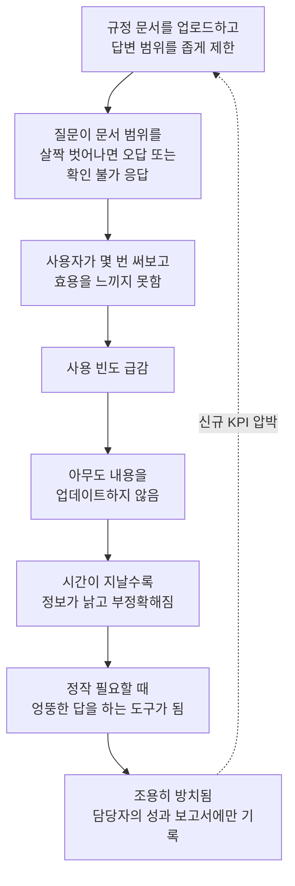

## 이 글이 다루는 원문

```
https://www.threads.com/@orryyyy_pic/post/DbHRFwCkjK9

[모 대기업의 AI 도입기]

회사에 챗봇이 우후죽순 생긴다. 

만들어지는 방식은 비슷하다.
코파일럿에 에이전트 만들기를 누르고 규정 문서를 넣고, 그 안의 내용만 답하도록 설정한다.
빠르고. 안전하고. 깔끔한 방식이다.
문제는 그 대가로 조금만 비틀어 물어도 "해당 내용은 확인되지 않습니다"가 돌아온다.
결국 문서를 찾아보는 것과 크게 다르지 않은데, '자연어' 질의를 하는 "경험"을 해볼수 있다 정도가 차이다.

그 다음은 정해진 수순이다.
쓸모가 좁으니 사람들이 몇 번 써보고 만다.
사용자가 없으니 아무도 내용을 업데이트하지 않고, 업데이트가 멈춘 챗봇은 시간이 지날수록 틀린 답을 하게 된다.

정작 필요할떄는 엉뚱한 답을 하는 구조다.

그렇게 조용히 버려진다.
만든 사람의 성과보고에만 남고, 실제로는 아무도 열지 않는 화면이 하나 더 생기는 것이다.

사실 이건 새로운 실패가 아니다.
챗봇이 유행하던 몇 년 전에도 똑같이 겪었던 일이다.
그때도 잔뜩 만들었고, 그때도 대부분 방치됐다.

달라진 게 있다면, 기술이 좋아져서 이제는 더 빠르고 더 많이 만들 수 있게 되었다는 것뿐이다. 
그때의 실패에서 교훈을 얻은 게 아니라, 
그 실패를 더 효율적으로 반복하는 능력을 얻었다.

그럼에도 불구하고.
회사에서 AI 과제를 채찍질 하니 나도 하나 만들어야겠다...?

```

이 문서는 Threads 사용자 orryyyy_pic가 올린 "모 대기업의 AI 도입기"라는 게시물과, 그 아래 달린 댓글 토론(curisus.cpai, hyeri4295, hellomy1227 등)을 출발점으로 삼는다. 원문의 핵심 주장은 이렇다. 최근 대기업 안에서 사내 챗봇이 우후죽순으로 만들어지고 있는데, 그 방식이 거의 동일하다는 것이다. 마이크로소프트 코파일럿 스튜디오에서 에이전트 만들기를 누르고, 사내 규정 문서를 업로드한 뒤, 그 문서 안의 내용만 답하도록 범위를 좁게 설정한다. 이런 방식은 빠르고 안전하고 깔끔해 보이지만, 질문을 조금만 비틀어도 "해당 내용은 확인되지 않습니다"라는 답이 돌아오는 문제가 있다. 결국 사용자 입장에서는 문서를 직접 찾아보는 것과 크게 다르지 않고, 자연어로 질문해본다는 경험 정도만 남는다는 것이 원문 작성자의 진단이다.

원문은 이어서 이런 챗봇들이 밟는 정해진 수순을 설명한다. 활용 범위가 좁으니 직원들이 몇 번 써보고 흥미를 잃는다. 사용자가 줄어드니 아무도 내용을 업데이트하지 않고, 업데이트가 멈춘 챗봇은 시간이 지날수록 더 부정확한 답을 내놓게 된다. 정작 필요할 때 엉뚱한 답을 하는 구조가 만들어지는 셈이다. 그렇게 조용히 방치되고, 결과적으로 만든 사람의 성과 보고서에만 이름이 남고 실제로는 아무도 열지 않는 화면 하나가 회사 시스템에 추가된다는 것이 이 게시물의 결론이다. 작성자는 이것이 새로운 실패가 아니라 몇 년 전 챗봇이 유행했을 때도 똑같이 겪었던 일이며, 달라진 것은 기술이 좋아져서 더 빠르고 더 많이 만들 수 있게 되었을 뿐, 그때의 실패에서 교훈을 얻은 것이 아니라 그 실패를 더 효율적으로 반복하는 능력을 얻은 것뿐이라고 지적한다.

댓글에서는 이 현상에 대한 원인 진단이 이어진다. 코파일럿이라는 도구 자체의 문제만은 아니지만 성능 저하에 어느 정도 기여하고 있다는 의견, 비용 문제 때문인지 아니면 문제 진단 없이 가볍게 개발해서 그런 것인지를 묻는 질문, 지식베이스가 자동으로 업데이트되는 구조로 만들면 되지 않겠느냐는 제안이 나온다. 이에 대해 원문 작성자는 "그냥 뭐라도 해보라"고 채찍질만 하는 조직 분위기 때문일 가능성이 크다고 답하면서, 문서 따로 연동된 지식베이스 따로 존재하고 체계가 없는 것이 실제 문제라고 지적한다. 또 다른 댓글에서는 보안상 외부 인터넷 접속을 다 막아놓고 코파일럿 하나만 원툴로 제공하는 기업 환경, 그리고 그 대안으로 구글 노트북LM(NotebookLM) 같은 도구를 도입하자는 제안도 등장한다.

이 문서는 이 게시물이 짚은 현상이 실제로 업계 데이터와 얼마나 맞아떨어지는지, 그리고 왜 이런 구조적 문제가 반복되는지를 최신 자료를 바탕으로 정리한다.

---

## 코파일럿 스튜디오 방식이 실제로 어떻게 작동하는가

원문이 묘사하는 "에이전트 만들기 → 문서 업로드 → 범위 제한" 방식은 마이크로소프트 코파일럿 스튜디오(옛 Power Virtual Agents)의 표준적인 사용 패턴과 정확히 일치한다. 사용자가 미리 정의된 주제(topic)에 해당하지 않는 질문을 하면, 코파일럿 스튜디오는 연결된 지식 소스를 검색해 그 안에서 답을 생성하는 구조를 갖고 있다. 이것이 바로 검색 증강 생성, 즉 RAG(Retrieval-Augmented Generation) 방식이며, 별도의 Azure AI Search나 LangChain 같은 구성 없이도 플랫폼 안에서 곧바로 쓸 수 있게 되어 있다. 관리자는 콘텐츠 검열 수준을 상/중/하로 설정하거나, 답변 길이를 제한하거나, 생성형 답변에 반드시 출처를 표시하도록 강제하거나, 생성형 AI가 접근할 수 있는 지식 소스 범위 자체를 특정 주제나 특정 봇으로 제한할 수 있다.

문제는 바로 이 지점에 있다. 문서를 직접 코파일럿 스튜디오에 업로드하거나 내장된 Azure AI Search 커넥터로 연결하면, 문서를 어떻게 조각내어 색인화할지(청킹, chunking)에 대해 제작자가 손댈 수 있는 부분이 거의 없다. 플랫폼은 마이크로소프트 데이터버스(Dataverse)를 통해 문서를 수집하는데, 이때 적용되는 청킹 파라미터는 공개되어 있지 않다. 검색 방식이 키워드 검색인지 벡터 검색인지 하이브리드 검색인지도 선택할 수 없고, 재순위화(reranking)를 켜거나 필터를 추가하는 것도 불가능하다. 제작자가 설정할 수 있는 것은 사실상 지식에 대한 설명 문구와, 그 지식을 어떤 주제에서 호출할 수 있는지 정도뿐이다. 청킹 전략은 RAG 품질을 좌우하는 핵심 요소로 꼽히는데, 이 부분을 세밀하게 조정할 수 없다는 것은 원문 댓글에서 지적된 "RAG 성능이 별로"라는 체감과 기술적으로 맞닿아 있는 대목이다.

여기에 더해 실무 환경에서 보고되는 구체적인 한계도 있다. 예를 들어 셰어포인트 문서 라이브러리에 정책 문서 약 100건을 연결해둔 사내 정책 에이전트의 경우, "연차를 얼마나 쓸 수 있나요" 같은 단일 질문에는 여러 문서를 종합해 잘 답하지만, "모든 문서를 하나씩 검토해서 검토일자를 알려줘"처럼 문서 전체를 순회해야 하는 질문에는 처음 10건 정도만 처리하고 나머지는 별다른 경고 없이 누락시키는 문제가 마이크로소프트 커뮤니티 허브에 보고되어 있다. 응답 속도 면에서도 지식 소스 검색과 생성이 함께 필요한 질의는 5~10초, 파워 오토메이트 흐름까지 연동되면 10~15초까지 걸릴 수 있다는 점, 그리고 언어별 답변 품질 편차가 있어 영어 외 언어는 상대적으로 품질이 떨어질 수 있다는 점도 알려져 있다. 모델 자체를 회사 용어나 업무 맥락에 맞게 파인튜닝하는 것도 지원되지 않는다. 즉 원문이 지적한 "질문을 조금만 비틀어도 확인되지 않는다"는 현상은 특정 회사의 설정 실수라기보다, 노코드 플랫폼이 세부 검색 로직에 대한 통제권을 제작자에게 거의 넘겨주지 않는 구조적 특성에서 비롯되는 경우가 많다.

---

## 방치로 이어지는 순환 구조

원문이 설명하는 흐름을 도식으로 정리하면 다음과 같다.



이 순환에서 특히 눈여겨볼 지점은 D에서 E로 넘어가는 구간이다. 사용자가 줄어들면 피드백이 줄고, 피드백이 줄면 무엇이 잘못되고 있는지 아무도 알기 어려워진다. 결국 "문서 따로, 연동된 지식베이스 따로"라는 댓글의 지적처럼, 원본 규정이 바뀌어도 챗봇에 연결된 지식 소스는 별도로 갱신해줘야 하는 이중 관리 구조가 되기 쉽다. 이 갱신 작업을 자동화하지 않으면(자동 업데이트되는 구조로 만들면 될 텐데, 라는 댓글 속 제안이 정확히 이 지점을 짚고 있다) 챗봇은 태생적으로 시간이 지날수록 신뢰도가 떨어지는 자산이 된다.

---

## 같은 패턴이 데이터로도 확인되는가

원문의 주장이 한 회사만의 특수한 경험담인지, 아니면 업계 전반에서 반복되는 구조적 현상인지를 확인하기 위해 최근 발표된 조사 자료를 살펴볼 필요가 있다.

### MIT의 "GenAI 디바이드" 보고서

MIT 미디어랩 산하 NANDA 이니셔티브가 2025년 8월에 발표한 *The GenAI Divide: State of AI in Business 2025* 보고서는 이 논의에서 가장 자주 인용되는 자료다. 임원 인터뷰와 설문, 그리고 공개된 300건의 기업 AI 도입 사례 분석을 근거로, 기업의 생성형 AI 파일럿 프로젝트 가운데 95%가 손익(P&L)에 측정 가능한 영향을 주지 못했다고 밝혔다. 반대로 말하면 실제로 성과를 낸 파일럿은 약 5%에 그친다는 뜻이다. 보고서는 이 격차를 "GenAI 디바이드"라고 부른다.

이 보고서에서 특히 원문 게시물과 맞닿는 대목은 두 가지다. 첫째, 도구 도입 방식에 따라 성공률이 크게 갈린다는 점이다. 외부 전문 벤더의 도구를 구매하고 파트너십을 맺는 방식은 약 67%의 성공률을 보인 반면, 사내에서 자체적으로 만든 도구는 그 3분의 1 수준의 성공률에 그쳤다. 원문에서 묘사된 "코파일럿 에이전트 만들기 버튼을 눌러 빠르게 자체 제작하는" 방식이 바로 이 취약한 범주에 해당한다. 둘째, 예산 배분과 실제 성과 사이의 불일치다. 생성형 AI 예산의 절반 이상이 영업·마케팅 도구에 쓰이고 있지만, 정작 가장 높은 투자 대비 성과를 낸 영역은 아웃소싱 비용과 외부 대행 비용을 줄여주는 백오피스 자동화였다. 아울러 보고서는 "그림자 AI 경제"라는 현상도 짚었는데, 공식적으로 승인된 사내 파일럿이 실패해도 직원의 90% 이상이 개인적으로 챗GPT 같은 소비자용 AI 도구를 몰래 업무에 쓰고 있다는 것이다. 이는 원문 댓글에 등장한 "외부 접속을 다 막아놓고 코파일럿 하나만 원툴로 제공한다"는 상황과 정확히 대비되는 현실이다. 접속을 막아도 실무자들은 더 쓸모 있는 도구를 어떻게든 찾아 쓰고 있다는 뜻이기 때문이다.

### 가트너의 에이전틱 AI 프로젝트 취소 전망

시장조사기관 가트너는 2025년 6월 25일 발표한 전망에서, 2027년 말까지 에이전틱 AI 프로젝트의 40% 이상이 취소될 것이라고 예측했다. 취소 사유로는 비용 급증, 불분명한 비즈니스 가치, 부실한 리스크 통제 세 가지가 꼽혔는데, 여기서 눈여겨볼 점은 모델 성능 자체는 취소 사유에 들어있지 않다는 것이다. 가트너의 애널리스트 애뉴쉬리 버마는 현재 진행 중인 에이전틱 AI 프로젝트 대부분이 아직 초기 단계의 실험이거나 유행에 이끌려 잘못 적용된 개념증명(PoC)에 불과하다고 지적했다. 이는 조직이 실제 배포 비용과 복잡성을 제대로 가늠하지 못한 채 성과 압박에 떠밀려 프로젝트를 벌이는 상황을 가리키는데, 원문에서 "그냥 뭐라도 해보라고 채찍질만 하는 사람들 때문"이라고 진단한 부분과 사실상 같은 이야기를 하고 있다.

가트너는 또한 수많은 벤더들이 실질적인 에이전틱 기능 없이 기존 챗봇이나 업무자동화(RPA) 제품을 이름만 바꿔 파는 "에이전트 워싱" 현상이 만연해 있으며, 스스로 에이전틱 AI를 표방하는 수천 개 업체 가운데 그 이름에 걸맞은 곳은 약 130곳 정도에 불과하다고 추산했다. 2025년 1월 진행된 3,412명 대상 웨비나 설문에서는 응답 조직의 19%만이 에이전틱 AI에 유의미한 투자를 했다고 답했고, 42%는 보수적인 수준의 투자, 8%는 투자하지 않았다고 답했으며, 나머지 31%는 관망하거나 판단을 유보하고 있었다.

### 두 조사의 공통된 결론

두 조사 모두 실패의 원인을 기술 자체가 아니라 도입 방식과 조직 운영에서 찾고 있다는 공통점이 있다. MIT 보고서는 대부분의 범용 도구가 맥락을 기억하지 못하고 시간이 지나도 적응하지 못하기 때문에 파일럿이 멈춘다고 설명하며, 실제로 한 포춘 500대 보험사의 사례에서는 이사회 시연에서는 매끄러워 보였던 파일럿이 맥락을 유지하지 못해 현장에서는 무너졌다고 전해진다. 가트너 역시 프로젝트가 좌초하는 이유는 더 똑똑한 모델을 쓴다고 해결되는 문제가 아니라, 명확한 목표와 소유권, 거버넌스가 없는 상태에서 프로젝트를 시작했기 때문이라고 짚는다. 원문이 지적한 "문서 따로, 지식베이스 따로, 체계가 없다"는 문제의식과 정확히 같은 방향을 가리키는 셈이다.

---

## 몇 년 전 챗봇 붐과 정말 같은 일이 반복되는가

원문 작성자는 이것이 새로운 실패가 아니라 몇 년 전 챗봇이 유행하던 시기에도 똑같이 겪었던 일이라고 주장한다. 이 대목은 명확한 통계로 검증하기보다는 업계에서 널리 공유되는 경험적 관찰에 가깝다는 점을 분명히 해둘 필요가 있다. 2016년 무렵부터 여러 기업이 규칙 기반 또는 초기 자연어처리 기반 사내·고객용 챗봇을 대거 도입했다가, 활용도가 낮아 방치된 사례가 많았다는 것은 업계에서 자주 회자되는 이야기이지만, 이번 문서에서 그 시기의 정확한 방치율이나 수치화된 근거를 별도로 확인하지는 못했다. 따라서 이 부분은 검증된 통계라기보다 반복되는 산업 현상에 대한 정성적 관찰로 받아들이는 것이 정확하다.

다만 확인 가능한 사실은, 현재의 생성형 AI·에이전틱 AI 도입에서도 과거와 유사한 실패 패턴—빠른 도입, 낮은 활용도, 방치, 그리고 다음 유행 기술이 오면 같은 실수를 반복하는 흐름—이 MIT와 가트너의 최신 조사에서도 그대로 확인된다는 점이다. 원문의 표현을 빌리면, 달라진 것은 기술이 좋아져서 더 빠르고 더 많이 만들 수 있게 되었다는 점뿐이며, 실패에서 교훈을 얻기보다 그 실패를 더 효율적으로 반복할 수 있는 능력을 갖추게 되었다는 진단은, 적어도 2025~2026년 현재의 기업 AI 도입 통계와 견주어 보면 상당히 설득력 있는 관찰이라고 할 수 있다.

---

## 살아남는 5%는 무엇이 다른가

같은 조사들은 실패하지 않는 소수의 사례가 어떤 공통점을 갖는지도 보여준다. 우선 도구를 사내에서 처음부터 직접 만들기보다 특화된 외부 벤더의 도구를 구매하고 파트너십을 맺는 방식이 자체 개발보다 세 배 가까이 높은 성공률을 보였다. 이는 원문 댓글에서 제안된 노트북LM 같은 검증된 외부 도구 도입 아이디어가 완전히 근거 없는 이야기는 아니라는 뜻이기도 하다. 다음으로, 예산이 가장 많이 몰리는 영업·마케팅 영역보다 아웃소싱 비용과 외부 대행 비용을 줄이는 백오피스 자동화 영역에서 오히려 더 뚜렷한 투자 대비 효과가 나타났다. 마지막으로, 성공한 도입 사례들은 피드백을 지속적으로 반영하고 시간이 지나도 맥락에 맞춰 조정되는 구조를 갖추고 있었던 반면, 실패한 사례들은 한 번 만들어진 뒤 그대로 방치되는 정적인 구조였다는 점이 반복적으로 확인된다. 결국 문제의 핵심은 모델의 성능이 아니라, 만든 뒤에도 계속 관리하고 갱신할 수 있는 운영 체계를 처음부터 함께 설계했는지 여부에 있다고 정리할 수 있다.

---

## 정리: 실패하는 사내 챗봇과 살아남는 사내 챗봇

| 구분 | 방치되는 유형 | 살아남는 유형 |
|---|---|---|
| 도입 방식 | 노코드 플랫폼에서 빠르게 자체 제작 | 검증된 외부 도구 구매 또는 파트너십 (성공률 약 67%) |
| 지식 관리 | 문서와 지식베이스가 분리, 수동 갱신 의존 | 자동 갱신 또는 지속적 피드백 반영 구조 |
| 목표 설정 | 조직의 성과 압박에 떠밀려 일단 제작 | 명확한 비즈니스 가치와 소유권을 사전에 정의 |
| 투자 우선순위 | 영업·마케팅 등 가시성이 높은 영역에 집중 | 백오피스 자동화 등 실질적 비용 절감 영역 포함 |
| 결과 | 사용 감소 → 정보 노후화 → 방치 | 지속적 사용과 반복 개선 |

---

## 참고로 짚어둘 점

이 문서에서 다룬 MIT NANDA의 95% 수치와 가트너의 40% 취소 전망은 각각 별개의 조사이며, 조사 방법과 정의(파일럿 vs 에이전틱 AI 프로젝트)가 다르기 때문에 두 수치를 곧바로 더하거나 비교해서는 안 된다. 또한 코파일럿 스튜디오의 청킹·검색 로직에 대한 기술적 한계는 마이크로소프트 공식 문서가 아니라 실무자들이 커뮤니티에 보고한 경험과 서드파티 기술 블로그를 근거로 하고 있어, 플랫폼 업데이트에 따라 달라질 수 있다는 점도 함께 밝혀둔다. 원문 게시물 자체는 특정 회사를 지목하지 않은 익명화된 경험담이므로, 이 문서 역시 그 서술을 하나의 사례로 놓고 공개된 업계 데이터와 비교하는 방식으로 정리했다.

---

작성일자: 2026년 7월 23일
