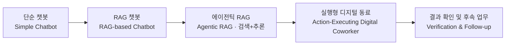
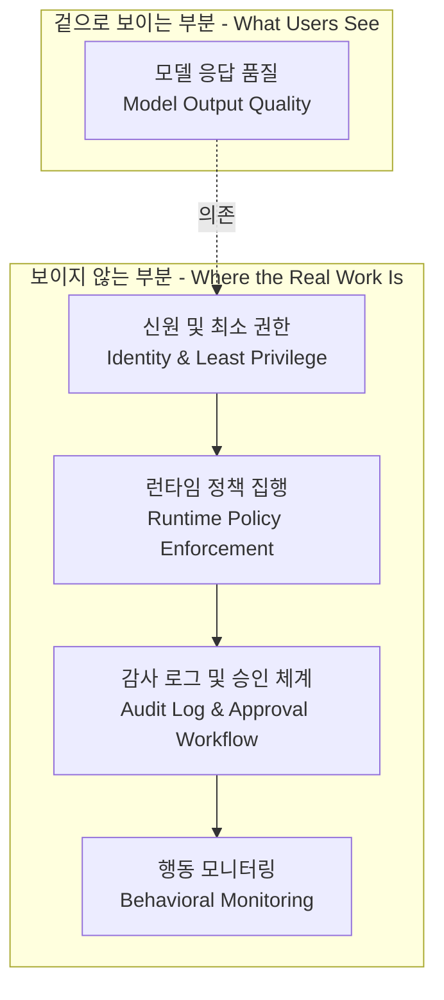
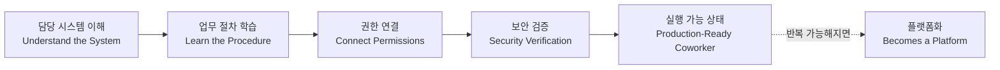

```
단상

디지털 동료는 RAG로 만들어지지 않는다
요즘 디지털 동료를 만든다고 하면 대부분 비슷한 그림을 떠올린다.
LLM을 붙이고, 프롬프트를 다듬고, RAG를 연결한다.
검색 품질을 높이고 답변을 자연스럽게 만든다.
여기까지는 이제 거의 기본기다.
하지만 아무리 잘 만들어도 본질은 크게 달라지지 않는다.
질문하면 답하는 챗봇이다.
⸻
사람이 동료에게 기대하는 것은 답변이 아니다.
“휴가 신청해 줘.”
“이번 달 근태를 정리해서 팀장에게 공유해 줘.”
“구매 요청 올리고 승인 상태까지 알려 줘.”
결국 일이 끝나는 것을 기대한다.
디지털 동료도 마찬가지다.
조회(Query)에서 끝나는 것이 아니라,
실행(Action)하고,
결과를 확인하고,
필요하면 다음 업무까지 이어갈 수 있어야 한다.
그래야 비로소 함께 일하는 동료가 된다.
⸻
문제는 여기서부터 시작된다.
기업의 레거시 시스템은 LLM보다 훨씬 오래되었다.
API가 없는 시스템도 있고,
문서는 있지만 실제와 다른 경우도 많다.
어떤 버튼을 눌러야 하는지,
승인 절차는 어떻게 되는지,
권한은 어디서 확인하는지.
생각보다 아무도 정확히 모른다.
그래서 실제 프로젝트에서는
LLM을 붙이는 시간보다
기존 시스템을 이해하고 연결하는 시간이 훨씬 길어지는 경우가 많다.
때로는 연결 방법을 찾는 것 자체가 프로젝트가 되기도 한다.
⸻
또 하나의 현실은 보안이다.
조회는 비교적 쉽다.
하지만 실행은 다르다.
잘못된 승인 하나,
잘못된 급여 수정 하나,
잘못된 개인정보 조회 하나가 사고가 된다.
그래서 디지털 동료는
“무엇을 할 수 있는가”보다
“무엇을 하면 안 되는가”를 먼저 설계해야 한다.
권한,
감사 로그,
승인 체계,
실행 검증.
이 과정은 사용자에게는 보이지 않지만,
엔터프라이즈 AI의 대부분의 시간이 여기에 쓰인다.
⸻
그래서 나는 디지털 동료의 핵심 경쟁력이
모델 성능이라고 생각하지 않는다.
진짜 경쟁력은
새로운 디지털 동료를 얼마나 빠르고 안전하게 조직에 온보딩할 수 있는가이다.
담당 시스템을 이해하고,
업무 절차를 배우고,
권한을 연결하고,
보안을 검증하고,
실행 가능한 상태까지 만드는 것.
이 과정이 반복 가능해질 때
비로소 디지털 동료는 하나의 플랫폼이 된다.
LLM은 점점 좋아질 것이다.
하지만 기업 업무를 배우는 방법론은 쉽게 복제되지 않는다.
어쩌면 이것이 앞으로 엔터프라이즈 AI의 가장 중요한 핵심 역량일지도 모른다.
⸻
디지털 동료를 만드는 일은 생각보다 훨씬 어렵다.
하지만 그만큼 재미있다.
정답을 잘 말하는 AI를 만드는 것이 아니라,
함께 일을 끝내는 동료를 만드는 과정이기 때문이다.
불러주세요.
오픈 네트워킹은 언제든 환영합니다.

https://www.facebook.com/share/p/1Gv9DoMekc/
```

## 목차

0. 이 문서에 대하여
1. 원문 요약 — 무엇을 말하고 있는가
2. "디지털 동료"라는 개념은 어디서 왔는가
3. 조회에서 실행으로 — RAG의 한계와 에이전틱 전환
4. 첫 번째 벽: 레거시 시스템이라는 현실
5. 두 번째 벽: 보안 — "할 수 있는가"보다 "하면 안 되는가"
6. 그래서 진짜 경쟁력은 무엇인가 — 온보딩 방법론이라는 자산
7. 균형 잡힌 시각 — "동료"라는 은유가 만드는 위험
8. 2026년 7월 현재, 수치로 본 위치
9. 마치며
참고문헌

---

## 0. 이 문서에 대하여

원문은 페이스북에 게시된 짧은 단상으로, 글쓴이는 엔터프라이즈 AI, 그중에서도 "디지털 동료(digital coworker)"를 만드는 실무자의 관점에서 다음과 같은 주장을 펼치고 있습니다.

- LLM을 붙이고 프롬프트를 다듬고 RAG를 연결하는 것은 이제 기본기에 불과하다.
- 진짜 동료라면 질문에 답하는 것을 넘어 업무를 실행하고 끝내야 한다.
- 그런데 실행으로 넘어가는 순간 두 가지 현실의 벽에 부딪힌다. 하나는 레거시 시스템 통합의 어려움이고, 다른 하나는 보안이다.
- 그래서 디지털 동료의 진짜 경쟁력은 모델 성능이 아니라, 새로운 디지털 동료를 조직에 얼마나 빠르고 안전하게 온보딩시킬 수 있는가 하는 "반복 가능한 방법론"에 있다.

참고로 원문이 게시된 페이스북 링크(`https://www.facebook.com/share/p/1Gv9DoMekc/`)는 크롤러 접근이 차단되어 있어 원문 페이지 자체를 직접 조회할 수는 없었습니다. 이 문서는 사용자가 대화 중 직접 붙여넣은 원문 텍스트를 1차 자료로 삼고, 그 주장이 2026년 7월 현재 산업계의 실제 데이터·리포트·사례와 어느 지점에서 맞아떨어지고 어느 지점에서 보완이 필요한지를 검증하여 정리한 해설서입니다. 추측이나 확인되지 않은 내용은 배제하고, 모든 수치와 사례는 검색을 통해 확인된 출처에 기반해 작성했습니다.

---

## 1. 원문 요약 — 무엇을 말하고 있는가

원문의 논리 흐름은 크게 다섯 단계로 이어집니다.

첫째, 요즘 "디지털 동료를 만든다"고 하면 사람들은 LLM에 프롬프트를 얹고 RAG로 검색 품질을 높이는 그림을 떠올리지만, 이것은 이미 업계의 기본값이 되어 있으며 아무리 잘 만들어도 결국 "질문하면 답하는 챗봇" 수준에 머문다는 문제의식에서 출발합니다.

둘째, 사람이 실제 동료에게 기대하는 것은 정답이 아니라 "일이 끝나는 것"이라는 점을 짚습니다. 휴가 신청, 근태 정리, 구매 요청과 승인 확인처럼 실제 업무는 조회(Query)가 아니라 실행(Action)으로 완결됩니다.

셋째, 실행으로 넘어가는 순간 레거시 시스템이라는 벽에 부딪힙니다. API가 없는 시스템, 문서와 실제가 다른 시스템, 승인 절차와 권한 체계를 아무도 정확히 모르는 상황이 흔하다는 것입니다. 그래서 실제 프로젝트에서는 LLM을 붙이는 시간보다 기존 시스템을 이해하고 연결하는 시간이 훨씬 길다고 지적합니다.

넷째, 보안이라는 두 번째 벽이 있습니다. 조회는 비교적 쉽지만 실행은 잘못되면 곧바로 사고로 이어지기 때문에, 디지털 동료는 "무엇을 할 수 있는가"보다 "무엇을 하면 안 되는가"를 먼저 설계해야 한다는 것입니다. 권한, 감사 로그, 승인 체계, 실행 검증이 여기에 해당합니다.

다섯째, 결론적으로 디지털 동료의 핵심 경쟁력은 모델 성능이 아니라 "새로운 디지털 동료를 얼마나 빠르고 안전하게 조직에 온보딩할 수 있는가"라는 반복 가능한 방법론이며, 이것이 갖춰질 때 비로소 디지털 동료는 하나의 플랫폼이 된다고 마무리합니다.

이 다섯 단계 주장은 실제로 2026년 현재 엔터프라이즈 AI 업계에서 벌어지고 있는 논쟁 및 실무 경험과 상당 부분 겹칩니다. 아래 장에서 하나씩 근거를 짚어보겠습니다.

---

## 2. "디지털 동료"라는 개념은 어디서 왔는가

"디지털 동료(Digital Coworker)"라는 표현은 특정 개인의 조어가 아니라, 실제로 시장 조사 기관과 컨설팅 업계에서 통용되는 용어입니다. 시장조사기관 CB인사이츠는 자체 데이터베이스의 스타트업 170여 개를 26개 카테고리로 분류한 'AI 에이전트 시장 지도' 보고서에서, 디지털 동료라는 개념이 이미 산업 전반에 도입된 AI 에이전트를 넘어 자율 에이전트라는 다음 단계로 넘어가면서 개념에서 현실로 옮겨가고 있다고 짚었습니다. 이 보고서는 인간과 AI 에이전트로 구성된 하이브리드 팀 구성부터 일상 업무의 완전 자동화까지 그 영향 범위가 넓어지고 있다고 설명합니다[1].

같은 흐름에서 액센추어(Accenture)는 오픈AI와의 협업을 통해 '에이전틱 엔터프라이즈'라는 개념 아래, 자사 컨설턴트 수만 명에게 ChatGPT Enterprise를 보급하고 금융서비스·헬스케어·공공·유통 등 산업 전반의 레거시 프로세스를 AI 기반 워크플로로 전환하는 것을 목표로 하는 대규모 프로그램을 발표했습니다[2]. 딜로이트 역시 앤트로픽의 Claude를 150개국 47만 명 이상의 직원에게 배포하고, 회계사·컨설턴트·개발자 등 직무별로 맞춤화된 Claude "페르소나"를 도입하는 방향으로 움직이고 있습니다[3]. 이는 범용 어시스턴트에서 직무 특화형 디지털 동료로의 전환이라는 흐름을 보여주는 실제 사례입니다.

여기서 원문이 말하는 "요즘 디지털 동료를 만든다고 하면 떠올리는 그림"이라는 표현은 결코 과장이 아닙니다. 실제로 국내외 트렌드 보고서들은 2026년을 두고 "AI가 '도구'에서 '동료'로, '생성'에서 '행동'으로, '수동'에서 '자율'로 진화하는 전환점"이라고 표현하고 있으며[4], 옴디아(Omdia)는 기업용 AI 에이전트 소프트웨어 시장 규모가 2025년 15억 달러에서 2030년 418억 달러로, 연평균 175%라는 이례적인 속도로 성장할 것으로 전망합니다[4]. 가트너 역시 2026년까지 전체 기업 애플리케이션의 40%가 작업 특화 AI 에이전트를 통합할 것으로 예측했는데, 2025년 기준 이 비율이 5% 미만이었다는 점을 고려하면 매우 가파른 증가입니다[4].

즉, 원문이 문제 삼는 "LLM + 프롬프트 + RAG"라는 접근법은 실제로 업계 대다수가 여전히 취하고 있는 기본 전략이며, 그 위에서 "동료"라는 다음 단계로 넘어가려는 시도가 지금 막 본격화되는 시점이라는 것이 여러 자료를 통해 확인됩니다.

---

## 3. 조회에서 실행으로 — RAG의 한계와 에이전틱 전환

원문의 핵심 문제의식인 "조회(Query)에서 끝나는 것이 아니라 실행(Action)까지 이어져야 한다"는 주장은, RAG 자체의 한계에 대한 업계의 최근 논의와 정확히 맞물립니다.

한 산업 분석에 따르면 기업이 RAG를 도입했을 때 약 87퍼센트가 기대했던 투자 대비 수익을 달성하지 못했다고 하는데, 그 주된 원인으로 다양한 인덱싱 방법, 고정된 검색 경로, 실제 업무 환경을 반영하지 못하는 평가 방식이 꼽힙니다[5]. 국내 AI 전문 매체 AI타임스에 실린 한 기고문은 이 문제를 더 날카롭게 짚습니다. 글린(Glean), 사나(Sana), 구루(Guru) 같은 엔터프라이즈 AI 기업들이 수백 개의 업무 툴을 엮어 '엔터프라이즈 그래프'를 구축하고, 그래프 기반 검색으로 단순 벡터 검색을 넘어서는 성과를 내고 있지만, 이는 어디까지나 검색(Retrieval)의 고도화일 뿐 업무 구조 자체의 혁신은 아니라는 것입니다. 이 기고문은 대다수 기업이 정보의 '연결'을 업무의 '자동화'로 착각하는 것이 치명적인 오판이라고 지적합니다[6]. 이는 원문이 "RAG를 연결하는 것"과 "일을 끝내는 것" 사이에 선을 그은 것과 사실상 같은 취지의 지적입니다.

RAG가 무의미하다는 뜻은 아닙니다. 국내의 한 기술 블로그는 AI 에이전트가 "이 규정과 저 규정을 비교해달라"거나 "이 문서를 기준으로 조건을 판단해달라"는 요청을 처리하려면 문서 구조와 항목 간 관계가 명확해야 하며, 그런 의미에서 RAG는 AI 에이전트로 가기 위한 중간 단계이자 필수 기반이라고 설명합니다[7]. 즉 RAG는 필요조건이지 충분조건은 아니라는 것이며, 이 지점이 정확히 원문이 짚은 "여기까지는 이제 거의 기본기"라는 표현과 일치합니다.

아래 흐름도는 단순 챗봇에서 실행형 디지털 동료로 이어지는 네 단계의 진화를 정리한 것입니다.



여기서 눈여겨볼 대목은, D 단계로 넘어가는 순간부터 원문이 말하는 두 가지 현실의 벽—레거시 시스템과 보안—이 본격적으로 등장한다는 점입니다. C 단계까지는 "정보를 잘 찾아오는 문제"였다면, D 단계부터는 "실제 시스템을 건드리는 문제"로 성격이 완전히 바뀝니다.

---

## 4. 첫 번째 벽: 레거시 시스템이라는 현실

원문은 "기업의 레거시 시스템은 LLM보다 훨씬 오래되었다"고 짚습니다. 이는 단순한 비유가 아니라 실제로 여러 실무 보고서가 공통적으로 지적하는 대목입니다.

한 제조업 AI 플랫폼 기업의 분석에 따르면, 기업 내부에는 1990년대에 도입된 ERP 시스템, 2000년대의 CRM, 2010년대에 쌓인 각종 SaaS 도구, 2020년대의 클라우드 시스템이 뒤섞여 있으며 이들은 데이터 형식도, 접근 방법도, 권한 체계도 저마다 다릅니다. AI 에이전트가 이 모든 시스템에 접근해 데이터를 가져오고 작업을 실행하려면 시스템마다 개별적인 연동 작업이 필요한데, 이것이 생각만큼 쉽지 않다는 것입니다[8]. 실제로 구글이나 리플릿 같은 AI 선도 기업들조차 사내 AI 에이전트 도입 과정에서 이 문제로 어려움을 겪었다고 알려져 있습니다[8].

IT 전문지 CIO에 실린 한 인터뷰에서 EY의 한 수석 컨설턴트는 오늘날 기업이 사용하는 대부분의 기록 시스템이 여전히 레거시 기반이며, 종종 온프레미스 환경에 놓여 있다고 지적했습니다. 그는 이러한 거래 및 운영 시스템, 주문 처리 시스템, ERP, HR 시스템이 비즈니스와 밀접하게 맞물려 있어서, 표준 API 접근을 지원하는 현대적 플랫폼을 갖추는 것은 전투의 절반에 불과하며 궁극적으로는 AI 에이전트가 기존 시스템과 실제로 "대화"할 수 있어야 한다고 강조했습니다[9]. 같은 기사에서 인튜이트(Intuit)의 한 임원은 자사가 지난 4년간 개발 속도를 8배 끌어올릴 수 있었던 것은 생성형 AI 자체보다 그 밑에 구축한 플랫폼 덕분이라고 밝혔는데, 이는 원문이 말하는 "LLM을 붙이는 시간보다 기존 시스템을 이해하고 연결하는 시간이 훨씬 길다"는 주장과 정확히 같은 결을 가진 증언입니다[9].

레거시 시스템 문제는 세밀한 접근 통제의 어려움으로도 이어집니다. 앞서 언급한 EY 컨설턴트는 레거시 시스템에서는 일단 인증이 이루어지면 그 인증이 질문을 처리하는 여러 에이전트의 전체 체인을 통해 그대로 유지되어야 하는 구조적 취약점이 있다고 설명합니다[9]. 이는 다음 장에서 다룰 보안 문제와도 직결됩니다.

한편 이런 통합의 어려움을 표준화하려는 시도로 등장한 것이 모델 컨텍스트 프로토콜(MCP)입니다. MCP는 앤트로픽이 2024년 11월 공개한 개방형 표준으로, AI 애플리케이션이 데이터베이스나 로컬 파일, 원격 API 같은 외부 시스템과 연동할 때마다 매번 새로운 연결 방식을 만들어야 했던 문제를 해결하기 위해 고안되었습니다[10]. 호스트, 클라이언트, 서버라는 세 가지 역할로 구성되며, 도구(실행 가능한 함수), 리소스(문서나 데이터베이스 레코드 같은 맥락 정보), 프롬프트(재사용 가능한 템플릿)라는 세 가지 요소를 표준화된 방식으로 노출합니다[11]. 오픈AI를 포함한 여러 AI 기업이 이를 채택하면서 사실상의 업계 표준으로 자리잡아가고 있습니다[12]. 다만 MCP는 "연결 방식을 표준화하는 프로토콜"일 뿐, 그 자체가 레거시 시스템의 업무 절차나 승인 체계를 대신 파악해주지는 않습니다. 즉 MCP가 있다고 해서 원문이 말한 "연결 방법을 찾는 것 자체가 프로젝트가 되는" 현실이 사라지는 것은 아니며, 표준화된 배관을 깔아주는 도구에 가깝습니다.

이러한 통합 난이도는 실제 도입 후 운영 단계에서도 반복적으로 확인됩니다. 국내의 한 컨설팅 블로그는 AI 에이전트를 도입한 지 6개월 된 기업들이 공통으로 겪는 문제로 낮은 사용률, 기대와 실제의 불일치, 데이터 품질 저하, 현업의 저항, 확장 정체, ROI 가시성 부족 등을 꼽으면서, 도입 전에는 "잘 작동할까"를 걱정하다가 6개월쯤 지나면 "잘 만들었는데 왜 안 쓰일까"로 고민이 바뀐다고 설명합니다[13]. 이는 원문이 말한 "연결 방법을 찾는 것 자체가 프로젝트가 된다"는 문장이 과장이 아니라 실제 현장에서 반복되는 패턴임을 뒷받침합니다.

---

## 5. 두 번째 벽: 보안 — "할 수 있는가"보다 "하면 안 되는가"

원문은 "잘못된 승인 하나, 잘못된 급여 수정 하나, 잘못된 개인정보 조회 하나가 사고가 된다"고 경고합니다. 이는 결코 과장된 표현이 아니라, 2026년 들어 실제로 발생한 사고와 그에 대응하는 업계의 움직임을 통해 뒷받침됩니다.

보안 전문 매체 뉴럴트러스트(NeuralTrust)의 2026년 가이드에 따르면, 지난 1월 스텝 파이낸스(Step Finance)의 AI 트레이딩 에이전트가 공격자에 의해 임원 기기가 탈취당한 이후 2700만~3000만 달러 규모의 무단 자금 이체를 실행한 사건이 있었습니다. 이 보고서는 해당 에이전트가 "설계된 대로 정확히 작동했을 뿐"이며 아무도 멈추라고 말하지 않았을 뿐이라고 지적합니다. AI 에이전트는 챗봇이 아니라 실제로 API를 호출하고 데이터베이스에 기록하고 워크플로를 실행하는 존재이기 때문에, 이를 보안 관점에서 다루는 것은 전통적인 소프트웨어 보안과는 완전히 다른 문제라는 것입니다[14]. 이 보고서는 완전한 에이전트 보안을 위해 신원 관리, 최소 권한 접근, 런타임 정책 집행, 행동 모니터링, 감사 로그, 공급망 보안이라는 여섯 가지 통제 계층이 필요하다고 제시하며, 많은 보안팀이 여전히 모델 자체만 검사할 뿐 실제 공격이 벌어지는 지점인 "도구 호출(tool call)" 단계는 놓치고 있다고 지적합니다[14].

신원 관리 문제는 특히 심각합니다. 아이덴티티 관리 기업 옥타(Okta)가 2022년 6월부터 2026년 6월까지 2만여 개 조직의 로그인 데이터를 분석한 리포트에 따르면, 많은 조직이 AI 에이전트의 작업 권한을 서비스 계정, 정적 API 키, 심지어 사람 계정 공유라는 세 가지 방식에 의존해 부여하고 있으며, 이는 단기적인 통합 문제는 해결하지만 각 에이전트에게 고유하게 관리되는 신원과 권한, 감사 기록을 부여하는 것과 사람의 세션을 통해 우회적으로 권한을 흘려보내는 것 사이에는 거버넌스 가능 여부를 가르는 결정적 차이가 있다고 지적합니다[15]. 이는 원문이 언급한 "권한이 어디서 확인되는지 아무도 정확히 모른다"는 상황과 정확히 겹치는 지적입니다.

미국 사이버보안 당국의 대응도 구체화되고 있습니다. 한 보안 전문 매체에 따르면 미국 CISA와 NSA는 2026년 4월 공동 권고를 통해, 사고 발생 시 에이전트의 행동을 포렌식 수준으로 재구성할 수 있도록 프롬프트와 응답 수준이 아니라 도구 호출 수준에서 모든 에이전트 행동을 의무적으로 로깅할 것을 권고했습니다[16]. 이 보고서는 최소 권한 접근, 행동 모니터링, 감사 로깅, 사고 대응 계획이라는 기본 원칙 자체는 기존의 건전한 보안 공학과 다르지 않지만, 이를 기계 속도로 작동하고 폭넓은 자격 증명을 보유하며 여러 단계를 연쇄적으로 자율 판단하는 "AI 에이전트"라는 새로운 유형의 신원에 적용해야 한다는 점이 다르다고 설명합니다[16].

금융 규제 측면에서도 구체적인 움직임이 있습니다. 한 데이터 거버넌스 전문 매체는 미국 재무부가 2026년 2월 발표한 금융서비스 AI 위험관리 프레임워크를 소개하면서, 이 프레임워크가 은행권 AI 에이전트를 위한 성숙도 평가와 위험-통제 매트릭스를 구조적으로 제시하고 있으며, 금융기관은 에이전트가 지정된 목적에 필요한 데이터에만 접근한다는 것을 지속적인 모니터링 증거로 입증해야 한다고 요구한다고 전합니다. 이 매체는 조사 대상 조직 중 전략·거버넌스·에이전트 AI 통제에서 성숙도 3단계 이상에 도달한 곳은 30퍼센트에 불과하며, 나머지 70퍼센트는 다른 시대에 설계된 거버넌스 기반 위에서 에이전트를 확장하고 있다고 지적합니다[17].

이러한 보안·거버넌스 지형을 종합하면, 원문이 말한 "무엇을 할 수 있는가보다 무엇을 하면 안 되는가를 먼저 설계해야 한다"는 원칙은 이제 업계의 공통 언어가 되어 가고 있다고 볼 수 있습니다. 다음 흐름도는 이러한 보안 설계가 실제로 어떤 계층으로 이루어지는지를 정리한 것입니다.



---

## 6. 그래서 진짜 경쟁력은 무엇인가 — 온보딩 방법론이라는 자산

원문의 결론, 즉 "핵심 경쟁력은 모델 성능이 아니라 새로운 디지털 동료를 조직에 얼마나 빠르고 안전하게 온보딩할 수 있는가"라는 주장은 놀랍게도 글로벌 컨설팅사의 실증 연구와도 거의 그대로 일치합니다.

맥킨지가 에이전틱 AI를 실제로 운영해 온 기업들을 인터뷰해 정리한 보고서는 이렇게 표현합니다. 한 비즈니스 리더는 "에이전트를 온보딩하는 것은 소프트웨어를 배포하는 것보다 새 직원을 채용하는 것에 더 가깝다"고 말했습니다. 이 보고서는 에이전트에게도 명확한 직무 기술서를 부여하고, 온보딩 과정을 거치게 하고, 지속적인 피드백을 주어 정기적으로 개선되도록 해야 한다고 조언합니다. 효과적인 에이전트를 개발하는 일은 개인의 전문성을 평가 기준으로 만들고, 업무 표준을 세밀하게 코드화하는 작업을 요구하는데, 이 코드화 과정 자체가 에이전트의 훈련 매뉴얼이자 성능 테스트 역할을 겸한다는 것입니다. 이러한 업무 표준은 표준운영절차(SOP)로 문서화되어 있기도 하지만, 많은 경우 사람들의 머릿속에만 존재하는 암묵지 형태로 남아 있어서, 코드화할 때는 상위 성과자와 나머지를 가르는 지점이 무엇인지에 집중하는 것이 중요하다고 강조합니다[18].

이 통찰은 원문의 논리와 정확히 같은 지점을 가리킵니다. 즉, "온보딩"이라는 단어 자체가 이제 은유가 아니라 실무 용어로 자리잡고 있으며, 그 온보딩의 실체는 담당 시스템 이해, 업무 절차 학습, 권한 연결, 보안 검증, 실행 가능한 상태로의 전환이라는 일련의 반복 가능한 절차입니다. 이 절차를 표준화하고 반복 가능하게 만드는 조직이야말로, 원문의 표현대로 "디지털 동료를 하나의 플랫폼으로" 만들 수 있습니다.

액센추어의 AI Refinery, 라이저(Lyzr)와의 협업을 통한 금융·보험 산업용 에이전트 인프라, 오픈AI의 AgentKit을 활용한 산업별 에이전트 구축 등은 모두 이러한 "온보딩의 표준화·플랫폼화"를 상업적으로 구현하려는 시도로 볼 수 있습니다. 액센추어는 산업별 에이전트 솔루션 12종을 담은 AI Refinery for Industry를 통해 에이전트 구축과 가치 실현에 걸리는 시간을 수개월에서 수일 단위로 단축하는 것을 목표로 내걸고 있습니다[19]. 이는 원문이 말한 "반복 가능해질 때 비로소 플랫폼이 된다"는 주장이 이미 여러 대형 컨설팅사와 벤더들의 사업 전략 그 자체가 되어 있음을 보여줍니다.

아래 흐름도는 원문이 언급한 온보딩의 다섯 단계를 정리한 것입니다.



여기서 중요한 것은, 이 다섯 단계가 사용자에게는 거의 보이지 않는다는 점입니다. 원문이 말한 것처럼 "이 과정은 사용자에게는 보이지 않지만 엔터프라이즈 AI의 대부분의 시간이 여기에 쓰인다"는 문장은, 위에서 살펴본 레거시 시스템 통합의 어려움과 여섯 계층에 걸친 보안 통제의 복잡성을 생각하면 결코 과장이 아닙니다.

---

## 7. 균형 잡힌 시각 — "동료"라는 은유가 만드는 위험

다만 원문의 주장을 그대로 받아들이기 전에, "디지털 동료"라는 은유 자체에 대한 비판적 시각도 함께 살펴볼 필요가 있습니다.

MIT 테크놀로지 리뷰 코리아에 소개된 한 연구는, AI 에이전트를 단순한 프로그램이 아니라 이름과 직함을 가진 "직원"처럼 대우할 때 오히려 사람들이 AI의 실수를 더 잘 찾아내지 못하고 업무 성과가 떨어진다는 결과를 보였습니다. AI를 동료 직원으로 인식한 사람들은 결과물에 대한 책임감도 덜 느꼈으며, 문제가 생겼을 때 직접 고치기보다 윗사람에게 넘기는 경향이 44퍼센트나 더 높았다고 합니다. 이 연구는 마이크로소프트, 구글, 오픈AI 같은 대형 기술 기업들이 AI를 사람처럼 유연하게 일하는 "디지털 동료"로 만들려 하지만, 전문가들은 이런 접근이 오히려 위험할 수 있다고 경고한다고 전합니다[20].

이는 원문이 강조하는 "함께 일을 끝내는 동료"라는 지향점과 정면으로 배치되는 것은 아니지만, 중요한 보완점을 제공합니다. 즉 디지털 동료를 잘 만드는 것과, 그것을 "동료"라고 부르며 사람처럼 대하는 것은 별개의 문제라는 것입니다. 전자는 실행 능력과 온보딩 방법론의 문제이고, 후자는 조직 내 책임 소재와 심리적 태도의 문제입니다. 원문이 강조하는 권한·감사 로그·승인 체계 같은 거버넌스 장치들은, 바로 이 "동료라는 착시가 책임 소재를 흐리는 위험"을 제도적으로 막기 위한 장치라고 이해할 수 있습니다. 다시 말해 원문의 결론부에서 강조된 보안·감사 설계는 단순히 사고를 막기 위한 것만이 아니라, MIT 테크놀로지 리뷰가 지적한 "책임 회피 심리"를 막는 역할도 함께 수행하는 셈입니다.

또한 가트너는 2027년 말까지 에이전틱 AI 프로젝트의 40퍼센트 이상이 취소될 것이라고 예측하면서, 그 원인이 모델 성능 부족이 아니라 비용 급증, 불분명한 사업적 가치, 미흡한 리스크 통제에 있다고 밝혔습니다. 가트너의 한 수석 애널리스트는 현재 대부분의 에이전틱 AI 프로젝트가 여전히 초기 실험이나 개념 검증 단계에 머물러 있으며 과대광고에 의해 추진되는 경우가 많다고 지적했습니다[21]. 이는 원문이 낙관적으로 그리는 "온보딩 방법론이 플랫폼이 되는" 미래가 저절로 오는 것이 아니라, 상당수 조직이 그 문턱을 넘지 못하고 있는 현실과 병존한다는 점을 보여줍니다. 실제로 MIT의 한 조사는 기업 AI 파일럿의 95퍼센트가 기대했던 수익을 내지 못하고 있다고 밝힌 바 있습니다[22].

이러한 실패의 상당수는 모델의 한계가 아니라 정확히 원문이 지적한 두 가지 벽, 즉 레거시 시스템 통합과 거버넌스 미비에서 비롯됩니다. 다시 말해 비판적 시각들조차 원문의 핵심 진단—"진짜 어려움은 LLM이 아니라 그 이후에 있다"—을 반박하기보다는 오히려 뒷받침하고 있는 셈입니다.

---

## 8. 2026년 7월 현재, 수치로 본 위치

지금까지 살펴본 근거들을 종합하면, 2026년 7월 현재 시점에서 원문의 주장은 다음과 같은 좌표 위에 놓여 있다고 정리할 수 있습니다.

시장의 성장 속도는 매우 빠릅니다. 옴디아는 기업용 AI 에이전트 소프트웨어 시장이 2025년 15억 달러에서 2030년 418억 달러로 성장할 것으로 전망하며, 이는 연평균 175퍼센트에 해당합니다[4]. 맥킨지 조사에 따르면 2024년 기준 기업의 65퍼센트가 이미 AI를 일상 업무에 활용하고 있으며, 이는 2023년의 33퍼센트에서 두 배 가까이 늘어난 수치입니다[23].

그러나 동시에 실행 단계에서의 좌절도 뚜렷합니다. 가트너는 2027년 말까지 에이전틱 AI 프로젝트의 40퍼센트 이상이 취소될 것으로 예측했고[21], MIT 조사는 기업 AI 파일럿의 95퍼센트가 기대 수익을 내지 못한다고 밝혔습니다[22]. IT 전문지 CIO는 다중 에이전트 시스템의 확산이 상대적으로 더딘 이유로, 에이전트 중심 운영을 시도했다가 실패한 사례와 치명적인 기술적 오류를 일으킨 사례가 이어지면서 부정적 영향을 미쳤기 때문이라고 분석합니다[24].

그리고 거버넌스 측면에서도 격차가 뚜렷합니다. 앞서 언급했듯 조사 대상 조직의 70퍼센트가 여전히 사람 중심으로 설계된 거버넌스 기반 위에서 AI 에이전트를 확장하고 있으며[17], 실제로 스텝 파이낸스의 수천만 달러 규모 무단 이체 사고처럼 실행형 AI가 만드는 새로운 위험이 이미 현실화되었습니다[14].

이 세 가지—빠른 성장, 잦은 실행 실패, 거버넌스 격차—를 함께 놓고 보면, 원문의 결론이 왜 설득력을 갖는지가 분명해집니다. 시장은 빠르게 커지고 있지만, 정작 그 성패를 가르는 것은 더 좋은 모델이 아니라 레거시 시스템을 이해하고 안전하게 연결하는 반복 가능한 방법론이라는 것입니다. 이는 원문이 스스로의 경험에서 도출한 통찰이 현재 산업 전반의 통계와 사례로도 뒷받침되는 드문 경우라고 할 수 있습니다.

---

## 9. 마치며

원문은 짧은 단상이지만, 그 안에 담긴 논리는 2026년 현재 엔터프라이즈 AI 업계가 실제로 부딪히고 있는 핵심 쟁점을 정확히 짚고 있습니다. RAG와 챗봇 수준의 접근은 이제 기본기가 되었고, 진짜 승부처는 그다음, 즉 실행(Action)의 영역으로 넘어가고 있습니다. 그리고 그 실행의 영역은 레거시 시스템이라는 오래된 현실과 보안이라는 엄중한 제약 위에 서 있습니다.

여기서 얻을 수 있는 실무적 시사점은 다음과 같이 정리할 수 있습니다. 디지털 동료를 만드는 프로젝트를 기획할 때는 모델 선택이나 프롬프트 설계에 앞서, 연결해야 할 레거시 시스템의 실제 상태(문서와 현실의 괴리, API 유무, 권한 체계)를 먼저 조사하는 데 충분한 시간을 배정해야 합니다. 또한 "무엇을 할 수 있는가"를 설계하기 전에 "무엇을 하면 안 되는가"— 즉 권한 경계, 감사 로그, 승인 체계, 롤백 가능성—를 먼저 설계해야 하며, 이는 사고 예방뿐 아니라 조직 내 책임 소재를 명확히 하는 역할도 합니다. 마지막으로, 하나의 디지털 동료를 만드는 데 그치지 않고 그 온보딩 과정 자체를 문서화하고 반복 가능하게 만드는 것이야말로 장기적인 경쟁력이 된다는 점을 기억할 필요가 있습니다.

결국 원문이 마지막에 남긴 말—"정답을 잘 말하는 AI를 만드는 것이 아니라, 함께 일을 끝내는 동료를 만드는 과정"—은 수사적 표현이 아니라, 2026년 현재 산업 데이터가 뒷받침하는 실질적인 방향性을 담고 있다고 볼 수 있습니다.

---

## 참고문헌

[1] CIO, "'디지털 동료 개념, 현실화 중'··· CB인사이츠, AI 에이전트 시장 지도 제시", 2025. https://www.cio.com/article/3849819/

[2] MarketScreener, "OpenAI and Accenture accelerate enterprise reinvention with advanced AI", 2026.

[3] eMarketer, "Accenture, Deloitte push agentic AI into enterprise territory—and brands will feel the shift", 2026. https://www.emarketer.com/content/accenture--deloitte-push-agentic-ai-enterprise-territory-shift

[4] SK AX, "2026 에이전트 AI 트렌드: 생성형 AI 이후, 에이전틱 AI가 기업 업무를 바꾸는 방식", 2026. https://www.skax.co.kr/insight/trend/3624

[5] SLEXN, "Agentic RAG: 더 똑똑해진 문맥 중심 AI 시스템", 2025. https://www.slexn.com/agentic-rag-contextual-ai/

[6] AI타임스, "[기고] 그래프 RAG 열풍, 기업 AI 대부분은 아직 자동화에 실패하고 있다", 2026. https://www.aitimes.com/news/articleView.html?idxno=207411

[7] 한국딥러닝 블로그, "RAG란? 왜 기업에서는 기대만큼 효과가 나지 않는가", 2026. https://www.koreadeep.com/blog/rag-ai

[8] DARVIS 블로그, "'2025년은 AI 에이전트의 해', 과연 실제로는 어땠을까요?", 2025. https://blog.dfinite.ai/ai-agent-implementation-challenges

[9] CIO, "'AI 에이전트 탐나지만…' IT 리더를 주저하게 하는 '몇몇' 이유", 2025. https://www.cio.com/article/3834486/

[10] Mimul Tech Blog, "MCP(Model Context Protocol) 개요, 아키텍처, 동작 원리 가이드", 2026. https://www.mimul.com/blog/mcp/

[11] arXiv, "Multi-Agent Collaboration for Automated Design Exploration on High Performance Computing Systems" (MCP 아키텍처 설명 부분). https://arxiv.org/pdf/2603.11515

[12] 나무위키, "Model Context Protocol" 항목, 2026. https://namu.wiki/w/Model%20Context%20Protocol

[13] windyflo 블로그, "AI 에이전트 도입 6개월 기업이 공통으로 겪는 문제 10가지", 2026. https://blog.windyflo.com/blog/ai-agent-6month-common-problems/

[14] NeuralTrust, "The Complete Guide to AI Agent Security for Enterprises (2026)". https://neuraltrust.ai/blog/ai-agent-security-enterprises-complete-guide

[15] Kiteworks, "AI Agents Are Still Logging In as Humans – and Your Audit Trail Is Paying for It" (Okta Enterprise AI Index 인용), 2026. https://www.kiteworks.com/cybersecurity-risk-management/ai-agents-identity-audit-trail/

[16] Decryption Digest, "Securing Agentic AI in the Enterprise: A 2026 Practitioner Guide". https://www.decryptiondigest.com/blog/securing-agentic-ai-enterprise

[17] Promethium, "AI Agent Data Governance: The Enterprise Playbook for 2026". https://promethium.ai/guides/ai-agent-data-governance-enterprise-playbook-2026/

[18] McKinsey & Company, "One year of agentic AI: Six lessons from the people doing the work", 2025. https://www.mckinsey.com/capabilities/quantumblack/our-insights/one-year-of-agentic-ai-six-lessons-from-the-people-doing-the-work

[19] MarketScreener/BusinessWire, "Accenture Launches AI Refinery for Industry to Reinvent Processes and Accelerate Agentic AI Journeys". https://www.marketscreener.com/quote/stock/ACCENTURE-PLC-11521/news/

[20] MIT Technology Review Korea, "내겐 너무 위험한 직장 동료 'AI 에이전트'", 2026. https://www.technologyreview.kr/ai가-직장-동료-업무를-망치는-위험한-착각/

[21] Gartner, "Gartner Predicts Over 40% of Agentic AI Projects Will Be Canceled by End of 2027", 2025. https://www.gartner.com/en/newsroom/press-releases/2025-06-25-gartner-predicts-over-40-percent-of-agentic-ai-projects-will-be-canceled-by-end-of-2027

[22] AgentMarketCap, "Gartner Says 40% of Agentic AI Projects Will Be Canceled by 2027 — Here's Why and How to Beat the Odds" (MIT 95% 파일럿 실패 통계 인용), 2026. https://agentmarketcap.ai/blog/2026/04/12/gartner-40-percent-agentic-ai-project-cancellation-2027

[23] windyflo 블로그, "2026년 중소기업 AI 에이전트 트렌드 가이드" (McKinsey 2024 인용), 2026. https://blog.windyflo.com/blog/sme-ai-agent-trend-2026/

[24] CIO, "기대와 현실 사이, 2026년 에이전틱 AI는 어디까지 왔나", 2025. https://www.cio.com/article/4109311/

---

*이 문서는 2026년 7월 23일 기준으로 검색을 통해 확인 가능한 정보를 바탕으로 작성되었습니다. 에이전틱 AI 및 엔터프라이즈 거버넌스 분야는 변화 속도가 빠르므로, 최신 수치는 원문 출처를 통해 재확인하는 것을 권장합니다.*
