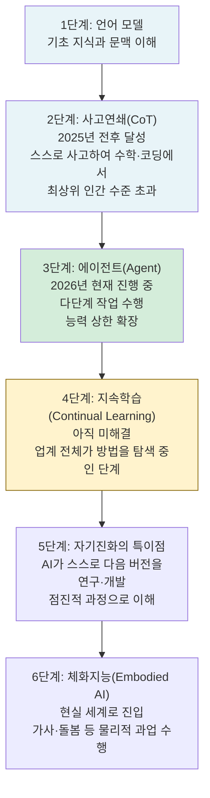
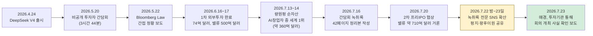

> 
> https://www.threads.com/@choi.openai/post/DbH-SLkj029 
> 
> 중국에서 가장 비싼 AI 회사의 주인이 된 날, 그 남자는 투자자들 앞에서 네 시간 내내 "안 합니다"만 반복했습니다.
> 
> 슈퍼앱도 안 만들고, 최강 모델도 안 숨기고, 돈도 최대로는 안 벌겠다고 말합니다.
> 
> 500억 달러를 받은 딥시크 창업자 량원펑, 그 회의록이 이번 주 통째로 유출되었습니다. 🧵
> 
> 
> **1/ 딥시크가 지난달 첫 외부 투자로 500억 위안, 약 74억 달러를 받았습니다.**
> 
> 기업가치는 500억 달러 안팎으로 평가받아 중국에서 가장 비싼 AI 스타트업이 됐는데요. 그 직전인 5월 20일, 량원펑이 투자자들과 네 시간 가까이 화상으로 나눈 회의 녹취록이 지금 업계에 돌고 있습니다.
관통하는 한 단어는 절제입니다. 천재가 아니다, 불합리한 이윤은 안 챙긴다, 폐쇄하지 않는다, 슈퍼앱은 안 만든다, 자체 칩도 안 만든다. 이렇게 "안 한다"를 반복했습니다.
이 모든 "안 한다"를 하나로 묶는 게 절제인데, 덜 가질수록 AGI를 만들 확률이 올라가고 끝까지 살아남는다는 겁니다.
> 
> **2/ 량원펑은 지금 제품으로 수익을 극대화할 때가 아니라고 했습니다.**
> 
> AGI로 가는 길에 제품 단계를 지나가긴 하지만, 소비자용이든 기업용이든 거기에 많은 에너지를 쓰지 않는다는 겁니다.
높은 기술 위치에서 한 단계 아래 기술을 하면 위에서 찍어 누르는 셈이고, 제품은 그 길에서 저절로 떨어지는 부산물이라고 했습니다.
API 사업조차 매력적으로 보지 않는다고 했는데요. 몇 사람만 두면 되고 영업도 고객지원도 없이 사용자가 알아서 온다는 겁니다.
같은 시기 오픈AI는 코덱스와 슈퍼앱, IPO까지 밀고 있습니다. 두 회사가 정확히 반대쪽을 봅니다.
> 
> **3/ 량원펑은 AGI로 가는 길을 계단 오르기에 비유했습니다.**
> 
> 작년 계단은 답을 단계별로 풀어 쓰는 사고사슬이었고, 올해 계단은 스스로 도구를 쓰며 여러 단계를 실행하는 에이전트이며, 그다음이 한 번 익힌 걸 계속 쌓는 지속학습이라는 겁니다.
지속학습이 되면 모델이 스스로 더 앞선 모델을 개발하는 점진적 특이점에 닿고, 그 뒤에야 몸을 가진 지능, 로봇에 도착한다고 봤습니다.
그래서 무엇을 곁가지로 두는지도 분명했습니다. 3D와 영상 생성, 그리고 눈앞 장면의 다음을 예측하는 세계 모델은 지능의 상한과 관계가 적고, 지어낸 거짓인 환각은 후처리 학습으로 개선할 제품 문제로 분류한다는 겁니다.
> 
> **4/ 량원펑은 지금 AI에 부족한 게 품위나 직관이 아니라 지속적으로 학습하는 능력이라고 했습니다.**
> 
> 사람은 두 달이면 회사에 적응하지만, AI에 같은 일을 시키려면 맥락을 전부 떠먹여야 하고 그건 거의 불가능합니다.
그래서 아직 직원을 대체하지 못하고, 전 세계 누구도 그 방법을 못 찾았다고 했습니다. 지속학습은 한 가지 기술이 아니라 여러 요소가 얽힌 문제라, 지금은 다들 방법을 더듬는 단계라는 겁니다.
딥시크가 모델을 만드는 첫 목표가 여기서 갈립니다. 남들이 잘 쓰는 모델이 아니라 자기들이 잘 쓰는 모델을 먼저 만든다는 겁니다. 그렇게 자기 손에 맞는 모델을 먼저 쥐는 게 AGI로 가는 가장 빠른 길이라고 봤습니다.
> 
> **5/ 량원펑은 현 단계에서 AI를 푸는 건 결국 데이터 라벨링이라고 했습니다.**
> 
> 로드맵은 거창해도 지금 딥시크가 매달리는 건 데이터라는 겁니다. 놀라운 건 규모인데요. 회사 인력의 절반, 그것도 가장 중요한 연구 인력의 절반이 지금 데이터에 붙어 있다고 했습니다.
고품질 데이터 라벨링은 중국이라고 싸지 않아서 미국과 원가 차이가 거의 없고, 그래서 값싼 데이터부터 붙고 비싼 고품질 데이터는 시간을 두고 쌓는 두 갈래로 간다는 겁니다.
결국 지금의 지능은 알고리즘보다 데이터를 어떻게 먹이느냐에 더 걸려 있고, 그 로드맵 밑에서 사람이 데이터를 일일이 손으로 붙이고 있습니다.
> 
> **6/ 현 단계에서 가장 중요한 건 여전히 코딩 에이전트라고 못박았습니다.**
> 
> 중국 상황에선 범용 에이전트에 전력을 쏟는 게 가장 합리적이고, 금융이나 의료 같은 특화 에이전트는 우선순위가 낮다는 겁니다.
좁은 영역을 여러 개 파느니 범용 하나를 끝까지 밀겠다는 선택이죠. 다른 회사가 범용에서 밀리면 특화 영역도 결국 범용에 흡수된다고 봤습니다.
지금 프런티어 랩이 전부 코딩 에이전트로 몰리는 이유와 같습니다. 코드는 정답과 실행 결과가 바로 나와서, 모델이 스스로 개선되는 고리를 만들기 가장 쉽습니다.
앤트로픽이 모델이 똑똑해지자 클로드 코드 지시문을 80%나 줄인 것도 같은 흐름입니다.
> 
> **7/ 량원펑이 말하는 합리적 이윤에는 구체적인 숫자가 있습니다.**
> 
> 장비를 사서 열 달이면 원가를 회수하는 가격, 대략 6배 이윤이 그 기준입니다.
이윤 극대화라면 값을 더 올리겠지만, 이 구간은 값을 올려도 토큰 소비가 별로 안 줄 만큼 수요가 비탄력적이라고 했습니다.
한 모델은 처음 비싸게 냈다가 4분의 1로 내렸더니 사내 채팅방이 환호했다는 일화도 꺼냈고요. 알리바바나 텐센트는 같은 서비스를 원가 몇 배로 낸다고 봤습니다. 그는 이 6배 이윤도 앞으로 4배, 3배까지 내려갈 거라고 했고요.
실제로 딥시크는 이번 달 V4를 공개하며 업무시간엔 요금을 2배로 받는 피크 요금제를 도입했습니다.
> 
> **8/ 량원펑은 저비용을 목표가 아니라 결과라고 했습니다.**
> 
> 원가가 낮을수록 더 큰 모델을 감당할 수 있고, 컴퓨트가 부족할 때는 계산 효율이 높아야 더 큰 모델을 훈련할 수 있다는 겁니다.
그는 스케일을 믿는다고 했습니다. 이만큼 큰 모델을 훈련하는 건 이 정도면 충분해서가 아니라 가진 자원이 그것뿐이기 때문이고, 아직 스케일의 벽은 만나지도 못했다는 겁니다.
딥시크 V3가 엔비디아 H800 2,048장으로, 단 557만 달러에 학습됐다고 공개돼 업계가 충격받았습니다. 이게 그 효율의 실물이었죠. 대기업은 자원을 더 부어 풀지만, 딥시크는 효율을 먼저 둡니다.
> 
> **9/ 인프라로 내려가면 량원펑의 계산이 가장 구체적입니다.**
> 
> 딥시크는 지금 약 2만 장의 H급 연산량을 쓴다고 했는데요. 화웨이가 준 950칩은 1만 6천 장인데, 엔비디아 B계열로 치면 4천 장 정도라는데요.
화웨이 칩 넉 장이 엔비디아 한 장, 그리고 2년 뒤처짐이 지금의 격차입니다. 그런데도 그는 엔비디아가 자기 무덤을 판다고 봤습니다.
엔비디아에 개발자를 묶어 두는 소프트웨어 생태계인 CUDA도, 이제 AI로 다시 짜고 자체 고급언어 TileLang으로 대체할 수 있다는 겁니다.
실제로 V3는 엔비디아 칩을 쓰되 그 생태계는 안 썼습니다. 칩을 직접 만들 생각도 없습니다. 발전소를 돌리는 사람이 발전기까지 만들 필요는 없다는 논리입니다.
> 
> **10/ 량원펑은 중국과 미국의 격차가 인재가 아니라 자원이라고 잘라 말했습니다.**
> 
> 인재는 거의 같은 사람들이고, 인재난은 늘 일시적이라는 겁니다. 숫자로는 이렇습니다. 미국의 20분의 1 컴퓨트로 6개월에서 18개월 뒤를 따라가고 있고, 목표는 그 격차를 6개월, 3개월로 좁히는 것입니다.
미국 프런티어 모델은 한 번에 굴리는 파라미터가 8천억 개급인데, 딥시크는 수백억 개급으로 열 배 안팎 뒤에 있습니다.
자원을 쏟고도 성과가 더딘 메타와 달리, 자원 열세의 중국은 많이 인용되는 상위 1% AI 논문에서 세계 1위입니다. 돈을 성과로 바꾸는 건 결국 사람이 한다는 거죠.
> 
> **11/ 량원펑은 돈을 벌려면 오히려 모델을 공개하는 게 유리하다고 했습니다.**
> 
> 과거 소프트웨어라면 공개는 시장을 잃는 일이었지만, AI는 인류 GDP의 10%를 차지할 만큼 커서 독점하려 들면 반드시 역사에서 밀려난다는 겁니다.
폐쇄의 이점은 아예 못 찾겠다며, 가장 강한 모델도 아마 공개할 거라고 했습니다. 공개하는 모델과 자기들이 배포해 쓰는 모델이 같고, 더 좋은 걸 따로 숨겨 쓰지 않는다고도 했고요.
열 달 회수 가격이면 남이 우리 모델을 받아 배포해도 이문이 안 남으니, 경쟁이 아니라 오히려 도와주고 싶다는 겁니다. 지금 오픈라우터 사용량의 60%가량이 중국 오픈모델입니다.
> 
> **12/ 량원펑은 지금 앤트로픽이 오픈AI를 앞선 것도 일시적이라고 잘라 말했습니다.**
> 
> 코딩에서 앤트로픽 우위가 그리 크지 않고, 딥시크 내부에서도 절반은 오픈AI가 더 낫다고 본다는 겁니다. 세 회사 가운데 결국 돈을 가장 적게 태우는 쪽이 이긴다고도 했는데요.
오픈AI와 구글이 번갈아 앞서리라는 게 그의 예상입니다. 실제로 앤트로픽이 Opus를 낸 지 20분 만에 오픈AI가 새 코딩 모델로 왕좌를 되찾은 적도 있습니다.
그는 미국엔 프런티어 랩이 셋뿐인데 중국은 너무 많아 결국 서너 곳으로 좁혀질 거라고도 봤습니다. 결국 어느 자리도 오래 머물지 않습니다.
> 
> **13/ 량원펑은 다음 슈퍼앱이 될 생각이 전혀 없다고 했습니다.**
> 
> 다음 바이트댄스, 다음 텐센트가 되는 그림 자체가 없다는 겁니다. 이유를 참외와 깨에 비유했습니다.
뒤에 참외가 있는데 앞의 것들은 깨알일 수 있고, 이 깨가 조금 크더라도 그리 크진 않다는 거죠. 작년 춘절에 이용자가 폭발한 것도 각본에 없던 일이라, 붙잡거나 돈으로 바꾸려 애쓰지 않았습니다.
떠날 줄 알았던 이용자도 낮은 비용으로 그냥 두었는데, 언젠가 쓸모가 있을지 모른다는 이유였습니다. 그렇다고 장사를 놓은 건 아닙니다.
올해 기업향 매출이 십억 달러에 닿으면 회사 현금흐름이 흑자로 돌 수 있다고 봤습니다. 급하지 않을 뿐, 언제든 돈을 벌 바닥은 이미 깔아 두었습니다.
> 
> **14/ 량원펑이 물러설 수 없는 단 하나로 꼽은 게 팀의 안정성입니다.**
> 
> 돈도 자원도 다 구할 수 있고, 유일한 리스크는 사람이 흩어지는 것이라고 했는데요. 말로만 그런 게 아닙니다. 참여 투자자에게 세 가지 조건을 걸었습니다.
직원을 빼가지 말 것, 포트폴리오 회사가 인력을 데려가지 못하게 할 것, 팀원의 경쟁 창업을 부추기지 말 것. 팀 안정성을 아예 투자 계약에 박아 넣은 겁니다.
이번 융자로 직원들이 쥔 지분이 커지면서 그 리스크가 크게 줄었다고도 했고요. 야근을 거의 시키지 않고 업무 시간의 절반은 각자 원하는 연구에 쓰게 하는 것도, 결국 사람을 붙잡아 두기 위해서입니다.
> 
> **15/ 왜 이렇게까지 덜 가지려 하는지를, 량원펑은 GDP 몫으로 설명했습니다.**
> 
> AI가 만들 거대한 파이에서 내가 5%를 노리면, 1%만 노리는 상대에게 밀리고, 그는 다시 0.1%를 노리는 상대에게 밀린다는 겁니다.
더 많이 가지려는 자가 덜 가지려는 자에게 진다, 그러니 크게 가지려는 비전은 그 자체로 이미 진 것이라고 했습니다.
오픈AI가 세계를 독점할 것 같아도, 결국 더 적게 가져도 되는 중국의 도전자에게 흔들린다는 거죠. 다만 너무 적게 가지면 회사가 못 버티니, 살아남는 선에서 가장 덜 가지는 지점을 찾는 게 그의 균형입니다.
그래서 그에게 절제는 살아남는 유일한 길입니다.
> 
> **16/ 량원펑은 2년 전 창업할 때 돈도 GPU도 인지도도 없는 평범한 사람들이었다고 했습니다.**
> 
> 그가 좋아하는 서사는 천재들이 아니라 평범한 사람들이 비범한 일을 해냈다는 쪽이고, 비전 말고는 딱히 다른 우위가 없다고도 했습니다.
20년 전 그가 관리에서 가장 우러른 잭 웰치도, 회사에 가장 중요한 건 벽의 구호가 아니라 실제로 어떻게 하느냐라고 했다는 겁니다.
그 비전은 벽에 걸린 표어가 아니라 일하는 방식에 담겨 있다는 거죠. 절제할수록 AGI에 가까워지고 살아남는다는 것, 그는 여기에 전부를 걸었습니다.
이게 확인되는 순간은 지속학습이 되는 다음 세대 모델이 나올 때입니다. 그때 그가 말한 '평범한 사람들'이 정말 비범한 걸 만들었는지 드러나겠죠.
> 


## 이 문서가 다루는 내용

2026년 7월 22일 밤부터 23일 사이, 중국 테크 업계와 소셜미디어를 뜨겁게 달군 문건이 하나 있다. 딥시크(DeepSeek) 창업자 량원펑이 지난 5월 20일 투자자들을 상대로 진행한 것으로 알려진 약 3시간 44분 분량의 비공개 간담회 녹취록이다. 총 42페이지, 약 3만 4천 자에 달하는 이 문건은 위챗(WeChat) 공중계정 "elsewhere별처발생(elsewhere别处发生)"이 6월 중순 량원펑의 발언 52개를 요약 공개한 데 이어, 7월 16일자로 정리된 전문(全文) 무삭제 버전이 7월 22일 밤부터 게임사 게임과학(游戏科学, 《검은신화: 오공》 제작사) 대표 펑지(冯骥)와 메이퇀 공동창업자 왕후이원(王慧文) 등 업계 유력 인사들의 공유를 타고 순식간에 퍼져나갔다.

사용자가 공유한 스레드(Threads) 게시물과 원문 링크 역시 바로 이 문건을 가리키고 있다. 이 문서는 해당 발언록이 실제로 무엇이고, 어디까지가 확인된 사실이며, 어디부터가 아직 검증되지 않은 부분인지를 최신 보도를 바탕으로 정리한 뒤, 발언록에 담긴 핵심 내용을 주제별로 서술한다.

---

## 발언록의 신뢰도, 어디까지 확인되었나

가장 먼저 짚어야 할 부분은 이 발언록의 진위 문제다. 결론부터 말하면 **핵심적인 재무·투자 사실관계는 독립적인 언론 보도로 이미 확인되어 있지만, 발언록 텍스트 자체가 량원펑 본인이나 딥시크 회사의 공식 확인을 받은 것은 아니다.**

이 문건에는 처음부터 "본 원고는 음성 인식으로 자동 전사되고 AI가 정리한 것으로, 화자 구분이 되어 있지 않으며 개별 고유명사와 숫자에는 인식 오류가 있을 수 있으니 원본 녹음을 기준으로 삼아야 한다"는 설명이 붙어 있었다. 즉 문건을 처음 유통시킨 쪽부터가 완전한 정확성을 보증하지 않은 상태로 세상에 내놓은 자료라는 뜻이다.

중국 매체 신랑커지(新浪科技)는 7월 23일 이 문건을 별도로 추적 조사한 기사에서, 인터넷 안팎을 샅샅이 뒤졌지만 원본 음성 파일을 어디에서도 찾을 수 없었고 량원펑이나 딥시크 측의 공개 확인 발언도 없었다고 밝혔다. 반면 같은 날 매일경제신문(每日经济新闻, 이하 매경)은 딥시크에 실제로 투자한 기관을 통해 이 비공개 간담회가 올해 5월에 실제로 열렸으며 내용이 사실에 부합한다는 점을 확인했다고 보도했다. 매경은 이를 근거로 3시간 44분 분량 전체 녹취록 중 핵심 내용을 별도로 요약해 보도하기도 했다.

정리하면 다음과 같은 상태다.

| 구분 | 내용 |
|---|---|
| 회의 개최 사실 | 매경이 딥시크 투자 기관을 통해 5월 개최를 확인(2026.7.23) — 신뢰할 수 있는 근거 존재 |
| 발언 내용의 정확성 | 량원펑 본인·딥시크 공식 확인 없음. AI 자동 전사 기반으로 화자 구분·일부 수치 오류 가능성 명시 |
| 원본 음성 | 공개된 곳에서 확인되지 않음(신랑커지 자체 조사, 2026.7.23) |
| 정황 근거 | 블룸버그 로(Bloomberg Law)가 5월 22일 익명 소식통을 인용해, 딥시크 경영진이 잠재 투자자들에게 단기 상업화보다 돌파구적 연구를 우선하겠다고 밝혔고 량원펑이 최소 한 차례의 투자자 간담회에서 오픈소스와 AGI 목표를 재확인했다고 보도한 바 있음. 이는 발언록의 큰 줄기와 부합 |
| 최초 유통 경로 | 위챗 공중계정 "elsewhere별처발생" |

따라서 이 발언록은 "완전히 확인된 공식 자료"도 아니고 "근거 없는 낭설"도 아닌, **투자 업계 내부에서 실제로 있었던 것으로 보이는 발언을 다수의 매체가 사실상 정황상 신뢰하며 인용·요약해 보도하고 있는 단계**라고 이해하는 것이 가장 정확하다. 아래에서 다루는 발언 내용은 모두 이 발언록에 "기록된 것으로 전해지는" 내용이며, 량원펑 본인이 직접 공개 발언한 것으로 최종 확정된 것은 아니라는 점을 전제로 읽어야 한다.

---

## 독립적으로 확인된 사실 — 딥시크의 첫 외부 투자 유치

발언록의 신빙성 문제와는 별개로, 이 간담회의 배경이 된 딥시크의 자금 조달 자체는 여러 정통 매체를 통해 명확히 확인된 사실이다.

월스트리트저널(WSJ) 보도를 인용한 국내외 매체들에 따르면, 딥시크는 2026년 6월 창사 이래 첫 외부 투자 라운드를 마무리하며 74억 달러(약 500억 위안, 한화 약 11조 1천억 원) 이상을 조달했고, 기업가치는 500억 달러(약 75조 원) 이상으로 평가받았다. 이는 중국 AI 스타트업 가운데 단일 라운드 기준 최대 규모였다.

이 투자에서 가장 눈에 띄는 대목은 지배구조다. 량원펑 본인이 약 200억 위안(약 4조 4천억~4조 5천억 원, 약 30억 달러)을 직접 출자해 최대 투자자로 참여했고, 텐센트가 약 100억 위안, 배터리 제조사 CATL(닝더스다이)이 약 50억 위안, 게임사 넷이즈가 약 30억 위안을 투입한 것으로 로이터통신과 관찰자망(观察者网), 디인포메이션(The Information) 보도를 인용한 매체들이 전했다. 국가급 AI 산업 투자 펀드를 제외한 대부분의 투자자는 딥시크 본체에 직접 투자하는 대신 량원펑이 관리하는 유한합자회사에 출자하는 구조를 택했고, 의무 보유 기간은 5년이며 해당 투자자들에게는 의결권이 주어지지 않는다. 즉 대규모 외부 자금이 들어왔음에도 회사의 실질적 의사결정권은 량원펑 1인에게 그대로 집중되도록 설계된 셈이다.

이후 상황도 빠르게 전개됐다. 블룸버그 억만장자 지수 기준으로 량원펑의 순자산은 7월 중순 기준 약 360억 달러(약 53조 8천억 원)로 집계되어, 앤트로픽 공동창업자 다리오 아모데이(약 80억 달러)와 오픈AI 공동창업자 그렉 브록먼(약 255억 달러)을 크게 웃돌며 AI 스타트업 창업자 가운데 최고 자산가로 등극했다. 나아가 7월 중순부터는 딥시크가 투자 전 기업가치 약 710억 달러를 기준으로 2차 프리IPO(상장 전 투자유치) 협상을 진행 중이라는 보도가 이어지고 있으며, 시장에서는 이번 라운드로 100억~500억 위안을 추가 조달할 가능성과 함께 2027년 상하이 커촹반(科创板) 상장 가능성이 거론되고 있다.

---

## 발언록 핵심 내용

여기서부터는 앞서 밝힌 신뢰도 전제 위에서, 발언록에 기록된 것으로 전해지는 량원펑의 발언을 주제별로 정리한다.

### 1. "돈 벌자고 시작한 회사가 아니다" — 비전 중심의 조직

발언록에서 량원펑은 딥시크를 처음 만들 때 상장이나 자본시장 진출을 염두에 둔 적이 없었다고 말한 것으로 되어 있다. 그는 회사를 하나로 묶는 힘이 규정이나 KPI가 아니라 "비전"이라고 강조했는데, 여기서 인용한 인물이 흥미롭게도 제너럴일렉트릭(GE)의 전 CEO 잭 웰치였다. 20년 전 경영학적으로 가장 존경했던 인물이 웰치였고, 그의 주장 대부분은 이제 낡았지만 "기업에서 가장 중요한 것은 비전"이라는 통찰만큼은 여전히 유효하다고 봤다는 것이다.

그가 말하는 비전은 벽에 걸린 구호가 아니라 실제로 조직이 움직이는 방식 자체를 뜻한다. 딥시크는 공식적인 조직도나 성문화된 강령 없이, 구성원 각자가 세상에 대한 선의를 품고 자발적으로 모여 있는 형태로 운영되어 왔다고 설명한다. 이런 방식에는 장단점이 있지만, 딥시크만의 정체성이라는 것이다.

### 2. 오픈소스는 "극한의 자제" 전략이다

발언록에서 가장 긴 분량을 차지하는 주제 중 하나가 오픈소스 전략의 논리다. 량원펑의 설명에 따르면 그 출발점은 두 가지다. 첫째는 방금 언급한 비전 그 자체가 오픈소스를 요구한다는 것이고, 둘째는 상업적 관점에서도 오픈소스가 유리하다는 판단이다.

그의 핵심 논리는 이렇다. AI 시장은 궁극적으로 인류 GDP의 상당 부분(그는 예시로 10%가량을 언급했다)을 차지할 만큼 거대해질 것이므로, 한 회사가 이를 독점하는 것은 애초에 불가능하다는 것이다. 그는 만약 자신이 시장의 상당 지분을 독차지하겠다는 야심을 품는 순간, 그보다 더 적은 몫으로 만족하겠다는 경쟁자에게 밀려날 수밖에 없다고 설명한다. "내가 인류 GDP의 5%를 갖겠다고 하면, 1%만 갖겠다는 사람에게 진다. 그 사람도 다시 0.1%만 갖겠다는 사람에게 진다"는 식의 하방 경쟁 논리다. 그래서 오픈AI가 초기에 시장을 독점할 수 있다고 믿었던 전략이 결국 여러 도전자들과 마주하게 될 수밖에 없다고 평가하기도 했다.

이런 맥락에서 그는 딥시크가 API 가격을 책정할 때 "서버 구매 비용을 약 10개월 만에 회수한다"는 원칙을 쓴다고 밝혔다. 재무적으로는 서버를 3~5년에 걸쳐 감가상각하지만, 상업적으로는 10개월 회수를 합리적 이윤의 기준으로 삼는다는 것이다. 그는 이것이 대략 6배 수준의 이윤에 해당하며, 이 정도 마진 구조에서는 제3자가 딥시크의 모델을 오픈소스로 받아 독자적으로 배포해도 딥시크보다 낮은 비용을 실현하기 어렵기 때문에 오픈소스가 사업을 잠식하지 않는다고 설명했다. 다만 만약 100배의 이윤을 추구했다면 이야기가 달라졌을 것이라는 단서도 달았다.

가격 인하와 관련해 그는 작년 한 시점에 수요 과잉을 우려해 가격을 다소 높게 책정했다가, 이후 4분의 1 수준으로 낮췄을 때 사내에서 환호가 터져 나왔다는 일화를 소개하며, 이것이 회사가 추구하는 방향(이윤 극대화가 아니라 많은 사람이 부담 없이 쓸 수 있게 하는 것)을 상징적으로 보여준다고 말했다.

### 3. C단(소비자)·B단(기업) 사업은 AGI로 가는 길의 "부산물"

량원펑은 지난해 춘절 연휴 무렵 딥시크 앱 이용자가 폭증했을 때도 이를 적극적으로 활용해 슈퍼앱이나 다음 세대의 바이트댄스·텐센트가 되려는 시도를 하지 않았다고 밝혔다. 그는 이를 "깨알을 놓치더라도 뒤에 있는 수박을 먼저 본다"는 비유로 설명한다. 당장의 트래픽이나 매출 기회(깨알)보다, AGI라는 훨씬 큰 기회(수박)에 집중하겠다는 것이다.

같은 맥락에서 그는 B단(기업 대상) API 매출이 올해 상당히 낙관적인 흐름을 보이고 있고, 수요가 계속 커진다면 연환산매출(ARR)이 수억~십억 달러 수준까지 갈 수 있으며 이 경우 회사의 현금흐름이 흑자로 전환될 가능성도 있다고 언급했다. 하지만 이런 상업화 자체를 회사의 최우선 목표로 삼지는 않는다고 선을 그었다. 그는 C단·B단 사업을 "AGI로 가는 길 위에서 저절로 발생하는 부산물"이라고 표현하며, 기술적으로 더 높은 단계를 지향하는 조직이 상대적으로 낮은 단계의 제품·서비스를 만들 때는 힘을 덜 들이고도 잘 해낼 수 있다는 취지의 "다운힐(降维打击, 차원을 낮춰 압도한다는 의미의 중국식 표현)" 논리를 폈다.

### 4. AGI로 가는 기술의 사다리 — CoT에서 체화지능까지

발언록에서 량원펑은 AI 발전을 계단식 사다리에 비유해 설명한다. 그는 이 사다리가 예측 가능한 경로를 따른다고 말하며, 앞 단계의 기술 없이는 다음 단계도 존재할 수 없다고 강조한다.



그는 현재 업계 전체가 세 번째 단계인 에이전트 국면에 있으며, 이 단계가 풀 수 있는 문제를 모두 해결하고 나면 다음 병목은 "지속학습"이 될 것이라고 내다봤다. 사람은 새로운 직장에 들어가 두 달 정도 적응 기간을 거치며 맥락을 스스로 학습하지만, 지금의 AI는 이런 종류의 맥락 축적이 불가능하고 매번 완전한 지침을 사람이 제공해야만 제 역할을 한다는 것이 그가 짚은 근본적 한계다. 그는 지속학습 문제를 해결하는 것이 "하나의 기술"이 아니라 "여러 기술이 필요한 하나의 문제"라고 표현하며, 전 세계가 아직 뚜렷한 해법을 찾지 못한 탐색 단계에 있다고 인정했다.

그는 세계모델(world model)이나 영상 생성 기술에 대해서는 현재 단계에서 지능의 상한을 끌어올리는 것과 직접적인 관련이 없다고 보고, 딥시크는 이 분야에 힘을 쏟지 않겠다는 입장을 밝혔다. 다만 이는 다른 회사들이 해당 분야를 연구하는 것을 방해하거나 반대하는 것과는 무관하며, 딥시크가 스스로의 기술 로드맵(주선, 主線)에 집중한다는 의미일 뿐이라고 설명했다. 멀티모달의 경우 제품 측면에서는 중요하다고 인정하면서도, 지능 자체의 핵심이라기보다는 하나의 구성요소로 본다는 입장을 취했다.

### 5. 조직 운영과 "유일한 핵심 이익"

발언록에 따르면 딥시크의 조직 운영은 상향식(구성원이 자율적으로 관심 분야를 탐구)과 하향식(신모델 출시처럼 전사적 조율이 필요한 공식 업무)이 병행되는 이원 구조로 설명된다. 량원펑은 공식적으로 조율되는 업무가 구성원 근무시간의 절반을 넘지 않도록 하는 것을 하나의 기준으로 삼는다고 말했다. 나머지 절반은 개인이 흥미를 느끼는 연구를 자유롭게 탐색하는 시간으로 남겨둔다는 것이다. 그는 이런 방식이 야근을 거의 하지 않는 문화와도 연결되어 있다고 설명하며, 그 이유를 연구에 필요한 여유로운 환경 조성, 그리고 회사가 벌이는 일의 가짓수 자체를 최소화하는 "자제" 원칙의 연장선으로 풀이했다.

가장 눈에 띄는 대목은 그가 회사의 "핵심 이익"을 단 하나로 규정한 부분이다. 바로 팀의 안정성이다. 그는 자금이나 자원은 시간이 걸릴 뿐 결국 해결 가능한 문제이지만, 팀이 흔들리지 않고 계속 함께 갈 수 있다면 AGI는 결국 달성할 수 있다고 말한다. 이번 투자 유치로 핵심 인력에게 상당한 규모의 스톡옵션을 지급할 수 있게 되면서 이 리스크가 크게 완화됐다는 언급도 있었다. 그는 딥시크의 인력 이탈률이 업계 평균보다 낮은 수준을 꾸준히 유지해 왔다고 주장했다.

### 6. 미중 컴퓨팅 격차와 국산 반도체 생태계

발언록에서 량원펑은 중국과 미국 AI 산업의 가장 큰 격차가 인재가 아니라 컴퓨팅 자원에 있다고 단언한다. 그는 딥시크가 보유한 연산력을 H시리즈 등가 기준 약 2만 장 수준이라고 언급했는데(이는 발언록 내 발언으로, 외부에서 독립적으로 검증되지는 않았다), 이는 최신 최대 모델을 학습하기에는 크게 부족한 규모라고 설명했다. 그에 따르면 미국의 최상위 모델(활성 파라미터 약 800B 규모로 추정)에 대응하려면 GB300급 카드 약 5만 장, 혹은 화웨이 950 기준 약 20만 장이 필요한데, 딥시크는 이 정도 규모에는 아직 크게 못 미치는 상황이라고 밝혔다.

흥미로운 대목은 엔비디아 CUDA 생태계의 진입장벽이 빠르게 무너지고 있다는 그의 진단이다. 그는 세 가지 이유를 든다. 첫째, AI 자체가 코드를 작성할 수 있게 되면서 CUDA와 동등한 생태계를 훨씬 짧은 시간에 재현할 수 있게 됐다는 점, 둘째, 딥시크가 자체 개발한 고급 언어인 타일랭(TileLang)을 활용하면 CUDA 연산자 전체를 빠르게 재작성할 수 있다는 점, 셋째, CUDA가 애초에 게임용 그래픽카드에서 파생된 구조인 만큼 이제 AI 전용 칩 시대에는 이 결합이 더 이상 필연적이지 않다는 점이다. 그는 V3 모델을 학습할 때 이미 엔비디아 하드웨어는 사용하되 CUDA 생태계에는 거의 의존하지 않는 방식(타일랭 기반)을 썼다고 밝히며, 같은 방법론을 화웨이 칩에 적용하면 국산 칩의 생태계 문제가 상당 부분 해소될 것이라고 전망했다.

화웨이와의 협력에 대해서는 딥시크에 배정된 화웨이 950 물량이 약 1만 6천 장 수준이라고 언급했는데(역시 발언록 내 발언으로 외부 검증은 되지 않았다), 이는 대형 인터넷 기업들이 받는 물량보다 한 자릿수 적은 규모이며 차세대 대형 모델을 학습하기에는 부족하지만, 화웨이의 생태계 구축을 돕는 데는 의미가 있다고 설명했다. 그는 화웨이 950 4장이 엔비디아 GB300 1장과 맞먹는 성능을 내면서 시기적으로는 약 2년 뒤처져 있다는 "4배+ 2년" 프레임으로 현재의 하드웨어 격차를 요약했고, 향후 5년 안에는 생태계 문제가 해소되고 결국 생산능력(캐파) 문제만 남을 것이라는 낙관적 전망을 내놓았다.

### 7. 데이터 라벨링, 환각, 그리고 경쟁사에 대한 평가

그는 중국의 고품질 데이터 라벨링 비용이 미국과 비교해 별다른 원가 우위가 없으며, 이 때문에 자본 투입 구조상 미국만큼 대규모로 라벨링에 투자하기 어렵다고 인정했다. 그러면서 회사 핵심 연구인력의 상당수가 실제로 데이터 라벨링 작업에 투입되어 있다고 밝혔다. 환각(hallucination) 문제에 대해서는 포스트트레이닝으로 개선 가능한 문제로 보고 있으나 회사의 최우선 과제는 아니라는 입장을 취했다.

경쟁사 평가와 관련해서는, 앤트로픽이 현재 코딩 에이전트 분야에서 앞서 있는 것이 사실이지만 이는 선발주자 이점에 가깝고 장기간 유지되기는 어려울 것이라는 견해를 밝혔다. 오픈AI와 구글이 앞으로도 번갈아 선두를 주고받을 것으로 예상했으며, 세 회사 모두 상당한 실력을 갖추고 있지만 그중에서도 앤트로픽의 자금 효율(투입 대비 소모 비용)이 가장 낮다고 평가했다. 국내(중국) 대형 모델 개발사가 지나치게 많다는 점도 지적하며, 미국이 사실상 세 곳으로 수렴된 것과 달리 중국은 자원이 여러 회사로 분산되어 있어 결국 소수로 수렴할 수밖에 없을 것이라고 전망했다.

### 8. 상장과 자본시장에 대한 입장

가장 자본시장 색채가 짙은 대목은 향후 상장 가능성에 대한 질문에 대한 답이었다. 그는 올해 B단 매출이 몇억 달러 수준까지 성장하고 C단 이용자 기반이 유지된다면, 회사가 순전한 현금 소진 단계를 벗어나 순이익 단계로 접어들 수 있다고 언급했다. 최악의 경우 기술적 진보가 멈추더라도 API 판매만으로 상장기업으로서의 실적 기반을 마련할 수 있다는 취지의 발언도 있었다. 다만 이는 회사가 상업화를 최우선 순위로 재편한다는 뜻이 아니라, "더 큰 꿈은 유지하되 최소한의 실적 안전판도 갖추고 있다"는 뉘앙스로 정리된다.

---

## 업계 반응

이 발언록이 확산되면서 중국 스타트업·투자 업계에서도 눈에 띄는 반응이 이어졌다. 게임과학 대표 펑지는 이 발언록을 두고 "장쾌하다, 이것이 바로 중국 이야기다"라는 취지의 평가를 남겼고, 평소 소셜미디어에 거의 모습을 드러내지 않는 메이퇀 공동창업자 왕후이원도 이를 공유하며 "이 격(格局, 그릇)은 3~4층 건물 높이는 된다"는 짧은 평을 남긴 것으로 전해진다. 이런 반응들이 문건의 2차 확산에 상당한 역할을 한 것으로 보인다.

---

## 사실관계 확인표

| 항목 | 발언록/유통본의 서술 | 검증 상태 및 근거 |
|---|---|---|
| 딥시크 기업가치 | 약 500억 달러 | 확인됨 — WSJ 보도(2026.6.16), 다수 매체 인용 |
| 1차 투자 조달액 | (발언록에는 구체적 금액 언급 없음) | 별도 보도로 확인 — 약 74억 달러(500억 위안 이상), 2026년 6월 완료 |
| 투자자 구성 | (발언록에는 구체 명단 없음) | 별도 보도로 확인 — 텐센트, CATL, 넷이즈, 국가 AI 펀드 등 (로이터·관찰자망 인용 보도) |
| 량원펑 지분·지배구조 | 팀 안정성이 핵심이라는 취지로만 언급 | 별도 보도로 확인 — 유한합자회사 구조, 투자자 의결권 없음, 5년 락업 |
| 보유 컴퓨팅 자원(H등가 2만 장 등) | 발언록 내 발언으로 존재 | 외부 독립 검증 불가 — 회의 참석 정황을 매경이 확인했을 뿐, 수치 자체의 사실 여부는 별도 확인 안 됨 |
| 화웨이 950 배정 물량(1.6만 장) | 발언록 내 발언으로 존재 | 외부 독립 검증 불가 |
| 회의 개최 여부(2026.5.20) | 문건 자체에 명시 | 매경이 딥시크 투자 기관을 통해 개최 사실을 확인(2026.7.23) — 신뢰도 높음 |
| 발언 내용의 축자적 정확성 | AI 자동 전사, 화자 미구분 명시 | 량원펑·딥시크의 공식 확인 없음 — 원본 음성도 공개 확인 안 됨 |
| 량원펑 순자산 세계 1위 등극 | (발언록과 별개 사안) | 확인됨 — 블룸버그 억만장자 지수, 약 360억 달러(2026.7.13 기준) |

---

## 사건 흐름 정리



---

## 종합 정리

이번 사안은 두 겹으로 나눠서 이해하는 것이 가장 정확하다. 한 겹은 확고한 사실이다. 딥시크가 2026년 6월 창사 이래 처음으로 외부 자본을 받아들였고, 그 규모가 중국 AI 스타트업 사상 최대 수준이며, 텐센트·CATL·넷이즈 같은 대기업과 국가급 펀드가 참여했지만 지배구조는 철저히 량원펑 1인 중심으로 설계됐다는 사실, 그리고 이 결과로 그가 세계 AI 창업자 가운데 최고 자산가로 올라섰다는 사실은 모두 정통 매체의 교차 검증을 거친 내용이다.

다른 한 겹은 아직 완전히 매듭지어지지 않은 부분이다. 이번에 화제가 된 4시간 분량 발언록은 량원펑이나 딥시크가 직접 내놓은 공식 자료가 아니라, 위챗 공중계정을 통해 유출·유통된 문건이다. 매일경제신문이 투자 기관을 통해 회의 자체가 실제로 열렸다는 사실을 확인했다는 점에서 완전한 날조로 보기는 어렵지만, AI 자동 전사 방식으로 작성돼 화자 구분이 없고 일부 수치에는 인식 오류가 있을 수 있다는 점, 그리고 원본 음성이 공개적으로 확인되지 않았다는 점은 분명한 한계다. 컴퓨팅 자원 보유량이나 화웨이 칩 배정 물량처럼 구체적인 숫자가 담긴 발언은 특히 신중하게 받아들일 필요가 있다.

내용 자체만 놓고 보면, 이 발언록이 그리는 딥시크의 상은 상업적 극대화보다 "자제(克制)"를 전략으로 삼아 오픈소스와 저가 정책을 유지하면서, 궁극적으로는 지속학습이라는 기술적 병목을 돌파해 AGI에 도달하는 것을 유일한 목표로 삼는 조직이다. 이는 이전까지 알려진 딥시크의 공개 행보(적극적인 오픈소스 공개, 파격적으로 낮은 API 가격, C단 시장에서의 소극적 확장 전략)와 상당히 일치하는 그림이며, 그 점이 이 발언록이 진짜처럼 느껴진다는 반응이 확산된 배경이기도 하다.

---

## 출처

- ZDNet Korea, "딥시크, 첫 외부 투자로 11조원 확보…中 AI 대표주자 부상" (2026.6.17)
- 지디넷코리아/다음뉴스 동일 기사 재게재분 (2026.6.17)
- 대외경제정책연구원(KIEP) 세계경제포커스, "中 딥시크, 첫 외부 투자 유치...창업자 경영권 보존 특수 구조 채택"
- 다음뉴스(로이터·관찰자망·디인포메이션 인용), "딥시크, 11조원 규모 투자 유치…'량원펑 지배권 유지'" (2026.6.17)
- 뉴스핌, "[中 하드테크 IPO 빅뱅] ①AI 대표주자 '딥시크', 기업가치 7배 점프업 의미" (2026.7.20)
- 아주경제, "'딥시크' 량원펑, 세계 AI 창업자 자산 1위 등극…순자산 53조원" (2026.7.14, 블룸버그 인용)
- 뉴스스페이스, "[CEO혜윰] '저비용 AI 천재'에서 'AI 최고 부호'로…中 량원펑 순자산" (2026.7.15경)
- 헤럴드경제, "앤트로픽·오픈AI 제치고…딥시크 창업자 360억달러, AI설립자 중 최고 부자" (2026.7월)
- 163.com(网易), "梁文锋4小时投资人会议实录：不加班、无KPI、不赚快钱" (2026.7.23)
- 163.com(网易), "7300字干货版丨梁文锋3小时44分钟闭门会聊了什么？" — 매일경제신문(每日经济新闻) 취재 인용 (2026.7.23)
- 신랑차이징(新浪财经)/신랑커지(新浪科技), "이 42페이지 PDF, 확실히 '량원펑답다'"(这份42页的PDF，确实很"梁文锋") — 진위 추적 기사 (2026.7.23)
- 신랑차이징, "梁文锋四小时投资人会议实录" 51개조 요약본 재게재 (2026.7.22~23)
- 텐센트뉴스(腾讯新闻)/펑황망(凤凰网), 관련 재게재 기사 (2026.7.22~23)
- 위챗 공중계정 "elsewhere别处发生", 최초 요약본(6월) 및 전문 유통본(7월) 출처

---

작성일: 2026년 7월 23일

---


```

https://mp.weixin.qq.com/s/afpd3hu5OfX6tLmrLGJY-A

梁⽂锋2026年5月20日投资者交流会 · 原文无删减

梁文锋投资者交流会·录音文字稿
音频来源：deepseek 0520.m4a，总时长约3小时44分钟
录音日期：5月20日
整理日期：2026年7月16日
说明：本稿由语音识别自动转写并经AI整理，未区分说话人，方括号内为音频时间位置；个别专有名词与数字可能存在识别误差，请以原录音为准。


 [00:00:01]
以及我们公司的其他同事，我们一开始来做这个公司，初衷是没有想到说我最后要赚多少钱，要到资本市场上去，要上市，要怎么样的，所以我们是没有这个初衷的。
最开始的几十个人完全没有这么想过。如果他这么想，他就不会来。所以总体讲，我们是怀着一个对这个世界非常大的善意来做这个事情，然后我们觉得这是对人类有用的，这是一个金钱以外的事情。
当然，到了后面，这个事情发现利益非常大之后，又有其他的诱惑，这个是另外的事情。但是我们出发的初衷、我们的愿景，以及我们保持到现在的这个愿景，不是按照一个商业利益最大化的方式来做的。我觉得这点比较关键。
我大概二十年前的时候，在管理上我最崇拜的是杰克·韦尔奇，就是 GE 的前 CEO。现在回来看，他说的大部分东西可能都已经不对了，但是他最重要的一点说对了：一个公司最重要的是它的愿景。
管理一个大公司，靠的不是你的规章制度，靠的是愿景。愿景是什么呢？愿景不是挂在墙上的标语，愿景是你怎么做，不是怎么说，就是你怎么实际运行。反正杰克·韦尔奇说的原话我忘了，大概是这个意思。
所以，我们是怎么管理这么多人、怎么组织起来的？其实我们没有组织，就是愿景驱动的，靠一个愿景来组织。我们是没有组织的。
这个有好处，也有坏处。未来我们会想办法扬长避短，但这个是我们的特色。我们并不是以一个“我要实现什么 KPI、没有考核”的方式来做，只有愿景。
这个愿景甚至也不是成文的，并不是写出来的，没有写出来过任何东西。这个愿景是在我们做事情的方法、我们对待这个世界的态度里。可能我们公司每个人对这个愿景的理解也不一样，可能每一个人的愿景也是有差别的，但是在一个大的方向上是一致的。
我觉得还是怀着对这个世界非常大的善意，然后想做一点事情。我们是用这个来组织起来的。
接下来我先讲，讲完之后大家再提问。我可能会围绕着这个愿景来讲后面的事情。这个愿景是真的，不是编出来的，我们是真的这么想，真的这么做的。否则你没法解释我们的很多事情。
这个愿景为什么我们这么坚持开源？因为这个愿景本身就要求开源。你没有这个愿景，你没法把人组织起来。
比如说，智谱也开源，但是智谱的开源跟我们的开源不一样。智谱的开源有一种被追的感觉，他们觉得这不是本意，但是对我们来讲，这就是我们的本意。
然后在开源这个事情上面，我们一开始就想得非常清楚。首先，第一个就是愿景；第二个，我们认为要把AI这个事情在商业上做成，开源是有好处的。
这听起来有点矛盾，有点违反直觉，因为在历史上，开源跟商业化都是有冲突的。但我觉得AI跟以前不一样。因为在历史上，一个软件公司，它的市场一年可能就几十亿美金，离开了，它就没有了，可能就只剩下几千万或几亿美金了。
但是AI这个事情足够大，最终它可能得占持人类社会GDP的百分之十，比如说。那么它其实是一个非常大的数字。一个人独占这个事情，你不可能独占这个事情，你一定得跟别人分享，否则你肯定活不下来。
这跟之前开源做一个软件可能是不一样的，因为那个软件的市场就没那么大。但是AI这个事情实在太大了。如果说我们想独占这个利益，那么一定是要被历史抛弃的。我觉得最主要这是一个客观的规律，这是一个历史观。
并不是说我不开源，我就能够独占这个市场，这在理论上就不符合客观事实。你一定会遇到很多阻力，一定会有其他的方法阻止你实现这个目标。
在这种情况下，我觉得不一定要按照传统的商业思维。你需要有一套机制来确保你自己能够获得的利益是有限的，那么你才有可能做成。需要克制，我觉得是需要克制。
如果说我们想在我们手上把AI这个事情做成，首先第一个，我觉得是需要克制的。不能够想着人类GDP的百分之多少都归我了，或者说中国GDP百分之多少都归我了。你越这么想，越做不成。
所以我们从一开始就觉得需要克制。你越克制，你越有可能能够做成这层事。这是一个商业上的考量，当然这是一个宏观的考虑。
我觉得这是符合直觉的，至少是符合我的直觉，或者说至少我是真的这么想的。我们并没有非常多的其他优势，我们没有什么本事，我们并没有比别人有钱，也没有说我们人员比其他公司更好，其实没有的。
你想，我们两年前成立这个公司的时候，我们又没有很多钱，又没有很多卡，又没有什么知名度，又没有什么号召力，我们就是一群非常平凡的人。
 [00:11:49]
我真的就是一群平凡的人。如果说喜欢的一个叙事是一群平凡的人做出了不平凡的事情，而不是一群天才做出了不平凡的事情，这个跟我们的克制是很有关系的，跟我们的克制、跟我们的愿景是一脉相承的。
那么，开源跟商业化会不会有冲突？我觉得在AI这个事情上面，你不克制，你就不起。开源是属于克制的一部分，那么我们的克制不仅表现在开源上面，我们还表现在很多方面上。但总体上来讲，我们是不用考虑开源这个事，不用考虑克制这个事情。
你越克制，可能就越容易做成，或者说至少到目前为止是印证的，到目前为止是能解释得通的。否则没有办法能够解释为什么我们能够做成：我们并没有什么武器，起点又非常低，资源又非常少，我们的人其实也就是随机的一群平凡的人。我自己也就是一个大学毕业的学生，也不是最顶级的那个学校毕业的。
这个克制也是我们愿景里的一部分。AI这个事情太大了，利益太大了。我们非常克制，只要能够做成，最后利益都会非常大。你随便分一点，利益就非常大，所以现在根本不用考虑拿这里面的哪一部分利益、怎么拿，我觉得根本不用考虑这件事情，因为这个利益足够大了。
你只要分一点点，就已经很足够了。所以我们之前说，我们只赚取一个合理的利润，只看你的意愿，而不是利润之大，这个是不一样的。这不是我们的API定价。我们API定价觉得一个合理的利润，大概是我们到市场上买一批设备回来，十个月收回成本，我觉得这是一个合理的利润。
在当前的情况下，考虑到你有风险、还有前期的投入等等，如果一个服务器我们在财务上按照三年或者五年的摊销，但在商业上，我们觉得大概十个月收回成本，我们觉得够了，OK，我们觉得够了。所以这个是我们现在API定价的逻辑。我们的V3.2Flash跟其他的，都是十个月收回设备的成本。
这就是我们的标准。它其实不是利润最大化的，如果利润最大化，应该把价格设得更高。因为在这个价格区间，用户的需求是没有弹性的，就是我价格再翻一半，或者说我价格再抬高一倍，token的消耗量区别不大的。
如果我价格再贵一倍，我的总收入接近一倍。稍等一下，我对一下。哎呀，太好了。
我跟你们讲个故事，就是我们那个DDCP，是我们那个模型。一开始我们担心需求太多，所以一开始把价格定得比较高，团队里大家不是很高兴。后来我把价格又降下来了，降到四分之一，大家就很开心。
我觉得这个才是我们真实的想法。就是我前面说的愿景，我们还是让这个东西对人是有用的，而不是我们赚最多的钱，而是我们在能够赚到合理利润的情况下，大家都用得起。我觉得这次我们公司其他人的想法，就是我们那时候降价的时候，公司群里面很多人是欢呼的，大家都觉得很开心。
因为这是我们花了这么多精力，这么用心把这个模型做好的目的。目的就是能够非常便宜、效果非常好，能够让大家都能够充分地用。我们就觉得这很开心，这是我们的动力，这是我们的愿景，这是我们公司能够凝聚到一起去做这个事情的共识吧，这是我们公司内部的共识。
这点应该是比较特殊的，因为降价这样对于我们其他的竞争对手来讲，肯定不是个好事，他们一定不是欢呼的。因为你的收入、你的ARR，那个你降一半，ARR就掉一半。对，这是一个我们不一样的地方。
我们觉得这就够了。从我们公司内部来讲，我十个月收回成本，这个商业上我已经非常满意了。对于公司外部来讲，我们也觉得这个价格是大家比较开心、比较乐意看到的，大家是双赢的，公司跟社会、跟所有人都双赢的。
我觉得，OK，刚刚有人在屏幕上留言说，十个月回本这个利润太高了。确实是还有降价的空间，确实还有降价空间。在模型的优化上也还有空间，所以整体降价空间还是比较大的。
但是这个成本，十个月回本，我们自己能做到，其他家做不到。像可能阿里或者腾讯，他不是我们的优化，他的成本应该是要比这个高好几倍的。这里还是有很多优化的工作。
刚刚说我们为什么不继续降价，是因为它没有弹性。就是我再降价，需求不会更多了，或者我再降价，需求增加得很少了。因为这个价格所有人都用得起了，大家都觉得这个价格是满意的，不会因为这个价格贵而不用了。
所以降价首先公司不会有更多的收入，对社会来讲也没有更多的价值，因为这个价格大家都满意了。你价格再低，对这个社会的幸福感也没有增加很多。对，OK，不过刚刚这个问题上，就是我们在定价这个事情上面，我们肯定不是以
[00:25:32]
公司收入最高或者利润最高，不是最出发点的。这是我们克制的一部分，因为从短期来讲，你价格高一点，你可能收入多一点；但从长期来讲，还真不好说。因为我觉得克制是一种策略。
对我来讲，克制是一种战略。就在于有时候你可以舍弃一些，来换更多其他的东西。不开源这个事，其实也是一样的，也可以认为是我们的压力，也可以认为是我们的让利。
首先，这个让利对于我们公司内部来讲，我们很高兴，大家都很开心，员工觉得很有成就感，我们会因此有凝聚力。以及这个让利对社会是有好处的，社会也很高兴，其他同行或者说普通人都会很高兴。所以这种克制，我理解是这种克制从长远上来讲，能够增加我们做成AGI的概率。
在考虑一件事的时候，我是毫不怀疑AGI会有非常大的商业价值。那么在这个基础上，我优先考虑的不是我怎么多加一点份额，我怎么多拿一些份额，我优先考虑的是我怎么增加我能够做成的概率。
这个克制可能还体现在很多其他的方面。比如说，我们去年春节用户突然很多，但是我们并没有去追求我要留这些用户，或者说拿这些用户来变现，或者说我要去抢这些商业利益，在用户上面兑现。
我们没有去抢用户，没有去赚钱，但我们很努力想办法把用户服务好。我们并不会有这样的想法，说我要做成下一个超级App，然后我要去跟谁竞争，我要做成下一个字节、做成下一个腾讯，完全没有这样的想法。
我们是可以这么做，但是我们没有这么做。我的理解是，这也是克制的一部分。你不要想什么都要赚了，你好像有了用户之后，好像就能够做成下一个字节了，然后你就把那个吃了。
我觉得这个在商业上是行得通的，是有可能的。如果去年时候我们用了大笔钱，就跟字节去抢用户，也是一种打法。但是我们选择是一种非常克制的做法，就是我不跟你去争这个东西，因为后面还有西瓜，前面的可能都是芝麻。
我不应该什么芝麻都抢了。当然，可能这个芝麻比较大，但我觉得后面的AI可能前面都不算大。现在来看，去年我们没有在C端去发力，可能是对的。因为能看到后面真的是有更大的西瓜，前面真的只是一些小芝麻。
如果去年我就有很多钱，然后把这个事情做得非常大的话，有什么好处？你并没有得到什么东西。这些是我的真实想法，因为我觉得后面的AGI机会应该是非常大的，后面的AGI机会永远是非常大的。
我甚至不用考虑我到时候在里面是占一个位置，或者说在那里面我的商业模式是什么，我们根本就不用考虑。只要有那么大的商业机会，你一定是有办法的。那么前面的芝麻，我们也会捡，但是我们就随手捡一点，并不会说我停下来，或者说我把它当成重要事情来做。
所以去年的C端日活这些，我觉得可能就是个小事。但我们也捡了，我们也用一个比较低的成本维持了用户的使用，因为有可能以后是有用的。虽然现在不知道这用户有什么用，现在它是一个纯成本的支出，但是以后可能是有用的。
既然是随手能够拿到的，我们就会顺手拿到。包括今年来看，很有可能我们在API或者AI方面的ARR收入，也是有一个机会的。就是如果这个需求可以继续扩大，如果继续扩大，显卡可以买到更多的显卡，那么ARR做到几个亿美金是很有可能的。
如果说AI能做到十亿美金的话，那么基本上我公司的现金流可能就能够回正了，能够cover我的研发费用，能够cover我的所有费用。所以说这个也是有可能的，但是我们没有把它当一个优先来做。
这个我们会做，但我觉得这个是个重要事情。它不是我们第一优先考虑的，或者不是我们今天真的关心的。更大的机会应该还在后面，前面的机会包括去年的C端、今年的B端，我觉得这事要做，要把它做好，但这不是我们的目标。
或者说，我们公司大部分人不认为这是一个非常重要的事情，不认为这是一个跟AGI比较起来同等重要的问题。
开源那个可以多说一下，因为之前有很多问题问的都是开源。首先，我觉得我们是会开源的，然后我们最强的模型可能也是会开源的。因为我看不到闭源什么好处，看不到必然的好处。字节它的模型是闭源的，它有什么好处？我看不到有什么好处。
哪怕是模型开源，你把所有东西都告诉别人，这个门槛也非常高。别人要用起来，这个门槛也非常高。他要用起来，就很难；其次，他要用起来，还要成本做得很低，也很难很难，没有那么容易。
并不是我开源了，他就能够轻易地做到跟我一样的部署成本。这里边还是有很多工作要做的。虽然说这些工作原理都明白，但是不是每一家公司都愿意，或者都有这个意愿和能力来组织人力去达到这个目标的。
这点我也很习惯。它可能就不擅长做这个事情，因为它阻力太大了。它要控制这个成本很难，它有很多管理上的以及物理上的制约。这也是创业公司的优势，因为创业公司如果太小的话，你没有这个力量来做这个事情；如果你是大公司的话，你很难组织。
 [00:38:36]
这个事情都有难点，所以这是属于我们这个规模的公司的一个甜区，sweet point。然后如果我们更大了，可能我们没有其他问题；如果更小的活，朋友们力量又会不足。
所以，至于开源，我觉得我们应该定价。目前我们应该认识到，不会逼人。因为定价的模型，我也不会收一个非常高的费用，我也是可能按照十个月回来收这个费。按十个月回本，就已经能够把竞争对手...
我按十个月回本这个，就能够让独立部署的第三方无利可图。第三方也做不到，他做不到这个成本，他肯定做不到。
所以开源并不会影响我的收入。当然，如果说我要赚一百倍的利润，那么开源是...
听到你的话，但视频好像掉了，老板。
刚刚可能是电话接来了。
就是开源，我觉得对我们的商业模式是没有任何影响的。前提是我们只赚六倍的利润，十个月收回成本，大概对应的是六倍的利润。我们只赚六倍利润的情况下，开源是不会有什么影响的。
但如果说你要赚一百倍利润，那么开源确实会影响你赚一百倍利润，因为第三方会部署，他可能是二十倍成本，就比你低了。
这个模式是不是长期可以持续的？我觉得是可以的。就在我们这个愿景下，我觉得开源是长期可以持续的，或者我们是打算这么做的。你可以认为，就是有克制，也是有让你比较长利。
这个策略是能够在技术前面让我们有更多的机会，我们能够做成AGI的概率也是更大的。我们更从容。
你想，我们根本都不用加班，因为就没那么难。但是对其他家来讲，可能就很难，因为你想的也太多了。
其实不难的，根本就不难。才开始是一个......外面可能看起来，我们选了一个很难的模式，我们要做研究，我们去做最难的事情，好像是个hard的模式。但其实我们在外地方舍弃了很多，使得我们还是非常有力的，我们还是做得非常轻松的。
所以对开源这件事情，实际上我的判断是，它是持续的。开源和商业付费之间没有冲突，前提是六倍利润的情况下没有冲突的。
六倍利润看起来很高，但其实不高。因为现在AI的效率这么高的情况下，现在一个合理利润可能就是这么多。未来它可能会降到，比如说四倍、三倍，我觉得这已经是......再到底也不可能再降了。但就是它还是会有很大的利润。
就光是看卖API这个事情，但我并不觉得卖API这个事情有那么大吸引力。但是就这个事情，你可以说明，没有，我没有看到有什么冲突。
然后我也不担心别人部署我们的模型，然后跟我们来竞争，一点都不担心。我们还希望他们能够部署起来。
我们尽可能给开源社区提供帮助，协助大家能够把我们的模型部署起来。我不担心他会跟我抢这个生意，因为这个市场足够大。我只担心他部署不起来，他有些细节没做对，效果变得比较差，或者说他的成本会比较高。
对，这里是没有冲突的。
然后去年的时候，我问的，去年有ToB这个生意的时候会问得比较多的是：我们那个C端，我开源，那么C端是不是跟我这个C端又会冲突了呢？因为我没有流量的优势，或者说腾讯自己流量很多，他部署我们的开源模型，他就把所有的C端用户都接过去了，就把我的C端用户都抢走了。
但其实并不会，这个还是有很多原因的。
然后问题是：我们给的开源模型，跟我们自己部署的模型是不是一样？是一样的。我们不会说开源一个差点的模型，然后我们自己部署的时候用一个更好的模型，是不会的，是一样的。
这也说明它其实没有冲突。我们去年一整年，在C端我基本就是开源了，然后C端的服务没有看到冲突，真的没有看到冲突。所以，这是开源的这部分。
然后下面还有就是，公司的长期 vision，我觉得我们目标应该是 AGI。每个人对 AI 定义不一定一样，但是不妨碍我们把 AGI 当做我们的目标。
从技术路线上来看，其实 AGI 这条路线图是比较清晰的。跟目前的这一代 AI 技术，如果说你能够把一个问题描述得很清楚，给它完整的上下文和指令，它已经超过人类了。但这里有个定义，有个前提是：你给它完整的上下文，你给它完整的指令。
然后这个定义是很难达到的。比如说我们今天开会，其实我们前面有很长很强的上下文，可能大家有几十年的上下文，然后这是 AI 不具备的。那么现在 AI 能具备的是，在一个局限的上下文里面，它能做得比人更好。
但它还是替代不了人类。这里面还差一个地方，是持续学习。因为人也能够持续学习。你招一个员工，他可能花两个月时间来熟悉这公司的环境，熟悉他的工作，他谈两个月的，你这样他就可以上手了。
他就能做很多事情。他能够听懂你说的话，比如说你说，叫那个小王来，他就知道小王是谁。但如果 AI 的话，因为这个上下文，他前面没有这两个月的学习。
你跟他说，叫小王过来，你得告诉他小王是谁、什么职务、他在哪里、要怎么去找他、要找他的时候注意什么。你得给 AI 所有的上下文。那么在这种情况下，AI 是能做的，但是你不可能给他所有的上下文，也不现实。
所以 AI 并不能够替代你的员工。但如果说 AI 具有持续学习的能力，它跟你的员工一样，到公司学习两个月，那么
[00:51:02]
但就可以替代天下的人了，所以我们离下一步还差一个学习去学习。
AI 的发展，我们可以理解成它是一个阶梯。去年走的阶梯是 CoT，就是思维链。因为我们发现，通过思维链的方式，可以让智能达到一个更高的水平。通过它自己思考，可以让这个上限，可以让这个 AI 能做更多的事情。
那么我们又跨过了一个阶梯。今年的阶梯就是 Agent，因为我们发现，用 Agent 的方式，即便多有事情也可以做，它的能力范围会更大，它的智能上限会更高。
为什么是阶梯呢？因为后面的每一步都是基于前面的基础上的。Agent 要用到 CoT，然后 CoT 也要用到前面的阶梯，前面的阶梯就是语言模型，所以它并没有一步是白走的。
所以，AI 的发展，智能的走向是有迹可循的。说今年走的这个阶梯是 Agent，但是 Agent 这个阶梯，它也是会走完的。就是它把所有可能解决的问题都解决完之后，但是它还是不能替代你的员工，但是它已经到它能力的上限了。
就好像 CoT 一样，CoT 到它的上限之后，它已经超过最顶尖的人类了，在做奥数题、写程序上面已经超过最顶尖的人类了。但是它还是停在那个地方，它那个技术并没有能够到达 AGI。
所以你看，AI 这个智能的走向，它是有迹可循的。然后在 Agent 之后，我们觉得应该要解决的问题是持续学习，就是怎么让模型可以持续地学习，而不是说你要给它一个很强的训练，它应该能够像人一样做一个比较长时间的持续学习。
这个问题跟完成任务等等是同一回事，它们相关，解决的是同一个问题。我们现在站在 Agent 这个地方，能看到的是下一个瓶颈，就是持续学习。下一个要解决的问题，就是解决怎么持续学习，这个是看得到的，是相对来讲比较明确的。
就是卡在前面的这个障碍，你必须要跨过去，而且一定是有办法能跨过去的，但需要时间。持续学习之后，可能我们就会来到一个奇点。这个奇点就是，当这个模型能够持续学习之后，它已经能够做人类能做的所有事情了。
它就能够自己开发自己的版本，能够自己再研究，然后开发自己的下一个版本，开发更前的人工智能模型。所以它就会到一个奇点，能够实现自己的迭代。
但这个奇点，它并不是一个奇点，它也是一个渐进的过程。这个过程可能也是一个比较长的渐变，它不是个突变。但是习惯性地，我们都认为它可能是个奇点。
因为在很早之前，那些预言家认为这里会有个奇点，但其实它不是一个奇点，它是一个连续的过程。然后这一步走完之后，我觉得才是具身智能。
这是我们的推测，这是我们觉得这个时间表应该是：先解决学习去学习，然后再到那个智能的奇点，能自我迭代的奇点，然后才是具身智能。到具身智能之后，它就走进现实世界，可以给你做家务，可以给你养老。
我们觉得这是一个比较理想的路线图，但每个人的观点不一样，没有对错之分。只是我们觉得，这个路线图是最轻松的。
这个路线图是因为每一步你要做新的都很少。这个路线图我们可以不用加班。但是如果路线图是反过来的，比如说它要先实现具身智能，那么这里自己做得很累，这是一个很苦的活。我们不希望是这样的路线图，我们希望做得轻松一点。
如果说我们先解决持续学习，再解决那个自我迭代的奇点，再解决具身智能，这个路上就很轻松。因为到后面之后，你可以用前面的技术来帮助开发后面的技术。奇点之后再做具身智能，那个就不用人来做，就不用我们来做了，那个模型自己就可以出来了。
所以这个是回答我们的长期目标是什么。我就跟他说，这就是我们的长期目标，就是我们说的AGI。
大家回到现实。去年最重要的现实就是，大家都要做Chatbot，要抢C端的流量。那么今年的现实是，大家都要抢ToB的收入，要参与到这里面去，因为如果不参与的话，根本就不在牌桌上，对不对？
但我们并不认为它是一个重要事情，或者说，在我们公司内部，我们真正关心的，其实是刚刚我说的这些AGI的路线图，以及下一步这个技术怎么突破。
但是有一点很奇怪的是，最想得到的东西，反而你就得不到。那个并没有那么在意的事情，反而是还蛮容易能够得到。
这里边有一个战略上的优势，就是我们心里面想着AGI，我们做的是AGI。那我们再做那个应用，再做那个C端、B端的时候，根本就不用太多的心思去做那个事情，其实花很少的精力就可以了。
我觉得是说，你站在一个技术的高位上来做相对低一级别的技术，是有这样降维打击的。至少在去年的C端，我们看到确实是这样。我们没有在C端上花很多力气，甚至一度我们都不想维护那些用户了，但是用户赶都赶不走。
因为真的是赶不走，所以最终都还在。但稍微......然后今年B端的这个收入，现在看起来这个增长还比较乐观。我觉得可能这个数字跟同行比的话，应该也是比较好的，我估计。但是我们并没有花很大的精力去做这事情，我们根本就没有
[01:02:45]
做一件事情，就是顺便做的。
做互联网智能的上线，走的时候，AGI这一步是我必须走的，是个台阶。通往AGI的路上，我要经过这个台阶。那么我把这些技术都通过API给大家服务，我没有干额外的事情。
我们还是在做AI，这是一个副产品。我只要搞几个人维护这个API就可以了，甚至客服都没有，也不用销售，什么都不需要，用户自己就会来。
或者说，被认为是 C 端的用户，C 端和 B 端，都是我们做 AGI 路上的副产物，都是一个中间的产出，跟我做 AGI 没有冲突。我并不是为了做 C 端，或者为了做 B 端而去做它，而是我们做 AGI 是为了做 AGI，刚好能产出这个东西，我就把它拿来做商业化了。
这跟其他公司不一样。其他公司就是为了做这个，为了服务 C 端用户，或者服务 B 端用户而去做这个模型。但对我们来讲，初衷不是这样的，我们初衷还是去追求 AGI。
我觉得这个在一定程度上是一种降维打击。AGI 是更大的愿景，这个愿景能够凝聚起更多优秀的人，它有更强的凝聚力。所以我在组织上有优势，然后我利用这个优势去……它就是一种降维打击。
但如果你是一个商业公司，你的愿景就是服务好 C 端用户，那么是另外一个故事。他有其他的优势，在产品上、用户服务上、流量上会有优势，但是在技术上没有优势。
现在比较有利的形势是，模型技术是最重要的。你要将模型做好，其他……对，然后这个可以解释我们之前发展的轨迹。我们真的是选择 AGI，然后我根本没有想着说要做很多的用户。
去年春节我们突然火的时候，那不在我们的剧本里面，我们完全没有想过那个东西。我们就是想把这个技术做好。但是那时候我发现，其实我们这个组织相对于完全商业化、以产品为目标的组织来讲，在人才跟组织上是有额外优势的。
这也很神奇。那时候 C 端大家都抢得头破血流，结果被一个没有去抢的人牵走了。这个也确实说明我前面说的逻辑是有道理的，确实是有人才和组织上的优势。
这个人才优势不是说我的人比他更聪明，而是这些人才我怎么组织起来，怎么激励他，然后怎么合作。这个东西是有优势的。因为你把聪明的人聚在一起，并不是说他自然而然就能够合作，自然而然就能够非常有激情地去奔一个目标、去完成的，所以你需要一个愿景。
我们前面的经历给我的启示是，AGI 这个愿景是很强大的。
OK，这是问题。然后下一个问题是，核心利益的重要性是什么？
我前面说，我们在很多方面都要非常克制。但是我们的核心利益是什么？其实我们的核心利益只有一点：我们最大的核心利益是要保持团队的稳定性。这是我们最大的核心利益，甚至可以认为是唯一的核心利益。
只要我能够保持团队的稳定性，我一定能做成AGI，就这么简单。只要大家都不走，我们能够继续做，我就一定能......基本上没有什么风险。只是说早点晚一点，将遇到挫折；如果遇到挫折，大家都不走，那么我又可以继续。
钱肯定不是问题，资源不是问题，其他要素都是容易获得的。对我们来讲，只有一个核心利益，只有一个没法退让的：我们必须要保持团队的稳定性。
这也是我们面临的一个非常大的挑战，或者说，我觉得是最大的风险。当然，这个风险随着我们近期的这一次融资，得到了比较大的解除。因为大家拿到的期权都还是比较多的，金额还是比较大的。
从团队稳定性来讲，只要最重要的一些员工、最老的员工能够稳定，那么其他人是不太会走的。其他人哪怕期权少一点、收入少一点，他也不会走。因为他不是全奔着钱来的，大家都希望在一个能够做成AGI的环境里面去做这个事情。
所以对人才来讲，还是有吸引力的。从历史上来看，我们的人才流动是比较少的，跟同行比，我们人才流动永远是比较少的。但是，这依然是我们最大的挑战，是唯一的挑战，可以这么讲。
其他都是时间问题，其他最多导致我们晚年、晚一年，但是不会说做不出来。肯定是不缺钱，肯定是不缺资源，其实这些都是不缺的。
所以我们现在做的很多事情，都是为了保持团队的稳定性。除了这一点以外，其他我觉得我们都是可以不要的，都是可以克制的。我们一直非常克制，不愿意跟任何一家互联网大厂或者小厂成为对手。
我希望我能够给他赋能，或者希望我能够协助大家去做这个事情，希望能够帮助大家做这个事情。这也是我们前面说的，我们的商业意义的一部分。前提是大家不要管..
 [01:15:12]
在这个前提下，我们是很愿意协助、帮助任何人，甚至我们的竞争对手，包括阿里、智谱、月之暗面，去做得更好。因为我们并不损失什么东西，我们本来也是开源的，开源也是没有把边界尽可能说清楚，对怎么做，希望你能够复现；你如果复现不了，你讲，我告诉你怎么复现。
这本来就是开源的一部分，不会因为你是竞争对手就怎么样。当然，如果是合作伙伴，我会做更多的事情。但是在大的利益上面是没有冲突的。
在对外面打交道的时候，我们的态度是：我们只做AGI的主线。这就是我刚刚说的这个GPT、CoT、Agent等等，就只做主线。AI领域很广泛，有很多东西我们觉得它不在这个主线上面，比如说3D、视频生成，我觉得可能跟智能的主线没有太大的关系，我们不会去做。
还有一些，比如说世界模型，我觉得现在跟智能的上限也没有太大的关系，所以我们也不会去做。但是其他人做，我们也很乐意帮忙。有没有时间是一回事，但是利益上是没有冲突的。
我们也希望这些AI技术能够用到各种生产环境里面去，能够提高社会的生产效率，能够帮助各行各业去提高生产效率。我们是非常有动力做这个事情的。
我有没有时间、有没有人手，或者我们的同学自己感不感兴趣，那是另外一回事。但是在利益上是没有冲突的，我们是希望能够达到这个目的。并且我们认为，这个跟商业没有任何冲突，我该拿到的利益还是没有少。
我觉得我们之前秉持这种态度，其实我们并没有因此而少拿到任何东西，并没有因为我开源，并没有因为我们的善意或者说我对其他人提供帮助，而导致我们少拿了任何东西。比如说去年的C端用户，我们现在C端用户还是比较多的，也还是比较稳固的。
我们今年的B端，我觉得也是比较乐观的。我并没有因为我们的善意而影响到我的商业利益，完全没有影响，反而可能还有加分。这个看起来违反直觉，但它确实是这样的。或者我们反过来想，如果违背它，也是必然的，我能够拿到更多东西吗？没有。
有个问题是，怎么理解世界模型和AI智能上限提高没有关系？我说的是在现在这个阶段，这是我们的判断。我们有看到，这是我们自己的AI路线图，不是唯一的路线图。
从我们的理解、从我们的判断来看，当前最重要的是把AI训练做好。把AI训练做好，并不需要世界模型，甚至不用多模态。因为你把AI训练范围缩小一点，没有多模态，只是有一部分任务你做不了，但是不影响这个算法的成立。
多模态最终还是要做的。现在重要的是训练，然后下一步要解决的是持续学习的问题，再下一步要解决的是它自己问问题。但是这个路线图里面没有世界模型，没有视频生成。
视频生成一开始出来的时候就很火，好像这是必须要做的，如果你不做，你就不是一个AI公司一样。所以我就很奇怪，这个其实你只要仔细去想一下，它跟智能的路线图是没有什么关系的。
事实上，你也发现，那个视频生成一开始Sora 出来之后，所有人都做，大公司、小公司都做。但是小公司后来都把它砍掉了。它跟智能的上限没有关系。
但在商业上，它是个好生意，在商业上是个好生意。但是这跟智能没有什么关系。我们不会因为它是一个好商业而去做它，我们只会因为它是智能路线图上的东西，才会去做。
视频生成那个，因为那个相对比较清楚，就拿它举例。然后世界模型，世界模型这个含义就没那么清楚，因为很多东西都可以说它是世界模型。
从我们的判断，世界模型和智能还不是现在这个阶段最重要的事情。最重要的才是AI训练，以及AI训练之后怎么解决持续学习。这是我们公司的判断，当然每个公司它的判断是不一样的。
我州说的是，我们公司对公司来讲最重要的问题，就是人员的稳定性。从另外一个维度来讲，我们缺什么呢？我们跟美国的差距是什么？其实差距只有一点，就是资源。
我们没有那么多卡，我们的卡的数量还是比较少的。我们现在大概是两万张H等效算力，这其中大部分是刚到，最近一两个月刚到，可能还有很多机器还没有来。
我们总的算力去年比较少，今年我们在非常激进地扩充这个算力。我们现在大概是两万张H等效，接下来几个月我们还会有大批量的机器买过来，基本上都是英伟达。
我们需要多少卡？现在肯定是越多越好。在我们能够承受的范围内，肯定是卡越多越好，这是毫无疑问的。所以我们现在策略是，在合理的价格里面，能买到多少卡就买多少卡。
如果说这笔融资用完之后，我能买多少卡，我就买多少卡。花钱的速度不在计划里面，而是只要价格合理，有多少我都买。那么如果说我在半年之内就把钱花完了，我觉得是个好事。如果说我在半年之内把钱都花完，那这个太幸福了，这太理想了。
实际上，要把这么多钱花完非常不容易，买不到那么多卡，很难买，而且价格也很高，也不能说花非常高的价格去买，还得确保这个价格是合理的。
 [01:26:41]
如果我半年之内就把这个钱花完的话，可能是最理想的。因为我把钱变成英伟达卡，肯定是比放在银行里面好。放银行里面，我现在已经可能是存两个点，好像就要。但是买英伟达卡，十个月的社会成本。
所以肯定是你能买到多少就买到多少。最先如果买了卡之后，后面我有很多空间，我通过提供服务或者我怎么样，我总是能够有现金流的。我有现金流我就可以活，我就不需要在我账上面放很多很多钱。
所以说，我们只担心买不到那么多卡。如果能够把钱都变成卡的话，那我们会毫不犹豫把所有的钱都变成卡，并且在这里面我们是愿意付一定的溢价的。就是我们愿意付一定的溢价去把它变成卡，因为这太划算了。
哪怕我们在付完溢价之后，其实我们也很难实现这个目标。那么客观上来讲，如果说我今年能够花掉两百亿，那么就属于我们的采购部门业绩超级好了。
我们跟美国的差距主要在资源上面，然后人上面差距不是很大的。人上面几乎没有差距，因为就是同一批人，可能是中国人。中国人出去的时候，有一些人留在国内，有些人留在国外，有些人去国外，他并没有说是聪明的人去国外，没有的。
其实它是比较随机的。最聪明的那些人，可能不是说一半多一点去国外的，但有一半少一点留在国内。国内人才是不缺的，而且我们的基数大，我们每年有那么多人的补充。
人才不是瓶颈，资源是最大的瓶颈。资源首先影响到人才培养，因为算力少，我们能做的实验机会比较少，所以我们的人才整体上比美国有差距。人才的差距，本质上也是因为算力的差距。
在现在最大的模型上，我们其实训不起的。我们哪怕把五百亿全花掉，其实也训不起。哪怕能堆起来也用不起。现在最大的模型，它激活大概是八百B；国内的话，我们还在几十B的这个规模，国内最大模型可能就几十B激活，那么差一个数量级。
如果我要训练跟AI同样大的模型，应该需要五万张GB300，或者华为950，二十万卡。这只是训练，还没有考虑做研究。所以我们跟美国之间最大的差距是在资源上面。
我们现在的资源，以及我们今年之内、接下来几个月的资源，包括马上大资源，也只足够我们在十B激活的这个规模里面去做更多的实验。因为我在几十B激活的这个规模里面，还有很多实验要做，还有很多事情需要搞清楚的。我们应该离能够训八百B的模型还比较远，时间还非常多，没有那么多卡。
所以我们跟美国的区别，我认为就是资源上的区别。我们可能会认为，我们看到的所有区别，包括人才的区别、模型能力的区别、应用的区别，可以认为都是因为算力资源上的区别。
算力资源一方面是国内本身卡就买不到，另外一方面是我们的资本投入比美国要少。我们在资本投入层面上少了很多，基于人才的工资在这里面占的比重是很低的。你看他们开的薪水一个亿美金这种，但算起来，人才的薪水还是占比很少，大头还是算力。
这个问题目前基本上无解，因为华为的产量也是有限的。因为我要训八百B的话，我就得二十万张华为最新的卡，这只是训练，还没有考虑做研究。
所以我们现在根本就不会考虑，到这么大的一个规模上去跟美国竞争。我们现在输，还是在我们能够训练得起、能够用得起的规模上，就几十B激活的规模上要先把它做好。再等下一步有更多的资源的时候，再把它做到一百五十B、一百五十六B，或者两百五十B激活的这个规模。
所以我们跟美国在这里面有一个目前看起来很难弥补的差距。你要硬要训那么大模型也是能训，但是你没法做充分的研究。就是你在训之前，没法做充分的研究。
还有个大家比较关心的问题是，所有大模型竞争，它终局的差距会体现在什么地方？就是当大模型最终差距会体现在哪里？我觉得这个差距最终可能是没有太大差距的。
最终的差距应该是三方面：一方面成本，一方面时间，一方面用户体验。除此以外，可能是没有什么差距的。
成本比较好理解，你提供同样的服务、同样质量的服务，你能够以什么成本来提供。同样一件服务，不如说比亚迪的电池，在同等技术量的情况下，其他家是不是能够按照这个价格来提供，我觉得这个是个较难的事情。不是那么容易做到的，肯定是壁垒。
所以成本肯定是一个差异，我觉得可能成本是排在第一位的区别。然后第二个就是时间，你什么时候能够做到。你早几个月、晚几个月，它就不一样了。
第三个可能是体验，用户体验还是有些不一样的。这个用户中间还是会有一些用户粘性和用户壁垒的，但它可能不本质。本质还是第一个成本，第二个时间。你先做出来还是后做出来，你做到同样东西，是快点还是慢一点。
长期商业化路径和产品线进一步丰富后，怎么定价？我们觉得现在最值得做、最值得花精力的，还是做AGI。现在要把AGI往前再往前推，就是把智能的下限往上推，往前推。
这个应该是在现阶段，比做更多的产品线、考虑更多商业化路径更划算，或者说它是一个收益更大的路径。我觉得在未来的一段时间，以及过去的任何一段时间，可能都是这样的。就是说，如果说我们
 [01:39:46]
我们花了很多时间去思考，丰富我们的产品有什么用吗？
半年前讨论出来的商业化是什么？一定是我要去做广告，然后我要去做电商，我要去在产品里面植入电商，然后要跟本地生活什么很大一体。肯定没用的，因为变化太快了。你这个产品，如果说你在前面，或者我们现在这个阶段，去花很多时间做商业化考虑、商业化路径，产品线它生命周期很短。
我觉得没有到这个时候。这是我们的判断，或者至少前面的这些经验都是支持这个判断的。在过去三年，任何一个时候你来跟我说商业化路径、产品线，都是浪费时间，因为你并不能够预测、不能够预见未来。你能够预见的是很少的。
因为我看时间，不知道大家要中场休息一下吗？要先吃点东西吗？还是我们继续聊？大家没有意见，我就继续说。
在做全球领先的AGI研究，并在适当时候进行商业化。我觉得我们一直在做商业化，我认为一直在做商业化，只是没有以商业化为目标。我们是以AGI为目标，但是我们一直在做商业化，所以我们才有C端的用户，才有B端的收入。
从历史经验来看，这个策略是成功的。然后我觉得，我们离彻底转向商业化的时间点，应该是很遥远的。所以最大的还是技术的延伸，然后做下一代的技术，更多地解决现在的问题。这些收益比，我个人觉得，就在现在能看到的未来，在任何一个时候你聚焦在产品上都太早了。
所以这也是我们克制的一部分。我希望这些商业机会能够让其他人来做，我们希望这些商业机会、怎么用这个AI，是整个社会、我们所有的合作伙伴一起来做，大家一起来分享这个收益，而不是我想独吞，这不可能。而且我们没有那么多精力，我们的组织也没有那么多人去做这个事情。
对于合作伙伴，其实我们这个融资是精心挑选的。具体怎么合作的这个提议，但首先我觉得，利益是比较一致的，就是跟我们利益最一致的、对我们最没有敌意的，或者说最希望我们能够做成功的。不是所有人都希望我们能做成功的，因为我们还是损害了很多其他人的利益的。
公司重大战略、技术业务决定的流程和决策机制。我们公司整体上是建立在共识的基础上的，我并不是说我一个人决定所有事情，而是我要寻求共识。我在公司内的权威以及在公司内的影响力，是建立在共识的基础上的。
比如说我要做一个事情，我肯定是先看我们大家的共识是什么，大家想不想做。然后有可能我会有一些引导或者倾向，但是这引导的作用是有限的，引导的作用是非常有限的，还是建立在一个共识的基础上。这个决策机制其实是一种寻求共识的机制，这并不是说我能够推动一个什么事情，它一定是共识，我才能够推得下去，然后我才会去推。
目前主要精力基本上都在DeepSeek这边。我们休息五分钟。我快点写。大家可以开麦，给我一点反馈。我们这边没问题，要不然先休息五分钟。
各家模型最终效果拉开差距，应该是一个综合上的。比较模型效果，肯定是得在相同的成本上来比较，这个才是有意义的。因为你比较两辆车，也是同价位的车来比较。
做得好的模型跟做得差的模型，这个差别应该不是在具体某个环节，它应该是整体上的。
Anthropic 跟现在超过 OpenAI，这是不是长期的？我觉得这不是长期的，这肯定是极端性的。OpenAI 和 Google，未来大概率还是会交替上升，应该是会交替上升。其实现在 Anthropic 在 Code Agent 上的优势没有那么大，其实并没有说它碾压 OpenAI。
我们公司可能有一半的人，平时有一半的人觉得 OpenAI 是更好的。其实 Anthropic 它有先发优势，但这先发优势应该很快就没了，并不是一个它能够长期占得住的优势。大家这三家都很厉害，这三家里面的效率是最高的，它花的成本、它花掉的、它烧掉的钱应该是最少的。
在全球 AI 中主导分工的时候，中国公司很有可能扮演的一个角色还是产量最大。常理来讲，我们的产能最大，包括芯片，芯片可能我们的产能最大，我们的电力最多，所以我们的 AI 最终很有可能我们是三体之一。
中国人会把这产品做到最便宜，然后再在效果上，毕竟国外的商品，现在很多商品中国产跟美国差并没有太大的区别。未来可能 AI 也是这样，但是中国产的 AI 可能价格会更便宜。这个便宜可能是系统性的低，就跟其他行业中国提供的服务更便宜可能是一样的。
我要做事情的时候，我习惯的思考是：我现在这个时候做什么收益最大？如果说我觉得现在做产品收益最大，我觉得去做产品；如果说我觉得现在把 AGI 先实现收益最大，那我就是先去做 AGI。显然，我觉得现在做产品不是收益最大的。
如果你是国产卡适配的问题，国产卡现在其实是有一个历史性的机遇的。因为之前国产卡适配有一个难题，叫生态不好。就买了卡之后，但是用不起来，它没有英伟达那个生态。所以说英伟达的护城河是很强的。
但是这个事情在发生变化。英伟达 CUDA 的护城河在快速地被瓦解，快速被瓦解的原因可能是有三方面。一方面是现在有了 AI，然后有了 AI 之后，我要建立起这个生态比以前容易很多了，因为 AI 可以写代码。
 [01:56:36]
我可以用 AI 来构建这个生态，就可以把跟英伟达一模一样的生态构建出来。第一个，因为有 AI；第二个，有一些新的技术。比如说，我们家出了一个技术，叫 TileLang，是一种高级语言。
用这个高级语言来写 CUDA 的算子，可以很快地把英伟达的整套生态全部都写一遍，再结合 AI，这个看起来没有什么障碍。但是现在还没有完成，还没有做完，不过这个技术路线看起来是没有什么障碍的。
还有一点，因为 CUDA，英伟达它是从游戏卡演变出来的，所以它在很多地方，游戏卡的设计跟游戏卡的设置是一脉相承的。CUDA 是兼容游戏卡的。以前因为 AI 计算是一个很小的领域，比游戏卡的市场要小，所以这样是合理的。
但是现在计算卡的市场已经比游戏卡更大了，就没有理由这两个还需要耦合起来。现在的趋势是，以后就不再耦合了。那么专用芯片，不管是华为还是英伟达自己，以后都是专用芯片，都不是之前的这些东西了。
在这个背景下，原来英伟达生态的作用就大幅度减少了。因为对于一个专用芯片来讲，跟 CUDA 没有什么关系，它跟 CUDA 是不绑定的。或者说，这个芯片在设计的时候，就已经考虑到怎么建立这个生态了。
有点复杂，但 anyway，国产 AI 芯片替代现在是有个历史性机会的。我们认为，未来一年之内，我们能够看到有一个事情被验证：国产芯片的生态完全没有问题。之前认为是有问题的，认为是用不起来、不好用，但是未来我觉得一年之内，我们能够扭转这个认知，或者会用事实来扭转这些。
国产 AI 芯片的硬件和生态都没有问题，唯一有问题的是产能不够。国产卡适配这一点，没有障碍，英伟达挡不住。如果是在一个正常的商业环境里面，我能买到英伟达的卡，那么国产替代是比较难的；但是在英伟达的卡买不到的情况下，所有人都迫不得已，都要去做国产芯片。
在这个背景下，国产卡的适配是没有任何障碍的。国产卡建立起跟英伟达一样、甚至比英伟达还好的生态，我觉得没有障碍，但还需要时间。
我们现在主要是跟华为有合作。华为他们自己适配，但我们自己会参与这个生态，会深入参与到华为这个里面去。华为的问题还是产能不足。像华为给我们的大概是一万六千张卡的产能，互联网大厂可能是十几万张，我们一万多张，我觉得这个比例也是比较.....但这已经可能是华为就这么多产能了。
所以我们也没法指望在华为上面训后面那个更大的模型，或者说训练几百B参数激活的模型，有时就有说在今年。但是明年、后年说不定是有机会的。
华为卡适配，我们主要做的工作是把它的高级语言编译器做好，把TileLang做好。把TileLang做好之后，问题可能就迎刃而解了。这个事情说起来比较复杂，但是我们在做，做完之后再来解释会清晰比较多。
你可以理解，V3训练的时候，它用的还是英伟达的卡，但是已经不用英伟达的生态了。V3用英伟达的卡，但是没有用英伟达的生态，而是我们先写一个高级编译器叫TileLang，然后基于TileLang的生态来完成其他所有的事情，就已经几乎不依赖英伟达的生态了。
只要我把这一套东西，把这个过程重新在华为卡上做一遍，那么就完成了。我觉得这里可能是一个历史性的使命，即可以完全扭转之前大家对国产卡生态不好的认知。现在有些天时地利基本上都全了，就差时间。我觉得一年之内，应该会有很多人在上面都有，或者说都明白这问题算是解决了，剩下就是产能的问题。
我对国产算力是比较乐观的。我觉得在这一点上，英伟达是在掘自己的坟墓。华为的超节点，华为的950超节点，在性能和价格上可以完全平替英伟达的GB200、GB300。价格肯定要贵，但贵得有限。价格贵百分之五十、百分之一百，贵百分之一百无所谓，贵百分之两百都无所谓。
比如贵百分之一百，我觉得已经可以认为在价格上可以平替了。在任务上也是可以平替的，所有GB300能做的任务，华为超节点都能做，延时什么都一样。唯一的代价是，四张华为卡顶一张英伟达的卡，同时落后两年。
四张顶一张这个可以理解。落后两年的意思是，四张华为950能顶一张GB300。落后两年是时间上落后两年。华为950超节点是今年Q3还是Q4的货，英伟达GB200是两年前Q3的货，差两年。
英伟达今年Q3可能已经有新一代了。所以我们跟美国在芯片上的差距，我认为生态上以后不会再有差距，但是在芯片上是四倍加两年。
还有问题是，我们会不会向上游进行垂直整合？我希望不要。所以有个问题是，我们是不是会往上游应用进行垂直整合？我们希望不用这个，我希望是其他人来做这个事情。我不希望我把所有东西都吃了，我只要吃一块就好，我只要吃我最擅长那一块，或者我觉得我们自己认为最核心那一块，然后跟用户
 [02:08:18]
直接相关那一块，我觉得可能对于我们的很多产业伙伴来讲，他们比我们更关注类似……应该是别人的意义，不应该我把它诠释了。
未来我们会不会自建大型的集群？我觉得自建大型的集群是肯定要的，我们自己一直在做这个事情，我们所有的集群都是自己建的。但是未来要不要自研芯片，我觉得取决于这里的收益有多大，取决于收益有多大。
Tesla、培育……这个事情。假如说你是运营发电厂的，你并不一定需要去造发电机，对不对？发电设备可以是别人造的，只要它的价格合理，你为什么要自己造？
所以，我希望不用去做芯片。我希望能够以合理的价格买到芯片，这样我就不用去做芯片。我觉得这个很有可能是这样的，就是最近英伟达芯片的利润，不见得是可以……虽然……
我们希望只做一块。我觉得AI这个事情很大，并不需要我……我只做一块。如果聚焦，并且我认为这里的生意利益已经足够大，就如果是AI时代会产生很多家万亿级别的公司，我觉得我们是其中一家。
我们一直做其中一小块，我们是其中一家已经没有什么问题了，并不需要我……我并不是信心勃勃要做地方。我觉得最可能是比较难受，且你真的想做别的话，你还是会有更多的主意，这个会……这是我们的态度。
譬如说，至少在ToB、ToC这两个业务上，目前能看到的，真的想做ToC闭环的，反而我们做得好；真的想做ToB闭环的，说不定也没有我们做得好。你想要得越多……
然后还有，ToB这个可以多说几句。ToB业务的上限应该还是需求，在现在这一代AGI、AI技术的背景下，ToB的需求应该是有限的。它会快速增长，但并不是一个无穷大的事情，最终还是受制于需求，不是算力。
在当前技术的条件下，收入有多大，最终还是取决于需求。因为你这样想，我十个月就能收回成本，我肯定是如果有去处，我一块买，是因为没有那么多事情。对，需求应该会越来越大，如果随着技术持续有突破，这个需求会越来越大。
多模态布局，我们一直在做。对产品来讲，它很重要；对C端用户产品来讲，它很重要。但是对智能的上限，它是一个组件，它不是主线本身。
但是它作为一个组件，多模态我们肯定会做，而且我们也在做。我们应该会上相关的模型，就是我们V4、V4的后续版本会支持原生的多模态。但是我们对多模态、对智能来讲，它是个组件，我们不把它当作智能本身，它的主线跟搜索一样。
搜索也是一个组件，多模态也可以，我们的理解它也是一个组件。Scaling，我们是信Scaling，肯定是规模越大，效果越好，能够解锁更多的功能。阻止我们Scaling的其实就是算力，并不是我们不想Scaling，是我们没有那么多的算力去做这个Scaling。
我们没有触摸到这个上限在哪里。我们训练这么大的模型，并不是因为我觉得这么大的模型就够了，而是我刚好有这么多资源。我是按照我的资源来算，我能够接受、能够训练的模型是多大，是这样算出来的，并不是这个模型就够了。
目前来看，模型收益还是非常明显的。我们还没有机会碰到这个Scaling的墙，这离我们还很远。硅谷在说Scaling到头的时候，那是对硅谷来说；对中国人来讲，我们离那个还很远，我们根本就没有Scaling到那个程度。
这个Scaling包括数据的Scaling、模型规模的Scaling，然后训练成本。我们离探索这个Scaling的上限还比较远，就是没有那么多算力。但我们也会不遗余力地去推进这个Scaling的上限。
包括我们融资完之后，我们有更多的算力，可能训练更大的模型。时间内买到，就在越短时间内买到；如果能半年精力全花完，那么这是最好的，实际上做不到。
下一代模型的核心能力，我觉得它必须要有持续学习的能力，它才能叫下一代模型。在那之前，我们能做的就是成本，然后效果做得更好，速度做得更快。但是要有大突破，它应该是具备持续学习的。
然后还有一个问题，就是为什么好像我们特别在乎这个模型的计算效率？因为我确实发现，不是所有人都很在乎这个模型的效率。一个商业化公司来讲，没有动力去追求模型的效率，因为模型效率高一点……
所以，它没有那么大的动力去追求模型效率要非常高。所以几个创业公司，他们自己并不会……你没有听到他们说低成本是他们追求的东西，因为那个不符合他们的利益。低成本了，你还赚什么钱？低成本了，你就收不到什么钱了。
相反，这是我们愿景的一部分。或者说，我们的愿景，我们的同学在乎这个成本，因为我们的同学都是普通人，他知道用这个都是要花钱的。他能够有这个同理心：别人要花钱来用，那么别人如果便宜一点，别人能够接受的程度会更高。
所以我们有很多同学还是希望我们能够把成本做到更低。但是如果你从商业角度讲的话，其实不会这么考虑。从商业来讲....
## [02:21:31]
从成本或者从商业角度讲，这不是第一优先级。
对于不管是创业公司来讲，还是大公司来讲，这个服务成本根本就不高。但是我觉得我们希望它是比较轻的，我希望它是一个负担得起的，特别是在中国算力紧缺的这样的背景下，是负担得起的，能在国产卡上用的。
我觉得低成本首先是一个结果。我们的模型确实一直在模型架构上往一个更低成本的方向走，这跟我们的愿景有关系。我们还有很多在算法上的方法，成本还可以往下走。
成本往下走还有一个原因是，成本越低，我就越能训练更大的模型，我就越能承担起更大的模型。在同样算力上，在算力有限的情况下，如果我的计算效率更高，我就能够承担起更大的模型。
对大公司来讲，他不一定会这么考虑。对大公司来讲，资源是可以加的，可以通过加资源来解决。但是我们会优先考虑成本效率。
数据类模型的价值，数据这个范围比较广，数据应该几乎就等于模型的一半。为什么我会觉得，如果我想要那个，或者假如设AI能够占GDP的百分之二十，然后如果说我想要在这里面占百分之五，绝对行不通。因为我肯定会被另外一个人打败，如果另外一个人说我只要占百分之一，那么肯定就会被他打败。
如果说我的目标是，我要占AI、全人类GDP的百分之五，理论上算这个账还是成立的。你看OpenAI，他算这个账好像是能算得过来的，理论上是没问题的。但是他有个问题，他会被另外一个愿意只占百分之一的人打败。
因为另外一个人说，我做得这么好，但是我只要拿全球GDP的百分之一就可以了，那么就会把他打败。这时候如果又出来另外一个人，说我只要百分之零点一就可以了，那么又会把前面的人给打败。
从宏观上来讲，不管这百分之几是从哪里拿，彼此之间没有区别，都是一样。拿得多的人会被拿得少的人打败。甚至你还不用真的拿得多，愿景如果是拿得多的话，你就会被愿景是拿得少的人给打败。
其实大家都没有拿到钱，然后只是一个愿景。你愿景是拿得多，你就先输了，你就会面临着更大的困难。这个世界就是这样。
OpenAI从一开始觉得他真的能够垄断这个世界，但是实际上他会遇到很多很多挑战者。他会遇到挑战，他就不会那么轻松。美国会遇到过的挑战，那么他在未来可能还会遇到中国的挑战，因为中国人愿意拿得更少，就可以给你提供这个服务。
在中国，也会有人愿意拿得更少一点。但最后这里会有个平衡，因为你拿得太少之后，公司商业逻辑就不成立，就活不下去了。所以你拿得太少了，你活不下去；你拿太多了，你会被拿得少的人打败。
所以对我们来讲，我们并不是利润要拿最多的钱，或者说算收益最大化的定价，而是只赚一个合理的收益。这是一个解释。
我是相信这个事的，我并不是去为这个事情找理由，因为没必要找理由。我本来就这么做的，我这么做肯定是有理由的。这个理由可能不是非常惯常，但是我觉得公司本来就不惯常。
我们公司的管理其实是两条线：一条线是从上到下，一条是从下到上。从下而上，就是每个人自己想做什么，自己做，没有人管他，没有KPI。
从上到下，就是正式的，我们要集体做一个什么事情，需要全公司的人一起来配合。比如说我们要发V4，那么就得分工，每个人得做一部分。那个是从上到下，然后从上到下这个我们叫做正式。
一般我们希望这正式不要占用员工所有时间的一半，就正式不要超过一半。他还有一半的时间，是不被安排的，他想做什么就做什么。这是一个研究的范围，让他可以自己去探索，按照他觉得什么重要，他去探索什么，没有前置的要求。
只要公司能够支持，公司算力能够支持他做，或者说他不需要算力，他需要做得很少，那么他根本就不用来协调。所以我们现在是这样的一个组织方式。
有些人觉得我们是从上而下的，有些人觉得我们是从下而上的，我觉得两个都对。我的一个标准是，正式最好不要超过一半。
我们一般也不太加班。加班有两个原因。第一个是，做研究是需要一个比较松弛的环境。你如果逼得很紧，就没法做研究。因为既然就是要你自己有这个兴趣，你自己平时要去想这些问题，所以得是在一个比较松弛的环境里，才有可能能够探索。这是一个出于研究文化的需要。
第二个是，我们非常聚焦。我们非常聚焦，就意味着我们要做的事情很少。那我就没那么多事情要做，我就不需要加班。
这个跟前面的克制是一脉相承的。因为我克制，所以很多时候我就不做了。那么我要做的事情少了，每个人分到的工作就少了。你看到我们的产品很多都不完善的，我们也没有去补它。
这也是我们的一种文化。
OK，因为问题很多，我大部分都扫了一遍。大家还有什么问题，大家提问。
请各位投资人自由开麦交流吧。我稍微提醒一下，梁文锋讲了很多一些比较敏感的信息，请大家千万不要外传一些数字或一些情况，包括卡量什么的。同时也千万不要录屏对外做分享。很感谢各位，请各位有问题的话，自由开麦交流。
## [02:34:59]
杨哥，您能分享更多关于持续学习什么时候带来突破的时间线吗？包括如果实现持续学习，还需要哪些架构、算法的创新，以及其他关键要素？
人少，需要研究。现在全世界都在研究这个问题。或者说，对投资人来讲，现在投资人看到的最多的是AGENT；但对于我们这些研究的人来讲，现在看到更多的是学习，以及怎么解决学习这个问题。
其实学习可能不是一项技术，它是一个问题。怎么解决这个问题，可能有很多种技术，不是一项技术，它不是一个东西，会是很多东西。或者说，AGI是由很多东西组成的，需要模型，然后还需要很多其他东西。
其实它也是一个工程和算法问题。这个问题比较专业，但有很多方法，也有很多研究。
梁总，谢谢。非常感谢今天这个机会。我首先非常想回应和感激一下，您最开始说的让我非常感动，也给我们很多启发。您提到，这个团队带着最大的善意，希望能够在这个行业里面，对这个社会、人类智能的发展有所推动，做一点点贡献。
并且在这个里面，是带着这种使命感和愿景。我觉得这跟我们所服务公司的企业文化非常相近，就是“修己达人”。我深刻地理解了为什么您会带领团队做开源的事情。
我会形象地感觉，像我们去做一个榕树这样的小鸟天堂生态，利万物而不争，但这样它就会被大家接纳，万物共生共存，最终就会无处不在。所以，我们会以这次投资，同样表达我们对这个使命和愿景的认可、支持和尊重。
同时，我们也希望能够在这个产业未来，我们所擅长的一些领域等，去贡献一些力量。在这块也想跟您继续请教和探讨。比如在未来生态的共建当中，现在开源之后，这个行业里有多少伙伴、人才、团队，能够比较好地复现咱们开源目前的一些模型和成果？
未来在下一步想让这个生态进一步发展的时候，您感觉在哪几个方面，需要更多高质量的人才能够衔接到我们的模型，把它复现？还是说现在GPU的算力相对有一些稀缺？大家未来会不会是一种模型矩阵的方式？
比如咱们把大模型基模做得越来越好，各行各业的伙伴和团队去做一些模型矩阵里面的垂直行业模型，或者一些应用模型。这块目前的发展怎么样？未来一步一步，两年、三年，您感觉会长成一个什么样的生态？
这是我第一个想跟您请教的。第二个，您刚才也跟很多伙伴分享了很多关于AI硬件方面的观察。像AI全球大公司，可能单体都会做千亿美元级别的投入，中国目前看起来在硬件算力上有些短板。
您感觉这个多长时间可以解决，并支撑咱们AI的发展，让算力和硬件短板不给AGI拖后腿？您觉得这是不是中国人未来使命必达，我们肯定能做出来，只是时间和资金投入的问题？
但同时，可能它会是两方面的。一方面，模型的进步会让模型智能化的提升，导致单一任务或者某些智能化单体对硬件、对算力的消耗逐渐递减，不再需要那么大算力的运算，因为模型的进步会让它巧算。我不知道我理解得对不对。
另外一方面，硬件的技术进步会让算力的算效能更强大。这会不会是两边相向而行的路径？现在如果是在这个时点，用现在的960也好，还是H200也好，去做千亿美元级别的算力投入，您刚才提到说您是给它按三年摊销，那它的实际生命周期，您觉得技术迭代是四五年？
或者道白地说，会不会现在算力中心按现在的卡去建了万卡集群，可能三年之后它其实就是相对不那么先进的算力了？会不会有现阶段是under construction、不够用，三年之后变成相对不那么优质的算力有冗余的情况？我不知道会不会有这样一种现象。以上两个问
题请教您，谢谢。
谢谢。第一个问题是生态的问题。
我们现在觉得，可能每个企业都面临的问题是人才不够。但我觉得这个人才短缺会是阶段性的。我们在每个行业发展的初期，人才都是不够的。
包括以前做网站，刚开始做网站的时候，做网站的人很少，人才很缺。后来互联网要做服务端，人才也是很缺的。但是这种人才短缺都非常快会被解决，也就两三年，因为会培养出大量的人。
AI人才的短缺也是阶段性的，并且我们已经看到，大幅度被缓解了。因为AI人真的不缺，每个公司很快会把人培养出来，培养人是很快的。所以，AI这个行业整体上，不管是生态、模型公司还是什么，人才都不缺。
人才缺肯定是一个短期现象。历史上从来没有出现过长期缺某一类人的情况。我还记得十几年前说飞行员很缺，飞行员的培养周期很长，但也很快被解决了。
所以大家不用担心缺人才的问题。以及国内现在做模型的公司有点太多了，还是太多了。美国可能就三家，中国做基模的东西太多了。
最终一定是不需要那么多人去做基模的，一定会收敛。所以资源也是比较分散，某种程度上也比较浪费。就先于
## [02:44:00]
每一家都要做同样的事情，但美国只要三家做，资源只集中在这三家。中国资源分得很散，每一家拿到的资源就更少。我觉得这个肯定是会收敛的，一定会，但这需要过程，最终一定会收敛。
不需要那么多家，因为现在可能大家觉得做这个事情的利润率非常高，所以一定要自己做。但当他发现这个事情可能没有那么高利润的时候，可能就不做了。最近肯定是没有那么高利润的，我不相信有那么高利润，因为这不符合客观规律。
这意味着我们是处在一个阶段上：如果有一个非常高的利润率，这一定不符合客观规律。我们应该是一个合理的利润。所以这是产业的一个现状，我觉得肯定会收敛。
就是大家做大模型的那一部分，其中不要说某一家独占，说“我要拿走全部利润”，这个肯定不行。如果说每一家都只拿合理的利润，那么其实不需要那么多人去做大模型。中国最后有个三四家竞争，竞争就很充分了，价格绝对已经够打价格战了。
大模型可能不说两家大公司、两家小公司，可能就已经比较够了。
至于生态上的，我没有什么太多的想法。我们希望能够扶持更多的人，但是我们并没有那么多的精力。我们是有这个意愿，并且不会有利益冲突，但是我们有没有去做是另外一回事。
但至少这里边是没有利益冲突的，我们是希望合作共赢的。首先，我绝对不认为大模型公司可以拿走大部分利润，这个不可能，因为这么多家大模型公司，现在差距不用那么大。
差距只有两个东西：一个是时间，一个是成本。所以不至于哪一家有暴利，我觉得不至于有暴利。成本控制得好的人就多赚一点，成本控制得差的人就少赚一点，仅仅此而已。
是不是有回答了？第一个问题是不是回答完了？
大家能......你相信以后肯定是有很多人可以......未来其实会......大家数据应用这些的循环迭代......
现在可以听到吗？谢谢。对，感谢您的回答，也非常深刻地理解和尊重您的这种行业里面的生态战略定位。比如说数据这一块，现在公开的数据，相信模型公司都已经可以有渠道获取，这个方法应该都不成问题，只是时间和成本的问题。
那么后续比如说将到真正到AGI的时候，有可能大家一个设想或者理想的状态是，模型可以自我迭代、自我学习，就是自己训练自己。那么这一块的话，目前这个数据，您感觉仿真数据是不是可以用起来，还是说真实数据的质量最高？
如果说还是需要来自于真实数据，那会不会是限制这个AI的智能还是在人类的过往......这个层面，因为它依赖的是人类真正曾经有过的真实数据？还是说可以突破这个上限，通过模拟数据、仿真数据、创造数据等等的方式，让这个模型能力去超越人类过往的所有真实......
我觉得是能超越的。我觉得有两点超越的，比如说围棋，AlphaGo他下了一手人类从来没有见到过的棋。就是说，他肯定是在一定的范围内超越人类的。
但是他可能也有上限，他可能也是有局限性。但是这个局限性我们现在看不到。我们认为，所以笼统地认为，它是可以基于人类已经有的、我们已经能说出来的知识上，予以超越的。
那这块后续是靠真实数据还是仿真数据？它会work吗？
不可能就有很多方法。
好的，谢谢。也占用您的时间了，也想继续请教刚才关于 Al Infra 的问题。
第二个问题是什么？有点...
好了，我简单快速地重复一下。就是想请教，对于 Al Infra 这一块，未来相信算力现在大家都是千亿美元级别地在投入。那么这块的话，有可能我们相信中国人未来在硬件上是使命必达，有一天可能会有高效率的算力，但有可能这个在实践的过程当中，目前还是一个掣肘。
那么未来会不会是两方面向下而行？一方面是模型的能力迭代之后， 它其实对于算力从硬算变成巧算，所以单位模型或者任务对算力的要求和消耗会逐步地边际降低。另一方面，比如说硬件像卡的能力提升，会让迭代速度越来越快，单卡效率提升。
那么这个在过程当中是怎么样的一个现象？会不会是说，现在去建了万卡集群，去买了H200 或者 960，但是过个两三年，它就变成了一个相对没有那么优质的算力，相对又变成了一个陈旧的器件？
英伟达的卡基本上你可以按照五年折旧。华为的卡最多按三年折旧吧。华为950 今年能用还挺好的，明年用我觉得还可以，后面再用我觉得可能就真的太费电了。
华为卡生命周期肯定是会短一点，因为它本来就已经比英伟达晚两年了。但是我觉得差距没那么大。
如果说 B200 现在能买到多少，我觉得都划算。假如说对于腾讯来讲，阿里巴巴能买到的话，再看量；如果合理价格能买到，肯定都是划算的。但不是一个算成本的时候，相信买不到。
明白。我们算力落后，这是一个事实。这个事实通过三方面来消解。第一方面是我们承受模型落后，我们只能够用比他们更小的模型，小多少问题就是训练。我们要承受一定的模型落后，以及模型的尺寸更小。
这落后有一个好处，落后意味着你有更多的时间，你有一定的技术，然后这样的话你就可以用巧妙的方法
## [02:53:59]
谢谢。
所以我们跟美国的差距可能是落后美国12个月，落后美国可能12到18个月，或者说6到12个月。反正简单说，就是落后美国两年，然后只用美国二十分之一的算力把这个事情做出来。
这个叙事就是落后一到两年，但是只用它二十分之一的算力。那么未来我们要把这个叙事改写，就是我们用它几分之一的算力，但是把这个时间缩得更短，缩到6个月、3个月，我觉得这是一个目标。
以及我们甚至可以在某一些方面超越他们。但是在总体算力还是有数量级差距的情况下，全面超越是不现实的；但是在某一些重点、有取舍的地方，我们有一些地方超越可能是可以的。
明白，谢谢梁总。信心满满，一起努力。时间也留给其他的伙伴，谢谢。
感谢刚才的分享。我这边有两个快速的技术问题。在刚才聊技术路线当中，提到了我们这一阶段要解决的核心问题是持续学习，也是目前国外研究的热点，叫Recursive Improvement。想请教一下，目前来看，从技术上最大的难点是什么？从您的视角来看，这个什么时候可以解决？这是第一个问题。
第二个问题，同时您刚才提到，先解决持续学习，然后再去做智能。我也想理解一下，您这么提背后的技术根源是什么？是不是意味着解决完持续学习问题以后，DeepSeek后续也会做通用智能？这两个问题请教一下。
技术问题其实解释起来有点......它的难点在于，我们现在还没有找到非常work的方法。全世界都还没有找到好的方法，大家都在摸索。所以现在还在摸索阶段，就是不知道谁能摸到下一个解决这个问题的方法。
现在还在探索阶段。我们有很多思路，有很多现在看起来有前途的一些想法，但是都还没有做通。对，这是第一个。
第二个是，现在我们内部比较看重这样一个叙事：训练我们的下一版模型，我们希望它能够帮助我们自己的开发。它能够提升DeepSeek的效率，我们的模型最首先是提高DeepSeek自己的工作效率，让我们开发下一版模型的时候，它能够提供更多的帮助。
或者说简单一点，我们做的模型，第一目标不是大家用得好用，而是我们自己用得好用。首先是对我们自己有用。对我们自己有用之后，我在开发下一版模型的时候就会更快。
我们内部很多人的想法是这样的：首先要对我们自己有用，首先是给我们自己用。然后这是实现AGI最快的方法。当我们自己好用，那意味着可能别人也好用，但是首先得保证我们自己好用。
这个叙事有点奇怪，但是确实很多人就是这么想的。而不是说用户用得好用，我是希望对我们自己帮助更大，这样我们可以实现AGI，会快很多。所以这个叙事的逻辑是，来帮助我们实现AGI。
但首先是帮助我们实现。我们实现AGI需要这个帮助。现在是非常确定，我们确实需要人工智能来帮助我们实现AGI。虽然说它还不是自主地工作，它还是只是跟人搭配，但是已经很有用了。
第二个问题，就是刚才提到了，先解决持续学习的问题，然后再进入通用智能。这是您对后续的一个预期吗？想理解一下这背后的技术根源是什么？为什么先要解决持续学习，然后再进入通用智能？您对这块后续的理解。
因为解决持续学习这个问题，可以大大加快我们的研发进度。如果我先解决了持续学习这个问题，那么通用智能这个问题就不在话下了。我有了AI的辅助，如果AI能够持续学习，它的能力应该是非常强的。
现在的Agent的能力受限，是因为它不能持续学习，它不能有效地持续学习。如果说能够先把持续学习做完，那AI的能力是非常强的，它能够非常大地提升我们自己研究的效率。
持续学习先做出来，通用智能可能就很容易了，用它来做就很容易。所以我说这是一个我们比较希望看到的结果，我们比较省力，我们就轻松。否则现在你要去人工做通用智能，它是一个比较累、比较苦，是一个数据密集、人力密集的事情，性价比也不高。
感谢分享。
小问题，线上的问题你看一下聊天群。觉得AGI还需要多久？国内硬件在这个时间能追上吗？
在Zoom会议的那个聊天窗口里面。
好，这个我看了。
华为950，现在华为是给我们一万六千卡，这应该是可以公开说的。应该是比互联网大厂少一个数量级。华为也只能给我们这么多，因为这个价格也不便宜。
互联网大厂的追求会更大，对互联网大厂来讲，它更需要。对我们来讲，我们可以买一些不合规的卡。所以我们买华为950的目的，还是希望帮华为把这个生态做好。
一万六千卡的华为950，只相当于四千卡的B系列。所以说不是一个很大的量，意义不是很大。不够训一个下一代的模型，它只够训我们现在这一代模型，不够训下一代模型。但是可以让华为把这个先做好，就是关于华为950。
然后，AGI还需要多久？国内硬件在这个时间能追上吗？
我觉得在AI这个事业上面，在AI这个事情上，应该国内一两年是能够做到跟国外差不多的，或者可能今年就能做到平替国外的模型。在AI这个事情上，就现在的一个方式、现在在这个范式，不是很难的事情，所以今年应该就能做到的。但它还不是AGI。
## [03:05:48]
我至少觉得，它得能够持续学习吧。
国产硬件在这个时间能追上吗？我觉得国产方面可能需要一个几年的时间。国内首先得解决生态的问题，因为生态是一个信心的问题。解决生态的问题，然后再解决产能的问题，我觉得应该是能够逐步解决的。
我不太相信未来五年之后，我们还卡在产能的问题上。现在肯定是卡在产能问题上，今年、明年、后年，我觉得可能都还是卡在产能问题上，但五年之后，我觉得可能不一定，我还是比较乐观的。
然后第二个问题是，思考未来的组织架构，对人员的规划规模。首先，我们之前的组织架构是非常分散的，因为没有组织架构。但是我们在进一步扩大之后，这些肯定是需要做出一些改变的。
现在只能说，这里会需要做很多改变，但现在很难一下子全部表达出来。最后应该还是要分不同的部门，应该有些部门是我们需要建立起比较严谨的层级结构的。另外一些部门，可能还是会维持一个比较松散、比较扁平的结构。
随着人员的增加，我们会做这个调整。应该是我们马上就得做这个调整，因为我已经在做这个调整。已经不做这个调整的话，很多事情是没法推进下去的。确实有很多部门，是应该有组织架构的。
然后大家还有问题是，CV是先于它的哪个版本是吧？我觉得我们现在，线上发了这个GCV4这个版本，还是比较粗糙的，然后能力方面还很多都需要时间。
我们一般，对我来讲，一个比较舒适的发版节奏，大概是两三个月发一版。上次发版可能是四月底，那么下次发版可能是六月底，大概是这样子。如果没有意外的话，应该还是会一版比一版好的。
在50B激活的这个尺度上面，我感觉最终我们跟现在的这波开源不会有太大差别。就在推理速度跟效果上，我感觉可能就不会有太大的差别。
但是跟它那个大尺寸的模型，就它一个没公开的模型，应该差距还是比较大的。那个差距应该是，我们这个激活参数应该是做不到的，这就肯定得是一个更大尺寸的模型，可能比如说是150B。
那么150B，我觉得按照我们现在训练的进度，今年，乐观的是今年年底可以开始去训练，至少是明年四......差距还是比较大的。对，这是跟OCE的差距。
你好，我其实有一个问题，就是经常您说到这个AGI，它实现的过程是一个渐进式的过程，而不是会有一个突变。所以我可以理解，这是一个没有临界点的过程吗？
它没有临界点，但是它是非线性的。我们现在比较相信一个叙事是，AI可以加速AI的研究，AI可以加速AI的研究。就是说，它不是线性的，因为你可以用AI来加速你自己的研究，所以它到后面可能是非线性的。
明白。所以当下您的这个，我理解前面的结论可能就是，语言模型继续scaling是够的，是足够的，做到这个状态。
只能说语言模型的scaling，我现在没有看到有上限。我们现在的智力水平，或造成美国的智力水平，都没有看到上限。
明白。因为我非常好奇，就是你说，对美国来讲，800B激活这个模型，说比它能训练起，但它也用不起来，所以它只能训练出来，它也很难拿出来给大家用了，因为确实有点贵。
我之前其实很好奇的一点就是，人类其实拥有语言能力就是近十万年的事情，然后前面可能进化了三十七亿年。但在训练AI这个事情上，可能是可以，你说那个顺序是可以反过来的，但最终可能还是会进入到所谓，也不一定叫世界的模型，还是要进入到物理模型或者具身的那部分，是吧？就是在这个上限之后。
对，我觉得具身肯定还是要进入，最终具身。所以对我们公司来讲，自然而言，可能终点都是具身。因为对一个正常人来讲，他的需求并不是电脑，对不对？因为正常的人，他吃喝玩乐、衣食住行，他不需要电脑。
他需要的是，所以他还是需要具身智能来解决具体人力的需求。如果说目标是解约人力需求的话，所以具身我觉得就是绕不过去的。
明白。所以阶段性地讲，假如说到达类似，也不一定是临界点，就是可以自进化、可以比较好的自进化，或者接近这个与SV的这个上升的到那个时间点上，我很好奇会希望这个状态的AI落地的第一个让是...
可能跟现在不一样。我们是希望它能够，就是直接假如说没有具身，那么我们对AGI的定义，或者我们希望AGI能做什么呢？它能帮我迭代下一版模型，能帮我迭代下一版模型一样。
然后如果有了具身之后，我们希望它做的也是，让它来迭代下一版的具身，它来做下一版机器人。
我还是很好奇一点，就是因为我看之前DeepSeek的采访等等，应该是在一些重要的方向的选择和研究的选择上面，品位和直觉是很重要的，而不是简单的工程优化。那如果之后AI可以自进化的话，这个品位、taste、直觉这些东西还重要，或者说重要的会是什么？
AI现在不缺品位和直觉，它缺的是持续学习的能力。AI的品位和直觉没有问题。你让它写个文章，它的品位和直觉，我觉得没有什么问题。
前面还有几个问题，我看一下那个问题。我看屏幕上谈了几个问题，但是我这边看不到了。
梁总，我屏幕上留了个问题，我给您再念一下。其实是想请教一下，continuouslearning，就是持续学习，您也提到，很多研究员也提到是一个还没解决的研究问题。然后那个coding agent，尤其是追上MILES，就是
## [03:17:47]
Scaling到这个Office水平、MIS水平是一个比较确定的目标。对于一个还没解决的研究目标和一个比较确定的Scaling目标，您认为应该怎么分配研究资源，尤其是研究员这块的人才资源，怎么样才能达到最好的平衡和效果？
模型Office是一个比较确定的目标，但是模型MIS，我觉得还不好说是确定的，只能说是一个目标。模型Office，我觉得应该是比较确定的。
CoT 不占资源。做朋友任意研究，他不消耗卡，只需要很少的卡，他需要的是想法；他也不消耗人才资源，因为不需要有人一直在那里做。他不是一个项目，而是需要有很多人都在那里想这个问题。
所以并不需要给它分配什么资源，因为它不需要资源。你要训模型，要做模型、发模型，做模型的效率实验才需要资源。刚才讲的，对人、对卡的资源消耗都不多。
所以我们叫这个叫“摸奖”。门槛很低，谁都可以去摸，但是谁能摸出什么来，这个可能我也不知道是看天赋还是看什么。
所以这里并不需要我们去分配资源。只是说，我们跟其他公司不一样的地方，就是我们会花时间去讨论这个问题，会去想这个问题，然后把它当做一个重要的事情。
在公司里，它是一个重要的问题，是一个我们会花时间去思考的问题，但是并不需要花很多资源去做。
然后下面我还看一个问题：大模型的幻觉问题比较影响用户的体验。幻觉问题也是有一个方法可以解决的，但是这是一个长命题。幻觉问题可以认为是一个可以通过更好的Post- training解决的，是一个能解、能够改善的问题。
只是大家没有花很大的力气去做。或者说，对我来讲，幻觉是一个问题，但我们归结可能是产品问题。我们会去解决它，但是不是重点的问题。
前面还有一个标数据的问题。我们在数据标注方面，这跟我们的资本投入有关。以我们这个资本投入的结构，支撑不起那么多高质量数据标注的成本，因为成本很高。
美国数据标注的成本跟中国数据标注成本没有什么区别。中国去标数据并没有成本优势，尤其是标高端数据上并不会有成本优势，使得我们很难投入去像美国这样标数据。这条路在中国是很难的，因为标数据实在太贵了，不管是我们外标还是我们自己标，都很难受。
所以现在基本上是两条腿走路。并不是说我们完全不能标，而是因为标数据有一些成本低，有一些成本高。我们先标成本低的。
所以你也可以认为，现在我们公司有一半的人在标数据。有一半的核心研究员，最重要的人，有一半在标数据。我们就集中在标数据。解决AI这个问题，在现在这个阶段靠的就是标数据。你只要看就是一个数据。
梁总，谢谢你。你讲得特别地，我们非常有感受，非常好。感谢你。我请教几个问题。
第一个问题，您刚才讲，中国的模型比美国的模型在效率上肯定是强的。你讲的还有一些其他方面，未来也有可能会比美国强。你觉得是哪些方面，我们在智能或者在其他方面会比美国强？
我觉得在很多体验方面，有可能我们是能比美国做得好的。即不说自己的体验，自己的产品体验觉得挺好的，我觉得我们在用户体验方面不一定会比美国差。
在产品方面，产品能力上不一定会比美国差。成本应该也会比美国低，所以有可能中国还是会有竞争力的。
其他方面，如果说有结构性的优势，我觉得可能也没有。但是在成本和产品这两方面，我觉得确实是有一定的结构性优势的。
成本这个很好理解，是因为他们都不用做，所以他们就不发展这个能力。他们肯定没有我们重视这个事情。我们可以把它当做一个非常重要的事情，但对于他们来讲，这个是不重要的。
产品也是，原生通过很多公司，产品能力还是可以的。所以我觉得这两方面可能是有结构性优势的。
好的。第二个问题，请教您，您刚刚讲到后训练，我们投入相对成本又高，像Anthropic和OpenAI都投入巨大的金额。这次融资以后，您觉得我们会在后训练方面加大投入吗？
差距主要是在高质量数据的标注上，然后主要是在AI研究里面。肯定会加大投入，但是像高质量数据的标注，典型不是资本投入。
高质量数据标注的瓶颈，我觉得是时间，就是需要时间。因为对OpenAI来讲、对国外来讲、对Anthropic来讲，他们都更早，然后资本更多，卡也更多。
这种情况下，我们国内可以认为是最近半年才开始做，所以在时间上，我觉得是需要更多时间的。这个跟资本投入关系不太大，因为哪怕没有更多的资本投入，原来的资本也够它以最快的速度在扩张了。
但是这个速度是有上限的，瓶颈不是说我能够马上有更多的人，并不卡在钱上，也不卡在卡上。但是它确实是在一个快速扩张的过程。
所以我们觉得一年之内，高质量数据这个问题做得比较好，我觉得国内应该是可以预期的。我觉得面可能没有那么冷，但它确实是需要时间。
谢谢。然后第三个问题，就是我们看到 Anthropic 他们用自己的模型做自己的产品，推出了很多纵向的金融、法律……
## [03:29:17]
甚至未来要往医疗方向走，您觉得在这种纵向应用方面，某个阶段我们也会考虑吗？
我还没有想得很明白，未来我们国内的商业模式是怎么样的，或者说最顺利的路径是怎样的，我们还没有到那个阶段。国内情况和国外情况不一定一样，国内到时候是什么样，我觉得现在还比较难判断。
国内我们现在以目前的情况来看的话，我觉得最合理的做法应该是全力做通用的 Agent，其他的 Agent 优先级应该更低，包括金融、医生这些 Agent。要先做 Coding，因为 Coding Agent 能够做到很多，还有很多垂直的 Agent。现阶段我们觉得最重要的，应该还是 Coding Agent。
讲得很清楚，谢谢您。还有一个问题，我们也想请教您。其实我们做 DeepSeek，也很佩服您，一直在以一个非常纯粹的科研方式来做 DeepSeek。
但现在这个行业确实也走到了资本市场，走到了资本化这条路上。您又是一个非常负责任的人，无论是对小伙伴还是对投资人，您也都是非常负责的。那么，在纯粹科研、纯粹做 AGI 的方向和资本市场之间的平衡，您未来肯定还要走资本市场，肯定还有公众股道，您觉得以后怎么 balance？这个您是怎么考虑的？
我现在觉得应该是能够做到的，就都要。假如说我今年能够有几个亿美金的 B 端收入，再加上我们 C 端有用户，那么这本身就已经有一定的商业基础。以明年我们 B 端有收入，如果这个需求可以再增大的话，公司离净利润已经不远了，可能就已经是净利润了。
可能就已经不是一个纯烧钱的阶段了，所以我感觉后面能做的、能操作的动作应该还是比较大的。或者说，最坏情况卖 API，可能都能够支撑一个上市公司。就如果说技术后面没有新的进步了，我们的技术就冻结在这里了，那么最后我们就全力卖 API，把这些服务做好，我觉得也够的。
所以我觉得还是有信心的，确实没有那么难。因为确实是在一个杠杆高的地方，又在一个发展非常快的领域，它可能就是没有那么难。只能讲，我们希望有更大的梦想，但是我们也有保底可以拿出来的业绩。
谢谢您，讲得很好。问题问完了，谢谢。
感谢您分享。前面提到一些问题，想跟您再问一下。因为我觉得 DeepSeek 其实最大的和其他公司的区别在于，我们的组织跟其他人不一样，或者说组织形式不一样。
但组织形式既跟我们的目标相关，可能也要去考虑组织自身的边界和效率。我不知道，从宏观的角度考虑，我们这个组织形式会有一个好的学习对象吗？历史上可能 Bell Labs，还是一个什么样的形态可能是比较理想的？还是说我们自己觉得也没有理想的，更多还要靠我们逐渐去探索？
可能在一个新的时期，只能靠我们自己来做探索。因为我们的组织形式其实跟美国的几家公司肯定都不一样，对吧？三家公司自己也不一样，但他们至少会从一个商业公司的角度出发去探索。
我可能主要想再问一下组织这个问题。
首先，我们没有模仿的对象。每一步都是我们从实际情况出发，实事求是，根据实际情况来做决策，找到我们应该怎么做。所以它是一个时代的产物，或者说是现实情况的一个反应，它并不是一个模仿的结果。
就是说，在这个情况下，我确实最优解可能就是这样，或者说我自己认为，我们自己选的路就是这样。每一步我们肯定都是思考过的，肯定都是选过，反正选的结果就是这么选的。它并不是因为看到谁这么选，我们这么选，而是因为我们分析了利弊而这么选。
那么在未来可能也是一样，我们并没有去模仿谁。我觉得我们跟 Bell Labs 还是不一样的，因为它明确是不需要有商业化的，因为它是个……但是我们明确是要有商业化的。我们最终还是要能活下去，我们毕竟是一个公司，政府不会给我一分钱。
所以我们可以有非常远大的使命，但我们归根结底是一个公司，我们要考虑怎么活着。所以 B 端对我们肯定是重要的，因为可能以后可能得靠它活着。只是说现在不重要，因为它现在是个成本线。
所以我觉得这个还是不一样的，跟 Bell Labs 还是不一样的。我们本质上还是一个公司。历史上也有很多公司，它也有利润以外的追求，但并不能说它有利润以外的追求，它就不是个公司。
很多公司做得很伟大，因为它有一种利润以外的追求。那个追求最后不但没有影响到它的商业化，反而能让它商业化得更好。我们本质上还是一个公司，只是说我们在考虑赚哪些钱、什么时候赚钱、赚多少钱、靠什么赚钱，只是说我们有取舍。
梁总，我有两个小问题，快速跟您请教一下。一个是说，您刚刚其实有提到MILOS的这个，可能不是一个很确定的目标，但是肯定会往这个方向去做。然后您也提到激活参数可能比如说.....
## [03:41:02]
下一代可能会是在150到250B左右的一个情况。这种情况下，您觉得150到250B是对标O4.7，还是可能会对标到别的？这是第一个问题。
第二个问题，您前面也提到了，我们现在在整个inference上面用了一些除了CUDA以外的编译语言。我理解原来咱们基于英伟达的生态，可能会用PTX这些比较多。现在用上更多类似您刚提到TileLang这些的话，是不是会大幅降低我们在inference上面的一些效率，或者短期降低效率？
我不知道您会怎么看编译语言的这种变化带来的效率损失，还是说长期其实是一个可以补充的状态，是提高效率？
是提高效率，是大幅提高效率。
OK，反倒没有什么负面的影响？
对，是大幅提高效率。所以说这是一个机遇。相当于以前你是离不开CUDA的生态的，现在我们可以抛弃它的生态，用一个更简单的方法，就用TileLang。它是高级语言，写那个程序也是很快的，要写的代码量很小了，我可以把它重写一遍。
明白。所以这两个都其实是一个，像您提到的AI带来的比较大的机会，不是一个可能短期需要去弥补的缺点。
对，它是技术发展的大机会。它不是AI的机会，因为我们还有一个项目，我们在用AI来写TileLang。
那是不是更快？
现在所有TileLang都是人写的，但是它已经比原来写CUDA的要快很多了。
明白。所以哪怕是对于硬件底层的执行效率，您觉得也是没有影响？
损失 \(1\%\) 到 \(2\%\) ，我觉得是可以接受的。
OK，明白，理解了。好的，谢谢您，很清晰。
其他人还有没有什么问题？没问题，我们今天就先这样。好的，谢谢。非常感谢大家的时间，谢谢梁总，谢谢。拜拜。拜拜


```
