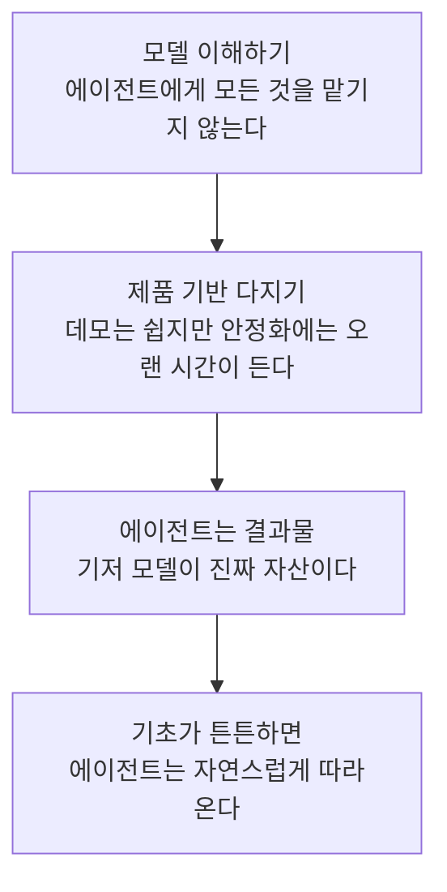
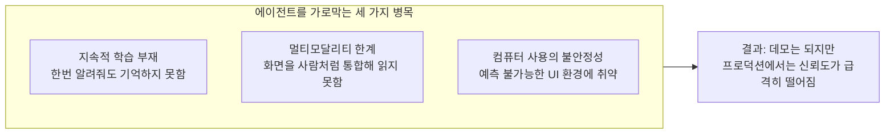
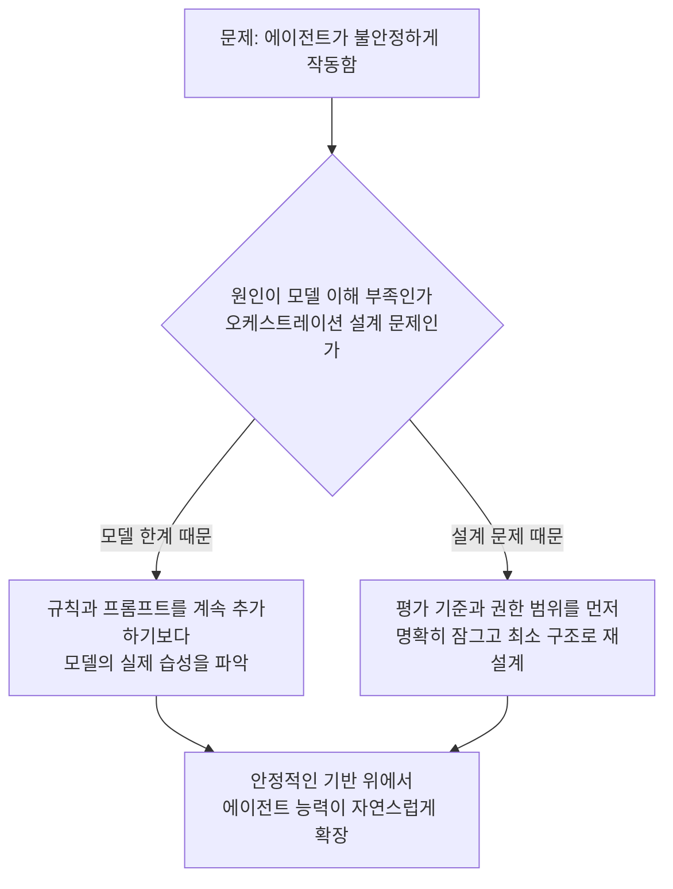

## 이 글이 다루는 것

```
https://www.threads.com/@won.wizard/post/DbFPv6nEe7z

Andrej Karpathy: "현재 AI 분야에서 가장 큰 실수는 사람들이 기본 모델을 완전히 숙달하기 전에 에이전트를 작동시키도록 강요하는 것입니다.
저희 OpenAI도 2016년에 이 실수를 저질렀고, 그 대가로 5년이라는 시간을 허비했습니다."

Karpathy가 진짜로 말하고 싶은 건:
첫 번째 단계 → Agent에게 모든 것을 떠맡기는 강요를 멈추세요. 그 뒤에 숨은 모델을 먼저 이해하세요.
두 번째 단계 → 데모를 만드는 건 쉽지만, 제품을 만드는 데는 10년이 걸릴 수도 있습니다. 자율주행이 이미 이를 증명했습니다. 기초를 건너뛰면 결국 모든 것이 무너질 겁니다.
세 번째 단계 → Agent는 제품이 아니라, 그 아래 깔린 모델이 진짜입니다. 먼저 기초를 튼튼히 다지세요. 그러면 Agent는 자연스레 나타날 겁니다.
“지금 Agent를 구축하고 있는 건 바로 당신입니다. 최전선에 서 있는 것도 당신입니다. OpenAI도, DeepMind도 아니에요. 바로 당신이죠.
```


Andrej Karpathy가 최근 여러 자리에서 반복해온 핵심 주장은 한 문장으로 요약된다. 에이전트 프레임워크나 오케스트레이션 레이어를 아무리 정교하게 쌓아도, 그 아래 깔린 기저 모델의 능력과 한계를 제대로 이해하지 못하면 결국 시스템은 무너진다는 것이다. 이 글은 이 주장이 정확히 무엇을 근거로 하는지, 왜 지금 시점에 설득력을 갖는지, 그리고 실제로 에이전트를 만드는 사람에게 무엇을 시사하는지를 자세히 풀어본다.

---

## 핵심 주장의 구조

Karpathy의 논리는 크게 세 단계로 이어진다. 먼저 에이전트에게 모든 작업을 위임하려는 태도부터 멈추고 그 아래 모델 자체를 이해해야 한다는 것이다. 지금 업계에는 툴 체이닝이나 멀티 에이전트 오케스트레이션을 몇 겹 더 쌓으면 저절로 유능한 에이전트가 만들어질 것이라는 기대가 널리 퍼져 있지만, 실제 실패의 원인은 대부분 모델 능력 부족이 아니라 모델의 습성과 한계를 제대로 이해하지 못한 채 설계된 시스템 구조 자체에 있다는 것이 그의 진단이다.

두 번째는 데모와 제품 사이의 간극이다. 그럴듯하게 작동하는 시연을 만드는 일은 상대적으로 쉽지만, 실제 운영 환경에서 안정적으로 작동하는 제품을 완성하기까지는 훨씬 긴 시간이 걸린다. 그는 테슬라에서 자율주행을 이끌었던 경험을 근거로 든다. 신뢰도를 90%에서 99%로, 다시 99.9%로 끌어올리는 각 단계마다 필요한 노력이 기하급수적으로 늘어나는 현상을 두고 그는 "나인 나인(nine nines)" 문제라고 부른다. 자릿수 하나를 채우는 데 이전 자릿수를 채우는 것과 비슷하거나 그 이상의 시간이 들어간다는 뜻이다. 데모는 첫 자릿수 정도만 채우면 되지만, 실제 제품은 나머지 여러 자릿수를 채워야 하고, 바로 이 구간에서 대부분의 에이전트 프로젝트가 좌초한다.

세 번째는 에이전트 자체가 최종 목표가 아니라는 관점이다. 에이전트는 그 아래에 있는 기저 모델의 능력이 표면으로 드러난 결과물일 뿐이며, 모델을 제대로 다지면 에이전트는 그 위에서 자연스럽게 따라온다는 것이다. 반대로 모델의 근본적인 한계를 우회하려고 에이전트 레이어에서 억지로 문제를 해결하려 들면, 그 시스템은 겉으로는 그럴듯해 보여도 조금만 상황이 바뀌면 쉽게 무너진다.



---

## 왜 지금 에이전트가 안 되는가 — 구체적인 병목들

Karpathy가 2025년 10월 Dwarkesh Patel 팟캐스트에서 이 주장을 가장 상세하게 풀어낸 바 있는데, 여기서 그는 "에이전트의 해가 아니라 에이전트의 10년"이라는 표현을 썼다. 이때 그가 든 근거는 추상적인 우려가 아니라 구체적으로 지목 가능한 몇 가지 공학적 병목이다.

첫째는 지속적 학습(continual learning)의 부재다. 사람에게 무언가를 한 번 알려주면 그 사람은 그것을 기억하고 다음 행동에 반영한다. 반면 지금의 모델은 대화 도중 무언가를 지적받아도 그 세션이 끝나면 그 교훈이 사라진다. 매번 같은 실수를 반복할 수 있다는 뜻이며, 이는 인턴이나 동료로서 신뢰하기 어려운 근본적인 이유가 된다.

둘째는 멀티모달리티의 한계다. 사람은 화면을 보고, 소리를 듣고, 맥락을 종합해 판단한다. 반면 지금의 모델 대부분은 텍스트 중심으로 훈련된 뒤 시각이나 음성 처리를 덧붙인 형태에 가깝고, 실시간으로 화면을 사람처럼 자연스럽게 읽어내는 능력은 아직 실험적인 수준에 머물러 있다.

셋째는 컴퓨터 사용 능력이다. 실제 업무 환경은 정형화된 API보다 마우스와 키보드로 조작해야 하는 그래픽 인터페이스, 예측 불가능하게 바뀌는 화면 구조, 사내에서만 쓰는 폐쇄적인 소프트웨어로 가득 차 있다. 에이전트가 이런 환경에서 사람만큼 안정적으로 조작하는 것은 여전히 어려운 과제로 남아 있다.

Karpathy는 이 세 가지가 한 번 해결하면 끝나는 문제가 아니라, 모델이 성숙해가는 전체 과정에서 계속 마주치게 되는 구조적 제약이라고 설명한다. 그래서 그는 지금의 에이전트를 사람에 비유하는 대신 짧은 시간 동안만 또렷하게 작동하는 존재에 가깝다는 취지로 표현하기도 했다. 겉으로는 사람처럼 대화하고 작업하는 것처럼 보이지만, 그 이면에는 사람이 당연히 가진 기억, 학습, 감각 통합 능력이 빠져 있다는 뜻이다.



---

## 2016년 사례가 보여주는 것

이 주장에 설득력을 더하는 것은 Karpathy 본인이 이미 한 번 이 실패를 직접 겪었다는 사실이다. 2016년 OpenAI 재직 시절 그는 Tianlin Shi, Jim Fan 등과 함께 "World of Bits"라는 프로젝트를 진행했다. 목표는 에이전트가 키보드와 마우스로 웹사이트를 조작해 항공권을 예매하거나 음식을 주문하는 등 실제 업무를 강화학습으로 수행하도록 훈련시키는 것이었다. 지금 수많은 에이전트 스타트업이 첫 슬라이드에 내거는 비전과 사실상 동일하다.

당시 이 접근이 널리 쓰이는 제품으로 이어지지 못한 이유는, 강화학습 외에는 별다른 도구가 없었고 무엇보다 그 위에 올라탈 기저 모델 자체가 아직 그럴 만큼 성숙하지 않았기 때문이었다. 결과적으로 업계는 한동안 에이전트형 접근에서 물러나 언어 모델 자체의 규모와 성능을 키우는 방향에 집중했고, 이 과정이 이후 GPT 계열 모델들로 이어졌다. Karpathy가 지금 반복해서 강조하는 "모델을 먼저 마스터하라"는 조언은 바로 이 경험, 즉 기반이 여물지 않은 상태에서 상위 레이어부터 밀어붙이면 결국 시간만 소모하고 원점으로 돌아온다는 직접 체득한 교훈에서 나온다.

---

## 그가 최근 스스로 보여준 반증 사례

흥미로운 점은 Karpathy가 이 원칙을 말로만 하지 않고, 실제로 그 반대 사례를 스스로 만들어 보여줬다는 것이다. 2026년 3월 그는 AutoResearch라는 오픈소스 프로젝트를 공개했다. 사람이 자연어로 연구 전략을 담은 지침 파일 하나를 작성해두면, 에이전트가 훈련 코드를 반복적으로 수정하고, 실험을 돌리고, 명확한 성능 지표에 따라 결과를 평가하며 스스로 개선해나가는 구조다. 이 프로젝트는 채 700줄이 되지 않는 코드로 이루어졌지만 공개 직후 큰 반향을 일으켰고, 이후 커뮤니티에서는 이 반복 개선 패턴을 루프 엔지니어링이라는 방법론으로 정리해 확산시켰다.

이 프로젝트가 흥미로운 이유는, 그가 에이전트에 회의적인 사람이 아니라는 것을 보여주기 때문이다. 오히려 그는 무엇을 평가 지표로 삼을지, 에이전트가 손댈 수 있는 범위를 어디까지로 제한할지, 사람이 어떤 형태로 방향을 지정해줄지를 매우 명확하게 설계했다. 평가 스크립트는 에이전트가 손댈 수 없도록 잠가두고 학습 스크립트만 수정하게 함으로써, 에이전트가 기준 자체를 낮춰서 점수를 조작하는 상황을 원천적으로 막은 것이 대표적이다. 즉 그가 반대하는 것은 에이전트를 쓰는 것 자체가 아니라, 시스템이 다루는 대상에 대한 정확한 이해 없이 에이전트에게 통제권을 넘기는 방식이다. 모델과 평가 체계를 정확히 이해하고 있었기 때문에, 그 위에 매우 단순한 구조의 루프만으로도 의미 있는 성능 개선을 반복해서 만들어낼 수 있었다는 것이 핵심이다.

이 사례는 앞서 말한 세 단계 논리를 그대로 재현한다. 모델과 평가 기준을 깊이 이해한 상태에서, 작지만 신뢰할 수 있는 기반을 먼저 만들고, 그 위에서 에이전트적 반복 개선이 자연스럽게 따라 나온 것이다.

---

## 실무에 주는 함의

이 주장을 실제 에이전트나 하네스를 만드는 입장에서 풀어보면 몇 가지로 정리된다.

첫째, 프롬프트나 설정 파일을 정교하게 다듬는 것으로 모델의 근본적인 한계를 메우려 하면 결국 한계에 부딪힌다. 모델이 특정 유형의 작업에서 반복적으로 같은 실수를 한다면, 이는 지속적 학습이 없다는 구조적 특성 때문일 가능성이 크고, 이럴 때는 규칙을 계속 추가하기보다 그 실수가 왜 반복되는지 모델 차원에서 이해하는 편이 더 근본적인 해결책이 된다.

둘째, 데모가 잘 작동한다고 해서 그것이 곧 제품 수준의 신뢰도를 의미하지 않는다는 점을 분명히 인식할 필요가 있다. 나인 나인 개념에 따르면 초기 성공률을 끌어올리는 것보다 마지막 몇 퍼센트의 실패율을 줄이는 데 훨씬 많은 노력이 든다. 따라서 에이전트를 실제 운영에 투입할 때는 실패가 발생했을 때의 비용과 복구 가능성을 함께 설계에 반영하는 것이 중요하다.

셋째, 오케스트레이션 레이어를 화려하게 설계하는 것보다, 그 오케스트레이션이 다루는 모델이 무엇을 잘하고 무엇을 못하는지에 대한 정확한 감각을 먼저 갖추는 편이 장기적으로 더 안정적인 시스템으로 이어진다. AutoResearch 사례가 보여주듯, 모델과 평가 기준에 대한 깊은 이해가 뒷받침되면 오히려 시스템 자체는 단순해질 수 있다.



---

## 정리

Karpathy의 주장은 에이전트라는 개념 자체를 부정하는 것이 아니다. 그가 반복해서 말하는 것은 순서의 문제다. 지속적 학습, 멀티모달리티, 컴퓨터 사용이라는 구조적 병목이 아직 남아 있는 지금 시점에, 이를 에이전트 레이어의 정교함으로 메우려 하면 결국 데모 이상으로 나아가지 못하고 무너진다는 것이다. 2016년 그가 직접 겪은 실패, 그리고 2026년 그가 직접 설계해 보여준 성공 사례는 정확히 이 순서를 뒤집어 보여준다. 모델을 먼저 깊이 이해하고 나면, 에이전트는 그 위에 얹는 화려한 장치가 아니라 자연스럽게 뒤따라오는 결과물이 된다는 것이 이 논의 전체를 관통하는 핵심이다.

---

작성일: 2026년 7월 22일
