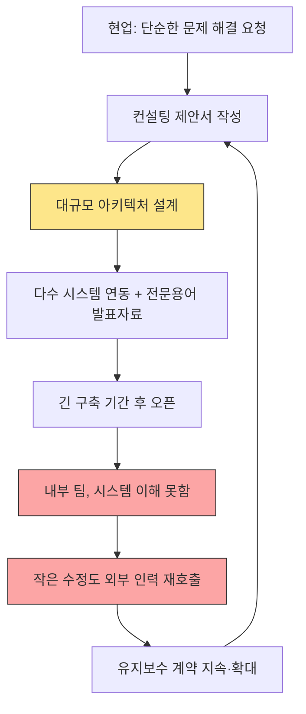
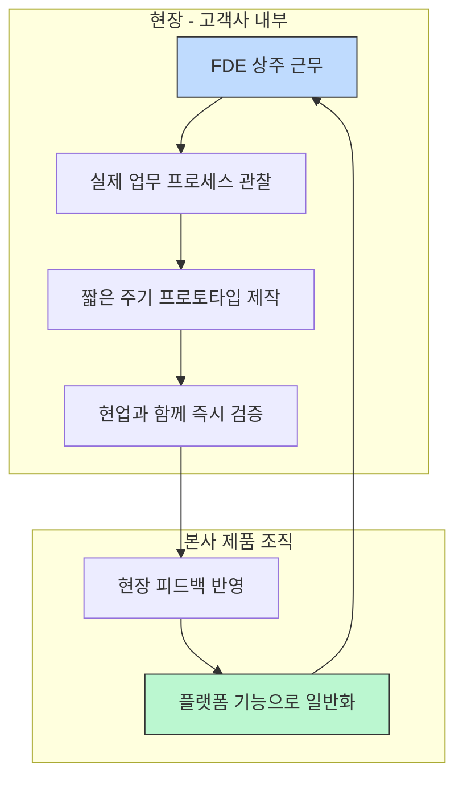
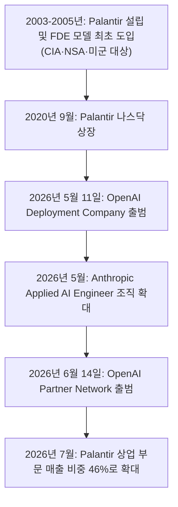
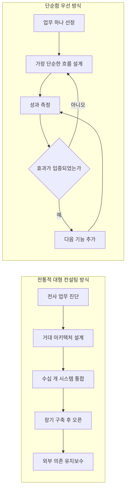

## 들어가며

이 문서는 Threads 계정 @billionnapkin이 게시한 글(["대형 컨설팅 회사의 AI 프로젝트가 실패하는 이유는 기술이 부족해서가 아니다"](https://www.threads.com/@billionnapkin/post/DbHUrbVk2w2))에서 출발합니다. 해당 게시물의 URL(threads.com/@billionnapkin/post/DbHUrbVk2w2)은 Threads 측의 로봇 접근 차단 정책으로 인해 본 문서 작성 과정에서 직접 크롤링할 수 없었습니다. 다만 해당 계정 자체는 AI, Product Manager, Product Owner 관련 콘텐츠를 지속적으로 게시해온 실제 활동 계정으로 확인되었으며, 게시물의 원문은 이미 대화 중에 전달받은 텍스트를 기반으로 합니다.

이 글의 핵심 주장은 크게 세 가지입니다. 첫째, 현업이 원하는 것은 단순한 문제 해결인데 컨설팅 결과물은 처음부터 과도하게 복잡해진다는 것. 둘째, 이런 복잡성 편향에는 컨설팅사의 매출 구조라는 구조적 유인이 존재할 수 있다는 것. 셋째, 이에 대한 대안으로 Palantir의 "현장 배치 엔지니어(Forward Deployed Engineer, FDE)" 모델이 자주 언급되지만, 직함만 복사하고 그 이면의 책임 구조를 가져오지 않으면 의미가 없다는 것입니다.

이 문서는 이 세 가지 주장 각각을 2026년 7월 현재 확인 가능한 실증 데이터, 업계 리포트, 그리고 최근 벌어진 산업 전체의 움직임(OpenAI Deployment Company, Anthropic Applied AI Engineer 등)과 대조하며 상세히 풀어봅니다. 특히 최근 발표된 통계들 사이에는 조사 기관과 방법론에 따른 차이가 존재하므로, 문서 말미에 "확인된 사실 / 기업 주장 / 업계 리포트 / 추정"을 구분해 정리했습니다.

---

## 1. 원문이 말하는 핵심 구조

원문이 묘사하는 실패 패턴은 순환적입니다. 현업은 단순한 문제 하나를 풀고 싶어 하지만, 결과물로 돌아오는 것은 누구도 전체 구조를 이해하지 못하는 아키텍처, 수십 개 시스템 간의 연동, 전문용어로 채워진 보고서, 그리고 외부 인력 없이는 돌아가지 않는 운영 체계입니다. 문제는 '지식 그래프 온톨로지'처럼 정말로 복잡성이 필요한 경우도 분명 있다는 점이라고 원문은 지적합니다. 다만 그 복잡성이 측정 가능한 필요성이 증명되기도 전에 먼저 설계도에 들어가 버린다는 것이 핵심 비판 지점입니다.

이 순환 구조를 다이어그램으로 표현하면 다음과 같습니다.

이 루프가 위험한 이유는, 한 번 진입하면 빠져나오기가 구조적으로 어렵기 때문입니다. 내부 팀이 시스템을 이해하지 못하는 상태에서는 문제를 스스로 진단할 능력조차 사라지고, 결국 다음 유지보수 계약을 체결하는 것 외에 다른 선택지가 남지 않게 됩니다.

---

## 2. 데이터로 확인하는 "AI 프로젝트 실패"의 실체

원문의 주장이 단순한 인상비평이 아니라는 것은, 2025~2026년 사이 여러 독립적인 기관들이 내놓은 수치를 통해 뒷받침됩니다. 다만 아래 수치들은 조사 기관, 조사 시점, 방법론이 모두 다르므로 하나의 단일한 통계로 취급해서는 안 됩니다.

### 2-1. 기관별 실패율 통계 비교

| 발표 기관 / 리포트 | 핵심 수치 | 발표 시점 | 방법론 개요 |
|---|---|---|---|
| MIT Media Lab NANDA 이니셔티브, "The GenAI Divide: State of AI in Business" | 생성형 AI 파일럿의 약 95%가 측정 가능한 손익(P&L) 개선에 실패했고, 약 5%만 빠른 매출 성장을 달성 | 2025년(2026년까지 업계 기준치로 인용됨) | 공개된 AI 도입 사례 약 300건 분석과 수십~150여 건의 조직 인터뷰, 150여 명 규모의 설문을 결합 |
| RAND Corporation | AI 프로젝트의 80% 이상이 실패하며, 이는 일반 IT 프로젝트 실패율의 약 2배 | 2024년 | 별도 리포트 |
| BCG | 기업의 74%가 AI로부터 아직 가시적 가치를 얻지 못했다고 응답(2024년 10월) → 60%가 유의미한 가치가 없다고 응답(2025년 9월, 조사 대상·질문이 상이할 수 있음) | 2024년 10월 / 2025년 9월 | 기업 서베이 |
| McKinsey | 응답 기업의 80% 이상이 전사적 EBIT(영업이익) 차원의 의미 있는 영향을 보고하지 못함 | 2025년 11월 | 기업 서베이 |
| S&P Global Market Intelligence | 평균적으로 AI PoC(개념 검증)의 46%가 프로덕션 도달 전 폐기되며, 48%만 실제 프로덕션에 도달, 프로토타입에서 프로덕션까지 평균 8개월 소요 | 2025년 | 시장 조사 |
| Gartner | 2025년 말까지 PoC 이후 생성형 AI 프로젝트의 30% 중단 전망 / 2027년 말까지 에이전틱 AI 프로젝트의 40% 이상 취소 전망 / AI 준비 데이터가 부족한 프로젝트의 60%가 2026년까지 중단될 전망 | 2024~2025년 발표(예측치) | 애널리스트 예측 |
| Iris.ai 2026년 엔터프라이즈 분석 | AI 파일럿의 88%가 프로덕션에 도달하지 못함 | 2026년 | 업계 분석 |
| Gartner (2026년 4월 서베이) | AI 실패를 경험한 조직의 57%가 원인으로 "너무 많은 것을 너무 빨리 기대했다"를 지목 | 2026년 4월 | I&O 리더 782명 대상 |

이 표에서 눈여겨볼 부분은, "95%"나 "80% 이상" 같은 숫자 자체보다 그 숫자들이 공통적으로 가리키는 방향입니다. 즉 실패의 원인이 모델 성능 부족이 아니라 조직·데이터·거버넌스·기대 관리의 문제라는 점에서 여러 기관의 결론이 수렴한다는 사실입니다.

### 2-2. 무엇이 성공과 실패를 가르는가

같은 통계 묶음 안에서 특히 원문의 주장과 직접 맞닿는 대목이 있습니다. 실패한 AI 프로젝트의 73%는 애초에 성공에 대한 합의된 정의조차 없었고, 61%는 사전에 제시된 예상 ROI가 출시 후 한 번도 실측되지 않은 채 승인되었다는 것입니다. 반대로 사전에 정량적 성공 지표를 정의한 프로젝트와 그렇지 않은 프로젝트의 성공률 격차는 다음과 같습니다.

| 조건 | 성공률 |
|---|---|
| 착수 전 정량적 성공 지표를 정의한 프로젝트 | 54% |
| 정량적 성공 지표 없이 착수한 프로젝트 | 12% |

이 수치는 원문이 제시하는 처방—"업무 하나를 고르고, 성과를 측정한 뒤, 필요성이 증명될 때만 다음 기능을 추가한다"—이 인상비평이 아니라 실제로 성공률을 4배 이상 갈라놓는 실무 원칙임을 뒷받침합니다.

---

## 3. 왜 컨설팅사는 복잡성을 먼저 설계하는가 — 구조적 유인의 문제

원문에서 가장 도발적인 대목은 "프로젝트 규모와 인력, 기간과 산출물이 커질수록 더 많은 매출이 생기는 구조라면 단순한 해결책을 선택할 유인이 약해질 수 있다"는 부분입니다. 이는 대형 컨설팅사 다수가 채택하는 시간·인력 기반(Time & Materials) 또는 인원수×기간 기반 과금 구조의 일반적 논리와 정합적입니다. 컨설턴트의 투입 인원(FTE)과 프로젝트 기간이 매출의 핵심 변수인 계약 구조에서는, 산출물이 고객사 내부에서 자립적으로 운영 가능할수록 오히려 후속 계약의 필요성이 줄어드는 역설이 발생합니다.

다만 이 문서에서 분명히 해야 할 것은, 이 인과관계—"복잡성이 클수록 컨설팅사에 유리하다"는 명제—를 직접 실증한 학술 연구나 정량 데이터는 확인되지 않았다는 점입니다. 이는 논리적으로 설득력 있는 업계의 일반적 해석이자 원문 저자를 포함한 다수 실무자들의 경험적 관찰이지만, 인과관계를 통계적으로 입증한 자료는 아닙니다. 이 부분은 아래 "사실과 주장의 구분" 섹션에서 다시 명확히 정리합니다.

흥미로운 점은, 2026년 들어 이 구조적 유인 문제에 대한 산업계의 응답이 실제로 나타났다는 것입니다. 바로 다음 섹션에서 다룰 Palantir의 FDE 모델과, 이를 뒤따르는 OpenAI·Anthropic의 움직임입니다.

---

## 4. Palantir의 Forward Deployed Engineer(FDE) 모델 해부

### 4-1. 기원과 역사

FDE라는 직함은 이름만 보면 "고객사에 엔지니어를 파견하는 상주 인력 모델"처럼 들리지만, 원문이 정확히 짚었듯 핵심은 파견 형식 자체가 아닙니다. Palantir는 2003년 설립되었고, 2003~2005년 사이 CIA·NSA·미 육군 정보 부대를 대상으로 Gotham 플랫폼을 판매하던 과정에서 이 모델을 고안했습니다. 당시 고객 데이터는 기밀 등급이었고, 스키마는 문서화되어 있지 않았으며, "작동하는 소프트웨어"는 본사의 엔지니어가 결코 접할 수 없는 현장의 트레이드크래프트(암묵지)에 의존하고 있었습니다. 전통적인 벤더가 제공할 수 있는 선택지는 두 가지뿐이었습니다. 프로덕션 코드를 작성할 수 없는 컨설턴트, 혹은 제품을 재설계할 권한이 없는 솔루션 엔지니어. Palantir는 여기에 세 번째 선택지를 만들었습니다. 보안 인가를 받은 엔지니어가 포트 브래그나 랭글리 같은 현장에 6개월에서 1년가량 상주하며 고객의 도메인을 학습하고, 프로덕션 Gotham 코드를 직접 작성하며, 그 결과를 팔로알토 본사의 제품팀에 요구사항으로 피드백하는 구조입니다.

### 4-2. 작동 방식 — 온톨로지와 현장 중심 제품 개발

원문이 언급한 '지식 그래프 온톨로지'는 실제로 Palantir 플랫폼(Foundry)의 핵심 개념과 정확히 일치합니다. Palantir는 반복되는 고객 문제—데이터 파편화, 권한 관리, 워크플로 자동화, 데이터 출처 추적—를 매번 새로 풀지 않고, 이를 온톨로지·객체 모델·권한 시스템·워크플로 엔진·데이터 계보 추적이라는 플랫폼 프리미티브(primitive)로 미리 인코딩해 두었습니다. 이 때문에 신규 사용자에게는 플랫폼이 처음부터 "과도하게 설계된 것"처럼 보일 수 있습니다. 다만 결정적 차이는, 이 복잡성이 고객이 실제로 부딪히는 반복적 문제를 해결하기 위해 현장에서 축적된 학습의 결과로 들어간 것이지, 처음부터 증명되지 않은 채 얹어진 것이 아니라는 점입니다.

FDE가 실제로 하는 일은 다음 순환 구조로 요약됩니다.

Palantir FDE 내부에서 통용되는 표현 중 하나가 "1일차에 배포한다(ship on day one)"는 것으로 알려져 있습니다. 즉 90일짜리 전략 보고서를 만들기 전에, 첫 주 안에 고객 환경에서 작동하는 실제 코드를 배포하는 것이 원칙이라는 의미입니다. 이는 원문이 말한 "짧은 주기로 제품을 만들며, 사용 결과를 보고 계속 수정하는 방식"과 정확히 일치합니다.

### 4-3. 전통 컨설팅과의 근본적 차이

전통적인 컨설팅과 FDE 모델의 차이는 표면적인 것이 아니라 조직적·경제적 차이입니다. 아래 표로 정리합니다.

| 구분 | 전통적 대형 컨설팅 | Forward Deployed Engineer 모델 |
|---|---|---|
| 핵심 산출물 | 전략 보고서, 발표 슬라이드, 로드맵 문서 | 고객 환경에 실제로 배포되는 작동 코드 |
| 착수 속도 | 수 주~수개월의 진단·설계 이후 착수 | 착수 1주 차부터 작동 코드 배포 |
| 인력의 권한 | 컨설턴트는 프로덕션 코드 작성 권한이 제한적인 경우가 많음 | 엔지니어가 직접 프로덕션 코드를 작성하고 소유 |
| 조직 위치 | 계약(로드맵) 하류(downstream)에서 작업 | 로드맵 상류(upstream)에서 작업하며 로드맵 자체에 영향 |
| 수익 구조의 일반적 유인 | 투입 인원×기간에 비례하는 매출 구조가 흔함 | 플랫폼 반복 사용, 사용량 기반 매출로 이어지는 구조 |
| 제품 피드백 루프 | 프로젝트 종료 후 학습이 컨설팅사 내부에 남더라도 제품(플랫폼) 자체에는 반영되지 않는 경우가 많음 | 현장 인사이트가 본사 플랫폼 로드맵에 구조적으로 반영됨 |

한 분석가는 이 모델을 두고 "겉보기에는 서비스처럼 보이는 제품 개발 전략"이라고 표현했습니다. 즉 FDE는 서비스업의 외피를 두른 제품 개발 조직이며, 기관의 복잡성 자체를 제거해야 할 문제가 아니라 제품이 실제로 살아가야 할 환경으로 받아들인다는 것이 핵심입니다.

---

## 5. 2026년, FDE 모델이 산업 전체의 표준이 되다

원문이 쓰인 시점 이후 벌어진 가장 중요한 변화는, 이 FDE 모델이 더 이상 Palantir만의 특수한 관행이 아니라 프론티어 AI 랩(lab) 전체의 공식 전략이 되었다는 사실입니다. 아래는 2026년 상반기까지의 흐름입니다.

### 5-1. OpenAI Deployment Company

2026년 5월 11일, OpenAI는 "OpenAI Deployment Company(DeployCo)"라는 자회사 출범을 공식화했습니다. 이는 OpenAI가 과반 지분을 보유하고 경영권을 행사하는 조직으로, 19개 투자자로부터 40억 달러 이상을 유치했으며 보도에 따라 100억~140억 달러 사이의 기업가치로 평가되었습니다(구체적 밸류에이션 수치는 Bloomberg 인용 보도와 다른 매체 보도 사이에 100억 달러와 140억 달러로 차이가 있어, 이 문서에서는 두 수치 모두를 병기합니다). 리드 투자자는 TPG이며, Advent International·Bain Capital·Brookfield Asset Management가 공동 리드 파트너로 참여했습니다. 그 외에도 Goldman Sachs, SoftBank, Warburg Pincus 등이 이름을 올렸습니다.

이 조직의 목적은 대형 엔터프라이즈(헬스케어, 물류, 제조, 금융 서비스) 내부에 OpenAI 소속 엔지니어를 상주시켜 실제 프로덕션 환경에서 모델이 작동하도록 만드는 것입니다. 즉시 인력을 확보하기 위해 OpenAI는 2023년 OpenAI와의 제휴 하에 설립된 응용 AI 컨설팅사 Tomoro를 인수했으며, 이를 통해 약 150명의 Forward Deployed Engineer를 단번에 내재화했습니다. Tomoro의 기존 고객사로는 Tesco, Virgin Atlantic, Supercell, Mattel, Red Bull, Fidelity International 등이 거론됩니다.

한 가지 사례로 자주 인용되는 것이 Supercell(Clash of Clans 개발사)을 위해 12주 만에 구축했다는 인게임 AI 고객지원 에이전트로, 1억 1천만 명 사용자를 대상으로 티켓당 처리 비용을 약 90% 절감했다는 주장입니다. 다만 이 수치는 OpenAI·Tomoro 측이 자체적으로 제공한 성과로, 독립적인 제3자 검증은 확인되지 않았습니다. 성과 자체를 부정할 근거는 없지만, 벤더 발표 수치라는 점은 명시할 필요가 있습니다.

이후 2026년 6월 14일에는 이와는 별개로 "OpenAI Partner Network"가 출범했습니다. 이는 1억 5천만 달러 규모의 투자로, 2026년 말까지 30만 명의 인증 컨설턴트 양성을 목표로 하며 Select·Advanced·Elite 3단계 등급 체계를 갖췄습니다. 창립 멤버로는 Accenture, Bain & Company, Boston Consulting Group, McKinsey, PwC가 이름을 올렸습니다. 즉 OpenAI는 최상위 대기업 고객은 DeployCo가 직접 엔지니어를 내재화해 관계를 소유하고, 중견기업 시장은 기존 컨설팅사들이 OpenAI 방법론을 따라 구현하도록 이원화한 구조를 택한 셈입니다.

### 5-2. Anthropic의 Applied AI Engineer

Anthropic 역시 유사한 역할을 두고 있지만, 의도적으로 다른 명칭을 씁니다. Palantir와 OpenAI가 "Forward Deployed"라는 표현을 쓰는 반면 Anthropic은 "Applied AI Engineer"라는 명칭을 사용하는데, 이는 "현장(field)"이나 "파견(deployed)"이라는 단어가 연구·개발 조직으로부터의 거리감을 함축한다고 보고, 대신 연구에서 프로덕션까지 하나로 이어지는 연속선상의 응용 단계라는 프레이밍을 택한 것으로 알려져 있습니다. Anthropic의 채용 공고에 따르면 이 역할은 금융 서비스, 헬스케어, 법률, 정부 등 규제 산업을 우선 대상으로 하며, 고객사 엔지니어링팀이 임상의·IT 인력과 함께 실제 업무 워크플로에 맞는 도구를 구축하는 방식으로 진행됩니다. 아울러 Goldman Sachs의 자산운용 부문 책임자가 "중견기업을 위한 Forward Deployed Engineer 접근성의 민주화"를 목표로 언급한 별도 법인 관련 보도도 있었으나, 이 조직의 구체적 지분 구조나 명칭에 대한 세부 사항은 이 문서 작성 시점에서 완전히 확정된 것으로 확인되지 않아 참고 수준으로만 다룹니다.

### 5-3. 아이러니 — 자신을 대체할 모델에 투자하는 컨설팅사들

이 흐름에서 가장 역설적인 대목은, McKinsey·Bain & Company·Capgemini가 OpenAI DeployCo의 지분 투자자이자 파트너로 이름을 올렸다는 사실입니다. 이들은 지난 수년간 포춘 500대 기업에 AI 로드맵을 컨설팅하며 수임료를 받아온 바로 그 회사들입니다. 이제 이들은 자신들이 해왔던 일을, 슬라이드 대신 실제 작동하는 코드로 대체하겠다는 조직에 자금을 대는 입장이 되었습니다. 이를 두고 업계에서는 "전통적인 컨설팅 모델이 단기적으로는 대체되기보다 흡수되고 있다"는 해석이 나옵니다. 즉 컨설팅사 입장에서는 이 변화에 저항하기보다, 지분 참여와 인증 파트너 프로그램을 통해 새로운 수익원으로 편입시키는 쪽을 택한 것으로 보입니다.

---

## 6. "이름만 복사하는" 리스크 — FDE 워싱

원문은 "'현장 배치 엔지니어'라는 직함만 복사하고 그 뒤의 책임 구조와 제품 개발 방식을 가져오지 않으면 결국 기존 컨설팅에 새로운 이름만 붙인 셈"이라고 경고합니다. 이는 2026년 현재 FDE라는 용어가 업계 전반에서 유행어처럼 확산되는 상황에서 특히 유효한 지적입니다. 실제로 Kinaxis 같은 공급망 소프트웨어 기업도 이미 "Forward Deployed Engineering" 서비스를 표방하고 있으며, FDE라는 직함 자체가 채용 시장에서 급격히 확산되고 있다는 보도도 있습니다.

FDE 모델의 실질을 결정하는 것은 직함이 아니라 다음 세 가지 구조적 조건입니다.

1. **엔지니어가 실제로 프로덕션 코드를 소유하고 배포할 권한을 갖는가.** 권한 없이 현장에 나가 있는 인력은 이름만 FDE인 컨설턴트에 불과합니다.
2. **현장의 학습이 본사 제품 로드맵에 실제로 역류하는가.** 프로젝트가 끝나면 그 지식이 증발해버리는 구조라면 이는 일회성 구축 프로젝트일 뿐입니다.
3. **수익 구조가 고객의 자립적 운영을 저해하지 않는 방향으로 설계되어 있는가.** 유지보수 매출 극대화가 목표라면 아무리 FDE라는 이름을 붙여도 원문이 지적한 순환 구조에서 벗어날 수 없습니다.

---

## 7. 단순함에서 시작하는 실전 프레임워크

원문이 제시하는 대안적 접근, 그리고 앞서 살펴본 성공률 데이터(정량 지표 사전 정의 시 54% 대 12%)를 종합하면, 실무에서 취할 수 있는 접근은 다음과 같이 정리됩니다.

핵심은 "어떤 거대한 구조를 만들 것인가"라는 질문에서 출발하지 않고, "이번 달 안에 어떤 문제 하나를 측정 가능하게 줄일 것인가"라는 질문에서 출발하는 것입니다. 온톨로지나 지식 그래프처럼 정교한 개념이 필요해지는 순간은 분명히 존재하지만, 그 복잡성은 설계 초기에 선제적으로 투입되는 것이 아니라, 단순한 흐름을 반복해서 검증하는 과정에서 실제 필요가 증명될 때 비로소 허용되어야 한다는 것이 이 프레임워크의 요지입니다.

---

## 8. 한국 엔터프라이즈 AX 환경에 대한 시사점

국내 대기업의 SM/SI 구조에서도 이와 유사한 패턴이 반복적으로 관찰됩니다. AX(AI 전환) 과제가 발주되면 초기 제안 단계에서부터 데이터 레이크, 지식 그래프, MLOps 파이프라인 전체를 아우르는 대형 아키텍처가 먼저 그려지고, 현업 부서가 실제로 원했던 단일 업무 자동화는 그 안에서 파편처럼 흩어져 버리는 경우가 드물지 않습니다. 특히 SI사의 수익 구조가 투입 인력(MM, Man-Month) 기준 과금에 크게 의존하는 국내 환경에서는, 원문이 지적한 "산출물이 커질수록 매출이 커지는 구조"의 유인이 해외 컨설팅사보다 오히려 더 직접적으로 작동할 소지가 있습니다.

이런 맥락에서 볼 때, Palantir·OpenAI·Anthropic이 공통적으로 택하고 있는 "현장 밀착 + 1주 차 배포 + 현장 학습의 제품 환류"라는 원칙은 국내 SM/SI 조직에도 참고할 만한 조직 설계 원리입니다. 다만 이를 그대로 이식하려면 앞서 6장에서 언급한 세 가지 조건—엔지니어의 실질적 권한, 학습의 제품 환류 구조, 자립적 운영을 저해하지 않는 수익 모델—이 함께 갖춰져야 하며, 그렇지 않다면 "AX 전담 조직" 혹은 "현장 배치 엔지니어"라는 명칭만 붙인 또 다른 형태의 SI 프로젝트에 그칠 위험이 있습니다.

---

## 9. 사실과 주장의 구분

이 문서에서 다룬 내용을 신뢰도에 따라 구분하면 다음과 같습니다.

**확인된 사실(Confirmed facts)**
- Palantir의 FDE 모델은 2003~2005년 CIA·NSA·미 육군을 대상으로 한 초기 구축 과정에서 고안되었습니다.
- OpenAI Deployment Company는 2026년 5월 11일 공식 출범했으며, TPG를 리드 투자자로 19개 투자자로부터 40억 달러 이상을 유치하고 Tomoro를 인수했습니다.
- OpenAI Partner Network는 2026년 6월 14일 출범했으며 Accenture, Bain & Company, BCG, McKinsey, PwC가 창립 파트너로 참여했습니다.
- Anthropic은 "Applied AI Engineer"라는 명칭의 현장 밀착형 엔지니어 역할을 운영 중이며, 금융·헬스케어·법률·정부 산업을 우선 대상으로 합니다.
- MIT, RAND, Gartner, BCG, McKinsey, S&P Global 등 복수 독립 기관이 AI 프로젝트의 높은 실패율(수치는 기관별로 상이)을 발표했습니다.

**기업(벤더) 주장으로, 독립 검증이 확인되지 않은 내용**
- Tomoro가 Supercell을 위해 구축한 AI 지원 에이전트의 "티켓당 비용 90% 절감" 수치는 OpenAI·Tomoro 자체 발표 수치입니다.
- Palantir의 특정 기간 주가 수익률(약 640%) 등은 2차 보도의 인용치로, 정확한 산정 기준일에 대한 재확인이 필요합니다.
- OpenAI Deployment Company의 기업가치(100억 달러 대 140억 달러)는 보도 매체에 따라 수치가 갈립니다.

**업계 리포트·커뮤니티 관찰(정량적으로 입증되지 않은 해석 포함)**
- 원문 게시자가 언급한 "최근 3년간 25곳 이상 기업 사례" 관찰은 검증되지 않은 개인 실무 경험담입니다.
- "컨설팅사의 매출 구조가 복잡성을 유도하는 유인으로 작동한다"는 해석은 업계에서 널리 공유되는 논리적 추론이며, Time & Materials 계약의 일반적 구조와는 정합적이지만, 이를 직접 실증한 학술적 인과관계 연구는 확인되지 않았습니다.
- Anthropic이 Goldman Sachs 등과 함께 별도로 추진 중이라는 중견기업 대상 FDE 접근성 확대 법인은 언론 보도 수준에서 확인되며, 세부 지분·조직 구조는 명확히 공개되지 않았습니다.

**추정에 가까운 해석**
- "고객이 스스로 운영 가능한 시스템보다 계속 도움이 필요한 시스템이 사업적으로 더 유리하다"는 명제는 논리적으로 설득력이 있으나, 특정 컨설팅사의 실제 의사결정이 이 논리에 따라 이뤄졌는지를 보여주는 직접 증거는 이 문서에서 확인되지 않았습니다.

---

## 10. 결론

이 게시물의 메시지를 한 문장으로 압축하면, 좋은 AI 시스템은 설명에 많은 슬라이드가 필요하지 않다는 것입니다. 현업이 이해하고, 직접 사용하고, 숫자로 효과를 확인할 수 있으면 충분합니다. 2026년 현재 확인되는 실증 데이터—AI 파일럿의 상당수가 프로덕션에 도달하지 못하거나 측정 가능한 손익 개선에 실패하고 있다는 여러 기관의 수렴된 결론, 그리고 사전 성공 지표 정의 여부가 성공률을 4배 이상 갈라놓는다는 수치—는 이 메시지가 단순한 경험담을 넘어선다는 것을 보여줍니다.

동시에 Palantir가 20여 년에 걸쳐 구축해온 FDE 모델이 2026년 상반기 OpenAI와 Anthropic에 의해 거의 동시에 산업 표준으로 채택되고 있다는 사실은, "복잡성을 먼저 설계하지 말고 현장에서 검증된 필요에 따라 점진적으로 허용하라"는 원칙이 이제 개별 실무자의 조언 수준을 넘어 프론티어 AI 기업들의 공식 전략으로 자리 잡고 있음을 시사합니다. 다만 이 흐름이 실제로 고객의 자립적 역량을 키우는 방향으로 이어질지, 아니면 FDE라는 이름을 두른 또 다른 형태의 종속적 유지보수 구조로 귀결될지는 앞으로도 계속 지켜봐야 할 문제입니다.

---

## 참고문헌

- Diogo Silva Santos, "A Comprehensive Analysis of Palantir's Forward Deployed Engineering Model", Medium (Activated Thinker), 2026년 4월 8일. https://medium.com/activated-thinker/a-comprehensive-analysis-of-palantirs-forward-deployed-engineering-model-4502a036b5e4
- "AI to ROI Big Story: The Big AI Labs Try to Become the Next Palantir", AI to ROI (Substack), 최근 게시. https://ai2roi.substack.com/p/ai-to-roi-big-story-the-big-ai-labs
- balaji bal, "Understanding Palantir: Forward-Deployed Engineers and the Making of an Unusual Platform Company", Medium, 2026년 3월 23일. https://medium.com/@balajibal/understanding-palantir-forward-deployed-engineers-and-the-making-of-an-unusual-platform-company-494dc7812f24
- "Palantir's Forward-Deployed Engineering Playbook: The Original Model Anthropic and OpenAI Are Copying", Perspective AI Blog, 2026년 5월 14일. https://getperspective.ai/blog/palantir-forward-deployed-engineering-playbook-anthropic-openai-copying
- Steve Banker, "Palantir And Forward Deployed Engineering: What Should We Believe?", Forbes, 2026년 7월 10일. https://www.forbes.com/sites/stevebanker/2026/07/10/palantir-and-forward-deployed-engineering-what-should-we-believe/
- "The Palantir Model That Anthropic and OpenAI Are Now Copying — Forward Deployed Engineers Explained", Revolution in AI, 2026년 5월 6일. https://www.revolutioninai.com/2026/05/forward-deployed-engineer-ai-anthropic-openai-explained.html
- "OpenAI Launches $4 Billion Enterprise AI Deployment Venture, Recruits McKinsey and Capgemini as Co-Funders", Tech Times, 2026년 5월 17일. https://www.techtimes.com/articles/316726/20260516/openai-launches-4-billion-enterprise-ai-deployment-venture-recruits-mckinsey-capgemini.htm
- "OpenAI Launches $4B Deployment Company for Business", Enterprise DNA, 2026년 5월 12일. https://enterprisedna.co/resources/news/openai-deployment-company-4-billion-enterprise-2026/
- "OpenAI Just Bought Big 4 Consulting Power For $4B", ThePlanetTools.ai, 2026년 5월 12일. https://theplanettools.ai/blog/openai-deployment-company-4-billion-bain-mckinsey-capgemini-tomoro-may-2026
- "OpenAI Deployment Company", Epinium, 2026년 5월 12일. https://epinium.com/en/blog/openai-deployment-company-what-4b-and-19-investors-signal-for-enterprise-ai/
- "Bain & Company invests in OpenAI Deployment Company", Consulting.us, 2026년 5월 15일. https://www.consulting.us/news/13396/bain-company-invests-in-openai-deployment-company
- "OpenAI can't have incompetent AI consultants ruining the market, so bought its own", The Register, 2026년 5월 21일. https://www.theregister.com/ai-ml/2026/05/11/openai-buys-ai-consultancy-to-sell-enterprises-on-its-models/5238213
- "OpenAI Started Selling What McKinsey Sells — Using McKinsey's Money", AI Founders, 2026년 6월 17일. https://aifounders.cz/en/openai-started-selling-what-mckinsey-sells-using-mckinseys-money/
- "What is a Forward Deployed Engineer: The AI Role OpenAI, Anthropic, and Google Are Hiring in 2026", MarkTechPost, 2026년 5월 21일. https://www.marktechpost.com/2026/05/20/what-is-a-forward-deployed-engineer-the-ai-role-openai-anthropic-and-google-are-hiring-in-2026/
- "Anthropic's Applied AI Engineers: The Forward-Deployed Function Behind Claude's Enterprise Strategy", Perspective AI Blog, 2026년 5월 14일. https://getperspective.ai/blog/anthropic-applied-ai-engineers-forward-deployed-claude-enterprise
- "Why OpenAI and Anthropic are hiring forward deployed engineer teams", The New Stack, 2026년 5월 29일. https://thenewstack.io/forward-deployed-engineers-ai/
- "Forward Deployed Engineer", Wikipedia (영문판, 관련 항목).
- "AI Project Failure Rate in 2026: What the Data Shows", Folio3 AI, 2026년 4월 24일. https://www.folio3.ai/blog/ai-project-failure-rate-stats
- "Enterprise AI Failure Rate: Why 95% of Projects Fail", The Data Experts, 2025년 9월 11일. https://www.thedataexperts.us/writing/enterprise-ai-failure-crisis-95-percent-failure-rate.html
- S.L. Fuller, "Why enterprise AI pilots fail", CIO Dive, 2026년 1월 6일. https://www.ciodive.com/news/why-enterprise-ai-pilots-fail/808751/
- "Why 90% of Enterprise AI Implementations Fail (2026)", Talyx.ai, 2026년 1월 27일. https://talyx.ai/insights/enterprise-ai-implementation-failure
- "Why 95% of AI Projects Fail and How Data Fixes It", SR Analytics, 2026년 2월 26일. https://sranalytics.io/blog/why-95-of-ai-projects-fail/
- "Why 88% of Enterprise AI Pilots Never Reach Production", Institute PM, 2026년 5월 31일. https://www.institutepm.com/knowledge-hub/why-enterprise-ai-pilots-fail
- "AI Project Failure Rate 2026: 80% Fail", Pertama Partners, 2026년 6월 16일. https://www.pertamapartners.com/insights/ai-project-failure-statistics-2026
- @billionnapkin, Threads 프로필 및 게시물(원문 출처, 직접 접근은 로봇 차단으로 제한됨). https://www.threads.com/@billionnapkin

---

작성일자: 2026-07-23
