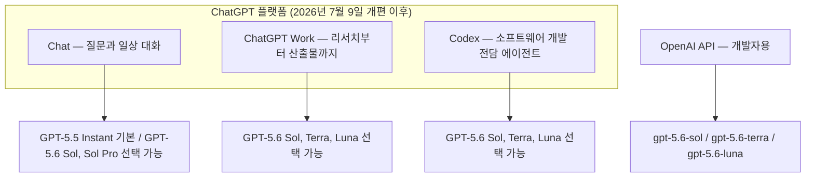
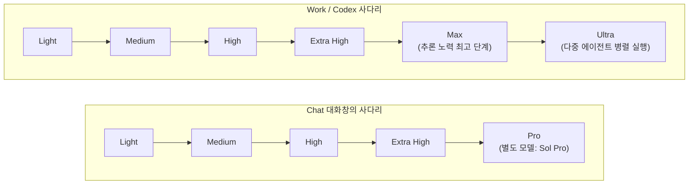
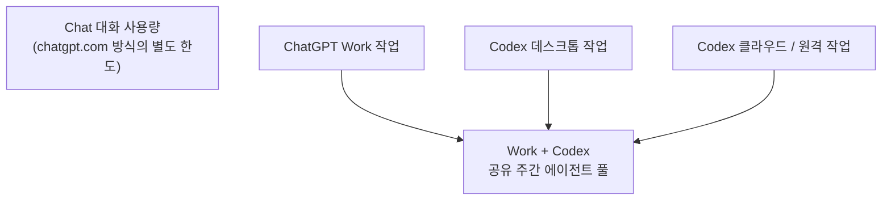
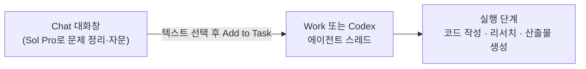

**"Pro 추론은 Chat에만 있다"는 주장, 사실인가 검증한다**

작성일: 2026년 7월 24일

---

## 목차

1. 들어가며 — 두 개의 스레드(Threads) 게시물이 던진 질문
2. OpenAI 제품 구조 다시 보기: Chat, Work, Codex는 무엇이 다른가
3. GPT-5.6 모델 패밀리: Sol, Terra, Luna
4. 핵심 개념 정리: "추론 모드(Reasoning Mode)"와 "추론 노력(Reasoning Effort)"은 다른 것이다
5. 어디서 무엇을 고를 수 있는가 — Chat vs Work vs Codex 선택지 매트릭스
6. "Codex에도 Max가 숨어있다"는 주장 검증
7. 토큰은 어떻게 나뉘는가 — Chat 전용 한도와 Work·Codex 공유 풀
8. 컨텍스트 윈도우, 정말 Chat이 더 넓을까 — 사실 확인
9. Add to Task — Chat에서 Work·Codex로 작업을 넘기는 다리
10. 자동화 시도 사례 — Codex가 Chat을 대신 조작하게 만드는 커뮤니티 프로젝트
11. 실전 워크플로우: 두 게시물 저자들이 제안하는 베스트 프랙티스
12. 종합 요약표
13. 남는 불확실성과 앞으로 확인해야 할 것들
14. 참고 자료

---

## 1. 들어가며 — 두 개의 스레드 게시물이 던진 질문

```
https://www.threads.com/@noahmungmung/post/DbJc56Sk04n

어제 회사에서 그냥 대화하다가 상당히 놀란 부분이 있었는데요.

codex를 맨날 사용하는 친구들이 chat을 안 쓰더라고요.

제가 놀라서 물어보니 굉장한 오해가 있는것 같아요.

'codex 에서도 채팅 다 됨. 모델 다됨. 토큰 모자라지 않으니 토큰 아낀다고 chat 쓸 필요 없음. 왔다갔다 귀찮음.'

하지만 결정적인 차이점은요...

chat 에서만!! 추론레벨을 pro로 선택할 수 있어요.. 

codex나 work 에서는 선택할 수가 없어요.

openai 에서 추론은 크게 두가지로 구분하는데(reasoning mode)

standard가 있고 pro가 있어요.

그 안에서 다시 medium이든 xhigh든 설정하는거에요(reasoning effort)

그러니깐 standard와 pro는 전혀 다른 레벨의 추론 방식이라는거죠.

chatgpt가 수학 난제를 풀었다 뭐했다 하는게 다 pro 기준이에요.

현재 codex나 work 에서 선택할 수 있는 추론레벨은 standard only 구요.

(이것도 최고 레벨인 max는 디폴로 숨겨져 있어요. 

다음에 여는 법 알려드릴께요.)

오직 chat에서만 reasoning mode 로 pro를 선택할 수 있어요.

좀 어렵고 난해한것들을 chat 에서 5.6 sol pro 놓고 정리하고

(토큰도 codex 토큰 안빠지고 별도 토큰 할당되어있음)

add to task 로 원래 하던 codex 프로젝트나 work 에 넘겨서 진행하시는게 

개인적으로는 best practice 라고 생각하고 있어요.

(저도 이렇게 하고 있고요)

—-

 https://www.threads.com/@yoonjang.2/post/DbJialcEldn

컨텍스트 윈도우도 챗이 조금더 크다고 알고있는건지 느껴서 추측한건지 제가 알기론 그렇게 알고있는데... 
정확하지않으니 개개인이 직접 알아보기로.... 

행여 세팅이 똑같더라도 직전 작업 히스토리 컨텍스트가 없어서 새채팅으로 무조건 넓은것처럼 행동해줍니다. 자문구하기 좋죠. 
코덱스한테 텍스트박스안에 정리해서 출력시켜서 복붙해서 챗에 주거나
그과정을 자동화한 insane research였나 그런 리포가 있었던걸로..
```

이 문서는 두 개의 Threads 게시물에서 출발한다. 첫 번째 게시물(@noahmungmung)은 회사 동료들이 Codex를 매일 쓰면서도 정작 ChatGPT의 일반 채팅(Chat) 화면은 전혀 쓰지 않는다는 사실을 알게 된 경험담으로 시작한다. 동료들의 논리는 이랬다. Codex 안에서도 채팅이 되고, 모델도 다 선택할 수 있고, 토큰도 넉넉하니 굳이 화면을 오가며 Chat을 따로 쓸 이유가 없다는 것이다. 그런데 글쓴이는 여기에 결정적인 오해가 있다고 지적한다. 바로 **추론 모드에서 "Pro"를 고를 수 있는 곳은 오직 Chat뿐**이라는 점이다. Codex나 새로 나온 ChatGPT Work에서는 Pro를 선택할 수 없고, 이 두 표면은 "standard" 계열의 추론만 제공한다는 주장이다. 게시물은 여기에 더해 Codex에는 최고 단계인 "max"가 존재하지만 기본값으로는 숨겨져 있다는 점, 그리고 Chat에서 어려운 문제를 Sol Pro로 정리한 뒤 "add to task" 기능으로 원래 진행하던 Codex 프로젝트나 Work로 넘기는 것이 개인적인 베스트 프랙티스라는 제안으로 마무리된다.

두 번째 게시물(@yoonjang.2)은 첫 번째 글에 대한 추가 논의로, 컨텍스트 윈도우도 Chat 쪽이 조금 더 큰 것 같다는 인상을 전하면서도, 이것이 정확히 확인된 사실인지 자신도 확신하지 못한다고 스스로 밝히고 있다. 대신 설령 설정이 똑같더라도 새 채팅에는 직전 작업의 히스토리가 쌓여 있지 않기 때문에 상대적으로 더 "넓게" 느껴지는 것일 수 있다는 대안적 설명을 제시한다. 그리고 Codex가 작업한 내용을 텍스트 상자에 정리해 출력시킨 뒤 그것을 복사해 Chat에 붙여넣는 방식, 혹은 이 과정 자체를 자동화한 것으로 보이는 GitHub 저장소가 있었다는 기억을 덧붙인다.

이 문서는 이 두 게시물의 주장 하나하나를 실제 OpenAI 공식 발표와 도움말, 그리고 신뢰할 만한 외부 취재를 통해 검증한 결과를 정리한 것이다. 검증 결과 대부분의 핵심 주장은 사실로 확인되었지만, 컨텍스트 윈도우 관련 주장은 실제로는 훨씬 더 복잡하고 애매한 문제라는 점도 함께 확인되었다. 이 부분은 뒤에서 별도로 다룬다.

---

## 2. OpenAI 제품 구조 다시 보기: Chat, Work, Codex는 무엇이 다른가

이 논의를 이해하려면 먼저 2026년 7월 9일에 있었던 큰 변화를 알아야 한다. 이날 OpenAI는 GPT-5.6 모델 패밀리를 정식 출시함과 동시에 ChatGPT Work라는 새로운 표면을 선보였고, 기존의 독립된 Codex 앱을 새로운 ChatGPT 데스크톱 앱 안으로 통합했다[1][14]. OpenAI는 이 세 가지를 다음과 같이 설명한다. Chat은 질문과 일상적인 대화를 처리하고, Work는 리서치부터 최종 산출물 작성까지 작업을 처음부터 끝까지 진행하며, Codex는 소프트웨어 개발과 기술 작업을 전담하는 에이전트로 남는다는 것이다[8]. 즉 겉보기에는 하나의 ChatGPT지만 실제로는 세 개의 서로 다른 실행 표면이 나란히 존재하는 구조다.

업계 분석은 이를 두고 OpenAI가 하나의 런타임 위에 서로 다른 두 개의 페르소나를 제품화하고 있다고 해석하기도 한다. Codex라는 코딩 전용 에이전트 런타임을 지식노동 전반으로 확장한 것이 ChatGPT Work이며, 이는 마치 Anthropic이 Claude Code와 Claude Cowork를 나눈 것과 유사한 흐름이라는 것이다[14]. 실제로 Codex는 Git 워크트리, 코딩 관련 통제, 로컬·클라우드 실행 방식 선택 등 프로젝트·코드 중심 기능을 유지하는 프로필로 남아 있다[9].

아래는 세 표면과 모델 접근 관계를 정리한 구조도다.



여기서 눈여겨볼 점은 Terra와 Luna라는 모델은 일반 Chat 대화창에서는 아예 선택지로 뜨지 않는다는 사실이다. 이 두 모델은 Work와 Codex, 그리고 API에서만 고를 수 있다[18][19]. 반대로 Chat에는 Work나 Codex에는 없는 선택지가 하나 있는데, 그것이 바로 이 문서의 핵심 주제인 "Pro" 모델 옵션이다.

---

## 3. GPT-5.6 모델 패밀리: Sol, Terra, Luna

원 게시물에서 언급된 "5.6 sol pro"라는 표현을 이해하려면 GPT-5.6이라는 세대 전체의 구조를 알아야 한다. OpenAI는 이번 세대부터 명명 방식을 바꿔, 숫자(5.6)는 세대를 가리키고 Sol·Terra·Luna는 그 세대 안에서 독자적인 주기로 발전할 수 있는 "역량 등급"을 가리킨다고 설명한다[19]. Sol은 플래그십으로 가장 강력한 모델이고, Terra는 GPT-5.5급 성능을 더 낮은 비용으로 제공하는 모델이며, Luna는 가장 빠르고 저렴한 모델이다[17][19][22]. 가격은 100만 토큰 기준으로 Sol이 입력 5달러·출력 30달러, Terra가 입력 2.5달러·출력 15달러, Luna가 입력 1달러·출력 6달러로 책정되어 있다[20].

중요한 점은 일상 대화의 기본값은 여전히 GPT-5.6이 아니라 GPT-5.5 Instant라는 것이다. Plus, Pro, Business, Enterprise 사용자는 추론 노력을 중간(Medium) 이상으로 수동 선택했을 때에만 GPT-5.6 Sol이 작동하며, Pro와 Enterprise 사용자는 추가로 GPT-5.6 Sol Pro를 선택할 수 있다[19][44]. 즉 게시물에서 말한 "5.6 sol pro"는 실제로 OpenAI가 공식적으로 사용하는 모델명과 정확히 일치한다.

---

## 4. 핵심 개념 정리: "추론 모드"와 "추론 노력"은 다른 것이다

원 게시물의 핵심 주장, 즉 standard와 pro가 "전혀 다른 레벨의 추론 방식"이라는 말은 검증 결과 정확한 설명이다. 다만 이를 정확히 이해하려면 OpenAI가 구분하는 두 개의 서로 다른 축을 나눠서 봐야 한다.

첫 번째 축은 **추론 노력(reasoning effort)** 이다. 이것은 하나의 모델이 답을 내놓기 전에 얼마나 많은 시간과 토큰을 들여 계획하고 점검하고 수정하는지를 정하는 다이얼이다. API 차원에서는 낮은 단계부터 순서대로 총 여섯 단계가 존재하며, ChatGPT의 Work와 Codex 화면에서는 이를 더 친근한 이름인 Light, Medium, High, Extra High, Max로 표시한다. 다시 말해 앱에서 보이는 "Extra High"가 API의 "xhigh"에 해당하며, Max는 그보다 한 단계 더 위에 있다[7].

두 번째 축은 **모델 선택 그 자체**다. 일반 Chat 대화창에서 Pro를 선택하는 것은 추론 노력 다이얼을 더 돌리는 것이 아니라, 아예 GPT-5.6 Sol Pro라는 별도의 모델로 전환하는 것이다. 반대로 Medium, High, Extra High를 고르는 것은 여전히 GPT-5.6 Sol이라는 같은 모델 안에서 노력 수준만 바꾸는 것이다[5]. 즉 "Pro를 고른다"는 행위는 노력 단계를 올리는 것과는 층위가 다른, 모델 자체를 바꾸는 조작이라는 것이 OpenAI의 공식 설명이다.

이 두 축이 표면별로 어떻게 다르게 노출되는지가 바로 원 게시물이 지적한 오해의 핵심이다. 정리하면 다음과 같다. 일반 Chat 대화는 Light부터 Extra High까지 오른 다음 그 위에 Pro라는 별도 모델 선택지가 있다. 반면 Work와 Codex는 Light부터 Extra High까지는 동일하지만 그 위에는 Pro가 아니라 Max라는 추론 노력 단계, 그리고 그보다 더 위에 여러 에이전트가 동시에 작업을 나눠 처리하는 Ultra라는 완전히 다른 실행 방식이 있다[7][25]. 즉 Chat의 최상위 선택지와 Work·Codex의 최상위 선택지는 이름도 다르고 작동 방식도 다르다.



한 OpenAI 사용자는 이 구조를 두고 "Codex 앱에도 Max 추론과 Pro 모드를 함께 넣어달라, Codex CLI에는 Max 추론이 있고 ChatGPT 웹의 Codex에는 Pro 구독자용 Pro 모드가 있어서 매번 문서를 뒤져야 한다"고 직접 불만을 제기하기도 했다[9]. 이는 원 게시물의 주장이 실제 사용자들 사이에서도 혼란의 원인이 되고 있음을 보여주는 정황이다.

---

## 5. 어디서 무엇을 고를 수 있는가 — Chat vs Work vs Codex 선택지 매트릭스

지금까지의 내용을 표로 정리하면 다음과 같다.

| 구분 | Chat (일반 대화) | ChatGPT Work | Codex |
|---|---|---|---|
| 기본 모델 | GPT-5.5 Instant | GPT-5.6 계열 | GPT-5.6 계열 |
| 선택 가능 모델 | GPT-5.6 Sol만 (Terra·Luna 선택 불가) | Sol, Terra, Luna 모두 선택 가능 | Sol, Terra, Luna 모두 선택 가능 |
| 추론 노력 단계 | Light~Extra High | Light~Extra High, Max | Light~Extra High, Max |
| 최상위 옵션 | **Pro (별도 모델 Sol Pro)** | Ultra (다중 에이전트) | Ultra (다중 에이전트, Plus 이상) |
| Pro 옵션 존재 여부 | 있음 (Pro·Enterprise) | 없음 | 없음 |

이 표에 나온 대로, "Pro는 Chat에서만 고를 수 있다"는 원 게시물의 주장은 여러 독립적인 출처를 통해 일관되게 확인된다. ToolColumn의 분석은 이를 다음과 같이 정리한다. 일반 ChatGPT 대화에서 Pro는 GPT-5.6 Sol Pro로 연결되는 선택지 이름인 반면, Work와 Codex의 Max는 선택된 모델에 적용하는 추론 노력 조절 장치일 뿐이라는 것이다[5]. Axios의 취재 역시 Sol이 플래그십 모델이며 Plus·Pro·Business·Enterprise 사용자에게만 제공된다고 확인하면서, Terra와 Luna는 속도와 성능의 균형, 혹은 속도 자체를 위한 모델이라고 설명한다[22].

---

## 6. "Codex에도 Max가 숨어있다"는 주장 검증

원 게시물은 Codex나 Work에서 기본으로 선택 가능한 추론 단계는 standard, 즉 Light부터 Extra High까지뿐이며, 최고 단계인 Max는 기본값으로 숨겨져 있다고 주장한다. 이 부분도 실제로 근거가 있다.

Codex CLI(명령줄 인터페이스)의 설정 체계를 보면, `model_reasoning_effort`라는 설정 항목이 minimal부터 xhigh까지 존재하며, 이는 UI의 슬래시 메뉴나 첫 화면에 기본으로 노출되지 않고 `~/.codex/config.toml` 설정 파일에 직접 값을 적어 넣거나 `codex -c model_reasoning_effort="xhigh"`처럼 실행 시 매개변수로 지정해야 활성화된다[49][53][56]. 실제로 한 개발자는 "Codex CLI에서 High 추론 노력을 설정하는 법이 공식 문서에는 나와 있지 않다"며 직접 알아낸 설정법을 공유하기도 했다[49]. 이는 원 게시물이 말한 "다음에 여는 법 알려드릴게요"라는 표현과 정확히 맞아떨어지는 정황이다. 즉 Codex의 최고 단계 추론은 기본 화면에서 클릭 몇 번으로 접근할 수 있는 것이 아니라, 설정 파일을 직접 건드리거나 명령줄 플래그를 알아야 열리는 구조다.

다만 한 가지 짚어야 할 점은, xhigh(Extra High) 단계 자체는 GPT-5.1-Codex-Max나 GPT-5.2-Codex 같은 특정 코딩 특화 모델에서만 지원된다는 오래된 제약 조건이 있었다는 것이다[50]. GPT-5.6 세대에 들어와서는 Codex의 모델 선택기에서 Sol, Terra, Luna 각각에 대해 노력 단계를 별도로 조절할 수 있으며, Max도 명시적으로 지원된다고 확인된다[25][47].

---

## 7. 토큰은 어떻게 나뉘는가 — Chat 전용 한도와 Work·Codex 공유 풀

원 게시물은 Chat에서 Sol Pro를 쓰더라도 "Codex 토큰이 안 빠지고 별도로 토큰이 할당되어 있다"고 주장했다. 이 역시 사실로 확인된다. 커뮤니티 분석 자료에 따르면 2026년 7월 기준 유료 ChatGPT의 에이전트형 사용량 구조는 다음과 같이 나뉜다. ChatGPT Work 작업, Codex 데스크톱 작업, Codex 클라우드·원격 작업은 하나의 "공유 주간 에이전트 풀"을 함께 소모하는 반면, 일반 Chat 모드는 이 풀과 분리된 별도의 ChatGPT.com식 할당량을 쓴다는 것이다[8]. 다만 같은 자료는 "OpenAI의 의도는 결국 Chat 사용량과 Codex 사용량 한도를 서서히 통합하는 것으로 보이지만, 아직 완전히 그렇게 되지는 않았다"고 지적하며, 이는 아직 진화 중인 정책이라는 점도 함께 밝히고 있다[8].



즉 Chat에서 Sol Pro로 아무리 오래 대화해도 그것이 Codex 프로젝트의 주간 작업 한도를 깎아먹지 않는다는 게시물의 설명은, 적어도 2026년 7월 현재의 공유 구조상 타당한 설명이다.

---

## 8. 컨텍스트 윈도우, 정말 Chat이 더 넓을까 — 사실 확인

두 번째 게시물은 컨텍스트 윈도우도 Chat이 조금 더 넓은 것 같다는 인상을 전하면서도, 스스로 "정확하지 않으니 개개인이 직접 알아보기로" 하자고 조심스럽게 단서를 달았다. 실제로 조사해보니 이 부분은 게시물 저자의 그 신중함이 정확히 맞아떨어지는, 생각보다 복잡한 주제였다.

우선 일반 Chat 대화창 쪽 수치부터 보면, ChatGPT 요금제표 기준으로 Plus는 5만 4천 토�큰, Pro는 12만 8천 토큰의 "Instant" 총 컨텍스트 윈도우를 제공한다는 분석이 있다[4]. 그런데 다른 자료에서는 Pro 등급 전체가 "12만 8천 토큰의 Instant 컨텍스트와 40만 토큰의 추론(reasoning) 컨텍스트"를 함께 제공한다고 설명하기도 한다[6]. 즉 Chat 안에서도 어떤 모델(Instant냐 추론 모델이냐)을 쓰느냐에 따라 수치가 크게 달라진다.

한편 Codex 쪽을 보면, GPT-5.6이 API 차원에서는 최대 105만(1.05M) 토큰의 컨텍스트를 지원한다고 발표되었지만, 실제 ChatGPT Codex 안에서 쓸 수 있는 유효 입력 윈도우는 이보다 훨씬 작은 약 35만 3천 토큰 수준이라는 커뮤니티 분석이 있다. 이는 이전 세대인 GPT-5.5의 약 25만 8천 토큰에 비해서는 37% 정도 늘어난 수치지만, 백만 토큰급 컨텍스트를 그대로 열어준 것은 전혀 아니라는 지적이다[46].

이 두 수치를 나란히 놓고 보면, 오히려 Codex의 실제 사용 가능 창(약 35만 토큰)이 Chat의 Instant 모드 창(5만~13만 토큰)보다 명백히 더 넓다. 다만 Chat의 최상위 추론 컨텍스트(약 40만 토큰, 일부 자료 기준)와 비교하면 얼추 비슷하거나 오히려 Chat 쪽이 근소하게 클 수도 있는 수준이라, 정확히 "Chat이 더 크다" 혹은 "Codex가 더 크다"라고 단정할 수 있는 문제가 아니다. 요금제, 선택한 모델, 그리고 어느 시점의 발표 자료를 보느냐에 따라 수치 자체가 계속 바뀌고 있고, 공식 자료들 사이에서도 표현이 완전히 통일되어 있지 않다.

따라서 이 문서의 결론은, 두 번째 게시물 저자가 취한 태도, 즉 "컨텍스트 윈도우가 Chat이 더 크다"는 것을 단정적 사실이 아니라 개인적인 인상으로 남겨두고 직접 확인을 권한 태도가 현재로서는 가장 정확한 태도라는 것이다. 실제 데이터를 보면 오히려 반대로 해석될 여지도 있으며, 이 주제는 시간이 지나면서 계속 바뀔 가능성이 높다.

같은 맥락에서 두 번째 게시물이 제시한 대안적 설명, 즉 "설정이 같더라도 새 채팅에는 직전 작업의 히스토리가 없기 때문에 상대적으로 더 넓게 행동하는 것처럼 느껴진다"는 가설은, 외부에서 공식적으로 확인할 수 있는 사안이라기보다는 게시물 저자 본인의 경험적 추론에 가깝다. 다만 이 설명은 논리적으로는 합리적이다. 새로 시작한 대화는 그 자체로 컨텍스트 창을 거의 비워둔 상태에서 출발하는 반면, 오래 진행된 Codex 세션은 이미 코드베이스 탐색, 파일 읽기, 도구 호출 기록 등으로 창의 상당 부분이 채워져 있을 수 있기 때문에, 같은 절대 용량이라도 체감상 "덜 여유롭게" 느껴질 수 있다는 것이다.

---

## 9. Add to Task — Chat에서 Work·Codex로 작업을 넘기는 다리

원 게시물이 베스트 프랙티스로 제안한 워크플로우의 핵심 기능이 바로 "add to task"다. 이는 실제로 2026년 7월 9일 ChatGPT Work 출시와 함께 도입된 것으로 확인되는 기능으로, Chat 대화창에서 원하는 텍스트를 선택한 뒤 "Add to task"를 실행하면 그 대화의 맥락이 그대로 에이전트 스레드, 즉 Work나 Codex의 작업 창으로 옮겨간다[8]. 다시 말해 Chat에서 Sol Pro를 이용해 복잡한 문제를 충분히 사고하고 정리한 다음, 그 결론을 다시 타이핑할 필요 없이 그대로 실행 단계로 넘길 수 있다는 뜻이다.



한 실무 가이드는 이 기능을 "Chat의 맥락을 에이전트 스레드로 그대로 흘려보내는 통로"라고 표현하며, 이것이 겉으로 보이는 아이콘이나 진입점의 변화보다 훨씬 더 실질적인 업데이트라고 평가한다[8][14]. 이는 원 게시물 저자가 제안한 워크플로우, 즉 어렵고 난해한 문제는 Chat에서 Sol Pro로 정리한 뒤 add to task로 원래 진행하던 Codex 프로젝트나 Work로 넘기는 방식이 실제 OpenAI가 설계한 기능 흐름과 정확히 일치한다는 것을 보여준다.

---

## 10. 자동화 시도 사례 — Codex가 Chat을 대신 조작하게 만드는 커뮤니티 프로젝트

두 번째 게시물이 언급한 "그 과정을 자동화한 리포"에 해당하는 것으로 보이는 실제 프로젝트가 확인된다. GitHub에 공개된 `codex-chatgpt-control`이라는 저장소로, Codex 에이전트가 사용자에게 보이는 ChatGPT 웹 세션(chatgpt.com)을 브라우저 차원에서 제어할 수 있게 해주는 비공식 SDK다[11]. 이 프로젝트의 설계 원칙을 보면 게시물의 묘사와 상당히 유사하다. Codex를 여전히 작업의 본거지로 유지하면서, 검토나 리서치, 산출물 작성처럼 적합한 작업만 눈에 보이는 ChatGPT 세션에 위임한다는 것, 그리고 Chat과 Work를 하나의 획일적인 선택 화면이 아니라 저마다 다른 기능과 하위 설정을 가진 별개의 역량으로 다룬다는 원칙을 명시하고 있다[11].

다만 이 저장소는 어디까지나 커뮤니티가 만든 비공식 도구이며, OpenAI가 공식적으로 지원하거나 보증하는 기능이 아니라는 점은 분명히 해둘 필요가 있다. 브라우저 자동화 방식으로 눈에 보이는 세션을 직접 조작하는 구조이기 때문에, ChatGPT 쪽 UI가 바뀌면 언제든 깨질 수 있고, 계정 이용 정책과 관련해서도 사용자 스스로 위험을 감수해야 하는 실험적 성격의 도구로 이해하는 것이 정확하다.

---

## 11. 실전 워크플로우: 두 게시물 저자들이 제안하는 베스트 프랙티스

지금까지의 검증 결과를 종합하면, 원 게시물 저자가 제안한 워크플로우는 다음과 같은 논리로 재구성할 수 있다. 첫째, 정말 어렵고 여러 단계의 판단이 필요한 문제는 Codex나 Work의 화면이 아니라 일반 Chat 대화창에서 GPT-5.6 Sol Pro를 선택해 정리한다. 이렇게 하면 Codex의 주간 작업 한도와는 분리된 별도의 사용량 한도를 쓰게 되므로, 프로젝트의 실행 예산을 자문 단계에서 미리 소모하지 않을 수 있다. 둘째, Chat에서 결론이나 지시사항이 충분히 정리되면 add to task 기능으로 그 맥락을 그대로 기존에 진행하던 Codex 프로젝트나 Work 작업으로 넘긴다. 셋째, 실제 코드 작성이나 장시간 리서치, 산출물 생성 같은 실행 단계는 Codex나 Work가 맡아 처리하도록 한다.

이 흐름의 핵심은 결국 "생각하는 단계"와 "실행하는 단계"를 서로 다른 사용량 계정과 서로 다른 모델 등급으로 분리한다는 아이디어다. Chat의 Sol Pro는 별도 할당량 안에서 깊은 사고를 제공하고, Codex·Work의 Max·Ultra는 공유된 실행 예산 안에서 실제 작업을 처리한다. 다만 이 워크플로우가 모든 사용자, 모든 요금제에 그대로 적용되는 것은 아니라는 점은 유의해야 한다. Pro 옵션 자체가 Pro·Enterprise 등급에서만 제공되며, add to task 역시 ChatGPT Work가 아직 순차적으로 롤아웃되는 중이라 모든 유료 계정에 동시에 나타나지는 않는다[8][9].

---

## 12. 종합 요약표

| 원 게시물의 주장 | 검증 결과 | 근거 |
|---|---|---|
| Pro 추론은 Chat에서만 선택 가능하다 | 사실로 확인됨 | [4][5][6][9][25] |
| Codex·Work는 standard(기본 사다리)만 제공한다 | 사실로 확인됨 (다만 Max는 존재) | [5][7][25] |
| Codex에도 최고 단계 Max가 있지만 기본값으로 숨겨져 있다 | 사실로 확인됨 | [49][53][56] |
| Chat에서 쓴 토큰은 Codex 토큰을 깎지 않는다 | 사실로 확인됨 (다만 통합 방향으로 변화 중) | [8] |
| Add to task로 Chat 맥락을 Codex·Work로 넘길 수 있다 | 사실로 확인됨 | [8][14] |
| Chat의 컨텍스트 윈도우가 Codex보다 더 크다 | 확정할 수 없음 — 근거에 따라 상반됨 | [4][6][46] |
| 자동화 리포가 실제로 존재한다 | 실제로 존재 확인 (단, 비공식 커뮤니티 도구) | [11] |

---

## 13. 남는 불확실성과 앞으로 확인해야 할 것들

이 문서에서 다룬 내용 대부분은 2026년 7월 9일 GPT-5.6과 ChatGPT Work가 막 출시된 직후의 상황을 반영하고 있다. OpenAI 스스로도 ChatGPT Work가 아직 자격을 갖춘 유료 계정에 점진적으로 확대되는 중이라고 밝히고 있고[8], 사용량 한도나 컨텍스트 윈도우 수치는 시장 상황과 시스템 부하에 따라 동적으로 바뀔 수 있다고 명시하고 있다[44]. 실제로 이 문서를 작성하는 시점 바로 전날인 2026년 7월 23일에도 ChatGPT 데스크톱 앱에 새로운 음성 모드가 추가되는 등 업데이트가 이어지고 있었다[58]. 따라서 이 문서에 정리된 매트릭스와 수치는 어디까지나 2026년 7월 하순 시점의 스냅샷으로 이해해야 하며, Pro와 Max, Ultra 사이의 경계나 컨텍스트 윈도우 수치는 이후 공지를 통해 다시 확인할 필요가 있다.

---

## 14. 참고 자료

[1] OpenAI, "GPT-5.6: Frontier intelligence that scales with your ambition", openai.com/index/gpt-5-6/

[4] ToolColumn, "ChatGPT Plus vs Pro 2026: GPT-5.6, Work & Codex", toolcolumn.com/learn/chatgpt-plus-vs-pro

[5] ToolColumn, "GPT-5.6 Sol Pro vs Max: What Actually Changes?", toolcolumn.com/learn/gpt-5-6-sol-pro-vs-max

[6] Fritz ai, "ChatGPT Pricing in 2026: Every Plan, Tier, and Hidden Cost Explained", fritz.ai/chatgpt-pricing/

[7] u7buy, "GPT-5.6 Reasoning Modes Explained - Medium vs High vs Max vs Ultra", u7buy.com/blog/gpt-5-6-reasoning-modes-explained/

[8] explainx.ai, "ChatGPT Work vs Codex — July 2026 Guide", explainx.ai/blog/chatgpt-work-vs-codex-complete-guide-2026

[9] cedric (@cedric_chee), X 게시물, x.com/cedric_chee/status/2075777001718514032

[11] GitHub, adamallcock/codex-chatgpt-control, github.com/adamallcock/codex-chatgpt-control

[14] nxcode.io, "ChatGPT Work와 Codex 통합: GPT-5.6 에이전트 운영 가이드", nxcode.io/resources/news/chatgpt-work-codex-gpt-5-6-agent-runtime-guide-2026

[17] TestingCatalog, "OpenAI launches GPT-5.6 Sol, Terra, and Luna on apps and API", testingcatalog.com/openai-launches-gpt-5-6-sol-terra-and-luna-on-apps-and-api/

[18] OpenAI Help Center, "GPT-5.6 in ChatGPT", help.openai.com/en/articles/20001354

[19] OpenAI, "GPT-5.6: Frontier intelligence that scales with your ambition" (모델별 접근 권한 섹션), openai.com/index/gpt-5-6/

[20] OpenAI, "Previewing GPT-5.6 Sol: a next-generation model", openai.com/index/previewing-gpt-5-6-sol/

[22] Axios, "How to choose the right OpenAI GPT-5.6 model", axios.com/2026/07/12/openai-chatgpt-work-luna-terra-sol

[25] Ruben Torney, "GPT-5.6 Sol, Terra and Luna: three stunning models from $20 in ChatGPT and Codex", rubentorney.com/blog/en/gpt-56-sol-terra-luna-chatgpt-codex.html

[44] OpenAI Help Center(한국어), "ChatGPT의 GPT-5.6", help.openai.com/ko-kr/articles/20001354

[46] LINUX DO 포럼, "GPT-5.6 在 ChatGPT Codex 中的上下文窗口有多大", linux.do/t/topic/2557046

[49] Szymon Rączka (@screenfluent), X 게시물, x.com/screenfluent/status/1954881189451345949

[50] Inventive HQ, "Switch Codex Models: GPT-5.2-Codex & config.toml Guide", inventivehq.com/knowledge-base/openai/how-to-switch-models

[53] Stickshift, "Codex CLI Model Switching: /model, config.toml & Reasoning Effort", stickshift-claude.vercel.app/blog/codex-cli-model-switching-guide/

[56] ofox.ai, "Codex CLI config.toml: Custom Model, API & Proxy Setup (2026)", ofox.ai/blog/codex-cli-config-toml-deep-dive/

[58] 9to5Mac, "OpenAI updating ChatGPT desktop app with GPT Voice for talking through work", 9to5mac.com/2026/07/23/openai-updating-chatgpt-desktop-app-with-gpt-voice-for-talking-through-work/

---

*이 문서는 웹 검색을 통해 확인 가능한 공개 자료를 기준으로 작성되었으며, 원 게시물(Threads)의 인용문은 사용자가 대화 중 직접 제공한 텍스트를 근거로 했다. 검증되지 않았거나 근거가 상반되는 부분은 본문에서 명시적으로 표시했다.*
