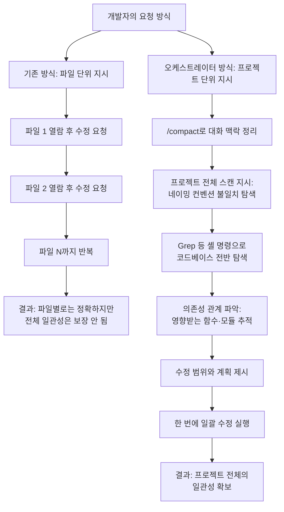

## 원문 출처와 핵심 주장

> 
> https://www.threads.com/@limautoz/post/DbHOfiHk2t0
> 
> Claude Code를 단순 구현 도구가 아니라 '전방위 리팩토링 오케스트레이터'로 써보라. 보통 파일 하나씩 수정 요청을 하지만, /compact로 컨텍스트를 정리한 뒤 "전체 프로젝트에서 네이밍 컨벤션이 일관되지 않은 부분을 전부 찾아내고, 영향 범위를 분석해서 한 번에 수정해줘"라고 던져보는 것이다.
> 
> 놀라운 점은 단순 치환이 아니라, 의존성 관계를 파악해 연쇄적으로 영향을 받는 함수들까지 추적해 수정 제안을 한다는 것이다. 특히 grep 같은 셸 명령어를 직접 실행하며 코드베이스 전반을 훑는 능력이 탁월하다. 파편화된 스타일 때문에 읽기 힘들었던 레거시 코드가 단 몇 분 만에 정돈된 상태로 변하는 경험은 정말 짜릿하다. 개별 함수 수정에 매몰되지 말고 프로젝트 전체의 일관성을 잡는 용도로 활용해보길 권한다.
> 
> ClaudeCode #AI코딩
> 

이 문서는 Threads 사용자 @limautoz가 올린 게시물(`threads.com/@limautoz/post/DbHOfiHk2t0`)의 내용을 바탕으로, Claude Code라는 도구를 어떻게 활용하면 좋은지 상세히 풀어 설명한다. 원문의 핵심 주장은 간단하다. Claude Code를 파일 하나씩 수정을 맡기는 단순 구현 도구로만 쓰지 말고, 프로젝트 전체를 조망하며 일관성을 잡아주는 오케스트레이터로 써보라는 제안이다. 구체적으로는 `/compact` 명령어로 대화 맥락을 정리한 뒤, "전체 프로젝트에서 네이밍 컨벤션이 일관되지 않은 부분을 전부 찾아내고, 영향 범위를 분석해서 한 번에 수정해줘"라는 식의 프로젝트 단위 지시를 던져보라는 것이 원문의 제안이다. 원문은 이 방식이 단순 문자열 치환에 그치지 않고, 함수 간 의존 관계를 파악해 연쇄적으로 영향을 받는 코드까지 추적해 수정안을 제시한다는 점, 그리고 `grep` 같은 셸 명령어를 직접 실행하며 코드베이스 전반을 훑어본다는 점을 특히 인상적인 부분으로 꼽고 있다.

## Claude Code란 무엇인가

먼저 배경 지식을 짚고 넘어갈 필요가 있다. Claude Code는 Anthropic이 만든 에이전틱 코딩 도구로, 개발자가 터미널이나 데스크톱 앱, 모바일 앱에서 Claude에게 코딩 작업을 위임할 수 있게 해주는 제품이다. 일반적인 코드 자동완성 도구와 다른 점은, Claude Code가 파일을 읽고 쓰는 것을 넘어 셸 명령어를 직접 실행하고, 테스트를 돌리고, 그 결과를 스스로 확인한 뒤 다음 행동을 결정하는 루프를 반복한다는 데 있다. 이런 구조 덕분에 "이 함수를 고쳐줘" 같은 국소적 요청뿐 아니라, 코드베이스 전체를 대상으로 하는 광범위한 작업도 수행할 수 있다.

2026년 상반기 들어 터미널 기반 AI 코딩 에이전트 시장은 크게 두 축으로 수렴하는 모습을 보이고 있다. 하나는 Anthropic의 Claude Code이고, 다른 하나는 OpenAI의 Codex다. 두 도구 모두 터미널 CLI를 중심에 두면서도 IDE, 웹, 클라우드, SDK까지 같은 엔진을 공유하는 방향으로 발전해왔으며, 헤드리스 모드를 통해 CI 파이프라인에 직접 연결되고 CLAUDE.md나 AGENTS.md, MCP 같은 방식으로 컨텍스트를 주고받는다. 원문 게시물의 제목이 "Claude Code vs. Codex"로 붙어 있는 것도 이런 시장 구도, 즉 두 도구가 실무 개발자들 사이에서 나란히 비교되는 상황을 배경으로 이해하면 자연스럽다. 다만 원문 본문 자체는 Codex와의 직접 비교를 다루지는 않고, Claude Code 하나의 활용법에 집중하고 있다는 점은 짚어둘 필요가 있다. Codex와의 비교는 이 문서 뒷부분에서 별도로 다룬다.

## 원문이 말하는 "오케스트레이터" 방식이란

원문에서 대비하고 있는 두 가지 사용 패턴을 정리하면 다음과 같다.

**기존 방식**: 개발자가 파일 하나를 열어보고, 문제를 발견하고, "이 파일의 이 부분을 고쳐줘"라고 요청한다. 이 과정을 파일마다 반복한다. Claude Code는 지시받은 범위 안에서만 작업하기 때문에, 결과물은 정확하지만 프로젝트 전체 관점에서 보면 파편적이다. 예를 들어 어떤 파일은 `camelCase`, 어떤 파일은 `snake_case`를 쓰는 상황이 방치되기 쉽다.

**오케스트레이터 방식**: 개발자가 개별 파일이 아니라 프로젝트 전체를 작업 단위로 지정한다. "네이밍 컨벤션이 일관되지 않은 부분을 전부 찾아내고, 영향 범위를 분석해서 한 번에 수정해줘"라는 지시가 대표적이다. 이때 Claude Code는 스스로 코드베이스를 탐색하고, 문제 지점을 찾아내고, 그 문제를 고쳤을 때 영향을 받는 다른 코드까지 역추적한 뒤, 수정 계획을 세우고 실행한다. 개발자는 개별 수정을 일일이 지시하는 대신, 큰 틀의 작업 목표만 던지고 Claude Code가 그 안에서 세부 작업을 스스로 조직하도록 맡기는 셈이다. "오케스트레이터"라는 표현은 바로 이 지점, 즉 Claude Code가 여러 개의 하위 작업을 스스로 계획하고 순서를 정해 처리한다는 의미에서 붙은 이름이다.

아래는 이 두 방식의 차이를 흐름도로 정리한 것이다.

## `/compact` 명령어가 하는 역할

원문에서 언급한 `/compact`는 Claude Code에 내장된 슬래시 명령어 가운데 하나로, 대화가 길어지면서 쌓인 맥락을 요약해 압축하는 기능을 한다. 세션이 길어져 컨텍스트 윈도가 가득 차면 `/compact`가 그동안의 대화 이력을 조밀한 요약으로 압축해주며, "인증 모듈과 현재 테스트 실패에 집중해줘" 같은 식으로 무엇을 남길지 방향을 지정하는 지시도 함께 전달할 수 있다.

이 기능이 필요한 이유는 이른바 "컨텍스트 부패(context rot)" 현상 때문이다. 대화가 길어질수록 AI의 응답 품질이 떨어지는 경험을 하게 되는데, 초반에는 정교한 코드를 생성하다가도 세션이 길어지면 버그가 있는 코드를 만들어내는 경우가 생긴다. 컨텍스트를 적절히 관리하지 않으면 추론 능력이 떨어져 복잡한 리팩토링이나 아키텍처 결정 과정에서 실수가 발생할 수 있다. 즉 `/compact`는 단순한 대화창 정리 기능이 아니라, 프로젝트 전체를 대상으로 하는 대규모 작업을 지시하기 전에 Claude Code의 "작업 기억"을 깨끗하게 만들어 판단력을 유지시키는 전처리 단계라고 이해하면 된다. 실전에서는 큰 작업 하나가 끝날 때마다, 혹은 대화 턴이 상당히 누적됐을 때 `/compact`를 실행하는 패턴이 권장되며, 다만 테스트가 실패한 상태에서 원인을 추적하는 도중처럼 직전 맥락이 반드시 필요한 시점에는 `/compact`를 피하고 대신 중요한 결정 사항을 별도 문서나 `CLAUDE.md` 파일에 기록해두는 방식이 함께 쓰인다.

## 왜 단순 치환이 아니라 "연쇄 추적"이 가능한가

원문에서 가장 강조하는 부분은 Claude Code가 이름만 바꾸는 문자열 치환에 그치지 않고, 특정 함수나 변수의 이름을 바꿨을 때 영향을 받는 다른 코드까지 추적해서 함께 수정 제안을 한다는 점이다. 이것이 가능한 이유는 Claude Code의 동작 방식 자체에 있다. Claude Code는 정해진 파일 목록을 순서대로 처리하는 스크립트가 아니라, 매 단계마다 다음에 무엇을 할지 스스로 판단하는 에이전트 루프로 동작한다. 코드를 읽다가 필요하면 `grep`이나 `find` 같은 셸 명령을 직접 실행해 특정 패턴이 코드베이스 어디에 흩어져 있는지 찾아내고, 그 결과를 바탕으로 "이 함수를 호출하는 곳이 몇 군데 더 있다"거나 "이 변수를 참조하는 다른 모듈이 있다"는 사실을 스스로 파악한다. 이렇게 파악한 의존 관계를 바탕으로 수정 범위를 넓혀가며 계획을 세우기 때문에, 결과적으로 사람이 일일이 연쇄 관계를 짚어주지 않아도 파급 효과를 반영한 수정이 이뤄지는 것처럼 보이게 된다.

실무에서 이런 방식을 쓸 때 도움이 되는 보조 장치도 함께 언급할 만하다. 프로젝트 루트에 두는 `CLAUDE.md` 파일에 코딩 컨벤션이나 아키텍처 원칙을 미리 적어두면, Claude Code가 대규모 리팩토링을 수행할 때 "무엇이 올바른 컨벤션인가"를 매번 새로 추론하지 않고 참조할 기준으로 삼을 수 있다. CLAUDE.md에는 프로젝트 특정 코딩 컨벤션, 아키텍처 패턴, 선호하는 라이브러리와 프레임워크, 코딩 표준을 담아두는 것이 권장되며, 이렇게 구성해두면 대화마다 일일이 설명하지 않아도 Claude Code가 프로젝트의 개발 철학을 이해할 수 있다. 또한 무턱대고 "다 고쳐줘"라고 지시하기보다, 먼저 계획 모드를 통해 수정 계획서를 받아본 뒤 실행 여부를 확인하는 중간 단계를 두면 의도치 않은 대규모 변경을 사전에 걸러낼 수 있다. 계획을 먼저 세우고 사용자가 방향을 확인한 뒤 실행하도록 하면, 오해가 코드에 반영되기 전에 미리 잡아낼 수 있다.

## 실전 워크플로우 정리

원문의 제안과 배경 지식을 종합하면, 프로젝트 전역 리팩토링을 Claude Code에 맡길 때의 실전 흐름은 대략 다음과 같이 정리된다.

먼저 지금까지의 대화가 길게 이어져 왔다면 `/compact`로 맥락을 정리한다. 중요한 아키텍처 결정이나 이번 리팩토링에서 반드시 지켜야 할 규칙이 있다면, 압축 전에 별도 문서나 `CLAUDE.md`에 미리 적어둔다. 그다음 "전체 프로젝트에서 무엇이 일관되지 않은지 찾아내고, 영향 범위를 분석해서 수정해줘"처럼 프로젝트 단위의 목표를 명확하게 던진다. 이때 무엇을 그대로 두고 무엇을 바꿔야 하는지 판단 기준이 있다면 함께 제시하는 편이 결과의 정확도를 높인다. Claude Code가 탐색과 계획을 마치면, 실제로 파일을 고치기 전에 수정 범위와 계획을 먼저 검토하는 것이 안전하다. 특히 계획 모드를 켜두면 실행 전에 사람이 방향을 확인할 기회를 가질 수 있다. 마지막으로 실행이 끝나면 실제 diff를 검토하고 테스트를 돌려 결과를 확인하는 것은 여전히 사람의 몫으로 남는다.

## Claude Code와 Codex, 무엇이 다른가

"Claude Code vs. Codex" 두 도구의 현재 차이점도 함께 짚어본다. 2026년 상반기 기준으로 두 도구는 철학이 뚜렷하게 갈린다. Claude Code와 Codex는 헤드리스 모드로 CI에 바로 연결되고 CLAUDE.md·AGENTS.md·MCP로 컨텍스트를 주고받는다는 공통점이 있지만, 세부 구현과 강점은 다르다. Codex의 권장 기본 모델은 2026년 4월 23일 출시된 GPT-5.5이며, 약 1.05M 토큰 컨텍스트와 낮은 단계부터 매우 높은 단계까지 조절 가능한 추론 강도를 지원한다. Codex CLI는 오픈소스로 공개되어 있고 코드베이스의 대부분이 Rust로 작성되어 속도와 효율을 강조하는 것이 특징이며, OS 수준의 샌드박싱과 로컬-클라우드 간 작업 위임이 핵심 차별점으로 꼽힌다. 독립적인 리뷰들이 가장 일관되게 지적하는 Codex의 강점은 토큰 효율이며, 한 벤치마크에서는 동일 작업에 Claude 대비 약 4분의 1 수준의 토큰만 사용했다는 보고도 있다.

반면 Claude Code는 복잡한 프로젝트나 장문의 맥락을 다루는 실무 코딩 작업에서 강점을 보인다는 평가가 많다. 여러 도구를 실무에서 수개월간 사용해본 결과를 종합하면, 복잡한 프로젝트를 맡길 때는 Claude Code를, 빠른 실험과 탐색에는 Gemini CLI를, 안전한 자동화 파이프라인 구축에는 Codex를 선택하는 경향이 뚜렷하게 나타난다. 가격 구조에도 차이가 있다. 2026년 7월 기준으로 Codex는 ChatGPT의 Free 요금제를 포함한 여러 유료 요금제에 포함되어 제공되지만 사용 한도는 요금제마다 다르며, Claude Code는 기본적으로 별도 결제가 필요한 유료 도구로, 무료 Claude 채팅과는 별개로 본격적인 사용을 위해서는 유료 요금제가 필요하다.

두 도구의 차이를 표로 정리하면 다음과 같다.

| 구분 | Claude Code | Codex |
|---|---|---|
| 개발사 | Anthropic | OpenAI |
| 핵심 강점으로 꼽히는 영역 | 복잡한 프로젝트의 코드 이해와 대규모 리팩토링 | 토큰 효율, 자동화 파이프라인의 안전성 |
| 기본 실행 환경 | 터미널 CLI, 데스크톱·모바일 앱, SDK | 터미널 CLI(오픈소스), 클라우드, 데스크톱 앱 |
| 컨텍스트 관리 명령 | `/compact`, `/clear`, `/context` 등 | 자체 세션 관리 및 클라우드 태스크 관리 |
| 요금 구조 | 유료 요금제 중심 | ChatGPT 요금제에 포함, Free 요금제에서도 제한적 사용 가능 |

다만 이런 비교는 시점에 따라 빠르게 달라질 수 있다는 점을 유념해야 한다. 요금제, 무료 한도, 벤치마크 수치는 자주 바뀌기 때문에 실제 도입 전에는 반드시 공식 문서를 함께 확인하는 것이 좋다. 원문 게시물 자체가 특정 도구의 우열을 가리는 글이 아니라 Claude Code 하나를 깊이 있게 활용하는 법을 다루고 있다는 점에서, 이 비교표는 원문의 제목이 암시하는 맥락을 보완하기 위한 참고 자료로 이해하는 것이 정확하다.

## 참고할 만한 주의사항

프로젝트 전역 리팩토링을 에이전트에게 맡길 때 생기기 쉬운 위험도 함께 짚어둘 필요가 있다. "인증 시스템을 리팩토링해줘"처럼 추상적인 지시를 내리면, 에이전트가 요청자의 의도를 자의적으로 해석해 예상치 못한 범위까지 손을 댈 수 있다. 실제로 인증 시스템 리팩토링을 요청받은 에이전트가 "보안 강화"를 자의적으로 2FA 도입으로 해석해, 세션 관리와 에러 처리, UI까지 모두 2FA를 전제로 고쳐버린 뒤에야 사용자가 결과를 확인하고 되돌려야 했던 사례가 보고된 바 있다. 따라서 원문이 제안하는 "네이밍 컨벤션 통일"처럼 비교적 범위가 명확한 작업부터 오케스트레이터 방식을 적용해보고, 점차 더 복잡한 작업으로 확장해가는 편이 안전하다. 또한 아무리 계획을 잘 세워도 최종적으로 코드와 테스트를 검토하는 책임은 여전히 사람에게 있다는 점은 변하지 않는다.

## 요약

이 게시물이 전하는 메시지는 결국 하나로 모인다. Claude Code를 "이 파일 고쳐줘"라는 국소적 지시의 반복 도구로만 쓰면 그 능력의 일부만 쓰는 셈이다. 대화 맥락을 `/compact`로 정리한 뒤 프로젝트 전체를 작업 단위로 던지면, Claude Code는 셸 명령을 직접 실행해 코드베이스를 탐색하고 의존 관계를 추적하면서 사람이 일일이 지시하지 않아도 파급 효과까지 반영한 수정안을 만들어낼 수 있다. 다만 이 힘을 안전하게 쓰려면 계획을 먼저 검토하는 단계를 두고, `CLAUDE.md` 같은 문서로 판단 기준을 미리 제공하며, 최종 결과는 반드시 사람이 확인하는 절차가 함께 따라야 한다.

---

*출처: Threads @limautoz 게시물(threads.com/@limautoz/post/DbHOfiHk2t0) 및 관련 웹 검색 자료 종합*
*작성일: 2026년 7월 24일*
