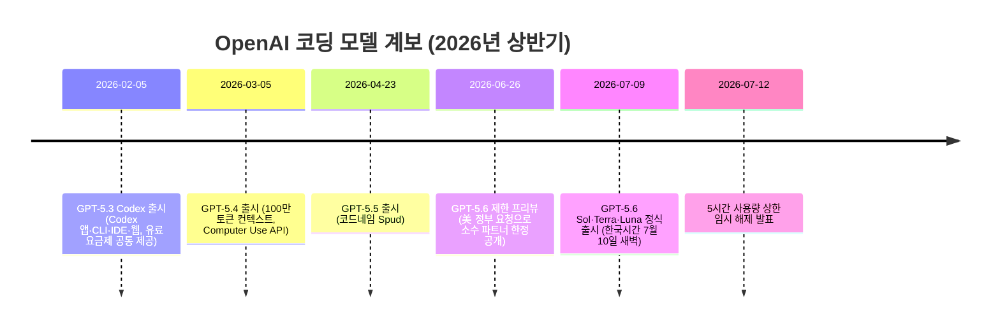
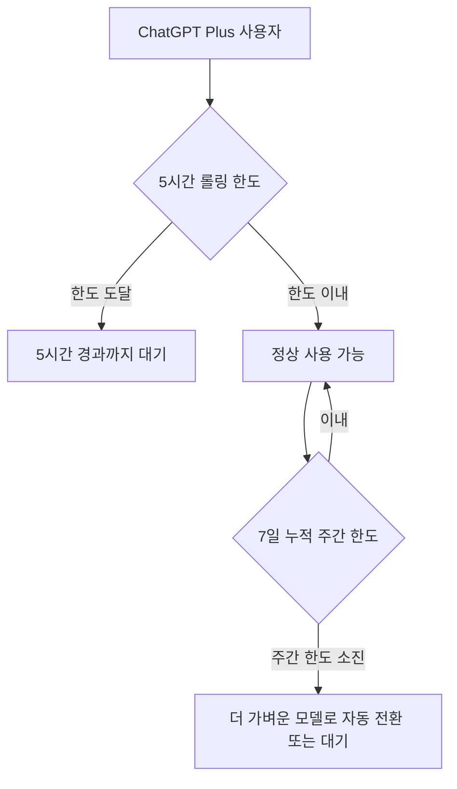

- **분석 대상 원문**: Threads, @apptility.io, 2026년 7월 (https://www.threads.com/@apptility.io/post/DbIvRIpkvBy)
- **문서 작성일**: 2026년 7월 24일
- **작성 방식**: 원문의 세 가지 주장을 각각 최신 공개 자료로 검증하고, 확인된 사실과 확인되지 않은 개인 체감을 구분하여 서술

```
올해 2월부터 GPT 원툴로 갔는데 다시 클로드와 이도류 복귀했습니다.

1. Plus로는 사용량이 감당이 안 됩니다.
GPT 5.3 Codex 시절에는 Plus 요금제로
넉넉하진 않아도 '약간 모자란가?'하는 정도였는데,
5.4를 기점으로 아껴써야 하는 수준이더니,
5.6에 와서는 2일만에 일주일치를 전부 썼습니다.
(하루 3-4시간 작업 기준)

2. 5.6이 제가 쓰던 방식과 잘 안 맞는지 성능이 오히려 떨어진 느낌
코드 컨벤션과 모델링을 빡빡하게 하는 편이라서
프로그래밍 규칙 문서를 만든 후,
규칙에 따라 코드를 분석하도록 스킬을 만들어서 쓰고 있었습니다.
그런데 5.6부터는 규칙 문서를 하나도 안 보는 건지
코드 리뷰를 시켜도 규칙 얘기는 하나도 안 하고
일반론적인 얘기만 하네요.

3. 클로드가 디자인을 훨씬 잘합니다.
앱의 UI가 영 아쉬워서 개선점을 찾아달라고 했습니다.
분석은 GPT와 클로드가 비슷하게 잘했습니다.
GPT가 좀 더 나은 부분도 있었고요.
그런데 실제 화면을 그려보라고 헀더니
GPT는 밤티도 이런 밤티가 없습니다.
이건 추후 다시 리뷰하는 것으로...
```


---

## 1. 이 글이 말하는 것

글쓴이는 올해(2026년) 2월부터 OpenAI 제품군만 쓰는 "원툴" 체제로 전환했다가, 최근 다시 클로드를 함께 쓰는 "이도류" 체제로 돌아왔다고 밝힌다. 그 이유로 세 가지를 든다.

첫째, ChatGPT Plus 요금제의 사용량이 감당되지 않는다는 점이다. GPT-5.3 Codex 시절에는 다소 빠듯한 정도였는데, GPT-5.4 무렵부터 아껴 써야 하는 수준이 되었고, GPT-5.6에 이르러서는 하루 서너 시간 작업 기준으로 이틀 만에 일주일치 사용량을 전부 소진했다는 것이다.

둘째, GPT-5.6이 자신의 작업 방식과 맞지 않는지 체감 성능이 오히려 떨어졌다는 점이다. 코드 컨벤션과 모델링 규칙을 문서로 만들어두고 그 규칙에 따라 코드를 검토하도록 스킬을 구성해 썼는데, GPT-5.6부터는 규칙 문서를 참고하지 않는 것처럼 코드 리뷰를 시켜도 일반론적인 이야기만 한다는 것이다.

셋째, 디자인 실무에서는 클로드가 확실히 낫다는 점이다. 앱 UI 개선점을 분석하도록 시켰을 때는 GPT와 클로드가 비슷하게 잘했고 오히려 GPT가 나은 부분도 있었지만, 실제 화면을 그려보라고 하자 결과물의 완성도 차이가 컸다고 전한다.

이 세 가지는 모두 한 사람의 실무 체감이며, 공식 통계나 대규모 조사 결과가 아니다. 아래에서는 각 주장을 뒷받침하거나 반박할 수 있는 공개된 자료를 찾아 대조했다.

---

## 2. 먼저 시간 순서부터: 글에 등장하는 모델들은 언제 나왔나

글에서 언급되는 GPT-5.3 Codex, GPT-5.4, GPT-5.6은 모두 2026년 상반기에 몇 주 간격으로 연달아 출시된 모델들이다. 이 촘촘한 출시 간격 자체가 사용자 체감에 영향을 준 배경이므로, 먼저 공식적으로 확인된 출시일을 정리한다.



GPT-5.3 Codex는 OpenAI가 2026년 2월 5일 공개했으며, 공식 발표문에는 이 모델이 Codex를 쓸 수 있는 모든 경로, 즉 앱·CLI·IDE 확장·웹에서 유료 ChatGPT 요금제 전반에 제공된다고 명시되어 있다. 즉 글쓴이가 이 시기에 Plus 요금제로 사용했다는 서술은 공식 배포 방식과 어긋나지 않는다.

GPT-5.4는 2026년 3월 5일 출시되었고, 100만 토큰 컨텍스트와 화면을 보고 직접 조작하는 Computer Use API가 새로 들어갔다. 이 무렵부터 사용량이 빠듯해졌다는 체감은, 모델이 더 무거워지고(추론에 쓰는 연산량 증가) 기능이 늘어난 시점과 겹친다.

GPT-5.6은 조금 특이한 출시 과정을 거쳤다. 2026년 6월 26일 OpenAI는 Sol(플래그십)·Terra(균형형)·Luna(경량형) 세 모델로 구성된 GPT-5.6을 공개했지만, 미국 정부의 요청에 따라 곧바로 전면 공개하지 않고 약 20개 신뢰 파트너 기관에만 제한적으로 먼저 배포했다. 이는 트럼프 행정부가 신모델 출시 전 정부 사전 제출을 요구하는 행정명령에 서명한 데 따른 조치로 보도되었다. 정부 안전성 검토가 끝난 뒤 2026년 7월 9일(한국시간 7월 10일 새벽) 일반 사용자 대상 정식 출시가 이루어졌다.

---

## 3. 첫 번째 주장 검증 — "Plus로는 사용량이 감당 안 된다"

이 부분은 글쓴이만의 특이한 경험이 아니라, GPT-5.6 Sol 출시 직후 한국과 해외 커뮤니티에서 공통적으로 보고된 현상과 정확히 일치한다.

Codex 계열 도구의 사용량 한도는 두 층으로 겹쳐 있다. 하나는 5시간 단위로 돌아가는 "롤링(rolling) 한도"이고, 다른 하나는 7일 단위로 누적되는 "주간 한도"다. 로컬 대화창에서 쓰는 메시지와 클라우드에서 오래 도는 에이전트 작업이 같은 한도를 함께 소모하는 구조이기 때문에, 복잡한 코딩·에이전트 작업에 모델을 투입할수록 이 한도에 빨리 도달한다.



GPT-5.6 Sol이 정식 출시된 직후, 고난도 코딩·에이전트 작업에 이 모델을 쓰던 유료 이용자들 사이에서 순식간에 5시간 상한에 도달했다는 불만이 이어졌다. 이는 국내 매체 보도로도 확인된다. 결국 OpenAI는 출시 사흘 만인 2026년 7월 12일, Plus·Pro·Business 요금제에 한해 5시간 단위 사용량 상한을 일시적으로 해제하고 사용량을 한 차례 초기화했다. 다만 이 조치는 어디까지나 임시 완화였고, 7일 단위 주간 한도는 그대로 유지되었다. OpenAI 역시 이것이 "무제한 제공"을 뜻하지 않는다고 선을 그었다.

즉 글쓴이가 "플러스인데 반나절이면 주간 한도 소모"라고 표현한 상황은, 다음 세 가지가 겹쳐서 벌어진 것으로 볼 수 있다.

- GPT-5.6 Sol은 이전 세대보다 연산 비용이 큰 최상위 모델이라 같은 요금제라도 소모되는 한도량 자체가 크다.
- 로컬 채팅과 클라우드 에이전트 작업이 하나의 한도를 공유하는 구조라, 코딩처럼 도구 호출이 많은 작업에서 한도 소모가 특히 빠르다.
- 출시 초기 정책 자체가 불안정해서, OpenAI가 며칠 만에 정책을 바꿀 정도로 실제 이용자 경험이 나빴다.

정리하면, 이 주장은 언론 보도와 공식 정책 변경 이력으로 뒷받침되는, 신뢰도가 높은 관찰이다. 다만 7월 12일 이후에는 5시간 상한이 임시로 풀린 상태이므로, 글쓴이가 겪은 "이틀 만에 일주일치 소진"은 그 이전, 즉 7월 9~12일 사이의 경험일 가능성이 높다. 이 임시 완화 조치가 언제까지 유지될지는 OpenAI가 공지하지 않았다.

---

## 4. 두 번째 주장 검증 — "5.6이 규칙 문서를 안 읽는 느낌"

이 항목은 세 주장 중 가장 검증이 어렵다. 글쓴이가 말하는 것은 벤치마크 점수가 아니라 "본인이 만든 프로그래밍 규칙 문서를 참고하는지"에 대한 주관적 체감이기 때문에, 이를 직접 확인해줄 공식 통계나 재현 실험은 찾을 수 없었다. 다만 이 체감을 완전히 근거 없는 이야기로 치부하기 어려운 두 가지 정황이 있다.

첫째, OpenAI 모델이 새 버전으로 바뀔 때마다 이전 버전에서 잘 작동하던 커스텀 지침이나 프로젝트 규칙 문서의 준수 방식이 달라지는 현상은 GPT-5 계열 전체에서 반복적으로 보고되어 온 패턴이다. 한 실무자는 GPT-5로 넘어간 뒤 기존 Custom GPT와 프로젝트 지침이 미묘하게 다르게 작동하기 시작했다고 지적하며, 이를 여러 하위 모델로 요청을 나눠 보내는 라우팅 구조나 내부 파라미터 변화로 추정했다. 이는 GPT-5.6에 국한된 이야기는 아니지만, "모델을 새로 올릴 때마다 규칙 문서 반영 방식이 달라질 수 있다"는 배경 자체는 이 계열에서 낯선 일이 아님을 보여준다.

둘째, 에이전트가 저장소에 있는 규칙 문서(흔히 `AGENTS.md`로 불리는 파일)를 실제로 읽고 지키는지에 대한 불만은 특정 회사 모델에 한정되지 않고 여러 최신 모델에서 함께 제기된 바 있다. 한 개발 도구의 이슈 트래커에는 GPT-5.5를 포함한 여러 최신 모델이 열 번 중 아홉 번은 규칙 문서를 아예 읽지 않거나, 읽고도 지키지 않는 것처럼 보인다는 보고가 올라와 있다. 이는 GPT-5.6이 아니라 GPT-5.5 시점의 사례이지만, "긴 규칙 문서를 만들어두고 지켜지길 기대하는" 실무 패턴 자체가 최근 에이전트형 코딩 도구들의 공통적인 취약점일 수 있다는 정황이다.

정리하면, 글쓴이의 두 번째 주장은 검증된 사실이라기보다 "재현 가능성이 있는 하나의 실무 사례"로 보는 것이 정확하다. 다만 이 사례가 완전히 고립된 이야기는 아니며, 모델 세대 전환기마다 커스텀 지침 준수 방식이 달라지고 규칙 문서가 충분히 반영되지 않는 사례가 반복되어 왔다는 더 큰 맥락 위에 놓여 있다. 참고로 이런 현상은 흔히 두 층위로 나눠 볼 수 있다. 모델이 얼마나 똑똑하게 판단하는지(판단 능력)와, 그 판단을 실행에 옮기기 전에 정해진 규칙 문서를 실제로 불러와 반영하는지(실행 단계의 충실도)는 서로 다른 문제다. 벤치마크 점수가 오른 것과, 사용자가 지정한 프로젝트 규칙을 매 세션 빠짐없이 불러와 지키는 것은 별개로 움직일 수 있다는 뜻이다.

---

## 5. 세 번째 주장 검증 — "클로드가 디자인을 훨씬 잘한다"

이 부분은 상대적으로 풍부한 교차 검증 자료가 있다. 결론부터 말하면, "클로드가 항상 압도적으로 낫다"는 식의 일방적 우위는 최근 비교 자료들에서 확인되지 않지만, "겉보기엔 비슷해 보여도 실제 화면을 뽑아보면 결과물의 완성도 차이가 드러난다"는 글쓴이의 관찰과 상당히 비슷한 결론을 낸 독립적인 비교 글이 존재한다.

한 마케팅 뉴스레터 운영자는 GPT-5.6 Sol(Extra High 추론)과 Claude Fable 5(Max 모드)에 동일한 지시문을 주고 다섯 가지 과제를 나란히 시켜보았다. 포트폴리오 웹사이트 제작과 보이젤(voxel) 세계 비행 시뮬레이션 제작에서는 두 모델이 우열을 가리기 어려운 무승부로 평가되었고, GTA 6 콘셉트의 3D 오픈월드 제작에서는 클로드 쪽이 더 보기 좋은 결과를, GPT 쪽이 더 완성도 높게 동작하는 결과를 내놓아 이 역시 무승부에 가까웠다. 인포그래픽 제작에서도 두 모델은 비슷한 수준으로 평가되었다.

다만 다섯 개 과제 중 유일하게 확실한 승부가 갈린 지점이 있었는데, 바로 피치덱(발표 자료) 제작이었다. "뻔한 스톡 사진 느낌은 피해달라"는 요청을 명시적으로 넣었음에도, GPT-5.6은 오히려 전형적인 기업용 스톡 사진 느낌의 결과물을 내놓았고, 클로드는 그 요청을 실제로 반영한 결과물을 만들어 확실한 우위를 보였다고 이 글은 전한다. 이는 글쓴이가 앱 UI를 그려보라고 했을 때 클로드가 눈에 띄게 나았다고 말한 지점과 결이 비슷하다. 즉 "분석"이나 "설명" 수준에서는 두 모델의 차이가 작지만, 지시문에 담긴 미묘한 취향이나 제약 조건(예: 상투적인 느낌을 피해달라)을 실제 화면 결과물에 반영하는 능력에서는 차이가 더 크게 드러난다는 것이다.

이런 경향은 다른 자료에서도 뒷받침된다. 한 기술 칼럼은 GPT-5.6 발표에서 정작 주목해야 할 부분은 벤치마크 점수가 아니라 "기본값 UI 결과물"이라고 짚으며, 스타일 지침을 거의 주지 않았을 때 모델이 어떤 시각적 선택을 하는지가 실무에서는 더 중요하다고 설명한다. 이 글은 AI가 만드는 화면에서 흔히 나타나는 문제를 "틀린 디자인"이 아니라 "너무 익숙한 디자인"이라고 표현한다. 파란색 그러데이션, 둥근 모서리 카드, 3단 기능 소개, 과한 그림자처럼 그럴듯하지만 어디서나 본 듯한 조합이 반복되는 현상으로, 이런 결과물이 실제로는 작동은 하지만 제품의 맥락이나 브랜드, 사용자 문제를 충분히 반영하지 못한 평균적인 산출물에 그친다는 지적이다. 이 글에 따르면 GPT-5.5 UI 테스트에서도 비슷한 한계가 지적된 바 있어, 특정 한 번의 우연이라기보다 반복적으로 관찰되어 온 경향으로 보인다.

한편 좀 더 폭넓은 비교 자료에서는 클로드가 코딩과 개발자 도구 생태계에서, GPT 계열이 이미지 생성과 컴퓨터 사용(화면 조작) 영역에서 각각 강점을 보인다는 평가도 함께 나온다. 즉 "디자인"이라는 말이 무엇을 가리키는지에 따라 결론이 갈릴 수 있다. 이미지 자체를 그리는 능력을 말한다면 GPT 계열도 강점이 있다는 평가가 있지만, 실제 동작하는 화면(웹페이지·앱 UI·발표 자료)을 코드로 짜서 완성도 있게 뽑아내는 작업에서는 클로드 쪽 결과물이 더 낫다는 평가가 최근 여러 비교 글에서 공통적으로 나타난다. 글쓴이가 말한 "앱 화면을 그려보라고 했더니" 역시 이미지 생성이 아니라 실제 동작하는 UI 화면을 만드는 작업에 해당하므로, 이 갈래의 비교와 맥락이 일치한다.

---

## 6. 세 주장 종합 평가

| 주장 | 근거 자료의 성격 | 평가 |
|---|---|---|
| ① Plus 요금제 사용량 감당 불가, GPT-5.6에서 급격히 악화 | 국내 언론 보도 + OpenAI의 실제 정책 변경(7월 12일 임시 완화) | 다수의 독립적 보도로 뒷받침되는, 신뢰도 높은 관찰 |
| ② GPT-5.6이 규칙 문서를 반영하지 않는 느낌 | 글쓴이 개인의 단일 체감 + GPT-5 계열 전반의 커스텀 지침 변동 사례, 타사 이슈 트래커의 유사 불만 | 검증되지 않은 개인 사례이나, 근거 없는 이야기는 아니며 더 큰 패턴과 궤를 같이함 |
| ③ 클로드가 디자인(실제 화면 제작)에서 더 낫다 | 동일 조건 비교 리뷰(무승부 다수, 피치덱은 클로드 우위) + 별도의 "기본값 UI" 분석 글 | 절대적 우위는 아니지만, 클로드가 명시적 취향·제약을 화면에 반영하는 데 더 강하다는 독립적 관찰과 일치 |

세 주장을 관통하는 공통점은, 사용자가 겪는 어려움이 모델의 "추론 능력" 자체보다 그 능력을 실제 작업 환경에서 안정적으로 써먹을 수 있게 해주는 부분, 즉 사용량 정책·규칙 문서 반영·세부 제약 준수 같은 지점에서 발생하고 있다는 것이다. 벤치마크 점수가 아무리 높아도, 하루 서너 시간 쓰다가 이틀 만에 막히거나 미리 정해둔 규칙을 매번 다시 설명해야 한다면 실무자 입장에서는 체감 생산성이 떨어질 수밖에 없다.

---

## 7. 참고: 2026년 7월 현재 두 회사의 모델 라인업

글에서는 "클로드"라고만 지칭하고 있어 구체적으로 어떤 모델을 썼는지는 알 수 없지만, 참고로 2026년 7월 기준 두 회사의 코딩·에이전트용 최상위 모델 라인업은 다음과 같다.

**OpenAI**: GPT-5.6 Sol(플래그십, 최고난도 추론·에이전트용), Terra(균형형), Luna(경량형) 3단 구성. Sol은 2026년 7월 9일 미국 정부 안전성 검토를 거쳐 정식 출시되었다.

**Anthropic**: Claude Fable 5(신규 최상위 모델)와 그 아래 Opus 4.8, Sonnet 5, Haiku 4.5로 구성. Fable 5와 같은 세대의 Claude Mythos 5는 일반 사용자에게는 공개되지 않고 소수의 신뢰 기관을 대상으로 한 Project Glasswing을 통해서만 제공되고 있다. 두 모델은 2026년 6월 9일 출시되었으나, 미국 상무부의 수출 통제 지침에 따라 6월 12일부터 6월 30일까지 일시적으로 접근이 중단되었다가 7월 1일 복구된 바 있다.

---

## 8. 팩트체크 부록 — 근거 등급 표시

이 문서에서 사용한 자료는 신뢰도에 따라 세 등급으로 나눌 수 있다.

**1등급 (공식 1차 자료)**: OpenAI 공식 발표문(GPT-5.3-Codex 소개 글), OpenAI Help Center의 모델 출시 노트, ChatGPT 공식 요금제 페이지.

**2등급 (복수 매체의 교차 보도)**: ZDNet Korea의 GPT-5.6 제한 배포 보도, 나무위키·위키백과의 모델별 출시일 정리(각각 언론 보도를 각주로 인용), GPT-5.6 5시간 한도 임시 해제 관련 국내 매체 보도, gpters.org의 GPT-5.6 요금제·한도 정리 글.

**3등급 (단일 출처 또는 개인 체감·리뷰)**: 분석 대상인 Threads 원문 자체, Charlie Hills의 개인 비교 리뷰(MarTech AI 뉴스레터), Tilnote의 "기본값 UI" 분석 칼럼, GitHub 이슈 트래커의 개별 이용자 불만, GPT-5 커스텀 지침 변화에 대한 개인 블로그 글.

이 문서의 2절·3절 서술은 1·2등급 자료를 기반으로 하며, 4절과 5절의 상당 부분은 3등급 자료, 즉 검증되지 않은 개인 리뷰나 체감에 근거하고 있다는 점을 분명히 밝힌다. 특히 4절의 "규칙 문서 미반영" 현상은 이 문서 작성 시점 기준으로 GPT-5.6에 대한 공식적인 확인이나 대규모 재현 실험이 존재하지 않으므로, 하나의 가능성 있는 실무 사례로만 받아들여야 한다.

---

## 9. 한국어 용어 정리

| 용어 | 설명 |
|---|---|
| 이도류(二刀流) | 원래 검을 양손에 하나씩 쥐고 싸우는 검술을 뜻하는 일본어에서 온 말로, 여기서는 GPT와 클로드 두 도구를 함께 병행해 쓰는 방식을 가리킴 |
| Codex | OpenAI의 코딩 에이전트 도구로, ChatGPT 앱·CLI·IDE 확장·웹 등 여러 형태로 제공됨 |
| Sol / Terra / Luna | GPT-5.6의 세 가지 등급. Sol이 최상위 플래그십, Terra가 균형형, Luna가 경량·저비용형 |
| 5시간 롤링 한도 | 특정 시점부터 5시간 동안 누적되는 사용량 상한. 5시간이 지나면 다시 초기화됨 |
| 주간(Weekly) 한도 | 7일 단위로 누적되는 별도의 사용량 상한. 5시간 한도와 별개로 존재함 |
| AGENTS.md | 코딩 에이전트에게 프로젝트별 규칙·컨벤션을 알려주기 위해 저장소에 두는 지침 문서의 관용적 파일명 |
| AI 슬랍(AI slop) | AI가 만들어내는, 작동은 하지만 어디서나 본 듯한 평균적이고 상투적인 결과물을 가리키는 표현 |
| Project Glasswing | Anthropic이 Claude Mythos 5를 소수의 신뢰 기관에 한해 제공하는 프로그램 |

---

## 10. 참고 문헌

- OpenAI, "Introducing GPT-5.3-Codex" (공식 발표), https://openai.com/index/introducing-gpt-5-3-codex/
- OpenAI Help Center, "모델 출시 노트", https://help.openai.com/ko-kr/articles/9624314-model-release-notes
- ChatGPT 공식 요금제 페이지, https://chatgpt.com/pricing/
- ZDNet Korea, "오픈AI, GPT-5.6 출시…미국 정부 요청에 제한 배포" (2026.06.27), https://zdnet.co.kr/view/?no=20260627102728
- 위키백과, "GPT-5.6", https://en.wikipedia.org/wiki/GPT-5.6
- 위키백과, "GPT-5.5", https://en.wikipedia.org/wiki/GPT-5.5
- 위키백과, "GPT-5.3-Codex", https://en.wikipedia.org/wiki/GPT-5.3-Codex
- PyTorchKR, "OpenAI, 컴퓨터 사용(CUA) 능력 개선 및 1M 토큰의 컨텍스트를 지원하는 전문가용 모델 GPT-5.4 출시", https://discuss.pytorch.kr/t/openai-cua-1m-gpt-5-4/9155
- emergent.sh, "GPT-5.6 Release Date: When You Can Actually Use It", https://emergent.sh/news/gpt-5-6-release-date
- gpters.org, "GPT-5.6 총정리, Sol·Terra·Luna 차이와 가격 그리고 출시일", https://www.gpters.org/news/post/gpt-5-6-congjeongri-sol-terra-luna-caiwa-gagyeog-geurigo-culsiil-upwr6pid2KPOsVn
- gpters.org, "GPT-5.6 Sol, 내 요금제에서 쓸 수 있을까?", https://www.gpters.org/news/post/gpt-5-6-sol-nae-yogeumjeeseo-sseul-su-isseulgga-muryo-beomwibuteo-5sigan-DmZLDUpmAgClpX5
- Yellow.com, "오픈AI, 유료 이용자 대상 GPT-5.6 Sol '5시간 제한' 전격 해제", https://yellow.com/ko/news/%EC%98%A4%ED%94%88ai-%EC%9C%A0%EB%A3%8C-%EC%9D%B4%EC%9A%A9%EC%9E%90-%EB%8C%80%EC%83%81-gpt-56-sol-%E2%80%985%EC%8B%9C%EA%B0%84-%EC%A0%9C%ED%95%9C%E2%80%99-%EC%A0%84%EA%B2%A9-%ED%95%B4%EC%A0%9C
- Charlie Hills, "Claude 5 vs ChatGPT 5.6", MarTech AI (Substack, 2026.07.12), https://charliehills.substack.com/p/claude-5-vs-chatgpt-56
- Tilnote, "GPT-5.6의 '덜 AI스러운 UI'를 어떻게 봐야 할까", https://tilnote.io/en/pages/6a11fa8f7a4792af38ab6c6b
- NxCode, "Claude vs ChatGPT 2026: We Tested Both — Here's the Winner", https://www.nxcode.io/resources/news/claude-vs-chatgpt-2026-which-ai-to-use
- GitHub, anomalyco/opencode, Issue #29329 "Not respecting AGENTS.md", https://github.com/anomalyco/opencode/issues/29329
- Francesco Di Filippo, "Warning: GPT-5 may change the behavior of Custom GPTs and prompts" (Substack), https://francescodifilippo.substack.com/p/warning-gpt-5-may-change-the-behavior
- 나무위키, "Codex" 항목, https://namu.wiki/w/Codex
- 나무위키, "GPT-5" 항목, https://namu.wiki/w/GPT-5
- Anthropic, "Claude Fable 5·Mythos 5 접근 관련 공지", https://www.anthropic.com/news/fable-mythos-access
