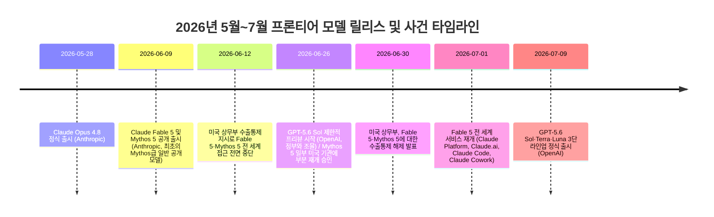
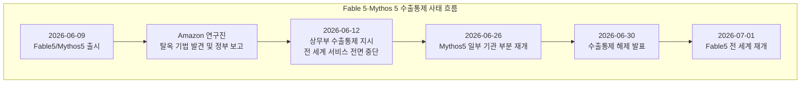
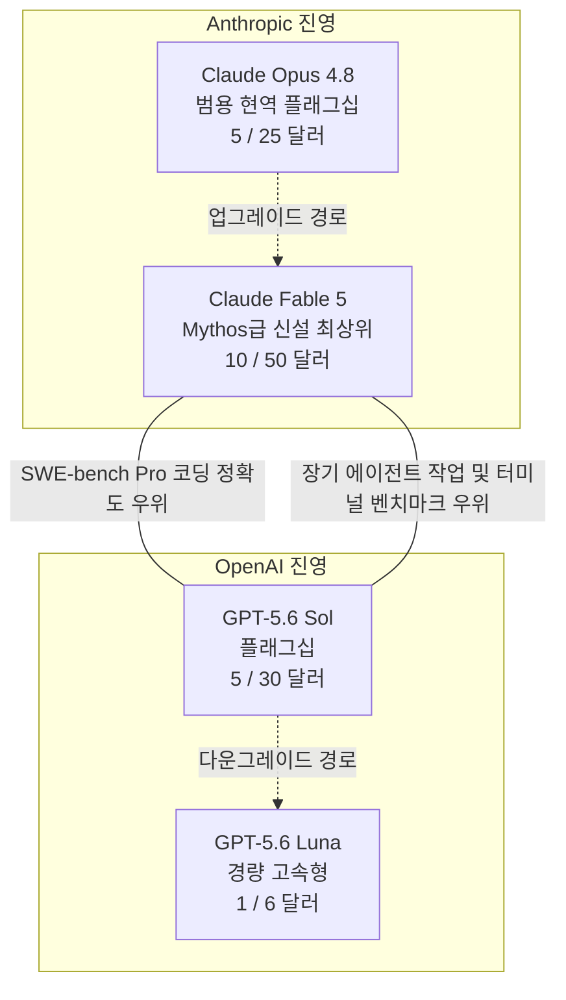

## 관련글 

[**AI 추론 모델 종합 비교 리포트**](https://k82022603.github.io/posts/ai-%EC%B6%94%EB%A1%A0-%EB%AA%A8%EB%8D%B8-%EC%A2%85%ED%95%A9-%EB%B9%84%EA%B5%90-%EB%A6%AC%ED%8F%AC%ED%8A%B8/)

## 들어가며: 왜 지금 "추론 모델"이 화두인가

공유해주신 스레드 게시물(@limautoz, threads.com)의 요지는 최근 AI 업계에서 반복적으로 등장하는 핵심 주장과 정확히 일치한다. 과거의 언어 모델은 학습된 패턴을 근거로 가장 그럴듯한 답을 즉시 내놓는 방식에 가까웠지만, 최신 세대 모델들은 답을 내기 전에 스스로 계획을 세우고, 여러 풀이 경로를 시험해보고, 그 결과를 검토한 뒤 최종 답을 선택하는 과정을 거친다. 게시물이 든 비유처럼, 문제를 보자마자 답을 찍던 학생이 이제는 연습장에 풀이 과정을 적어가며 스스로 검산하는 학생으로 바뀐 셈이다. 다만 해당 게시물 자체는 threads.com의 로봇 배제 정책(robots.txt)으로 인해 본 문서 작성 과정에서 직접 열람할 수 없었고, 사용자가 전달해주신 게시물 원문 텍스트를 근거로 인용했음을 밝혀둔다.

이 서술형 프레임을 실제 데이터로 검증할 수 있는 가장 좋은 사례가 2026년 5월부터 7월 사이에 연이어 출시된 네 개의 모델, 즉 Anthropic의 Claude Opus 4.8과 Claude Fable 5, 그리고 OpenAI의 GPT-5.6 Sol과 GPT-5.6 Luna다. 이 넷은 모두 사고 과정(reasoning)에 더 많은 토큰과 시간을 쓰도록 설계된 모델이며, 동시에 "얼마나 깊이 생각하게 할 것인가"를 사용자가 직접 조절할 수 있는 옵션(effort 레벨, fast/ultra 모드 등)을 제공한다는 공통점이 있다. 아래에서는 각 모델의 출시 배경, 스펙, 벤치마크 성적, 가격 구조를 확인된 사실 위주로 정리하고, 어디까지가 벤더의 자체 발표이고 어디부터가 제3자 검증인지를 구분해서 서술한다.

---

## 1. 네 모델의 기본 신상 정보

먼저 각 모델이 언제, 어떤 이름으로, 어떤 조건으로 나왔는지부터 짚고 넘어가야 한다. 특히 Fable 5는 출시 직후 사흘 만에 미국 정부의 수출통제 조치로 전 세계 서비스가 중단되었다가 약 19일 뒤 복원된 이력이 있어서, 단순한 스펙표보다 타임라인으로 먼저 이해하는 편이 낫다.

이 타임라인에서 알 수 있듯, 네 모델은 완전히 같은 시점에 경쟁한 것이 아니라 약 6주 간격을 두고 순차적으로 등장했다. Opus 4.8이 가장 먼저 나온 "안정적인 현역 플래그십"이었고, Fable 5는 출시 초기 정치적·안보적 변수에 휘말려 가용성 자체가 불안정했던 기간이 있었으며, GPT-5.6 계열은 그 혼란기의 막바지에 프리뷰로 등장해 Fable 5가 없는 3주 동안 반사이익을 누리다가 정식 출시됐다.

### 1-1. 기본 스펙 비교표

| 항목 | Claude Opus 4.8 | Claude Fable 5 | GPT-5.6 Sol | GPT-5.6 Luna |
|---|---|---|---|---|
| 개발사 | Anthropic | Anthropic | OpenAI | OpenAI |
| 정식 출시일 | 2026-05-28 | 2026-06-09 (6/12~6/30 정지, 7/1 재개) | 2026-07-09 (프리뷰 6/26) | 2026-07-09 (프리뷰 6/26) |
| API 모델ID | claude-opus-4-8 | claude-fable-5 | gpt-5.6-sol | gpt-5.6-luna |
| 등급 | Opus급(기존 최상위) | Mythos급(Opus 상위 신설 등급) | 플래그십 | 경량/고속 |
| 입력 컨텍스트 | 100만 토큰 | 명시적 수치 미확인(자료상 별도 확인 안 됨) | 105만 토큰 | 105만 토큰 |
| 최대 출력 | 12.8만 토큰 | 자료상 별도 확인 안 됨 | 12.8만 토큰 | 12.8만 토큰 |
| 지식 컷오프 | 2026년 1월 | 자료상 별도 확인 안 됨 | 2026년 2월 16일 | 2026년 2월 16일 |
| 표준 가격(입력/출력, 100만 토큰당) | $5 / $25 | $10 / $50 | $5 / $30 | $1 / $6 |
| 고속/고효과 옵션 가격 | Fast 모드 $10 / $50(속도 약 2.5배) | 동일 요금 내 xhigh/max 이펙트 | Ultra 모드는 기본 요금의 약 2~3배 | 상위 이펙트 레벨 사용 시 토큰 소모 증가 |

표에서 "자료상 별도 확인 안 됨"이라고 적은 항목은 실제로 검색한 자료들에서 Fable 5의 정확한 컨텍스트 길이나 지식 컷오프를 명시한 신뢰할 만한 문서를 찾지 못했기 때문이다. Opus 4.8과 동일한 100만 토큰일 가능성이 높다는 추정은 여러 매체에서 보이지만, 이는 추측에 가까우므로 확정된 사실로 적지 않았다.

---

## 2. 벤치마크 성적: 어느 모델이 어디서 강한가

네 모델을 관통하는 벤치마크는 크게 네 갈래로 나뉜다. 소프트웨어 엔지니어링(코딩), 지식노동 및 종합 추론, 장기 자율 에이전트 작업, 그리고 컴퓨터 사용·브라우징이다. 아래 표는 검색으로 확인된 수치만 담았고, 특정 모델의 수치가 공개되지 않은 항목은 빈칸으로 남겼다.

| 벤치마크 | Opus 4.8 | Fable 5 | GPT-5.6 Sol | GPT-5.6 Luna |
|---|---|---|---|---|
| SWE-bench Verified | 88.6% | 공개 자료 미확인 | 공개 자료 미확인 | 공개 자료 미확인 |
| SWE-bench Pro (실전형 코딩) | 69.2% | 80.3% | 64.6% | 공개 자료 미확인 |
| Terminal-Bench 2.1 | 자료마다 74.6%~82.7%로 수치 차이 존재(아래 설명 참고) | 87.2%~88.0%(자료마다 소폭 차이) | 88.8% (ultra 모드 91.9%) | 약 82.5% |
| FrontierCode Diamond | 자료 확인 안 됨(별도 보도에서 13.4%로 언급된 사례 있음) | 29.3% | 공개 자료 미확인 | 공개 자료 미확인 |
| GDPval-AA (지식노동 Elo) | 1890 | 1932 | 공개 자료 미확인 | 공개 자료 미확인 |
| Humanity's Last Exam | 공개 자료 미확인 | 59.0%(도구 미사용) / 64.5%(도구 사용) | 공개 자료 미확인 | 공개 자료 미확인 |
| OSWorld-Verified (컴퓨터 사용) | 83.4% | 85.0% | 공개 자료 미확인 | 공개 자료 미확인 |
| Artificial Analysis Intelligence Index (max 이펙트) | 공개 자료 미확인 | 60 | 59 | 51 |
| Artificial Analysis Coding Agent Index | 공개 자료 미확인(Sol보다 낮다고 보도) | 공개 자료 미확인(Sol보다 낮다고 보도) | 80 (전체 1위) | 공개 자료 미확인 |
| Agents' Last Exam (장기 실무 워크플로우) | 공개 자료 미확인 | 40.5(적응형 추론 기준) | 53.6 | 공개 자료 미확인 |
| BrowseComp | 공개 자료 미확인 | 공개 자료 미확인 | 92.2% | 공개 자료 미확인 |

Terminal-Bench 2.1에서 Opus 4.8의 수치가 자료마다 다른 이유를 짚어야 한다. Anthropic의 자체 출시 발표를 인용한 한 매체는 74.6%라는 수치를 실었고, Fable 5 출시 시점에 나온 비교 차트를 인용한 다른 매체는 82.7%라는 수치를 실었다. 두 수치 모두 Anthropic 발(發) 자료를 근거로 한다는 공통점이 있지만, 정확히 같은 조건(이펙트 레벨, 서브에이전트 사용 여부 등)에서 측정된 것인지가 원문에 명시되어 있지 않아 이 문서에서는 두 수치를 모두 병기하고 확정하지 않았다. 마찬가지로 Fable 5의 Terminal-Bench 2.1 점수도 87.2%를 인용한 매체와 88.0%를 인용한 매체가 갈렸는데, 이 정도 차이는 반올림이나 인용 시점의 차이에서 비롯된 것으로 보이며 실질적으로는 "87~88%대"로 이해하면 무리가 없다.

정리하면, 코딩 정확성을 다투는 SWE-bench Pro에서는 Fable 5가 80.3%로 셋 중 가장 앞서고 Opus 4.8이 69.2%로 뒤를 이으며 Sol은 64.6%로 가장 낮다. 반면 장기 자율 작업 능력을 재는 Agents' Last Exam이나 커맨드라인 작업 능력을 재는 Terminal-Bench 2.1에서는 Sol이 오히려 Fable 5를 앞선다. Artificial Analysis라는 독립 벤치마크 기관이 집계하는 종합 지능 지수(Intelligence Index)에서는 Fable 5(60점)와 Sol(59점)이 단 1점 차이로 거의 대등하지만, 같은 기관의 코딩 에이전트 지수에서는 Sol이 80점으로 전체 1위를 차지했다고 보도되었다. 즉 "코드를 정확히 고치는 능력"과 "긴 에이전트 워크플로우를 효율적으로 완주하는 능력"은 서로 다른 축이며, 두 벤더가 각각 다른 축에서 우위를 점하고 있다는 것이 현재까지 확인된 사실에 가장 가깝다.

---

## 3. Claude Opus 4.8: 안정적인 현역 플래그십의 운영적 변화

Opus 4.8은 2026년 5월 28일 Anthropic이 내놓은 모델로, 직전 버전인 Opus 4.7과 가격이 완전히 동일하다(입력 100만 토큰당 5달러, 출력 100만 토큰당 25달러). Anthropic 스스로도 이번 릴리스를 "소박하지만 확실한 개선(a modest but tangible improvement)"이라고 표현할 만큼, 벤치마크 점수 자체의 상승 폭은 크지 않다. SWE-bench Verified가 87.6%에서 88.6%로, GPQA Diamond가 93.6%로 올라간 정도다.

다만 이 릴리스의 진짜 의미는 점수표 바깥에 있다. 첫째, Claude Code에 병렬 서브에이전트를 활용하는 동적 워크플로우 기능이 추가되어 하나의 작업을 여러 서브에이전트가 나누어 동시에 처리할 수 있게 됐다. 둘째, Messages API에서 대화 중간에 시스템 메시지를 삽입할 수 있게 되어, 긴 에이전트 세션 도중 규칙을 갱신하는 일이 가능해졌다. 셋째, 기존 Opus 모델의 고속 모드보다 3배 저렴한 새로운 Fast 모드가 도입되어, 표준 대비 약 2.5배 빠른 속도를 2배 가격(입력 10달러/출력 50달러)에 이용할 수 있게 됐다. 넷째, Anthropic의 정렬(alignment) 평가에서 부정직성 관련 행동 점수가 4.7 대비 개선되어, 자사 최고 정렬 수준이었던 Mythos Preview에 근접했다고 자체 발표했다.

효과(effort) 레벨 측면에서 Opus 4.8은 기본값이 high이며, 더 어려운 문제를 위한 xhigh와 max 옵션이 별도로 제공된다. 코딩 작업 기준으로 기본값의 토큰 소모량은 Opus 4.7과 비슷한 수준이지만 결과물의 질은 더 낫다는 것이 Anthropic 측 설명이며, 이에 맞춰 Claude Code의 사용률 한도(rate limit)도 상향 조정됐다. 실사용 리뷰들을 종합하면 Opus 4.8은 이전 버전보다 더 "자신감 있게" 답하는 경향이 있어서, 세부 사항을 매번 확인받기보다 스스로 아키텍처 판단을 내리는 방향으로 행동이 바뀌었다는 평가가 반복적으로 나온다. 이는 상급 개발팀에게는 자산이 될 수 있지만, 모델이 사용자 의견에 순응하는 편이었던 이전 방식에 익숙했던 팀이라면 주의 깊게 지켜볼 변화이기도 하다.

---

## 4. Claude Fable 5와 Mythos 5: 신설 등급의 탄생과 19일간의 정지 사태

### 4-1. 두 모델은 사실상 하나의 모델이다

Fable 5와 Mythos 5는 별개의 모델이 아니라 동일한 기반 모델을 서로 다른 안전장치 수준으로 감싼 두 가지 배포판이다. Fable 5는 일반 공개용으로, 사이버보안이나 생물학처럼 위험도가 높은 질의가 들어오면 별도의 분류기(classifier)가 이를 감지해 자동으로 Opus 4.8에게 응답을 넘긴다. 이 대체 라우팅은 전체 세션의 약 5% 미만에서 발동하는 것으로 Anthropic이 밝혔다. 반면 Mythos 5는 이러한 안전장치 일부를 해제한 버전으로, 앞서 4월에 공개됐던 Mythos Preview의 후속작이며, 미국 정부와의 협력 프로그램인 Project Glasswing을 통해 사이버보안 방어 전문가와 생물학 연구자 등 승인받은 소수 기관에만 제공된다. 두 모델 모두 가격은 입력 100만 토큰당 10달러, 출력 100만 토큰당 50달러로 동일하며, 이는 이전 Mythos Preview 가격(25달러/125달러)의 절반 이하 수준으로 낮아진 것이다.

Fable 5는 소프트웨어 엔지니어링 분야에서 가장 뚜렷한 우위를 보인다. SWE-bench Pro에서 80.3%를 기록해 Opus 4.8(69.2%), GPT-5.5(58.6%), Gemini 3.1 Pro(54.2%)를 모두 앞섰고, Cognition의 FrontierCode Diamond 벤치마크에서도 29.3%로 최상위를 기록했다고 보도됐다. 결제 서비스 기업 Stripe는 5개월치 엔지니어링 작업을 며칠로 압축했다고 밝혔고, 5천만 줄 규모의 Ruby 코드베이스 마이그레이션을 하루 만에 끝냈다는 사례도 함께 언급됐다. 다만 이는 Stripe와 Anthropic이 직접 밝힌 사례이므로, 벤더 및 고객사의 자체 발표라는 점을 감안해서 읽을 필요가 있다.

Mythos 5는 사이버보안 벤치마크인 ExploitBench에서 78%를 기록해 Mythos Preview의 69%, Opus 4.8의 40%를 크게 앞섰다고 Anthropic은 밝혔다. Anthropic은 이를 "세계에서 가장 강력한 사이버보안 모델"이라고 자평했는데, 바로 이 강력함이 며칠 뒤 벌어질 사건의 발단이 된다.

### 4-2. 출시 사흘 만의 전면 정지 사태

Fable 5와 Mythos 5는 2026년 6월 9일에 출시됐지만, 불과 사흘 뒤인 6월 12일에 미국 상무부가 두 모델에 대한 수출통제 지시를 내렸다. Amazon 소속 연구진이 Fable 5의 안전장치를 우회하는 탈옥(jailbreak) 기법을 발견해 정부에 보고했고, 이 기법을 이용하면 모델이 소프트웨어 취약점을 식별하고 일부 사례에서는 그 취약점을 실제로 악용하는 코드까지 생성할 수 있었다는 것이 계기였다. 상무장관 명의의 지시는 "미국 내외를 막론하고 모든 외국 국적자"의 접근을 차단하라는 내용이었고, Anthropic은 국적을 실시간으로 구분해 걸러낼 방법이 없었기 때문에 결국 전 세계 모든 이용자에 대해 두 모델의 서비스를 일괄 중단했다. Anthropic은 공식 성명에서 이번 조치에 협조하겠다면서도, 상업적으로 이미 수억 명에게 배포된 모델을 좁은 범위의 탈옥 가능성 하나만으로 회수 조치하는 것에는 동의하지 않는다는 입장을 분명히 밝혔다. 다만 발견된 취약점 자체는 이미 알려진 사소한 수준이며 다른 공개 모델로도 동일하게 찾아낼 수 있는 것이었다는 점도 함께 언급했다.

이후 6월 26일에 Mythos 5가 정부 승인을 받은 일부 미국 기관에 한해 부분적으로 재개됐고, 6월 30일에 상무부가 수출통제 자체를 해제한다고 발표하면서, 7월 1일부터 Fable 5가 Claude Platform, Claude.ai, Claude Code, Claude Cowork 전반에 걸쳐 전 세계 서비스로 복귀했다. Amazon Web Services, Google Cloud, Microsoft Foundry 쪽 접근은 "가능한 한 빨리" 복원하겠다고 밝혔으며, Pro·Max·Team 및 일부 엔터프라이즈 요금제 이용자에게는 7월 7일까지 주간 사용 한도의 최대 50%를 보너스로 제공하는 보상 조치도 함께 시행됐다. 이 19일간의 공백 동안 OpenAI는 GPT-5.6 Sol의 제한적 프리뷰를 정부와 조율해 먼저 선보였고, 일부 업계 논평은 이 공백이 경쟁사들에게 시간을 벌어준 계기가 됐다고 지적한다. 다만 이는 업계 논평 성격의 해석이지, 인과관계가 공식적으로 입증된 사실은 아니라는 점을 분명히 해둘 필요가 있다.

---

## 5. GPT-5.6 Sol과 Luna: 3단 티어 체계로의 전환

OpenAI는 GPT-5.6부터 단일 플래그십 모델 대신 Sol(플래그십), Terra(균형형), Luna(경량·고속형) 세 가지 등급을 동시에 내놓는 방식으로 전략을 바꿨다. 세 모델은 이름이 각각 태양·지구·달에서 따온 것으로, 같은 기반 학습에서 파생된 "독립적으로 발전할 수 있는 내구성 있는 능력 등급(durable capability tiers)"이라는 것이 OpenAI의 설명이다. 세 모델 모두 컨텍스트 길이 105만 토큰, 최대 출력 12.8만 토큰, 2026년 2월 16일 지식 컷오프라는 동일한 기본 사양을 공유하며, 추론 강도도 none·low·medium·high·xhigh·max의 여섯 단계로 동일하게 조절할 수 있다. 여기에 더해 Sol에는 최대 4개의 에이전트를 기본으로 병렬 가동하는 ultra 모드가 별도로 존재하는데, 이는 기본 요금의 약 2~3배에 해당하는 프리미엄 가격이 매겨진다.

가격 구조를 보면 Sol이 입력 5달러/출력 30달러, Terra가 2.5달러/15달러, Luna가 1달러/6달러로 100만 토큰당 책정되어 있다. 다만 한 세션의 입력 토큰이 27만 2천 개를 넘어서면 해당 세션 전체에 대해 입력은 2배, 출력은 1.5배의 장기 컨텍스트 요금이 적용된다는 점을 유의해야 한다. 실제로 이 27만 2천 토큰이라는 기준선은 원래 Codex 클라이언트에 37만 2천 토큰(95% 유효 계수 적용 시 약 35만 3천 토큰)으로 잘못 반영되어 있다가, 이후 문서가 정정되면서 27만 2천 토큰으로 수정된 사례가 있었다. 즉 GPT-5.6 계열을 실제 운영에 투입할 때는 단순히 "105만 토큰까지 쓸 수 있다"고 생각하기보다, 27만 2천 토큰이라는 가격 전환선을 별도로 관리해야 실제 청구액이 예상과 어긋나지 않는다.

Sol의 벤치마크는 장기 에이전트 워크플로우와 커맨드라인 작업 쪽에서 특히 두드러진다. Terminal-Bench 2.1에서 88.8%(ultra 모드 사용 시 91.9%)를 기록했고, Artificial Analysis의 코딩 에이전트 지수에서는 80점으로 Fable 5와 Opus 4.8을 제치고 1위를 차지했다고 보도됐다. 55개 전문 분야의 장기 실무 워크플로우를 평가하는 Agents' Last Exam에서는 53.6점을 기록해 Fable 5의 40.5점(적응형 추론 기준)을 앞섰다는 집계도 있다. 다만 정작 순수 코드 수정 정확도를 재는 SWE-bench Pro에서는 Sol이 64.6%로 Fable 5의 80.3%에 크게 못 미친다는 점도 OpenAI 스스로 숨기지 않았고, 대신 SWE-bench Pro 문항의 약 30%가 결함이 있다는 자체 비판 자료를 내놓기도 했다. 이는 진 벤치마크에 대한 반박이라는 점에서 어느 정도 방어적 성격의 주장으로 읽을 필요가 있다.

Luna는 이 라인업의 최하위 가격대 모델로, 100만 토큰당 1달러/6달러라는 파격적인 가격에도 Terminal-Bench 2.1에서 약 82.5%를 기록해 불과 석 달 전 플래그십이었던 GPT-5.5(약 83%대)와 큰 차이가 없다는 평가를 받는다. Artificial Analysis Intelligence Index에서는 51점으로 Sol(59점)이나 Terra(55점)보다는 낮지만, 가격 대비로 보면 대량·반복적 작업에 투입하기에 합리적인 선택지로 여러 매체가 공통적으로 지목하고 있다. ChatGPT 안에서는 무료·Go 요금제 사용자에게 Terra가 기본 모델로 제공되고, Plus·Pro·Business·Enterprise 사용자에게는 Sol이 기본으로 제공되는 구조다.

---

## 6. 가격 대비 성능: 실무 배치 관점의 정리

가격만 놓고 보면 네 모델은 뚜렷한 계단을 이룬다. 가장 저렴한 것은 Luna(1달러/6달러)이고, 그다음이 Terra(2.5달러/15달러), 그 위가 Opus 4.8과 Sol(둘 다 입력은 5달러로 동일하지만 출력은 Sol이 30달러로 Opus 4.8의 25달러보다 약간 높다), 가장 비싼 것이 Fable 5·Mythos 5(10달러/50달러)다. 흥미로운 점은 가격이 가장 비싼 Fable 5가 모든 벤치마크에서 1등을 차지하지는 않는다는 사실이다. 순수 코드 수정 정확도(SWE-bench Pro)와 지식노동 벤치마크(GDPval-AA)에서는 Fable 5가 확실히 앞서지만, 장기 에이전트 작업(Agents' Last Exam)과 터미널 작업(Terminal-Bench 2.1), 코딩 에이전트 종합 지수에서는 오히려 더 저렴한 Sol이 앞선다는 결과가 여러 독립 기관(Artificial Analysis 등)을 통해 보도되고 있다.

이 지점에서 실무자가 유의할 만한 원칙 하나를 짚고 넘어가고 싶다. 모델 하나를 골라 모든 작업에 투입하는 것보다, 작업의 성격에 따라 모델을 나눠 쓰는 편이 비용과 품질 양쪽에서 유리하다는 것이 지금까지의 벤치마크가 공통적으로 시사하는 바다. 예컨대 정확한 코드 수정이 핵심인 작업에는 Fable 5나 Opus 4.8이, 수백 단계에 걸친 장기 자율 작업이나 대량의 반복 작업에는 Sol이나 Luna가 더 합리적인 선택지가 될 수 있다. 다만 이것 역시 벤치마크 수치에 근거한 일반적인 시사점일 뿐, 실제 프로덕션 환경에서의 우열은 하네스(harness) 구성, 프롬프트 설계, 검증 게이트의 유무에 따라 크게 달라질 수 있다는 점은 별개로 강조해 둘 필요가 있다. 실제로 동일한 모델이라도 최소한의 스캐폴딩만 갖췄을 때와 완성도 높은 하네스 안에서 실행됐을 때의 점수 차이가 수십 퍼센트포인트에 이른다는 것이 여러 코딩 에이전트 벤치마크에서 반복적으로 확인된 패턴이며, 이 네 모델을 비교할 때도 벤치마크 표의 순위보다 실제 워크로드에서의 검증이 더 결정적일 수 있다.

---

## 7. 확인된 사실 / 벤더 자체 발표 / 커뮤니티 논평 / 미확인 사항 구분 정리

이 문서에서 다룬 정보는 신뢰도가 서로 다른 네 층위로 나뉜다.

**확인된 사실(공식 발표 및 다수 매체 교차 확인)**: 각 모델의 출시일, API 모델ID, 표준 가격, Fable 5·Mythos 5의 수출통제 정지 및 해제 경위와 날짜, GPT-5.6 3단 티어 체계의 존재와 공통 스펙(컨텍스트 길이, 지식 컷오프, 추론 강도 단계).

**벤더 자체 발표(Anthropic 또는 OpenAI가 직접 공개한 벤치마크 수치)**: Opus 4.8과 Fable 5의 SWE-bench Verified/Pro, GDPval-AA, OSWorld-Verified, ExploitBench 점수, GPT-5.6 Sol의 Terminal-Bench 2.1과 BrowseComp 점수. 이들 수치는 각 사가 자체 환경과 조건에서 측정한 결과이며, 제3자가 동일 조건으로 재현했는지는 별도로 확인되지 않았다.

**독립 기관 및 제3자 집계(Artificial Analysis, Vellum, 각 매체의 정리표)**: Intelligence Index, Coding Agent Index, Agents' Last Exam 관련 수치는 Anthropic이나 OpenAI가 아닌 제3자 벤치마크 기관이 자체적으로 두 벤더의 모델을 나란히 돌려 얻은 결과로, 상대적으로 신뢰도가 높은 교차검증 자료로 볼 수 있다.

**커뮤니티 논평 및 해석성 주장**: Fable 5의 정지 사태가 GPT-5.6의 부상에 유리하게 작용했다는 식의 인과적 해설, 특정 매체의 "Sol이 SWE-bench Pro 문항의 결함을 지적한 것은 패배를 감춘 반박"이라는 식의 평가성 서술은 사실관계라기보다 해당 필자의 해석에 해당하므로 그대로 받아들이기보다 참고 정보로 취급하는 것이 안전하다.

**자료상 확인되지 않은 항목**: Fable 5의 정확한 컨텍스트 길이와 지식 컷오프, Opus 4.8의 Artificial Analysis Intelligence Index 및 Coding Agent Index 수치, Luna의 SWE-bench Pro 점수는 이번 조사 과정에서 신뢰할 만한 출처를 찾지 못해 이 문서에 포함하지 않았다.

---

## 8. 참고 자료

- Anthropic, "Introducing Claude Opus 4.8" (2026-05-28) — https://www.anthropic.com/news/claude-opus-4-8
- llm-stats.com, "Claude Opus 4.8 Release, Benchmarks And More" (2026-05-28)
- Vellum, "Claude Opus 4.8 Benchmarks Explained" (2026-05-28)
- WaveSpeed Blog, "Claude Opus 4.8: Release Date, Pricing, Benchmarks, and Builder Notes" (2026-05-29)
- Vallettasoftware, "Claude Opus 4.8 vs 4.7: Benchmarks, Price, Verdict" (2026년 게재)
- ofox.ai, "Claude Opus 4.8: Benchmarks, Fast Mode & Key Changes" (2026-06-08)
- Weights & Biases(wandb.ai), "Claude Fable 5 Benchmark Scores" (게재 약 1주 전 기준)
- the-decoder.com, "Anthropic releases Claude Fable 5 and Mythos 5 with major gains in coding and science" (2026-06-12)
- Fast Company, "Anthropic releases a version of its vaunted Mythos model to developers" (2026-06-09)
- codersera.com, "Claude Fable 5: Anthropic's New Mythos-Class Model" (2026-06-10, 2026-07-10 갱신)
- Vellum, "Claude Fable 5 & Claude Mythos 5 Benchmarks Explained" (2026-06-09)
- VentureBeat, "Anthropic brings Mythos to the masses with Claude Fable 5" (2026-06-09)
- Unico Connect, "Claude Fable 5 & Mythos 5, Benchmarks & Verdict" (2026-06-13)
- claudefa.st, "Claude Fable 5 Benchmarks: Specs, Release & Mythos 5" (게재 약 2주 전 기준)
- Anthropic, "Statement on the US government directive to suspend access to Fable 5 and Mythos 5" (2026-06-12) — https://www.anthropic.com/news/fable-mythos-access
- Anthropic, "Redeploying Claude Fable 5" (2026-06-30) — https://www.anthropic.com/news/redeploying-fable-5
- CoinDesk, "Anthropic restores AI models Fable, Mythos after the U.S. lifts export controls" (2026-07-01)
- CNBC, "Anthropic says Trump admin has lifted export controls on Claude Fable 5 and Mythos 5" (2026-06-30)
- Forbes, "Anthropic Disabled Fable 5 And Mythos 5 After A U.S. Export-Control Order" (2026-06-16)
- MarketScale, "Fable 5 and Mythos 5 Are Back. What the 19-Day Shutdown Taught Every Enterprise About AI as Infrastructure" (게재 약 3주 전 기준)
- The National Interest, "Anthropic's 'Fable 5' Platform Back Online After Export Control Cutoff" (2026-07-03)
- CodeRabbit, "OpenAI GPT-5.6 Sol and Terra: Benchmark" (게재 약 2주 전 기준)
- DataCamp, "GPT-5.6 Sol, Terra, and Luna: OpenAI's Next-Gen Model Family" (게재 약 1개월 전 기준)
- Vellum, "GPT-5.6 Sol vs Terra vs Luna: Which Tier Should You Actually Use?" (게재 약 3일 전 기준)
- BuildFastWithAI, "GPT-5.6 Review: Sol, Terra, Luna Tested" (게재 약 2주 전 기준)
- Latent Space, "[AINews] OpenAI launches GPT 5.6 Sol/Terra/Luna, Codex becomes ChatGPT superapp" (게재 약 2주 전 기준)
- arte.itlibra.com, "GPT-5.6 Explained: Luna/Terra/Sol, Benchmarks & Pricing" (게재 약 1주 전 기준)
- The Agent Report, "GPT-5.6 Sol, Terra, Luna: Full Benchmark Analysis and Which Tier to Actually Use" (게재 약 2주 전 기준)
- Simon Willison, "The new GPT-5.6 family: Luna, Terra, Sol" (2026-07-09)
- OpenAI API 공식 모델 문서, gpt-5.6-sol / gpt-5.6-luna 모델 카드 (developers.openai.com)
- Gate.AI, "GPT-5.6 Luna: Complete Specifications, Pricing, API Access & Use Cases" (게재 약 1주 전 기준)
- AI Weekly, "OpenAI Codex Cuts GPT-5.6 Context Window From 372K to 272K" (게재 약 4일 전 기준)
- Coursiv Blog, "ChatGPT 5.6 Is Out: Models, Price & How to Access" (게재 약 2주 전 기준)
- Kingy.ai, "GPT-5.6 Sol, Terra & Luna: Benchmarks, Specs & Pricing" (게재 약 2주 전 기준)
- Umesh Malik, "OpenAI GPT-5.6 Complete Guide: Sol, Terra, Luna Benchmarks, Pricing, and API" (게재 약 2주 전 기준)
- 사용자 제공 게시물: threads.com, @limautoz (2026), 게시물 원문은 사용자 입력 텍스트로 확보, 페이지 자체는 robots.txt 정책으로 직접 열람 불가

---

# 별첨

**Q. GPT-5.6 Luna 역시 추론모델로 볼 수 있는건가?**

네, **Luna도 추론모델로 분류하는 게 맞습니다.** 다만 뉘앙스가 하나 있습니다.

**구조적으로는 완전한 추론모델입니다.** OpenAI의 API 문서를 보면 gpt-5.6-luna도 Sol·Terra와 똑같이 reasoning_options에 none, low, medium, high, xhigh, max라는 6단계 추론 강도를 모두 지원합니다. 즉 "생각 안 하고 바로 답하는 저가형 모델"이 아니라, Sol·Terra와 동일한 추론 다이얼을 가진 모델입니다.

이걸 이해하는 좋은 프레임이 하나 있는데, Sol·Terra·Luna는 서로 다른 모델 크기와 학습 예산(훈련 시점 스케일링)을 나타내고, 추론 강도 옵션은 그 위에 얹히는 추론 시점 스케일링을 나타낸다는 설명입니다. 쉽게 말해 "모델 크기"와 "얼마나 생각시킬지"는 서로 다른 축이라는 거죠. Luna는 이 중 크기가 가장 작은 축에 해당할 뿐, 추론이라는 메커니즘 자체는 똑같이 갖고 있습니다.

**다만 실전에서는 한계가 뚜렷합니다.** 추상적 논리 퍼즐을 재는 ARC-AGI-3 벤치마크에서 Luna는 공개 세트 0%, 세미프라이빗 세트 0.18%로 사실상 거의 풀지 못했고, Terra와 마찬가지로 effort를 xhigh까지 올려도 high 대비 거의 차이가 없었습니다. 다이얼은 있지만 돌려봐야 크게 달라지지 않는다는 뜻입니다. 이는 모델 자체의 용량(파라미터 규모)이 작다 보니, 아무리 "더 생각하라"고 시켜도 애초에 도달할 수 있는 추론 깊이의 천장이 낮기 때문으로 보입니다.

정리하면:
- **API/메커니즘 기준**: Luna는 명백한 추론모델(reasoning model)입니다.
- **실제 체감 성능 기준**: 쉬운 작업·대량 반복 작업에는 충분하지만, ARC-AGI-3 같은 정말 어려운 추상 추론 문제에서는 추론 강도를 올려도 한계가 뚜렷합니다.

Terminal-Bench 2.1(약 82.5%)처럼 상대적으로 정형화된 작업에서는 Luna도 준수한 성적을 냈다는 점과 함께 놓고 보면, "추론모델이긴 하지만 저비용·경량급 추론모델"이라고 이해하시면 정확합니다.

---

작성일자: 2026-07-24
