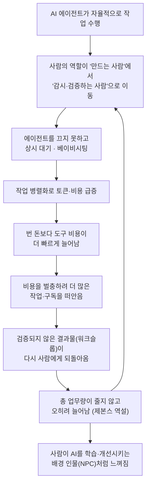

> 원문: threads.com/@homebodify/post/DbI8DCnEVzy
>
> "내가 AI로 자동화를 하는 것인지, AI가 우리를 자동화하도록 시키는 것인지 아리송하다. 컴퓨터도 못 닫아. 밤 새도록 작업해야 해, 쓴 만큼 벌어야하는데 어렵게 번 돈 더 쓰고 있고, 일이 줄기는 커녕 압도적인 업무양으로 인간이 AI 강화시키는 NPC 역할을 하는 듯."

이 문서는 위 게시물이 담고 있는 정서와 그 배경이 되는 구조적 현상을, 2026년 7월 현재까지 확인 가능한 자료를 근거로 하나씩 풀어 설명한 것입니다. 참고로 해당 스레드 게시물 자체는 자동 접근이 차단되어 있어, 이 문서는 이용자가 직접 인용한 원문 문장을 1차 자료로 삼고, 그 문장이 가리키는 현상을 국내외 보도·연구·커뮤니티 글로 교차 확인하는 방식으로 작성되었습니다.

## 목차

1. 이 독백이 말하려는 것
2. 문장을 한 줄씩 풀어보기
   - 2-1. "내가 자동화하는가, AI가 나를 자동화시키는가" — 뒤바뀐 주체
   - 2-2. "컴퓨터도 못 닫아" — 상시 대기와 '베이비시팅 문제'
   - 2-3. "쓴 만큼 벌어야 하는데 더 쓰고 있다" — 토큰 비용의 역설
   - 2-4. "일이 줄기는커녕 NPC가 된 듯" — 생산성 역설과 워크슬롭
3. 왜 이런 일이 반복해서 일어나는가 — 구조적 배경
4. 악순환 구조를 그림으로 보면
5. 이것이 낯설지 않은 이유 — 비슷한 목소리들
6. 그렇다면 인간에게 남는 자리는 어디인가
7. 정리

---

## 1. 이 독백이 말하려는 것

이 게시물은 분석적인 글이라기보다 짧은 탄식에 가깝습니다. 그러나 그 안에는 2026년 상반기 한국의 바이브코딩·AI 실무자 커뮤니티에서 반복적으로 등장하는 네 가지 문제의식이 압축되어 있습니다. 자동화의 주체가 누구인지 헷갈린다는 것, 일하는 시간과 공간의 경계가 사라졌다는 것, 도구 비용이 벌이보다 빠르게 늘어난다는 것, 그리고 정작 일의 총량은 줄지 않고 오히려 자신이 AI를 더 똑똑하게 만들어주는 부속품처럼 느껴진다는 것입니다. 이 네 가지는 서로 무관한 불평이 아니라, 하나의 구조에서 뻗어 나온 네 개의 가지에 가깝습니다. 아래에서 문장을 하나씩 따라가며 그 구조를 짚어보겠습니다.

## 2. 문장을 한 줄씩 풀어보기

### 2-1. "내가 자동화하는가, AI가 나를 자동화시키는가" — 뒤바뀐 주체

원래 '자동화'라는 말은 사람이 반복적인 일을 기계에 넘기고, 그만큼 사람의 시간과 판단이 더 중요한 곳으로 옮겨간다는 뜻으로 쓰여 왔습니다. 그런데 실제 AI 코딩 에이전트를 매일 다루는 사람들 사이에서는 이 방향이 거꾸로 흘러가는 듯한 경험이 자주 보고됩니다. 에이전트가 스스로 계획을 세우고 코드를 고치는 동안, 사람의 역할은 '만드는 사람'에서 '지켜보고 확인하는 사람'으로 조용히 옮겨간다는 관찰이 대표적입니다. 오랫동안 업무 자동화 설계를 직접 해 온 한 실무자는 이런 변화가 해고 통보처럼 명시적으로 오지 않고, 회의에서 자신의 역할이 슬쩍 바뀌는 방식으로 온다고 적었습니다. 신호가 없어서 알아차리기 어렵다는 것입니다.

경향신문 칼럼 "AI가 인간을 고용할 때"는 이 뒤바뀐 관계를 더 극단적인 사례로 보여줍니다. '렌트어휴먼(Rent-a-Human)'이라는 온라인 플랫폼은 첫 화면에 "현실 세계에 사람이 필요할 땐, 인간을 빌리세요. AI는 당신의 몸이 필요합니다"라는 문구를 내걸고 있으며, 여기서는 사람의 지시를 받아 계획을 세우고 실행하는 AI 에이전트가 반대로 사람의 몸이 필요한 일—반려견 산책, 카페 리뷰 작성 같은—을 위해 사람을 고용하고 평가하고 대가를 지불하는 주체가 됩니다. 이 칼럼은 이렇게 일을 지시하고 평가하고 값을 치르는 쪽이 사람이 아니라 AI 에이전트로 뒤집힌 자리에서, 인간의 노동이 무엇으로 다시 정의되는지를 묻습니다. 원문 게시물의 "내가 자동화하는 건지, AI가 나를 자동화시키는 건지 아리송하다"는 문장은 바로 이 방향의 역전을 체감 수준에서 짚어낸 것이라 할 수 있습니다.

### 2-2. "컴퓨터도 못 닫아" — 상시 대기와 '베이비시팅 문제'

AI 코딩 에이전트를 실제로 운용해 본 사람들 사이에서는 '베이비시팅 문제(babysitting problem)'라는 표현이 통용됩니다. 시간을 아끼려고 도입한 에이전트를, 정작 몇 시간씩 붙어 앉아 계속 지켜봐야 하는 역설적 상황을 가리키는 말입니다. 개발 커뮤니티에 올라온 한 글은 어떤 개발자가 시간을 단축하려고 도입한 에이전트를 네 시간 동안 계속 감독했고, 몇 분마다 멈추고 실수를 고치고 다시 실행시키는 과정을 반복한 끝에 결과적으로 직접 코드를 짤 때보다 더 많은 수작업이 들어갔다고 전합니다. 이 문제의 핵심은 자율 에이전트가 초기의 작은 실수를 스스로 알아차리지 못한 채 계속 쌓아 올리다가 뒤늦게 큰 문제로 번진다는 데 있으며, 이를 막으려면 사람이 승인하는 체크포인트를 곳곳에 두어야 하는데, 바로 이 승인 대기 구간에서 속도가 눈에 띄게 느려집니다.

최근에는 에이전트를 한 개가 아니라 여러 개 동시에 굴리는 '병렬 오케스트레이션' 방식도 늘고 있습니다. 여러 개의 에이전트를 동시에 부리는 실전 운용기를 다룬 글들은, 개발자의 역할이 코드를 직접 타이핑하는 사람에서 여러 에이전트의 작업을 계획하고 조율하는 오케스트레이터로 옮겨가고 있다고 설명합니다. 문제는 에이전트가 늘어날수록 그만큼 지켜봐야 할 지점도 함께 늘어난다는 점입니다. 밤에도 어딘가에서 에이전트가 작업을 돌리고 있고, 그 결과를 언제든 확인하고 개입해야 한다는 감각은, 컴퓨터를 물리적으로 끌 수는 있어도 심리적으로는 끄기 어려운 상태를 만듭니다. "컴퓨터도 못 닫아, 밤새도록 작업해야 해"라는 구절은 이런 상시 대기 상태를 가리키는 것으로 읽을 수 있습니다.

### 2-3. "쓴 만큼 벌어야 하는데 더 쓰고 있다" — 토큰 비용의 역설

프런티어급 AI 모델을 쓰는 코딩 도구를 몇 개 구독하면 한 달에 수십만 원이 나가는 일이 드물지 않다는 것은 이제 국내 커뮤니티에서도 공공연히 나오는 이야기입니다. 에이전트가 코드를 스스로 읽고 고치는 일이 늘어날수록 한 번의 작업에 들어가는 토큰량도 함께 불어나고, 좋은 모델일수록 토큰 단가도 비싸지기 때문입니다. 실제로 국내 언론은 AI에 몇 번 질문을 주고받았을 뿐인데 토큰이 부족하다며 추가 요금이 청구되는 이른바 'AI 요금 폭탄' 사례가 늘고 있다고 전했고, 기업 차원에서도 정액 구독제로 보이던 AI 코딩 도구의 실제 비용이 모델 종류와 프롬프트 길이, 반복 수정 횟수에 따라 크게 달라지면서 과금 방식 자체가 정액제에서 사용량 기반 종량제로 빠르게 옮겨가는 추세라는 분석이 나옵니다. 우버 같은 대기업조차 연간 AI 예산을 조기에 소진했는데, 그 상당 부분이 AI 코딩 도구 사용에서 비롯되었다는 사례도 함께 보고되고 있습니다.

더 씁쓸한 지점은, 이렇게 쓰인 토큰 가운데 실제로 쓸모 있는 결과로 이어지는 비율이 낮다는 지적입니다. 어떤 개발 블로그는 실제 작업에 쓰인 토큰의 비율이 극히 일부에 불과하다는 관찰과 함께, 바이브코딩을 'ADHD 증폭기'에 빗댄 글을 소개합니다. AI 도구가 서로 무관한 작업을 여러 화면에서 동시에 벌이도록 만들어 마치 생산성이 높아진 듯한 착각을 주지만, 실제로는 간단한 요청 하나가 한 시간 뒤에는 원래 문제도 해결되지 않은 채 프로젝트만 비대해지는 경우가 많다는 것입니다. 이런 상황에서 "쓴 만큼 벌어야 하는데 어렵게 번 돈을 더 쓰고 있다"는 구절은 단순한 하소연이 아니라, 실제로 확인되는 비용 구조의 반영이라 할 수 있습니다.

### 2-4. "일이 줄기는커녕 NPC가 된 듯" — 생산성 역설과 워크슬롭

AI가 개인 단위의 작업 속도를 끌어올린다는 것 자체는 여러 수치로 확인되고 있습니다. 그런데 국내 보도는 이런 개인 효율 향상이 조직 전체의 성과로는 잘 이어지지 않는다는 이른바 'AI 생산성 역설'을 함께 짚습니다. 왜 이런 간극이 생기는가에 대한 한 가지 설명이 하버드비즈니스리뷰가 스탠퍼드 연구진과 함께 제시한 '워크슬롭(workslop)'이라는 개념입니다. 겉보기에는 그럴듯하지만 실제로는 과제를 의미 있게 진전시키지 못하는 AI 생성 결과물을 가리키는 말로, 이런 결과물을 받은 사람이 도리어 내용을 해석하고 고치고 다시 만드는 부담을 떠안게 되면서, 일의 부담이 만든 사람에서 받는 사람 쪽으로 그대로 넘어간다는 것이 핵심입니다. 실제 조사에서는 미국 정규직 사무직 노동자의 상당수가 최근 한 달 사이 이런 워크슬롭을 받아본 적이 있고, 이를 처리하는 데 평균 두 시간 가까이 걸렸다는 결과도 나왔습니다.

여기에 더해, 이미 잘 알려진 '제본스 역설(Jevons paradox)'도 같은 방향을 가리킵니다. 19세기 영국의 경제학자 윌리엄 제번스는 증기기관의 효율이 높아지면 석탄 소비가 줄어들 것이라는 예상과 달리 오히려 석탄 소비가 급증했다는 사실을 관찰했습니다. 효율이 좋아지면 한 번 쓰는 자원의 양은 줄어들지만, 비용이 낮아진 만큼 그 자원에 대한 수요 자체가 폭증하기 때문입니다. 국내 IT 매체는 이 역설을 그대로 AI 개발자 시장에 적용해, 기술 발전으로 생산성이 향상되더라도 업무량 자체가 함께 확대되면서 인력 수요가 줄기는커녕 유지되거나 오히려 늘어나는 현상으로 설명합니다. 즉 AI 덕분에 한 사람이 처리할 수 있는 일의 양이 늘어난 만큼, 처리해야 할 일 자체도 함께 늘어나 버리는 구조입니다. 원문의 "일이 줄기는커녕 압도적인 업무양"이라는 표현은 바로 이 두 현상—워크슬롭으로 인한 부담의 하류 이전, 그리고 제본스 역설로 인한 총량 증가—이 겹쳐진 결과로 볼 수 있습니다.

마지막으로 "인간이 AI를 강화시키는 NPC 역할을 하는 듯"이라는 표현은, 사람이 매일 AI를 쓰면서 남기는 대화 기록과 수정 지시, 승인·반려 판단이 결국 그 도구를 더 정교하게 만드는 데이터로 흘러 들어간다는 감각을 게임 속 배경 인물, 즉 플레이어가 아니라 세계를 채우는 존재에 빗댄 것입니다. 이는 렌트어휴먼 사례에서 사람이 AI 에이전트에게 고용되어 감각과 판단을 조각조각 빌려주는 존재로 그려진 것과도 맥이 닿아 있으며, 앞서 인용한 칼럼이 짚었듯 "기계는 인간을 대체하는 것이 아니라, 인간을 기계 시스템의 가장 값싼 부품으로 다시 불러들인다"는 관찰과도 이어집니다.

## 3. 왜 이런 일이 반복해서 일어나는가 — 구조적 배경

지금까지 짚은 네 가지 현상—주체의 역전, 상시 대기, 비용의 역설, 업무량 증가—은 개별 사용자의 미숙함이나 특정 도구의 결함에서 비롯된 일회성 문제가 아닙니다. 오히려 AI 에이전트가 사람의 판단 없이도 상당 부분을 자율적으로 진행할 수 있게 되면서 생기는 구조적 부산물에 가깝습니다. 에이전트가 자율적으로 움직일수록 그 결과를 검증할 사람의 책임은 함께 무거워지고, 검증 비용을 낮추려고 더 많은 에이전트를 병렬로 돌리면 지켜봐야 할 지점과 토큰 소비량이 함께 늘어납니다. 늘어난 소비량은 비용 부담으로 돌아오고, 그 비용을 벌충하기 위해 더 많은 작업을 받아들이면 다시 상시 대기와 번아웃으로 이어지는 순환이 만들어집니다. 이 순환의 밑바닥에는, AI 도구가 값싸고 빨라질수록 그 도구에 대한 수요와 기대치 자체가 함께 커진다는 제본스 역설의 논리가 깔려 있습니다.

## 4. 악순환 구조를 그림으로 보면

이 그림에서 보듯, 각 단계는 앞선 단계의 해결책처럼 보이지만 실제로는 다음 문제를 낳는 고리로 이어집니다. 자율성을 높이면 검증 부담이 커지고, 검증 부담을 병렬화로 해소하면 비용이 커지며, 비용을 벌충하려는 노력은 다시 업무량을 키우는 식입니다. 원문 게시물의 정서는 바로 이 고리 전체를 한 번에 통과해 본 사람의 소감이라고 볼 수 있습니다.

## 5. 이것이 낯설지 않은 이유 — 비슷한 목소리들

이런 정서는 이 게시물 하나에 그치지 않습니다. 자동화 설계를 오래 해 온 한 실무자는 AI를 직접 다루면서 예전에 자신이 시스템으로 대체했던 사람들의 자리를, 이번에는 훨씬 빠른 속도로 다시 목격하고 있다고 적었습니다. 그는 이 변화가 해고 통보처럼 오지 않고 '재설계'라는 이름으로, 회의에서 역할이 슬쩍 바뀌는 방식으로 조용히 온다고 짚었습니다. 또한 가장 성실하게 AI를 잘 쓰는 사람에게 이 변화가 먼저 온다는 관찰도 함께 남겼는데, 도구가 판단을 대신 짊어질수록 대체 가능성이 사람이 아니라 '그 일' 자체에 쌓이기 때문이라는 설명입니다.

개발자 커뮤니티에서도 비슷한 흐름이 반복해서 확인됩니다. 8년 차 AI 엔지니어가 "코드가 존재한다는 사실조차 잊어버리라"는 초기 바이브코딩 철학을 그대로 따르는 일이 생각보다 비싸고 아팠다며 순수한 형태의 바이브코딩을 포기했다고 밝힌 사례, AI 코딩 도구로 인한 보안 취약점과 데이터 손실 사고들, 그리고 AI 코딩 비용이 급증하면서 최고재무책임자(CFO)까지 비용 문제에 직접 관심을 기울이기 시작했다는 소식 등은 모두 같은 구조—효율이 높아진 만큼 기대와 부담도 함께 높아지는 구조—를 다른 각도에서 보여줍니다.

## 6. 그렇다면 인간에게 남는 자리는 어디인가

이런 흐름 속에서도 여러 실무 보고서와 칼럼이 공통적으로 짚는 지점이 있습니다. AI가 실행을 맡을수록 인간에게 요구되는 역량은 오히려 '결과물에 대한 품질 통제'와 '비판적 사고'로 좁혀지고 무거워진다는 것입니다. 국내 한 보도는 AI와 함께 일하는 데 능숙한 이른바 '프론티어 프로페셔널'일수록 오히려 의도적으로 AI 없이 일하는 시간을 따로 두어 자신의 판단력이 무뎌지지 않도록 관리하고, 어떤 일을 시작하기 전에 "이 일은 AI가 해야 하는가, 내가 해야 하는가"를 의식적으로 구분하는 습관을 갖고 있다고 전합니다. 앞서 인용한 경향신문 칼럼 역시, 돌봄노동처럼 감각과 판단, 오랜 친밀감이 결합된 노동이 자동화의 마지막 경계선으로 남아 있음에도 정작 가장 낮은 값으로 취급되어 온 오래된 역설을 지적하며, 무엇이 가치 있는 노동인지는 기술이 아니라 사회와 사람이 다시 정할 수 있는 문제라는 점을 강조합니다. 이는 원문 게시물이 던진 물음—내가 자동화하는가, 자동화당하는가—에 대한 답이 도구의 성능이 아니라, 그 도구를 둘러싼 검증 구조와 비용 구조, 그리고 무엇을 사람의 판단에 남겨둘 것인가에 대한 선택에 달려 있다는 점을 함께 보여줍니다.

## 7. 정리

원문의 짧은 독백은 개인의 하소연처럼 보이지만, 그 안에는 2026년 현재 AI 에이전트를 실무에 깊이 들여온 사람들이 공통적으로 마주치는 네 가지 구조—역전된 자동화 주체, 상시 대기와 베이비시팅 문제, 늘어나는 토큰 비용, 그리고 워크슬롭과 제본스 역설이 겹쳐 만드는 업무량 증가—가 압축되어 있습니다. 이 구조들은 각각 국내외 보도와 연구, 커뮤니티 글을 통해 독립적으로 확인되는 현상이며, 어느 하나가 유독 과장되었다고 보기는 어렵습니다. 다만 이 구조를 그대로 두면 도구를 잘 쓰는 사람일수록 먼저, 더 깊이 이 순환에 들어가게 된다는 점에서, 개인의 사용법 개선만으로는 완전히 벗어나기 어려운 문제이기도 합니다. 원문이 던진 물음은 결국 기술의 문제가 아니라, 그 기술을 둘러싼 검증·비용·업무 배분의 설계를 누가, 어떻게 다시 짤 것인가라는 질문으로 이어집니다.

---

## 참고문헌

[1] 지피터스(GPTers), "저는 자동화로 사람을 필요 없게 만드는 일을 했습니다 — 그 일을 한 사람으로서 지금의 AI를 봅니다", 2026.07.07. https://www.gpters.org/research/post/worked-making-people-unnecessary-EgacbHIp0TbJS2I

[2] 경향신문, 이승윤, "[이승윤의 노동과 삶] AI가 인간을 고용할 때", 2026.07.14. https://www.khan.co.kr/article/202607141955025

[3] 위키백과, "제본스의 역설". https://ko.wikipedia.org/wiki/제본스_역설

[4] 위키백과, "생산성 역설". https://ko.wikipedia.org/wiki/생산성_역설

[5] 청년개발자신문, "AI가 개발자 일자리를 대체할까… 채용 데이터는 '엔지니어 수요 여전히 강세'". https://www.devtimes.co.kr/news/499536

[6] 더파워뉴스, "[AI 생산성 역설] AI는 빨라졌는데 기업 성과는 왜 제자리인가", 2026.04.29. https://www.thepowernews.co.kr/view.php?ud=20260428111046967de3f0aa1be_7

[7] Gizmodo, "'Workslop': AI-Generated Work Content Is Slowing Everything Down", 2025.10.03. https://gizmodo.com/workslop-ai-generated-work-content-is-slowing-everything-down-2000662646

[8] Larridin, "Workslop: The Hidden AI Tax Costing Enterprises Millions". https://larridin.com/blog/workslop-hidden-ai-productivity-cost

[9] 한국경제, "'월 1억 값어치 하나'…기업들, '돈 먹는 하마' AI 공포 [테크로그]". https://www.hankyung.com/article/202607018663g

[10] Threads, @unclejobs.ai, AI 코딩 도구 구독료·토큰 비용 관련 게시물. https://www.threads.com/@unclejobs.ai/post/DaMTokViTdk

[11] DEV Community, "AI 에이전트 관리 멈추는 방법(베이비시팅 문제)", 2026.03.24. https://dev.to/rihpig/ai-eijeonteu-gwanri-meomcuneun-bangbeob-433m

[12] 위키독스(박재홍의 실리콘밸리), "AI 코딩 에이전트를 여럿 동시에 부리는 법", 2026.04.20. https://wikidocs.net/blog/@jaehong/12021/

[13] Tom's Blog, "토큰의 2%만 코드에 쓰인다 — AI 코딩의 진짜 비용과 낭비 줄이기", 2026.06.02. https://toms-blog.co.kr/posts/2026-06-02-ai-coding-token-waste

[14] 오마이뉴스, "AI가 실행을 맡으면, 인간에게는 무엇이 남는가", 2026.05.06. https://www.ohmynews.com/NWS_Web/View/at_pg.aspx?CNTN_CD=A0003231426
