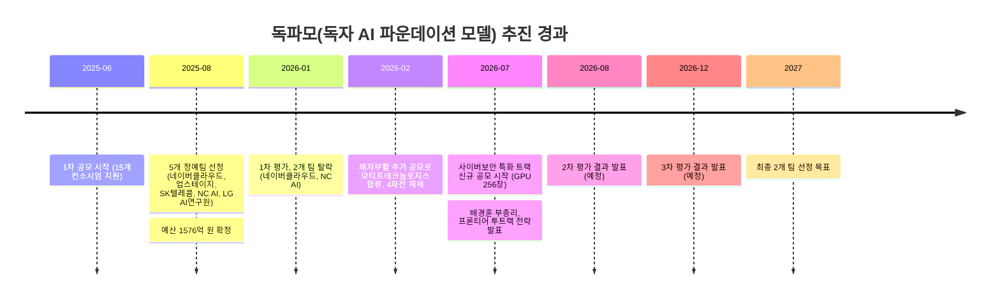

```
https://www.threads.com/@rosschild.insight/post/DbIwaY8lGrJ

대한민국 정부가 "GPT도, 미소스도 잡을 국산 AI 보안 모델"을 만들겠다며 개발팀 공모를 시작했음.
최종 선정팀에 지원되는 GPU가 256장임.
이름하여 독자 AI 파운데이션 모델, 줄여서 독파모.
근데 이 공모가 나오기 사흘 전, 바로 이 사업을 이끄는 장관이 한 말이 그림을 통째로 흔들어놨음.

1/ 무슨 상황이냐면.
독파모는 작년 8월 시작된 국책 사업임.
국가대표 5개 정예팀을 뽑아 국산 파운데이션 모델을 키우겠다는 거고, 투입 예산이 1576억 원.
올해는 여기에 트랙을 하나 더 붙였음.
사이버 보안에 특화된 국산 모델을 만들겠다는 것.
최종 컨소시엄에 B200 GPU 256장을 10개월 지원하고, 오픈소스로 풀고, 연내 공개가 목표.
명분은 선명했음. "미소스와 GPT를 잡는다."
근데 잡겠다는 그 미소스가 뭔지부터 봐야 함.

2/ 미소스가 뭐냐.
미국이 아예 전략자산으로 분류해 접근을 틀어막은 최상위 프론티어 모델임. 앤트로픽 계열로 전해짐.
성능이 하도 세서, 이게 사이버 공격에 쓰일 수 있다는 우려로 각국이 대응 회의를 열었음.
오픈AI마저 여기에 맞서 'GPT-5.4-사이버'라는 보안 특화 버전을 따로 내놨을 정도.
한국이 "잡겠다"고 지목한 상대가 바로 이 급임.
그러니까 남이 국가 차원에서 문을 잠가버린 모델을, 국산으로 따라잡겠다고 선언한 거임.

2/ 근데 여기서 반전.
이 공모가 뜨기 사흘 전, 7월 20일 취임 1주년 간담회에서 배경훈 부총리가 직접 인정했음.
전 LG AI연구원장 출신, 이 판을 가장 잘 아는 사람임.
"현행 독자 모델 구축 사업의 지원 수준으로는 최상위 AI 달성이 어렵다."
지금 5개 팀이 받는 GPU가 500~735장.
국가대표 사업을 띄운 지 1년도 안 돼서, 그걸 설계한 장관이 "이걸론 안 된다"고 말한 셈임.

3/ 결정적인 건 그다음 말이었음.
그럼 어쩌자는 거냐. 판을 다시 짜겠다는 거였음.
기존 독자 모델은 그대로 두고, 그 옆에 '프론티어급' 트랙을 하나 더 세우는 투트랙.
여기 필요한 게 엔비디아 차세대 루빈 GPU 약 1만 장. 구매비만 약 3조 5000억 원.
나라 출연금으로는 감당이 안 되니, 지분 투자에 특수목적법인 설립까지 검토 중이라 했음.
"미소스급? 1만 장만 확보하면 우리도 만든다"는 게 장관 설명이었음.

4/ 숫자를 나란히 놓으면 간극이 보임.
이번 보안 모델은 256장. 새 프론티어 구상은 1만 장. 
근데 정작 잡겠다는 미소스와 GPT를 굴리는 랩들은 수만에서 수십만 장 단위임.
"세계 2위"도 확정이 아니라, 정부 자체 평가에서 현재 3위인 걸 8월 2차 평가 때 끌어올려 보겠다는 목표치임.
근데 같은 주에 정반대 신호도 하나 있었음.
겨우 30명이 만든 국산 모델 '모티프 3'가 글로벌 오픈소스 3위권에 올랐음.
거대 국책 군단과 소수 정예의 성적표가, 묘하게 엇갈린 거임.

마지막/ 이 이야기의 핵심은 "국산 AI가 안 된다"가 아님.
핵심은 명분과 장부가 따로 논다는 거임.
잡겠다는 미소스는 애초에 미국이 국가 차원에서 잠가버린 모델이고, 
"지금 지원으론 안 된다"는 실토와 "우리도 만들 수 있다"는 자신감이 같은 달, 같은 사람 입에서 나왔음.
세계 2위는 GPU 장수로 사는 걸까.
아니면 30명이 먼저 증명해버린 다른 길이 있는 걸까.

```

## 1. 들어가며

2026년 7월 22일, 과학기술정보통신부는 정보통신산업진흥원(NIPA)과 함께 사이버 보안에 특화한 독자 인공지능 파운데이션 모델을 개발할 참여팀을 공모한다고 발표했습니다. 최종 선정되는 한 팀에는 엔비디아 B200 기준 GPU 256장, 즉 32노드 규모의 컴퓨팅 자원이 10개월 동안 지원됩니다. 국내 AI·보안 기업, 대학, 연구기관이라면 참여할 수 있고, 접수는 8월 21일까지입니다.

그런데 이 공모가 나오기 사흘 전인 7월 20일, 바로 이 사업을 관장하는 배경훈 부총리 겸 과학기술정보통신부 장관이 정부세종청사에서 열린 취임 1주년 기자간담회에서 뜻밖의 발언을 내놓았습니다. 지금 진행 중인 독자 AI 파운데이션 모델(이하 독파모) 사업의 지원 규모로는 최상위권 AI, 이른바 '프론티어급' 모델을 만들기 어렵다고 스스로 인정한 것입니다. 이 발언은 독파모라는 국가 프로젝트를 설계하고 이끄는 당사자의 입에서 나왔다는 점에서, 그리고 사이버보안 특화 모델 공모가 나오기 불과 사흘 전이라는 시점 때문에 여러 매체와 온라인 커뮤니티에서 화제가 됐습니다.

이 문서는 두 개의 Threads 게시글(@rosschild.insight, @kimjhs24)이 다루는 이 사안 전체를 국내 주요 언론 보도와 정부·기업 공식 자료를 근거로 정리한 것입니다. 어떤 프로젝트가 실제로 존재하고, 어떤 발언이 실제로 나왔으며, 어떤 부분이 아직 확정되지 않은 계획이나 목표치에 불과한지를 구분하는 데 중점을 뒀습니다.

---

## 2. 독파모(독자 AI 파운데이션 모델)란 무엇인가

독파모는 2025년 6월 과학기술정보통신부가 공모를 시작한 국책 사업으로, 정식 명칭은 '독자 AI 파운데이션 모델 프로젝트'입니다. 전 정부에서는 '월드 베스트 거대언어모델(WBL)' 프로젝트로 불렸으나 새 정부가 들어서면서 이름이 바뀌었습니다. 목표는 챗GPT나 제미나이에 견줄 만한 국산 대규모 언어모델을 국내 기술로 직접 개발해, 이를 오픈소스(오픈웨이트)로 공개함으로써 국내 AI 서비스 생태계 전반을 끌어올리는 것입니다.

2025년 7월 21일 마감된 1차 공모에는 15개 컨소시엄이 지원했고, 같은 해 8월 네이버클라우드, 업스테이지, SK텔레콤, NC AI, LG AI연구원 5개 팀이 정예팀으로 선정됐습니다. 예산 규모는 1576억 원이며, 이 중 상당 부분이 GPU 등 컴퓨팅 자원 확보에 투입됩니다. 초기에는 정부가 1차 추가경정예산으로 확보한 GPU 1만 장을 민간 임대 형태로 활용해 팀당 500장 수준으로 시작하고, 이후 정부 구매분이 도입되면 팀당 1000장 이상으로 늘리는 구조로 설계됐습니다. 여기에 팀별로 데이터 구축·가공 비용 연간 30억~50억 원, 해외 우수 연구자 유치 시 연간 20억 원 규모의 인건비 매칭 지원이 더해집니다. 대학·대학원생의 참여도 필수 조건으로 걸려 있는데, 대규모 GPU 클러스터로 1000억 개 이상 매개변수를 가진 모델을 직접 학습시켜 본 경험은 책으로 배울 수 없는 실전 역량이기 때문입니다.

평가는 약 6개월 주기로 팀을 하나씩 걸러내 2027년 최종 2개 팀만 남기는 방식으로 설계됐습니다. 다만 실제 진행 과정은 애초 계획과는 다소 달라졌습니다. 2026년 1월로 예정됐던 1차 평가에서는 원래 5개 팀 중 1개 팀만 탈락시킬 예정이었으나 실제로는 네이버클라우드와 NC AI 2개 팀이 한꺼번에 탈락했고, 정부는 이 공백을 메우기 위해 추가 공모를 진행해 2026년 2월 20일 모티프테크놀로지스 컨소시엄을 후발 정예팀으로 새로 선정했습니다. 이로써 현재는 LG AI연구원, SK텔레콤, 업스테이지, 모티프테크놀로지스 4개 팀이 나란히 2단계 경쟁을 벌이는 '4파전' 구도가 만들어졌습니다.

2차 평가는 2026년 8월 초로 예정돼 있습니다. 기존 3개 팀은 이미 6월 말 평가용 모델을 제출했고, 한 달 늦게 합류한 모티프테크놀로지스는 형평성 차원에서 동일한 개발 기간을 보장받아 7월 말까지 모델을 제출할 예정입니다. 3차 평가 결과는 2026년 12월에 나옵니다. 업계에서는 2차 평가부터 단순 성능 지표뿐 아니라 실제 서비스 확산 가능성과 국제 벤치마크 비중이 커질 것으로 보고 있습니다.



---

## 3. 새로 등장한 트랙: 사이버보안 특화 AI 파운데이션 모델 공모

기존 독파모 사업과 별개로, 정부는 이번에 사이버보안에 특화한 독자 AI 파운데이션 모델이라는 새 트랙을 열었습니다. 과학기술정보통신부와 NIPA는 7월 22일 이 사업의 참여팀을 8월 21일까지 모집한다고 공지했습니다. 국내 AI 및 사이버보안 관련 기업, 대학, 연구기관이 대상이며, 서면·발표 평가를 거쳐 최종 1개 팀만 선정하는 방식입니다.

선정된 팀에는 엔비디아 B200 기준 GPU 256장(32노드)이 10개월 동안 지원됩니다. 참여를 희망하는 팀은 모델 개발 방법론, AI 모델 기반 서비스 실증 분야, 서비스 수 등을 자유롭게 제안할 수 있고, 국내 AI·보안 전문가로 구성된 평가위원회가 기술력, 개발 경험, 목표 달성 가능성, 시장성과 파급효과 등을 기준으로 심사합니다. 사업 지원 5개월 시점에 중간 성과 모델을 공개·점검해 지속 지원 여부를 가리고, 이후 5개월 단위로 단계 평가와 최종 평가가 이어지는 구조입니다. 과기정통부는 최종 성과물을 국내 보안 생태계 전반으로 확산시키고, 2027년부터는 '이어달리기' 형태의 후속 지원도 검토한다는 방침입니다. 류제명 과기정통부 2차관은 이 사업이 "최근 급변하는 AI 개발 환경과 사이버 보안 패러다임에 선제적으로 대응하기 위한 것"이라고 취지를 밝혔습니다.

이 사업의 목표 연도를 두고는 보도마다 다소 결이 다릅니다. 결과물을 연내(2026년) 공개하겠다는 목표가 언급된 보도가 있는가 하면, ZDNet코리아 보도에서는 "내년(2027년) 7월까지 개발"이라는 표현도 등장합니다. 10개월 지원 기간을 8월 선정 시점부터 역산하면 자연스럽게 2027년 상반기까지 이어지므로, '연내 착수해 공공 부문부터 우선 적용하고, 개발 완료 및 전면 확산은 2027년까지 이어진다'는 것이 실제에 가까운 그림으로 보입니다.

---

## 4. "미토스를 잡는다"는 것의 의미 — 미토스란 무엇인가

이번 사이버보안 특화 공모의 배경에는 한국이 최근 겪은 구체적인 사건이 있습니다. 바로 앤트로픽의 최상위 모델 '클로드 미토스(Claude Mythos)'를 둘러싼 수출통제 사태입니다.

앤트로픽은 2026년 6월 초 일반 사용자용 최고 성능 모델인 '클로드 페이블 5(Fable 5)'와, 일부 안전장치를 완화한 채 핵심 보안 파트너에게 제한적으로 제공되던 '클로드 미토스 5(Mythos 5)'를 공개했습니다. 미토스는 수십 년간 발견되지 않았던 소프트웨어 취약점을 스스로 찾아내고, 이를 실제로 침투 가능한 해킹 도구(익스플로잇 코드)로 직접 만들어낼 만큼 뛰어난 보안 관련 능력을 갖춘 것으로 알려지면서 전 세계 사이버보안 업계와 각국 정부의 주목을 받았습니다. 이 때문에 국내외 금융 당국과 보안 기관들이 대응책을 논의하는 긴급회의를 여는 등 상당한 파장이 있었습니다.

앤트로픽은 미토스가 악의적으로 오남용되는 것을 막기 위해 '프로젝트 글래스윙(Project Glasswing)'이라는 글로벌 사이버보안 협력체를 함께 출범시켰습니다. 검증된 기업·기관에 한해 모델 접근권을 선제적으로 제공함으로써 방어 목적의 취약점 점검에 활용하도록 하는 방식입니다. 앤트로픽은 6월 2일 글래스윙 참여 대상을 15개국 약 150개 기관으로 확대했고, 국내에서는 삼성전자, SK하이닉스, SK텔레콤, 한국인터넷진흥원(KISA) 등이 여기에 합류했습니다.

그런데 합류한 지 열흘 남짓 만인 6월 12일(현지시간), 미국 상무부 하워드 러트닉 장관이 다리오 아모데이 앤트로픽 CEO에게 서한을 보내 페이블 5와 미토스 5를 수출통제 대상으로 전격 지정했습니다. 이 조치로 두 모델은 미국 밖의 정부·기업·개인은 물론, 미국 내에 거주하는 외국 국적자와 앤트로픽 소속 외국인 직원에게까지 제공이 금지됐고, 앤트로픽은 발표 직후 두 모델의 서비스를 전 세계적으로 전면 중단했습니다. 이로 인해 막 시작된 국내 기관들의 글래스윙 참여도 함께 직격탄을 맞았고, 과기정통부는 당시 "사실관계를 파악 중이며 국가안보실 중심 협의체를 통해 대응 방안을 논의하고 있다"고 밝혔습니다. 이 수출통제는 이후 미국 상무부가 6월 30일 지침을 철회하면서 18일 만에 해제됐고, 앤트로픽은 7월 1일부터 서비스를 재개했습니다.

같은 시기 OpenAI 역시 유사한 흐름을 보였습니다. 2026년 4월 14일 OpenAI는 사이버 방어 업무에 특화한 'GPT-5.4-Cyber'를 공개하고, 신원이 검증된 보안 전문가·기업에게 우선 제공하는 'Trusted Access for Cyber(TAC)' 프로그램을 확대했습니다. 이 모델은 일반 모델보다 보안 관련 작업에서의 거부 기준을 낮추고, 컴파일된 바이너리 코드를 직접 분석해 악성코드 여부와 취약점을 찾아내는 등 심화된 방어 기능을 제공하는 것이 특징입니다. 이후 5월 초에는 GPT-5.5와 함께 후속 모델인 GPT-5.5-Cyber도 한정된 방어자들에게 시범 제공되기 시작했습니다.

정리하면, 정부가 이번에 '잡겠다'고 지목한 대상은 미국이 자국의 전략자산으로 분류해 한때 동맹국의 접근까지 차단했던 모델, 그리고 이에 대응해 OpenAI가 별도로 내놓은 보안 특화 모델이라는 뜻입니다. 한국의 삼성전자, SK하이닉스, SK텔레콤 같은 기업들이 그 모델에 접근하는 길목에서조차 미국 정부의 결정 하나로 순식간에 차단당했던 경험이, 이번 국산 사이버보안 AI 공모의 실질적인 동기가 된 셈입니다.

---

## 5. 배경훈 부총리의 발언: "지금 지원으론 안 된다"

7월 20일 취임 1주년 기자간담회에서 배경훈 부총리 겸 과학기술정보통신부 장관은 미국과 중국의 AI 패권 경쟁이 격화되는 상황에서 한국도 독자적인 AI 경쟁력을 갖춰야 한다고 강조하면서, 현재 독파모 사업의 지원 수준으로는 최상위권 프론티어 모델 개발이 어렵다고 밝혔습니다. LG AI연구원장을 지낸 뒤 정부에 들어온 배 부총리는 이 사업을 설계하고 이끄는 당사자이기도 합니다.

배 부총리는 프론티어급 모델을 만들려면 엔비디아의 차세대 GPU인 '베라 루빈(Vera Rubin)'이 약 1만 장 필요하며, 현재 가격 기준으로 구매비만 약 3조 5000억 원에 이를 것이라고 설명했습니다. 여기에 대규모 GPU를 하나의 시스템처럼 가동하기 위한 클러스터, 플랫폼, 냉각시설 등 부대 비용까지 고려하면 실제 소요 금액은 이보다 더 커질 수 있다는 점도 덧붙였습니다. 이에 비해 현재 독파모 사업에 참여하는 4개 팀이 지원받는 GPU는 B200 기준 500~735장 수준에 그친다는 것이 배 부총리가 제시한 비교 지점입니다.

이를 해결하기 위해 배 부총리는 기존 독파모 사업은 그대로 유지하면서, 그 옆에 세계 최고 수준을 지향하는 프론티어 모델 개발 트랙을 별도로 두는 '투트랙 전략'이 필요하다고 언급했습니다. 기존 사업이 공공서비스와 산업 AI전환(AX)에 실제 활용할 수 있는 기술 확보를 목표로 했다면, 새 프론티어 트랙은 글로벌 최고 수준의 범용 AI 기술 자체를 확보하는 데 초점을 맞춘다는 설명입니다. 재원 조달 방식에 대해서는 기존의 정부 출연금 방식만으로는 감당하기 어렵다고 보고, 지분 투자나 특수목적법인(SPC) 설립 등 투자형 R&D 방식을 검토하고 있다고 밝혔습니다. 다만 배 부총리는 이 사업이 아직 정부 정책으로 확정된 것은 아니며, 관계 부처 및 재정당국과 협의를 진행 중이라는 점을 분명히 했습니다.

이와 별도로 배 부총리는 같은 날 청와대 대통령 업무보고 자리에서도 비슷한 취지의 발언을 내놓았습니다. 국민참여단이 "미국이 뛰어난 AI 모델을 국가 전략 무기로 판단해 차단한 만큼 우리도 그런 모델이 필요하다"고 질의하자, 배 부총리는 "1만 장 정도의 GPU로 게임을 해볼 수 있다면 그 정도 성능 달성이 가능하다"며 "감히 말하자면 대한민국도 만들 수 있다"고 답했습니다. 이재명 대통령도 "수년간 이 부분에 투자를 전혀 안 하는 바람에 남들은 전자계산기로 일하고 있는데 우리는 산가지를 가지고 경쟁했던 상황"이라며 투자의 시급성에 힘을 실었습니다. 배 부총리는 8월 2차 평가 결과가 나오면 정부 자체 평가에서 현재 3위인 한국의 AI 경쟁력을 2위권까지 끌어올려 볼 수 있을 것으로 기대한다고도 밝혔습니다.

여기서 한 가지 짚어둘 점은, 여러 매체 보도에서 배 부총리가 '미토스급'이라는 표현을 직접 사용한 것으로 인용되고 있다는 사실입니다. 즉 정부가 목표로 제시하는 대상은 GPT 계열보다는 구체적으로 미국이 전략자산으로 지정해 접근을 차단했던 미토스 수준의 모델이라는 점이 여러 간담회 보도에서 일관되게 확인됩니다.

---

## 6. 숫자로 보는 간극

지금까지 등장한 숫자들을 한자리에 모아보면 이번 논의의 핵심이 좀 더 분명해집니다.

| 구분 | GPU 규모(B200 또는 동급 기준) | 비고 |
|---|---|---|
| 기존 독파모 4개 정예팀 (개별) | 500~735장 | 2025년 8월 500장으로 시작, 이후 확대 |
| 신규 사이버보안 특화 트랙 (1개 팀) | 256장(32노드) | 10개월 지원, 2026년 8월 21일 접수 마감 |
| 구상 중인 프론티어 트랙 (미확정) | 약 1만 장(차세대 베라 루빈 기준) | 구매비만 약 3조 5000억 원 추산, 정부 정책 미확정 |

세 트랙의 GPU 규모를 나란히 놓으면, 사이버보안 트랙(256장)은 기존 독파모 개별 팀(500~735장)보다도 오히려 적고, 배 부총리가 제시한 프론티어 트랙 구상(1만 장)과는 수십 배 차이가 납니다. 다만 이 문서에서 강조해야 할 것은, 해외 최상위 프론티어 연구소들이 실제로 학습에 투입하는 GPU 규모는 공식적으로 발표되지 않는 경우가 많다는 점입니다. 업계에서 통용되는 '수만 장에서 수십만 장' 수준이라는 추정치는 여러 매체와 분석가들 사이에서 반복적으로 언급되지만, 특정 기업이 공식 확인한 구체적 수치는 아니므로 이 문서에서도 확정된 사실이 아니라 업계 통념 수준의 추정으로 다뤄야 합니다.

또한 '세계 2위'라는 목표 역시 국제 공인 순위가 아니라, 정부가 자체적으로 참고하는 평가 체계에서 현재 3위로 나타난 것을 8월 2차 평가에서 2위권으로 끌어올려 보겠다는 목표치입니다. 정책브리핑 자료에 따르면 이 평가는 AI 성능 평가 전문기관인 아티피셜 애널리시스(Artificial Analysis)가 운영하는 AAII(Artificial Analysis Intelligence Index) 지수를 참고한 것으로 보이며, 독파모의 5개 모델이 한때 이 지수 기준 '주목할 만한 모델' 세계 상위 20위 안에 모두 이름을 올린 적이 있다는 설명도 함께 제시된 바 있습니다.

---

## 7. 반전의 주인공: 모티프 3 — 세밀 검증

이 모든 논의가 벌어진 바로 그 주에, 정반대 방향의 소식도 함께 나왔습니다. 독파모에 가장 늦게 합류한 모티프테크놀로지스가 2026년 7월 21일, 자사가 개발 중인 대규모 언어모델 '모티프 3(Motif-3)'의 프리뷰(베타) 버전을 공개했습니다. 이 절에서는 회사 연혁, 투자 이력, 1차 출처(Artificial Analysis 공식 모델 페이지) 대조, 라이선스 조건까지 한 단계 더 파고들어 검증한 내용을 정리합니다.

### 7-1. 회사는 '맨손 스타트업'이었나 — 연혁과 투자 이력

모티프테크놀로지스는 AI 인프라 기업 '모레(Moreh)'가 2025년 2월 물적분할해 만든 자회사입니다. 즉 아예 없던 회사가 아니라, GPU 클러스터·시스템 운영 소프트웨어를 다루던 모레의 기술 자산을 물려받은 채 출범했습니다. 대표는 옥스퍼드대학교 수학 박사 출신인 임정환 대표이며, 회사의 핵심 원칙은 메타의 라마(LLaMA)나 알리바바의 큰(Qwen) 같은 해외 오픈소스 모델을 가져와 파인튜닝하는 국내 업계의 일반적 방식과 달리, 아키텍처 자체를 밑바닥부터 설계하는 '프롬 스크래치(From Scratch)'입니다.

설립 4개월 만인 2025년 하반기 첫 결과물인 소형언어모델 '모티프-2.6B'를 오픈소스로 공개했고, 이후 이미지 생성 모델 '모티프-이미지-6B'(2K 해상도 출력), 대규모 언어모델 '모티프-2-12.7B'(자체 설계한 'Grouped Differential Attention' 구조 적용), 비디오 생성 모델 '모티프-비디오-2B'를 차례로 허깅페이스에 공개했습니다. 특히 모티프-2-12.7B는 아티피셜 애널리시스 인텔리전스 지수에서 국내 1위를 기록한 바 있다고 보도됐습니다. 즉 이번 모티프 3는 회사의 '첫 작품'이 아니라, 언어·이미지·비디오 모델을 자체 설계로 잇달아 내놓은 트랙 레코드 위에서 나온 다섯 번째 정도의 공개 모델에 해당합니다.

자본 측면에서도 '자본 없이 순수 기술력만으로'라는 표현은 다소 보완이 필요합니다. 모티프테크놀로지스는 2026년 5월 27일 나이스투자파트너스·노틸러스인베스트먼트(기존 투자사 후속 투자)와 디토인베스트먼트·포레스트벤처스(신규 투자사)로부터 240억 원 규모의 시리즈B 투자를 유치했습니다. 여기에 정부가 지원하는 GPU 700여 장, 그리고 모레·서울대·KAIST·삼일회계법인·국가유산진흥원·HDC랩스 등 17개 기관이 참여하는 컨소시엄까지 더해진 상태입니다. '30명'이라는 인력 규모 자체는 THE VC 등 스타트업 정보 플랫폼 기준으로 사실로 확인되지만, "자본이 전혀 없는 맨손 도전"이라기보다는 "빅테크 대비 훨씬 작은 자본과 인력으로, 대기업 정예팀들과 같은 조건에서 경쟁하고 있다"는 표현이 더 정확합니다.

### 7-2. 1차 출처로 확인한 벤치마크 수치

이번 조사에서는 언론 보도뿐 아니라 아티피셜 애널리시스가 자사 사이트에 게시한 모티프 3(베타) 전용 모델 페이지(artificialanalysis.ai/models/motif-0714)를 직접 대조했습니다. 이 페이지에 따르면 모티프 3(베타)는 AAII에서 44점을 기록했고, 262,000토큰 규모의 컨텍스트 윈도우를 지원하며, 단순 답변형이 아니라 확장된 사고 과정(extended thinking/chain-of-thought)을 사용하는 추론형 모델로 분류돼 있습니다. 아티피셜 애널리시스는 이 모델이 유사 가격대 모델 평균(15점)보다 훨씬 높은 점수를 받았다고 설명하면서도, 평가 과정에서 생성한 출력 토큰이 2억 개(200M)로, 비교 대상 평균인 6100만 개(61M)보다 훨씬 장문·다변(verbose)이었다는 점도 함께 기록해뒀습니다. 이는 같은 점수라도 모티프 3가 답을 내는 데 상대적으로 더 많은 추론 토큰(즉 더 많은 연산량)을 소모했을 가능성을 시사하는 대목으로, 순수 파라미터 효율성(활성 파라미터 4%)과는 별개로 '추론 비용 효율성'은 아직 더 검증이 필요한 부분입니다.

전체 리더보드 상에서 정확한 위치도 다시 확인했습니다. 2026년 7월 23일 기준 아티피셜 애널리시스 공개 스냅샷에서는 앤트로픽의 클로드 페이블 5가 59.9점(약 60점)으로 1위, OpenAI의 GPT-5.6 솔이 58.9점(약 59점)으로 2위, 문샷AI의 키미 K3가 57.1점으로 3위를 기록하고 있습니다. 국내 매체가 인용한 플래텀 보도에 따르면 즈푸AI의 GLM-5.2(max)는 51점으로 키미 K3 다음 순위이며, 그 아래 44점대에 딥시크 'V4 프로(max)', 미니맥스 'M3', 그리고 모티프 3가 나란히 자리합니다. 즉 정확히 말하면 모티프 3는 오픈소스(오픈웨이트) 모델 중 '단독 3위'가 아니라, 키미 K3(1위)·GLM-5.2(2위) 다음으로 세 개 모델이 44점에서 동점을 이루는 '공동 3위권'입니다. 언론들이 사용한 "3위권"이라는 표현은 이런 의미에서 정확한 표현이며, 회사 측이 "3위"라고 단정적으로 표현하지 않은 것도 이 때문으로 보입니다.

### 7-3. '오픈소스'라는 표현의 실제 의미

플래텀 보도에 따르면 모티프 3(베타)의 가중치는 이미 허깅페이스에 공개돼 누구나 내려받을 수 있고, 일부 고객에게는 API·서비스 형태로도 제공되고 있습니다. 다만 같은 보도는 라이선스 조건상 상업적 이용은 회사의 사전 서면 허가 없이는 제한된다고 명시하고 있습니다. 즉 '오픈소스'라는 표현이 여러 매체에서 반복적으로 쓰이고 있지만, 실제로는 가중치를 공개하는 '오픈웨이트'에 가까우며 아파치(Apache)나 MIT 라이선스 같은 완전히 자유로운 상업적 이용까지 허용하는 라이선스는 아닌 것으로 보입니다. 이는 오픈소스라는 단어를 쓸 때 흔히 오해될 수 있는 지점이라, 정확한 라이선스 전문은 공식 배포 시점(8월 초 예정)에 다시 확인이 필요합니다.

### 7-4. 아직 남은 검증 단계

AI 분석 계정과 국내 매체들이 공통으로 짚는 유보 사항은 다음과 같습니다. 첫째, 이번에 공개된 것은 최종 버전이 아닌 중간 프리뷰(베타)이며, 회사는 8월 초 독파모 사업 일정에 맞춰 성능을 더 끌어올린 최종 버전을 공개할 계획입니다. 둘째, AAII는 코딩·과학·추론·에이전트 등 9개 세부 평가를 가중합산한 종합 지표이므로, 총점이 같다고 모든 세부 영역에서 동급이라는 뜻은 아닙니다. 셋째, 한국어 이해·생성 품질이나 실제 업무 도구 호출(에이전트) 안정성처럼 국산 모델의 실전 가치를 가르는 항목은 이 종합 점수에 직접 반영되지 않습니다. 넷째, 최근 AI 업계에서는 특정 벤치마크에 맞춰 모델을 최적화하는 이른바 '벤치마크 오염·과적합' 논쟁이 반복돼 왔기 때문에, 8월 초 오픈웨이트가 완전히 공개된 뒤 외부 커뮤니티가 독립적으로 재현한 결과가 나와야 이번 44점의 무게가 최종적으로 확정된다는 것이 냉정한 평가입니다.

이런 유보 조건들을 고려하더라도, 정부 지원 GPU 700여 장과 30명 규모의 개발 인력으로 5개월 만에 딥시크 최신 모델과 동일한 종합 점수를 받은 것은, 같은 독파모 예산 안에서 훨씬 큰 GPU를 배정받은 다른 정예팀들과 비교했을 때 자원 대비 성과 면에서 주목할 만한 결과입니다. 임정환 대표는 이번 결과에 대해 자본이 아닌 기술력만으로도 한국에서 글로벌 프론티어 수준의 AI 모델 개발이 가능함을 보여줬다는 취지로 언급하며, 이는 최종 목표를 향한 중간 단계일 뿐이라고 강조했습니다.

---

## 8. 또 다른 시각: 규모보다 실증과 효율이라는 반론

같은 사안을 두고 @kimjhs24가 올린 두 번째 게시글은 결이 다른 비판을 제기합니다. 이 부분은 사실관계 확인이 가능한 뉴스 보도라기보다 개인의 평가와 의견이라는 점을 먼저 밝혀둡니다.

게시글의 요지는 이렇습니다. 정부가 추진하는 RISC-V 기반 R&D나 LLM 관련 R&D 상당수가, 실제로 국내 공공 데이터를 활용해 어떤 기능을 어느 정도 효율로 구동할 수 있는지에 대한 구체적인 실증 근거 없이 추진돼 왔다는 것입니다. 글쓴이는 이런 상황에서 '국민 성장 펀드' 같은 이름으로 대규모 자금이 투입되는 것에 대해, 만약 민간 기업이 비슷한 방식으로 투자자를 모았다면 투자를 받기 어려웠을 것이라며 강한 우려를 나타냈습니다. 아울러 대규모 GPU 확보가 어렵다면 처음부터 모바일 기기를 겨냥해 LLM을 경량화하고 엣지 컴퓨팅 연구에 집중하는 편이 더 현실적이라는 대안도 제시했는데, 그 근거로 삼성전자 시스템LSI가 이미 관련 지적재산(IP)을 보유하고 있고 갤럭시 온디바이스 AI 기능에 쓰이는 LLM도 실질적으로는 그런 압축 기술을 활용한 결과일 것이라는 추정을 들었습니다.

이 주장에서 사실관계가 확인되는 부분과, 확인이 어려운 개인적 평가를 구분할 필요가 있습니다. 우선 '국민성장펀드'는 실제로 존재하는 정책금융 프로그램입니다. 금융위원회가 주도하는 이 펀드는 2026년 들어 반도체, 데이터센터, 파운데이션 모델, 응용 서비스로 이어지는 AI 밸류체인 전반에 투자하고 있으며, AI 분야에만 이미 조 단위 자금을 집행한 것으로 보도됐습니다. 다만 이는 독파모나 사이버보안 특화 트랙과는 운영 주체(금융위원회 대 과학기술정보통신부)와 방식(정책금융 투자 대 R&D 보조금·컴퓨팅 자원 지원)이 다른 별도의 사업입니다. 이 펀드를 둘러싸고는 대기업까지 정책금융 지원 대상에 포함하는 것이 적절한지, 정부 자금이 오히려 민간 투자를 위축시키는 것은 아닌지에 대한 우려가 금융권 세미나 등에서 실제로 제기된 바 있습니다. 그러나 이 펀드 자체가 '사기극'에 해당한다거나 독파모 사업과 직접적인 자금 흐름으로 연결돼 있다는 부분은 이번 조사에서 확인되지 않았으며, 이는 글쓴이 개인의 평가로 봐야 합니다.

RISC-V 기반 R&D의 실증 부족 문제나, 특정 R&D 프로젝트가 구체적인 성능·효율 데이터 없이 추진되고 있다는 지적 역시 이번 조사 과정에서 특정 사업명과 함께 교차 확인하지는 못했습니다. 다만 온디바이스·엣지 컴퓨팅을 통한 LLM 경량화가 대안이 될 수 있다는 지적 자체는 방향성 측면에서 타당성이 있는 논의입니다. 실제로 삼성전자는 갤럭시 스마트폰의 온디바이스 AI 기능에 자체 최적화·경량화 기술을 적용하고 있으며, 이는 이 문서의 다른 절에서 다룬 대규모 GPU 클러스터 기반 프론티어 모델 경쟁과는 전혀 다른 접근 방식입니다. 다만 온디바이스 경량 모델과, 국가 차원의 최상위 프론티어 모델(혹은 사이버보안 특화 모델)은애초에 목표로 하는 성능 영역과 용도가 다르기 때문에 서로를 대체할 수 있는 관계라기보다는 병행할 수 있는 다른 층위의 전략으로 보는 것이 더 정확합니다.

---

## 9. 종합: 명분과 장부 사이의 간극

지금까지 살펴본 내용을 정리하면 이렇습니다.

첫째, 정부가 사이버보안 특화 국산 AI를 통해 견제하려는 대상은 실체가 분명합니다. 미국 정부가 국가 안보 차원에서 전략자산으로 분류해 한때 접근 자체를 전면 차단했던 앤트로픽의 미토스, 그리고 이에 대응해 OpenAI가 내놓은 GPT-5.4-Cyber입니다. 이 사건은 한국의 삼성전자, SK하이닉스 같은 기업들이 실제로 접근권을 얻은 지 열흘 만에 차단당하는 형태로 국내에도 직접적인 충격을 줬습니다. '국산 보안 AI가 왜 필요한가'라는 질문에는 상당히 구체적이고 설득력 있는 답이 있는 셈입니다.

둘째, 그러나 이번에 공모된 사이버보안 트랙에 지원되는 자원(GPU 256장)과, 배경훈 부총리가 같은 주에 제시한 프론티어급 모델 개발 구상(GPU 1만 장, 예산 3조 5000억 원)사이에는 상당한 간극이 있습니다. 더구나 프론티어 트랙은 아직 정부 정책으로 확정되지 않았으며, 재정당국과의 협의가 진행 중인 단계입니다. 즉 "GPT도 미토스도 잡겠다"는 명분과, 현재 확정되어 실제로 집행되는 예산·자원 사이에는 시차와 규모 차이가 함께 존재합니다.

셋째, 이런 간극을 메울 수 있는 다른 경로가 이미 존재한다는 신호도 같은 시기에 나왔습니다. 정예팀 중 가장 늦게 합류했고 규모도 가장 작은 30명 스타트업 모티프테크놀로지스가, 상대적으로 적은 GPU(700여 장)만으로 세계 오픈소스 모델 3위권 성적을 냈습니다. 이는 '세계 2위'라는 목표가 반드시 GPU 물량으로만 달성되는 것은 아닐 수 있다는 근거가 될 수 있습니다. 동시에 이 결과가 아직 프리뷰 단계이고, 8월 2차 평가라는 실제 관문을 앞두고 나온 성과 발표라는 점도 균형 있게 봐야 합니다.

결국 이 사안의 핵심은 "국산 AI가 안 된다"는 단정이 아니라, 정부가 내세우는 목표(GPT와 미토스급을 잡겠다)와 실제로 뒷받침되는 자원·확정된 예산 사이에 존재하는 간극을 어떻게 좁혀갈 것인가, 그리고 그 간극을 자본 투입으로 메울 것인지 아니면 모티프 3가 보여준 것과 같은 효율 중심의 다른 경로로 메울 것인지에 있다고 볼 수 있습니다.

---

## 10. 팩트체크 노트 — 근거 수준별 정리

**1차 확인(정부·기업 공식 발표, 다수 매체 일치):**
- 사이버보안 특화 AI 파운데이션 모델 공모 개시(7월 22일), GPU 256장(32노드) B200 기준, 10개월 지원, 접수 마감 8월 21일, 최종 1개 팀 선정 — 과학기술정보통신부·NIPA 공식 발표
- 독파모 5개 정예팀 선정(2025년 8월), 예산 1576억 원, 1차 평가에서 네이버클라우드·NC AI 탈락, 모티프테크놀로지스 추가 합류(2026년 2월) — 과기정통부 발표 및 다수 매체 보도
- 배경훈 부총리의 7월 20일 취임 1주년 간담회 발언(현행 지원으론 프론티어 모델 개발 어려움, 베라 루빈 GPU 1만 장·3조 5000억 원 필요, 투트랙 전략 검토) — 뉴스핌, ZDNet코리아, 아시아투데이, 아주경제, 이뉴스투데이, 중앙이코노미뉴스 등 다수 매체 교차 확인
- 앤트로픽 미토스5·페이블5 수출통제(6월 12일 지정, 6월 30일 해제, 7월 1일 서비스 재개), 국내 삼성전자·SK하이닉스·SK텔레콤·KISA의 프로젝트 글래스윙 참여 제동 — 앤트로픽 공식 발표 및 파이낸셜뉴스·헤럴드경제·디지털타임스 등 교차 확인
- OpenAI GPT-5.4-Cyber 공개(4월 14일) 및 Trusted Access for Cyber 프로그램 — OpenAI 공식 발표
- 모티프 3 프리뷰 AAII 44점, 314B 파라미터 MoE, 30명 규모, GPU 700여 장, 5개월 개발 — 모티프테크놀로지스 자체 발표 및 이투데이·뉴시스·ZDNet코리아·이데일리·한국경제·AI타임스·테크월드 등 교차 확인
- 모티프 3(베타) AAII 44점, 262k 컨텍스트 윈도우, 추론(확장 사고) 모델 분류 — 아티피셜 애널리시스 공식 모델 페이지(artificialanalysis.ai/models/motif-0714)에서 1차 확인
- 모티프테크놀로지스가 AI 인프라 기업 모레(Moreh)의 2025년 2월 물적분할 자회사이며, 240억 원 규모 시리즈B 투자(2026년 5월 27일, 나이스투자파트너스·노틸러스인베스트먼트·디토인베스트먼트·포레스트벤처스 참여)를 유치했다는 점 — 회사 공식 발표 및 글로벌이코노믹·바이라인네트워크·벤처스퀘어·아주경제·아웃스탠딩 등 교차 확인

**2차 확인(제한적 교차 확인, 세부 수치는 매체별로 다소 차이):**
- 사이버보안 트랙의 최종 목표 시점(연내 개발 착수 대 내년 7월까지 개발 등 매체별 표현 차이)
- 정부 자체 평가에서 한국의 현재 순위(3위)와 8월 2차 평가에서의 2위권 도전 목표 — 배 부총리 발언 기반이며, 구체적 평가 방법론(AAII 활용 여부 등)은 정책브리핑 자료를 통해 간접적으로만 확인됨
- 모티프 3의 정확한 오픈소스 리더보드 순위 — "키미 K3·GLM-5.2에 이어 3위권"이라는 표현은 다수 매체가 동일하게 사용하지만, 아티피셜 애널리시스 공개 스냅샷 기준으로는 44점에 딥시크 V4 프로·미니맥스 M3와 3파전 동점이므로 '단독 3위'가 아니라 '공동 3위권'으로 이해하는 것이 정확함
- 모티프 3의 라이선스 성격 — 가중치는 허깅페이스에 공개돼 있으나 상업적 이용에는 회사의 사전 서면 허가가 필요하다는 보도(플래텀)가 있어, '오픈소스'보다는 '오픈웨이트(제한적 라이선스)'에 가까울 가능성. 정식 라이선스 전문은 8월 초 최종 버전 공개 시 재확인 필요

**미확정·추정 요소(사실로 단정할 수 없음):**
- 해외 최상위 프론티어 연구소들의 실제 GPU 보유·활용 규모(수만~수십만 장 수준이라는 표현은 업계 통념적 추정치이며, 개별 기업의 공식 확인 수치는 아님)
- 프론티어 트랙(GPU 1만 장, 3조 5000억 원) 자체의 최종 확정 여부 — 배 부총리 스스로 "아직 정부 정책으로 확정되지 않았다"고 밝힌 계획 단계
- 두 번째 게시글에서 언급된 RISC-V R&D 실증 부족, 국민성장펀드 관련 '사기극' 평가 — 국민성장펀드의 존재와 AI 분야 투자 집행 자체는 확인되나, 이에 대한 부정적 평가는 게시자 개인의 의견이며 이번 조사에서 별도로 검증되지 않음

---

## 11. 용어 정리

| 용어 | 설명 |
|---|---|
| 독파모(독자 AI 파운데이션 모델) | 국산 대규모 언어모델·멀티모달모델을 자체 기술로 개발해 오픈소스로 공개하려는 과기정통부 국책 사업. 2025년 6월 공모 시작 |
| AAII(Artificial Analysis Intelligence Index) | AI 평가 전문기관 아티피셜 애널리시스가 산출하는 종합 AI 성능 지표 |
| MoE(Mixture of Experts, 전문가 혼합) | 전체 파라미터 중 일부만 선택적으로 활성화해 연산 효율을 높이는 신경망 구조 |
| 프론티어 모델(Frontier Model) | 특정 시점 기준 세계 최상위권 성능을 보이는 범용 AI 모델을 통칭하는 표현 |
| 클로드 미토스(Claude Mythos) | 앤트로픽이 개발한 최상위 프론티어 모델로, 보안 파트너 등에게 제한적으로 제공되는 버전. 2026년 6월 미국 정부의 수출통제 대상으로 지정됐다가 같은 달 해제됨 |
| 클로드 페이블(Claude Fable) | 미토스와 함께 공개된 일반 사용자용 최고 성능 클로드 모델 |
| 프로젝트 글래스윙(Project Glasswing) | 앤트로픽이 미토스 오남용을 막기 위해 출범시킨 글로벌 사이버보안 협력체. 검증된 기업·기관에 선제적으로 모델 접근권을 제공 |
| GPT-5.4-Cyber / GPT-5.5-Cyber | OpenAI가 사이버 방어 업무에 특화해 내놓은 GPT 계열 모델로, 신원이 검증된 보안 전문가에게 우선 제공됨 |
| 베라 루빈(Vera Rubin) | 엔비디아의 차세대 GPU 플랫폼. 배경훈 부총리가 프론티어 모델 개발에 약 1만 장이 필요하다고 언급한 그 GPU |
| SPC(특수목적법인) | 특정 사업 목적을 위해 한시적으로 설립하는 법인. 대규모 자금 조달이 필요한 프로젝트에서 지분 투자 구조를 만들 때 활용 |
| 국민성장펀드 | 금융위원회가 주도하는 정책금융 펀드로, 반도체·AI 등 첨단산업 밸류체인 전반에 투자. 독파모와는 별도 사업 |
| AX(AI Transformation) | 인공지능을 활용한 산업·조직 전반의 전환(AI 전환)을 뜻하는 용어 |

---

## 12. 참고자료

1. 이투데이, 「정부, 보안 특화 '독자 AI' 모델 개발팀 공개모집…GPU 256장 지원」, 2026.07.22 — https://www.etoday.co.kr/news/view/2606380
2. 디지털데일리, 「정부, 사이버보안 특화 'AI 모델' 개발 공모…GPU 256장 투입」, 2026.07.23 — https://www.ddaily.co.kr/page/view/2026072309311768058
3. ZDNet코리아, 「정부, 보안특화 AI 내년 7월까지 개발...공모 착수」, 2026.07.22 — https://zdnet.co.kr/view/?no=20260722202711
4. 머니투데이, 「정부, 보안 특화 AI 연내 공개…프론티어 모델 GPU에만 3.5조」, 2026.07.20 — https://www.mt.co.kr/tech/2026/07/20/2026072013374090130
5. 뉴스핌, 「배경훈 부총리 "현행 독자 모델 지원으론 최상위 AI 개발 한계"」, 2026.07.20 — https://www.newspim.com/news/view/20260720000992
6. ZDNet코리아, 「배경훈 부총리 "한국도 세계 최고 프론티어AI 도전 투트랙 전략 필요"」, 2026.07.20 — https://zdnet.co.kr/view/?no=20260720151323
7. 아시아투데이, 「배경훈 "프론티어 AI 모델 개발 도전…독파모 '투 트랙' 전략으로"」, 2026.07.20 — https://www.asiatoday.co.kr/kn/view.php?key=20260720010006975
8. 아주경제, 「배경훈 부총리 "K-AI 중심 AI 연합체 구상…모델·GPU·플랫폼 함께 공급"」, 2026.07.20 — https://www.ajunews.com/view/20260720141736804
9. 이뉴스투데이, 「[현장] 배 부총리 "독자 AI, 산업 경쟁력 강화·프런티어 모델 개발 투트랙 진행"」, 2026.07.20 — http://www.enewstoday.co.kr/news/articleView.html?idxno=2450298
10. 중앙이코노미뉴스, 「배경훈 부총리 "韓, AI 소비국 넘어 수출국으로...프론티어 AI 도전해야"」, 2026.07.20 — https://www.joongangenews.com/news/articleView.html?idxno=534008
11. EBN뉴스센터, 「배경훈 부총리 "韓 AI 세계 2강 도전…GPU 충분하면 '미토스급' 개발 가능"」, 2026.07 — https://www.ebn.co.kr/news/articleView.html?idxno=1716678
12. 한국경제, 「과기부 장관 8월 독파모 2차 결과…12월 3차 결과 나와」 — https://www.hankyung.com/article/2026071690347
13. 머니투데이, 「"한달도 안 남았네"…2차전 선발 막 오른 독파모, 달라진 점은?」, 2026.07.15 — https://www.mt.co.kr/tech/2026/07/15/2026071514532688639
14. 인더뉴스, 「네이버클라우드, 업스테이지, SK텔레콤, NC AI, LG AI연구원 5개 정예팀 선정」, 2025.08 — https://www.inthenews.co.kr/news/article.html?no=75258
15. EBN뉴스센터, 「과기정통부, '독자 AI 파운데이션 모델' 정예팀 공모」, 2025.06.20 — https://www.ebn.co.kr/news/articleView.html?idxno=1667387
16. 보안뉴스, 「우리 기술 '독자 AI 파운데이션 모델' 만들 정예 팀 찾는다」, 2025.06.20 — https://m.boannews.com/html/detail.html?idx=137755
17. 대한민국 정책브리핑, 「'독자 파운데이션 모델'이 뭔가요?」, 2026.01.26 — https://www.korea.kr/news/cultureColumnView.do?newsId=148958536
18. 뉴데일리경제, 「"서바이벌 아니었나요?" … 룰 바꿔 논란 키운 '독파모' 프로젝트」, 2026.01.16 — https://biz.newdaily.co.kr/site/data/html/2026/01/16/2026011600116.html
19. 이투데이, 「모티프 "독파모 프리뷰 버전, 글로벌 오픈소스 3위 등극"」, 2026.07.21 — https://www.etoday.co.kr/news/view/2605673
20. 뉴시스, 「30명이 만든 국산 AI '모티프 3', 글로벌 오픈소스 3위권 기록」, 2026.07.21 — https://www.newsis.com/view/NISX20260721_0003717164
21. 이데일리, 「한국 AI의 쾌거…모티프3, 中 딥시크V4·키미K.26 어깨 나란히」, 2026.07 — https://edaily.co.kr/News/Read?mediaCodeNo=257&newsId=03460406645516816
22. 서울파이낸스, 「모티프, 글로벌 오픈소스 LLM 3위···독파모 2차 평가 반전 이룰까」, 2026.07 — https://www.seoulfn.com/news/articleView.html?idxno=633777
23. ZDNet코리아, 「[AI는 지금] 모티프, 독파모 2차전 앞두고 '반전'…글로벌 경쟁력 입증」, 2026.07.21 — https://zdnet.co.kr/view/?no=20260721105757
24. 다음(파이낸셜뉴스 제휴), 「韓서 클로드 못 쓰나? 美, 클로드 최고 모델 수출 금지」, 2026.06.13 — https://v.daum.net/v/20260613191203228
25. 파이낸셜뉴스, 「美, 앤스로픽 AI '미토스' 수출통제 해제」, 2026.07.01 — https://www.fnnews.com/news/202607011114330861
26. 파이낸셜뉴스, 「미토스 수출통제에 한국 '글래스윙' 참여 제동…정부 "파악 중"」, 2026.06.14 — https://www.fnnews.com/news/202606141046481386
27. 헤럴드경제, 「美 정부 미토스 수출통제…韓, 보안 연합체 '글래스윙' 참여 못하나」, 2026.06.14 — https://biz.heraldcorp.com/article/10771171
28. 디지털타임스, 「[속보] 미 행정부, 한국 정부·기업의 '미토스' 접근 제동」, 2026.06.14 — https://www.dt.co.kr/article/12067401
29. 드림시큐리티, 「클로드 미토스 5 수출 통제와 한국의 소버린 AI 생존 전략」, 2026.06.18 — https://www.dreamsecurity.com/pr/news/1098
30. 이코노미조선, 「글로벌 경제·사이버 위협 떠오른 '미토스' 공포」, 2026.04.27 — https://economychosun.com/site/data/html_dir/2026/04/25/2026042500020.html
31. 파이낸셜뉴스, 「"미국산 AI 차단에 날벼락"…韓 보안 진영, 독자 'AI 방패' 만든다」, 2026.06.19 — https://www.fnnews.com/news/202606200801321162
32. AI Magazine, 「GPT 5.4-Cyber & OpenAI's Trusted Access for Cyber Programme」, 2026.04 — https://aimagazine.com/news/gpt-5-4-cyber-openais-trusted-access-for-cyber-programme
33. Infosecurity Magazine, 「OpenAI Unveils GPT-5.4-Cyber for Improving Cyber Defense With AI」, 2026.04.15 — https://www.infosecurity-magazine.com/news/openai-unveils-gpt-54-cyber-defense/
34. Forbes, 「OpenAI's New GPT-5.4-Cyber Raises The Stakes For AI And Security」, 2026.04.16 — https://www.forbes.com/sites/ronschmelzer/2026/04/16/openais-new-gpt-54-cyber-raises-the-stakes-for-ai-and-security/
35. OpenAI 공식 블로그, 「Scaling Trusted Access for Cyber with GPT-5.5 and GPT-5.5-Cyber」, 2026.05 — https://openai.com/index/gpt-5-5-with-trusted-access-for-cyber/
36. 아주경제, 「"AI 투자 집중은 세계적 흐름"…정부, 국민성장펀드 확대 드라이브」, 2026.05.18 — https://www.ajunews.com/view/20260518142145835
37. 다음(연합뉴스 제휴), 「국민성장펀드, AI 투자 2조 돌파…유망기업 발굴 체계 가동」, 2026.05.12 — https://v.daum.net/v/20260512143138476
38. 나무위키, 「국가대표 AI」 문서(참고용, 세부 사실은 위 언론 보도로 교차 확인) — https://namu.wiki/w/%EA%B5%AD%EA%B0%80%EB%8C%80%ED%91%9C%20AI

**모티프 3 세밀 검증 관련 추가 출처**

39. Artificial Analysis, 「Motif 3 (Beta) - Intelligence, Performance & Price Analysis」(1차 출처, 공식 모델 페이지) — https://artificialanalysis.ai/models/motif-0714
40. Artificial Analysis, 「Artificial Analysis Intelligence Index」(공개 리더보드, 2026.07.23 기준) — https://artificialanalysis.ai/evaluations/artificial-analysis-intelligence-index
41. 플래텀, 「자체 설계 LLM '모티프3', AAII 44점… 딥시크 V4 프로(max)와 동률」, 2026.07.21 — https://platum.kr/archives/291174
42. AI타임스, 「모티프, 독파모 프리뷰로 AAII 44점 달성…'딥시크-V4 프로'와 동급」, 2026.07.21 — https://www.aitimes.com/news/articleView.html?idxno=212971
43. 테크월드, 「모티프, 독파모 LLM '모티프 3' 중간 평가 공개…딥시크와 동급 성능」, 2026.07 — https://www.epnc.co.kr/news/articleView.html?idxno=404530
44. 한국경제, 「AI 모델 모티프 3 공개…지능 성능 딥시크와 비슷」, 2026.07.21 — https://www.hankyung.com/article/2026072176181
45. deepgadget(매니코어소프트), 「매니코어소프트와 모티프가 만드는 AI 어플라이언스」 — https://www.deepgadget.com/blog/motif-ai-box-on-premise-appliance/
46. 글로벌이코노믹, 「모티프테크놀로지스, 240억 원 시리즈B 투자 유치…AI 파운데이션 모델 개발 '탄력'」, 2026.05.27 — https://www.g-enews.com/article/ICT/2026/05/202605271654267558638475ab2b_1
47. 바이라인네트워크, 「모티프테크놀로지스, 240억원 시리즈B 투자 유치」, 2026.05.27 — https://byline.network/2026/05/27-638/
48. 벤처스퀘어, 「모티프테크놀로지스, 240억 시리즈B 투자 유치…'독자 AI 파운데이션 모델' 개발 속도 낸다」, 2026.05.27 — https://www.venturesquare.net/1085921
49. 아웃스탠딩, 「모티프테크놀로지스, 240억원 시리즈B 투자 유치」, 2026.05.28 — https://outstanding.kr/press/1980/20260527
50. THE VC, 「모티프테크놀로지스(모티프) - 기업정보」(임직원 수·투자 라운드 등 기업 데이터) — https://thevc.kr/motiftechnologies
51. 오픈위키, 「30명이 5개월 만에 만든 국산 AI가 딥시크와 동점을 냈다: 모티프 Motif-3 프리뷰 정리」, 2026.07.21 — https://wikidocs.net/blog/@openwiki/25283/

---

*이 문서는 2026년 7월 24일 기준으로 확인 가능한 공개 보도와 공식 발표를 근거로 작성됐습니다. 독파모 2차·3차 평가 결과, 사이버보안 특화 트랙 최종 선정팀, 프론티어 투트랙 전략의 정부 확정 여부 등은 앞으로 계속 바뀔 수 있는 사안이므로, 이후 상황은 후속 자료로 업데이트하는 것을 권장합니다.*
