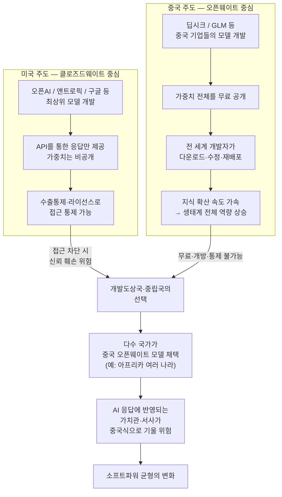
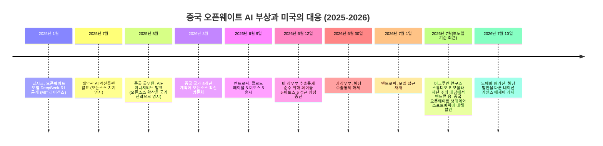

- **작성일: 2026년 7월 24일**
- **대상 발언: Threads(@choi.openai) 게시물 및 관련 유튜브 영상에서 인용된 앤드류 응 교수의 발언**

> 
> https://www.threads.com/@choi.openai/post/DbJoo0XikNC
> 
> 앤드류 응(Andrew Ng) 교수는 “몇 년 전엔 중국이 AI 혁신 방식에서 미국보다 훨씬 더 개방적이 될 줄은 몰랐어요”라며 AI 생태계의 판도 변화를 짚었습니다.
> 
> 중국 기업들이 DeepSeek 등 오픈 웨이트(가중치 공개) 모델을 적극 공유해 기술 확산 속도를 끌어올렸고, 그 결과 글로벌 오픈소스 AI 시장을 주도하게 되었습니다.
> 
> 반면 미국 빅테크들은 비공개 모델 중심이라 전 세계 개발자 생태계 포섭에서 밀릴 위험이 있다는 분석입니다.
> 
> 그는 AI가 답변을 통해 국가의 가치관과 소프트파워를 전파한다는 점에 주목했습니다. 자유와 민주주의 가치를 지키기 위해서라도 개방형 AI 생태계 확대에 힘써야 한다고 강조했습니다: **“그러니 우리도 널리 내놓아야 해요.”**
> 
> **관련 영상** : [**Andrew Ng and David S. Goyer: Creativity, Intelligence, and What We’re building Toward.**](https://youtu.be/J4CjiTtggfY?si=07EtILFhZdKPvlmL)
> 

---

## 1. 이 문서의 목적과 검증 방법에 대한 안내

이 문서는 사용자가 공유한 Threads 게시물(`@choi.openai`, 게시물 ID `DbJoo0XikNC`)과 함께 첨부된 유튜브 링크(`J4CjiTtggfY`)에서 인용된 앤드류 응 교수의 발언을 최대한 상세하고 정확하게 풀어 설명하기 위해 작성되었습니다.

다만 먼저 투명하게 밝혀야 할 점이 있습니다. Threads 게시물 원문은 자동화된 접근을 차단하고 있어 직접 열람할 수 없었고, 첨부된 유튜브 링크 역시 서버 접근 제한(429 오류)으로 직접 재생하거나 자막을 확인할 수 없었습니다. 대신 이 발언의 출처가 되는 실제 행사와 발언 내용을 교차 검증하기 위해 여러 언론 보도와 1차 자료를 검색했고, 그 결과 이 발언이 나온 정확한 원출처로 보이는 자료를 찾아냈습니다. 바로 **노에마 매거진(Noema Magazine)** 이 2026년 7월 10일 게재한 네이선 가델스(Nathan Gardels) 편집장의 에세이 "China's Open AI Models Are Advancing Its Global Soft Power"입니다. 이 글은 앤드류 응 교수가 로스앤젤레스에서 열린 한 대담 행사에서 한 발언을 상세히 인용하고 있으며, 실제 대담 영상도 함께 임베드되어 있습니다.

이 문서에서 설명하는 내용은 대부분 이 노에마 매거진 기사와 그 안에 인용된 응 교수의 발언, 그리고 관련 사실관계를 뒷받침하는 추가 자료들을 바탕으로 재구성한 것입니다. Threads 게시물에 나온 "몇 년 전엔 중국이 AI 혁신 방식에서 미국보다 훨씬 더 개방적이 될 줄은 몰랐어요"라는 구체적인 문장 자체는 원본 영상을 직접 확인하지 못해 한 글자 한 글자 대조할 수는 없었지만, 그 취지와 맥락은 아래에서 설명할 확인된 발언들과 정확히 일치합니다. 이 부분은 3절 말미와 8절 팩트체크 섹션에서 다시 한번 명확히 구분해 안내합니다.

---

## 2. 발언이 나온 자리: 할리우드와 실리콘밸리가 만난 대담

이 발언은 일반적인 테크 콘퍼런스가 아니라, **버그루엔 연구소(Berggruen Institute)의 미디어 조직인 '스튜디오 B(Studio B)'** 와 **모질라 재단(Mozilla Foundation)** 이 공동 주최한 로스앤젤레스 행사에서 나왔습니다. 이 자리는 할리우드 영화 제작자들을 대상으로 한 모임이었고, 앤드류 응 교수는 시나리오 작가이자 소설가, 게임 시나리오 작가로 유명한 **데이비드 고이어(David S. Goyer)** 와 대담을 나눴습니다. 고이어는 '블레이드' 3부작, '슈퍼맨 대 배트맨', '콜 오브 듀티: 블랙 옵스' 시리즈의 각본가로 잘 알려진 인물입니다.

버그루엔 연구소의 스튜디오 B는 억만장자 투자자이자 철학자로도 불리는 니콜라스 버그루엔이 설립한 싱크탱크의 미디어 부문으로, 그동안 에릭 슈미트와 애슈턴 커처, 리드 호프먼과 J.J. 에이브럼스, 유발 하라리와 조셉 고든레빗 등 기술계와 창작계 인사를 짝지어 대담을 여는 살롱 시리즈를 운영해 왔습니다. 이번 앤드류 응-데이비드 고이어 대담도 이런 시리즈의 연장선에 있는 행사로 보입니다.

즉 이 발언은 AI 개발자들만 모인 폐쇄적인 기술 콘퍼런스가 아니라, **AI가 스토리텔링과 문화, 그리고 국가의 소프트파워에 미치는 영향을 논의하는 자리**에서 나왔다는 점이 중요합니다. 이 맥락을 이해해야 응 교수가 왜 오픈웨이트 모델 이야기를 하다가 갑자기 "톈안먼 사건에 대해 AI에게 물어보면 어떤 답이 나올까"라는 질문으로 넘어갔는지 납득이 됩니다.

---

## 3. 앤드류 응은 누구이며, 왜 이 발언이 무게를 갖는가

앤드류 응 교수의 발언에 특별한 신뢰가 실리는 이유는 그가 미국과 중국 AI 생태계를 모두 최전선에서 경험한 몇 안 되는 인물이기 때문입니다.

- 스탠퍼드 대학교 겸임교수이자 머신러닝 대중화에 크게 기여한 온라인 교육 플랫폼 코세라(Coursera)의 공동창업자입니다.
- 구글 브레인(Google Brain) 프로젝트를 창설하고 이끈 인물입니다.
- 2014년부터 수년간 중국 최대 기술기업 바이두(Baidu)의 수석과학자(Chief Scientist)로 재직하며 약 1,300명 규모의 AI 조직을 이끌었습니다. 바이두는 검색 트래픽 기준 중국 내 점유율이 매우 높은 기업입니다.
- 오픈AI의 샘 올트먼과 앤트로픽의 다리오 아모데이가 한때 그의 밑에서 일했거나 그의 강의를 들은 인연이 있습니다.
- 현재는 딥러닝닷에이아이(DeepLearning.AI) 창업자, AI 펀드(AI Fund) 매니징 제너럴 파트너, 랜딩AI(LandingAI) 이사회 의장 등 여러 직함을 갖고 있습니다.

즉 그는 실리콘밸리와 중국 AI 산업 양쪽에서 조직을 실제로 운영해본 몇 안 되는 인물이라는 점에서, "중국의 AI 혁신 방식이 미국보다 개방적이다"라는 그의 평가는 단순한 외부 관찰자의 인상비평이 아니라 내부자적 경험에 기반한 진단으로 받아들여집니다.

Threads 게시물이 인용한 "몇 년 전엔 중국이 AI 혁신 방식에서 미국보다 훨씬 더 개방적이 될 줄은 몰랐어요"라는 문장은, 바로 이런 이력을 가진 인물이 스스로도 예상하지 못했던 판도 변화를 인정하는 발언이라는 점에서 무게가 있습니다. 실제로 확인된 노에마 매거진 기사에서도 응 교수는 "지난 몇 년 사이 중국이 AI 역량 면에서 크게 앞서나갔다"는 취지로, 시간이 흐르며 상황이 반전되었다는 점을 강조하고 있어, Threads 게시물이 전하는 뉘앙스와 상당히 부합합니다.

---

## 4. 핵심 주장 ①: 오픈웨이트 모델과 '지식 확산 속도'

응 교수가 가장 먼저 강조한 것은 **오픈웨이트(open-weight) 모델**이라는 개념 자체입니다. 이해를 돕기 위해 그가 대담에서 설명한 개념을 풀어보면 다음과 같습니다.

AI 모델을 만드는 과정은 방대한 데이터를 학습시켜 '가중치(weights)'라 불리는 숫자들의 집합을 만들어내는 과정입니다. 오픈웨이트 모델이란 이 가중치 전체를 인터넷에 무료로 공개해 누구나 내려받아 자신의 컴퓨터에서 직접 AI를 구동할 수 있게 하는 방식을 말합니다. 이는 오픈AI, 앤트로픽, 구글 제미나이처럼 가중치 자체는 공개하지 않고 오직 프롬프트를 보내면 그에 대한 응답만 돌려받을 수 있는 '클로즈드웨이트(closed-weight)' 방식과 대비됩니다.

응 교수는 중국의 여러 AI 기업들이 이런 오픈웨이트 모델을 적극적으로 공개해온 것을 "매우 영리한 전략"으로 평가했습니다. 그 이유는 오픈웨이트 모델이 조직 내부와 생태계 전반의 지식 확산 속도를 극적으로 끌어올리기 때문이라는 것입니다. 특정 기업 하나가 독점적으로 연구 성과를 쌓아가는 방식보다, 모델을 공개해 전 세계 개발자들이 이를 개선하고 실험하고 다시 파생 모델을 만들어내는 방식이 훨씬 빠른 집단적 학습을 만들어낸다는 논리입니다.

그 결과로 응 교수는 "지난 몇 년간 중국이 AI 역량 면에서 크게 도약했다"고 평가하면서, 현재 시점에서는 최상위권 폐쇄형 모델(오픈AI, 앤트로픽, 구글 등)은 여전히 미국이 앞서 있지만, **오픈웨이트 모델 부문에서는 중국이 세계를 주도하고 있다**고 진단했습니다. 그 결과 개방형 대안을 원하는 많은 국가들이 중국 모델을 채택하고 있으며, 특히 아프리카 여러 나라에서는 딥시크(DeepSeek)를 비롯한 중국 모델들이 미국 모델보다 훨씬 폭넓게 쓰이고 있다고 지적했습니다.

---

## 5. 핵심 주장 ②: AI는 답변을 통해 '가치관'을 퍼뜨린다 — 소프트파워로서의 AI

이 대담에서 가장 인상적인 대목은, 왜 이것이 단순한 기술 경쟁이 아니라 국가 간 소프트파워 경쟁인지를 설명한 부분입니다. 응 교수는 두 가지 이유를 들었습니다.

**첫 번째 이유: 스토리텔링과 가치관의 전파.** 응 교수는 할리우드가 오랫동안 미국의 자유와 민주주의 가치를 세계에 전파하는 강력한 소프트파워 수단이었다는 점을 상기시켰습니다. 그러면서 AI도 마찬가지 역할을 하게 될 것이라고 지적했습니다. 그가 든 예시가 특히 인상적입니다. 누군가 AI에게 1989년 톈안먼 사건에 대해 묻는다면, 그 사람이 어떤 나라의 모델을 쓰고 있는지에 따라 완전히 다른 답변을 받게 될 것이라는 것입니다. 즉 AI 모델은 단순한 정보 검색 도구가 아니라, 그 모델을 만든 국가의 가치관과 서사를 은연중에 전달하는 매개체가 된다는 뜻입니다. 그렇기 때문에 자유와 민주주의의 가치를 지지하는 진영이 AI를 폭넓게 보급하는 일은 그 자체로 중요한 소프트파워 전략이 된다는 것이 그의 핵심 논지입니다.

**두 번째 이유: AI 공급망 지배력.** 응 교수는 AI가 이제 수많은 소프트웨어 제품을 만드는 공급망의 핵심 구성요소가 되었다고 지적했습니다. 만약 점점 더 많은 기업들이 중국이 지배적인 위치를 차지한 공급망 위에서 제품을 개발하게 된다면, 이는 미국에도 여러 함의를 갖게 되고 동시에 기술 발전 방향을 주도할 미국의 능력도 약화시킬 것이라고 우려했습니다.

이 두 가지를 종합하면 Threads 게시물이 전한 "그러니 우리도 널리 내놓아야 해요"라는 취지의 결론과 정확히 맞아떨어집니다. 즉 응 교수의 논지는 단순히 "중국이 잘하고 있다"는 감탄이 아니라, "자유주의 진영도 이 경쟁에서 지지 않으려면 폐쇄적인 태도를 버리고 더 적극적으로 개방형 모델을 세계에 내놓아야 한다"는 정책적 제언에 가깝습니다.

---

## 6. 최근 사례로 뒷받침된 우려: 앤트로픽 모델 수출통제 사태

응 교수의 주장에 특히 설득력을 더한 것은 매우 최근에 실제로 벌어진 사건입니다. 노에마 매거진 기사는 앤트로픽의 최신 고성능 모델인 **'페이블 5(Fable 5)'에 대한 해외 접근이 백악관 조치로 일시 중단되었다가 이후 검토를 거쳐 다시 허용된 사건**을 직접 언급하며, 응 교수가 이 사건을 예로 들어 우려를 표했다고 전하고 있습니다.

실제로 이 사건의 타임라인을 정리하면 다음과 같습니다. 앤트로픽의 새로운 최상위 등급 모델인 클로드 페이블 5(Claude Fable 5)와 클로드 미토스 5(Claude Mythos 5)는 2026년 6월 9일 처음 출시되었습니다. 그런데 사흘 뒤인 2026년 6월 12일, 미국 상무부의 수출통제 규정을 준수하기 위해 앤트로픽은 두 모델에 대한 접근을 중단했습니다. 이후 상무부가 2026년 6월 30일 해당 통제를 해제했고, 앤트로픽은 이튿날인 2026년 7월 1일부터 접근을 다시 허용했습니다.

응 교수는 바로 이 사례가 "미국이 마음만 먹으면 AI 기술에 대한 접근을 언제든 끊어버릴 수 있다는 사실을 전 세계에 보여준 사건"이라고 평가했습니다. 그 결과 전 세계 여러 국가의 정책 결정자들 사이에서 자국의 AI 공급을 스스로 확보해야 한다는 위기감이 커졌고, 이것이 오히려 오픈웨이트 모델에 대한 관심을 더욱 부채질하는 역설적인 결과를 낳고 있다는 것입니다. 일단 모델의 가중치를 손에 넣고 나면 누구도 그것을 다시 빼앗아갈 수 없기 때문입니다. 응 교수는 이런 흐름이 장기적으로 미국의 소프트파워에 오히려 부정적인 영향을 미칠 가능성이 크다고 내다봤습니다.

이 사건은 응 교수가 말한 "폐쇄형 전략의 부작용"을 실증하는 사례로 언급되었다는 점에서, 그의 주장이 단순한 이론이 아니라 실제 벌어지고 있는 정책 현실에 기반해 있음을 보여줍니다.

---

## 7. 다른 목소리들: 백악관 자문위원과 반론들

이 논쟁이 응 교수 한 사람만의 견해가 아니라는 점도 짚어볼 필요가 있습니다.

노에마 매거진 기사에 따르면 트럼프 대통령의 과학기술자문위원회 공동의장인 **데이비드 색스(David Sacks)** 도 최근 중국 스타트업 지에이아이(Z.ai)의 최신 프론티어 모델인 **GLM-5.2**를 두고 경종을 울렸습니다. 그는 오픈AI와 앤트로픽의 현재 최상위 모델과 견줄 만한 성능을 갖춘 중국산 오픈웨이트 모델이 이미 존재한다는 점을 지적하며 응 교수의 우려에 힘을 실었습니다.

반면 균형 잡힌 시각을 위해 반론이나 보완적 시각도 함께 소개할 필요가 있습니다.

**대만 출신 컴퓨터과학자 리카이푸(Kai-Fu Lee)** 는 중국의 검열 체제가 대형언어모델을 현실과 다르게 왜곡시킬 가능성에 대한 질문에, 사실 이런 문화적·정치적 가치관의 각인은 중국만의 문제가 아니라 어디서나 나타나는 현상이라고 답했습니다. 그에 따르면 중국이 공산당에 대한 비판을 검열한다면, 서구에서는 인종이나 젠더처럼 민감한 주제에 대해 문화적으로 형성된 방식의 검열이 존재하고, 이슬람권에서는 예언자 무함마드에 대한 신성모독을 검열하는 식으로, 각 문화권이 자신들의 민감한 지점에 맞춰 AI 알고리즘의 허용 범위를 설정한다는 것입니다. 이런 관점에서 보면 오히려 이런 '다양성'이야말로 중국 오픈소스 모델이 전 세계로 확산되는 원동력이라는 분석도 함께 제시되었습니다.

한편 전 구글 최고경영자 **에릭 슈미트(Eric Schmidt)** 는 노에마 매거진과의 별도 인터뷰에서 오픈소스 확산의 위험성에 더 무게를 두는 입장을 밝혔습니다. 게이트키퍼가 없는 AI 세상은 억압적 국가나 테러 조직, 사기꾼 같은 악의적 행위자들에게도 기회를 열어준다는 것입니다. 그는 오픈소스 모델이라도 인간 피드백 기반 강화학습(RLHF) 같은 방법으로 안전장치를 마련해, 악의적인 사용자가 그 안전장치를 쉽게 제거하지 못하도록 만드는 것이 중요하다고 강조했습니다. 나아가 그는 냉전 시기 핵무기 경쟁에서 '기습 금지 원칙(no-surprise rule)'이 신뢰 구축에 기여했던 것처럼, 미국과 중국이 완전히 새로운 프론티어 AI 훈련을 시작할 때는 상대측에 사전 통보하는 규칙에 합의할 필요가 있다고 제안했습니다.

---

## 8. 왜 지금 이 이야기가 중요한가: 2026년 오픈웨이트 생태계의 현재 상황

이 발언들을 더 넓은 맥락에서 이해하기 위해, 2026년 현재 오픈웨이트 AI 생태계가 어떤 상황에 놓여 있는지도 짚어볼 필요가 있습니다. 다만 아래 수치는 단일 매체(테크플래닛)의 분석 기사에서 확인된 것으로, 노에마 매거진 기사만큼 교차 검증이 되지는 않았다는 점을 밝혀둡니다.

해당 분석에 따르면 오픈웨이트 모델과 폐쇄형 모델 사이의 성능 격차는 2024년 1월 챗봇 아레나 벤치마크 기준 약 8%포인트였으나, 2024년 8월에는 0.5%포인트까지 좁혀졌고 2026년 3월 기준으로는 다시 3.3%포인트 정도로 소폭 벌어진 것으로 나타났습니다. 다만 격차가 다시 벌어졌다고 해도 그 성격 자체는 근본적으로 달라졌다는 것이 해당 분석의 요지입니다. 오픈웨이트 모델이 이미 실제 추론(inference) 토큰 처리량의 다수를 차지할 만큼 주류로 자리잡았다는 것입니다.

같은 분석은 중국의 오픈웨이트 전략이 우연이 아니라 명확한 국가 전략에 기반해 있다고 설명합니다. 중국 국무원의 'AI+' 이니셔티브(2025년 8월)와 국가 5개년 계획(2026년 3월)이 오픈소스 확산을 핵심 국가 방침으로 명시하고 있다는 것입니다. 그 전략적 이유로는 반도체 수출 통제를 우회하는 효과(추론 부담을 최종 사용자의 로컬 하드웨어로 분산시켜 반도체 의존도를 낮춤), 소프트파워 확보, 규제 장벽이 있는 서구 시장에서의 교두보 확보, 그리고 상대적으로 낮은 학습·배포 비용 등이 제시되었습니다.

이런 배경 지식은 응 교수의 발언이 한순간의 인상비평이 아니라, 실제로 관측 가능한 산업·정책 트렌드에 대한 진단이라는 점을 뒷받침해 줍니다.

---

## 9. 전체 구조를 한눈에 보는 다이어그램

### 9-1. 오픈웨이트 모델과 클로즈드웨이트 모델의 확산 경로 비교

### 9-2. 2025~2026년 주요 타임라인

---

## 10. 핵심 용어 정리

| 한국어 용어 | 원어 | 설명 |
|---|---|---|
| 오픈웨이트 모델 | Open-weight model | AI 모델을 학습시켜 얻은 숫자 값(가중치) 전체를 인터넷에 공개해, 누구나 내려받아 자신의 하드웨어에서 구동할 수 있게 한 모델 |
| 클로즈드웨이트 모델 | Closed-weight model | 가중치는 공개하지 않고, API를 통해 프롬프트를 보내면 그 응답만 받을 수 있는 방식의 모델 (오픈AI, 앤트로픽, 구글 제미나이 등) |
| 지식 확산 | Knowledge diffusion | 기술·연구 성과가 조직 내부와 외부 생태계로 빠르게 퍼져나가는 정도. 오픈웨이트 공개가 이 속도를 높인다는 것이 응 교수의 핵심 논지 |
| 소프트파워 | Soft power | 강제력이 아니라 문화, 가치관, 매력을 통해 다른 국가에 영향력을 행사하는 힘. 할리우드 영화가 대표적 사례로 언급됨 |
| 파운데이션 모델 레이어의 상품화 | Commoditization of the foundation-model layer | 오픈웨이트 모델의 확산으로 기반 AI 모델 자체의 가격이 급격히 낮아지고, 그 위에 애플리케이션을 만드는 계층에서 새로운 기회가 열리는 현상 |
| RLHF | Reinforcement Learning from Human Feedback | 인간의 피드백을 바탕으로 모델을 미세조정해 안전장치(가드레일)를 심는 학습 방법 |
| 수출통제 | Export control | 특정 첨단 기술이나 제품이 특정 국가·기업에 유출되지 않도록 정부가 접근을 제한하는 조치 |
| 스튜디오 B | Studio B | 버그루엔 연구소의 미디어 부문으로, 기술계와 창작계 인사를 짝지어 대담을 여는 살롱 시리즈를 운영 |

---

## 11. 팩트체크 섹션 — 출처 신뢰도별 구분

투명성을 위해 이 문서에 담긴 정보를 신뢰도 등급별로 구분합니다.

### ✅ 1차 확인됨 (직접 인용 보도, 동일 행사에 대한 직접 취재)
- 앤드류 응 교수가 버그루엔 연구소 스튜디오 B·모질라 재단 주최 로스앤젤레스 행사에서 데이비드 고이어와 대담한 사실
- 오픈웨이트 모델의 개념 설명, 중국 기업들의 오픈웨이트 공개 전략에 대한 긍정적 평가
- "지난 몇 년간 중국이 AI 역량 면에서 크게 앞서나갔다"는 취지의 발언과, 폐쇄형 모델은 미국이 여전히 앞서지만 오픈웨이트 모델은 중국이 세계를 주도한다는 진단
- 아프리카 등지에서 중국 모델(딥시크 등)이 미국 모델보다 폭넓게 채택되고 있다는 언급
- AI가 톈안먼 사건 같은 질문에 대한 답변을 통해 국가의 가치관을 전파하는 소프트파워 수단이 된다는 논지
- AI가 소프트웨어 공급망의 핵심이 되었으며, 중국 지배적 공급망에 대한 의존이 커지는 데 대한 우려
- 앤트로픽의 페이블 5 모델에 대한 해외 접근이 백악관 조치로 일시 중단되었다가 검토 후 재개된 사건 및 이에 대한 응 교수의 평가
- 클로드 페이블 5·미토스 5의 출시일(2026.6.9), 접근 중단일(2026.6.12), 수출통제 해제일(2026.6.30), 접근 재개일(2026.7.1) — 이는 별도로 확인 가능한 앤트로픽 공식 발표 내용과도 일치
- 데이비드 색스가 GLM-5.2를 두고 미국 최상위 모델과 견줄 만하다고 평가한 사실
- 리카이푸의 '검열의 문화적 상대성' 관점, 에릭 슈미트의 오픈소스 확산 위험성 및 RLHF·기습 금지 원칙 제안

**출처:** Nathan Gardels, "China's Open AI Models Are Advancing Its Global Soft Power," *Noema Magazine*, 2026년 7월 10일 게재 (버그루엔 연구소 발행)

### ⚠️ 부분 확인됨 / 단일 매체 분석 (교차검증 제한적)
- 2024~2026년 챗봇 아레나 벤치마크 기준 오픈웨이트-클로즈드웨이트 성능 격차 수치(8.04%→0.5%→3.3%)
- 중국 국무원 'AI+' 이니셔티브(2025.8), 국가 5개년 계획(2026.3)의 오픈소스 관련 세부 내용
- 위 내용은 테크플래닛(TechPlanet)의 분석 기사 한 곳에서만 확인되었으며, 다른 독립 매체를 통한 교차검증은 이루어지지 않았습니다.

### ❓ 확인 불가 (원본 접근 제한으로 직접 대조하지 못함)
- 사용자가 인용한 정확한 한국어 문장 "몇 년 전엔 중국이 AI 혁신 방식에서 미국보다 훨씬 더 개방적이 될 줄은 몰랐어요"의 원본 영어 발언 — Threads 게시물 원문과 첨부된 유튜브 영상(`J4CjiTtggfY`) 모두 접근이 차단되어 있어 이 문서 작성자가 직접 원문과 대조하지 못했습니다. 다만 위 1차 확인 항목들과 취지가 정확히 일치하므로, 같은 대담에서 나온 발언을 사용자가 요약·번역해 전달한 것으로 보입니다.
- Threads 게시물 작성자가 요약한 "그러니 우리도 널리 내놓아야 해요"라는 결론 부분 역시 같은 이유로 원문 대조는 하지 못했으나, 노에마 매거진이 인용한 응 교수의 소프트파워 논지와 방향이 일치합니다.

---

## 12. 정리: 이 발언이 던지는 질문

앤드류 응 교수의 발언을 한 문장으로 요약하면 이렇습니다. **"기술적으로 앞서 있다는 사실만으로는 충분하지 않다. 그 기술을 얼마나 개방적으로, 얼마나 널리 퍼뜨리느냐가 결국 그 기술을 만든 나라의 가치관이 세계에 얼마나 퍼지는지를 결정한다."**

이는 단순한 산업 경쟁력 문제를 넘어, AI라는 기술 자체가 21세기의 새로운 소프트파워 수단이 되고 있다는 진단입니다. 동시에 이 문서에서 함께 소개한 리카이푸나 에릭 슈미트의 시각처럼, 개방과 확산에는 검열의 문화적 편향성이나 악용 가능성이라는 또 다른 위험이 따른다는 반론도 함께 존재합니다. 앤트로픽의 페이블 5 수출통제 사건처럼 실제 정책 사례가 이 논쟁에 계속 새로운 변수를 던지고 있는 만큼, 이 주제는 앞으로도 계속 지켜볼 필요가 있는 진행형 이슈라고 할 수 있습니다.

---

## 13. 참고자료 (전체 URL 포함)

1. Nathan Gardels, "China's Open AI Models Are Advancing Its Global Soft Power," Noema Magazine, 2026.7.10.
   https://www.noemamag.com/chinas-open-ai-models-are-advancing-its-global-soft-power/

2. "The State of Open Source AI in 2026: How Open Weights Are Reshaping the AI Landscape," TechPlanet, 2026.
   https://techplanet.today/post/the-state-of-open-source-ai-in-2026-how-open-weights-are-reshaping-the-ai-landscape

3. Owen J. Daniels and Hanna Dohmen, "Open Models, Soft Power, and the Spectrum of U.S.-China Artificial Intelligence Competition," RAND Corporation, 2026.3.
   https://www.rand.org/pubs/perspectives/PEA4686-1.html

4. Anthropic, Claude Fable 5·Mythos 5 접근 관련 공지 (수출통제 정지·재개)
   https://www.anthropic.com/news/fable-mythos-access

5. Andrew Ng, "There is now a path for China to surpass the U.S. in AI," X(옛 트위터) 게시물, 2025.7.31.
   https://x.com/AndrewYNg/status/1950941108000964654

6. Andrew Ng 공식 홈페이지 (약력)
   https://www.andrewng.org/

7. 확인 시도했으나 접근 제한으로 직접 대조하지 못한 원본 자료
   - Threads 게시물(@choi.openai): https://www.threads.com/@choi.openai/post/DbJoo0XikNC
   - 유튜브 영상: https://youtu.be/J4CjiTtggfY

---

*이 문서는 2026년 7월 24일 기준으로 검색 가능한 공개 자료를 바탕으로 작성되었습니다. AI 산업 동향은 빠르게 변화하므로, 특히 GLM-5.2나 오픈웨이트-클로즈드웨이트 성능 격차 관련 수치는 이후 갱신될 수 있습니다.*
