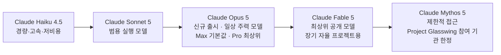
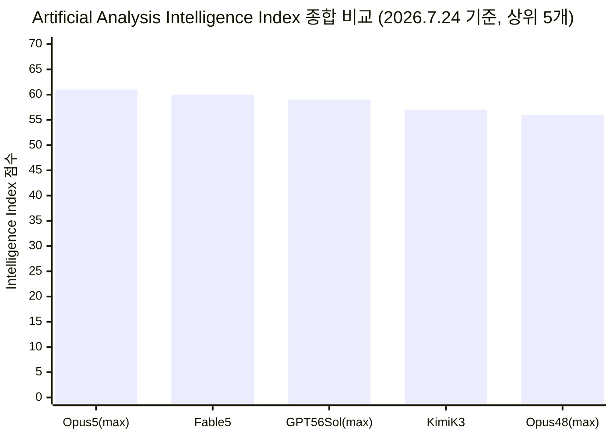
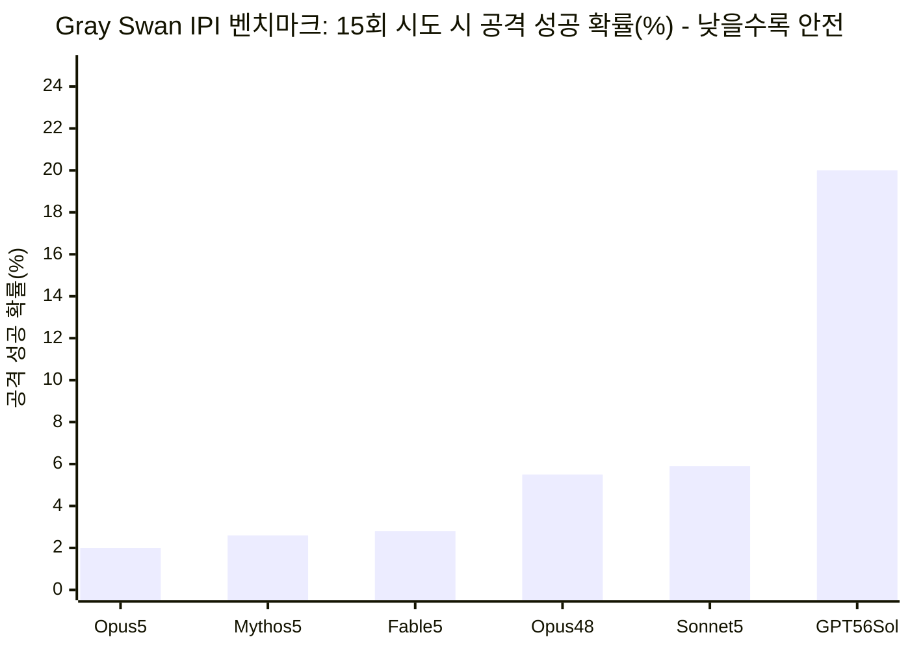

> 작성 기준일: 2026년 7월 25일 (출시 다음 날) · 모든 수치는 Anthropic 공식 발표 자료, 독립 벤치마크 기관 Artificial Analysis, 그리고 출시 당일 업계·개발자 반응을 교차 검증하여 작성했습니다.

---

## 목차

1. 개요: 무엇이, 언제, 왜 나왔나
2. 가격 정책과 제품 라인업에서의 위치
3. Anthropic 자체 발표 성능 지표
4. 독립 기관 Artificial Analysis의 평가
5. 보안: 프롬프트 인젝션 저항성 — 직원이 가장 자랑한 포인트
6. 토큰 효율성과 "effort" 파라미터
7. 정렬(Alignment)과 안전성 평가
8. 약점: 사실 지식과 환각률 상승
9. 커뮤니티·업계 반응 — 왜 여론이 갈렸는가
10. 종합 평가 및 실무적 시사점
참고문헌

---

## 1장. 개요: 무엇이, 언제, 왜 나왔나

2026년 7월 24일(현지 시각 금요일), Anthropic은 새로운 대형 언어모델 **Claude Opus 5**를 출시했습니다. 이 모델은 Anthropic이 올해 6월부터 이어온 "Claude 5 세대" 출시 흐름의 네 번째 모델입니다. 순서를 정리하면 다음과 같습니다.

- 2026년 6월 9일: Claude Mythos 5, Claude Fable 5 동시 출시 (두 모델은 사실상 같은 기반 모델이며, Fable 5는 생물학·사이버보안·LLM 연구개발 영역에 추가 안전장치가 적용된 버전)
- 2026년 6월 12일: 미국 상무부의 수출통제 지침에 따라 Mythos 5와 Fable 5에 대한 접근이 일시 중단됨
- 2026년 6월 30일: 수출통제가 해제되며 두 모델에 대한 접근이 복원됨
- 2026년 6월 30일: Claude Sonnet 5 출시
- 2026년 7월 24일: **Claude Opus 5 출시**

Anthropic은 Opus 5를 "사려 깊고 능동적인(thoughtful and proactive) 모델로, 절반의 가격에 Fable 5의 프런티어 지능에 근접한다"고 소개했습니다. 즉 이번 출시의 핵심 메시지는 "더 똑똑해졌다"가 아니라 **"거의 최상위급 지능을 훨씬 싼 값에, 매일 쓸 수 있는 형태로 제공한다"** 는 경제성 중심의 포지셔닝입니다. 실제로 여러 외신은 이번 출시를 두고 AI 경쟁의 무게중심이 "순수 성능 경쟁"에서 "일상 업무에서의 비용 대비 성능 경쟁"으로 옮겨가고 있다는 신호로 해석했습니다[2].

다만 Anthropic 스스로도 분명히 선을 긋습니다. Opus 5가 자사에서 가장 똑똑한 모델이라고 주장하지 않으며, 그 자리는 여전히 Fable 5의 몫이라는 것입니다. 사이버보안 작업에서는 Mythos 5에 뒤처진다는 점도 공식 발표문에 명시되어 있습니다[1][8].

한편 이번 발표와 같은 날, CNBC는 Anthropic이 정부 기관과 사전 배포·테스트 협력을 계속하고 있으며 이는 Opus 5에도 적용되었다고 보도했습니다. Opus 5는 공격적 사이버보안(offensive cybersecurity)과 생물학 연구 영역에서는 Mythos 5보다 낮은 능력을 유지하도록 설계되었습니다[3].

---

## 2장. 가격 정책과 제품 라인업에서의 위치

Opus 5의 가격은 입력 토큰 100만 개당 5달러, 출력 토큰 100만 개당 25달러로, 전작인 Opus 4.8과 완전히 동일합니다[1][4]. 즉 가격은 그대로 두고 성능만 끌어올린 세대교체입니다. 이는 Fable 5 대비 절반 수준의 가격입니다.

제품 라인업 내 위치도 명확하게 조정되었습니다.

- Claude Max(프리미엄 구독) 요금제의 새로운 기본 모델로 지정
- Claude Pro 요금제에서 사용할 수 있는 가장 강력한 모델로 지정
- Fable 5는 "며칠에 걸친 자율 프로젝트"처럼 더 고난도 작업을 위한 상위 모델로 유지

또한 데이터 보관 정책에서도 차이가 있습니다. Fable 5는 안전 목적상 사용자 입력·출력을 30일간 보관하지만, Opus 5는 이전 Opus 모델들과 마찬가지로 일반 사용에서 별도의 데이터 보관 요건이 없습니다[5].

기술적으로는 100만 토큰 컨텍스트 윈도우를 기본값이자 최대값으로 제공하며[10], "Fast 모드"를 통해 기본 대비 약 2.5배 빠른 속도로 실행할 수 있습니다. 다만 Fast 모드는 기본 가격의 두 배가 적용됩니다[1].

아래는 2026년 7월 25일 기준 Claude 모델 라인업의 구조를 정리한 것입니다.

---

## 3장. Anthropic 자체 발표 성능 지표

Anthropic이 공개한 벤치마크 자료는 크게 코딩·에이전트 작업 계열과 지식노동·문제해결 계열로 나뉩니다. 아래는 Anthropic이 발표한 자체 측정치이며, 비교 대상은 Claude Fable 5, Claude Opus 4.8, 그리고 OpenAI의 GPT-5.6 Sol입니다.

### 코딩·에이전트 계열

| 평가 항목 | Opus 5 | Fable 5 | Opus 4.8 | GPT-5.6 Sol |
|---|---|---|---|---|
| 에이전트 터미널 코딩 (Frontier-Bench v0.1) | **43.3%** | 33.7% | 21.1% | 34.4% |
| 에이전트 검색 (BrowseComp) | **90.8%** | 87.4% | 84.3% | 90.4% |
| 컴퓨터 사용 (OSWorld 2.0) | **70.6%** | 66.1% | 55.7% | 62.6% |
| 에이전트 코딩 (DeepSWE v1.1) | 68.8% | 69.7% | 59.0% | **72.7%** |
| 에이전트 코딩 (FrontierCode v1.1, Main) | **53.4%** | 53.5% | 46.5% | 47.5% |
| 업무 자동화 (Zapier AutomationBench) | **26.0%** | 17.4% | 17.0% | 18.1% |

주목할 점은 Frontier-Bench v0.1에서 Opus 5가 Opus 4.8 대비 두 배 이상의 점수를 기록했고, 비용은 오히려 더 낮았다는 것입니다. 반면 DeepSWE v1.1 한 항목에서는 GPT-5.6 Sol이 근소하게 앞섰습니다. 즉 Opus 5가 모든 벤치마크를 싹쓸이한 것은 아니며, Anthropic 스스로도 이 표에서 GPT-5.6 Sol의 우위를 굳이 가리지 않고 그대로 공개했습니다.

CursorBench 3.2에서는 최대 노력(max effort) 설정 기준으로 Fable 5 최고 점수의 0.5% 이내까지 근접하면서도 비용은 절반 수준이었다고 밝혔습니다[1].

### 지식노동·문제해결 계열

| 평가 항목 | Opus 5 | Fable 5 | Opus 4.8 | GPT-5.6 Sol |
|---|---|---|---|---|
| 지식노동 (GDPval-AA v2, Elo) | **1861** | 1747 | 1593 | 1736 |
| 신규 문제 해결 (ARC-AGI-3) | **30.2%** | — | 1.5% | 7.8% |
| 다학제 추론, 도구 미사용 (HLE) | 56.3% | 56.5% | 49.8% | — |
| 다학제 추론, 도구 사용 (HLE) | **64.7%** | 63.9% | 57.9% | — |
| 법률 (Legal Agent Benchmark, Held-out) | 11.7% | **13.3%** | 10.4% | 2.5% |
| 헬스케어 (HealthBench Professional) | 59.8% | 57.4% | 57.4% | **60.5%** |

특히 ARC-AGI-3(신규 문제 해결력을 측정하는 평가)에서 Opus 5는 차순위 모델 대비 약 3배 높은 점수를 기록했다고 Anthropic은 밝혔습니다[1]. 다만 법률·헬스케어처럼 전문 지식 의존도가 높은 영역에서는 Fable 5나 GPT-5.6 Sol이 근소하게 앞서는 경우도 있어, "전 영역 1위"라는 식의 단순화는 사실과 다릅니다.

### 과학 연구 영역

Opus 5는 생명과학 관련 내부 평가 전 항목에서 Opus 4.8보다 향상되었습니다. 특히 분광 데이터로부터 분자 구조를 추론하는 유기화학 과제에서 Opus 4.8보다 10.2%p 높은 점수를, 단백질 서열 변이가 기능에 미치는 영향을 예측하는 과제에서는 7.7%p 높은 점수를 기록했습니다[1].

### 노력(effort) 수준에 따른 성능-비용 곡선

Opus 5는 low·medium·high·xhigh·max의 5단계 effort(노력) 설정을 제공합니다. OSWorld 2.0(컴퓨터 사용 벤치마크)에서 이 다섯 단계에 따른 점수와 과제당 비용을 표시한 그래프를 보면, Opus 5는 약 9달러의 비용에서 60.4%, 약 27달러의 비용에서 70.6%를 기록하며 모든 비용 구간에서 Fable 5·Opus 4.8·GPT-5.6 Sol보다 위쪽(더 효율적인 곡선)에 위치했습니다. 특히 Fable 5의 최고 점수(66.1%, 약 47달러)를 Opus 5는 그 3분의 1 수준의 비용(약 20달러 안팎)에서 이미 넘어섰습니다[1].

---

## 4장. 독립 기관 Artificial Analysis의 평가

Anthropic은 출시 전 독립 벤치마크 기관인 Artificial Analysis에 평가를 의뢰했다고 밝혔으며, 해당 기관은 출시와 동시에 자체 분석 글을 게재했습니다[7].

### 종합 지능 지수(Intelligence Index)에서 근소한 1위

Artificial Analysis Intelligence Index v4.1은 GDPval-AA v2, τ³-Banking, Terminal-Bench v2.1, SciCode, Humanity's Last Exam, GPQA Diamond, CritPt, AA-Omniscience, AA-LCR 등 9개 평가를 종합한 지수입니다. 이 지수에서:

- Claude Opus 5 (max): **61점** — 1위
- Claude Fable 5 (with fallback): 60점 — 2위
- GPT-5.6 Sol (max): 59점 — 3위
- Kimi K3 (중국 Moonshot AI의 오픈웨이트 모델): 57점
- Claude Opus 4.8 (max): 56점

Artificial Analysis는 이를 두고 "근소하게 가장 지능적인 모델(narrowly the most intelligent model)"이라고 표현했습니다[7]. 1점 차이라는 근소한 격차이지만, 여기서 중요한 것은 비용입니다. 지수를 구성하는 과제 하나당 평균 비용이 Opus 5는 2.03달러, Fable 5는 2.75달러로, Opus 5가 약 26% 더 저렴합니다[7].

### 실전 업무 품질에서는 격차가 뚜렷

지능 지수에서는 근소한 차이였지만, 실제 업무 결과물의 품질을 겨루는 벤치마크에서는 격차가 훨씬 컸습니다.

**GDPval-AA v2**는 모델에게 실제 직업 현장의 업무를 수행시키고 결과물 품질을 사람의 업무 수준(Elo 1000을 인간 기준선으로 설정)에 견주어 평가하는 벤치마크입니다. 여기서 Opus 5(max)는 **1861 Elo**를 기록해 Fable 5보다 114점, GPT-5.6 Sol보다 100점 이상 앞섰습니다[7].

**AA-Briefcase**는 Artificial Analysis가 자체 개발한 에이전트형 지식노동 벤치마크로, 규칙 통과율(rubric pass rate)·분석 품질 Elo·발표자료 품질 Elo를 종합한 지표입니다. 여기서도 Opus 5(max)는 **1720 Elo**로 Fable 5보다 146점 앞섰습니다[7].

두 벤치마크 모두 "정확하고 보기 좋게 정리된 전문가 수준의 결과물"(보고서, 분석 자료, 문서 등)을 만드는 능력을 측정한다는 공통점이 있습니다. 즉 순수한 "정답을 맞히는 지능"보다 "결과물을 완성해서 넘기는 능력"에서 Opus 5의 강점이 더 뚜렷하게 나타난다고 해석할 수 있습니다.

### 코딩 에이전트 지수

Artificial Analysis Coding Agent Index v1.3(DeepSWE, Terminal-Bench v2, SWE-Atlas-QnA 종합)에서는 Claude Code 하네스로 실행한 Codex(GPT-5.6 Sol, max)가 67점으로 공동 1위였고, Claude Code로 실행한 Opus 5(xhigh)도 67점 안팎, Fable 5(fallback 포함)와 Opus 5(max)가 66점 수준으로 뒤를 이었습니다. Grok Build의 Grok 4.5(high)가 64점으로 근접했고, Opus 4.8(max)은 61점으로 한 단계 아래에 위치했습니다. 이 지수에서는 어떤 모델이든 "어떤 코딩 하네스(Claude Code, Codex, Cursor CLI 등)로 실행했는가"에 따라 점수가 달라진다는 점도 함께 표기되어 있어, 모델 단독 성능과 하네스 조합 성능을 구분해서 봐야 한다는 점을 시사합니다.

### 효율성 개선의 한계도 함께 지적

Artificial Analysis는 긍정적 결과만 전하지 않았습니다. Opus 5의 효율성 우위는 지능-비용 곡선의 **높은 쪽 구간에서만** 뚜렷하게 나타나며, 낮은 effort 설정에서는 오히려 GPT-5.6 계열보다 동일 지능 대비 비용이 약간 더 높다고 지적했습니다[29]. 또한 effort 단계 간 격차가 이례적으로 크다는 점도 짚었습니다. GDPval-AA v2 기준으로 low에서 max로 올릴 때 407 Elo 포인트가 벌어지며, 이 구간에서 출력 토큰 사용량은 약 8배까지 증가합니다[29]. 즉 effort 설정을 잘못 고르면 비용이 예상보다 훨씬 커질 수 있다는 뜻이므로, 실무에서는 과제 난이도에 맞춰 effort를 세심하게 조정하는 것이 비용 관리의 핵심 변수가 됩니다.

---

## 5장. 보안: 프롬프트 인젝션 저항성 — 직원이 가장 자랑한 포인트

이번 출시에서 흥미로운 지점은, Anthropic 내부 직원들이 여러 지능 지표보다 **보안 지표**를 더 강조했다는 사실입니다. Claude Code를 이끄는 Boris Cherny는 출시 직후 공개적으로, 이 모든 평가 점수보다 자신을 더 흥분시킨 것은 따로 있으며 Opus 5가 Anthropic이 만든 모델 중 프롬프트 인젝션에 가장 잘 저항하는 모델이라는 취지로 밝혔습니다. 그는 이 결과가 시스템 카드 안에 다소 묻혀 있었다고도 언급했습니다[11][53].

### 왜 프롬프트 인젝션이 중요한가

간접 프롬프트 인젝션(indirect prompt injection)이란, 사용자가 AI 에이전트에게 읽으라고 준 자료(이메일, PDF, 웹페이지, 상품 상세 페이지 등) 안에 공격자가 숨겨둔 명령어가 들어 있어서, 에이전트가 사용자의 의도와 무관한 행동을 하게 되는 공격 방식입니다. 이는 AI 에이전트가 실제 업무 데이터에 연결될 때 가장 위험한 취약점으로 꼽히며, 많은 자동화 프로젝트가 파일럿 단계에서 더 나아가지 못하는 이유이기도 합니다[53].

이를 측정하는 대표적 지표가 **Gray Swan IPI 벤치마크**입니다. Gray Swan AI는 영국 AISI, 미국 CAISI, 그리고 OpenAI·Anthropic·Meta 등 여러 프런티어 연구소와 협력해 이 벤치마크를 설계했으며, k회 시도 안에 공격이 성공할 확률을 측정합니다.

### 측정치

| 모델 | 1회 시도 성공률 | 10회 시도 성공률 | 15회 시도 성공률 |
|---|---|---|---|
| **Claude Opus 5** | 0.2% | 1.6% | **2.0%** |
| Claude Mythos 5 | 0.3% | 2.1% | 2.6% |
| Claude Fable 5 | 0.4% | 2.3% | 2.8% |
| Claude Opus 4.8 | 0.5% | 4.1% | 5.5% |
| Claude Sonnet 5 | 0.6% | 4.7% | 5.9% |
| GPT-5.6 Sol | 3.1% | 16.3% | 20.0% |
| GPT-5.6 Terra | 5.4% | 26.0% | 30.4% |
| GPT-5.6 Luna | 8.3% | 38.6% | 43.9% |
| GPT-5.5 | 3.0% | 17.4% | 20.8% |
| Muse Spark | 2.9% | 14.3% | 16.5% |
| Gemini 3.6 Flash | 7.3% | 32.2% | 37.3% |
| Gemini 3.1 Pro | 14.2% | 45.7% | 49.2% |
| Gemini 3.5 Flash | 14.1% | 54.2% | 60.5% |
| Grok 4.5 | 13.4% | 54.2% | 60.8% |

(수치는 낮을수록 안전함을 의미합니다.)

Anthropic 모델군(Opus 5, Mythos 5, Fable 5, Opus 4.8, Sonnet 5)이 GPT·Gemini·Grok 계열과 비교해 한 자릿수 이내로 뚜렷하게 낮은 값을 기록하고 있으며, 그중에서도 Opus 5가 가장 낮은 값을 보였습니다.

시스템 카드에 실린 별도 수치도 있습니다. Claude Cowork를 통한 브라우저 환경 테스트에서, 안전장치를 전혀 적용하지 않은 상태의 공격 성공률은 Opus 4.8의 31.5%에서 Opus 5에서는 3.70%로 낮아졌습니다. 여기에 "Auto Mode"까지 적용하면 129개 테스트 환경 전체에서 성공률이 0%까지 떨어졌습니다[48].

Boris Cherny는 모델 자체의 정렬(alignment), 인젝션 탐지 프로브, 그리고 Claude Code의 Auto Mode를 겹겹이 쌓으면 공격 성공률이 사실상 0에 가깝게 떨어진다고 설명했습니다[11]. 다만 이는 "위험이 완전히 사라졌다"는 뜻은 아니며, 관리 가능한 수준으로 낮아졌다는 의미로 받아들이는 것이 정확합니다. Gray Swan 자체도 과거 유사 대회에서 "어떤 모델도 완전히 면역되지는 않았다"고 밝힌 바 있습니다[51].

---

## 6장. 토큰 효율성과 "effort" 파라미터

Anthropic의 프롬프트 엔지니어링 팀을 이끄는 Alex Albert는 출시 그래프를 공유하며, 지능의 기준선을 끌어올리면서도 모든 영역에서 토큰 효율이 좋은 모델을 만드는 데 상당한 노력을 기울였다고 밝혔습니다. 그는 사용 경험이 매우 매끄러우며, 여러 코딩 작업에서 Fable 5보다 Opus 5를 선호한다고 덧붙였습니다[20].

이러한 토큰 효율성 개선은 실제 얼리 액세스 고객들의 발언에서도 반복적으로 확인됩니다.

- 리걸테크 기업 Harvey의 응용연구 총괄 Niko Grupen은, Opus 5가 Opus 4.8의 최대 추론 모드와 비슷한 성능을 내면서도 평균 26% 더 적은 토큰을 생성했다고 밝혔습니다[2].
- 금융 리서치 기업 Fundamental Research Lab의 Richard Pham은, 어려운 금융 모델링 과제에서 effort 단계 전체 평균으로 9%p 높은 정확도를, 3분의 1 적은 턴·툴 호출, 60% 적은 시간으로 달성했다고 설명했습니다[1].
- 트레이딩 자동화 기업 Composer의 Matt Nassr는, 자사 트레이딩 벤치마크에서 가장 강력한 Opus 모델이면서도 추론 토큰은 Opus 4.8의 약 7분의 1, 지연시간은 절반 이하였다고 언급했습니다[1].

### effort 파라미터의 의미

Opus 5는 low·medium·high·xhigh·max 5단계의 effort(노력 수준) 설정을 제공하며, 이는 "지능을 얼마나 깊이 쓸 것인가 대 속도·토큰을 얼마나 아낄 것인가"를 사용자가 직접 조절하는 손잡이입니다. 다만 4장에서 살펴본 것처럼, 이 손잡이의 양 끝 차이가 이례적으로 크다는 점(GDPval-AA v2 기준 407 Elo 포인트, 토큰 사용량 최대 8배 차이)은 실무에서 반드시 감안해야 할 변수입니다.

또한 이번 출시와 함께 베타로 공개된 두 가지 플랫폼 기능도 토큰·비용 관리와 관련이 깊습니다.

- **대화 중 도구 변경(Mid-conversation tool changes)**: 개발자가 대화 도중에 Claude가 사용할 수 있는 도구 목록을 프롬프트 캐시를 무효화하지 않고 바꿀 수 있습니다.
- **자동 폴백(Automatic fallbacks)**: 안전 분류기가 Opus 5(또는 Fable 5)의 요청을 차단할 경우, 자동으로 다른 모델로 라우팅되도록 설정할 수 있습니다. 이 기능을 켜면 API 요청은 기본적으로 차단되는 대신 항상 사용 가능한 최선의 모델로 라우팅됩니다[1].

---

## 7장. 정렬(Alignment)과 안전성 평가

Anthropic은 사전 배포 테스트에서 자동화된 행동 감사(automated behavioral audit) 결과, Opus 5가 지금까지 나온 모델 중 가장 정렬이 잘 된 모델이라고 밝혔습니다. Opus 4.8, Sonnet 5, Fable 5보다 Claude의 헌법(Constitution)을 더 잘 준수하며, 기만적 행동 비율이 가장 낮고, 오용을 유도하는 시도에 가장 덜 취약하다고 설명했습니다. 또한 되돌리기 어려운 부작용을 낳을 수 있는 무모한 행동을 피하는 측면에서도 지금까지 가장 안전한 모델이라고 밝혔습니다[1]. 이 감사에서 Opus 5는 전반적 정렬 불량 행동 지표에서 2.3점을 기록했으며, 이는 최근 모델 중 가장 낮은(=가장 양호한) 값입니다[1].

### 사이버보안 위험도

책임 있는 확장 정책(Responsible Scaling Policy)에 따라 Anthropic은 Opus 5를 CB-1 수준의 능력을 가진 것으로, CB-2 수준은 아닌 것으로 분류했습니다. 즉 Opus 4.8과 동일한 ASL-3 보호 조치가 적용됩니다[48].

Opus 5는 의도적으로 사이버 관련 과제에 대해 별도로 학습되지 않았음에도, 전반적인 능력 향상의 결과로 사이버보안 관련 과제에서도 실력이 크게 늘었습니다. 취약점을 **찾아내는(finding)** 능력에서는 Mythos 5에 근접했지만, 그 취약점을 실제 공격으로 **악용(exploiting)** 하는 능력에서는 Mythos 5에 상당히 뒤처집니다. 이는 Anthropic이 자체 개발한 평가인 OSS-Fuzz에서 확인되었습니다[1].

사이버 분류기(cyber classifier) 역시 Fable 5보다 비례적으로 덜 제한적으로 설정되었습니다. 소스코드 내 취약점 발견은 허용하되, 악의적 행위자와 더 관련이 깊은 "바이너리 기반 취약점 스캐닝", 침투 테스트, 익스플로잇 생성은 차단됩니다. Anthropic은 이 분류기가 Fable 5 대비 약 85% 더 적게 개입할 것으로 예상한다고 밝혔습니다[1]. 이미 사이버 검증 프로그램(Cyber Verification Program, CVP)에 참여 중인 기업·연구자는 보안 제약이 완화된 버전의 Opus 5에 즉시 접근할 수 있습니다.

### 생물학 위험도

Opus 5는 Opus 4.8과 유사한 수준의 안전장치를 갖추고 있어, 현재 일반적으로 이용 가능한 모델 중 과학 연구용으로 가장 강력한 모델이 되었습니다. 다만 장기간에 걸친 자율적 연구 과제에서는 여전히 중요한 한계를 보이는데, Anthropic은 바로 이 지점이 AI 모델의 생물학 관련 위험이 가장 크게 나타날 수 있는 영역이라고 설명합니다. 이 때문에 이러한 장기 자율 생물학 연구에서는 Mythos 5가 여전히 더 강한 모델로 남아 있습니다. 이번 출시를 계기로, Fable 5에서 차단되었던 생물학 관련 요청은 이제 Opus 4.8이 아닌 Opus 5로 라우팅됩니다[1].

---

## 8장. 약점: 사실 지식과 환각률 상승

이번 출시가 장점만으로 채워진 것은 아닙니다. Artificial Analysis의 AA-Omniscience(사실 지식과 환각을 함께 측정하는 벤치마크)에서는 뚜렷한 약점이 드러났습니다.

**정확도(accuracy)** 측면에서 Opus 5는 Opus 4.8보다 7점 개선되었지만, 여전히 Fable 5보다 낮은 사실 지식 수준을 보입니다. Artificial Analysis는 이를 두 모델의 상대적 크기(사이즈 클래스) 차이에서 비롯된 예상 가능한 결과라고 설명했습니다[28][29].

더 눈여겨봐야 할 부분은 **불확실할 때의 태도**입니다. Opus 5는 확신이 없을 때도 답변을 회피하기보다 더 자주 답변을 시도하는 경향을 보였고, 그 결과 같은 벤치마크에서 **환각률(hallucination rate)이 14점 상승한 50%** 를 기록했습니다[28][29]. (참고로 AA-Omniscience Index는 정답에는 가점을, 환각에는 감점을 주되 "모른다"고 답변을 회피하는 것에는 감점을 주지 않는 방식으로 설계되어 있습니다. 즉 이 지표는 "무리해서 답하다가 틀리는" 경향을 페널티로 잡아내도록 설계되어 있습니다[27].)

이는 실무적으로 중요한 함의를 갖습니다. Opus 5를 순수한 사실 지식 검색 용도, 즉 모델의 내부 기억에 의존해 답을 얻어야 하는 작업에 쓸 때는 이 환각률 상승을 염두에 두어야 합니다. 반면 검색 도구나 실제 참고 자료가 함께 주어지는 작업, 즉 모델이 "주어진 자료를 근거로 일하는" 상황에서는 이 약점의 영향이 상대적으로 제한적일 수 있습니다. 이 구분 — 기억에 의존하는 일과 주어진 자료로 검증하며 일하는 것의 구분 — 이 이번 벤치마크가 남기는 핵심 실무 교훈입니다.

Artificial Analysis는 또한 Opus 5의 효율성 이점이 지능-비용 곡선의 상단부(높은 effort)에서만 뚜렷하며, 낮은 effort 설정에서는 동일 지능 수준 대비 비용이 GPT-5.6 계열보다 오히려 약간 더 높다는 점도 지적했습니다[29].

---

## 9장. 커뮤니티·업계 반응 — 왜 여론이 갈렸는가

출시 당일 반응은 결코 한 방향으로 모이지 않았습니다. 긍정적 반응, 실무적으로 인상적이라는 반응, 그리고 다소 신랄한 비판까지 뒤섞여 있었습니다.

### 호평 — 실사용 파트너 기업들

Anthropic이 공개한 얼리 액세스 파트너들의 코멘트에는 다음과 같은 내용이 포함되어 있습니다.

- **Cognition(Devin 개발사) CEO Scott Wu**: FrontierCode 1.1에서 Fable급 성능에 절반 비용으로 근접했으며, 특히 어려운 디버깅과 근본 원인 분석 작업에서 강점을 보였다고 언급.
- **Cursor 공동창업자 Sualeh Asif**: CursorBench에서 Fable 5보다 근소하게 낮은 수준이지만 유사한 행동 패턴을 보이며, Opus 속도와 비용으로 Fable 5에 가까운 지능을 제공한다고 평가.
- **Zapier CEO Wade Foster**: AutomationBench 리더보드 1위를 기존 Claude 모델보다 더 많은 토큰을 쓰지 않고 달성했으며, 계정 상태 워크북 전체를 처음부터 끝까지 처리하는 이탈방지 시퀀스에서 이전 모델은 통과하지 못했지만 Opus 5는 100%를 달성했다고 밝힘.
- **Lovable 공동창업자 Fabian Hedin**: 가장 어려운 에이전틱 코딩 과제에서 Opus 4.7 대비 22% 향상되었을 뿐 아니라, 실행할 때마다의 편차가 훨씬 줄어 안정적이라고 평가.
- **Harvey 응용연구 총괄 Niko Grupen**: 법률 에이전트 작업에서 이전 Opus 모델 대비 뚜렷한 진전이 있었으며, 특히 기업지배구조·중재 분야에서 가장 큰 개선을 보였다고 언급.

기술 트위터(X)/Threads 상에서도 우호적 반응이 이어졌습니다. 영화·미디어 평론가 Christina Warren(@film_girl)은 특히 medium 단계에서 Opus 5에 깊은 인상을 받았으며 4.8보다 낫고 토큰 효율도 상당히 좋다고 언급했습니다[44]. AI 연구자 Nathan Lambert는 "Opus 5의 수치가 놀랍다. 더 빠른 반복 속도와 확장된 강화학습의 힘"이라고 평가했습니다(그는 Fable 5가 너무 커서 아직 같은 방식으로 강화학습을 적용하기 어렵다는 뉘앙스도 덧붙였습니다)[20].

### 비판·유보적 반응

가장 널리 회자된 리뷰는 프로덕트 팟캐스트 "How I AI"를 진행하는 Claire Vo가 Lenny's Newsletter에 게재한 글입니다. 제목부터가 "이 모델은 뛰어나지만 (성가시다)"였습니다. 그는 7개 모델을 대상으로 한 자신의 벤치마크에서 Opus 5를 블라인드 평가했으며, 모델의 성격을 "신경질적(neurotic)"이라고 표현했습니다. 또한 응답이 필요 이상으로 장황해지는 현상을 "Claude Slop"이라는 별명으로 지적했습니다[15][40][45].

이러한 장황함·과잉 검증 경향은 Anthropic 공식 문서에서도 일부 인정된 부분입니다. Opus 5는 요청하지 않아도 스스로 작업을 검증하고 더 긴 응답을 생성하는 경향이 있으며, 공식 안내에서는 과거 모델을 위해 작성했던 "검증하라"는 식의 레거시 지시문을 프롬프트에서 제거해 과잉 검증(over-verification)을 피하라고 권고하고 있습니다[40].

코드 리뷰 서비스 CodeRabbit의 평가도 비슷한 결을 보입니다. Opus 5는 이전 Opus 모델보다 "덜 불안해(less anxious)" 보이며, 목표를 명확히 하는 데 시간을 들이고 여러 신뢰할 만한 접근법을 제시하며 성급하게 첫 번째 해법으로 뛰어들지 않는다고 평가했습니다. 다만 작업 과정을 꼼꼼히 문서화하는 만큼 토큰을 많이 소모하며, 대규모 에이전틱 작업에서 Opus 4.8보다 훨씬 나은 설계 판단력을 보였지만 Fable 5보다는 여전히 느리고 비효율적이었고, 보안 관련 작업에서는 여전히 과도하게 조심스러운 태도를 보였다고 지적했습니다. 코드 리뷰 한 건당 Opus 5는 기준 모델 대비 약 50% 더 많이 읽고 약 65% 더 많이 작성하는 것으로 나타났습니다[22].

AI 연구자이자 컨설턴트인 Ethan Mollick은 출시 전 접근권을 통해 미리 사용해본 소감을 공유하며, "괜찮지만 다소 독특한(quirky)" 모델이라고 평가했습니다. 짧은 과제에서는 Fable 수준의 성능을 내거나 뛰어넘을 수 있지만, 긴 과제에서는 덜 야심적으로 움직이며 결과물의 완성도가 상대적으로 떨어지는 경향을 보였다고 언급했습니다[44].

Zvi Mowshowitz는 다소 도발적인 질문을 던졌습니다. Opus 5가 바이러스학(virology) 관련 능력에서 Fable 5와 최소한 비슷한 수준을 보이는데, Opus 5가 Fable 5 수준의 생물학 관련 분류기(classifier)를 필요로 하지 않는다면, 애초에 Fable 5에는 왜 그런 분류기가 필요한가라는 의문을 제기했습니다[44]. 이는 안전장치 설계의 일관성에 대한 문제 제기로 볼 수 있습니다.

투자자·엔젤 Kyle Russell은 Fable과 Opus 5 모두, 스킬·메모리가 누적된 Claude Code 환경보다 시스템 프롬프트가 최소화된 "Pi" 같은 환경에서 더 잘 작동할 것 같다는 의견을 남겼습니다[44]. 이는 누적된 지시문·컨텍스트가 오히려 모델의 자연스러운 판단력을 방해할 수 있다는, 하네스 설계 전반에 대한 함의를 담은 코멘트로 읽을 수 있습니다.

### 정리하면

이번 출시를 둘러싼 담론은 크게 두 갈래로 나뉩니다. 한쪽은 "Fable 5는 이제 실질적으로 대체되었다"는 흐름이며(가격은 절반인데 벤치마크 격차는 근소하다는 점에서), 다른 한쪽은 "벤치마크에 맞춰 최적화된 것 아니냐"는 회의적 시각입니다(성격이 산만하고, 낮은 effort 구간에서는 효율성 이점이 사라지며, 환각률이 올라갔다는 점에서). 흥미로운 점은 Anthropic 직원들이 가장 강조한 지점이 지능 수치가 아니라 **보안(프롬프트 인젝션 저항성)** 이었다는 사실이며, 이는 회사가 이번 모델을 "에이전트를 실제 업무 데이터에 안전하게 연결하기 위한 모델"로 포지셔닝하고 있음을 시사합니다.

---

## 10장. 종합 평가 및 실무적 시사점

지금까지의 내용을 종합하면 다음과 같이 정리할 수 있습니다.

**1) Opus 5는 "저렴한 준(準)최상위 모델"로 설계되었습니다.** Fable 5와의 지능 격차는 종합 지수 기준 1점에 불과하지만, 가격은 절반입니다. 다만 이는 모든 벤치마크에서 앞선다는 뜻은 아니며, DeepSWE v1.1(GPT-5.6 Sol 우세), 법률 Held-out 평가(Fable 5 우세), 헬스케어(GPT-5.6 Sol 우세) 등 예외도 분명히 존재합니다.

**2) 보안(프롬프트 인젝션 저항성)이 이번 세대의 실질적 핵심 개선점입니다.** 다층 방어(모델 정렬 + 탐지 프로브 + Auto Mode)를 적용했을 때 공격 성공률이 사실상 0에 근접한다는 점은, 외부 문서·웹페이지를 다루는 실전 에이전트 워크플로우를 설계하는 실무자에게는 지능 지수보다 오히려 더 중요한 신호일 수 있습니다.

**3) 사실 지식·환각률은 명확한 트레이드오프 영역입니다.** 환각률이 50%까지 상승했다는 점은, 검색·근거자료 없이 모델의 기억에만 의존하는 용도(순수 지식 질의응답)에서는 주의가 필요하다는 뜻입니다. 반대로 도구를 활용해 근거를 확보하며 작업하는 에이전틱 워크플로우에서는 상대적으로 이 약점의 영향이 제한적일 수 있습니다.

**4) effort 파라미터의 폭이 매우 넓어졌습니다.** low와 max 사이에 GDPval-AA v2 기준 407 Elo, 토큰 사용량 최대 8배라는 큰 격차가 존재합니다. 이는 "Opus 5를 쓴다"는 선택 자체보다 "어떤 effort로 쓰는가"가 실질적인 비용·품질 설계 변수가 되었다는 의미이며, 과제 난이도별 effort 튜닝이 이전 세대보다 더 중요해졌습니다.

**5) 장황함(과잉 검증·과잉 서술) 경향은 실사용 단계에서 조정이 필요합니다.** 공식 문서에서도 레거시 검증 지시문을 프롬프트에서 제거하라고 권고하는 만큼, 기존에 Opus 4.8이나 다른 모델을 위해 작성해둔 시스템 프롬프트·CLAUDE.md 등의 지시문을 Opus 5에 그대로 재사용할 경우 불필요하게 장황하거나 과잉 검증하는 결과물을 얻을 가능성이 있습니다.

**6) 다중 모델 오케스트레이션 관점에서 볼 때**, Opus 5는 기존에 "최후 수단 에스컬레이션" 역할로 배치되었던 상위 모델(Opus 4.8)의 자리를 상당 부분 대체할 잠재력이 있습니다. 같은 가격에 코딩·에이전트 작업 전반에서 뚜렷한 향상을 보이기 때문입니다. 다만 프롬프트 인젝션 저항성과 정렬 점수에서 Opus 5·Mythos 5·Fable 5가 나란히 상위권을 형성하고 있다는 점에서, "검증(verification)을 상위 등급 모델에 국한한다"는 설계 원칙 자체를 바꿀 근거는 아직 제한적입니다 — 사실 지식 정확도와 환각률에서는 여전히 Fable 5가 앞서기 때문에, 사실관계 검증이 중요한 단계에서는 상위 모델의 역할이 유지될 가능성이 높습니다.

---

## 참고문헌

[1] Anthropic, "Introducing Claude Opus 5," anthropic.com/news/claude-opus-5, 2026.7.24.

[2] Michael Nuñez, "Anthropic launches Claude Opus 5, a cheaper AI model for coding, agents and enterprise workflows," VentureBeat, 2026.7.24.

[3] CNBC, "Anthropic's Claude Opus 5 AI model rivals Fable 5 and is cheaper," 2026.7.24.

[4] Zac Hall, "Anthropic upgrades Claude with new Opus 5 model, details here," 9to5Mac, 2026.7.24.

[5] Fortune, "Anthropic releases Claude Opus 5: Here's how it's different than what's already out there," 2026.7.24.

[6] Yahoo Finance, "Anthropic debuts Opus 5 model as company preps for IPO later this year," 2026.7.24.

[7] Artificial Analysis, "Opus 5: Fable 5 level intelligence at a lower cost per task," artificialanalysis.ai/articles/opus-5, 2026.7.24.

[8] officechai, "Claude Opus 5 Becomes Top Model In The World On Artificial Analysis Intelligence Index, Beats Fable 5," 2026.7.24.

[9] Artificial Analysis, "AA-Omniscience: Knowledge and Hallucination Benchmark," artificialanalysis.ai/evaluations/omniscience.

[10] MarkTechPost, "Meet the New Claude Opus 5: Frontier-Class Agentic Coding and Computer Use at Unchanged Opus Pricing," 2026.7.24.

[11] JAIKIN, "Claude Opus 5 : benchmarks, prix et analyse," jaikin.eu, 2026.7.24.

[15] SFEIR, "Claude Opus 5 : specs, prix, benchmarks et l'avantage conformité," 2026.7.24.

[20] Techmeme(@techmeme) 큐레이션 페이지, Alex Albert(@alexalbert__), Matt Shumer, Ali Romman, Kieran Klaassen, Nathan Lambert 등의 출시 당일 반응 종합, 2026.7.24.

[22] CodeRabbit, "Claude Opus 5 Benchmarks for AI Code Review," 2026.7.24.

[27][28][29] Artificial Analysis, GDPval-AA v2 · AA-Briefcase · AA-Omniscience 리더보드 및 모델별 상세 페이지(artificialanalysis.ai/models/claude-opus-5 외), 2026.7.24.

[40] SFEIR 기사 내 Claire Vo 리뷰 인용 부분, 2026.7.24.

[44] Techmeme(@techmeme) 큐레이션 페이지, Ethan Mollick, Zvi Mowshowitz, Kyle Russell, Claire Vo 등의 출시 당일 반응 종합, 2026.7.24.

[45] Claire Vo, "Claude Opus 5 review: this model is brilliant (but annoying)," Lenny's Newsletter, 2026.7.24.

[48] MarkTechPost, "Meet the New Claude Opus 5..." — Gray Swan IPI, RSP 분류(CB-1/CB-2), Cowork 브라우저 환경 수치 부분, 2026.7.24.

[51] Gray Swan AI, "Your AI Agent Can Be Compromised. You'd Never Know.," grayswan.ai/blog, IPI Arena 대회 결과 소개(참고용 배경 설명).

[53] JAIKIN, 상동 — 간접 프롬프트 인젝션 정의 및 Boris Cherny 인용 부분.

또한 이 문서는 사용자가 직접 공유한 Threads 게시물(@aicoffeechat, 2026.7.24, threads.com/@aicoffeechat/post/DbMei2QE_Bg)의 정리 내용을 1차 출발점으로 삼아, 위 참고문헌들과 교차 검증한 뒤 작성되었습니다. 해당 게시물 자체는 크롤러로 직접 열람할 수 없어 사용자가 인용한 본문 텍스트를 근거로 삼았으며, Boris Cherny의 프롬프트 인젝션 코멘트, Alex Albert의 토큰 효율성 코멘트, Artificial Analysis의 Intelligence Index·GDPval-AA v2·AA-Briefcase·AA-Omniscience 수치는 모두 위 독립 출처들을 통해 사실관계가 확인되었습니다.
