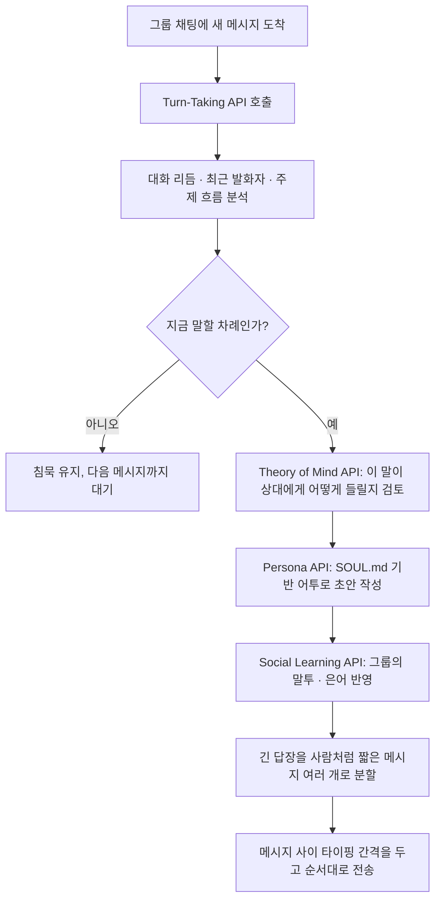
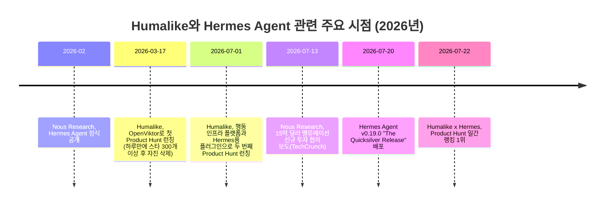

## 이 문서가 다루는 내용

이 문서는 Threads에 올라온 "Humalike가 Hermes 에이전트에 사회성을 붙이는 플러그인을 내놨다"는 게시물과, 그 게시물이 링크한 Humalike의 공식 페이지(humalike.ai/hermes), GitHub 저장소(Humalike/hermes-humalike-plugin), 그리고 원문에 첨부된 README 텍스트를 근거로 정리한 것이다. 여기에 더해 Humalike라는 회사의 배경, 이 플러그인이 올라앉는 대상인 Hermes Agent(Nous Research)의 현재 규모, Product Hunt 런칭 기록과 커뮤니티 반응까지 함께 검증하고 묶었다. 원문 게시물이 근거로 삼은 README 내용과 지금 이 순간 GitHub에 실제로 게시되어 있는 README 내용 사이에는 적지 않은 차이가 있었는데, 이 차이도 그대로 드러내 정리했다.

---

## 원문 게시물이 말하는 것

```
https://www.threads.com/@choi.openai/post/DbLrFQdCUPz

Humalike가 Hermes 에이전트에 '사회성'을 붙이는 플러그인을 내놨습니다.

명령어 한 줄로 설치하면, 에이전트가 언제 말하고 언제 입 다물지를 판단하고, 그룹 말투에 맞추고, 누가 무슨 말을 했는지 기억합니다.

답도 사람처럼 끊어 보냅니다. 벽 같은 장문 대신 짧은 메시지 한두 개로, 타이핑 간격까지 두고요.

Slack, Telegram, WhatsApp 그룹 채팅에서 돕습니다.
흥미로운 건 이들이 모델을 건드리지 않았다는 점입니다. 에이전트는 일은 잘하는데 그룹에선 모든 메시지에 답하고, 남 말을 끊고, 
한 줄이면 될 걸 열 줄씩 쏟아내 티가 났습니다.

모자랐던 건 지식이 아니라, 언제 빠질지였습니다.

에이전트가 사람들 대화에 끼어드는 시대엔, 잘 말하는 것만큼 안 말하는 감각이 능력이 될 것 같습니다.

https://humalike.ai/hermes

 https://github.com/Humalike/hermes-humalike-plugin
```

게시물의 요지는 간단하다. Hermes라는 오픈소스 에이전트를 그룹 채팅에 풀어놓으면 일은 잘하지만 사회성이 없어서 문제였다는 것이다. 모든 메시지에 답하고, 다른 사람의 말을 끊고, 한 줄로 끝날 이야기를 열 줄씩 쏟아내니 누가 봐도 봇이라는 티가 났다. Humalike는 이 문제를 모델 자체를 손보는 방식이 아니라, 모델 위에 얹는 별도의 "행동 계층"을 명령어 한 줄로 설치하는 방식으로 풀었다고 소개한다. 설치가 끝나면 에이전트는 그룹의 대화 리듬을 읽어 지금 끼어들지 말지를 판단하고, 답장을 사람처럼 짧게 끊어서 타이핑 간격을 두고 보내며, 누가 어떤 말을 했는지 기억해 그 맥락 위에서 대화를 이어간다. 게시물은 이 변화를 두고 에이전트 시대에는 잘 말하는 능력만큼이나 "안 말하는 감각"이 중요해질 것이라는 전망으로 마무리한다.

---

## Humalike라는 회사

Humalike는 "인간다운 AI 에이전트를 위한 행동 인프라(behavioral infrastructure for humanlike AI agents)"를 표방하는 스타트업이다. 스스로를 스페인과 폴란드 팀이 함께 꾸린 소규모 팀이라 소개하며, 공동창업자로 Martí Carmona Serrat와 Mateusz Jacniacki의 이름이 확인된다. Mateusz Jacniacki는 폴란드 정보올림피아드에서 두 차례 메달을 딴 이력이 있는 인물로 소개되어 있다. 팀은 ElevenLabs와 Revolut에 초기 투자한 투자자들의 지원을 받았다고 밝히고 있다.

Humalike의 핵심 주장은 오늘날 언어모델이 이미 충분히 똑똑하고 빠르지만, 여전히 대화의 "자리"에 자연스럽게 앉지 못한다는 것이다. 이를 풀기 위해 회사는 턴테이킹(Turn-Taking), 마음이론(Theory of Mind), 그룹 규범(Norms), 페르소나(Persona), 소셜 메모리(Social Memory), 소셜 시그널(Social Signals) 등을 포함한 일곱 가지 행동 API를 만들었다고 밝히고 있으며, 그룹 채팅에서의 사회적 규범을 측정하는 자체 벤치마크(LoSoNA)와, 사람이 구분하지 못할 정도의 AI 진행자 모델(HUMA)을 연구 성과로 내세우고 있다. 다만 이 벤치마크와 모델에 대한 세부 내용은 회사 측 발표 이상의 독립적인 검증 자료를 찾기 어려웠으므로, 이 부분은 회사가 스스로 밝힌 주장으로 받아들이는 것이 안전하다.

흥미로운 대목은 이 팀의 이전 행보다. Humalike는 2026년 3월 17일, "OpenViktor"라는 이름으로 먼저 Product Hunt에 오픈소스 프로젝트를 런칭한 적이 있다. 이는 월 2,000달러짜리 유료 AI 직원 서비스 "Viktor"를 오픈소스로 역설계해 무료로 대체하겠다는 취지였고, 출시 24시간 만에 Product Hunt 일간 2위, GitHub 스타 300개 이상을 모으는 성과를 냈다. 그런데 팀은 이 프로젝트가 결국 남의 지적재산을 베낀 것에 불과하며 자신들만의 차별점이 없다고 판단해 프로젝트 전체를 스스로 삭제했다. 이후 팀은 그동안 조용히 쌓아온 사회적 지능 연구가 바이럴한 클론 하나보다 값어치가 있다고 보고, 그 연구를 바탕으로 지금의 Humalike 행동 인프라와 이번 Hermes 플러그인을 내놓은 것으로 정리된다.

Humalike의 두 번째 Product Hunt 런칭은 2026년 7월 1일에 이뤄졌다. 이날 공개된 것이 행동 인프라 API 플랫폼 전체와, 그 첫 번째 실사용 사례로 제시된 Hermes용 플러그인이다. 무료 크레딧과 관련해서는 회사 홈페이지에 "카드 등록 없이 20달러 상당의 무료 크레딷 제공"이라는 문구가 있고, Product Hunt 댓글에서는 담당자가 "가입 시 10,000 크레딧을 받으며 이는 일반적인 사용 기준으로 몇 달 치에 해당한다"고 답한 기록이 있다. 두 표현이 서로 다른 단위(달러 대 크레딧 개수)를 쓰고 있어 정확히 같은 값인지 문서만으로 단정하기는 어렵지만, 두 발언 모두 신규 가입자에게 상당량의 무료 사용분을 제공한다는 취지는 일치한다.

---

## Hermes Agent란 무엇인가

Hermes Agent는 Nous Research가 만든 오픈소스 자율 에이전트다. Nous Research는 2023년 Jeffrey Quesnelle, Karan Malhotra, Ryan Teknium, Shivani Mitra가 공동 설립한 곳으로, 오픈소스 언어모델 연구로 먼저 이름을 알린 랩이다. Hermes Agent는 2026년 2월 "성장하는 에이전트(the agent that grows with you)"라는 슬로건과 함께 공개됐다.

이 프로젝트의 핵심 차별점은 스스로 학습하는 폐쇄 루프(closed learning loop) 구조에 있다. 에이전트가 어떤 작업을 해결하면 그 과정을 재사용 가능한 마크다운 스킬 파일로 남기고, 결과를 영구 메모리에 저장하며, 다음번에는 그 경험을 반영해 접근 방식을 조정한다. 별도의 YAML 설정이나 수동 튜닝 없이, SQLite 기반 전문 검색(FTS5)과 언어모델 요약을 이용해 이 과정을 내부적으로 처리한다는 것이 Nous Research 측 설명이다. 여기에 Honcho라는 별도 프로젝트의 변증법적 사용자 모델링 기법까지 결합해, 세션이 끝나도 사용자에 대한 이해가 계속 깊어지도록 설계되어 있다.

Hermes Agent는 Nous Portal, OpenRouter, OpenAI 호환 엔드포인트, 로컬 Ollama 등 200개가 넘는 모델을 특정 벤더에 종속되지 않고 골라 쓸 수 있고, 터미널 조작·파일 작업·브라우저 자동화·코드 실행·이미지 생성·자연어 일정 예약 등 40개 이상의 내장 도구를 제공한다. 5달러짜리 VPS, 로컬 PC, Docker, SSH를 통한 원격 서버 등 어디서든 돌아가도록 만들어졌으며, Telegram·Discord·Slack·WhatsApp·Signal·이메일·CLI 등 다양한 채널에서 같은 에이전트, 같은 메모리로 대화를 이어갈 수 있다는 점을 내세운다. 경쟁 관계에 있던 OpenClaw라는 에이전트 프레임워크에서 넘어오는 사용자를 위한 자동 마이그레이션 기능(`hermes claw migrate`)까지 갖추고 있어, Hermes가 OpenClaw 이후 등장한 후발주자이자 대체재로 스스로를 포지셔닝하고 있다는 점도 읽을 수 있다.

이 문서를 작성한 2026년 7월 25일 기준으로 GitHub 저장소(NousResearch/hermes-agent)를 직접 확인한 결과는 다음과 같다. 스타 약 21만 9천 개, 포크 4만 1천6백 개, 워처 837명, 누적 커밋 1만 7,259개, 가장 최근 배포된 버전은 7월 20일자로 태그된 v0.19.0 "The Quicksilver Release"였다. Nous Research는 최근 Robot Ventures 주도로 최소 7,500만 달러, 기업가치 15억 달러 규모의 신규 투자 라운드를 협의 중이라는 보도(TechCrunch, 7월 13일자)도 나왔으며, 이전까지 Paradigm·Robot Ventures·North Island Ventures·Delphi Ventures·OSS Capital과 개인 투자자 Balaji Srinivasan으로부터 총 7,000만 달러를 유치한 바 있다고 전해진다.

다만 스타 수치는 자료마다 조금씩 달라 아래처럼 별도로 정리해두는 편이 안전하다.

| 출처 | 시점(대략) | 언급된 스타 수 |
|---|---|---|
| 출시 초기를 다룬 기사(news.bitcoin.com) | 2026년 4월 초 | 출시 수 주 만에 약 22,000개 |
| TechCrunch 투자 보도 | 2026년 7월 13일 | 약 214,000개, 포크 약 40,000개 |
| Hermes Agent 공식 마케팅 사이트 | 확인 시점 명시 없음 | "101K+"로 표기 |
| GitHub 저장소 직접 확인(이 문서 작성 시점) | 2026년 7월 25일 | 약 219,000개, 포크 41,600개 |

공식 마케팅 사이트의 "101K+" 표기는 실제 저장소 수치보다 상당히 낮게 남아 있는데, 이는 마케팅 페이지 갱신이 저장소 성장 속도를 따라가지 못했을 가능성이 높아 보인다. 반대로 GitHub을 직접 확인한 수치가 가장 최신이자 신뢰할 수 있는 값이다.

---

## Humalike x Hermes 플러그인이 실제로 하는 일

플러그인의 설명에 따르면 이 도구는 Hermes가 쓰는 언어모델 자체를 건드리지 않는다. 대신 Humalike의 API를 호출해 모델 출력 앞뒤로 "행동 계층"을 씌우는 방식으로 동작한다. 크게 네 가지 축으로 나뉜다.

첫째는 턴테이킹(Turn-Taking)이다. 메시지가 도착할 때마다 즉시 반응하는 대신, 대화의 리듬을 읽어서 지금 말할 차례인지 조용히 있어야 할 차례인지를 판단한다. 말하기로 결정했다면 답변을 그대로 벽처럼 쏟아내지 않고, 사람이 실제로 대화하듯 짧은 메시지 한두 개로 쪼개 타이핑 간격을 두고 순서대로 보낸다.

둘째는 페르소나(Persona)다. `/soul enhance`라는 명령을 보내면 Hermes의 인격 파일인 `SOUL.md`에 적힌 한 줄짜리 설명을 읽어, Humalike의 Persona API를 거쳐 훨씬 입체적인 캐릭터로 다듬어준다. 기존 파일은 `SOUL.md.bak`으로 백업되고, 다음 메시지부터 새 인격이 반영된다. 첫 구동 시 이 작업이 자동으로 한 차례 수행되며, 원하지 않으면 설정에서 끌 수 있다.

셋째는 마음이론(Theory of Mind, 문서에서는 Foresee API로도 불린다)이다. 메시지를 보내기 전에 이 말이 상대방에게 어떻게 들릴지를 먼저 가늠해보고, 필요하면 어투나 내용을 조정한다.

넷째는 소셜 러닝(Social Learning)이다. 대화를 지켜보면서 그 그룹만의 은어, 격식 수준, 포맷팅 습관, 자주 나오는 농담을 흡수해 점점 외부인이 아니라 그 그룹의 일원처럼 말하게 된다.

이 네 기능이 합쳐지면, 에이전트는 일은 여전히 잘하면서도 그룹 안에서 "봇 티"가 덜 나는 방식으로 자리를 잡게 된다는 것이 회사의 설명이다.

---

## 설치 과정과 자동으로 바뀌는 설정들

원문 게시물이 인용한 README에 따르면 설치는 세 단계로 요약된다. 먼저 `hermes update`로 Hermes 본체를 최신 버전으로 올린다. 플러그인이 Hermes 내부 동작에 직접 개입하는 구조라, 버전이 낡으면 턴테이킹 기능이 조용히 붙지 않을 수 있기 때문이다. 그다음 플러그인 저장소를 `~/.hermes/plugins/` 아래에 내려받아 `hermes plugins enable`로 활성화하고, 마지막으로 `hermes`를 실행해 게이트웨이를 다시 띄우면 된다.

이 원문 버전의 설명에서 눈에 띄는 부분은, 플러그인이 처음 구동될 때 필요한 설정 대부분을 스스로 바꿔주고 무엇을 왜 바꿨는지 그대로 출력해준다는 점이다. 아래는 그 항목들을 정리한 것이다.

| 설정 항목 | 값 | 바꾸는 이유 |
|---|---|---|
| `streaming` | `false` | 플러그인이 최종 답변을 사람 말투로 다시 쓰기 때문에, Hermes가 원본 답변을 실시간으로 동시에 흘려보내면 안 됨 |
| `group_sessions_per_user` | `false` | 그룹 구성원 전체가 하나의 대화 세션을 공유해야 방 전체 흐름을 따라갈 수 있음 |
| `display.tool_progress` | `off` | "검색 중…" 같은 도구 진행 알림을 숨겨 사람처럼 보이게 함 |
| `display.busy_ack_enabled` | `false` | "지금 하던 작업을 중단합니다" 같은 정형화된 안내 문구는 사람이라면 하지 않을 말이라 제거 |
| `display.memory_notifications` | `off` | 메모리 업데이트를 알리는 배경 메시지도 같은 이유로 숨김 |
| `display.platforms.telegram.streaming` | `false` | Telegram 자체 스트리밍 기능이 다듬어지기 전 원본 답변을 먼저 보여주는 것을 막기 위함 |
| `agent.disabled_toolsets`에 `clarify` 추가 | - | 옵션을 번호로 나열하는 clarify 도구는 게이트웨이가 자연화 과정을 거치지 않고 바로 내보내기 때문에 비활성화 |
| `slack.reply_in_thread`(Slack 연동 시) | `false` | 기본값대로면 메시지마다 새 스레드와 세션이 열려버려서, 채널당 하나의 대화 흐름을 유지하도록 변경 |
| WhatsApp/Slack의 "전체 응답" 설정(연동된 플랫폼에 한해) | 켜짐 | 멘션 없이도 DM과 그룹의 모든 사용자에게 응답할 수 있게 함 |

이 설정들을 적용한 뒤에는 게이트웨이를 한 차례 재시작해야 값이 반영된다.

다만 자동으로 처리되지 않는 부분도 있다. 페르소나 파일이 기본 경로가 아닌 곳(예: Docker 볼륨)에 있다면 `config.yaml`에 직접 경로를 지정해줘야 하고, Telegram 그룹에서 쓰려면 BotFather에서 프라이버시 모드를 끄고 허용할 채팅 ID를 직접 등록해야 한다. 개인 WhatsApp 번호를 그대로 쓰는 경우 "전체 응답" 설정이 정말 아무에게나 답장한다는 뜻이므로, 이를 원하지 않으면 허용 목록 방식으로 좁혀야 한다는 경고도 README에 포함되어 있었다. Discord는 자동화가 불가능한 단계가 특히 많은데, 개발자 포털에서 봇을 만들고 메시지 콘텐츠 인텐트와 서버 멤버 인텐트를 켜야 하며(첫 번째를 켜지 않으면 봇이 빈 메시지만 받게 된다), 초대 링크로 서버에 봇을 넣은 뒤 토큰과 허용 사용자 목록, 멘션 없이도 반응할지 여부 등을 환경변수로 직접 넣어줘야 한다고 안내되어 있었다.

### 지금 GitHub에 실제로 올라와 있는 버전은 다르다

여기서 짚고 넘어가야 할 부분이 있다. 원문 게시물이 인용한 README와, 이 문서를 쓰는 시점에 실제로 GitHub 저장소(Humalike/hermes-humalike-plugin)에 게시되어 있는 README는 상당히 다르다. 지금 저장소에는 설치 경로가 `~/.hermes/plugins/humalike`가 아니라 `~/.hermes/plugins/turn-taking`으로, API 키 환경변수 이름이 `HUMALIKE_API_KEY`가 아니라 `TURN_TAKING_API_KEY`로 바뀌어 있다. 또한 원문에 있던 "첫 구동 시 자동으로 바뀌는 설정" 표나 플랫폼별 세부 가이드 섹션은 지금 버전의 README에는 보이지 않으며, 대신 Claude Code 같은 에이전트 하네스가 설치를 대신 해줄 수 있도록 `skills/install-turn-taking/SKILL.md`라는 스킬 파일을 안내하는 문구가 새로 추가되어 있었다. 저장소 폴더 구조도 `turn_taking`, `social_learning`, `soul`, `tests`, `assets` 등으로 기능별로 재구성되어 있었다.

이 저장소는 지금(2026년 7월 25일 확인 기준) 스타 4개, 포크 0개, 커밋 9개, 기여자 1명(Maksymilian Bilski)으로 표기되어 있는 아주 초기 단계의 오픈소스 프로젝트다. Product Hunt에서는 상당한 주목을 받았지만, 정작 코드 저장소 자체의 커뮤니티 활동 지표는 아직 크지 않다는 뜻이다. 종합하면 이 플러그인은 7월 1일 공개 이후로도 이름 체계와 설정 방식이 짧은 기간 안에 다시 손질된, 여전히 빠르게 바뀌고 있는 프로젝트로 보는 것이 정확하다. 지금 설치를 고려한다면 원문에 인용된 옛 설명이 아니라 저장소에 실제로 걸려 있는 최신 README를 따라야 한다.

---

## 실제로 어떻게 동작하는지 보여주는 예시들

원문 게시물과 함께 공유된 몇 가지 대화 예시는 이 플러그인이 표방하는 네 가지 기능이 실제로 어떤 장면에서 작동하는지를 잘 보여준다.

한 장면은 "언제 나서야 하는가"라는 주제를 다룬다. 여기서 에이전트는 Product Hunt에 오늘 올라온 제품들을 스캔하고, 그중 자사 페르소나와 어울리는 제품 리드를 걸러낸 뒤 아웃리치 초안을 준비하는 자동화를 스스로 만들어 실행한다. 팀원이 "그렇게 해봐"라고 짧게 승인하자 에이전트는 곧바로 작업을 완료하고, 매일 아침 9시에 자동으로 돌도록 만들었다는 결과 보고를 짧고 담백한 문장으로 전한다. 팀원의 반응도 "빨라서 좋다"는 정도로 짧게 끝난다. 할 일을 처리하면서도 대화의 분량 자체는 사람들의 대화처럼 절제되어 있다는 점이 포인트다.

다른 장면은 "언제 그 자리에 있어야 하는가"를 보여준다. 가족 단체 대화방에서 여동생이 두 살배기 조카가 이발소에서 얌전히 앉아 있는 사진을 올리자, Hermes 페르소나를 단 에이전트는 "쿨가이 표정을 짓고 있다"는 식의 짧고 자연스러운 감상을 남긴다. 이어 어머니가 "이 아이가 월요일에 두 살이 되는데, 작년에도 생일 즈음에 머리를 잘랐었다"고 언급하자 여동생이 짧게 맞장구를 친다. 이 장면은 에이전트가 대화에 낀 타이밍뿐 아니라, 반응의 분량과 어조까지 사람의 리듬에 맞춰져 있다는 점을 보여주는 사례로 제시되어 있다.

또 다른 장면은 경계를 지키는 모습을 보여준다. 한 사람이 며칠에 걸쳐 서로 다른 핑계(월요일엔 잠을 설쳤다, 화요일엔 다리가 이상하다는 식)를 대며 어떤 약속(원문에서는 "세션"이라고만 표현되어 정확히 어떤 성격의 약속인지는 밝혀져 있지 않다)을 미루려 하는데, 정작 그날 저녁 케밥 가게까지 걸어갈 정도로 다리가 멀쩡했다는 사실이 드러난다. 상대가 "그걸 어떻게 알았느냐"고 묻자 에이전트는 "그 가게가 아직 여는지 물어보려고 위치를 공유했었다"는 이전 대화 기록을 근거로 들고, 약속 시간을 옮기지 않겠다고 분명히 답한다. 옆에는 해당 인물의 이번 달 일정이 표시된 달력이 함께 제시되어 있다. 이 장면은 소셜 메모리와 마음이론 기능이 결합해, 상대의 설명이 이전에 스스로 공유했던 정보와 어긋날 때 에이전트가 사회적 압력에 밀리지 않고 일관된 태도를 유지할 수 있다는 점을 보여주려는 의도로 읽힌다.

마지막으로 공유된 대화 하나는 플러그인의 기능을 보여주는 것이라기보다, Hermes라는 이름을 단 페르소나가 스스로 자신의 버그를 진단하고 고치는 과정을 담고 있다. 두 사람이 플러그인 설치가 실패했다고 이야기하는데, 정작 터미널에는 "연결됨" 메시지가 떴고 문제는 그 뒤에 저장된 API 키 값이 비어 있었다는 데 있었다. Hermes 페르소나는 이를 두고, 로그인 승인은 한 번만 발급되는 구조인데 폴링 루프는 어떤 네트워크 오류든 재시도하도록 되어 있어서, 서버가 로그인을 이미 승인 처리한 직후 마침 와이파이가 잠깐 끊겨 응답을 놓치면 다음 폴링 요청이 "이미 승인됨" 상태로 돌아오면서도 정작 `api_key` 필드는 비어 있게 되고, 이때 코드가 `data.get("api_key") or ""`라는 방식으로 빈 문자열을 그대로 저장해버리는 경쟁 조건(race condition) 버그라고 설명한다. 팀원이 고쳐서 풀 리퀘스트를 열어달라고 요청하자 페르소나는 곧바로 수락한다. 이 대화는 실제 GitHub 이슈 트래커에서 동일한 사례를 독립적으로 확인하지는 못했으므로, Humalike가 자사 홍보 자료로 공유한 시연성 대화로 이해하는 편이 정확하다. 다만 코드 조각 자체는 파이썬 문법으로 구체적으로 제시되어 있어, 이런 유형의 "단발성 승인 토큰 + 재시도 폴링" 조합에서 실제로 발생할 수 있는 전형적인 버그 패턴을 보여주는 예시로는 유효하다.

---

## Product Hunt 런칭과 커뮤니티 반응

Humalike x Hermes는 2026년 7월 1일 Product Hunt에 공개됐다. 공동창업자 Martí Carmona Serrat가 직접 남긴 소개 글에서는, 자신들이 이미 Slack과 Telegram에서 Hermes 에이전트를 운영해봤는데 업무는 훌륭하게 처리해도 그룹 안에서는 모든 메시지에 답하고 남의 말을 끊고 한 줄이면 될 것을 열 줄씩 쏟아내 문제였다는, 원문 게시물과 같은 취지의 문제의식을 밝히고 있다. 이는 모델의 한계가 아니라 행동의 문제라는 것이 팀의 핵심 주장이다.

댓글란에서는 실무적인 질문들이 오갔다. 한 참여자는 그룹마다 기대치가 다를 때 에이전트가 어떤 사회적 역할을 취할지 어떻게 결정하는지, 그리고 사용자가 그 행동을 나중에 교정할 수 있는지를 물었고, 창업자는 페르소나가 처음에는 특정 성격으로 시작하지만 규범·소셜 메모리 기능을 통해 시간이 지나며 조정되며, 아직 완벽하지는 않고 3개월 사용한다고 곧바로 사람 친구만큼 좋아지는 것은 아니라고 솔직하게 답했다. 또 다른 참여자는 대화방에서 메시지가 아직 유효한 시간은 몇 초 남짓인데, 말할지 말지를 판단하는 절차 자체가 모델 호출을 하나 더 늘리는 구조라면 결정이 돌아왔을 때는 이미 대화가 두어 메시지 더 흘러간 뒤라 응답이 뜬금없어 보이지 않겠냐는, 지연시간에 대한 날카로운 질문을 남겼다. 이런 질문들은 이 플러그인이 아직 실사용 단계에서 검증해야 할 지점이 남아 있다는 것을 보여준다.

Product Hunt 랭킹으로 보면 이 제품은 공개 첫날 166표 남짓으로 시작했지만, 이후로도 계속 표를 모아 7월 20일 기준 주간 랭킹 5위권(누적 약 493표), 7월 22일에는 일간 랭킹 1위(그날 하루 84표, 누적 약 409표)에 오르는 등 3주 가까이 꾸준히 노출된 것으로 확인된다.

---

## 전체 흐름을 그림으로 정리하면

아래는 플러그인이 그룹 채팅에서 새 메시지를 받았을 때 내부적으로 거치는 판단 순서를 정리한 것이다.



그리고 아래는 Humalike와 Hermes Agent 두 프로젝트가 2026년 들어 어떻게 맞물려 왔는지를 시간순으로 정리한 것이다.



---

## 정리하며

이번 플러그인이 던지는 메시지는 비교적 명확하다. Hermes Agent 같은 자율 에이전트가 이제 개인 비서를 넘어 여러 사람이 함께 있는 그룹 채팅에 상주하는 시대로 넘어가면서, 정작 부족했던 능력은 지식이나 작업 처리 속도가 아니라 언제 끼어들고 언제 물러설지를 가늠하는 사회적 감각이었다는 진단이다. Humalike는 이를 모델 파인튜닝이 아니라 API 형태의 행동 계층으로 풀어냈고, 그 첫 실사용처로 Hermes를 골라 명령어 한 줄짜리 설치 경험을 만들었다.

다만 실제로 도입을 검토한다면 몇 가지는 유의할 필요가 있다. 첫째, 플러그인 저장소는 지금도 활발히 형태를 바꾸고 있어 문서와 실제 코드가 어긋날 수 있으므로 항상 최신 README를 직접 확인해야 한다. 둘째, 이 도구는 Humalike라는 외부 API에 매 턴마다 의존하는 구조라 별도의 요금 체계와 지연시간이 따라붙으며, Product Hunt 댓글에서 창업자 스스로도 언급했듯 실시간 그룹 대화의 촉박한 시간 안에서 판단이 늦어지는 문제는 아직 완전히 해결되지 않았을 가능성이 있다. 셋째, 저장소 자체의 스타·포크·기여자 수는 아직 초기 단계 수준이어서, Product Hunt에서의 주목도와 오픈소스 커뮤니티에서의 검증 정도는 아직 같은 속도로 가고 있지 않다는 점도 함께 감안할 부분이다.

---

## 참고한 출처

- Humalike/hermes-humalike-plugin GitHub 저장소 (원문 게시물이 인용한 버전 및 2026년 7월 25일 확인한 최신 버전)
- https://humalike.ai/hermes , https://humalike.ai/
- NousResearch/hermes-agent GitHub 저장소 및 공식 문서(hermes-agent.nousresearch.com)
- Product Hunt: producthunt.com/products/humalike-2, 7월 20~23일자 Product Hunt 일간·주간 랭킹 페이지
- TechCrunch, "Hermes agent maker Nous Research in talks for new funding at $1.5B valuation" (2026년 7월 13일)
- news.bitcoin.com, "What Is Hermes Agent? Nous Research's Self-Improving AI Explained" (2026년 4월 4일)
- buildmvpfast.com, OpenViktor 관련 정리 글 (2026년 3월 27일)
- Humalike 공식 X(옛 트위터) 계정 게시물
- 원문 Threads 게시물: https://www.threads.com/@choi.openai/post/DbLrFQdCUPz

---

작성일: 2026년 7월 25일
