## — AAII 44점이라는 숫자를 어디까지 믿을 수 있는지에 대한 정밀 검토

[**Motif 3 (Beta) Intelligence, Performance & Price Analysis**](https://artificialanalysis.ai/models/motif-0714)

## 관련글

[**한국 AI 모델, 글로벌 성적표를 읽는 법**](https://k82022603.github.io/posts/%ED%95%9C%EA%B5%AD-ai-%EB%AA%A8%EB%8D%B8,-%EA%B8%80%EB%A1%9C%EB%B2%8C-%EC%84%B1%EC%A0%81%ED%91%9C%EB%A5%BC-%EC%9D%BD%EB%8A%94-%EB%B2%95/)

[**독파모, 미토스를 잡을 수 있을까 — 국산 사이버보안 AI 공모와 프론티어 투트랙 전략**](https://k82022603.github.io/posts/%EB%8F%85%ED%8C%8C%EB%AA%A8,-%EB%AF%B8%ED%86%A0%EC%8A%A4%EB%A5%BC-%EC%9E%A1%EC%9D%84-%EC%88%98-%EC%9E%88%EC%9D%84%EA%B9%8C-%EA%B5%AD%EC%82%B0-%EC%82%AC%EC%9D%B4%EB%B2%84%EB%B3%B4%EC%95%88-ai-%EA%B3%B5%EB%AA%A8%EC%99%80-%ED%94%84%EB%A1%A0%ED%8B%B0%EC%96%B4-%ED%88%AC%ED%8A%B8%EB%9E%99-%EC%A0%84%EB%9E%B5/)

---

## 0. 이 문서가 답하려는 질문

질문은 세 겹으로 되어 있습니다.

첫째, **"Motif 3가 DeepSeek V4 Pro와 동급이라는 게 사실인가?"** 이건 사실 확인의 문제입니다.

둘째, **"제대로 분석 가능할까?"** 이건 훨씬 날카로운 질문입니다. 점수가 존재한다는 것과, 그 점수가 제3자에 의해 재현·검증 가능하다는 것은 완전히 다른 문제이기 때문입니다.

셋째, **"그렇다면 한국 LLM 성능이 아주 엄청나게 뛰어나다는 것인가?"** 이건 해석의 문제이며, 여기서 대부분의 오독이 발생합니다.

결론부터 짧게 말씀드리면 이렇습니다.

- **44점이라는 숫자 자체는 실재합니다.** Artificial Analysis(이하 AA)가 자사 지표에 등재했고, 같은 지표에서 DeepSeek V4 Pro의 최대 추론 모드와 동점입니다. 이건 회사 주장이 아니라 제3자 평가기관의 게시 값입니다.
- **다만 "동급"은 하나의 합산 지수가 같다는 뜻이지, 능력이 같다는 뜻이 아닙니다.** 그리고 이 합산 지수는 2026년 6월에 구성이 바뀌었기 때문에, 예전 기사에서 본 점수와 지금 점수를 나란히 놓으면 안 됩니다.
- **"제대로 분석 가능한가"에 대한 답은 현재로서는 '완전히는 아직 아니다'입니다.** 이유는 뒤에서 상세히 다루는데, 핵심은 AA가 측정한 대상과 Hugging Face에 공개된 가중치가 같은 것인지 외부에서 확인할 방법이 아직 없다는 점입니다.
- **한국 LLM이 "엄청나게 뛰어나다"기보다는, 투입 자원 대비 결과가 이례적으로 좋다**는 쪽이 정확한 서술입니다. 절대 성능에서는 프론티어 모델과 여전히 뚜렷한 격차가 있습니다.

아래에서 하나씩 근거와 함께 풀어가겠습니다.

---

## 1. 먼저 확정된 사실만 정리합니다

### 1.1 Motif 3 (Beta)에 대해 확인된 것

Artificial Analysis 모델 페이지와 Hugging Face 모델 카드에서 직접 확인되는 값들입니다.

| 항목 | 값 | 출처 성격 |
|---|---|---|
| 개발사 | Motif Technologies(모티프테크놀로지스) | AA / HF |
| AA 지능 지수(AAII v4.1) | **44** | AA 게시값 |
| AA 내 순위 | 577개 추적 대상 중 **34위** | AA 게시값 |
| 총 파라미터 | 약 314B (HF 표기 315B) | HF 모델 카드 |
| 토큰당 활성 파라미터 | 약 13B (전체의 약 4%) | HF 모델 카드 |
| MoE 라우팅 | 라우팅 전문가 384개 중 top-8 + 공유 전문가 1개 | HF 모델 카드 |
| 레이어 / 히든 크기 | 53층 / 4096 | HF 모델 카드 |
| 어휘 크기 | 220,160 | HF 모델 카드 |
| 컨텍스트 | 262,144 토큰 (256K) | HF / AA |
| 입출력 양식 | 텍스트 전용 (멀티모달 아님) | AA |
| 추론(reasoning) 모델 여부 | 예 | AA |
| AA 등재 릴리스일 | 2026년 7월 14일 | AA 게시값 |
| 국내 공식 발표일 | 2026년 7월 21일 | 국내 보도 |
| 라이선스 | 개인·교육·비상업 연구 목적만 허용, 상업 이용은 별도 서면 허가 필요 | HF 모델 카드 |
| AA 상의 분류 | **Proprietary(비공개) 모델**, 가격 $0.00, 속도 N/A, 등재 프로바이더 0곳 | AA 게시값 |

여기서 이미 눈에 걸리는 대목이 두 개 있습니다. **AA 등재일(7월 14일)과 국내 발표일(7월 21일)이 일주일 차이**라는 점, 그리고 **AA는 이 모델을 "가중치가 공개되지 않은 독점 모델"로 분류하고 있는데 실제로는 Hugging Face에서 아무나 받을 수 있다**는 점입니다. 두 번째 항목은 뒤에서 중요하게 다시 등장합니다.

### 1.2 아키텍처: 파생 모델이 아니라는 주장

모델 카드는 Motif-3가 기존 오픈소스 아키텍처를 재구성한 것이 아니라 처음부터 자체 설계한 것이라고 명시하고 있으며, 세 가지 자체 구성요소를 제시합니다.

- **GDLA (Grouped Differential Latent Attention)** — 그룹형 차등 잠재 어텐션
- **Grouped PolyNorm** — 전문가(expert)별로 적용되는 그룹형 PolyNorm 활성화 함수
- **Modified mHC** — 변형된 매니폴드 제약 하이퍼커넥션

이 계보는 갑자기 나온 것이 아닙니다. 같은 팀은 이전에 Motif-2.6B에서 Differential Attention과 PolyNorm을 적용했고(arXiv 2508.09148), Motif-2-12.7B에서 이를 **Grouped Differential Attention(GDA)** 으로 확장했으며(arXiv 2511.07464), GDA 자체를 별도 논문으로 발표했습니다(arXiv 2510.06949). 즉 GDLA는 GDA의 잠재(latent) 어텐션 버전으로 볼 수 있는, 일관된 연구 궤적 위의 결과물입니다. **"독자 아키텍처"라는 주장은 최소한 논문 이력으로 뒷받침되는 편**입니다.

다만 **Motif-3 전용 기술보고서는 이 문서 작성 시점 기준으로 arXiv에서 확인되지 않습니다.** 선행 모델 보고서는 모두 공개되어 있으므로, 최종본 공개 시 기술보고서가 함께 나올 가능성이 높지만 현재는 없습니다. GDLA와 Grouped PolyNorm의 효과를 검증한 공개 절제(ablation) 실험도 아직 없습니다.

### 1.3 DeepSeek V4 Pro에 대해 확인된 것

비교 대상 쪽도 정확히 알아야 "동급"의 의미가 잡힙니다. Hugging Face 공식 모델 카드 기준입니다.

| 항목 | DeepSeek-V4-Pro | DeepSeek-V4-Flash |
|---|---|---|
| 총 파라미터 | **1.6T** | 284B |
| 활성 파라미터 | 49B | 13B |
| 컨텍스트 | **1M 토큰** | 1M 토큰 |
| 정밀도 | MoE 전문가 FP4 + 그 외 FP8 혼합 | 동일 |
| 라이선스 | **MIT** (상업 이용 자유) | MIT |
| 사전학습 토큰 | 32T 이상 | 32T 이상 |

아키텍처적으로 V4는 DeepSeek이 V3 이후 처음 내놓은 신규 구조로, **CSA(Compressed Sparse Attention)와 HCA(Heavily Compressed Attention)를 결합한 하이브리드 어텐션**, **mHC(Manifold-Constrained Hyper-Connections)**, **Muon 옵티마이저**를 채택했습니다. 1M 컨텍스트 환경에서 V3.2 대비 단일 토큰 추론 FLOPs의 27%, KV 캐시의 10%만 사용한다고 모델 카드는 밝히고 있습니다.

여기서 흥미로운 사실 하나. **Motif-3의 "Modified mHC"와 DeepSeek V4의 "mHC"는 같은 계열의 기법입니다.** 두 팀이 독립적으로 비슷한 방향(잔차 연결 강화)을 택했다는 뜻이며, 실제로 앞서 언급한 커뮤니티 검증 스레드에서도 Motif-3의 mHC 구현을 mHC 논문(arXiv 2512.24880)과 대조한 기록이 나옵니다.

또한 V4는 **Non-think / Think High / Think Max** 세 가지 추론 강도 모드를 지원합니다. 이 점이 "44 대 44"를 읽을 때 결정적으로 중요합니다.

---

## 2. "44 대 44"가 실제로 무엇을 뜻하는가

### 2.1 어떤 변형(variant)과 동점인가

AA는 같은 모델의 추론 강도별 변형을 각각 따로 등재합니다. DeepSeek 쪽 현재 값은 다음과 같습니다.

| 변형 | AAII v4.1 점수 |
|---|---|
| DeepSeek V4 Pro (max, 최대 추론) | **44** |
| DeepSeek V4 Pro (high) | 43 |
| DeepSeek V4 Flash (max) | 40 |
| DeepSeek V4 Pro (non-reasoning) | 39 |

즉 **Motif 3(Beta)의 44점은 DeepSeek V4 Pro가 추론 예산을 최대로 태웠을 때의 점수와 같습니다.** "V4 Pro 전체"와 동급이라기보다 "V4 Pro의 최상단 모드"와 동점이라고 쓰는 편이 정확합니다.

### 2.2 결정적 함정: 지표 버전이 바뀌었다

이게 가장 많이 오해되는 부분입니다.

**DeepSeek V4 Pro는 2026년 4월 출시 당시 AA 지능 지수에서 52점**을 받았습니다. AA는 당시 이를 "V3.2의 42점에서 10점 상승, 오픈웨이트 추론 모델 중 Kimi K2.6(54점)에 이어 2위"로 소개했습니다.

그런데 지금 같은 모델이 **44점**입니다. 모델이 나빠진 게 아니라 **자를 바꿨기 때문**입니다.

AA는 2026년 6월 중순 **Intelligence Index v4.1**을 발표하면서 다음을 변경했습니다.

- Terminal-Bench Hard → **Terminal-Bench 2.1** 로 상향
- τ²-Bench Telecom → **τ³-Bench Banking** 으로 교체
- GDPval-AA → **GDPval-AA v2** 로 상향 (Elo를 인간 성능 1000 기준으로 재보정, 프론티어 모델 심사위원단 순환제 도입, 턴 상한 100 → 250)
- **IFBench 제거** (포화로 인해 프론티어 모델 변별력 상실)
- 카테고리 가중치 재설정

새 가중치는 다음과 같습니다.

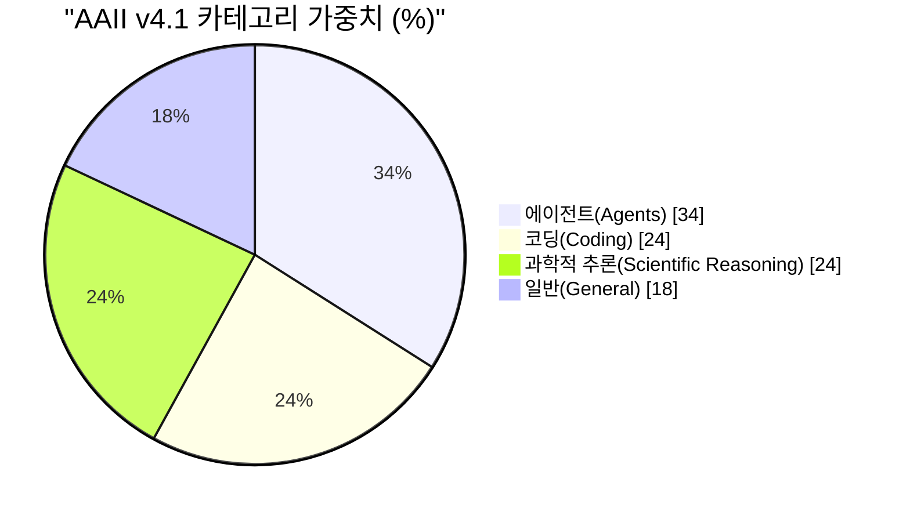

v4.1을 구성하는 9개 평가는 **GDPval-AA v2, τ³-Banking, Terminal-Bench v2.1, SciCode, Humanity's Last Exam, GPQA Diamond, CritPt, AA-Omniscience, AA-LCR** 입니다. 이 중 GDPval-AA v2가 단일 평가로 가중치 20%를 차지하는 최대 항목입니다.

**즉 v4.1은 사실상 "에이전트 지수"에 가깝습니다.** 도구를 쓰고, 셸을 다루고, 장기 과제를 끝까지 끌고 가는 능력이 3분의 1 이상을 차지합니다. 지식 문답 능력만 좋은 모델은 이 지표에서 잘 나올 수 없습니다.

여기서 실무적으로 중요한 함의가 나옵니다.

> **v4.0 시절 점수와 v4.1 점수를 비교하면 안 됩니다.** 국내 보도에 등장하는 "업스테이지 솔라 프리뷰 AAII 44.4점"(2026년 5월 발표)과 "모티프 3 44점"(v4.1)은 **다른 자로 잰 값**일 가능성이 매우 높습니다. ZDNet 코리아도 같은 취지로 "기업별 AAII 점수가 모델 공개 시점과 평가 버전, 오픈소스 범위가 달라 단순 비교에는 한계가 있다"는 지적을 전했습니다.

### 2.3 44점은 리그에서 어디쯤인가

v4.1 기준으로 확인 가능한 좌표를 잡아보겠습니다.

| 모델 | AAII v4.1 | 성격 |
|---|---|---|
| Kimi K3 | 57 | 2.8T 파라미터, 가중치 미공개(공개 예정) |
| GLM-5.2 | 51 | 753B 오픈웨이트 |
| Gemini 3.0 Flash | 50 | 상용 |
| **Motif 3 (Beta)** | **44** | 314B, 비상업 라이선스 |
| DeepSeek V4 Pro (max) | 44 | 1.6T 오픈웨이트(MIT) |
| Kimi K2.6 | 44 | 1T 오픈웨이트 |
| DeepSeek V4 Pro (high) | 43 | — |
| DeepSeek V4 Flash (max) | 40 | 284B 오픈웨이트 |

그리고 최상단에는 Claude Opus 5 계열, GPT-5.6 Sol 계열, Claude Fable 5 등이 **57~61점대**에 포진해 있습니다.

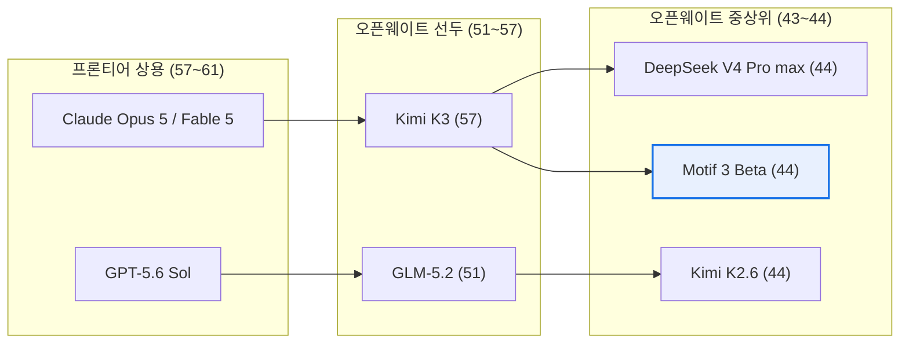

**해석**: Motif 3은 "프론티어 급"이 아니라 **"오픈웨이트 중상위 그룹의 하단~중단"** 에 정확히 안착한 것입니다. 프론티어와는 13~17점 차이가 있고, 오픈웨이트 선두인 Kimi K3와도 13점 차이입니다. 이것도 대단한 성취지만, "세계 최상위권"이라는 표현은 상당한 확대 해석입니다.

### 2.4 순위 숫자가 보도마다 다른 이유

- **AA 페이지**: 577개 중 34위
- **국내 보도 / 회사 발표**: 오픈소스 3위권, 전체 11위

모순이 아니라 **세는 단위가 다릅니다.** AA의 577개는 같은 모델의 추론 강도별 변형(max/high/non-reasoning)을 각각 별도 항목으로 셉니다. 회사 측 "11위"는 모델 계열 단위로 중복을 제거한 집계로 보입니다. 어느 쪽도 틀린 건 아니지만, **34위와 11위를 같은 문장에서 비교하면 안 됩니다.**

---

## 3. 핵심 질문: "제대로 분석 가능할까?"

여기가 이 문서의 본론입니다. 결론적으로 **현재 시점에서 완전한 독립 검증은 불가능한 상태**이며, 그 이유는 세 개 층위로 나뉩니다.

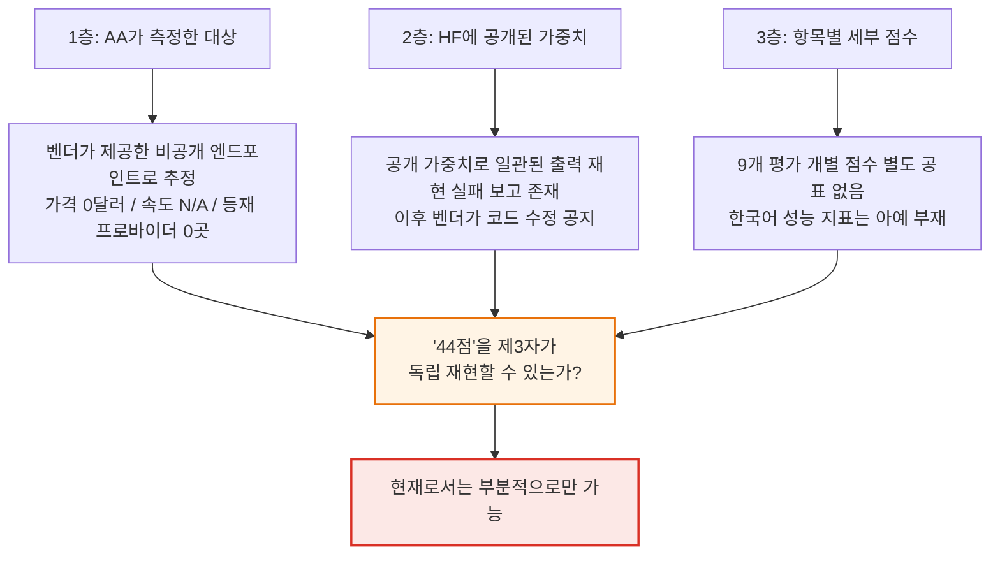

### 3.1 1층 — AA는 무엇을 측정했는가

AA 페이지의 세부 정보가 강한 단서를 줍니다.

- **입력·출력 가격 모두 $0.00** (577개 모델 중 1위, 즉 최저가)
- **출력 속도 N/A** — 측정 불가
- **프로바이더 페이지에 등재된 API 제공자 0곳**
- **분류: Proprietary(가중치 비공개)**

공개 상용 API가 있었다면 가격이 0일 수 없고, 속도도 측정되었을 것입니다. 이 조합이 가리키는 것은 하나입니다. **AA는 모티프가 직접 제공한 비공개 평가용 엔드포인트에서 측정했을 가능성이 높습니다.** 국내 보도도 "모티프 3 프리뷰(베타)는 현재 제한된 고객에게 배포되고 있다"고 전하고 있어 이와 부합합니다.

이 자체는 부정행위가 아닙니다. AA는 출시 전 모델을 벤더 협조로 평가하는 일이 일상적이며(예: GPT-5.6 계열 사전 평가), 절차와 방법론은 공개되어 있습니다. **다만 "제3자가 같은 조건을 재현할 수 있는가"라는 질문에는 '지금은 아니다'가 답입니다.** 외부인이 그 엔드포인트에 접근할 수 없기 때문입니다.

참고로 AA는 자사 지수에 대해 **95% 신뢰구간이 ±1% 미만**이라고 밝히고 있습니다. 이 기준이면 44 대 44는 통계적으로도 진짜 동점입니다. 단, 이는 **합산 지수에 대한 진술이지 개별 항목에 대한 진술이 아닙니다.**

### 3.2 2층 — 공개된 가중치는 재현되는가

이 부분이 가장 중요하고, 국내 보도에서는 거의 다뤄지지 않았습니다.

Hugging Face의 `Motif-Technologies/Motif-3-Beta` 저장소 커뮤니티 게시판에 **상세한 버그 리포트가 올라왔습니다**(토론 #6, 사용자 avlp12). 요지는 다음과 같습니다. 아래는 **개인 이용자의 커뮤니티 보고**이며 벤더 공식 확인이 아니라는 점을 명시해 둡니다.

**(1) 배포 코드가 그대로는 실행되지 않음 — 결정론적 버그 3건**

| 버그 | 증상 |
|---|---|
| yarn RoPE 차원 불일치 | `rope_head_dim=64` 인자를 무시하고 `head_dim=192` 기준 주파수를 생성 → 첫 forward에서 shape 크래시 |
| 커스텀 eager 어텐션의 GQA repeat 누락 | `attn_implementation="eager"` 사용 시 텐서 크기 불일치 런타임 에러 |
| `grouped_mm` 디스패치의 침묵 오답 | 전문가 인덱스가 전달되지 않아 **384개 전문가 전부가 0번 전문가의 PolyNorm 계수로 활성화** |

세 번째가 특히 위험합니다. 크래시가 아니라 **조용히 틀린 값을 내는** 유형이기 때문입니다. 보고자는 3층 절단 실험에서 최종 로짓 최대 편차 7.18, KL 0.34/token, top-1 일치율 63.6%를 측정했다고 밝혔습니다.

**(2) 버그를 모두 우회해도 출력이 무너짐**

세 버그를 모두 우회한 뒤에도, 서로 KL ~1e-7 수준으로 일치하는 두 개의 독립 구현이 동일하게 다음을 재현했다고 합니다.

- BOS 토큰 하나만 넣은 위치 0에서도 top-1이 정크 토큰에 확률 0.938
- held-out NLL이 약 22 nats — **어휘 균등분포(ln 220,160 ≈ 12.3)보다도 나쁨**
- 반면 임베딩 자체는 건강함 (파리–런던, king–queen, 한국–서울 코사인 유사도가 정상 범위)
- 깊이 프로브 결과 dense 층(0~2)은 정상, **첫 MoE 층에서 붕괴 시작**

**(3) 독립적 교차 확인**

보고자는 커뮤니티가 만든 FP8 양자화 저장소(`0ppxnhximxr/Motif-3-Beta-FP8`)의 README가 독립적으로 같은 결론에 도달했다고 전합니다. 해당 README는 베이스 체크포인트가 양자화 이전 단계에서 이미 모든 설정에서 비일관 출력을 냈고(teacher-forced NLL 약 20, 기대치 2~4), **공개된 모델링 코드와 가중치가 서로 다른 아키텍처 리비전에 속할 가능성이 높다**고 경고했다고 합니다.

**(4) 절제 실험이 가리키는 방향**

| 절제 항목 | NLL 변화 (음수 = 개선) |
|---|---|
| 공유 전문가(shared expert) 제거 | **−9.11 nats** |
| route_norm 제거 (raw sigmoid ×2.0) | **−6.18 nats** |
| diff-attn 결합 제거 | −4.8 |
| mHC 게이트 무력화 | −3.9 / −3.5 |

공유 전문가를 아예 빼버렸을 때 성능이 9 nats 이상 좋아진다는 것은, **배포된 코드의 공유 전문가 합산 방식이 학습 시점의 방식과 다르다**는 강한 신호입니다.

**(5) 그 이후 — 벤더의 대응**

중요한 후속 사실이 있습니다. 모델 카드는 이후 갱신되어 **"배포 모델링 코드가 수정되었으며 HF `.generate`가 정상 작동해 일관된 출력을 생성한다"** 는 취지의 안내와 함께, 프로덕션 서빙용 vLLM 실행 명령과 전용 도커 이미지(`ghcr.io/motiftechnologies/vllm:v0.20.2-motif3.rc2`, B200·H200에서만 테스트됨)가 추가되었습니다.

**정리하면 이렇습니다.**

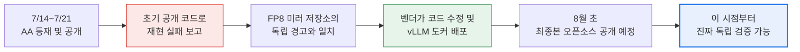

**여기서 반드시 구분해야 할 것**: 이 재현 문제는 **HF에 올라간 베타 체크포인트의 배포 코드 문제**이지, **AA가 측정한 44점이 조작이라는 증거가 아닙니다.** AA는 별도 엔드포인트에서 측정했으므로 두 사안은 논리적으로 분리됩니다. 다만 **"제3자가 스스로 돌려서 44점을 확인해 볼 수 있는가"라는 질문에는, 최소한 초기 며칠 동안은 '불가능했다'** 는 게 사실입니다.

### 3.3 3층 — 항목별 점수가 공개되지 않았다

AA의 44점은 9개 평가의 가중 평균입니다. 그런데 현재 공개적으로 확인 가능한 것은 **합산값 하나뿐**입니다. 모델 카드도 "AAII: 44"라고만 적고 "자세한 건 AA를 보라"고 넘깁니다. 국내 보도도 마찬가지입니다.

이게 왜 문제인가 하면, **가중 평균은 서로 다른 능력 프로파일을 같은 숫자로 뭉갤 수 있기 때문**입니다.

가상의 예를 들면, 어떤 모델이 지식 문답에서 매우 강하고 에이전트 과제에서 약해도, 다른 모델이 정반대 프로파일이어도 합산은 같은 44가 나올 수 있습니다. 실무에서 둘은 전혀 다른 물건입니다.

특히 검증이 필요한 항목은 이렇습니다.

- **Terminal-Bench v2.1 / τ³-Banking** — 에이전트 도구 사용. 참고로 DeepSeek V4 Pro Max는 자사 모델 카드에서 Terminal Bench 2.0 기준 67.9를 보고했습니다.
- **AA-LCR** — 장문 컨텍스트 추론. Motif 3은 256K, DeepSeek V4는 1M입니다. **선언된 컨텍스트 길이와 실제 유효 길이는 다릅니다.**
- **AA-Omniscience** — 지식 정확도와 환각률. 참고로 한 서빙 사업자 블로그는 V4 Pro의 AA-Omniscience 환각률이 94%라고 전한 바 있습니다(벤더 인접 출처, 교차 확인 필요).
- **한국어 성능** — AAII에는 한국어 전용 평가가 **없습니다.** 국산 모델의 실전 가치를 판단하는 데 44점은 사실상 아무 말도 해주지 않습니다.

### 3.4 잘 언급되지 않는 변수: 장황함(verbosity)

이건 실무에서 비용으로 직결되는데 거의 보도되지 않습니다.

AA는 지수를 완주하는 데 소모된 출력 토큰을 함께 공개합니다.

| 모델 | 지수 완주 출력 토큰 | 비교군 중앙값 |
|---|---|---|
| **Motif 3 (Beta)** | 약 190M (집계 시점에 따라 200M 표기) | 61M |
| DeepSeek V4 Pro (max) | 약 180M | 98M |

**Motif 3은 동급 대비 3배 이상 장황합니다.** AA도 "매우 장황함(very verbose)"으로 명시합니다. 같은 점수를 내기 위해 훨씬 많이 생각한다는 뜻이며, 이는 곧 **지연 시간과 토큰 비용의 증가**를 의미합니다. 프리뷰 단계라 가격이 0원이니 지금은 체감되지 않지만, 상용화 시점에는 **"같은 44점인데 비용은 몇 배"** 라는 상황이 나올 수 있습니다.

참고로 DeepSeek V4 Pro는 AAII v4.1 기준 태스크당 비용이 약 $0.04로, 오픈웨이트 진영에서 매우 저렴한 축에 속합니다(GLM-5.2 $0.32, Kimi K3 $0.94, Claude Opus 4.8 $1.80과 비교). Motif 3의 태스크당 실효 비용은 **가격 정책이 공개되어야 비로소 계산 가능**합니다.

> 가격 관련 주의: DeepSeek V4 Pro의 토큰 단가는 출처에 따라 값이 다릅니다. AA의 출시 분석 기사(2026년 4월)는 100만 토큰당 입력 $1.74 / 출력 $3.48로 소개했으나, 현재 AA 모델 페이지에는 입력 $0.43 / 출력 $0.87로 표기되어 있습니다. 가격 인하 또는 캐시 혼합 기준 차이로 보이며, 정확한 값은 DeepSeek 공식 가격 페이지에서 확인해야 합니다.

---

## 4. 그렇다면 무엇이 진짜 인상적인가 — 효율의 관점

지금까지 검증의 빈틈을 짚었지만, 이 성과를 깎아내리려는 게 아닙니다. 오히려 **숫자를 정확히 이해할수록 진짜 인상적인 지점이 드러납니다.**

### 4.1 투입 자원

국내 보도(AI타임스, 이데일리, 뉴시스 등)가 회사 발표를 인용해 전한 개발 조건입니다.

| 항목 | 내용 |
|---|---|
| 회사 업력 | 설립 약 1년 반 |
| 인원 | 약 30명 |
| GPU | 정부 지원 약 700장 |
| 개발 기간 | 약 5개월 |
| 자금 | 2026년 5월 240억 원 투자 유치 |

프론티어 모델 학습에 GPU 수천~수만 장이 투입되는 것과 비교하면 **자릿수가 다른 조건**입니다. 이 조건에서 오픈웨이트 중상위권에 진입했다는 것이 실제 뉴스 가치입니다.

### 4.2 효율의 원천: 활성 파라미터

두 모델을 활성 파라미터 기준으로 다시 보면 그림이 완전히 달라집니다.

| 모델 | 총 파라미터 | 활성 파라미터 | 활성 비율 | AAII v4.1 |
|---|---|---|---|---|
| DeepSeek V4 Pro | 1.6T | 49B | 약 3.1% | 44 |
| **Motif 3 (Beta)** | **314B** | **13B** | 약 4.1% | **44** |

**같은 점수를 활성 파라미터 4분의 1로 냈습니다.** 총 파라미터로는 5분의 1입니다. 이건 서빙 경제성에서 대단히 큰 차이입니다. 물론 MoE는 **활성 파라미터만큼만 계산하지만 가중치 전체는 메모리에 올려야** 하므로, 314B를 담을 메모리는 여전히 필요합니다. 그래도 1.6T보다는 훨씬 다루기 쉽습니다.

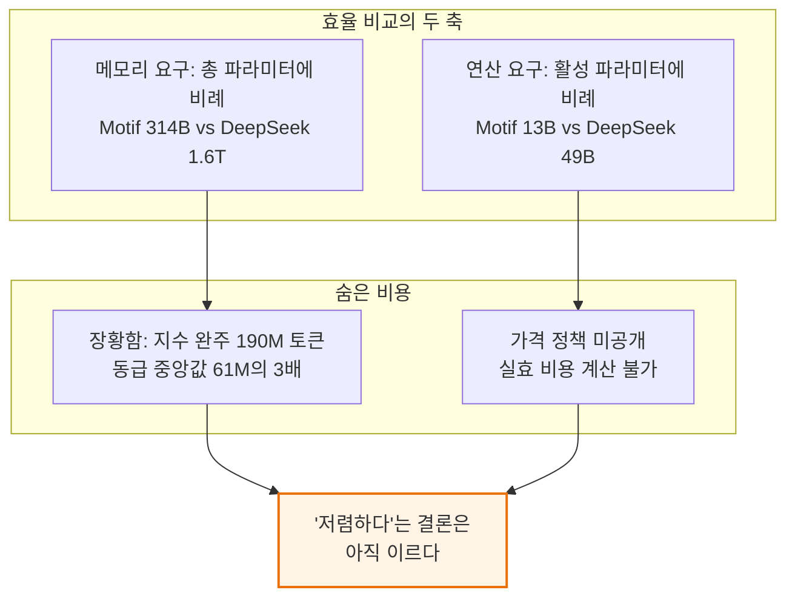

**여기가 정직해야 할 지점입니다.** 파라미터 효율은 확실히 좋습니다. 그러나 **토큰 효율은 나쁩니다.** 두 효과가 상쇄되면 실제 서빙 비용은 계산해 봐야 압니다. 최종본에서 장황함이 개선되는지가 실무 채택의 갈림길이 될 것입니다.

---

## 5. "한국 LLM이 엄청나게 뛰어난 것인가"에 대한 정직한 답

### 5.1 맞는 부분

- **미국·중국 기업 모델을 제외하면 최상위 점수라는 주장은 현재 확인 가능한 범위에서 사실에 가깝습니다.** AA가 추적하는 상위권 모델 대부분은 미국(Anthropic, OpenAI, Google, Meta, xAI, NVIDIA, Thinking Machines)과 중국(DeepSeek, Moonshot, Z AI, Alibaba, MiniMax, Xiaomi) 랩입니다.
- **자원 대비 효율은 이례적입니다.** 30명·700장·5개월은 프론티어 랩 기준으로는 파일럿 프로젝트 규모입니다.
- **파생 모델이 아니라는 주장은 연구 이력으로 뒷받침됩니다.** 이건 독파모 사업 맥락에서 특히 중요한데, 1차 평가에서 네이버클라우드 탈락 사유로 '독자성' 기준이 거론되었기 때문입니다.

### 5.2 조심해야 할 부분

- **절대 성능은 프론티어와 명확히 차이납니다.** 44 대 57~61은 작은 격차가 아닙니다. 특히 v4.1이 에이전트 중심 지표라는 점을 감안하면, **실제 업무 자동화 능력에서의 격차**를 반영합니다.
- **베타 체크포인트 점수입니다.** 회사는 8월 초 성능을 개선한 최종본을 오픈소스로 공개하겠다고 밝혔습니다. 최종본 점수는 오를 수도, 다른 자로 재면 내려갈 수도 있습니다.
- **라이선스가 비상업입니다.** 현재 HF 배포본은 개인·교육·비연구 목적으로만 허용되며 상업 이용은 서면 허가가 필요합니다. **DeepSeek V4는 MIT입니다.** 기업 도입 관점에서 이 차이는 점수 차이보다 훨씬 큽니다. 최종본의 라이선스가 무엇이 되느냐가 실질적으로 가장 중요한 변수입니다.
- **한국어 성능은 이 점수가 말해주지 않습니다.** 역설적이지만, 국산 모델의 존재 이유에 가장 가까운 지표가 이번 발표에 없습니다.
- **국내 팀 간 비교는 지금 불가능합니다.** 업스테이지가 5월에 밝힌 44.4점은 다른 지표 버전일 가능성이 크고, LG AI연구원의 K-엑사원(236B)과 SK텔레콤의 A.X 계열은 AAII 공개 점수가 명확히 정리되어 있지 않습니다.

### 5.3 발표 타이밍이라는 맥락

무시하면 안 되는 배경이 있습니다.

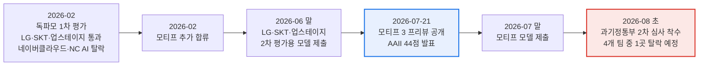

**가장 늦게 합류한 팀이, 탈락자가 나오는 심사 직전에, 국제 지표 성적표를 들고 나왔습니다.** 이건 기술 발표인 동시에 전략적 커뮤니케이션입니다. 발표 내용이 거짓이라는 뜻이 전혀 아니라, **왜 지금 합산 점수 하나만 강조되었는지**를 이해하는 맥락이라는 뜻입니다. 항목별 점수와 한국어 벤치마크가 함께 나왔다면 훨씬 강한 발표가 되었을 텐데 그렇지 않았습니다.

또한 2차 평가는 벤치마크 점수만 보는 게 아닙니다. 정부는 **벤치마크 평가 / 전문가 평가 / 사용자 평가** 3축 구조를 유지하며, 산업 적용과 서비스 확산 가능성도 주요 요소로 다룰 방침으로 알려져 있습니다. AAII 44점 하나로 결과가 정해지지 않습니다.

---

## 6. 두 모델 종합 비교표

| 축 | Motif 3 (Beta) | DeepSeek V4 Pro |
|---|---|---|
| AAII v4.1 | 44 | 44 (max) / 43 (high) / 39 (non-reasoning) |
| 총 파라미터 | 314B | 1.6T |
| 활성 파라미터 | ~13B | 49B |
| 전문가 구성 | 라우팅 384개 top-8 + 공유 1개 | 미공개(모델 카드 기준) |
| 컨텍스트 | 262,144 (256K) | 1,000,000 (1M) |
| 정밀도 | BF16 | FP4(전문가) + FP8 혼합 |
| 어텐션 | GDLA | CSA + HCA 하이브리드 |
| 잔차 구조 | Modified mHC | mHC |
| 활성화 | Grouped PolyNorm (전문가별) | 모델 카드에 명시 없음 |
| 옵티마이저 | 미공개 | Muon |
| 사전학습 토큰 | 미공개 | 32T 이상 |
| 추론 모드 | 단일(추론형) | Non-think / High / Max 3단 |
| 지수 완주 출력 토큰 | 약 190M | 약 180M |
| 라이선스 | **비상업 연구용** | **MIT** |
| 기술보고서 | 확인되지 않음(선행 모델은 공개) | arXiv 2606.19348 |
| 공개 API 프로바이더 | 0곳 | 다수 |
| 상태 | 베타 프리뷰, 8월 초 최종본 예정 | 정식 배포 |

---

## 7. 실무자 관점 체크리스트

이 문서를 읽고 "그래서 우리 조직에 도입할 만한가"를 판단해야 한다면, 다음 순서를 권합니다.

**즉시 확인 불가 — 8월 초 최종본을 기다려야 하는 항목**

1. **라이선스가 상업 이용을 허용하는가.** 이게 1순위입니다. 비상업 라이선스면 나머지는 논의 대상이 아닙니다.
2. **공개 가중치로 벤치마크가 재현되는가.** 베타에서 발생한 코드–체크포인트 리비전 불일치 문제가 최종본에서 해소되는지 반드시 확인해야 합니다. `vLLM`/`SGLang` 정식 지원 여부, 벤더 제공 도커 이미지 외에 표준 경로로 서빙되는지가 판단 기준입니다.
3. **항목별 점수가 공개되는가.** 특히 에이전트(Terminal-Bench, τ³-Banking)와 장문 컨텍스트(AA-LCR).

**지금부터 준비할 수 있는 항목**

4. **자체 한국어 평가셋을 준비해 두십시오.** KMMLU·KorMedMCQA 같은 공개 벤치마크에 더해, 조직 고유 업무 데이터로 만든 소규모 평가셋이 공개 지표보다 훨씬 유용합니다.
5. **장황함을 비용 모델에 반영하십시오.** 동급 대비 3배 토큰은 자체 호스팅에서도 GPU 시간으로 그대로 청구됩니다. 최종본에서 이 수치가 얼마나 개선되는지 확인해야 합니다.
6. **메모리 요구를 산정하십시오.** 314B를 BF16으로 올리면 대략 600GB급 가중치입니다. 양자화 없이는 단일 노드로 어렵고, 커뮤니티 FP8/GGUF 빌드의 품질도 별도 검증이 필요합니다.
7. **대안과 병행 검토하십시오.** 온프레미스가 목적이라면 MIT 라이선스에 1M 컨텍스트를 가진 DeepSeek V4 Flash(284B/13B, AAII 40)가 파라미터 규모와 라이선스 양쪽에서 현실적인 비교군입니다.

---

## 8. 결론

원래 질문으로 돌아가겠습니다.

**"Motif 3가 DeepSeek V4 Pro와 동급이라고?"**
→ 하나의 합산 지표에서 동점인 것은 사실입니다. 단, DeepSeek V4 Pro의 **최대 추론 모드**와의 동점이며, 그 지표는 2026년 6월에 에이전트 중심으로 개편된 v4.1이라 이전 버전 점수와 비교할 수 없습니다.

**"제대로 분석 가능할까?"**
→ **아직 완전히는 불가능합니다.** AA는 벤더 제공 비공개 엔드포인트에서 측정한 것으로 보이고, 공개된 베타 가중치는 초기에 배포 코드와 리비전이 어긋나 커뮤니티가 일관된 출력을 재현하지 못했다는 보고가 있었으며, 항목별 세부 점수와 한국어 성능은 공개되지 않았습니다. 벤더가 코드를 수정하고 vLLM 도커 이미지를 배포한 것은 긍정적 신호이며, **진짜 검증은 8월 초 최종본이 오픈소스로 공개된 이후에 시작됩니다.**

**"그렇다면 한국 LLM 성능이 아주 엄청나게 뛰어난 것인가?"**
→ **"엄청나게 뛰어나다"보다 "투입 대비 이례적으로 효율적이다"가 정확합니다.** 절대 성능은 프론티어 대비 13~17점 낮은 오픈웨이트 중상위권이고, 오픈웨이트 선두인 Kimi K3와도 13점 차이입니다. 그러나 30명·GPU 700장·5개월이라는 조건과 활성 파라미터 13B라는 설계를 감안하면, **이 좌표에 도달했다는 사실 자체가 의미 있는 기술적 성취**입니다.

가장 중요한 문장을 하나만 남긴다면 이것입니다.

> **지금 확정된 사실은 "베타 체크포인트가 특정 종합 지표에서 44점을 받았다"는 것 하나뿐입니다.** 이 숫자가 실제 무게를 갖게 되는 것은 8월 초 최종본이 공개되고, 커뮤니티가 직접 돌려서 재현하고, 라이선스가 상업 이용을 허용할 때입니다. 그 세 가지가 확인되기 전까지 "국산 LLM이 딥시크를 따라잡았다"는 서술은 **한 발 앞서간 표현**입니다.

---

## 9. 참고자료

**1차 자료 (제조사 및 평가기관)**

| 자료 | URL | 확인일 |
|---|---|---|
| Artificial Analysis — Motif 3 (Beta) 모델 페이지 | https://artificialanalysis.ai/models/motif-0714 | 2026-07-25 |
| Artificial Analysis — DeepSeek V4 Pro (max) 모델 페이지 | https://artificialanalysis.ai/models/deepseek-v4-pro | 2026-07-25 |
| Artificial Analysis — DeepSeek 프로바이더 페이지 | https://artificialanalysis.ai/providers/deepseek | 2026-07-25 |
| Artificial Analysis — Kimi 프로바이더 페이지 | https://artificialanalysis.ai/providers/kimi | 2026-07-25 |
| Artificial Analysis — Intelligence Index v4.1 발표 | https://artificialanalysis.ai/articles/artificial-analysis-intelligence-index-v4-1 | 2026-06-15 게시 |
| Artificial Analysis — 지능 벤치마킹 방법론 | https://artificialanalysis.ai/methodology/intelligence-benchmarking | 2026-07-25 |
| Artificial Analysis — DeepSeek V4 출시 분석 | https://artificialanalysis.ai/articles/deepseek-is-back-among-the-leading-open-weights-models-with-v4-pro-and-v4-flash | 2026-04-24 게시 |
| Artificial Analysis — Kimi K3 분석 | https://artificialanalysis.ai/articles/kimi-k3-achieves-3-in-the-artificial-analysis-intelligence-index-comparable-to-opus-4-8-and-gpt-5-5 | 2026-07 게시 |
| Hugging Face — Motif-Technologies/Motif-3-Beta | https://huggingface.co/Motif-Technologies/Motif-3-Beta | 2026-07-25 |
| Hugging Face — deepseek-ai/DeepSeek-V4-Pro | https://huggingface.co/deepseek-ai/DeepSeek-V4-Pro | 2026-07-25 |

**커뮤니티 검증 자료 (개인 보고, 벤더 공식 확인 아님)**

| 자료 | URL | 성격 |
|---|---|---|
| HF 토론 #6 — 배포 코드 버그 및 체크포인트–코드 불일치 보고 | https://huggingface.co/Motif-Technologies/Motif-3-Beta/discussions/6 | 개인 이용자 보고 |
| HF 토론 목록 | https://huggingface.co/Motif-Technologies/Motif-3-Beta/discussions | — |

**기술 논문 (선행 모델)**

| 자료 | URL |
|---|---|
| Motif 2.6B Technical Report | https://arxiv.org/abs/2508.09148 |
| Motif 2 12.7B Technical Report | https://arxiv.org/abs/2511.07464 |
| Grouped Differential Attention | https://arxiv.org/abs/2510.06949 |
| DeepSeek-V4 Technical Report | https://arxiv.org/abs/2606.19348 |

**국내 보도 (2026-07-21 전후)**

| 매체 | 기사 | URL |
|---|---|---|
| AI타임스 | 모티프, 독파모 프리뷰로 AAII 44점 달성 | https://www.aitimes.com/news/articleView.html?idxno=212971 |
| 이데일리 | 한국 AI의 쾌거…모티프3, 中 딥시크V4·키미K.26 어깨 나란히 | https://www.edaily.co.kr/News/Read?newsId=03460406645516816&mediaCodeNo=257 |
| 뉴시스 | 30명이 만든 국산 AI '모티프 3', 글로벌 오픈소스 3위권 기록 | https://www.newsis.com/view/NISX20260721_0003717164 |
| ZDNet 코리아 | 모티프, 독파모 2차전 앞두고 '반전' | https://zdnet.co.kr/view/?no=20260721105757 |
| 한국경제 | AI 모델 '모티프 3' 공개…지능 성능 딥시크와 비슷 | https://www.hankyung.com/article/2026072176181 |
| 디지털데일리 | 독파모 2차 평가 관전 포인트 | https://www.ddaily.co.kr/page/view/2026070614552984040 |
| ZDNet 코리아 | '국대 AI' 내달 2차 검증대 | https://zdnet.co.kr/view/?no=20260706164236 |

**해외 보도 및 커뮤니티 정리**

| 매체 | URL |
|---|---|
| AI Weekly — Motif Releases 314B-Parameter MoE 'Motif-3 Beta' | https://aiweekly.co/alerts/motif-releases-314b-parameter-moe-motif-3-beta-on-hugging-face |
| AlphaSignal — Intelligence Index v4.1 개편 해설 | https://alphasignal.ai/news/artificial-analysis-rebuilds-intelligence-index-v4-1-around-agentic-ai-tasks |
| 오픈위키 — 모티프 Motif-3 프리뷰 정리 | https://wikidocs.net/blog/@openwiki/25283/ |

---

## 부록: 이 문서의 근거 등급 표기

이 문서에서 서술한 내용의 출처 성격을 구분해 둡니다.

| 등급 | 해당 내용 |
|---|---|
| **확인된 사실** | AA 게시 점수(44), 모델 사양(314B/13B/262K/384 전문가), 라이선스 조건, DeepSeek V4 사양, AAII v4.1 구성 및 가중치, 독파모 일정 |
| **벤더 주장** | "완전 자체 설계 아키텍처", "5개월·GPU 700장" 개발 조건, "미·중 제외 1위", 코드 수정 완료 공지 |
| **커뮤니티 보고** | HF 토론 #6의 버그 3건과 NLL 측정치, FP8 미러 저장소의 경고, 절제 실험 수치 |
| **추론(명시적 표기)** | AA가 벤더 제공 비공개 엔드포인트에서 측정했을 것이라는 판단(가격 $0.00·속도 N/A·프로바이더 0곳에서 도출) |
| **미확인** | Motif-3 사전학습 토큰 수, 옵티마이저, 항목별 세부 점수, 한국어 벤치마크, 최종본 라이선스, 상용 가격 정책 |

---

# 별첨 A. MoE(전문가 혼합) 구조를 정확히 이해하기

본문 4.2절에서 "같은 점수를 활성 파라미터 4분의 1로 냈다"고 썼습니다. 이 문장이 무엇을 말하고 무엇을 말하지 않는지 판단하려면 MoE 구조를 먼저 정확히 알아야 합니다. 별첨 B의 검증은 이 별첨의 개념 위에서 진행됩니다.

## A.1 Dense와 MoE의 근본적 차이

일반적인(Dense) 트랜스포머는 토큰 하나를 처리할 때 **모든 가중치를 전부 사용**합니다. 100B 모델이면 토큰 하나마다 100B 파라미터가 전부 계산에 동원됩니다. 지식을 더 담으려면 파라미터를 늘려야 하고, 파라미터를 늘리면 연산도 그대로 늘어납니다. 용량과 비용이 단단히 묶여 있는 구조입니다.

MoE는 이 매듭을 끊습니다. 각 층의 피드포워드 블록을 **여러 개의 독립된 "전문가(expert)" 네트워크**로 쪼개고, 그중 일부만 골라서 켭니다. 어떤 전문가를 켤지는 **라우터(router)** 라는 작은 신경망이 토큰마다 즉석에서 결정합니다.

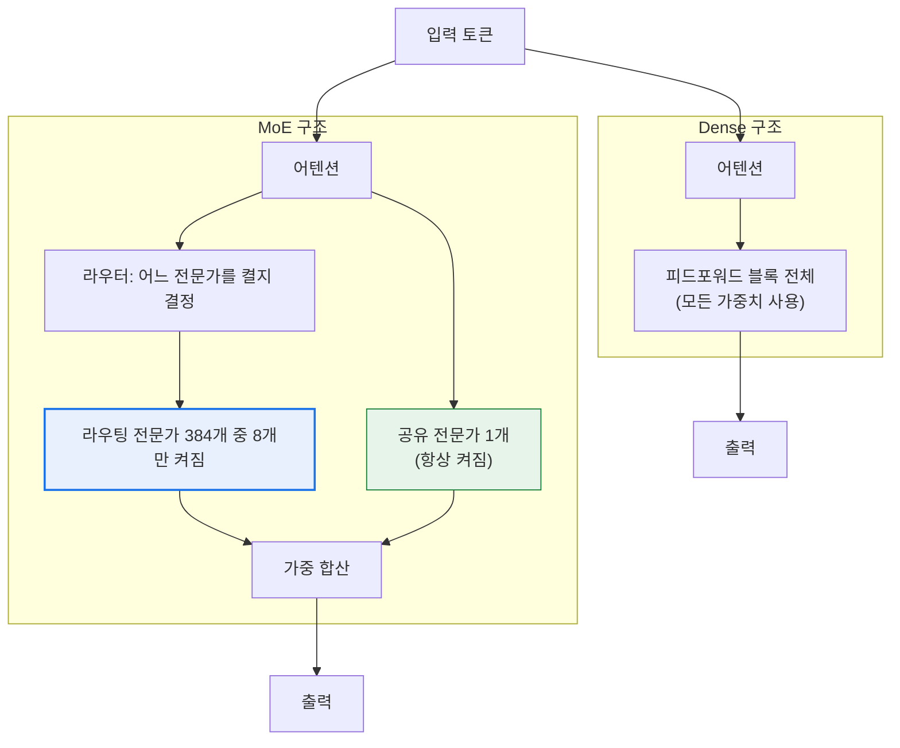

Motif 3의 구성은 **라우팅 전문가 384개 중 top-8 + 공유 전문가 1개**입니다. 즉 층마다 385개 중 9개가 켜집니다. 이 설계로 총 314B 중 토큰당 약 13B만 활성화됩니다.

**공유 전문가(shared expert)** 는 라우터의 선택과 무관하게 항상 켜지는 전문가입니다. 모든 토큰에 공통으로 필요한 일반 지식·문법 같은 것을 담당하게 해서, 라우팅 전문가들이 각자 더 특화된 역할을 맡도록 분업을 유도하는 장치입니다. 참고로 본문 3.2절에서 다룬 커뮤니티 절제 실험에서 **공유 전문가를 제거했을 때 NLL이 9.11 nats 개선**된 것이 문제의 핵심 단서였는데, 이는 배포 코드의 공유 전문가 합산 방식이 학습 시점과 달랐음을 시사하는 신호였습니다.

## A.2 총 파라미터와 활성 파라미터가 각각 지배하는 것

이 구분이 별첨 B 전체의 토대입니다.

| 지표 | 무엇을 지배하는가 | 무엇을 지배하지 않는가 |
|---|---|---|
| **총 파라미터** | 메모리 요구량, 모델이 저장할 수 있는 지식의 총량 | 토큰당 연산량 |
| **활성 파라미터** | 토큰당 연산량(FLOPs), 처리 속도 | 메모리 요구량 |
| **활성 비율** | 아무것도 지배하지 않음 — 위 두 값의 **비율일 뿐** | — |

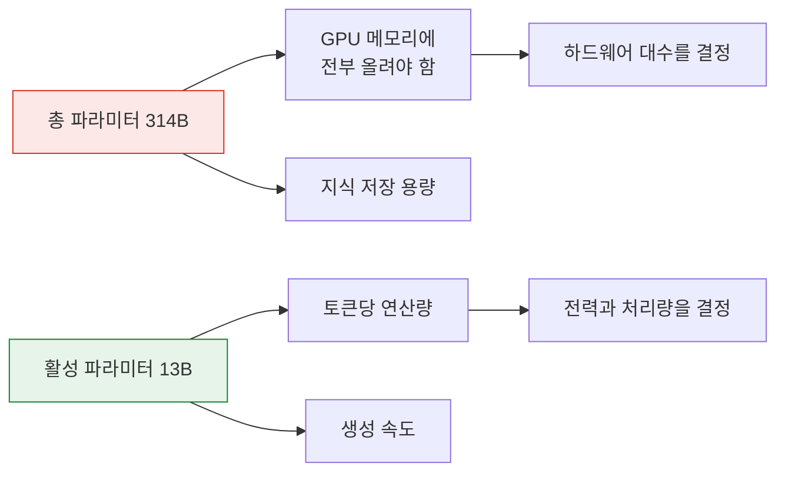

여기서 가장 흔한 오해가 나옵니다. **"활성 파라미터가 13B이니 13B 모델처럼 가볍다"는 말은 절반만 맞습니다.** 연산은 13B 수준이지만, **가중치 314B는 전부 메모리에 상주해야 합니다.** 어떤 토큰이 어떤 전문가를 부를지 미리 알 수 없기 때문에 384개 전문가를 전부 대기시켜야 합니다.

실제로 모티프가 모델 카드에 제시한 vLLM 실행 명령은 `--data-parallel-size 8`, `--enable-expert-parallel`, `--quantization modelopt_blockfp8` 을 사용하며 **B200·H200에서만 테스트됐다**고 명시합니다. 8장짜리 최신 GPU 노드를 전제한다는 뜻입니다. "가볍다"는 표현이 개인 워크스테이션 수준을 의미하지 않습니다.

## A.3 전문가 세분성(granularity)이라는 설계 축

전문가를 몇 개로 쪼개느냐도 설계 선택입니다.

- **거친 분할**: 전문가 8~16개, top-2 선택 → 초기 MoE 방식
- **세밀한 분할**: 전문가 수백 개, top-8 선택 → 최근 방식

Motif 3의 384개 전문가 중 top-8은 **세밀한 분할** 계열입니다. 전문가를 잘게 쪼개면 같은 활성 파라미터 예산으로 훨씬 다양한 조합을 만들 수 있습니다. 384개 중 8개를 고르는 조합의 수는 천문학적이라, 사실상 토큰마다 서로 다른 "맞춤 네트워크"가 구성되는 셈입니다. 표현력 측면에서 유리한 설계입니다.

대신 대가가 있습니다. 전문가가 잘게 쪼개질수록 각 전문가에 배치되는 토큰 수가 줄어 **행렬 연산이 작고 파편화**되고, 분산 환경에서 **all-to-all 통신 부담**이 커집니다. 앞서 본 커뮤니티 버그 리포트에서 문제가 된 `grouped_mm`(그룹 행렬곱) 디스패치가 바로 이 파편화를 묶어서 처리하기 위한 커널이었습니다. **세밀한 MoE는 구현 난이도가 높고, 그래서 미묘한 버그가 숨기 쉽습니다.**

## A.4 MoE가 치르는 대가 — 잘 언급되지 않는 것들

| 대가 | 내용 |
|---|---|
| **메모리** | 활성 파라미터와 무관하게 전체 가중치 상주 필요 |
| **산술 강도(arithmetic intensity)** | 메모리에서 읽는 양 대비 계산량이 낮아 **메모리 대역폭 병목**에 걸리기 쉬움 |
| **배치 효율** | 배치 내 토큰들이 서로 다른 전문가로 흩어지면 GPU 활용률이 떨어짐. 동시 요청이 적은 환경에서 특히 불리 |
| **로드 밸런싱** | 특정 전문가에 토큰이 몰리면 학습이 불안정해지고 일부 전문가가 죽음. 이를 막는 보조 손실·바이어스 설계가 필요 |
| **통신 오버헤드** | 전문가 병렬(expert parallel) 환경에서 토큰을 GPU 간에 주고받는 all-to-all 비용 발생 |
| **양자화 민감도** | 전문가별로 통계 분포가 달라 균일 양자화가 어려움 |

**정리하면**: MoE는 "공짜 점심"이 아니라 **메모리와 통신을 지불하고 연산을 사는 거래**입니다. 이 거래가 이득인지는 배포 환경(동시 요청 수, GPU 대역폭, 노드 구성)에 따라 달라집니다.

---

# 별첨 B. "파라미터 효율이 좋다"는 결론이 성립하려면 무엇이 필요한가

## B.1 문제 제기 — 이 표에는 '효율'이 없다

논의의 출발점이 된 표입니다.

| 모델 | 총 파라미터 | 활성 파라미터 | 활성 비율 | AAII v4.1 |
|---|---|---|---|---|
| DeepSeek V4 Pro | 1.6T | 49B | 약 3.1% | 44 |
| Motif 3 (Beta) | 314B | 13B | 약 4.1% | 44 |

효율은 정의상 **산출 ÷ 투입**입니다. 그런데 이 표에는 산출(AAII 44) 하나만 있고, **투입에 해당하는 항목이 하나도 없습니다.** 파라미터 수는 투입이 아니라 **설계 사양**입니다. 자동차로 치면 배기량과 최고속도만 적어놓고 연비를 논하는 것과 같습니다. 연료 소비량이 표에 없습니다.

투입에 해당하는 것은 최소한 다음 넷입니다.

1. **학습 연산량** (FLOPs) — 얼마나 태워서 만들었나
2. **학습 데이터량과 출처** — 얼마나, 어떤 데이터로 배웠나
3. **추론 연산량** — 한 과제를 푸는 데 얼마나 쓰나
4. **배포 시 실제 메모리 점유** — 정밀도를 반영한 실제 바이트

아래에서 넷을 하나씩 검토합니다. 결론을 미리 말하면, **네 개 중 셋은 현재 계산 불가능하고, 하나는 계산 가능하며 그 하나는 Motif에 유리합니다.**

## B.2 함정 1 — 활성 비율은 오히려 DeepSeek이 낮다

가장 먼저 지적해야 할 것은 표 자체의 내적 모순입니다.

- DeepSeek V4 Pro: **3.1%**
- Motif 3 (Beta): **4.1%**

**희소도(sparsity)를 효율의 척도로 본다면, 이 열은 DeepSeek의 손을 들어줍니다.** Motif가 더 많은 비율을 켭니다. 그런데 이 표를 근거로 "Motif의 파라미터 효율이 좋다"고 결론 내리면, 표에 있는 네 열 중 하나는 결론과 반대 방향을 가리키는데 그것을 무시하는 셈이 됩니다.

더 근본적으로, **활성 비율은 성과가 아니라 설계 손잡이입니다.** top-k를 8에서 4로 줄이면 활성 비율은 즉시 절반이 됩니다. 전문가 수를 384개에서 768개로 늘려도 마찬가지입니다. 성능을 유지하면서 그렇게 할 수 있느냐가 진짜 문제이지, 비율 숫자 자체는 아무것도 증명하지 않습니다.

## B.3 함정 2 — 정밀도를 빼고 파라미터 수를 비교하면 체급 격차가 과장된다

"1.6T 대 314B, 5배 체급 차이"라는 인상의 상당 부분은 **정밀도(precision) 표기를 생략한 데서 옵니다.**

- Motif 3: 텐서 타입 **BF16** (파라미터당 2바이트)
- DeepSeek V4 Pro: MoE 전문가는 **FP4**, 그 외 대부분은 **FP8** (파라미터당 0.5~1바이트)

파라미터당 바이트 수가 최대 4배 다릅니다. 실제 메모리 점유로 환산하면 격차가 크게 줄어듭니다.

> **아래는 필자의 산술 추정이며 측정값이 아닙니다.** 가정: DeepSeek V4 Pro의 전문가 파라미터 비중 90~95%, 전문가 FP4(0.5바이트)·나머지 FP8(1바이트). Motif 3은 모델 카드 표기대로 BF16.

| 모델 | 저장 방식 | 추정 가중치 용량 |
|---|---|---|
| Motif 3 (BF16) | 315B × 2바이트 | 약 **630 GB** |
| DeepSeek V4 Pro (FP4+FP8 혼합) | 1.6T, 혼합 정밀도 | 약 **840~880 GB** |
| (참고) Motif 3을 FP8로 서빙 시 | 315B × 1바이트 | 약 **315 GB** |

즉 **파라미터 수로는 5.1배 차이지만, 실제 저장 바이트로는 약 1.3~1.4배 차이**입니다. Motif를 자체 제공 vLLM 설정처럼 FP8 블록 양자화로 서빙하면 2.7배 정도로 벌어지지만, 그 경우 **양자화로 인한 품질 저하가 AA 측정 조건과 같은지 알 수 없습니다.** AA가 어떤 정밀도로 서빙되는 엔드포인트를 측정했는지 공개되지 않았기 때문입니다.

**함의**: "5배 작은 모델이 같은 점수"라는 서술은, 메모리 관점에서는 **"1.3배 작은 모델이 같은 점수"** 에 가깝습니다. 여전히 좋은 결과지만 인상의 강도는 크게 달라집니다.

## B.4 함정 3 — 학습 예산이 표에 없다

파라미터 효율을 논할 때 학계에서 통상 쓰는 기준은 **"같은 학습 연산으로 얼마나 좋은 모델을 만들었나"** 입니다. 파라미터 수만으로는 답이 나오지 않습니다. 같은 크기의 모델도 학습 토큰을 2배 태우면 훨씬 좋아지기 때문입니다.

여기서 공개 정보의 비대칭이 드러납니다.

| 항목 | DeepSeek V4 Pro | Motif 3 (Beta) |
|---|---|---|
| 사전학습 토큰 | **32T 이상** (모델 카드 명시) | **미공개** |
| 옵티마이저 | Muon (명시) | 미공개 |
| 학습 인프라 규모 | 미공개 | GPU 약 700장 / 약 5개월 (회사 발표) |
| 사후학습(post-training) 방식 | 도메인별 전문가 개별 육성 후 on-policy 증류로 통합 (명시) | 미공개 |

DeepSeek 쪽은 사전학습 연산량을 대략 어림할 수 있습니다. MoE의 학습 연산은 대체로 `6 × 활성 파라미터 × 토큰 수`로 근사되므로, `6 × 49e9 × 32e12 ≈ 9.4 × 10^24 FLOPs` 수준입니다(사전학습만, 사후학습 제외).

Motif 쪽은 토큰 수가 없어 같은 방식으로 계산할 수 없습니다. 다만 발표된 인프라 조건으로 **상한**을 잡아볼 수는 있습니다.

> **아래는 가정이 많은 상한 추정이며, 회사가 공개한 값이 아닙니다.** 가정: GPU 700장을 H100급(BF16 실효 연산 약 148 TFLOPS, MFU 35% 가정)으로 보고, 5개월(150일) 클러스터 전체를 이 모델 하나에 100% 투입했다고 가정.
>
> `700 × 150일 × 86,400초 × 1.48e14 ≈ 1.3 × 10^24 FLOPs`
>
> 이를 다시 `6 × 13e9 × D` 로 역산하면 D ≈ **17T 토큰**이 상한이 됩니다. 현실에서는 데이터 전처리·절제 실험·사후학습에 상당 비중이 쓰이므로, 최종 사전학습 실투입은 이 값의 **30~50% 수준(약 5~9T 토큰)** 으로 보는 편이 합리적입니다. 참고로 선행 모델인 Motif-2-12.7B는 5.5T 토큰으로 학습되었습니다.

**주의**: GPU 종류가 공개되지 않았습니다. A100급이었다면 위 추정치는 3분의 1 수준으로 떨어지고, B200급이었다면 2배 이상 올라갑니다. **이 한 가지 미공개 변수만으로 추정치가 한 자릿수 범위에서 흔들립니다.**

그럼에도 방향성은 읽힙니다. **Motif의 학습 연산은 DeepSeek 대비 최소 7배 이상 적었을 가능성이 높습니다.** 이것이 사실이라면 학습 연산 효율 측면에서 의미 있는 주장이 됩니다. 다만 **현재는 추정이지 검증된 사실이 아닙니다.** 최종본 기술보고서에 토큰 수와 GPU 시간이 명시되어야 비로소 확정됩니다.

## B.5 함정 4 — 데이터 출처와 증류라는 미확정 변수

이 항목은 조심스럽게 다뤄야 합니다. **어떤 혐의를 제기하는 것이 아니라, 계산에 필요한 정보가 비어 있다는 사실을 지적하는 것**입니다.

최근 모델들의 성능은 사후학습 데이터 품질에 크게 좌우됩니다. DeepSeek V4는 모델 카드에서 **도메인별 전문가 모델을 개별 육성한 뒤 on-policy 증류로 하나의 모델에 통합**하는 2단계 방식을 명시했습니다. 이는 자사 모델 내부의 증류입니다.

일반론으로, 어떤 모델이 더 강한 외부 모델의 출력을 사후학습 데이터로 활용한다면, 그 모델의 "효율"에는 **아키텍처 기여분과 전이받은 능력 기여분이 섞여 있게** 됩니다. 이 둘을 분리하려면 데이터 구성이 공개되어야 합니다.

**Motif 3의 사후학습 데이터 구성은 공개되지 않았습니다.** 어느 쪽 증거도 없다는 뜻입니다. 따라서 현시점에서 "이 성능이 순수하게 아키텍처 설계에서 나왔다"고 단정할 근거도, 그 반대를 주장할 근거도 없습니다. **효율 주장의 분모를 확정할 수 없다는 것이 요점입니다.**

## B.6 함정 5 — 토큰 회계는 생각보다 취약하다 (본문 서술 정정 포함)

본문 3.4절에서 저는 이렇게 썼습니다.

> "Motif 3은 동급 대비 3배 이상 장황합니다."

**이 서술은 정정이 필요합니다.** 근거로 삼은 두 중앙값이 서로 다른 비교군에서 계산된 값이기 때문입니다.

| 모델 | 지수 완주 출력 토큰 | AA가 제시한 비교군 중앙값 | 비교군의 정의 |
|---|---|---|---|
| Motif 3 (Beta) | 약 190M | 61M | **유사 가격대**의 추론 모델 |
| DeepSeek V4 Pro (max) | 약 180M | 98M | **유사 규모의 오픈웨이트** 모델 |

Motif는 가격이 $0.00이므로 최저가 구간의 소형·저가 모델들과 묶여 중앙값이 61M으로 낮게 잡힙니다. DeepSeek은 대형 오픈웨이트 그룹에 묶여 중앙값이 98M입니다. **비교군이 다른 배수를 나란히 놓은 것이 오류였습니다.**

두 모델을 직접 비교하면 **190M 대 180M으로 거의 동등**합니다. "Motif가 DeepSeek보다 3배 장황하다"는 것은 사실이 아니며, 정확히는 **"둘 다 매우 장황하고, 그 정도가 서로 비슷하다"** 입니다.

여기에 하나 더. **토큰 수는 토크나이저에 따라 달라지므로 서로 다른 모델 간 직접 비교가 원래 취약합니다.** Motif 3의 어휘 크기는 220,160입니다. DeepSeek V4의 어휘 크기는 모델 카드에 명시되어 있지 않습니다. 어휘가 크면 같은 문장을 더 적은 토큰으로 표현하므로, 토큰 수만 비교하면 어휘가 큰 쪽이 유리하게 보입니다.

## B.7 그래서 살아남는 주장은 무엇인가 — 추론 연산 효율

지금까지 대부분을 무너뜨렸지만, **하나는 계산 가능하고 실제로 유의미합니다.**

추론 시 선형층 연산량은 대략 `2 × 활성 파라미터 × 토큰 수`로 근사됩니다. 두 모델이 지수를 완주하는 데 쓴 출력 토큰이 공개되어 있으므로 이건 계산됩니다.

| 모델 | 활성 파라미터 | 출력 토큰 | 추정 순전파 연산량 |
|---|---|---|---|
| Motif 3 (Beta) | 13B | 190M | 약 **4.9 × 10^18 FLOPs** |
| DeepSeek V4 Pro (max) | 49B | 180M | 약 **1.8 × 10^19 FLOPs** |

**같은 44점을 내는 데 Motif가 약 3.6배 적은 추론 연산을 썼습니다.** 이건 표의 "활성 파라미터 4분의 1"과 "출력 토큰 거의 동일"이 결합된 결과이며, 앞선 함정들을 통과한 뒤에도 살아남는 주장입니다.

단서는 붙습니다.

- **출력 토큰만 반영했습니다.** AA는 입력·프리필 토큰 수를 공개하지 않습니다. 에이전트 벤치마크는 긴 컨텍스트를 반복 입력하므로 프리필 비중이 상당할 수 있습니다.
- **어텐션 자체의 연산을 제외했습니다.** 컨텍스트가 길어질수록 어텐션 비중이 커지며, DeepSeek의 CSA/HCA 하이브리드는 바로 이 부분을 최적화한 설계입니다. 장문 구간에서는 격차가 줄어들 수 있습니다.
- **연산량이 곧 비용은 아닙니다.** MoE는 메모리 대역폭 병목에 걸리기 쉬워, FLOPs가 4분의 1이어도 실측 처리량이 4배가 되지는 않습니다.
- **Motif의 실측 속도는 AA에서 N/A입니다.** 즉 실제 처리량 비교는 아직 불가능합니다.

## B.8 체급 격차가 만드는 능력 프로파일의 차이

합산 점수가 같아도 능력 분포는 다를 수밖에 없는 구조적 이유가 있습니다.

| 축 | 총 파라미터가 큰 쪽(DeepSeek)이 유리 | 비고 |
|---|---|---|
| **저장된 사실 지식** | 유리 | 파라미터 수는 기억 용량과 직결. AA-Omniscience 유형 |
| **희귀 언어·도메인 커버리지** | 유리 | 전문가 수가 많을수록 니치 영역 수용 |
| **장문 컨텍스트** | 유리 | 1M 대 256K, 게다가 전용 어텐션 설계 |
| **추론 강도 조절** | 유리 | Non-think / High / Max 3단 제공 |
| **토큰당 연산 비용** | 불리 | 활성 49B 대 13B |
| **메모리 점유** | 소폭 불리 | 정밀도 반영 시 격차 축소 |

그런데 **AAII v4.1은 에이전트 34% + 코딩 24% = 58%가 도구 사용·실행 능력**입니다. 지식 항목의 비중이 상대적으로 작습니다. 즉 **총 파라미터가 큰 쪽의 강점(지식 용량)이 지표 설계상 희석되는 구조**입니다.

이건 어느 쪽을 유리하게 만드는 편향이라기보다, **"이 지표에서 동점이라는 것이 모든 축에서 동등하다는 뜻이 아님"을 다시 확인시키는 대목**입니다. 지식 집약적 업무(사내 문서 QA, 사실 검증)라면 1.6T 쪽이, 도구 호출 위주 에이전트 워크로드라면 격차가 좁을 가능성이 있습니다. **다만 항목별 점수가 공개되지 않아 이 역시 추론입니다.**

추가로, 비교 조건 자체의 비대칭도 남아 있습니다.

- Motif 3은 **베타 프리뷰 체크포인트**, DeepSeek V4는 정식 배포판입니다. (다만 DeepSeek 모델 카드도 자사 V4 시리즈를 "preview version"으로 표기하고 있어, 이 비대칭은 생각보다 작을 수 있습니다.)
- DeepSeek의 44점은 **3개 모드 중 최상단**, Motif의 44점은 **단일 모드**입니다. 모드 선택지가 있다는 것 자체가 배포 유연성 측면의 이점입니다.

## B.9 종합 — 무엇을 말할 수 있고 무엇을 말할 수 없나

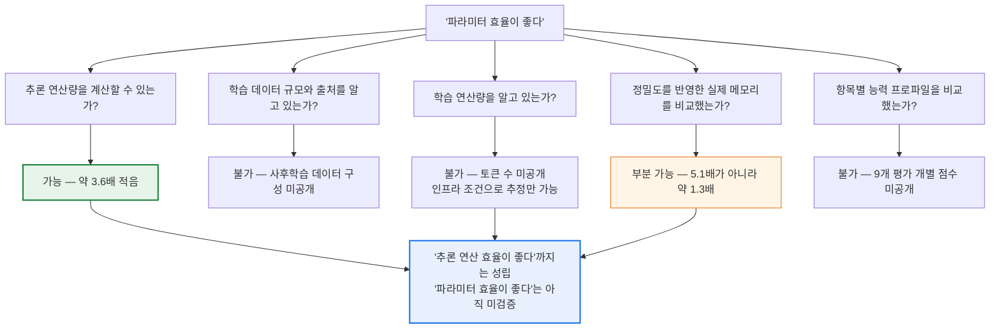

| 주장 | 판정 | 근거 |
|---|---|---|
| "활성 파라미터 13B로 44점을 냈다" | **사실** | 모델 카드 + AA 게시값 |
| "같은 점수를 3.6배 적은 추론 연산으로 낸다" | **계산상 성립** (출력 토큰 기준, 프리필·어텐션 제외) | 활성 파라미터 × 출력 토큰 |
| "5배 작은 모델이 같은 점수를 냈다" | **과장** | 정밀도 반영 시 메모리 격차는 약 1.3배 |
| "활성 비율이 낮아서 효율적이다" | **오류** | 활성 비율은 Motif가 더 높음 |
| "3배 더 장황하다"(본문 3.4절) | **정정** | 비교군이 다른 중앙값을 대조한 오류. 실제로는 190M 대 180M으로 동등 |
| "파라미터 효율이 좋다" | **미검증** | 학습 연산·데이터 미공개로 분모 확정 불가 |
| "학습 연산이 한 자릿수 적었을 것" | **추정** | 인프라 조건 기반 상한 추정, 가정 다수 |

## B.10 이 판단을 확정하려면 최종본에서 무엇을 확인해야 하나

8월 초 최종본 공개 시 기술보고서에서 다음이 나오면 효율 주장이 검증 가능해집니다.

1. **사전학습 토큰 수와 총 GPU 시간** — 이 둘이 있어야 학습 연산 효율이 계산됩니다. 가장 중요합니다.
2. **GPU 기종** — 700장이 A100인지 H100인지 B200인지에 따라 추정치가 한 자릿수 흔들립니다.
3. **사후학습 데이터 구성과 증류 사용 여부** — 아키텍처 기여분을 분리하려면 필요합니다.
4. **AA 9개 항목별 점수** — 합산 뒤에 숨은 프로파일 차이를 봐야 합니다.
5. **서빙 정밀도와 실측 처리량** — AA의 속도가 N/A인 한 실효 비용은 계산되지 않습니다.
6. **GDLA·Grouped PolyNorm의 절제 실험** — 자체 설계 요소가 실제로 기여했는지는 아직 공개 검증이 없습니다.
7. **입력·프리필 토큰 수** — 에이전트 벤치마크의 실제 비용 구조를 보려면 필요합니다.

## B.11 정리

지적하신 문제의식이 정확합니다. **네 개 열짜리 표로는 효율을 말할 수 없습니다.** 그 표의 어느 열도 투입을 나타내지 않으며, 한 열(활성 비율)은 오히려 반대 방향을 가리키고, 다른 한 열(총 파라미터)은 정밀도를 빼놓아 격차를 과장합니다.

그럼에도 **완전히 무너지지는 않습니다.** 활성 파라미터와 출력 토큰이라는 두 공개값을 결합하면 추론 연산 효율은 계산되고, 그 값은 Motif 쪽이 약 3.6배 유리합니다. 여기에 700장·5개월이라는 인프라 조건까지 감안하면 **"학습·추론 양쪽에서 적은 연산으로 같은 합산 점수에 도달했을 개연성"** 은 남습니다.

정확한 서술은 이렇게 됩니다.

> Motif 3은 **동일 합산 지표에서 DeepSeek V4 Pro(max)와 동점이며, 토큰당 연산량은 약 4분의 1, 출력 토큰량은 유사하다.** 따라서 **추론 연산 효율은 우위로 계산된다.** 다만 **학습 연산량·데이터 규모·데이터 출처가 공개되지 않아 통상 의미의 '파라미터 효율'은 아직 검증되지 않았으며**, 정밀도를 반영하면 메모리 격차는 파라미터 수가 시사하는 것보다 훨씬 작다.

본문 4.2절의 "같은 점수를 활성 파라미터 4분의 1로 냈다"는 서술 자체는 사실이지만, **거기서 "따라서 파라미터 효율이 좋다"로 넘어가는 추론 단계가 빠져 있었습니다.** 이 별첨이 그 빠진 단계를 채웁니다.

---

# 별첨 C. 중국 모델들은 왜 MoE에 사활을 걸었나

별첨 A에서 MoE가 "메모리와 통신을 지불하고 연산을 사는 거래"라고 정리했습니다. 그렇다면 왜 중국 랩들은 거의 예외 없이 이 거래를 선택했을까요. 그리고 각 랩은 같은 MoE라도 서로 다른 방식으로 설계했는데, 그 차이는 무엇일까요. 이 별첨은 그 두 질문에 답하고, 마지막에 Motif 3이 이 지형 어디에 놓이는지를 대조합니다.

## C.1 배경 — 제약이 설계 방향을 결정했다

### C.1.1 무엇이 제약이었나

세 가지가 동시에 작용했습니다.

**첫째, 반도체 수출 통제.** 미국의 수출 통제로 중국 랩들은 최상위 칩에 접근할 수 없게 되었고, H800·H20처럼 의도적으로 성능을 낮춘 변형판을 써야 했습니다. 브루킹스 연구소는 <cite index="121-1">중국 AI 기업들이 미국의 첨단 칩 수출 통제, 국산 칩 대안의 낮은 성능과 가용성, 그리고 미국 경쟁사 대비 훨씬 적은 자본 접근성 때문에 미국 경쟁자들의 연산 규모에 접근할 수 없다고 분석했습니다.</cite> 그 결과 <cite index="121-1">중국 기업들은 부족한 연산 자원을 보완하기 위해 알고리즘적·엔지니어링적 해법에 의존할 수밖에 없었습니다.</cite>

**둘째, 자본 격차.** 미국 프론티어 랩들이 수천억 달러 규모의 인프라 투자를 집행하는 동안, 중국 스타트업들은 그보다 자릿수가 낮은 자금으로 경쟁해야 했습니다.

**셋째, 전력과 메모리.** 대규모 클러스터를 갖춰도 안정적 전력과 고대역폭 메모리 확보가 별도의 병목이었습니다.

### C.1.2 제약이 어떻게 MoE로 귀결되었나

세계경제포럼 기고는 이 인과를 간명하게 정리합니다. <cite index="124-1">수출 통제가 실제로 한 일은 중국의 AI 엔지니어·창업자·투자자들이 "더 적은 자원으로 더 많이" 하도록, 즉 와트당·달러당·GPU당 성능을 최적화하도록 인센티브를 날카롭게 만든 것이었습니다.</cite> <cite index="124-1">연산에 강한 제약이 걸리자 중국 모델 개발자들은 효율을 공격적으로 최적화하기 시작했고, 성능을 희생하지 않으면서 학습 비용을 최소화하는 기법들을 개발했습니다. DeepSeek의 희소 MoE 모델과 메모리 효율적 추론 파이프라인이 그 결과 중 하나입니다.</cite>

당사자의 증언도 있습니다. 문샷AI(Moonshot AI)의 장위통 사장은 2026년 세계경제포럼에서 <cite index="123-1">"우리에겐 단순히 연산을 늘릴 여유가 없다는 걸 알았고, 그것이 우리를 기초 연구와 효율에 집중하게 만들었다"</cite>고 말했습니다. 같은 기사는 <cite index="123-1">희소 활성화 MoE 아키텍처가 바로 그 제약의 직접적 산물이며, 하드웨어를 더 투입하는 선택지가 없었기 때문에 더 낮은 토큰당 연산 비용으로 프론티어에 근접한 성능을 달성하는 설계 철학이 나온 것이라고</cite> 정리합니다.

### C.1.3 다만 "제약 때문만"은 아니다 — 균형 잡힌 시각

여기서 흔한 과잉 서사를 하나 걷어낼 필요가 있습니다. **MoE는 중국의 발명이 아니고, 중국만 쓰는 것도 아닙니다.** 한 분석은 <cite index="122-1">MoE가 중국 랩의 전유물이 아니며 OpenAI와 구글도 프론티어 모델에 MoE 아키텍처를 사용하지만, 중국 팀들 특히 DeepSeek이 전문가 선택과 균형 방식의 혁신으로 효율 프론티어를 더 밀어붙였다고</cite> 지적하면서, <cite index="122-1">효율적인 학습 아키텍처는 제약이 아니라 선택이며 중국 랩들이 그 선택을 일찍 했다는 것이 공공연한 사실이라고</cite> 정리합니다.

또한 비판적 시각도 함께 봐야 합니다. CSIS는 <cite index="125-1">중국 AI 모델의 학습 비용이 낮은 것은 미국 기업들처럼 시행착오의 여유가 없기 때문이며, 수출 통제와 접근 제한이 중국 랩들의 자체 연산 인프라 구축을 막는 데 효과를 내고 있다고</cite> 보고, <cite index="125-1">그래서 중국 랩들이 미국 모델의 증류, 오픈웨이트 관행, 추론 효율을 통해 출시 전에 필요한 값비싼 실험 횟수를 줄이는 방식으로 일한다고</cite> 분석합니다. 즉 **효율성 서사에는 "실험 예산이 부족해 안전성 검증도 상대적으로 제한적"이라는 이면이 함께 붙어 있습니다.**

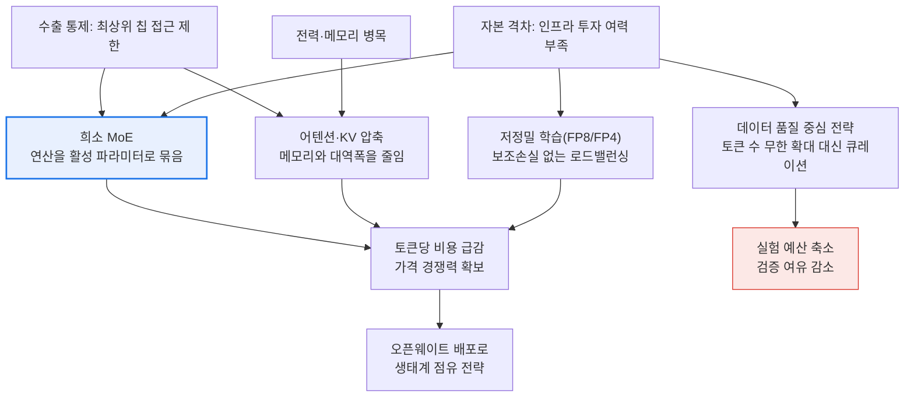

### C.1.4 핵심 통찰 — MoE는 단독 기술이 아니라 '2종 세트'다

이 별첨에서 가장 중요한 대목입니다.

별첨 A에서 정리했듯 MoE는 연산을 줄이는 대신 **메모리를 더 씁니다.** 그런데 중국 랩들이 처한 제약은 연산만이 아니라 메모리·대역폭이기도 했습니다. MoE만 도입하면 한쪽 문제를 풀고 다른 쪽 문제를 키우는 셈이 됩니다.

그래서 중국 랩 설계의 실제 공통 문법은 **"희소 MoE + 어텐션/KV 압축"의 2종 세트**입니다. MoE로 FFN 쪽 연산을 줄이고, 어텐션 쪽에서 KV 캐시와 장문 연산을 압축해 메모리 부담을 되갚는 구조입니다. 각 랩의 고유 기법은 대부분 이 두 번째 자리에 들어갑니다.

| 랩 | MoE 쪽 기여 | 어텐션·메모리 쪽 기여 |
|---|---|---|
| DeepSeek | DeepSeekMoE, 보조손실 없는 로드밸런싱 | MLA → DSA → CSA + HCA |
| Moonshot | Stable LatentMoE, Quantile Balancing | KDA(Kimi Delta Attention), Gated MLA |
| Z.ai | GLM-MoE | DeepSeek DSA 채택 + IndexShare |
| MiniMax | 세분화 전문가 + 학습형 전문가 바이어스 | Lightning Attention → MSA |
| Motif(한국) | 384 전문가 top-8 + 공유 1 | GDLA(그룹형 차등 잠재 어텐션) |

## C.2 DeepSeek이 세운 문법 — 나머지가 따라간 표준

중국 MoE 설계의 상당 부분은 DeepSeek이 2024년에 확립한 세 가지 위에 서 있습니다.

**(1) DeepSeekMoE (2024년 1월).** 두 가지 아이디어의 결합입니다. <cite index="193-1">DeepSeekMoE는 세분화된 전문가 분할(fine-grained expert segmentation)과 공유 전문가 격리(shared expert isolation)를 통해 더 강한 전문가 특화와 경제적인 학습 비용을 달성합니다.</cite> <cite index="196-1">기존 MoE가 소수의 큰 전문가에게 토큰을 라우팅했다면, DeepSeekMoE는 각 전문가의 FFN 블록을 잘게 쪼개고 여기에 항상 켜지는 공유 전문가를 덧붙였습니다.</cite> **Motif 3의 "384개 top-8 + 공유 전문가 1개"는 정확히 이 문법입니다.**

**(2) MLA — Multi-head Latent Attention (V2, 2024년 5월).** <cite index="193-1">MLA는 KV 캐시를 저차원 잠재 벡터로 압축해 추론 시 GPU 메모리 사용량을 크게 줄입니다.</cite> 앞서 말한 '2종 세트'의 두 번째 자리를 만든 기법입니다.

**(3) 보조손실 없는 로드밸런싱 (V3, 2024년 12월).** <cite index="193-1">V3는 V2 위에 Auxiliary-Loss-Free 로드밸런싱 전략과 다중 토큰 예측(MTP) 학습 목표를 추가했습니다.</cite> 기존에는 전문가 쏠림을 막기 위해 별도의 페널티 손실을 걸었는데, 이 손실의 기울기가 본래 학습 목표와 충돌해 품질을 깎았습니다. DeepSeek은 손실 대신 **라우터 점수에 학습 가능한 바이어스 항**을 더해 선택만 조정하는 방식으로 이 충돌을 제거했습니다.

이 세 가지가 얼마나 널리 퍼졌는지는 파급 경로로 확인됩니다. 브루킹스는 <cite index="121-1">DeepSeek이 개발한 DeepSeek Sparse Attention을 Z.ai 같은 다른 중국 랩들이 채택했다고</cite> 전합니다. MiniMax도 <cite index="173-1">라우팅 최적화와 로드밸런싱 문제를 피하기 위해 시그모이드 게이팅과 학습 가능한 전문가별 바이어스 항을 도입해 제약적인 보조손실 의존을 크게 줄였습니다.</cite>

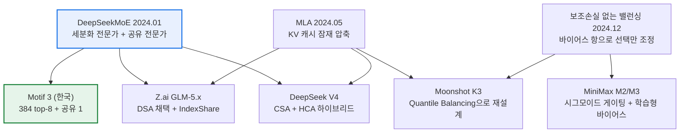

## C.3 랩별 MoE 특성과 주도 인물

아래 정보는 각 모델 카드와 보도를 교차 확인한 것입니다. **활성 파라미터와 학습 토큰 수는 상당수가 벤더 자기 보고값**이라는 점을 먼저 밝혀둡니다.

### C.3.1 DeepSeek(深度求索) — 문법을 만든 팀

| 항목 | 내용 |
|---|---|
| 대표 모델 | DeepSeek-V4-Pro (1.6T / 49B 활성), V4-Flash (284B / 13B 활성) |
| MoE 특성 | 세분화 전문가 + 공유 전문가, 보조손실 없는 로드밸런싱, FP4+FP8 혼합 정밀도 |
| 어텐션 | CSA(압축 희소 어텐션) + HCA(고압축 어텐션) 하이브리드 |
| 컨텍스트 / 라이선스 | 1M / MIT |
| 사전학습 | 32T 토큰 이상, Muon 옵티마이저 |

**주도 인물: 량원펑(梁文锋, Liang Wenfeng).** <cite index="133-1">1985년생, 저장대 학·석사 출신으로 퀀트 헤지펀드 하이플라이어(High-Flyer)의 공동창업자이자 그 산하 AI 기업 DeepSeek의 창업자 겸 CEO입니다.</cite> <cite index="133-1">하이플라이어를 통해 대규모 컴퓨팅 인프라를 구축했고, 그것이 2023년 DeepSeek 창립으로 이어졌습니다.</cite> 주목할 점은 **인프라 확보 시점**입니다. <cite index="130-1">2019년부터 2022년 사이, 즉 엄격한 하드웨어 수출 제한이 발효되기 전에 량원펑은 하이플라이어의 자기자본 거래 이익 중 1억 3,900만 달러 이상을 파이어플라이어 슈퍼컴퓨팅 플랫폼 구축과 엔비디아 A100 1만 장 이상 확보에 투입했습니다.</cite> 수출 통제를 앞질러 칩을 비축한 것이 이후 효율 중심 연구의 물적 토대가 되었습니다.

**조직 특성**: 외부 투자 없이 헤지펀드 수익으로 운영되어 왔고, 인원 규모도 작습니다(2025년 기준 약 160명). 다만 **인재 유출이 최근 약점으로 지목**됩니다. 한 분석은 <cite index="208-1">경쟁사들이 DeepSeek의 엔지니어·연구자를 공격적으로 영입하기 시작했고, DeepSeek-V3 기여자인 뤄푸리는 현재 샤오미 LLM 팀장, V3와 R1 양쪽의 핵심 저자인 궈다야는 바이트댄스 시드 랩에 합류했으며, 외부 자금과 공식 기업가치가 없어 연구자에게 지분 인센티브를 줄 수 없다는 점이 인력 유지 비용을 높인다고</cite> 지적합니다.

### C.3.2 문샷AI(月之暗面, Moonshot AI) — 희소도를 극한으로

| 항목 | 내용 |
|---|---|
| 대표 모델 | Kimi K3 (2.8T 총 파라미터), K2.6 (1T / 32B 활성, 256K) |
| MoE 특성 | <cite index="145-1">896개 전문가 중 토큰당 16개 활성</cite>, Stable LatentMoE 프레임워크 |
| 로드밸런싱 | <cite index="145-1">Quantile Balancing — 라우터 점수 분위수에서 전문가 배분을 직접 도출해, 휴리스틱 갱신과 민감한 밸런싱 하이퍼파라미터를 제거</cite> |
| 어텐션 | <cite index="145-1">KDA(Kimi Delta Attention) — 선형 어텐션 층과 주기적 풀 어텐션 층을 3:1 비율로 교차 배치하는 하이브리드 선형 어텐션</cite>, AttnRes(어텐션 잔차) |
| 옵티마이저 | <cite index="145-1">Per-Head Muon — 어텐션 헤드를 독립적으로 최적화하도록 Muon을 확장</cite> |
| 컨텍스트 / AAII | 1M / 57 |

**K3의 희소도는 이 목록에서 가장 극단적입니다.** 896개 중 16개면 약 1.8%입니다. <cite index="141-1">이는 추론 시 토큰당 연산 비용이 대략 500억 파라미터짜리 밀집 모델을 돌리는 것과 비슷하다는 뜻이지, 2.8조 파라미터어치 연산을 하는 게 아니라는 뜻입니다.</cite> 다만 활성 파라미터 수치는 출처에 따라 **약 40B~50B로 엇갈리므로** 확정값으로 쓰기 어렵습니다.

**주도 인물: 양즈린(杨植麟, Yang Zhilin).** <cite index="147-1">2023년 3월 칭화대 출신으로 구글 브레인과 FAIR를 거친 양즈린이 창업했습니다.</cite> <cite index="147-1">그가 모은 팀은 장문 컨텍스트 모델링에 유난히 깊은 전문성을 갖고 있었고, 2023년 10월 출시한 첫 제품 Kimi 챗봇은 원시 성능이 아니라 컨텍스트 길이로 차별화했습니다. 이 '장문 컨텍스트 지능'이 회사의 기술적 정체성이 되었고, 결국 K3의 1M 윈도를 가능하게 한 KDA 아키텍처로 이어졌습니다.</cite> 사장 장위통(Yutong Zhang)이 앞서 인용한 WEF 발언의 주인공입니다.

**약점도 드러났습니다.** <cite index="123-1">K3는 출시 48시간 만에 GPU 용량 한계에 부딪혔고,</cite> 모회사는 신규 구독을 일시 중단했습니다. <cite index="123-1">문샷은 K3를 최소 64개 가속기 규모의 슈퍼노드에서 서빙할 것을 권고하며, 전문가 병렬 라우팅 트래픽을 단일 고대역폭 인터커넥트 도메인 안에 가두도록 합니다.</cite> **별첨 A에서 말한 all-to-all 통신 비용이 실제 배포 제약으로 나타난 사례입니다.**

### C.3.3 Z.ai(智谱, 구 Zhipu AI) — 코딩·에이전트 특화

| 항목 | 내용 |
|---|---|
| 대표 모델 | GLM-5.2 (744~753B / 약 40B 활성) |
| MoE 특성 | GLM-MoE, <cite index="148-1">28.5조 토큰으로 학습</cite> |
| 어텐션 | <cite index="148-1">DeepSeek Sparse Attention(DSA)을 기반 어텐션 메커니즘으로 사용</cite> + <cite index="149-1">IndexShare — 1M 컨텍스트 추론 비용을 억제하기 위한 신규 희소 어텐션 기법</cite> |
| 컨텍스트 / 라이선스 | 1M / MIT |
| 포지셔닝 | <cite index="149-1">대화형 범용 모델이 아니라 코딩 우선·에이전트 지향 시스템으로 자리매김</cite> |

**주도 인물: 탕제(唐杰, Tang Jie)와 리쥐안쯔(李涓子, Li Juanzi), CEO 장펑(张鹏, Zhang Peng).** <cite index="148-1">Z.ai는 2019년 칭화대 지식공학연구그룹에서 스핀오프한 중국 AI 연구소로, 탕제와 리쥐안쯔 교수가 공동 창업했고 역시 칭화대 동문인 장펑 CEO가 상업적 확장을 이끕니다.</cite>

**전략적 특징 — 타이밍.** <cite index="148-1">2026년 1월 홍콩증권거래소에 종목코드 02513으로 상장하며 전 세계에서 처음으로 상장한 주요 AI 모델 개발사가 되었습니다.</cite> 그리고 GLM-5.2 출시일이 의미심장합니다. <cite index="153-1">Z.ai는 미국 상무부가 Claude Fable 5의 전 세계 접근을 중단시킨 다음 날인 2026년 6월 13일 GLM-5.2를 공개했고, 창업자 탕제는 출시 게시글을 "일부 프론티어 모델에 대한 갑작스러운 제한은 매우 유감스럽다"는 문장으로 시작했습니다.</cite> **오픈웨이트를 지정학적 공백을 파고드는 수단으로 쓰는 전형적 사례입니다.**

### C.3.4 알리바바 Qwen(通义千问) — 규모와 조직 리스크가 동시에

| 항목 | 내용 |
|---|---|
| 대표 모델 | Qwen3.8-Max-Preview (2.4T, 활성 파라미터 미공개), Qwen3-235B-A22B (235B / 22B) |
| MoE 특성 | <cite index="162-1">Qwen3-235B-A22B는 총 2,350억 중 토큰당 220억을 활성화하고, Qwen3-30B-A3B는 약 30억을 활성화하며, 둘 다 희소 MoE 설계이고 Max 티어도 마찬가지입니다.</cite> |
| 미공개 이슈 | <cite index="162-1">Qwen3.8은 활성 파라미터 수를 아무도 모르며, 그것 없이는 2.4T라는 숫자가 서빙 비용에 대해 말해주는 바가 거의 없습니다.</cite> |

**주도 인물의 공백이 최대 변수입니다.** <cite index="160-1">린쥔양(林俊旸, Junyang Lin, 1993년생)은 알리바바 통이랩의 대규모 언어모델 총괄이자 알리바바 클라우드 역사상 최연소 P10급 기술 전문가 중 한 명으로, Qwen의 초기 개척자이자 핵심 기술 리드였으며 2026년 3월 알리바바를 떠났습니다.</cite> 동시에 <cite index="161-1">포스트트레이닝 책임자 위보원도 같은 날 퇴사했고, Qwen Code 책임자 후이빈은 이미 2026년 1월 메타로 옮겼습니다.</cite> 후임 체계는 <cite index="159-1">알리바바 CEO 우융밍(Eddie Wu)이 알리바바 클라우드 CTO 저우징런(周靖人)이 통이랩을 계속 이끌 것이라고 밝히고, 그룹 차원의 자원을 동원할 파운데이션 모델 지원 조직을 신설하는 형태</cite>로 정리되었습니다. <cite index="161-1">포스트트레이닝 역할은 올해 초 통이랩에 합류한 전 딥마인드 시니어 스태프 리서처 저우하오가 승계했습니다.</cite>

**그 여파가 관측됩니다.** 한 보도는 <cite index="158-1">린쥔양 퇴사 이후 통이랩이 세 차례 조직 개편을 거치며 기술 주도 모델에서 상업 주도의 "토큰 팩토리"로 선회했고, Qwen3.8-Max 프리뷰 출시는 포스트트레이닝이 아직 끝나지 않은 채 서둘러 나왔다는 비판을 받았다고</cite> 전합니다. **리더십 변동이 모델 품질과 로드맵에 직접 영향을 준 가장 뚜렷한 사례입니다.**

### C.3.5 MiniMax(稀宇科技) — 선형 어텐션 계보의 대표

| 항목 | 내용 |
|---|---|
| 대표 모델 | MiniMax M3 (428B / 약 23B 활성), 2026년 6월 1일 공개 |
| MoE 특성 | 이전 세대 M2 기준 <cite index="173-1">총 2,299억 파라미터에 256개 세분화 전문가를 두고 토큰당 98억만 활성화</cite> |
| 로드밸런싱 | <cite index="173-1">시그모이드 게이팅 + 학습 가능한 전문가별 바이어스 항</cite> |
| 어텐션 | <cite index="165-1">그룹 쿼리 어텐션 백본 위에 MSA(MiniMax Sparse Attention)를 올린 구조로, 1M 컨텍스트에서 토큰당 연산을 이전 세대의 약 20분의 1로 줄임</cite> |
| 계보 | MiniMax-01/M1의 <cite index="168-1">라이트닝 어텐션 — 하이브리드 MoE와 결합해, 10만 토큰 생성 길이에서 DeepSeek R1 대비 25%의 FLOPs만 소모</cite> |
| 차별점 | <cite index="171-1">1M 컨텍스트를 갖춘 네이티브 멀티모달 모델</cite>, 텍스트·이미지·비디오 입력을 학습 첫 단계부터 지원 |

**주도 인물: 옌쥔제(闫俊杰, Yan Junjie).** <cite index="178-1">36세로 창업자·이사회 의장·CEO·CTO를 겸직하며, 특히 AI 연구개발에 관한 전략과 운영 계획 수립을 직접 담당합니다. MiniMax 창업 전에는 홍콩 상장사 센스타임(SenseTime)에서 6년 넘게 부사장 및 연구원 부원장 등을 역임했습니다.</cite> <cite index="179-1">MiniMax는 2021년 12월 센스타임 출신 컴퓨터 비전 연구자들이 상하이에서 창업했고,</cite> <cite index="182-1">회사명은 미니맥스 알고리즘에서 따왔습니다.</cite> <cite index="175-1">2026년 1월 9일 홍콩증권거래소에 상장했으며, 옌쥔제는 경제적 지분은 약 25%지만 차등의결권 구조로 약 72%의 의결권을 보유합니다.</cite>

**컴퓨터 비전 출신 팀이라는 배경이 설계에 드러납니다.** 텍스트 전용이 다수인 중국 오픈웨이트 진영에서 M3가 유일하게 네이티브 멀티모달로 차별화한 것은 우연이 아닙니다.

### C.3.6 그 외 — 빅테크와 비(非)AI 기업의 참전

| 랩 / 기업 | 대표 모델 | 총 / 활성 | 라이선스 | 주도 인물 |
|---|---|---|---|---|
| **샤오미** | MiMo-V2-Flash | <cite index="203-1">309B / 15B, 256K 컨텍스트, 초당 150토큰</cite> | MIT | 뤄푸리(罗福莉) |
| **텐센트** | Hy3 (HunYuan 3.0) | <cite index="184-1">295B / 21B, 256K</cite> | <cite index="184-1">Apache 2.0</cite> | 공개 확인 어려움 |
| **메이퇀** | LongCat-2.0 | <cite index="190-1">1.6T / 평균 48B</cite> | <cite index="190-1">MIT</cite> | 광녠즈와이 인수 팀 |
| **바이두** | ERNIE 4.5 (오픈) | <cite index="186-1">424B / 47B</cite> | Apache 2.0 | 리옌훙(CEO) |
| **바이두** | ERNIE 5.0 (폐쇄) | <cite index="187-1">2.4T 옴니모달, 쿤룬 자체 칩으로 학습</cite> | 비공개 | — |
| **바이트댄스** | Seed 2.0 (Doubao) | 미공개 | 비공개 | 우융후이(吴永辉) |

**샤오미 — 뤄푸리(罗福莉).** 이 문서 맥락에서 가장 흥미로운 인물입니다. <cite index="203-1">2022년 하이플라이어에 합류해 딥러닝 연구를 했고 이후 DeepSeek으로 옮겨 MoE 대모델 DeepSeek-V2의 핵심 개발자로 일했으며, 2025년 11월 샤오미 MiMo 대모델 팀장으로 합류했습니다.</cite> <cite index="203-1">2025년 12월 MoE 구조의 오픈소스 모델 MiMo-V2-Flash를 공개했고, 2026년 3월에는 MiMo-V2-Pro와 전모달 에이전트 모델 MiMo-V2-Omni 출시를 이끌었습니다.</cite> **DeepSeek의 MoE 노하우가 인재 이동을 통해 곧바로 다른 회사로 전파된 실물 증거**입니다. Artificial Analysis도 <cite index="46-1">샤오미 MiMo-V2.5-Pro의 가중치가 다른 샤오미 모델들처럼 공개된다면 오픈웨이트 3위에 자리할 것이라고</cite> 언급한 바 있습니다.

**텐센트 — 뒤늦은 개방.** <cite index="184-1">2026년 7월 6일 텐센트가 Hy3(HunYuan 3.0)를 Apache 2.0 라이선스로 공개하면서, 마지막까지 폐쇄적이던 주요 중국 프론티어 랩 하나가 Qwen·DeepSeek·GLM·Kimi가 있는 오픈웨이트 진영에 합류했습니다. 이 공개는 EU·영국·한국에 걸려 있던 기존 사용 제한도 함께 해제했습니다.</cite>

**메이퇀 — 비AI 기업의 참전.** <cite index="186-1">메이퇀이 전통적으로 프론티어 AI 랩으로 여겨지지 않았다는 점에서, LongCat의 공개는 중국 오픈 LLM 생태계가 AI 우선 기업 바깥으로 확장되고 있음을 보여줍니다.</cite> 다만 <cite index="190-1">화웨이·무어스레드·메타엑스 등 5만 장 규모 중국산 칩으로 학습했다는 주장은 지정학적으로 가장 의미가 크지만 현재 근거가 가장 약한 대목</cite>이므로 그대로 받아들이면 안 됩니다.

**바이트댄스 — 우융후이(吴永辉).** <cite index="206-1">2008년 박사 학위를 받고 구글에 합류해 첫 7년을 핵심 검색 랭킹 시스템의 소프트웨어 엔지니어로 일했으며,</cite> 이후 바이트댄스 시드(Seed) 팀 책임자로 옮겼습니다. <cite index="206-1">2025년 1월 시드는 Seed Edge라는 가상 조직을 만들어 3년 단위 평가 체계를 도입하고 핵심 연구자들이 더 근본적이고 장기적인 AGI 주제를 추구하도록 했으며, 우융후이가 직접 그 구성에 참여했습니다.</cite> 다만 Seed 2.0 계열은 **가중치를 공개하지 않는 폐쇄 노선**이라 아키텍처 세부는 확인되지 않습니다.

## C.4 랩별 희소도를 한 표로

같은 MoE라도 희소도 선택은 크게 갈립니다.

| 모델 | 총 파라미터 | 활성 파라미터 | 활성 비율 | 컨텍스트 | 라이선스 |
|---|---|---|---|---|---|
| Kimi K3 | 2.8T | 약 40~50B (출처 불일치) | 약 1.4~1.8% | 1M | 오픈웨이트 예정 |
| Meituan LongCat-2.0 | 1.6T | 평균 48B | 약 3.0% | 미확인 | MIT |
| DeepSeek V4 Pro | 1.6T | 49B | 약 3.1% | 1M | MIT |
| Kimi K2.6 | 1T | 32B | 약 3.2% | 256K | Modified MIT |
| **Motif 3 (Beta, 한국)** | **314B** | **13B** | **약 4.1%** | **256K** | **비상업 연구용** |
| DeepSeek V4 Flash | 284B | 13B | 약 4.6% | 1M | MIT |
| Xiaomi MiMo-V2-Flash | 309B | 15B | 약 4.9% | 256K | MIT |
| MiniMax M3 | 428B | 약 23B | 약 5.4% | 1M | 커뮤니티 라이선스 |
| GLM-5.2 | 744~753B | 약 40B | 약 5.4% | 1M | MIT |
| Tencent Hy3 | 295B | 21B | 약 7.1% | 256K | Apache 2.0 |
| Qwen3-235B-A22B | 235B | 22B | 약 9.4% | — | 오픈 |
| ERNIE 4.5 (최대) | 424B | 47B | 약 11.1% | — | Apache 2.0 |

**읽는 법**: 총 파라미터가 클수록 활성 비율이 낮아지는 경향이 뚜렷합니다. 이건 우연이 아니라 설계 논리입니다. **지식 용량은 총 파라미터로 키우고, 연산 비용은 활성 파라미터로 묶어두는 것**이 이 진영의 공통 전략이기 때문입니다. 별첨 B에서 지적했듯 활성 비율 자체는 성취가 아니라 손잡이이며, 이 표는 그 손잡이를 각 팀이 어디에 놓았는지 보여줄 뿐입니다.

## C.5 Motif 3은 이 지형 어디에 있나

이제 이 문서의 본론과 연결됩니다.

**구조적으로는 중국 오픈웨이트 문법을 정확히 따르고 있습니다.**

| 요소 | 중국 주류 | Motif 3 | 평가 |
|---|---|---|---|
| 세분화 전문가 + 공유 전문가 | DeepSeekMoE 문법 | 384 top-8 + 공유 1 | **동일 계보** |
| 활성 비율 | 1.4~11% 분포 | 4.1% | **중간값 근처** |
| 어텐션·KV 압축 병행 | MLA/DSA/MSA/KDA | GDLA(차등 어텐션 계열) | **같은 목적, 다른 계보** |
| 컨텍스트 | 1M이 상위권 표준화 중 | 256K | **한 세대 뒤** |
| 라이선스 | MIT / Apache 2.0 다수 | **비상업 연구용** | **가장 큰 격차** |
| 기술보고서 | 대부분 공개 | 선행 모델만 공개 | **미비** |
| 멀티모달 | M3 등 일부 네이티브 | 텍스트 전용 | 동급 다수와 유사 |

**세 가지가 눈에 띕니다.**

첫째, **어텐션 계보가 다릅니다.** 중국 주류는 DeepSeek MLA 계열의 KV 압축이나 선형 어텐션 계열로 수렴했는데, Motif는 마이크로소프트 계열 Differential Attention에서 출발해 GDA → GDLA로 독자 발전시켰습니다. 이는 "독자성" 입증에는 유리하지만, **생태계 지원(vLLM/SGLang 네이티브 지원, 커뮤니티 커널)이 늦어지는 대가**를 치릅니다. 실제로 본문 3.2절에서 다룬 배포 코드 문제도 이 지점과 무관하지 않습니다.

둘째, **컨텍스트가 한 세대 뒤입니다.** 한 분석은 <cite index="170-1">2026년 하반기 오픈소스 진영에서 1M 컨텍스트가 셀링 포인트에서 기본값으로 바뀔 가능성이 높다고</cite> 관측했습니다. 256K가 8월 최종본에서도 유지된다면 이 축에서는 불리합니다.

셋째, **라이선스가 가장 큰 격차입니다.** 이 표에서 Motif 3만 비상업입니다. 중국 진영은 MIT·Apache 2.0을 무기로 채택률을 끌어올리는 전략을 쓰고 있습니다. **기업 도입 관점에서 44점이라는 점수 차이보다 라이선스 차이가 훨씬 결정적**이라는 본문 5.2절의 지적이 이 표에서 시각적으로 확인됩니다.

## C.6 한국 관점의 시사점 넷

**(1) MoE는 이미 선택지가 아니라 전제입니다.** 자원이 제한된 팀이 대형 모델과 겨루려면 MoE 외의 경로는 사실상 없습니다. Motif가 MoE를 택한 것은 당연한 선택이며, 그 자체로는 차별점이 되지 않습니다.

**(2) 차별점은 '2종 세트'의 두 번째 자리에서 나옵니다.** DeepSeek의 MLA/CSA, 문샷의 KDA, MiniMax의 MSA, Z.ai의 IndexShare가 모두 어텐션·메모리 쪽 기여입니다. Motif의 GDLA도 같은 자리를 노리는 기술이며, **이것이 실제로 작동하는지를 보여주는 절제 실험이 최종본 기술보고서의 핵심이 되어야 합니다.**

**(3) 라이선스가 생태계 전쟁의 주무기입니다.** 텐센트가 Hy3를 Apache 2.0으로 풀며 한국 지역 제한까지 해제한 것, Z.ai가 규제 공백 다음 날 MIT로 출시한 것은 모두 채택률을 겨냥한 수단입니다. 최종본이 비상업 라이선스로 나온다면, 성능이 올라도 실사용 확산은 제한됩니다.

**(4) 인재 이동이 기술 확산 속도를 결정합니다.** DeepSeek-V2 핵심 개발자가 샤오미로, V3·R1 핵심 저자가 바이트댄스로 옮기면서 MoE 노하우가 수개월 단위로 확산되었습니다. **모델 성능은 논문으로 따라잡을 수 있어도, 대규모 MoE 학습을 안정화하는 암묵지는 사람을 통해 이동합니다.** 30명 규모 팀이 이 격차를 어떻게 메울지가 다음 세대의 진짜 변수입니다.

## C.7 이 별첨의 근거 등급

| 등급 | 해당 내용 |
|---|---|
| **확인된 사실** | 각 모델의 총/활성 파라미터와 라이선스(모델 카드 기준), DeepSeekMoE·MLA·보조손실 없는 밸런싱의 기술 내용(논문), Z.ai 홍콩 상장, MiniMax 홍콩 상장, 린쥔양 퇴사, 뤄푸리 샤오미 합류 |
| **벤더 자기 보고** | 학습 토큰 수, 속도 수치, 자체 벤치마크, "1M 컨텍스트" 성능 |
| **언론·분석 기반** | 수출 통제와 MoE 채택의 인과 해석, 알리바바 조직 개편 여파, 문샷 GPU 부족, 각 랩 인물의 역할 |
| **근거 취약(그대로 인용 금지)** | Kimi K3 활성 파라미터 정확값(출처 간 40B/50B 불일치), LongCat-2.0의 중국산 칩 5만 장 학습 주장, Qwen3.8 활성 파라미터 |
| **미확인** | 텐센트 Hy3 및 바이트댄스 Seed의 모델별 기술 리드, Qwen3.8 활성 파라미터, 대부분 랩의 실제 학습 GPU 시간 |

## C.8 별첨 C 참고자료

| 자료 | URL |
|---|---|
| Brookings — Competing AI strategies for the US and China | https://www.brookings.edu/articles/competing-ai-strategies-for-the-us-and-china/ |
| World Economic Forum — Why China's AI breakthroughs should come as no surprise | https://www.weforum.org/stories/2025/06/china-ai-breakthroughs-no-surprise/ |
| CSIS — What to Know About Chinese AI Models | https://www.csis.org/analysis/what-know-about-chinese-ai-models |
| TechTimes — Kimi K3 Subscription Pause Exposes GPU Crunch | https://www.techtimes.com/articles/321155/20260721/kimi-k3-subscription-pause-exposes-gpu-crunch-behind-open-weight-strategy.htm |
| DeepSeek-V3 Technical Report (MoE·밸런싱 수식) | https://arxiv.org/pdf/2412.19437 |
| Auxiliary-Loss-Free Load Balancing Strategy for MoE | https://arxiv.org/pdf/2408.15664 |
| MiniMax-01: Scaling Foundation Models with Lightning Attention | https://arxiv.org/abs/2501.08313 |
| MiniMax-M1 Technical Report | https://arxiv.org/pdf/2506.13585 |
| AgentOne — Kimi K3 아키텍처 정리 | https://www.agent-one.dev/blog/kimi-k3-agentone |
| TechNow — GLM-5.2 Explained | https://tech-now.io/en/blogs/glm-5-2/ |
| MarkTechPost — Alibaba Previews Qwen3.8-Max | https://www.marktechpost.com/2026/07/19/alibaba-previews-qwen3-8-max-a-2-4-trillion-parameter-multimodal-model-days-after-moonshots-kimi-k3-open-weight-launch/ |
| China Daily — Alibaba steps up focus on Qwen LLM | https://www.chinadaily.com.cn/a/202603/07/WS69ab7e72a310d6866eb3c48e.html |
| Geopolitechs — Inside the Stepping Down of Qwen's Tech Lead | https://www.geopolitechs.org/p/inside-the-stepping-down-of-qwens |
| MiniMax IR — 경영진 소개 | https://ir.minimax.io/corporate-information/management |
| Morph — MiniMax M3 아키텍처 | https://www.morphllm.com/minimax-m3 |
| IntuitionLabs — Chinese Open-Source LLMs 개관 | https://intuitionlabs.ai/articles/chinese-open-source-llms-2025 |
| TechJack — Meituan LongCat-2.0 | https://techjacksolutions.com/ai-brief/meituan-longcat-2-open-source-1-6t-moe-mit-license/ |
| The China Academy — Who Is Wu Yonghui? | https://thechinaacademy.org/meet-the-man-behind-seedance-2-0/ |
| TechBuzz China — Xiaomi, Meituan, StepFun | https://techbuzzchina.substack.com/p/chinas-overlooked-ai-model-makers |
| Recode China AI — Chinese AI Companies Just Had Their Payday | https://www.recodechinaai.com/p/chinese-ai-companies-just-had-their |

---

작성일자: 2026-07-25
