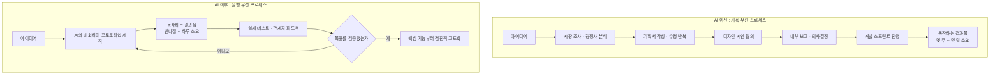

## 이 글이 다루는 내용

이 문서는 요즘IT(Wishket Magazine)에 실린 [**"AI가 다 만드는데, 왜 자꾸 기획을 말할까?"**](https://yozm.wishket.com/magazine/detail/3858/)라는 기고문의 논지를 상세하게 풀어 설명한 자료다. 원문은 AI 코딩 도구가 보편화되면서 아이디어를 실제로 동작하는 화면으로 만드는 비용이 극적으로 낮아졌고, 그 결과 제품을 만드는 방식 자체가 "만들기 전에 충분히 검토한다"에서 "일단 만들어보고 빠르게 검증한다"로 바뀌었다는 이야기를 담고 있다. 다만 저자는 이 변화가 곧 기획의 종말을 의미하지는 않는다고 강조한다. 오히려 만들기가 쉬워질수록, 무엇을 왜 만드는지를 정의하는 의도(Intent)의 힘이 더 중요해진다는 것이 원문의 핵심 결론이다.

아래에서는 이 논지를 단계별로 풀어서 설명하고, 원문이 인용한 자료들이 실제로 존재하는지, 그 내용이 정확한지를 최신 자료를 통해 하나하나 확인한 결과도 함께 담았다.

---

## 1. 왜 지금까지는 "만들기 전에" 그렇게 공을 들였을까

AI 코딩 도구가 등장하기 전에는 아이디어 하나를 실제로 동작하는 화면으로 옮기는 일 자체가 큰 비용이었다. 기획서를 작성하고, 디자인 시안을 주고받고, 개발 스프린트 일정에 맞춰 작업이 진행되기까지 짧게는 몇 주, 길게는 몇 달이 걸렸다. 이렇게 만드는 비용이 워낙 컸기 때문에, 실무자와 조직은 만들기 전에 최대한 많이 따져보는 쪽을 택했다. 시장 조사, 경쟁사 분석, 내부 검토, 보고를 위한 문서 작업이 반복되었고, 이 과정에서 정작 아이디어가 실물로 만들어지기도 전에 회의실에서 폐기되는 일이 흔했다.

원문은 여기서 중요한 지점을 짚는다. 바로 "만들기 전에 검토하는 과정" 역시 공짜가 아니라는 점이다. 아이디어를 검증한다는 명목으로 문서를 쓰고 고치는 동안, 실무자와 의사결정권자의 시간과 인건비가 눈에 보이지 않게 소모된다. 결국 제품은 시작도 하지 못한 채 상당한 기획 리소스만 먼저 소진되는 구조였다는 것이다. 시도하는 비용이 비쌌기 때문에 사전 판단에 의존할 수밖에 없었고, 그 사전 판단 자체가 다시 비용을 만들어내는 모순적인 구조였던 셈이다.

## 2. 무너진 전제: MVP 제작 비용이 사실상 붕괴했다

이 구조를 뒤흔든 것이 바로 AI 코딩 도구, 이른바 '바이브 코딩(Vibe Coding)'이다. 이 용어는 전 테슬라 AI 디렉터였던 안드레이 카패시(Andrej Karpathy)가 2025년 초에 처음 제안한 표현으로, 개발자가 아니어도 자연어로 원하는 결과물을 설명하면 AI가 실제로 동작하는 코드를 생성해주는 작업 방식을 가리킨다.

원문에서 인용한 EnlightLab의 자료를 실제로 확인해보면, 이 기관이 2026년에 발표한 MVP 개발 가이드에는 바이브 코딩을 통해 초기 매몰 비용을 5만 달러 수준에서 5천 달러 미만으로 낮출 수 있다는 내용이 명시되어 있다. 원문이 인용한 "5만 달러에서 5천 달러 수준"이라는 수치는 이 자료의 표현과 정확히 일치한다. 다만 이 수치는 EnlightLab이라는 특정 기관이 자사 가이드에서 제시한 예시 수준의 추정치이며, 업계 전체를 대표하는 통계라기보다는 바이브 코딩 도입 효과를 설명하기 위한 참고 수치로 보는 것이 정확하다.

## 3. '속도의 경제학'이란 무엇이고, 실제 근거는 무엇인가

원문은 이러한 변화를 '속도의 경제학'이라는 개념으로 설명한다. 대량 생산으로 비용을 낮추는 기존의 '규모의 경제'와 달리, 시장 변화를 얼마나 빠르게 읽고 실행하느냐가 경쟁력을 좌우하는 시대가 되었다는 뜻이다. 원문은 이 개념의 근거로 앤트로픽(Anthropic)이 발표한 "2026 Agentic Coding Trends Report"를 인용하는데, 실제로 이 보고서를 확인해보면 원문의 주장을 뒷받침하는 내용이 분명하게 담겨 있다.

앤트로픽은 이 보고서에서 AI 에이전트가 소프트웨어 개발 방식을 재편하는 여덟 가지 트렌드를 제시했다. 그중 첫 번째 트렌드는 "AI 에이전트가 구현, 테스트, 문서화를 주도하면서 개발 주기가 몇 주 단위에서 몇 시간 단위로 압축된다"는 내용으로, 원문이 언급한 "기획부터 배포까지 몇 주가 걸리던 개발 사이클이 몇 시간 단위로 줄어들고 있다"는 문장과 정확히 부합한다. 보고서는 이를 뒷받침하는 실제 사례도 함께 제시하는데, 몇 가지를 소개하면 다음과 같다.

일본의 라쿠텐(Rakuten)에서는 1,250만 줄 규모의 오픈소스 라이브러리(vLLM)에 특정 기능을 구현하는 작업을 클로드 코드(Claude Code)에게 맡긴 결과, 단 7시간의 자율 작업만으로 작업을 완료했고 결과물의 수치 정확도는 99.9%에 달했다. 미국의 개발 도구 스타트업 어그먼트 코드(Augment Code)의 한 고객사는 최고기술책임자(CTO)가 4개월에서 8개월이 걸릴 것으로 예상했던 프로젝트를 클로드를 활용해 단 2주 만에 끝냈다. 채용 관리 플랫폼 파운틴(Fountain)은 여러 개의 AI 에이전트를 계층적으로 조율하는 방식을 도입해, 물류 고객사의 신규 물류센터 인력 충원 기간을 기존 1주 이상에서 72시간 이내로 단축시켰다. 통신 기술 기업 텔러스(TELUS)는 13,000개가 넘는 맞춤형 AI 솔루션을 만들면서 엔지니어링 코드 배포 속도를 30% 끌어올렸고, 인도의 핀테크 기업 크레드(CRED)는 클로드 코드를 개발 전 과정에 도입해 실행 속도를 두 배로 높였다.

다만 이 보고서에는 원문에서는 다루지 않은 중요한 균형점도 함께 담겨 있다. 앤트로픽의 자체 연구에 따르면, 개발자들은 업무의 약 60%에서 AI를 사용하지만, 작업을 AI에게 완전히 위임할 수 있다고 답한 비율은 0%에서 20% 수준에 그친다. 보고서는 이를 '위임 격차(delegation gap)'라고 부르며, AI가 아무리 빨라져도 사람의 판단과 검증이 계속 필요하다는 점을 핵심 메시지로 제시한다. 이는 원문이 이야기하는 "속도가 빨라졌다고 해서 기획(의도)이 사라지지 않는다"는 결론과도 정확히 맞닿아 있는 지점이다.

### 개발 프로세스가 어떻게 달라졌는가

이 그림에서 핵심은 단순히 오른쪽 경로가 더 빠르다는 것이 아니다. 왼쪽 경로에서는 실패가 확인되는 시점이 전체 과정의 맨 마지막이라 매몰 비용이 크지만, 오른쪽 경로에서는 실패가 아주 이른 시점에 확인되기 때문에 같은 실패라도 부담이 훨씬 작다는 점이다. 그 결과 시도의 횟수 자체가 늘어나고, 늘어난 시도만큼 학습의 밀도도 함께 높아진다.

## 4. 표로 보는 '이전'과 '이후'

| 구분 | AI 이전 | AI 이후 |
|---|---|---|
| 아이디어 검증 방식 | 문서와 회의를 통한 사전 판단 | 실제로 동작하는 결과물을 통한 사후 검증 |
| 결과물이 나오기까지 걸리는 시간 | 몇 주 ~ 몇 달 | 반나절 ~ 하루 (핵심 트렌드 보고서 기준으로는 며칠 단위) |
| 실패 시 매몰 비용 | 여러 부서의 시간과 인건비 손실 | 하루 이내의 작업 시간 |
| 의사소통 방식 | 문서를 각자 다르게 해석 | 동일한 프로토타입을 함께 조작하며 확인 |
| 사람의 핵심 역할 | 코드를 직접 작성하고 문서를 정교하게 다듬는 것 | 무엇을, 왜 만드는지 정의하고 결과물을 검증하는 것 |

이 표에서 눈여겨볼 부분은 마지막 줄이다. 앤트로픽 보고서 역시 "코드를 작성하는 사람"에서 "에이전트를 조율하고 결과물을 평가하는 사람"으로 엔지니어의 역할이 이동하고 있다고 설명한다. 즉 만드는 행위 자체의 가치는 낮아지고, 무엇을 만들지 정의하고 그 결과를 판단하는 역량의 가치가 상대적으로 높아지는 방향으로 흐름이 이동하고 있다는 뜻이다.

## 5. 그럼에도 기획이 사라지지 않는 이유: '의도'가 핵심 자산이 되다

원문은 만들기가 쉬워졌다고 해서 성공 확률까지 함께 높아진 것은 아니라고 지적한다. 뚜렷한 목적 없이 일단 만들어보는 시도가 늘어나면서, 검증하려는 가설이 애초에 없다 보니 실패해도 무엇을 배워야 할지 알 수 없는 결과물이 양산되는 부작용도 함께 생겼다는 것이다. AI는 지시가 모호할수록 그 빈틈을 임의의 논리나 불필요한 기능으로 채우는 경향이 있기 때문에, 명확한 방향 없이 AI에게 맡기면 겉보기엔 그럴듯하지만 실제로는 쓸모없는 결과물이 나오기 쉽다.

이 문제를 피하기 위해 원문이 제시하는 실전 원칙은 세 가지다. 첫 번째는 한 번에 완성본을 기대하지 않는 것이다. 처음부터 방대한 기획서를 통째로 AI에 입력해 완성본을 뽑아내려 하면 엉뚱한 결과가 나오기 쉬우므로, 핵심 기능 하나씩 점진적으로 완성도를 높여가는 방식이 더 정확하다. 두 번째는 검증하려는 문제를 최대한 작고 구체적으로 정의하는 것이다. 해결 범위를 넓게 잡을수록 AI의 설계 방향도 함께 흩어지기 때문에, 하나의 명확한 가설에만 초점을 맞추는 것이 시도 비용을 가장 크게 낮추는 방법이다. 세 번째는 AI가 만든 결과물을 사람이 반드시 주도적으로 검증하고 제어하는 것이다. AI가 제시한 화면 설계나 기능이 원래 풀려던 핵심 문제와 실제로 맞닿아 있는지를 사람이 날카롭게 확인해야 한다는 뜻이다.

이 세 원칙을 관통하는 논리는 하나다. 과거에는 컴퓨터가 이해하는 문법, 즉 프로그래밍 문법을 능숙하게 다루는 사람이 실력자였다면, 코드 작성을 AI가 대신하는 지금은 "무엇을 왜 만드는가"라는 의도를 얼마나 또렷하게 정의할 수 있느냐가 실력의 기준이 되었다는 것이다.

### AI에게 요청하기 전에 점검할 다섯 가지 질문

| 순서 | 질문 | 확인하려는 것 |
|---|---|---|
| 1 | 무엇을 만드는가 | 목표를 한 줄로 요약할 수 있는가 |
| 2 | 누구를 위한 것인가 | 사용자의 모습이 구체적으로 그려지는가 |
| 3 | 왜 만드는가 | 문제가 해결되면 그 사람에게 무엇이 달라지는가 |
| 4 | 무엇으로 성공을 판단하는가 | 성공과 실패를 가를 명확한 신호나 숫자가 있는가 |
| 5 | 무엇을 하지 않을 것인가 | 범위를 벗어나는 요소를 미리 배제했는가 |

원문은 이 다섯 가지가 흐릿한 상태로 AI에게 작업을 맡기면 결과물은 빠르게 나오지만 무의미할 가능성이 크고, 반대로 이 다섯 가지가 또렷하면 같은 시간 안에 훨씬 정교한 결과물을 얻을 수 있다고 설명한다.

## 6. 의도를 끝까지 유지하는 방법

만드는 과정에서 이 의도는 매우 쉽게 흐려질 수 있다. AI가 그럴듯한 결과물을 순식간에 만들어내면, 원래 해결하려던 본질적인 문제보다 눈앞의 매력적인 결과물에 끌려다니는 상황이 벌어지기 쉽다는 것이 원문의 지적이다. 이를 막기 위해 원문이 제안하는 방법은 단순하다. 작업 화면 한쪽에 지금 풀려는 단 하나의 문제를 항상 적어두고, AI와 대화를 이어가는 중간중간 "지금 만들고 있는 이 기능이 정말 처음에 정의했던 사용자의 문제를 해결해주는가"라고 스스로에게 되묻는 습관을 들이는 것이다. 이 단순한 확인 절차가 AI의 속도에 휩쓸리지 않고 방향을 지키는 실질적인 안전장치가 된다.

---

## 7. 사실관계 확인: 원문이 인용한 자료들은 실제로 존재하는가

원문에서 근거로 제시한 자료들을 하나씩 최신 정보로 대조한 결과는 다음과 같다.

| 인용 내용 | 원문의 표현 | 검증 결과 | 확인된 근거 |
|---|---|---|---|
| EnlightLab의 MVP 개발 비용 하락 | "MVP 개발 비용이 5만 달러에서 5천 달러 수준으로 하락" | 확인됨 | EnlightLab이 2026년 발표한 "Vibe Coding for MVP Development: The 2026 Expert Guide"에 "초기 매몰 비용을 5만 달러에서 5천 달러 미만으로 낮춘다"는 내용이 원문 그대로 존재한다 |
| 앤트로픽의 개발 주기 단축 주장 | "기획부터 배포까지 몇 주가 걸리던 개발 사이클이 몇 시간 단위로 줄어든다" | 확인됨 | 앤트로픽의 "2026 Agentic Coding Trends Report" 1번 트렌드에 "개발 주기가 몇 주 단위에서 몇 시간 단위로 압축된다"는 내용이 명시되어 있으며, 라쿠텐·어그먼트 코드 등 실제 고객 사례로도 뒷받침된다 |
| 도서 《AI 시대의 설계자들》 | "책 'AI 시대의 설계자들'의 내용을 빌리면" | 확인 불가 | 국내 주요 서점(교보문고, 알라딘, 리디) 검색과 웹 검색을 통해 해당 정확한 제목의 국내 출간 도서를 확인하지 못했다. 유사한 제목의 해외 번역서(예: 마틴 포드의 《Architects of Intelligence》 계열)나 다른 인물을 다룬 국내 도서(예: 샘 올트먼을 다룬 《AI 제국의 설계자》)는 존재하지만, 원문이 언급한 서명과 정확히 일치하는 자료는 이번 검색으로는 찾을 수 없었다. 해당 도서명의 정확한 표기나 원어명을 다시 확인해보는 것을 권장한다 |
| '바이브 코딩'이라는 용어의 기원 | 원문에는 직접 언급되지 않지만 관련 개념으로 다뤄짐 | 확인됨 | 안드레이 카패시가 2025년 초에 제안한 용어로, 자연어 지시만으로 AI가 동작하는 코드를 생성하는 개발 방식을 가리킨다는 점이 여러 자료에서 공통적으로 확인된다 |

특히 앤트로픽 보고서와 관련해, 원문에는 담기지 않았지만 함께 알아두면 유용한 사실이 하나 있다. 바로 앞서 설명한 '위임 격차'다. 개발자들이 업무의 60%에서 AI를 사용하고 있음에도 완전히 위임 가능하다고 느끼는 비율은 0~20%에 불과하다는 수치는, "AI가 다 만든다"는 표현이 실제 현장의 체감과는 다소 거리가 있다는 점을 보여준다. 이는 원문의 결론, 즉 "속도가 빨라져도 방향을 정하는 사람의 판단은 사라지지 않는다"는 메시지를 뒷받침하는 근거로 볼 수 있다.

---

## 마무리: 속도의 경제학 시대, 경쟁력은 어디서 나오는가

정리하면 원문의 핵심 메시지는 다음과 같다. AI 덕분에 아이디어를 실제 결과물로 옮기는 비용은 실제로 붕괴했고, 이는 EnlightLab의 자료와 앤트로픽의 보고서 모두에서 확인되는 사실이다. 그러나 만드는 속도가 빨라졌다고 해서 무엇을 만들지 정의하는 일의 중요성이 줄어든 것은 아니다. 오히려 시도의 비용이 낮아질수록, 그 시도를 의미 있게 만드는 것은 결국 사람이 정의한 뚜렷한 의도와 가설이라는 것이 원문과 최신 산업 동향이 공통적으로 가리키는 방향이다. 방향이 없는 시도는 아무리 빨라도 쓸모없는 결과물만 쌓이게 되지만, 또렷한 의도가 실린 시도는 설령 실패하더라도 다음 단계로 나아가는 데 필요한 학습을 남긴다는 점에서 차이가 있다.

---

**참고 자료**
- 요즘IT(Wishket Magazine), "AI가 다 만드는데, 왜 자꾸 기획을 말할까?" (원문, 정확한 게재일은 검색으로 확인하지 못함)
- EnlightLab, "Vibe Coding for MVP Development: The 2026 Expert Guide" (2026)
- Anthropic, "2026 Agentic Coding Trends Report" (2026)

작성일: 2026년 7월 26일
