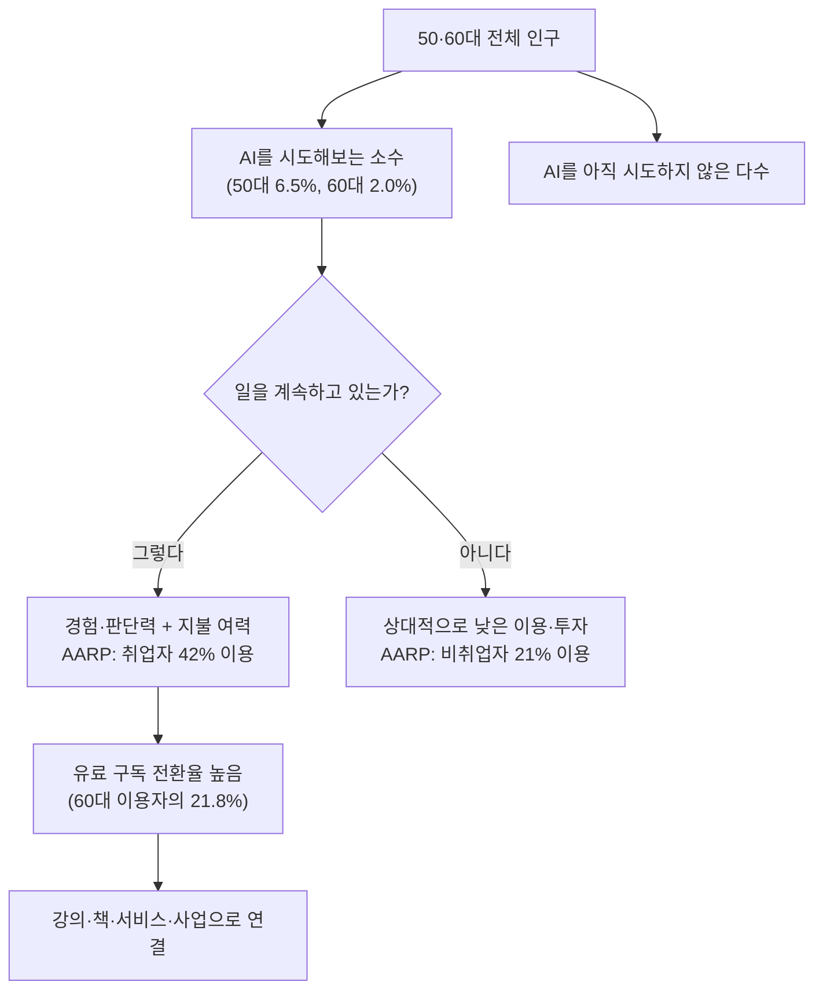

> 
> https://www.facebook.com/share/p/19HG2nJDr5/
> 
> **AI를 더 절실하게 배우는 세대는 누구인가**
> 
> 요즘 AI를 배우는 사람들을 보면 예상과 다른 장면이 보입니다. 예전 같으면 일을 조금씩 줄여 갈 나이인 50대와 60대가 AI 강의를 찾아다니고, 유료 서비스를 구독하며, 자신의 업무와 다음 비즈니스에 붙입니다. 이들에게 AI는 앞으로의 일을 계속하기 위한 생존 투자에 가깝습니다.
> 
> 이 세대가 가진 자산은 두 가지입니다. 하나는 오랜 시간 일하며 쌓은 경험과 노하우이고, 다른 하나는 필요하다고 판단한 도구에 비용을 지불할 여력입니다. AI가 내놓은 답이 현장에 맞는지, 고객이 돈을 낼 만한지 판단할 수 있습니다. 같은 답을 받아도 그 결과를 강의와 책, 서비스와 사업의 재료로 연결합니다.
> 
> 그렇다고 50·60대가 20·30대보다 AI를 더 많이 쓴다고 보기는 어렵습니다. 2024년 한국미디어패널조사에서 생성형 AI 이용률은 20대 35.9%, 30대 28.9%였지만 50대는 6.5%, 60대는 2.0%였습니다. 전체 이용자는 여전히 젊은 층이 많습니다.
> 
> 그런데 이용자 안으로 들어가면 다른 모습이 나타납니다. 유료 이용 경험은 20대 12.9%, 50대 15.9%, 60대 21.8%였습니다. 미국 AARP 조사에서도 50세 이상 취업자의 생성형 AI 이용률은 비취업자의 두 배였습니다. 50·60대 전체가 앞선 것이 아니라, 일을 계속하는 사람들 가운데 AI에 더 깊게 투자하는 집단이 생긴 것입니다.
> 
> AI의 생산성 효과와 경험의 가치는 서로 다른 단계에서 나타납니다. 여러 연구에서는 초보자와 저숙련자가 AI를 사용할 때 작업 성과가 더 크게 향상됐습니다. AI가 부족한 지식과 작업 절차를 보완해 주기 때문입니다. 반면 경험이 있는 사람의 강점은 AI가 만든 결과를 그대로 받아들이는 데 있지 않습니다. 그 결과가 현장과 고객에게 맞는지 검토하고, 실제 서비스나 사업으로 연결할지를 판단하는 데 있습니다.
> 
> 앞으로의 차이는 세대 자체보다 AI를 일과 수입에 어떻게 연결하느냐에서 생길 가능성이 큽니다. 50·60대 안에서도 경험과 비용을 갖고 적극적으로 투자하는 사람과 그렇지 않은 사람의 차이는 커질 것입니다. 20·30대 역시 AI를 자주 쓰는 것과 그 결과를 자기 일의 성과로 바꾸는 것은 다릅니다.
> 
> 50대와 60대는 더 이상 일을 그만두는 나이로만 볼 수 없습니다. 그동안 쌓아온 경험과 자료에 AI를 연결하면, 하던 일을 더 오래 이어가는 데서 그치지 않고 새로운 서비스와 수입 모델을 만들 수 있습니다.
> 
> 이 변화는 개인의 일자리 연장만을 뜻하지 않습니다. 50대와 60대가 자신의 경험을 다시 꺼내 쓰고, 새로운 방식으로 일하며, 지금까지 없던 시장을 직접 개척하는 출발점이 됩니다. 은퇴를 준비하던 세대가 새로운 일을 만들고 시장을 확장하는 세대로 바뀌는 것입니다.
> 

## 현장에서 먼저 보이는 낯선 풍경

최근 AI 강의 현장이나 유료 서비스 이용자 구성을 살펴보면 예상과 어긋나는 장면이 자주 목격된다. 통상적인 기준으로는 일을 서서히 줄여가야 할 나이인 50대와 60대가 AI 강의를 찾아다니고, 유료 구독을 결제하며, 배운 내용을 자신의 업무와 다음 사업 아이템에 직접 접목시키는 모습이다. 이들에게 AI는 여가 삼아 써보는 신기술이 아니라, 앞으로도 계속 일하기 위한 일종의 생존 투자에 가깝게 받아들여지고 있다.

이 세대가 다른 세대와 구별되는 지점은 두 가지 자산을 동시에 갖고 있다는 데 있다. 하나는 오랜 시간 현장에서 쌓아온 경험과 노하우이고, 다른 하나는 필요하다고 판단한 도구에 실제로 비용을 지불할 수 있는 여력이다. AI가 내놓은 답이 실제 현장 상황에 맞는지, 고객이 기꺼이 돈을 낼 만한 수준인지를 판단할 수 있는 감각이 있고, 같은 결과물을 받아도 그것을 강의 자료나 책, 서비스, 사업 아이템으로 연결시키는 역량을 갖추고 있다는 것이다.

다만 이런 인상적인 장면들이 50·60대 전체의 보편적인 모습이라고 단정하기는 어렵다. 실제 통계를 들여다보면 이야기는 조금 더 입체적이다.

## 전체 이용률만 보면 여전히 젊은 층이 압도적이다

정보통신정책연구원(KISDI)이 매년 실시하는 한국미디어패널조사는 2023년 조사부터 생성형 인공지능 서비스 이용 문항을 추가해왔다. 2025년 7월 30일 공개된 KISDI STAT Report(25-07호, 신현호 연구원)는 2024년 조사 결과(응답자 8,693명)를 바탕으로 연령별 생성형 AI 이용 현황을 분석했는데, 여기서 나온 수치는 다음과 같다.

| 연령대 | 생성형 AI 이용률 |
|---|---|
| 10대 | 15.9% |
| 20대 | 35.9% |
| 30대 | 28.9% |
| 40대 | 14.6% |
| 50대 | 6.5% |
| 60대 | 2.0% |

20대가 35.9%로 가장 높고 30대가 28.9%로 뒤를 이으며, 40대부터는 급격히 낮아져 50대는 6.5%, 60대는 2.0%에 그친다. 인지도 측면에서도 격차가 뚜렷하다. 20대와 30대는 "아는 편이다"와 "잘 알고 있다"를 합친 응답이 각각 70.7%, 65.2%에 달하지만, 50대는 "들어본 적은 있다"는 응답이 60.6%로 높은 반면 "잘 알고 있다"는 응답은 2.3%에 불과했다. 이는 서비스의 이름은 익숙하지만 실제 개념이나 활용법까지는 이어지지 못했다는 뜻으로 해석된다. 60대 이상에서는 "전혀 모른다"는 응답 비율이 26.6%까지 올라가며, 고령층으로 갈수록 인지 자체의 격차가 커지는 구조가 확인된다.

이 수치만 놓고 보면 생성형 AI는 여전히 청년층의 도구다. 전체 이용자 수로 따지면 50대와 60대는 소수에 머문다.

## 이용자 내부로 들어가면 다른 구도가 나타난다

그런데 같은 조사 안에서 유료 이용 경험 비율을 살펴보면 흐름이 달라진다. 이 수치는 생성형 AI를 한 번이라도 써본 이용자(1,190명) 중에서 유료 결제 경험이 있는 사람의 비율이다.

| 연령대 | 유료 이용 경험률(이용자 기준) |
|---|---|
| 10대 | 6.4% |
| 20대 | 12.9% |
| 30대 | 14.1% |
| 40대 | 15.9% |
| 50대 | 15.9% |
| 60대 | 21.8% |

전체 이용자 중 유료 이용 경험 비율은 13.5%였고, 보고서는 "연령대가 높을수록 유료 이용 비율이 높다"고 명시하고 있다. 60대 이용자의 21.8%가 유료 결제 경험이 있다는 수치는 20대(12.9%)의 약 1.7배에 해당한다. 즉 50·60대는 AI를 써보는 사람 자체는 적지만, 일단 써보기로 결심한 사람은 오히려 지갑을 여는 비율이 더 높다는 뜻이다. 이용 목적을 봐도 50대 이용자는 정보검색(55.6%)과 업무용(32.0%) 비중이 높아, 취미보다는 실질적 필요에 의해 AI를 쓰고 있음을 보여준다.

이 구조는 미국에서도 비슷하게 관찰된다. 미국은퇴자협회(AARP) 리서치에 따르면 50세 이상 성인 가운데 취업 상태인 사람의 생성형 AI 이용 경험률은 42%로, 비취업 상태인 사람의 21%보다 두 배 높았다. 나이 자체보다 '지금도 일을 하고 있는가'가 AI 이용 여부를 가르는 더 강한 변수라는 점을 시사하는 결과다.

두 통계를 함께 놓고 보면 하나의 그림이 그려진다. 50·60대 전체가 AI로 옮겨가는 것이 아니라, 그 안에서도 일을 계속하거나 새로운 수입원을 찾는 사람들이 AI에 선택적으로, 그리고 더 깊이 투자하는 집단으로 분리되고 있다는 것이다.

## 왜 경험 있는 사람이 유리한 지점이 따로 있는가

AI의 생산성 효과와 경험의 가치는 사실 서로 다른 층위에서 작동한다는 점을 짚어볼 필요가 있다. 에릭 브린욜프슨(Erik Brynjolfsson, 스탠퍼드), 대니엘 리(Danielle Li, MIT), 린지 레이먼드(Lindsey Raymond, MIT)가 5,000명이 넘는 고객상담 상담원 데이터를 분석해 2023년 NBER 워킹페이퍼로 발표하고 2025년 계간 경제학 저널(Quarterly Journal of Economics)에 게재한 연구 "Generative AI at Work"는 이 지점을 잘 보여준다. AI 어시스턴트 도입 후 상담원 전체의 생산성(시간당 처리 건수)은 평균 14~15% 올랐는데, 경력이 짧고 숙련도가 낮은 상담원의 개선 폭이 가장 커서 최대 30%대 중반까지 향상된 반면, 이미 숙련된 상담원은 속도 면에서 소폭의 개선에 그치거나 결과물의 질이 오히려 미세하게 떨어지는 경우도 있었다. 연구진은 AI가 뛰어난 숙련자의 노하우와 패턴을 데이터화해 아직 그 노하우를 갖추지 못한 사람에게 전파하는 방식으로 작동하기 때문에, 지식과 절차가 부족한 이들에게 더 큰 도움을 준다고 설명한다.

다만 이 연구가 말하는 '초보자'는 해당 직무에서의 경력이 짧은 사람을 뜻하며, 나이나 세대를 직접 가리키는 개념은 아니라는 점은 분명히 해둘 필요가 있다. 그럼에도 이 구조는 50·60대가 AI라는 도구 자체에는 초보자이면서 동시에 자신의 본업이나 산업에서는 수십 년 경력을 가진 숙련자라는 이중적 위치에 있다는 사실과 자연스럽게 연결된다. AI가 도구 사용의 진입장벽을 낮춰주는 부분에서는 초보자로서 이득을 보고, 그렇게 나온 결과물이 현장에서 통할지 고객이 비용을 지불할지를 판단하는 부분에서는 오래 쌓아온 업무 경험이 그대로 힘을 발휘하는 구조다. 즉 AI가 만들어낸 결과를 그대로 받아들이는 데 강점이 있는 것이 아니라, 그 결과가 현장과 고객에게 맞는지 검토하고 실제 서비스나 사업으로 옮길지를 판단하는 데 강점이 있다는 뜻이다.

## 세대보다 중요한 변수, 일과 수입에의 연결

이 흐름을 종합하면 앞으로의 격차는 세대 그 자체보다 AI를 자신의 일과 수입에 어떻게 연결하느냐에서 더 크게 벌어질 가능성이 높다. 50·60대 안에서도 오랜 경험과 지불 여력을 바탕으로 적극적으로 AI에 투자하는 사람과, 그렇지 않은 다수 사이의 격차는 지금의 통계가 보여주는 것보다 앞으로 더 벌어질 수 있다. 20·30대 역시 마찬가지다. AI를 자주 쓴다는 것과 그 결과물을 실제 업무 성과나 수입으로 바꿔내는 것은 전혀 다른 문제다. 실제로 KISDI 조사에서도 60대 이용자의 상당수(32.3%)는 AI를 업무보다는 대화 상대로 쓰는 데 그치고 있어, 같은 세대 안에서도 AI를 쓰는 방식 자체가 크게 갈린다는 점을 확인할 수 있다.

이런 관점에서 보면 50대와 60대는 더 이상 '일을 그만두는 나이'로만 규정되지 않는다. 오랫동안 쌓아온 경험과 자료에 AI를 연결할 경우, 하던 일을 조금 더 오래 이어가는 데서 그치지 않고 이전에는 없던 서비스나 수입 모델을 새로 만들어낼 여지가 생긴다. 이는 단순히 개별 노동자의 일자리 연장에 머무는 문제가 아니라, 은퇴를 준비하던 세대가 자신의 경험을 다시 꺼내 새로운 방식으로 시장을 개척하는 세대로 전환될 수 있다는 조금 더 큰 함의를 갖는다.

## 남는 질문들

한 가지 유의할 점은, 강의장과 유료 서비스 이용자 사이에서 관찰되는 적극적인 50·60대의 모습이 이 세대 전체의 평균적인 모습은 아니라는 사실이다. 통계가 보여주듯 50·60대의 절대다수는 아직 생성형 AI를 이용해본 적조차 없다. 지금 눈에 띄는 것은 이 연령대 안에서도 일을 계속하려는 의지와 경험, 자본을 갖춘 특정 집단이 만들어내는 흐름이며, 이 흐름이 얼마나 더 넓은 계층으로 확산될지, 아니면 소수의 활동적인 그룹에 머무를지는 앞으로의 통계 축적을 통해 계속 지켜봐야 할 대목이다.

---

## 참고 자료

- 신현호, 「연령별 생성형 인공지능 서비스 이용현황 분석」, KISDI STAT Report Vol.25-07, 정보통신정책연구원, 2025년 7월 30일 (2024년 한국미디어패널조사 원자료 기반, 응답자 8,693명·AI 이용자 1,190명)
- AARP Research, "AARP Research Insights on Technology" (2025 Tech Trends and Adults 50-Plus, 2024년 9월 조사 / 2026 Tech Trends and Adults 50-Plus, 2025년 9~10월 조사), aarp.org
- Erik Brynjolfsson, Danielle Li, Lindsey Raymond, "Generative AI at Work", NBER Working Paper No. 31161(2023년 4월 최초 공개, 2024년 11월 개정), Quarterly Journal of Economics 140권 2호(2025) 게재
- MIT Sloan, "Workers with less experience gain the most from generative AI" (2026년 1월)
- Stanford Graduate School of Business, "Generative AI Can Boost Productivity Without Replacing Workers"

---

작성일자: 2026년 7월 26일
