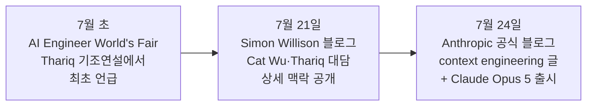
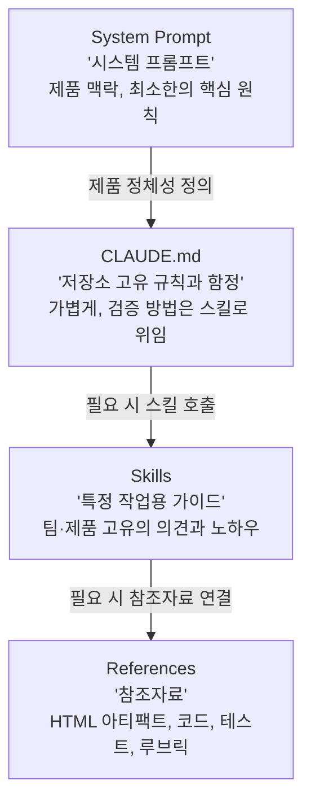
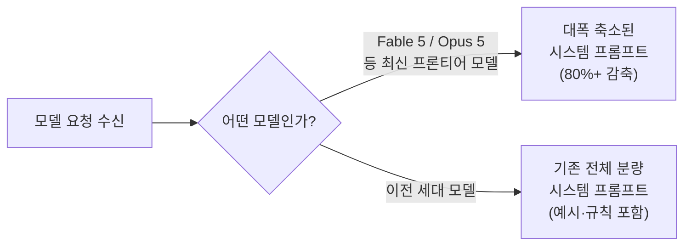

> 
> https://www.threads.com/@billionnapkin/post/DbN65rrEZfw
> 
> Claude Code 팀이 최신 모델의 시스템 프롬프트를 약 80% 줄였습니다. 모델이 강해질수록 설명서를 더 길게 써야 할 것 같지만, 실제 방향은 반대였습니다. 예전 모델에는 작업 순서와 예외 상황, 도구 사용법을 세세하게 알려줘야 했습니다. 하지만 최신 모델에 같은 수준의 지시를 계속 쌓으면 이미 알고 있는 내용을 반복하고, 불필요한 규칙끼리 충돌하며, 정작 중요한 요구사항이 긴 문장 속에 묻힐 수 있습니다. 여기서 시스템 프롬프트와 스킬, CLAUDE.md의 역할을 다시 나눌 필요가 생깁니다. 시스템 프롬프트에는 모든 상황에서 반드시 지켜야 하는 최소한의 원칙을 둡니다. 스킬에는 특정 업무를 수행할 때만 필요한 절차와 전문 지식을 넣습니다. CLAUDE.md에는 해당 저장소에서만 통하는 명령어와 코드 규칙, 테스트 방법, 피해야 할 실수를 기록합니다. 핵심은 많이 적는 것이 아닙니다. 필요한 정보를 필요한 순간에만 보여주는 것입니다.
> 
> 좋은 지침은 모델에게 생각하는 방법을 처음부터 가르치려 하지 않습니다. 대신 이 프로젝트에서 무엇이 다른지, 어떤 결과를 성공으로 보는지, 실수했을 때 어떻게 검증해야 하는지를 분명하게 알려줍니다. 또 이미 코드와 도구로 강제할 수 있는 규칙을 긴 문장으로 반복할 필요도 없습니다. 포매터로 해결할 수 있는 스타일은 포매터에, 테스트로 확인할 수 있는 조건은 테스트에, 특정 작업에서만 필요한 설명은 스킬에 맡기는 편이 낫습니다. 최신 AI 모델을 잘 쓰는 방법은 더 거대한 프롬프트를 만드는 것이 아닙니다. 모델이 이미 아는 내용은 걷어내고, 이 환경에서만 알아야 할 차이를 정확하게 남기는 것입니다.
> 

## 목차

1. 들어가며: 핵심 사실 요약
2. 이 발표가 나오기까지의 타임라인
3. 왜 시스템 프롬프트를 줄여야 했는가: "과잉 제약" 문제
4. 여섯 가지 원칙의 전환: "그때는" vs "지금은"
5. 실제 프롬프트 문구로 보는 변화
6. 컨텍스트를 구성하는 네 개의 층: 시스템 프롬프트, CLAUDE.md, 스킬, 참조자료
7. 모델마다 다른 시스템 프롬프트: 프론티어 모델과 나머지 모델
8. `claude doctor`: 컨텍스트를 자동으로 진단하는 도구
9. 앤스로픽만의 이야기가 아니다: OpenAI의 유사한 권고
10. 같은 날 함께 발표된 소식: Claude Opus 5 출시와의 관계
11. 실무자에게 주는 시사점
12. 정리

---

## 1. 들어가며: 핵심 사실 요약

2026년 7월, 앤스로픽 Claude Code 팀은 자사의 대표 에이전틱 코딩 도구인 Claude Code의 시스템 프롬프트를 최신 세대 모델 대상으로 80% 이상 줄였다고 공개적으로 밝혔다. 이 소식은 세 단계에 걸쳐 점진적으로 외부에 공개되었다. 먼저 앤스로픽의 기술 스태프인 타리크 시히파르(Thariq Shihipar)가 AI Engineer World's Fair 컨퍼런스의 기조연설에서 이 사실을 처음 언급했고, 이후 시몬 윌리슨(Simon Willison)이 같은 컨퍼런스에서 진행한 캣 우(Cat Wu)·타리크 시히파르와의 대담을 정리한 글에서 훨씬 상세한 맥락이 공개되었으며, 마지막으로 앤스로픽이 공식 블로그에 "The new rules of context engineering for Claude 5 generation models"라는 제목의 글을 통해 이 결정의 전체 논리와 구체적인 적용 방법을 정리해 발표했다[1][2][4].

핵심 수치와 사실관계는 다음과 같다. 앤스로픽은 Claude Opus 5와 Claude Fable 5 같은 최신 세대 모델을 대상으로 Claude Code의 시스템 프롬프트를 80% 넘게 제거했으며, 자체 코딩 평가(evaluation)에서 측정 가능한 성능 저하가 없었다고 밝혔다[1]. 다만 이 감축은 모든 모델에 일괄 적용된 것이 아니라 프론티어급 최신 모델에 한정된 조치이며, 상대적으로 이전 세대 모델에는 여전히 기존의 전체 분량 시스템 프롬프트가 그대로 사용되고 있다는 점이 대담에서 명확히 확인되었다[2]. 즉 지금 Claude Code는 모델별로 서로 다른 시스템 프롬프트를 갖고 있다.

이 변화의 배경에는 예시(example)를 많이 주는 것, "하지 마라" 식의 금지 규칙을 촘촘히 쌓는 것, 모든 정보를 프롬프트 맨 앞에 미리 다 넣어두는 것과 같이 한때 모범 사례로 통했던 프롬프트 작성법들이 최신 모델에서는 오히려 성능을 저해하거나 최소한 더 이상 필요하지 않다는 내부 관찰이 있다. 앤스로픽은 이를 "언하블링(unhobbling) Claude" — 즉 모델에게 채워 놓았던 불필요한 족쇄를 풀어주는 작업이라고 표현했다[1].

## 2. 이 발표가 나오기까지의 타임라인

이 소식이 며칠 사이에 여러 채널을 통해 조금씩 더 상세하게 공개된 과정을 시간순으로 따라가 보면 전체 맥락을 이해하는 데 도움이 된다.

가장 먼저, 2026년 7월 초 AI Engineer World's Fair 컨퍼런스에서 타리크 시히파르가 기조연설 중 "가장 최근에 우리는 이 새로운 부류의 모델이 더 작은 시스템 프롬프트를 원한다는 것을 발견했다"고 언급하며, 예시가 모델을 오히려 제한한다는 취지로 설명했다. 이 발언은 독일계 IT 매체인 더 디코더(The Decoder)가 2026년 7월 2일 자 기사로 먼저 보도했다[4].

이후 시몬 윌리슨이 같은 컨퍼런스 기간 중 앤스로픽의 캣 우와 타리크 시히파르를 초청해 진행한 대담의 영상이 유튜브에 공개되었고, 윌리슨은 2026년 7월 21일 이 대담을 자신의 블로그에 주석을 단 대화록(transcript) 형태로 정리해 게시했다. 이 글에는 시스템 프롬프트 감축의 구체적인 배경, 어떤 항목들을 왜 삭제했는지, 그리고 모델별로 프롬프트를 다르게 운용한다는 사실 등이 훨씬 자세히 담겨 있다[2].

마지막으로 2026년 7월 24일, 앤스로픽은 공식 블로그에 타리크 시히파르 명의로 "The new rules of context engineering for Claude 5 generation models"라는 글을 게시했다. 이 글은 시스템 프롬프트, CLAUDE.md, 스킬(Skills)이라는 세 가지 컨텍스트 구성 요소 각각에 대해 "그때는 이랬지만 지금은 이렇다"는 형식으로 여섯 가지 원칙 전환을 정리하고, 실제 시스템 프롬프트에서 삭제된 문구의 예시까지 공개한, 가장 완결된 형태의 공식 설명이다[1]. 흥미롭게도 이 블로그 글이 게시된 7월 24일은 앤스로픽이 새로운 모델인 Claude Opus 5를 공식 출시한 날과 정확히 겹친다. 이 부분은 10장에서 별도로 다룬다.

## 3. 왜 시스템 프롬프트를 줄여야 했는가: "과잉 제약" 문제

앤스로픽이 밝힌 감축의 가장 근본적인 이유는 "우리가 Claude Code를 과도하게 제약해 왔다(overconstraining)"는 자체 진단이다[1]. 이는 시스템 프롬프트뿐 아니라 CLAUDE.md 파일과 스킬에도 동일하게 해당하는 문제였다.

이 문제를 발견한 계기는 앤스로픽 내부 직원들이 실제로 Claude Code를 사용한 세션의 기록(transcript)을 검토하는 과정이었다. 검토 결과, 한 번의 요청 안에서 시스템 프롬프트, 스킬, 사용자의 요청이 서로 충돌하는 메시지를 동시에 Claude에게 전달하는 경우가 다수 발견되었다. 대표적인 예로 "적절하게 문서화를 남겨라"는 지침과 "절대 주석을 추가하지 마라"는 지침이 하나의 요청 안에서 동시에 존재하는 경우를 들었다[1]. 이런 상황에서 Claude는 어느 쪽을 우선할지 판단하기 위해 더 많은 추론을 소모해야 했고, 이는 결과물의 품질과 일관성을 떨어뜨리는 요인이 되었다.

또한 초기 모델들이 최악의 시나리오, 예를 들어 사용자의 파일을 실수로 삭제하는 것과 같은 사고를 피하도록 하기 위해 다소 과도하게 강한 지침을 넣어야 했던 역사적 맥락도 있었다. 이런 지침들은 대부분의 상황에는 맞지만 특정 예외 상황에서는 오히려 틀린 지침이 되어 버리는 경우가 많았다. 앤스로픽은 이런 안전장치성 지침들이 과거 모델에는 반드시 필요했지만, 최신 모델은 판단력이 향상되어 이런 명시적 규칙 없이도 맥락과 판단을 통해 적절한 결정을 내릴 수 있게 되었다고 설명한다[1].

이와 함께 Claude Code 자체의 도구 생태계가 확장된 것도 중요한 배경이다. 과거에는 CLAUDE.md 파일이 사실상 유일한 기억·정보·지침 저장 수단이었다면, 지금은 메모리(memory), 아티팩트(artifacts), 스킬(skills)이라는 별도의 메커니즘이 추가되면서 컨텍스트를 세션 간에 불러오고 공유하는 새로운 방식들이 생겨났다. 이 때문에 예전에는 CLAUDE.md 한 곳에 모든 것을 몰아넣어야 했던 구조적 필요성 자체가 줄어들었다[1].

## 4. 여섯 가지 원칙의 전환: "그때는" vs "지금은"

앤스로픽의 공식 블로그 글은 그동안 모범 사례로 여겨졌지만 이제는 "신화(myth)"가 되어버린 여섯 가지 관행을 짚고, 각각에 대응하는 새로운 원칙을 제시한다[1]. 이 여섯 가지는 시스템 프롬프트뿐 아니라 CLAUDE.md와 스킬을 작성하는 방식 전반에 적용되는 원칙이라는 점에서 실무적으로 특히 중요하다.

### 4.1 "규칙을 줘라" → "판단력을 활용하게 하라"

Claude Code를 처음 출시했을 때 앤스로픽은 파일을 실수로 삭제하는 것과 같은 최악의 시나리오를 반드시 피해야 했기 때문에, 항상 참은 아니지만 강력한 지침을 시스템 프롬프트에 넣었다. 예를 들어 과거 시스템 프롬프트에는 "코드에서는 기본적으로 주석을 쓰지 마라. 여러 문단짜리 독스트링이나 여러 줄짜리 주석 블록은 절대 쓰지 말고, 한 줄 이내로 제한하라. 사용자가 요청하지 않는 한 계획서, 의사결정 문서, 분석 문서를 만들지 마라"는 식의 문구가 있었다[1]. 그러나 이런 규칙은 일부 상황, 예컨대 사용자가 자신만의 문서화 선호를 가지고 있거나 매우 복잡한 코드의 특정 부분에는 여러 줄짜리 주석이 실제로 필요한 경우에는 오히려 틀린 지침이 되었다. 예전 모델에서는 이런 가드레일이 없으면 잘못된 판단을 내리는 경우가 많아 이 트레이드오프를 감수할 수밖에 없었지만, 최신 모델은 명시적 규칙 없이도 이런 판단을 스스로 잘 내릴 수 있게 되었다는 것이 앤스로픽의 설명이다.

### 4.2 "예시를 줘라" → "인터페이스를 설계하라"

도구 사용법을 가르치는 데 있어 예전의 제1원칙은 "예시를 충분히 주는 것"이었다. 그러나 최신 모델에서는 예시가 오히려 모델의 탐색 공간을 특정 형태로 좁혀버리는 부작용이 있다는 것이 확인되었다. 예시를 제거하면 모델이 더 자유롭게, 더 창의적으로 문제를 해결할 수 있었다는 것이다[1][2]. 이 원칙에 대해 대담 중 시몬 윌리슨은 "예시를 주라는 것이 내가 사람들에게 알려주던 최고의 프롬프트 작성 팁 중 하나였는데, 이게 더 이상 사실이 아니라면 내 프롬프트 작성 모델이 조금 깨지는 것"이라고 놀라움을 표했고, 타리크 시히파르 본인도 "저도 이 얘기를 듣고 놀랐다"고 답했다[2]. 대신 앤스로픽은 도구, 스크립트, 파일의 "설계" 자체에 더 신경 쓸 것을 권한다. 예를 들어 Todo 관리 도구에서 상태 값을 pending, in_progress, completed라는 열거형(enum)으로만 정의해 두는 것 자체가 Claude에게 사용법에 대한 힌트가 되며, "한 번에 하나의 항목만 in_progress로 유지하라"는 규칙이 원하는 동작을 정의하는 역할을 한다는 예시를 들었다[1].

### 4.3 "모든 것을 앞에 미리 넣어라" → "점진적 공개(progressive disclosure)를 활용하라"

Claude Code가 코딩에 집중된 도구였던 초기에는 코드 리뷰와 검증 방법에 대한 상세한 정보가 시스템 프롬프트에 늘 포함되어 있었다. 이런 정보는 항상 필요한 것은 아니었지만, 필요할 때는 매우 중요한 정보였다. 이후 Claude Code는 점진적 공개, 즉 필요한 시점에 필요한 컨텍스트를 불러오는 능력이 크게 향상되었고, 앤스로픽은 검증과 코드 리뷰 관련 지침을 시스템 프롬프트에서 별도의 스킬로 옮겨 Claude Code가 선택적으로 호출하도록 바꾸었다[1]. 이 원칙은 도구에도 동일하게 적용된다. 일부 도구는 "지연 로딩(deferred loading)" 방식으로 설계되어, 에이전트가 ToolSearch를 이용해 전체 정의를 검색한 뒤에야 사용할 수 있도록 되어 있다. 이 방식 덕분에 Task 도구처럼 필요할 때까지는 컨텍스트를 차지하지 않는 도구를 더 많이 둘 수 있게 되었다. 앤스로픽은 CLAUDE.md와 스킬 파일도 마찬가지로 "혹시 마주칠 수도 있는 모든 알려진 관행을 담아두는 중앙 저장소"로 만들어야 한다는 통념이 흔한 오해이며, 그 대신 필요한 시점에 불러올 수 있는 파일들의 트리(tree) 구조로 구성할 것을 권장한다[1].

### 4.4 "반복해서 말해라" → "간결한 도구 설명을 써라"

과거 모델은 지시를 반복해서 줘야 하거나, 컨텍스트 윈도우의 맨 앞보다 끝부분에 있는 지시를 더 잘 따르는 경향이 있었다. 이 때문에 시스템 프롬프트 본문과 도구 설명(tool description) 양쪽에 동일한 지침을 중복해서 넣는 경우가 많았다. 앤스로픽은 이런 반복적인 예시들을 삭제하고, 도구 사용법에 대한 지침을 시스템 프롬프트가 아닌 도구 설명 자체에 담는 방식으로 전환했다[1].

### 4.5 "CLAUDE.md에 기억을 저장하라" → "자동 메모리를 활용하라"

과거에는 사용자에게 `#` 단축키를 이용해 CLAUDE.md 파일에 직접 정보를 기록하도록 권장했다. 지금은 Claude가 작업과 사용자에게 관련 있는 정보를 자동으로 기억하도록 바뀌었다[1].

### 4.6 "단순한 스펙을 써라" → "풍부한 참조자료를 활용하라"

플랜 모드(plan mode)에서 Claude Code는 그동안 계획을 마크다운 파일로 저장하는 방식에 크게 의존해 왔고, 복잡한 프로젝트를 진행하는 동안 코드베이스에 스펙 파일을 저장해 두는 것도 비슷한 관행이었다. 그러나 앤스로픽은 Claude가 점점 더 복잡한 형태의 참조자료를 다룰 수 있게 되었다고 밝혔다. 단순한 마크다운 파일 대신, 아티팩트 기능으로 만든 HTML 아티팩트를 참조자료로 활용할 수 있고, 코드 형태의 레퍼런스(예: 상세한 테스트 스위트나 다른 코드베이스의 특정 함수)를 참조점으로 제공할 수도 있다. 루브릭(rubric) 역시 하나의 참조자료 형태로, 좋은 API 설계가 무엇인지와 같은 취향(taste)의 영역까지도 다이나믹 워크플로우와 검증 에이전트를 통해 확인하게 할 수 있다는 것이 앤스로픽의 설명이다[1].

다음 표는 위 여섯 가지 전환을 한눈에 정리한 것이다.

| 구분 | 그때는 (예전 모범 사례) | 지금은 (최신 모델 대상 원칙) |
|---|---|---|
| 규칙 | 강한 금지 규칙, "하지 마라"식 지침을 촘촘히 나열 | 맥락을 주고 판단력에 맡김 |
| 예시 | 도구 사용법마다 예시를 충분히 제공 | 예시 대신 도구·파일의 인터페이스 자체를 잘 설계 |
| 정보 배치 | 필요할 수도 있는 정보를 모두 프롬프트 앞부분에 미리 적재 | 필요한 순간에만 불러오는 점진적 공개 방식 사용 |
| 반복성 | 시스템 프롬프트와 도구 설명에 같은 지침을 중복 기재 | 도구 설명에 한 번만, 간결하게 기재 |
| 기억 | 사용자가 직접 CLAUDE.md에 단축키로 기록 | Claude가 관련 정보를 자동으로 기억 |
| 참조자료 | 단순 마크다운 계획서·스펙 파일 | HTML 아티팩트, 코드, 테스트 스위트, 루브릭 등 풍부한 참조자료 |

## 5. 실제 프롬프트 문구로 보는 변화

앤스로픽은 이 변화를 추상적으로만 설명하지 않고, 실제로 삭제된 시스템 프롬프트 문구와 이를 대체한 새 문구를 공개했다는 점에서 이 자료는 특히 신뢰도가 높다.

기존(구세대 모델용) 시스템 프롬프트에는 다음과 같은 문구가 있었다고 한다. 코드에서는 기본적으로 주석을 쓰지 않는 것을 원칙으로 하고, 여러 문단짜리 독스트링이나 여러 줄짜리 주석 블록은 절대 작성하지 않으며 한 줄 이내로 제한하고, 사용자가 요청하지 않는 한 계획·의사결정·분석 문서와 같은 중간 산출물 파일을 만들지 않는다는 내용이었다[1].

이 문구는 새 시스템 프롬프트(최신 모델용)에서 다음과 같이 짧게 대체되었다. "주변 코드처럼 읽히는 코드를 작성하라: 주석의 밀도, 네이밍, 관용구를 주변 코드와 맞춰라"는 한 문장이다[1]. 규칙의 개수와 예외 조건을 일일이 나열하는 대신, "주변 맥락을 참고해서 판단하라"는 상위 원칙 하나로 대체한 셈이다. 이는 4.1절에서 설명한 "규칙 제공 → 판단력 활용"이라는 원칙이 실제 문서에 어떻게 반영되었는지를 보여주는 구체적인 사례다.

검증(verification)과 관련된 문구의 변화도 대담에서 언급되었다. 예전에는 "프론트엔드 변경을 하면 항상 검증하라"는 식의 절대적인 문구가 있었지만, 이는 문자열 하나를 다른 문자열로 바꾸는 정도의 사소한 수정에도 똑같이 적용되어 버리는 문제가 있었다. 이에 따라 문구는 "대부분의 경우 백엔드 엔드포인트만 호출해서는 사용자 경험을 완전히 이해할 수 없으므로, 사용자 경험에 큰 변화를 줄 때는 앱을 로컬에서 직접 실행해 보라"는 식으로 완화되었다. 캣 우는 이 문구조차도 "무엇이 큰 변화인가"라는 새로운 모호함을 남기기 때문에 완벽하지 않을 수 있다고 인정하면서, 프롬프트를 작성할 때는 항상 "선의를 가진 사람이 이 지침을 어떻게 오해할 수 있을지"를 먼저 생각해 보고, 그 지침이 100% 참이 되도록 표현을 부드럽게 다듬어야 한다고 강조했다. 프롬프트는 매번 100%의 확률로 모델에게 전달되는 것이기 때문이다[2].

## 6. 컨텍스트를 구성하는 네 개의 층: 시스템 프롬프트, CLAUDE.md, 스킬, 참조자료

앤스로픽의 블로그 글은 이런 원칙들을 실제로 컨텍스트를 조립할 때 어떻게 적용해야 하는지를 네 가지 구성 요소별로 정리한다[1]. 이 네 층은 서로 다른 목적과 갱신 주기를 가지며, 각 층에 어떤 정보를 담을지 구분하는 것이 이번 발표의 실질적인 핵심이라 할 수 있다.

시스템 프롬프트는 제품의 맥락과 강하게 결합되어 있는 층이다. Claude에게 지금 어떤 제품 안에서 작동하고 있고 무엇을 하고 있는지를 알려주는 역할을 한다. Claude Code를 그냥 사용하는 입장이라면 이 부분을 직접 수정할 일은 거의 없지만, 자신만의 에이전트 하네스를 구축하는 개발자라면 가장 많은 시간을 투자해야 하는 층이 바로 여기다.

CLAUDE.md는 가볍게 유지하는 것이 원칙이다. 저장소가 무엇을 위한 것인지는 짧게 설명하고, 대부분의 분량은 코드베이스 안의 "함정(gotcha)"에 할애해야 한다. 예를 들어 타입을 하나의 거대한 파일에 몰아서 관리하고 다른 곳에는 두지 않는다는 식의, 파일 시스템이나 저장소를 봐서는 알기 어려운 코드베이스 고유의 규칙을 적어야 한다. 반대로 Claude가 파일 시스템이나 저장소를 살펴보면 스스로 알 수 있는 "당연한 것들"을 굳이 명시하는 것은 피해야 한다. 검증 방법처럼 특정 상황에만 필요한 지침이 여럿 있다면, 이를 CLAUDE.md에 직접 나열하지 말고 별도의 검증용 스킬을 만들어 CLAUDE.md에서는 그 스킬을 참조하도록 하는 점진적 공개 방식을 적극 활용해야 한다[1].

스킬은 필요할 때 Claude가 찾아볼 수 있는 가벼운 가이드로 취급해야 한다. 매우 중요한 영역이 아니라면 과도하게 제약하는 방식은 피해야 하며, 스킬이 길어질 경우에는 여러 개의 파일로 나누어 점진적 공개를 최대한 활용해야 한다. 스킬이 가장 잘 작동하는 지점은 특정 개인, 팀, 제품에게만 통용되는 의견이나 지식, 모범 사례를 담을 때다[1].

참조자료(references)는 `@` 멘션으로 파일을 포함시켜 현재 계획에 대한 심층 정보를 참조하게 하는 방식이다. 스펙 파일, 목업, 심지어 전체 코드베이스까지도 참조자료가 될 수 있다. 일반적으로는 코드 형태의 파일을 선호하는 것이 좋은데, 이는 Claude가 매우 능숙하게 다루는 언어로 명확하고 정밀한 지침을 전달하기 때문이다. 예를 들어 디자인을 설명하는 글이나 화면을 그대로 옮긴 정적 자료보다는, HTML로 만든 목업 쪽이 훨씬 더 좋은 결과를 낳는 경향이 있다고 앤스로픽은 밝혔다[1].

## 7. 모델마다 다른 시스템 프롬프트: 프론티어 모델과 나머지 모델

이번 변화에서 놓치기 쉽지만 실무적으로 매우 중요한 지점은, 이 80% 감축이 모든 Claude Code 사용자에게 동일하게 적용되는 것이 아니라는 사실이다. 대담에서 시몬 윌리슨이 "이건 결국 판단력에 의존하는 것인데, 이는 Opus나 Fable 수준의 모델에서나 가능한 이야기 아니냐, 더 저렴한 모델로 다양한 작업을 처리하려는 경우에는 통하지 않을 것 같다"고 지적하자, 캣 우는 "바로 그 이유 때문에 우리는 지금 모델별로 서로 다른 시스템 프롬프트를 두고 있다"고 답했다. 이 80% 토큰 감소는 가장 프론티어급인 최신 모델에만 적용되며, 이전 세대 모델은 여전히 전체 분량의 시스템 프롬프트를 그대로 사용한다는 것이다[2].

이는 앤스로픽이 "모델이 똑똑해질수록 프롬프트도 함께 정교해져야 한다"는 단선적인 공식을 따르는 것이 아니라, 모델의 판단력 수준에 맞춰 프롬프트의 성격 자체를 재조정하고 있다는 것을 보여준다. 흥미롭게도 이 자리에서 나온 후속 질문, 즉 "Fable이나 Opus 같은 상위 모델이 Haiku 같은 하위 모델에게 더 상세한 지침을 주도록 프롬프트를 작성해 줄 수 있을 만큼 똑똑한가"라는 질문에 대해서는 캣 우가 "아직 평가해 보지 못했고 확실한 데이터가 없다"고 답했다. 타리크 시히파르는 여기에 덧붙여, 어려운 문제에서는 오히려 큰 모델이 작은 모델보다 토큰을 더 효율적으로 쓰는 경우도 있어서 이 부분은 아직 직관을 쌓아가는 단계이며, 때로는 그냥 처음부터 프론티어급 지능을 쓰는 것이 나을 때도 있다고 말했다[2]. 즉 이 영역은 아직 완전히 정립된 과학이라기보다는, 앤스로픽 스스로도 "평가를 많이 쌓아야 하는 영역"이라고 인정하는 발전 중인 관행이라는 점을 짚어둘 필요가 있다.

## 8. `claude doctor`: 컨텍스트를 자동으로 진단하는 도구

앤스로픽은 이런 원칙들을 문서로만 제시하는 데 그치지 않고, 사용자가 자신의 CLAUDE.md와 스킬을 직접 진단하고 다이어트할 수 있도록 `claude doctor`라는 명령어를 도구 형태로 제공한다고 밝혔다. Claude Code 안에서 `/doctor` 명령어를 실행하면 사용자의 스킬과 CLAUDE.md 파일의 분량과 구성을 적정 수준으로 맞추는 데 도움을 준다는 설명이다[1]. 앤스로픽 스스로도 이 명령어에 자신들이 찾아낸 모범 사례들을 반영해 두었다고 밝히고 있어, 사용자가 자신의 프로젝트에 이번 원칙들을 적용해 볼 수 있는 실질적인 진입점이라 할 수 있다.

## 9. 앤스로픽만의 이야기가 아니다: OpenAI의 유사한 권고

시몬 윌리슨은 자신의 글 말미에서, 이 원칙이 앤스로픽만의 독자적인 발견이 아니라 업계 전반에서 동시에 관찰되고 있는 흐름이라는 점을 짚었다. 그는 OpenAI가 GPT-5.6에 대해 공개한 프롬프트 작성 모범 사례 문서에도 유사한 조언이 담겨 있다는 점을 지적했다. 해당 문서는 "더 가벼운 프롬프트를 선호하라(favor leaner prompts)"는 절에서, 반복된 지침과 예시를 제거하고 도구 설명을 단순화하는 것이 작업 성능과 토큰 효율을 함께 개선할 수 있다고 설명한다. OpenAI는 내부 코딩 에이전트 평가 샘플을 기준으로, 더 가벼운 시스템 프롬프트 구성이 평가 점수를 약 10~15% 향상시키는 동시에 전체 토큰 사용량을 41~66%, 비용을 33~67% 줄였다고 밝혔다[2].

이 수치는 앤스로픽이 아니라 OpenAI가 자사 GPT-5.6 모델과 관련해 공개한 내용이라는 점을 분명히 해 둘 필요가 있다. 즉 앤스로픽의 80% 감축과 OpenAI의 10~15%·41~66%·33~67%라는 세 가지 수치는 서로 다른 회사가, 서로 다른 모델을 대상으로, 서로 다른 방법론으로 얻은 별개의 결과다. 다만 두 회사가 거의 같은 시기에 "프롬프트를 정교하게 늘리기보다는 덜어내는 쪽이 최신 모델에는 더 잘 맞는다"는 동일한 방향의 결론에 도달했다는 사실 자체가, 이것이 특정 회사의 마케팅적 주장이 아니라 최신 세대 모델 전반에서 관찰되는 실제 경향일 가능성을 뒷받침한다.

## 10. 같은 날 함께 발표된 소식: Claude Opus 5 출시와의 관계

앞서 2장에서 언급했듯, 앤스로픽의 공식 블로그 글이 게시된 2026년 7월 24일은 앤스로픽이 신규 모델 Claude Opus 5를 정식 출시한 날과 겹친다. 이는 우연이 아니라 관련된 발표로 보이며, 이 부분을 짚어두는 것이 이번 소식을 정확히 이해하는 데 도움이 된다.

Claude Opus 5는 앤스로픽이 밝힌 바에 따르면 자사 최상위 모델인 Claude Fable 5에 근접한 성능을 절반 가격에 제공하는 것을 목표로 설계된 모델이며, 기존 Opus 4.8과 동일한 토큰당 가격(입력 100만 토큰당 5달러, 출력 100만 토큰당 25달러)을 유지한다[5][6]. Opus 5는 Claude Max의 새로운 기본 모델이자 Claude Pro에서 사용할 수 있는 가장 강력한 모델로 자리매김했다[6]. 이번 발표에서 흥미로운 지점은, 시몬 윌리슨의 대담 기사(7월 21일 게시)에서는 타리크 시히파르가 "이번 시스템 프롬프트 감축은 Fable뿐 아니라 Opus 4.8에도 적용됐다"고 말한 반면, 사흘 뒤인 7월 24일 게시된 앤스로픽 공식 블로그에서는 "Claude Opus 5와 Claude Fable 5를 대상으로 시스템 프롬프트를 80% 넘게 제거했다"고 서술하고 있다는 점이다[1][2]. 이는 오류라기보다는, 대담이 녹화된 시점에는 아직 Opus 5가 출시되기 전이라 당시 최신 모델이었던 Opus 4.8을 기준으로 설명했고, 이후 공식 블로그가 게시된 시점에는 Opus 4.8의 후속 모델인 Opus 5가 이미 출시되어 그 이름으로 대체되어 표기된 것으로 해석하는 것이 합리적이다. 즉 "프론티어 모델 대상으로 시스템 프롬프트를 대폭 줄인다"는 원칙 자체는 동일하게 유지되며, 어떤 모델이 그 "최신 프론티어 모델" 자리를 차지하는지는 모델 세대가 바뀌면서 자연스럽게 갱신된 것으로 볼 수 있다.

참고로 Claude Fable 5는 앤스로픽의 새로운 최상위 등급인 "Mythos" 계열 모델의 공개 버전으로, 생물학·사이버보안·LLM 연구개발 분야에 대한 추가 안전장치가 적용되어 있다. 이 모델은 출시 직후 미국 상무부의 수출통제 조치로 인해 며칠간 접근이 일시 중단되었다가, 이후 통제가 해제되면서 다시 접근이 복원된 바 있다[7]. 이 사건 자체는 이번 시스템 프롬프트 감축과 직접적인 관련은 없지만, Fable 5와 Mythos 계열 모델을 둘러싼 최근 맥락을 이해하는 데 참고가 될 수 있다.

## 11. 실무자에게 주는 시사점

이번 발표는 단순히 앤스로픽 내부의 엔지니어링 소식에 그치지 않고, Claude Code나 유사한 에이전트 하네스를 직접 운용하는 실무자에게도 곧바로 적용할 수 있는 실질적인 함의를 담고 있다.

첫째, 자신의 CLAUDE.md 파일에 "혹시 몰라서" 넣어둔 방대한 규칙과 예시들이 오히려 최신 모델의 성능을 깎아 먹고 있을 가능성을 점검해 볼 필요가 있다. 특히 서로 다른 시점에 추가된 지침들이 실제로는 서로 충돌하고 있지는 않은지 — 예컨대 "문서를 남겨라"는 지침과 "불필요한 파일을 만들지 마라"는 지침이 동시에 존재하는 식의 모순은 없는지 — 를 실제 세션 기록을 검토하며 확인해 보는 것이 앤스로픽이 실제로 사용한 진단 방법이다.

둘째, 포매터나 린터, 테스트 스위트로 이미 강제할 수 있는 규칙을 굳이 프롬프트 문장으로 반복해서 적어 둘 필요가 없다는 원칙을 적용해 볼 수 있다. 스타일에 관한 것은 포매터에, 동작의 정합성에 관한 것은 테스트에 맡기고, 프롬프트에는 "이 프로젝트에서 무엇이 다른가", "무엇을 성공으로 볼 것인가", "실수했을 때 어떻게 검증해야 하는가"라는 핵심 원칙만 남기는 것이 이번 발표가 제시하는 방향과 일치한다.

셋째, CLAUDE.md와 스킬을 하나의 거대한 파일로 몰아넣기보다는, 필요한 시점에 불러올 수 있는 여러 개의 작은 파일로 나누는 점진적 공개 구조를 고려해 볼 수 있다. 검증 방법, 특정 도메인 지식, 팀 고유의 관행처럼 항상 필요한 것은 아니지만 필요할 때는 중요한 정보들은 CLAUDE.md 본문이 아니라 별도의 스킬로 분리하고, CLAUDE.md에서는 이를 참조하도록 구성하는 방식이다.

넷째, 이런 원칙을 적용할 때는 자신이 사용하는 모델이 실제로 판단력에 의존해도 되는 수준의 프론티어 모델인지, 아니면 더 명시적인 지침이 여전히 필요한 하위 모델인지를 함께 고려해야 한다. 앤스로픽 스스로도 이 원칙을 모든 모델에 일괄 적용하지 않고 모델별로 다른 시스템 프롬프트를 유지하고 있다는 점은, "무조건 프롬프트를 줄이는 것"이 아니라 "모델의 실제 판단력 수준에 맞춰 프롬프트의 성격을 재조정하는 것"이 핵심 원칙이라는 점을 시사한다.

## 12. 정리

이번 발표를 한 문장으로 요약하면, 모델이 강력해질수록 지침을 더 촘촘하게 쌓아야 한다는 통념과 반대로, 앤스로픽은 최신 세대 모델에서는 오히려 규칙과 예시를 덜어내는 쪽이 더 나은 결과로 이어진다는 것을 실제 시스템 프롬프트를 80% 이상 줄이는 방식으로 증명해 보였다. 이 변화의 핵심은 단순한 분량 축소가 아니라, 시스템 프롬프트에는 모든 상황에서 지켜야 할 최소한의 원칙만 남기고, 특정 작업에만 필요한 절차와 전문 지식은 스킬로, 저장소 고유의 규칙과 함정은 CLAUDE.md로, 그리고 상세한 참고 정보는 참조자료로 역할을 재분배하는 "컨텍스트 엔지니어링"의 재구성이라는 점이다. 이런 재구성은 모든 모델에 획일적으로 적용된 것이 아니라 판단력이 충분히 향상된 프론티어급 모델에 한정해 적용되고 있으며, 앤스로픽 자신도 이 원칙이 아직 발전 중인 과학이라는 점을 인정하고 있다. 비슷한 시기에 OpenAI 역시 자사 최신 모델을 대상으로 유사한 방향의 권고를 내놓았다는 점은, 이것이 한 회사의 개별 사례가 아니라 최신 세대 언어 모델 전반에서 나타나는 공통된 흐름일 가능성을 뒷받침한다.

---

## 참고문헌

[1] Thariq Shihipar, "The new rules of context engineering for Claude 5 generation models," Anthropic 공식 블로그, 2026년 7월 24일. https://claude.com/blog/the-new-rules-of-context-engineering-for-claude-5-generation-models

[2] Simon Willison, "A Fireside Chat with Cat and Thariq from the Claude Code team," Simon Willison's Weblog, 2026년 7월 21일. https://simonwillison.net/2026/Jul/21/cat-and-thariq/

[3] Thariq Shihipar, "A field guide to Claude Fable 5: Finding your unknowns," Anthropic 공식 블로그, 2026년 7월 6일. https://claude.com/blog/a-field-guide-to-claude-fable-finding-your-unknowns

[4] Matthias Bastian, "Anthropic says it cut 80 percent of Claude Code's system prompt because Fable 5 models 'want a smaller system prompt'," The Decoder, 2026년 7월 2일. https://the-decoder.com/anthropic-says-it-cut-80-percent-of-claude-codes-system-prompt-because-fable-5-models-want-a-smaller-system-prompt/

[5] "Introducing Claude Opus 5," Anthropic 공식 뉴스, 2026년 7월 24일. https://www.anthropic.com/news/claude-opus-5

[6] "Anthropic launches Claude Opus 5, a cheaper AI model for coding, agents and enterprise workflows," VentureBeat, 2026년 7월 24일. https://venturebeat.com/orchestration/anthropic-launches-claude-opus-5-a-cheaper-ai-model-for-coding-agents-and-enterprise-workflows

[7] "Anthropic's Claude Opus 5 AI model rivals Fable 5 and is cheaper," CNBC, 2026년 7월 24일. https://www.cnbc.com/2026/07/24/anthropic-claude-opus-5-ai-fable-5-cost.html

---

*본 문서는 2026년 7월 26일 기준으로 확인 가능한 공개 자료를 토대로 작성되었다. 원 게시물인 Threads 링크(@billionnapkin)는 크롤러 접근이 차단되어 있어 직접 확인하지 못했으며, 위 참고문헌에 명시된 1차 출처(앤스로픽 공식 블로그, 앤스로픽 공식 뉴스)와 이를 인용·보도한 언론 및 개발자 커뮤니티 자료를 근거로 서술하였다. 본문 중 명확히 출처가 표기되지 않은 추측성 서술은 포함하지 않았으며, 일부 저품질 커뮤니티 게시물에서 발견된 "시스템 프롬프트가 164토큰까지 줄었다"는 식의 구체적 수치는 1차 출처와 주요 언론 어디에서도 확인되지 않아 본문에 포함하지 않았다.*
