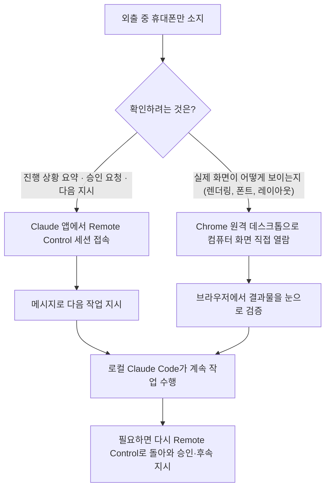
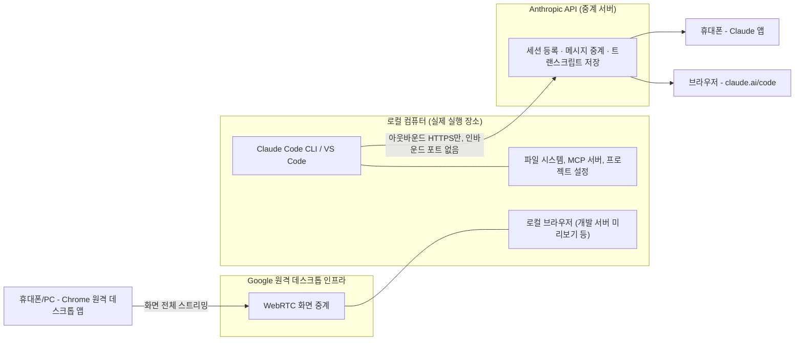

### — 공유해주신 화면 두 장과 게시물 내용을 바탕으로 —

- 작성일: 2026년 7월 26일
- 정보 출처: Anthropic 공식 문서(code.claude.com), 언론·업계 보도, Google 공식 고객센터 문서
- (문서 하단 "출처 및 신뢰도 표기" 섹션 참고)

---

## 1. 이 자료의 목적

> 
> https://www.facebook.com/share/p/1DXUftCHUr/
>
> Claude Code 원격제어를 통한 작업방식은 이 조합이 최고인 것으로 인정하기로 했다.
> - Chrome 원격데스크톱 + Claude Remote Control
> 
> #ClaudeCode원격제어
>

공유해주신 두 장의 화면과 페이스북 게시물은 모두 **Claude Code의 "Remote Control(원격 제어)"** 기능과 관련된 내용입니다. 게시물 본문에서 직접 언급하신 것처럼, 이 기능을 **Chrome 원격 데스크톱**과 함께 쓰는 조합을 "최고의 작업 방식"으로 정리하신 것으로 보입니다.

이 문서는 다음 세 가지를 순서대로, 추측 없이 확인 가능한 사실 위주로 설명합니다.

1. Claude Code Remote Control이 정확히 무엇이고 어떻게 동작하는가 (Anthropic 공식 문서 기준)
2. 공유해주신 두 화면에 실제로 무엇이 나타나 있는가
3. 왜 Chrome 원격 데스크톱과 Claude Code Remote Control을 함께 쓰는 조합이 의미가 있는가

참고로 페이스북 게시물 링크(`facebook.com/share/p/...`)는 로그인 계층 뒤에 있어 외부에서 본문 전체를 불러올 수 없었습니다(자동 접근이 차단되어 있음을 확인했습니다). 따라서 게시물 자체의 문구는 사용자님이 이미지 하단에 직접 옮겨 적어주신 텍스트를 기준으로 다루었고, Facebook 서버에서 원문을 재확인하지는 못했다는 점을 밝혀둡니다.

---

## 2. Claude Code Remote Control이란 무엇인가

### 2.1 한 줄 정의

Remote Control은 **내 컴퓨터에서 실행 중인 로컬 Claude Code 세션**을, **claude.ai/code 웹페이지나 Claude 모바일 앱(iOS·Android)에서 그대로 이어서 조작할 수 있게 해주는 "동기화 계층(synchronization layer)"** 입니다.

가장 중요한 개념은 이것입니다: **코드 실행이 클라우드로 옮겨가는 것이 아니라, 내 컴퓨터에서 계속 돌아가는 세션을 다른 기기에서 "들여다보고 조작하는 창(window)"이 하나 더 생기는 것**입니다. 즉 파일 시스템 접근, MCP 서버 연결, 프로젝트 설정 등은 전부 원래 그대로 로컬 컴퓨터에 남아 있습니다.

이 점에서 Remote Control은 "Claude Code on the web"(Anthropic이 관리하는 클라우드 인프라에서 완전히 새 환경으로 실행되는 방식)과는 분명히 다릅니다. Remote Control은 어디까지나 **내 컴퓨터의 로컬 세션을 원격에서 훔쳐보고 조종하는 리모컨**에 가깝습니다.

### 2.2 왜 이런 기능이 필요한가

터미널에서 대규모 리팩터링이나 긴 빌드 작업을 맡겨두고 자리를 비워야 할 때가 있습니다. 예를 들어 40개 넘는 파일을 한꺼번에 고치는 작업을 시켜두고 회의에 들어가야 하거나, 실패를 반복하는 빌드를 계속 지켜봐야 할 때, Remote Control을 켜두면 휴대폰으로 진행 상황을 확인하고, 승인이 필요한 순간에 승인을 누르고, 필요하면 사진이나 파일을 보내 지시를 추가할 수 있습니다.

### 2.3 시작하는 세 가지 방법

Claude Code 공식 문서 기준으로 Remote Control을 켜는 방법은 세 가지입니다.

| 방법 | 명령어 | 특징 |
|---|---|---|
| 서버 모드 | `claude remote-control` | 터미널이 대기 상태로 계속 열려 있으며, 여러 개의 원격 세션을 동시에 받을 수 있음(기본 최대 32개). 스페이스바를 누르면 QR 코드가 뜸 |
| 대화형 세션 | `claude --remote-control` (약칭 `--rc`) | 평소처럼 터미널에서 직접 입력도 하면서, 동시에 원격에서도 조작 가능한 일반 세션 |
| 기존 세션에서 전환 | 세션 안에서 `/remote-control` (약칭 `/rc`) 입력 | 지금까지의 대화 기록을 그대로 이어받아 원격 제어를 켬 |

VS Code 확장에서도 프롬프트 창에 `/remote-control`을 입력하면 동일하게 켤 수 있으며, 연결되면 배너에 뜨는 "claude.ai/code" 링크를 눌러 바로 세션으로 이동할 수 있습니다.

### 2.4 연결 방법 (다른 기기에서 접속하기)

세션이 시작되면 아래 세 가지 방법 중 하나로 다른 기기에서 접속할 수 있습니다.

- 터미널에 표시되는 **세션 URL을 브라우저에 직접 입력**
- 세션 URL 옆에 뜨는 **QR 코드를 휴대폰 카메라로 스캔**
- **claude.ai/code 또는 Claude 앱**을 열어 세션 목록에서 이름으로 찾기 (온라인 상태인 세션은 컴퓨터 아이콘과 초록색 점으로 표시됨)

Claude 앱이 아직 없다면, Claude Code 안에서 `/mobile` 명령을 입력하면 iOS·Android 설치용 QR 코드가 표시됩니다.

### 2.5 접속 조건 (요구 사항)

- **요금제**: Pro, Max, Team, Enterprise 모두 사용 가능. 단, **API 키로 로그인한 경우는 지원되지 않음**
- Team·Enterprise에서는 조직 관리자(Owner)가 관리자 설정에서 "Remote Control" 토글을 켜야 기본적으로 사용 가능
- **인증**: `claude` 실행 후 `/login`으로 claude.ai 계정 로그인이 되어 있어야 함
- **API 엔드포인트 제약**: Amazon Bedrock, Google Cloud Agent Platform, Microsoft Foundry 경유 시에는 지원되지 않으며, `ANTHROPIC_BASE_URL`이 `api.anthropic.com`이 아닌 다른 주소(사내 LLM 게이트웨이 등)를 가리키고 있으면 자동으로 비활성화됨
- **작업 공간 신뢰**: 최초 1회는 반드시 해당 프로젝트 폴더 안에서 `claude`를 실행해 "이 폴더를 신뢰합니까?" 대화상자를 통과해야 함

### 2.6 보안 구조 — "포트를 열지 않는다"는 원칙

Remote Control의 보안 설계에서 가장 핵심적인 사실은 다음과 같습니다.

- 로컬 컴퓨터는 **바깥으로 나가는(outbound) HTTPS 요청만** 만들며, **들어오는 포트는 전혀 열지 않습니다.**
- 로컬 세션이 시작되면 Anthropic API 서버에 스스로 등록하고, 할 일이 있는지 계속 확인(poll)하는 방식으로 동작합니다.
- 다른 기기(휴대폰·브라우저)에서 접속하면, Anthropic 서버가 그 기기와 내 컴퓨터 사이의 메시지를 중계해주는 구조입니다.
- 모든 트래픽은 TLS로 암호화되어 Anthropic API를 통과하며, 여러 개의 단기(short-lived) 자격 증명이 각각 정해진 용도로만 쓰이고 독립적으로 만료됩니다.
- 세션이 연결되어 있는 동안에는 **대화 내용과 도구 실행 기록(트랜스크립트)** 이 Anthropic 서버에 저장되어, 기기 간 동기화와 네트워크 끊김 후 재접속에 사용됩니다. 반면 **실제 코드 실행과 파일 접근은 어디까지나 로컬 컴퓨터에서만** 이루어집니다.
- Zero Data Retention(데이터 무보존) 정책을 적용받는 조직은 Remote Control 자체를 켤 수 없습니다.

### 2.7 신뢰할 수 있는 기기(Trusted Devices) — 베타 기능

Team·Enterprise 조직을 위한 추가 보안 계층으로, 관리자가 켜면 다음 두 조건이 모두 충족되어야 원격 세션을 보거나 조작할 수 있습니다.

1. **기기 등록**: 처음 로그인할 때 그 브라우저·휴대폰·데스크톱 앱이 고유한 인증서를 등록
2. **최근 로그인(18시간 이내)**: 그보다 오래되면 Face ID·Touch ID·Windows Hello·패스키로 재확인 필요

Anthropic은 지문이나 얼굴 데이터 자체를 서버에 저장하지 않으며, 기기의 공개키와 기기 이름·플랫폼·등록 시각 같은 최소한의 메타데이터만 보관한다고 명시하고 있습니다.

### 2.8 원격에서 안 되는 것들 (제한 사항)

- 대화형 프로세스 하나당 **원격 세션은 1개까지만** 가능 (여러 개를 동시에 받으려면 서버 모드 사용)
- 터미널을 닫거나 `claude` 프로세스를 종료하면 세션도 함께 끝남 (클라우드에서 대신 돌아가는 게 아니기 때문)
- 네트워크가 약 10분 이상 끊기면 세션이 타임아웃되어 종료됨
- `/plugin`, `/resume`처럼 터미널 전용 명령은 원격에서 실행 불가. 반면 `/compact`, `/clear`, `/context`, `/usage`, `/model`, `/effort`, `/rename`, `/mcp`, `/config` 등은 모바일·웹에서도 동작함
- "울트라플랜(ultraplan)" 세션을 새로 시작하면 기존 Remote Control 연결은 끊어짐 (두 기능이 같은 claude.ai/code 화면 자리를 두고 경쟁하기 때문)

### 2.9 모바일 푸시 알림

Remote Control이 켜져 있으면, 긴 작업이 끝나거나 사용자의 판단이 필요한 순간에 Claude가 스스로 판단해서 휴대폰으로 알림을 보낼 수 있습니다. "테스트 끝나면 알려줘" 같은 문장으로 알림을 직접 요청할 수도 있으며, `/config`에서 "Push when Claude decides"와 "Push when actions required" 두 가지를 켜고 끌 수 있습니다.

### 2.10 Remote Control vs Claude Code on the web — 무엇이 다른가

| 구분 | Remote Control | Claude Code on the web |
|---|---|---|
| 실행 위치 | 내 컴퓨터(로컬) | Anthropic이 관리하는 클라우드 |
| 로컬 MCP 서버·툴 | 그대로 사용 가능 | 사용 불가 (클라우드의 새 환경) |
| 컴퓨터를 꺼도 되는가 | 안 됨 (로컬 프로세스가 계속 있어야 함) | 됨 |
| 적합한 상황 | 자리에서 하던 작업을 이어서 원격으로 지켜보고 승인할 때 | 로컬 설정 없이 새 작업을 바로 시작하거나, 여러 작업을 병렬로 돌릴 때 |

### 2.11 비슷한 다른 원격 작업 방식들 (공식 문서 비교표)

Claude Code는 자리를 비운 상태에서 작업하는 방법을 Remote Control 외에도 여러 가지 제공하고 있습니다. 공식 문서가 정리한 비교는 다음과 같습니다.

| 방식 | 무엇이 트리거하는가 | Claude 실행 위치 | 적합한 상황 |
|---|---|---|---|
| Dispatch | 모바일 앱에서 작업을 메시지로 보냄 | 내 컴퓨터(데스크톱 앱) | 자리를 비운 동안 가볍게 위임 |
| **Remote Control** | claude.ai/code나 모바일 앱에서 직접 조작 | 내 컴퓨터(CLI·VS Code) | 진행 중인 작업을 다른 기기에서 이어서 조작 |
| Channels | Telegram·Discord 같은 메신저의 이벤트 | 내 컴퓨터(CLI) | CI 실패, 채팅 메시지 등 외부 이벤트에 반응 |
| Slack | 팀 채널에서 `@Claude` 멘션 | Anthropic 클라우드 | 팀 채팅에서 바로 PR·리뷰 진행 |
| 예약 작업(Scheduled tasks) | 정해진 일정 | CLI·데스크톱·클라우드 | 매일 반복되는 자동화 작업 |

---

## 3. 첫 번째 화면 — 서버 모드로 돌아가는 로컬 터미널

공유해주신 첫 번째 화면은 실제로 로컬 컴퓨터의 터미널에서 Claude Code가 서버 모드(`claude remote-control`)로 돌아가고 있는 모습입니다. 화면 아래쪽에 나오는 정보들을 하나씩 짚어보면 다음과 같습니다.

- **탭 제목 "이전 작업 내용 확인하기"** — 이 원격 세션에 붙은 이름으로, 사용자가 직접 지정했거나(`--name`) 마지막 프롬프트 내용에서 자동 생성된 제목입니다.
- **본문 텍스트** — 이전에 Claude Code 에이전트가 수행한 코드 저장소 감사(audit) 작업의 요약 내용입니다. `dispatchRoot`, `worktree`, `AbortController`, `audit_response`, `findProjectAuditor`, `integrityScript`, `scripts/audit-paths.js` 같은 표현들이 등장하는 것으로 보아, 여러 하위 작업(subagent)이 저장소 경로 점검, 타임아웃 처리, 감사 로그의 개인정보(PII) 검출 여부 등을 각각 맡아 처리하고, 그 결과를 하나로 모아 보고하는 흐름이었던 것으로 보입니다. 이 부분은 사용자님 본인의 과거 작업 로그이므로 별도의 외부 사실 확인 대상은 아니며, 화면에 쓰인 그대로의 요약입니다.
- **"Remote Control" 패널** — "This session is available in the Claude mobile app and at https://claude.ai/code/session/..." 라는 문구와 함께 **Disconnect this session(연결 끊기)**, **Show QR code(QR 코드 표시)**, **Continue(이어서 진행)** 버튼이 보입니다. 이는 공식 문서에서 설명하는 "세션 URL과 QR 코드를 통해 다른 기기에서 접속"하는 기능이 실제로 화면에 구현된 모습입니다.
- **하단 상태 바** — 프로젝트 폴더 이름 `pocket-commander`, 사용 모델 `Opus 5 (max)`, 깃 브랜치 상태 `main clean`, 컨텍스트 사용률(`ctx 24%`), 5시간 단위 사용량 한도(`32% | 17m`)와 7일 단위 사용량 한도(`27% | 144h57m`), 그리고 이번 세션에서 호출된 도구 횟수(`Bash×18, Edit×12, Read×7, Write×3, PowerShell×1`)와 세션 종료 시 실행되는 후크(`Hook(Stop)`) 설정이 표시되어 있습니다. `bypass permissions on`은 매번 승인 없이 도구를 실행하도록 허용 모드를 켜둔 상태를, `+ 1 agent`는 하위 에이전트 1개가 함께 작업 중임을 뜻합니다.
- **맨 아래 "/rc active"** — 이것이 바로 공식 문서에서 말하는 **Remote Control 연결 상태 표시기**입니다. 입력창 아래 붙어서 연결이 살아있는 동안 계속 표시되며, 눌러서 세션 상세 화면(URL·QR 코드)으로 들어갈 수 있는 링크이기도 합니다.

정리하면, 이 화면은 "실제로 Remote Control이 정상적으로 켜져서 대기 중인 로컬 세션"을 그대로 보여주는 장면입니다.

---

## 4. 두 번째 화면 — 휴대폰(또는 브라우저)에서 그 세션을 들여다보는 모습

두 번째 화면은 위 로컬 세션을 **claude.ai/code 쪽에서 열어본 화면**입니다. 제목("스타씨드 벤치마킹 및 경쟁 전략 분석") 바로 아래 작게 표시된 **"원격 제어"** 라벨이 핵심입니다. 이 라벨은 "지금 보고 있는 이 대화가 실제로는 클라우드 위가 아니라 어떤 로컬 컴퓨터에서 돌아가고 있는 Remote Control 세션"이라는 것을 알려주는 표시입니다.

화면 본문에서는 "CDN 폰트가 실제로 잘 로드되는지 눈으로 확인한다", "같은 URL로 재게시했다", "PowerShell 사용함" 같은 도구 실행 로그가 대화 형태로 나타나고 있습니다. 이는 공식 문서가 설명하는 "여러 기기에서 대화와 하위 에이전트·워크플로우 진행 상황이 그대로 동기화된다"는 특징이 실제로 반영된 모습입니다. 즉 컴퓨터 앞에서 PowerShell 명령을 실행한 기록이 그대로 휴대폰 화면에도 실시간으로 넘어와 있는 것입니다.

화면 하단의 "야 근데 내용을 배우니까 페이스 제로 페이스 원, 페이스 투, 페이스 쓰리가 있었는데 그걸 한 번에 다 구현해 버리지 왜 남겨놨어" 라는 문구는 사용자가 실제로 휴대폰에서 입력한 피드백 메시지입니다. 이는 Remote Control의 "휴대폰에서 메시지를 보내면 로컬 세션이 그것을 받아 계속 작업을 이어간다"는 기능이 실제로 쓰이고 있는 예시입니다.

---

## 5. 왜 "Chrome 원격 데스크톱 + Claude Code Remote Control" 조합이 최고인가

게시물에서 말씀하신 결론, 즉 이 두 도구를 함께 쓰는 조합이 가장 좋다는 판단은 각 도구가 정확히 다른 역할을 맡고 있다는 점에서 설명이 됩니다.

### 5.1 Chrome 원격 데스크톱이란

Chrome 원격 데스크톱은 Google이 무료로 제공하는 원격 제어 서비스로, 브라우저 확장 프로그램 형태로 동작하며 Google 계정만 있으면 다른 컴퓨터의 **화면 전체**를 실시간으로 보고 마우스·키보드까지 조작할 수 있습니다. WebRTC 기반의 웹 기술로 동작하며 Windows, Mac, Linux, ChromeOS, iOS, Android를 모두 지원합니다.

### 5.2 두 도구의 역할 차이

| | Claude Code Remote Control | Chrome 원격 데스크톱 |
|---|---|---|
| 보여주는 것 | Claude와의 대화, 도구 실행 로그, 승인 요청 | 컴퓨터 화면 전체(브라우저, 다른 창 포함) |
| 조작 방식 | 채팅 메시지, 승인/거부 버튼 | 실제 마우스·키보드 원격 조작 |
| 장점 | 모바일에 최적화된 인터페이스, 푸시 알림, 승인 흐름에 특화 | 브라우저 렌더링 결과, 폰트 로딩, UI 배치 등을 눈으로 직접 확인 가능 |
| 한계 | 대화·로그만 보여줄 뿐, 실제 브라우저 화면이 어떻게 그려지는지는 보여주지 않음 | 대화 흐름 파악이나 승인 알림에는 특화되어 있지 않음, 작은 화면에서 전체 데스크톱을 조작하기 번거로움 |

두 번째 화면 속 "CDN 폰트가 로드되는지 눈으로 확인한다"는 대목이 이 차이를 정확히 보여줍니다. Claude Code Remote Control만으로는 로컬 브라우저에 실제로 어떤 폰트가 어떻게 렌더링되는지 화면으로 확인할 수 없습니다. 이때 Chrome 원격 데스크톱으로 전환해 로컬 컴퓨터의 브라우저 화면을 직접 들여다보면, Remote Control이 보여주지 못하는 "실제 시각적 결과"까지 확인할 수 있게 됩니다.

### 5.3 결합 워크플로우

즉 평소에는 가볍고 빠른 **Remote Control**로 대화하듯 작업을 이어가다가, "실제로 눈으로 결과를 봐야 하는 순간"에만 **Chrome 원격 데스크톱**으로 전환해 전체 화면을 확인하는 방식입니다. 하나만 쓰면 서로의 빈틈(Remote Control은 시각적 확인 불가 / 원격 데스크톱은 대화형 승인·알림에 약함)이 남지만, 두 개를 상황에 맞게 오가며 쓰면 그 빈틈이 메워집니다.

### 5.4 아키텍처로 보면 이렇습니다

---

## 6. 실무에서 이렇게 활용하면 좋습니다 (일반적인 활용 패턴)

1. 자리에서 `claude remote-control`(또는 `--rc`)로 로컬 세션을 켠다.
2. 자리를 뜨기 전에 QR 코드를 스캔해 휴대폰의 Claude 앱과 연결해둔다.
3. 이동 중에는 Claude 앱으로 진행 상황을 확인하고, 승인이 필요하면 바로 승인한다.
4. "실제 화면을 봐야겠다" 싶은 순간(빌드 결과, 렌더링, 배포된 페이지 확인 등)에는 Chrome 원격 데스크톱으로 전환해 컴퓨터 화면을 직접 연다.
5. 확인이 끝나면 다시 Claude 앱으로 돌아와 다음 지시를 텍스트로 남긴다.
6. 컴퓨터가 잠들거나 네트워크가 잠깐 끊겨도, 다시 연결되면 자동으로 세션이 이어진다(단, 10분 이상 끊기면 세션 자체가 종료되므로 주의).

---

## 7. 한국어 용어 정리

| 용어 | 의미 |
|---|---|
| Remote Control (원격 제어) | 로컬 Claude Code 세션을 다른 기기에서 조작할 수 있게 해주는 Anthropic의 동기화 기능 |
| 서버 모드 (server mode) | `claude remote-control`로 실행해 여러 원격 세션을 동시에 받을 수 있는 대기 모드 |
| /rc active | 원격 제어 연결이 살아있음을 알려주는 하단 상태 표시기 |
| Claude Code on the web | 로컬이 아니라 Anthropic 클라우드 인프라에서 새 환경으로 돌아가는 별개의 기능 |
| Trusted Devices | 조직 차원에서 기기 등록과 생체 인증을 요구하는 보안 강화 옵션(베타) |
| Dispatch | 모바일에서 작업을 메시지로 보내면 데스크톱 앱이 대신 처리해주는 기능 |
| Channels | Telegram·Discord 같은 메신저 이벤트에 반응해 로컬 세션이 동작하도록 만드는 기능 |
| Chrome 원격 데스크톱 | Google이 제공하는 무료 화면 원격 제어 서비스(WebRTC 기반) |
| PII | 개인 식별 정보(Personally Identifiable Information) |

---

## 8. 출처 및 신뢰도 표기

**1단계 — 공식 1차 출처(가장 신뢰도 높음)**
- Anthropic 공식 문서, "Continue local sessions from any device with Remote Control", `code.claude.com/docs/en/remote-control` — 2절(기능 정의, 시작 방법, 보안 구조, 제한 사항, 비교표, Trusted Devices)의 핵심 근거
- Google Chrome 고객센터, "Chrome 원격 데스크톱으로 다른 컴퓨터에 액세스하기", `support.google.com/chrome/answer/1649523` — 5.1절의 근거
- Google 공식 소개 페이지 `remotedesktop.google.com` — Chrome 원격 데스크톱의 지원 플랫폼(WebRTC 기반)

**2단계 — 복수 매체의 교차 확인 보도**
- Data Science Dojo, DataCamp, Medium(Data Science Collective), NxCode, TechRadar, Simon Willison 개인 블로그, Product Hunt 등 2026년 2~3월 보도 — Remote Control이 2026년 2월 연구 미리보기(research preview)로 출시되었고 Pro·Max 요금제에서 우선 제공되었다는 사실을 다수 매체가 일관되게 보도함
- 이 자료들은 공식 문서를 보완하는 용도로만 사용했으며, 공식 문서와 상충하는 내용은 반영하지 않았습니다.

**3단계 — 확인되지 않았거나 직접 접근하지 못한 부분**
- 페이스북 게시물(`facebook.com/share/p/1DXUftCHUr/`) 원문은 접근 제한으로 직접 확인하지 못했습니다. 이 문서에서 게시물 내용으로 다룬 부분은 사용자님이 화면에 함께 남겨주신 텍스트를 그대로 근거로 삼았습니다.
- 두 화면 속 "pocket-commander" 프로젝트의 구체적인 감사 로직(코드 내용 자체)은 외부에서 검증할 수 없는 개인 작업 내용이므로, 화면에 표시된 문구를 그대로 요약했을 뿐 그 정확성을 별도로 검증하지는 않았습니다.

---

## 9. 참고 문헌 (전체 링크)

1. Anthropic 공식 문서 — Remote Control: https://code.claude.com/docs/en/remote-control
2. Data Science Dojo — Claude Code Remote Control 사용법: https://datasciencedojo.com/blog/claude-code-remote-control/
3. Medium (Data Science Collective) — Claude Code Remote Control 아키텍처 해설: https://medium.com/data-science-collective/claude-code-remote-control-manage-ai-coding-sessions-from-any-device-2480b0907d90
4. DataCamp — Claude Code Remote Control 입문 가이드: https://www.datacamp.com/tutorial/claude-code-remote-control
5. NxCode — Remote Control 핸즈온 세팅 가이드: https://www.nxcode.io/resources/news/claude-code-remote-control-mobile-terminal-handoff-guide-2026
6. Simon Willison 블로그 — Remote Control 초기 사용기: https://simonwillison.net/2026/Feb/25/claude-code-remote-control/
7. Product Hunt — Remote Control 출시 소개: https://www.producthunt.com/products/claude-code-remote-access
8. TechRadar — Remote Control 출시 보도: https://www.techradar.com/pro/anthropic-reveals-remote-control-a-mobile-version-of-claude-code-to-keep-you-productive-on-the-move
9. AlternativeTo 뉴스 — Remote Control 출시 소개: https://alternativeto.net/news/2026/2/anthropic-introduces-remote-control-to-claude-code-for-seamless-device-handoffs
10. Google Chrome 고객센터 — Chrome 원격 데스크톱 사용법: https://support.google.com/chrome/answer/1649523?hl=ko
11. Google 공식 페이지 — Chrome 원격 데스크톱: https://remotedesktop.google.com/?hl=ko

---

*본 문서는 2026년 7월 26일 기준으로 확인 가능한 공식 문서와 보도 자료를 근거로 작성되었습니다. Remote Control은 현재도 "연구 미리보기(research preview)" 단계이므로, 세부 동작(요금제 제공 범위, 세부 명령어 목록 등)은 이후 정식 출시나 업데이트에 따라 바뀔 수 있습니다.*
