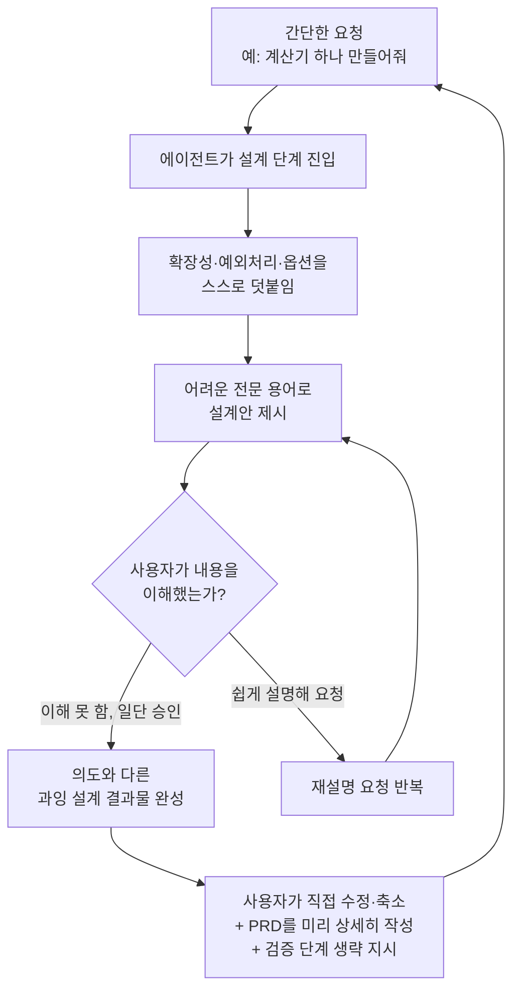

```
https://www.threads.com/@jwon.ig/post/DbM3-q8ESxp

Codex GPT 5.6 SOL 다 좋은데,
오버 엔지니어링이 너무 심한 거 같다.

계산기를 만들어 달랬더니,
컴퓨터를 만들고 있는 모습을 자주 본다.

용어들이 어려워 이해를 잘 못하고 있다가
나중에 보면 전혀 이상한 걸 만들고 앉았네
```

## 1. 이 문서가 다루는 내용

이 문서는 Threads 이용자 @jwon.ig가 올린 게시물과 그 아래 달린 댓글들을 바탕으로, 왜 지금 개발자 커뮤니티에서 "Codex와 GPT-5.6 Sol이 좋긴 한데 너무 과하게 만든다"는 불만이 반복해서 나오는지를 정리한 것이다. 다만 먼저 밝혀둘 점이 있다. Threads는 로봇을 이용한 자동 접근을 막아두고 있어서, 게시물 원문 페이지 자체를 직접 열람해 게시일이나 작성자의 다른 활동 이력까지 확인하지는 못했다. 이 문서는 사용자가 전달한 게시물 본문과 댓글 텍스트를 원본으로 삼아 그 내용을 정리하고, 여기에 등장하는 "GPT-5.6 Sol", "Codex", "오버엔지니어링" 같은 용어와 배경 사실은 별도로 웹 검색을 통해 확인한 내용을 덧붙이는 방식으로 작성했다. 게시물 자체의 정확한 작성 시각은 확인되지 않았으므로, 이 부분은 추측하지 않고 비워둔다.

## 2. 게시물이 포착한 현상: "계산기를 시켰더니 컴퓨터를 만들고 있다"

게시물의 핵심 문장은 이것이다. Codex와 GPT-5.6 Sol 둘 다 성능 자체는 좋다고 인정하면서도, 정작 사용해보면 요청한 것보다 훨씬 큰 결과물을 만들어낸다는 것이다. 작성자는 이를 "계산기를 만들어 달랬더니 컴퓨터를 만들고 있다"는 비유로 표현했다. 간단한 기능 하나를 요청했는데 에이전트가 알아서 확장성, 예외 처리, 각종 옵션까지 끌어들여 원래 요청보다 훨씬 크고 복잡한 결과물을 내놓는다는 뜻이다. 이어지는 문장에서는 이 문제가 결과물의 규모뿐 아니라 설명 방식에서도 나타난다고 짚는다. 에이전트가 설계 단계에서 낯선 전문 용어를 잔뜩 나열하면 사용자는 이해하지 못한 채로 일단 승인 버튼을 누르게 되고, 나중에 결과물을 보면 원래 의도와 전혀 다른 방향으로 만들어져 있더라는 것이다. 그래서 요즘 자신이 가장 자주 쓰는 말이 "쉽게 설명해"라는 문장으로 마무리된다.

댓글 창에서도 비슷한 경험이 이어진다. 정리하면 다음과 같은 흐름이다.

첫째, 모델을 직접 골라 쓰는 번거로움에 대한 이야기다. 한 댓글은 지금 당장은 작업 성격에 맞춰 모델을 사람이 직접 판단해서 골라 써야 하는데, 이 판단 과정 자체가 꽤 까다롭다고 말한다. 다만 언젠가는 입력한 프롬프트만 보고 시스템이 알아서 적절한 모델 크기와 추론 단계를 설정해주는 시대가 올 것이라는 전망도 함께 덧붙인다.

둘째, 결과물을 쓸 만하게 다듬는 데 드는 시간에 대한 불만이다. 에이전트가 만들어주는 것 자체는 편리하지만, 그 결과물을 실제로 고치고 정리하는 데 생각보다 오랜 시간이 든다는 반응이 여럿이다.

셋째, 이 문제에 대응하는 방법으로 PRD, 즉 요구사항 정의 문서를 미리 꼼꼼하게 써두는 쪽으로 습관이 바뀌고 있다는 댓글이 있다. 에이전트에게 맡기기 전에 무엇을 만들지 더 구체적으로 규정해둘수록 결과물이 산으로 가는 일이 줄어든다는 경험에서 나온 대응 방식으로 보인다.

넷째, 검증 단계를 아예 생략하고 코딩만 시킨다는 댓글도 있다. 에이전트에게 스스로 검증까지 맡기면 검증 과정에서 불필요하게 잔재주를 부리느라 정작 코딩 자체는 진행이 안 되는 경우가 있다는 것이다. 그래서 검증은 사람이 직접 하거나 별도 단계로 떼어두고, 에이전트에게는 코딩만 시킨다는 나름의 운용 규칙이 나온다.

다섯째, GPT-5.6 Sol이라는 모델 자체의 포지션에 대한 평가도 있다. 한 댓글은 Sol이 일반 개발자가 매일 쓰기보다는 연구실 같은 환경에서 쓰기에 더 어울리는 모델 같다고 평했다.

여섯째, 마지막 두 댓글은 처음 문제 제기와 같은 결로, 설명을 쉽게 해달라고 몇 번이나 요청해야 하는지 모르겠다는 하소연으로 마무리된다. 전문적인 용어가 너무 많아서 결과물을 이해하기 어렵다는 점이 이 스레드 전체를 관통하는 정서다.

## 3. 배경: GPT-5.6과 Sol·Terra·Luna 체계는 무엇인가

이 불만을 제대로 이해하려면 먼저 GPT-5.6이라는 모델군 자체가 어떤 구조인지 알아야 한다. OpenAI는 2026년 7월 10일 공개한 공식 발표를 통해 GPT-5.6을 소개하면서, 기존처럼 단일 모델 하나를 내놓는 대신 Sol, Terra, Luna라는 세 개의 등급으로 나누어 출시했다. 이 이름 체계는 숫자가 세대를, 이름이 세대와 무관하게 이어지는 능력 등급을 가리키는 새로운 방식이다. Sol은 그중 가장 강력한 플래그십 등급으로 복잡한 코딩, 과학 분석, 사이버보안 연구처럼 어려운 문제를 겨냥한다. Terra는 GPT-5.5와 비슷한 성능을 절반 가까운 가격에 제공하는 중간 등급으로 고객 지원이나 문서 분석처럼 대량으로 반복되는 업무를 노린다. Luna는 가장 저렴하고 빠른 등급으로 요약이나 초안 작성 같은 가벼운 작업에 맞춰져 있다.

가격은 100만 토큰 기준으로 Sol이 입력 5달러에 출력 30달러, Terra가 입력 2.5달러에 출력 15달러, Luna가 입력 1달러에 출력 6달러다. 여기서 토큰이란 모델이 글을 읽고 쓸 때 다루는 최소 단위를 말하는데, 영어 기준으로 대략 한 단어가 1.3개 토큰 정도 된다고 보면 된다. 세 등급 모두 105만 토큰이라는 넓은 컨텍스트 창을 지원한다는 점도 확인된 사실이다.

주목할 부분은 출시 초기의 접근 제한이다. OpenAI는 공식 발표에서 프리뷰 기간 동안 GPT-5.6 모델군을 API와 Codex를 통해 우선 신뢰할 수 있는 일부 파트너와 기관에만 제공하고, 이후 ChatGPT와 Codex, API 사용자 전체로 넓혀갈 계획이라고 밝혔다. 국내 블로그 박재홍의 실리콘밸리는 이 초기 제한 대상을 미국 정부가 승인한 약 20개 회사 수준이라고 전했는데, 이는 OpenAI의 1차 발표 자료에는 정확한 숫자로 명시되지 않은 만큼 2차 해석으로 받아들일 필요가 있다. 다만 방향성 자체는 OpenAI 공식 자료와 일치한다. 실제로 GPT-5.6 Sol이 Codex의 특정 로그인 방식에서는 아예 지원되지 않거나 업데이트 도중 일시적으로 사라졌다는 사용자 보고도 개발자 커뮤니티 깃허브 이슈 트래커에 올라와 있어서, 이 모델이 아직 안정적으로 전면 배포된 상태는 아니라는 정황을 뒷받침한다. 댓글에서 나온 "Sol은 연구실용이지 일반 개발자용이 아니다"라는 평가는 이런 제한적인 초기 배포 상황과도 어느 정도 맞닿아 있는 셈이다.

## 4. 왜 "계산기를 시켰더니 컴퓨터가 나오는" 일이 벌어지는가

이 현상에는 몇 가지 기술적인 배경이 있다.

첫 번째는 추론 강도 설정이다. GPT-5.6에는 max라는 더 깊은 추론 모드와 ultra라는 여러 보조 에이전트를 동시에 굴리는 모드가 새로 추가됐다. 문제는 Sol 계열 모델이 보조 에이전트를 매우 적극적으로 만들어낸다는 점이다. 실제로 Codex 사용자들 사이에서는 Sol이 부모 작업과 똑같은 모델, 똑같은 추론 강도로 하위 에이전트를 계속 만들어내는 구조 때문에 짧은 요청 하나에도 토큰 사용량이 예상보다 훨씬 크게 늘어난다는 지적이 나온다. 하나의 메시지가 전체 사용 한도의 상당 부분을 소모하는 경우도 보고됐을 정도다. 이런 구조에서는 간단한 요청이라도 에이전트가 스스로 여러 하위 작업으로 쪼개고, 각 하위 작업마다 안정성이나 예외 처리 같은 항목을 덧붙이면서 결과물이 원래 요청보다 커지기 쉽다.

두 번째는 검증 성향이다. GPT-5.6 계열은 코딩과 에이전트 작업에서 완성도를 끌어올리는 데 방점을 두고 학습됐다고 알려져 있다. 실제로 한 사용자는 약 1만 5천 줄 규모의 파이썬 프로젝트를 Sol에게 검토시켰더니 안정성, 신뢰성, 효율성, 결과물 품질과 관련해 47가지 개선점을 스스로 찾아냈다고 후기를 남겼다. 이런 성향은 대규모 코드베이스를 다듬을 때는 장점이 되지만, 단순한 기능 하나만 필요한 상황에서는 요청하지 않은 행동까지 수행하는 부작용으로 이어질 수 있다. 실제로 여러 사용 후기에서 이 모델이 "요청하지 않은 행동을 수행할 수 있다"는 점이 단점으로 함께 언급된다. 댓글에서 나온 "검증하지 말고 코딩만 하라고 시킨다"는 대응은 바로 이 성향을 억제하기 위한 사용자 나름의 우회 전략으로 볼 수 있다.

세 번째는 이름 체계와 설명 방식의 차이다. OpenAI가 Sol, Terra, Luna처럼 천체 이름을 쓴 것은 능력 등급을 직관적으로 전달하려는 의도라는 분석이 많다. 하지만 등급 이름을 안다고 해서 실제 설계 과정에서 모델이 쏟아내는 전문 용어까지 쉬워지는 것은 아니다. 게시물과 댓글에서 반복되는 "설명 좀 쉽게 해달라"는 요청은 결국 모델의 절대적인 성능과는 별개로, 사람이 이해할 수 있는 언어로 설계 근거를 설명하는 능력이 아직 따라오지 못하고 있다는 체감을 보여준다.

아래 도식은 게시물과 댓글이 공통으로 묘사하는 흐름을 정리한 것이다.



## 5. 실사용자들이 찾아낸 대응 방식

댓글 스레드를 종합하면, 지금 이 상황에 대응하는 방법은 대략 세 갈래로 정리된다.

하나는 모델을 작업 성격에 맞춰 사람이 직접 고르는 방식이다. Sol처럼 무거운 등급은 정말 어려운 문제에만 쓰고, 단순 반복 작업에는 Terra나 Luna 같은 가벼운 등급을 쓰는 식이다. 실제로 여러 사용 후기에서도 복잡한 추론과 전문 작업에는 상위 등급이, 일상적인 빠른 질문에는 하위 등급이 맞는다는 점을 공통적으로 언급한다. 다만 이 판단을 매번 사람이 내려야 한다는 점이 번거로움으로 남는다는 게 댓글의 요지였다.

다른 하나는 요청 자체를 더 구체적으로 규정해두는 방식, 즉 PRD를 미리 상세하게 써두는 습관이다. 무엇을 만들 것인지, 어디까지가 범위인지를 먼저 문서로 못박아두면 에이전트가 스스로 범위를 넓히는 여지가 줄어든다.

마지막은 역할을 쪼개는 방식이다. 에이전트에게는 코딩만 맡기고, 검증이나 최종 확인은 별도 단계로 사람이 가져가거나 다른 도구로 넘기는 식이다. 이렇게 하면 에이전트가 검증 과정에서 불필요하게 시간을 쓰는 일을 막을 수 있다는 것이 댓글 작성자의 경험이었다.

## 6. Sol·Terra·Luna 비교로 보는 선택 기준

게시물에서 언급된 "모델을 직접 골라야 하는 번거로움"을 이해하는 데 도움이 되도록, 확인된 공식 정보를 기준으로 세 등급을 정리하면 다음과 같다.

| 구분 | Sol | Terra | Luna |
|---|---|---|---|
| 포지션 | 최상위 플래그십 | 균형형 주력 모델 | 경량·고속 모델 |
| 100만 토�큰당 가격(입력/출력) | 5달러 / 30달러 | 2.5달러 / 15달러 | 1달러 / 6달러 |
| 적합한 작업 | 복잡한 코딩, 과학 분석, 사이버보안 연구 등 난도 높은 작업 | 고객 지원, 사내 도구, 문서 분석 등 대량 반복 업무 | 요약, 초안 작성, 단순 자동화 |
| 초기 접근성 | 프리뷰 초기에는 일부 신뢰 파트너·기관으로 제한 | 유료 요금제 이상에서 순차 확대 | 상대적으로 넓게 제공 |

이 표에서 알 수 있듯, Sol은 애초에 "아무 작업에나 기본으로 쓰는 모델"로 설계된 것이 아니라 난도가 높은 문제에 선택적으로 투입하도록 설계된 등급이다. 그런데도 실제 사용 환경에서는 별다른 설정 없이 Sol이 기본으로 걸리거나, 간단한 작업에도 습관적으로 Sol을 쓰게 되는 경우가 많다 보니 "계산기 하나에 컴퓨터를 만드는" 체감으로 이어지는 것으로 보인다.

## 7. 정리

이 게시물과 댓글 스레드가 보여주는 것은 특정 모델 하나의 결함이라기보다는, 지금 AI 코딩 에이전트 생태계 전체가 지나가고 있는 과도기적 현상에 가깝다. 모델은 점점 더 깊이 추론하고 스스로 하위 작업을 만들어내는 방향으로 발전하고 있는데, 그 결과를 사람이 이해하고 통제하는 인터페이스는 아직 그 속도를 따라가지 못하고 있다. "쉽게 설명해"라는 말이 요즘 가장 자주 쓰는 표현이 됐다는 게시물의 마무리 문장은, 결국 모델의 원시 성능보다 그 성능을 사람이 다룰 수 있는 형태로 통역해주는 능력이 실사용에서는 더 중요한 변수가 되고 있다는 점을 보여준다. PRD를 미리 상세하게 써두거나 검증 단계를 분리하는 식의 대응은, 이런 간극을 메우기 위해 사용자들이 자체적으로 만들어가고 있는 임시방편에 가깝다고 볼 수 있다.

---

작성일: 2026년 7월 26일
