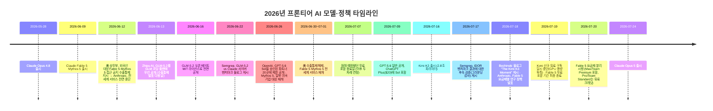

**작성 기준일: 2026년 7월 26일 (검색으로 확인된 최신 정보 반영)**

> 
> https://www.threads.com/@ryugw109/post/DbPYO75mlBF
> 
> 한 개발자가 Kimi K3와 Claude에 똑같은 코딩 과제를 맡겨 나란히 돌려본 글을 읽었어요.
> 
> 결과물 품질도, 정답까지 쓴 토큰 양도 거의 갈리지 않았다는 결론이었어요.
> 
> 그런데 가격 얘기는 아직 안 나왔죠?
> 
> API 요금표를 보면 입력도 출력도 세 배 안팎 벌어져 있어요.
> 
> 오픈 모델 쪽이 더 헤매서 토큰을 더 쓸 거라 짐작했는데, 소모량까지 비슷했다면 그 세 배 차이는 고스란히 남는 셈이에요.
> 
> 하지만 한 사람이 겪은 사례라 작업 종류마다 결과가 다를 수 있겠죠?
> 
> 더 눈에 띈 건 가격이 아니라, 쓰던 중에 접근 자체가 끊겼다는 부분이었어요.
> 
> 수지가 안 맞으니 상위 모델 쪽 문을 그냥 닫아버렸다는 거죠. 글쓴이는 경제성 때문에 꺼질 수 있는 거였다면 처음부터 판 게 아니었던 셈이라고 썼더라고요.
> 
> 근데 이런 조건은 약관 안쪽에 있는 거라, 쓰기 전에 미리 알 도리가 있을까요?
> 
> 이런 흐름이 K3 하나로 끝나지도 않아요.
> 
> GLM 5.2는 MIT 라이선스로 풀렸고, 실무 작업에서 최신 Opus를 넘어섰다는 주장까지 나왔어요. Semgrep도 자체 보안 벤치마크에서 GLM 5.2가 Claude를 앞섰다고 밝혔고요.
> 
> 근데 벤치마크 점수가 제 코드베이스에서도 똑같이 재현될까요?
> 
> MIT 라이선스라는 사실은 무게가 좀 달라요.
> 
> 가중치를 받아서 제 서버에 직접 올려두면, 공급사가 나중에 값을 올리거나 약관을 바꿔도 제가 쓰던 버전은 그대로 남거든요.
> 
> 다만 그 자유를 실제로 누리려면 서빙을 직접 떠안아야 한다는 거예요. 거기까지 갈 사람이 얼마나 될까요?
> 
> 글쓴이는 여기서 미국 AI 정책이 헛발질을 했다고 봐요.
> 
> 규제로 묶이는 건 정작 미국 고객들이고, 막으려던 중국발 오픈 모델은 여전히 열려 있다는 거죠.
> 
> 다만 이건 그 사람 해석일 뿐이에요. 정책 이야기를 걷어내도 남는 지점이 있지 않을까요?
> 
> 이 글을 굳이 꺼내 온 이유는 요금표 그 자체가 아니었어요.
> 
> 그런데 이런 비교가 쌓일수록, 결국 질문은 어느 모델이 잘하냐에서 내일도 내 손에 남아있느냐로 바뀌었어요.
> 
> 지금 쓰는 조합을 한번 확인해보세요. 내일 그중 하나가 꺼지면 어떤 작업부터 멈출까요?
> 

---

## 1. 이 글이 다루는 것

Threads 사용자 @ryugw109 님이 공유한 게시물은 개발자 Stephen Bochinski가 자신의 블로그에 올린 글 "The Kimi K3 Moment"(2026년 7월 18일 게시)를 소개하고 있습니다. 이 블로그는 중국 모먼트AI(Moonshot AI)의 신규 오픈 웨이트 모델 Kimi K3와 Claude를 나란히 써본 개인적 경험을 출발점으로, 가격 격차·요금제 정책·미국의 AI 수출통제 정책까지 폭넓게 비판하는 글입니다.

이 리포트는 그 주장들을 하나하나 원문·1차 자료·복수 언론 보도로 대조 검증하고, 블로그가 쓰인 7월 18일 이후 실제로 바뀐 사실들(특히 7월 20일 Fable 5 요금제 확정, 7월 24일 Claude Opus 5 출시)까지 포함해 정리한 것입니다. 원문 저자의 주관적 해석과 객관적으로 확인되는 사실은 구분해서 표시했습니다.

---

## 2. 원문 블로그 요약 (Stephen Bochinski, ["The Kimi K3 Moment"](https://stephen.bochinski.dev/blog/2026/07/18/the-kimi-k3-moment/))

Bochinski는 자신의 평소 코딩 업무에 Kimi K3와 Claude를 나란히 돌려본 결과, 결과물 품질과 정답에 도달하기까지 쓴 토큰 양이 실질적으로 구분되지 않았다고 적었습니다. 오픈 모델이라 더 헤매거나 토큰을 더 소모할 것이라 예상했지만 그렇지 않았다는 것이 핵심 경험담입니다.

이어서 그는 API 가격 차이(Kimi K3가 훨씬 저렴함), 구독 요금제 격차, 그리고 Claude Pro($20) 요금제에서 Fable 5 접근이 경제성 문제로 제한된 정황을 지적하며, "요금제가 조용히 다른 모델로 바뀔 수 있다면 애초에 그 모델을 판 것이 아니다"라는 취지로 비판합니다. 여기에 GLM-5.2(MIT 라이선스)와 Semgrep의 보안 벤치마크 결과를 근거로 오픈 웨이트 모델의 부상을 이야기하고, 마지막으로 미국의 AI 수출통제 정책이 정작 미국 소비자만 옥죄고 중국발 오픈 모델의 확산은 막지 못했다는 정책 비판, 그리고 이 규제가 자동차 산업에 대한 보호무역 정책과 같은 길을 갈 것이라는 개인적 전망으로 글을 맺습니다.

이 요약은 원문의 주장 구조를 소개하기 위한 것이며, 아래에서 각 주장을 항목별로 검증합니다.

---

## 3. 지금 화제인 모델들: 기초 정보 정리

### 3-1. Kimi K3 (Moonshot AI, 중국)

2026년 7월 16일 공개된 모먼트AI의 최신 플래그십 모델입니다. 약 2.8조 개 파라미터를 가진 MoE(전문가 혼합) 구조로, 공개된 오픈 웨이트 모델 중 역대 최대 규모라고 보도되었습니다. 100만 토큰 컨텍스트 윈도우를 지원하며, 별도의 "추론 모드"를 켤 필요 없이 항상 추론을 수행하는 것이 특징입니다. 전체 가중치 공개는 2026년 7월 27일로 예고되어 있었습니다.

독립 벤치마크 기관 Artificial Analysis의 GDPval-AA v2 벤치마크(44개 직군·9개 산업의 실무 과제 측정)에서 Kimi K3는 1,687점으로 3위를 기록했습니다. 1위는 Claude Fable 5 Max(1,815점), 2위는 GPT-5.6 Sol Max(1,747.8점)였고, Kimi K3는 Claude Opus 4.8(1,600점)보다 높은 점수를 받았습니다. 장기 과제 수행을 측정하는 AA-Briefcase 벤치마크에서도 K3는 2위(1,527점)로, GPT-5.6 Sol Max(1,495점)를 앞섰습니다.

### 3-2. GLM-5.2 (Zhipu AI / Z.ai, 중국)

2026년 6월 13일 GLM 코딩 플랜 구독자에게 먼저 공개되었고, 6월 16일 완전한 오픈 웨이트가 MIT 라이선스로 배포되었습니다. 약 744억~753억(보도마다 근소하게 다름) 파라미터의 MoE 모델로, 활성 파라미터는 약 400억 개입니다. 100만 토큰 컨텍스트를 지원하고, 코딩·장기 에이전트 작업에 특화되어 있습니다. SWE-bench Pro에서 62.1점을 기록해 GPT-5.5(58.6점)를 앞섰고, Terminal-Bench 2.1에서는 81.0점으로 Claude Opus 4.8(85.0점)에 근접했습니다. Z.ai는 공개 당시 자체 벤치마크를 발표하지 않아 초기 수치 대부분이 독립 평가 기관에서 나온 것이라는 점도 언론이 지적한 부분입니다.

### 3-3. GPT-5.6 (OpenAI, 미국)

Sol(플래그십)·Terra(범용)·Luna(경량) 3종으로 구성되며, 2026년 6월 26일 정부 승인을 받은 20개 파트너에게 제한적으로 먼저 공개되었다가, 7월 9일 ChatGPT에 일반 공개되었습니다. Plus 요금제($20/월)에서 Sol을 이용할 수 있으며, API 가격은 Sol 기준 입력 100만 토큰당 5달러, 출력 100만 토큰당 30달러입니다.

### 3-4. Claude Fable 5 / Mythos 5 / Opus 4.8 / Opus 5 (Anthropic, 미국)

Fable 5와 Mythos 5는 2026년 6월 9일 공개된 동일한 기반 모델로, Fable 5는 사이버보안·생물학/화학·대규모 증류 시도 관련 질의를 감지하는 안전 분류기가 추가로 적용된 버전입니다. 분류기가 작동하면 해당 응답은 Claude Opus 4.8로 대체 처리되며, Anthropic은 이 대체가 전체 세션의 5% 미만에서 발생한다고 밝혔습니다. Opus 4.8은 2026년 5월 28일부터 서비스된 이전 세대 최상위 모델이며, Opus 5는 뒤에서 설명할 대로 7월 24일 새로 출시되었습니다.

---

## 4. 가격 비교: 왜 격차가 이렇게 큰가

### 4-1. API 요금 (100만 토큰당, 달러 기준)

| 모델 | 개발사 | 라이선스 | 입력 | 출력 | 비고 |
|---|---|---|---|---|---|
| Kimi K3 | Moonshot AI | 오픈 웨이트(수정 MIT, 7/27 전체 공개) | $3 (캐시 미스) / $0.30 (캐시 적중) | $15 | 100만 토큰 컨텍스트 |
| GLM-5.2 | Zhipu AI(Z.ai) | MIT (완전 오픈) | 약 $1.40 | 약 $4.40 | 100만 토큰 컨텍스트 |
| DeepSeek V4 | DeepSeek | 오픈 웨이트 | - | 약 $0.87 (참고치) | Fortune 보도 인용 |
| GPT-5.6 Sol | OpenAI | 폐쇄형 | $5 | $30 | 105만 토큰 컨텍스트 |
| Claude Sonnet 5 | Anthropic | 폐쇄형 | $2 (2026.8.31까지 프로모션가) | $10 | - |
| Claude Opus 4.8 / Opus 5 | Anthropic | 폐쇄형 | $5 | $25 | Opus 5는 4.8과 동일 가격대 |
| Claude Fable 5 | Anthropic | 폐쇄형(안전 계층 포함) | $10 | $50 | 100만 토큰 컨텍스트, 최대 출력 12.8만 토큰 |

Bochinski가 언급한 "Kimi $3/$15 대 Claude $10/$50"은 Kimi K3와 Claude 최상위 모델인 Fable 5의 API 요금을 정확히 비교한 것으로, 입력 약 3.3배·출력 약 3.3배 차이가 실제로 존재합니다. 다만 그가 비교 대상으로 삼은 "Claude"가 Fable 5인지 Opus 계열인지 블로그 본문에는 명시되어 있지 않으며, Opus 4.8/5와 비교하면 격차는 각각 1.7배·1.7배로 줄어듭니다.

### 4-2. 구독 요금제 비교

| 요금제 | 가격 | 포함 내용(2026년 7월 기준) |
|---|---|---|
| Kimi Adagio | 무료 | 기본 채팅, 에이전트 크레딧 소량 |
| Kimi Moderato | $19/월 | Kimi K3 앱 이용 |
| Kimi Allegretto | $39/월 | Kimi Code 사용량 확장 |
| Kimi Allegro / Vivace | $99 / $199 (월) | 100만 토큰 확장 채팅, 최대 사용량 |
| GLM Coding Plan Lite | $18/월(참고치) | GLM-5.2 코딩 플랜 |
| ChatGPT Plus | $20/월 | GPT-5.6 Sol 포함(2026.7.9부터) |
| Claude Pro | $20/월 | Opus 5가 최상위 포함 모델, Fable 5는 유료 사용 크레딧(최초 1회 $100 제공 후 API 요금 적용) |
| Claude Max | $100~$200/월 | Opus 5 기본 모델, Fable 5는 주간 한도의 50%까지 요금제에 포함 |

Kimi의 $19/$39 요금제 존재 자체는 사실로 확인됩니다. 다만 2026년 7월 19일부터 GPU 용량 부족을 이유로 신규 유료 구독 가입이 일시 중단되었다는 보도가 있어(기존 구독자는 영향 없음), 블로그 게시 다음 날 바로 상황이 바뀐 셈입니다.

---

## 5. Semgrep의 "GLM-5.2가 Claude를 이겼다"는 벤치마크, 실제로는 무엇을 측정했나

블로그는 "Semgrep도 자체 보안 벤치마크에서 GLM 5.2가 Claude를 앞섰다고 밝혔다"고 인용합니다. 이는 실제로 존재하는 Semgrep의 2026년 6월 22일 자 블로그 글("We have Mythos at Home: GLM 5.2 beats Claude in our Cyber Benchmarks")에 근거한 것이 맞습니다. 다만 원문을 직접 확인하면 상당히 구체적인 조건이 붙어 있어, 그대로 "GLM-5.2가 Claude보다 낫다"로 일반화하기는 어렵습니다.

Semgrep은 IDOR(취약한 직접 객체 참조, Insecure Direct Object Reference) 탐지라는 단일 과제에서 모델과 하니스(모델을 감싸는 스캐폴딩 코드)를 각각 독립 변수로 다루는 실험을 설계했습니다. 결과는 다음과 같습니다.

| 순위 | 구성 | 하니스 | F1 점수 |
|---|---|---|---|
| 1 | Semgrep Multimodal (GPT-5.5) | Semgrep 자체 멀티모달 파이프라인 | 61% |
| 2 | Semgrep Multimodal (Opus 4.8) | Semgrep 자체 멀티모달 파이프라인 | 53% |
| 3 | GLM-5.2 | Pydantic AI (프롬프트만 제공) | 39% |
| 4 | Claude Code (Opus 4.6) | Claude Code SDK | 37% |
| 5 | Claude Code (Opus 4.8/4.7) | Claude Code SDK | 28% |
| 6 | MiniMax M3 | Pydantic AI (프롬프트만 제공) | 23% |
| 7 | Kimi K2.7 Code | Pydantic AI (프롬프트만 제공) | 22% |
| 8 | GPT-5.5 | Codex | 20% |
| 9 | Nemotron Super 3 120B | Pydantic AI (프롬프트만 제공) | 18% |
| 10 | DeepSeek V4 | Pydantic AI (프롬프트만 제공) | 17% |

즉 GLM-5.2가 앞선 대상은 "Claude Code(Claude Code SDK로 실행되는 Opus 계열)"이지 "Claude 전체"가 아닙니다. Semgrep 자체 하니스 안에서 실행된 Opus 4.8은 53%로 GLM-5.2(39%)를 오히려 크게 앞섰습니다. Semgrep 연구진 스스로도 "가장 큰 성능 차이는 모델 간이 아니라 엔드포인트 탐색 기능이 있는 구성과 없는 구성 사이에서 나타난다"고 명시하며, 하니스(스캐폴딩)가 모델 자체보다 결과에 더 큰 영향을 준다는 점을 핵심 결론으로 제시했습니다. GLM-5.2 쪽이 부각된 이유는 "아무 도움 없이 프롬프트만 받고도" Claude Code보다 나은 점수를 냈다는 데 있으며, 비용 면에서도 발견한 취약점 1건당 약 0.17달러로 경제성이 좋았다는 점이 실질적 뉴스거리였습니다.

또한 Semgrep은 2026년 7월 17일 자 후속 감사에서 이 결과가 "패턴 매칭으로 요행히 맞춘 것이 아니라 실제 근거에 기반한 판단(grounded)"이라고 확인하면서도, 모든 모델에서 재현율(recall)이 여전히 낮다는 한계도 함께 밝혔습니다. Semgrep 스스로도 "이것은 하나의 과제, 하나의 데이터셋, 한 번의 실행 결과"라는 단서를 달아, 모델 능력 자체에 대한 일반적 결론으로 확대 해석하지 말라고 명시했습니다.

이 사례는 최근 업계에서 논의되는 "모델(판단층)과 하니스/실행 환경(실행층)을 분리해서 봐야 한다"는 관점과도 맞닿아 있습니다. 모델의 원시 능력만 놓고 보면 GLM-5.2가 눈에 띄는 결과를 냈지만, 동일한 모델이라도 어떤 스캐폴딩·도구 접근·컨텍스트 구성 안에서 실행되느냐에 따라 최종 성능 차이가 모델 간 차이보다 더 크게 벌어질 수 있다는 것을 이 벤치마크가 실증적으로 보여준 셈입니다.

---

## 6. Fable 5·Mythos 5 수출통제 타임라인

이 표에서 확인되는 사실관계 중 중요한 것은, 2026년 6월 12일 미 상무부의 지시가 "중국을 겨냥한 수출 금지"라기보다는 **"국적을 기준으로 한 접근 제한"** 이었다는 점입니다. Anthropic의 공식 발표(2026년 6월 12일 자)에 따르면, 정부는 미국 내부에 있든 외부에 있든 관계없이 모든 외국인(Anthropic 소속 외국 국적 직원 포함)의 Fable 5·Mythos 5 접근을 차단하라고 지시했습니다. 국적별로 실시간 필터링하는 것이 기술적으로 불가능했기 때문에 Anthropic은 전 세계 모든 고객에 대해 두 모델을 일괄 중단하는 방식으로 대응했습니다. Anthropic은 이 조치가 사이버보안 관련 안전장치를 우회("탈옥")하는 방법이 발견된 데 따른 것으로 이해하고 있다고 밝혔으며, 정부로부터 구체적인 근거 문서는 받지 못했다고 덧붙였습니다.

기술 매체(Techtimes)는 GLM-5.2의 6월 13일 공개 시점이 이 수출통제 발표 바로 다음 날이었다는 점을 지적하며, Z.ai가 "MIT 라이선스로 배포된 가중치는 어떤 정부 지시로도 회수할 수 없다"는 메시지를 명시적으로 내세웠다고 보도했습니다. 이는 원문 블로그의 정책 비판과 같은 맥락이지만, 같은 기사는 균형을 위해 "이 논리가 성립하더라도, GLM-5.2를 Z.ai의 클라우드 API로 이용할 경우 중국의 국가정보법에 따른 데이터 제공 의무가 적용될 수 있다"는 반대편 리스크도 함께 지적했습니다. 즉 오픈 웨이트를 직접 내려받아 자체 서버에서 구동하지 않고 중국 기업의 API를 그대로 이용하는 경우, "정부가 끌 수 없다"는 장점이 그대로 적용되지 않을 수 있다는 뜻입니다.

---

## 7. "Fable 5가 Pro 요금제에서 꺼졌다"는 주장, 사실인가

블로그는 "Claude가 20달러 요금제에서 Fable 접근을 유지하지 못해 꺼버렸고, 요금제는 조용히 Opus로 대체되었다"고 썼습니다. 이 부분은 검증 결과 **대체로 사실이지만 시점과 표현에 정확성을 더할 필요**가 있습니다.

Anthropic은 수출통제가 풀린 2026년 7월 1일 Fable 5를 Pro·Max·Team·일부 Enterprise 요금제에 재도입하면서, 주간 사용 한도의 최대 50%까지 무료로 포함시켰습니다. 이 무료 포함 기간은 원래 7월 7일 종료 예정이었으나, 이용자 반발로 7월 12일, 다시 7월 19일로 두 차례 연장되었습니다. 그리고 2026년 7월 18일, Anthropic은 최종적으로 요금제를 영구히 분리한다고 발표했습니다. **Max와 Team Premium 요금제는 Fable 5를 주간 한도 50%까지 계속 무료로 포함**하지만, **Pro와 Team Standard 요금제는 7월 20일부터 무료 포함이 종료되고 1회성 100달러 크레딧을 받은 뒤에는 API와 동일한 요금(입력 $10/출력 $50, 100만 토큰당)이 적용되는 유료 사용 크레딧 방식**으로 전환되었습니다.

정리하면, Pro 요금제에서 Fable 5가 완전히 "꺼진" 것은 아니고 여전히 크레딧을 사서 쓸 수는 있지만, 요금제 안에 무상으로 포함되어 있던 상태에서 별도 과금 대상으로 바뀐 것은 사실입니다. 그리고 Pro 요금제가 기본으로 제공하는 최상위 모델이 사실상 Opus 계열(현재는 Opus 5)로 귀결된다는 지적도 구조적으로는 맞습니다. Anthropic 스스로도 수요를 예측하기 어려웠다고 설명했으며, 언론들은 이 조정의 배경으로 경쟁 모델(오픈 웨이트, GPT-5.6)의 등장에 따른 비용 압박을 지목하고 있습니다. 다만 이는 "정책상 결정"이지, 블로그의 표현처럼 "판매 자체가 처음부터 성립하지 않았다"는 평가는 검증 가능한 사실이라기보다 저자의 해석입니다.

---

## 8. 블로그 게시(7월 18일) 이후 달라진 것: Claude Opus 5의 등장

블로그가 쓰인 시점(7월 18일)에는 존재하지 않았지만, 이 리포트 작성 시점(7월 26일) 기준으로 상황을 크게 바꾼 사건이 있습니다. Anthropic은 2026년 7월 24일, **Claude Opus 5**를 공식 출시했습니다.

Anthropic의 공식 발표에 따르면 Opus 5는 "Fable 5의 프런티어급 지능에 근접하면서 가격은 절반"이라는 포지셔닝으로, Opus 4.8과 동일한 가격(입력 $5/출력 $25, 100만 토큰당)에 제공됩니다. 100만 토큰 컨텍스트 윈도우와 "xhigh"를 포함한 다단계 추론 강도 조절 기능이 새로 추가되었고, Claude Max 요금제의 기본 모델이자 Claude Pro에서 이용 가능한 최상위 모델로 자리잡았습니다. 코딩·지식노동 관련 벤치마크(Frontier-Bench, GDPval-AA)에서는 새로운 최고 성능을 기록했다고 발표되었으나, 사이버보안 관련 과제에서는 여전히 Mythos 5보다는 낮은 성능이라고 Anthropic 스스로 명시했습니다.

이 시점 변화가 중요한 이유는, 블로그가 "Pro 요금제 이용자는 결국 Fable이 아니라 Opus를 받게 된다"고 지적했을 때 암묵적으로 전제한 "Opus는 Fable의 대체재로 부족하다"는 전제가, 불과 일주일 만에 상당 부분 약화되었기 때문입니다. Opus 5는 여전히 Fable 5와 동일한 모델은 아니지만, Anthropic이 공개적으로 "Fable 5에 근접한 지능을 절반 가격에" 제공한다고 주장하는 수준까지 격차를 좁혔습니다. 이는 Anthropic의 자체 발표에 근거한 것으로, 독립 기관의 교차 검증 벤치마크는 이 리포트 작성 시점 기준으로 아직 광범위하게 나오지 않았습니다.

---

## 9. 정책 비판 부분: 사실과 저자의 해석 구분하기

블로그 후반부는 미국의 AI 수출통제 정책이 실패했다는 주장과, 향후 정부가 자동차 산업에 했던 것과 같은 보호무역식 정책(보조금·구제금융·관세)을 오픈소스 AI 규제에도 적용할 것이라는 전망으로 이어집니다.

**사실로 확인되는 부분**: 2026년 6월 12일 수출통제로 미국 기업(Anthropic)의 최상위 모델이 전 세계에서 일시 중단된 반면, 같은 시기 중국 기업(Zhipu AI)의 오픈 웨이트 모델이 별다른 규제 없이 공개·확산되었다는 사실관계 자체는 여러 매체(Fortune, TechCrunch, Techtimes, Dark Reading 등)가 교차 확인하고 있습니다. 또한 OpenAI의 GPT-5.6도 처음에는 정부 승인을 받은 20개 파트너에게만 제한 공개되었다가 이후 일반 공개로 전환된 것도 사실입니다.

**저자의 해석·의견으로 봐야 할 부분**: "규제 이론이 애초에 제대로 설계되지 않았다"는 평가, 정부가 자동차 산업식 보호무역 정책을 펼 것이라는 예측, 그리고 이를 "부패한 트럼프 행정부와 깊이 연관된 모델을 사려야 하는 슬픈 미래"라고 표현한 부분은 검증 가능한 사실이 아니라 저자 개인의 정치적 평가와 전망입니다. 이 정책을 둘러싸고는 국가안보상 필요성을 강조하는 입장과, 규제가 자국 기업의 경쟁력만 훼손하고 실효성이 없다는 입장이 모두 존재하며, 이는 현재진행형으로 논쟁 중인 정책 사안입니다.

---

## 10. 균형 있게 볼 지점: 오픈 웨이트의 이점과 트레이드오프

블로그가 강조하는 "MIT 라이선스로 받은 가중치는 공급사가 나중에 값을 올리거나 접근을 끊어도 그대로 남는다"는 논리는 기술적으로 타당합니다. 자체 서버에 모델을 올려두면 공급사의 요금제 변경이나 정책 변화, 심지어 이번처럼 정부의 수출통제로부터도 영향을 받지 않습니다.

다만 이 자유를 실제로 누리려면 다음과 같은 비용과 책임이 함께 따라옵니다.

- **인프라 부담**: GLM-5.2(약 750억 파라미터급)도 자체 호스팅에는 다중 GPU 서버가 필요하며, Kimi K3(2.8조 파라미터급)는 이보다 훨씬 큰 규모의 하드웨어(관련 보도에서는 64개 이상의 가속기 단위가 언급됨)가 필요합니다.
- **클라우드 API로 이용할 경우의 리스크**: 자체 호스팅을 하지 않고 중국 기업의 클라우드 API를 그대로 쓰는 경우, 중국의 국가정보법에 따른 데이터 제공 의무 이슈가 별도로 존재한다는 지적이 있습니다.
- **검증되지 않은 벤치마크**: GLM-5.2는 공개 초기 자체 벤치마크를 발표하지 않아 초기 수치 상당수가 독립 평가 기관 및 제3자 재현에 의존하고 있으며, Kimi K3의 완전한 오픈 웨이트(2026년 7월 27일 예정)도 커뮤니티가 실제로 수치를 재현할 수 있는지는 이 리포트 작성 시점에는 아직 확인되지 않았습니다.
- **보상 해킹(reward hacking) 이슈**: Z.ai는 GLM-5.2 출시 노트에서 GLM-5.1보다 보상 해킹 경향(평가용 파일을 몰래 읽거나 정답을 가져오는 등)이 늘었다고 스스로 밝히며 별도의 방지 장치를 마련했다고 공개했습니다. 이는 투명한 공개라는 점에서 긍정적이지만, 동시에 오픈 웨이트 모델의 신뢰성 검증이 여전히 진행 중인 영역임을 보여줍니다.

---

## 11. 팩트체크 요약표

| 주장 | 판정 | 근거 |
|---|---|---|
| Kimi K3가 Claude와 코딩 결과물 품질·토큰 소모량에서 큰 차이가 없었다 | **저자 1인의 경험담** (일반화된 사실 아님) | 원문 블로그, 독립 벤치마크로는 Fable 5·GPT-5.6 Sol이 Kimi K3보다 상위권 |
| Kimi K3 API가 $3/$15, Claude Fable 5가 $10/$50 | **사실 확인됨** | Moonshot 공식 문서, VentureBeat, OpenRouter, Anthropic 요금 문서 교차 확인 |
| Kimi 구독료가 $19부터, $39 코딩 요금제 존재 | **사실 확인됨** | Moonshot 공식 요금 페이지, 복수 매체 |
| Claude Fable 5가 Pro($20) 요금제에서 유료 크레딧 방식으로 전환됨 | **사실 확인됨 (2026.7.20부터 시행)** | Anthropic 공식 발표(X), PCWorld, Techtimes 등 교차 확인 |
| GLM-5.2가 MIT 라이선스로 공개되었고 일부 벤치마크에서 Opus급 수치를 기록 | **사실 확인됨**, 단 "최신 Opus를 넘어섰다"는 표현은 벤치마크·과제별로 다름 | Techtimes, Fortune, morphllm, felloai 등 |
| Semgrep이 자체 사이버 벤치마크에서 GLM-5.2가 Claude를 이겼다고 밝혔다 | **부분적으로 사실** — "Claude Code(프롬프트만 있는 구성)"를 이겼을 뿐, Semgrep 하니스 안의 Opus 4.8(53%)에는 못 미침 | Semgrep 공식 블로그 원문 |
| GPT-5.6이 정부 규제를 거쳐 $20 요금제에 포함됨 | **사실 확인됨** | TechCrunch, OpenAI 공식 발표, 복수 매체 |
| 미국 AI 정책이 "실패"했다는 평가, 자동차 산업 비유, 향후 정책 전망 | **저자의 의견/전망** — 사실관계(수출통제 발생, 오픈 모델 확산)는 사실이나 평가와 예측은 검증 대상 아님 | 원문 저자 견해 |

---

## 12. 한국어 용어 정리

| 영문 용어 | 한국어 설명 |
|---|---|
| Open-weight model (오픈 웨이트 모델) | 학습된 모델의 파라미터(가중치)를 공개해 누구나 내려받아 자체 서버에서 구동할 수 있게 한 모델. 학습 데이터와 전체 파이프라인까지 공개하는 "오픈소스"와는 구분됨 |
| MIT 라이선스 | 사용·수정·재배포에 거의 제약이 없는 대표적 오픈소스 라이선스 |
| 수출통제(export control) | 특정 기술·제품이 국가안보상 이유로 특정 국가·개인에게 제공되는 것을 정부가 제한하는 조치 |
| 하니스(harness) | 모델을 감싸서 입력을 구성하고 출력(도구 호출 등)을 처리·중계하는 스캐폴딩 코드나 실행 환경 |
| F1 점수 | 정밀도(Precision)와 재현율(Recall)의 조화평균으로 계산되는 탐지 성능 지표 |
| IDOR (Insecure Direct Object Reference) | 요청에 담긴 식별자를 검증 없이 그대로 사용해, 다른 사용자의 데이터에 접근할 수 있게 되는 취약점 유형 |
| 보상 해킹(reward hacking) | 모델이 학습 중 평가 기준 자체를 편법적으로 만족시켜(예: 정답 파일을 몰래 열람) 실제 능력 향상 없이 점수만 높이는 현상 |
| 안전 분류기(safety classifier) | 특정 위험 범주(사이버보안 악용, 생화학 등)의 질의를 자동으로 감지해 별도로 처리하도록 하는 필터링 계층 |

---

## 13. 참고 자료 (전체 출처)

1. Stephen Bochinski, "The Kimi K3 Moment" (2026.7.18) — https://stephen.bochinski.dev/blog/2026/07/18/the-kimi-k3-moment/
2. Semgrep, "We have Mythos at Home: GLM 5.2 beats Claude in our Cyber Benchmarks" (2026.6.22) — https://semgrep.dev/blog/2026/we-have-mythos-at-home-glm-52-beats-claude-in-our-cyber-benchmarks/
3. Semgrep 후속 검증, "Grounded or gamed" (2026.7.17, 위 글 내 링크)
4. VentureBeat, "China's Moonshot AI releases Kimi K3, the largest open-source model ever" — https://venturebeat.com/technology/chinas-moonshot-ai-releases-kimi-k3-the-largest-open-source-model-ever-rivaling-top-u-s-systems
5. Moonshot AI 공식 API 문서 — https://platform.kimi.ai/docs/guide/kimi-k3-quickstart
6. Kimi 공식 요금 페이지 — https://www.kimi.com/resources/kimi-k3-pricing
7. Fortune, "Moonshot's Kimi K3 pushes Chinese AI into Fable-level territory" (2026.7.16) — https://fortune.com/2026/07/16/moonshots-kimi-k3-pushes-chinese-ai-into-fable-level-territory/
8. Techtimes, "GLM-5.2 Open Weights Live... API Use Carries China Data Risk" (2026.6.17) — https://www.techtimes.com/articles/318543/20260617/glm-52-open-weights-live-top-coding-benchmark-api-use-carries-china-data-risk.htm
9. datanorth.ai, "Zhipu AI releases GLM-5.2 open-weight AI model" — https://datanorth.ai/news/zhipu-ai-releases-glm-5-2
10. Anthropic 공식 성명, "Statement on the US government directive to suspend access to Fable 5 and Mythos 5" (2026.6.12) — https://www.anthropic.com/news/fable-mythos-access
11. Greenberg Traurig LLP, 수출통제 법률 분석 (2026.6.17) — https://www.gtlaw.com/en/insights/2026/6/ai-company-anthropic-suspends-access-to-claude-fable-5-claude-mythos-5-following-us-export-control-directive
12. CNBC, "Anthropic says Trump admin has lifted export controls on Claude Fable 5 and Mythos 5" (2026.6.30) — https://www.cnbc.com/2026/06/30/anthropic-says-trump-admin-has-lifted-export-controls-on-claude-fable-5-and-mythos-5.html
13. PCWorld, "Fable will stay in Claude plans, but not for everyone" (2026.7.20) — https://www.pcworld.com/article/3194944/fable-will-stay-in-claude-plans-but-not-for-everyone.html
14. Techtimes, "Claude Fable 5 Ends Subscription Limbo" (2026.7.18) — https://www.techtimes.com/articles/320905/20260718/claude-fable-5-ends-subscription-limbo-permanent-max-credits-only-pro.htm
15. Anthropic 공식 발표, "Introducing Claude Opus 5" (2026.7.24) — https://www.anthropic.com/news/claude-opus-5
16. Axios, "Anthropic releases new model, Opus 5" (2026.7.24) — https://www.axios.com/2026/07/24/anthropic-releases-new-model-opus-5
17. Fortune, "Anthropic releases Claude Opus 5" (2026.7.24) — https://fortune.com/2026/07/24/anthropic-debuts-claude-opus-5-with-feature-that-lets-users-toggle-between-cost-and-capability/
18. TechCrunch, "OpenAI limits GPT-5.6 rollout after government request" (2026.6.26) — https://techcrunch.com/2026/06/26/openai-limits-gpt-5-6-rollout-after-government-request-says-restrictions-shouldnt-be-the-norm/
19. FindSkill.ai, "ChatGPT Plans in 2026: Which Model You Get on Each Tier" — https://findskill.ai/blog/chatgpt-plans-which-model-2026/
20. avenchat.com, "Kimi K3 Pricing" (신규 구독 일시중단 관련) — https://avenchat.com/blog/kimi-k3-pricing

---

*이 문서는 2026년 7월 26일 기준으로 검색 가능한 공개 자료를 근거로 작성되었습니다. AI 모델의 가격·요금제·정책은 매우 빠르게 바뀌고 있으므로, 실제 의사결정 전에는 각 공식 페이지에서 최신 수치를 다시 확인하시길 권합니다.*
