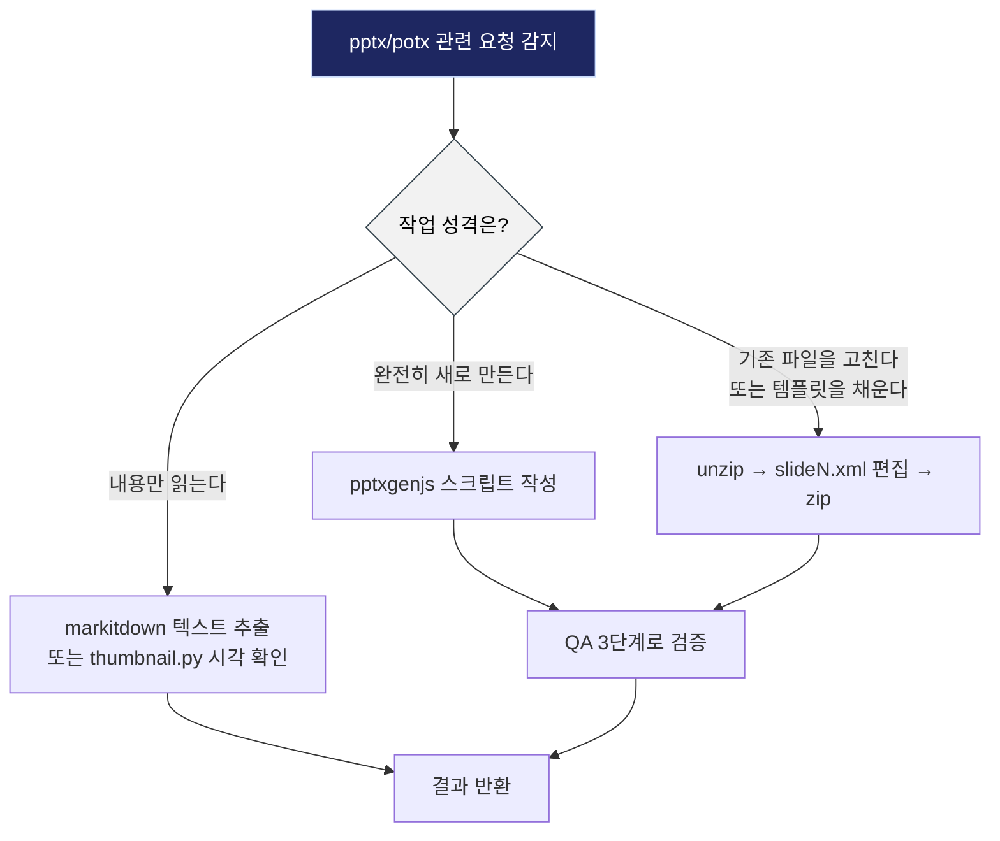
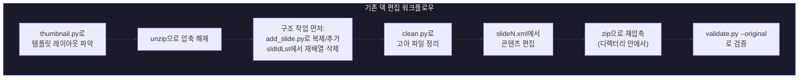
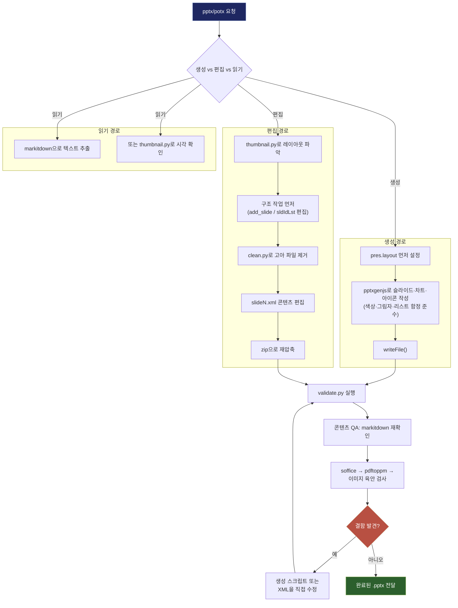

## — Claude가 파워포인트 문서를 다루는 방식에 대한 운영 매뉴얼 분석 —

- **분석 대상:** 사용자가 업로드한 `SKILL.md` (name: `pptx`, license: Proprietary)
- **문서 성격:** 이 스킬은 Claude(또는 Claude Code)가 `.pptx`/`.potx` 파일을 생성·편집·분석할 때 참고하도록 설계된 내부 운영 지침서이며, 외부 뉴스나 논문이 아니라 도구 자체의 사용 설명서다. 따라서 이 문서는 웹 검색 없이 업로드된 파일의 실제 내용만을 근거로 작성했다.
- **작성일자:** 2026-07-26

---

## 목차

1. [이 스킬은 왜 존재하는가](#1-이-스킬은-왜-존재하는가)
2. [트리거 조건: 언제 이 스킬이 호출되는가](#2-트리거-조건-언제-이-스킬이-호출되는가)
3. [PPTX 파일의 본질: ZIP 속의 XML](#3-pptx-파일의-본질-zip-속의-xml)
4. [세 갈래 작업 방식: 생성·편집·읽기](#4-세-갈래-작업-방식-생성편집읽기)
5. [스킬에 내장된 다섯 개 스크립트](#5-스킬에-내장된-다섯-개-스크립트)
6. [pptxgenjs로 새 덱을 만들 때의 함정들](#6-pptxgenjs로-새-덱을-만들-때의-함정들)
7. [기존 덱·템플릿을 편집하는 워크플로우](#7-기존-덱템플릿을-편집하는-워크플로우)
8. [디자인 지침: 지루한 슬라이드를 만들지 않는 법](#8-디자인-지침-지루한-슬라이드를-만들지-않는-법)
9. [필수 QA 3단계: 콘텐츠·파일·비주얼](#9-필수-qa-3단계-콘텐츠파일비주얼)
10. [이미지로 변환해 눈으로 확인하기](#10-이미지로-변환해-눈으로-확인하기)
11. [의존성 목록](#11-의존성-목록)
12. [종합 워크플로우 다이어그램](#12-종합-워크플로우-다이어그램)
13. [이 스킬이 시사하는 것](#13-이-스킬이-시사하는-것)

---

## 1. 이 스킬은 왜 존재하는가

일반적인 언어 모델에게 "파워포인트를 만들어줘"라고 요청하면, 모델은 자신이 알고 있는 `pptxgenjs`나 `python-pptx`의 API 지식을 바탕으로 코드를 짠다. 문제는 이 지식이 대부분 정확하지만, 아주 사소하고 구체적인 지점에서 어긋나는 순간 파일 전체가 손상되거나(corrupt), 텍스트가 잘려나가거나, 파워포인트에서 열리지 않는 결과물이 나온다는 점이다. 이런 실패는 코드 문법 오류가 아니라 "OOXML(Office Open XML) 포맷의 암묵적 규칙"을 어겼을 때 발생하며, 모델이 스스로 겪어보지 않고서는 알기 어려운 종류의 지식이다.

이 SKILL.md는 바로 그 간극을 메우기 위한 문서다. 라이선스가 "Proprietary"로 명시되어 있고 별도의 `LICENSE.txt`를 참조하게 되어 있는 것으로 보아, 이는 범용 오픈소스 튜토리얼이 아니라 이 작업 환경 전용으로 만들어지고 다듬어진 사내 지식 자산에 가깝다. 문서 전체를 관통하는 어조도 "이론적으로 이렇게 하면 된다"가 아니라 "이렇게 하면 실제로 파일이 깨진다"는 실전에서 얻은 실패 사례 목록에 가깝다.

## 2. 트리거 조건: 언제 이 스킬이 호출되는가

파일 상단의 `description` 필드는 이 스킬이 호출되어야 하는 조건을 매우 넓게 정의하고 있다. 요약하면 다음과 같다.

- 슬라이드 덱, 피치 덱, 프레젠테이션을 **만드는** 모든 경우
- 기존 `.pptx`/`.potx` 파일의 텍스트를 **읽거나 추출**하는 모든 경우 (추출한 내용을 이메일이나 요약본 등 다른 곳에 쓸 목적이라도 동일하게 적용)
- 기존 프레젠테이션을 **편집·수정·업데이트**하는 경우
- 여러 슬라이드 파일을 **합치거나 분리**하는 경우
- 템플릿(`.potx`), 레이아웃, 발표자 노트, 코멘트를 다루는 경우

즉 사용자가 "덱", "슬라이드", "프레젠테이션"이라는 단어를 언급하거나 `.pptx`/`.potx` 파일명을 언급하기만 하면, 이후에 그 내용으로 무엇을 하려는지와 무관하게 이 스킬이 먼저 로드되어야 한다는 것이 명시적 규칙이다. 이는 "일단 파일 형식을 건드리는 작업이라면 예외 없이 이 매뉴얼부터 확인하라"는 강제 규칙에 가깝다.

## 3. PPTX 파일의 본질: ZIP 속의 XML

문서는 가장 먼저 `.pptx`가 "ZIP 아카이브 속에 여러 XML 파일이 들어있는 구조"라는 사실을 짚고 넘어간다. 이것이 이후 모든 접근 방식을 이해하는 전제가 된다. 실제로 `.pptx` 확장자를 `.zip`으로 바꿔서 열어보면 다음과 비슷한 내부 구조를 볼 수 있다.

- `ppt/presentation.xml` — 슬라이드 순서(`<p:sldIdLst>`)를 포함한 전체 프레젠테이션의 뼈대
- `ppt/slides/slideN.xml` — 각 슬라이드의 실제 콘텐츠
- `ppt/slideLayouts/`, `ppt/slideMasters/` — 템플릿의 레이아웃과 마스터 슬라이드
- `ppt/media/` — 삽입된 이미지 등 미디어 파일
- `[Content_Types].xml`, `_rels/` — 파일 간 관계와 콘텐츠 타입 선언

이 구조를 알고 나면, "새로 만들기"와 "기존 파일 편집하기"가 왜 완전히 다른 도구를 쓰는지 자연스럽게 이해된다. 새로 만들 때는 이 복잡한 XML 구조 전체를 사람이 신경 쓰지 않아도 되도록 감싸주는 `pptxgenjs` 같은 상위 레벨 라이브러리를 쓰는 것이 합리적이고, 반대로 기존 파일을 미세하게 고칠 때는 XML을 직접 여닫는 것이 오히려 더 안전하고 예측 가능하다.

## 4. 세 갈래 작업 방식: 생성·편집·읽기

스킬은 작업 성격에 따라 접근 방식을 명확히 세 가지로 분기한다.

| 작업 | 접근 방식 |
|---|---|
| **새 덱 생성** | `pptxgenjs` 스크립트 작성 (뒤에 나열된 함정들을 준수) |
| **기존 덱 편집 / 템플릿 기반 제작** | 압축 해제 → `ppt/slides/slideN.xml` 직접 편집 → 재압축 |
| **콘텐츠 읽기** | `markitdown deck.pptx` (슬라이드별로 `<!-- Slide number: N -->` 마커 아래 텍스트 블록 생성) 또는 `python scripts/thumbnail.py deck.pptx`로 시각적 그리드 확인 |

이 세 갈래 구분이 중요한 이유는, 셋 중 어느 하나라도 잘못된 도구를 쓰면 비효율을 넘어 결과물이 아예 망가지기 때문이다. 예를 들어 이미 존재하는 템플릿 기반 덱을 `pptxgenjs`로 처음부터 다시 만들면 템플릿에 담긴 디자인 자산(테마, 마스터 슬라이드, 임베디드 이미지)을 모두 잃는다. 반대로 완전히 새로운 덱을 XML을 손으로 짜서 만들려고 하면 `pptxgenjs`가 자동으로 처리해주는 방대한 부기(bookkeeping) 작업—관계 파일, 콘텐츠 타입 선언 등—을 전부 사람이 재현해야 한다.



## 5. 스킬에 내장된 다섯 개 스크립트

스킬 디렉터리에는 반복 작업을 안전하게 처리하기 위한 다섯 개의 헬퍼 스크립트가 포함되어 있다. 모든 경로는 스킬 디렉터리 기준 상대 경로이며, 그 외의 모든 작업은 순수 Python, `node`, 셸 명령으로 처리한다는 점이 명시되어 있다.

| 스크립트 | 역할 |
|---|---|
| `scripts/thumbnail.py deck.pptx [prefix]` | 모든 슬라이드를 라벨이 붙은 그리드 이미지로 만들어, 템플릿의 레이아웃을 한눈에 파악하게 해준다. `.pptx`만 지원한다. `prefix` 인자를 반드시 지정해야 한다—생략하면 기본값 `thumbnails`로 저장되어, 같은 디렉터리에서 다른 덱을 썸네일화할 때 이전 결과를 덮어써 버린다 |
| `scripts/add_slide.py unpacked/ slide2.xml [--after slideN.xml]` | 슬라이드(또는 `slideLayoutN.xml`)를 복제하면서 필요한 패키지 등록 작업을 전부 대신 처리한다. `.pptx` 파일에 직접 `-o out.pptx`로 사용할 수도 있다 |
| `scripts/clean.py unpacked/` | 더 이상 참조되지 않는 슬라이드, 미디어, 관계(rels) 파일을 삭제한다. **반드시 `<p:sldIdLst>`가 최종 확정된 뒤에** 실행해야 한다 |
| `scripts/office/validate.py deck.pptx [--original src.pptx]` | 스키마, 관계, 콘텐츠 타입, 차트, 슬라이드 검증을 수행하고 각 실패마다 수정 방법을 알려준다. 템플릿에서 파생된 덱이라면 `--original`을 반드시 넘겨야, 템플릿 자체가 가진 XSD 오류가 사용자 책임으로 오인되지 않는다 |
| `scripts/office/soffice.py --headless --convert-to pdf deck.pptx` | LibreOffice를 감싼 래퍼. 이 샌드박스 환경에서는 `soffice` 명령을 그냥 호출하면 멈춰버리기(hang) 때문에 이 래퍼를 반드시 통해야 한다 |

이 다섯 스크립트의 공통점은 "사람(또는 모델)이 실수하기 쉬운 반복 작업을 자동화해서, 실수할 여지 자체를 없앤다"는 설계 철학이다. 특히 `thumbnail.py`와 `add_slide.py`에 붙은 경고—기본 파일명이 이전 결과를 덮어쓴다, 편집 전에 복제해야 한다—는 실제로 이런 실수가 반복적으로 발생했기 때문에 문서에 명시적으로 박아둔 것으로 읽힌다.

## 6. pptxgenjs로 새 덱을 만들 때의 함정들

이 섹션이 스킬 전체에서 가장 길고 구체적이다. `pptxgenjs`는 이미 설치되어 있으므로 `npm install`을 먼저 실행하지 말고 바로 `require('pptxgenjs')`로 불러오라는 지침부터 시작해, 총 15개 남짓한 "겉보기에는 그럴듯하지만 실제로는 파일을 망가뜨리거나 조용히 무시되는" 함정을 나열한다. 성격별로 묶어서 살펴보면 다음과 같다.

### 6.1 캔버스와 좌표계

`pres.layout`을 슬라이드를 추가하기 **전에** 설정해야 한다. 기본 캔버스는 `LAYOUT_16x9`로 10인치 × 5.625인치이며, 흔히 착각하는 13.3인치 폭이 아니다. 이 경계를 벗어난 좌표에 도형을 배치하면 에러 없이 그냥 "슬라이드 밖에 존재하는" 상태로 저장되어, 화면에는 안 보이는 도형이 파일 안에만 남는다. 16:9 와이드 화면을 쓰려면 `LAYOUT_WIDE`(13.3" × 7.5")를 명시해야 한다.

### 6.2 색상과 투명도

색상 값은 절대 `#`을 붙이지 않고 8자리(알파 포함)로도 쓰지 않는다. `color: "FF0000"`처럼 6자리 헥스만 유효하며, `"#FF0000"`이나 알파가 섞인 `"00000020"` 같은 값은 파일을 손상시킨다. 투명도가 필요하면 채우기·이미지에는 `transparency: 0-100`, 그림자에는 `opacity: 0.0-1.0`을 쓰는데, 이 둘은 서로에게는 적용되지 않고 조용히 무시된다는 점이 까다롭다.

### 6.3 객체 재사용 금지

`pptxgenjs`는 옵션 객체를 그 자리에서 변형(mutate)한다—처음 사용될 때 값을 EMU 단위로 바꿔버린다. 따라서 `shadow`나 다른 옵션 객체를 두 번의 `add*` 호출에서 공유하면 두 번째 호출은 이미 변형된 값을 받게 된다. 매번 새 객체를 만들어야 한다. 같은 맥락에서 `new pptxgen()` 인스턴스도 출력 파일 하나당 하나씩만 쓰고 재사용하지 않는다.

### 6.4 그림자, 자간, 리스트의 세부 규칙

- 그림자의 `offset`은 반드시 0 이상이어야 하며, 음수는 파일을 손상시킨다. 그림자를 위쪽으로 드리우려면 `angle: 270`에 양수 offset을 조합한다.
- `letterSpacing`은 존재하지 않는 옵션처럼 조용히 무시된다—실제로 작동하는 옵션명은 `charSpacing`이다.
- 리스트는 각 항목에 `bullet: true`를 주고, 텍스트 안에 리터럴 `•` 문자를 직접 넣지 않는다(그러면 불릿이 두 개 겹쳐 보인다). 마지막 항목을 제외한 모든 배열 항목에 `breakLine: true`를 설정하고, 불릿 문단 사이 간격은 `lineSpacing`이 아니라 `paraSpaceAfter`로 조절한다(`lineSpacing`을 쓰면 간격이 과도하게 벌어진다).

### 6.5 도형과 텍스트 박스

`rectRadius`는 `ROUNDED_RECTANGLE`에서만 작동하고 `RECTANGLE`에는 적용되지 않는다. 그라데이션 채우기는 아예 지원되지 않으므로, 그라데이션이 필요하면 이미지를 배경으로 깔아야 한다. 텍스트 박스에는 내장 여백(padding)이 있으므로, 텍스트를 도형·선·아이콘과 같은 x좌표에 정렬해야 할 때는 `margin: 0`을 설정해야 한다. 발표자 노트는 반드시 `slide.addNotes("...")`로 넣어야 하며(슬라이드 위의 텍스트 박스로 대체하면 안 된다), 슬라이드당 한 번씩만 호출한다.

### 6.6 차트 관련 규칙 (가장 위험도가 높은 영역)

차트는 파워포인트가 네이티브로 지원하는 모든 유형을 `addChart()`로 만들어야 한다(콤보 차트는 `{type, data, options}` 배열을 넘긴다). 트렌드라인이나 오차 막대처럼 라이브러리가 노출하지 않는 파워포인트 네이티브 기능은 직접 계산해서 추가 시리즈로 넣거나 생성된 OOXML을 후처리해야 하며, 절대 렌더링된 이미지로 대체해서는 안 된다. 파워포인트가 네이티브 형태를 아예 갖고 있지 않은 차트(생키, 네트워크, 코드 다이어그램)만 이미지로 넣는다.

기본 차트는 제목도 데이터 라벨도 없이 밋밋하게 렌더링되므로, `showTitle`+`title`, `showValue: true`+`dataLabelPosition`, 팔레트에서 가져온 `chartColors`를 명시적으로 설정하고 축 색상과 그리드선도 조용한 톤으로 정리해야 한다.

여기서 특히 중요한 두 가지 "파일이 아예 손상되는" 규칙이 있다.

- 누적 막대·열 차트에서 `dataLabelPosition`은 반드시 `ctr`, `inEnd`, `inBase` 중 하나여야 한다. `outEnd`를 쓰면 파일이 손상된다.
- `secondaryValAxis`/`secondaryCatAxis`를 쓰는 콤보 시리즈는 차트 옵션에 `valAxes`와 `catAxes`를 각각 두 항목씩 모두 채워야 한다. 이걸 빠뜨리면 `pptxgenjs`가 선언되지 않은 축 ID를 XML에 써버리고, 파워포인트는 그 차트를 통째로 버리면서 파일이 손상됐다고 보고한다. `valAxes`만 채우는 것으로는 부족하다.

`writeFile()` 실행 후에는 반드시 `python scripts/office/validate.py deck.pptx`를 돌려서 위 두 차트 결함과 그 밖의 슬라이드 XML 결함을 확인하고, 문제는 손으로 압축된 XML을 고치는 게 아니라 생성 스크립트 자체를 고쳐서 재생성해야 한다.

### 6.7 구조적 규칙과 아이콘

`<p:presentation>`의 자식 요소 순서를 절대 바꾸면 안 된다. `pptxgenjs`는 `<p:notesMasterIdLst>`를 `<p:sldIdLst>` 바로 뒤에 쓰고 두 마스터가 하나의 테마 파트를 가리키게 하는데, 파워포인트는 이 순서를 그대로 받아들이지만 순서를 바꾸면 같은 덱이 열리지 않게 된다.

아이콘은 `react-icons`를 SVG로 렌더링(`ReactDOMServer.renderToStaticMarkup`)한 뒤 `sharp`로 256px 이상 해상도로 래스터화하고, `addImage({ data: "image/png;base64," + buf.toString("base64") })` 형태로 삽입한다. 이때 `image/png;base64,` 접두어는 필수다.

## 7. 기존 덱·템플릿을 편집하는 워크플로우

편집 작업은 생성과 완전히 다른 파이프라인을 따른다. 스킬은 먼저 `python scripts/thumbnail.py template.pptx template-thumbs`로 템플릿의 모든 슬라이드를 라벨이 붙은 그리드로 뽑아 레이아웃을 파악하라고 안내한다. 이때 두 번째 인자(파일 접두어)를 반드시 덱 이름을 따서 지정해야 하며—기본값 `thumbnails`를 그대로 쓰면 같은 디렉터리에서 두 덱을 썸네일화할 때 먼저 만든 그리드가 조용히 사라진다는 경고가 다시 한번 등장한다. `.potx`는 `.pptx`로 이름을 바꿔 복사해야 이 스크립트가 인식한다.

실제 편집 명령어 시퀀스는 다음과 같다.

```bash
python3 -c "import sys,zipfile; zipfile.ZipFile(sys.argv[1]).extractall('unpacked')" deck.pptx
python scripts/add_slide.py unpacked/ slide2.xml --after slide2.xml   # 슬라이드(또는 slideLayoutN.xml) 복제
# 재배열/삭제 = ppt/presentation.xml의 <p:sldIdLst> 편집
python scripts/clean.py unpacked/                                     # 삭제 후: 고아가 된 슬라이드·미디어·rels 제거
# 슬라이드 콘텐츠 편집은 ppt/slides/slideN.xml에서
(cd unpacked && rm -f ../out.pptx && zip -Xr ../out.pptx .)           # 반드시 디렉터리 안에서 압축; 먼저 rm하지 않으면 삭제한 파트가 파일에 남는다
python scripts/office/validate.py out.pptx --original deck.pptx
```

이 순서에서 가장 중요한 원칙은 **"구조 작업(추가·삭제·재배열)을 콘텐츠 편집보다 먼저 끝내라"** 는 것이다. 이유는 두 가지 도구의 동작 방식 때문이다. `add_slide.py`는 소스 슬라이드 파일을 그대로 복사하므로, 콘텐츠를 편집한 뒤에 복제하면 편집된 내용까지 그대로 복제되어 버린다. 반대로 `clean.py`는 `<p:sldIdLst>`에 없는 슬라이드를 모두 삭제하므로, 방금 작성한 슬라이드라도 목록에서 빠져 있으면 지워질 수 있다.



몇 가지 추가로 짚어야 할 세부 규칙이 있다.

- 슬라이드 파일을 손으로 복사하지 않는다. `add_slide.py`가 새 슬라이드에 필요한 모든 등록을 대신 처리하고 결과를 보고한다(`Created ppt/slides/slide17.xml from slide2.xml`). `.pptx`에 직접 쓸 때는 `-o` 옵션을 반드시 지정해야 하며, 그렇지 않으면 원본 덱을 그 자리에서 덮어써 버린다. 또한 복제된 슬라이드는 원본의 차트·SmartArt·임베디드 객체 파트를 복제하는 것이 아니라 그대로 참조하므로, 한 슬라이드의 차트를 편집하면 다른 슬라이드의 차트도 함께 바뀐다.
- `python-pptx`를 쓴다면 세 가지를 할 수 없다는 점을 알아야 한다: 슬라이드 복제(진입점이 `add_slide(layout)` 뿐), `text_frame.text = "..."`를 통한 서식 보존(이 방식은 문단을 서식 없는 단일 런으로 무너뜨린다—대신 `run.text`에 할당해야 한다), 템플릿 아트가 흔히 쓰는 SVG/EMF 읽기(`add_picture`가 `UnidentifiedImageError`를 던진다).
- 레거시 `.ppt`는 먼저 `soffice.py --headless --convert-to pptx file.ppt`로 변환해야 한다. `.potx` 템플릿은 압축 해제·재압축이 `.pptx`와 동일하게 동작하므로 출력 파일의 확장자를 `.potx`로 유지하면 된다.

템플릿을 채울 때는 다음 규칙도 함께 적용된다.

- XML 변환 스크립트를 짤 때는 `defusedxml.minidom`으로 파싱한다. `xml.etree.ElementTree`로 OOXML을 왕복시키면 네임스페이스 접두어가 재작성되어 덱이 손상된다.
- **템플릿의 슬롯 개수와 실제 항목 개수가 다를 수 있다는 점**에 유의한다. 템플릿이 팀원 4명을 위한 자리를 갖고 있는데 실제로는 3명뿐이라면, 4번째 팀원의 텍스트만 지우는 게 아니라 이미지와 텍스트 박스를 포함한 그룹 전체를 삭제하고, 이후 QA에서 고아가 된 시각 요소가 없는지 확인해야 한다.
- 리스트 항목은 하나의 `<a:p>`에 하나씩만 넣고, 여러 항목을 한 문단에 이어붙이지 않는다. 형제 `<a:pPr>`을 복사해 간격을 보존하고, 제목·섹션 헤더·인라인 라벨(`Status:`, `Owner:` 등)의 `<a:rPr>`에는 `b="1"`을 준다.
- 불릿은 레이아웃에서 상속받는 것을 기본으로 하고, 필요할 때만 `<a:buChar>`, `<a:buAutoNum>`(번호 매기기), `<a:buNone>`으로 재정의한다—텍스트 안에 리터럴 `•`를 절대 넣지 않는다.
- 앞뒤 공백이 있는 텍스트는 `<a:t>`에 `xml:space="preserve"`를 붙여야 공백이 유지된다.

## 8. 디자인 지침: 지루한 슬라이드를 만들지 않는 법

스킬의 절반 가까이는 실제로 기술적 제약이 아니라 **디자인 품질**을 다룬다. 이는 이 스킬이 단순히 "파일이 열리는 pptx"를 만드는 게 아니라 "시각적으로 설득력 있는 프레젠테이션"을 목표로 한다는 것을 보여준다.

### 8.1 시작 전 원칙

- 색상 팔레트는 반드시 그 주제에 특화되어야 한다. "이 팔레트를 완전히 다른 주제의 프레젠테이션에 옮겨도 여전히 어울린다면" 아직 충분히 구체적인 선택을 하지 않은 것이다.
- 한 색이 시각적 비중의 60~70%를 차지하는 지배색이 되어야 하고, 1~2개의 보조 톤과 하나의 날카로운 강조색을 곁들인다. 모든 색에 동일한 비중을 주지 않는다.
- 제목·결론 슬라이드는 어두운 배경, 본문 슬라이드는 밝은 배경을 쓰는 "샌드위치 구조"를 취하거나, 프리미엄한 느낌을 위해 전체를 어둡게 통일한다.
- 둥근 이미지 프레임이나 색이 있는 원 안의 아이콘처럼 하나의 뚜렷한 시각 모티프를 정하고 모든 슬라이드에 반복한다. 단, 컬러 바나 강조 스트라이프를 모티프로 쓰는 것은 금지된다(뒤에서 다룬다).

### 8.2 색상 팔레트 예시

문서는 참고용으로 10개의 완성된 팔레트를 제공한다. 일부만 소개하면 다음과 같다.

| 테마 | 주색 | 보조색 | 강조색 |
|---|---|---|---|
| Midnight Executive | `1E2761` (네이비) | `CADCFC` (아이스블루) | `FFFFFF` (화이트) |
| Forest & Moss | `2C5F2D` (포레스트) | `97BC62` (모스) | `F5F5F5` (크림) |
| Coral Energy | `F96167` (코랄) | `F9E795` (골드) | `2F3C7E` (네이비) |
| Ocean Gradient | `065A82` (딥블루) | `1C7293` (틸) | `21295C` (미드나잇) |
| Charcoal Minimal | `36454F` (차콜) | `F2F2F2` (오프화이트) | `212121` (블랙) |

이 외에도 Warm Terracotta, Teal Trust, Berry & Cream, Sage Calm, Cherry Bold 팔레트가 함께 제공된다. 공통적으로 "일반적인 파란색에 기본값으로 안주하지 말라"는 메시지가 반복된다.

### 8.3 슬라이드 구성 원칙

모든 슬라이드에는 이미지, 차트, 아이콘, 도형 중 하나 이상의 시각 요소가 있어야 하며, 텍스트만 있는 슬라이드는 "잊혀지는 슬라이드"로 규정된다. 레이아웃 옵션으로는 2단 구성(좌측 텍스트, 우측 일러스트), 아이콘+텍스트 행, 2×2 또는 2×3 그리드, 하프블리드 이미지 위 콘텐츠 오버레이가 제시된다. 데이터 표현에는 큰 숫자 콜아웃(60~72pt), 비교 컬럼(전후·장단점·나란히 비교), 타임라인/프로세스 플로우가 권장된다.

### 8.4 타이포그래피—QA 신뢰도와 직결되는 부분

이 섹션은 단순한 미학이 아니라 **기술적으로 중요한 함정**을 다룬다. 사용자의 PowerPoint에서 렌더링될 폰트 이름을 스크립트에 써넣어도, 이 환경의 시각적 QA는 LibreOffice로 렌더링되기 때문에 LibreOffice가 보유하지 않은 폰트는 대체 폰트로 치환된다. 문제는 대체 폰트가 원래 폰트와 문자 폭(width)이 달라서, QA에서 본 "글자가 넘친다/딱 맞는다"는 판단이 실제 파워포인트에서는 다르게 나타날 수 있다는 점이다.

이를 관리하기 위해 폰트를 세 등급으로 분류한다.

| 등급 | 폰트 | QA 신뢰도 |
|---|---|---|
| **안전 목록** | Arial, Calibri, Cambria, Times New Roman, Courier New, Bookman Old Style, Century Schoolbook | QA에서 실제 폭 그대로 렌더링되고 Office에도 기본 탑재됨—본문과 정확한 여백이 중요한 곳에 사용 |
| **QA 불안정 목록** | Georgia, Trebuchet MS, Impact, Arial Black, Garamond, Consolas, Palatino Linotype (Calibri Light도 환경에 따라 다름) | 대체 폰트의 폭이 달라 오버플로 검사가 부정확할 수 있음—제목/강조 요소에 여유 공간(약 10%)을 두고 사용 |
| **절대 기본값으로 쓰지 말 것** | Aptos | Office 2023 이후 기본 폰트지만 이 환경에서 메트릭 호환 대체 폰트가 없고, 구버전 Office에는 아예 없어 양쪽 다 신뢰할 수 없음 |

사용자가 안전 목록 밖의 폰트를 요청하면 그 폰트를 쓰되 여유 공간을 더 두고, 사용자가 특별히 요청하지 않았다면 본문에는 안전 목록 폰트를 우선한다는 절충안이 제시된다.

| 요소 | 크기 |
|---|---|
| 슬라이드 제목 | 36~44pt 굵게 |
| 섹션 헤더 | 20~24pt 굵게 |
| 본문 | 14~16pt |
| 캡션 | 10~12pt, 흐리게 |

### 8.5 흔한 실수 금지 목록

이 목록은 "AI가 생성한 티가 나는" 특징들을 구체적으로 짚어낸다는 점에서 흥미롭다.

- 모든 슬라이드에 같은 레이아웃을 반복하지 않는다.
- 본문 텍스트를 가운데 정렬하지 않는다(제목만 중앙 정렬).
- 제목과 본문 사이 크기 대비를 충분히 준다.
- 파란색을 기본값으로 쓰지 않는다.
- 간격을 0.3인치 또는 0.5인치 중 하나로 통일한다.
- **제목 아래에 강조선(accent line)을 절대 넣지 않는다**—이것이 "AI가 생성한 슬라이드"의 전형적 특징이라고 명시되어 있다.
- **장식용 컬러 바나 강조 스트라이프를 절대 넣지 않는다**—슬라이드 폭 전체를 가로지르는 헤더/푸터 바, 한쪽 가장자리를 따라 내려가는 세로 스트라이프, 카드 한쪽 면의 얇은 강조선, 사각형의 "한쪽 면만 있는 테두리"가 모두 여기 포함된다. 카드를 돋보이게 하고 싶다면 배경 틴트, 그림자, 아이콘을 쓰지 스트라이프를 쓰지 말라고 명시한다.
- 배경색을 지정하지 않았을 때 크림/베이지 계열(`F5F5DC`, `FAF0E6`, `FAEBD7`, `FFF8E1` 등)로 기본 설정하지 않는다—흰색(`FFFFFF`)이나 사용자의 브랜드 팔레트를 쓴다.
- 텍스트가 도형을 넘치게 두지 않는다—폰트 크기를 줄이거나, 슬라이드를 나누거나, 컨테이너를 키운다.

이 항목들은 파워포인트 파일이 "기술적으로 정상"인 것과 "시각적으로 좋아 보이는" 것 사이의 간극을 메우기 위한 것으로, 특히 강조선·컬러 스트라이프 금지 조항은 생성형 AI가 만든 슬라이드 특유의 상투적 패턴을 의도적으로 피하려는 시도로 읽힌다.

## 9. 필수 QA 3단계: 콘텐츠·파일·비주얼

스킬은 첫 렌더링에는 보통 겹침, 오버플로, 정렬 오류 같은 실제 문제가 있을 수밖에 없다고 전제하고, QA를 선택이 아닌 **필수 단계**로 규정한다.


### 9.1 콘텐츠 QA

`markitdown output.pptx`로 텍스트를 뽑아 누락된 내용, 오타, 잘못된 순서를 확인한다. 템플릿을 사용했다면 다음 grep 명령으로 남아있는 플레이스홀더 텍스트를 찾아낸다.

```bash
markitdown output.pptx | grep -iE "\bx{3,}\b|lorem|ipsum|\bTODO|\[insert|this.*(page|slide).*layout"
```

이 grep이 뭔가를 찾아낸다면, 성공을 선언하기 전에 반드시 고쳐야 한다.

### 9.2 파일 QA

스크래치부터 만든 경우 `python scripts/office/validate.py output.pptx`를, 템플릿 기반이라면 `--original src.pptx`를 붙여 실행한다. 템플릿 자체가 XSD 검사에서 걸리는 부분을 가지고 있을 수 있으므로, `--original` 없이 실행하면 사용자가 만들지 않은 실패까지 보고되어 진짜 회귀(regression)가 그 사이에 숨어버릴 수 있다. `--original`은 스키마와 슬라이드 검사만 템플릿 대비로 기준을 맞추고, 관계·콘텐츠 타입·차트 같은 구조적 검사는 `--original` 여부와 무관하게 템플릿에서 물려받은 문제까지 그대로 보고하므로 이 부분은 별도로 판단해야 한다.

여기서 스킬은 흥미로운 사실 하나를 짚는다. `pptxgenjs`가 만들어내는 차트 XML 중 일부는 파워포인트가 열기를 거부하는데, 정작 `python-pptx`나 LibreOffice, 심지어 XSD 검증기조차 그 문제를 통과시켜 버린다는 것이다. 즉 "다른 도구가 문제없다고 하니 괜찮겠지"라는 판단이 통하지 않는 영역이라는 뜻이며, 이것이 `validate.py`라는 전용 검증기가 별도로 필요한 이유다.

### 9.3 비주얼 QA

스킬은 인간적인 통찰 하나를 명시한다—"생성 코드를 한참 들여다본 뒤에는, 실제로 렌더링된 것이 아니라 자신이 기대한 것을 보게 되는 경향이 있다." 그래서 이미지로 변환한 뒤 신선한 눈으로(가능하다면 서브에이전트를 통해) 다시 살펴봐야 한다고 조언한다. 확인해야 할 사용자 체감 결함 목록은 다음과 같다.

- **텍스트가 박스나 슬라이드 경계에서 잘리는 것**—가장 먼저 확인해야 할, 가장 흔하고 항상 사용자 눈에 띄는 결함
- 요소가 겹치는 것(텍스트가 도형을 관통, 선이 글자를 가로지름, 요소가 쌓임)
- 출처 표기나 푸터가 위쪽 콘텐츠와 충돌
- 요소 간 간격이 0.3인치 미만으로 너무 가깝거나 카드/섹션이 거의 맞닿음
- 간격이 고르지 않음(한쪽은 텅 비고 한쪽은 빽빽함)
- 슬라이드 가장자리로부터 여백이 0.5인치 미만
- 컬럼 등 요소들이 일관되게 정렬되지 않음
- 저대비 텍스트(예: 크림색 배경 위 연회색 텍스트)
- 텍스트 교체 후 템플릿 장식물(예: 한 줄짜리 제목에 맞춰진 밑줄)이 두 줄로 늘어난 제목과 어긋남
- 저대비 아이콘(대비되는 원 없이 어두운 배경 위 어두운 아이콘)
- 텍스트 박스가 너무 좁아 과도하게 줄바꿈됨
- 남아있는 플레이스홀더 콘텐츠

## 10. 이미지로 변환해 눈으로 확인하기

비주얼 QA를 실행하기 위한 구체적 명령 시퀀스는 다음과 같다.

```bash
python scripts/office/soffice.py --headless --convert-to pdf output.pptx
rm -f slide-*.jpg
pdftoppm -jpeg -r 150 output.pdf slide
ls -1 "$PWD"/slide-*.jpg
```

여기서 나온 절대 경로를 view 도구에 직접 넘겨서 확인해야 한다는 점, `rm` 명령이 이전 실행에서 남은 오래된 이미지를 지워준다는 점, `pdftoppm`이 페이지 수에 따라 파일명 자릿수를 다르게 맞춘다는 점(10페이지 미만이면 `slide-1.jpg`, 10~99페이지면 `slide-01.jpg`, 100페이지 이상이면 `slide-001.jpg`)이 함께 명시되어 있다. 수정 후에는 위 네 명령을 전부 다시 실행해야 한다—PDF는 수정된 `.pptx`에서 다시 생성되어야만 `pdftoppm`이 변경 사항을 반영하기 때문이다.

## 11. 의존성 목록

스킬이 의존하는 도구는 다음과 같이 명시되어 있다.

- **npm**: `pptxgenjs` (사전 설치됨—`require('pptxgenjs')`가 실패할 때만 설치)
- **pip**: `markitdown[pptx]`, `Pillow`, `defusedxml`, `lxml` (텍스트 덤프, 썸네일, 정리, 검증에 사용)
- **LibreOffice**: `soffice` 바이너리, 샌드박스 환경을 위해 `scripts/office/soffice.py`가 자동으로 설정을 맞춰준다
- **Poppler**: `pdftoppm`

## 12. 종합 워크플로우 다이어그램

지금까지 다룬 전체 과정을 하나의 흐름으로 정리하면 다음과 같다.



## 13. 이 스킬이 시사하는 것

이 문서를 처음부터 끝까지 읽고 나면 드러나는 일관된 설계 철학이 하나 있다. **"모델은 이미 API를 안다"는 전제 위에서, 그 API 지식만으로는 절대 알 수 없는 실패 지점들만 골라서 압축해두었다**는 점이다. 문서 자체가 "pptxgenjs의 모델은 API를 안다; 이것들은 그 함정들이다(The model knows the API; these are the footguns)"라고 명시적으로 밝히고 있는 대목이 이를 잘 보여준다.

이 접근 방식은 세 가지 층위에서 실패를 방지하도록 설계되어 있다.

1. **파일이 아예 손상되는 층위** — 잘못된 헥스 색상 포맷, 잘못된 `dataLabelPosition`, 누락된 `valAxes`/`catAxes`, 음수 그림자 offset, `<p:presentation>` 자식 순서 변경처럼 파워포인트가 파일 자체를 열지 못하게 되는 치명적 오류들.
2. **조용히 무시되는 층위** — `letterSpacing`, 잘못 짝지어진 `transparency`/`opacity`처럼 에러도 없이 그냥 아무 효과가 없는 설정들. 이 층위가 특히 위험한 이유는 실패 신호 자체가 없어서 발견하기가 더 어렵기 때문이다.
3. **기술적으로는 멀쩡하지만 보기에 나쁜 층위** — 강조선, 컬러 스트라이프, 크림색 기본 배경, 텍스트 전용 슬라이드처럼 파일은 문제없이 열리지만 "AI가 만든 티가 나는" 결과물.

세 층위를 모두 다루기 위해 스킬은 자동화된 검증(`validate.py`, grep 기반 플레이스홀더 탐지)과, 자동화가 불가능한 영역—레이아웃 미학, 저대비 판단, "이 팔레트가 이 주제에 특화되어 있는가"—에 대한 사람의 판단 기준을 함께 제시한다. 결과적으로 이 SKILL.md는 단순한 API 레퍼런스가 아니라, "무엇을 자동으로 검증할 수 있고 무엇을 시각적으로 직접 봐야만 알 수 있는지"를 구분해낸 실전 운영 매뉴얼에 가깝다.

---

## 참고

이 문서는 사용자가 업로드한 `SKILL.md` 파일(name: `pptx`, license: Proprietary)의 전체 내용을 바탕으로 작성되었으며, 외부 출처를 인용하지 않았다. 스크립트 경로와 명령어는 원문 그대로 인용했다.

> 작성일자: **2026-07-26**


---
~~~markdown
---
name: pptx
description: "Use this skill any time a .pptx or .potx file is involved in any way — as input, output, or both. This includes: creating slide decks, pitch decks, or presentations; reading, parsing, or extracting text from any .pptx or .potx file (even if the extracted content will be used elsewhere, like in an email or summary); editing, modifying, or updating existing presentations; combining or splitting slide files; working with templates (.potx), layouts, speaker notes, or comments. Trigger whenever the user mentions \"deck,\" \"slides,\" \"presentation,\" or references a .pptx or .potx filename, regardless of what they plan to do with the content afterward. If a .pptx or .potx file needs to be opened, created, or touched, use this skill."
license: Proprietary. LICENSE.txt has complete terms
---

# PPTX creation, editing, and analysis

A `.pptx` is a ZIP archive of XML files. Choose your approach by task:

| Task | Approach |
|---|---|
| **Create** a new deck | Write a `pptxgenjs` script — see gotchas below |
| **Edit** an existing deck, or build from a template | unzip → edit `ppt/slides/slideN.xml` → zip |
| **Read** content | `markitdown deck.pptx` (one block per slide under `<!-- Slide number: N -->` markers); visual grid: `python scripts/thumbnail.py deck.pptx` |

## Scripts

Paths are relative to this skill's directory. Everything else is plain Python, `node`, or shell.

| Script | What it does |
|---|---|
| `scripts/thumbnail.py deck.pptx [prefix]` | Labeled grid of every slide, for picking template layouts. `.pptx` only. Pass `prefix` — it defaults to `thumbnails`, which overwrites the grids of any other deck done in the same directory |
| `scripts/add_slide.py unpacked/ slide2.xml [--after slideN.xml]` | Duplicate a slide (or a `slideLayoutN.xml`) with all the package bookkeeping. Also takes a `.pptx` directly with `-o out.pptx` |
| `scripts/clean.py unpacked/` | Delete slides, media, and rels no longer referenced. Run **after** `<p:sldIdLst>` is final |
| `scripts/office/validate.py deck.pptx [--original src.pptx]` | Schema, relationship, content-type, chart and slide checks; each failure names its fix. Pass `--original` for any template-derived deck — it baselines the schema checks against the template, so the template's own XSD errors don't read as yours |
| `scripts/office/soffice.py --headless --convert-to pdf deck.pptx` | LibreOffice wrapper — bare `soffice` hangs in this sandbox |

## Creating with pptxgenjs — gotchas

`pptxgenjs` is preinstalled — do not run `npm install` first; write the script and `require('pptxgenjs')` directly. Only if that require fails: `npm install pptxgenjs`. The model knows the API; these are the footguns:

- **Set `pres.layout` before adding slides.** The default canvas is `LAYOUT_16x9` = **10" × 5.625"**, not 13.3" wide. Coordinates past the edge are written, not clamped — the shape just isn't on the slide. (`LAYOUT_WIDE` is 13.3" × 7.5".)
- **Hex colors: never `#`, never 8 digits.** `color: "FF0000"`. Both `"#FF0000"` and alpha baked into the hex (`"00000020"`) **corrupt the file**. For translucency: `transparency: 0-100` on fills and images, `opacity: 0.0-1.0` on shadows — each is silently ignored on the other.
- **pptxgenjs mutates option objects in place** (converts values to EMU on first use). Never share one `shadow`/options object across two `add*` calls — build a fresh object each time.
- **Shadow `offset` must be ≥ 0** — a negative offset corrupts the file. To cast a shadow upward, use `angle: 270` with a positive offset.
- **`letterSpacing` is silently ignored** — the real option is `charSpacing`.
- **Lists:** `bullet: true` on each item, never a literal `•` (renders double bullets). Set `breakLine: true` on every array item except the last. Space bulleted paragraphs with `paraSpaceAfter`, not `lineSpacing` (huge gaps).
- **One `new pptxgen()` per output file** — never reuse an instance.
- **`rectRadius` only works on `ROUNDED_RECTANGLE`**, not `RECTANGLE`.
- **Gradient fills aren't supported** — use a gradient image as the background instead.
- **Text boxes have built-in internal padding** — set `margin: 0` whenever text must align with a shape, line, or icon at the same x.
- **Speaker notes go in `slide.addNotes("...")`** (plain text, once per slide), never in a text box on the slide.
- **Keep charts native.** Use `addChart()` for everything PowerPoint can chart (pass an array of `{type, data, options}` for combos). For PowerPoint-native features the library doesn't expose (trendlines, error bars), compute the extra series yourself or post-process the generated OOXML — do not fall back to a rendered image. Only chart types PowerPoint has no native form for (Sankey, network, chord) go in as images.
- **Default charts render bare** — no title, no data labels, dated palette. Set `showTitle` + `title`, `showValue: true` + `dataLabelPosition`, `chartColors: [...]` from your palette, and quiet the frame (`catAxisLabelColor`/`valAxisLabelColor`, `valGridLine: { color, size }`, `catGridLine: { style: "none" }`, `showLegend: false` for a single series).
- **On a stacked bar or column chart, `dataLabelPosition` must be `ctr`, `inEnd`, or `inBase`.** `outEnd` **corrupts the file**.
- **A combo series using `secondaryValAxis`/`secondaryCatAxis` needs both `valAxes` and `catAxes` on the chart options, two entries each.** Without them pptxgenjs writes axis *ids* it never declares, and PowerPoint **discards that chart** and reports the file as corrupt. Supplying only `valAxes` is not enough.
- **After `writeFile()`, run `python scripts/office/validate.py deck.pptx`.** It reports the two chart faults above and the slide-XML defects PowerPoint refuses, and names the fix for each. Fix them in your generator, not by hand-editing the packed XML.
- **Never reorder the children of `<p:presentation>`.** pptxgenjs writes `<p:notesMasterIdLst>` right after `<p:sldIdLst>` and points both masters at one theme part. PowerPoint reads that happily — move the element and the same deck becomes unopenable.
- **Icons:** render `react-icons` to SVG (`ReactDOMServer.renderToStaticMarkup`), rasterize with `sharp` at ≥256px, and insert via `addImage({ data: "image/png;base64," + buf.toString("base64") })` — the `image/png;base64,` prefix is required (`react-icons`, `react`, `react-dom`, and `sharp` are preinstalled — `npm install react-icons react react-dom sharp` only if a require fails).

## Editing existing decks and templates

Pick layouts first: `python scripts/thumbnail.py template.pptx template-thumbs` writes a labeled grid of every slide and prints the file(s) it created — `template-thumbs.jpg`, split into `template-thumbs-N.jpg` past 12 slides. **Always pass that second argument, named after the deck.** It defaults to `thumbnails`, so two decks thumbnailed in one directory silently overwrite each other's grids — the first deck's are simply gone (template analysis only — visual QA needs the full-resolution renders from [Converting to Images](#converting-to-images); it only accepts `.pptx`, so copy a `.potx` to a `.pptx` name first). Use it with `markitdown` to map each content section onto a template slide, and vary the layouts — don't put every section on the same title-and-bullets slide.

```bash
python3 -c "import sys,zipfile; zipfile.ZipFile(sys.argv[1]).extractall('unpacked')" deck.pptx
python scripts/add_slide.py unpacked/ slide2.xml --after slide2.xml   # duplicate a slide (or slideLayoutN.xml); prints the new slide's path
# reorder / delete slides = edit <p:sldIdLst> in ppt/presentation.xml
python scripts/clean.py unpacked/                                     # after deletions: removes orphaned slides, media, rels
# edit slide content in ppt/slides/slideN.xml
(cd unpacked && rm -f ../out.pptx && zip -Xr ../out.pptx .)           # zip from INSIDE the dir; rm first or deleted parts survive
python scripts/office/validate.py out.pptx --original deck.pptx
```

- **Do all structural work — add, delete, reorder — before editing any slide's content.** `add_slide.py` copies a slide file verbatim, so duplicating after you edit clones the edited content; and `clean.py` deletes any slide missing from `<p:sldIdLst>`, including one you just wrote.
- **Never copy a slide file by hand** — `add_slide.py` does every registration a new slide needs and reports what it made (`Created ppt/slides/slide17.xml from slide2.xml`). It also works directly on a file: `add_slide.py deck.pptx slide2.xml -o out.pptx` — **pass `-o`, or it rewrites the input deck in place.** A duplicated slide still *references* its source's chart/SmartArt/embedded-object parts rather than cloning them, so editing one slide's chart changes the other's.
- **If you use `python-pptx`**, three things it won't do: duplicate a slide (its only entry point is `add_slide(layout)`), preserve formatting through `text_frame.text = "..."` (that collapses the paragraph to a single unstyled run — assign `run.text` instead), or read the SVG/EMF most template art uses (`add_picture` raises `UnidentifiedImageError`).
- Legacy `.ppt` must be converted first: `python scripts/office/soffice.py --headless --convert-to pptx file.ppt`. `.potx` templates unpack and pack identically — keep the `.potx` extension on the output.
- To reuse a template icon or image, duplicate a slide or layout that already contains it.

When filling in a template:

- If you script an XML transform, parse with `defusedxml.minidom` — round-tripping OOXML through `xml.etree.ElementTree` rewrites namespace prefixes and corrupts the deck.
- **Template slots ≠ source items.** If the template shows 4 team members and you have 3, delete the 4th member's entire group (image + text boxes), not just its text — then check for orphaned visuals in QA.
- One `<a:p>` per list item — never concatenate items into a single paragraph. Copy the sibling `<a:pPr>` to preserve spacing, and put `b="1"` on the `<a:rPr>` of titles, section headers, and inline labels (`Status:`, `Owner:`).
- Let bullets inherit from the layout; only add `<a:buChar>`, `<a:buAutoNum>` (numbered), or `<a:buNone>` to override — never a literal `•` in the text.
- Text with leading or trailing spaces needs `xml:space="preserve"` on its `<a:t>`.

## Design Ideas

**Don't create boring slides.** Plain bullets on a white background won't impress anyone. Consider ideas from this list for each slide.

### Before Starting

- **Pick a bold, content-informed color palette**: The palette should feel designed for THIS topic. If swapping your colors into a completely different presentation would still "work," you haven't made specific enough choices.
- **Dominance over equality**: One color should dominate (60-70% visual weight), with 1-2 supporting tones and one sharp accent. Never give all colors equal weight.
- **Dark/light contrast**: Dark backgrounds for title + conclusion slides, light for content ("sandwich" structure). Or commit to dark throughout for a premium feel.
- **Commit to a visual motif**: Pick ONE distinctive element and repeat it — rounded image frames, icons in colored circles. Carry it across every slide. **Do not use a color bar or accent stripe as your motif** (see Avoid list).

### Color Palettes

Choose colors that match your topic — don't default to generic blue. Use these palettes as inspiration:

| Theme | Primary | Secondary | Accent |
|-------|---------|-----------|--------|
| **Midnight Executive** | `1E2761` (navy) | `CADCFC` (ice blue) | `FFFFFF` (white) |
| **Forest & Moss** | `2C5F2D` (forest) | `97BC62` (moss) | `F5F5F5` (cream) |
| **Coral Energy** | `F96167` (coral) | `F9E795` (gold) | `2F3C7E` (navy) |
| **Warm Terracotta** | `B85042` (terracotta) | `E7E8D1` (sand) | `A7BEAE` (sage) |
| **Ocean Gradient** | `065A82` (deep blue) | `1C7293` (teal) | `21295C` (midnight) |
| **Charcoal Minimal** | `36454F` (charcoal) | `F2F2F2` (off-white) | `212121` (black) |
| **Teal Trust** | `028090` (teal) | `00A896` (seafoam) | `02C39A` (mint) |
| **Berry & Cream** | `6D2E46` (berry) | `A26769` (dusty rose) | `ECE2D0` (cream) |
| **Sage Calm** | `84B59F` (sage) | `69A297` (eucalyptus) | `50808E` (slate) |
| **Cherry Bold** | `990011` (cherry) | `FCF6F5` (off-white) | `2F3C7E` (navy) |

### For Each Slide

**Every slide needs a visual element** — image, chart, icon, or shape. Text-only slides are forgettable.

**Layout options:**
- Two-column (text left, illustration on right)
- Icon + text rows (icon in colored circle, bold header, description below)
- 2x2 or 2x3 grid (image on one side, grid of content blocks on other)
- Half-bleed image (full left or right side) with content overlay

**Data display:**
- Large stat callouts (big numbers 60-72pt with small labels below)
- Comparison columns (before/after, pros/cons, side-by-side options)
- Timeline or process flow (numbered steps, arrows)

**Visual polish:**
- Icons in small colored circles next to section headers
- Italic accent text for key stats or taglines

### Typography

**Font names you write into the .pptx are rendered by the user's PowerPoint, not by this environment.** Your visual QA renders via LibreOffice, which substitutes fonts it doesn't have — and for some fonts the substitute has different widths, so your QA preview can show text overflow (or fit) that the real deck won't have. To keep your QA trustworthy:

- **Safe fonts** (render true-to-width in QA *and* ship with Office): **Arial, Calibri, Cambria, Times New Roman, Courier New, Bookman Old Style, Century Schoolbook**. Use these for body text and anything where fit matters.
- **Headers with personality at zero QA risk**: pair a safe-list serif header (Cambria, Bookman Old Style, Century Schoolbook) with a safe-list sans body (Calibri or Arial). You get visual contrast without giving up reliable overflow checks.
- **If the user asks for a font outside the safe list** (e.g. Georgia or Trebuchet MS): use it where the user asked, but size those containers with extra slack (~10%) and don't trust QA text-fit on those elements — the preview of that font is approximate. If the user hasn't specified, prefer safe-list fonts for body text.
- **QA-unreliable fonts** (substitute has different widths — overflow checks can be wrong): Georgia, Trebuchet MS, Impact, Arial Black, Garamond, Consolas, Palatino Linotype. Calibri Light substitution varies by environment; treat as QA-unreliable. Fine for titles/accents with slack; don't trust QA text-fit on these.
- **Never default to Aptos** — Office's post-2023 default has no metric-compatible substitute here *and* is missing from older Office installs, so it's unreliable on both ends.

| Element | Size |
|---------|------|
| Slide title | 36-44pt bold |
| Section header | 20-24pt bold |
| Body text | 14-16pt |
| Captions | 10-12pt muted |

### Spacing

- 0.5" minimum margins
- 0.3-0.5" between content blocks
- Leave breathing room—don't fill every inch

### Avoid (Common Mistakes)

- **Don't repeat the same layout** — vary columns, cards, and callouts across slides
- **Don't center body text** — left-align paragraphs and lists; center only titles
- **Don't skimp on size contrast** — titles need 36pt+ to stand out from 14-16pt body
- **Don't default to blue** — pick colors that reflect the specific topic
- **Don't mix spacing randomly** — choose 0.3" or 0.5" gaps and use consistently
- **Don't style one slide and leave the rest plain** — commit fully or keep it simple throughout
- **Don't create text-only slides** — add images, icons, charts, or visual elements; avoid plain title + bullets
- **Don't forget text box padding** — when aligning lines or shapes with text edges, set `margin: 0` on the text box or offset the shape to account for padding
- **Don't use low-contrast elements** — icons AND text need strong contrast against the background; avoid light text on light backgrounds or dark text on dark backgrounds
- **NEVER use accent lines under titles** — these are a hallmark of AI-generated slides; use whitespace or background color instead
- **NEVER add decorative color bars or accent stripes** — this includes: header/footer bars spanning the slide width, vertical sidebar stripes down one edge of the slide, thin accent stripes along one edge of a card or content block, and "single-side borders" on rectangles. These read as AI-generated filler. If you want to set a card apart, use a subtle background tint, a drop shadow, or an icon — not an edge stripe.
- **Don't default to cream/beige backgrounds** — when no background is specified, use white (`FFFFFF`) or the user's brand palette; avoid warm-neutral defaults like `F5F5DC`, `FAF0E6`, `FAEBD7`, `FFF8E1`
- **Don't ship text that overflows its shape** — if text doesn't fit, reduce font size, split across slides, or enlarge the container; never leave content cut off or spilling past bounds

## QA (Required)

Your first render usually has a few real issues — overlaps, overflow, misalignment. Find and fix those, re-render only the slides you changed, and stop.

### Content QA

```bash
markitdown output.pptx
```

Check for missing content, typos, wrong order.

**When using templates, check for leftover placeholder text:**

```bash
markitdown output.pptx | grep -iE "\bx{3,}\b|lorem|ipsum|\bTODO|\[insert|this.*(page|slide).*layout"
```

If grep returns results, fix them before declaring success.

### File QA (required)

```bash
python scripts/office/validate.py output.pptx                      # built from scratch
python scripts/office/validate.py output.pptx --original src.pptx  # built from a template
```

**If the deck came from a template, always pass `--original`.** A template may itself
contain parts the XSD rejects, so a bare run can report failures you never caused — and
a genuine regression can hide among them. `--original` baselines
the schema and slide checks against the template, suppressing errors it already had.
The structural checks — relationships, content types, charts — ignore `--original` and
report template-inherited problems either way, so read those on their own merits.

pptxgenjs emits chart XML PowerPoint refuses to open, and every other tool
accepts: python-pptx opens those decks, LibreOffice renders them, the XSD
passes them. Every failure names its fix. Fix it in the generator and rebuild.

### Visual QA

Convert the slides to images (see [Converting to Images](#converting-to-images)) and inspect every one. After staring at the generating code you tend to see what you expect rather than what rendered, so look at the images fresh (a subagent works well for this if you have one). User-visible defects to look for:

- **Text overflow or text cut off at a box or slide boundary — check this first.** It is the most common defect and always user-visible. (For a font the previewer renders unreliably per Typography, the preview is approximate: trust the ~10% slack you left, not its apparent fit.)
- Overlapping elements (text through shapes, lines through words, stacked elements)
- Source citations or footers colliding with content above
- Elements too close (< 0.3" gaps) or cards/sections nearly touching
- Uneven gaps (large empty area in one place, cramped in another)
- Insufficient margin from slide edges (< 0.5")
- Columns or similar elements not aligned consistently
- Low-contrast text (e.g., light gray text on cream-colored background)
- Template decoration mispositioned after text replacement — e.g., a title underline positioned for one line, but the replaced title wrapped to two
- Low-contrast icons (e.g., dark icons on dark backgrounds without a contrasting circle)
- Text boxes too narrow causing excessive wrapping
- Leftover placeholder content

## Converting to Images

Convert presentations to individual slide images for visual inspection:

```bash
python scripts/office/soffice.py --headless --convert-to pdf output.pptx
rm -f slide-*.jpg
pdftoppm -jpeg -r 150 output.pdf slide
ls -1 "$PWD"/slide-*.jpg
```

**Pass the absolute paths printed above directly to the view tool.** The `rm` clears stale images from prior runs. `pdftoppm` zero-pads based on page count: `slide-1.jpg` for decks under 10 pages, `slide-01.jpg` for 10-99, `slide-001.jpg` for 100+.

**After fixes, rerun all four commands above** — the PDF must be regenerated from the edited `.pptx` before `pdftoppm` can reflect your changes.

## Dependencies

`pptxgenjs` (npm, preinstalled — install only if `require('pptxgenjs')` fails) · `markitdown[pptx]`, `Pillow`, `defusedxml`, `lxml` (pip — text dump, thumbnail, clean, validate) · LibreOffice (`soffice`, auto-configured for sandboxed environments via `scripts/office/soffice.py`) · `pdftoppm` (Poppler)

~~~