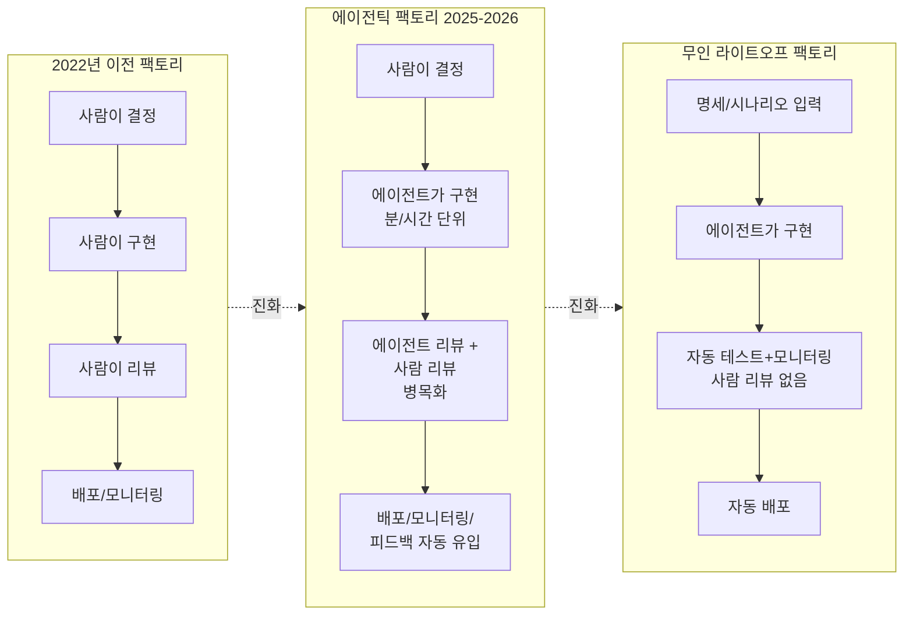
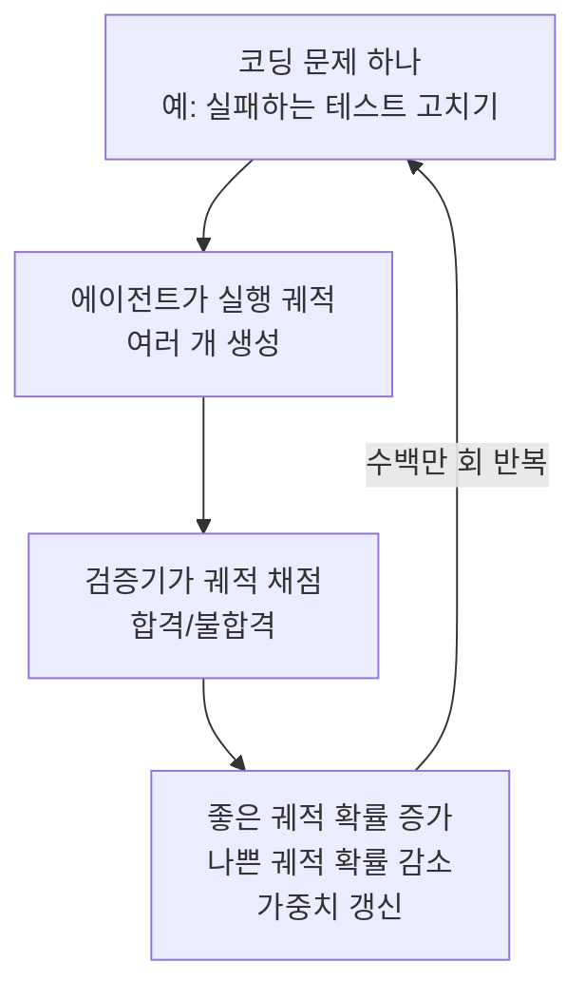
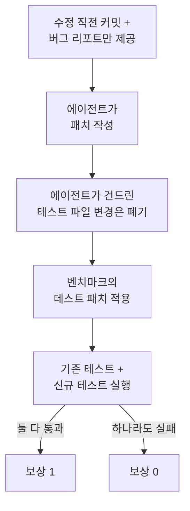
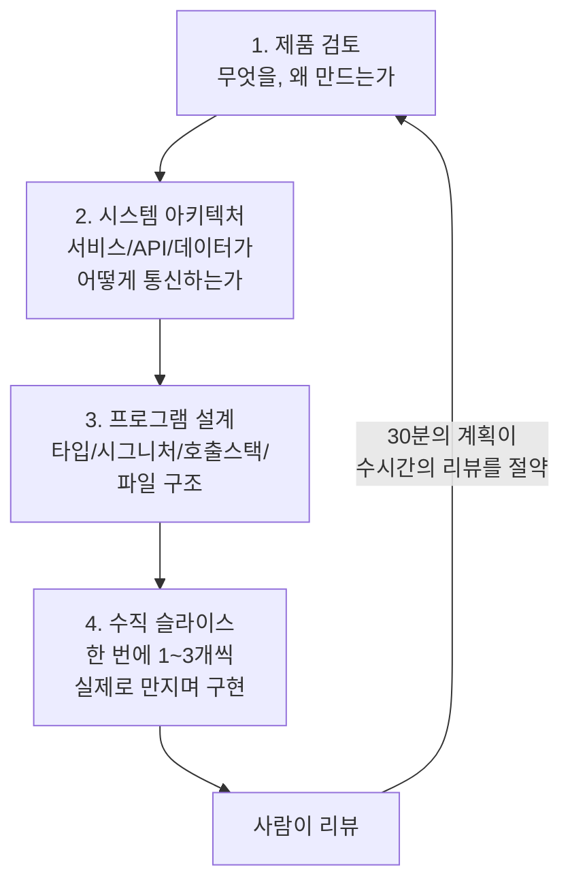

### — 하네스 엔지니어링만으로는 충분하지 않다

- **원문**: Dex Horthy (HumanLayer 공동창업자), *"Why Software Factories Fail (or: harness engineering is not enough)"*, GitHub, 2026년 7월 게시 [1]
- **배경**: AI Engineer World's Fair 2026 기조연설 *"Harness Engineering is not Enough: Why Software Factories Fail"* 을 글로 확장한 버전 [6]
- **국내 소개**: GeekNews, "소프트웨어 팩토리가 실패하는 이유: 하네스 엔지니어링만으로는 부족함" [2]

---

## 목차

0. [이 문서에 대하여](#0-이-문서에-대하여)
1. ["이제 루프만 더 쓰면 된다"는 서사와 그 균열](#1-이제-루프만-더-쓰면-된다는-서사와-그-균열)
2. [소프트웨어 팩토리의 역사: 1968년부터 2022년까지](#2-소프트웨어-팩토리의-역사-1968년부터-2022년까지)
3. [에이전틱 소프트웨어 팩토리의 부상](#3-에이전틱-소프트웨어-팩토리의-부상)
4. [무인(라이트-오프) 소프트웨어 팩토리와 StrongDM 사례](#4-무인라이트-오프-소프트웨어-팩토리와-strongdm-사례)
5. [HumanLayer의 7개월 무인 실험과 그 실패](#5-humanlayer의-7개월-무인-실험과-그-실패)
6. [모델은 왜 코드베이스 품질을 유지하지 못하는가](#6-모델은-왜-코드베이스-품질을-유지하지-못하는가)
7. [Claude Code의 성공과 "하네스 내부 강화학습"](#7-claude-code의-성공과-하네스-내부-강화학습)
8. [코딩 에이전트 강화학습의 구조와 한계: SWE-bench Multilingual 해부](#8-코딩-에이전트-강화학습의-구조와-한계-swe-bench-multilingual-해부)
9. [유지보수성을 평가하려는 새로운 시도들](#9-유지보수성을-평가하려는-새로운-시도들)
10. [다시 불을 켜다: 인간을 루프로 되돌리는 4단계](#10-다시-불을-켜다-인간을-루프로-되돌리는-4단계)
11. ["PR이 너무 많다"가 아니라 "나쁜 PR이 너무 많다"](#11-pr이-너무-많다가-아니라-나쁜-pr이-너무-많다)
12. [결론: 제약 안에서 2~3배 빠르게](#12-결론-제약-안에서-23배-빠르게)
13. [커뮤니티의 반응](#13-커뮤니티의-반응)
14. [참고문헌](#14-참고문헌)

---

## 0. 이 문서에 대하여

이 문서는 HumanLayer의 공동창업자 덱스 호시(Dex Horthy)가 2026년 7월에 발표한 장문의 에세이 "Why Software Factories Fail"을 한국어로 상세히 풀어 쓴 해설 자료다. 원문은 AI Engineer World's Fair 2026에서 발표한 기조연설 "Harness Engineering is not Enough"를 글로 옮기고 확장한 것으로, 저자는 자신이 인간-에이전트 협업 도구를 만드는 회사를 운영하고 있어 이 주제에 대해 편향된 시각을 가질 수 있음을 스스로 밝히고 글을 시작한다 [1].

핵심 주장은 단순하다. "사람이 코드를 읽지도 쓰지도 않는" 완전 자동화된 소프트웨어 생산 방식, 이른바 무인(라이트-오프) 소프트웨어 팩토리는 하네스를 아무리 정교하게 만들어도 근본적으로 작동하지 않는다는 것이다. 문제의 원인은 오케스트레이션이나 도구 설계 같은 공학적 디테일이 아니라, 코딩 모델을 훈련하는 강화학습(RL) 방식 자체에 있다는 것이 저자의 논증이다. 그는 이것을 하네스 엔지니어링으로는 해결할 수 없는 "모델 훈련 문제"라고 못박는다.

이 문서에서는 원문의 논증을 순서대로 따라가면서, 필요한 경우 웹 검색으로 확인한 최신 배경 정보(StrongDM의 실제 프로젝트 구조, Claude Code의 매출 추이 등)를 덧붙여 사실관계를 보강했다. 원문에 등장하는 도표나 사진 자료는 재현하지 않되, 개념을 이해하는 데 도움이 되는 부분은 다이어그램으로 다시 그려 넣었다.

---

## 1. "이제 루프만 더 쓰면 된다"는 서사와 그 균열

2026년 상반기 AI 업계에는 하나의 공통된 서사가 퍼져 있었다. 사람이 병목이고, 모델은 이미 충분히 좋으며, 코드를 생성하는 비용은 사실상 0에 가까우니 그냥 더 많이 만들어내면 된다는 것이다. 이 서사의 정점에는 보안 인프라 기업 StrongDM이 공개한 "무인 소프트웨어 팩토리"가 있었다. 이 팩토리에서는 사람이 코드를 쓰지도, 읽지도 않는다 [1][3].

OpenAI의 라이언 로포폴로(Ryan Lopopolo)도 2026년 2월 "하네스 엔지니어링"에 관한 글을 발표했고, 4월에는 OpenAI의 자체 소프트웨어 팩토리 "심포니(Symphony)"에 대해 발표했다 [1]. 저자는 이들이 모두 매우 뛰어난 사람들이라는 점을 인정하면서도, 이 모든 흐름을 가장 냉소적으로 보면 그저 벤처캐피털 자금을 더 끌어오기 위한 "슬롭 캐논(slop cannon)"의 새로운 명분에 불과할 수도 있다고 지적한다.

그러나 현실에서는 균열이 이미 드러나고 있었다. AI Engineer Europe 컨퍼런스에서 개발자 마리오(Mario)는 청중에게 속도를 늦추자고 호소했는데, 이는 코딩 에이전트의 실수로 발생해서는 안 될 기업들이 실제로 에이전트발 장애를 겪고 있었기 때문이다. 파이낸셜타임스는 아마존에서 코딩 에이전트 실수로 인한 장애 사례를 보도했다 [1]. 개발자 맷 포콕(Matt Pocock) 역시 코드베이스가 그 어느 때보다 빠르게 무너지고 있다고 언급했다.

StrongDM의 무인 팩토리가 실제로 얼마나 잘 작동했는지에 대한 확정적인 데이터는 원문 작성 시점(2026년 7월)까지 공개되지 않았다. StrongDM이 운영하는 "웨더 리포트(weather-report)" 페이지에는 2월부터 6월 사이 몇 개의 산발적인 업데이트만 있었을 뿐이었고, 저자는 글을 쓰는 도중 7월 23일 Hacker News에서 StrongDM 팀과의 대화가 있었다는 사실을 각주로 추가하며 조만간 더 공식적인 업데이트가 나올 수도 있다고 언급했다 [1].

이런 상황에서 소프트웨어 개발 인텔리전스 기업 Faros AI가 낸 보고서는 시사하는 바가 크다. 2025년 12월을 전후해 업계 전반이 AI 코딩 도구를 본격적으로 도입한 이후, 코드 리뷰의 질이 눈에 띄게 떨어졌다는 것이다 [1][4].

| 지표 | 변화 |
|---|---|
| PR당 리뷰 코멘트 수 | +25% |
| 리뷰 코멘트 평균 길이 | +22.7% |
| 리뷰 없이 병합되는 PR 비율 | +31.3% |
| PR당 인시던트 발생률 | +242.7% |
| 월간 인시던트 건수 | +57.9% |
| 개발자 1인당 버그 수 | +54% |

저자는 이 보고서가 확정적인 인과관계를 증명하는 자료라기보다는 상관관계 신호에 가깝다고 스스로 밝히면서도, 자신이 현장에서 체감한 방향성과는 일치한다고 덧붙인다. 즉 이 데이터를 "이것 봐라, 증명됐다"는 식으로 과신해서는 안 되지만, 무시할 수 있는 잡음으로 치부하기도 어렵다는 뜻이다.

이 지점에서 저자는 흔히 나오는 반론, 즉 "결과가 나쁜 건 프롬프트를 잘못 짜서다"라는 이야기를 정면으로 반박한다. 그는 자신이 코딩 에이전트를 다루는 방법에 대해 오랫동안 이야기해온 사람으로서 — 실제로 그가 만든 관련 영상 콘텐츠들은 누적 조회수 100만 회에 달한다 — 이것이 단순한 "숙련도 문제"가 아니라고 강조한다. 아무리 정교한 컨텍스트 엔지니어링과 하네스 설계를 동원해도 해결되지 않는 무언가가 있다는 것이 이 글 전체의 출발점이다.

---

## 2. 소프트웨어 팩토리의 역사: 1968년부터 2022년까지

저자는 "소프트웨어 팩토리"라는 용어가 생각보다 훨씬 오래된 개념임을 짚는다. 이 용어는 1968년 NATO 소프트웨어 엔지니어링 컨퍼런스까지 거슬러 올라간다. 흥미롭게도 "소프트웨어 엔지니어링"이라는 용어 자체도 바로 이 회의에서 처음 널리 쓰이기 시작했다 [1].

AI 도입 이전, 대략 2022년 시점의 전형적인 소프트웨어 팩토리는 다음과 같은 순환 구조로 작동했다. 먼저 엔지니어와 PM, 리더십이 무엇을 만들지 결정한다. 이 결정은 Linear나 Jira 같은 트래커에 등록되어 무엇이 이뤄져야 하는지를 관리하는 상태 기계 역할을 한다. 누군가가 티켓을 잡고 구현하며, 이 과정에서 수동 혹은 자동화된 테스트를 함께 수행한다. 이후 풀 리퀘스트가 올라가면 자동화된 검사와 사람의 코드 리뷰를 거치고, 문제가 있으면 다시 구현 단계로 돌아간다. 문제가 없으면 프로덕션에 배포되고 실제 사용자와 접촉하며, 이때부터 모니터링이 시작된다. 새벽 3시에 장애가 나면 엔지니어를 호출하는 페이징 시스템이 존재하는 이유도 바로 이 단계 때문이다. 사용자들은 불만을 제기하고 기능을 요청하며 버그를 신고하고, 이는 다시 트래커로 흘러 들어간다.

여기서 저자가 강조하는 핵심 개념은 "선행 정렬(front-loading alignment)"이다. 구현에도, 리뷰에도 각각 수시간에서 수일이 걸린다는 사실을 팀들은 이미 수십 년 전에 파악했다. 그래서 계획, 아키텍처 제안, 스프린트 계획 같은 작업을 팀 전체가 함께 미리 해두는 방식이 자리 잡았다. 이렇게 구현 전에 미리 정렬해두면 재작업이 줄어들고, 무엇보다 잘 준비된 풀 리퀘스트는 모든 줄을 다 읽더라도 리뷰가 훨씬 빠르게 끝난다. 이 "선행 정렬"이라는 개념은 이후 저자가 제안하는 해법의 뼈대가 된다.

---

## 3. 에이전틱 소프트웨어 팩토리의 부상

2026년 들어 Ramp, Stripe, WorkOS, Brex 같은 기업들은 저마다 자사의 "에이전트 팩토리"가 전체 코드의 약 75%를 출하하고 있다고 소개했다 [1]. 이 수치는 저자만의 주장이 아니라 실제로 여러 매체가 인용하는 수준까지 확산된 이야기다. HumanLayer CEO로서의 저자의 발언을 다룬 별도 보도에서도, 2026년 중반 기준 많은 기업이 이미 신규 코드의 약 75%를 에이전틱 소프트웨어 팩토리를 통해 출하하고 있었다는 점이 재확인된다 [7].

에이전틱 팩토리는 기존 팩토리 구조에서 "사람이 만든다"를 "에이전트가 만든다"로 바꾼 것에 가깝다. 여기에 오케스트레이션, 하네스, 샌드박스, 모델, 컴퓨터 사용 같은 요소들이 결합된다. 이 변화가 가져오는 가장 직접적인 효과는 구현 시간이 수시간·수일에서 수분·수시간으로 줄어드는 것이다.

문제는 리뷰다. 구현은 빨라졌지만 사람이 코드를 읽고 테스트하는 과정은 그대로다. 따라서 리뷰가 새로운 병목이 된다. 이를 해소하기 위해 기업들은 에이전틱 코드 리뷰(스타일, 버그, 보안을 검사하는 에이전트)와 에이전틱 회귀 테스트(브라우저와 컴퓨터 사용으로 외부에서 동작을 직접 찔러보고 확인하는 방식)를 도입한다. 여기서 그치지 않고, 새벽에 장애가 나면 담당자를 호출하는 대신 이미 수정 후보 PR이 준비되어 있는 흐름으로, 그리고 사용자 피드백이 곧바로 작업 큐로 연결되는 흐름으로 확장한다.

이 지점에 이르면 팀이 답해야 할 질문은 두 가지로 압축된다. 작업 큐에 얼마나 많은 일을 채울 수 있는가, 그리고 결과물을 얼마나 빨리 검토하고 테스트할 수 있는가. 이 두 질문의 답을 계속 밀어붙이면 자연스럽게 다음 단계, 즉 무인 팩토리로 이어진다.

다음 다이어그램은 이 진화 과정을 요약한 것이다.

---

## 4. 무인(라이트-오프) 소프트웨어 팩토리와 StrongDM 사례

무인 소프트웨어 팩토리라는 용어는 댄 샤피로(Dan Shapiro)가 만들었고, 사이먼 윌리슨(Simon Willison)은 StrongDM의 구현 사례를 상세히 다뤘다 [1][17]. 이 방식에서는 사람이 모든 변경 사항을 읽는 코드 리뷰 단계 자체를 없애버린다. 대신 투자를 다른 곳으로 옮긴다. 에이전트가 스스로 자신의 작업을 테스트하도록 만들고, 샌드박스와 오케스트레이션에 투자하며, 자동화된 리뷰와 모니터링, 점진적인 롤아웃, 그리고 사용자로부터의 피드백 신호 수집에 투자한다. 이렇게 되면 남는 질문은 단 하나, 얼마나 많은 일을 에이전트에게 요청할 것인가뿐이다.

이 흐름을 실제로 실행에 옮긴 대표 사례가 인프라 보안 기업 StrongDM이다. 원문에는 StrongDM의 구체적인 기술 스택까지는 자세히 다뤄지지 않지만, 별도로 확인한 자료에 따르면 다음과 같은 배경이 있다 [8][9][10].

StrongDM의 AI 전담팀은 2025년 7월 "직접 손으로 짠 소프트웨어는 없다(no hand-coded software)"는 원칙 아래 출범했다. 이 팀이 만든 핵심 결과물 중 하나는 "Attractor"라는 프로젝트로, 흥미롭게도 이 저장소에는 실제 코드가 단 한 줄도 들어 있지 않고 소프트웨어의 전체 명세를 극도로 상세하게 기술한 마크다운 파일 세 개만 존재한다 [10]. 실행 가능한 코드는 이 명세를 읽은 코딩 에이전트가 그때그때 생성한다는 개념이다. 또 다른 핵심 결과물인 "CXDB"는 에이전트의 대화 기록과 도구 실행 결과를 불변(immutable) DAG 구조로 저장하는 "AI 컨텍스트 저장소"로, 이쪽은 1만 6천 줄의 Rust, 9천5백 줄의 Go, 6천7백 줄의 TypeScript로 구성된 실제 소프트웨어다 [10].

StrongDM은 또한 "디지털 트윈 유니버스(Digital Twin Universe)"라는 개념을 도입했는데, 이는 실제 서드파티 서비스마다 속도 제한이나 비용, 위험 문제 없이 대규모로 시나리오를 검증할 수 있도록 각 의존성의 행동을 충실히 재현한 모사(clone) 환경을 구축한 것이다 [16]. 이 팩토리 관련 에세이는 2026년 2월 Hacker News에서 큰 반향을 일으켰고(300점 이상, 400개가 넘는 댓글), 반응은 극명하게 갈렸다. 일부는 "지금껏 본 것 중 가장 야심 찬 팀"이라며 감탄했고, 다른 일부는 "이게 천재적인 건지 무서운 건지 모르겠다"는 반응을 보였다 [9].

한편 StrongDM 자체는 2026년 1월 사이버보안 기업 델리네아(Delinea)에 인수 절차가 발표되었고, 3월 5일 인수가 완료되었다. 이는 이 무인 팩토리 실험의 장기적 독립성이 새로운 소유 구조 아래 놓이게 되었음을 의미한다 [9]. Attractor 프로젝트는 아파치 2.0 라이선스로 오픈소스 공개되었으며, 2026년 6월 기준 깃허브에서 약 1,200개의 스타를 받았다 [9].

이처럼 StrongDM 사례는 화제성만큼이나 논쟁적이었고, 원문 저자가 정확히 지적하듯 "정말로 잘 작동하고 있는가"에 대한 확정적이고 지속적인 성과 데이터는 아직 충분히 공개되지 않은 상태다.

---

## 5. HumanLayer의 7개월 무인 실험과 그 실패

원문에서 가장 개인적이고 생생한 부분은 저자 자신의 팀이 직접 겪은 실패 경험이다. HumanLayer 팀은 2025년 7월부터 완전한 무인 방식을 시도했다. 명세와 티켓만 읽고, 크고 작은 모든 작업을 백그라운드 에이전트에게 맡기는 방식이었다.

이 실험을 몇 달간 진지하게 시도해본 사람이라면 결말을 이미 짐작할 수 있다고 저자는 말한다. 언젠가는 에이전트가 도저히 풀지 못하는, 가장 정교한 프롬프팅과 워크플로를 동원해도 풀리지 않는 문제가 반드시 나타난다는 것이다. 팀은 문제와 관련된 맥락을 최대한 깊이 있게 수집해 모델이 분석할 수 있는 "스마트 존"에 밀어 넣었고, 에이전트에게 열 가지가 넘는 다른 방식으로 문제를 재현해보도록 시도했다. 그러나 결국에는 석 달 동안 단 한 줄도 읽지 않았던 코드베이스에 직접 들어가 무엇이 고장 났는지 파헤쳐야 하는 상황에 몰렸다.

그 동안 사이트는 다운되었고, 사용자들은 화가 났으며, 저자 스스로도 비참한 기분으로 그동안 시스템에 스며든 슬롭(slop, 저품질 코드) 더미를 읽어야 했다고 회고한다. 처음 이런 일이 벌어졌을 때는 "속도를 얻는 대가로 이 정도 리스크는 감수할 만하다"며 넘어갔다. 하지만 11월 무렵 대략 세 번째로 비슷한 사고가 반복되자, 팀은 차라리 처음부터 다시 작성하는 편이 낫�다고 판단했다. 저자의 공동창업자는 커서(Cursor)조차 쓰지 않고 VS Code에서 꼬박 2주를 들여 코드베이스에 흩어져 있던 패턴들을 손수 다시 정리해냈다.

이 경험은 이후 애디 오스마니(Addy Osmani)가 별도로 요약한 글에서도 다뤄졌는데, 여기서는 이 실패의 근본 원인을 "토큰 활용 극대화"와 "그 순간 인간 참여자가 시스템을 이해하고 있는 정도"라는 두 개의 상충하는 지표 사이의 트레이드오프로 설명한다. 무인 팩토리는 테스트가 초록불을 유지하는 동안 조용히 깨끗한 코드를 갉아먹는 데 매우 능하며, 그 최종 청구서는 어느 날 극적으로 "다 무너졌다"는 형태로 오는 것이 아니라 조용하고 늦게, 그러나 확실하게 찾아온다는 것이다 [6].

---

## 6. 모델은 왜 코드베이스 품질을 유지하지 못하는가

이제 원문의 핵심 논증으로 들어간다. 저자가 짚는 문제의 본질은 모델들이 "유지보수성(maintainability)"을 시간이 지나도 스스로 지키거나 개선하지 못한다는 데 있다. 여기서 유지보수성이란, 코드베이스의 한 부분을 바꾸려 할 때 다른 부분까지 함께 깨지는 상황을 얼마나 피할 수 있는가를 뜻한다. 이런 현상은 마틴 파울러(Martin Fowler)가 정의한 "샷건 서저리(shotgun surgery)"라는 코드 냄새(code smell) 개념과 정확히 일치한다. 즉 한 가지 개념을 바꾸기 위해 여러 파일에 흩어진 코드를 동시에 고쳐야 하는 상태다.

저자는 "그래도 최신 모델은 훨씬 좋아지지 않았느냐"는 당연한 반론을 예상하고 이를 미리 다룬다. 그의 답은 "차원에 따라 다르다"는 것이다. 한 번에 끝나는 문제 해결이나 새 마케팅 사이트를 처음부터 만드는 작업에서는 모델이 확실히 훨씬 좋아졌다. 하지만 시간이 지남에 따라 코드베이스의 품질을 개선하는 능력은 크게 나아졌다고 보기 어렵다는 것이 저자의 관찰이다. 그는 이를 증명할 수도, 반증할 수도 없다고 솔직히 인정한다. 왜냐하면 모델이 코드베이스 품질을 유지하는 능력을 측정하는 좋은 벤치마크 자체가 아직 존재하지 않기 때문이다. 이 문장은 원문에서 별도로 강조되어 인용될 만큼 핵심적인 주장이다.

이 문제를 이해하기 위해 저자는 첫 번째 위대한 코딩 에이전트, 즉 Claude Code의 성공 이유로 논의를 옮겨간다.

---

## 7. Claude Code의 성공과 "하네스 내부 강화학습"

Claude Code는 채 1년이 되지 않는 기간 동안 매출이 사실상 0에서 수십억 달러 규모로 성장했다. 원문에서는 이를 "약 40억 달러에서 이제는 약 90억 달러 수준"이라고 언급하는데, 실제로 공개된 수치들을 종합해 보면 이 흐름은 대체로 사실과 부합한다. Anthropic이 2026년 2월 시리즈 G를 발표할 당시 Claude Code는 25억 달러 수준의 연환산 매출(run-rate revenue)을 기록하고 있었고 [11][22], 이후 2026년 5월 무렵에는 약 80억 달러 수준까지 성장한 것으로 여러 매체가 추산했다 [29][30]. Anthropic 전체 매출 역시 2025년 말 약 90억 달러 수준에서 2026년 들어 폭발적으로 성장해 5월경 300억 달러를 돌파했다고 회사 스스로 밝혔다 [11][23]. 이런 흐름을 고려하면 저자가 언급한 "이제는 약 90억 달러"라는 수치는 Claude Code 단일 제품이 아니라 Anthropic 전체 또는 그와 유사한 규모 지표를 가리키는 것으로 보이며, 정확한 최신 공식 수치는 Anthropic이 직접 공개하는 자료를 통해 확인하는 것이 가장 정확하다.

| 시점 | Claude Code 연환산 매출(추정) |
|---|---|
| 2025년 11월 (출시 6개월 후) | 약 10억 달러 |
| 2026년 2월 | 약 25억 달러 |
| 2026년 5월 | 약 80억 달러 |

숫자 자체보다 저자가 주목하는 것은 "왜 이렇게 성장했는가"라는 질문이다. Claude Code가 등장하기 전에도 aider, cline, codebuff 같은 뛰어난 CLI 코딩 에이전트들이 이미 존재했다. 이들 모두 훌륭한 컨텍스트 엔지니어링을 갖추고 있었고, 읽기·쓰기·편집·검색·셸 실행 같은 Claude Code와 유사한 도구 집합을 제공했다. 저자 스스로도 이 도구들을 직접 사용해봤다고 말한다. 문제는 도구 호출이 종종 실패했다는 점이었다. 같은 편집을 세 번이나 반복해서 실패하는 에이전트를 지켜보다가 결국 직접 에디터를 열어 고쳐야 하는 경험이 흔했다.

2024년에 발표된 SWE-Agent 논문은 도구의 형태를 아주 조금만 바꿔도 에이전트의 행동에 눈에 띄는 차이가 생긴다는 점을 보여줬다. 예컨대 파일을 읽는 도구의 결과에 줄 번호를 포함시키거나, 편집 도구를 "찾아 바꾸기" 방식에서 "줄 범위 지정 편집" 방식으로 바꾸는 것만으로도 성능이 달라졌다 [1][13].

이후 Claude Code가 등장하면서 성장 곡선이 거의 수직으로 꺾였다. 이를 단순히 배급망(distribution)의 차이로 설명할 수도 있지만, 업계에서 널리 받아들여지는 설명은 다르다. Anthropic이 실제로 출시할 하네스 안에서, 즉 정확히 그 도구 집합을 놓고 모델 자체를 강화학습시킨 것이 최초의 사례였다는 것이다. 그 결과 모델은 그 도구들을 에이전틱 루프 안에서 호출하는 데 매우 능숙해졌다.

이 지점에서 저자는 중요한 구분을 짓는다. 도구 정의와 평가를 이리저리 조정해서 모델이 가장 좋아하는 형태를 찾아내는 것과, 아예 가중치를 소유하고 모델 자체를 특정 도구 집합에 맞게 바꿔버리는 것은 전혀 다른 차원의 게임이라는 것이다. OpenAI 팀도 2025년 11월 발표에서 이 점을 정확히 짚었다. 하네스는 만들었지만 가중치를 소유하지 못해 그 안에서 모델을 강화학습시킬 수 없는 팀은, 하네스와 가중치를 모두 가진 팀에 비해 언제나 불리한 위치에 놓인다는 것이다 [1].

---

## 8. 코딩 에이전트 강화학습의 구조와 한계: SWE-bench Multilingual 해부

그렇다면 코딩 모델을 더 잘 만드는 강화학습은 구체적으로 어떻게 이뤄질까. 저자는 Segment 창업자이자 Codex 팀에서 일했던 캘빈 프렌치-오웬(Calvin French-Owen)의 설명을 인용하며 이 과정을 세 단계로 요약한다. 먼저 특정 문제(예: 실패하는 테스트 고치기)를 풀기 위한 코딩 에이전트의 실행 궤적(trace)을 여러 개 생성한다. 이후 검증기(verifier)를 통해 이 궤적들을 채점한다. 마지막으로 좋은 궤적이 나올 확률은 높이고 나쁜 궤적이 나올 확률은 낮추는 방향으로 모델 가중치를 갱신한다. 이 과정을 수백만 번, 몇 주에서 몇 달에 걸쳐 반복한다 [1].

문제는 이 "채점" 부분이 종종 놀라울 정도로 일차원적이라는 데 있다. 저자는 이를 SWE-bench Multilingual이라는 실제 벤치마크를 예시로 들어 구체적으로 해부한다. 이 벤치마크의 과제들은 Redis, jq, Django 같은 실제 오픈소스 저장소에서 가져온 것으로, 하나당 대략 15분 정도의 작업량에 해당한다. 채점은 0 또는 1의 이진 보상으로 이뤄지는데, 기준은 두 가지다. 요청받은 버그를 실제로 고쳤는가(FAIL_TO_PASS), 그리고 그 과정에서 다른 무언가를 망가뜨리지 않았는가(PASS_TO_PASS)다 [1].

저자가 예로 든 실제 과제는 Ruby 프로젝트 fastlane의 이슈로, zip 액션이 선택적 매개변수인 include와 exclude를 받자마자 곧바로 `.empty?`를 호출하는 바람에, 이 값들을 아예 지정하지 않으면 `undefined method 'empty?' for nil:NilClass`라는 오류로 죽어버리는 버그였다. 실제 사람이 작성한 수정은 두 줄짜리로, nil 값을 빈 배열로 기본 설정하는 것이었다 [1].

평가 과정은 다음과 같이 진행된다. 모델은 수정 직전 시점의 커밋과 버그 리포트만 받고, 정답 패치나 채점에 쓰일 테스트 패치는 보지 못한다. 에이전트가 패치를 작성하면, 시스템은 먼저 그 패치는 남겨두되 에이전트가 테스트 파일에 가한 변경은 모두 버린다. 이는 모델이 실패하는 테스트를 조용히 주석 처리하거나, 테스트를 무력화하는 가짜 모킹(mock)을 끼워 넣어 "통과"를 위장하는 경우를 실제로 목격했기 때문이다. 그런 다음 벤치마크가 미리 준비해둔 테스트 패치를 위에 적용하고, 기존 테스트(PASS_TO_PASS)와 새로운 테스트(FAIL_TO_PASS)를 함께 실행해 둘 다 통과하는지 확인한다 [1].

여기서 저자가 강조하는 결정적 지점은 이것이다. 모델이 어떤 경로로 정답에 도달했는지는 전혀 채점에 반영되지 않는다. 테스트만 통과하면 이기는 것이고, 코드베이스의 유지보수성을 얼마나 훼손했는지에 대해서는 어떤 벌점도 없다. 저자는 이 문장을 원문에서 별도로 강조한다: "설계 악화에는 벌점이 없다." 이것이 바로 모든 곳을 무분별하게 try/catch로 감싸는 코드나, 타입 시스템의 존재 의의를 무너뜨리는 느슨한 타입 캐스팅이 실전에서 계속 나타나는 이유라는 것이다 [1].

이어서 저자는 왜 품질 검증이 "테스트 통과 여부 확인"보다 몇 자릿수는 더 어려운 문제인지를 짚는다. 테스트는 몇 초 안에 명확한 통과/실패 신호를 준다. 그래서 강화학습은 각 모델 세대를 최적화하기 위해 수백만 번의 루프를 돌릴 수 있다. 반면 나쁜 아키텍처가 초래하는 비용은 몇 주, 몇 달, 심지어 몇 년 뒤에야 드러난다. 누군가 한 줄만 고치면 될 줄 알았던 파일을 열었다가, 사실은 같은 변경을 열한 군데에 똑같이 적용해야 하고 그러면서도 세 파일 건너 어딘가가 조용히 깨지지 않기를 바라야 하는 상황을 처음 마주하는 순간 그 비용이 청구된다. 저자는 이를 "테스트는 몇 초 안에 피드백을 주지만, 나쁜 아키텍처의 비용 함수는 몇 주에서 몇 년 단위로 측정된다"는 문장으로 요약한다 [1].

강화학습과 벤치마크는 엄밀히 같은 것이 아니라는 점을 저자도 인정한다. 그러나 만약 유지보수성 문제가 강화학습 안에서 이미 해결되었다면, 그 능력은 벤치마크 설계 방식에도 자연스럽게 반영되기 시작했을 것이라는 게 저자의 논리다. 따라서 현재 벤치마크에서의 점수 향상을 두고, 모델이 갑자기 코드베이스를 어지럽히지 않게 되었다는 증거로 받아들여서는 안 된다는 것이 이 장의 결론이다.

---

## 9. 유지보수성을 평가하려는 새로운 시도들

물론 이 문제를 인식하고 개선하려는 시도가 없는 것은 아니다. 저자는 자신의 요점이 "절대 해결할 수 없다"는 것이 아니라 "기대와 홍보가 실제 기술적 엄밀함을 앞지르고 있다"는 것임을 분명히 한다. 그가 방향이 옳다고 평가하는 시도는 세 가지다 [1].

첫째는 Abundant AI의 SWE-Marathon이다. 엑셀의 모든 기능을 복제하는 것과 같은, 약 400시간 규모의 초대형 과제를 다루며, 단순한 합격/불합격 비트 하나가 아니라 복합적인 보상 채널을 사용한다.

둘째는 Datacurve의 DeepSWE다. 실제로는 한 번도 구현된 적 없는 대규모 오픈소스 과제들을 사용함으로써, 적어도 모델이 이미 정답을 학습 데이터에서 봤을 가능성(오염, contamination)은 원천적으로 차단한다. 다만 저자는 이 방식이 오염 문제는 해결하지만 품질 문제 자체를 해결하지는 못한다고 명확히 선을 긋는다.

셋째는 Cognition의 Frontier Code다. 여러 개의 PR에 걸친 작업을 평가하며, 특히 영리한 장치를 하나 갖고 있다. 모델이 작성한 테스트가 패치를 적용하기 전 코드에서도 실패하지 않는다면 벌점을 준다는 것이다. 이는 뮤테이션 테스팅(mutation testing)과 유사한 발상으로, 테스트가 실제로 뭔가를 검증하고 있는지 아니면 형식적으로만 존재하는지를 결정론적으로 가려낸다. 여기에 더해 코드 품질 규칙에 따라 변경 내용을 검사하는 별도의 판정 모델(judge model)도 함께 실행한다.

그러나 저자는 판정 모델을 이용한 접근에도 근본적인 한계가 있다고 지적한다. 만약 어떤 모델이 좋은 코드와 나쁜 코드를 안정적으로 구별할 수 있다면, 애초에 그 모델이 좋은 버전을 직접 작성했을 가능성이 높다는 것이다. 강화학습에는 빠르고 신뢰할 수 있는 오라클(정답 판정자)이 필요한데, 유지보수성에 대해서는 아직 그런 오라클이 존재하지 않는다. 저자는 이 문장 역시 별도로 강조한다: "만약 모델이 좋은 코드와 나쁜 코드를 안정적으로 구분할 수 있다면, 애초에 처음부터 좋은 버전을 작성했을 것이다. 그러나 유지보수성에는 빠른 오라클이 없기 때문에 강화학습 과정에서 이를 보상할 수 없다."

더 많은 리뷰 에이전트와 더 많은 토큰을 투입하는 것이 전혀 무의미하지는 않다. 이런 노력은 명백한 실수를 잡아내면서 결과물의 하한선(floor)을 끌어올린다. 하지만 상한선(ceiling)은 그대로다. 상한선은 결국 강화학습 단계에서 모델에게 무엇을 가르쳤는지에 의해 결정되는데, 좋은 설계라는 것은 우리가 아직 모델에게 가르치는 방법을 모르는 바로 그 대상이기 때문이다.

---

## 10. 다시 불을 켜다: 인간을 루프로 되돌리는 4단계

지금 시점에서 코드 품질을 판정할 수 있는 유일하게 신뢰할 만한 주체는 여전히 사람이다. 따라서 저자의 결론은 명확하다. 코드 리뷰를 다시 켜야 한다는 것이다. 다만 무작정 모든 코드를 사람이 처음부터 끝까지 다시 읽으라는 뜻은 아니다. 저자가 제안하는 방식은 AI 이전부터 팀들이 해오던 "선행 정렬"의 원리를 그대로 가져와, 길고 고통스러운 리뷰가 발생할 확률 자체를 줄이는 것이다. 이를 위해 저자는 AI의 레버리지를 활용할 수 있는 네 단계를 제시한다: 제품 요구사항(Product Requirements), 시스템 아키텍처(System Architecture), 프로그램 설계(Program Design), 그리고 수직 슬라이스(Vertical Slices)다 [1].

### 1단계: 제품 검토

모든 작업은 짧은 문장이나 긴 음성 메모를 반구조화된 문서로 바꾸는 데서 시작한다. 이 문서는 무엇을, 왜 만드는지를 고정하는 역할을 한다. 가장 먼저 정렬해야 할 것은 실제 사용자의 언어로 표현된 "풀어야 할 문제"이며, 두 번째는 "성공의 정의"다. 이상적으로는 배포 후에 확인할 수 있는 사용자 관점의 결과, 예컨대 "특정 워크플로를 더 짧은 시간에 완료할 수 있다"거나 "특정 온보딩 이정표에 더 일찍 도달한다" 같은 형태다. 때로는 오류율이나 지연 시간처럼 더 낮은 수준의 지표일 수도 있고, 단순히 "특정 문의 티켓이 더 이상 들어오지 않는다"는 정도일 수도 있다.

이 단계는 최대한 제품의 언어에 머무르고 기술적인 세부사항으로 빠지지 않는 것이 원칙이다. 저자 스스로도 제품과 기술 양쪽에 발을 걸치고 있다 보니 자꾸 기술적인 디테일로 새는 경향이 있다고 고백하는데, 그럴 때는 일단 메모만 남겨두고 이후 단계로 넘긴다. 만약 기술적 결정이 제품 결정을 가로막는 상황이라면, 지금까지의 내용을 그대로 두고 아키텍처 검토나 실현 가능성 프로토타입 작업으로 넘어간다.

사용자가 실제로 보게 될 화면은 긴 설명보다 거친 HTML 목업으로 확인하는 편이 논쟁을 훨씬 빨리 정리해준다는 것이 저자의 경험이다. 다만 모든 작업에 이 단계가 필요한 것은 아니다. 문구를 살짝 바꾸는 작업, 일회성 스크립트, 재현 방법이 명확한 버그처럼 에이전트가 의도를 오해했을 때 손실이 크지 않은 작업은 곧바로 에이전트에게 맡긴다. 제품 검토는 오해의 비용이 클 때만 적용하는 것이다.

이 단계에서 저자의 팀이 실천하는 습관 하나는 "저자 선택형(author-opt-in) 리뷰"다. 리뷰 시간을 절약하고 싶다면, 실제로 그 풀 리퀘스트를 리뷰할 사람을 미리 지목해서 제품/기술 명세를 그 사람과 함께 검토해두라는 것이다. 이는 비동기 문서 댓글로도, 깃허브나 노션 같은 도구로도 얼마든지 할 수 있다.

### 2단계: 시스템 아키텍처

제품 검토가 끝나면 시스템 아키텍처 단계로 넘어간다. 이 단계는 서비스, 엔드포인트, 스키마, 큐, 저장소가 서로 어떻게 통신하는지를 정렬하는 것이며, 아직 프로그램 내부의 세부 구현까지는 들어가지 않는다. 사람과 에이전트 사이의 소통 대역폭을 최대화하기 위해 이 단계에서는 시각적 표현을 적극적으로 활용한다. 시퀀스 다이어그램으로 요청과 응답의 흐름을 표현하거나, API 계약의 요청/응답 형태를 텍스트로 명시하거나, 새로 필요한 테이블과 쿼리 형태를 SQL로 스케치하는 식이다.

머메이드(Mermaid) 다이어그램은 이 단계에서 유용하지만, 과도하게 사용하면 실제로는 합의되지 않은 것을 이미 합의된 것처럼 착각하게 만드는 함정이 있다고 저자는 경고한다. 아키텍처 검토는 모델이 저지르기 쉬운 나쁜 습관들을 초기에 차단하는 데는 상당히 효과적이지만, 그 자체만으로는 높은 품질의 코드를 보장하기에 충분하지 않다. 이를 위해 다음 단계, 프로그램 설계가 필요하다.

### 3단계: 프로그램 설계

저자가 "에이전틱 코딩에서 심각하게 저평가되고 있다"고 표현하는 단계가 바로 이 프로그램 설계다. 많은 사람들이 아키텍처만 제대로 잡히면 모델이 알아서 잘 구현할 것이라고 가정하지만, 실제로 그렇게 진행하면 실망스러운 결과를 받을 가능성이 높다는 것이 저자의 경험이다.

실제로 효과가 있었던 방식은, 사람이든 에이전트든 구현에 들어가기 전에 아키텍처보다 한 단계 더 내려가 "코드의 형태" 자체를 미리 정하는 것이다. 여기에는 타입, 메서드 시그니처, 프로그램의 레이아웃, 호출 스택이 포함된다. 저자의 팀이 처음 만든 프로그램 설계 스킬은 읽기 힘들고 지치는 결과물이었다고 한다. 머메이드도 시도했지만, 결국 가장 효과적이었던 것은 가벼운 의사코드(pseudocode) 형태의 시각화였다.

구체적으로는 세 가지 표현을 활용한다. 오케스트레이션이나 제어 흐름이 바뀌는 부분에는 호출 스택 트리를 diff 문법으로 표현해 무엇이 새로 추가되고 무엇이 제거되는지 한눈에 보이게 한다. 코드베이스의 레이아웃을 놓치지 않기 위해 파일 트리 diff를 함께 사용해 새로 생기는 파일과 수정되는 파일, 그리고 각각의 역할을 표시한다. 그리고 아키텍처 문서에 넣기에는 너무 내부적이지만 에이전트가 잘못 판단할 여지가 있는 핵심 함수들에 대해서는 타입과 메서드 시그니처를 미리 정해둔다.

이 세 가지 표현 모두 만드는 데 오랜 시간이 걸리지 않는다. 대체로 모델이 초안을 만들고 사람이 그것을 두고 논쟁하는 방식으로 진행되며, 이렇게 정리해두는 모든 결정 하나하나는 원래 같으면 코드 리뷰 도중에야 암묵적으로 내려졌을 결정을, 가장 비용이 적게 드는 시점으로 앞당기는 효과를 낸다.

### 4단계: 수직 슬라이스

마지막은 저자가 "수직 슬라이스(vertical slices)" 또는 "트레이서 불릿(tracer bullets)"이라 부르는 단계다. 모델들은 대체로 데이터베이스 마이그레이션, 서비스 레이어, API, 프론트엔드 순서로 스택을 따라 층층이 쌓아 올리는 "수평적 계획"을 선호한다. 그러나 이 방식으로는 작업이 진행되는 도중에 실제로 무언가를 만져보며 확인할 방법이 거의 없다.

저자는 AI 이전에 자신이 코드를 짜던 방식을 돌아본다. 그는 늘 중간에서 시작해 바깥쪽으로 확장해나갔다. 먼저 API 계약을 만들고 목(mock) 데이터를 응답하게 해서 curl로 확인한다. 그 다음 프론트엔드가 그 목 데이터를 소비하도록 만들고 브라우저에서 다듬는다. 이어서 API를 서비스 레이어에 연결하고(이때도 서비스는 여전히 목 데이터를 반환한다), 데이터베이스 마이그레이션을 추가해 서비스와 데이터베이스를 연결한다. 그런 다음 비즈니스 로직을 채우고, 마지막으로 에러 처리를 추가한다. 이 모든 단계마다 실제로 무언가를 테스트하고 다듬는 과정이 함께 있었다.

AI 이전에는 2천 줄, 심지어 500줄의 코드조차 중간에 아무것도 확인하지 않고 한 번에 작성하는 일이 드물었다. 저자가 코드베이스의 특정 부분에 대해 모델의 실력을 의심하거나 그 부분을 특히 신경 쓴다면, 각 단계마다 코드를 직접 리뷰하기도 한다. 100~200줄 단위로 점검하고 방향을 다시 잡는 것이 2천 줄이 넘는 코드를 뒤늦게 붙잡고 무엇이 잘못됐는지 찾는 것보다 훨씬 저렴하기 때문이다.

대부분의 최신 프런티어 모델도 사람의 조정 없이는 이런 식의 계획을 스스로 세우지 않으며, 코드베이스나 작업 종류에 따라 일반화하기도 어렵다. 그래서 저자는 이 부분만큼은 계속 사람이 루프 안에 남아 있는 편을 택한다고 말한다. 만약 이 "생각하는 일" 자체를 외주로 넘길 수 있었다면 진작 그렇게 했을 것이라고 덧붙인다.

### 작업 크기에 따른 적용 방식

물론 저자의 팀도 모든 작업에 이 네 단계를 전부 거치지는 않는다. 대략적인 분포를 밝히자면, 전체 작업의 약 40% 정도는 한 번에 처리하거나 가벼운 피드백 한두 번으로 끝난다. 중간 규모 작업은 제품/시스템 설계를 하나의 계획 문서로 합치고 단계를 세세하게 나누지 않는다. 큰 작업만 네 단계를 모두 거치되, 대규모 리팩터링처럼 애초에 "제품"의 개념이 성립하지 않는 작업에서는 제품 검토 단계를 건너뛴다. 대부분의 경우 저자는 모델에게 한 번에 한두 개에서 세 개 정도의 슬라이스만 맡기고, 그 진행 상황을 계속 리뷰한다. 이는 초반에 방향을 다시 잡는 것이, 2천 줄이 넘는 코드가 이미 만들어진 뒤 어디가 잘못됐는지 알 수 없는 상태에서 헤매는 것보다 훨씬 쉽기 때문이다.

---

## 11. "PR이 너무 많다"가 아니라 "나쁜 PR이 너무 많다"

저자는 흔히 나오는 불평, "리뷰해야 할 풀 리퀘스트가 너무 많다"는 말을 정면으로 반박한다. 문제는 PR의 개수가 아니라 PR의 질이라는 것이다.

AI 이전에도 재작업이 필요한 PR은 늘 있었다. 하지만 잘 만들어진 PR을 리뷰하는 것은 오히려 즐거운 일이다. 파일 하나하나를 넘겨볼 때 코드는 깔끔하고, 팀이 그동안 힘들게 합의해온 결정과 원칙을 그대로 따르고 있기 때문이다.

반면 어떤 풀 리퀘스트가 20%만 재작업이 필요해도 — 그리고 저자는 대부분의 AI 원샷 PR이 실제로는 50%에 가까운 재작업을 필요로 한다고 지적한다 — 이는 제출자와 리뷰어 양쪽 모두에게 지적인 부담이자 감정적인 부담이 된다. 설령 제출자가 AI라 하더라도, 누군가는 그 작업을 시작했거나 AI의 결과물을 다듬었거나, 적어도 그 결과에 신경을 쓰고 있는 사람이 있기 마련이다. 즉 "AI가 만들었으니 재작업 비용이 없다"는 생각은 착각이라는 것이다.

---

## 12. 결론: 제약 안에서 2~3배 빠르게

저자는 이 글 전체가 결국 하나의 "제약 이론(theory of constraints)"에 관한 것이라고 정리한다. "사람이 코드를 읽지 않아도 되는 세상"이 오면 좋겠다는 기대를 품었던 것은 저자도 마찬가지였다고 솔직히 인정한다. 하지만 지금까지 살펴본 것은 결국 제약들의 목록이다. 모델은 어떤 일에는 뛰어나고 어떤 일에는 그렇지 않다. 이 제약을 감안했을 때 개발 프로세스를 어떻게 최적화할 것인가가 남은 질문이다.

저자는 10배에서 100배의 속도를 향해 무리하게 달려가면서 코드 품질이 더 이상 중요하지 않다고 스스로를 설득하려 애쓰기보다는, 차라리 이 제약을 있는 그대로 받아들이고 2~3배 정도의 속도를 안전하게 얻는 편이 더 현실적일 수 있다고 말한다. 저자가 제시하는 마무리 조언은 네 가지로 요약된다. 모델과 충분히 오래 작업하며 그 제약에 대한 직관을 기르는 것, 그 제약이라는 경기장 안에서 시스템을 최적화하는 것, 레버리지가 큰 지점을 찾아내는 것, 그리고 결국에는 코드를 직접 읽는 것이다.

원문은 저자가 운영하는 HumanLayer라는 회사에 대한 소개로 마무리된다. 이 회사는 사람이 2~3배 빠르게 작업하면서도 사람 수준에 가까운 코드 품질을 유지할 수 있도록 돕는 에이전틱 IDE 겸 협업 플랫폼을 표방하며, 소규모 팀(최대 3인)에는 무료로 제공된다고 밝히고 있다. 저자 스스로도 이 글 서두에서 밝혔듯, 이런 배경을 감안하고 읽을 필요는 있다.

---

## 13. 커뮤니티의 반응

이 글은 공개된 직후 Hacker News와 국내 GeekNews를 비롯한 여러 커뮤니티에서 활발한 토론을 낳았다. 몇 가지 두드러진 반응을 소개한다 [2][18].

가장 자주 제기된 반박은 "모델이 이미 훨씬 좋아졌는데 2025년 7월의 실패 경험 하나로 지금의 에이전트 한계를 일반화하는 것은 무리"라는 것이었다. 일부 개발자들은 2025년 가을이나 2026년 봄 무렵 모델의 유용성이 크게 도약했다고 체감했으며, 그 시점 이후로는 기능 전체를 에이전트에게 맡길 수 있게 됐다고 반박했다. Opus 4.6 이후 모델들은 70만~90만 토큰 수준의 긴 컨텍스트에서도 지능 저하를 체감하기 어려울 정도로 안정적이었다는 의견도 있었다.

반면 이런 반박에 대한 재반박도 만만치 않았다. 최신 프런티어 모델이라 해도 맥락 이탈이나 샷건 서저리 같은 문제를 더 잘 다루게 되었다고 보기는 어렵다는 의견, 그리고 만약 반박하고 싶다면 단순히 "그렇지 않다"고 말하는 대신 구체적인 근거를 제시해야 한다는 요구도 나왔다. 흥미롭게도 어떤 댓글은 복잡한 엔지니어링 과제에서는 오히려 Opus 4.1이 이후 나온 4.5보다 더 영리하게 느껴졌다고 언급하기도 했는데, 이는 4.5가 더 빠르고 암묵적인 의도를 잘 읽어내는 방향으로 최적화되면서 신규 사용자에게는 유리했지만, 반드시 모든 축에서 개선을 의미하지는 않았을 가능성을 시사한다.

또 다른 논쟁의 축은 "이해"의 문제였다. 어떤 댓글은 코드베이스가 어떻게 동작하는지 이해해야 하거나, 이해할 필요가 없거나 둘 중 하나이며, AI가 코드를 대신 작성해줄 수는 있어도 그것을 대신 이해해주지는 못한다고 주장했다. 반대로 다른 댓글은 자신이 실제로 처음부터 설계하고 작성했던 두 개의 대형 코드베이스를 놓고, 이제는 AI가 자신보다 그 코드베이스를 더 깊이 이해하게 되었으며, 예전에 자신이 잊어버린 세부사항을 오히려 AI로부터 설명받고 있다고 정반대의 경험을 전하기도 했다.

이 지점에서 나온 흥미로운 관점 하나는, 앞으로 아키텍처 품질이라는 것이 마치 패션처럼 객관적인 정답이 없는 취향의 영역이 될 수도 있다는 지적이다. 이성과 합리성의 상당 부분을 기계에 넘긴 뒤, 인간에게 남는 역할은 오히려 미학을 연마하는 쪽에 가까워질 수 있다는 것이다. 이와 관련해 한 댓글은 넷플릭스에서 일했던 어떤 인물의 말을 인용하며, "나쁜 패턴은 새벽 2시에 그것을 직접 디버깅해본 적이 있어야 보는 순간 알아챌 수 있다"는 표현을 소개했다. 즉 좋은 코드에 대한 감각(taste)이란 결국 소프트웨어를 만들며 직접 부딪히고 고생한 안티패턴과 함정들에서 얻어지는 고생 끝의 직관이라는 것이다.

한편 원문 저자에 대한 신뢰도를 문제 삼는 냉소적인 반응도 있었다. 과거에 근거가 부족한 주장을 퍼뜨려 피해를 준 전력이 있다는 지적과 함께, 이번 글 역시 결국 저자 자신의 제품 HumanLayer를 홍보하기 위한 장문의 광고에 지나지 않는다는 회의적인 시각도 존재했다. 이는 저자 본인이 글 서두에서 스스로 인정한 이해상충 소지와도 맞닿아 있는 부분이다.

실무적인 측면에서는 코드 리뷰 경험 자체를 개선하려는 논의도 활발했다. 깃허브의 전통적인 PR 화면 대신, 변경된 파일들을 작은 모델이 주제별로 묶고 중요도 순서를 매겨 보여주는 방식(예: Linear의 diffs 기능)이 리뷰어와 요청자 양쪽의 인지 부하를 크게 줄여준다는 의견이 제시됐다. 반대로 아예 PR 검토라는 관문 자체를 없애고, 변경 작업 도중에 실시간으로 설계와 아키텍처를 함께 논의하며 린팅이나 서식 같은 사소한 검사는 철저히 자동화하고, 강력한 롤백 절차를 갖추는 편이 더 낫다는 견해도 있었다. 이 견해에 따르면 코드 리뷰를 통합의 필수 관문으로 강제하는 정책은 실질적인 효과가 없으며, 실제로 검토해야 할 대상은 코드 자체가 아니라 실제로 작동하는 소프트웨어, 즉 변경 사항을 즉시 시연할 수 있는 시스템이어야 한다는 주장으로 이어졌다.

마지막으로 원문의 결론에 동의하면서도 더 근본적인 이론적 틀을 제시한 댓글도 있었다. 이는 처리량 전체를 최적화하는 대신 개별 단계의 가동률만 최적화하는 오래된 실수를 반복하고 있다는 지적으로, 엘리 골드랫(Eli Goldratt)이 1970년대부터 다뤄온 제약 이론(Theory of Constraints)의 문제의식과 정확히 같은 함정이라는 것이다. 이 관점에서는 소프트웨어 팩토리라는 개념을 진지하게 운영하려 한다면 허영 지표나 코드에 대한 무지를 허용해서는 안 되며, 자동화가 늘어날수록 오히려 기준은 더 낮아지는 것이 아니라 더 높아져야 하고, 그만큼 훨씬 많은 수학적 엄밀함과 노력이 요구된다고 강조했다.

---

## 14. 참고문헌

[1] Dex Horthy, "Why Software Factories Fail (or: harness engineering is not enough)", HumanLayer / GitHub, 2026-07
https://github.com/humanlayer/advanced-context-engineering-for-coding-agents/blob/main/wsff.md

[2] GeekNews, "소프트웨어 팩토리가 실패하는 이유: 하네스 엔지니어링만으로는 부족함"
https://news.hada.io/topic?id=31776

[3] StrongDM, Software Factory Weather Report
https://factory.strongdm.ai/weather-report

[4] Faros AI, "AI Acceleration Whiplash" 리포트
https://www.faros.ai/research/ai-acceleration-whiplash

[5] Financial Times, 아마존의 코딩 에이전트발 장애 보도
https://www.ft.com/content/00c282de-ed14-4acd-a948-bc8d6bdb339d

[6] Addy Osmani, "Software Factories, Light and Dark"
https://addyosmani.com/blog/software-factories/

[7] BigGo Finance, "AI Coding Agents Are Writing 75% of New Code. Dex Horthy Says That's the Problem"
https://finance.biggo.com/news/2a49159603eadab6

[8] Simon Willison, "How StrongDM's AI team build serious software without even looking at the code"
https://simonw.substack.com/p/how-strongdms-ai-team-build-serious

[9] Ry Walker Research, "StrongDM Software Factory"
https://rywalker.com/research/strongdm-factory

[10] 36Kr, "Security Company Stops Human Code Interaction, Open-Sources Model"
https://eu.36kr.com/en/p/3675741413302915

[11] VentureBeat, "Anthropic says it hit a $30 billion revenue run rate after 'crazy' 80x growth"
https://venturebeat.com/technology/anthropic-says-it-hit-a-30-billion-revenue-run-rate-after-crazy-80x-growth

[12] Anthropic, "Anthropic expands partnership with Google and Broadcom for multiple gigawatts of next-generation compute"
https://www.anthropic.com/news/google-broadcom-partnership-compute

[13] Yang et al., "SWE-agent: Agent-Computer Interfaces Enable Automated Software Engineering", arXiv:2405.15793 (2024)
https://arxiv.org/abs/2405.15793

[14] Cognition, "Frontier Code"
https://cognition.com/blog/frontier-code

[15] Abundant AI, "SWE-Marathon"
https://www.swe-marathon.org/

[16] William El Kaim, "The Dark Factory: How Software Is Learning to Build Itself", Medium, 2026-04
https://medium.com/@welkaim/the-dark-factory-how-software-is-learning-to-build-itself-6496a69ba14e

[17] Dan Shapiro, "The five levels from spicy autocomplete to the software factory"
https://www.danshapiro.com/blog/2026/01/the-five-levels-from-spicy-autocomplete-to-the-software-factory/

[18] Hacker News, "Why Software Factories Fail (or: harness engineering is not enough)" 토론 스레드
https://news.ycombinator.com/item?id=49023019

[22] getpanto.ai, "Claude AI Statistics 2026: Revenue, Users & Market Share"
https://www.getpanto.ai/blog/claude-ai-statistics

[29] AI Business Weekly, "Claude AI Statistics 2026: Users, Revenue & Growth Data"
https://aibusinessweekly.net/p/claude-ai-statistics

[30] AI Business Weekly, "Claude Code Statistics 2026: Revenue, Market Share & Growth"
https://aibusinessweekly.net/p/claude-code-statistics

---

> 참고: 이 문서는 원문 및 공개된 2차 자료를 바탕으로 사실관계를 최대한 검증해 작성했으나, StrongDM의 실제 성과 데이터나 Claude Code의 정확한 최신 매출 수치처럼 원문 작성 시점 이후에도 계속 변화하는 정보는 원 출처(Anthropic, StrongDM 등)의 공식 발표를 통해 다시 확인하는 것을 권장한다. 원문에 인용된 이미지나 도표, 트윗 등 시각 자료는 저작권 문제로 이 문서에 재현하지 않았으며, 필요한 개념은 별도의 다이어그램으로 재구성했다.
