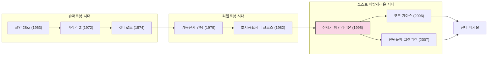

## 관련글

[**일본 SF 만화·애니메이션과 AI: 70년의 상상력 계보**](https://k82022603.github.io/posts/%EC%9D%BC%EB%B3%B8-sf-%EB%A7%8C%ED%99%94-%EC%95%A0%EB%8B%88%EB%A9%94%EC%9D%B4%EC%85%98%EA%B3%BC-ai-70%EB%85%84%EC%9D%98-%EC%83%81%EC%83%81%EB%A0%A5-%EA%B3%84%EB%B3%B4/)

## 들어가며: 질문의 난해함

"역대 최고의 메카물 애니메이션을 하나만 꼽으라"는 질문은 사실 아주 답하기 까다로운 질문이다. 메카물이라는 장르 자체가 1963년 《철인 28호》부터 시작해 이미 60년이 넘는 역사를 가지고 있고, 그 안에서도 슈퍼로봇(초합금 로봇이 압도적인 힘으로 적을 부수는 계열)과 리얼로봇(병기로서의 로봇이 정치·군사적 맥락 속에서 등장하는 계열)이라는 크게 두 갈래의 흐름이 따로 발전해 왔기 때문이다. 게다가 "최고"의 기준을 상업적 성공에 둘 것인지, 장르에 끼친 영향력에 둘 것인지, 작품 자체의 완성도에 둘 것인지에 따라 답이 크게 달라진다.

그럼에도 하나만 꼽아야 한다면, 이 문서에서는 **《신세기 에반게리온(新世紀エヴァンゲリオン, Neon Genesis Evangelion)》** 을 최종 답으로 제시한다. 사용자가 예시로 든 《기동전사 건담》도 물론 장르의 시조 격인 압도적인 작품이지만, 아래에서 그 이유를 하나씩 풀어가 보겠다. 다만 이는 어디까지나 하나의 관점이며, 절대적인 정답이 존재하는 문제는 아니라는 점을 먼저 밝혀둔다.

---

## 메카물 장르의 큰 흐름

메카물의 역사를 시대순으로 정리하면 대략 다음과 같은 흐름을 그린다. 1963년 최초의 거대로봇물로 평가받는 《철인 28호》가 등장한 이후, 1972년 나가이 고의 《마징가 Z》가 '조종석에 탑승해 로봇을 직접 움직인다'는 슈퍼로봇물의 문법을 확립했다. 이후 1979년 《기동전사 건담》이 등장하면서 로봇을 초능력적인 무기가 아니라 전쟁에 동원되는 '병기'로 그리는 리얼로봇 노선을 열었고, 이 흐름은 1982년 《초시공요새 마크로스》 등으로 이어지며 하나의 굳건한 전통 장르로 자리 잡았다.

그리고 1995년, 안노 히데아키 감독과 가이낙스가 만든 《신세기 에반게리온》이 등장하면서 장르의 흐름이 다시 한번 크게 꺾인다. 이후 2000년대에는 《코드 기아스》나 《천원돌파 그렌라간》처럼 에반게리온 이후의 문법(음울한 세계관, 심리극적 깊이, 혹은 반대로 그것에 대한 반동으로서의 과장된 열혈)을 소화한 작품들이 이어지는 흐름을 보인다.

이 흐름도에서 볼 수 있듯, 신세기 에반게리온은 슈퍼로봇과 리얼로봇이라는 두 전통이 이미 충분히 성숙한 지점에서 등장해, 그 이후의 거의 모든 메카물에 직간접적인 영향을 남긴 분기점에 해당한다.

---

## 왜 신세기 에반게리온인가

### 1. 장르 자체를 재정의했다는 평가

신세기 에반게리온은 겉으로 보면 거대한 인조인간 병기 '에반게리온'에 탑승한 소년소녀들이 정체불명의 침략자 '사도'에 맞서 싸우는, 전형적인 메카물의 틀을 갖추고 있다. <cite index="12-1">감독은 안노 히데아키이며 가이낙스와 타츠노코 프로덕션이 제작해 1995년부터 1996년까지 TV 도쿄에서 방영되었다.</cite> 그러나 실제 내용은 <cite index="12-1">종말론적 세계관을 가진 아포칼립스 SF, 거대 로봇이 등장하는 메카물, 그리고 등장인물들의 정신 상태를 전면에 내세운 심리극이 결합된 독특한 작품</cite>으로 평가받는다.

흥미로운 지점은, 처음부터 이런 난해하고 심리적인 작품으로 기획된 것이 아니었다는 사실이다. <cite index="8-1">원래 초기 기획에서는 열혈물에 가까운 명쾌한 로봇 애니메이션이었으나 제작 과정에서 점차 지금의 형태로 변화했다고 알려져 있다.</cite> 이 부분은 제작 과정에 대한 통설이자 커뮤니티에서 널리 받아들여지는 이야기이며, 안노 감독 개인의 정신적 상태가 작품에 영향을 미쳤다는 식으로 설명되는 경우가 많다는 점을 밝혀둔다.

### 2. 메카닉 디자인 자체의 혁신

기존 로봇 애니메이션의 메카닉 디자인은 나사와 관절, 금속 장갑으로 표현되는 '완전한 기계'였다. 반면 <cite index="7-1">에반게리온에 등장하는 로봇의 디자인은 100% 기계와 금속으로 구성된 로봇보다는 유기물에 생명을 부여해서 제작된 인조생명체의 면이 부각되어 있다.</cite> 구체적으로 <cite index="7-1">기존의 정교한 나사나 관절은 없으며 어깨는 비대하고 팔과 다리는 늘씬하고, 장갑이 파손되어 드러나는 부분은 기계가 아니라 근육이 뜯어진 것과 같은 인상을 준다.</cite> 이 때문에 <cite index="7-1">이전 로봇물 시리즈의 디자인에 비해 굉장히 획기적이라는 평가</cite>를 받는다. 이는 단순한 미술적 취향의 문제가 아니라, '로봇'이라는 것을 다시 정의한 시도로 볼 수 있다.

### 3. 서브컬처 전반에 끼친 압도적 영향력

에반게리온의 영향력을 평가할 때 자주 인용되는 표현이 있다. 한 리뷰에서는 <cite index="9-1">흥행과 서브컬처 역사에 미친 영향력이 드래곤볼과 건담 이후 최고 수준이라는 데 이견이 없을 것</cite>이라고 평가한다. 이는 개인 블로거의 주관적 평가이지만, 일본 애니메이션 팬덤 내에서 폭넓게 공유되는 인식이기도 하다. 실제로 <cite index="13-1">일본 미디어 예술 100선 애니메이션 부문에 선정</cite>되었으며, 국내 애니메이션 플랫폼에서도 <cite index="13-1">1990년대를 상징하는 일본 서브컬처의 전설이자 신화가 된 애니메이션이며, 현대 일본 애니메이션에서 절대적인 영향력을 자랑하는 걸작</cite>으로 소개되고 있다.

또한 후속작이자 완결편에 해당하는 극장판 《엔드 오브 에반게리온》은 <cite index="11-1">전설의 극장판으로 일본 애니메이션계에 혁명을 일으킨 신세기 에반게리온 시리즈의 TV 완결판이자 구 극장판</cite>으로 평가받으며, 해외 평론에서도 <cite index="11-1">모든 프레임에 대담한 색상, 인간과 휴머노이드 로봇의 미묘한 움직임, 액션과 조용한 드라마 모두에 있어 무게감과 디테일을 갖추고 있다</cite>는 호평을 받았다. 다만 같은 문서에서는 <cite index="11-1">이 작품이 데빌맨과 이데온을 섞어 만든 것에 불과하다는 혹평도 존재한다</cite>는 점 역시 함께 기록되어 있어, 만장일치의 걸작은 아니라는 사실도 짚어둘 필요가 있다.

### 4. 30년이 지나도 계속되는 생명력

에반게리온의 또 다른 특징은 한 번 완결되고 끝난 작품이 아니라는 점이다. <cite index="12-1">방영 당시의 파격적인 연출과 난해한 상징, 논쟁적인 결말 때문에 시청자 사이에서 큰 논쟁을 불러일으켰고, 이후 대체 엔딩 영화와 리빌드 시리즈로까지 이어지며 하나의 거대한 미디어 프랜차이즈로 성장했다.</cite> 심지어 2026년 1월에도 <cite index="6-1">《에반게리온 신극장판:Q》가 재상영되며 박스오피스 순위에 오르는 등, 방영 30년이 지난 지금까지도 일본 극장가에서 존재감을 드러내고 있다.</cite> 이는 단발성 히트작이 아니라 세대를 넘어 계속 소비되는 작품이라는 뜻이다.

---

## 정직한 반론: 건담을 고르지 않은 이유

사용자가 예시로 든 《기동전사 건담》은 사실 에반게리온보다 먼저 등장해 리얼로봇이라는 장르 자체를 창시한 작품이며, <cite index="3-1">이후 마징가 시리즈, 겟타로보 시리즈, 건담 시리즈, 마크로스 시리즈, 에반게리온 시리즈 등 국민적 인기를 얻은 작품들이 계속 등장하면서 전통적인 장르로 굳어졌다</cite>는 서술에서도 건담이 이 계보의 핵심 축임을 확인할 수 있다. 45년 넘게 이어지고 있는 프랜차이즈의 규모, 완구·프라모델 산업과 결합된 산업적 영향력, 정치·전쟁 서사를 다룬 원조라는 점에서 건담은 "가장 위대한(greatest)" 메카물 프랜차이즈라는 타이틀에 가장 근접한 후보이기도 하다.

그럼에도 이 문서에서 에반게리온을 최종 선택으로 삼은 이유는, "장르로서 이미 존재하던 문법을 완성한 작품"과 "그 문법 자체를 부수고 재발명한 작품" 중에서 후자 쪽이 단일 작품으로서의 충격과 완성도, 그리고 장르 바깥의 대중문화에까지 미친 파급력이라는 기준에서 더 극적이라고 판단했기 때문이다. 이는 어디까지나 하나의 판단 기준일 뿐이며, 프랜차이즈의 총체적 규모나 역사적 시조성을 기준으로 삼는다면 건담을 최고로 꼽는 것 역시 충분히 타당한 결론이다.

---

## 주요 후보작 비교

| 작품 | 방영 연도 | 장르 계열 | 핵심 기여 | 비고 |
|---|---|---|---|---|
| 철인 28호 | 1963 | 슈퍼로봇 | <cite index="3-1">최초의 거대로봇물로 평가받음</cite> | 조종은 외부 리모컨 방식 |
| 마징가 Z | 1972 | 슈퍼로봇 | 탑승형 로봇 문법 확립 | 이후 슈퍼로봇물의 원형 |
| 기동전사 건담 | 1979 | 리얼로봇 | 로봇을 전쟁 병기로 재정의 | 45년 이상 이어지는 최대 규모 프랜차이즈 |
| 초시공요새 마크로스 | 1982 | 리얼로봇 | 가변 로봇, 음악·아이돌 요소 결합 | 리얼로봇 계보의 확장 |
| 신세기 에반게리온 | 1995 | 포스트 리얼로봇 | 메카닉 디자인과 심리극의 결합, 장르 재정의 | 이 문서의 최종 선택 |
| 천원돌파 그렌라간 | 2007 | 슈퍼로봇 (에반게리온 이후) | 에반게리온식 음울함에 대한 열혈물의 반동 | 슈퍼로봇 정신의 현대적 부활 |
| 코드 기아스 | 2006 | 리얼로봇 | 정치 드라마와 메카물의 결합 | 에반게리온 이후 세대의 대표작 |

---

## 결론

"역대 최고의 메카물"이라는 질문에 유일한 정답은 없다. 하지만 굳이 하나만 골라야 한다면, 장르의 문법을 뒤흔들고 메카닉 디자인의 개념 자체를 바꾸었으며, 30년이 지난 지금까지도 신극장판이 극장에 걸리는 살아있는 프랜차이즈라는 점에서 **신세기 에반게리온**을 최종 답으로 제시한다. 다만 순수하게 장르의 시조성과 프랜차이즈 규모를 기준으로 삼는다면 《기동전사 건담》을, 슈퍼로봇물 특유의 카타르시스를 기준으로 삼는다면 《마징가 Z》나 《천원돌파 그렌라간》을 고르는 것도 얼마든지 설득력 있는 선택이라는 점을 덧붙여 둔다.

---

## 참고 자료

- 신세기 에반게리온, 위키백과, 확인일 2026-04-14 — https://ko.wikipedia.org/wiki/신세기_에반게리온
- 신세기 에반게리온, 나무위키, 확인일 2026-07-13(최근 수정) — https://namu.wiki/w/신세기 에반게리온
- 거대로봇물/애니메이션/일본, 나무위키, 확인일 2026-07-13(최근 수정) — https://namu.wiki/w/거대로봇물/애니메이션/일본
- 엔드 오브 에반게리온/평가, 나무위키 — https://namu.wiki/w/엔드 오브 에반게리온/평가
- 에반게리온 세계관과 의의 종합 노트, TILNOTE, 2025-11-25 — https://tilnote.io/en/pages/692530abf59406dc0dc15a52
- 신세기 에반게리온 소개 페이지, 라프텔 — https://laftel.net/item/16197
- 신세기 에반게리온의 해석(개인 블로그 리뷰, 주관적 평가 포함), Brunch, 2025-02-08 — https://brunch.co.kr/@nequeclamor/2
- List of 2026 box office number-one films in Japan, 위키피디아(영문) — https://en.wikipedia.org/wiki/List_of_2026_box_office_number-one_films_in_Japan

> 위 자료 중 위키백과·나무위키 항목은 대체로 사실관계(방영연도, 제작사, 수상 이력 등)에 해당하며, 개인 블로그(Brunch)의 평가나 이 문서의 "왜 에반게리온인가", "건담을 고르지 않은 이유" 부분은 명백히 필자(및 검색된 팬덤 커뮤니티)의 주관적 견해임을 밝힌다.

---

작성일자: 2026-07-26
