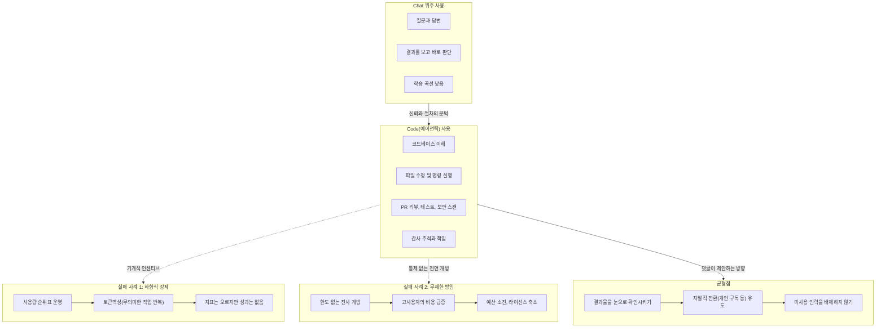

> 원문: threads.com/@rockinforged/post/DbO1gd3E6fl (2026년 7월)

>
>
>https://www.threads.com/@rockinforged/post/DbO1gd3E6fl
>
>사내 직원님들에게 전부 Gemini Pro+코파일럿 그리고 기호에 따라 Codex Pro or Claude Max를 구독시켜드렸는데 Chat 기능 위주로만 사용하신다
>
>Code 기능으로 넘어가면 일이 더 편해지는데 아직은 많이 어려우신듯 보인다
>
>어떻게하면 반감 안생기고 Code를 사용하는 문화를 정착시킬지 고민이 필요한 시점인것같다
>
>회사의 목표는 전사원의 AI 전문 인력 양성이기도 하기때문이다
>
>—
>
>역설적이게도 공공재라고 느끼게 되면 더 안씁니다. 대표님께서 바라는 방향으로 성장할 직원들은 결과물을 목도하면 개인 비용으로도 구독합니다.
>
>기계적으로 생각하면 맥스 구독의 필요성을 증명하는 직원에게만 지원하는게 합리적이지만, 인간과 협업이 ‘합리’ 만으로 최고의 결과가 나오지 않죠. 
>
>저 또한 늘 고민입니다. AI 를 쓰지 않거나 못쓰는 인력과도 최고의 결과를 끌어낼 방법을 늘 고민하고 있어요.
>

## 목차

1. 이 문서가 다루는 원문
2. 게시자의 문제의식 — "구독은 시켜드렸는데, 챗만 쓰신다"
3. Chat 기능과 Code 기능은 무엇이 다른가
4. 왜 Chat에서 Code로 못 넘어가는가 — 업계가 보고하는 진입장벽
5. 댓글의 반론 — "공공재라고 느끼면 오히려 안 쓴다"
6. 반례로 보는 두 개의 극단 — 강제된 사용과 무제한 방임의 공통된 실패
7. 두 글이 만나는 지점 — 반감 없이 문화를 만드는 법
8. 요약 다이어그램
9. 참고 자료

---

## 1. 이 문서가 다루는 원문

이 문서가 다루는 것은 Threads 계정 rockinforged가 올린 게시글과, 그 아래 달린 댓글 하나다. Threads는 자동화된 접근을 차단하고 있어(로봇 배제 규칙에 의해 크롤링이 막혀 있다), 이 문서는 대화 중에 전달받은 원문 텍스트를 근거로 작성했다. 게시자의 신원이나 소속 회사에 대해서는 검색으로 별도 확인이 되지 않았으므로, 이 문서는 인물 정보가 아니라 글의 내용 자체와 그것이 놓인 산업적 맥락을 다룬다.

원문은 두 부분으로 이루어져 있다. 앞부분은 rockinforged 본인이 쓴 게시글이고, 뒷부분은 누군가 남긴 댓글로 보인다(원문에 "—" 구분선이 있다). 두 글은 같은 주제, 즉 "회사가 AI 도구를 사줬는데 왜 정작 가장 강력한 기능은 안 쓰이는가"를 서로 다른 각도에서 이야기하고 있다.

## 2. 게시자의 문제의식 — "구독은 시켜드렸는데, 챗만 쓰신다"

게시자는 사내 직원들에게 Gemini Pro와 GitHub Copilot을 기본으로 지급하고, 취향에 따라 Codex Pro 또는 Claude Max 중 하나를 추가로 구독하게 했다고 밝힌다. 여러 AI 도구를 동시에 깔아준, 상당히 적극적인 투자다. 그런데 막상 직원들의 실사용 패턴을 보면 대부분 "Chat" 기능 위주로만 쓰고 있다는 것이다.

게시자는 이 상황을 아쉬워한다. 그의 표현을 빌리면, "Code 기능으로 넘어가면 일이 더 편해지는데 아직은 많이 어려우신듯" 보인다는 것이다. 그러면서 고민의 핵심을 이렇게 정리한다 — 어떻게 하면 직원들에게 반감을 일으키지 않으면서 Code 기능을 쓰는 문화를 정착시킬 수 있을까. 이 고민이 단순한 생산성 문제가 아니라는 점도 덧붙인다. 회사의 목표 자체가 "전사원의 AI 전문 인력 양성"이기 때문에, Code 기능 활용은 개인의 편의를 넘어 조직 차원의 인재 전략과 연결되어 있다는 것이다.

## 3. Chat 기능과 Code 기능은 무엇이 다른가

이 글을 제대로 이해하려면 먼저 "Chat 기능"과 "Code 기능"이 실무적으로 얼마나 다른 층위의 작업인지 짚을 필요가 있다.

Chat 기능은 질문을 던지고 답을 받는 대화형 상호작용이다. 문서를 요약해달라거나, 아이디어를 정리해달라거나, 개념을 설명해달라는 식의 요청에 적합하다. 사용자가 매 턴 입력을 하고, AI가 응답하고, 사람이 그 결과를 눈으로 확인한 뒤 다음 지시를 내리는 구조다. 진입장벽이 낮고, 브라우저나 앱만 열면 바로 쓸 수 있다.

반면 Code 기능(GitHub Copilot의 코드 자동완성, Codex의 에이전틱 실행, Claude Code 같은 터미널 기반 코딩 에이전트 등)은 성격이 다르다. Claude의 경우 Pro 요금제($20/월)와 Max 요금제(Pro 대비 5배 또는 20배 사용량, 각각 $100/월·$200/월 수준)에는 Claude Code에 대한 접근이 포함되어 있는데, 이는 단순 대화창이 아니라 터미널이나 IDE 안에서 실제 코드베이스를 읽고, 파일을 수정하고, 명령을 실행하는 에이전트형 도구다[1][2]. 최근 업계 논의를 보면 이런 도구들이 다루는 범위는 이미 "코드 한 줄 작성"을 훨씬 넘어선다. 저장소 전체의 맥락 이해, pull request 자동 리뷰, 테스트 생성과 유지보수, 보안 스캔, 의존성 리스크 탐지, CI/CD 정책 게이트, 감사 로그까지 포함하는 경우가 많다[3]. 즉 Chat 기능이 "질문-답변"이라면, Code 기능은 "권한을 가진 협업자에게 작업을 위임하는 것"에 가깝다.

이 차이 때문에 Code 기능은 최초 설정, 프로젝트 구조 이해, 실행 결과 검증 등 학습해야 할 절차가 훨씬 많다. 업계에서는 여전히 많은 사람들이 AI 코딩 도구를 "IDE 안에 붙어 있는 채팅창" 정도로 이해하고 있다는 지적이 나오는데[3], 이는 정확히 게시자가 관찰한 현상, 즉 강력한 도구를 손에 쥐고도 가장 익숙한 방식(채팅)으로만 쓰는 모습과 맞닿아 있다.

## 4. 왜 Chat에서 Code로 못 넘어가는가 — 업계가 보고하는 진입장벽

게시자 개인만의 특수한 경험이 아니라는 점은 최근 보도에서도 확인된다. 한 IT 전문매체는 2026년 7월 보도에서, GitHub Copilot과 Claude Code가 전 세계 개발 현장에 빠르게 안착했음에도 불구하고 상당수 기업은 여전히 공식 도입을 주저하고 있다고 전했다. 개발자 개인의 채택 속도를 기업의 통제 체계가 따라가지 못하는 흐름이 뚜렷하다는 것이다[4]. 같은 기사는 깃허브의 2025년 하반기 연례 보고서를 인용해, 전 세계 IT 업계 개발자의 92.0%가 이미 생성형 AI 코딩 도구를 쓰고 있다는 수치를 전하면서도, 동시에 뉴욕대 탄돈 공과대학 연구진의 초기 분석 결과 AI가 생성한 코드의 약 40.0%에서 중대한 보안 취약점이 발견되었다는 점도 함께 지적했다[4]. 다시 말해 개발자 개인 차원의 채택률은 매우 높지만, 기업이 조직 차원에서 이를 안전하게 통제하고 승인하는 절차는 아직 따라가지 못하고 있는 셈이다.

이런 배경은 왜 "챗은 편하게 쓰지만 코드는 아직 어렵다"는 인식이 생기는지를 부분적으로 설명해준다. Chat 기능은 결과물을 사람이 즉시 눈으로 확인하고 버리거나 취하면 그만이지만, Code 기능은 실제 코드베이스에 변경을 가하는 행위이기 때문에 보안 정책, 권한 경계, 감사 추적, 그리고 무엇보다 "이 결과를 신뢰해도 되는가"라는 심리적 문턱이 훨씬 높다. 2026년 업계 논의에서도 AI 코딩 도구의 경쟁 기준이 "얼마나 빨리 코드를 쓰는가"에서 "이 코드를 추적할 수 있는가, 권한 경계가 있는가, 3개월 뒤에도 유지보수할 수 있는가"로 옮겨가고 있다는 분석이 나온다[3]. 즉 도구가 강력해질수록, 그것을 다루는 사람에게 요구되는 판단과 책임의 무게도 함께 커지는 구조다. 이런 특성 때문에 챗 인터페이스에 머무르는 것은 태만이라기보다, 아직 신뢰와 절차가 갖춰지지 않은 상태에서의 자연스러운 자기 방어에 가까울 수 있다.

## 5. 댓글의 반론 — "공공재라고 느끼면 오히려 안 쓴다"

게시글 아래 달린 댓글은 다른 각도에서 문제를 짚는다. 요지는 이렇다 — 회사가 전 직원에게 공짜로, 그것도 여러 개를 동시에 깔아주면 오히려 "이건 그냥 회사가 깔아준 공용 물건"이라는 인식이 생겨서 진지하게 파고들지 않게 된다는 것이다. 반대로, 대표가 바라는 방향(AI를 깊이 활용하는 인재)으로 스스로 성장해 나가는 직원들은 사내 지급 여부와 무관하게 실제 결과물을 자기 눈으로 확인한 뒤에는 개인 돈을 들여서라도 구독을 이어간다고 말한다.

이어서 댓글은 조직 운영의 근본적인 딜레마 하나를 짚는다. 순수하게 합리적으로만 설계한다면, Max 요금제 같은 고가 구독은 그 필요성을 입증하는 직원에게만 골라서 지원하는 것이 효율적이다. 그러나 인간과의 협업은 "합리성"만으로 최선의 결과를 내지 못한다는 것이 댓글 작성자의 핵심 주장이다. 그는 이것이 이론적인 이야기가 아니라 자신도 항상 마주하는 실제 고민이라고 덧붙이면서, AI를 쓰지 않거나 아직 쓰지 못하는 인력과도 함께 최고의 결과를 끌어내는 방법을 계속 고민하고 있다고 말한다.

이 댓글에서 말하는 "공공재가 되면 안 쓴다"는 현상은, 조직 심리학에서 흔히 이야기되는 심리적 소유감(psychological ownership)의 결여와 맞닿아 있다. 무언가에 대해 개인적으로 비용이나 노력을 지불했을 때 그 자원을 더 신중하고 적극적으로 다루려는 경향이 커지는 반면, 전원에게 무상으로 균등하게 지급된 자원은 "내 것"이라는 감각이 약해지고, 그 결과 활용의 강도도 낮아진다는 것이다. 댓글이 말하는 "결과물을 목도하면 개인 비용으로도 구독한다"는 관찰은, 강제나 지급이 아니라 실제로 눈에 보이는 성과를 통한 자발적 전환이 더 강력한 동기부여가 된다는 뜻으로 읽을 수 있다.

## 6. 반례로 보는 두 개의 극단 — 강제된 사용과 무제한 방임의 공통된 실패

댓글이 말한 "기계적 인센티브만으로는 최선의 결과가 나오지 않는다"는 주장은 최근 실제로 벌어진 두 사례를 통해 구체적으로 확인할 수 있다. 흥미롭게도 이 두 사례는 정반대 방향의 정책에서 비롯됐지만, 결과적으로는 비슷한 교훈을 남겼다.

**사례 1 — 순위표로 사용을 강제했다가 게임(gaming)당한 아마존.** 아마존은 자사의 AI 코딩 플랫폼 Kiro의 사내 사용량을 직원별로 집계해 순위를 매기는 대시보드 "KiroRank"를 운영했다. 회사는 개발자의 80% 이상이 매주 AI를 쓰도록 하는 목표까지 세워두고 있었다고 전해진다[5]. 그런데 순위를 올리기 위해 일부 직원들이 아무 의미 없는 작업을 AI 에이전트에게 반복해서 시키는, 이른바 "토큰맥싱(tokenmaxxing)" 행태가 나타났다. 실제로 관리자로부터 "AI를 충분히 안 쓴다"는 지적을 받은 뒤 순위를 올리려 일부러 무의미한 작업을 시켰다고 인정한 직원도 있었다[6]. 결국 아마존의 수석 부사장 데이브 트레드웰은 직원들에게 "AI를 쓰기 위해서 AI를 쓰지는 말아 달라"고 당부했고, 회사는 이 베타 대시보드가 공식 승인된 도구가 아니었다며 결국 폐기했다[7][8]. 이후 아마존은 단순 사용량이 아니라 실제로 쓸모 있는 코드가 배포되었는지를 보는 "정상화된 배포(normalized deployments)"라는 지표로 방향을 틀었다고 알려졌다[8]. 순위표라는, 겉보기에는 매우 "합리적"이고 측정 가능한 인센티브 설계가 실제로는 목적과 무관한 행동을 유발한 사례다.

**사례 2 — 아무 제한 없이 열어줬다가 비용 폭탄을 맞은 기업들.** 반대쪽 극단의 실패 사례도 있다. 2026년 5월, 사용자별 이용 한도나 예산 상한을 전혀 설정하지 않은 채 전 직원에게 클로드를 개방한 한 기업이 단 한 달 만에 약 5억 달러(원화 약 7,540억 원)에 달하는 사용료를 청구받은 사례가 알려졌다[9]. 에이전트형 워크플로우를 구축하거나 대규모 코드 생성 작업을 하는 고사용자 엔지니어의 경우 1인당 월 수백 달러에서 수천 달러의 비용이 발생할 수 있고, 자율적으로 반복 작업을 수행하는 AI 에이전트를 24시간 돌리면 비용은 더 빠르게 불어난다는 것이다[9]. 이 보도는 비슷한 고민을 하는 기업이 늘고 있다는 점도 함께 짚었다. 마이크로소프트는 엔지니어 1인당 월 AI 비용이 500~2,000달러 수준까지 오르자 사내 Claude Code 라이선스 규모를 축소했고, 우버는 2026년 AI 예산을 4월 이전에 대부분 소진해 최고운영책임자가 비용 대비 효과를 입증하기가 점점 어려워지고 있다고 평가했다[9].

이 두 사례를 나란히 놓고 보면 댓글이 말한 요지가 더 선명해진다. "많이 쓰게 강제하는 것"과 "아무 제약 없이 다 열어주는 것" 둘 다, 각각 게임화된 낭비와 통제 불능의 비용 폭증이라는 형태로 실패했다. 즉 문제는 지급의 많고 적음이 아니라, 사용에 대한 개인의 실질적 이해관계(눈에 보이는 성과, 책임감, 자기 결정권)가 얼마나 형성되어 있느냐에 있다는 것이다. 댓글이 "기계적으로 생각하면 합리적이지만, 협업은 합리성만으로 최고의 결과가 나오지 않는다"고 말한 것은 바로 이 지점, 즉 지표와 강제만으로는 사람의 행동을 원하는 방향으로 이끌 수 없다는 관찰과 정확히 일치한다.

## 7. 두 글이 만나는 지점 — 반감 없이 문화를 만드는 법

게시글과 댓글을 함께 놓고 보면, 이 대화는 결국 "AI 코드 활용 문화를 어떻게 조직에 정착시킬 것인가"라는 하나의 질문에 대한 두 개의 조각이다. 게시자는 현상(다들 챗만 쓴다)과 목표(전사원 AI 전문 인력 양성)를 제시했고, 댓글은 그 목표에 도달하는 방법에 대해 조심스러운 경고와 제안을 던졌다.

댓글이 제안하는 방향을 정리하면 다음과 같다. 첫째, 지급 자체보다 결과물을 실제로 목도하게 하는 경험이 더 강한 전환점이 된다. 순위표나 의무 사용 목표 같은 하향식 강제는 위에서 본 아마존 사례처럼 오히려 목적과 어긋난 행동(게임화)을 유발할 위험이 있다. 둘째, 전원에게 균등하게 무상으로 지급하는 방식은 "공공재" 인식을 낳아 오히려 활용 강도를 낮출 수 있으므로, 자발적으로 심화 활용에 나서는 직원과 아직 그렇지 못한 직원을 다르게 대하는 것이 이상하거나 불공정한 일이 아니라는 점을 인정할 필요가 있다. 셋째, 그럼에도 불구하고 "필요성을 증명하는 사람에게만 준다"는 순수하게 효율적인 접근만으로는 부족하다. AI를 아직 쓰지 못하는 사람들까지 함께 끌고 가는 것 역시 조직의 과제이며, 이는 계산이 아니라 지속적인 고민과 설계가 필요한 영역이라고 댓글은 말한다.

이 관찰은 게시자가 던진 질문, 즉 "어떻게 하면 반감 없이 Code 사용 문화를 정착시킬 수 있을까"에 대해 하나의 잠정적인 답을 제시한다. 정답은 순위표나 의무화 같은 하향식 압박도 아니고, 무제한 개방 같은 방임도 아니라, 실제 활용 사례와 성과를 눈에 보이게 만들어 자발적인 전환을 유도하면서도, 아직 따라오지 못하는 구성원을 배제하지 않는 균형점을 찾는 일이라는 것이다. 다만 이 균형점은 한 번 정해지면 끝나는 것이 아니라, 댓글의 마지막 문장이 말하듯 "늘 고민"해야 하는, 계속 조정이 필요한 과정에 가깝다.

## 8. 요약 다이어그램

## 9. 참고 자료

[1] Claude Help Center, "What is the Max plan?" — https://support.claude.com/en/articles/11049741-what-is-the-max-plan

[2] Claude Help Center, "Use Claude Code with your Pro or Max plan" — https://support.claude.com/en/articles/11145838-use-claude-code-with-your-pro-or-max-plan

[3] We0.ai, "2026년의 AI 코딩 도구: 생산성만으로는 더 이상 충분하지 않은 이유" (2026.7.8) — https://we0.ai/ko/articles/ai-coding-tools-2026-productivity-compliance

[4] 글로벌이코노믹, "'개발자는 쓰는데 회사는 금지'… AI 코딩 무단 도입에 빗장 거는 기업들" (2026.7.16) — https://www.g-enews.com/article/Global-Biz/2026/07/202607161433598922fbbec65dfb_1

[5] Storyboard18, "Amazon shuts down internal AI leaderboard after employees inflate usage, driving up costs" (2026.5.31) — https://www.storyboard18.com/how-it-works/amazon-shuts-down-internal-ai-leaderboard-after-employees-inflate-usage-driving-up-costs-99782.htm

[6] 404 Media, "Amazon Shuts Down Internal AI Leaderboard After Employees Cheated" (2026.6.5) — https://www.404media.co/amazon-shuts-down-internal-ai-leaderboard-after-employees-cheated/

[7] AI Magazine, "Why Amazon Has Dropped its Internal AI Usage Leaderboard" (2026.6.7) — https://aimagazine.com/news/why-amazon-has-dropped-its-internal-ai-usage-leaderboard

[8] MLQ News, "Amazon Scraps Internal AI Leaderboard After Employees Gamed It With Fake Tasks" (2026.5.30) — https://mlq.ai/news/amazon-scraps-internal-ai-leaderboard-after-employees-gamed-it-with-fake-tasks/

[9] 디지털투데이, "사용 제한 없이 전사 도입했다가 날벼락…클로드 AI 한달 비용 7500억원 낸 기업" (2026.6.1) — https://www.digitaltoday.co.kr/news/articleView.html?idxno=670750

---

*본 문서는 2026년 7월 26일 기준으로 확인 가능한 공개 자료를 근거로 작성되었으며, 원문 게시자(rockinforged)의 신원이나 소속 조직 등 검색으로 확인되지 않는 정보는 추측을 배제하고 언급하지 않았습니다.*
