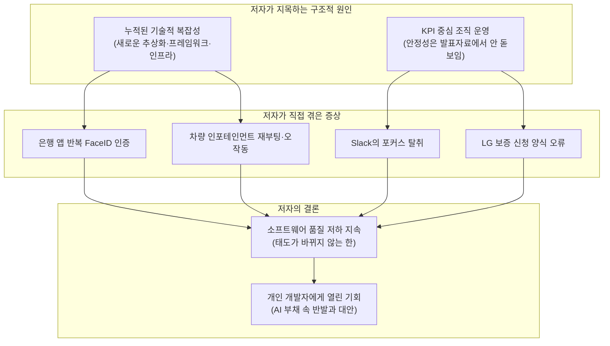
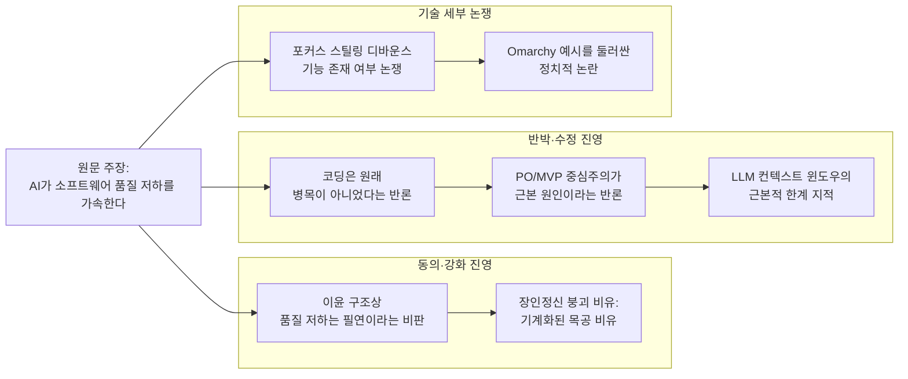

---

## 1. 문서 개요

이 문서는 2026년 7월 24일경 개인 블로그 ptrchm.com에 게시된 에세이 [**"Nothing Works and Everyone Is Euphoric"**](https://ptrchm.com/posts/nothing-works-and-everyone-is-euphoric/) (아무것도 작동하지 않는데 모두가 도취되어 있다)를 원문 그대로 요약·분석하고, 이 글이 Hacker News, Lobsters, 그리고 한국의 [GeekNews](https://news.hada.io/topic?id=31787)에서 촉발한 토론 내용을 함께 정리한 것이다.

확인된 사실관계는 다음과 같다.

- 원문 게시처: `ptrchm.com/posts/nothing-works-and-everyone-is-euphoric/`
- 게시일: 원문 페이지 하단에 "Published on 2026-07-24 (Updated: 2026-07-24)"로 명시되어 있어, 게시일과 최종 수정일이 모두 2026년 7월 24일로 확인된다.
- Hacker News 게시: 사용자 `pchm`이 직접 제출했으며, 확인 시점 기준 234포인트에 181개 댓글이 달린 상당히 화제가 된 게시물이다 (news.ycombinator.com/item?id=49033004).
- Lobsters에도 `culture`, `vibecoding` 태그로 등록되어 10개의 댓글이 달렸다.
- 한국에서는 GeekNews가 2026년 7월 25일 08:06(KST)에 "코딩이 해결됐다면 왜 소프트웨어는 계속 나빠지는가?"라는 제목으로 번역·요약해 소개했으며(news.hada.io/topic?id=31787), 여기에 Hacker News 댓글 주요 논지를 정리한 댓글이 함께 달렸다.
- 저자 신원: 원문 페이지 하단의 작성자 소개란에 본인이 직접 밝힌 내용에 따르면, 저자는 **폴란드 바르샤바에 거주하는 소프트웨어 개발자 Piotr**이며, 블로그는 소프트웨어 개발과 관련된 다양한 주제(또는 그때그때 본인의 관심사)를 탐구하는 공간이라고 소개하고 있다. 소개란에는 컨설팅 및 프리랜스 프로젝트를 받고 있다는 안내도 함께 있다. 성(姓)이나 소속 회사명 등 그 이상의 신상 정보는 원문에 공개되어 있지 않으므로, 이 문서에서는 저자를 "Piotr" 또는 "저자"로 지칭한다.

아래 2장은 원문 자체의 주장을 서술형으로 상세히 풀어 설명하고, 3장은 커뮤니티(주로 Hacker News)에서 오간 반응을, 4장은 이 논쟁과 관련해 실제로 존재하는 최신 데이터(GitClear, DORA 리포트 등)를 확인한 결과를 다룬다. 5장에서는 이 모든 내용을 종합해 시사점을 정리한다.

---

## 2. 원문의 핵심 주장: 서술형 상세 설명

### 2-1. 도입부 — "AI가 유발한 집단 도취" 라는 진단

저자는 글을 여는 첫 문장부터 도발적이다. 지금 이 순간을 "AI가 유발한 대중적 도취 상태의 한복판"이라고 표현하면서, 사람들이 모든 것이 자동화되기 전에 시장 가치를 조금이라도 붙잡으려고 문자 그대로 토큰 사용량을 극한까지 밀어붙이다가 건강을 해치는 지경("token-maxxing themselves into hospital beds")에 이르렀다고 지적한다. 모델은 계속 좋아지고, 프로그래머들은 계속 해고당하고 있으며, "연말까지 AI가 코드의 100%를 작성할 것"이라는 전망이 반복적으로 회자되는 상황 속에서, 저자는 지금이 느긋하게 관망할 시점은 아니라고 인정한다.

이른바 "에이전틱 시대"는 더 높은 생산성과 더 높은 품질을 약속했다. 저자도 이 도구들이 소프트웨어를 만들고 사용하는 방식을 이미 근본적으로 바꿔놓았다는 사실 자체는 부정하지 않는다. 경영진이 팀에 기대하는 산출량은 늘어났고, 소프트웨어 팀의 평균적인 역량 수준도 과거에는 볼 수 없었던 방식으로 올라갔을 가능성이 있다고 말한다.

그런데 여기서 저자는 핵심 질문을 던진다. **그렇다면 왜 소프트웨어는 전방위적으로 계속 나빠지고 있는가?**

### 2-2. 저자가 직접 겪은 네 가지 사례

저자는 추상적인 주장 대신, 글을 쓰던 바로 그 주에 자신이 실제로 겪은 네 가지 구체적인 사례를 든다.

**첫째, 은행 앱의 반복 인증 문제.** 저자의 은행 앱은 3D Secure 확인 화면이 뜨기까지 평균 세 번의 FaceID 인증을 요구한다. 하나의 결제를 완료하는 데 필요 이상으로 여러 번 얼굴 인증을 반복해야 하는 것이다.

**둘째, macOS Slack의 포커스 탈취 사건.** 저자가 macOS에서 Slack을 실행했을 때, 독(Dock) 아이콘이 몇 초간 계속 통통 튀며 실행을 기다리게 만들었다. 참지 못한 저자는 터미널 앱인 Ghostty로 전환해 타이핑을 시작했는데, 하필 그 순간 뒤늦게 열린 Slack 창이 Ghostty로부터 포커스를 가로채 갔고, 결과적으로 터미널에 입력하고 있던 `git pull` 명령어가 그대로 회사 단체 채팅방에 전송되어 버렸다. 이는 이후 Hacker News 댓글 토론에서 가장 뜨겁게 다뤄진 사례이기도 하다(3장에서 상세히 다룬다).

**셋째, LG 냉장고 보증 신청 실패.** 냉장고에서 이상한 소음이 나서 보증 신청을 하려 했으나, 수많은 입력 필드로 구성된 다단계 양식의 마지막 제출 단계에서 오류가 발생하며 실패했다. 더 심각한 것은, 저자가 우연히 브라우저의 자바스크립트 콘솔을 열어보지 않았다면 애초에 무엇이 잘못되었는지조차 알 수 없었을 것이라는 점이다.

**넷째, 자동차 인포테인먼트 시스템의 전반적 퇴행.** 최근 소프트웨어 업데이트를 받은 이후, 원래도 훌륭하지 않았던 차량용 인포테인먼트 시스템이 오히려 매 운전마다 스스로 재부팅되는 지경에 이르렀다고 한다. 방향지시등 소리가 무작위로 사라지고(재부팅 전까지 복구되지 않는다), 화면을 눌러 구글 지도를 열려고 하면 라디오 앱이 대신 열리며, 화면 터치 후 반응까지 1~2초의 지연이 발생한다. 저자는 이것이 단순한 사용자 경험(UX) 수준의 문제가 아니라, 운전 중 주의력에 실질적으로 영향을 미치는 안전 문제라고 강조한다. 그리고 몇 달 전 이 차량 OS 리디자인 팀의 PM(프로덕트 매니저)이 LinkedIn에 자신들의 성과를 자축하는 글을 올렸던 것을 봤다며, 그 제품과 씨름할 때마다 그 게시물이 떠오른다고 씁쓸하게 덧붙인다.

저자는 이 팀들 대부분이 최신 모델과 넉넉한 토큰 예산에 접근할 수 있었을 것이라 추정하며, LLM이 기회만 주어지면 버그 수정에 실제로 매우 뛰어날 수 있다는 점을 언급한다. 즉, 도구가 없어서 못 고친 게 아니라는 뉘앙스다.

### 2-3. "예전이 더 좋았다"는 향수에 대한 저자의 자기 교정

여기서 저자는 스스로 균형을 잡는다. 소프트웨어에는 언제나 버그가 있었고, macOS Snow Leopard 시절이 모든 것이 안정적이었던 황금기였다는 향수는 상당 부분 선택적 기억의 산물이라고 인정한다. 과거 소프트웨어가 더 나았다면, 그 주된 이유는 단지 지금보다 훨씬 단순했기 때문이라는 것이다. 그 이후로 업계는 계속해서 새로운 추상화 계층, 새로운 프런트엔드 프레임워크, 더 많은 인프라 복잡성을 쌓아 올려왔다. 사용자 경험에 대한 기대 수준은 계속 높아졌지만, 그 기대를 떠받치는 시스템 전체는 오히려 점점 더 취약해졌다는 것이 저자의 진단이다.

그 결과, 이제는 macOS 업데이트든 자신이 의존하는 어떤 앱의 업데이트든, 기대감보다 먼저 불안감을 불러일으키는 대상이 되어버렸다고 말한다. 새 버전이 나오면 저자는 이제 "더 나빠질 것"부터 예상하게 되었다는 것이다.

### 2-4. 핵심 논지 — 문제는 AI 자체가 아니라 AI를 어디에 쓰는가

저자는 이 글이 AI를 성토하는 글이 아니라고 분명히 못박는다. 웅웅거리는 GPU 팜들은 우리에게 진짜 초능력을 주었지만, 우리는 여전히 그 힘을 "더 나은 소프트웨어를 만드는 데" 충분히 쓰지 못하고 있다는 것이다.

그 원인으로 저자가 지목하는 것은 오랫동안 이어져 온 **KPI 중심 조직 운영**이다. 소프트웨어 업체들은 오래전부터 KPI를 중심으로 움직여 왔고, 시스템을 더 안정적으로 만드는 일은 그 수치에 직접적으로 반영되지 않는 경우가 많다. 저자는 가상의 PM이 발표 자료에서 "이번 분기에는 신규 기능도, 리디자인 계획도 없이 오직 버그 수정에만 집중하겠다"고 말하는 상황을 상상해 보라고 하면서, 이런 계획은 발표 자료에서 결코 돋보이지 않는다고 지적한다. 이런 태도가 바뀌지 않는 한, "위대한 소프트웨어 품질 붕괴"는 계속될 수밖에 없다는 것이 저자의 결론이다.

### 2-5. 그럼에도 낙관하는 이유 — 개인 개발자의 기회

흥미롭게도 저자는 이 어두운 진단으로 글을 끝맺지 않는다. 오히려 앞으로 벌어질 일에 대해 기대하고 있다고 말한다. 기업들이 집단적으로 "AI 부채"에 빠져드는 동안, 개인 개발자들에게는 과거라면 도저히 손댈 수 없었던 수준의 소프트웨어를 직접 만들어볼 수 있는 독특한 기회가 열렸다는 것이다.

저자는 자신의 차량용 Android Auto나 LG의 형편없는 웹사이트에 대해서는 더 이상 기대하지 않는다고 인정하면서도, 일상적으로 쓰는 소프트웨어들은 이런 좌절감의 결과로 오히려 개선될 것이라 믿기로 했다고 말한다. 그 근거로 macOS와 Windows의 현재 상태에 맞서는 "반발(rebellion)의 움직임"이 이미 나타나고 있다는 점을 들며, 이 흐름이 스택 전반으로 확산되기를 바란다고 글을 맺는다.

여기서 저자가 예로 든 "반발"의 구체적 대상은 Linux 배포판 **Omarchy**였다. 이는 이후 커뮤니티 반응에서 상당한 논쟁거리가 되었는데, 자세한 내용은 3장에서 다룬다.

---

## 3. Mermaid로 보는 원문의 논증 구조

---

## 4. 커뮤니티 반응 상세 정리

Hacker News 스레드(181개 댓글)를 직접 확인한 결과, 논쟁은 대체로 세 갈래로 나뉘었다. 아래는 실제로 오간 논의를 흐름별로 정리한 것이며, 개별 발언자의 아이디는 원문 스레드에서 확인 가능하다.

### 4-1. 동의·강화 진영 — "애초에 이윤 구조의 문제"

Lobsters의 댓글 진영에서는 더 급진적인 해석이 나왔다. 오늘날 기업이 제공하는 소프트웨어의 일차적 목적은 인간의 필요를 충족시키는 것이 아니라 이윤을 창출하는 것이므로, 이런 관점에서 보면 소프트웨어의 전반적인 부실화는 오히려 예정된 결과에 가깝다는 주장이다. 이 견해에 동조한 다른 댓글은 이것이 자본주의 전반에 걸친 문제이며, 기업은 소유주와 주주를 위해 이윤을 만들도록 존재하고 사회적 가치는 어디까지나 부수적 결과일 뿐이라고 덧붙였다.

Hacker News에서도 비슷한 논조의 댓글이 있었다. 한 참여자는 침대를 만드는 기계에 비유했는데, 기계가 침대를 150% 빠르게 만들어내지만 불량률이 70%라면, 불량 침대의 증가·목공 장인 전문성의 소멸·장인 자신의 의욕과 효용 저하가 동시에 벌어진다는 것이다. 설령 언젠가 기계가 개선되더라도, 그 사이 수많은 사람들은 형편없는 침대에서 잠을 자야 한다는 논리로, AI가 품질 저하의 근본 원인은 아닐 수 있으나 쇠퇴를 가속하고 있다는 결론을 내렸다.

또 다른 참여자는 문제의 본질을 이렇게 요약했다. 소프트웨어 개발이란 원래 단순히 코드를 쓰는 행위가 아니라, 무언가를 세심하고 엄밀하게 만들어가는 과정이었으며, 오랜 시간 습관과 안전장치와 검증된 구조를 축적하며 발전해 온 분야였다는 것이다. 그런데 지금은 문제 상황만 서술하고 너무 빠르게 생성된 결과물을 제대로 검토하지 못한 채, 스스로도 무엇을 배포했는지 알지 못하는 상태에 이르렀다고 지적했다. 이를 수공예 가구가 공장 생산품으로 바뀌면서 누가 어느 부분을 만들었는지 알 수 없게 되고 내구성도 떨어지게 된 과정에 비유했다.

### 4-2. 반박·수정 진영 — "코딩은 애초에 병목이 아니었다"

가장 자주 반복된 반박은, **"코딩이 해결됐다"는 전제 자체가 틀렸다**는 것이었다. 한 댓글은 코딩이 설령 해결되었다 하더라도 애초에 병목 지점이 아니었다고 주장했다. 코딩은 오래전부터 비용이 저렴한 작업이었고 기업들은 이미 가장 저렴한 인력에게 외주를 줘왔지만, 문제를 식별하고 그에 맞는 해결책을 설계하는 능력은 코딩 그 자체와는 전혀 다른 역량이라는 것이다. 이 참여자는 코드는 자산이라기보다 부채에 가까우므로 실제 문제를 해결하는 데 필요한 최소한만 작성해야 하며, 바로 이 최소화 작업에 엔지니어의 역할이 있다고 봤다. 그리고 AI 출력물을 검토하고 오류를 고치는 데 걸리는 시간을 계산해보면 결국 직접 작성하는 것과 큰 차이가 없어, 실무에 생각만큼 큰 도움이 되지 않는다는 경험도 덧붙였다. 이 댓글은 "진짜 문제는 코딩이 해결됐다는 사실이 아니라, 그렇게 믿어버리는 것"이라는 문장으로 마무리됐다.

또 다른 비중 있는 반박은 **비기술직 프로덕트 오너(PO)가 개발 생명주기를 장악한 구조**를 지목했다. 이 견해에 따르면 프로그래밍 언어는 C++에서 Java, JavaScript, Python으로 갈수록 초보자 친화적으로 변해왔지만, 정작 실제 업무는 기업간 분산 시스템, 24시간 무중단 운영, 수백만 사용자, 보안, 머신러닝 등으로 점점 더 복잡해졌다는 역설이 있다. 여기에 더해 신입 프로그래머 수가 기하급수적으로 늘어 절반 가까이가 수년 이하의 경력을 가진 상황에서, 단일 스레드 알고리즘 연습만으로는 분산 시스템·CQRS·이벤트 소싱·감사 가능성·멱등성 같은 실무 개념을 다루기 어렵다는 지적도 나왔다. "MVP에서는 정상 경로(happy path)만 구현하라"는 식의 접근이 관행이 되면서, 이것이 곧 버그와 훗날의 재작성을 사실상 보장하는 셈이라는 비판이었다. 그리고 MVP 단계가 끝나면 그것이 마치 마법처럼 정식 출시 제품으로 간주되어버리고, 팀이 개선 방법을 막 파악해갈 즈음이면 경영진이 조직을 재편해버려 개선의 연속성이 끊긴다는 다소 냉소적인 관찰도 있었다.

세 번째 반박은 좀 더 기술적인 층위에서 나왔다. LLM은 전체 코드베이스를 한 번에 읽고 이해한 뒤 그 이해를 바탕으로 판단을 내릴 수 없으며, 프로그래밍에서 정말 어려운 부분은 함수나 클래스 하나가 아니라 거대한 시스템 안에서 여러 요소가 상호작용하는 방식에 있는데, 소프트웨어의 규모는 근본적으로 LLM의 컨텍스트 윈도우보다 크다는 것이다. 컨텍스트 윈도우가 아무리 커지더라도 이는 사람처럼 이해를 누적해 가는 방식이 아니므로, AI가 "코딩을 해결했다"고 볼 근거는 부족하다는 주장이었다. 다만 이 댓글도 신규 프로젝트에서는 AI가 확실히 유용하다는 점은 인정했으며, 애초에 새 소프트웨어를 빠르게 만드는 일 자체가 오래된 코드베이스에서 작업하는 것보다 쉬웠다는 점도 짚었다.

### 4-3. "속도와 확신"에 관한 실무적 반론

한 댓글은 개발 속도와 정확성에 대한 확신을 구분해야 한다고 지적했다. AI 코드 생성 덕분에 숙련된 엔지니어가 과거 일주일 걸리던 작업을 한 시간 만에 해낼 수도 있지만, 이는 정확성을 검증하는 데 걸리는 시간까지 줄여주는 것은 아니라는 것이다. 많은 개발자들이 생성 속도의 이점만 취하고, 안정성·성능·무결점을 확인하는 비용은 외면하고 있다는 비판이었다. 다만 이 댓글은 대중용 소프트웨어의 품질 저하 자체는 AI 이전부터 이어져 온 현상이라는 점도 함께 인정했다.

같은 댓글은 "같은 품질을 전제로 할 때 1주일 작업을 1시간으로 단축한다"는 식의 서술은 극단적인 최선의 경우에 가깝고, 실제로는 두세 시간 걸릴 일을 한 시간에 하는 정도가 보통이라고 지적했다. 작업 종류에 따라 효과가 크게 갈리고, 장기 프로젝트에서는 이 효과가 선형적으로 확장되지 않으며, 때로는 AI가 오히려 더 큰 지연을 만들어내기도 한다는 것이다. 그리고 확신을 주는 것은 개발에 들인 기간이 아니라 실제 현장에서 검증된 기간이라며, 아무리 오래 개발해도 현장에서 3개월간 문제없이 작동한 결과가 더 신뢰할 만하므로 일찍, 자주 출시하는 편이 낫다는 실무적 조언도 덧붙었다.

또 다른 댓글은 소프트웨어 품질이 언제나 시장 유인에 좌우돼 왔으며, AI가 저절로 견고한 소프트웨어를 만들 동기를 부여하지는 않는다고 지적했다. 시장은 업데이트마다 망가지지 않는 여러 독립 솔루션의 조합보다, 다소 불안정하더라도 한 회사의 원스톱 제품을 선택하도록 보상하는 경향이 있다는 것이다. 이 댓글은 완전성과 정확성이 90~99% 구간에 이르면 비용 곡선이 점근적으로 치솟아 수익 관점에서는 더 이상 투자할 가치가 없어지며, 결함에 따른 법적 책임 위험이 클 때에만 완전하고 정확한 소프트웨어가 만들어진다는 다소 냉소적인 시장 분석을 내놓기도 했다.

### 4-4. 기술적 세부 논쟁 — 포커스 스틸링(Focus Stealing)

가장 활발했던 기술 논쟁은 저자가 언급한 Slack의 포커스 탈취 사건에서 촉발됐다. 한 참여자는 KDE Plasma(Wayland 기반)에 어떤 창이 포커스를 가져갈 수 있는지 제어하는 전역 설정이 있으며 이것이 매우 잘 작동한다고 소개했고, 실제로 이 문서에 해당 KDE 공식 문서 링크("Focus stealing prevention" 항목)가 함께 인용됐다. 다만 다른 참여자는 이 기능이 'Low'보다 높은 방지 수준에서는 지나치게 적극적으로 차단해버리는 버그가 있다고 지적하며 KDE 버그 트래커의 실제 이슈 번호(509990)를 제시했다.

이 논쟁은 곧 "왜 macOS나 Windows에는 이런 설정이 없는가"라는 질문으로 이어졌다. 한 참여자는 이것이 macOS가 포커스 탈취 방지 기능이 없다기보다는, 애초에 앱 실행에 시간이 걸리는 상황 자체를 설계자들이 충분히 상상하지 못했기 때문일 수 있다고 분석했다. 즉 사용자가 기다리다가 다른 입력을 시작하면 그것이 더 이상 그 앱에 포커스를 주고 싶지 않다는 신호일 수 있는데도, 앱이 항상 즉시 열린다는 낙관적 상황만 가정한 설계라는 것이다. 이 논쟁에서는 또한 "터미널 앱이 STDIN을 빼앗는 행위를 용납하지 않듯이 GUI 앱도 포커스를 함부로 빼앗아서는 안 된다"는 비유, 그리고 Windows에서는 이런 상황에서 작업표시줄 아이콘만 깜박이고 사용자가 직접 전환하기 전까지는 포커스를 유지한다는 대조적 사례가 제시되며 상당히 긴 기술적 설전으로 이어졌다.

이 밖에도 리눅스/KDE로 전환하면 이런 문제에서 자유로워진다는 체험담들이 다수 이어졌으나, 반대로 KDE의 UX와 버그 수가 여전히 Windows 2000 수준에도 못 미친다는 반론, 그리고 최신 GPU(RTX 5080 등)의 리눅스 드라이버 지원이 여전히 거칠어서 결국 Windows로 되돌아갔다는 경험담도 함께 소개되며 균형 잡힌 토론이 이어졌다.

### 4-5. Omarchy를 둘러싼 논란

저자가 글 말미에 "macOS와 Windows에 대한 반발의 사례"로 링크한 것은 Linux 배포판 **Omarchy**(Arch Linux 기반의 사전 설정 배포판)였다. 이에 대해 다수의 댓글이 비판적으로 반응했는데, 크게 두 갈래였다.

첫째는 실용적 비판이다. 여러 참여자들은 Omarchy의 공식 웹사이트가 텍스트 설명 없이 영상만 제공한다는 점에 불만을 표했고, 매일 Linux/FOSS 관련 콘텐츠를 접하는 사람들조차 이 배포판을 이번에 처음 들어봤다는 반응이 다수였다. 이런 반응들은 저자가 "반발의 사례"로 이 프로젝트를 제시한 것 자체에 의문을 제기했다.

둘째는 훨씬 더 민감한 논란으로, Omarchy의 개발자인 **데이비드 하이네마이어 핸슨(David Heinemeier Hansson, 이하 DHH)** 을 둘러싼 정치적 논쟁이었다. 스레드의 여러 참여자들은 DHH가 최근 자신의 블로그에서 이민, 인종, 소위 "woke" 문화에 대해 매우 논쟁적인 발언을 반복해왔다고 주장했으며, 일부는 그를 "인종차별적"이라거나 "극우 성향"이라고 규정했다. 이에 대해 다른 참여자들은 이런 낙인찍기식 용어 사용이 실질적인 논의에 도움이 되지 않는다며 반박했고, 또 다른 참여자들은 구체적인 발언 사례(런던의 인구 구성에 대한 발언, 특정 정치인 지지 발언 등)를 들어 문제 제기가 타당하다고 맞섰다. 이 논쟁은 스레드 내에서 가장 길고 격앙된 부분 중 하나였으며, 최종적으로 명확한 합의에 이르지는 못한 채 여러 시각이 병렬로 남았다.

이 부분은 명백히 원문 소프트웨어 품질 논쟁과는 별개의 정치적 논쟁이므로, 이 문서에서는 어느 쪽 주장이 옳다고 판단하지 않고 스레드에서 실제로 이런 논란이 있었다는 사실관계만 전달한다. 다만 이 논란이 시사하는 바는, 저자가 "반발의 상징"으로 제시한 사례 선택 자체가 논쟁적이었으며, 그로 인해 원래 글의 낙관적인 결론("일상 소프트웨어는 이 좌절감 덕분에 개선될 것") 이 일부 독자들에게는 설득력 있게 다가가지 못했다는 점이다. 실제로 Lemmy에 재게시된 스레드에서는 한 이용자가 "희망적이었는데, '반발의 사례' 링크를 눌러보니 Omarchy 얘기였다는 것을 알고 나서 그 희망이 꺾였다"는 반응을 남기기도 했다.

---

## 5. 확인된 최신 데이터로 보는 맥락 — 이 논쟁은 근거가 있는가

여기서부터는 원문이나 커뮤니티 댓글의 "주장"이 아니라, 실제로 검색을 통해 확인한 **외부 자료·연구·리포트**를 정리한다. 원문의 논지가 얼마나 근거 있는 관찰인지를 가늠하는 데 참고가 된다.

### 5-1. AI 생성 코드와 기술 부채 — 확인된 정량적 연구

- **GitClear/GitKraken 연구(2026년)**: 2023년부터 2026년까지 6억 2,300만 건의 실제 코드 변경 이력을 분석한 결과, AI 지원 커밋이 전체 커밋의 약 4분의 1을 차지했으며, 8개의 유지보수성 관련 코드 품질 지표 전반에서 기술 부채가 증가하는 추세가 확인됐다. 특히 코드 재사용은 AI 이전 대비 크게 줄어든 반면, 코드 중복은 81% 증가한 것으로 나타났다. GitClear의 CEO 빌 하딩(Bill Harding)은 "AI를 쓰면 뭔가 필요할 때마다 새 패키지를 만들어버린다"는 관찰을 남겼다(LeadDev, 2026년 게재분).
- **GitClear의 이전 분석(211만 라인 규모)**: 2021~2024년 사이 리팩터링 활동 비중이 전체 커밋의 25%에서 9.5%로 줄었고, 같은 기간 복사-붙여넣기 코드 비중은 8.3%에서 12.3%로 늘었다. 5줄 이상 중복 코드 블록은 8배 증가했다.
- **Google DORA 리포트(2024년 및 이후 연구)**: AI 사용량이 25% 늘어날 때마다 배포 안정성이 7.2% 감소하는 트레이드오프가 관찰됐다. 이후 2025년, 2026년 후속 분석에서도 AI 사용과 관련된 불안정성 경향이 반복 확인됐다.
- **Harness의 'State of Software Delivery 2025' 리포트**: 다수의 개발자가 AI 생성 코드를 디버깅하는 데 더 많은 시간을 쓰고, 보안 취약점 해결에도 더 많은 시간을 쓰고 있다고 보고했다.
- **arXiv에 게재된 대규모 실증 연구("Debt Behind the AI Boom")**: 실제 오픈소스 저장소를 장기 추적한 결과, AI가 도입한 코드 이슈(코드 스멜 등)가 시간이 지나도 해소되지 않고 누적되는 경향이 확인됐다. 다만 동일 연구는 AI 코드가 기존 이슈를 고치는 경우도 비슷한 규모로 있었다는, 즉 AI가 일방적으로 나쁘기만 한 것은 아니라는 균형 잡힌 결과도 함께 보고했다.
- **업계 리포트 성격의 자료("AI Code Quality Crisis 2026")**: 학계 및 OWASP 계열 연구들에서 AI 생성 코드 스니펫의 30~40%가 CWE 등급 보안 취약점을 최소 1개 이상 포함한다는 결과가 반복적으로 보고되고 있으며, AI 지원 코드가 포함된 PR(풀 리퀘스트)이 사람이 직접 작성한 코드보다 1.7배 많은 이슈를 갖는다는 조사 결과도 소개된다. 다만 이 수치는 특정 벤더·컨설팅 성격의 블로그 자료에서 인용된 것이므로, 학술 논문 수준의 엄밀한 재현성까지는 확인하지 못했다는 점을 밝혀둔다.

이 자료들을 종합하면, ptrchm.com 원문이 제기한 "AI 도구가 널리 퍼졌지만 소프트웨어 품질은 그만큼 개선되지 않았다"는 관찰은 최소한 코드베이스 유지보수성이라는 좁은 의미에서는 여러 독립적인 정량 연구들과 방향이 일치한다. 다만 원문의 네 가지 개인적 일화(은행 앱, Slack, LG, 자동차 인포테인먼트) 자체가 AI 때문에 발생했다는 인과관계는 저자 본인도 명시적으로 입증하지 않았고("~일 것이라고 추정한다"는 수준의 서술이다), 커뮤니티에서도 이 인과관계 자체에 대한 반박(4-2절, 예컨대 macOS 포커스 탈취는 AI 이전부터 있었던 오래된 UX 결함이라는 지적)이 상당히 강하게 제기됐다는 점은 균형 있게 함께 봐야 한다.

### 5-2. "vibe coding"이라는 용어의 맥락

Lobsters에서 이 글에 붙은 태그 중 하나가 "vibecoding"이었다. 이는 코드의 세부 구현보다 결과물의 "느낌(vibe)"에 의존해 AI에게 코드를 맡기는 개발 방식을 가리키는 업계 용어로, 최근 몇 년간 AI 코딩 도구 논의에서 자주 쓰이는 표현이다. 원문 자체는 이 단어를 명시적으로 쓰지 않았지만, 커뮤니티가 이 글을 분류한 방식 자체가 이 논쟁이 "바이브 코딩"을 둘러싼 더 큰 담론의 일부로 받아들여지고 있음을 보여준다.

---

## 6. 종합 평가 및 시사점

이 원문과 그에 따른 토론을 종합하면, 다음과 같은 몇 가지 층위로 정리할 수 있다.

**첫째, 사실관계 층위.** 저자가 겪은 네 가지 사례는 저자 개인의 일화이며, 이것이 통계적으로 대표성을 갖는지는 검증되지 않았다. 다만 "AI 시대에도 소프트웨어 품질·안정성은 개선되지 않았다"는 정성적 진단은, 5장에서 확인한 GitClear·DORA·Harness 등 복수의 독립적 정량 연구들의 방향성과 일치한다는 점에서 단순한 인상비평 이상의 근거를 갖는다.

**둘째, 원인 진단 층위.** 원문은 원인을 "복잡성 누적"과 "KPI 중심 조직 운영" 두 가지로 좁혀서 제시했지만, 커뮤니티 토론에서는 이보다 훨씬 다양한 원인이 제기됐다. 비기술직 PO의 MVP 중심주의, 코딩 자체가 원래 병목이 아니었다는 지적, LLM 컨텍스트 윈도우의 구조적 한계, 자본주의적 이윤 구조 비판 등이다. 이는 "소프트웨어 품질 저하"라는 현상 하나에도 여러 층위의 원인이 중첩되어 있으며, AI는 그중 하나의 촉매일 뿐 유일한 원인은 아니라는 균형 잡힌 시각을 보여준다.

**셋째, 실무적 시사점.** 이 논쟁에서 반복적으로 등장한 핵심 통찰—"코딩 속도가 빨라진다고 해서 정확성에 대한 확신까지 함께 빨라지는 것은 아니다", "AI가 생성한 결과물을 검토하고 고치는 데 걸리는 시간까지 합산하면 실질적 이득이 생각보다 작을 수 있다", "품질 개선은 KPI나 발표 자료에서 잘 드러나지 않아 조직 내에서 우선순위가 밀린다"—은 AI 코딩 도구를 실제 조직에 도입하는 과정에서 실무자들이 반복적으로 마주치는 문제와 맞닿아 있다. 검증 게이트, 상태 지속성, 도메인 지식 문서화처럼 모델이 바뀌어도 가치가 유지되는 하네스적 장치가, 모델 자체의 성능 향상보다 오히려 더 중요할 수 있다는 관점과도 맥이 닿아 있는 대목이다.

**넷째, 이 논쟁 자체의 한계.** Omarchy 사례 논란에서 드러나듯, 저자가 낙관적 결론을 뒷받침하기 위해 제시한 구체적 사례가 오히려 논쟁적인 정치적 이슈로 번지면서 원문의 핵심 메시지(품질 저하와 KPI 구조 비판)에서 논의의 초점이 흐려지는 결과를 낳기도 했다. 이는 좋은 글쓰기에서도 예시 선택이 얼마나 중요한지를 보여주는 부수적 교훈이라 할 수 있다.

---

## 7. 참고자료 (출처 및 확인 일자)

| 구분 | 출처 | 확인된 날짜/시점 |
|---|---|---|
| 원문 | ptrchm.com, "Nothing Works and Everyone Is Euphoric" (저자: Piotr, 폴란드 바르샤바) | 2026-07-24 게시, 2026-07-24 최종 수정 (원문 페이지 명시) |
| HN 게시물 | news.ycombinator.com/item?id=49033004 (사용자 pchm 제출) | 확인 시점 기준 234포인트, 181개 댓글 |
| Lobsters | lobste.rs/s/syk1hi/nothing_works_everyone_is_euphoric | 확인 시점 기준 10개 댓글, culture·vibecoding 태그 |
| GeekNews 번역본 | news.hada.io/topic?id=31787 | 2026-07-25 08:06 (KST) 게시 |
| GitClear/GitKraken 623M 커밋 연구 | leaddev.com, "Code maintainability plummets in the AI coding era" | 약 3주 전 게재 (2026년 하반기) |
| GitClear 211M 라인 연구 | leaddev.com, "How AI generated code compounds technical debt" | 2026년 5월 17일 |
| Google DORA 리포트 | 2024년 원자료, 2025~2026년 후속 분석 | 인용처: leaddev.com |
| Harness, State of Software Delivery 2025 | 인용처: leaddev.com | 2025년 리포트 |
| arXiv 실증 연구 "Debt Behind the AI Boom" | arxiv.org/html/2603.28592v1 | 2026년 3월 30일 |
| AI Code Quality Crisis 2026 (업계 블로그) | ofashandfire.com | 2026년 5월 11일 |
| GitClear 기반 파생 분석 | janeasystems.com | 2026년 5월 27일 |
| KDE 포커스 도용 방지 문서 | docs.kde.org (kwin 공식 문서) | HN 댓글 인용 |
| KDE 버그 트래커 이슈 #509990 | bugs.kde.org | HN 댓글 인용 |

> **일러두기(에피스테믹 구분)**: 2장(원문 요약)과 4장(커뮤니티 반응)은 저자 및 각 댓글 작성자 개인의 주장·일화이며, 검증된 사실이 아니라 "이런 주장이 있었다"는 사실만을 확인한 것이다. 5장에 인용된 정량 데이터(GitClear, DORA, arXiv 논문 등)만이 별도로 검색을 통해 존재를 확인한 외부 자료이며, 그중에서도 arXiv 논문과 Google DORA는 학술·1차 연구에 가깝고, 나머지 업계 블로그성 자료(Tembo, Baytech, ofashandfire, Janea Systems 등)는 벤더 또는 컨설팅 회사가 작성한 2차 해설 자료이므로 수치의 방법론적 엄밀성까지는 검증하지 못했다는 점을 밝혀둔다. DHH를 둘러싼 정치적 논란(4-5절)은 HN 댓글 참여자들 사이의 상반된 주장이며, 이 문서는 그 진위를 판단하지 않는다.

---

작성일자: 2026-07-26
