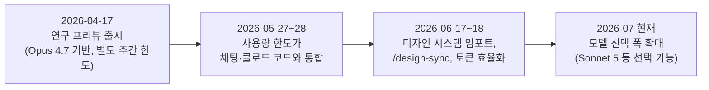
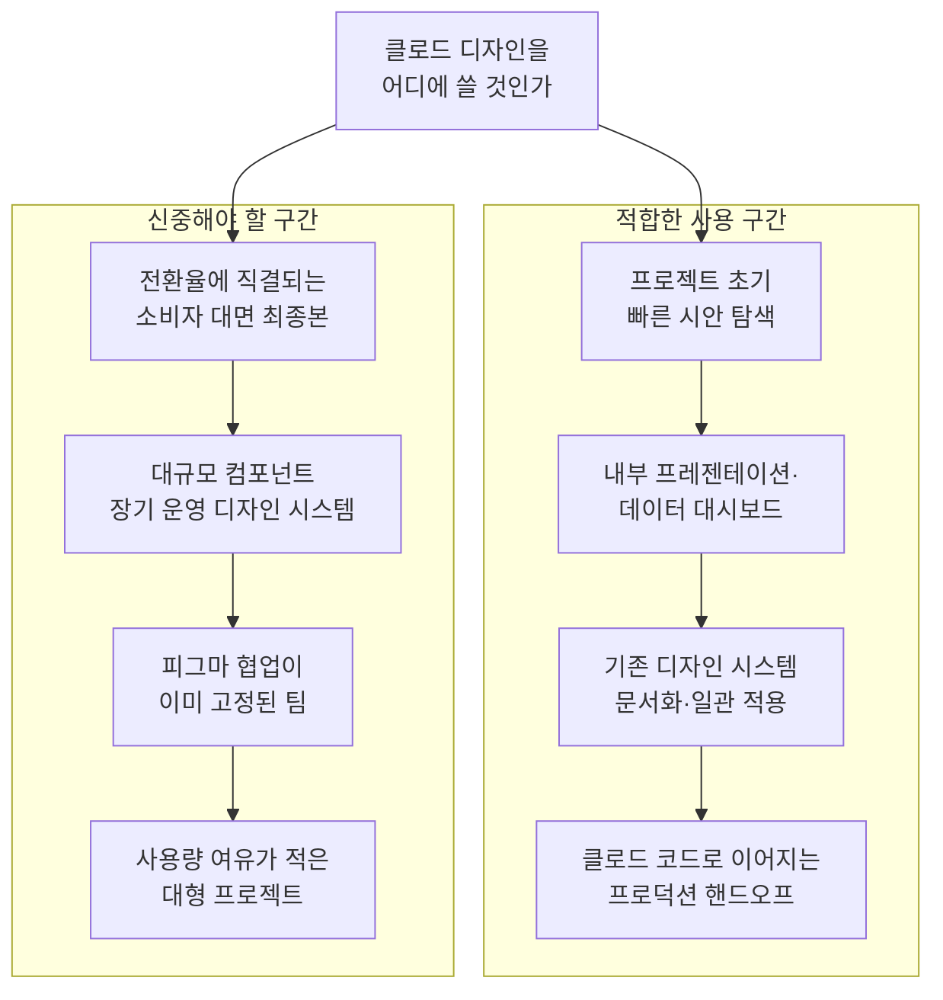

## 이 글의 성격

이 문서는 클로드 디자인을 다룬 원문 원고(브런치 게시글, https://brunch.co.kr/@ab9d16bb4a574e3/14)의 내용을 뼈대로 삼되, 2026년 7월 26일 기준 최신 자료를 다시 검색해 사실관계를 검증하고 보완한 결과물입니다. 아래 내용은 크게 세 갈래로 구분해서 읽으시면 됩니다. 첫째는 앤트로픽의 공식 발표나 공식 문서에서 확인되는 사실입니다. 둘째는 언론과 개별 사용자들의 보도·후기이며, 이는 사실에 가깝지만 앤트로픽이 공식적으로 수치를 밝히지 않은 영역이라는 점을 함께 표시했습니다. 셋째는 실제 클로드 디자인 인터페이스를 직접 조작하면서 확인한 작업 흐름으로, 이는 특정 시점의 화면 구성을 근거로 한 서술이며 이후 업데이트로 세부 요소가 바뀔 수 있다는 전제를 깔고 있습니다. 추측이나 확인되지 않은 수치는 담지 않았고, 확인이 애매한 항목은 아예 다루지 않았습니다.

---

## 1. 클로드 디자인이란 무엇인가

클로드 디자인(Claude Design)은 앤트로픽 랩스(Anthropic Labs)가 2026년 4월 17일 연구 프리뷰(research preview)로 출시한 시각 생성 도구입니다. Claude.ai의 디자인 탭이나 별도 주소(claude.com/product/design)를 통해 접근할 수 있으며, 왼쪽에는 채팅 형태의 대화 패널이, 오른쪽에는 실시간으로 반영되는 캔버스가 배치된 구조를 취합니다. 사용자가 원하는 결과물을 자연어로 설명하면 그 자리에서 프로토타입, 슬라이드, 원페이저, 와이어프레임, 마케팅 자료 같은 시각물이 만들어집니다.

기술적으로는 앤트로픽이 같은 날 함께 공개한 비전 모델 클로드 오퍼스 4.7(Claude Opus 4.7)이 기반입니다. 오퍼스 4.7은 이전 세대 대비 이미지 입력 해상도를 세 배 이상 끌어올린 모델로, 긴 변 기준 2,576픽셀(약 3.75메가픽셀)까지 이미지를 받아들일 수 있습니다. 앤트로픽이 공개한 내부 시각 정확도 벤치마크에서도 이전 세대의 54.5%에서 98.5%로 크게 뛰었다고 밝혔는데, 이는 화면 캡처나 디자인 목업처럼 글자가 촘촘하게 들어간 이미지를 다룰 때 특히 체감되는 개선입니다. 클로드 디자인이 코드베이스나 기존 디자인 파일을 읽어 폰트·색상·컴포넌트 같은 디자인 요소를 추출하고 이후 결과물에 일관되게 반영한다고 설명하는 것도 이 비전 성능 개선과 맞물려 있습니다.

요금 측면에서는 별도 상품이 아니라 기존 Claude Pro(월 20달러)·Max·Team·Enterprise 구독에 포함되는 형태로 제공됩니다. 다만 출시 초기에는 클로드 디자인 사용량이 채팅이나 클로드 코드와는 별도로 집계되는 자체 주간 한도를 가지고 있었습니다. 이 구조는 2026년 5월 하순에 한 차례 크게 바뀌는데, 자세한 내용은 4장의 타임라인에서 다시 다룹니다. 결론만 미리 말하면, 지금은 클로드 디자인 전용의 독립된 한도는 존재하지 않고 채팅·클로드 코드·Cowork와 하나의 통합 사용량 풀을 공유합니다.

---

## 2. 왜 지금 클로드 디자인을 주목해야 하는가

웹디자인 실무에서 가장 오래된 병목은 언제나 첫 시안까지 도달하는 시간이었습니다. 숙련된 디자이너조차 탐색에 쓸 수 있는 시간은 한정되어 있어서, 실제로는 몇 개의 방향만 추려 프로토타입을 만들고 나머지 아이디어는 시도조차 못 하는 경우가 흔합니다. 디자인 배경이 없는 창업자, 기획자, 마케터에게는 이 문제가 한층 더 큽니다. 아이디어는 있는데 그것을 시각적으로 구현하고 공유하는 과정 자체가 진입 장벽이 되어버립니다.

클로드 디자인은 정확히 이 지점을 겨냥합니다. 프롬프트 하나로 몇 초 안에 첫 번째 버전이 나오고, 이후에는 대화, 인라인 코멘트, 슬라이더 조작 같은 여러 경로로 계속 다듬어갈 수 있습니다. 벤처비트(VentureBeat)나 맥스토리즈(MacStories) 같은 매체들의 초기 사용 후기에서도, 프롬프트에서 완성된 인터랙티브 화면까지 도달하는 속도가 기존에 클로드 코드로 같은 작업을 하던 것보다 훨씬 빠르게 느껴졌다는 평가가 반복해서 나옵니다.

다만 이것이 곧 "피그마나 캔바를 대체한다"는 뜻은 아닙니다. 앤트로픽 스스로도 클로드 디자인을 피그마·캔바의 대체재가 아니라 보완재로 소개하고 있고, 실제로 캔바로의 내보내기 기능을 출시 시점부터 함께 넣어두었습니다. 캔바 쪽에서도 이 발표에 공개적으로 화답하며 협업 가능성을 시사한 바 있습니다. 문제는 클로드 디자인이 정확히 어떤 단계의 어떤 문제를 해결하고, 어떤 지점에서는 여전히 한계를 갖는지를 실무자가 정확히 이해하지 못한 채 사용하는 데서 발생합니다. 이어지는 장에서 이 부분을 하나씩 짚어보겠습니다.

---

## 3. 클로드 디자인은 실제로 어떻게 작동하는가

### 3-1. 입력의 다양성과 디자인 시스템 자동 추출

클로드 디자인의 가장 뚜렷한 차별점은 입력 소스의 폭입니다. 빈 프롬프트만이 아니라 이미지, 문서, 기존 코드베이스까지 참고 자료로 넣을 수 있고, 코드베이스를 읽어 기존 디자인 시스템, 즉 폰트·색상·컴포넌트를 자동으로 추출해 이후 결과물에 일관되게 반영합니다. 2026년 6월 17~18일에 있었던 대규모 업데이트에서는 이 기능이 한층 강화되어, 깃허브 저장소나 디자인 파일, 또는 단순 업로드만으로도 조직의 디자인 시스템을 통째로 불러와 이후 생성 결과가 그 시스템의 컴포넌트와 규칙을 따르도록 검증하는 절차가 추가되었습니다. 이는 "매번 처음부터 브랜드 가이드를 다시 설명해야 하는" 기존 프롬프트 기반 도구들의 반복 작업을 상당 부분 줄여주는 변화입니다.

### 3-2. 시작 화면부터 배포 전까지, 실제 작업 흐름

실제 인터페이스를 열어보면 작업 흐름은 대체로 다음과 같은 단계를 밟습니다. 첫 화면에는 "무엇을 만들까요?"라는 질문과 함께 프롬프트 입력창이 있고, 그 아래에는 참고할 디자인 시스템을 지정하는 선택지, 모바일 앱 디자인·슬라이드·문서·와이어프레임·애니메이션·UI 목업·이력서 같은 템플릿 갤러리, 그리고 사용할 모델을 고르는 선택지가 함께 놓여 있습니다. 6월 업데이트 이후로는 이 모델 선택지에서 소네트 5(Sonnet 5)처럼 더 가볍고 빠른 모델을 고를 수도 있어서, 반드시 오퍼스 계열로만 작업이 진행되는 것은 아닙니다. 빠른 반복 작업에는 소네트급을, 완성도가 중요한 최종 단계에는 오퍼스급을 쓰는 식의 구분이 가능해진 셈입니다.

프롬프트를 입력하면 클로드가 곧바로 결과물을 내놓기보다, 먼저 부족한 정보를 질문으로 채우는 단계를 거치는 경우가 많습니다. 예를 들어 "감도 높은 브랜드 에이전시 웹사이트를 하나 만들어줘"처럼 방향성만 던지면, 클로드는 타깃 고객, 서비스 범위, 에이전시 이름, 카피 톤, 페이지 구성, 포트폴리오에 넣을 콘텐츠 성격 같은 항목을 버튼 형태의 선택지로 제시하며 요구사항을 구체화합니다. 각 질문에는 "Decide for me(제가 대신 정해주세요)"라는 선택지도 함께 있어서, 세부 방향을 정하기 어려운 사용자도 진행을 이어갈 수 있게 되어 있습니다. 질문에 답하고 나면 첫 번째 초안이 만들어지는데, 이때 결과물은 정적 이미지가 아니라 실제로 클릭과 테스트가 가능한 HTML/React 코드입니다.

이후 다듬는 단계에서는 편집 화면의 Simple·Pro·Code·Tweaks 네 가지 모드를 오가며 작업합니다. Pro 모드로 들어가면 레이어 트리와 함께 배경·모서리 반경·투명도 같은 외형 속성, 너비·높이 같은 크기 속성, 위치 값, 폰트·크기·색상 같은 타이포그래피 속성을 조정하는 패널이 나타나는데, 이는 피그마의 속성 인스펙터와 상당히 유사한 방식으로 동작합니다. 즉 대화로 큰 방향을 잡고, 필요하면 이 패널에서 픽셀 단위로 세부를 조정하는 이중 구조입니다. 작업이 끝나면 공유 메뉴에서 워크스페이스 공유 범위를 정하거나 공개 아티팩트로 전환할 수 있고, PDF·프로젝트 HTML(zip 또는 단독 실행 파일)·파워포인트(편집 가능한 텍스트와 도형 형태) 중 하나로 내보낼 수 있습니다. 더 많은 형식과 앱으로 내보내는 경로도 별도로 열려 있지만, 뒤에서 다루듯 피그마로의 직접 내보내기는 여기에 포함되어 있지 않습니다.

이 흐름을 정리하면 아래와 같습니다.

한 가지 덧붙이면, 6월 업데이트로 클로드 코드 터미널 안에서 `/design` 명령을 입력해 클로드 디자인 작업을 만들고 편집하고 동기화하는 양방향 연동(`/design-sync`)이 생겼습니다. 즉 디자인에서 코드로 넘기는 흐름뿐 아니라, 코드 작업을 하다가 디자인 쪽 화면을 곧바로 손보고 다시 코드로 돌아오는 흐름도 가능해졌습니다.

---

## 4. 출시 이후 타임라인 — 2026년 4월부터 7월까지

클로드 디자인은 짧은 기간에 여러 차례 굵직한 변화를 겪었습니다. 아래는 확인된 시점을 기준으로 정리한 흐름입니다.

**2026년 4월 17일, 출시.** 앤트로픽 랩스가 클로드 디자인을 연구 프리뷰로 공개했습니다. Pro·Max·Team·Enterprise 구독자에게 순차적으로 롤아웃되었고(Enterprise는 기본값이 꺼진 상태로 배포), 오퍼스 4.7을 기반으로 한다는 점과 캔바로의 내보내기를 지원한다는 점이 함께 발표되었습니다. 이 시점의 언론 보도들은 클로드 디자인을 피그마·어도비·캔바가 있던 응용 계층으로 앤트로픽이 진출한 가장 공격적인 행보로 묘사했습니다.

**2026년 5월 27~28일, 사용량 한도 통합.** 출시 6주 정도가 지난 시점에 클로드 디자인 창 상단에 "클로드 디자인이 이제 Claude.ai와 클로드 코드와 사용량 한도를 공유합니다"라는 안내가 나타나기 시작했습니다. 별도의 보도자료나 공지 없이 서버 쪽에서 조용히 적용된 변경이었고, 일부 사용자는 곧바로 안내를 받았지만 다른 사용자는 며칠 뒤에야 확인하는 등 롤아웃 시점도 제각각이었습니다. 커뮤니티, 특히 레딧의 r/ClaudeAI에서는 이를 두고 "클로드 디자인 전용 한도가 더 넓은 예산으로 합쳐진 것이 아니라, 사실상 없어진 것"이라는 비판적인 반응이 많이 나왔습니다. 이는 어디까지나 언론·커뮤니티의 해석이라는 점을 밝혀둡니다. 다만 별도 한도가 사라지고 통합 풀로 바뀌었다는 사실 자체는 이후 앤트로픽의 공식 업데이트 발표에서도 재확인됩니다.

**2026년 6월 17~18일, 대규모 업데이트.** 파스트컴퍼니(Fast Company)와 벤처비트 등이 함께 보도한 이 업데이트에서 앤트로픽은 세 가지를 강조했습니다. 첫째, 깃허브 저장소나 디자인 파일, 원시 업로드를 통해 조직의 디자인 시스템을 통째로 불러와 이후 생성물이 그 시스템을 따르도록 점검하는 기능입니다. 둘째, 실시간으로 조정 가능한 캔버스 편집 환경(WYSIWYG)의 개선입니다. 셋째, 클로드 코드와의 양방향 연동인 `/design-sync`입니다. 앤트로픽은 이 업데이트로 동일한 결과를 만드는 데 필요한 토큰 소모가 줄었고 오류율도 눈에 띄게 낮아졌다고 밝혔으며, 출시 첫 주에만 백만 명이 넘는 사용자가 사용했다고 발표했습니다. 이 수치는 앤트로픽이 직접 공개한 것으로, 제3자가 독립적으로 검증한 수치는 아니라는 점을 밝혀둡니다.

**2026년 7월, 현재 상태.** 클로드 디자인 자체에 대한 새로운 대형 발표는 아직 없지만, 그 사이 클로드 생태계의 모델 라인업이 빠르게 갱신되었습니다. 오퍼스 4.7의 후속으로 5월 28일 오퍼스 4.8이, 이어서 소네트 5가, 그리고 이 문서 작성 이틀 전인 7월 24일에는 오퍼스 5가 출시되었습니다. 클로드 디자인의 모델 선택지에 소네트 5가 노출되는 것으로 볼 때, 클로드 디자인도 이 생태계 전반의 모델 교체 흐름 안에 있는 것으로 보이나, "클로드 디자인이 공식적으로 오퍼스 4.8이나 오퍼스 5로 기본 모델을 교체했다"는 별도의 공식 발표는 확인되지 않았습니다. 이 부분은 인터페이스에서 관찰되는 선택지를 근거로 한 서술이며, 향후 공식 자료가 나오면 갱신이 필요한 대목입니다. 아울러 7월 중순에는 클로드 코드의 주간 한도를 50% 높이는 프로모션이 8월 19일까지, Cowork의 5시간 한도를 두 배로 늘리는 프로모션이 8월 5일까지 연장 운영 중이라는 점도 공식적으로 확인됩니다. 이 프로모션들은 각각 종료되면 표준 한도로 되돌아간다는 점도 함께 안내되고 있습니다.

---

## 5. 무엇이 강점이고 무엇이 한계인가 — 다섯 가지 축

### 5-1. 입력의 다양성 (강점)

앞서 설명한 대로, 빈 프롬프트뿐 아니라 이미지·문서·기존 코드베이스까지 참고 자료로 넣을 수 있고 이를 통해 기존 디자인 시스템을 자동으로 반영합니다. 6월 업데이트로 이 기능이 한층 정교해졌다는 점은 앞 장에서 다룬 대로입니다. "매번 브랜드 가이드를 새로 설명해야 하는" 반복 작업이 줄어든다는 것이 실무적으로 체감되는 이점입니다.

### 5-2. 결과물의 완성도와 실사용 가능성

생성 결과가 정적 이미지가 아니라 실제로 동작하는 HTML/React 코드라는 점은 프로토타이핑 단계에서 강력한 이점입니다. 다만 이 완성도는 결과물의 성격에 따라 편차가 큽니다. 빠른 프로토타입, 내부 프레젠테이션, 초기 단계 랜딩페이지, 데이터 대시보드처럼 상대적으로 리스크가 낮은 작업에서는 전문 디자이너의 작업을 상당 부분 대신할 수 있다는 평가가 많습니다. 반면 브랜드 완성도가 전환율에 직접 영향을 미치는 소비자 대면 디자인에서는 "시작점" 이상의 역할을 기대하기 어렵다는 지적도 함께 나옵니다. 데이터캠프(DataCamp) 등의 리뷰에서도 앤트로픽 스스로가 이를 피그마·캔바의 대체재가 아니라 보완재로 규정하고 있다는 점, 그리고 실시간 공동 편집(다중 커서, 팀원 코멘트) 기능은 아직 없다는 점을 명확히 짚고 있습니다.

### 5-3. 배포 및 내보내기의 한계

여기서 클로드 디자인의 실질적인 한계가 뚜렷하게 드러납니다. 확인되는 내보내기 형식은 PDF, 편집 가능한 파워포인트, Project HTML(zip 또는 단독 실행 파일), 캔바, 그리고 클로드 코드로의 핸드오프까지입니다. 반면 피그마 파일로의 직접 내보내기와 PNG 같은 정적 이미지 내보내기는 여러 독립 매체와 가이드에서 공통적으로 확인되지 않는다고 보고합니다. 또한 클로드 디자인 자체는 결과물을 인터넷에 배포하지 않습니다. 코드는 받을 수 있지만 이를 실제 서비스로 올리는 것은 사용자의 몫이며, 깃허브 페이지나 넷리파이 드롭 같은 별도 도구로 우회해야 합니다.

피그마로 넘겨야 하는 경우에는 Anima Labs가 만든 클로드 디자인 전용 연동 플러그인이나, html.to.design 크롬 확장 프로그램을 거쳐 HTML을 레이어가 살아있는 피그마 프레임으로 붙여넣는 우회 경로가 실무에서 쓰이고 있습니다. 이 두 방식 모두 제3자가 만든 도구이며 앤트로픽이 공식적으로 지원하는 기능은 아니라는 점을 밝혀둡니다.

| 형식 | 지원 여부 | 비고 |
|---|---|---|
| PDF | 지원 | 즉시 변환하거나 클로드가 재구성한 형태로 제공 |
| 파워포인트(PPTX) | 지원 | 텍스트와 도형을 편집할 수 있는 형태 |
| Project HTML | 지원 | zip 또는 단독 실행 파일 형태 |
| Canva | 지원 | 캔바로 직접 핸드오프 |
| 클로드 코드 핸드오프 | 지원 | `/design-sync`로 양방향 연동 |
| 피그마 직접 내보내기 | 미지원 | Anima, html.to.design 등 제3자 도구로 우회 |
| PNG 등 정적 이미지 내보내기 | 미지원 | 별도 이미지 파일 형태의 내보내기는 제공되지 않음 |

### 5-4. 사용량 한도와 작업 규모의 제약

출시 초기에는 클로드 디자인이 다른 클로드 기능과 별도로 집계되는 주간 한도를 가지고 있었고, 이 한도가 예상보다 빠르게 소진된다는 불만이 사용자들 사이에서 자주 제기되었습니다. 2026년 5월 27~28일 이후로는 이 한도가 채팅, 클로드 코드, Cowork와 공유하는 통합 구조로 바뀌었습니다. 별도 한도를 신경 쓸 필요는 없어졌지만, 반대로 클로드 디자인 작업이 다른 기능에 쓸 수 있는 전체 사용량을 함께 잠식한다는 뜻이기도 합니다.

| 시점 | 변화 | 성격 |
|---|---|---|
| 2026-04-17 | 클로드 디자인 전용 주간 한도로 별도 운영 시작 | 공식 발표 |
| 2026-05-27~28 | 별도 한도 폐지, 채팅·클로드 코드와 통합된 단일 주간 한도로 전환 | 서버단 조용한 적용, 커뮤니티·언론 보도로 확인 |
| 2026-06-17~18 | 통합 한도 구조 재확인, 턴당 토큰 소모 감소 발표 | 공식 발표 |
| 2026-07월 중 | 클로드 코드 주간 한도 50% 상향(~8/19), Cowork 5시간 한도 100% 상향(~8/5) 프로모션 진행 | 공식 발표(한시적 프로모션) |

아울러 Fable 계열처럼 더 무거운 모델은 전체 주간 한도와는 별도로 하위 한도가 매겨지는 구조가 함께 운영되고 있습니다. 예컨대 특정 시점 기준으로는 전체 주간 한도와 별개로 Fable 전용 사용률이 따로 표시되는 식인데, 이는 계정별·시점별로 달라지는 값이라 일반화하기는 어렵고, "무거운 모델일수록 하위 한도가 별도로 관리된다"는 구조 자체만 확인해두면 충분합니다. 대규모 컴포넌트 라이브러리, 다중 페이지 사이트, 세부적인 스타일 시스템처럼 복잡도가 높은 작업에서는 여전히 컨텍스트 한계에 부딪혀 작업을 여러 조각으로 나눠 진행해야 하는 경우가 발생하며, 이는 관리 가능한 수준이지만 조율 비용을 추가로 발생시킵니다.

### 5-5. 디자인 시스템의 일관성

사용자 피드백에서 반복적으로 지적되는 한계는 자체 디자인 시스템으로부터의 이탈(drift)과, 특별히 지시하지 않으면 클로드 디자인 특유의 기본 미감으로 수렴하는 경향입니다. 즉 작업이 길어질수록 처음 설정한 디자인 규칙에서 벗어나는 일이 생기고, 브랜드 아이덴티티가 엄격한 프로젝트에서는 반드시 검증해야 할 지점입니다. 6월 업데이트에서 추가된 디자인 시스템 임포트와 검증 기능은 이 문제를 겨냥한 개선으로 보이지만, 이 개선이 드리프트 문제를 완전히 해소했다는 독립적인 검증 자료는 아직 확인되지 않습니다. 따라서 여전히 작업 중간중간 브랜드 규칙 준수 여부를 사람이 직접 확인하는 체크포인트를 두는 편이 안전합니다.

---

## 6. 클로드 디자인을 어디에 배치할 것인가

이상의 분석을 종합하면, 클로드 디자인은 웹디자인 워크플로우 전체를 대체하는 도구가 아니라 파이프라인의 특정 구간에 배치할 때 가장 효과적인 도구입니다.

**적합한 사용 구간**은 프로젝트 초기 방향성을 좁히기 전의 빠른 시안 탐색, 디자인 리소스가 없는 팀의 내부 프레젠테이션·데이터 대시보드·원페이저 제작, 기존 코드베이스의 디자인 시스템을 문서화하거나 새 화면에 일관되게 적용하는 작업, 그리고 클로드 코드로 곧바로 이어지는 프로덕션 핸드오프가 필요한 프로토타입입니다.

**신중해야 할 구간**은 브랜드 완성도가 전환율에 직접 영향을 미치는 소비자 대면 랜딩페이지의 최종본, 대규모 컴포넌트 라이브러리를 장기적으로 관리해야 하는 디자인 시스템 운영, 피그마 기반 협업 프로세스에 이미 고정된 팀(직접 내보내기 미지원), 그리고 다른 클로드 기능과 사용량을 공유하는 만큼 전체 사용량 소모가 큰 대형 프로젝트입니다.

실무에서는 클로드 디자인으로 첫 번째 방향성을 다섯 개 내외로 빠르게 뽑아낸 뒤, 그중 하나를 골라 피그마에서 디자인 시스템으로 정리하고, 최종적으로 클로드 코드나 별도 퍼블리싱 도구로 배포하는 흐름이 현재로서는 가장 현실적인 조합입니다. 클로드 디자인을 "최종 결과물을 만드는 도구"가 아니라 "탐색 시간을 압축하는 도구"로 규정하고 접근하면 한계 지점에서 실망할 여지가 줄어듭니다.

---

## 7. 도입 전 점검 체크리스트

클로드 디자인을 프로젝트에 도입하기 전, 아래 항목을 먼저 점검해 보시기 바랍니다.

1. 이 작업이 탐색 단계인지 최종 배포 단계인지 구분했는가
2. 결과물에 요구되는 브랜드 완성도 수준이 어느 정도인지 정했는가
3. 참고할 기존 코드베이스나 디자인 파일이 있어 입력값으로 활용할 수 있는가
4. 최종 결과물을 피그마 파일로 넘겨야 하는지 여부를 미리 확인했는가 (직접 내보내기 미지원, 제3자 도구 경유 필요)
5. 클로드 디자인 작업이 채팅·클로드 코드·Cowork와 공유하는 전체 주간 한도를 함께 소모한다는 점을 감안해 프로젝트 규모를 가늠했는가
6. 컴포넌트 수가 많거나 다중 페이지인 경우, 작업을 나눌 계획을 세웠는가
7. 작업이 길어질 경우를 대비해 디자인 시스템 드리프트를 검증할 체크포인트를 정했는가
8. 배포는 클로드 코드 핸드오프로 이어갈지, 별도 호스팅 도구를 쓸지 결정했는가
9. 실시간 공동 편집(다중 커서, 팀원 코멘트)이 필요한 협업 프로젝트는 아닌지 확인했는가
10. 한시적으로 운영 중인 사용량 상향 프로모션(클로드 코드 50% 상향, Cowork 5시간 한도 100% 상향 등)의 종료일을 확인하고, 종료 후 표준 한도로 돌아간다는 점을 감안했는가

---

## 8. 결론

클로드 디자인은 "아이디어에서 시안까지"의 거리를 극단적으로 압축한 도구입니다. 그 압축이 프로젝트의 어느 구간에서 가장 큰 가치를 내는지를 정확히 판단하는 것이 핵심입니다. 4월 출시 이후 석 달 남짓한 기간 동안 사용량 구조가 한 번 크게 바뀌었고, 디자인 시스템 임포트와 클로드 코드 연동이라는 실질적인 기능 확장이 있었으며, 그 기반이 되는 모델 라인업 역시 오퍼스 4.7에서 4.8, 소네트 5, 그리고 이 문서 작성 시점 이틀 전 공개된 오퍼스 5까지 빠르게 갱신되고 있습니다. 다만 여전히 연구 프리뷰 단계라는 점, 피그마로의 직접 내보내기가 없다는 점, 디자인 시스템 드리프트 문제가 완전히 해소되었다는 독립적 검증은 없다는 점은 실무에 적용할 때 반드시 감안해야 할 한계입니다.

---

## 참고자료

- Anthropic, "Introducing Claude Design by Anthropic Labs", 2026-04-17, https://www.anthropic.com/news/claude-design-anthropic-labs
- VentureBeat, "Anthropic just launched Claude Design, an AI tool that turns prompts into prototypes and challenges Figma", 2026-04-17, https://venturebeat.com/technology/anthropic-just-launched-claude-design-an-ai-tool-that-turns-prompts-into-prototypes-and-challenges-figma
- TechDogs, "Anthropic Launches Claude Design In Research Preview", 2026-04-20, https://www.techdogs.com/tech-news/td-newsdesk/anthropic-launches-claude-design-in-research-preview-expands-claude-into-quick-visual-creation
- MacStories, "Hands-On with Anthropic Labs' Claude Design Preview", 2026-04-20, https://www.macstories.net/stories/hands-on-with-anthropic-labs-claude-design-preview/
- DataCamp, "What Is Claude Design? Anthropic's AI Design Tool Explained", 2026-04-28, https://www.datacamp.com/blog/claude-design
- BuildFastWithAI, "Claude Design: Complete Guide for Non-Designers (2026)", 2026-04-18, https://www.buildfastwithai.com/blogs/claude-design-anthropic-guide-2026
- Justin McKelvey, "Claude Design Review 2026", 2026-06-07, https://justinmckelvey.com/blog/claude-design-review
- Medium(Design Bootcamp), "Claude Design, Figma MCP, Claude Code. The Full Loop", 2026-04-18, https://medium.com/design-bootcamp/claude-design-complete-guide-figma-to-frontend-d94dcc06320c
- FindSkill.ai, "Import Your Figma Library Into Claude Design (Without Losing Tokens)", 2026-05-18, https://findskill.ai/blog/claude-design-figma-import-tokens/
- Anima Blog, "How to go from Claude Design to Figma", 2026-04-18, https://www.animaapp.com/blog/genai/how-to-go-from-claude-design-to-figma/
- html.to.design, "All the ways to import from Claude AI to Figma", 확인일 2026-07-26, https://html.to.design/docs/from-claude-ai-to-figma/
- Pasquale Pillitteri, "Claude Design Now Shares Usage Limits With Claude Code", 2026-05-29, https://pasqualepillitteri.it/en/news/3673/claude-design-shares-usage-limits-claude-ai-claude-code
- Fast Company, "Anthropic's updated Claude Design gives vibe coders—and their design overlords—more control", 2026-06-17, https://www.fastcompany.com/91561193/anthropics-updated-claude-design-gives-vibe-coders-and-their-design-overlords-more-control
- The Human Co., "Claude Design's update is mostly about brand consistency", 2026-06-18, https://thehumanco.org/ai-resources/claude-design-update-brand-consistency
- ThePlanetTools.ai, "Claude Design Now Plugs Into Claude Code (June 2026)", 확인일 2026-07-26, https://theplanettools.ai/blog/claude-design-claude-code-integration-2026
- explainx.ai, "Claude Design June 2026: Design Systems & /design-sync", 2026-06-18, https://explainx.ai/blog/claude-design-june-2026-update-design-sync-2026
- Anthropic, "Introducing Claude Opus 4.7", 2026-04-16, https://www.anthropic.com/news/claude-opus-4-7
- Anthropic Platform Docs, "What's new in Claude Opus 4.8" / "What's new in Claude Sonnet 5" / "What's new in Claude Opus 5", 확인일 2026-07-26, https://platform.claude.com/docs/en/about-claude/models/
- Anthropic, "Introducing Claude Sonnet 5", 확인일 2026-07-26, https://www.anthropic.com/news/claude-sonnet-5
- 9to5Mac, "Anthropic upgrades Claude with new Opus 5 model", 2026-07-25, https://9to5mac.com/2026/07/24/anthropic-upgrades-claude-with-new-opus-5-model-details-here/
- Help Net Security, "Claude Code users keep 50% higher limits until July 19", 이후 8월 19일로 연장, 2026-07-13, https://www.helpnetsecurity.com/2026/07/13/claude-code-weekly-limits-promotion-extended/
- The New Stack, "Why Anthropic just doubled Claude Cowork limits at no charge", 2026-06-08(이후 8월 5일까지 연장), https://thenewstack.io/anthropic-claude-cowork-promotion/
- Digital Applied, "Claude Cowork Goes Web and Mobile: A Team Rollout Guide", 확인일 2026-07-26, https://www.digitalapplied.com/blog/claude-cowork-web-mobile-expansion-guide-2026
- MacRumors, "Claude Cowork Expands to iPhone and the Web", 2026-07-07, https://www.macrumors.com/2026/07/07/claude-cowork-mobile-web/
- 원문 초안, 브런치(Brunch), "클로드 디자인, 웹디자인, 웹디자인에 가져온 변화", https://brunch.co.kr/@ab9d16bb4a574e3/14

---

작성일자: 2026-07-26
