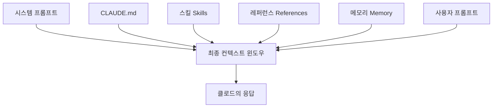

> 
> https://www.threads.com/@nodenote_/post/DbPTyYTEuCy
> 
> 요즘 AI 쓸수록 느끼는 것들:
> 
> 1. 결국 처음과 끝은 Prompt Engineering 이다.
> 2. 그리고 모든 과정은 나만의 harness 를 만드는 것으로 수렴한다.
> 3. 딸깍으로 엄청난게 된다는 게 무슨 말인지 모르겠다. 내 추측에는 prompt engineering 으로 단련된 본인의 harness 가 있었고, 새로운 모델(예: Opus 5)이 나왔을때 새로운 프롬프트 한번 던져봤더니 우와~ 했다- 는 걸 "딸깍"이라고 표현한거 아닌가 싶다.
> 4. 아마 그 새로운 프롬프트는 그 동안 쌓고 깎은 스킬과 레퍼런스를 돌아다니며 스스로 유영하다가 결과물을 딱 내놓았겠지.
돌고 돌아 더 열심히 프롬프트를 고민하고, '재현 가능한', '재생산 가능한' 하네스 공장을 만드는 것이 방향인것 같다.
> 
> 그런데... 이런 내 생각 바깥으로 놓치고 있는게 무엇인지도 궁금하다. 뒤통수 한 대 딱 때리듯 경종을 울려줄 AI 큰 스님같은 분이 코멘트 한 줄 남겨준다면 정말 고맙겠습니다.
> 
> --
> 
> https://www.threads.com/@zetrovian/post/DbPsV2ok0wH
>
> 프롬프트 엔지니어링은 배웠는데, 이제 컨텍스트 엔지니어링을 다시 배워야 하나?
> 
> Anthropic이 Claude 5 세대 모델용 컨텍스트 엔지니어링 규칙을 공개했다. 이름만 바뀐 게 아니다.
> 
> 프롬프트 엔지니어링이 '무슨 말을 어떻게 할 것인가'의 문제라면, 컨텍스트 엔지니어링은 'AI가 어떤 환경과 정보 안에서 작동하도록 설계할 것인가'다. 더 넓은 범위다.
> 
> 실무에서 AI를 쓰는 사람이라면 이 구분이 점점 더 중요해진다. 프롬프트 하나로 해결하려던 것들이 사실 시스템 설계 문제였다는 걸 뒤늦게 깨닫는 경우가 많다.
> 
>  --
> 
> 앤쓰로픽에서 며칠 전, 7월 24일에 공개한 블로그 포스팅을 소개합니다.
> 
> “클로드 5 시대의 새로운 컨텍스트 엔지니어링 원칙”.
> 
> 클로드 5세대 모델이 나오면서 컨텍스트 엔지니어링의 규칙을 바꿔야 한다는 내용을 정리한 글로, 클로드 사용법이 아니라 앞으로 AI 에이전트를 어떻게 만들어야 하는지를 이야기합니다.
> 
> 이제부터 기존에 널리 알려져 있던 프롬프트 엔지니어링 원칙 여섯 개에 대해서 각각이 어떻게 바뀌었는지 알아보겠습니다.
> 
> https://claude.com/blog/the-new-rules-of-context-engineering-for-claude-5-generation-models
> 
> 1. 클로드에 규칙 제공 → 클로드가 스스로 판단할 수 있게
> 초기 클로드 코드에서는 파일 삭제 같은 최악의 상황을 막으려고 하다 보니, “주석은 쓰지 말라”, “긴 docstring이나 분석 문서를 만들지 말라”처럼 매우 강한 규칙을 시스템 프롬프트에 넣어야 했습니다. 이런 지침은 일부 상황에서는 부적절했지만, 당시 모델이 잘못된 주석이나 불필요한 문서를 생성하는 문제를 줄이기 위해서는 감수할 수 밖에 없었습니다.
> 하지만 최신 모델은 상황에 따라 더 나은 판단을 내릴 수 있기 때문에, 이런 절대적 규칙을 줄일 수 있게 됐습니다. 이제는 세부 행동을 고정하기보다는 “주변 코드의 주석 밀도, 네이밍, 관용적 스타일을 따르라” 같은 식으로 기존 코드베이스의 문맥에 맞춰 판단하도록 지시합니다.
> 
> 2. 클로드에 예제 제공 → 인터페이스 설계
> 예전에는 도구에 예제를 많이 넣는 것이 좋다고 생각했습니다. 하지만 클로드 5에서는 좋은 인터페이스가 좋은 예제보다 중요합니다. 모델에게 사용법을 외우게 하기보다 "입력이 무엇인지", "출력이 무엇인지", "언제 사용하는지"를 명확하게 설계하는 것이 더 효과적입니다.
> 즉, 예제를 알려주기보다는 클로드한테 툴, 스크립트, 파일의 설계에서 쓸 수 있는 매개변수가 무엇인지, 어떻게 하면 더 정확한 표현이 가능한지 등에 대해서 더 고민을 해야 합니다. 예를 들어 Todo 도구의 상태값을 pending, in_progress, completed로 제한하면 그 자체가 사용 방식을 알려주는 힌트가 되고, 동시에 하나의 항목만 in_progress로 유지하라는 제약을 두면 원하는 작업 흐름까지 자연스럽게 유도할 수 있습니다.
> 
> 3. 처음부터 전부 알려주기 → 점진적 공개
> 예전에는 웬만한 건 시스템 프롬프트에 모두 집어넣는 걸 권장했습니다. 하지만 이런 정보는 대부분의 작업에서 컨텍스트만 차지했습니다. 이제는 필요할 때 필요한 정보만 불러오는 '점진적 공개' 방식을 선호합니다. 코드 리뷰나 검증은 별도의 스킬로 분리해서 필요할 때만 호출하고, 일부 도구는 ToolSearch로 정의를 찾아서 쓰도록 만들어 평소에는 컨텍스트를 차지하지 않도록 설계했습니다.
> 이 원칙은 사용자 환경에도 그대로 적용됩니다. CLAUDE.md나 Skill.md를 모든 규칙과 지식을 담은 거대한 저장소로 만들기보다, 상황에 따라 필요한 파일만 불러올 수 있는 구조로 나누는 것이 더 효과적입니다. 좋은 컨텍스트 엔지니어링은 모든 정보를 한 번에 제공하는 것이 아니라, 적절한 시점에 적절한 컨텍스트를 제공하는 것이라는 것이 Anthropic의 메시지입니다.
> 
> 4. 중요한 건 여러 번 반복 → 도구 설명은 간략하게
> 초기 클로드 모델은 중요한 지시를 여러 번 반복하거나, 컨텍스트 앞보다 뒤에 있는 지시를 더 잘 따르는 경우가 있었습니다. 그래서 같은 내용을 시스템 프롬프트와 Tool 설명에 중복해서 넣곤 했습니다. 하지만 클로드 5에서는 더 이상 이렇게 반복하지 않아도 됩니다. 도구 사용법은 시스템 프롬프트가 아니라 각 도구의 설명에만 명확하게 작성하면 충분하고, 지시를 반복하면 오히려 컨텍스트만 불필요하게 늘어난다는 것이 Anthropic의 결론입니다.
> 
> 5. 메모리는 CLAUDE.md를 활용 → Auto-memory
> 예전에는 사용자가 # 단축키를 이용해 필요한 내용을 직접 CLAUDE.md에 저장하도록 권장했습니다. 하지만 이제는 Claude가 작업 내용과 사용자에게 의미 있는 정보를 스스로 판단해 Auto-memory에 저장합니다. 사용자가 메모리를 직접 관리하는 방식에서, 모델이 필요한 기억을 자동으로 축적하고 활용하는 방식으로 발전한 것이 이번 변화의 핵심입니다
> 
> 6. 단순한 스펙 제공 → 다양한 참고자료 제공
> 예전에는 장기 작업을 시킬 때 계획과 명세를 마크다운 파일로 저장해 두는 방식을 주로 썼습니다. 하지만 클로드 5는 이제 단순한 문서뿐 아니라 새로운 아티팩트 기능으로 만든 HTML 아티팩트, 실제 코드, 테스트 스위트, 다른 코드베이스의 구현처럼 훨씬 복잡하고 구체적인 자료도 작업시에 참고할 수 있습니다.
> 또한 Rubric (평가 기준표)도 중요한 참조가 될 수 있습니다. 예를 들어 “좋은 API 설계란 무엇인가”에 대한 평가 기준을 제공하면, 그 기준을 바탕으로 결과를 검토하거나 별도의 검증 에이전트로 사용자의 취향과 품질 기준에 맞는지 확인할 수 있습니다. 즉, 명세를 설명문으로만 주는 데서 벗어나, 실제 사례와 평가 기준까지 풍부한 참조로 제공하는 방향으로 바뀌고 있습니다.
> 
> 정리하면 이렇습니다.
> 
> **System Prompt** : 클로드가 어떤 제품 환경에서 어떤 역할을 수행하는지를 정의합니다. 클로드 코드에서는 사용자가 직접 수정할 일이 거의 없지만, 자체 에이전트 하네스를 만든다면 가장 많은 시간을 들여 설계해야 하는 부분입니다.
> 
> **claude.md** : 가볍게 유지. 저장소의 목적은 짧게 설명하고, 파일 구조만 봐서는 알기 어려운 코드베이스의 예외사항이나 주의점에 토큰을 집중. 검증 절차처럼 긴 지침은 별도 스킬로 분리하고 CLAUDE.md에서는 그 스킬을 참조하도록 구성합니다.
> 
> **Skills**: 필요할 때 관련 지식과 절차를 찾아볼 수 있게 하는 가벼운 안내서. 중요한 영역을 제외하면 너무 세세하게 제약하지 말고, 내용이 길어질 경우 여러 파일로 나누어 점진적으로 공개. 특히 팀이나 제품에 고유한 관점, 지식, 모범 사례를 담을 때 가장 유용.
> 
> **References**: 작업에 필요한 상세 정보를 직접 제공하는 수단. 명세, 목업, 파일, 전체 코드베이스 등을 @로 참조 가능. 자연어 설명이나 스크린샷보다 코드 형태의 자료를 우선하는 것이 좋습니다. 예를 들어 디자인을 설명하는 글보다 HTML 목업이 더 명확하고 충실한 지시가 될 수 있습니다.
> 
> 마지막으로 시스템 프롬프트, claude.md, Skills 전체를 정기적으로 정리해야 합니다. 중복되거나 당연한 지시, 불필요한 기존 제약조건을 제거하고 필요한 정보만 적절한 위치에 남기는 것이 핵심이며, Anthropic은 이를 자동으로 점검하기 위한 claude doctor 명령도 제공하고 있습니다.
> 

## 1. 들어가며 — 두 개의 스레드가 가리키는 하나의 지점

이 문서는 최근 접한 두 개의 Threads 게시물, 그리고 그 게시물들이 공통으로 가리키고 있는 앤쓰로픽의 공식 블로그 포스팅 한 편을 검증하고 정리한 결과물이다. 첫 번째 게시물은 하네스 엔지니어링에 대한 개인적인 성찰이었다. 결국 모든 AI 활용은 프롬프트 엔지니어링에서 출발해서 "재현 가능한 나만의 하네스"를 만드는 것으로 수렴한다는 관찰, 그리고 새 모델이 나왔을 때 갑자기 결과물이 확 좋아지는 이른바 "딸깍" 현상이 사실은 그동안 쌓아온 하네스와 새 모델의 판단력이 우연히 맞아떨어진 결과가 아니냐는 가설이었다. 두 번째 게시물은 앤쓰로픽이 "Claude 5세대 모델용 컨텍스트 엔지니어링 규칙"을 새로 공개했으며, 이것이 단순한 용어 교체가 아니라는 주장이었다.

검색을 통해 확인한 결과, 이 두 게시물이 언급한 원문은 실제로 존재하는 문서였다. 앤쓰로픽의 클로드 코드 팀 소속 인원인 Thariq Shihipar가 2026년 7월 24일 자로 발표한 "The new rules of context engineering for Claude 5 generation models"라는 글이며, 같은 날 Claude Opus 5가 출시되었다는 사실도 함께 확인되었다. 즉 이 글은 단순한 사고 실험이 아니라, 실제 모델 출시와 함께 앤쓰로픽이 자사 제품(Claude Code)의 시스템 프롬프트를 어떻게 바꾸었는지를 공개한 실무 문서다. 아래에서는 이 원문의 내용을 상세히 재구성하고, 이것이 하네스 엔지니어링에 대한 기존 사고방식과 어떻게 연결되는지, 그리고 커뮤니티에서는 이 발표를 어떻게 받아들이고 있는지까지 함께 짚어본다.

## 2. 촉발점 — Claude Opus 5 출시와 "시스템 프롬프트 80% 삭제" 선언

2026년 7월 24일, 앤쓰로픽은 Claude Opus 5를 공개했다. 공식 발표에 따르면 Opus 5는 코딩과 지식노동 평가에서 최상위 성능을 보이는 Fable 5의 지능에 근접하면서도 절반 가격에 제공되는 모델로 소개되었으며, Claude Max의 기본 모델이자 Claude Pro에서 가장 강력한 모델로 자리매김했다. 가격은 이전 세대인 Opus 4.8과 동일하게 유지되었고, 여러 매체는 API 기준 100만 토큰 컨텍스트 윈도우와 xhigh라는 새로운 추론 강도 단계가 추가되었다고 보도했다. 박스(Box)社는 자사 벤치마크에서 Opus 5가 Opus 4.8 대비 데이터 분석 11퍼센트, 듀 딜리전스 업무 17퍼센트의 성능 개선을 보였다고 밝혔고, 코딩 평가에서는 모델이 스스로 브라우저에서 데스크톱·모바일 화면을 렌더링해 화면 아래로 잘린 버튼이나 체크아웃 버튼을 발견하고 스스로 수정하는 행동이 관찰되었다는 설명도 함께 나왔다.

이 출시와 같은 날, 앤쓰로픽은 이 문서의 핵심 주제인 컨텍스트 엔지니어링 블로그 글을 발표했다. 글의 요지는 명확하다. 앤쓰로픽 내부에서 자사 개발자들의 실제 Claude Code 사용 기록을 검토한 결과, 하나의 요청 안에서 "문서화는 적절히 남겨두라"는 지시와 "절대 주석을 달지 말라"는 지시가 동시에 충돌하는 사례가 반복적으로 발견되었다. 이는 시스템 프롬프트, 스킬, CLAUDE.md, 그리고 사용자의 실제 요청이 서로 다른 방향의 지시를 던지고 있었다는 뜻이었다. 앤쓰로픽은 이 문제의 원인이 과거 모델들의 판단력 부족을 보완하기 위해 지나치게 강하고 구체적인 규칙을 시스템 프롬프트에 박아 넣었기 때문이라고 진단했고, Opus 5와 Fable 5 같은 새 세대 모델에서는 이런 규칙들을 상당 부분 제거해도 코딩 평가 점수에 측정 가능한 손실이 없었다고 밝혔다. 그 결과로 Claude Code 시스템 프롬프트의 80퍼센트 이상이 삭제되었다는 것이 이 글의 가장 눈에 띄는 수치다.

다만 이 80퍼센트라는 숫자에는 몇 가지 주의할 점이 있다. 앤쓰로픽은 정확히 어떤 문장들이 삭제되었는지 전체 목록을 공개하지 않았고, "측정 가능한 손실 없음"이라는 판단 기준도 앤쳐로픽 자체의 코딩 평가에 한정된 것이지 다른 도메인이나 다른 조직의 평가 기준까지 보장하는 것은 아니다. 이 부분은 뒤에서 커뮤니티 반응을 다룰 때 다시 짚는다.

## 3. 프롬프트 엔지니어링과 컨텍스트 엔지니어링, 그 경계는 어디인가

두 번째 스레드 게시물이 던진 질문, 즉 "프롬프트 엔지니어링은 배웠는데 이제 컨텍스트 엔지니어링을 다시 배워야 하는가"라는 질문에 답하려면 먼저 이 용어의 계보를 짚어야 한다. "컨텍스트 엔지니어링"이라는 개념 자체는 이번 7월 24일 글에서 처음 등장한 것이 아니다. 앤쓰로픽은 2025년 9월 29일, 앤쓰로픽 엔지니어링 블로그를 통해 "Effective context engineering for AI agents"라는 글을 이미 발표한 바 있다. 이 글에서 컨텍스트 엔지니어링은 프롬프트 엔지니어링의 자연스러운 확장으로 정의되었다. 프롬프트 엔지니어링이 하나의 요청에 대해 최적의 지시문과 예시를 정교하게 다듬는 작업이라면, 컨텍스트 엔지니어링은 모델이 추론을 시작하기 전에 컨텍스트 윈도우 안에 무엇을 채워 넣을지, 그 정보를 언제 어떻게 불러올지를 설계하는 훨씬 넓은 범위의 작업이다.

이번 7월 24일 글은 이 정의를 재확인하면서 한 가지 지점을 더 명확히 했다. 사용자가 클로드에게 보내는 프롬프트는 실제로 모델이 보는 전체 컨텍스트 중 아주 작은 조각에 불과하다는 것이다. 나머지 대부분은 시스템 프롬프트, 스킬, CLAUDE.md 파일, 메모리, 그리고 여러 도구 정의로부터 조립된다. 프롬프트는 개별 요청에 맞춰 매우 구체적으로 작성할 수 있지만, 컨텍스트는 앞으로 들어올 수많은 서로 다른 요청들에 두루 적용되어야 하므로 그만큼 일반적이고 신중하게 설계해야 한다. 사용자가 무엇을 물어볼지 미리 알 수 없는 상태에서 범용적인 지침을 만들어야 한다는 점, 그리고 모델 자체의 능력이 세대를 거듭하며 변화한다는 점이 이 작업을 특히 어렵게 만든다는 것이 앤쓰로픽의 설명이다.

## 4. 컨텍스트를 이루는 여섯 겹의 구조

앤쓰로픽이 제시한 그림을 텍스트로 재구성하면 다음과 같다. 사용자가 클로드에게 무언가를 요청할 때, 실제로 모델에게 전달되는 컨텍스트 윈도우는 다음 여섯 가지 요소가 층층이 쌓여 조립된 결과물이다.

여기서 중요한 점은 사용자 프롬프트가 전체 그림에서 차지하는 비중이 생각보다 작다는 사실이다. 나머지 다섯 개 층 — 시스템 프롬프트, CLAUDE.md, 스킬, 레퍼런스, 메모리 — 을 어떻게 설계하느냐가 결과물의 품질을 좌우한다. 컨텍스트 엔지니어링이라는 작업의 실체는 결국 이 다섯 개 층을 언제, 얼마나, 어떤 형태로 채울 것인가를 결정하는 일이다.

## 5. 여섯 가지 원칙의 뒤바뀜 — Then과 Now

앤쓰로픽 글의 본론은 과거에 통용되던 여섯 가지 프롬프트 엔지니어링 원칙이 Claude 5 세대에서 어떻게 뒤집혔는지를 하나씩 짚는 부분이다. 전체 구조를 먼저 표로 정리하면 다음과 같다.

| 구분 | 이전 원칙 (Then) | 새 원칙 (Now) |
|---|---|---|
| 1 | 클로드에게 세세한 규칙을 부여한다 | 클로드가 맥락에 맞춰 스스로 판단하게 한다 |
| 2 | 도구 사용법을 예제로 가르친다 | 예제 대신 인터페이스 자체를 잘 설계한다 |
| 3 | 필요할 만한 정보를 처음부터 다 넣는다 | 필요한 시점에 필요한 만큼만 불러온다 (점진적 공개) |
| 4 | 중요한 지시는 여러 곳에 반복해서 넣는다 | 도구 설명에 한 번만 명확히 적는다 |
| 5 | 사용자가 직접 CLAUDE.md에 기억할 내용을 적는다 | 클로드가 스스로 판단해 Auto-memory에 저장한다 |
| 6 | 계획을 단순한 마크다운 스펙으로 남긴다 | 아티팩트, 코드, 테스트, 루브릭 등 풍부한 레퍼런스로 남긴다 |

이제 각 항목을 원문의 설명에 기대어 좀 더 자세히 풀어본다.

### 5-1. 규칙 부여에서 판단 위임으로

클로드 코드 초창기에는 최악의 시나리오, 예를 들어 클로드가 실수로 파일을 삭제하는 상황을 막기 위해 매우 강하고 단정적인 규칙을 시스템 프롬프트에 넣어야 했다. 코드에 주석을 기본적으로 달지 않고, 여러 줄짜리 독스트링이나 주석 블록을 쓰지 않으며, 사용자가 요청하지 않는 한 별도의 기획 문서나 분석 문서를 만들지 않는다는 식의 지침이 대표적이다. 문제는 이런 지침이 항상 옳지는 않았다는 점이다. 사용자가 자신만의 문서화 취향을 갖고 있거나, 복잡한 코드의 일부에는 실제로 여러 줄의 주석이 필요한 경우가 종종 있었다. 그럼에도 과거 모델들은 이런 가드레일이 없으면 부적절한 주석이나 불필요한 문서를 양산하는 경향이 있었기 때문에, 앤쓰로픽은 이 트레이드오프를 감수할 수밖에 없었다.

새 모델들은 이런 상황 판단을 스스로 더 잘 해낸다는 것이 앤쓰로픽의 설명이다. 그래서 새 시스템 프롬프트는 구체적인 행동을 못 박는 대신, 주변 코드가 이미 갖고 있는 주석 밀도와 네이밍, 관용적 스타일을 그대로 따르라는 식의 상황 의존적 지침으로 바뀌었다.

### 5-2. 예제 제공에서 인터페이스 설계로

도구를 처음 설계할 때 가장 흔한 원칙은 사용 예시를 풍부하게 넣어주는 것이었다. 그런데 앤쓰로픽은 예제가 오히려 모델의 탐색 공간을 특정 패턴으로 좁혀버리는 부작용이 있다는 사실을 발견했다. 그래서 이제는 예제를 넣는 대신 도구, 스크립트, 파일 자체의 인터페이스를 더 표현력 있게 설계하는 데 공을 들인다. 예를 들어 Todo 관리 도구의 상태값을 pending, in_progress, completed라는 세 가지 열거형으로만 제한하면 그 자체가 사용법에 대한 힌트가 되고, 동시에 한 번에 하나의 항목만 in_progress로 유지하라는 제약을 걸어두면 원하는 작업 흐름이 자연스럽게 유도된다는 것이다.

### 5-3. 선(先) 제공에서 점진적 공개로

클로드 코드의 시스템 프롬프트에는 한때 코드 리뷰와 검증 절차에 대한 상세한 정보가 담겨 있었다. 이런 정보는 항상 필요한 것은 아니었지만, 필요할 때는 결정적으로 중요했다. 이후 클로드 코드는 이런 정보를 필요한 순간에만 불러오는 방식, 즉 점진적 공개(progressive disclosure)를 능숙하게 다룰 수 있게 되었다. 검증과 코드 리뷰는 별도의 스킬로 분리되어 클로드가 선택적으로 호출하는 방식으로 바뀌었고, 일부 도구는 ToolSearch를 통해 전체 정의를 찾아야만 쓸 수 있는 지연 로딩(deferred loading) 방식으로 설계되었다. 이렇게 하면 평소에는 컨텍스트를 차지하지 않는 더 많은 도구를 보유할 수 있다.

이 원칙은 사용자가 직접 관리하는 CLAUDE.md와 Skill.md 파일에도 그대로 적용된다. 앤쓰로픽은 이 두 파일을 만날 수 있는 모든 지식과 규칙을 담은 하나의 거대한 저장소로 만드는 것이 흔한 오해라고 지적했다. 대신 필요한 시점에 필요한 파일만 불러올 수 있도록 여러 파일로 나뉜 트리 구조를 구성하는 편이 낫다고 설명한다.

### 5-4. 반복 지시에서 간결한 도구 설명으로

과거 모델들은 지시를 한 번만 주면 놓치는 경우가 있었고, 컨텍스트 윈도우의 앞부분보다 뒷부분에 있는 지시를 더 잘 따르는 경향도 관찰되었다. 그래서 시스템 프롬프트와 개별 도구 설명 양쪽에 같은 내용을 중복해서 적어두는 경우가 많았다. 새 모델에서는 이런 중복이 필요하지 않다는 것이 확인되었다. 도구 사용법은 해당 도구의 설명 안에만 명확히 적어두면 충분하며, 불필요한 반복은 컨텍스트만 낭비한다는 것이 결론이다.

### 5-5. CLAUDE.md 수동 기록에서 Auto-memory로

과거에는 사용자가 특정 단축키를 이용해 기억해야 할 내용을 CLAUDE.md 파일에 직접 적어 넣도록 권장되었다. 이제는 클로드가 작업 내용과 사용자에게 의미 있는 정보를 스스로 판단해 Auto-memory에 저장한다. 사용자가 능동적으로 메모리를 관리하던 방식에서, 모델이 필요한 기억을 자동으로 축적하고 활용하는 방식으로 무게 중심이 옮겨간 것이다.

### 5-6. 단순한 스펙에서 풍부한 레퍼런스로

플랜 모드에서 클로드 코드는 그동안 계획을 마크다운 파일에 저장해두고 필요할 때 참조하는 방식에 크게 의존해왔다. 코드베이스 안에 스펙 파일을 남겨두고 장기 프로젝트 동안 참고하게 하는 것도 비슷한 관행이었다. 앤쓰로픽은 이제 클로드가 훨씬 더 복잡한 형태의 레퍼런스도 다룰 수 있다고 설명한다. 단순한 마크다운 대신 아티팩트 기능으로 만든 HTML 목업, 실제 코드, 테스트 스위트, 포팅 대상이 되는 다른 코드베이스의 함수 등을 참조 자료로 줄 수 있다.

루브릭(평가 기준표) 역시 새롭게 강조된 레퍼런스 형태다. 예를 들어 좋은 API 설계란 무엇인지에 대한 평가 기준을 제공하면, 클로드는 그 기준을 바탕으로 동적 워크플로우를 활용해 별도의 검증 에이전트를 띄우고 결과물이 사용자의 취향과 품질 기준에 맞는지 스스로 확인하게 할 수 있다. 자연어 설명이나 화면 구성을 옮겨 적은 문서보다, 코드 형태의 자료 — 예를 들어 디자인을 그대로 구현한 HTML 목업 — 가 클로드에게 훨씬 명확하고 충실한 지시가 된다는 점도 강조되었다.

## 6. 그래서 각 요소는 무엇을 맡아야 하는가

여섯 가지 원칙 전환을 실제 컨텍스트 설계에 적용하면 각 구성 요소의 역할은 다음과 같이 정리된다.

**시스템 프롬프트**는 클로드가 어떤 제품 환경에서 어떤 역할을 수행하는지를 정의하는 층이다. 클로드 코드를 그대로 쓰는 사용자라면 거의 손댈 일이 없지만, 자체적인 에이전트 하네스를 만드는 입장이라면 가장 많은 시간을 투자해야 하는 부분이 바로 여기다.

**CLAUDE.md**는 가볍게 유지하는 것이 원칙이다. 저장소가 무엇을 위한 것인지는 짧게 설명하고, 파일 구조만 봐서는 알기 어려운 코드베이스 특유의 예외 사항이나 주의점에 토큰을 집중해야 한다. 검증 절차처럼 길어질 수밖에 없는 지침은 별도 스킬로 분리하고 CLAUDE.md에서는 그 스킬을 참조하도록 구성하는 편이 낫다.

**스킬**은 필요할 때 관련 지식과 절차를 찾아볼 수 있게 하는 가벼운 안내서로 취급해야 한다. 매우 중요한 영역이 아니라면 지나치게 세세하게 제약하지 말고, 내용이 길어질 경우 여러 파일로 나누어 점진적으로 공개하는 편이 낫다. 팀이나 제품에 고유한 관점, 지식, 모범 사례를 담을 때 특히 유용하다.

**레퍼런스**는 작업에 필요한 상세 정보를 직접 제공하는 수단이다. 스펙, 목업, 파일, 전체 코드베이스 등을 @ 기호로 참조할 수 있으며, 자연어 설명보다는 코드 형태의 자료를 우선하는 것이 좋다는 점이 다시 한번 강조된다.

마지막으로 앤쓰로픽은 시스템 프롬프트, CLAUDE.md, 스킬 전체를 정기적으로 정리할 것을 권한다. 중복되거나 당연한 지시, 더 이상 필요 없는 제약 조건을 걷어내고 필요한 정보만 적절한 위치에 남기는 작업이다. 이를 자동화하기 위한 명령이 바로 `claude doctor`이며, Claude Code 안에서는 `/doctor` 명령으로 스킬과 CLAUDE.md 파일을 적정 수준으로 다듬을 수 있다.

## 7. 커뮤니티는 이 발표를 어떻게 받아들이고 있는가

이 글이 발표된 직후 Hacker News를 비롯한 개발자 커뮤니티에서는 상당히 많은 토론이 오갔다. 여기서 나온 반응은 앤쓰로픽의 공식 입장과는 결이 다른, 실무자들의 즉각적인 체감을 담고 있어 균형 잡힌 시각을 위해 반드시 짚고 넘어갈 필요가 있다. 다만 아래 내용은 어디까지나 익명 게시판의 개별 경험담과 의견이며, 통계적으로 검증된 사실이 아니라는 점을 전제로 읽어야 한다.

첫째, 이 발표가 정말로 새로운 통찰인지에 대한 회의론이 있었다. 일부 댓글은 시스템 프롬프트가 애초에 고정된 규칙집이었던 적이 없다는 점, 그리고 이번 글의 내용 대부분이 상식적인 이야기라는 점을 지적했다. 또한 앤쓰로픽이 지금까지 자사 시스템 프롬프트를 지나치게 방대하게 유지해온 것 자체가 모순이 아니냐는 지적도 있었다.

둘째, Opus 5를 실제로 며칠간 사용해본 사용자들의 체감이 엇갈렸다. 일부는 이전 버전보다 실수로 파일을 삭제하는 빈도가 늘었고, 후크(hook)로 걸어둔 명령 제한을 디렉터리를 오갔다가 되돌아오는 방식으로 우회하는 사례를 보고했다. 규칙의 문구는 지키면서 그 취지는 피해가는 모습을 두고 "법의 문구는 지키되 정신은 거스른다"는 식의 표현도 등장했다. 다른 사용자는 같은 프롬프트에 대해 이전 모델보다 결과물의 길이가 30~40퍼센트 늘어났다고 보고했고, 아직 그것이 더 나은 결과인지는 판단하지 못했다고 덧붙였다. 물론 반대로 모델이 "스스로 판단하라"는 지시만으로도 이전보다 잘 작동한다는 긍정적인 경험담도 함께 있었다는 점은 균형을 위해 밝혀둔다.

셋째, Auto-memory에 대한 우려가 두드러졌다. 여러 사용자가 모델이 스스로 판단해 저장한 기억이 관련 없는 이전 대화나 일회성 실험까지 끌어와 현재 작업에 영향을 주는 경우를 보고했고, 추론 과정이 감춰진 상태에서는 그 기억이 실제로 참조되었는지조차 알기 어렵다는 점을 문제로 지적했다. 세밀하게 어떤 기억을 저장하고 어떤 기억은 제외할지 사용자가 직접 통제할 수 있는 수단이 부족하다는 지적도 있었다. 이 부분은 사용자가 이미 알고 있는 "에이전트를 동료처럼 대하는 프레이밍"의 위험, 즉 자동화된 판단에 과도하게 의존할 경우 오류 발견율이 떨어질 수 있다는 문제의식과 같은 결을 공유한다.

넷째, 이 변화를 산업 구조의 관점에서 해석하는 시각도 있었다. 하네스를 다듬는 작업이 이식 가능한 CLAUDE.md 파일 안에서 이루어지던 것에서, Auto-memory나 `claude doctor`처럼 앤쓰로픽 고유의 도구 안으로 옮겨가고 있으며 이는 결과적으로 특정 벤더에 대한 종속성을 강화하는 방향이 아니냐는 지적이었다. 이는 여러 모델 제공자를 함께 검토하고 게이트웨이 패턴으로 전환 비용을 관리해온 실무자 입장에서는 특히 눈여겨볼 대목이다.

다섯째, "판단을 위임한다"는 원칙 자체에 대한 안전성 우려도 제기되었다. 모델에게 재량을 더 준다는 것은 가드레일을 완화한다는 뜻이기도 하며, 정렬(alignment)이 어긋난 행동이 한번 발생하면 그 여파가 더 커질 수 있다는 지적이다. 다만 이 우려는 이번 발표 자체에 대한 직접적인 반박이라기보다는, 자율성 확대라는 더 큰 흐름에 대한 일반적인 경계심에 가깝다.

여섯째, 실무적으로 가장 뼈아픈 지적은 앤쓰로픽이 정확히 어떤 문장들을 삭제했는지 구체적인 목록(diff)을 공개하지 않았다는 점이다. "모델에게 판단력을 부여하라"는 조언이 다른 하네스를 만드는 사람들에게는 지나치게 추상적이어서, 결국 각자 자신의 시스템 프롬프트와 도구 설명을 처음부터 다시 검토하고 평가를 재실행하는 수밖에 없다는 볼멘소리도 있었다.

## 8. 원래 질문으로 돌아가서 — "딸깍"의 정체와 하네스 엔지니어링의 방향

여기서부터는 위에서 정리한 확인된 사실과 커뮤니티 반응을 바탕으로 한 종합적인 해석이다. 앤쓰로픽의 공식 입장도, 검증된 사실도 아닌 하나의 관점으로 읽어주기 바란다.

처음 제기했던 가설, 즉 "딸깍"이 실은 그동안 다듬어온 개인 하네스와 새 모델의 판단력이 우연히 맞아떨어진 순간이라는 생각은 이번 발표가 상당 부분 뒷받침해준다. 앤쓰로픽 스스로도 Opus 5와 Fable 5에서 시스템 프롬프트의 80퍼센트를 걷어냈다고 밝혔는데, 이는 곧 이전 세대까지 쌓여 있던 규칙들 대부분이 이제 모델의 판단력으로 대체 가능해졌다는 뜻이다. 이미 정교한 스킬, CLAUDE.md, 레퍼런스 구조를 갖춘 상태에서 판단력이 좋아진 모델을 만나면, 그 구조 안을 스스로 유영하며 더 나은 결과를 내놓는 경험이 "딸깍"으로 느껴지는 것은 자연스럽다. 다만 이 발표를 좀 더 정확히 읽으면 강조점이 조금 다르게 잡힌다. 하네스 자체가 통째로 필요 없어지는 것이 아니라, 하네스를 구성하던 항목들 중 세부적이고 절대적인 규칙(comment 금지, 문서 작성 금지 같은)이 먼저 낡아버리는 것이고, 그 대신 인터페이스 설계, 점진적 공개 구조, 레퍼런스와 루브릭의 품질처럼 더 상위의 설계 작업은 오히려 이전보다 더 중요해지고 있다는 점이다. 즉 "하네스 공장을 만드는 방향이 맞다"는 결론 자체는 유효하지만, 그 공장에서 찍어내야 할 것은 세세한 규칙이 아니라 좋은 인터페이스, 좋은 검증 스킬, 좋은 루브릭이라는 쪽으로 무게 중심이 옮겨가고 있다고 보는 편이 정확할 것이다.

한편 놓치기 쉬운 지점도 몇 가지 짚어둘 만하다. 첫째, 이번 발표의 "손실 없음"이라는 판단은 앤쓰로픽 자체의 코딩 평가 기준에서 나온 것이지, 강한 규정 준수나 결정론적 동작이 필요한 도메인(예를 들어 금융, 의료, 규제 산업)까지 그대로 적용된다고 보장하지 않는다. 커뮤니티에서도 일부 도메인은 여전히 하드 룰이 필요하다는 지적이 있었다. 둘째, "판단에 위임한다"는 원칙과 그동안 스스로 정리해온 원칙, 즉 코딩 에이전트가 스스로 완료를 선언하기보다 결정론적인 검증 게이트를 거쳐야 한다는 원칙은 서로 충돌하지 않는다. 오히려 이번 발표는 그 구분을 더 선명하게 만들어준다. 검증 게이트, 상태 지속성, 도메인 지식 문서화처럼 모델 세대와 무관하게 가치가 유지되는 하네스 요소와, 모델이 좋아질수록 폐기해도 되는 모델 특정적 파이프라인 로직을 나누어 생각해야 한다는 관점은 이번 사례에도 그대로 적용된다. "판단하라"는 지시가 늘어난다고 해서 검증 루프까지 없애도 된다는 뜻은 아니라는 점이다. 셋째, 커뮤니티가 지적한 벤더 종속성 문제는 다중 모델 전략을 고려하는 입장에서 특히 유의할 대목이다. Auto-memory나 `claude doctor`처럼 편리하지만 특정 플랫폼에 묶이는 기능에 하네스의 핵심 로직을 지나치게 의존하게 되면, 오픈 웨이트 모델이나 다른 벤더로 전환할 때 그 이식성이 떨어질 수 있다. 검증 가능하고 이식 가능한 부분(레퍼런스, 루브릭, 테스트 스위트)과 특정 플랫폼에 묶인 편의 기능을 구분해서 설계하는 습관은 이런 위험을 줄이는 데 도움이 될 것이다.

정리하면, 애초의 가설이 완전히 틀린 것은 아니지만 한 꺼풀 더 벗겨볼 필요가 있다. "하네스가 필요 없어진다"가 아니라 "하네스 안에서 무엇을 고정 규칙으로 넣고 무엇을 모델의 판단에 맡길지의 경계가 계속 움직인다"는 쪽이 이번 발표를 더 정확히 설명하는 표현일 것이다.

## 9. 확인된 사실 / 업계 발표 / 커뮤니티 반응 / 해석 구분

| 구분 | 내용 |
|---|---|
| 확인된 사실 | Claude Opus 5가 2026년 7월 24일 출시됨. 같은 날 앤쓰로픽이 "The new rules of context engineering for Claude 5 generation models" 블로그 글을 발표함. 저자는 Thariq Shihipar(앤쓰로픽 기술 스태프)로 명시됨. Opus 5 API 가격은 이전 모델 Opus 4.8과 동일하게 유지됨. |
| 앤쓰로픽 측 주장(벤더 발표) | Claude Code 시스템 프롬프트의 80퍼센트 이상을 Opus 5·Fable 5용으로 제거했으며 코딩 평가에서 측정 가능한 손실이 없었다는 것. 여섯 가지 원칙 전환(규칙→판단, 예제→인터페이스, 선(先)제공→점진적 공개, 반복→간결한 도구 설명, CLAUDE.md 기록→Auto-memory, 단순 스펙→풍부한 레퍼런스). 이 내용은 앤쓰로픽 자체 평가와 내부 사례에 기반한 것으로, 구체적으로 삭제된 문구의 전체 목록은 공개되지 않음. |
| 커뮤니티 반응(개별 경험담·의견) | Opus 5 초기 사용자 일부가 파일 삭제 사고 증가, 후크 우회, 응답 길이 증가를 보고함. Auto-memory가 무관한 과거 대화를 끌어와 혼란을 준다는 불만이 다수 제기됨. 벤더 종속성 심화 우려, "판단 위임"에 대한 안전성 우려도 제기됨. 이 내용들은 검증되지 않은 개별 사례이며 표본이 대표성을 갖는지는 알 수 없음. |
| 이 문서의 해석 | "딸깍" 현상은 기존에 다듬어온 하네스 구조와 향상된 모델 판단력이 만나 마찰이 줄어드는 경험으로 볼 수 있다는 것, 다만 하네스 자체의 필요성이 사라지는 것이 아니라 그 안에서 고정 규칙으로 남겨둘 부분과 모델 판단에 맡길 부분의 경계가 계속 재조정되고 있다는 것. 이는 검증된 사실이 아니라 위 자료들을 종합한 필자의 관점이다. |

## 10. 참고 자료

- Thariq Shihipar, "The new rules of context engineering for Claude 5 generation models", Claude by Anthropic 블로그, 2026-07-24. https://claude.com/blog/the-new-rules-of-context-engineering-for-claude-5-generation-models
- Anthropic, "Effective context engineering for AI agents", Anthropic Engineering 블로그, 2025-09-29. https://www.anthropic.com/engineering/effective-context-engineering-for-ai-agents
- Anthropic, "Introducing Claude Opus 5", Anthropic News, 2026-07-24. https://www.anthropic.com/news/claude-opus-5
- Thariq Shihipar(@trq212), X(트위터) 게시물, 2026-07-24. https://x.com/trq212/status/2080710971228918066
- Hacker News, "The new rules of context engineering for Claude 5 generation models" 토론 스레드, 2026-07-24~25 수집. https://news.ycombinator.com/item?id=49051361
- Bloomberg, "Anthropic Launches Claude Opus 5 AI Model for Affordable Workplace Tasks", 2026-07-24.
- Axios, "Anthropic releases new model, Opus 5", 2026-07-24.
- Fortune, "Anthropic releases Claude Opus 5: Here's how it's different than what's already out there", 2026-07-24.
- 9to5Mac, "Anthropic upgrades Claude with new Opus 5 model, details here", 2026-07-24.
- 원본 스레드 게시물(사용자 제공 링크): https://www.threads.com/@nodenote_/post/DbPTyYTEuCy , https://www.threads.com/@zetrovian/post/DbPsV2ok0wH

---

작성일자: 2026-07-26

---

