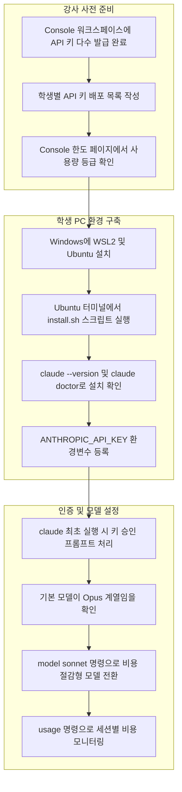
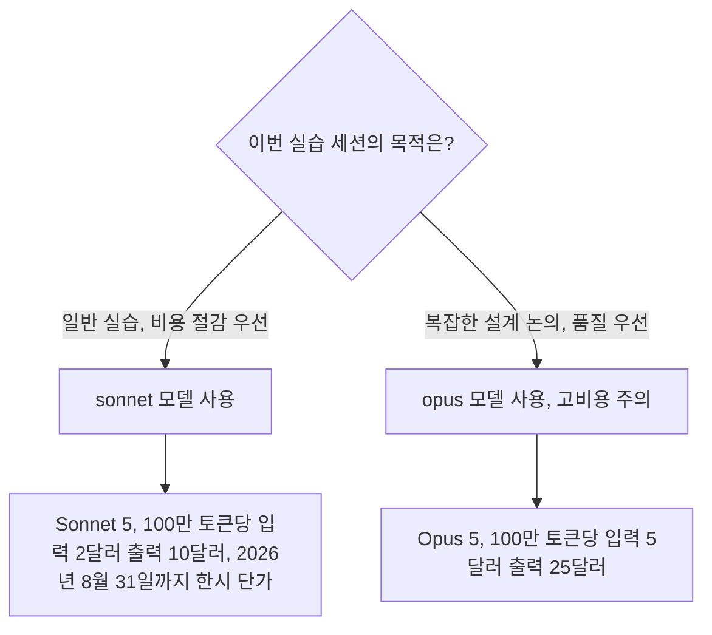

### — API 키 기반 20인 이상 동시 실습 환경 구축과 3가지 실습 시나리오 —

> Claude API 200달러 충전했음. "AI 바이브코딩 기초  클래스" 실습을 Claude Code에서 하고 싶음. "요구사항분석->UI설계->UI개발->실습결과PPT제작"과 같이 구체적인 실습과정이 필요함. 실습 시나리오 3가지 만들어줘.  1가지는 앞에서 말한 STEP을 가지고, 나머지는 IT 개발과 관련 없는 분야로 만들어주면 됨. 20명 이상 수강생이 이미지와 같이 각각 발급 받은 API KEY 이용해서 각각 윈도우 피씨 터미널 (가능하면 UBUNTU WSL) 환경에서 실습할 예정임.

---

## 1. 문서 개요

이 문서는 "AI 바이브코딩 기초 클래스"의 실습 파트를 Claude Code 터미널 환경에서 진행하기 위한 설계안을 정리한 것입니다. 전제 조건은 다음과 같습니다. 첫째, Claude API에 이미 200달러가 충전되어 있고 Claude Console(platform.claude.com)에는 총 33개의 API 키가 발급된 상태입니다. 공유해주신 콘솔 현황을 보면 user01부터 user25까지 이름이 붙은 개별 키들이 "Default" 워크스페이스에 존재하고, 이와 별도로 claude_code_key로 시작하는 키 3개가 "Claude Code"라는 이름의 워크스페이스에 남아 있습니다. 이 "Claude Code" 워크스페이스는 사용자가 Claude Console 계정으로 처음 Claude Code에 로그인할 때 비용 추적을 위해 자동으로 생성되는 전용 워크스페이스이며, 이 워크스페이스 안에서는 사람이 직접 API 키를 새로 만들 수 없다는 점이 공식 문서에 명시되어 있습니다. 즉 현재 남아 있는 claude_code_key 3개는 강사님 본인이 사전 테스트차 로그인했을 때 자동 생성된 흔적이고, 실습에 실제로 배포할 키는 "Default" 워크스페이스의 user01~user25 계열 키가 되는 구조입니다.

둘째, 20명 이상의 수강생이 각자 발급받은 개별 API 키를 자신의 윈도우 PC 터미널, 가능하면 우분투 WSL 환경에서 사용하여 실습을 진행합니다. 셋째, 실습 과정은 "요구사항분석 → UI설계 → UI개발 → 실습결과 PPT 제작"이라는 4단계 파이프라인을 하나의 공통 골격으로 삼되, 이 골격을 그대로 따르는 IT 개발 시나리오 1개와, 같은 골격을 IT 개발이 아닌 업무 분야에 적용한 시나리오 2개, 총 3개의 실습 시나리오를 준비합니다.

문서 전반에서 공식 문서로 확인된 사실과 필자가 계산한 추정치를 명확히 구분해서 표기했습니다. 특히 예산 시뮬레이션 부분은 실제 청구 금액이 아니라 공식 단가표를 바탕으로 한 가정 기반 계산이므로, 실제 수업 전에 Claude Console의 사용량 대시보드로 다시 한번 검증하시길 권장합니다.

---

## 2. 실습 환경 공통 인프라 구축

### 2.1 강사 사전 준비 현황 점검

말씀해주신 콘솔 현황을 기준으로 정리하면 다음과 같습니다.

| 항목 | 현황 |
| --- | --- |
| 발급된 API 키 총수 | 33개 |
| 학생 배포용 키 | Default 워크스페이스의 user02, user18~user25 등 개별 명명된 키 (문서 예시상 25명분까지 확인) |
| 강사 본인 사용 흔적 | Claude Code 워크스페이스에 claude_code_key_* 3개, 각각 0.02~0.04달러 사용 기록 |
| API 키 형식 | sk-ant-api03-로 시작하는 표준 Console API 키 |
| 충전 잔액 | 200달러 |

Claude Console에서 발급한 API 키는 워크스페이스가 소유하며, 발급자가 조직에서 제거되어도 키 자체는 계속 활성 상태를 유지한다는 안내 문구가 콘솔 화면에도 나와 있듯이, 수업이 끝난 뒤 키를 재사용하지 않으려면 콘솔에서 개별적으로 비활성화하거나 삭제하는 절차를 별도로 챙겨야 합니다.

### 2.2 학생 PC 환경 요구사항 (공식 문서 기준)

Claude Code의 공식 시스템 요구사항은 다음과 같습니다. 이 표는 Anthropic의 Claude Code 공식 문서(2026년 기준 최신판)에서 확인한 내용입니다.

| 항목 | 요구사항 |
| --- | --- |
| 운영체제 | Windows 10 버전 1809 이상 또는 Windows Server 2019 이상, Ubuntu 20.04 이상, Debian 10 이상, macOS 13.0 이상 |
| 하드웨어 | 4GB 이상 RAM, x64 또는 ARM64 프로세서 |
| 네트워크 | 인터넷 연결 필수 |
| 셸 | Bash, Zsh, PowerShell, CMD 중 하나 |
| 추가 의존성 | ripgrep(검색 도구, 대부분 Claude Code에 내장되어 별도 설치 불필요) |

윈도우에서 Claude Code를 실행하는 방식은 크게 세 가지이며, 각각의 특성은 다음과 같이 정리됩니다.

| 방식 | 요구사항 | 샌드박스 지원 | 적합한 경우 |
| --- | --- | --- | --- |
| 네이티브 윈도우 | 없음(Git for Windows는 선택) | 미지원 | 윈도우 고유 프로젝트 및 도구 작업 |
| WSL 2 | WSL 2 활성화 | 지원 | 리눅스 툴체인 사용, 명령 실행을 격리하고 싶은 경우 |
| WSL 1 | WSL 1 활성화 | 미지원 | WSL 2를 쓸 수 없는 경우의 대안 |

강사님이 요청하신 대로 "가능하면 UBUNTU WSL" 환경을 기본 경로로 삼고, WSL 설치가 여의치 않은 학생을 위한 대안으로 네이티브 윈도우 경로를 함께 안내하는 이중 트랙 구성을 권장합니다.

### 2.3 설치 절차 — WSL(Ubuntu) 경로 (권장)

1. 윈도우 PowerShell을 관리자 권한으로 열고 `wsl --install -d Ubuntu`를 실행한 뒤 PC를 재부팅합니다. (이 단계는 마이크로소프트의 WSL 설치 절차이며 Claude Code와는 별개의 사전 작업입니다.)
2. 재부팅 후 자동으로 열리는 Ubuntu 창에서 리눅스용 사용자 이름과 비밀번호를 설정합니다.
3. Ubuntu 터미널에서 아래 설치 스크립트를 실행합니다. 이는 Claude Code 공식 설치 스크립트입니다.

   ```bash
   curl -fsSL https://claude.ai/install.sh | bash
   ```

4. 설치가 끝나면 버전을 확인합니다.

   ```bash
   claude --version
   ```

   `2.1.211 (Claude Code)`처럼 버전 번호와 함께 출력되면 정상입니다. 좀 더 자세한 진단이 필요하면 아래 명령으로 설치 상태와 설정 파일 유효성을 점검할 수 있습니다.

   ```bash
   claude doctor
   ```

5. 발급받은 개별 API 키를 환경변수로 등록합니다. 세션이 끝나도 유지되도록 `.bashrc`에 기록하는 방식을 권장합니다.

   ```bash
   echo 'export ANTHROPIC_API_KEY="sk-ant-api03-여기에_개인키_붙여넣기"' >> ~/.bashrc
   source ~/.bashrc
   ```

6. 실습용 폴더를 만들고 그 안에서 `claude`를 실행합니다.

   ```bash
   mkdir ~/vibecoding-lab && cd ~/vibecoding-lab
   claude
   ```

   `ANTHROPIC_API_KEY` 환경변수가 감지되면 Claude Code는 브라우저 로그인 대신 해당 키를 사용할지 한 번 물어보는 승인 프롬프트를 띄웁니다. 이 프롬프트에서 승인하면 이후에는 별도의 로그인 없이 바로 대화형 세션이 시작됩니다. 이는 개별 학생이 별도의 Anthropic 계정을 만들 필요 없이 발급된 키만으로 바로 실습에 들어갈 수 있다는 뜻이므로, 20명 이상 규모의 일회성 실습에 특히 적합한 인증 방식입니다.

### 2.4 설치 절차 — 네이티브 윈도우 경로 (대안)

WSL 사용이 어려운 학생을 위한 대안입니다.

1. PowerShell을 열고 아래 명령을 실행합니다.

   ```powershell
   irm https://claude.ai/install.ps1 | iex
   ```

2. Git for Windows가 설치되어 있으면 Claude Code는 Bash 도구를 사용하고, 없으면 PowerShell 도구로 자동 전환되어 동작합니다. 실습 통일성을 위해서는 Git for Windows 설치를 함께 안내하는 편이 좋습니다.
3. 환경변수는 세션 한정으로는 아래처럼, 영구 등록은 시스템 환경변수 설정 화면을 통해 진행합니다.

   ```powershell
   $env:ANTHROPIC_API_KEY="sk-ant-api03-여기에_개인키_붙여넣기"
   ```

4. 이후 절차는 WSL 경로와 동일하게 폴더 생성 후 `claude` 실행, 키 승인, 실습 시작 순으로 진행합니다.

### 2.5 모델 선택과 비용 통제 — 반드시 짚어야 할 지점

여기서 강사가 반드시 짚고 넘어가야 할 실무적 포인트가 하나 있습니다. Claude Console(Anthropic API 방식) 계정으로 로그인한 경우, 별도로 모델을 지정하지 않으면 Claude Code의 기본 모델은 Opus 계열로 설정된다는 점이 공식 문서에 명시되어 있습니다. Opus 계열은 Sonnet 계열보다 입력 토큰 기준 2.5배, 출력 토큰 기준으로도 2.5배 비싼 단가를 갖고 있으므로, 20명 이상이 동시에 기본값 그대로 실습을 진행하면 같은 작업량으로도 예산 소모 속도가 눈에 띄게 빨라집니다.

따라서 첫 세션을 시작한 직후 모든 학생에게 아래 명령 중 하나를 실행하도록 안내하는 것을 커리큘럼의 필수 단계로 넣는 것을 권장합니다.

```text
/model sonnet
```

또는 터미널에서 `claude` 실행 시 아예 시작 단계부터 지정하는 방법도 있습니다.

```bash
claude --model sonnet
```

세션 도중 현재 얼마나 비용이 나갔는지 확인하고 싶다면 아래 명령으로 해당 세션의 토큰 사용량과 추정 비용을 바로 볼 수 있습니다. 다만 이 수치는 로컬에서 표준 단가로 계산한 추정치이며 실제 청구액과는 다를 수 있고, 정확한 청구 금액은 Claude Console의 사용량 페이지에서 확인해야 한다는 점도 함께 안내하면 좋습니다.

```text
/usage
```

### 2.6 모델별 공식 단가 (2026년 7월 27일 기준, Claude API 공식 가격 문서)

아래 표는 Anthropic의 공식 가격 문서에서 확인한 100만 토큰당 단가입니다.

| 모델 | 입력 (기본) | 출력 |
| --- | --- | --- |
| Claude Haiku 4.5 | 1달러 | 5달러 |
| Claude Sonnet 5 (2026년 8월 31일까지 한시 적용) | 2달러 | 10달러 |
| Claude Sonnet 5 (2026년 9월 1일부터 표준가) | 3달러 | 15달러 |
| Claude Opus 5 / Opus 4.8 | 5달러 | 25달러 |
| Claude Fable 5 | 10달러 | 50달러 |

한 가지 더 참고할 점은, 프롬프트 캐싱이 걸리면 캐시로 읽는 입력 토큰은 기본 입력 단가의 10분의 1 수준으로 청구된다는 것입니다. Claude Code는 대화가 이어지는 동안 자동으로 프롬프트 캐싱을 활용하므로, 실제 체감 비용은 위 표의 단순 곱셈보다 낮게 나오는 경우가 많습니다.

### 2.7 예산 시뮬레이션 (자체 추정치, 실제 청구와 다를 수 있음)

아래 계산은 공식 단가표를 바탕으로 한 필자의 자체 추정이며, 캐싱 효과를 반영하지 않은 다소 보수적인(비용이 높게 잡히는) 가정입니다.

가정: 시나리오 1건, 4단계 전체를 진행할 때 학생 1인이 대략 입력 토큰 10만~15만 개, 출력 토큰 2만~3만 개를 소비한다고 가정합니다. Sonnet 5의 한시 단가(입력 2달러, 출력 10달러)를 적용하면,

- 입력 비용: 150,000 × 2달러 ÷ 1,000,000 ≈ 0.30달러
- 출력 비용: 30,000 × 10달러 ÷ 1,000,000 ≈ 0.30달러
- 시나리오 1건당 세션 비용 약 0.6달러 내외

20명이 3개 시나리오를 모두 진행한다고 가정하면 총 60회 세션이 발생하고, 세션당 0.6달러를 적용하면 약 36달러 수준입니다. 실제로는 학생마다 반복 수정, 추가 질문, 예상보다 긴 대화가 있을 수 있으므로 2~3배의 여유를 두더라도 70~110달러 선에서 방어가 가능하다고 추정됩니다. 즉 200달러 예산은 Sonnet 5로 모델을 통일한다는 전제하에 여유가 있는 편이지만, 만약 기본값인 Opus 계열을 그대로 두고 진행하면 같은 계산에서 비용이 2.5배가량 뛰어 예산을 넘길 위험이 커집니다. 이 지점이 2.5절에서 강조한 `/model sonnet` 전환 안내가 실질적으로 중요한 이유입니다.

### 2.8 동시 접속 부하와 요청 제한(Rate Limit) 고려사항

공유해주신 콘솔 현황에 따르면 학생 배포용 키들이 모두 하나의 조직(Organization), 하나의 워크스페이스 아래에 발급되어 있습니다. Anthropic의 공식 비용 관리 문서는 요청 제한이 개별 사용자가 아니라 조직 단위로 걸린다는 점을 명시하고 있으며, 팀 규모별로 사용자당 권장 토큰당 분당 처리량(TPM)과 분당 요청 수(RPM)를 아래와 같이 제시하고 있습니다.

| 팀 규모 | 사용자당 TPM | 사용자당 RPM |
| --- | --- | --- |
| 1~5명 | 20만~30만 | 5~7 |
| 5~20명 | 10만~15만 | 2.5~3.5 |
| 20~50명 | 5만~7.5만 | 1.25~1.75 |
| 50~100명 | 2.5만~3.5만 | 0.62~0.87 |

강사님의 경우 20명 이상이 동시에 실습을 시작하는 시점, 특히 4단계 중 3단계(UI 개발) 구간에서 다수의 학생이 동시에 파일 생성과 코드 실행 요청을 몰아서 보낼 가능성이 높습니다. 공식 문서에도 "대규모 그룹의 실시간 교육 세션처럼 동시 사용량이 유난히 높을 것으로 예상되는 경우, 사용자당 더 높은 TPM 할당이 필요할 수 있다"는 안내가 별도로 명시되어 있습니다. 따라서 수업 하루 전에 Claude Console의 한도(Limits) 페이지에서 현재 조직의 사용량 등급(Start/Build/Scale)과 실제 TPM·RPM 한도를 확인하고, 필요하다면 사전에 한도 상향을 요청해두는 절차를 운영 체크리스트에 반드시 포함하는 것을 권장합니다.

### 2.9 인프라 구축 흐름 요약



### 2.10 모델 선택 의사결정 참고도



---

## 3. 공통 실습 프레임워크: 4단계 파이프라인

강사님이 제시하신 "요구사항분석 → UI설계 → UI개발 → 실습결과 PPT 제작"이라는 골격은 소프트웨어 개발 생명주기(SDLC)의 축약판이면서 동시에, IT 개발이 아닌 다른 업무에도 그대로 옮겨 적용할 수 있는 범용적인 문제 해결 구조이기도 합니다. 요구사항분석은 "무엇을 왜 만드는가"를 정의하는 단계이고, UI설계는 "그것이 어떤 모습과 흐름으로 사용자 앞에 나타나는가"를 정하는 단계이며, UI개발은 "실제로 동작하는 결과물을 만드는" 단계, 마지막으로 결과 PPT 제작은 "만든 것을 남에게 설명하고 설득하는" 단계입니다. 이 네 단계는 코드를 다루는 개발자뿐 아니라 마케팅 기획자, 인사 담당자, 자영업자 누구에게나 통용되는 일의 순서이기 때문에, 같은 골격을 그대로 두고 실습 대상 분야만 바꾸는 방식이 3개 시나리오 설계에 자연스럽게 들어맞습니다.


각 단계에서 Claude Code가 수행하는 역할과 학생이 확인해야 할 산출물의 유형은 아래와 같이 공통적으로 정리됩니다.

| 단계 | Claude Code의 역할 | 대표 산출물 |
| --- | --- | --- |
| 1단계 요구사항분석 | 학생에게 되물으며 모호한 요구를 구체화, 요구사항 문서 초안 작성 | requirements.md |
| 2단계 UI설계 | 화면 구성요소, 입력·출력 항목, 상호작용 흐름을 문서화 | design.md, 텍스트 기반 화면 구성안 |
| 3단계 UI개발 | 실제 동작하는 웹페이지 코드 작성 및 로컬 실행 확인 | index.html, style.css, script.js 등 |
| 4단계 결과 PPT 제작 | 진행 과정과 결과를 슬라이드 형태로 요약 | 파이썬 스크립트로 생성한 .pptx 파일 |

아래 3개 절에서 이 골격을 각각 IT 개발 분야, 창업·재무기획 분야, 인사·교육 분야에 적용한 구체적 실습 시나리오를 제시합니다.

---

## 4. 시나리오 A — IT 개발 분야: "팀 협업용 할 일 관리 웹앱 바이브코딩"

### 4.1 개요

개발 경험이 있거나 개발에 관심이 있는 수강생을 대상으로, Claude Code를 이용해 실제로 동작하는 소규모 웹 애플리케이션을 처음부터 끝까지 만들어보는 시나리오입니다. 결과물은 브라우저에서 바로 열어볼 수 있는 할 일 관리(To-Do) 웹앱이며, 별도의 서버나 데이터베이스 없이 로컬 파일만으로 동작하도록 범위를 제한해 초급자도 3~4시간 안에 4단계를 모두 완주할 수 있게 설계했습니다.

### 4.2 1단계 — 요구사항분석 (예상 소요 30~40분)

학생은 아래와 같은 방식으로 Claude Code에게 첫 요청을 던집니다.

```text
나는 5명 규모의 소규모 팀에서 함께 쓸 할 일 관리 웹앱을 만들고 싶어.
아직 구체적인 기능은 정하지 않았어. 어떤 요구사항이 필요한지
나에게 하나씩 질문해줘. 질문에 대한 내 답변을 바탕으로
requirements.md 파일에 요구사항 정의서를 정리해줘.
```

Claude Code는 사용자·역할 구분이 필요한지, 마감일 알림이 필요한지, 우선순위 표시가 필요한지 등을 되물으며 대화를 이어갑니다. 이 과정에서 강사는 학생들에게 "정답을 미리 준비하지 말고 Claude가 묻는 질문에 즉흥적으로 답하며 요구사항을 다듬어가는 경험 자체가 실습의 핵심"이라는 점을 강조하면 좋습니다. 대화가 끝나면 결과물로 requirements.md 파일이 생성되며, 여기에는 핵심 사용자 스토리, 필수 기능 목록, 제외 범위(이번 실습에서는 다루지 않을 기능)가 정리되어 있어야 합니다.

### 4.3 2단계 — UI설계 (예상 소요 30분)

```text
방금 정리한 requirements.md 내용을 바탕으로 화면 구성을 설계해줘.
화면에 어떤 영역이 배치되는지, 각 영역에서 어떤 조작이 가능한지를
표 형태로 정리하고, 텍스트로 그린 화면 배치도도 함께 넣어서
design.md 파일로 저장해줘.
```

이 단계에서 Claude Code는 실제 그래픽 목업 대신 텍스트 기반의 화면 배치도(레이아웃을 문자로 표현한 와이어프레임)와 컴포넌트별 상호작용표를 작성합니다. 예를 들어 "상단 입력창에 할 일을 적고 추가 버튼을 누르면 목록에 항목이 추가된다", "각 항목 왼쪽의 체크박스를 클릭하면 완료 처리되고 취소선이 표시된다"와 같은 서술이 design.md에 담기게 됩니다.

### 4.4 3단계 — UI개발 (예상 소요 60~90분)

```text
design.md 내용을 바탕으로 실제로 동작하는 할 일 관리 웹페이지를
만들어줘. index.html, style.css, script.js 세 개 파일로 구성하고,
브라우저에서 파일을 더블클릭해서 바로 열어볼 수 있도록 만들어줘.
완료된 항목은 목록 아래쪽으로 자동 정렬되게 해줘.
```

Claude Code가 초안을 만들면, 학생은 실제로 브라우저에서 파일을 열어 동작을 확인한 뒤 후속 요청으로 다듬어갑니다.

```text
할 일을 입력하지 않고 추가 버튼을 눌렀을 때 안내 문구가 뜨도록 고쳐줘.
```

```text
전체 삭제 버튼을 누르면 정말 삭제할지 한 번 더 물어보게 해줘.
```

이 단계는 이번 실습에서 가장 오래 걸리는 구간이며, 강사는 학생들이 한 번에 너무 많은 요청을 몰아넣기보다 작은 단위로 확인하며 수정해나가도록 안내하는 것이 좋습니다. 이는 Claude Code 공식 문서에서도 권장하는 "작은 단위로 작성하고, 확인하고, 다음으로 넘어가라"는 작업 방식과 일치합니다.

### 4.5 4단계 — 실습결과 PPT 제작 (예상 소요 30분)

```text
지금까지 진행한 요구사항분석, 화면설계, 개발결과를 바탕으로
5장짜리 발표 자료 개요를 만들어줘. 표지, 문제정의, 화면설계 요약,
개발결과 요약, 배운 점과 다음 단계 순서로 구성해줘.
python-pptx 라이브러리를 설치해서 실제 .pptx 파일로 만들어줘.
```

Ubuntu WSL 환경에는 대개 Python 3가 기본 설치되어 있으므로, Claude Code는 `pip install python-pptx`(환경에 따라 `--break-system-packages` 옵션이 필요할 수 있습니다)를 실행하고 슬라이드를 조립하는 스크립트를 작성해 결과물을 만들어냅니다. 만약 학생의 환경에 Python이 없거나 설치가 여의치 않다면, 차선책으로 Claude Code에게 슬라이드별 제목과 본문을 마크다운 개요로 정리해달라고 요청한 뒤 이를 파워포인트에 직접 옮겨 담아도 무방합니다.

---

## 5. 시나리오 B — 비IT 분야(창업·재무기획): "동네 카페 신메뉴 원가 및 손익 시뮬레이터"

### 5.1 개요

개발 경험이 전혀 없는 수강생을 대상으로, 자영업 창업이나 소규모 매장 운영 상황을 가정해 신메뉴의 원가를 계산하고 목표 마진율에 맞는 판매가를 제안해주는 계산 도구를 Claude Code로 직접 만들어보는 시나리오입니다. 이 시나리오의 핵심은 학생이 코드를 한 줄도 몰라도, 자신의 업무 언어로 요구사항을 설명하기만 하면 Claude Code가 이를 동작하는 도구로 옮겨준다는 "바이브 코딩"의 체험 자체에 있습니다.

### 5.2 1단계 — 요구사항분석 (예상 소요 30~40분)

```text
나는 강남 인근에서 10평 규모의 스페셜티 커피 카페를 운영하려고 해.
이번 시즌 신메뉴 3종의 원가와 목표 마진율에 따른 권장 판매가를
계산해주는 도구가 필요해. 나는 개발 지식이 전혀 없으니까,
어떤 정보를 입력받아야 계산이 가능한지 나에게 하나씩 물어봐 주고,
그 답을 바탕으로 requirements.md 파일에 정리해줘.
```

Claude Code는 원재료비 항목 구성, 인건비·임대료 등 고정비 배분 방식, 목표 마진율 기준, 경쟁 매장 가격 비교 필요 여부 등을 되물으며 요구사항을 구체화합니다. 강사는 이 단계에서 "개발자가 아니어도 자신이 잘 아는 업무 지식을 정확하게 설명하는 능력이 곧 좋은 프롬프트를 만드는 능력"이라는 점을 짚어주면 좋습니다.

### 5.3 2단계 — 화면설계 (예상 소요 20~30분)

```text
requirements.md 내용을 바탕으로 이 계산 도구의 화면 구성을
설계해줘. 메뉴별로 원재료 항목과 수량, 단가를 입력하는 영역과
목표 마진율을 입력하는 영역, 계산 결과로 권장 판매가와
예상 이익률이 나오는 영역으로 나눠서 design.md에 정리해줘.
```

### 5.4 3단계 — 프로토타입 개발 (예상 소요 60~90분)

```text
design.md를 바탕으로 실제로 동작하는 원가 계산 웹페이지를
만들어줘. 개발 지식이 없는 사람도 쓸 수 있도록 버튼과 입력창에
안내 문구를 친절하게 달아줘. 계산 결과는 표와 막대 그래프로
함께 보여줘.
```

이후 반복 수정 요청의 예시는 다음과 같습니다.

```text
원재료 항목을 추가하거나 삭제하는 버튼도 만들어줘.
```

```text
목표 마진율을 20퍼센트, 30퍼센트, 40퍼센트로 각각 계산했을 때
결과가 한눈에 비교되도록 표를 하나 더 만들어줘.
```

이 시나리오에서 강사가 특히 강조할 점은, 학생이 코드 자체를 이해할 필요는 없지만 계산 결과가 자신의 업무 상식과 맞는지 검증하는 역할은 반드시 학생 자신이 맡아야 한다는 것입니다. 즉 Claude Code가 만들어준 결과를 그대로 신뢰하지 않고, 익숙한 숫자(예: 아메리카노 한 잔의 대략적인 원가율)를 넣어 계산값이 상식적인 범위에 있는지 직접 확인해보도록 안내합니다.

### 5.5 4단계 — 실습결과 PPT 제작 (예상 소요 30분)

```text
이번 실습으로 만든 원가 계산 도구를 사장님께 보고하는 상황이라고
가정하고, 5장짜리 보고 자료를 만들어줘. 문제 상황, 도구로 해결한
방식, 실제 계산 예시, 기대 효과, 향후 개선 아이디어 순서로 구성하고
python-pptx로 실제 .pptx 파일을 만들어줘.
```

---

## 6. 시나리오 C — 비IT 분야(인사·교육): "신입사원 온보딩 자가진단 체크리스트"

### 6.1 개요

인사·교육 담당자 역할을 가정해, 신입사원이 입사 첫 4주 동안 스스로 온보딩 진행 상황을 점검할 수 있는 체크리스트형 웹 도구를 만드는 시나리오입니다. 이 시나리오는 사람과 관련된 업무 프로세스를 어떻게 디지털 도구로 옮기는지를 보여주는 데 초점이 있습니다.

### 6.2 1단계 — 요구사항분석 (예상 소요 30~40분)

```text
나는 회사 인사팀에서 신입사원 온보딩을 담당하고 있어.
입사 후 4주 동안 신입사원이 스스로 체크할 수 있는 온보딩
자가진단 도구가 필요해. 어떤 항목과 기능이 필요한지
나에게 질문해서 요구사항을 구체화한 뒤 requirements.md에
정리해줘.
```

Claude Code는 주차별 체크리스트 항목 구성, 진행률 표시 방식, 완료하지 못한 항목에 대한 안내 문구 필요 여부, 최종 결과를 인사팀과 공유할 방법 등을 되물으며 요구사항을 다듬습니다.

### 6.3 2단계 — 화면설계 (예상 소요 20~30분)

```text
requirements.md를 바탕으로 화면 구성을 설계해줘. 주차별 탭으로
항목을 나누고, 전체 진행률이 상단에 항상 보이도록 하고,
체크가 끝나면 요약 결과를 볼 수 있는 화면도 함께 설계해서
design.md에 정리해줘.
```

### 6.4 3단계 — 프로토타입 개발 (예상 소요 60~90분)

```text
design.md를 바탕으로 실제로 동작하는 온보딩 체크리스트 웹페이지를
만들어줘. 1주차부터 4주차까지 탭으로 구분하고, 항목을 체크할 때마다
상단의 전체 진행률 막대가 갱신되도록 해줘.
```

```text
모든 항목을 체크하면 축하 문구와 함께 요약 결과 화면으로
자동으로 넘어가게 해줘.
```

```text
글씨 크기를 조금 더 키워서 나이 드신 관리자분도 편하게
읽을 수 있도록 해줘.
```

이 시나리오에서는 학생이 "사용자가 실수로 잘못 체크했을 때 되돌릴 수 있는가", "여러 명이 각자 체크할 때 서로의 기록이 섞이지 않는가"와 같은 실무적인 예외 상황을 스스로 떠올려 Claude Code에게 추가로 요청해보도록 유도하면 좋습니다. 이는 코드를 몰라도 좋은 요구사항을 정의하는 역량, 즉 바이브 코딩 시대에 비개발자에게 더욱 중요해지는 역량을 연습하는 대목입니다.

### 6.5 4단계 — 실습결과 PPT 제작 (예상 소요 30분)

```text
이 온보딩 체크리스트 도구를 인사팀 회의에서 발표한다고 가정하고
5장짜리 발표 자료를 만들어줘. 기존 온보딩 방식의 문제점,
도구로 해결한 방식, 화면 구성 요약, 기대 효과, 도입 시 고려사항
순서로 구성하고 python-pptx로 실제 .pptx 파일을 만들어줘.
```

---

## 7. 3가지 시나리오 비교

| 구분 | 시나리오 A | 시나리오 B | 시나리오 C |
| --- | --- | --- | --- |
| 대상 분야 | IT 개발 | 창업·재무기획 | 인사·교육 |
| 대표 페르소나 | 팀 리드 개발자 | 카페 창업 준비자 | 인사·교육 담당자 |
| 핵심 산출물 | 할 일 관리 웹앱 | 원가·손익 계산 도구 | 온보딩 체크리스트 도구 |
| 개발 경험 전제 | 있으면 유리, 없어도 진행 가능 | 불필요 | 불필요 |
| 난이도 체감 | 중간 | 중하 (계산 로직 검증 필요) | 중하 (예외 상황 설계 필요) |
| 4단계 총 예상 소요시간 | 약 3시간~3시간 30분 | 약 2시간 30분~3시간 | 약 2시간 30분~3시간 |
| 확장 아이디어 | 데이터 저장 기능, 팀원별 담당자 배정 | 여러 메뉴 동시 비교, 계절별 원가 변동 반영 | 관리자용 전체 현황판, 주차별 알림 기능 |

세 시나리오 모두 동일한 4단계 골격을 공유하지만, 학생이 실습 중 마주하는 난관의 성격은 분야마다 다릅니다. 시나리오 A는 "동작하는 코드"를 완성하는 기술적 디테일에서 시간이 소요되는 반면, 시나리오 B와 C는 계산 로직이나 예외 상황을 스스로 정의하는 기획적 사고에서 더 많은 시간이 소요되는 경향이 있습니다. 강사가 세 시나리오를 병행 운영할 경우, 이 차이를 감안해 조를 편성하거나 순회 지도 시간을 배분하는 것이 좋습니다.

---

## 8. 강사 운영 체크리스트

**수업 1주 전(D-7)**
- Claude Console 한도(Limits) 페이지에서 현재 조직의 사용량 등급과 TPM·RPM 한도를 확인하고, 20명 이상 동시 접속 규모에 맞춰 상향이 필요한지 검토합니다.
- user01~user25 계열 키가 각 학생에게 정확히 1개씩 매핑되도록 배포 명단을 작성합니다.
- 대표 학생 1~2명을 대상으로 WSL 설치부터 4단계 전체를 미리 리허설하여 소요시간과 막히는 지점을 점검합니다.

**수업 1일 전(D-1)**
- 전체 학생에게 WSL2 활성화와 우분투 설치를 미리 마쳐오도록 사전 공지합니다. (당일 이 단계에서 시간을 많이 소모하는 경우가 잦습니다.)
- 각 학생에게 배포할 개별 API 키 목록을 최종 확정합니다.

**수업 당일**
- 개인정보 유출 위험을 줄이기 위해 API 키는 화면 공유가 아닌 개별 전달 방식(메모, 개인 메신저 등)으로 나눠줍니다.
- 설치 확인 단계에서 `claude doctor` 실행 결과를 함께 확인시켜, 설치 오류를 조기에 잡아냅니다.
- 3단계(개발) 구간에서 다수의 학생이 동시에 요청을 몰아넣지 않도록 진행 속도를 완만하게 유도합니다.
- 세션 중간중간 `/usage`로 각자의 누적 비용을 확인하도록 안내해, 예산 감각을 함께 익히도록 합니다.

**수업 후**
- Claude Console에서 실제 사용량과 시나리오별 예상치를 비교해 다음 기수 운영에 반영합니다.
- 재사용 계획이 없다면 학생 배포용 키를 콘솔에서 비활성화합니다.

---

## 9. 자주 발생할 수 있는 설치·인증 이슈 안내

Claude Code 공식 문서에는 설치와 로그인 단계에서 자주 발생하는 오류들을 별도로 정리한 문제 해결 페이지가 있습니다. 대표적으로 윈도우에서 PowerShell과 CMD 명령을 혼동해서 발생하는 오류, WSL에서 npm 설치 시 발생하는 오류, 브라우저 로그인 콜백이 WSL2·SSH 환경에서 정상적으로 열리지 않는 경우 등이 문서화되어 있습니다. 실습 중 이런 상황을 마주치면 아래 공식 문서 링크를 학생에게 안내해 자가 해결을 유도하거나, 강사가 미리 해당 페이지를 훑어두고 당일 트러블슈팅에 대비하는 것을 권장합니다.

- 설치 문제 해결: https://code.claude.com/docs/en/troubleshoot-install
- 일반 문제 해결: https://code.claude.com/docs/en/troubleshooting

---

## 10. 참고자료 (확인된 공식 문서, 확인일자 2026-07-27)

- Claude Code 설치 및 시스템 요구사항: https://code.claude.com/docs/en/setup.md
- Claude Code 인증 방식 및 ANTHROPIC_API_KEY 우선순위: https://code.claude.com/docs/en/authentication.md
- Claude Code 빠른 시작 가이드 및 필수 명령어: https://code.claude.com/docs/en/quickstart.md
- Claude Code 모델 설정, 기본 모델(Opus) 및 별칭 안내: https://code.claude.com/docs/en/model-config.md
- Claude Code 비용 관리 및 팀 규모별 요청 제한 권장치: https://code.claude.com/docs/en/costs.md
- Claude API 공식 모델 단가표: https://platform.claude.com/docs/en/about-claude/pricing
- Claude Code 문서 전체 목차: https://code.claude.com/docs/en/claude_code_docs_map.md

---

작성일자: 2026-07-27
