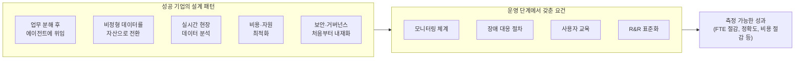

## 1. 왜 성공 사례를 따로 들여다봐야 하는가

앞선 분석에서 다룬 것처럼, 국내외 조사 자료들은 AX(AI Transformation) 시도의 대다수가 눈에 띄는 성과 없이 멈춘다는 사실을 반복적으로 확인해준다. 그런데 같은 조사 자료들은 실패 사례만 다루지 않는다. 소수지만 업무 프로세스를 실제로 재설계하는 데까지 나아간 기업들의 성과는 나머지와 뚜렷하게 갈렸다는 보고가 함께 나온다. 이 문서는 그 소수의 사례, 즉 무엇을 어떻게 했길래 실제로 결과를 냈는지를 중심으로 정리한다. 앞선 문서가 "왜 막히는가"를 다뤘다면, 이 문서는 "어떻게 뚫었는가"를 다루는 셈이다.

여기서 다루는 사례들은 초거대AI추진협의회가 발간한 'AX 사례집', 코리아스타트업포럼(코스포)의 회원사 성과 공유 행사, 그리고 소상공인·중소제조기업 대상 AI 전환 컨소시엄 AXMOS의 활동을 다룬 보도를 근거로 삼았다. 각 사례마다 어느 자료에서 확인된 내용인지 함께 밝혀둔다.

## 2. 성과를 낸 기업들의 공통 패턴

초거대AI추진협의회의 'AX 사례집'은 성공 기업들이 공통적으로 적용한 설계 방식을 다섯 가지로 정리했다. 업무를 잘게 쪼개 AI 에이전트에 위임하는 방식, 정형화되지 않은 데이터를 자산으로 전환하는 작업, 실시간으로 현장 데이터를 분석하는 체계, 비용과 자원의 최적화, 그리고 보안과 거버넌스를 처음부터 설계에 포함시키는 접근이다.

같은 자료는 AX의 성패가 모델의 정확도가 아니라 배포 이후의 운영 설계 완성도에서 갈린다고 짚는다. 구체적으로는 문제가 생겼을 때 무엇을 관찰할 것인지 정해두는 모니터링 체계, 장애가 발생했을 때 대응하는 절차, 실제로 도구를 쓰게 될 사용자를 위한 교육, 그리고 역할과 책임(R&R)을 표준화하는 작업이 실질적인 비즈니스 성과로 이어진다는 것이다. 아래에서 소개할 개별 사례들은 이 다섯 가지 설계 패턴과 네 가지 운영 요건이 실제 현장에서 어떤 모습으로 나타났는지를 구체적으로 보여준다.

## 3. 사례 1 — 지식·사무 분야, 업무 재설계로 FTE 73% 절감

초거대AI추진협의회의 'AX 사례집'에 소개된 지식·사무 분야의 한 기업(자료에서는 B사로 익명 처리되었다)은 AI 에이전트를 도입하면서 기존 업무를 그대로 두고 도구만 얹는 방식을 택하지 않았다. 대신 업무 자체를 에이전트가 처리할 수 있는 단위로 다시 쪼개고 위임하는 방식으로 재설계했다. 그 결과 전일제 환산 인력(FTE) 투입을 최대 73%까지 줄였고, 사내에서 자체적으로 측정하는 AI 생산성 지수는 35% 상승한 것으로 보고되었다.

같은 사례집은 한국 기업 환경 특유의 걸림돌도 함께 짚었다. 지식·사무 분야의 한 엔지니어는 실제 현장에서는 AI가 글을 작성하지 못해서 막히는 것이 아니라, 처리해야 할 자료가 아래아한글(HWP) 형식으로 들어오는 순간부터 작업의 절반이 문서 생성이 아니라 입력 처리 문제로 바뀌어버린다고 지적했다. 공공기관 문서 상당수가 HWP 형식인 한국의 업무 환경에서는, AI 도입의 첫 관문이 모델 성능이 아니라 파일 형식을 안정적으로 읽어들이는 파싱 체계에 있다는 뜻이다. 이 문제를 초기 설계 단계에서부터 반영하지 않으면, 운영 단계로 갈수록 처리 비용이 계속 불어난다는 것이 현장의 진단이었다.

## 4. 사례 2 — 무역·물류 분야, 비정형 문서 자동화로 정확도 99.2% 달성

무역·물류 분야에서는 래블업과 팀리부뜨(대표 최성철, 국립부경대 교원창업기업)가 함께 진행한 프로젝트가 소개되었다. 이 분야의 엔지니어들이 남긴 기록에 따르면, PDF 문서는 겉보기와 달리 안정적으로 텍스트를 추출할 수 있는 형태가 아닌 경우가 많다고 한다. 그래서 비정형 문서를 자동화하려면 문서를 구조화하는 단계, 추출된 내용을 검증하는 단계, 이를 바탕으로 분류나 추천을 수행하는 단계가 동시에 설계되어야 품질이 나온다는 것이 이들의 결론이었다. 만약 문서에서 값을 추출하는 첫 단계부터 흔들리면, 그 이후 단계의 신뢰도는 통째로 무너진다는 것이다.

이 원칙에 따라 재설계한 결과, 이 프로젝트는 문서 작업 시간을 평균 60% 이상 단축했다. 특히 주목할 부분은 자동화 뒤에도 사람이 최종 검수하는 단계를 남겨두었다는 점이다. 완전 자동화 대신 인간 검수 루프를 최종 검증 단계에 포함시킴으로써, HS Code(국제 통일 상품분류 코드) 분류 정확도를 99.2%까지 끌어올렸다. HS Code는 세계관세기구(WCO)가 관리하는 국제 표준 품목 분류 체계로, 분류가 틀리면 통관과 관세 산정에 직접 영향을 주기 때문에 정확도가 특히 중요한 영역이다. 이 사례는 "자동화 비율을 최대로 높이는 것"이 아니라 "어디까지 자동화하고 어디서부터 사람이 확인할 것인가를 명확히 정하는 것"이 성과를 갈랐다는 점을 보여준다.

## 5. 사례 3 — AI 인프라 최적화로 GPU 비용 80% 절감

같은 사례집에는 AI 인프라 운영을 최적화한 사례도 포함되어 있다. 이 사례는 GPU 학습 비용을 아마존웹서비스(AWS)의 온디맨드 요금제 대비 약 80% 절감했고, 개발 생산성은 3배 수준으로 끌어올렸다고 보고되었다. 특히 인프라 활용도 측면에서는 GPU 가동률을 20%에서 85% 이상으로 끌어올렸다는 수치가 제시되었다. 이는 AI 도입이 반드시 새로운 서비스나 업무 자동화의 형태로만 나타나는 것이 아니라, 이미 쓰고 있는 컴퓨팅 자원을 얼마나 효율적으로 운용하느냐의 문제이기도 하다는 것을 보여주는 사례다.

## 6. 사례 4 — 소상공인의 반복 업무, 며칠에서 20분으로

앞의 세 사례가 비교적 규모가 있는 기업의 이야기라면, AXMOS(엑스모스) 컨소시엄이 다룬 사례는 소상공인과 중소제조기업 단위로 내려온다. AXMOS는 투자·자본 조달, 해외 사업화, 제조 현장 AI 솔루션, AI 인프라, AI 역량 교육을 각각 다른 참여사가 나누어 맡는 구조로 운영되며, 실제 현장에 엔지니어가 직접 붙어서 업무를 자동화까지 끌고 가는 이른바 FDE(Forward Deployed Engineer) 방식을 택하고 있다.

이 컨소시엄이 다룬 사례 중 하나는 매달 며칠씩 영수증 정리에 매달리던 한 지역 유통기업이다. 이 기업은 AI 도입 이후 해당 업무를 20분 만에 끝내는 수준으로 바꿨다고 한다. 같은 방식으로 회의록도 자동으로 정리되도록 만들었다. AXMOS는 2026년 7월 14일 서울창조경제혁신센터와 업무협약을 맺고, 업무 프로세스 고도화·AX 솔루션 인프라 구축·전문 인재 양성·AX 프로그램 공동 개발의 네 영역에서 협력하기로 했다고 보도되었다. 이 사례가 앞의 사례들과 다른 지점은, 문제의 원인이 정교한 기술 격차가 아니라 진단·인프라·교육·현장 적용을 동시에 갖추기 어려운 소상공인의 현실적 여건, 그리고 그 여건에 접근할 수 있는 통로 자체가 부족했다는 데 있었다는 점이다.

## 7. 사례 5 — 비개발 직군의 참여율이 핵심 지표가 된 경우

코리아스타트업포럼(코스포)은 2026년 3월 앤트로픽과 협력해 회원사별로 1만 달러 규모의 클로드 API 크레딧을 지원하는 프로그램을 운영했고, 같은 해 7월 16일 이를 실제 업무에 적용한 회원사들의 성과를 공유하는 '더 인사이트: 클로드편' 행사를 열었다. 이 자리에서 메디스트림 정희범 대표는 전사 AI 전환 경험을 소개하며, 비개발 직군 직원 145명 가운데 98%가 매주 AI 개발 도구를 활용하고 있다고 밝혔다.

이 사례에서 눈여겨볼 부분은 성과를 측정하는 기준이다. 정 대표는 AI 전환의 성패가 좋은 도구를 골랐는지보다 직원들이 AI를 실제로 써볼 수 있는 환경을 만들어줬는지에 달려 있다고 밝히며, AI 사용량 자체가 아니라 반복 업무가 실제로 얼마나 줄었는지를 핵심 지표로 삼고 있다고 설명했다. 같은 행사에서 코르카 정영현 대표는 가장 비싼 모델을 쓰는 것이 경쟁력이 아니라, 경험과 성과가 축적되는 시스템을 만드는 것이 핵심이라고 짚었다. 반복 업무는 코드로 자동화하고, 개인이 겪은 시행착오는 조직의 지식으로 남겨야 같은 비용으로 더 큰 성과를 낼 수 있다는 것이다.

## 8. 사례 비교표

| 사례 | 분야 | 핵심 문제 | 취한 조치 | 확인된 성과 | 출처 |
|---|---|---|---|---|---|
| B사(익명) | 지식·사무 | 업무가 도구 위에 얹히기만 함, HWP 등 입력 형식 처리 부담 | 업무를 단위별로 분해해 AI 에이전트에 위임하도록 재설계 | FTE 투입 최대 73% 절감, 사내 AI 생산성 지수 35% 상승 | 초거대AI추진협의회 'AX 사례집' |
| 래블업·팀리부뜨 | 무역·물류 | 비정형 PDF 문서에서 값 추출 시 오류가 후속 단계로 전파 | 구조화·검증·추천 3단계를 함께 설계, 인간 검수 루프 유지 | 문서 작업 시간 60% 이상 단축, HS Code 분류 정확도 99.2% | 초거대AI추진협의회 'AX 사례집' |
| AI 인프라 최적화 사례 | 인프라 운영 | GPU 자원의 낮은 가동률과 높은 학습 비용 | 인프라 운용 방식 최적화 | GPU 비용 약 80% 절감, 개발 생산성 3배, 가동률 20%→85%+ | 초거대AI추진협의회 'AX 사례집' |
| 지역 유통기업 | 소상공인 | 영수증 정리·회의록 작성에 반복적으로 많은 시간 소요 | AXMOS FDE가 현장에 붙어 업무별 자동화 적용 | 영수증 정리 업무를 월 수일에서 20분으로 단축, 회의록 자동화 | AXMOS·서울창조경제혁신센터 관련 보도 |
| 메디스트림 | 헬스케어(비개발 직군 중심) | 비개발 직군의 AI 도구 활용 저조 우려 | 전 직원이 AI를 직접 써볼 수 있는 환경 조성, 반복 업무 감소를 지표화 | 비개발 직군 145명 중 98%가 주간 단위로 AI 도구 활용 | 코리아스타트업포럼 '더 인사이트: 클로드편' |

## 9. 다섯 사례를 관통하는 하나의 패턴

규모도, 업종도, 다루는 문제도 서로 다른 다섯 사례를 나란히 놓고 보면 하나의 공통점이 드러난다. 이 기업들은 모두 "AI에게 무엇을 맡길 것인가"를 먼저 정의한 뒤에 도구를 붙였다는 점이다. B사는 업무를 잘게 쪼개고 나서야 에이전트에 위임할 단위를 찾았고, 래블업·팀리부뜨는 문서를 구조화·검증·추천 3단계로 나눈 뒤에야 자동화 범위를 확정했다. AXMOS는 현장에 엔지니어를 직접 투입해 업무 하나하나를 짚어가며 자동화 가능한 지점을 찾았고, 메디스트림은 도구 자체보다 직원이 실제로 써볼 수 있는 환경과 측정 지표를 먼저 설계했다.

또 하나의 공통점은 완전 자동화를 목표로 삼지 않았다는 것이다. 래블업·팀리부뜨 사례처럼 자동화 이후에도 사람이 최종 확인하는 단계를 의도적으로 남겨둔 경우가 반복적으로 등장한다. 이는 앞선 분석 문서에서 다뤘던 "대표가 원하는 것은 알아서 다 해주는 도구지만, AX가 작동하려면 정제된 규칙과 검증 단계가 필요하다"는 긴장 관계에 대한 하나의 실무적 답변으로 읽을 수 있다. 다시 말해, 성과를 낸 기업들은 이 긴장을 해소하려 하기보다, 사람이 개입하는 지점을 시스템 안에 명시적으로 설계해 넣는 방식으로 다뤘다는 것이다.

## 10. 사실 확인 표

| 내용 | 성격 | 근거 |
|---|---|---|
| B사 FTE 최대 73% 절감, AI 생산성 지수 35% 상승 | 검증된 사실(사례집 보고 기준, 기업명 비공개) | 초거대AI추진협의회 'AX 사례집' 인용 보도(아주경제, 2026.5.11) |
| 래블업·팀리부뜨 문서 작업 시간 60%+ 단축, HS Code 분류 정확도 99.2% | 검증된 사실 | 초거대AI추진협의회 'AX 사례집' 인용 보도, THE VC 기업정보 |
| GPU 비용 80% 절감, 개발 생산성 3배, 가동률 20%→85%+ | 검증된 사실(사례집 보고 기준, 기업명 비공개) | 초거대AI추진협의회 'AX 사례집' 인용 보도 |
| HWP 파일 형식이 AI 도입의 실질적 장벽으로 작용한다는 진단 | 검증된 사실(현장 엔지니어 인터뷰 기준) | 초거대AI추진협의회 'AX 사례집' 인용 보도 |
| 지역 유통기업 영수증 정리 업무 20분 단축, 회의록 자동화 | 검증된 사실(개별 기업 사례) | 코드프레소 블로그(AXMOS 관련, 2026.7.14) |
| AXMOS·서울창조경제혁신센터 업무협약 체결 | 검증된 사실 | 코드프레소 블로그(2026.7.14) |
| 메디스트림 비개발 직군 145명 중 98% 주간 AI 도구 활용 | 검증된 사실(발표 기준) | 벤처스퀘어, 코리아스타트업포럼 '더 인사이트' 행사 보도(2026.7.16) |
| "성과를 낸 기업들의 공통점은 AI에게 맡길 일을 먼저 정의했다는 것"이라는 종합 해석 | 위 개별 사실들을 근거로 한 분석적 정리 | 본 문서의 종합 |

---

작성일자: 2026년 7월 27일
