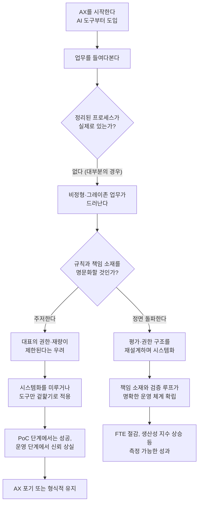

> 
> 요즘 다들 AX 하겠다고 난리인데, 실제 진행하다 보면 현실의 벽에 부딪힘
> 
> 1. AX의 진짜 병목은 기술이 아니라 '비정형화된 기존 업무'
> 2. AX를 시도하면 예상 외로 조직 내에 '정리된 프로세스'가 없다는 사실을 깨닫게 됨. 대부분의 업무는 정리가 안 된 게 아니라, 은연중에 '그레이존'에 방치되어 있음
> 3. 중소기업에서 시스템화는 대표에게 '족쇄'
> 4. 사실 시스템을 '못' 만드는 게 아니라 '안' 만드는 경우가 많음. 규칙과 프로세스는 대표의 명확한 책임과 한계를 의미하기 때문. "대충 말하면 알아서 돌아가던 방식"에 익숙해져 있음
> 5. '내 마음대로 제어하고 싶은 마음'이 시스템을 망친다
> 6. 대표들은 AX를 통해 '알아서 척척 해주는 지능형 도구'를 원함. 하지만 AX가 작동하려면 정제된 시스템과 엄격한 규칙이 필수적
> AX의 환상을 걷어내고 보면, 과연 대표들의 욕망과 AX의 본질이 양립할 수 있을지 의문이 듦
> 
> https://www.threads.com/@junicatz/post/DbRxSJEAWJM
> 

## 1. 이 글이 나온 배경

이 문서는 스레드(Threads)의 "AI Threads" 커뮤니티에서 활동하는 이용자 junicatz가 올린 게시물과, 그 아래 달린 댓글 대화를 바탕으로 정리한 것이다. 게시물은 좋아요 13개, 댓글 4개, 리포스트 2개를 기록하며 나름의 반향을 얻었고, 게시 후 댓글에서 작성자 본인이 자신이 실제로 겪고 있는 상황을 풀어내면서 논의가 한층 구체화되었다. junicatz는 평소 AI 활용과 조직 운영을 주제로 실무적인 글을 올려온 계정으로, 이번 글 역시 이론이 아니라 현장에서 AX(AI Transformation, AI 전환) 프로젝트를 직접 진행하며 부딪힌 문제를 정리한 성격이 강하다.

글의 핵심 메시지는 한 문장으로 요약하면 이렇다. "AX가 막히는 지점은 AI 기술이 아니라, 그 이전에 조직이 스스로를 들여다보길 거부하는 지점에 있다." 아래에서는 원문이 제시한 세 가지 논점을 하나씩 풀어 설명하고, 댓글에서 작성자가 밝힌 실제 해법, 그리고 이 주장이 최근 한국과 해외의 AX 관련 조사 결과와 얼마나 맞아떨어지는지를 함께 짚어본다.

## 2. 원문이 제시한 세 가지 논점

### 2-1. AX의 진짜 병목은 기술이 아니라 "비정형화된 기존 업무"

작성자가 가장 먼저 지적하는 것은, 막상 조직에 AX를 적용하려고 들여다보면 예상과 다른 현실을 마주하게 된다는 점이다. 많은 사람들이 AX를 시작하기 전에는 "우리 회사에는 이미 어느 정도 정리된 업무 프로세스가 있고, 거기에 AI만 얹으면 된다"고 생각한다. 그런데 실제로 프로세스를 하나하나 뜯어보면, 정리된 프로세스라는 것 자체가 거의 존재하지 않는다는 사실을 깨닫게 된다는 것이다.

작성자는 이를 "정리가 안 된 게 아니라, 은연중에 그레이존에 방치되어 있다"고 표현한다. 이 표현이 중요한 이유는, 단순히 "문서화가 안 되어 있다"는 수준의 문제가 아니라는 뜻이기 때문이다. 그레이존에 방치되어 있다는 것은, 누구도 그 업무의 기준과 범위와 책임을 명시적으로 정의한 적이 없고, 그럼에도 불구하고 조직 안에서는 암묵적인 합의와 관행으로 굴러가고 있었다는 의미에 가깝다. AI에게 일을 맡기려면 "이 업무는 무엇을 입력받아 무엇을 판단해서 무엇을 출력하는가"를 명확히 정의해야 하는데, 그 정의 자체가 애초에 존재한 적이 없었다는 게 드러나는 순간이 AX 프로젝트의 첫 번째 벽이라는 이야기다.

### 2-2. 중소기업에서 시스템화는 대표에게 "족쇄"가 된다

두 번째 논점은 조금 더 날카롭다. 작성자는 중소기업에서 프로세스와 규칙을 시스템화하지 "못" 하는 것이 아니라, 실제로는 "안" 하는 경우가 많다고 지적한다. 그 이유로 제시하는 것은, 규칙과 프로세스를 명문화하는 순간 그것이 곧 대표(경영자)의 책임 범위와 권한의 한계를 명확히 규정하는 문서가 되어버린다는 점이다.

바꿔 말하면, 규칙이 없는 상태에서는 대표가 그때그때 상황에 따라 유연하게, 때로는 자의적으로 결정을 내리고 지시를 바꿀 수 있다. "대충 말하면 알아서 돌아가던 방식"이라는 표현이 이 상황을 압축한다. 그런데 이 방식에 시스템을 도입하면, 이제 대표 스스로도 정해진 규칙과 기준 안에서 움직여야 하고, 어떤 결정을 내렸을 때 그 근거와 책임 소재가 명확하게 드러난다. 작성자는 이것이 다수의 중소기업 대표에게 심리적으로, 또 실무적으로 "족쇄"처럼 느껴질 수 있다고 본다. 즉 시스템화에 대한 저항은 기술 이해도의 문제가 아니라, 권한과 책임 구조를 둘러싼 이해관계의 문제라는 것이다.

### 2-3. "내 마음대로 제어하고 싶은 마음"이 시스템을 망친다

세 번째 논점은 앞의 두 가지를 하나로 묶는 결론에 가깝다. 작성자는 많은 대표들이 AX를 통해 기대하는 것이 사실은 모순적이라고 짚는다. 이들이 원하는 것은 "알아서 척척 해주는 지능형 도구"다. 즉 별다른 준비 없이도 AI가 회사 사정을 알아서 파악하고, 알아서 판단하고, 알아서 실행해주기를 바란다는 것이다.

그러나 AI, 특히 업무 자동화나 의사결정을 위임하는 형태의 AI가 제대로 작동하려면 정반대의 조건이 필요하다. 무엇을 입력으로 받고, 어떤 기준으로 판단하며, 어떤 경우에 사람에게 다시 확인을 요청해야 하는지가 정제된 시스템과 엄격한 규칙으로 미리 정의되어 있어야 한다는 것이다. 결국 대표들이 원하는 "알아서 해주는 자유로움"과, AX가 실제로 작동하기 위해 필요한 "정해진 규칙 안에서의 엄격함"은 서로 방향이 반대라는 게 작성자의 결론이다. 글의 마지막 문장, "대표들의 욕망과 AX의 본질이 양립할 수 있을지 의문이 든다"는 이 모순을 압축적으로 드러낸다.

## 3. 댓글에서 드러난 작성자의 실제 경험

게시물이 올라온 뒤, 한 이용자(mingboxs2)가 "그럼에도 불구하고 해낼 방법은 계속 고민 중이신가요?"라고 질문을 던졌다. 이에 대한 작성자의 답변은 이 글 전체에서 가장 구체적인 실무 정보를 담고 있다. 다만 이 부분은 어디까지나 작성자 개인이 실제로 진행 중인 프로젝트에서 겪은 경험담이며, 외부에서 검증 가능한 공개 자료나 통계가 아니라는 점을 먼저 밝혀둔다.

작성자가 정리한 결론은 대략 다음과 같다. 먼저, 정리되지 않았던 가치 판단의 기준들을 매출과 이윤을 중심으로 재정리했다고 한다. 그리고 결과적으로 시스템은 "대표에게 유리한 방향으로 정량화"하는 쪽으로 설계되었다고 밝힌다. 이것이 의미하는 바는, 앞서 2-2에서 지적했던 "시스템화가 대표에게 족쇄가 된다"는 저항을 낮추기 위해, 시스템 자체를 대표의 이해관계와 상충하지 않는 방향으로 설계했다는 뜻으로 읽힌다.

두 번째로 흥미로운 지점은 "상급자의 책임과 한계를 해소하는 건 결국 평가의 권한이더라"는 대목이다. 작성자는 대표(상급자)에게 더 넓은 권한과 평가 권한을 부여하는 방향으로 설계하자 오히려 정리가 수월해졌다고 말한다. 즉 시스템화가 대표의 권한을 빼앗는 방향이 아니라, 대표가 갖고 있던 암묵적 판단 권한을 명시적인 "평가 권한"으로 전환해서 시스템 안에 편입시키는 방식으로 절충점을 찾았다는 것이다. 작성자는 이 접근 방식을 "K-식의 AX"라고 부르며 다소 자조적인 어조로 마무리한다.

이어진 또 다른 댓글(fizzmung_making)은 "보통 1번에서 못 넘어간다", 즉 위에서 설명한 세 가지 논점 중 첫 번째 단계, 다시 말해 비정형 업무를 발견하고 정리하는 단계에서 대다수의 시도가 좌초된다는 취지의 반응을 남겼다. 이에 작성자는 자신도 업무를 정리하는 과정에서, 그동안 처리되어 온 일들의 상당수가 "개인 드리블", 즉 개별 담당자가 그때그때 임기응변으로 처리해 온 것들이었다는 사실을 새삼 확인하고 있다고 답했다.

## 4. 이 주장은 근거가 있는가 — 최근 국내외 조사 결과와의 대조

원문은 한 사람의 현장 경험을 바탕으로 한 주장이지만, 최근 발표된 여러 국내외 조사 결과는 이 주장의 큰 방향과 상당 부분 일치한다. 아래에서는 신뢰할 수 있는 출처를 통해 확인한 내용만을 정리한다.

### 4-1. "기술이 아니라 조직과 인적 요인"이라는 진단은 폭넓게 확인된다

2025년 7월 MIT가 발표한 기업 AI 실태 보고서("The GenAI Divide")는 리더 150명 인터뷰, 직원 350명 설문, 실제 배포 사례 300건을 분석한 결과, 생성형 AI 파일럿 프로젝트의 약 95%가 손익에 유의미한 영향을 주지 못한 채 멈췄고, 실제로 측정 가능한 가치를 만들어낸 곳은 5%에 불과하다고 밝혔다. 이 조사가 짚은 원인은 모델 성능의 부족이 아니라 설계와 조직 구조의 문제였다는 점에서, 원문이 말하는 "기술이 아니라 비정형화된 업무 구조가 병목"이라는 진단과 방향이 일치한다.

같은 맥락에서 2025년 11월 발표된 맥킨지의 글로벌 서베이는 AI를 전사 규모로 확산한 기업이 전체의 3분의 1 수준에 그치고, 나머지 3분의 2는 여전히 파일럿 단계에 머물러 있다고 밝혔다. 인력관리 컨설팅사 Prosci의 분석을 인용한 국내 자료에 따르면, AI 실패 요인의 63%가 기술이 아닌 인적 요인에서 비롯되며, AI 기술이 고도화될수록 오히려 이니셔티브 포기율이 1년 사이 17%에서 42%로 급증한 것으로 나타났다. 이는 도구 자체의 성능이 좋아진다고 해서 조직의 수용 문제가 저절로 해결되지는 않는다는 뜻으로, 원문의 세 번째 논점(대표의 통제 욕구와 시스템의 엄격함이 충돌한다는 지적)과도 맞닿아 있다.

### 4-2. 국내 중소·제조업 현장의 통계도 비슷한 그림을 보여준다

한국인공지능·소프트웨어산업협회(KOSA)가 발표한 자료에 따르면, 국내 제조업의 AI 활용률은 17.9% 수준에 머물러 있으며, AI를 도입하지 못하는 가장 큰 원인으로 "AI 도입 영역과 공정 파악의 어려움"이 41.6%로 가장 높게 나타났다. 이는 원문이 말한 "정리된 프로세스가 없다는 사실을 뒤늦게 깨닫는다"는 경험과 사실상 같은 현상을 통계로 보여주는 수치라고 볼 수 있다.

또한 초거대AI추진협의회가 발간한 'AX 사례집'은 국내 기업들의 AX 실패 원인을 크게 네 가지로 정리했다. 책임 소재(R&R)가 불명확한 점, 운영 단계에서의 모니터링 부재, 현장 데이터의 편차에 대응하지 못하는 점, 그리고 거버넌스 부재로 도입 자체가 가로막히는 점이다. 이 네 가지 중 상당수가 "누가 결정하고 누가 책임지는가"라는 권한과 책임의 문제로 수렴한다는 점에서, 원문의 두 번째 논점, 즉 시스템화가 대표의 책임과 권한 구조를 건드리는 문제라는 지적과 궤를 같이한다.

### 4-3. 반대로, 성공한 사례들은 무엇을 했는가

같은 조사 자료들은 실패 사례만 다루지 않는다. 업무 프로세스를 실제로 재설계한 기업들의 성과는 뚜렷하게 갈렸다는 보고도 함께 나온다. 한 사례(자료에서는 B사로 익명 표기)는 AI 에이전트 도입 후 전일제 환산 인력(FTE) 투입을 최대 73%까지 줄이고, 사내 AI 생산성 지수를 35% 끌어올린 것으로 보고되었다. 또 다른 사례에서는 문서 작업 시간을 평균 60% 이상 단축하면서도, 사람이 검수하는 단계를 남겨두는 방식으로 특정 분류 작업의 정확도를 99.2%까지 끌어올렸다고 한다.

이 두 부류의 사례를 나란히 놓고 보면 하나의 경향이 드러난다. 실패한 쪽은 대체로 AI 도구를 기존 업무 위에 그대로 얹기만 한 경우였고, 성공한 쪽은 업무 프로세스 자체를 다시 설계하면서 책임 소재와 검증 단계를 명확히 규정한 경우였다는 것이다.

## 5. 구조로 정리하면

원문과 댓글, 그리고 위에서 살펴본 조사 자료들을 종합하면, AX 프로젝트가 좌초하는 과정은 대략 다음과 같은 흐름으로 그려볼 수 있다.

이 흐름에서 갈림길은 한 곳뿐이다. 정리되지 않은 업무가 드러났을 때, 그것을 회피하지 않고 권한과 책임 구조까지 포함해 다시 설계하느냐, 아니면 기존의 암묵적 관행을 건드리지 않은 채 AI 도구만 그 위에 얹느냐다. 원문이 말하는 "K-식의 AX", 즉 대표에게 유리한 방향으로 시스템을 정량화하면서 동시에 평가 권한을 확장해주는 절충안은, 이 갈림길에서 완전한 정면 돌파도 완전한 회피도 아닌 제3의 경로를 택한 사례로 볼 수 있다.

## 6. 실패 사례와 성공 사례 비교

| 구분 | 좌초하는 경우 | 성과를 낸 경우 |
|---|---|---|
| 접근 방식 | 기존 업무 위에 AI 도구만 추가 | 업무 프로세스 자체를 재설계 |
| 책임 소재 | 불명확하게 남겨둠 | 명확히 정의하고 문서화 |
| 검증 단계 | 별도 검증 없이 결과를 그대로 신뢰 | 사람의 검수 루프를 남겨둠 |
| 대표(경영자)의 태도 | 암묵적 재량을 유지하려 함 | 권한을 평가 구조 등으로 명시화 |
| 결과 | PoC는 성공해도 운영 단계에서 신뢰 상실 | 인력 투입 절감, 생산성 지수 상승 등 측정 가능한 성과 |

## 7. 정리

이 게시물이 던지는 메시지는 결국 AX라는 용어가 주는 인상과 실제 현실 사이의 간극에 관한 것이다. AX는 흔히 새로운 AI 도구를 얼마나 잘 골라 쓰느냐의 문제로 받아들여지지만, 실제로 조직 안에서 벌어지는 일은 그보다 앞선 단계, 즉 그동안 명시적으로 정리한 적 없는 업무와 권한과 책임의 구조를 있는 그대로 마주하는 일에 가깝다. 그리고 그 구조를 다시 짜는 과정은 필연적으로 조직 내 권한을 쥔 사람들의 이해관계와 부딪히게 된다는 것이 원문의 핵심 통찰이다.

최근 발표된 국내외 조사들 역시, 생성형 AI 프로젝트 대다수가 성과로 이어지지 못하는 이유를 모델의 성능이 아니라 조직의 준비 상태와 책임 구조에서 찾고 있다는 점에서 이 글의 문제의식과 상당 부분 맞닿아 있다. 다만 원문의 결론부, 즉 "대표에게 유리하게 정량화하고 평가 권한을 확대함으로써 절충점을 찾았다"는 대목은 작성자 개인의 실무 경험이며, 이것이 모든 조직에 적용 가능한 일반적 해법인지, 아니면 특정 상황에서만 통하는 임시방편인지는 아직 검증된 바가 없다는 점을 함께 밝혀둔다.

## 8. 사실 확인 표

| 내용 | 성격 | 근거 |
|---|---|---|
| AX 실패의 핵심 원인이 기술이 아닌 조직·인적 요인이라는 진단 | 검증된 사실(다수 조사 일치) | MIT "The GenAI Divide"(2025.7), 맥킨지 글로벌 서베이(2025.11), Prosci 분석 |
| 국내 제조업 AI 활용률 17.9%, 도입 애로 1위가 "영역·공정 파악의 어려움"(41.6%) | 검증된 사실 | 한국인공지능·소프트웨어산업협회(KOSA) 조사 |
| 국내 AX 실패 4대 원인(R&R 불명확, 모니터링 부재, 데이터 편차, 거버넌스 부재) | 검증된 사실 | 초거대AI추진협의회 'AX 사례집' |
| 업무 재설계 기업의 FTE 최대 73% 절감, 생산성 지수 35% 상승 등 성과 수치 | 검증된 사실(개별 사례 보고 기준) | 초거대AI추진협의회 'AX 사례집' 인용 보도 |
| "시스템화가 대표에게 족쇄로 느껴져 회피된다"는 진단 | 작성자의 현장 관찰(정성적 주장) | 원문 게시물 |
| "매출·이윤 중심 정량화 + 평가 권한 확대"로 절충했다는 해법 | 작성자 개인의 실무 경험담, 외부 검증 자료 없음 | 원문 댓글 |

---

작성일자: 2026년 7월 27일
