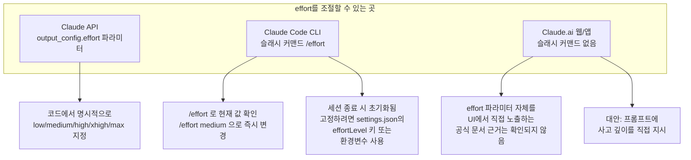
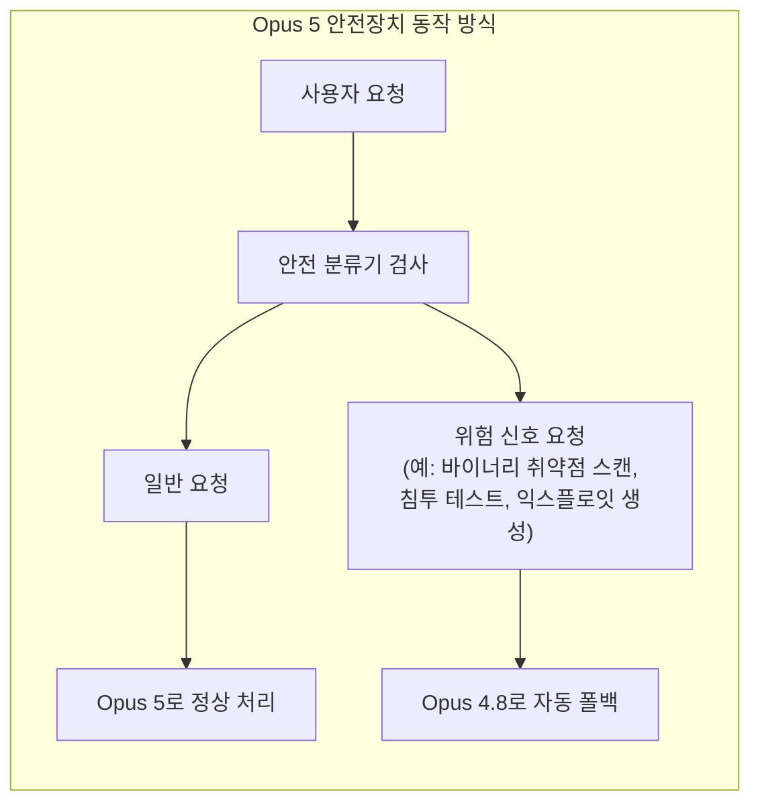

## — Threads 게시글 팩트체크와 실전 가이드

> 
> https://www.threads.com/@billionnapkin/post/DbQjuxwEYp0
> 
> Claude Opus 5를 먼저 써보며 가장 먼저 바꾼 설정은 프롬프트가 아니라 ‘추론 강도’였습니다. Opus 5는 빠르고 능동적이지만, 복잡한 작업에서 높은 추론 강도를 선택하면 필요 이상으로 깊게 파고들 수 있습니다. 더 많은 경우를 검토하고, 작업 범위를 넓히고, 추가 수정과 검증까지 먼저 시도하면서 간단히 끝낼 수 있는 일도 커질 수 있습니다. 큰 작업에는 무조건 ‘높음’이 좋을 것 같지만 실제로는 그렇지 않았습니다. 중간 수준으로 낮추자 필요한 판단력은 유지하면서도, 작업이 더 빠르고 통제하기 쉬워졌습니다. 추론 강도는 단순한 속도 설정이 아닙니다. 모델이 문제를 얼마나 오래 검토할지, 얼마나 많은 가능성을 탐색할지, 몇 개의 토큰과 도구 호출을 사용할지 바꾸는 중요한 조절 장치입니다. 정답이 분명한 수정이나 반복 작업에는 낮거나 중간 수준이 효율적일 수 있습니다. 설계와 디버깅, 여러 조건이 얽힌 의사결정처럼 실수 비용이 큰 작업에는 높은 수준이 더 적합할 수 있습니다.
> 
> 최신 모델을 잘 쓰는 방법은 항상 최대 성능으로 돌리는 것이 아닙니다. 작업 난도에 맞춰 필요한 만큼만 생각하게 만드는 것입니다. AI 성능은 모델 이름만으로 결정되지 않습니다. 같은 모델도 추론 강도 하나에 따라 완전히 다른 도구가 됩니다
> 

---

## 1. 이 문서의 목적과 원문 맥락

이 문서는 Threads 계정 @billionnapkin이 올린 게시글을 출발점으로 삼는다. 해당 게시글의 요지는, 필자가 Claude Opus 5를 처음 써보면서 가장 먼저 손댄 설정이 프롬프트가 아니라 '추론 강도(effort)'였다는 것, 그리고 복잡한 작업이라고 해서 무조건 '높음(high)'을 쓰는 것이 최선은 아니었다는 경험담이다. '중간(medium)' 수준으로 낮추자 판단력은 유지되면서도 작업이 더 빠르고 통제 가능해졌다는 것이 핵심 주장이다.

이 주장이 개인적인 인상비평에 그치는지, 아니면 Anthropic의 공식 문서가 실제로 뒷받침하는 구조적 특성인지를 확인하기 위해 Anthropic 공식 발표문(anthropic.com/news), Claude Platform 공식 문서(platform.claude.com/docs), 그리고 다수의 주요 매체 보도(TechCrunch, Axios, Fortune, Bloomberg, CNBC 등)를 직접 조회했다. 결론부터 말하면, 게시글의 핵심 주장은 Anthropic이 공식적으로 문서화한 Opus 5의 동작 변화와 상당히 정확하게 맞아떨어진다. 다만 몇 가지 세부 사항에서는 게시글의 표현이 다소 단순화되어 있거나, 공식 문서가 명시하는 조건과 정확히 일치하지 않는 부분도 있다. 이 문서에서는 어떤 부분이 '확인된 사실', 어떤 부분이 '벤더(Anthropic)의 공식 주장', 어떤 부분이 '커뮤니티의 개인 경험담'인지를 구분해서 정리한다.

---

## 2. 확인된 사실: Claude Opus 5는 무엇이고 언제 나왔는가

Anthropic은 2026년 7월 24일(금요일), 공식 뉴스룸을 통해 Claude Opus 5를 발표했다. 이는 Anthropic이 두 달이 채 안 되는 기간에 내놓은 네 번째 '5세대' 모델이다. 앞서 6월 9일에 Mythos 5와 Fable 5가, 6월 30일에 Sonnet 5가 출시되었고, Opus 5가 그 뒤를 이었다. Haiku 계열만 아직 5세대로 갱신되지 않은 상태다.

Anthropic은 Opus 5를 "Opus 4.8 대비 점진적 개선이 아니라 단계적 도약(step change)"이라고 표현했으며, Fable 5의 프론티어급 지능에 근접하면서도 가격은 절반 수준이라고 설명했다. 구체적인 스펙은 다음과 같다.

| 항목 | 내용 |
|---|---|
| API 모델 ID | `claude-opus-5` |
| 출시일 | 2026년 7월 24일 |
| 컨텍스트 윈도우 | 100만 토큰 (기본값이자 최댓값, 더 작은 변형 없음) |
| 최대 출력 토큰 | 128k (동기식 Messages API 기준) |
| 가격 | 입력 100만 토큰당 $5, 출력 100만 토큰당 $25 (Opus 4.8과 동일) |
| 비교: Fable 5 가격 | 입력 $10 / 출력 $50 (Opus 5의 2배) |
| 사고(thinking) | 기본적으로 활성화 |
| 포지셔닝 | Claude Max의 새 기본 모델, Claude Pro에서 사용 가능한 최상위 모델 |
| 배포 플랫폼 | Claude API, Claude.ai, Claude Code, Claude Cowork, Amazon Bedrock, Google Cloud, Microsoft Foundry |

성능 관련해서는 Anthropic이 여러 벤치마크 결과를 제시했다. Frontier-Bench v0.1에서 Opus 5는 모든 모델을 능가했고 Opus 4.8 대비 점수가 두 배 이상으로 뛰었다. CursorBench 3.2에서는 최대 effort로 실행했을 때 Fable 5 최고 점수의 0.5% 이내까지 근접하면서도 작업당 비용은 절반이었다. ARC-AGI 3(신규 문제 해결 능력을 측정하는 평가)에서는 차순위 모델의 3배에 달하는 점수를 기록했다고 밝혔다. 다만 이 수치들은 모두 Anthropic이 자체적으로 수행한 내부 평가 결과이며, 각주에는 mini-SWE-agent 하네스와 GKE 백엔드에서 태스크당 5회 시도의 평균 보상으로 측정했다고 명시되어 있다. 즉 이는 '확인된 사실'이라기보다는 '벤더가 공개한 벤치마크 주장'으로 분류하는 것이 정확하다. 독립적인 제3자 재현 검증은 아직 확인되지 않았다.

한 가지 흥미로운 사전 정황도 있다. 출시 약 2주 전인 7월 8~9일경, Cursor의 모델 선택 메뉴에 "Honeycomb EAP"라는 코드네임의 연구용 모델이 잠깐 노출되었다가 사라진 사건이 여러 매체에 의해 보도되었다. 유출된 스펙(100만 토큰 컨텍스트, xhigh 추론 모드, 턴 단위 제어, Opus 4.8로의 안전 폴백)이 실제 출시된 Opus 5와 일치한다는 점에서 사전 테스트 흔적으로 추정된다. 다만 이는 어디까지나 '커뮤니티 관찰 및 유출 정보'이며, Anthropic이 공식적으로 확인한 바는 없다.

---

## 3. Effort(추론 강도) 파라미터란 무엇인가

### 3.1 다섯 단계의 사다리

Effort는 Claude가 응답을 생성할 때 텍스트 답변, 도구 호출, 확장 사고(extended thinking)를 포함한 **모든 토큰 지출**에 영향을 미치는 파라미터다. 게시글에서 말하는 '추론 강도'가 정확히 이 effort 파라미터를 가리킨다. Opus 5는 이전의 어떤 Opus 모델보다도 전 단계를 지원한다.

| 단계 | 공식 설명 | 전형적인 용도 |
|---|---|---|
| `low` | 가장 효율적. 일부 능력 감소를 감수하고 토큰을 크게 절약 | 서브에이전트, 대량·저지연 작업 |
| `medium` | 균형 잡힌 접근. 적당한 토큰 절감 | 속도·비용·성능의 균형이 필요한 에이전트 작업 |
| `high` (기본값) | 높은 능력. effort를 아예 지정하지 않은 것과 동일한 동작 | 복잡한 추론, 어려운 코딩, 에이전트 작업 |
| `xhigh` | 장기 실행 작업을 위한 확장된 능력 | 반복적 도구 호출, 상세 검색이 필요한 탐색형 코딩·에이전트 작업 |
| `max` | 토큰 지출에 제약이 없는 절대적 최댓값 | 가장 철저한 추론과 분석이 필요한 최전선 문제 |

중요한 것은, effort가 '엄격한 토큰 예산'이 아니라 '행동 신호'라는 점이다. 낮은 effort에서도 충분히 어려운 문제를 만나면 Claude는 여전히 사고를 하지만, 같은 문제를 더 높은 effort로 풀 때보다는 덜 사고한다. 즉 effort를 낮춘다고 해서 어려운 문제 앞에서 무조건 대충 답하는 것은 아니다.

### 3.2 Opus 5에서 달라진 점: 사고가 기본적으로 켜져 있다

Opus 4.8까지는 `thinking: {"type": "adaptive"}`를 명시적으로 설정하지 않으면 사고 없이 응답이 실행되었다. Opus 5부터는 별도 설정 없이도 사고가 기본적으로 활성화된다. 모델이 각 턴마다 언제, 얼마나 사고할지 스스로 판단하며, effort 파라미터가 그 사고의 깊이를 조절하는 손잡이 역할을 한다.

여기서 파생되는 중요한 변경 사항이 하나 있다. Opus 5에서는 effort가 `high` 이하일 때만 사고를 완전히 끌 수 있다. `xhigh`나 `max`로 설정한 상태에서 사고를 비활성화하려고 하면 API가 400 오류를 반환한다. 이는 Opus 4.8까지는 없던, Opus 5부터 도입된 하위 호환성이 깨지는 변경 사항이다. 사고를 비활성화한 채로 운영해야 하는 통합 환경이라면, 텍스트 응답 안에 도구 호출 구문이 새어 나오거나 내부 XML 태그가 노출되는 등의 부작용이 간헐적으로 나타날 수 있다는 점도 공식 문서에 명시되어 있다. Anthropic은 이 경우 사고를 끄기보다는 사고는 켜둔 채로 effort를 낮춰서 비용을 통제하는 편이 대체로 더 나은 성능을 낸다고 권고한다.

### 3.3 모델별 지원 현황

Effort 파라미터 자체는 Opus 5 이전에도 존재했다. Claude Opus 4.5부터 도입되어 Opus 4.6, Opus 4.7, Sonnet 4.6, Claude Mythos Preview 등에서 지원되어 왔다. 다만 모델마다 지원하는 단계 수와 기본 권장값이 다르다. 예를 들어 Opus 4.7의 공식 가이드는 코딩·에이전트 작업이라면 `xhigh`부터 시작하라고 권고하는 반면, Opus 5의 가이드는 기본값인 `high`에서 시작해 평가 결과를 보고 위아래로 조정하라고 안내한다. 이 차이는 Opus 5가 낮은 effort에서도 품질을 잘 유지하도록 개선되었다는 Anthropic의 설명과 맞물려 있다.

---

## 4. Opus 5에서 왜 "무조건 높음"이 정답이 아닌가 — 공식 문서로 본 근거

게시글의 핵심 주장, 즉 "높은 추론 강도가 필요 이상으로 깊게 파고들 수 있고, 더 많은 경우를 검토하고, 작업 범위를 넓히고, 추가 검증까지 먼저 시도하면서 간단한 일도 커질 수 있다"는 부분은 Anthropic이 개발자 대상으로 공개한 "Claude Opus 5 프롬프팅" 가이드 문서의 내용과 놀라울 정도로 정확히 겹친다. 아래는 그 근거를 항목별로 대조한 것이다.

### 4.1 과잉 검증(over-verification)

공식 문서는 Opus 5가 지시하지 않아도 스스로 자신의 작업을 검증한다고 명시한다. 그러면서 "사소하지 않은 모든 작업에 최종 검증 단계를 포함하라"거나 "서브에이전트로 검증하라" 같은, 과거 모델을 위해 넣어두었던 검증 지시를 오히려 제거하라고 권고한다. 그런 지시가 Opus 5에서는 이미 모델이 자체적으로 하고 있는 검증과 중첩되어 과잉 검증을 유발하고, 품질 향상 없이 토큰만 낭비하게 만든다는 것이다. 이것이 바로 게시글이 말하는 "추가 수정과 검증까지 먼저 시도하면서 일이 커진다"는 현상의 공식적인 설명이다.

### 4.2 작업 범위 확장(scope creep)

같은 문서는 Opus 5가 요청받지 않은 단계를 추가하거나, 작업이 어떠해야 하는지에 대해 스스로 판단을 적용하면서 작업 범위를 넓힐 수 있다고 밝힌다. 좁은 범위의 작업에는 "요청받은 것을, 의도된 범위 내에서 전달하라. 일상적인 판단은 스스로 내리되, 요청에 대한 서로 다른 해석이 실질적으로 다른 결과물로 이어질 때만 확인을 구하라"는 식의 명시적 범위 제한 지시를 넣으라고 권고하고 있다. 게시글의 "작업 범위를 넓히고"라는 표현과 정확히 대응되는 대목이다.

### 4.3 서브에이전트 위임 증가

Opus 5는 이전 모델보다 서브에이전트에 더 적극적으로 위임하는 경향이 있다고 공식 문서는 설명한다. 이는 진짜로 독립적이고 대규모인 작업에는 유효하지만, 작은 작업에까지 적용되면 비용과 시간이 배가된다. 그래서 하네스가 서브에이전트를 지원한다면 언제 위임해야 하는지에 대한 명시적 규칙을 주거나 생성 가능한 에이전트 수에 상한을 두라고 권고한다. 이 역시 게시글이 우려하는 '불필요하게 커지는 작업'의 한 축이다.

### 4.4 낮은 effort에서도 유지되는 품질

다만 이 모든 것이 단순히 "약점"만은 아니다. Opus 5는 이전 Opus 세대와 비교했을 때, `low`나 `medium` effort에서도 상당한 품질을 유지하도록 개선된 것이 이번 세대의 핵심 개선점 중 하나로 제시되어 있다. 실제로 Anthropic 발표문에 인용된 여러 고객 후기 중에는, 낮은 추론 수준에서도 성능을 유지하면서 평균 26% 적은 토큰을 사용했다거나(법률 워크플로우 사례), 7분의 1 수준의 추론 토큰과 절반 이하의 지연 시간으로 이전 모델보다 더 나은 결과를 냈다는(트레이딩 벤치마크 사례) 언급이 있다. 이런 사례들은 게시글이 "중간 수준으로 낮추자 필요한 판단력은 유지하면서도 작업이 더 빠르고 통제하기 쉬워졌다"고 서술한 개인적 경험과 방향이 일치한다. 다만 이는 특정 고객사의 특정 워크로드에 대한 후기이므로, 모든 작업에 그대로 일반화하기는 어렵다는 점은 유의할 필요가 있다.

### 4.5 한 가지 주의할 점: effort는 '말수'를 직접 줄이지 않는다

여기서 게시글과 공식 문서 사이에 미묘하게 결이 다른 지점이 하나 있다. 공식 문서는 effort 파라미터가 "모델이 얼마나 사고하는지"를 제어하는 것이지 "모델이 얼마나 말하는지"를 제어하는 것은 아니라고 명확히 선을 긋는다. Opus 5의 기본 응답은 이전 Opus 모델보다 길어지는 경향이 있는데, effort를 낮춘다고 해서 눈에 보이는 응답 길이가 안정적으로 짧아지지는 않는다는 것이다. 응답 길이 자체를 통제하려면 effort와는 별개로 "답변은 간결하게, 핵심 위주로 작성하라"는 식의 명시적 지시를 시스템 프롬프트에 넣어야 한다고 안내한다. 따라서 게시글에서 "통제하기 쉬워졌다"는 체감은 주로 사고 깊이·도구 호출 횟수·작업 범위 축소에서 오는 것이지, 응답 자체가 짧아진 데서 오는 것은 아닐 가능성이 높다. 이 구분은 실무에서 effort 조정만으로 모든 것을 해결하려 하지 않도록 하는 데 중요하다.

---

## 5. Threads 게시글 내용 팩트체크 요약

| 게시글의 주장 | 공식 문서 대조 결과 |
|---|---|
| Opus 5는 빠르고 능동적이다 | 부합. 발표문에서 Anthropic 스스로 "사려 깊고 능동적인(thoughtful and proactive)" 모델이라 표현 |
| 높은 effort가 필요 이상으로 깊게 파고들 수 있다 | 부합. 공식 프롬프팅 가이드가 과잉 검증·범위 확장·과도한 위임을 명시적으로 경고 |
| 큰 작업에 무조건 '높음'이 좋을 것 같지만 실제로는 아니다 | 부합. 공식 가이드는 기본값(high)에서 시작해 평가로 위아래 조정하라고 권고하며, low/medium에서도 품질 유지가 이번 세대의 핵심 개선점이라 설명 |
| 중간으로 낮추니 판단력 유지하며 더 빠르고 통제하기 쉬워졌다 | 방향상 부합하나 개인 경험담. 응답 '장황함' 자체는 effort가 아니라 별도 프롬프트 지시로 제어해야 한다는 공식 설명과는 일부 결이 다름 |
| 정답이 분명한 반복 작업엔 낮은/중간이 효율적 | 부합. `low`는 "서브에이전트처럼 속도와 최저 비용이 필요한 간단한 작업"용으로 공식 문서에 명시 |
| 설계·디버깅처럼 실수 비용이 큰 작업엔 높은 수준이 적합 | 부합. `high`는 "복잡한 추론, 어려운 코딩 문제, 품질이 최우선인 작업"용으로 명시 |
| 같은 모델도 effort 하나로 완전히 다른 도구가 된다 | 부합. effort는 텍스트·도구 호출·사고를 포함한 모든 토큰 지출에 영향을 미치는 전역 손잡이로 공식 문서에 정의 |

종합하면, 게시글은 과장되거나 근거 없는 주장을 하고 있지 않다. 오히려 Anthropic이 개발자 문서를 통해 공식적으로 안내하는 모범 사례를 실사용자의 언어로 잘 옮긴 사례에 가깝다. 다만 게시글 자체는 어떤 인터페이스(Claude.ai 웹, 앱, 혹은 Claude Code)에서 효과를 체감했는지 명시하지 않고 있으므로, 아래 6장에서 실제로 effort를 어디서 어떻게 조절할 수 있는지 인터페이스별로 구분해서 정리한다.

---

## 6. 실전 적용: 어디서, 어떻게 effort를 조절하는가



### 6.1 Claude API

개발자가 코드에서 직접 `output_config`의 `effort` 필드를 지정하는 방식이다. 예를 들어 Python SDK를 사용할 경우 다음과 같이 최대 effort를 지정할 수 있다.

```python
client = anthropic.Anthropic()

response = client.messages.create(
    model="claude-opus-5",
    max_tokens=64000,
    output_config={"effort": "max"},
    messages=[
        {"role": "user", "content": "복잡한 리팩토링 작업을 수행해줘"}
    ],
)
```

`effort`를 지정하지 않으면 Opus 5와 Sonnet 5 모두 Claude API와 Claude Code에서는 기본값이 `high`로 적용된다. `xhigh`나 `max`로 올려서 실행할 때는 모델이 서브에이전트·도구 호출 전반에 걸쳐 충분히 사고하고 행동할 수 있도록 `max_tokens`도 넉넉하게 잡아주어야 한다는 것이 공식 권고다.

### 6.2 Claude Code

Claude Code CLI 환경에서는 `/effort` 슬래시 커맨드로 현재 세션의 추론 강도를 즉시 확인하거나 변경할 수 있다. `/effort`만 입력하면 현재 레벨과 선택 화면이 뜨고, `/effort medium`처럼 값을 붙이면 바로 해당 레벨로 전환된다. 다만 이 설정은 세션이 끝나면 초기화되므로, 특정 레벨을 기본값으로 고정하고 싶다면 셸 프로파일에 환경변수를 추가하거나 `~/.claude/settings.json`에 `effortLevel` 키를 넣어두는 방법이 커뮤니티에서 공유되고 있다. 이는 Anthropic의 1차 공식 문서가 아니라 서드파티 가이드에서 확인된 내용이므로 '커뮤니티 관행'으로 분류하는 것이 정확하다.

### 6.3 Claude.ai 웹 및 앱

이 부분은 다소 명확히 짚고 넘어갈 필요가 있다. 여러 서드파티 자료에서는 Claude Code의 슬래시 커맨드가 웹 채팅 UI에서는 인식되지 않으며, 웹에서는 프롬프트에 직접 "최대한 깊게 분석해줘" 같은 지시를 넣는 것 외에는 뾰족한 대안이 없다고 설명한다. 한편 Opus 5 출시를 다룬 일부 언론 보도(Axios, Fortune 등)는 "effort 다이얼"을 사용자가 저/중/고 중에서 선택해 비용과 성능을 맞바꿀 수 있는 소비자 대상 기능으로 소개하기도 했다. 그러나 Anthropic의 1차 공식 발표문과 개발자 문서를 직접 확인한 결과, Claude.ai 채팅 UI 내에 effort를 직접 토글하는 버튼이나 메뉴가 있다는 내용은 명시적으로 확인되지 않았다. 오히려 모델 개요 문서는 "Opus 5와 Sonnet 5에서는 Claude API와 Claude Code에서 기본값이 high"라고만 서술하고 있어, Opus 4.8 때와 달리 claude.ai를 명시적으로 포함하지 않는다는 점도 눈에 띈다. 이것이 단순한 서술 누락인지, 아니면 실제로 claude.ai에서의 노출 방식이 달라졌다는 의미인지는 현재 공개된 문서만으로는 단정할 수 없다. 따라서 이 부분은 '확인되지 않음'으로 남겨두고, 추후 Anthropic이 공식적으로 UI 변경을 안내하면 갱신하는 것이 맞다.

실무적으로는, Claude Code나 API를 직접 다루는 개발자·인프라 실무자라면 `/effort` 커맨드나 API 파라미터로 정밀하게 제어할 수 있고, 순수 웹/앱 채팅 사용자라면 당분간은 프롬프트 지시로 유사한 효과를 유도하는 것이 현실적인 대안이다.

---

## 7. 성능·비용 벤치마크 데이터 (Anthropic 공개 자료 기준)

아래 수치는 모두 Anthropic이 자체 발표문에서 공개한 내부 평가 결과다. 독립적인 제3자 재현은 확인되지 않았으므로 '벤더 주장'으로 분류해서 읽어야 한다.

| 벤치마크 | 결과 요약 |
|---|---|
| Frontier-Bench v0.1 | 모든 모델 중 최고 점수, Opus 4.8 대비 2배 이상, 작업당 비용도 더 낮음 |
| CursorBench 3.2 | max effort 기준 Fable 5 최고 점수의 0.5% 이내, 비용은 절반 |
| ARC-AGI 3 | 차순위 모델의 3배 점수 |
| Zapier AutomationBench | 차순위 모델의 약 1.5배 통과율(동일 비용 기준), 최저 effort에서도 다른 모델보다 우수 |
| OSWorld 2.0 (컴퓨터 사용) | 동일 비용 기준 전 모델 중 최고, Fable 5 최고 기록을 3분의 1 조금 넘는 비용으로 상회 |
| 생명과학 내부 평가 | Opus 4.8 대비 전반적 향상, 유기화학(분광 데이터 기반 분자 구조 추론)에서 10.2%p, 단백질 서열-기능 예측에서 7.7%p 향상 |

또한 Anthropic은 자동화된 행동 감사에서 Opus 5가 지금까지 나온 모델 중 정렬 수준이 가장 높고(전반적 부정합 행동 점수 2.3, 최근 모델 중 최저), 기만적 행동 비율이 가장 낮으며, 오용으로 유도되기 가장 어려운 모델이라고 밝혔다. 다만 생물학 연구와 공격적 사이버보안 영역에서는 Mythos 5보다 뒤처지도록 의도적으로 설계되었다고 명시했다. 사이버보안 관련 분류기는 Fable 5 대비 약 85% 적게 개입할 것으로 예상하며, 위험도가 높은 요청은 기본적으로 Opus 4.8로 자동 폴백되도록 설계되어 있다.



---

## 8. 사실 / 벤더 주장 / 커뮤니티 리포트 / 추측 구분 정리

**확인된 사실 (Anthropic 1차 공식 문서 및 다수 언론 교차 확인)**
- Claude Opus 5는 2026년 7월 24일 출시되었으며 API 모델 ID는 `claude-opus-5`다.
- 가격은 입력 100만 토큰당 $5, 출력 100만 토큰당 $25로 Opus 4.8과 동일하다.
- effort는 low, medium, high, xhigh, max 5단계이며 기본값은 high다.
- Opus 5부터는 사고가 기본적으로 활성화되며, effort가 high 이하일 때만 사고를 끌 수 있다.
- 공식 프롬프팅 가이드는 과잉 검증, 작업 범위 확장, 서브에이전트 과다 위임을 Opus 5의 특징적 동작으로 명시하고, 관련 프롬프트 조정법을 안내한다.

**벤더(Anthropic)의 공식 주장 (자체 벤치마크·발표 문구)**
- Fable 5 대비 절반 가격에 근접한 지능을 제공한다는 포지셔닝.
- Frontier-Bench, CursorBench, ARC-AGI 3, AutomationBench, OSWorld 2.0 등에서의 구체적 점수와 비교 우위.
- 정렬·안전성 감사에서 역대 최고 수준이라는 평가.
- 여러 초기 접근 고객사(Cursor, Zapier, Lovable, Devin, Box 등)의 후기.

**커뮤니티 리포트 (서드파티 블로그, 개인 경험담, 이번 Threads 게시글 포함)**
- Claude Code `/effort` 커맨드의 구체적 사용법과 세션 초기화 특성, `settings.json` 고정 방법.
- Threads 게시글이 서술하는 "중간 effort로 낮췄더니 더 통제하기 쉬워졌다"는 개인적 체감.
- 웹 채팅 UI에는 슬래시 커맨드가 없다는 서드파티 관찰.

**추측 또는 미확인 영역**
- Opus 5 출시 전 "Honeycomb EAP"라는 코드네임으로 Cursor에 잠깐 노출되었다는 유출 정황 — Anthropic이 공식 확인한 바 없음.
- Claude.ai 웹/앱 채팅 인터페이스에 effort를 직접 조절하는 사용자용 UI 요소가 있는지 여부 — 1차 문서에서 명확히 확인되지 않음.

---

## 9. 참고자료 및 출처

- Anthropic 공식 발표문, "Introducing Claude Opus 5" (2026-07-24): https://www.anthropic.com/news/claude-opus-5
- Claude Platform Docs, "Claude Opus 5의 새로운 기능": https://platform.claude.com/docs/ko/about-claude/models/whats-new-opus-5
- Claude Platform Docs, "Claude Opus 5 프롬프팅": https://platform.claude.com/docs/ko/build-with-claude/prompt-engineering/prompting-claude-opus-5
- Claude Platform Docs, "노력(Effort)": https://platform.claude.com/docs/ko/build-with-claude/effort
- Claude Platform Docs, "모델 개요": https://platform.claude.com/docs/ko/about-claude/models/overview
- TechCrunch, "Anthropic launches Opus 5" (2026-07-24): https://techcrunch.com/2026/07/24/anthropic-launches-opus-5/
- Axios, "Anthropic releases new model, Opus 5" (2026-07-24): https://www.axios.com/2026/07/24/anthropic-releases-new-model-opus-5
- Fortune, "Anthropic releases Claude Opus 5" (2026-07-24): https://fortune.com/2026/07/24/anthropic-debuts-claude-opus-5-with-feature-that-lets-users-toggle-between-cost-and-capability/
- CNBC, "Anthropic's Claude Opus 5 AI model rivals Fable 5 and is cheaper" (2026-07-24): https://www.cnbc.com/2026/07/24/anthropic-claude-opus-5-ai-fable-5-cost.html
- Bloomberg, "Anthropic Launches Claude Opus 5 AI Model for Affordable Workplace Tasks" (2026-07-24): https://www.bloomberg.com/news/articles/2026-07-24/anthropic-unveils-more-cost-efficient-model-for-everyday-tasks
- 원문 게시글: Threads @billionnapkin, https://www.threads.com/@billionnapkin/post/DbQjuxwEYp0 (Threads 접근 제한으로 검색 스니펫과 이용자 제공 원문을 통해 확인)
- (참고, 서드파티) Rubric Labs, "Claude 채팅에서 /effort max로 최대 성능 모드 켜기": https://rubric.im/tips/claude-code-effort-max-chat
- (참고, 서드파티) kie.ai, "What Is Claude Opus 5? Anthropic's Honeycomb Flagship" (사전 유출 정황): https://kie.ai/blog/what-is-claude-opus-5

---

작성일자: 2026-07-27
