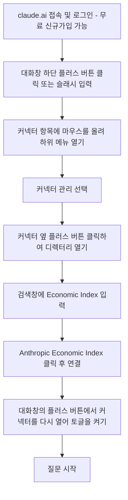

### — Claude.ai 커넥터(MCP)와 Anthropic Economic Index 커넥터로 AI 활용 패턴 진단하기 —

```
한국 사용자들이 Claude로
가장 많이 다룬 주제는 코딩이 아니었다.

1위는 자기소개 글쓰기 4.8%
2위 추천 4.7%
3위 구매 및 투자 4.4%

그다음은 사업 운영, 슬라이드 자료, 홍보 글쓰기 순이다.

큰 분류로 봐도 콘텐츠 제작과 카피라이팅이 27.3%로 가장 높고, 소프트웨어 개발은 10.4%였다.

우리는 Claude에게 코딩보다 먼저
‘나를 어떻게 소개할지’를 묻고 있었다.

이 데이터는
Anthropic이 새로 공개한
‘Economic Index 커넥터’ 

그동안 연구 보고서와 데이터셋으로 봐야 했던 
Claude 사용 패턴을, 
이제 Claude 채팅창에서 바로 질문할 수 있다.

“AI를 가장 많이 쓰는 직업은?”
“사람들이 AI로 가장 많이 자동화하는 업무는?”
“개발자들은 Claude로 어떤 일을 처리하지?”
“우리 업종에 대해 이 데이터가 말해주는 건 뭐야?”

이렇게 물으면 공식 Economic Index 데이터를 근거로 답한다.

설정은 1분이면 된다.
1. claude.ai에서 + 버튼을 누른다.
2. 커넥터 → 커넥터 추가 → 커넥터 둘러보기로 들어간다.
3. Anthropic Economic Index를 검색해 연결한다.
4. 커넥터를 활성화하고 궁금한 내용을 질문한다.

별도 설치는 필요 없다.
모든 Claude 모델의 대화에서 쓸 수 있고,
답변에 사용된 원본 데이터도 다시 확인할 수 있다.

전체 노동시장 통계가 아니라 
Claude에서 실제로 나타난 사용 패턴을 모은 데이터다.

AI가 무엇을 할 수 있는지는 많이 들었다.
이제 사람들이 AI에게 실제로 
무슨 일을 맡기고 있는지 데이터로 알아볼수 있다.

 https://www.threads.com/@allnewstarking/post/DbRkO-6oADL
```

---

## 1. 결론부터: 가능합니다

말씀하신 실습, 즉 공유해주신 화면(사람들이 Claude를 사용하는 방법, 국가별 사용량 등)을 교육생이 각자 직접 열어보고 질문하는 실습은 **교육생 각자의 무료 Claude.ai 계정만으로 충분히 가능**합니다. 근거는 다음 두 가지 공식 발표입니다.

첫째, Anthropic Economic Index 커넥터 자체가 2026년 7월 22일 공식 출시되었고, 발표문에는 "claude.ai에서 커넥터 메뉴를 열어 디렉터리에서 Anthropic Economic Index를 찾아 활성화하면 되며, 별도로 설치할 것이 없고 어떤 Claude 모델과의 대화에서도 작동한다"고 명시되어 있습니다.

둘째, claude.ai의 커넥터 기능 자체가 2026년 2월 말부터 무료 플랜에 개방되었습니다. Anthropic의 공식 고객지원 문서(Claude Help Center)는 "웹 커넥터는 Claude, Cowork, Claude Desktop, Claude 모바일(iOS/Android)의 모든 사용자에게 제공된다"고 명시하고 있으며, 이는 무료 플랜을 포함합니다. 다만 사용자가 직접 MCP 서버 주소를 등록하는 "커스텀 커넥터"는 무료 사용자에게 1개까지로 제한되는데, Economic Index는 Anthropic이 미리 만들어 디렉터리에 올려둔 "디렉터리 커넥터"이므로 이 제한과 무관하게 이용할 수 있습니다.

즉, 이번 실습은 기존에 준비하신 Claude Code(API 키·터미널) 트랙과는 완전히 별개로, **교육생이 이메일만으로 무료 가입한 계정, 웹 브라우저 또는 모바일 앱에서** 바로 진행할 수 있는 실습입니다. 비용 걱정도, 설치 걱정도 없습니다.

---

## 2. 커넥터(Connector)란 무엇인가 — MCP 개념 정리

### 2.1 MCP와 커넥터의 관계

MCP(Model Context Protocol)는 Anthropic이 만들어 공개한 개방형 표준 프로토콜로, AI 모델이 외부의 데이터나 도구와 대화하는 방식을 규격화한 것입니다. 비유하자면 USB가 서로 다른 제조사의 기기와 컴퓨터를 하나의 규격으로 연결해주듯, MCP는 서로 다른 서비스(Gmail, Notion, Slack, 사내 데이터베이스 등)와 Claude를 하나의 규격으로 연결해줍니다.

"커넥터"는 이 MCP 규격을 이용해 claude.ai 화면에 노출되는 실제 연결 단위입니다. 사용자 입장에서는 MCP라는 프로토콜 이름을 몰라도, "커넥터" 메뉴에서 원하는 서비스를 찾아 버튼 하나로 연결하면 그만입니다. 공식 고객지원 문서는 커넥터를 "Claude가 여러분의 앱과 서비스에 접근하고, 데이터를 가져오고, 연결된 서비스 안에서 실제 동작을 수행하게 해주는 기능"이라고 설명합니다. 예를 들어 Linear에 연결하면 이슈를 생성하게 할 수 있고, Slack에 연결하면 메시지를 보내게 할 수 있고, Google Drive에 연결하면 파일을 검색하게 할 수 있습니다. 이번에 다룰 Economic Index 커넥터는 이 중에서도 "행동을 수행"하는 유형이 아니라, Anthropic이 공개한 데이터셋을 대화 중에 조회하는 유형입니다.

### 2.2 디렉터리 커넥터 vs 커스텀 커넥터

| 구분 | 디렉터리 커넥터 | 커스텀 커넥터 |
| --- | --- | --- |
| 정의 | Anthropic 또는 파트너가 미리 만들어 커넥터 디렉터리에 등록해둔 것 | 사용자가 직접 MCP 서버 주소(URL)를 입력해 연결하는 것 |
| 예시 | Anthropic Economic Index, Gmail, Notion, Slack, Google Drive 등 | 사내에서 직접 구축한 MCP 서버, 개인 프로젝트 서버 등 |
| 무료 플랜 이용 | 전체 이용 가능 | 1개까지만 등록 가능 |
| 설정 방식 | 디렉터리에서 찾아 클릭 후 연결(설치 불필요) | 이름과 서버 URL을 직접 입력 |

### 2.3 플랜별 이용 범위 (공식 문서 기준, 2026-07-27 확인)

| 구분 | Free | Pro / Max | Team / Enterprise |
| --- | --- | --- | --- |
| 디렉터리 커넥터(웹 커넥터) | 이용 가능 | 이용 가능 | 이용 가능(조직 관리자가 먼저 활성화해야 함) |
| 커스텀 커넥터 | 1개까지 | 다수 등록 가능 | 다수 등록 가능 + 조직 단위 관리 |
| Claude Desktop 전용 확장(Desktop extensions) | 이용 가능 | 이용 가능 | 이용 가능 |

### 2.4 권한과 보안에 대해 알아둘 점

커넥터를 연결하면 Claude는 그 사람이 원래 서비스에서 갖고 있는 권한만큼만 접근할 수 있습니다. 즉 원래 볼 수 없는 파일이나 채널은 Claude를 통해서도 볼 수 없습니다. Economic Index 커넥터는 애초에 누구나 볼 수 있도록 공개된 연구용 데이터셋을 조회하는 것이므로, 개인정보나 사내 데이터 접근과 관련된 위험은 없습니다. 다만 일반적인 원칙으로서, 학생들에게 "신뢰할 수 있고 실습에 필요한 서비스만 연결하라"는 점은 한 번 짚어주는 것이 좋습니다.

---

## 3. Anthropic Economic Index 커넥터란

Anthropic Economic Index는 Anthropic이 2025년 초부터 정기적으로 발표해온 연구로, 익명화된 Claude 대화 패턴을 분석해 AI가 실제로 어떤 업무·직군·지역에서 어떻게 쓰이고 있는지를 추적합니다. 그동안은 별도의 연구 보고서 페이지나 데이터셋 파일을 열어야 확인할 수 있었는데, 2026년 7월 22일 발표된 이 커넥터를 통해 이제는 Claude와의 대화창에서 바로 자연어로 질문하고 답을 받을 수 있게 되었습니다. 공식 발표문이 제시하는 질문 예시는 다음과 같습니다.

- "어떤 직업군이 AI를 가장 많이 사용하는가?"
- "콜로라도 사람들은 Claude를 어떤 용도로 가장 많이 쓰는가?"
- "교사들은 Claude로 어떤 업무를 처리하는가?"
- "사람들이 AI로 자동화하는 업무 유형은 무엇이며, 지난 1년간 어떻게 변화했는가?"

한 가지 반드시 짚어야 할 유의점이 있습니다. 공식 발표문은 "이 Index는 노동시장 전체가 아니라 Claude 사용 패턴을 반영한다"는 점을 스스로 명시하고 있습니다. 즉 이 데이터는 "AI가 실제 경제 전체에서 어떻게 쓰이는가"의 완전한 대표값이 아니라, "Claude 사용자들이 실제로 무엇을 물어봤는가"에 가깝습니다. 학생들에게 이 데이터를 소개할 때는 이 한계를 함께 짚어주는 것이 좋고, Claude 스스로도 답변 중에 원본 데이터의 한계를 언급하도록 설계되어 있습니다.

---

## 4. 설정 절차 (공식 고객지원 문서 기준)

공유해주신 스레드 글의 4단계 요약도 방향은 맞지만, 현재 공식 문서에 나온 메뉴 경로는 아래처럼 조금 더 세분화되어 있습니다. 두 가지를 함께 정리했습니다.



단계별로 조금 더 풀어서 설명하면 다음과 같습니다.

1. **claude.ai 로그인**: 계정이 없는 교육생은 이메일만으로 무료 가입하면 됩니다. 신용카드 등록이 필요 없습니다.
2. **커넥터 디렉터리 열기**: 대화창 왼쪽 아래의 "+" 버튼을 누르거나 "/"를 입력한 뒤, "커넥터" 항목에 마우스를 올리면 하위 메뉴가 열립니다. 여기서 "커넥터 관리"를 선택하고, 다시 "커넥터" 옆의 "+" 버튼을 누르면 카테고리별로 정리되거나 전체 목록으로 볼 수 있는 커넥터 모달이 열립니다. (설정 화면에서도 동일하게 접근할 수 있습니다: Customize → Connectors)
3. **Economic Index 검색 및 연결**: 검색창에 "Economic Index"를 입력해 찾은 뒤 클릭하고, "연결" 버튼을 누릅니다. 이 커넥터는 공개 데이터셋을 조회하는 용도이므로 Gmail이나 Notion처럼 외부 계정 로그인 절차를 거치지 않고 곧바로 활성화됩니다.
4. **대화에서 켜기**: 연결이 끝나면, 실제 대화에서 사용하려면 다시 "+" 버튼 → "커넥터" 메뉴에서 해당 대화에 대해 토글을 켜줍니다. (연결과 "이번 대화에서 사용" 여부는 별개입니다.)
5. **질문 시작**: 이제 질문을 입력하면 Claude가 Economic Index 데이터를 근거로 답합니다.

---

## 5. 교육생 실습 흐름 제안 (약 20~30분)

이 실습은 코드를 다루지 않으므로, 앞서 설계된 4단계 바이브코딩 실습(요구사항분석→UI설계→UI개발→결과 PPT 제작)의 준비 운동 격으로, 또는 완전히 독립된 짧은 워크숍으로 진행하기에 알맞습니다. 진행 흐름은 아래처럼 4단계로 나누는 것을 제안합니다.

**1단계 — 큰 그림 질문 (5분)**

```text
사람들이 Claude를 가장 많이 사용하는 방식은 무엇이야?
큰 분류로 정리해서 알려줘.
```

**2단계 — 한국 및 자신의 직군으로 좁히기 (10분)**

```text
한국에서 Claude 사용자들이 가장 많이 다루는 주제 상위 10개를 알려줘.
미국의 사용 패턴과 비교했을 때 눈에 띄는 차이가 있어?
```

```text
나는 [인사 / 마케팅 / 개발 / 자영업] 분야에서 일하고 있어.
이 분야에서 Claude가 실제로 가장 많이 쓰이는 업무는 뭐야?
```

**3단계 — 근거 데이터 확인하기 (5분)**

```text
방금 답변의 근거가 된 원본 데이터를 보여줘.
어느 시점 데이터이고, 표본은 어떻게 구성됐어?
```

이 요청은 공식 발표문에서도 "궁금하면 근거가 된 원본 데이터를 다시 보여달라고 요청할 수 있다"고 안내하는 부분과 정확히 대응합니다.

**4단계 — 비판적으로 정리하기 (5~10분)**

```text
이 데이터는 노동시장 전체를 대표하는 걸까, 아니면
Claude 사용자에 한정된 걸까? 이 데이터를 해석할 때
주의해야 할 점을 3가지로 정리해줘.
```

이 마지막 질문은 단순히 도구 사용법을 넘어, "AI가 제시하는 데이터를 무비판적으로 받아들이지 않고 근거와 한계를 함께 확인하는 습관"을 기르는 데 목적이 있습니다. 강사 입장에서는 이 지점에서 "생성형 AI가 인용하는 통계나 리포트도 출처와 표본의 한계를 항상 확인해야 한다"는 메시지를 짧게 전달하기에 좋은 타이밍입니다.

---

## 6. 강사 운영 참고

- 이 실습은 API 키나 Claude Code 설치 없이 웹 브라우저(또는 모바일 앱)만 있으면 되므로, 별도 환경 구축 시간이 필요 없습니다. 실습실 PC든 개인 노트북이든, 심지어 스마트폰으로도 진행할 수 있습니다.
- 교육생이 이미 무료 계정을 갖고 있다면 바로 사용 가능하며, 계정이 없다면 이메일 가입에 1~2분 정도 소요됩니다.
- Economic Index 커넥터는 어떤 Claude 모델을 쓰든 동일하게 작동한다고 공식 발표문에 명시되어 있으므로, 무료 플랜에서 기본 제공되는 모델로 충분합니다.
- 전체 데이터셋은 Anthropic 웹사이트(anthropic.com/economic-index)에서 원본 파일로도 무료로 내려받을 수 있다는 점도 함께 안내하면, 관심 있는 교육생이 수업 후 스스로 더 파고들 수 있습니다.

---

## 7. 참고자료 (확인일자 2026-07-27)

- Anthropic Economic Index 커넥터 공식 발표: https://www.anthropic.com/news/anthropic-economic-index-connector
- Anthropic Economic Index 소개(최초 발표): https://www.anthropic.com/news/the-anthropic-economic-index
- 커넥터 사용법(Claude Help Center 공식 문서): https://support.claude.com/en/articles/11176164-use-connectors-to-extend-claude-s-capabilities
- 커스텀 커넥터(원격 MCP) 시작 가이드: https://support.claude.com/en/articles/11175166-get-started-with-custom-connectors-using-remote-mcp
- Anthropic Economic Index 데이터셋 전체보기: https://www.anthropic.com/economic-index

---

작성일자: 2026-07-27
