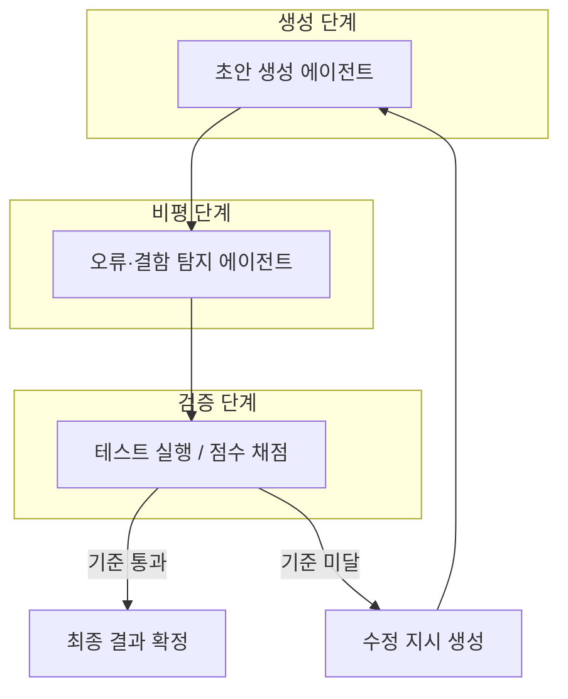
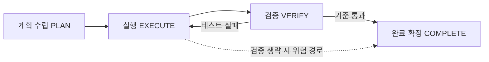
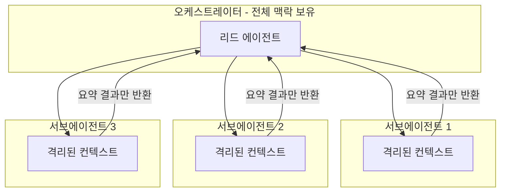

- 원문: Threads @billionnapkin, "프롬프트를 잘 쓰는 능력만으로는 부족한 시대가 오고 있습니다..." (게시물 링크: threads.com/@billionnapkin/post/DbQlOC6D2KZ)
- 이 문서는 원문이 제시한 핵심 주장 — ① 여러 에이전트를 초안-검사-재수정 그래프로 연결하는 구조, ② 작성자와 평가자의 분리, ③ 과장 경계, ④ 복잡도에 따른 비용 증가 — 을 학술 논문과 2026년 시점의 실제 산업 데이터로 하나씩 검증하고 확장한 것이다.

---

## 1. 들어가며: 원문이 말하는 것

원문의 논지는 간단히 정리하면 이렇다. 지금까지 AI를 잘 쓰는 능력은 "프롬프트를 얼마나 정교하게 쓰는가"에 달려 있었지만, 다음 단계는 하나의 프롬프트가 아니라 여러 개의 에이전트를 하나의 그래프로 엮어서, 한 에이전트가 만든 결과를 다른 에이전트가 검사하고, 실패하면 앞 단계로 되돌려 다시 실행시키는 구조로 넘어가고 있다는 것이다. 이때 가장 중요한 원칙은 "에이전트가 스스로 잘했다고 채점하게 두지 않는 것"이며, 작성자(generator)와 평가자(evaluator)를 분리하고 테스트나 벤치마크 같은 확인 가능한 기준을 넣어야 한다고 말한다. 동시에 원문은 이것을 "스스로 똑똑해지는 AI"라고 과장해서는 안 되며, 대부분은 모델 능력 자체의 향상이 아니라 외부 평가와 반복 실행을 통한 개별 작업 결과의 개선이라는 점, 그래프가 복잡해질수록 비용·지연시간·오류 경로가 늘어난다는 점, 모든 작업에 멀티 에이전트가 필요한 것은 아니라는 점을 함께 짚는다.

결론부터 말하면, 이 주장의 뼈대는 2023년부터 이어져 온 학술 연구 흐름과 2025~2026년 사이 업계에서 실제로 관측된 실패 패턴·비용 데이터와 상당히 정확하게 일치한다. 다만 몇 가지 지점 — 특히 "자기 평가가 항상 나쁘다"는 식의 단순화 — 은 최근 연구에서 더 세밀하게 다뤄지고 있으므로, 아래에서 근거와 함께 나눠서 짚는다.

---

## 2. 에이전트 그래프의 기본 골격

원문이 묘사하는 구조를 도식화하면 아래와 같다. 초안을 만드는 에이전트, 오류를 찾는 에이전트, 통과 여부를 점수나 테스트 결과로 판정하는 검증기, 그리고 실패 시 되돌아가는 반복 경로로 이루어진다.

이 구조 자체는 새로운 발명이 아니다. 학계에서는 이미 2023년부터 이런 "생성→비평→수정" 루프를 체계적으로 연구해 왔고, 업계에서는 Anthropic이 공식 문서에서 이를 "평가자-최적화자(evaluator-optimizer)" 워크플로라는 이름으로 정리해 두었다. 각각을 순서대로 짚어본다.

---

## 3. 학술적 뿌리: 2023년의 세 논문

원문이 설명하는 "생성-검사-재시도" 아이디어는 2023년에 발표된 세 편의 논문에서 이미 정식화되어 있었다.

**Self-Refine** (Madaan 외, NeurIPS 2023)은 하나의 언어모델이 생성자·비평자·수정자 역할을 순환하며 스스로 결과물을 다듬는 방식을 제안했다. 대화 응답 생성부터 수학적 추론까지 7개 과제에서, 추가 학습 없이도 반복 피드백만으로 결과물이 개선된다는 것을 보였다. **Reflexion** (Shinn 외, NeurIPS 2023)은 여기서 한 걸음 더 나아가, 시행 결과에 대한 점수(reward)를 언어로 된 "반성문"으로 변환해 다음 시도의 맥락에 누적시키는 방식을 제시했다. 실행자(Actor)·평가자(Evaluator)·자기반성 모델이 한 루프 안에서 맞물려 돌아가며, 평가자가 궤적을 "옳다"고 판단할 때까지 반복한다는 점에서 원문이 말한 그래프 구조와 사실상 동일한 골격을 갖는다. **CRITIC** (Gou 외, 2023)은 여기에 외부 도구를 결합해, 모델이 자기 생각만으로 비평하는 대신 코드 실행기·검색 엔진 같은 외부 도구의 결과를 비평 근거로 쓰도록 했다.

다만 이 세 논문 이후 나온 후속 연구들은 중요한 단서를 하나 덧붙였다. 같은 모델이 스스로 생성하고 스스로 비평하는 "내재적 자기수정(intrinsic self-correction)"만으로는 많은 과제에서 성능이 오히려 나빠지거나 개선되지 않는다는 보고가 여러 건 쌓였다는 점이다. 2024년 TACL(계산언어학회 학술지)에 실린 비판적 서베이는, 외부의 객관적인 근거(정답, 테스트 결과, 도구 실행 결과) 없이 모델이 스스로 오류를 찾아 고치도록 요청하면 신뢰할 수 있는 개선이 일어나지 않는 경우가 많다고 정리했다. 이는 원문이 강조한 "에이전트가 스스로 잘했다고 평가하게 두지 말라"는 원칙과 정확히 같은 방향의 결론이며, 원문의 주장이 근거 없는 직관이 아니라 학계에서 반복적으로 재현된 실증적 발견이라는 뜻이다.

---

## 4. "자기 평가"가 위험한 진짜 이유: 자기선호 편향

작성자와 평가자를 분리해야 하는 근거를 조금 더 구체적으로 파고들면 "자기선호 편향(self-preference bias)"이라는 연구 분야에 닿는다.

2024~2026년 사이 여러 연구팀이 독립적으로 확인한 바에 따르면, LLM을 평가자로 쓸 때("LLM-as-a-judge") 모델은 다른 모델이 쓴 글보다 자기 자신 혹은 자신과 비슷한 방식으로 생성된 글을 체계적으로 더 후하게 평가하는 경향을 보인다. 한 연구에서는 GPT-4 기반 평가자가 사람이 직접 쓴 요약문보다 GPT-3.5가 쓴 요약문에 더 높은 점수를 주는 현상이 관찰되었고, 사람 평가자는 정반대로 판단했다. 2025년 발표된 정량 연구는 이 편향의 원인 중 하나로 "당혹도(perplexity)"를 지목했다 — 모델은 자신에게 통계적으로 더 익숙한(당혹도가 낮은) 문장을 실제 품질과 무관하게 더 좋다고 평가한다는 것이다. 이후 연구는 이 현상을 "나르시시즘적 평가(narcissistic evaluation)"라 부르며, 이 점수 부풀리기가 우연이 아니라 체계적으로 발생한다는 것을 재확인했다.

다만 최근 연구는 이 편향을 무조건 나쁘게만 볼 수 없다는 중요한 단서도 함께 제시한다. 2025년 한 연구는 "더 유능한 생성자가 더 유능한 평가자이기도 하다"는 점을 검증 가능한 벤치마크(수학, 사실 지식, 코드 생성)로 확인했다 — 즉 유능한 모델의 자기선호 중 상당 부분은 실제로 그 모델의 결과물이 객관적으로 더 우수하기 때문이며, 순수한 편향이 아니라는 것이다. 동시에 이 연구는 평가자가 틀렸으면서도 확신에 찬 답을 낼 때는 편향이 여전히 해롭게 작용한다는 것, 그리고 판단 전에 추론 토큰을 더 많이 생성하도록 하면(reasoning-augmented evaluation) 편향의 악영향을 완화할 수 있다는 것도 함께 보였다.

정리하면, 원문의 "작성자와 평가자를 분리하라"는 원칙은 여전히 타당한 안전장치이지만, 그 이유를 "자기 평가는 항상 틀린다"보다는 "자기 평가는 특정 조건에서 체계적으로 왜곡될 수 있고, 그 왜곡을 미리 알 방법이 마땅치 않으므로 분리와 외부 검증 기준을 기본값으로 둔다"로 이해하는 편이 더 정확하다.

---

## 5. 업계 표준으로 자리잡은 패턴: Anthropic의 "평가자-최적화자" 워크플로

이 아이디어는 학술 논문에만 머물지 않고 Anthropic의 공식 엔지니어링 문서 "Building Effective Agents"에 다섯 가지 워크플로 패턴 중 하나로 명문화되어 있다. 이 문서는 프롬프트 체이닝, 라우팅, 병렬화, 오케스트레이터-워커, 그리고 평가자-최적화자(evaluator-optimizer)라는 다섯 패턴을 제시하는데, 이 중 평가자-최적화자 패턴이 원문이 설명한 구조와 정확히 일치한다. 한 LLM 호출이 응답을 생성하고, 다른 LLM 호출이 그 결과를 평가하고 피드백을 주는 과정을 반복하는 구조다.

Anthropic은 이 패턴이 문학 번역처럼 처음에는 뉘앙스를 놓치기 쉽지만 평가자가 반복적으로 개선점을 짚어줄 수 있는 과제, 또는 여러 차례 검색과 분석을 거쳐야 하는 복합 검색 과제에 특히 효과적이라고 설명한다. 동시에 이 문서는 언제 이 패턴을 피해야 하는지도 명시한다 — 첫 시도의 품질이 이미 충분히 높거나, 평가 기준 자체가 주관적이고 불분명하거나, 실시간 응답이 필요하거나, 토큰 예산이 빠듯한 경우에는 이 패턴을 쓰지 않는 것이 낫다는 것이다. 이는 원문의 "모든 업무에 여러 에이전트가 필요한 것은 아니다"라는 문장과 정확히 같은 맥락이다.

---

## 6. 코딩 에이전트에 적용하면: PLAN → EXECUTE → VERIFY → COMPLETE

원문이 예로 든 "요구사항 분석 → 구현 → 테스트 실행 → 실패 원인 분석 → 코드 수정 → 최종 검증"이라는 흐름은, 실제로 2026년 상반기 코딩 에이전트 업계에서 표준적으로 논의되는 상태 기계(state machine)와 거의 그대로 일치한다.

위 도식에서 점선으로 표시한 "검증 생략 시 위험 경로"가 바로 2026년 상반기에 여러 독립적인 연구팀이 반복적으로 지적한 실패 패턴, 이른바 "조기 완료 선언(premature completion)"이다. 코딩 에이전트가 첫 번째 테스트 통과나 첫 번째 패치 적용 같은 작은 진전 신호만 보고 "완료"를 선언해 버리는 현상으로, 2026년 6월 기준 최소 네 개의 독립 연구팀이 1년 사이 같은 실패 모드를 각자 별도로 명명했다는 점이 정리되어 있다. 다만 같은 자료는 이 문제가 모델이 강력해질수록 자동으로 줄어드는 경향도 함께 보고한다 — 강한 모델을 쓸수록 조기 종료 빈도가 거의 0에 가까워지는 반면, 지나치게 엄격한 반복 상한 없는 검증 체계는 반대로 "끝났는데도 계속 도는" 과잉 검증 함정에 빠질 수 있다는 점도 지적한다.

이 문제의 규모를 정량적으로 보여주는 2026년 학술 자료도 있다. Terminal-Bench 2.0 기준으로 Claude Opus 4.6, GPT-5.3-Codex, GLM-5, DeepSeek-V4-Pro 네 개 최신 모델의 실패 궤적을 9가지 실패 유형으로 분류한 연구에 따르면, 이 네 모델 모두에서 "검증(verification)" 계열 실패가 전체 실패의 47~60%를 차지해 가장 큰 비중을 보였다. 흥미로운 점은 실패의 성격이 모델마다 다르다는 것이다 — Opus 계열은 검사를 하긴 하지만 검사 자체가 얕아서 문제를 못 잡아내는 "부실 검증"이 주된 패턴(36%)이었고, GPT 계열은 아예 검증 자체를 건너뛰는 "검증 누락"이 주된 패턴(47%)이었다. 즉 모델이 일을 못해서가 아니라, 일을 마친 뒤 "정말 끝났는지"를 확인하는 단계가 구조적으로 약하다는 것이 최신 데이터가 가리키는 지점이다.

이런 문제의식 위에서 2026년 상반기에 나온 몇 가지 실무 패턴이 있다. 하나는 "조정자-구현자-검증자(Coordinator-Implementor-Verifier)"라는 이름으로 정리된 패턴으로, 조정자가 DAG 형태의 작업 계획을 따라 흐름을 관리하고, 구현자가 각자 독립된 컨텍스트에서 실제 작업을 수행하며, 검증자는 사람이 아니라 자동화된 게이트로 각 하위 작업을 통과시키는 구조다. 또 하나는 샤오미의 코딩 에이전트가 채택한 "Goal" 메커니즘으로, 사용자가 자연어로 종료 조건("모든 테스트를 통과하고 코드가 커밋되었을 것" 등)을 미리 정해두면, 에이전트가 스스로 종료를 시도할 때마다 별도의 독립된 모델 호출이 전체 대화 기록을 다시 검토해 그 조건이 정말로 충족되었는지 판정하는 방식이다. 이 역시 원문이 강조한 "작성자와 별개인 확인 가능한 기준"의 실제 구현 사례라고 볼 수 있다.

또한 2026년 6월의 한 실무 블로그는 "루프 엔지니어링에서 검증이 빠지면 그것은 그냥 자동화일 뿐"이라는 문제의식 아래, LLM 기반 비평자가 의미나 의도를 1차로 확인하되 절대 최종 판정자가 되어서는 안 되며, 재현 가능한 보안·품질·유지보수성 기준을 강제하는 결정론적(deterministic) 검증 계층이 최종 정지 조건이 되어야 한다는 "이중 정지 조건" 설계를 제안한 바 있다. 이 역시 원문의 "테스트와 벤치마크처럼 확인 가능한 기준"이라는 표현과 사실상 같은 이야기를 하고 있다.

---

## 7. 과장 경계: "스스로 똑똑해지는 AI"가 아니다

원문은 이 구조를 "스스로 똑똑해지는 AI"라고 부풀려서는 안 된다고 분명히 선을 긋는데, 이는 정확한 지적이다. 위에서 살펴본 평가자-최적화자 패턴, Reflexion의 반성 루프, CIV나 Goal 메커니즘 모두 공통점이 있다 — 모델의 가중치(weight) 자체는 전혀 바뀌지 않는다는 것이다. 달라지는 것은 하나의 특정 작업에 대한 결과물의 품질이며, 다음번에 완전히 다른 작업을 줄 때 모델이 더 똑똑해져 있는 것은 아니다. Reflexion 논문 자체도 이를 "언어를 통한 강화학습(verbal reinforcement learning)"이라 부르며, 실제 그래디언트 업데이트 없이 텍스트로 된 피드백을 다음 시도의 맥락에 끼워 넣는 방식이라고 명시적으로 구분해 두었다.

다시 말해, 에이전트 그래프가 만들어내는 개선은 "모델이 영구적으로 더 유능해지는 것"이 아니라 "한 번의 실행 안에서, 외부 피드백을 반복적으로 주입해 특정 결과물의 완성도를 끌어올리는 것"에 가깝다. 이 구분은 실무에서도 중요한데, 그래프를 아무리 정교하게 짜더라도 근본적으로 그 과제를 풀 능력이 없는 모델이라면 반복 횟수를 늘린다고 해결되지 않을 수 있기 때문이다.

---

## 8. 복잡도가 늘수록 커지는 비용: Anthropic 자체 데이터

원문은 "그래프가 복잡해질수록 비용과 지연 시간, 오류 경로도 늘어난다"고 경고하는데, 이 부분은 Anthropic이 자사의 멀티 에이전트 리서치 시스템을 공개하며 스스로 발표한 수치로 뒷받침된다. Anthropic은 리드 에이전트가 여러 서브에이전트를 병렬로 띄워 조사를 분담시키는 오케스트레이터-워커 구조를 리서치 기능에 적용했는데, 내부 평가에서 단일 에이전트 대비 90.2%의 성능 향상을 보였다고 밝혔다. 그러나 이 성능 향상에는 대가가 있었다 — 이 멀티 에이전트 시스템은 일반 대화(chat) 대비 약 15배 많은 토큰을 소비했으며, Anthropic은 성능 편차의 80%가 토큰 사용량만으로 설명되고, 나머지는 도구 호출 횟수(약 10%)와 모델 선택(약 5%)이 차지한다고 분석했다.

이 수치는 이후 여러 실무 블로그에서 재인용되며 "멀티 에이전트 비용 복리화(cost compounding)"라는 개념으로 확장되었다. 2026년의 한 분석에 따르면, 실제 배포 현장에서는 에이전트 3개를 쓰면 단일 에이전트의 3배 비용을 예상하지만, 실제 청구서는 5배, 8배, 때로는 15배까지 나오는 경우가 흔하다고 지적한다. 그 이유는 같은 맥락 정보가 에이전트 간에 반복 전달되며 매번 다시 과금되고, 실패한 작업은 처음부터 다시 수행되며, 오케스트레이터 자체도 흐름을 관리하느라 별도로 토큰을 소비하기 때문이라는 것이다. 2026년 업계 분석은 에이전트형 작업이 일반 챗봇 대비 5~30배의 컴퓨팅을 소비한다는 추정치도 함께 내놓았는데, 그 근거 중 하나로 이미 처리한 맥락을 매 단계 다시 모델에 밀어 넣어야 하는 구조 때문에 전체 추론 비용의 상당 부분이 "이미 아는 내용을 다시 읽는 데" 쓰인다는 점을 든다.

결국 원문이 지적한 "비용과 지연시간 증가"는 추상적인 우려가 아니라, 이 구조를 실제로 만든 회사가 자기 손으로 측정해 공개한 숫자로 뒷받침되는 현실이다.

---

## 9. 그렇다면 언제 멀티 에이전트가 필요 없는가

2025년 중순, 코딩 에이전트 회사 Cognition은 "멀티 에이전트를 만들지 마라"는 블로그 글을, 거의 같은 시기 Anthropic은 "우리가 멀티 에이전트 리서치 시스템을 만든 방법"이라는 정반대 제목의 글을 각각 발표해 업계에서 화제가 되었다. 언뜻 상반되어 보이는 두 글이지만, 실제 내용을 뜯어보면 상당히 일치하는 지점이 있다. Cognition은 여러 에이전트가 서로 대화하며 협업하는 방식은 맥락이 에이전트 사이에 충분히 공유되지 않아 의사결정이 분산되고 시스템이 취약해진다고 경고하면서, 하나의 에이전트가 전체 맥락을 계속 유지하는 단일 스레드 구조를 기본값으로 삼아야 한다고 주장했다. Anthropic 역시 자신들의 리서치 시스템에서 실제로 글을 쓰는(synthesize) 마지막 단계는 여러 에이전트가 아니라 하나의 메인 에이전트가 전담하도록 설계했다는 점에서, "읽기(조사)는 병렬화해도 되지만 쓰기(최종 산출물 작성)는 단일화하라"는 원칙에서 두 회사가 사실상 같은 결론에 도달했다는 평가가 나온다.

2026년 상반기 기준으로 이 논쟁은 한 방향으로 수렴한 것으로 분석된다. 하나의 오케스트레이터가 전체 대화 맥락을 계속 소유하고, 일회성 서브에이전트들을 필요할 때마다 생성해 각자 독립된(격리된) 컨텍스트 안에서 하위 작업을 처리하게 한 뒤, 그 결과를 압축된 요약 문자열 하나로만 돌려받는 방식이다. 이 패턴은 Anthropic, Cognition, OpenAI, 그리고 LangChain·Microsoft의 에이전트 프레임워크까지 여러 진영이 공통적으로 채택하는 쪽으로 기울었고, 반대로 여러 에이전트가 서로 직접 대화하는 "그룹챗" 방식은 점점 힘을 잃고 있다는 것이 2026년 업계 분석의 요지다.

이 패턴에서도 실무자들이 공통적으로 짚는 기준이 있다. 작업이 여러 개의 독립적인 방향으로 쪼개질 수 있는 "탐색·조사형(읽기)" 과제라면 병렬 서브에이전트의 이점이 비용을 상쇄하고도 남지만, 파일 간 의존성이 촘촘하게 얽힌 코딩처럼 "긴밀히 연결된(쓰기)" 과제라면 여러 에이전트를 두는 것이 오히려 조율 비용만 늘리고 성능은 떨어뜨릴 수 있다는 것이다. 이는 원문의 "단순한 작업은 한 번의 호출과 명확한 도구만으로 처리하는 편이 더 안정적일 수 있다"는 문장과 정확히 같은 결론이다.

---

## 10. 결론: 프롬프트 작성자에서 그래프 설계자로

지금까지 살펴본 근거들을 종합하면, 원문이 마지막에 던진 "앞으로 중요한 역량은 프롬프트를 길게 쓰는 기술이 아니라, 누가 만들고 누가 검증하며 어떤 조건에서 재시도할지를 설계하는 능력"이라는 진단은 상당히 근거가 탄탄하다. 이는 업계에서 이미 "컨텍스트 엔지니어링(context engineering)"이라는 용어로, 그리고 일부 코딩 에이전트 리더십 사이에서는 "루프 엔지니어링(loop engineering)"이라는 표현으로 각각 논의되고 있는 흐름과 정확히 맞닿아 있다. 다만 이 흐름을 받아들이는 태도는 "무조건 더 복잡한 그래프를 짜는 것"이 아니라, ① 작업이 정말로 여러 방향으로 쪼개지는 성격인지, ② 검증 기준을 확인 가능한 형태(테스트, 벤치마크, 결정론적 게이트)로 명시할 수 있는지, ③ 늘어나는 토큰·지연시간 비용을 그 작업의 가치가 상쇄하는지를 먼저 따져보는 것이어야 한다는 점을, 원문 자체와 이를 뒷받침하는 모든 자료가 공통적으로 강조하고 있다.

---

## 11. 사실 / 주장 구분 정리

| 구분 | 내용 |
|---|---|
| **확정된 학술적 사실** | Self-Refine(2023), Reflexion(2023), CRITIC(2023) 논문이 생성-비평-수정 루프를 정식화함. 이후 여러 서베이가 외부 근거 없는 내재적 자기수정의 한계를 재확인함. |
| **확정된 학술적 사실** | 자기선호 편향(self-preference bias)은 2024~2026년 다수의 독립 연구에서 재현된 현상이며, 원인 중 하나로 낮은 당혹도(perplexity) 선호가 지목됨. 단, 유능한 모델의 자기선호 중 상당 부분은 실제 품질 우위를 반영한다는 반박적 발견도 함께 존재함. |
| **Anthropic 공식 발표(확정 사실)** | "평가자-최적화자" 워크플로 패턴 정의, 멀티 에이전트 리서치 시스템의 90.2% 성능 향상 및 15배 토큰 비용, 80%/10%/5% 분산 기여도. |
| **업계 벤더·커뮤니티 보고(2026년 자료, 재확인 필요)** | CIV 패턴, VeriMAP, Cosmos, 샤오미 MiMo Code의 Goal 메커니즘, Sonar의 이중 정지 조건 제안 — 모두 개별 회사·블로그의 실무 보고이며 학술적 동료 검토를 거친 것은 아님. |
| **학술 연구(2026년, 확정 데이터)** | Terminal-Bench 2.0 기준 4개 모델의 검증 계열 실패 비중 47~60%, 모델별 실패 하위 유형 차이(Opus: 부실 검증 36%, GPT: 검증 누락 47%). |
| **업계 분석(추세 해석, 절대적 사실은 아님)** | "2026년 멀티 에이전트 아키텍처가 오케스트레이터+격리된 서브에이전트 패턴으로 수렴했다"는 평가는 FlowHunt 등 개별 매체의 분석이며, 모든 사업자가 동일하게 이 패턴을 채택했다고 단정할 근거는 아님. |

---

## 12. 참고 자료

| 자료 | 발행처/저자 | 시점 |
|---|---|---|
| Self-Refine: Iterative Refinement with Self-Feedback | Madaan 외, NeurIPS 2023 (arXiv:2303.17651) | 2023년 5월 |
| Reflexion: Language Agents with Verbal Reinforcement Learning | Shinn 외, NeurIPS 2023 (arXiv:2303.11366) | 2023년 10월 |
| CRITIC: LLMs Can Self-Correct with Tool-Interactive Critiquing | Gou 외, 2023 | 2023년 |
| When Can LLMs Actually Correct Their Own Mistakes? | TACL, MIT Press | 2024년 12월 |
| Self-Preference Bias in LLM-as-a-Judge | Wataoka, Takahashi, Ri (arXiv:2410.21819) | 2025년 6월 |
| Quantifying and Mitigating Self-Preference Bias of LLM Judges | arXiv:2604.22891 | 2026년 |
| LLM Evaluators: Self-Preference Bias (Better generators are better judges) | arXiv:2504.03846 | 2025년 |
| Building Effective AI Agents (평가자-최적화자 패턴 정의) | Anthropic 공식 블로그 | 2024년 12월 |
| How we built our multi-agent research system | Anthropic 공식 블로그 | 2025년 6월경 |
| Don't Build Multi-Agents | Cognition 블로그 | 2025년 6월 |
| How and when to build multi-agent systems | LangChain 블로그 | 2025년 6월 |
| Multi-Agent AI Systems in 2026: What the Research Actually Says | FlowHunt | 2026년 4월 |
| CLI-Universe: Towards Verifiable Task Synthesis Engine for Terminal Agents | arXiv:2606.22883 | 2026년 |
| Premature Completion: Agents That Declare Success Too Early | AgentPatterns.ai | 2026년 6월 |
| MiMo Code: Scaling Coding Agents to Long-Horizon Tasks (Goal 메커니즘) | Xiaomi MiMo 블로그 | 2026년 6월 |
| Loop engineering without verification is just automation | Sonar 블로그 | 2026년 6월 |
| Coordinator-Implementor-Verifier Pattern for Dev Teams | Augment Code | 2026년 4월 |
| Multi-Agent Cost Compounding: Why 3 Agents Cost 10x | Augment Code | 2026년 5월 |
| What AI Agents Actually Cost: Anthropic's Billing Split | Beam.ai | 2026년 5월 |

---

작성일자: 2026-07-27
