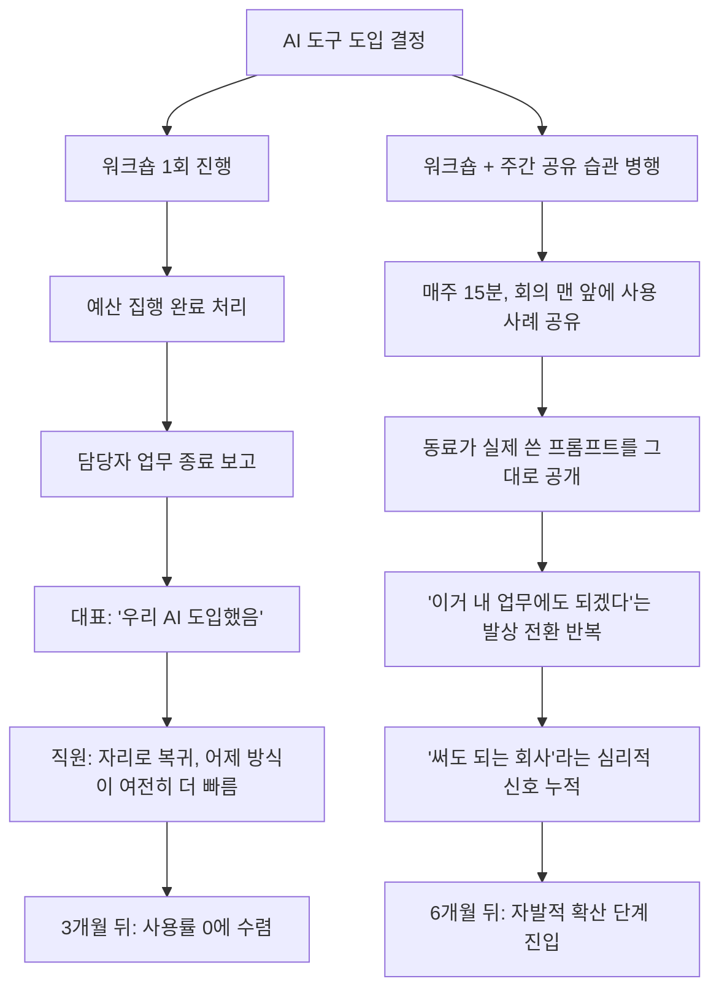
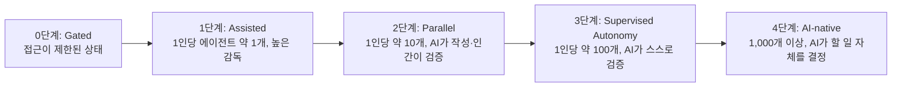

*작성일: 2026년 7월 27일*

---

> https://www.threads.com/@teeem_ai/post/DbSGrYpn2xR
> 
> '워크숍 한 번 했는데요. 그 뒤로 아무도 안 쓰던데요.' — 어느 대표님.
> 
> 이 말 진짜 자주 듣는다. 그리고 이제는 이 문장 하나만 들어도 그 회사가 뭘 안 했는지 대충 그려진다.
> 
> 워크숍은 도입 완료 신호가 아니다. 시작 신호다. 근데 대부분은 워크숍 날짜에 도장 찍고 끝낸다. 예산 처리도 그날로 끝나고, 담당자 업무도 그날로 끝나고, 대표님 머릿속에서도 '우리 AI 도입했음'으로 정리된다.
> 
> 문제는 직원 머릿속에선 아무것도 정리가 안 됐다는 거다. 3시간 앉아서 화면 따라 클릭해봤을 뿐이고, 자기 자리로 돌아가면 어제 하던 방식이 여전히 제일 빠르다. 새 도구는 처음 쓸 때 무조건 느리니까. 당연한 거다.
> 
> 한 번 하고 끝낸 회사와 매주 사용 사례 공유하는 회사. 6개월 뒤 격차는 도구 성능 차이가 아니다.
> 
> AI도입 차이는 생각보다 시시하다. 잘 되는 곳은 매주 15분, 팀 회의 맨 앞에 '이번 주에 이렇게 써봤음' 한 꼭지를 넣는다. 그게 전부다.
> 
> 내가 본 곳 중 하나는 주간 회의 때 한 명씩 돌아가며 자기가 쓴 프롬프트를 화면에 그냥 띄웠다. 잘 된 것도 있고 망한 것도 있고. 근데 그 자리에서 "아 그거 우리 견적서에도 되겠네" 하는 말이 나온다. 워크숍 강사가 아무리 잘 만든 예시를 보여줘도 이 말은 안 나온다. 남의 업무니까.
> 
> 그리고 매주 공유가 실제로 하는 일은 교육이 아니다. '이거 써도 괜찮은 회사구나'라는 신호를 주는 거다. 직원이 AI 안 쓰는 이유 1위는 몰라서가 아니라, 이걸로 하다가 틀리면 내가 책임지나 싶어서다.
> 
> 반대로 안티패턴도 명확하다. 사용률 대시보드 걸어놓고 '이번 달 사용 3위' 띄우는 회사. 직원은 그때부터 점수 따려고 아무 질문이나 던진다. 사용량은 오르고 성과는 그대로다.
> 
> 정리하면, 워크숍은 콘텐츠고 매주 공유는 습관이다. 콘텐츠는 잊히고 습관은 남는다. 그래서 요즘 나는 프로젝트 들어갈 때 교육 일정보다 '이거 끝난 다음 주부터 어디서 얘기할 거냐'를 먼저 묻는다. 여기 답이 없으면 워크숍을 아무리 잘 해도 3개월이다.
> 
> 거창하게 안 해도 된다. 주간 회의 앞 10분, 사내 채널 하나, 아니면 대표님이 본인 쓴 거 하나 올리는 것부터. 순서상 대표가 먼저 하는 게 제일 빠르다. 직원들은 대표가 안 쓰는 도구를 굳이 배우지 않는다.
> 
> 지난주에 누가, 어디서, AI 쓴 얘기를 했나? 한 명이라도 떠오르면 이미 갈림길에서 오른쪽이다.
> 
> 아무도 안 떠오른다면 — 왜 안 떠오르는 건지가 더 중요하다. 시간이 없어서인가, 말할 자리가 없어서인가, 아니면 말 꺼냈다가 괜히 일 늘어날까봐인가?
> 

## 들어가며

"워크숍 한 번 했는데요. 그 뒤로 아무도 안 쓰던데요." 어느 대표님이 남긴 이 한마디는 AI 도입 실패 사례를 압축해서 보여준다. 이 문장을 듣는 순간 그 회사가 무엇을 하지 않았는지가 대략 그려진다는 것은, 이 실패가 우연이 아니라 반복되는 구조적 패턴이라는 뜻이다.

이 문서는 원문 에세이가 던진 핵심 주장 — 워크숍은 도입의 끝이 아니라 시작이며, 조직 안에 AI 사용이 뿌리내리는 것은 하루짜리 이벤트가 아니라 매주 반복되는 습관에서 나온다는 논지 — 을 문장 단위로 풀어서 설명한다. 동시에 이 주장이 국내외에서 확인되는 AI 도입 관련 자료와 어떻게 맞닿아 있는지를 최신 자료로 교차 확인했다. 어디까지가 저자의 현장 경험에서 나온 관찰이고 어디까지가 외부에서 검증 가능한 사실인지는 문서 마지막 팩트체크 절에서 분명하게 구분해 두었다.

---

## 1. "우리 AI 도입했음"이라는 착각은 어디서 오는가

워크숍이 열리는 날, 조직 안에서는 세 가지 일이 동시에 벌어진다. 예산이 집행되고, 담당자의 업무가 '완료' 처리되며, 대표의 머릿속에서는 'AI 도입'이라는 프로젝트 항목에 체크 표시가 붙는다. 세 가지 모두 그 자체로는 잘못된 일이 아니다. 문제는 이 세 가지가 모두 워크숍 당일로 끝난다는 점이다.

반면 워크숍에 참석한 직원의 머릿속에서는 아무것도 끝나지 않는다. 세 시간 동안 화면을 따라 클릭해 본 것이 전부이고, 자기 자리로 돌아가면 어제까지 쓰던 방식이 여전히 가장 빠르다. 이것은 게으름의 문제가 아니라 학습 곡선의 문제다. 새로운 도구는 처음 쓸 때 반드시 기존 방식보다 느리다. 프롬프트를 어떻게 써야 할지 감이 없는 상태에서는 시행착오에 드는 시간이 익숙한 수작업 시간보다 길 수밖에 없다. 이 시간차를 메워주는 장치가 없다면 직원은 합리적으로 예전 방식을 선택한다.

결국 워크숍은 '도입 완료 신호'가 아니라 '도입 시작 신호'다. 그런데 조직의 의사결정 구조는 이 신호를 완료로 해석하도록 설계되어 있다. 예산은 한 번 집행하면 다시 승인받기 번거롭고, 담당자는 다음 분기 과제로 넘어가야 하며, 대표는 이미 보고받은 안건을 다시 꺼내기 어렵다. 그래서 조직 차원에서는 아무도 다음 단계를 설계하지 않은 채로 프로젝트가 종료된다.

---

## 2. 워크숍이 실패하는 진짜 이유 — 신호와 실체의 어긋남

워크숍이 실패하는 이유를 콘텐츠 품질 문제로 오해하기 쉽다. 강사가 부족했다거나, 실습 예제가 실무와 동떨어졌다거나 하는 식이다. 그러나 원문 에세이가 짚은 핵심은 다르다. 아무리 잘 만든 워크숍이라도 '한 번'으로 끝나면 구조적으로 실패한다는 것이다.

이유는 두 가지로 나뉜다. 첫째, 강사가 보여주는 예시는 아무리 실무에 가깝게 만들어도 결국 '남의 업무'다. 참석자는 그 예시를 보며 감탄할 수는 있어도, 자기 업무에 대입하는 상상력까지 자동으로 작동하지는 않는다. 둘째, 워크숍은 일회성이기 때문에 '이걸 계속 써도 괜찮은가'라는 조직적 신호를 만들어내지 못한다. 하루짜리 행사는 조직 문화가 아니라 조직 이벤트로 소비된다.

이 두 가지 결핍을 동시에 해결하는 방법이 바로 '매주 반복되는 짧은 공유'다.

---

## 3. 워크숍형 조직과 습관형 조직, 6개월 뒤

두 조직이 똑같이 좋은 워크숍으로 AI 도입을 시작했다고 가정해보자. 한 곳은 워크숍 날짜에 도장을 찍고 끝냈고, 다른 한 곳은 그 다음 주부터 팀 회의 맨 앞에 15분짜리 사용 사례 공유를 끼워 넣었다. 6개월 뒤 두 조직 사이에 벌어지는 격차는 도구의 성능 차이에서 오지 않는다. 두 조직이 쓰는 모델은 동일하다. 격차를 만드는 것은 순전히 반복의 유무다.

### 3-1. 두 경로를 그림으로 보면

### 3-2. 표로 보는 차이

| 구분 | 워크숍형 조직 | 습관형 조직 |
|---|---|---|
| 도입 완료 시점 인식 | 워크숍 당일로 종결 | 종결 시점 없음, 지속 과정으로 인식 |
| 예산·담당 업무 | 워크숍 종료와 함께 소멸 | 매주 15분이라는 낮은 반복 비용으로 지속 |
| 학습 곡선 대응 | 별도 대응 없음 | 매주 시행착오 공유로 학습 곡선을 서로 단축 |
| 확산의 주체 | 외부 강사의 예시 | 동료가 자기 업무로 직접 검증한 사례 |
| 조직이 보내는 신호 | 신호 자체가 없거나 모호함 | "이거 써도 되는 회사"라는 심리적 안전감 |
| 흔한 안티패턴 | 방치 | 사용률 대시보드·순위표로 변질되는 경우 |
| 6개월 뒤 결과 | 사용률 정체 또는 후퇴 | 자발적 확산, 업무별 적용 사례 증가 |

---

## 4. 매주 15분이 실제로 하는 일 — 교육이 아니라 심리적 안전 신호

이 대목이 원문 에세이에서 가장 눈여겨볼 부분이다. 매주 사용 사례를 공유하는 자리가 실제로 하는 일은 '교육'이 아니라는 것이다. 그 자리의 진짜 기능은 "이걸로 실험해도 괜찮은 회사"라는 조직적 신호를 반복해서 내보내는 데 있다.

### 4-1. 왜 동료의 프롬프트가 강사의 완벽한 예시보다 강력한가

한 팀이 주간 회의 때 돌아가며 자신이 실제로 사용한 프롬프트를 화면에 그대로 띄웠다는 사례가 이를 잘 보여준다. 잘 된 것도 있었고 실패한 것도 있었다. 그런데 바로 그 자리에서 "아, 그거 우리 견적서에도 되겠는데"라는 말이 자연스럽게 나왔다. 워크숍 강사가 아무리 정교하게 짜인 예시를 보여줘도 이 반응은 잘 나오지 않는다. 강사의 예시는 여전히 '남의 업무'이기 때문이다. 반면 옆자리 동료가 실제로 부딪힌 시행착오는 듣는 사람의 업무 맥락과 겹칠 확률이 훨씬 높고, 실패까지 포함해서 보여주기 때문에 "나도 저 정도는 시도해볼 만하다"는 심리적 문턱을 낮춘다.

### 4-2. "몰라서 안 쓴다"가 아니라 "책임질까봐 안 쓴다"

직원이 AI를 쓰지 않는 가장 큰 이유는 사용법을 몰라서가 아니라, "이걸로 했다가 틀리면 내가 책임지는 건가"라는 불안 때문이라는 것이 원문의 핵심 주장이다. 이 불안은 매뉴얼이나 교육으로 해소되지 않는다. 오직 조직이 반복적으로 "실패해도 괜찮다, 여기서 같이 공유하면 된다"는 신호를 보내야 옅어진다. 매주 15분의 공유 자리가 하는 일이 바로 이것이다. 실패 사례까지 공개적으로 이야기해도 불이익이 없다는 것을 반복해서 경험하게 만드는 것.

---

## 5. 안티패턴 — 사용률 대시보드와 순위표가 만드는 역효과

원문 에세이는 반대 사례도 명확하게 짚는다. 사용률 대시보드를 세워두고 "이번 달 사용 3위" 같은 순위를 공개하는 조직이다. 이런 환경에서 직원은 점수를 따기 위해 아무 질문이나 AI에 던지기 시작한다. 결과적으로 사용량 지표는 올라가지만 실제 업무 성과는 그대로거나 오히려 다른 일에 쓸 시간을 갉아먹는다.

이 현상은 경영학과 사회과학에서 오래 전부터 알려진 구드하트의 법칙(Goodhart's Law)으로 설명할 수 있다. 어떤 지표가 목표를 측정하기 위한 수단이 아니라 그 자체로 목표가 되는 순간, 그 지표는 원래 측정하려던 것을 더 이상 잘 측정하지 못하게 된다는 원리다. "AI 사용 횟수"를 성과의 대리 지표로 세워두면, 사람들은 실제 업무 개선이 아니라 사용 횟수 자체를 늘리는 방향으로 행동을 최적화한다. 이는 순위표라는 장치가 낳는 구조적 결과이지, 직원 개인의 도덕성 문제가 아니다.

같은 맥락에서 최근 국내 AI 에이전트 도입 관련 실무 가이드들도 채택률(사용률)만 단독으로 추적하는 방식의 한계를 지적한다. 사용률은 반드시 업무 만족도, 처리 시간 단축, 오류율 같은 다른 지표와 함께 놓고 봐야 하며, 그렇지 않으면 "많이 쓰는 것"과 "잘 쓰는 것"을 구분하지 못한다.

---

## 6. 순서의 문제 — 왜 대표이사가 먼저 써야 하는가

원문은 실행 순서에 대해서도 단호하다. 거창하게 시작하지 않아도 된다는 것, 그리고 그 시작은 대표가 자신이 직접 쓴 사례를 올리는 것부터여야 한다는 것이다. 이유는 단순하다. 직원은 대표가 쓰지 않는 도구를 굳이 배우려 하지 않는다.

이는 자원 배분의 문제가 아니라 신호의 문제다. 조직 안에서 리더가 어떤 행동을 실제로 하고 있는지는, 그 어떤 공식 지침보다 강력한 메시지로 작동한다. 리더가 회의 때마다 "AI 적극 활용하세요"라고 말하면서 정작 본인은 한 번도 사용 사례를 공유하지 않는다면, 직원들은 말과 행동의 불일치를 정확히 읽어낸다. 반대로 대표가 자신의 실패 사례까지 포함해 먼저 공유하면, 그 조직에서는 "실패해도 이야기할 수 있다"는 심리적 안전감이 위에서부터 아래로 흐른다.

---

## 7. 오늘부터 시작할 수 있는 것 — 거창하지 않아도 되는 이유

원문이 제시하는 실행 방법은 의도적으로 소박하다. 주간 회의 앞 10분, 사내 채널 하나, 혹은 대표가 자신이 쓴 것 하나를 올리는 것부터 시작하면 된다는 것이다. 이 소박함에는 이유가 있다. 습관은 부담이 클수록 지속되지 않는다. 매주 한 시간짜리 세미나를 새로 만들자고 하면 담당자도, 참석자도 오래 버티지 못한다. 반면 기존에 이미 열리는 회의 앞에 10분을 붙이는 방식은 별도의 일정 조율이나 예산 없이도 몇 달을 이어갈 수 있다.

그래서 실무적으로 프로젝트를 설계할 때 던져야 할 질문은 "교육을 언제, 며칠 할 것인가"가 아니라 "이 교육이 끝난 다음 주부터 어디에서 계속 이야기할 것인가"다. 이 질문에 대한 답이 미리 정해져 있지 않다면, 워크숍을 아무리 정교하게 설계해도 그 효과는 길어야 석 달을 넘기기 어렵다.

---

## 8. 자가진단 — 지난주 누가, 어디서, AI 쓴 얘기를 했나

원문이 제시하는 자가진단 질문은 간결하다. "지난주에 누가, 어디서, AI 쓴 얘기를 했나?" 이 질문에 한 명이라도 떠오른다면 그 조직은 이미 습관형 경로 위에 있다는 뜻이다.

반대로 아무도 떠오르지 않는다면, 그 이유를 따져보는 것이 더 중요하다. 시간이 없어서인지, 말할 자리가 자체가 마련되어 있지 않은 것인지, 아니면 말을 꺼냈다가 괜히 일이 늘어날까 봐 조심스러운 것인지에 따라 해법이 완전히 달라진다. 시간이 문제라면 회의 구조를 손봐야 하고, 자리가 없는 것이라면 채널을 새로 만들어야 하며, 일이 늘어날까 봐 조심스러운 것이라면 이는 앞서 다룬 심리적 안전감의 문제로 돌아간다.

---

## 9. 이 문제는 AI 도입 여정의 어디쯤에 있는가 — 더 넓은 지도 위에서 보기

이 에세이가 다루는 문제, 즉 "워크숍 이후 아무도 쓰지 않는다"는 현상은 조직이 AI를 아예 정기적으로 쓰기 시작하는 단계, 그러니까 여정의 가장 초입에 해당한다. 이 지점을 넘어서야 비로소 그 다음 단계의 논의, 예를 들어 에이전트를 몇 개나 동시에 굴릴 것인가 하는 논의로 넘어갈 수 있다.

### 9-1. Boris Cherny의 "AI 도입 5단계"와의 관계

Claude Code를 이끄는 Anthropic의 보리스 체르니(Boris Cherny)는 2026년 7월 16일 "Steps of AI Adoption"이라는 자료를 앤트로픽 사이트에 공개했다. 이 자료는 소프트웨어 조직이 AI 에이전트를 얼마나 폭넓게 활용하는지를 다섯 단계로 나눈 것이다.

체르니에 따르면 앤트로픽 조직 자체는 3단계에 있다고 밝혔고, 본인은 4단계에 도달했다고 언급했다. 이 다섯 단계 모델은 어디까지나 소프트웨어 개발 조직을 관찰한 경험적 프레임워크이지 학술적으로 검증된 측정 도구는 아니라는 점을 여러 매체가 함께 짚었다. 각 단계 사이의 병목은 기술이 아니라 신뢰와 검증 체계, 그리고 조직의 승인 절차에 있다는 것이 체르니의 핵심 주장이다.

이 지도 위에 원문 에세이의 문제의식을 겹쳐 놓으면 위치가 분명해진다. 워크숍 이후 아무도 AI를 쓰지 않는 조직은 사실상 0단계, 즉 "제한된 접근" 상태에 머물러 있거나 1단계로 진입하려다 되돌아간 상태다. 매주 사용 사례를 공유하는 습관은 바로 이 0단계에서 1단계로, 그리고 1단계를 안정적으로 유지하기 위한 조직적 장치에 해당한다. 체르니의 지도가 "이미 정기적으로 쓰고 있는 조직"이 그 다음 어디로 갈 것인가를 다룬다면, 원문 에세이는 그보다 앞선, "애초에 정기적으로 쓰는 상태에 도달하는가"를 다루는 셈이다.

### 9-2. "95% 실패설"이 알려주는 것 — 실패의 원인은 대개 기술이 아니다

2025년 한 해 동안 "기업 AI 프로젝트의 95%가 실패한다"는 통계가 언론과 여러 분석가들 사이에서 널리 인용되며 AI 도입에 대한 회의론을 키웠다. 그런데 이 통계는 원 출처인 MIT 보고서의 데이터를 잘못 해석한 결과였다는 사실이 2026년 4월 28일 공개적으로 밝혀졌다. 비영리 연구단체 80,000 Hours가 해당 MIT 보고서를 다시 검토한 결과, 설문 대상 기업 가운데 80퍼센트는 애초에 맞춤형 AI 파일럿 프로젝트 자체를 시도조차 하지 않았다는 사실이 핵심이었다. 실제로 파일럿을 진행한 기업들 중에서는 연구자들이 세운 까다로운 성공 기준에도 불구하고 25퍼센트가 6개월 이내에 성공적으로 배포에 성공했고, 전체 직원의 90퍼센트 이상은 이미 ChatGPT 같은 도구를 업무에 정기적으로 쓰고 있었다. 가트너는 2026년 보고서에서 실제 성공률을 40에서 50퍼센트 사이로 추정해, 애초의 95퍼센트 실패설과는 크게 다른 그림을 제시했다.

80,000 Hours 보고서가 특히 강조한 대목은, 기업이 AI 도입에서 마주치는 진짜 과제가 "기술 자체의 실패"가 아니라 "조직 변화 관리, 인력 교육, 적절한 사용 사례 선정" 같은 인적·조직적 요인에 훨씬 가깝다는 점이다. 이는 원문 에세이의 결론, 즉 워크숍과 습관의 차이가 도구 성능이 아니라 조직 운영 방식에서 갈린다는 주장과 정확히 같은 방향을 가리킨다.

같은 맥락에서 참고할 만한 사례로, 대형 게임사일수록 AI 도입이 중소 스튜디오보다 느린 이유를 다룬 국내 분석도 있다. 이 분석은 대규모 조직에서 AI 도입이 더딘 이유가 기술 격차가 아니라, 이미 견고하게 짜인 기존 워크플로우를 바꾸는 데 드는 전환 비용과 조직 내부의 정치적 역학에 있다고 짚는다. 반면 인원이 적은 스튜디오는 잃을 파이프라인이 적기 때문에 오히려 적극적으로 실험한다. 조직 규모와 무관하게, AI 도입의 성패를 가르는 변수가 기술이 아니라 조직 구조와 운영 방식이라는 점에서 원문 에세이의 논지와 일치한다.

한국의 AI 활용 현황을 보여주는 자료도 참고할 만하다. 한국개발연구원 계열 자료에 따르면, 2026년 1월 기준 앤트로픽 데이터 분석 결과 한국의 AI 사용 비중은 인구 대비 3.06퍼센트로 일본(3.12퍼센트)과 비슷한 수준이며, 이는 대만(0.77퍼센트)이나 싱가포르(0.51퍼센트)에 비해 매우 높은 수치다. 특히 한국은 업무 목적 사용 비중이 51.1퍼센트로 조사 대상 동아시아 4개국 중 가장 높았다. 국내 업종별로 보면 2026년 기준 서비스업의 AI 에이전트 도입률은 53퍼센트, 제조업은 23.8퍼센트로 큰 격차를 보이는데, 이는 규제·데이터 특성·인력 구조·경쟁 압력이라는 네 가지 요인이 업종마다 다르게 작용한 결과로 분석된다. 다만 가트너는 2025년 8월 기준 2026년까지 기업 앱의 40퍼센트에 업무별 AI 에이전트가 탑재될 것이라 전망하는 동시에, 2025년 6월 기준 2027년까지 자율형 에이전틱 AI 프로젝트의 40퍼센트 이상이 비용 상승과 불명확한 가치, 미흡한 리스크 통제로 인해 취소될 것이라고도 전망했다. 도입률이 오른다고 해서 곧 성공률이 오르는 것은 아니라는 뜻이며, 이 역시 "무엇을 어떻게 반복하는가"가 "무엇을 도입했는가"보다 중요하다는 원문의 문제의식과 이어진다.

---

## 10. 용어 정리

| 용어 | 의미 |
|---|---|
| 도입 완료 신호 (adoption-complete signal) | 조직이 특정 이벤트(워크숍 등)를 계기로 AI 도입이 끝났다고 착각하게 만드는 조직적 신호. 실제 사용 정착과는 무관할 수 있다. |
| 구드하트의 법칙 (Goodhart's Law) | 어떤 지표가 목표를 대신하는 순간, 그 지표는 원래 측정하려던 것을 더 이상 정확히 반영하지 못한다는 경영·사회과학 원리. |
| 심리적 안전감 (psychological safety) | 실패나 실수를 이야기해도 불이익을 받지 않는다는 조직 구성원들의 공유된 믿음. |
| 리더십 우선 원칙 (leadership-first adoption) | 새로운 도구나 업무 방식이 조직에 정착하려면 관리자·경영진이 먼저 실제로 사용하는 모습을 보여야 한다는 원칙. |
| AI 도입 5단계 (Boris Cherny) | 소프트웨어 조직의 AI 에이전트 활용도를 Gated·Assisted·Parallel·Supervised Autonomy·AI-native 다섯 단계로 나눈 경험적 프레임워크(2026년 7월 공개). |
| 파일럿 프로젝트 (pilot project) | 전사 확산 전에 특정 부서나 업무에 한정해 시험적으로 진행하는 소규모 도입 프로젝트. |

---

## 11. 팩트체크 — 무엇이 검증된 사실이고 무엇이 저자의 경험적 통찰인가

이 문서는 두 종류의 서로 다른 성격의 내용을 다루고 있다. 하나로 뭉뚱그리지 않기 위해 아래와 같이 구분해 둔다.

**(A) 저자의 현장 경험과 분석적 관찰 — 외부 통계로 별도 검증되지는 않는 내용**

- "워크숍 한 번, 그 뒤로 아무도 안 쓴다"는 대표의 발언과 유사 사례들
- 주간 회의에서 프롬프트를 공유하자 "우리 견적서에도 되겠다"는 반응이 나왔다는 사례
- 사용률 대시보드·순위표가 직원의 행동을 왜곡시킨다는 관찰
- "대표가 먼저 써야 직원이 따라 쓴다"는 순서 원칙
- "AI를 안 쓰는 1위 이유는 몰라서가 아니라 책임 소재 불안 때문"이라는 주장

이 내용들은 저자가 다수의 AX(AI 전환) 컨설팅 현장에서 반복적으로 관찰한 정성적 패턴이며, 특정 표본 조사나 학술 연구로 뒷받침된 수치는 아니다. 다만 아래 (B)에서 확인되는 외부 자료들이 "AI 도입 성패는 기술보다 조직·인적 요인에 좌우된다"는 동일한 방향을 가리키고 있다는 점에서, 이 관찰들이 업계에서 폭넓게 확인되는 흐름과 어긋나지는 않는다.

**(B) 외부 자료로 교차 확인된 사실 — 출처와 시점을 명시**

- 보리스 체르니(Boris Cherny, Anthropic Claude Code 총괄)는 2026년 7월 16일 "Steps of AI Adoption"을 공개했다. Gated(0)→Assisted(~1)→Parallel(~10)→Supervised Autonomy(~100)→AI-native(1,000+)의 5단계 모델이며, Anthropic은 3단계, 체르니 본인은 4단계에 있다고 밝혔다. (복수 매체 교차확인: explainx.ai, escprofile.com, smartscope.blog, shellypalmer.com)
- "기업 AI 프로젝트의 95%가 실패한다"는 통계는 MIT 보고서 데이터의 오독에서 비롯됐다는 사실이 2026년 4월 28일 밝혀졌다. 80,000 Hours 분석에 따르면 설문 대상 기업의 80%는 맞춤형 파일럿을 시도조차 하지 않았고, 시도한 기업의 25%는 6개월 내 성공적으로 배포했으며, 직원 90% 이상이 이미 ChatGPT 등을 정기적으로 업무에 활용 중이었다. 가트너는 2026년 실제 성공률을 40~50%로 추정했다. (출처: 환경감시일보, 2026년 5월 1일)
- 가트너는 2025년 8월 기준 2026년까지 기업 앱의 40%에 업무별 AI 에이전트가 탑재될 것으로 전망했으며(2025년 5% 미만 대비 급증), 동시에 2025년 6월 기준 2027년까지 자율형 에이전틱 AI 프로젝트의 40% 이상이 비용 상승·불명확한 가치·리스크 통제 미흡으로 취소될 것으로도 전망했다. (windyflo.com 재인용)
- 2026년 한국 업종별 AI 에이전트 도입률은 서비스업 53%, 제조업 23.8%로 조사되었다. (windyflo.com, 2026년 7월)
- 한국개발연구원(KIEP) 자료에 따르면 2026년 1월 기준 앤트로픽 데이터 분석 결과 한국의 AI 사용 비중은 인구 대비 3.06%로 일본(3.12%)과 유사한 높은 수준이며, 업무 목적 사용 비중은 51.1%로 조사 대상 동아시아 4개국 중 가장 높았다.
- 대형 게임사의 AI 도입이 소규모 스튜디오보다 느린 이유가 기술 격차가 아니라 조직 내 워크플로우 전환 비용과 내부 정치에 있다는 분석이 있다. (카카오벤처스 블로그, 2026년 4월)

이 문서에서 사용된 마크다운 표와 다이어그램은 원문 에세이의 논지를 시각적으로 정리하기 위해 저자가 새로 구성한 것이며, 원문에 포함되어 있던 것은 아니다.

---

## 12. 참고자료 및 출처

- Boris Cherny, "Steps of AI Adoption" 관련 교차 확인 자료
  - https://www.explainx.ai/blog/boris-cherny-steps-ai-adoption-claude-code-july-2026
  - https://www.escprofile.com/resources/blog/2026_07_17_The_Five_Stages_of_AI_Adoption.php
  - https://smartscope.blog/en/blog/ai-adoption-stages-one-person-10x-organization/
  - https://shellypalmer.com/2026/07/boris-chernys-steps-of-ai-adoption-a-roadmap/
- "95% 실패설"과 80,000 Hours 정정 보도
  - https://www.sisadays.co.kr/news/495395
  - https://www.sisadays.co.kr/news/495396
  - https://www.koreaiin.com/news/899366
- 국내 업종별 AI 에이전트 도입 현황
  - https://blog.windyflo.com/blog/ai-agent-adoption-trend-2026/
  - https://blog.windyflo.com/blog/ai-agent-adoption-failure/
  - https://blog.windyflo.com/blog/ai-agent-kpi-measurement-guide/
- 한국·일본·대만·싱가포르 AI 사용 실태 (KIEP)
  - https://www.kiep.go.kr/galleryDownload.es?bid=0004&list_no=12214&seq=1
- 게임업계 AI 도입 관련
  - https://www.kakao.vc/blog/ai-in-game-industry
  - https://byline.network/2026/05/508/
- 기업 AI 도입 실패 원인 관련 국내 분석
  - https://blog.dfinite.ai/enterprise-ai-adoption-lessons

---

*이 문서는 공유된 원문 에세이의 논지를 상세히 풀어 설명하고, 관련 주장을 2026년 7월 기준 최신 자료로 교차 확인한 것이다. 저자의 개인 경험에 기반한 서술과 외부에서 검증 가능한 사실은 11절에서 명확히 구분해 두었다.*
