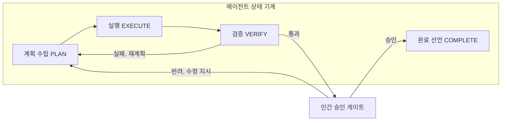
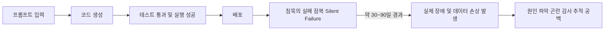
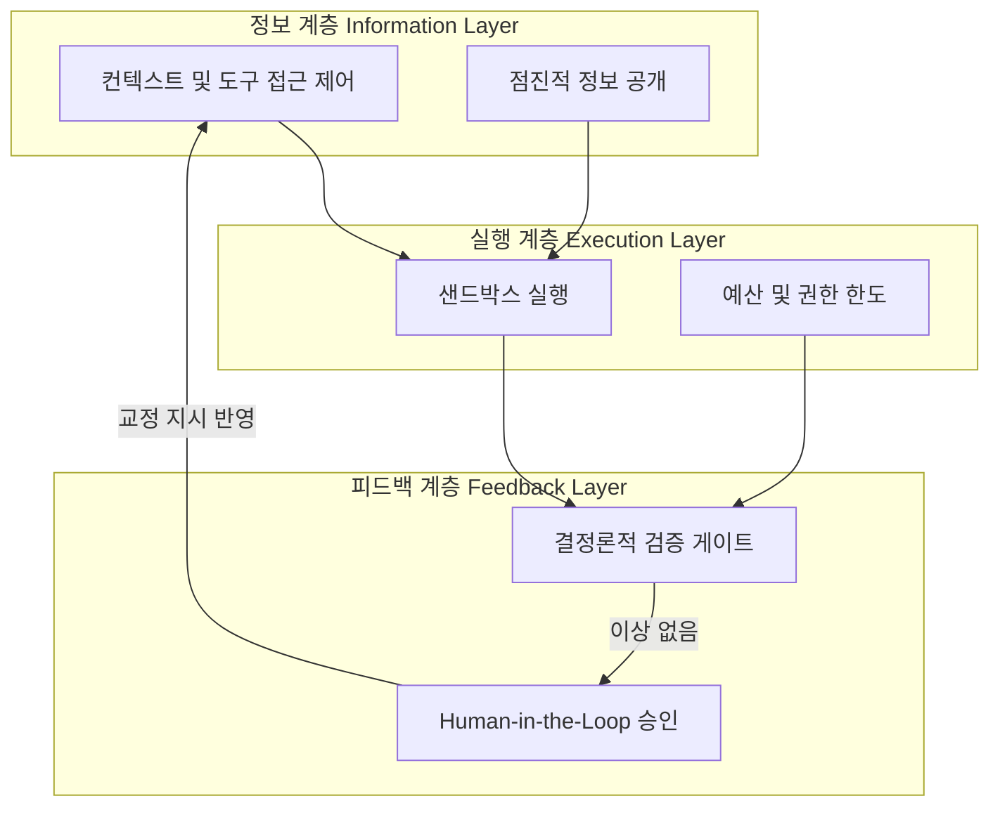

> 
> 자는 동안 다 해 놓으라고 맡길 일이 있고,
> 슬라이스 해서 촘촘하게 챙길 일이 있다.
> 
> 사람도 마찬가지
> 큰 틀을 세우고, 단계를 쪼개고, 디테일을 챙긴다음,
> 하나 하나 크고 작은 검증을 총괄적으로 해나가는게 답이다.
> 
> 루프를 돌리면 끝내준다.
> 모델이 똑똑하고 강력해서 알아서 다해준다는건
> 아직 내 기준에서는 믿을 수 없는 일이다.
> 
> 사람이 몇 개월 걸려 하던 일을
> 몇십시간 만에 끝낼 수 있다고 믿기 전에
> 자동과 수동을 컨트롤 하는 인간적 지휘 체계가 참 중요하다고 본다.
> 
> 내가 쓰지 않은 코드로 만들어진 것이
> 내가 사용하는 수준에서 큰 문제 없이 작동한다고 해서
> 뭐가 완성된거라 생각하지 않는다.
> 
> 코딩을 AI가 대신하는게 자연스러워지면서
> 우리는 새로운 종류의 할루시네이션을 경험하고 있다고 본다.
> 
> https://www.facebook.com/share/p/1PvYGu8gEj/
> 

이 글은 위 성찰이 담고 있는 문제의식 — ① 루프를 돌리는 자동화와 사람이 촘촘히 챙기는 수동 개입 사이의 균형, ② "모델이 알아서 다 해준다"는 서사에 대한 건강한 불신, ③ 겉보기에 작동하는 코드와 실제로 완성된 코드 사이의 간극, ④ AI 코딩이 만들어내는 새로운 형태의 할루시네이션 — 을 2026년 7월 현재까지 확인 가능한 연구와 업계 자료를 바탕으로 하나씩 풀어서 설명한다. 결론부터 말하면, 이 성찰은 개인적인 직관이 아니라 학계와 업계가 최근 1년 사이 거의 동시다발적으로 도달한 진단과 정확히 맞닿아 있다.

---

## 1. "루프를 돌린다"는 것의 실체 — 루프 엔지니어링과 하네스 엔지니어링

먼저 "루프를 돌린다"는 표현부터 정리할 필요가 있다. AI 코딩 에이전트가 "자는 동안 알아서 일을 끝내 놓는" 방식으로 동작하려면, 모델 혼자만으로는 부족하고 그 모델을 감싸는 실행 환경 전체 — 계획을 세우고, 도구를 호출하고, 결과를 검증하고, 실패하면 되돌리는 일련의 장치 — 가 필요하다. 이 감싸는 구조를 업계에서는 "하네스(harness)"라고 부르고, 하네스를 설계하는 작업을 "하네스 엔지니어링"이라 부른다.

2026년에 나온 여러 해설 자료는 하네스 엔지니어링을 프롬프트 엔지니어링이나 컨텍스트 엔지니어링과 분명히 구분한다. 프롬프트 엔지니어링은 한 번의 상호작용에서 지시문을 다듬는 작업이고, 컨텍스트 엔지니어링은 하나의 컨텍스트 창 안에서 여러 턴에 걸쳐 넘어가는 정보를 정돈하는 작업인 반면, 하네스 엔지니어링은 그 바깥에서 작동한다. 즉 여러 번의 컨텍스트 초기화를 넘나들며 작업을 이어가기 위한 구조화된 인수인계 문서, 단계별 승인 관문(phase gate) 같은 장치를 다루는 영역이라는 것이다. 이런 구분을 제시한 곳 중 하나가 Augment Code의 2026년 가이드다.

이 하네스가 실제로 무엇으로 이루어져 있는지는 여러 자료가 비슷한 그림을 그린다. 정보 계층은 에이전트가 어떤 데이터를 볼 수 있고 어떤 도구를 호출할 권한이 있는지를 그때그때 최소한으로만 열어주는 역할을 하고("점진적 공개"라 불린다), 실행 계층은 실제 작업이 벌어지는 샌드박스와 예산·권한의 한도를 관리하며, 마지막 피드백 계층은 결과물을 규칙 기반으로 검증하고 필요하면 사람의 개입(Human-in-the-Loop, HITL)을 거치도록 한다. 이런 3계층 구조는 Vishal Mysore가 2026년 5월에 정리한 하네스 엔지니어링 해설에 비교적 자세히 설명되어 있다.

같은 시기에 나온 학술 서베이 논문("Code as Agent Harness", 2026년 5월)은 이 구조를 좀 더 형식화해서, 코딩 에이전트의 작동 방식을 "계획(Plan)–실행(Execute)–검증(Verify)"의 반복 루프로 정리한다. 이 논문에 따르면 계획 단계는 앞으로 할 변경 사항에 대한 일종의 계약서 역할을 하고, 실행 단계는 그 계약을 샌드박스와 권한이 제한된 환경 안에서 이행하며, 검증 단계에서는 결정론적 센서와 사람의 검토 관문을 함께 사용해 그 결과를 받아들일지, 수정할지, 상위로 올려 보고할지, 아니면 되돌릴지를 결정한다. 정리하면 다음과 같은 흐름이다.

여기서 중요한 점은, "루프를 돌린다"는 말이 사람의 개입을 없애는 것이 아니라 사람의 개입이 들어가는 지점을 재배치하는 작업이라는 사실이다. NxCode의 2026년 3월 가이드는 완전한 자율성이 적절한 경우는 드물다고 못 박으면서, 위험도가 높은 작업(예컨대 되돌릴 수 없는 명령을 실행하려 할 때)에는 명시적인 승인 관문을 두어야 한다고 설명한다. 즉 좋은 하네스란 "다 맡기는 구조"가 아니라 "어디까지는 맡기고 어디서부터는 반드시 사람이 확인하게 만드는 구조"에 가깝다. 이는 앞서 인용한 성찰의 "자동과 수동을 컨트롤하는 인간적 지휘 체계"와 정확히 같은 방향을 가리킨다.

---

## 2. "몇 달 걸리던 일을 몇 시간 만에" — 이 서사는 사실인가, 과장인가

성찰의 두 번째 문제의식은 "사람이 몇 개월 걸려 하던 일을 몇십 시간 만에 끝낼 수 있다고 믿기 전에"라는 유보적 태도다. 2026년 상반기 기준으로 이 문제를 다룬 자료들을 종합하면, 이 유보는 상당히 근거가 있다.

가장 상징적인 사례는 AI 안전성 평가 기관 METR이 수행한 실증 연구다. METR은 2025년 7월, 경험 많은 오픈소스 개발자들이 실제 자신의 프로젝트에서 작업할 때 AI 코딩 도구를 쓰면 오히려 19% 더 느려진다는 결과를 발표했는데, 흥미롭게도 그 개발자들 스스로는 자신이 20% 더 빨라졌다고 느끼고 있었다. 그런데 2026년 2월 METR은 이 결과를 일부 재검토하면서, AI 없이 작업하는 조건에 자원할 개발자를 모집하는 과정에서 표본에 편향이 있었을 가능성을 인정했고, "AI가 생산성을 높이는지 여부를 확실히 알 수 없다"는 쪽으로 결론을 완화했다. 이 이야기는 두 가지를 동시에 보여준다. 하나는 개발자 스스로의 체감 속도와 실제 작업 속도 사이에 상당한 괴리가 있을 수 있다는 것이고, 다른 하나는 이 주제에 대한 엄밀한 측정 자체가 아직 방법론적으로 매우 어렵다는 것이다.

같은 시기 다른 기관들의 수치는 서로 크게 엇갈린다. 매킨지는 2026년 2월 조사에서 정형화된 작업 기준으로 46%의 시간 절감을 보고했고, 깃허브와 구글 쪽 수치는 작업 완료 속도가 20~55% 빨라졌다는 쪽에 가깝다. 반면 베인앤컴퍼니는 실제 현장에서의 절감 효과를 "특별할 것 없는 수준"이라고 표현했다. 이렇게 조사 주체에 따라 결과의 방향성조차 엇갈리는 상황은, 이 주제가 아직 업계 전반에서 합의된 결론에 이르지 못했음을 보여준다.

2026년에 새롭게 부각된 개념으로 "생산성 역설(productivity paradox)"이 있다. 이는 개별 개발자 단위에서는 속도가 빨라진 것처럼 느껴지는데, 팀 전체의 배포 속도는 오히려 느려지는 현상을 가리킨다. 관련 자료에 따르면 주니어 개발자는 AI 도구로 10~30%의 생산성 향상을 얻는 반면, 숙련된 개발자는 검증에 드는 부담 때문에 오히려 19% 느려지는 경향이 보고되었고, 팀 단위에서는 병합 요청(PR) 건수가 98% 늘어나는 동안 리뷰에 걸리는 시간은 91% 길어졌으며, 코드 변경 비율(churn)은 3.1%에서 5.7%로 뛰었다는 수치도 함께 제시되었다. 코드 품질 데이터를 오래 추적해 온 GitClear의 분석에서도 1억 5천만 줄 이상의 코드를 살펴본 결과 AI 지원 코드에서 churn이 늘고 재사용되는 코드 비중은 줄어드는, 품질 측면에서 퇴보로 해석될 수 있는 흐름이 확인되었다.

여기서 짚어야 할 점은 이 수치들의 출처가 저마다 다른 신뢰 수준을 가진다는 것이다. METR의 실증 연구는 방법론을 공개하고 스스로 한계를 인정한 연구기관의 결과이므로 상대적으로 신뢰도가 높은 편이고, 매킨지·깃허브·구글 쪽 수치는 벤더 또는 벤더와 이해관계가 있는 조사이므로 액면 그대로 받아들이기보다 참고치로 보는 것이 안전하며, "생산성 역설" 관련 수치의 상당수는 특정 관측 플랫폼 업체의 블로그에서 재인용된 2차 자료이므로 원 연구를 직접 확인하기 전까지는 업계 주장 수준으로 분류하는 것이 타당하다. 이런 맥락을 종합하면, "몇 달 걸리던 일이 몇 시간 만에 끝난다"는 서사는 특정 조건(정형화되고 반복적인 작업, 주니어 개발자, 좁은 범위의 태스크)에서는 어느 정도 근거가 있지만, 무조건적인 일반화로 받아들이기에는 아직 이르다는 것이 2026년 중반 시점의 가장 정직한 요약이라 할 수 있다.

---

## 3. 완전위임을 아직 믿을 수 없는 이유 — "조기 완료"라는 실패 양식

성찰에서 가장 핵심적인 부분은 "모델이 똑똑하고 강력해서 알아서 다 해준다는 건 아직 믿을 수 없다"는 문장이다. 이를 뒷받침하는 구체적인 실패 양식이 최근 학계와 실무 커뮤니티에서 공통적으로 이름 붙여지고 있는데, 그것이 바로 "조기 완료(premature completion)"다.

이 개념을 비교적 상세히 정리한 AgentPatterns.ai의 2026년 6월 문서에 따르면, 조기 완료란 에이전트가 "완료" 토큰을 발화하는 기준 자체가 잘못 설정되어 있는 문제다. 에이전트는 "테스트가 통과했다", "패치가 적용됐다", "추론 체인이 끝났다" 같은 첫 신호만으로 작업을 끝냈다고 선언해버리는데, 이런 신호는 단일 파일을 고치는 단순한 작업에서는 유효한 지표이지만 여러 파일에 걸친 복잡한 작업에는 턱없이 부족한 기준이라는 것이다. 특히 눈에 띄는 대목은, 서로 관련이 없는 네 개의 다른 팀이 최근 1년 사이 독립적으로 이 문제에 각기 다른 이름을 붙였다는 점인데, 이는 이 현상이 우연한 관찰이 아니라 실제로 존재하는 구조적 문제라는 것을 보여주는 정황 증거로 제시된다. 같은 자료는 이 문제가 중간 성능대 모델에서 더 두드러지고, 최상위권 모델일수록 스스로 내부 검증을 더 잘 수행하는 경향이 있다고 설명하며, 해결책으로는 문제를 먼저 재현하게 만드는 프롬프트 설계, 런타임 단계에서 강제로 검증을 거치게 하는 장치, "완료" 여부를 모델 스스로의 판단이 아니라 외부 기준으로 판정하게 만드는 방식 등을 제시한다.

이 문제의식은 개별 블로그 글에 그치지 않고 여러 학술 연구로도 뒷받침된다. 노스캐롤라이나 주립대 연구진이 2026년 4월 발표한 논문은 8개의 에이전트 프레임워크와 14개의 언어모델을 조합한 19개 에이전트에서 나온 9,374건의 작업 궤적을 대규모로 분석했는데, 이에 따르면 최상위권 코딩 에이전트조차 2026년 2월 기준 SWE-bench Verified라는 표준 벤치마크에서 20% 이상의 과제를 실패하며, 더 어려운 벤치마크로 갈수록 실패율이 가파르게 올라간다. 또 다른 연구는 실제 개발자와 코딩 에이전트 사이의 2만 574건에 달하는 실제 상호작용 세션을 분석해 에이전트가 사용자와 어긋나는 지점들을 체계적으로 짚어냈고, 별도의 논문은 이런 실패를 과제 특성에서 오는 실패, 모델 자체의 추론 한계에서 오는 실패, 에이전트 프레임워크(즉 하네스)의 한계에서 오는 실패로 구분해 원인을 분해하려 시도했다.

이 대목에서 성찰의 문장 — "코딩을 AI가 대신하는 게 자연스러워지면서 인간이 몇 개월 걸려 하던 일을 몇십 시간 만에 끝낼 수 있다고 믿기 전에 지휘 체계가 중요하다" — 은 정확히 이 조기 완료라는 실패 양식에 대한 방어선이라고 볼 수 있다. 모델이 "다 됐다"고 스스로 선언하는 순간을 그대로 신뢰하지 않고, 그 선언을 다시 한 번 사람이 검증하는 관문을 두는 것, 그것이 바로 하네스가 존재하는 이유다.

---

## 4. AI 코딩이 만들어내는 "새로운 종류의 할루시네이션"

성찰의 마지막 문장 — "코딩을 AI가 대신하는 게 자연스러워지면서 우리는 새로운 종류의 할루시네이션을 경험하고 있다" — 은 이 글 전체에서 가장 곱씹어볼 만한 대목이다. 전통적으로 할루시네이션은 모델이 존재하지 않는 사실, 논문, 인용을 그럴듯하게 지어내는 현상을 가리켰다. 그런데 2026년 들어 개발자 커뮤니티에서는 이와는 결이 다른, 코드 자체에서 나타나는 할루시네이션 현상에 여러 이름이 붙기 시작했다.

가장 직접적으로 이 표현을 쓰는 자료는 "바이브 코딩(vibe coding)" 가이드 계열의 글들이다. 2026년의 한 개발 커뮤니티 가이드는 이를 "환각된 아키텍처(Hallucinated Architecture)"라는 용어로 부르는데, 지금 당장은 잘 작동하지만 확장할 수 없는 구조로 시스템이 만들어지는 현상을 가리킨다. 겉보기에는 정상적으로 돌아가는 결과물이지만, 그 결과물이 실제로 감당할 수 있는 범위나 향후의 변경 가능성에 대해서는 아무런 근거 없는 확신을 심어준다는 점에서 전통적인 할루시네이션과 본질이 닮아 있다는 것이다.

이와 짝을 이루는 개념이 "침묵의 실패(silent failure)"다. 여러 자료가 공통적으로 지적하는 패턴은 이렇다. 테스트는 통과하고, 코드 리뷰에서도 문제없다는 승인이 나고, 스테이징 환경에서도 기능이 잘 작동하는 것처럼 보이는데, 정작 실제 운영 환경에 들어가면 예상치 못한 방식으로 조용히 어긋난다는 것이다. 한 학술 논문은 이런 실패를 "겉으로는 문법 오류나 명백한 충돌 없이 성공적으로 실행되는 것처럼 보이지만 실제로는 의도한 대로 작동하지 않는" 코드라고 정의한다. 이런 현상이 위험한 이유는, 사람이 코드 자체를 이해하지 못한 채로 결과물만 받아들이는 경우 문제를 발견할 방법이 사실상 없어지기 때문이다. 실제로 건설 안전 분야에 AI가 생성한 코드를 적용해본 한 학술 실험은, 성공적으로 실행된 스크립트 중에서도 전체 45%에 달하는 비율로 침묵의 실패가 나타났으며, 그중 한 모델은 생성한 코드의 56%가 수학적으로 부정확한 결과를 냈다고 보고했다. 이 수치는 비전문가가 AI가 만든 안전 계산 도구를 그대로 믿고 사용할 경우 실제 위험으로 이어질 수 있음을 구체적으로 보여주는 사례다.

업계 실무자들의 경험담 역시 비슷한 결을 공유한다. 한 실무자가 2026년 7월에 남긴 회고성 글은, AI 프롬프트로 코드베이스를 여러 달에 걸쳐 키워가는 과정에서 모듈 사이의 암묵적 계약이 점점 무너지고 코드베이스가 애초 개발자들의 의도와 어긋나기 시작했다고 서술하면서, 이를 "속도와 기술부채 사이의 트레이드오프"라 이름 붙였다. 이 글에는 특정 금융 시스템에서 AI가 만든 방향성 비순환 그래프(DAG) 로직 때문에 오후 4시 이후의 숫자 반올림이 어긋났다는 사례도 등장하는데, 다만 이 부분은 저자 스스로 "다른 회사에서 있었던 일화일 수도 있다"고 밝히고 있어 확인된 사실이라기보다는 실무자들 사이에 도는 경험담 수준으로 분류하는 것이 정확하다. 반면 좀 더 정량화된 자료들, 예컨대 AI가 작성한 코드에 사람이 작성한 코드보다 1.7배 많은 결함이 있다는 분석이나, AI가 생성한 코드 스니펫의 30~40%에서 CWE 분류상 보안 취약점이 하나 이상 발견되었다는 학계·OWASP 계열 연구, 그리고 숙련된 엔지니어들이 주니어의 AI 의존도가 높을수록 코드 리뷰에 20~35% 더 많은 시간을 쓴다는 보고는, 개별 일화보다는 더 신뢰할 수 있는 근거로 볼 수 있다.

이 모든 자료를 관통하는 하나의 그림을 정리하면 다음과 같다.

정리하면, 성찰이 말한 "새로운 종류의 할루시네이션"은 비유가 아니라 실제로 2026년 개발자 커뮤니티와 학계가 거의 동시에 이름 붙이고 있는 현상이다. 다만 그 이름은 아직 "환각된 아키텍처", "침묵의 실패", "AI 유발 기술부채" 등으로 통일되지 않은 채 여러 갈래로 불리고 있으며, 이는 이 현상이 매우 최근에 부각된 만큼 아직 정제된 학술 용어로 자리 잡지 못했다는 뜻이기도 하다. "내가 쓰지 않은 코드가 내가 쓰는 수준에서 문제없이 작동한다고 해서 완성되었다고 생각하지 않는다"는 성찰의 문장은, 바로 이 침묵의 실패가 관찰 가능한 범위 바깥에 숨어 있을 수 있다는 사실에 대한 정확한 경계심이라 할 수 있다.

---

## 5. 답은 하네스다 — 계획·실행·검증을 아우르는 인간의 자리

그렇다면 이 문제에 대한 업계의 대응은 무엇인가. 여러 자료가 공통적으로 제시하는 답은 결국 앞서 1장에서 다룬 하네스로 되돌아간다. 다만 여기서는 하네스가 구체적으로 "어디에" 사람을 배치하는지를 좀 더 들여다볼 필요가 있다.

코드 리뷰 도구 업체 CodeRabbit이 2026년 6월에 정리한 방식은 검증을 여러 겹으로 쌓는 구조를 제안한다. 가장 바깥쪽에서는 결정론적 규칙이 명백한 오류를 걸러내고, 그다음 정책 관문이 구조적인 문제를 걸러내며, AI 기반 리뷰가 맥락에 따른 문제를 걸러낸 뒤에야 비로소 사람이 검토에 들어간다. 이렇게 앞단에서 이미 많은 문제가 걸러진 상태이기 때문에, 사람은 설계와 아키텍처에 대한 판단이라는, 사람만이 할 수 있는 부분에 집중할 수 있게 된다는 논리다. 이 자료는 리더십 있는 소프트웨어 조직의 경험을 인용하며, 사람은 여전히 검토의 중심에 있어야 하고 에이전트는 그것을 보조하는 역할에 머물러야 하며, 하네스가 존재하는 이유는 이 검토 순환을 촘촘하게 유지하기 위한 것이지 그것을 대체하기 위한 것이 아니라고 강조한다.

여기서 흥미로운 점은, 이 승인 관문이 한 번 통과했다고 끝나는 것이 아니라 다시 다음 작업의 입력으로 되먹임된다는 것이다. 사람이 에이전트의 결과물을 반려하거나 수정 지시를 내리면, 그 교정 내용이 다음 작업의 규칙으로 다시 축적된다. 이는 값비싼 모델 재학습을 매달 반복하는 대신, 사람의 현장 판단을 지역적으로 빠르게 흡수해가는 방식이라 할 수 있다. 앞서 인용한 학술 서베이 논문 역시 검증 단계에서 나온 결과에 따라 상태를 그대로 받아들일지, 수정할지, 상급자에게 올릴지, 아니면 이전 상태로 되돌릴지를 결정하는 네 갈래의 갈림길을 명시적으로 설계해야 한다고 강조하는데, 이는 성찰에서 말한 "하나하나 크고 작은 검증을 총괄적으로 해나가는" 접근과 거의 같은 그림이다.

또한 2026년 3월의 한 실무 가이드는 완전한 자율성이 적절한 경우는 드물다는 점을 재차 강조하면서, 특히 되돌릴 수 없는 인프라 변경처럼 위험도가 높은 행동에는 사람의 승인을 반드시 거치도록 설계해야 한다고 말한다. 결국 여러 자료를 종합했을 때 드러나는 공통된 결론은, "모델의 지능"과 "하네스가 제공하는 신뢰성"은 서로 다른 축이며, 모델이 아무리 똑똑해져도 하네스가 없으면 그 지능이 신뢰할 수 있는 결과로 이어지지 않는다는 것이다. 한 하네스 엔지니어링 해설은 이를 "모델은 원재료가 되는 지능을 담고 있을 뿐이고, 그 지능을 실제로 쓸 수 있게 만드는 것은 하네스"라는 말로 요약한다.

---

## 6. 종합 — 자동과 수동을 지휘하는 인간의 자리

지금까지 살펴본 자료들을 성찰의 문장들과 다시 나란히 놓아보면, 다음과 같은 대응 관계가 드러난다.

첫째, "자는 동안 다 해 놓으라고 맡길 일"과 "슬라이스 해서 촘촘하게 챙길 일"을 구분하는 감각은, 하네스 엔지니어링에서 위험도에 따라 자동 실행 구간과 사람의 승인 관문을 배치하는 설계 원칙과 정확히 일치한다. 둘째, "몇 개월 걸리던 일을 몇십 시간 만에 끝낼 수 있다고 믿기 전에"라는 유보는, METR의 연구와 그 재검토 과정, 그리고 서로 엇갈리는 매킨지·베인·깃클리어의 수치들이 보여주듯 실제로 아직 업계 전체가 합의하지 못한 영역에 대한 정확한 경계심이다. 셋째, "내가 쓰지 않은 코드가 문제없이 작동한다고 완성됐다고 생각하지 않는다"는 태도는, 조기 완료라는 이름이 붙은 구체적인 실패 양식과 침묵의 실패가 실제 운영 환경에서 30일에서 90일 뒤에야 드러나는 경우가 많다는 관찰을 정확히 겨냥하고 있다. 넷째, "새로운 종류의 할루시네이션"이라는 표현은, 2026년 개발자 커뮤니티가 "환각된 아키텍처"라는 이름으로 부르기 시작한 현상, 즉 겉보기에 작동하는 코드가 근거 없는 확신을 심어준다는 문제의식과 그대로 겹친다.

결국 이 성찰이 도달한 결론 — 자동과 수동을 함께 지휘하는 인간적 체계가 중요하다 — 은 2026년 현재 학계와 업계가 "하네스 엔지니어링"이라는 이름으로 각자 따로 도달하고 있는 결론과 동일한 방향을 가리키고 있다고 정리할 수 있다. 다만 아직은 이 분야의 용어와 측정 방법이 통일되어 있지 않고, 벤더의 마케팅적 주장과 실증 연구의 결과가 뒤섞여 유통되고 있는 만큼, 개별 수치나 사례를 인용할 때는 그것이 재현 가능한 연구 결과인지, 업계 관계자의 주장인지, 커뮤니티의 경험담인지를 구분해서 받아들이는 태도가 여전히 중요하다.

---

## 참고자료

| 구분 | 출처 | 핵심 내용 | 날짜 | URL |
|---|---|---|---|---|
| 학술 연구(신뢰도 높음) | METR | 경험 개발자 대상 실증 연구, 초기 19% 저하 결과 및 2026년 방법론 재검토 | 2025-07-10 (2026년 갱신) | https://metr.org/blog/2025-07-10-early-2025-ai-experienced-os-dev-study/ |
| 학술 논문 | arXiv, "Code as Agent Harness" | Plan-Execute-Verify 루프의 형식화, 하네스 개방 과제 정리 | 2026-05-18 | https://arxiv.org/abs/2605.18747 |
| 학술 논문 | NC State, "Behavioral Drivers of Coding Agent Success and Failure" | 19개 에이전트·9,374 작업 궤적 분석, SWE-bench Verified 20%대 실패율 | 2026-04-02 | https://arxiv.org/html/2604.02547v1 |
| 학술 논문 | "How Coding Agents Fail Their Users" | 실제 세션 20,574건 분석한 개발자-에이전트 불일치 연구 | 2026년 | https://arxiv.org/pdf/2605.29442 |
| 학술 논문 | ClayBuddy, 코딩 에이전트 실패 프레임워크 | 8개 시나리오 기반 실패 평가·완화 방안 | 2026년 | https://arxiv.org/pdf/2606.19380 |
| 학술 논문 | "Specifying AI-SDLC Processes" | 침묵의 실패 정의(겉으로는 성공, 실제로는 오작동), 감사 추적 공백 문제 | 2026년 | https://arxiv.org/pdf/2606.20615 |
| 학술 논문(실증) | "Is Vibe Coding the Future?"(건설 안전 분야) | 성공 실행 스크립트 중 45% 침묵 실패율, 일부 모델 56% 수학 오류 | 2026년 | https://arxiv.org/pdf/2604.12311 |
| 실무 정리(커뮤니티, 다수 교차 확인) | AgentPatterns.ai | "조기 완료" 실패 양식 정의, 4개 팀이 독립적으로 명명 | 2026-06-13 검토 | https://agentpatterns.ai/anti-patterns/premature-completion/ |
| 벤더/실무 가이드 | CodeRabbit | 계층별 검증(결정론적→정책→AI→사람) 구조 설명 | 2026-06-04 | https://www.coderabbit.ai/guides/harness-engineering-ai |
| 개인 기술 블로그 | Vishal Mysore, Medium | 하네스 3계층(정보/실행/피드백) 구조 설명 | 2026-05-18 | https://medium.com/@visrow/harness-engineering-for-ai-agents-in-2026-114fcb8edf9e |
| 업계 가이드 | NxCode | 완전 자율성의 한계, 고위험 작업 승인 관문 필요성 | 2026-03-26 | https://www.nxcode.io/resources/news/what-is-harness-engineering-complete-guide-2026 |
| 업계 가이드 | Augment Code | 프롬프트/컨텍스트/하네스 엔지니어링의 구분 | 2026년 | https://www.augmentcode.com/guides/harness-engineering-ai-coding-agents |
| 업계 데이터(2차 인용 다수, 주의 필요) | Exceeds AI 블로그 | "생산성 역설" 수치(주니어 +10~30%, 시니어 -19% 등) | 2026-04-15 | https://blog.exceeds.ai/ai-coding-agents-productivity-paradox/ |
| 개인 블로그(메타분석) | Ingo Eichhorst, Medium | 2025~2026 생산성 연구 메타분석, 결론의 잠정성 강조 | 2026-04-18 | https://ingoeichhorst.medium.com/state-of-ai-coding-efficiency-2026-1abfa0ab7434 |
| 개인 블로그(논쟁 정리) | byteiota | METR 연구 재검토 논란 정리 | 2026-05-04 | https://byteiota.com/ai-coding-productivity-myth-19-slower-feeling-20-faster/ |
| 커뮤니티 용어 출처 | dev.to, "Ultimate Guide to Vibe Coding in 2026" | "환각된 아키텍처(Hallucinated Architecture)" 용어 | 2026년 | https://dev.to/del_rosario/the-ultimate-guide-to-vibe-coding-in-2026-489k |
| 개인 경험담(일부 일화 출처 불분명, 주의) | Miles K., Medium | "속도-기술부채 트레이드오프", DAG 반올림 오류 일화 | 2026-07 | https://medium.com/@milesk_33/the-hidden-costs-of-vibe-coding-f49a92dc4073 |
| 업계 가이드(2차 인용 포함) | ofashandfire 블로그 | AI 코드 1.7배 결함, CWE 취약점 30~40%, 리뷰 시간 20~35% 증가 | 2026-05-11 | https://www.ofashandfire.com/blog/ai-generated-code-quality-crisis |
| 전문 매체 기사 | Lawfare Media | 바이브 코딩의 보안 리스크, Karpathy 발언 맥락 | 2025-09-10 | https://www.lawfaremedia.org/article/when-the-vibe-are-off--the-security-risks-of-ai-generated-code |

---

**작성일자: 2026-07-27**
