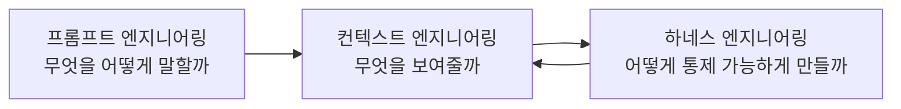
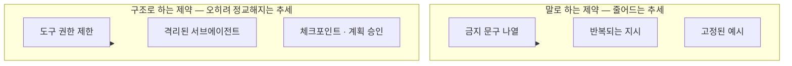

## 관련글

[**프롬프트 엔지니어링을 넘어서: Claude 5 세대와 컨텍스트 엔지니어링의 새로운 규칙**](https://k82022603.github.io/posts/%ED%94%84%EB%A1%AC%ED%94%84%ED%8A%B8-%EC%97%94%EC%A7%80%EB%8B%88%EC%96%B4%EB%A7%81%EC%9D%84-%EB%84%98%EC%96%B4%EC%84%9C-claude-5-%EC%84%B8%EB%8C%80%EC%99%80-%EC%BB%A8%ED%85%8D%EC%8A%A4%ED%8A%B8-%EC%97%94%EC%A7%80%EB%8B%88%EC%96%B4%EB%A7%81%EC%9D%98-%EC%83%88%EB%A1%9C%EC%9A%B4-%EA%B7%9C%EC%B9%99/)

## 1. 들어가며 — 새로 만난 글 하나

> 
> https://x.com/xudong07452910/status/2080835429121839323
> 
> 这篇文章，我真心建议所有使用 Claude Code 或者 Codex 的人都看一遍。
> 
> 我之前写过几次类似的感受：模型能力提升后，我们还在沿用旧模型时代的提示习惯，给 Agent 塞满规则、示例和各种「不要做什么」，很多时候反而会限制它。
> 
> Anthropic 最近把 Claude Code 面向 Opus 5 和 Fable 5 的系统提示词删掉了 80% 以上，代码评测几乎没有下降。
> 
> 他们发现，过多的规则很容易互相冲突，Claude 还得先花力气判断该听哪一条。固定示例也会缩小模型的探索范围，本来能自己判断的事情，最后被框死在预设路径里。
> 
> 现在的思路变得简单很多：
> 
> 让模型结合代码库自己判断；把工具接口设计清楚；验证和代码审查需要时再通过 Skills 加载；CLAUDE.md 只保留仓库里真正特殊、很难从代码中直接发现的坑。
> 
> 我觉得 Context Engineering 正在进入一个新阶段。
> 
> 过去像是给 Agent 写一本厚厚的员工手册，现在更像是给它搭建一个清晰的工作环境。
> 
> 模型越强，真正有价值的上下文可能越短：明确的边界、独特的经验、关键的参考，剩下的交给它自己判断。
> 
> 很多过去有效的「最佳实践」，现在可能已经从护栏变成了脚镣。
> 

X(트위터)에서 활동하는 Xudong Han이라는 계정이 2026년 7월 25일경 올린 글 하나가 중화권 AI 실무자 커뮤니티에서 상당한 반향을 얻었다. 이 글은 Claude Code나 Codex 같은 코딩 에이전트를 쓰는 사람이라면 한 번쯤 읽어볼 만하다는 소개와 함께 시작되는데, 내용의 핵심은 이전에도 여러 차례 이야기했던 감상이라고 저자 스스로 밝히고 있다. 모델의 능력이 좋아졌는데도 우리는 여전히 구형 모델 시절의 프롬프트 습관을 버리지 못하고, 에이전트에게 규칙과 예시와 온갖 "하지 마라" 목록을 잔뜩 채워 넣는다는 것이다. 그리고 많은 경우 이것이 오히려 에이전트의 발목을 잡는다는 것이 저자의 진단이다.

이 글은 앞서 다룬 앤쓰로픽의 공식 발표(Claude 5 세대를 위한 컨텍스트 엔지니어링 새 규칙, 2026년 7월 24일)를 근거로 들고 있다는 점에서 같은 사건을 다루고 있지만, 정작 흥미로운 지점은 따로 있다. 저자는 이 발표를 "직원 매뉴얼을 얇게 만들라"는 이야기로 요약하지 않는다. 대신 "에이전트에게 두꺼운 직원 매뉴얼 한 권을 써주던 시대에서, 에이전트에게 깔끔한 업무 환경 하나를 지어주는 시대로 넘어가고 있다"는 은유를 제시한다. 이 문서는 이 은유를 실마리 삼아, 지난 문서와는 다른 각도에서 같은 주제를 다시 풀어본다. 즉 규칙의 총량이 아니라 규칙의 형태 — 말로 된 제약과 구조로 된 제약이 각각 어떻게 되어가고 있는지에 초점을 맞춘다.

## 2. 저자의 진단 — 규칙을 채우는 관성

Xudong Han이 짚은 문제의식은 이렇다. Agent에게 규칙, 예시, 금지 사항을 촘촘히 채워 넣는 방식은 과거 모델의 판단력이 부족했던 시절에는 필요했던 안전장치였다. 그런데 모델의 판단력이 좋아진 지금도 그 습관을 그대로 이어가고 있고, 이것이 오히려 모델의 가능성을 좁히는 결과로 이어진다는 것이다. 저자는 그 근거로 앤쓰로픽이 Claude Code의 시스템 프롬프트를 Opus 5와 Fable 5를 대상으로 80퍼센트 이상 들어냈는데도 코딩 평가 점수가 거의 떨어지지 않았다는 사실을 든다. 이는 이미 확인된 사실로, 이전 문서에서도 다룬 바 있는 앤쓰로픽의 공식 발표 내용과 일치한다.

저자가 짚은 부작용은 두 가지다. 첫째, 규칙이 너무 많으면 서로 충돌하는 경우가 잦아지고, 모델은 결과물을 만들기 전에 어떤 규칙을 따를지 판단하는 데 먼저 힘을 써야 한다. 둘째, 고정된 예시는 모델의 탐색 범위 자체를 좁혀버려서, 원래는 스스로 판단할 수 있었던 문제까지 미리 정해둔 경로 안에 갇혀버리게 만든다. 이 두 가지는 이전 문서에서 정리했던 앤쓰로픽의 원칙 전환(규칙에서 판단으로, 예시에서 인터페이스로) 과 같은 현상을 가리키고 있지만, 저자는 이를 좀 더 압축적인 표현으로 정리한다. "지금까지 유효했던 최선의 실천법 중 상당수가, 이제는 울타리가 아니라 족쇄가 되어버렸을 수 있다"는 문장이 그것이다.

## 3. 저자가 제시하는 네 가지 실천 방향

저자는 추상적인 진단에 그치지 않고, 실무에서 어떻게 접근이 바뀌고 있는지를 네 가지로 압축한다.

첫째, 모델이 코드베이스 자체를 참고해 스스로 판단하도록 맡긴다. 둘째, 도구의 인터페이스 자체를 명확하게 설계한다. 셋째, 검증과 코드 리뷰는 항상 켜두는 것이 아니라 필요할 때 스킬(Skills)을 통해 불러온다. 넷째, CLAUDE.md에는 저장소 안에 있는, 코드만 봐서는 알아내기 어려운 진짜 특이한 함정만 남겨둔다. 이 네 가지는 이전 문서에서 다룬 앤쓰로픽의 여섯 가지 원칙 전환과 상당 부분 겹치지만, 저자는 이를 "직원에게 매뉴얼을 쥐여주는 방식에서, 직원이 일할 환경 자체를 지어주는 방식으로"라는 한 문장으로 압축한다는 점에서 나름의 독자적인 정리라고 볼 수 있다.

## 4. 세 단계로 다시 보는 에이전트 설계 — 프롬프트, 컨텍스트, 하네스

이 은유를 좀 더 깊이 이해하려면, 중화권 AI 엔지니어링 커뮤니티에서 통용되는 또 다른 개념틀을 함께 살펴볼 필요가 있다. 여러 중국어 기술 매체(텐센트 뉴스, 53AI 등)에 실린 Claude Code 설계 분석 글들은 에이전트를 잘 만드는 작업을 세 단계로 나누어 설명한다.

프롬프트 엔지니어링이 모델에게 "무엇을, 어떻게 말할 것인가"를 다루는 단계라면, 컨텍스트 엔지니어링은 "모델에게 무엇을 보여줄 것인가"를 다루는 좀 더 넓은 단계다. 그리고 하네스 엔지니어링은 그 위에서 "모델이 통제 가능한 방식으로 일하게 만드는 것"을 다루는 가장 바깥쪽 단계로 설명된다. 이 구분을 설명하는 한 중국어 기고문은 재미있는 비유를 든다. 95점짜리 에이전트 시스템을 만들고 싶다고 할 때, 프롬프트 엔지니어링만으로는 아무리 잘해도 70점대에 그치고, 컨텍스트 엔지니어링을 더하면 80~85점 정도까지 올라가며, 마지막으로 하네스 엔지니어링을 통한 통제 장치를 더해야 90~95점대에 도달할 수 있다는 것이다. 이 수치 자체는 해당 필자의 경험적 어림값이며 표준화된 벤치마크 결과는 아니라는 점은 짚어둘 필요가 있다.

이 세 단계 구분을 놓고 보면, Xudong Han의 글과 앤쓰로픽의 발표가 다루는 내용은 주로 앞의 두 단계 — 프롬프트 엔지니어링과 컨텍스트 엔지니어링 — 에서 규칙과 예시를 줄이는 이야기다. 그런데 세 번째 단계인 하네스 엔지니어링에서는 정반대의 흐름이 동시에 일어나고 있다는 점이 이 문서에서 새롭게 짚고 싶은 지점이다.

## 5. 반론 — "제약은 결함이 아니라 신뢰성의 원천이다"

같은 시기에 나온 또 다른 중국어 기술 분석 글은 흥미로운 반론을 제시한다. 이 글은 Claude Code를 하네스 엔지니어링의 관점에서 분석하면서, 코드 리뷰만 담당하는 서브에이전트에게는 애초에 파일을 읽는 권한만 주고 수정 권한 자체를 부여하지 않는 설계를 소개한다. 이 서브에이전트는 "파일을 고치지 말라"는 말을 들어서 안 고치는 것이 아니라, 애초에 고칠 수 있는 능력 자체가 주어지지 않은 것이다. 고위험 리팩터링 작업에는 별도의 git worktree로 서브에이전트를 격리시켜, 메인 작업 공간에 영향을 주지 않고 마음에 들지 않으면 그냥 버릴 수 있게 만드는 설계도 함께 언급된다.

이 글이 던지는 핵심 문장은 이렇다. 자유도가 높을수록 통제를 벗어날 가능성도 커지고, 반대로 해결 공간이 좁을수록 행동은 더 예측 가능해진다는 것이다. 도구가 다섯 개뿐인 서브에이전트가 도구가 쉰 개인 서브에이전트보다 더 신뢰할 수 있는 이유는 능력이 부족해서가 아니라, 잘못될 수 있는 경로 자체가 더 적기 때문이라는 설명이다. 같은 글은 또한 언어로 규칙을 강제하는 방식의 한계를 지적하면서, "실수하지 말라"를 매뉴얼에 적어두는 것은 도움이 되지만 그것만으로는 충분하지 않으며, 진짜 공학적인 해법은 그 일을 하는 사람에게 정확한 도구와 버전 관리되는 규범, 자동 검증 장치, 고위험 작업을 위한 격리된 샌드박스로 이루어진 업무 시스템 전체를 지어주는 것이라고 주장한다.

이 지점에서 Xudong Han의 글과 이 반론이 서로 모순되는 것처럼 보일 수 있지만, 실제로는 서로 다른 종류의 제약을 이야기하고 있다고 보는 편이 정확하다. Xudong Han이 줄이자고 말하는 것은 말(언어)로 표현된 규칙 — 시스템 프롬프트나 CLAUDE.md에 문장으로 적어놓은 금지 사항과 예시 — 이다. 반면 하네스 엔지니어링 쪽에서 강화되고 있다고 말하는 것은 구조로 만들어진 제약 — 도구 권한 자체를 제한하거나, 작업 공간을 격리하거나, 특정 시점에 반드시 사람의 승인을 받도록 만드는 장치 — 이다. 실제로 Claude Code에는 스스로 작업을 3일 이상 방치하면 만료시키는 장치, 코드 리뷰가 병합을 막지는 않지만 반드시 거치게 만드는 절차, 플랜 모드에서 계획을 반드시 사람이 승인하게 만드는 절차처럼 겉보기에는 불편해 보이는 장치들이 의도적으로 남아 있다는 점도 함께 소개된다. 이런 장치들은 사람이 프로세스에 대한 주도권을 유지하고, 실수가 걷잡을 수 없이 누적되는 것을 막고, 중요한 결정에 대해서는 사람의 확인을 남겨두기 위한 것이라는 설명이다.

## 6. 두 시선을 겹쳐 보면

여기서부터는 위 두 글을 겹쳐 읽은 이 문서 나름의 해석이다. 정리하면 이렇게 볼 수 있다.

모델에게 무엇을 하지 말라고 문장으로 타이르는 방식은 분명 힘을 잃어가고 있다. 모델의 판단력이 좋아졌으니 그런 문장은 점점 불필요해지고, 오히려 서로 충돌하며 혼란만 더한다는 것이 Xudong Han과 앤쓰로픽이 공통으로 짚은 지점이다. 그런데 이것이 "이제 아무 제약 없이 자유롭게 풀어놓아도 된다"는 뜻은 아니다. 오히려 제약의 무게중심이 언어에서 구조로 옮겨가고 있다고 보는 편이 정확하다. 하지 말라고 말하는 대신 애초에 할 수 없게 설계하고, 지켜보는 대신 되돌릴 수 있는 안전망을 깔아두고, 매번 확인하는 대신 중요한 갈림길에서만 사람의 승인을 받게 만드는 쪽으로 무게가 이동하고 있는 것이다.

이렇게 보면 "직원 매뉴얼에서 업무 환경으로"라는 Xudong Han의 은유는 한 겹 더 깊게 읽을 수 있다. 두꺼운 매뉴얼이 사라지는 것은 그 매뉴얼에 적혀 있던 언어적 규칙들이 이제 필요 없어졌기 때문이지만, 그 대신 지어지는 "업무 환경"이라는 것은 결코 무규칙한 공간이 아니다. 오히려 그 환경 자체가 도구 권한, 격리 공간, 체크포인트, 승인 절차 같은 훨씬 정교한 구조적 제약으로 이루어진 공간이다. 매뉴얼의 문장 수는 줄어들지만, 환경을 설계하는 일의 정교함은 오히려 늘어나고 있다고 보는 것이 두 글을 함께 읽었을 때 얻을 수 있는 균형 잡힌 결론일 것이다.

## 7. 확인된 사실 / 개인 의견 / 커뮤니티 논의 / 이 문서의 해석 구분

| 구분 | 내용 |
|---|---|
| 확인된 사실 | 앤쓰로픽이 2026년 7월 24일 Claude Code 시스템 프롬프트의 80퍼센트 이상을 Opus 5·Fable 5용으로 삭제했다고 공식 발표함. 코딩 평가에서 측정 가능한 손실이 없었다고 밝힘. |
| Xudong Han의 개인 의견(X 게시물) | 구형 모델 시절의 프롬프트 습관이 여전히 남아 있고, 이것이 에이전트의 가능성을 제약한다는 진단. "두꺼운 직원 매뉴얼에서 깔끔한 업무 환경으로"라는 은유. "최선의 실천법이 울타리에서 족쇄로 변했을 수 있다"는 주장. 이는 검증된 사실이 아니라 한 개인 실무자의 관찰과 의견이다. |
| 중화권 커뮤니티의 별도 논의 | 프롬프트·컨텍스트·하네스 엔지니어링을 3단계로 구분하는 분석 글들, 그리고 도구 권한 제한·서브에이전트 격리·체크포인트 등 구조적 제약을 강조하는 하네스 엔지니어링 분석 글. 특정 매체·저자 개인의 분석이며 앤쓰로픽의 공식 입장은 아니다. 점수 예시(70점/80~85점/90~95점)는 해당 필자의 경험적 어림값이다. |
| 이 문서의 해석 | 언어로 된 제약(문장 규칙)과 구조로 된 제약(도구·격리·승인 절차)을 구분해서 보면, 전자는 줄어드는 반면 후자는 오히려 정교해지고 있다는 것. 이는 검증된 사실이 아니라 위 자료들을 종합한 해석이다. |

## 8. 참고 자료

- Xudong Han(@Xudong07452910), X 게시물, 2026-07-25경 게시 (사용자 제공 캡처, 원문 중국어)
- Thariq Shihipar, "The new rules of context engineering for Claude 5 generation models", Claude by Anthropic 블로그, 2026-07-24. https://claude.com/blog/the-new-rules-of-context-engineering-for-claude-5-generation-models
- "深度解析 Claude Code 在 Prompt / Context / Harness 的设计与实践", 텐센트 뉴스, 2026-04-20. https://news.qq.com/rain/a/20260420A02VQ300
- "ClaudeCode-Harness Engineering驾驭者工程的最佳实践者", 즈후(知乎), 2026-04-06. https://zhuanlan.zhihu.com/p/2024871909649647210
- "从 Claude Code 看 Harness Engineer 的设计", CSDN, 2026-05-08. https://deepseek.csdn.net/6a0599c3662f9a54cb746329.html

---

