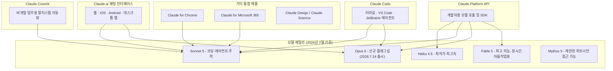
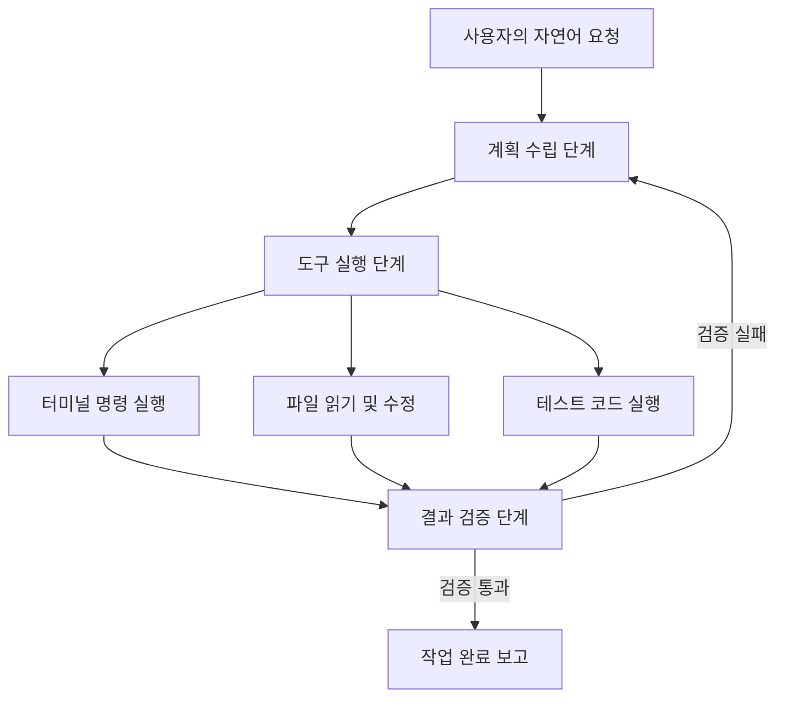

%20%EC%99%84%EC%A0%84%20%ED%95%B4%EC%84%A4-01.webp?raw=true)

%20%EC%99%84%EC%A0%84%20%ED%95%B4%EC%84%A4-02.webp?raw=true)

%20%EC%99%84%EC%A0%84%20%ED%95%B4%EC%84%A4-03.webp?raw=true)

[**<바로바로 클로드 with 코워크, 스킬, 클로드 코드, 디자인>**](https://www.yes24.com/product/goods/189114943)

## 이 문서에 대하여

업로드해 주신 세 편의 자료는 클로드를 처음 접하는 독자를 위한 안내서의 일부로 보입니다. 첫 번째 자료는 "클로드가 궁금해요! 6가지 Q&A"라는 제목 아래 클로드의 정체성, 활용법, 경쟁 서비스와의 차이, 요금 체계, 코딩 실력, 대화 데이터의 학습 활용 여부를 문답 형식으로 정리하고 있습니다. 두 번째 자료는 이 안내서 자체를 소개하는 서문 성격의 글로, AI를 능숙하게 다루는 사람과 그렇지 못한 사람 사이의 격차가 빠르게 벌어지고 있다는 문제의식에서 출발해, 첫 대화부터 외부 도구 연동, 클로드 코드를 활용한 개인 에이전트 구축까지 단계적으로 안내하겠다는 취지를 담고 있습니다. 세 번째 자료는 "클로드 코드가 뭔가요?"라는 제목으로 클로드 코드의 개념과 기존 코딩 보조 도구와의 차이, 그리고 코워크(Cowork)와의 관계를 설명하고 있습니다.

다만 이 안내서에 담긴 요금이나 벤치마크 수치 같은 구체적인 정보들은 작성 시점 기준이라, 2026년 7월 27일 현재 시점과는 상당한 차이가 있습니다. 특히 지난 한 달 사이 클로드 소네트 5, 클로드 오퍼스 5가 잇따라 출시되면서 모델 세대 자체가 바뀌었습니다. 아래에서는 각 문항의 원래 취지를 살리면서, 공식 발표 자료와 언론 보도를 바탕으로 확인한 최신 정보로 내용을 업데이트해 설명드립니다. 사실관계는 앤트로픽 공식 발표와 공식 가격 페이지를 우선으로 하고, 벤치마크 수치처럼 출처마다 편차가 있는 항목은 그 편차를 그대로 밝혀두었습니다.

---

## 1. 전체 그림: 클로드 제품군은 이렇게 구성되어 있습니다

본격적인 문답 해설에 앞서, 2026년 7월 현재 클로드라는 이름 아래 어떤 제품들이 존재하는지 먼저 정리하면 이후 내용을 이해하기가 훨씬 수월합니다.

클로드는 더 이상 하나의 챗봇이 아니라, 대화형 인터페이스(Claude.ai), 코딩 에이전트(Claude Code), 사무 자동화 에이전트(Claude Cowork), 그리고 개발자용 API 플랫폼이 하나의 모델 패밀리를 공유하는 구조로 확장되어 있습니다. 이 구조를 염두에 두고 원문의 여섯 가지 질문을 하나씩 살펴보겠습니다.

---

## 2. 여섯 가지 질문, 하나씩 다시 짚어보기

### 질문 1. 클로드는 어떤 AI인가요?

원문은 클로드를 "AI 안전 연구 기업 앤트로픽이 개발한 대화형 AI 어시스턴트"로 소개하며, 헌법적 AI(Constitutional AI)라는 독자적 훈련 방식을 통해 유해한 응답을 줄이고 안전하며 신뢰할 수 있는 답변을 하도록 설계되었다고 설명합니다. 이 설명의 큰 틀은 지금도 그대로 유효합니다. 헌법적 AI는 사람이 일일이 좋다/나쁘다를 표시해 주는 대신, 명문화된 원칙 목록(헌법)을 기준으로 모델 스스로 자신의 답변을 평가하고 개선하도록 훈련시키는 앤트로픽의 고유한 방법론이며, 이는 2026년 현재도 클로드 훈련의 근간을 이루고 있습니다.

다만 "2023년 출시 이후 꾸준히 업데이트되고 있다"는 설명 뒤에 이어져야 할 최신 근황이 있습니다. 2026년 들어서만 해도 모델 세대가 여러 차례 바뀌었습니다. 6월 9일에는 최상위 모델인 클로드 파블(Fable) 5와 클로드 미토스(Mythos) 5가 공개되었고, 6월 30일에는 중간 등급인 소네트(Sonnet) 5가, 그리고 불과 사흘 전인 7월 24일에는 오퍼스(Opus) 5가 출시되어 기존 오퍼스 4.8을 대체했습니다. 미토스 5는 사이버보안·생물학 분야에서의 잠재적 위험성 때문에 앤트로픽이 신뢰할 수 있는 소수의 파트너 조직에만 제공하는 모델이며, 파블 5는 이 미토스 계열에 안전장치를 추가해 일반에 공개한 버전입니다. 참고로 파블 5와 미토스 5는 미국 상무부의 수출 통제 조치로 6월 12일부터 일시 접근이 중단되었다가, 6월 30일 통제가 해제되면서 7월 1일부터 다시 정상 제공되고 있습니다.

또 한 가지 근황은, 앤트로픽이 2026년 2월 380억 달러 규모의 시리즈 G 투자를 유치했고 연환산 매출이 급격히 늘고 있다는 보도, 그리고 올해 하반기 기업공개(IPO)를 준비하고 있다는 보도입니다. 다만 IPO 시점은 아직 앤트로픽이 공식 확정 발표한 사안이 아니라 언론이 "올해 안"이라는 전망으로 다루고 있는 내용이므로, 확정된 사실이 아니라 전망 보도로 구분해 받아들이시는 것이 정확합니다.

### 질문 2. 클로드로 무엇을 할 수 있나요?

원문은 글쓰기, 번역, 요약, 코딩, 데이터 분석, 브레인스토밍 등 텍스트 기반 작업 전반과, 이메일 작성, 보고서 초안, 계약서 검토, 복잡한 코드 디버깅, 이미지·PDF 문서 분석까지 폭넓게 다룰 수 있다고 설명합니다. 이 부분도 방향성은 정확하지만, 지금은 여기에 몇 가지 제품이 더 추가되었습니다.

가장 눈에 띄는 추가 기능은 2026년 1월 12일 출시된 클로드 코워크(Claude Cowork)입니다. 코워크는 파일 정리, 여러 문서에 걸친 데이터 분석, 프로젝트 조율처럼 여러 단계로 이루어진 작업을 사람의 개입 없이 자율적으로 처리하는 에이전트 기능으로, 처음에는 맥스(Max) 요금제 전용이었다가 1월 16일부터 프로(Pro) 요금제 이용자에게도 열렸습니다. 여기에 더해 클로드 디자인(Claude Design, 슬라이드·목업 제작), 클로드 사이언스(Claude Science, 연구자용 작업공간), 크롬 확장 프로그램인 클로드 포 크롬(Claude for Chrome), 마이크로소프트 365 연동, 그리고 기억(Memory) 기능이 이제 무료 요금제를 포함한 전 플랜에 기본 제공됩니다. 대화 내용을 스킬(Skills)이나 커넥터(Connectors, MCP 프로토콜 기반)로 확장해 외부 도구와 연결하는 기능도 표준 기능으로 자리잡았습니다.

한 가지 여전히 변하지 않은 한계도 짚어드릴 필요가 있습니다. 클로드는 2026년 7월 현재도 사진이나 삽화 같은 픽셀 기반 이미지를 직접 생성하는 기능은 갖고 있지 않습니다. 업로드된 이미지를 분석하거나 SVG·차트·인터랙티브 컴포넌트 같은 코드 기반 시각 자료를 만드는 것은 가능하지만, "그림을 그려줘"라는 요청에는 그림 자체를 생성하지 못하고, 필요하다면 커넥터를 통해 외부 이미지 생성 모델과 연동하는 방식을 취합니다. 이는 안전성을 중시하는 앤트로픽의 제품 방향성에 따른 의도적 선택으로 해석되며, 경쟁사인 오픈AI(챗GPT)나 구글(제미나이)이 자체 이미지 생성 기능을 탑재한 것과는 뚜렷이 구분되는 지점입니다.

### 질문 3. 챗GPT, 제미나이랑 무엇이 다른가요?

원문은 챗GPT는 다양한 플러그인 생태계와 이미지 생성 기능이 강점이고, 제미나이는 구글 검색·드라이브 등 구글 서비스와의 연동에 특화되어 있으며, 클로드는 이미지를 직접 생성하지는 않지만 긴 문서 처리 능력과 복잡한 지시를 정확히 따르는 능력, 코딩·분석 작업에서 강점을 보인다고 설명합니다. 이 구도는 2026년 현재도 업계에서 널리 통용되는 일반적인 평가이며 큰 틀에서 유효합니다.

다만 "최대 100만 토큰에 달하는 긴 문서 처리 능력"이라는 부분은 조금 더 정교하게 짚을 필요가 있습니다. 앤트로픽 공식 가격 페이지 기준으로 클로드닷ai의 개인용 요금제(무료·프로·맥스)는 표준 컨텍스트 창(한 번에 참조할 수 있는 텍스트 범위)이 20만 토큰으로 표기되어 있으며, 100만 토큰급 확장 컨텍스트는 소네트 5가 API·특정 환경에서 제공하는 옵션 기능에 가깝습니다. 엔터프라이즈 요금제는 기본 모델 기준으로 50만 토큰 컨텍스트를 제공합니다. 즉 "100만 토큰"이라는 숫자 자체는 실재하지만, 클로드닷ai 화면에서 대화할 때 기본으로 그 용량이 열려 있는 것은 아니라는 점을 알아두시면 좋습니다.

경쟁 구도 자체도 지난 반년 사이 빠르게 바뀌었습니다. 오픈AI는 GPT-5.6 계열(내부적으로 솔·테라·루나 등으로 구분되는 것으로 알려짐)을, 구글은 제미나이 3.x 계열을 내놓으며 경쟁하고 있고, 중국의 문샷AI가 공개한 오픈웨이트 모델 킴이(Kimi) K3가 파블 5, GPT-5.6과 견줄 만하다는 자체 평가를 내놓는 등 오픈웨이트 진영의 추격도 빨라지고 있습니다. 다만 이런 상대적 우열 평가는 각 회사가 유리하게 골라 발표하는 벤치마크에 근거하는 경우가 많아, "어떤 AI가 절대적으로 낫다"기보다는 용도에 맞게 선택하는 것이 여전히 합리적인 접근입니다.

### 질문 4. 클로드는 무료인가요? 꼭 유료 결제해야 하나요?

원문은 무료 요금제도 프로젝트, 아티팩트, 기본 앱 연동 등 핵심 기능을 대부분 제공하므로 가볍게 사용한다면 굳이 결제하지 않아도 된다고 안내하고, 프로 요금제는 20달러/월, 팀 요금제는 25달러/인당/월이라고 소개합니다. 이 숫자들은 결과적으로는 여전히 큰 틀에서 맞아떨어지지만, 2026년 7월 기준 앤트로픽 공식 가격 페이지를 기준으로 조금 더 세분화해서 정리해 드리면 다음과 같습니다.

| 요금제 | 가격 (월 기준) | 비고 |
|---|---|---|
| Free | 0달러 | 웹 검색, 아티팩트, 기억(Memory), 코드 실행·파일 생성 등 핵심 기능 대부분 포함 |
| Pro | 연간 결제 시 17달러 / 월간 결제 시 20달러 | 클로드 코드·코워크·디자인·사이언스 포함, 프로젝트 무제한, Research 기능 이용 가능 |
| Max 5x | 100달러 | 프로 대비 5배 사용량 |
| Max 20x | 200달러 | 프로 대비 20배 사용량 |
| Team Standard (좌석당) | 연간 결제 시 20달러 / 월간 결제 시 25달러 | 최소 인원 요건 있음, 클로드 코드·코워크 포함 |
| Team Premium (좌석당) | 연간 결제 시 100달러 / 월간 결제 시 125달러 | 스탠다드 대비 5배 사용량 |
| Enterprise | 좌석당 20달러 + API 요율에 따른 사용량 과금 | SSO, SCIM, 감사 로그 등 보안·관리 기능 포함, 연간 계약 |

가장 큰 변화는 사용량 제한을 계산하는 방식입니다. 원문은 "하루 메시지 수에 제한이 있고 피크 타임에는 사용이 제한될 수 있다"고 설명했는데, 지금은 5시간 단위로 순환하는 세션 창을 기본으로 하고 그 위에 주간 한도가 얹히는 구조로 바뀌었습니다. 정확한 메시지 개수는 대화 길이, 선택한 모델, 사용하는 기능에 따라 달라지기 때문에 앤트로픽은 고정된 숫자를 공개하지 않으며, 대신 무료 대비 프로는 최소 5배, 맥스는 프로 대비 5배 또는 20배라는 상대적 배수로 안내하고 있습니다. 한도에 도달하면 대기하거나 상위 요금제로 전환하는 것 외에, 유료 요금제에서는 사용량 크레딧을 켜서 표준 API 요율로 계속 이용하는 방법도 새로 제공됩니다.

### 질문 5. 클로드 코드는 코딩 실력이 진짜 최고인가요?

원문은 "코딩 벤치마크 SWE-bench Verified에서 80.9%라는 최상위권 점수를 기록했다"며 클로드 코드가 터미널에서 코드베이스 전체를 파악하고 테스트·수정·실행까지 자율적으로 수행하는 에이전트 방식으로 작동한다고 설명합니다. 코딩 성능이 강력하다는 결론 자체는 지금도 유효합니다. 다만 80.9%라는 구체적 수치는 그사이 여러 세대의 모델 교체를 거치며 이미 낡은 정보가 되었습니다. 여기서는 확인된 사실과, 출처마다 편차가 있는 수치를 나누어 정리해 드립니다.

**공식적으로 확인되는 사실**: 2026년 6월 30일 출시된 소네트 5는 이전 세대인 소네트 4.6 대비 코딩·에이전트 성능에서 큰 폭으로 향상되었고, 오퍼스 4.8에 근접하는 구간까지 성능 격차를 좁혔다고 앤트로픽이 공식 발표했습니다. 이어 7월 24일 출시된 오퍼스 5는 최상위 모델 파블 5의 프런티어급 지능에 절반 가격으로 근접한다는 것을 핵심 포지셔닝으로 내세우며, 작업 난이도에 따라 "낮음·보통·높음·매우 높음" 중 하나를 선택해 비용과 성능을 조절할 수 있는 이펏(effort) 다이얼 기능을 새로 도입했습니다. 가격은 오퍼스 4.8과 동일하게 입력 100만 토큰당 5달러, 출력 100만 토큰당 25달러로 유지되었습니다.

**출처 간 수치 편차가 있는 부분**: 소네트 5의 정확한 SWE-bench Verified 점수는 언론과 벤치마크 트래커마다 72.7%, 82.1%, 85.2% 등 서로 다른 숫자를 보도하고 있어, 이 문서에서는 단정적인 하나의 수치를 확정해 제시하지 않습니다. 다만 여러 매체가 공통적으로 인용하는 수치는 더 어려운 변형 벤치마크인 SWE-bench Pro 기준으로, 소네트 5가 63.2%를 기록해 이전 세대인 소네트 4.6의 58.1%보다 개선되었고, 이는 오퍼스 4.8의 69.2%에 근접한 수준이라는 점입니다. 아울러 업계에서는 SWE-bench Verified 자체가 상위권 모델들 사이에서 점수 차이가 잘 벌어지지 않는 "포화" 국면에 접어들었다는 평가도 함께 나오고 있어, 이제는 이 한 가지 지표만으로 코딩 실력을 판단하기보다 터미널 실습형 벤치마크(Terminal-Bench)나 실제 업무 재현형 벤치마크(GDPval 등)를 함께 참고하는 흐름으로 옮겨가고 있습니다.

결론적으로 "절대적 평가보다는 복잡한 리포지토리 분석과 장기적 개발 작업 수행에서 현존하는 AI 코딩 도구 가운데 가장 강력한 선택지 중 하나"라는 원문의 결론은 여전히 합리적인 평가이며, 다만 그 근거가 되는 구체적 모델과 수치는 소네트 5·오퍼스 5로 갱신해서 이해하시는 것이 정확합니다.

### 질문 6. 클로드와 나눈 대화가 AI 학습에 쓰이나요?

원문은 대화 내용이 모델 개선에 활용될 수 있지만 설정 메뉴에서 학습 데이터 제공을 직접 거부할 수 있고, 팀 요금제 이상에서는 학습 미사용이 기본으로 적용되어 있으며, 시크릿 모드로 대화하면 해당 대화는 저장도 학습도 되지 않는다고 설명합니다. 이 설명은 지금도 정확합니다.

앤트로픽 공식 가격 페이지의 세부 항목을 보면 이 구조가 더 명확히 드러납니다. 무료·프로·맥스 등 개인용 요금제는 모델 학습 항목이 "옵트아웃(Opt-out)" 방식으로 표기되어 있는데, 이는 사용자가 설정에서 직접 거부 의사를 표시하지 않는 한 대화가 모델 개선에 활용될 수 있다는 뜻입니다. 반면 팀(Team)과 엔터프라이즈 요금제는 "기본적으로 콘텐츠에 대한 모델 학습 없음"으로 명시되어 있어, 별도 설정 없이도 기업 고객의 대화 내용은 학습에 쓰이지 않는 구조입니다. 원문이 안내한 대로, 민감한 업무 정보나 개인정보가 포함된 대화를 자주 나눈다면 사전에 개인정보 설정을 점검하고, 저장·학습을 원하지 않는 대화는 시크릿 모드(인코그니토 채팅)를 사용하는 것이 여전히 가장 확실한 방법입니다.

---

## 3. 안내서 서문에 담긴 취지

두 번째 자료는 이 안내서의 서문 격인 짧은 소개 글로, 클로드와 같은 AI를 능숙하게 다루는 사람과 그렇지 못한 사람 사이의 역량 격차가 매우 빠르게 벌어지고 있다는 문제의식에서 출발합니다. 많은 사람들이 "AI에게 무엇부터 물어봐야 할지 모르겠다"는 막막함 때문에 시도조차 하지 못하고 있다는 관찰을 바탕으로, 이 책은 클로드와의 첫 대화부터 시작해 문서 작업, 외부 도구 연동, 그리고 클로드 코드를 활용한 개인용 에이전트 구축까지 단계적으로 안내하겠다는 목표를 제시하고 있습니다. 복잡한 개념을 쉬운 언어로 풀어내고, 실무에 곧바로 적용할 수 있는 활용법을 다양한 실습과 함께 담아 AI를 실제로 함께 일하는 도구로 활용할 수 있도록 돕는 실용서를 지향한다는 것이 이 서문의 핵심 메시지입니다. 저자는 "AI 커피챗"이라는 이름의 AI 인플루언서로 소개되어 있습니다.

이 서문이 짚고 있는 문제의식, 즉 AI 활용 역량의 격차가 실제로 벌어지고 있다는 관찰은 2026년 현재 여러 산업 현장에서도 자주 논의되는 주제입니다. 특히 국내 기업 환경에서는 데모 단계의 성과와 실제 운영 단계의 성과 사이에 큰 간극이 존재한다는 지적이 많은데, 이는 도구를 다루는 숙련도의 차이가 결과물의 품질을 크게 좌우하기 때문입니다. 그런 의미에서 첫 대화부터 실전 에이전트 구축까지 단계적으로 안내하겠다는 이 서문의 접근 방식은, 도구 자체의 성능보다 활용 방식(하네스)이 성과를 좌우한다는 최근의 산업 논의와도 맥이 닿아 있습니다.

---

## 4. 클로드 코드가 뭔가요? 원문 상세 해설

### 원문이 설명하는 클로드 코드의 정체성

세 번째 자료는 클로드 코드를 "클로드의 기능 중 가장 강력하고 유연한 기능"으로 소개합니다. 사용자의 컴퓨터를 직접 조작할 수 있고 다양한 기능을 붙여 확장할 수 있다는 설명, 그리고 클로드 코드 이전에는 탭 자동완성이나 챗봇이 생성한 코드를 복사해서 붙여넣는 것이 코딩 보조 도구의 일반적인 모습이었다는 대비가 핵심 내용입니다. 클로드 코드는 여기서 한 걸음 더 나아가 개발 도구를 설치하고, 폴더 구조를 만들고, 환경을 설정하고, 실제로 동작하는 프로그램을 개발까지 알아서 수행한다는 점에서 "바이브 코딩 시대에서 에이전트의 시대로 넘어가는 순간"이라고 표현하고 있습니다.

원문은 이어서 코워크(Cowork)와의 관계도 짚습니다. 코워크가 클로드 코드와 비슷하다고 느꼈다면 정확한 직관이라는 것인데, 실제로 코워크는 클로드 코드를 기반으로 만들어진 도구로, 클로드 코드의 기능을 가져와 사무 업무에 맞게 변형한 것이라고 설명합니다. 그래서 코워크로 할 수 있는 것은 클로드 코드로도 할 수 있으며, 클로드에 익숙해진다면 대부분의 작업을 클로드 코드에서만 하게 될지도 모른다는 전망으로 문단을 마무리합니다.

### 최신 정보로 다시 보는 클로드 코드

이 설명의 큰 틀, 즉 클로드 코드가 개발자의 컴퓨터 환경(터미널, 파일 시스템)에 직접 접근해 계획 수립부터 코드 작성, 실행, 검증까지 자율적으로 수행하는 에이전트라는 점은 2026년 7월 현재도 정확히 유효한 설명입니다. 다만 클로드 코드를 둘러싼 접근 경로와 생태계는 그사이 크게 확장되었습니다. 처음에는 터미널 환경이 중심이었지만, 지금은 데스크톱 앱, VS Code 확장 프로그램, JetBrains 계열 IDE, 그리고 원격으로 작업을 위임할 수 있는 모바일 앱까지 접근 경로가 넓어졌습니다. 또한 클로드 코드는 이제 무료 요금제를 제외한 모든 유료 요금제(프로, 맥스, 팀, 엔터프라이즈)에 기본 포함되어 있으며, 클로드닷ai에서의 대화와 클로드 코드에서의 작업이 동일한 사용량 풀을 공유하는 구조입니다.

성능 측면에서는 앞서 5번 문항에서 살펴본 대로 소네트 5와 오퍼스 5로 세대가 교체되면서 코딩 관련 벤치마크 점수가 전반적으로 상승했습니다. 특히 오퍼스 5는 스스로 작업 결과를 검증하고 오류가 발생하면 사람의 개입 없이 복구하는 능력이 강화되었다고 앤트로픽이 밝히고 있어, 원문이 강조한 "코드를 수정하고 실행까지 알아서 수행한다"는 자율성의 수준이 한층 더 높아졌다고 볼 수 있습니다. 다만 오퍼스 5는 사이버보안·생물학 영역의 위험 작업 수행 능력에서는 미토스 5보다 의도적으로 낮은 성능을 보이도록 설계되어 있다는 점도 함께 공개되어 있는데, 이는 성능을 무조건 극대화하기보다 안전성과의 균형을 고려한 설계라는 앤트로픽의 설명입니다.

코워크와의 관계에 대한 원문의 설명, 즉 "코워크는 클로드 코드를 사무 업무용으로 변형한 도구"라는 관점도 큰 틀에서 합리적인 해석입니다. 다만 정확히 짚자면 두 제품은 별도의 제품명과 별도의 요금제 노출 항목(가격 페이지의 기능 비교표에 각각 독립된 행으로 표기됨)을 가진 자매 제품에 가깝습니다. 클로드 코드가 코드 저장소, 터미널, 개발 도구 체인을 다루는 데 특화되어 있다면, 코워크는 파일 정리, 여러 문서에 걸친 분석, 프로젝트 조율처럼 비개발 업무의 여러 단계를 사람의 실시간 감독 없이 처리하는 데 특화되어 있습니다. 두 제품이 에이전트라는 동일한 기술적 뿌리(계획 수립, 도구 사용, 자기 검증을 반복하는 자율 작동 구조)를 공유한다는 점에서 원문의 통찰은 정확하며, "클로드에 익숙해지면 대부분의 작업을 클로드 코드류 인터페이스에서 처리하게 될 것"이라는 전망도 코워크의 빠른 확산 속도(2026년 1월 출시 이후 나흘 만에 프로 요금제까지 확대)를 볼 때 설득력 있는 예측으로 평가할 수 있습니다.

### 클로드 코드의 작동 흐름

원문이 설명한 "개발 도구 설치 → 폴더 구조 생성 → 환경 설정 → 프로그램 개발"이라는 흐름을 조금 더 일반화하면, 클로드 코드류 에이전트는 대체로 다음과 같은 순환 구조로 작동합니다.

이 순환 구조에서 중요한 점은, 에이전트가 스스로 "이 정도면 끝났다"고 성급하게 판단하는 것이 아니라 정해진 검증 절차를 통과해야만 작업을 완료로 표시한다는 원칙입니다. 검증 없이 자기 확신만으로 작업을 종료해 버리는 것은 에이전트형 코딩 도구에서 흔히 지적되는 실패 유형 중 하나이며, 이 때문에 계획-실행-검증-완료라는 결정론적 절차를 갖추는 것이 하네스(harness) 설계에서 핵심적인 요소로 다뤄지고 있습니다.

---

## 5. 요약: 원문 대비 무엇이 달라졌나

| 항목 | 안내서 원문 내용 | 2026년 7월 27일 기준 최신 현황 |
|---|---|---|
| 클로드 정의 | 2023년 출시, 헌법적 AI로 훈련 | 방법론은 동일, 다만 모델 세대는 클로드 5 패밀리(하이쿠 4.5·소네트 5·오퍼스 5·파블 5·미토스 5)로 세대 교체 |
| 활용 범위 | 글쓰기·코딩·분석·문서 질의응답 | 위 항목에 더해 코워크(사무 자동화), 디자인, 사이언스, 크롬·MS365 연동, 기억 기능이 표준화 |
| 경쟁 서비스 비교 | 챗GPT(이미지 생성), 제미나이(구글 연동), 클로드(긴 문서·정확한 지시 이행) | 구도는 유지, 다만 컨텍스트 창은 클로드닷ai 기본 20만 토큰, 100만 토큰은 옵션 기능. 경쟁 모델도 GPT-5.6, 제미나이 3.x 등으로 세대 교체 |
| 요금제 | 프로 20달러/월, 팀 25달러/인당/월 | 프로 연간 17달러(월간 20달러), 맥스 100~200달러, 팀 스탠다드 20~25달러, 팀 프리미엄 100~125달러, 엔터프라이즈 좌석당 20달러+사용량 |
| 코딩 성능 | SWE-bench Verified 80.9% | 소네트 5·오퍼스 5로 세대 교체, SWE-bench Pro 기준 소네트 5가 63.2%(전작 58.1%)로 보고됨. Verified 정확 수치는 출처마다 편차 있어 단정 불가 |
| 학습 데이터 활용 | 설정에서 거부 가능, 팀 요금제는 기본 미사용 | 개인 요금제는 옵트아웃 방식(기본값은 활용, 거부 설정 가능), 팀·엔터프라이즈는 기본적으로 학습 미사용 |
| 클로드 코드 | 컴�터 직접 조작, 개발 환경 자동 구성 | 접근 경로가 터미널·데스크톱·IDE·모바일로 확장, 전 유료 요금제 기본 포함, 세대 교체로 자율성·자기검증 능력 강화 |

---

## 6. 참고자료 (확인 시점: 2026년 7월 27일)

**앤트로픽 공식 자료**
- Anthropic, "Introducing Claude Sonnet 5" (anthropic.com/news/claude-sonnet-5), 2026년 6월 30일
- Anthropic, "Introducing Claude Opus 5" (anthropic.com/news/claude-opus-5), 2026년 7월 24일
- Claude 공식 가격 페이지 (claude.com/pricing), 확인일 2026년 7월 27일

**언론 보도 (모델 발표 관련)**
- Axios, "Anthropic releases new model, Opus 5", 2026년 7월 24일 (axios.com)
- VentureBeat, "Anthropic launches Claude Opus 5, a cheaper AI model for coding, agents and enterprise workflows", 2026년 7월 24일 (venturebeat.com)
- 9to5Mac, "Anthropic upgrades Claude with new Opus 5 model", 2026년 7월 24일 (9to5mac.com)
- Fortune, "Anthropic releases Claude Opus 5", 2026년 7월 24일 (fortune.com)
- TechCrunch, "Anthropic launches Claude Sonnet 5 as a cheaper way to run agents", 2026년 6월 30일 (techcrunch.com)
- Cybernews, "Anthropic streamlines research with Claude Science, rolls out cheaper Sonnet 5", 2026년 6월 30일 (cybernews.com)
- THE Journal, "Anthropic Intros Lower-Cost Claude Sonnet 5", 2026년 7월 8일 (thejournal.com)

**참고: 벤치마크·가격 관련 3자 정리 자료 (수치 편차 존재, 참고용)**
- VentureBeat 기사 내 SWE-bench Pro·Terminal-Bench 2.1 수치 비교
- 여러 벤치마크 트래커 사이트의 SWE-bench Verified 수치는 72.7%~85.2%로 편차가 있어 이 문서에서는 단정하지 않았습니다.

> 이 문서는 웹 검색으로 확인 가능한 공식 발표와 복수 언론 보도를 교차 확인해 작성했으며, 출처 간 수치가 엇갈리는 부분은 그 사실 자체를 명시했습니다. 요금제나 벤치마크 수치는 앤트로픽의 정책에 따라 언제든 변경될 수 있으므로, 실제 결제나 도구 선택 전에는 위 공식 링크에서 최신 수치를 다시 한번 확인하시길 권장드립니다.

---

작성일자: 2026-07-27
