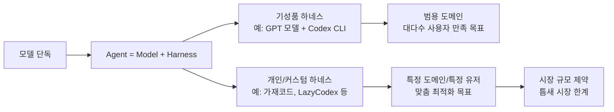
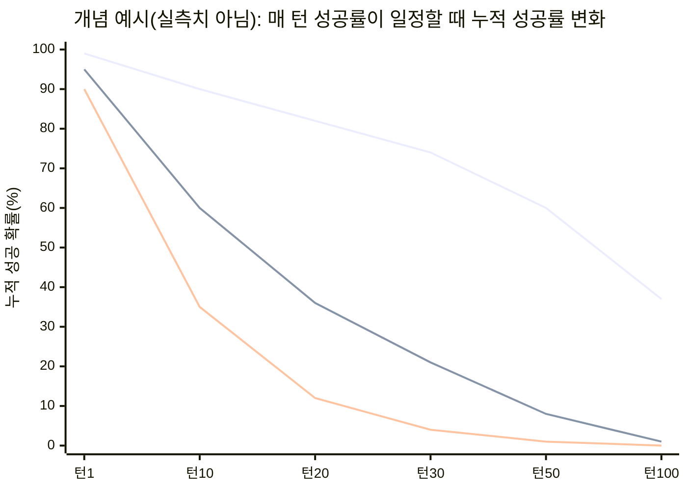
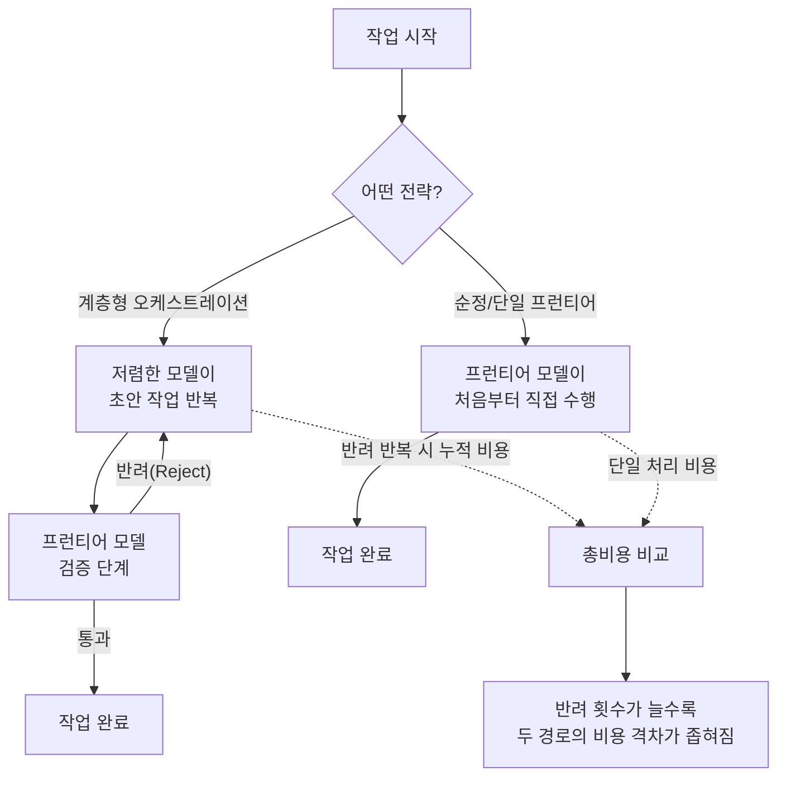

> 
> https://www.threads.com/@0crp_tii/post/DbSMDzFkoBg
> 
> 하네스를 열심히 갈고닦는 사람들은 왜 갈고닦는걸까?
> 
> 나도 개인용 하네스를 열심히 갈고닦았지만 결국 순정이 최고라는 결론에 가까워지고 있다
> 
> 하네스를 구축해던 때는 하네스를 사용하면 잘 작동이 되었지만 이제 그렇지 않은것같음. 그럼에도 계속 하네스를 갈고닦았는데 그 이유는 비용문제였던것 같음
> 
> Opus, sol을 전 작업에 맡기지 않고 간단한 일은 저렴한 모델이 하고 똑똑한 모델은 전체계획작성, 검증 만 사용하려고 했었지만 이젠 부질없어보인다
> 
> 결국 저렴이 모델로 루프돌고온 결과물은 프런티어모델 검증에 꼭 리젝을 당하고 그 검증횟수가 결국 처음음부터 프런티어 모델로만 사용하는 비용과 엇비슷해보이기 때문
> 
> 아직은 하네스가 잘만 다루면 더 잘 작동 할것같지만 곧 알잘딱깔센으로 순정이 더 잘할것같음
> 
> 그래서 하네스 갈고닦기 이제 안하려고 한다
> 

## 목차

1. 들어가며: 이 스레드는 무엇을 다루고 있는가
2. 원 게시물 정독: 0crp_tii가 하네스를 접겠다고 말한 이유
3. 첫 번째 논쟁: "하네스"라는 말은 대체 어디까지를 가리키는가
4. 두 번째 논쟁: 확률은 곱해지면 반드시 줄어든다는 비유
5. 세 번째 논쟁: 성능이 아니라 인지적 부하를 설계한다는 관점
6. 배경지식 정리: 하네스, 순정, 가재코드, 캐스케이드 검증이란 무엇인가
7. 2026년 상반기 하네스 생태계의 실제 흐름
8. 이 논쟁을 비용 구조로 다시 읽기
9. 정리하며: 무엇이 남는 질문인가
10. 참고자료

---

## 1. 들어가며: 이 스레드는 무엇을 다루고 있는가

이 문서가 분석하는 대상은 Threads 계정 `@0crp_tii`가 올린 게시물과 그에 달린 세 갈래의 대댓글 스레드다. 게시물의 제목 격인 첫 문장은 "하네스를 열심히 갈고닦는 사람들은 왜 갈고닦는 걸까?"라는 자문으로 시작하는데, 이 질문을 던진 사람 자신이 오랫동안 개인용 하네스를 만들어 온 사람이라는 점에서 흥미롭다. 결론부터 말하면 이 사람은 "이제 하네스 갈고닦기를 그만두겠다"고 선언하고 있고, 그 이유로 비용 구조의 문제를 든다. 이 선언에 세 명의 서로 다른 논자가 각기 다른 각도에서 반응했고, 원 게시자가 그때그때 짧게 답을 남기면서 대화가 세 갈래로 갈라졌다.

이 논쟁이 특별히 의미가 있는 이유는, 이것이 단순한 사견 충돌이 아니라 2026년 상반기 한국 AI 개발자 커뮤니티에서 실제로 진행 중인 더 큰 흐름—즉 "하네스 엔지니어링"이라는 유행어가 정점을 찍은 뒤, 그 유행에 대한 피로감과 회의론이 동시에 떠오르는 국면—을 축소판으로 보여주기 때문이다. 아래에서는 원 게시물의 주장을 먼저 정리하고, 그 다음 세 갈래 댓글을 순서대로 짚은 뒤, 마지막에 이 모든 논쟁이 실제 하네스 생태계 및 비용 구조와 어떻게 맞아떨어지는지(혹은 어긋나는지) 검증한다.

---

## 2. 원 게시물 정독: 0crp_tii가 하네스를 접겠다고 말한 이유

원 게시자의 논리를 순서대로 풀어보면 다음과 같다.

먼저 그는 자신도 개인용 하네스를 오랫동안 다듬어 왔지만, 점점 "결국 순정이 최고"라는 결론에 가까워지고 있다고 고백한다. 여기서 "순정"이라는 표현은 자동차 튜닝 문화에서 온 말로, AI 커뮤니티에서는 별도의 커스텀 설정이나 추가 도구 없이 회사가 기본으로 제공하는 모델과 인터페이스를 그대로 쓰는 것을 가리킨다. 그는 하네스를 처음 구축했을 때는 실제로 효과가 있었지만, 지금은 그렇지 않은 것 같다고 말한다.

그럼에도 왜 계속 하네스를 다듬어 왔는지에 대해 그는 "비용 문제"를 원인으로 짚는다. 구체적으로는 최고 성능 모델(원문의 "Opus, sol"은 문맥상 Claude Opus급, 혹은 그에 준하는 최상위 프런티어 모델을 지칭하는 것으로 보이지만, 표현이 축약되어 있어 정확히 어떤 모델을 가리키는지 단정하기는 어렵다)에 모든 작업을 맡기지 않고, 간단한 작업은 저렴한 모델이 처리하게 하고, 똑똑한(비싼) 모델은 전체 계획 수립과 최종 검증에만 투입하는 방식—이른바 계층형(tiered) 모델 오케스트레이션—을 시도해 왔다는 것이다.

그런데 그는 이 방식이 이제 "부질없어 보인다"고 말한다. 이유는 명확하다. 저렴한 모델이 여러 차례 루프를 돌려 만들어낸 결과물이 프런티어 모델의 검증 단계에서 거의 매번 반려(reject)당하고, 그 반려-재작업을 반복하는 검증 횟수를 다 합치면 결국 처음부터 프런티어 모델 하나로만 작업했을 때의 비용과 비슷한 수준까지 올라간다는 것이다. 다시 말해 "싼 모델 여러 번 + 비싼 모델 검증 여러 번"의 총합이 "비싼 모델 한 번"과 별 차이가 없어진다는 관찰이다.

그는 마지막으로 두 가지를 덧붙인다. 하나는 지금 당장은 하네스를 잘 다루면 여전히 더 나은 결과가 나올 수 있다는 유보이고, 다른 하나는 조만간 모델 자체가 알아서 "알잘딱깔센"(알아서 잘 딱 깔끔하고 센스 있게, 즉 별다른 지시 없이도 눈치껏 잘 처리한다는 뜻의 신조어)하게 처리해 줄 것이므로 순정이 하네스를 능가하게 될 것이라는 전망이다. 그래서 그는 하네스를 더 이상 갈고닦지 않기로 했다고 선언하며 글을 맺는다.

이 주장의 핵심을 한 문장으로 요약하면, "계층형 모델 오케스트레이션은 검증 비용까지 합산하면 경제적 이점이 사라지고 있으며, 모델 자체의 발전 속도가 하네스가 메워주던 격차를 스스로 흡수하고 있다"는 것이다.

---

## 3. 첫 번째 논쟁: "하네스"라는 말은 대체 어디까지를 가리키는가

첫 번째로 반응한 사람은 `althoughwevecome`으로, 짧고 다소 냉소적인 댓글을 남겼다. 그는 "'하네스'라는 용어의 정의가 명확하지 않으니 이런 의견도 용기 있게 말할 수 있는 것"이라는 취지로 논평했는데, 이는 원 게시물의 주장 자체보다는 논쟁의 전제, 즉 "하네스"라는 단어가 사람마다 다르게 쓰이고 있다는 점을 지적한 것으로 읽힌다.

이 지적에 더 구체적으로 살을 붙인 것은 `vibe.tomato`다. 그는 원 게시자가 말하는 "순정"이 사실은 순정이 아니라 "GPT 모델 + 코덱스(Codex)"라는 조합 자체가 이미 하나의 하네스라고 지적한다. 여기서 코덱스는 OpenAI가 공식적으로 배포하는 터미널 기반 코딩 에이전트 도구인 Codex CLI를 가리키는 것으로 보인다. 즉 vibe.tomato의 논지는, 원 게시자가 "아무것도 안 씌운 맨몸의 모델"과 비교하고 있다고 생각하는 대상이 실제로는 OpenAI가 이미 설계해 놓은 하나의 완성된 하네스라는 것이다. 그는 이어서 사람들이 계속 별도의 하네스를 갈고닦는 이유 중 하나로, 그런 기성품 조합(GPT 모델 + 코덱스)이 애초에 "코딩이라는 하나의 도메인 안에서, 최대한 많은 사용자가 대체로 만족할 만한 결과를 내도록" 범용적으로 설계된 "기성품"이기 때문이라는 점을 든다. 즉 특정 도메인이나 특정 사용자에게는 이 범용 조합보다 별도로 맞춤 제작한 하네스가 더 나을 수 있다는 것이다.

이에 대해 원 게시자 0crp_tii는 자신도 그 지적에 어느 정도 동의하면서도, 특정 도메인에 특화된 하네스를 만드는 방향은 "시장이 너무 작다"는 현실적 한계에 부딪힌다고 답한다. 그는 "뭔가 큰일을 하고 싶은데 욕심부터 버려야겠다"며 다소 자조적인 태도로 마무리한다. 이 답변은 단순한 기술적 논쟁을 넘어, 개인 개발자가 커스텀 하네스를 만드는 행위가 결국 "특정 도메인용 틈새 도구를 만드는 것"과 "범용 기성품이 흡수해버릴 기능을 재발명하는 것" 사이에서 딜레마에 놓여 있음을 드러낸다.

---

## 4. 두 번째 논쟁: 확률은 곱해지면 반드시 줄어든다는 비유

두 번째 갈래 댓글은 `yoonjang.2`가 남긴 것으로, 이 스레드 전체에서 가장 개념적으로 밀도가 높은 논증이다. 그의 주장은 두 부분으로 나뉜다.

첫째, 그는 하네스가 애초에 "1번의 프롬프트로 좋은 결과를 내는 시대"에 맞춰 설계된 것인데, 사람들이 지금 하려는 일은 사실상 "30번, 50번, 100번, 1000번의 프롬프트를 거쳐도 좋은 결과가 나오는 하네스"를 깎아내려는 시도가 아니냐고 되묻는다. 그리고 여기에 수학적 비유를 붙인다. 1.00보다 작은 수를 계속 곱하면 그 값이 0.80이든 0.99든 상관없이 결국 0에 수렴할 수밖에 없다는 것이다. 그는 이 수렴 지점을 에이전트의 "수명"이라고 부르길 좋아한다고 말하며, 어떤 에이전트든 별다른 제어 없이 100사이클을 무작정 돌리면 결과물이 "슬롭"(slop, 품질이 낮고 뒤죽박죽인 결과물을 가리키는 속어) 또는 "블롯"(bloat, 불필요하게 비대해진 상태)이 되어버린다고 지적한다. 다만 매 턴을 매우 조심스럽게 쓰는 사람들도 이 붕괴를 완전히 막는 것이 아니라 단지 뒤로 미룰 뿐이라고 덧붙인다.

여기서 분명히 짚어야 할 점이 있다. 이 "매 턴 성공률을 곱하면 전체 성공률이 지수적으로 감소한다"는 논리 자체는 확률론적으로 자연스러운 직관이지만, 어떤 특정 하네스나 특정 모델의 실측 데이터에 근거한 것이 아니라 yoonjang.2 개인이 제시한 개념적 비유다. 아래 도표는 이 비유를 순수하게 개념적으로 시각화한 것으로, "매 턴 성공률이 각각 99%, 95%, 90%로 일정하게 유지된다"는 가상의 전제 위에서 턴 수가 늘어날수록 누적 성공 확률이 어떻게 줄어드는지를 계산한 것일 뿐, 실제 AI 에이전트를 측정한 수치가 아니라는 점을 밝혀둔다.

이 개념도가 보여주려는 바는 단순하다. 매 턴의 성공률이 아무리 높아도(예: 99%) 턴 수가 누적되면 결국 실패 확률이 무시할 수 없는 수준까지 쌓인다는 것, 그리고 성공률이 조금만 낮아도(90%) 붕괴가 훨씬 빨리 온다는 것이다. yoonjang.2는 이 붕괴 지점을 "관리"하는 것이 아니라 "지연"시키는 것이 현재 하네스 엔지니어링의 실질적 기능이라고 보는 셈이다.

둘째, 그러나 yoonjang.2는 이 비관적 진단 뒤에 중요한 단서를 하나 남긴다. 작업 성능 자체를 끌어올리는 범용 하네스와 달리, "목적 기반의 프로젝트 특정(project-specific) 하네스"를 놓고 보면 하네스라는 개념 자체는 어쩌면 영원히 유효할 수 있다는 것이다. 즉 그의 결론은 "범용 성능 하네스는 언젠가 모델 발전에 흡수되어 무의미해지겠지만, 특정 프로젝트의 고유한 목적과 제약을 담아내는 하네스는 모델이 아무리 발전해도 대체되지 않는다"는 구분이다.

이에 대해 0crp_tii는 목적 기반 하네스라는 방향성에는 동의하면서도, 순정 모델이 그런 하네스적 기능들을 하나둘 흡수해 나가는 것을 지켜보며 의욕이 다소 꺾였다고 솔직하게 답한다.

---

## 5. 세 번째 논쟁: 성능이 아니라 인지적 부하를 설계한다는 관점

세 번째 갈래는 `bellman.pub`이 남긴 댓글에서 시작된다. 이 계정은 실제로는 허예찬(Yeachan Heo)이라는 개발자의 계정으로 확인되는데, 그는 낮에는 퀀트 트레이딩(알고리즘 트레이딩) 커뮤니티 '퀀트.스타트()'를 이끌고, 밤에는 AI 코딩 에이전트를 다루는 것으로 알려져 있다. 그가 만든 오픈소스 프로젝트가 바로 이 스레드에도 등장하는 "가재코드(Gajae-Code, 줄여서 gjc)"다[1][2][3][4].

bellman.pub은 원 게시물과 앞선 댓글들의 논지에 대체로 동의한다면서도, 자신은 조금 다른 관점에서 설계한다고 밝힌다. 그의 논점은, 이제 중요한 것은 "AI의 성능 자체를 얼마나 높이느냐"가 아니라 "사람이 그 AI를 사용해서 같은 결과에 도달하기까지 들여야 하는 인지적 부하가 얼마나 싼가"라는 것이다. 그는 이 인지적 부하를 "바이오토큰"이라는 표현으로 부르는데, 이는 모델이 소비하는 API 토큰 비용과 대비해서, 사람이 그 결과물을 확인하고 판단하고 개입하는 데 드는 정신적 에너지를 하나의 비용 단위로 취급하는 비유적 표현으로 이해할 수 있다. 즉 그가 하네스를 설계하는 기준은 단순히 출력 품질이나 벤치마크 점수가 아니라, "사람이 최소한의 확인만으로 결과를 신뢰할 수 있는 구조를 만드는가"에 있다는 뜻이다.

이 관점은 실제로 그가 만든 가재코드의 설계 철학과도 맞닿아 있다. 가재코드는 공식 문서에서 스스로를 "외부 코딩 에이전트 하네스"로 규정하며, 작업 흐름을 깊은 인터뷰(deep-interview) → 계획 수립(ralplan) → 최종 목표 검증(ultragoal)이라는 구조로 설계했다고 밝히고 있다[5]. 이는 Claude Code나 Codex CLI 같은 특정 에이전트 런타임 안에 숨어드는 플러그인이 아니라, 그런 도구들과 나란히(beside) 실행되면서 구조화된 계획 수립과 지속적인 근거(증거) 기록, 격리된 작업 공간을 제공하는 것을 목표로 한다는 설명이다[6]. 요컨대 가재코드가 추구하는 가치는 "AI가 더 똑똑해지는 것"이 아니라 "사람이 그 결과를 검토하고 신뢰하는 과정에서 드는 부담을 줄이는 것"에 가깝고, 이는 bellman.pub이 댓글에서 밝힌 설계 기준과 정확히 일치한다.

원 게시자 0crp_tii는 이 댓글에 짧게 "가재코드 잘 쓰고 있다"고 답하며 대화를 마무리하는데, 이는 그가 앞서 밝힌 "순정 회귀" 성향과 미묘하게 대비된다. 즉 그는 범용 하네스(계층형 모델 오케스트레이션)에는 회의적이 되었지만, 사람의 인지적 부하를 줄여주는 방향으로 설계된 도구(가재코드)에 대해서는 여전히 긍정적인 태도를 유지하고 있는 셈이다.

---

## 6. 배경지식 정리: 하네스, 순정, 가재코드, 캐스케이드 검증이란 무엇인가

여기서부터는 이 스레드를 이해하는 데 필요한 배경 개념들을 처음 접하는 사람도 알 수 있도록 하나씩 풀어본다.

**하네스(harness)** 란 원래 말에게 채우는 마구, 즉 고삐와 안장을 뜻하는 단어다. AI 커뮤니티에서는 이 말을 비유로 가져와서, AI 모델 자체가 아니라 그 모델을 감싸고 있는 운영 구조 전체—규칙 파일, 메모리, 도구 연결, 검증 루프 등—를 가리키는 말로 쓴다. 즉 "에이전트 = 모델 + 하네스"라는 공식이 커뮤니티에서 통용되는데, 아무리 강력한 모델(말)이 있어도 그것을 통제하는 고삐와 안장(하네스)이 부실하면 그 힘을 제대로 끌어낼 수 없다는 뜻이다[6][7]. 실제로 하네스를 구성하는 방식에 따라 동일한 모델의 벤치마크 성능이 몇 배까지 벌어질 수 있다는 관찰 결과들이 커뮤니티에서 자주 인용된다[7].

**순정**은 이런 별도의 커스텀 하네스를 씌우지 않고, 기업이 기본으로 제공하는 인터페이스와 설정을 그대로 쓰는 것을 뜻한다. 이 스레드가 다루는 핵심 갈등도 결국 "직접 하네스를 만들어 쓸 것인가, 아니면 회사가 준 것을 그대로 쓸 것인가"라는 오래된 선택지의 최신 버전이다. 흥미로운 점은, 이 논쟁이 이번 스레드에서 처음 등장한 것이 아니라 이미 몇 달 전부터 커뮤니티에서 반복되어 온 주제라는 것이다. 예컨대 한 개발자는 "수많은 에이전트 하네스나 플러그인에 얽매이는 것은 시간 낭비일 수 있다"며, AI 선도 기업들이 결국 유용한 외부 도구(메모리, 스킬, 플래닝 등)를 자사의 기본 기능으로 흡수해버리기 때문에 복잡한 의존성 없이 기본 CLI 환경에서 시작하는 것이 오히려 최적이라는 주장을 편 바 있다[8]. 0crp_tii가 이번 게시물에서 편 논리와 상당히 유사한 구조다.

**가재코드(Gajae-Code, gjc)** 는 앞서 소개한 대로 허예찬(bellman.pub)이 만든 오픈소스 코딩 에이전트 하네스다. npm 패키지 형태로 배포되며, "깊은 인터뷰 → 계획 수립 → 팀 병렬 실행 → 궁극 목표 검증"이라는 작업 흐름을 핵심으로 삼고, tmux 기반의 병렬 작업 오케스트레이션과 Git worktree를 이용한 작업 공간 격리 기능을 내장하고 있다[1][2][9]. 다만 이 프로젝트는 공식 문서에서도 스스로 "실험적인 베타 단계 프로젝트"라고 명시하며, 중요한 작업에 의존하기 전에 반드시 결과물을 검증할 것을 권고하고 있다[5][9].

**캐스케이드(cascade) 검증** 혹은 계층형 모델 오케스트레이션이란, 저렴하고 빠른 모델이 반복적으로 초안 작업을 수행하고, 비싸고 똑똑한 프런티어 모델은 전체 계획과 최종 검증에만 투입하는 방식을 말한다. 이는 API 비용을 절감하기 위한 자연스러운 전략으로, 실제로 업계에서도 "단순 분류나 요약에는 저렴한 경량 모델을, 복잡한 분석에는 고성능 모델을 배치해 비용을 30~50% 절감한다"는 형태로 널리 권장되어 온 방식이다[10]. 그러나 0crp_tii의 관찰은 바로 이 전략이 코딩 에이전트의 다단계 검증 상황에서는 예상만큼 잘 작동하지 않을 수 있다는 것이었다.

---

## 7. 2026년 상반기 하네스 생태계의 실제 흐름

이 스레드에서 오간 주장들이 근거 없는 사견에 그치는 것이 아니라 실제 생태계 흐름과 맞물려 있는지 확인하기 위해 최신 동향을 짚어본다.

2026년 상반기 현재 한국 AI 개발자 커�뮤니티에서 가장 자주 언급되는 화두 중 하나가 바로 "하네스 엔지니어링"이라는 용어 자체다. 한 업계 관찰자는 이 흐름을 "2024년이 프롬프트 엔지니어링의 해였고, 2025년이 컨텍스트 엔지니어링의 해였다면, 2026년은 하네스 엔지니어링의 해가 될 것"이라고 짚었을 정도로, "하네스를 깎는다"는 표현이 엔지니어들 사이에서 유행어처럼 퍼지고 있다[11]. 실제로 이 생태계 안에는 가재코드 외에도 LazyCodex, OMC, OMX, Superpowers 같은 여러 오픈소스 하네스 도구들이 경쟁하듯 공존하고 있으며, 이들 중 상당수가 MIT 라이선스 등으로 무료 배포되어 기반 에이전트 구독료 외에 추가 비용 없이 사용할 수 있다는 공통점이 있다[1].

동시에 이 생태계 안에서는 이번 스레드와 유사한 회의론도 함께 관찰된다. 하네스 파일은 규칙이 많을수록 오히려 에이전트가 무엇을 따라야 할지 혼란스러워하므로 간결하게 유지해야 하고, 새로운 규칙은 구체적인 실패가 실제로 발생했을 때만 반응적으로 추가해야 한다는 원칙, 그리고 하네스 자체도 버전 관리 대상으로 삼아 모델이 업데이트될 때마다 함께 재검토해야 한다는 원칙이 커뮤니티의 실무 상식으로 자리잡고 있다[1]. 이는 결국 "하네스를 무한정 정교하게 만드는 것"이 아니라 "모델의 발전 속도에 맞춰 하네스의 복잡도를 계속 덜어내는 것"이 성숙한 접근이라는 인식과 통한다.

한편 하네스 엔지니어링의 핵심 메커니즘으로 자주 거론되는 것이 "백프레셔(back-pressure)"라는 개념이다. 이는 에이전트가 스스로 자신의 작업을 검증하게 만드는 장치—타입 체크, 자동 테스트, 커버리지 리포트, 브라우저 자동화 테스트 등—를 가리키며, 업계에서는 이것이 "가장 레버리지가 높은 투자"였다고 평가되기도 한다. 에이전트의 작업 성공 확률은 자기 검증 능력과 강한 상관관계를 보인다는 관찰도 함께 보고된 바 있다[12]. 이는 앞서 yoonjang.2가 말한 "매 턴을 조심스럽게 쓰면 붕괴를 뒤로 미룰 수 있다"는 지적과 궤를 같이 한다. 다만 백프레셔를 아무리 잘 설계해도 사이클이 누적되면 결국 오류가 쌓인다는 점에서, 이는 붕괴를 막는 것이라기보다 지연시키는 장치에 가깝다고 보는 편이 정확하다.

---

## 8. 이 논쟁을 비용 구조로 다시 읽기

0crp_tii의 핵심 주장, 즉 "저렴한 모델 루프 + 프런티어 모델 검증"의 총비용이 "프런티어 모델 단독 사용"과 비슷해진다는 관찰을 조금 더 구조적으로 뜯어보면 다음과 같다.

에이전트형 AI 시스템은 단순히 한 번의 질문에 답하는 것이 아니라, 계획을 세우고 도구를 호출하고 결과를 점검하고 실패한 단계를 재시도하는 과정을 반복하기 때문에, 비용을 계산할 때는 개별 모델 호출 단위가 아니라 "에이전트 인스턴스" 전체 단위로 봐야 한다는 것이 업계의 공통된 지적이다[13]. 이 관점에서 보면 계층형 오케스트레이션의 함정이 선명해진다. 저렴한 모델이 작업을 여러 차례 반복(루프)하는 것 자체는 각 호출의 단가가 낮으므로 저렴해 보이지만, 그 결과물이 프런티어 모델의 검증 단계에서 반려될 때마다 (1) 검증에 드는 프런티어 모델 호출 비용과 (2) 반려 후 재작업을 위해 저렴한 모델이 다시 도는 비용이 동시에 누적된다. 이 반려-재작업 사이클이 여러 번 반복되면, 애초에 프런티어 모델 하나로 한 번에 처리했을 때 드는 비용과 별 차이가 없어지는 지점에 도달할 수 있다는 것이 0crp_tii의 관찰이다.

이 구조는 이 문서를 작성하는 과정에서 함께 다뤄온 "다중모델 오케스트레이션의 공동실패 상한(co-failure ceiling)" 개념과도 정확히 맞닿아 있다. 즉 여러 모델을 층층이 조합해 정확도를 끌어올리려 해도, 그 정확도에는 개별 모델들의 실패 패턴이 얼마나 겹치는지(공동실패율)에 의해 결정되는 구조적 상한선이 존재한다는 관점인데, 이번 스레드의 관찰은 바로 그 상한선이 "정확도"뿐 아니라 "비용" 축에서도 똑같이 작동할 수 있음을 보여주는 실전 사례로 읽을 수 있다. 저렴한 모델과 프런티어 모델의 판단이 서로 충분히 다르지 않다면(즉 저렴한 모델의 실수를 프런티어 모델이 매번 잡아내야 한다면), 사전에 비용 절감을 기대하고 설계한 계층 구조가 오히려 검증 오버헤드로 인해 실효를 잃게 되는 것이다.

다만 이 관찰을 일반화할 때는 주의가 필요하다. 실제 업계에서 보고되는 비용 절감 사례들, 예컨대 단순 작업에는 경량 모델을 쓰고 복잡한 작업에만 고성능 모델을 투입해 비용을 30~50% 낮췄다는 보고들은 대부분 "작업의 성격 자체가 명확히 갈리는" 상황—단순 분류·요약 대 복잡한 분석—을 전제로 한다[10]. 반면 코딩 에이전트의 경우 작업의 난이도가 사전에 명확히 갈리지 않고, 최종 결과물의 품질을 판단하는 기준 자체가 모호하거나 프로젝트마다 다르기 때문에, 계층형 오케스트레이션이 기대만큼 잘 작동하지 않을 가능성이 상대적으로 크다고 볼 수 있다. 0crp_tii의 경험이 바로 이런 사례에 해당하는 것으로 보인다. 다만 이것이 "계층형 오케스트레이션 자체가 항상 실패한다"는 보편적 법칙이라고 단정할 근거는 없으며, 어디까지나 이 스레드에 등장한 한 개발자의 개인적 관찰과 그에 공감하는 몇몇 댓글자들의 경험담 수준에서 이해하는 것이 정확하다.

---

## 9. 정리하며: 무엇이 남는 질문인가

이 스레드를 관통하는 긴장은 결국 하나로 요약된다. "모델이 계속 발전하는 상황에서, 사람이 직접 만든 커스텀 하네스는 그 발전 속도를 앞서갈 수 있는가, 아니면 결국 모델 자체에 흡수되어 무의미해지는가." 원 게시자는 회의적인 쪽으로 기울었고, vibe.tomato는 애초에 "순정"이라고 부르는 것 자체가 이미 하나의 하네스라는 점에서 이분법 자체를 문제 삼았으며, yoonjang.2는 범용 성능 하네스와 목적 기반 프로젝트 특정 하네스를 구분해 후자는 여전히 유효할 수 있다고 절충했고, bellman.pub은 애초에 판단 기준을 "성능"에서 "인지적 부하"로 옮겨야 한다고 제안했다.

네 가지 관점 모두 나름의 근거를 갖고 있고, 실제로 이들은 서로 배타적이라기보다 같은 현상을 다른 층위에서 바라보고 있다고 보는 편이 정확하다. 범용 코딩 작업에서는 회사가 제공하는 기성품 조합(모델 + 공식 CLI 하네스)의 성능이 계속 좋아지고 있는 것이 사실이고, 그로 인해 "성능을 끌어올리기 위한" 개인용 하네스의 존재 이유는 점점 줄어들 수 있다. 그러나 특정 프로젝트의 고유한 맥락을 담아내거나, 사람이 결과를 검토하는 부담 자체를 줄여주는 방향의 하네스는 모델이 아무리 똑똑해져도 대체되기 어려운 영역으로 남을 가능성이 크다. 결국 이 스레드가 남기는 실질적인 질문은 "하네스를 쓸 것인가 말 것인가"가 아니라, "지금 내가 만들고 있는 하네스가 언젠가 모델에 흡수될 성능용 하네스인지, 아니면 모델이 발전해도 여전히 필요할 목적 기반 하네스인지를 구분할 수 있는가"이다.

---

## 10. 참고자료

[1] BLUEBUG'S BLOG, "AI 코딩 에이전트 하네스 생태계", 2026년 6월 30일 작성, https://k82022603.github.io/posts/ai-코딩-에이전트-하네스-생태계/

[2] GitHub, Yeachan-Heo/gajae-code 저장소, https://github.com/Yeachan-Heo/gajae-code

[3] Threads, @taehyeong_lim 게시물 (가재코드 소개), https://www.threads.com/@taehyeong_lim/post/DaQdMd8kx98/

[4] Threads, @jisang0914 게시물 (허예찬/Bellman 소개), https://www.threads.com/@jisang0914/post/DaXWwh3GiB5/

[5] GitHub, gajae-code/README.md, https://github.com/Yeachan-Heo/gajae-code/blob/main/README.md

[6] Threads, @unclejobs.ai 게시물 (하네스 개념 설명), https://www.threads.com/@unclejobs.ai/post/DWlbbkPCfL-/

[7] Threads, @aicoffeechat 게시물 (하네스 엔지니어링과 벤치마크 성능), https://www.threads.com/@aicoffeechat/post/DUblFSlk0J9/

[8] Threads, @choi.openai 게시물 (순정 옹호론), https://www.threads.com/@choi.openai/post/DVlRvk8jWdw/

[9] SourceForge, Gajae-Code 프로젝트 미러 페이지, https://sourceforge.net/projects/gajae-code.mirror/

[10] WindyFlo Blog, "AI 에이전트 도입 후 운영 비용 가이드", 2026년 6월 14일, https://blog.windyflo.com/blog/ai-agent-operation-cost/

[11] Threads, @joshproductletter 게시물 (하네스 엔지니어링을 2026년의 화두로 지목), 2026년 3월 23일, https://www.threads.com/@joshproductletter/post/DWP3mUWk7d9/

[12] 박재홍의 실리콘밸리, "하네스 엔지니어링: AI 에이전트 시대, 경쟁력은 모델이 아니라 '마구'에서 나온다", https://wikidocs.net/blog/@jaehong/9481/

[13] ITWorld, "에이전트형 AI의 진짜 가격표", 2026년 6월 8일, https://www.itworld.co.kr/article/4182050/

---

*본 문서는 2026년 7월 27일 기준으로 확인 가능한 공개 자료를 바탕으로 작성되었다. "Opus, sol" 등 원문의 축약 표현이나 "바이오토큰" 같은 개인 조어는 문맥상 추정되는 의미를 함께 표기했으며, 확정할 수 없는 부분은 그렇다고 명시했다. 각 인물의 발언은 가능한 한 원래의 의미를 훼손하지 않는 선에서 문장으로 풀어 서술했다.*

