### — 동일한 시나리오로 Google Antigravity → OpenAI Codex → Claude.ai 순서 체험하기 (무료 계정) —

## 관련글

[**Google Antigravity로 진행한 "AuraTodo" 바이브코딩 개발 기록**](https://k82022603.github.io/posts/google-antigravity%EB%A1%9C-%EC%A7%84%ED%96%89%ED%95%9C-auratodo-%EB%B0%94%EC%9D%B4%EB%B8%8C%EC%BD%94%EB%94%A9-%EA%B0%9C%EB%B0%9C-%EA%B8%B0%EB%A1%9D/)

[**OpenAI Codex(GPT-5.5) 바이브코딩 실습 기록 분석 — "Todo Studio" 앱 제작 사례**](https://k82022603.github.io/posts/openai-codex(gpt-5.5)-%EB%B0%94%EC%9D%B4%EB%B8%8C%EC%BD%94%EB%94%A9-%EC%8B%A4%EC%8A%B5-%EA%B8%B0%EB%A1%9D-%EB%B6%84%EC%84%9D-todo-studio-%EC%95%B1-%EC%A0%9C%EC%9E%91-%EC%82%AC%EB%A1%80/)

[**바이브 코딩 세션 기록: Vite × React × TypeScript 할 일 관리 앱 Ledger 제작기 (Claude.ai)**](https://k82022603.github.io/posts/%EB%B0%94%EC%9D%B4%EB%B8%8C-%EC%BD%94%EB%94%A9-%EC%84%B8%EC%85%98-%EA%B8%B0%EB%A1%9D-vite-react-typescript-%ED%95%A0-%EC%9D%BC-%EA%B4%80%EB%A6%AC-%EC%95%B1-ledger-%EC%A0%9C%EC%9E%91%EA%B8%B0-(claude.ai)/)

---

## 1. 문서 개요

이 문서는 "AI 바이브코딩 기초 클래스"의 맛보기(체험) 실습을 위한 것으로, 하나의 동일한 시나리오를 **Google Antigravity, OpenAI Codex(ChatGPT 앱), Claude.ai** 세 도구에서 순서대로 그대로 반복해보고, 같은 요청에 각 도구가 어떻게 다르게 반응하는지를 직접 비교하는 데 목적이 있습니다.

세 도구 모두 신용카드 등록이나 유료 구독 없이, **개인 계정만으로 무료로 접근 가능**하다는 점을 먼저 확인했습니다. 이는 실제로 실습 전에 확인이 필요했던 부분인데, 최근 두 가지 변화 덕분에 지금 시점(2026년 7월)에는 세 도구 모두 무료 접근이 가능한 상태입니다.

- Google Antigravity는 2025년 11월 출시 시점부터 개인 Gmail 계정으로 로그인하면 신용카드 없이 무료로 쓸 수 있도록 설계되어 있었고, 이 방침은 지금도 유지되고 있습니다.
- OpenAI Codex는 원래 ChatGPT Plus(월 20달러) 이상 요금제에 포함되는 기능이었지만, **2026년 7월 9일 OpenAI가 기존의 별도 Codex 앱을 새로운 ChatGPT 데스크톱 앱에 통합**하면서, Chat·Work·Codex 세 기능이 하나의 앱 안에 들어갔고 이 통합 앱이 무료(Free, 0달러) 요금제를 포함한 모든 요금제에서 이용 가능해졌습니다. 다만 무료 요금제는 다른 요금제보다 사용량 한도가 가장 작다는 점은 유의해야 합니다.

이 문서에서 다루는 실습 절차와 각 도구의 특징 설명은 강사님께서 실제로 진행하고 기록해두신 세 건의 참고 기록(AuraTodo/Antigravity, Todo Studio/Codex, Ledger/Claude.ai)을 근거로 삼았으며, 여기에 각 도구의 최신 무료 이용 조건을 추가로 확인해 반영했습니다.

---

## 2. 왜 이 세 도구, 이 순서인가

세 도구는 같은 "자연어로 앱을 만들어달라고 시킨다"는 목표를 공유하지만, 실행 방식의 무게감이 서로 다릅니다. Google Antigravity는 VS Code를 기반으로 한 독립 데스크톱 IDE 안에서 계획 승인, 서브에이전트, 내장 브라우저 자동 테스트까지 갖춘 가장 무거운 에이전트 우선 환경입니다. OpenAI Codex는 이제 ChatGPT 데스크톱 앱 안의 한 탭으로 통합되어, 터미널 명령 실행과 파일 조작을 자동으로 수행하는 코딩 에이전트입니다. Claude.ai는 별도 설치 없이 브라우저(또는 모바일 앱)만으로 접속해서, 대화창 안에서 바로 결과 화면을 눌러볼 수 있는 가장 가벼운 형태입니다.

이 순서대로, 즉 "무거운 전용 IDE → 데스크톱 통합 앱 → 설치가 필요 없는 웹 채팅" 순서로 체험하면, 실습생이 도구의 무게감이 달라짐에 따라 같은 요청이 어떻게 다르게 처리되는지—승인 절차가 있는지 없는지, 결과를 확인하는 방식이 로컬 브라우저인지 대화창 안 미리보기인지—를 자연스럽게 대비해서 느낄 수 있습니다.

```mermaid
flowchart LR
    subgraph AG["1단계 Google Antigravity"]
        A1["Gmail 계정으로 로그인"]
        A2["공통 프롬프트 1, 2 입력"]
        A3["Implementation Plan 승인 후 진행"]
        A4["/browser 명령으로 화면 검증 요청"]
    end
    subgraph CX["2단계 OpenAI Codex (ChatGPT 앱)"]
        C1["ChatGPT 무료 계정 로그인"]
        C2["공통 프롬프트 1, 2 입력"]
        C3["승인 모드 확인 후 진행"]
        C4["Browser 기능으로 화면 검증 요청"]
    end
    subgraph CL["3단계 Claude.ai"]
        L1["무료 계정 로그인"]
        L2["공통 프롬프트 1, 2 입력"]
        L3["Artifact 미리보기로 즉시 확인"]
        L4["아티팩트에 UI 보여줄 수 있나요 요청"]
    end

    A1 --> A2 --> A3 --> A4
    A4 --> C1
    C1 --> C2 --> C3 --> C4
    C4 --> L1
    L1 --> L2 --> L3 --> L4
    L4 --> COMPARE["세 결과물 비교 및 회고"]
```



---

## 3. 공통 실습 시나리오 — 세 도구에 똑같이 입력할 프롬프트

세 건의 참고 기록을 다시 대조해보면, 한 가지 짚어야 할 지점이 있습니다. "할 일 추가, 완료 체크, 수정, 삭제 기능 만들어줘"라는 요청만 단독으로 넣으면, 도구에 따라 실습생 눈에는 아무 것도 새로 만들어지지 않을 가능성이 있습니다. 다만 이는 세 도구 모두에게 똑같이 해당되는 이야기는 아니고, 참고 기록을 자세히 보면 도구마다 조금씩 다릅니다.

Antigravity(AuraTodo)와 Claude.ai(Ledger) 사례는 네 가지 기능(추가·완료 체크·수정·삭제) 모두가 스캐폴딩 단계에서 이미 구현되어 있었고, 두 도구 모두 코드를 새로 쓰는 대신 "이미 구현되어 있다"는 안내로 응답했습니다. 반면 Codex(Todo Studio) 사례는 추가·완료 체크·삭제 세 가지만 스캐폴딩 단계에서 이미 되어 있었고, **수정(edit) 기능은 이 프롬프트를 통해 실제로 새로 만들어졌습니다.** 즉 완전히 같은 문장을 넣어도 Codex에서는 부분적으로 새 작업이 일어나고, 나머지 두 도구에서는 안내만 돌아온다는 것 자체가 이미 하나의 관찰 포인트입니다.

그럼에도 세 도구 모두에서 예외 없이 눈에 보이는 새 작업이 일어나도록 하려면, 이 요청 뒤에 "그리고 ~~~"로 기능을 이어붙이는 것이 안전합니다. 아래 프롬프트 2는 세 건의 참고 기록 모두에서 공통적으로 초기 스캐폴딩 단계에는 들어있지 않았던 기능인 색상 기반 프로젝트 분류를 이어붙인 버전입니다.

**프롬프트 1 (프로젝트 시작)**

```text
Vite, React, TypeScript로 Todo 앱을 만들어줘.
Tailwind CSS, Recharts, Lucide React도 포함해줘.
```

**프롬프트 2 (핵심 기능 + 신규 기능, 이어붙인 버전)**

```text
할 일 추가, 완료 체크, 수정, 삭제 기능 만들어줘.
그리고 색상을 직접 선택해서 프로젝트를 만들고,
각 할 일을 원하는 프로젝트에 연결할 수 있는 기능도
함께 만들어줘.
```

앞부분(추가·완료 체크·수정·삭제)에 대해서는 도구에 따라 "이미 되어 있다"는 답과 함께 어느 파일, 어느 부분에 구현되어 있는지 설명이 돌아올 수 있고, 뒷부분(색상 기반 프로젝트 분류)에 대해서는 세 도구 모두 실제로 새 코드를 작성하는 모습을 보게 될 가능성이 높습니다. 이 두 가지 반응이 한 프롬프트 안에서 동시에 나타난다는 점 자체가 "에이전트가 요청을 무조건 새로 수행하지 않고, 먼저 기존 코드 상태를 파악한 뒤 정말 필요한 부분에만 힘을 쓴다"는 것을 확인해볼 수 있는 좋은 관찰 포인트입니다.

### 프롬프트 2-1 — 만든 화면을 직접 열어서 확인시키기 (도구마다 다르게 입력)

프로젝트 분류 기능까지 만들고 나면, 실제로 화면이 잘 동작하는지 도구에게 직접 확인해달라고 요청해볼 차례입니다. 이 단계는 세 도구의 검증 방식 자체가 근본적으로 다르기 때문에, 오히려 세 도구에 똑같은 문장을 쓰면 안 되고 도구별로 다르게 요청해야 하는 대표적인 지점입니다. Antigravity의 `/browser`와 Claude.ai의 "아티팩트에 UI 보여줄 수 있나요?"는 참고 기록에서 실제로 쓰인 표현을 그대로 가져온 것이고, Codex 쪽은 참고 기록에는 이 단계가 포함되어 있지 않아서 OpenAI 공식 문서에 안내된 Browser 기능을 근거로 대응되는 프롬프트를 구성했다는 점을 미리 밝혀둡니다.

**Google Antigravity** — `/browser`라는 전용 슬래시 명령으로 내장 브라우저 서브에이전트를 불러 화면을 직접 눌러보게 할 수 있습니다. (참고 기록에서 실제로 실행된 표현)

```text
/browser 방금 만든 화면을 열어서, 프로젝트별로
할 일을 분류하는 기능이 실제로 잘 동작하는지
직접 눌러보고 확인해줘.
```

**OpenAI Codex (ChatGPT 데스크톱 앱)** — Antigravity처럼 전용 슬래시 명령은 아니지만, `Browser`라는 내장 브라우저 기능(Computer Use의 한 형태)을 갖고 있습니다. 이 기능은 Codex CLI나 IDE 확장에서는 지원되지 않고 ChatGPT 데스크톱 앱에서만 제공되며, 공식 문서는 `@Browser`처럼 멘션하는 방식으로 이 기능을 부를 것을 안내하고 있습니다.

```text
할 일을 분류하는 기능이 실제로 잘 동작하는지
직접 눌러보고 확인해줘.
```

**Claude.ai** — 로컬 개발 서버를 계속 띄워두는 방식이 아니기 때문에 "브라우저를 열어서 확인해달라"는 요청 자체가 성립하지 않습니다. 대신 참고 기록(Ledger 사례)에서 실제로 썼던 표현을 그대로 쓰면 됩니다.

```text
아티팩트에 UI 보여줄 수 있나요?
```

이 요청을 받으면 Claude.ai는 지금까지 만든 코드를 대화창 안에서 바로 눌러볼 수 있는 형태로 다시 구성해서 보여줍니다. 다만 참고 기록에서 확인했듯, 이 미리보기는 실제 프로젝트 파일과는 별개의 축소판이어서 색상 값이 인라인 스타일로 바뀌고 데이터는 새로고침하면 초기화되는 등 몇 가지 제약이 있습니다.

세 프롬프트를 나란히 놓고 보면, "화면을 확인해달라"는 같은 의도를 세 도구에 전달하는 방식 자체가 서로 다르다는 점이 드러납니다. Antigravity와 Codex는 실제로 떠 있는 로컬 서버를 에이전트가 스스로 브라우저로 열어 클릭해보는 방식이고, Claude.ai는 로컬 서버라는 개념 자체가 없어서 채팅창 안에 재구성된 축소판을 보여주는 방식입니다.

시간이 남는 조에 한해서는 아래 프롬프트를 마지막으로 추가해도 좋습니다. 다만 이 프롬프트도 도구별로 사정이 조금 다릅니다. 마감일이라는 데이터 자체는 Antigravity와 Codex 쪽 스캐폴딩 단계에서 이미 어느 정도 들어가 있었던 반면(각각 데모 데이터와 타입 정의 단계), 마감일이 지난 항목을 빨간색으로 강조하는 스타일은 세 참고 기록 모두에서 초기 단계에는 없었습니다. Antigravity와 Claude.ai는 이후 단계에서 실제로 이 강조 스타일을 만들었지만, Codex 쪽 참고 기록에서는 계획만 세워졌을 뿐 실행되지는 않았습니다.

**프롬프트 3 (선택, 시간 여유가 있을 때)**

```text
마감일이 지난 미완료 항목은 빨간색으로 눈에 띄게
표시해줘. 마감일 필드가 이미 있다면 그 필드를
활용하고, 없다면 새로 추가해줘.
```

프롬프트 1과 프롬프트 2의 CRUD 부분은 세 도구 모두에서 실제로 실행된 적이 있는 구간입니다. 다만 프롬프트 2의 프로젝트 분류 부분은 Antigravity와 Claude.ai에서는 실행되어 결과까지 확인됐지만, Codex 참고 기록에서는 계획으로만 남아 있었을 뿐 실제로 실행되지는 않았습니다. 그래서 오늘 실습은 Codex에게는 이 조합을 처음으로 시도해보는 자리가 되며, 실습생 입장에서는 "같은 말을 했는데 도구마다 왜 이렇게 다르게 반응하지?"를 안전하게 체감할 수 있는 구간입니다.

---

## 4. 도구별 무료 계정 준비 방법

### 4.1 Google Antigravity

| 항목 | 내용 |
| --- | --- |
| 형태 | 데스크톱 앱 (Visual Studio Code 기반) |
| 다운로드 | antigravity.google/download |
| 계정 | 개인 Gmail 계정 (신용카드 불필요) |
| 지원 OS | Windows(x64/ARM64), macOS(Apple Silicon/Intel), Linux |
| 추가 요구사항 | Chrome 설치 (내장 브라우저 서브에이전트가 화면을 눌러보며 테스트하는 데 사용) |
| 무료 등급 한도 | 개인(Individual) 등급은 0달러이며, 사용량 한도가 주(week) 단위로 초기화됨. 유료 Pro 등급(약 20달러/월)은 더 넓은 한도를 제공 |

설치 후 최초 실행 시 Gmail 계정으로 로그인하는 화면이 뜨고, 이용약관에 동의하면 곧바로 새 프로젝트를 만들고 대화를 시작할 수 있습니다.

### 4.2 OpenAI Codex (ChatGPT 데스크톱 앱)

| 항목 | 내용 |
| --- | --- |
| 형태 | ChatGPT 데스크톱 앱 안의 Codex 탭 (2026년 7월 9일부로 Chat·Work·Codex 통합) |
| 다운로드 | ChatGPT 공식 사이트에서 macOS/Windows용 데스크톱 앱 |
| 계정 | ChatGPT 계정 (무료 가입, 신용카드 불필요) |
| 요금제별 이용 | Free(0달러)를 포함해 Go·Plus·Pro·Business·Enterprise 모든 요금제에 Codex 포함. 다만 Free 요금제는 다른 요금제 대비 가장 작은 사용량 한도를 가짐 |
| 사용량 한도 방식 | 5시간 단위로 순환하는 한도와, 별도의 주간 한도가 함께 적용됨 |

데스크톱 앱을 설치하고 ChatGPT 계정으로 로그인한 뒤, 상단에서 Codex 탭을 선택하고 새 작업을 시작하면 됩니다. 시작 전에 승인 모드(아래 6장 참고)를 확인해두는 것이 좋습니다.

### 4.3 Claude.ai

| 항목 | 내용 |
| --- | --- |
| 형태 | 웹 브라우저 또는 모바일 앱 (설치 불필요) |
| 접속 | claude.ai |
| 계정 | 이메일만으로 무료 가입 (신용카드 불필요) |
| 결과 확인 방식 | 대화 중 생성된 코드가 우측(또는 하단)의 Artifact 창에서 실시간으로 렌더링되어, 별도 실행 없이 바로 눌러볼 수 있음 |

세 도구 중 준비 과정이 가장 짧습니다. 로그인만 하면 곧바로 새 대화를 시작해 프롬프트를 입력할 수 있습니다.

---

## 5. 진행하면서 눈여겨볼 지점 (참고 기록 기반)

같은 프롬프트를 넣어도 세 도구는 진행 방식이 다릅니다. 참고 기록에서 실제로 관찰된 지점을 미리 알아두면, 실습 중 당황하지 않고 오히려 "이게 그 차이구나"를 알아챌 수 있습니다.

**Google Antigravity에서는** 코드를 바로 쓰지 않고, 먼저 "Implementation Plan(구현 계획서)"이라는 문서를 작성해서 사람의 승인을 요청합니다. 승인해야 실제 코드 작성이 시작되고, 끝나면 "Walkthrough(완료 보고서)"라는 문서로 무엇이 바뀌었는지 정리해줍니다. 결과 화면을 직접 확인하려면 `/browser`라는 슬래시 명령으로 내장 브라우저 서브에이전트를 불러야 하는데, 참고 기록에서는 이 단계에서 크롬 원격 디버깅 설정, 프로세스 충돌, 권한 승인 시간 초과, 그리고 결국 개인 사용 한도 도달까지 여러 단계의 오류가 순서대로 발생했습니다. 실습 중 이런 메시지를 만나더라도 고장이 아니라 "흔히 있는 일"이라는 점을 미리 알아두면 좋습니다. 만약 한도 도달 메시지가 뜨면, 무리하게 재시도하지 말고 다음 도구(Codex)로 넘어가면 됩니다.

**OpenAI Codex에서는** 작업을 시작하기 전에 "승인 요청 / 나 대신 승인 / 전체 권한" 세 가지 중 하나를 선택하는 승인 모드가 있습니다. 참고 기록에서는 "나 대신 승인" 모드였고, 이 덕분에 여러 차례의 명령 실패와 재시도가 매번 사람에게 묻지 않고도 자동으로 진행될 수 있었습니다. 실제로 그 기록에서는 Node.js 실행 파일 경로를 찾지 못하거나, 패키지 매니저(pnpm)의 보안 정책 때문에 설치 스크립트가 차단되는 등 여러 우회 시도가 있었지만, 사람이 일일이 개입하지 않아도 대부분 스스로 해결되었습니다. 결과 화면은 Antigravity처럼 자동으로 브라우저를 열어 보여주지 않고, 로컬 개발 서버 주소를 안내해주는 방식이므로 실습생이 직접 그 주소를 브라우저에 입력해서 확인할 수도 있고, 3장의 프롬프트 2-1처럼 `@Browser` 기능을 이용해 Codex에게 직접 열어보고 클릭해보라고 요청할 수도 있습니다. 다만 이 Browser 기능은 ChatGPT 데스크톱 앱에서만 제공되고, Codex CLI나 IDE 확장에서는 지원되지 않는다는 점은 참고해야 합니다.

**Claude.ai에서는** 별도의 승인 절차 없이 대화가 바로 진행되고, 코드가 만들어지는 즉시 옆의 Artifact 창에 실시간으로 렌더링되어 설치나 실행 명령 없이 바로 눌러볼 수 있습니다. 참고 기록에서도 실제 배포용 프로젝트 파일과, 대화창에서 바로 확인할 수 있는 미리보기 버전을 구분해서 만들었는데, 미리보기 환경에서는 브라우저 저장소(localStorage)를 쓸 수 없어 새로고침하면 초기 상태로 돌아간다는 제약이 있었습니다. 실습 중 "새로고침했더니 데이터가 사라졌다"고 느껴진다면, 이는 오류가 아니라 미리보기 환경의 정상적인 특성입니다.

---

## 6. 세 도구 비교표

| 항목 | Google Antigravity | OpenAI Codex (ChatGPT 앱) | Claude.ai |
| --- | --- | --- | --- |
| 실행 형태 | 데스크톱 IDE 앱 | 데스크톱 앱 안의 통합 탭 | 웹 브라우저 / 모바일 앱 |
| 설치 필요 여부 | 필요 (데스크톱 앱) | 필요 (데스크톱 앱) | 불필요 |
| 무료 이용 조건 | Gmail 계정, 주 단위 한도 초기화 | ChatGPT Free 계정, 5시간+주간 한도 | 이메일 가입, 무료 플랜 |
| 사람의 승인 장치 | Implementation Plan / Task / Walkthrough / Review 아티팩트 승인 | 승인 요청 / 나 대신 승인 / 전체 권한 3단계 | 별도 승인 절차 없이 대화형으로 진행 |
| 결과 확인 방식 | 로컬 서버 + `/browser` 명령의 내장 브라우저 서브에이전트 자동 테스트 | 로컬 서버 주소 안내, 또는 `@Browser` 기능으로 직접 열어보게 요청 가능(데스크톱 앱 한정) | 대화창 내 Artifact 실시간 미리보기, "아티팩트에 UI 보여줄 수 있나요?" 요청 시 재구성 |
| 참고 기록에서 만든 앱 이름 | AuraTodo | Todo Studio | Ledger |
| 참고 기록에서 관찰된 특징적 어려움 | 브라우저 자동 테스트 단계의 디버깅 포트·권한·할당량 오류 | pnpm 설치 스크립트 보안 정책, Windows·WSL 경로 혼재 | 미리보기 환경 전용 스타일·저장방식 제약 |

---

## 7. 실습 중 관찰 기록지 (실습생 작성용)

각 도구에서 프롬프트 1, 2를 실행한 뒤, 아래 항목을 직접 채워보면서 체감한 차이를 기록해봅니다.

| 관찰 항목 | Antigravity | Codex | Claude.ai |
| --- | --- | --- | --- |
| 결과가 나오기까지 걸린 시간 | | | |
| 진행 중 승인/확인을 요청받은 횟수 | | | |
| 만난 오류나 막힘, 있었다면 무엇 | | | |
| 결과 화면을 확인한 방식 | | | |
| 첫인상 한 줄 평 | | | |

---

## 8. 마무리 회고 질문

실습을 마친 뒤 아래 질문으로 짧게 회고하는 시간을 가지면 좋습니다.

- 완전히 같은 문장을 넣었는데도 세 도구의 결과물이 서로 달랐다면, 그 차이는 어디에서 비롯되었다고 느꼈습니까?
- 세 도구 중 "사람이 검토하고 승인하는 절차"가 가장 눈에 띄었던 도구는 어디였습니까? 그 절차가 있어서 더 안심되었습니까, 아니면 번거로웠습니까?
- 만약 실제로 이 앱을 계속 다듬어 나간다면, 오늘 체험한 세 도구 중 어느 것으로 이어서 작업하고 싶습니까? 그 이유는 무엇입니까?

---

## 9. 참고자료

- 강사님 기록, "Google Antigravity로 진행한 AuraTodo 바이브코딩 개발 기록" (2026-07-04 작성)
- 강사님 기록, "OpenAI Codex(GPT-5.5) 바이브코딩 실습 기록 분석 — Todo Studio 앱 제작 사례" (2026-07-04 작성)
- 강사님 기록, "바이브 코딩 세션 기록: Vite×React×TypeScript 할 일 관리 앱 Ledger 제작기 (Claude.ai)" (2026-07-04 작성)
- Google Antigravity 공식 다운로드 페이지 — antigravity.google/download
- Google Antigravity 무료 이용 안내 관련 매체 보도 (2026년 상반기, 확인일 2026-07-28)
- OpenAI, Codex 앱과 ChatGPT 데스크톱 앱 통합 발표 (2026년 7월 9일)
- OpenAI Codex 요금제별 이용 조건 관련 매체 보도 (확인일 2026-07-28)
- OpenAI, "Browser | ChatGPT Learn" — Codex/ChatGPT 데스크톱 앱의 Browser(Computer Use) 기능 공식 안내, developers.openai.com/codex/app/browser (확인일 2026-07-28)

---

작성일자: 2026-07-28
